# Chapter 01 — Rendering Pipeline

3D 프로그램에서 Character의 형태를 만들고 색을 입혔다고 생각해 보자. 제작한 형태는 공간 안에 있지만, Monitor가 보여줄 수 있는 결과는 평평한 Image다. 그렇다면 컴퓨터는 **공간에 있는 물체를 화면의 어느 위치에, 어떤 모습으로 보여줄지** 어떻게 정할까?

이 Image를 만드는 일을 **Rendering**이라고 한다. 여러 물체와 관찰·조명 정보가 함께 배치된 공간은 **Scene**이다. Scene의 정보를 사용해 2D Image를 만드는 과정은 하나의 계산으로 끝나지 않는다. 형태를 준비하고, 화면 위치를 찾고, 그 위치의 표면 결과를 계산한 뒤 결과를 저장해야 한다.

이처럼 서로 다른 문제를 맡은 처리 단계가 Data를 주고받으며 이어지는 흐름이 **Rendering Pipeline**이다. 여기서 `Pipeline`은 어떤 Data가 한 단계의 입력이 되고, 처리 결과가 다음 단계의 입력으로 이어지는 구조를 뜻한다.

이번 Chapter의 질문은 다음과 같다.

> **3D Mesh는 어떤 과정을 거쳐 최종 Screen의 Pixel이 되는가?**

`Mesh`는 물체의 형태를 점과 면의 연결로 표현한 Data이며, `Pixel(Picture Element)`은 최종 Image를 구성하는 기본 단위다. 두 단위는 같은 것이 아니므로, 그 사이에 어떤 처리가 필요한지를 따라가야 한다.

먼저 Scene의 형태를 살펴보고, 그 형태를 이루는 입력 Data를 처리한다. 그다음 형태가 화면의 어느 위치를 덮는지 찾고, 해당 위치의 Surface, 즉 물체 표면이 어떻게 보일지 계산한다. 계산한 결과를 저장하고 표시하면 하나의 Image가 완성된다.

각 단계에서는 네 가지 질문을 함께 확인한다.

- 지금 Data는 어디에 있는가?
- 왜 다음 처리가 필요한가?
- 무엇을 입력받아 어떤 결과를 만드는가?
- 그 결과는 다음 단계에서 어떻게 사용되는가?

아래 본문에서는 필요한 용어를 이 질문의 흐름 안에서 하나씩 소개한다. 전체 단계의 명칭을 한꺼번에 암기하기보다, Data의 형태가 어떻게 달라지는지 이해하는 것이 목표다.

좌표 기준을 바꾸는 수학은 Chapter 02에서, 방향을 비교하는 수학은 Chapter 03에서 이어서 살펴본다. Chapter 04에서는 표면 표현을 위한 Data와 Program 구조를, Chapter 05에서는 빛을 반사하는 관계를 확장한다. 따라서 여기서는 이후 개념이 들어갈 **전체 구조와 기본 용어**를 먼저 만든다.
---

## 1.1 What is Rendering?

게임이나 3D 프로그램에서 Camera를 움직이면 같은 Character도 다르게 보인다. Character의 형태 자체는 그대로인데 최종 Image의 위치와 크기, 보이는 면이 달라지는 이유는 무엇일까?

Monitor는 Scene의 공간 정보를 직접 표시하지 않는다. 가로와 세로로 놓인 Pixel마다 어떤 값을 표시할지 정해야 한다. 따라서 공간의 형태뿐 아니라 표면의 특성, 빛, 관찰 위치를 함께 사용할 필요가 있다.

**Rendering**은 이러한 Scene 정보를 입력받아 최종 2D Image를 생성하는 과정이다. `Viewport`는 Blender나 Unreal Engine에서 작업 중인 Scene의 관찰 결과를 보여주는 화면 영역이다. Viewport에서 보는 것도 Scene 자체가 아니라 그 정보를 이용해 만든 Image다.

먼저 Character 하나를 보여주려면 어떤 입력이 필요한지 살펴보자. 그 입력을 알면 이후 Pipeline이 왜 여러 단계로 나뉘는지도 이해할 수 있다.

---

### Rendering

**Rendering**은 3D Scene의 정보를 바탕으로 최종 Image를 생성하는 과정이다.

가장 단순하게 표현하면 다음과 같다.

**3D Scene → Rendering → 2D Image**

하지만 Rendering은 단순히 3D Model을 화면에 투영하는 작업만을 의미하지 않는다.

하나의 Scene에는 여러 종류의 정보가 존재한다.

예를 들어 Character 하나를 화면에 표시한다고 생각해 보자.

먼저 Character의 형태가 있어야 한다. 이 형태를 표현하는 Data를 **Geometry**라고 한다.

형태가 같아도 피부와 금속은 다르게 보여야 한다. Surface의 색이나 거칠기 같은 특성을 제공하는 것이 **Material**이다.

그 Surface에 어떤 빛이 들어오는지도 필요할 수 있다. 이 정보를 제공하는 것이 **Light**다.

마지막으로 Scene을 어느 위치와 방향에서 볼지 정해야 한다. 이 관찰 기준을 제공하는 것이 **Camera**다.

Rendering System은 이러한 정보를 종합하여 최종적으로 화면의 각 위치에 어떤 결과를 만들어야 하는지 계산한다.

즉, Rendering은 단순히

> "3D Model을 화면에 그린다."

라는 작업보다 훨씬 넓은 의미를 가진다.

보다 정확하게 표현하면 다음과 같다.

> **Rendering은 Scene에 존재하는 여러 정보를 처리하여 최종 화면을 구성하는 Pixel 값을 계산하는 과정이다.**

---

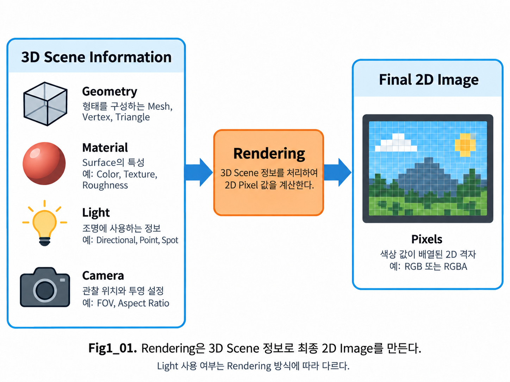

**Figure 1-1. Rendering converts 3D scene information into a final 2D image.**

Figure 1-1은 Rendering의 가장 기본적인 역할을 단순화하여 보여준다.

왼쪽에는 Rendering에 사용되는 대표적인 Scene 정보가 있다.

- **Geometry**
- **Material**
- **Light**
- **Camera**

Rendering 과정은 이러한 정보를 입력으로 받아 계산을 수행하고, 최종적으로 오른쪽과 같은 **2D Image**를 만들어 낸다.

그리고 이 Image를 구성하는 가장 기본적인 단위가 **Pixel**이다.

---

### Geometry

**Geometry**는 3D Object의 형태를 표현하는 Data다.

Character Modeling에서 우리가 다루는 Mesh 역시 Geometry의 한 종류다.

Mesh의 형태를 표현하려면 먼저 꼭짓점의 위치를 저장해야 한다. 이 꼭짓점을 **Vertex**라고 한다. 세 Vertex를 연결해 만든 삼각형 면이 **Triangle**이며, Mesh는 일반적으로 여러 Vertex와 Triangle의 연결로 구성된다.

컴퓨터는 이 입력 Data를 실제 계산으로 처리한다. **GPU(Graphics Processing Unit)**는 많은 Geometry와 화면 위치의 계산을 병렬로 처리하도록 설계된 Processor, 즉 계산 장치다. GPU는 Character라는 의미를 이해하기보다, 전달된 점과 면의 Data를 정해진 Program으로 처리한다.

그 계산이 수행되도록 프로그램의 상태와 작업 지시를 관리하는 장치가 **CPU(Central Processing Unit)**다. Rendering에서는 CPU와 Engine이 필요한 Data와 명령을 준비하고 GPU가 전달된 작업을 수행하는 기본 관계를 생각할 수 있다. 두 장치의 연결은 1.12에서 다시 살펴본다.

예를 들어 Blender에서 Character의 얼굴을 Modeling했다고 하더라도 GPU가 이를 단순히 "얼굴"이라는 하나의 물체로 이해하는 것은 아니다.

Rendering 과정에서는 Mesh를 구성하는 Vertex와 Triangle 같은 Geometry Data가 실제 처리 대상이 된다.

이때 Vertex는 단순히 공간상의 점 하나만을 의미하지 않는다.

Vertex가 어디에 있는지 나타내는 값은 **Position**이다. 하지만 Position만으로는 그 위치에 어떤 색이나 데이터를 사용할지, 빛을 어느 방향으로 받을지 알 수 없다. 이러한 목적을 위해 Vertex에 함께 연결하는 속성 Data를 **Vertex Attribute**라고 한다. `Attribute`는 계산에 사용할 개별 속성을 뜻한다.

방향을 이야기하려면 **Vector**라는 표현이 필요하다. Vector는 방향과 길이를 함께 가진 화살표로 생각할 수 있다. 표면이 어느 방향을 향하는지 나타내는 대표적인 방향 Data가 **Normal**이다. 여기서 Vertex에 저장한 Normal은 표면 표현에 사용할 방향이며, 실제 Triangle 평면에 수직인 방향과의 구분은 1.3에서 확인한다.

Surface의 위치에 따라 다른 색이나 값을 사용하려면 **Texture**가 필요하다. Texture는 위치별 Color 또는 계산용 Data를 저장해 두고, 필요한 위치에서 값을 읽는 자원이다. 그중 2D Texture의 어느 위치를 사용할지 나타내는 두 좌표가 **UV**다. `U`와 `V`는 두 좌표축의 이름이며 약어를 풀어 만든 명칭이 아니다.

**Tangent**는 Surface 위를 따라가는 기준 방향이고, **Vertex Color**는 Vertex마다 Color나 특정 효과에 사용할 Data를 저장하는 Attribute다. 이처럼 Position 외에도 Normal, UV, Tangent, Vertex Color 등 여러 정보가 함께 전달될 수 있다.

이러한 Vertex Data의 구조는 이후 **1.3 Vertex and Vertex Attributes**에서 자세히 살펴본다.

---

### Material

**Material**은 Surface가 어떻게 보일지를 결정하기 위해 필요한 정보를 제공한다.

피부와 금속이 다르게 보이는 이유를 계산하려면, 형태 외에 Surface의 특성을 알려줄 입력이 필요하다. 이 입력은 무엇을 표현하는지에 따라 역할이 달라진다.

- **Base Color**는 Surface의 기본 색을 제공한다.
- **Roughness**는 반사 표현에서 사용할 표면 거칠기를 나타낸다.
- **Metallic**은 금속성 해석에 사용할 Data다.
- **Normal**은 Surface 계산에 사용할 방향을 제공한다.
- **Texture**는 위치에 따라 달라지는 Color나 Data를 제공한다.
- **Opacity**는 표면의 불투명도를 표현하는 데 사용한다.
- **Emission**은 표면 자체의 발광 표현을 위한 출력에 연결된다.

이러한 입력을 이용해 Surface가 어떻게 보일지를 계산하는 일을 **Shading**이라고 한다. Material이 제공하는 모든 Data가 같은 계산에 사용되는 것은 아니다. 어떤 결과를 만들지는 해당 Rendering 작업과 Material의 목적에 따라 달라진다.

같은 Geometry를 사용하더라도 어떤 Material을 적용하느냐에 따라 금속처럼 보일 수도 있고, 피부처럼 보일 수도 있으며, Stylized Character처럼 표현할 수도 있다.

ASF, 즉 이 문서에서 구축할 Anime Shader Framework의 표면 표현도 이 역할과 연결된다. Anime Shader는 Anime의 표현 의도에 맞게 Surface 결과를 계산하는 Program이며, 뒤쪽 Chapter에서 반사 모델과 구현을 단계적으로 연결한다.

하지만 모든 Material이 동일한 방식으로 Light를 계산하는 것은 아니다.

**Lighting**은 Light와 Surface의 관계를 이용해 빛의 영향을 계산하는 과정이다. **Unlit Material**은 이 일반적인 Lighting 계산을 사용하지 않고 직접 Color를 출력하는 Material을 뜻한다.

따라서 Material은 Rendering 결과를 결정하는 중요한 요소이지만,

> **Material = Lighting**

또는

> **Rendering = Lighting**

으로 이해해서는 안 된다.

Lighting은 Rendering 과정 안에서 수행될 수 있는 여러 계산 중 하나다.

---

### Light

3D Scene에서 Object가 어떤 밝기와 색으로 보일지를 계산할 때 **Light** 정보가 사용될 수 있다.

Light에는 다음과 같은 여러 정보가 존재할 수 있다.

- Direction
- Position
- Color
- Intensity
- Range

이 입력 가운데 **Direction**은 빛이 오는 방향, **Position**은 광원의 위치, **Intensity**는 빛의 세기, **Range**는 영향을 고려할 범위를 뜻한다. Color는 빛의 색 정보다. 모든 종류의 Light가 이 입력을 같은 방식으로 사용하는 것은 아니다.

예를 들어 **Directional Light**는 광원의 위치보다 일정한 빛의 방향을 사용하는 Light다. Character의 오른쪽 위에서 비추고 있다면, Surface가 그 Light를 향하고 있는지 반대쪽을 향하고 있는지에 따라 Lighting 결과가 달라진다.

이후 Chapter의 여러 반사 모델도 이러한 Light와 Surface의 관계를 사용한다. **Shadow**는 Surface가 다른 Geometry에 가려져 Light의 영향을 직접 받지 못하는 상황과 연결된다. Camera에서 보이는가와 Light에 보이는가는 서로 다른 질문이며 1.10에서 구분한다.

다만 모든 Rendering 결과가 반드시 Light 계산을 필요로 하는 것은 아니다.

따라서 Light는 Rendering에서 매우 중요한 Scene Information 중 하나이지만, Rendering 전체 그 자체를 의미하지는 않는다.

---

### Camera

3D Scene은 공간 전체에 존재하지만 Monitor는 그 공간 전체를 동시에 보여주지 않는다.

어떤 위치에서 어느 방향으로 Scene을 바라볼 것인지 정해야 한다.

이 역할을 하는 것이 **Camera**다.

Camera는 단순히 촬영 위치만 결정하는 것이 아니다.

Camera의 Position은 관찰 위치이고, **Orientation**은 어느 방향으로 바라보는지 나타내는 자세다. 위치와 자세를 정한 뒤에도, 공간의 어느 범위를 화면에 대응시킬지 정해야 한다.

- **Field of View**는 Camera가 바라보는 시야의 각도 범위다.
- **Aspect Ratio**는 화면의 가로와 세로 비율이다.
- **Near / Far Range**는 Camera에 가까운 경계와 먼 경계로 고려할 공간 범위를 정한다.
- **Perspective Projection**은 가까운 부분을 크게, 먼 부분을 작게 보이도록 공간을 화면에 대응시키는 방식이다.
- **Orthographic Projection**은 거리에 따른 이러한 원근 크기 변화를 사용하지 않는 대응 방식이다.

여기서 **Projection**은 Camera가 관찰하는 공간 정보를 화면에 사용할 좌표 형태로 대응시키는 처리를 뜻한다. 두 방식의 수학적 관계는 Chapter 02에서 다룬다.

즉, 같은 3D Scene이라도 Camera가 어디에 있고 어떤 설정을 사용하는지에 따라 전혀 다른 2D Image가 만들어질 수 있다.

3D 공간의 Position이 Camera를 기준으로 어떻게 변환되고 최종 Screen 위치가 되는지는 Chapter 02의 **Coordinate System**에서 자세히 다룬다.

---

### Pixel

Rendering을 이해하려면 최종 결과인 **Pixel**의 의미도 함께 알아둘 필요가 있다.

**Pixel**은 **Picture Element**의 줄임말로, Digital Image를 구성하는 기본 단위다.

예를 들어 1920 × 1080 해상도의 화면은 다음과 같은 수의 Pixel을 가진다.

**1920 × 1080 = 2,073,600 Pixels**

즉, 하나의 Frame을 만든다는 것은 최종적으로 약 207만 개의 화면 위치에 어떤 값을 표시할 것인지 결정하는 것과 연결된다.

각 Pixel은 일반적으로 **RGB(Red, Green, Blue)**와 같은 Color 정보를 가진다. RGB는 Red, Green, Blue 세 색 성분으로 Color를 표현하는 방식이다. 이후 등장하는 **RGBA**는 RGB에 **Alpha** 성분을 더한 표현이며, Alpha는 해당 작업에서 불투명도나 혼합에 사용할 Data 등에 연결될 수 있다. 각 성분처럼 따로 저장하고 사용하는 값의 길을 **Channel**이라고 한다.

하지만 여기서 중요한 점이 있다.

**3D Mesh의 Triangle과 화면의 Pixel은 같은 것이 아니다.**

Triangle은 3D Geometry를 구성하는 요소이고, Pixel은 최종 2D Image를 구성하는 요소다.

따라서 Rendering 과정에서는

> **3D 공간의 Geometry가 화면의 어느 위치에 영향을 주는가**

를 계산하는 과정이 필요하다.

이 Geometry와 Pixel 사이의 연결이 Chapter 01에서 앞으로 살펴볼 Rendering Pipeline의 핵심 문제 중 하나다.

---

### Render and Renderer

Rendering과 함께 자주 등장하는 단어로 **Render**와 **Renderer**가 있다.

서로 비슷하게 보이지만 의미는 조금 다르다.

#### Render

**Render**는 Rendering을 수행한다는 의미의 동사로 사용될 수 있다.

예를 들어 다음과 같은 표현이 있다.

- Render the Scene
- Render a Frame
- Render an Image

또한 문맥에 따라 Rendering을 통해 만들어진 결과 Image를 가리키는 명사로 사용되기도 한다.

예를 들어 **Final Render**라고 하면 최종적으로 Rendering된 Image를 의미한다.

---

#### Renderer

**Renderer**는 Rendering을 수행하고 관리하는 System 또는 Software Component를 의미한다.

Unreal Engine 같은 Game Engine의 Renderer는 Scene 정보를 바탕으로 GPU가 필요한 Rendering 작업을 수행할 수 있도록 여러 과정을 관리한다.

예를 들어 다음과 같은 요소들이 Renderer와 관련된다.

- Geometry와 Material, Light처럼 Scene 결과를 만드는 입력과 계산
- Shadow처럼 빛이 가려지는 관계의 처리
- **Transparency**처럼 뒤의 Surface도 함께 보이도록 하는 투명 표현
- **Post Process**처럼 이미 계산한 화면 결과를 입력으로 다시 처리하는 작업
- **Render Target**처럼 계산 결과를 기록해 다음 작업에 사용할 개별 저장 대상

하지만 Renderer가 이 모든 계산을 하나의 거대한 과정으로 한 번에 수행하는 것은 아니다.

Rendering은 여러 단계로 나누어 처리되며, 각 단계가 서로 다른 문제를 담당한다.

이러한 단계들의 연결된 흐름을 **Rendering Pipeline**이라고 한다.

---

### Basic Rendering Flow

하나의 Triangle을 화면에 표시한다고 생각해 보자.

처음에는 Triangle을 구성하는 Vertex가 3D 공간 안에 존재한다.

하지만 Monitor에는 3D Coordinate라는 개념이 없다.

Monitor가 최종적으로 필요로 하는 것은

> **이 화면 위치에 어떤 Pixel 값을 표시할 것인가?**

라는 결과다.

따라서 GPU는 3D Geometry를 곧바로 Pixel로 바꾸는 것이 아니라 여러 단계를 거쳐 처리한다.

먼저 Vertex의 위치와 Attribute를 뒤의 처리에서 사용할 수 있도록 준비한다. 이 과정이 **Vertex Processing**이다. GPU에서 특정 Rendering 계산을 수행하는 Program을 **Shader**라고 하며, Vertex 입력을 처리하는 Program이 **Vertex Shader**다.

Vertex를 연결한 Triangle의 화면 위치를 알더라도 내부 전체를 바로 색칠할 수는 없다. 화면의 어떤 위치가 그 Triangle에 의해 덮이는지 찾아야 한다. 이 판정 과정을 **Rasterization**이라고 한다.

이렇게 찾은 위치에서 이후 Surface 계산에 사용할 후보 Data가 **Fragment**다. Fragment는 아직 Image에 남을 Pixel이 아니다. 해당 후보에서 Texture와 Material 등을 이용해 Surface 결과를 계산하는 작업이 **Fragment Processing**이다.

따라서 매우 단순화하면 다음과 같은 흐름으로 생각할 수 있다.

**3D Model  
→ Vertex Processing  
→ Triangle  
→ Rasterization  
→ Fragment Processing  
→ Pixel Result  
→ Final Image**

각 단계는 서로 다른 문제를 해결한다.

예를 들어 Vertex Processing에서는 Mesh를 구성하는 Vertex Data를 처리하고, Rasterization에서는 화면에 투영된 Triangle이 어느 Screen 영역에 영향을 주는지 판단한다.

이후 해당 Screen 위치에서 필요한 Surface 계산이 수행되고, 최종적으로 화면에 남을 결과가 결정된다.

이처럼 Rendering을 여러 단계로 나누어 처리하는 전체 구조를 **Rendering Pipeline**이라고 한다.

현재는 각 단계의 이름을 정확히 외울 필요는 없다.

앞으로의 절에서는 이 흐름을 처음부터 하나씩 따라가며,

**3D Mesh가 어떤 과정을 거쳐 최종 Screen의 Pixel이 되는지**

순서대로 살펴본다.

다음 절에서는 먼저 전체 Pipeline을 멀리서 바라보며 **Model에서 Screen까지 Data가 어떻게 이동하는지** 큰 흐름을 정리한다.

---

## 1.2 From Model to Screen

앞 절에서 Rendering은 Scene 정보를 이용해 Image를 만드는 일이라고 설명했다. 이제 완성된 Character Mesh 하나가 GPU에 입력되었다고 생각해 보자. GPU는 Mesh라는 하나의 이름을 받아 곧바로 완성된 Image를 내놓는가?

그렇게 처리하려면 서로 다른 질문을 한 번에 해결해야 한다. 꼭짓점은 어디에 놓이는가, 어떤 꼭짓점들이 면을 만드는가, 그 면은 화면 어디를 덮는가, 겹친 면 가운데 무엇이 보이는가를 구분해야 한다.

각 질문에서 사용하는 Data도 다르다. 처음에는 Vertex의 위치와 속성을 사용하지만, 화면 위치를 찾은 다음에는 그 위치에서 사용할 Surface 입력과 결과가 필요하다. 따라서 **Stage**, 즉 특정 문제를 맡은 처리 단계로 작업을 나눈다.

이번 절에서는 각 Stage의 입력과 출력을 먼저 따라간다. 이후 1.3–1.11에서 같은 연결을 더 자세히 살펴볼 것이므로, 현재는 **Data가 어디에서 어떤 형태로 바뀌는지**에 집중하면 된다.

---

### 3D Model

Rendering Pipeline의 시작점에는 **3D Model**이 있다.

예를 들어 Character Mesh를 생각해 보자.

Modeling Tool에서는 이것을 하나의 Character Object로 보고 작업하지만, GPU가 Rendering을 수행할 때는 보다 구체적인 Geometry Data를 사용한다.

대표적으로 다음과 같은 Data가 포함된다.

- Vertex Position
- Normal
- UV
- Tangent
- Vertex Color
- **Index Data** — 특정 Vertex를 가리키는 번호들의 연결 정보

즉, GPU가 받는 것은 단순히

> "이것은 Character다."

라는 정보가 아니다.

Mesh를 구성하는 각 Vertex의 위치와 Attribute, 그리고 어떤 Vertex들이 서로 연결되어 Triangle을 만드는지에 대한 Data를 받는다. 그 연결에서 특정 Vertex를 가리키는 번호가 **Index**다. Index Data는 형태의 이름이 아니라, 어떤 입력을 함께 사용할지 알려준다.

이러한 Vertex와 Vertex Attribute의 정확한 의미는 다음 절인 **1.3 Vertex and Vertex Attributes**에서 자세히 다룬다.

---

### Vertex Processing

Rendering Pipeline에서 Geometry Data가 들어오면 먼저 Vertex 단위의 처리가 이루어진다.

이 단계를 단순화하여 **Vertex Processing**이라고 부를 수 있다.

각 Vertex는 독립적인 Data를 가지고 있으며 GPU는 이러한 Vertex들을 처리한다.

같은 Mesh를 Scene의 서로 다른 곳에 두면, 저장된 Vertex Position이 같아도 화면 위치는 달라져야 한다. 따라서 저장된 Position의 기준만으로 화면 위치를 정할 수 없다.

Position을 어떤 기준에서 표현하는지 정하는 공간이 **Coordinate Space**다. Mesh 내부 위치처럼 Object 자체를 기준으로 한 표현은 **Local Space**라고 한다. Scene 전체의 공통 기준은 **World Space**이며, Camera의 관찰 기준으로 표현하는 공간은 **View Space**다. 하나씩 기준을 바꾸며 같은 Vertex를 화면에 사용할 형태로 표현한다.

이처럼 위치·회전·크기와 표현 기준의 관계를 반영해 값을 바꾸는 처리가 **Transform**이다. **Coordinate Transformation**은 서로 다른 Coordinate Space 사이에서 값을 변환하는 과정을 뜻한다. Vertex Shader는 필요한 이러한 처리를 수행해 다음 단계의 Position을 준비한다.

하지만 화면에 표시하려면

- Object가 World의 어디에 있는지
- Camera가 어디에서 Scene을 보고 있는지
- 어떤 Projection을 사용하는지

와 같은 정보를 고려해야 한다.

이러한 Coordinate Transformation은 Rendering Pipeline에서 매우 중요하지만, 수학적인 내용은 Chapter 02에서 별도로 다룬다.

현재는 다음 정도만 이해하면 된다.

> **Vertex Processing은 Mesh를 구성하는 각각의 Vertex를 Rendering에 필요한 형태로 처리하는 단계다.**

---

### Primitive Assembly

Vertex를 각각 처리했다고 해서 아직 화면에 표시할 Surface가 만들어진 것은 아니다.

Surface를 구성하려면 Vertex들이 서로 연결되어야 한다.

처리된 Vertex의 목록만으로는 어떤 점들이 한 면을 만드는지 알 수 없다. 연결 관계를 따라 Vertex를 묶어야 GPU가 처리할 도형이 된다.

이 기본 도형 단위를 **Primitive**라고 한다. Point, Line, Triangle이 대표적인 예이며, 여기서는 Surface를 표현하는 Triangle을 중심으로 살펴본다. GPU는 Vertex와 Index Data를 이용하여 여러 Vertex를 묶고 Primitive를 구성한다.

실시간 3D Rendering에서 가장 대표적인 Primitive는 **Triangle**이다.

예를 들어 세 개의 Vertex가 있다면 다음과 같이 하나의 Triangle을 구성할 수 있다.

**Vertex A  
+ Vertex B  
+ Vertex C  
→ Triangle**

이처럼 처리된 Vertex들을 이용해 Primitive를 구성하는 단계를 **Primitive Assembly**라고 한다. 입력은 처리된 Vertex와 그 연결 관계이고, 출력은 이후 Geometry 처리에 사용할 Triangle 같은 Primitive다.

여기서 연결 관계를 저장한 Data는 어디에 있는가? 이후 작업이 읽을 Data를 담아두는 저장 공간을 **Buffer**라고 한다. **Vertex Buffer**에는 Vertex와 Attribute Data가, **Index Buffer**에는 Vertex를 선택할 번호들이 저장된다. 이 저장 역할과 Indexed / Non-indexed Draw의 차이는 1.5에서 자세히 확인한다.

왜 Real-time Rendering에서 Triangle을 기본 단위로 사용하는지, 그리고 Primitive가 정확히 무엇을 의미하는지는 **1.5 Primitive Assembly**에서 자세히 살펴본다.

---

### Culling / Clipping

모든 Triangle을 끝까지 Rendering할 필요는 없다.

일부 Triangle은 Camera에서 보이지 않을 수 있고, 일부는 Camera가 볼 수 있는 영역의 바깥에 위치할 수 있다.

이러한 Geometry를 그대로 뒤의 Stage까지 처리하면 불필요한 계산이 늘어난다.

따라서 Rendering Pipeline에서는 보이지 않거나 유효하지 않은 Geometry를 제거하거나 잘라내는 과정이 필요하다.

대표적인 과정이 **Culling**과 **Clipping**이다.

#### Culling

Culling은 특정 조건을 기준으로

> **이 Geometry는 더 이상 Rendering할 필요가 없다.**

고 판단하여 제거하는 과정이다.

대표적인 예가 **Backface Culling**이다.

Triangle의 뒷면이 Camera를 향하고 있다면 일반적인 Surface Rendering에서는 해당 Triangle을 그리지 않을 수 있다.

---

#### Clipping

Clipping은 Geometry 전체를 단순히 제거하는 것이 아니라, 유효한 영역과 그렇지 않은 영역의 경계에 걸친 Geometry를 잘라내는 과정이다.

예를 들어 Triangle의 절반은 Camera가 볼 수 있는 영역 안에 있고 나머지 절반은 밖에 있다고 생각해 보자.

이 경우 Triangle 전체를 제거하면 안 된다.

화면 안에 들어오는 부분은 Rendering해야 한다.

따라서 경계 밖의 부분을 잘라내고 유효한 영역만 남긴다.

Culling과 Clipping은 이름이 비슷하게 느껴질 수 있지만 역할은 다르다.

> **Culling은 불필요한 Geometry를 제거하고,  
> Clipping은 경계에 걸친 Geometry를 잘라 유효한 부분을 남긴다.**

이 두 과정은 **1.6 Culling and Clipping**에서 자세히 다룬다.

---

### Rasterization

여기까지의 과정은 여전히 주로 **Geometry**를 다루고 있다.

하지만 최종적으로 우리가 만들어야 하는 것은 Geometry가 아니라 **2D Image**다.

따라서 어느 순간부터는

> **이 Triangle이 Screen의 어느 위치에 영향을 주는가?**

를 계산해야 한다.

이 역할을 하는 핵심 과정이 **Rasterization**이다.

Rasterization은 Screen에 투영된 Triangle을 기준으로, 해당 Triangle이 화면의 어떤 위치를 덮고 있는지 판단한다. 여기서 판정에 사용할 대표 위치가 **Sample**이며, Triangle이 그 위치를 덮는가에 대한 결과를 **Coverage**라고 한다.

입력은 화면에 대응된 Triangle이고, 출력은 Coverage를 만족한 위치와 그 위치에서 이후 처리할 Fragment다. 아직 Surface의 Color를 계산하거나 최종 Pixel을 확정한 것은 아니다.

예를 들어 하나의 Triangle이 Screen 위에 다음과 같이 놓여 있다고 생각해 보자.

Triangle의 경계 안에 포함되는 Screen 위치들이 있다.

GPU는 Rasterization 과정을 통해 이러한 위치들을 찾아낸다.

이때 중요한 점은

> **Triangle이 곧바로 Pixel로 변환되는 것은 아니다.**

라는 것이다.

Rasterization을 통해 Triangle이 영향을 주는 Screen 위치가 결정되고, 이후 각 위치에 대해 추가적인 Rendering 계산이 수행된다.

이 과정에서 등장하는 중요한 개념이 **Fragment**다.

Fragment는 이후 절에서 자세히 설명하지만, 지금 단계에서는

> **Rasterization 결과로 생성되는 Pixel 후보에 가까운 개념**

이라고 생각하면 된다.

Rasterization은 Geometry 중심의 처리에서 Screen 중심의 처리로 넘어가는 매우 중요한 경계다.

따라서 Chapter 01에서도 별도의 절인 **1.7 Rasterization**에서 자세히 살펴본다.

---

### Interpolation

Triangle은 세 개의 Vertex로 구성된다.

각 Vertex에는 Position뿐 아니라 UV, Normal, Vertex Color와 같은 여러 Attribute가 들어 있을 수 있다.

하지만 Rasterization 이후에는 Triangle 내부의 수많은 Fragment 위치에서 이러한 값들이 필요하다.

문제가 하나 생긴다.

Vertex에는 UV 값이 있지만 Triangle 중앙에는 별도의 Vertex가 없을 수 있다.

그렇다면 Triangle 내부 위치에서는 어떤 UV 값을 사용해야 할까?

GPU는 세 Vertex가 가진 값을 이용하여 Triangle 내부의 각 위치에 필요한 값을 계산한다.

이 과정을 **Interpolation**이라고 한다.

예를 들어 Triangle의 세 Vertex에 서로 다른 Color가 있다면, Triangle 내부에서는 이 값들이 부드럽게 섞인 결과를 얻을 수 있다.

같은 원리로 다음과 같은 값들도 Fragment 위치에 전달될 수 있다.

- UV
- Normal
- Vertex Color
- 기타 Vertex에서 전달된 Attribute

**Texture Sampling**은 사용할 UV를 받아 Texture의 해당 위치에서 값을 읽는 과정이다. Interpolation은 그 UV를 준비하고, Sampling은 준비된 UV로 저장된 값을 읽는다. 따라서 Interpolation은 Texture Sampling과 Surface Shading을 이해하는 데 매우 중요한 개념이다.

따라서 **1.8 Interpolation**에서 별도로 자세히 다룬다.

---

### Fragment Processing

Rasterization을 통해 Fragment가 생성되고 필요한 값이 Interpolation되면, 각 Fragment에서 Surface의 최종 결과를 계산할 수 있다.

이 과정을 여기서는 **Fragment Processing**이라고 부른다.

이 입력을 계산하는 Program이 **Fragment Shader**다. 프로그램이 Graphics 기능을 요청하는 정해진 인터페이스를 **API(Application Programming Interface)**라고 한다. Direct3D API에서는 같은 역할의 Stage를 **Pixel Shader**라고 부른다. `Pixel Processing`이라는 표현도 이 화면 위치의 Surface 계산과 연결해서 사용된다.

이름에 Pixel이 들어 있어도 이미 완성된 Image의 Pixel을 읽어 수정한다는 뜻은 아니다. Rasterization과 Interpolation으로 준비한 Fragment 입력을 받아 Surface 결과를 출력한다.

이 단계에서는 Material과 관련된 다양한 계산이 수행될 수 있다.

예를 들어

- Texture Sampling
- Base Color 계산
- Normal 사용
- Lighting 계산
- Emission 계산

등이 여기에 연결될 수 있다.

하지만 Fragment에서 계산이 끝났다고 해서 반드시 그 결과가 최종 Image에 남는 것은 아니다.

같은 Screen 위치에 여러 Surface가 겹쳐 있을 수 있기 때문이다.

따라서 어떤 Surface가 실제 Camera에 보이는지 판단하는 과정이 추가로 필요하다.

---

### Depth Test

Camera에서 같은 Screen 위치를 바라보더라도 서로 다른 거리의 Surface가 겹쳐 있을 수 있다.

예를 들어 Character가 Wall 앞에 서 있다면, 특정 Screen Pixel 방향에는

- Character Surface
- Wall Surface

가 동시에 존재할 수 있다.

하지만 최종 화면에서는 일반적으로 Camera에 더 가까운 Surface가 보여야 한다.

이러한 앞뒤 관계를 판단하기 위해 **Depth** 정보를 사용한다. Depth는 같은 Screen 위치에서 Surface가 Camera 기준으로 앞인지 뒤인지 판단하는 값이며, 단순한 World Space 거리와 반드시 같은 값은 아니다.

그리고 Fragment의 Depth를 기존에 저장된 Depth와 비교하여 해당 Fragment가 결과에 기여할 수 있는지 판단하는 과정을 **Depth Test**라고 한다. Camera에서 어떤 Surface가 실제로 보이는가에 대한 관계는 **Surface Visibility**라고 한다. 여기서는 앞쪽의 불투명한 Surface가 뒤쪽을 가리는 기본 상황을 먼저 생각한다.

매우 단순화하면 다음과 같이 생각할 수 있다.

**Camera에 가까운 Surface  
→ 화면에 남음**

**뒤에 가려진 Surface  
→ 제거됨**

기존 판정값을 다음 Fragment에서도 사용하려면 그 값을 저장해야 한다. 위치별 Depth를 저장하는 Buffer가 **Depth Buffer**, 또는 **Z-Buffer**다. Z-Buffer라는 이름은 앞뒤 방향을 Z축과 연결하는 관례에서 왔으며, World Space의 Z 좌표를 그대로 저장한다는 뜻은 아니다.

Depth와 Depth Test는 **1.10 Depth Test and Surface Visibility**에서 자세히 살펴본다.

---

### Framebuffer

여러 Rendering Stage를 거쳐 최종적으로 살아남은 Color 결과는 어디엔가 저장되어야 한다.

Color와 Depth는 서로 다른 목적의 Data다. Color는 Image를 구성하는 데, Depth는 이후 앞뒤 비교에 사용하므로 각각 저장할 대상이 필요하다.

이러한 여러 저장 대상을 함께 사용하도록 구성한 집합 또는 연결 구조가 **Framebuffer**다. Framebuffer는 하나의 Color 값이나 개별 Texture 이름이 아니라, 현재 Rendering 작업이 어떤 저장 대상을 사용할지 연결하는 관계다.

예를 들어 Color 결과가 저장되는 **Color Buffer**가 있을 수 있다.

Rendering 과정에서 계산된 결과들이 이곳에 기록되고, 최종적으로 화면에 표시할 Image를 구성하게 된다.

결과를 기록하는 개별 Texture나 Surface는 **Render Target**이라고 한다. 여러 Render Target과 Depth Buffer를 함께 구성해 사용할 수 있다.

어떤 작업은 최종 Lighting Color 대신 Normal이나 Material Data를 먼저 기록한다. 이 Surface 정보를 뒤의 Lighting 계산에서 소비하는 방식이 **Deferred Rendering**이다. 이때 후속 계산에 필요한 Geometry / Surface 정보를 저장하는 Buffer 묶음을 **GBuffer(Geometry Buffer)**라고 한다. 지금은 계산 결과가 다음 계산의 입력으로 저장될 수 있다는 관계만 확인하고, 구조의 차이는 1.11과 Chapter 06에서 이어서 살펴본다.

하지만 Chapter 01에서는

> **Rendering 결과가 최종 Image가 되기 전에 Buffer에 저장된다.**

라는 기본 개념을 먼저 이해하면 충분하다.

Framebuffer는 **1.11 Framebuffer and Final Image**에서 다시 자세히 다룬다.

---

### Final Image

Rendering Pipeline의 여러 단계를 거쳐 최종적으로 하나의 2D Image가 만들어진다.

이 결과가 우리가 Monitor에서 보는 하나의 **Frame**이다.

게임은 이 과정을 한 번만 수행하지 않는다.

Scene과 Character가 움직이고 Camera가 변하면 새로운 Image를 계속 만들어야 한다.

예를 들어 **FPS(Frames Per Second)**는 1초에 만들어지거나 표시되는 Frame 수를 표현한다. 60 FPS의 게임에서는 이상적으로 1초 동안 약 60개의 Frame을 생성하고 표시한다.

따라서 Real-time Rendering은

> **3D Scene에서 하나의 Image를 만드는 문제**

이면서 동시에

> **이 과정을 매우 빠르게 반복해야 하는 문제**

이기도 하다.

이 때문에 Rendering Pipeline의 각 Stage가 얼마나 많은 Data를 처리하는지 이해하는 것은 이후 Optimization을 공부할 때도 매우 중요하다.

---

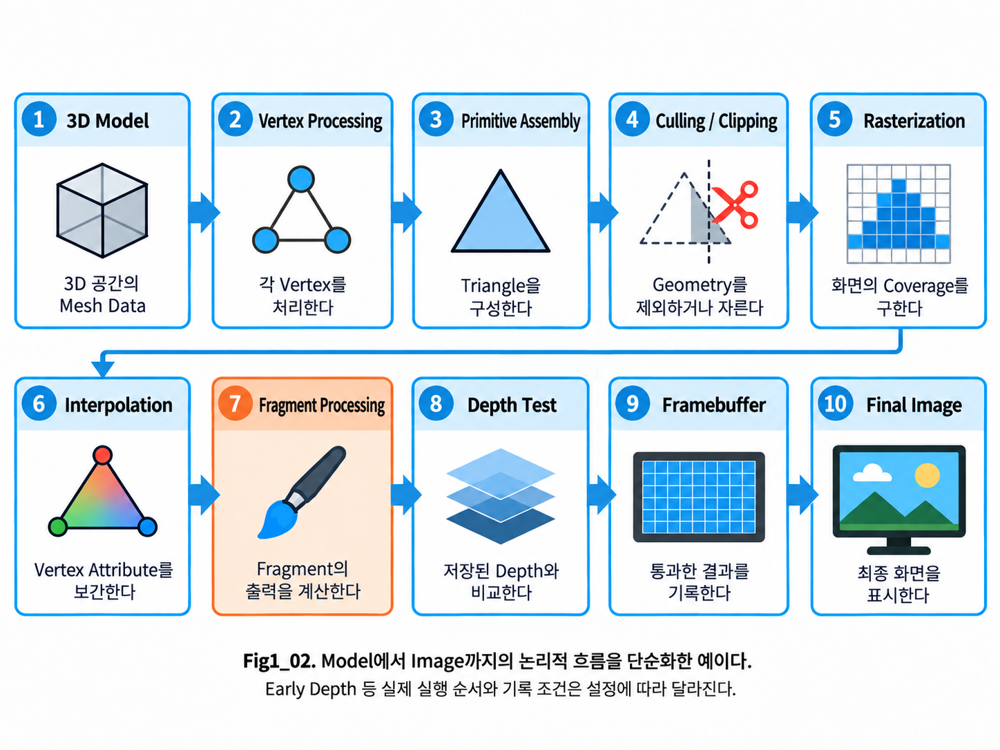

**Figure 1-2. A simplified view of the rendering pipeline from 3D model to final image.**

Figure 1-2는 Rasterization-based Rendering Pipeline의 기본 흐름을 단순화하여 보여준다.

Figure의 이름을 지금 모두 외울 필요는 없다. 위에서 살펴본 Stage를 왼쪽의 Mesh Data부터 다시 따라가 보자. 화면의 Surface 후보와 저장 결과로 이어지는 방향을 확인하면 각 명칭이 어떤 문제를 해결했는지 연결할 수 있다.

Implementation Note — a logical pipeline overview

실제 GPU Rendering Pipeline은 API, Hardware, Rendering Technique에 따라 더 많은 Stage와 세부 과정을 포함할 수 있다. API는 앞서 소개한 Graphics 기능의 인터페이스다. 그림은 각 Data의 의존 관계를 설명하는 기본 개요이며, 모든 Hardware의 실행 순서를 고정하는 설명은 아니다.

이 흐름에서 중요한 것은 각 단계의 이름을 암기하는 것이 아니다.

각 Stage를 지나면서

- 어떤 Data가 들어오는지
- 어떤 Data가 새롭게 만들어지는지
- 무엇이 제거되는지
- 다음 Stage로 무엇이 전달되는지

를 이해하는 것이 중요하다.

---

### From Geometry to Screen

지금까지의 전체 흐름을 다시 단순하게 나누어 보면 Rendering Pipeline은 크게 두 영역으로 생각할 수 있다.

#### Geometry Processing

**3D Model  
→ Vertex Processing  
→ Primitive Assembly  
→ Culling / Clipping**

이 구간에서는 주로 3D Geometry를 처리한다.

---

#### Screen Processing

**Rasterization  
→ Interpolation  
→ Fragment Processing  
→ Depth Test  
→ Framebuffer  
→ Final Image**

Rasterization을 기점으로 Geometry가 Screen의 위치와 연결되기 시작하고, 이후에는 Fragment와 Pixel Result를 중심으로 계산이 진행된다.

이 구분은 앞으로 Rendering을 이해하는 데 매우 유용하다.

예를 들어

- Vertex 수가 너무 많을 때 발생하는 문제
- Pixel Shader가 너무 복잡할 때 발생하는 문제

는 모두 GPU Performance 문제지만, Rendering Pipeline에서 발생하는 위치는 서로 다르다.

따라서 Rendering Optimization을 이해하려면 먼저

> **현재 비용이 Geometry 쪽에서 발생하는지, Screen / Pixel 쪽에서 발생하는지**

구분할 수 있어야 한다.

---

### Understanding the Overall Flow

이번 절에서 소개한 개념들은 이후 각각 별도의 절에서 다시 자세히 살펴본다.

현재 단계에서는 모든 용어의 세부 동작을 완전히 이해할 필요는 없다.

지금까지 설명한 Stage를 이름으로 연결하면 다음과 같다.

**3D Model  
→ Vertex Processing  
→ Primitive Assembly  
→ Culling / Clipping  
→ Rasterization  
→ Interpolation  
→ Fragment Processing  
→ Depth Test  
→ Framebuffer  
→ Final Image**

우선 다음 연결 관계를 머릿속에 만들어 두는 것이 중요하다.

**Mesh의 Vertex Data를 처리한다.**

↓

**Vertex를 연결하여 Triangle을 만든다.**

↓

**필요하지 않은 Geometry를 제거하거나 잘라낸다.**

↓

**Triangle이 Screen의 어느 영역을 덮는지 찾는다.**

↓

**Triangle 내부 위치에 필요한 값을 계산한다.**

↓

**각 Fragment의 Surface 결과를 계산한다.**

↓

**어떤 Surface가 실제로 보이는지 판단한다.**

↓

**살아남은 결과를 Buffer에 저장한다.**

↓

**최종 Image가 화면에 표시된다.**

이제 다음 절에서는 이 흐름의 시작점으로 돌아가,

**GPU가 처리하는 Vertex가 정확히 무엇이며, 하나의 Vertex가 실제로 어떤 Data를 가지고 있는지**

부터 자세히 살펴본다.

---

## 1.3 Vertex and Vertex Attributes

Modeling Tool에서 Cube의 모서리를 선택하면 하나의 점을 선택한 것처럼 보인다. 그런데 같은 점이 한쪽 Face에서는 다른 Texture 위치를 사용하고, 다른 Face에서는 다른 방향으로 빛을 받아야 한다면 어떻게 할까?

앞 절에서 Vertex를 Mesh의 꼭짓점이자 GPU에 전달되는 Data 단위로 소개했다. 이번 절에서는 **그 위치에 어떤 Data를 함께 연결해야 Surface를 계산할 수 있는가**를 살펴본다.

Position은 형태의 위치를 알려주지만 Texture를 읽을 위치나 Shading의 방향까지 알려주지 않는다. 그 목적은 UV와 Normal 같은 서로 다른 Vertex Attribute가 담당한다. 이 Attribute의 의미를 하나씩 구분하면, 같은 Position에서도 Rendering용 Vertex가 분리될 수 있는 이유를 이해할 수 있다.

입력은 Mesh의 Vertex와 각 Attribute다. 여기서 확인한 Data 묶음은 다음 절의 Vertex Shader에 전달되므로, 각 값의 역할을 알고 다음 계산으로 넘어가는 것이 중요하다.

> **Vertex는 하나의 위치를 포함하여 Rendering에 필요한 여러 Attribute를 함께 가진 Data 단위다.**

---

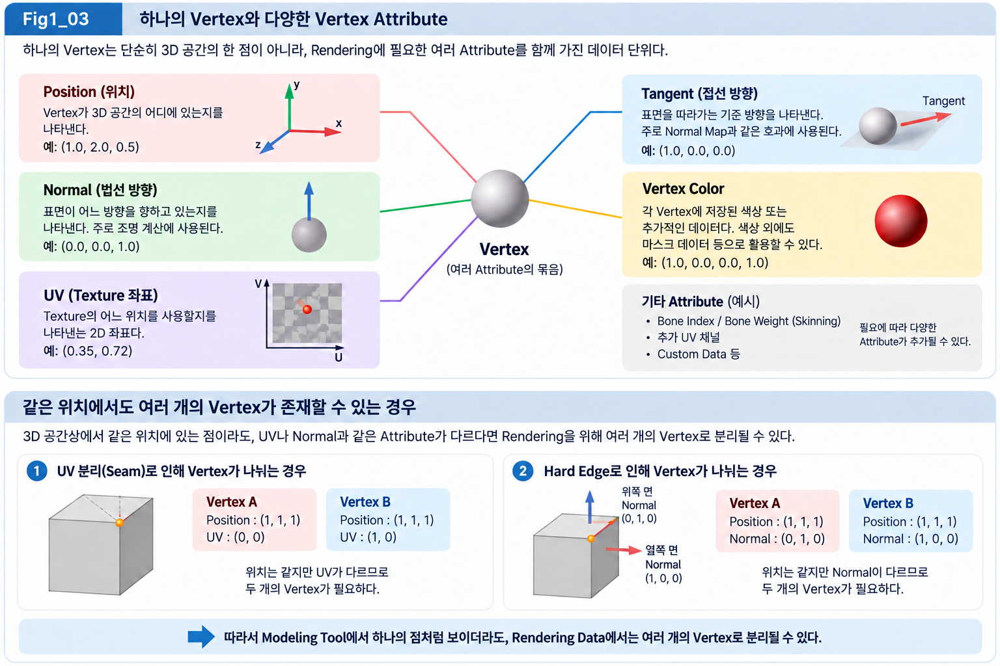

**Figure 1-3. A vertex contains multiple attributes used in rendering.**

Figure 1-3의 위쪽은 하나의 Vertex가 여러 종류의 Attribute를 함께 가질 수 있다는 점을 보여준다.

대표적인 Vertex Attribute에는 다음과 같은 것들이 있다.

- Position
- Normal
- UV
- Tangent
- Vertex Color

아래쪽 그림은 Modeling Tool에서 하나의 점처럼 보이는 위치가 Rendering Data에서는 반드시 하나의 Vertex로만 존재하는 것은 아니라는 점을 보여준다.

UV나 Normal과 같은 Attribute가 달라져야 한다면 같은 Position에서도 여러 Vertex가 필요할 수 있다.

이 차이는 Modeler와 Technical Artist 모두에게 매우 중요한 개념이다.

---

### Vertex as a Data Unit

먼저 Modeling 관점에서 Vertex를 생각해 보자.

Cube를 만들면 Corner마다 점이 존재하고, 이 점들을 Edge가 연결하며, 여러 Edge가 Face를 구성한다.

이 관점에서는 다음과 같이 생각하기 쉽다.

> **Vertex = 3D 공간상의 점**

Geometry의 형태를 설명하는 관점에서는 충분히 맞는 설명이다.

하지만 GPU는 단순히 점의 위치만 받아서 Surface를 Rendering할 수 없다.

예를 들어 하나의 Character Mesh에서 특정 Vertex가 있다고 생각해 보자.

GPU가 해당 Vertex를 처리하기 위해 필요한 정보는 Position 하나만이 아닐 수 있다.

그 Vertex에는 다음과 같은 Data가 연결될 수 있다.

~~~text
Vertex A

Position     = (1.0, 2.0, 0.5)
Normal       = (0.0, 0.0, 1.0)
UV           = (0.35, 0.72)
Tangent      = (1.0, 0.0, 0.0)
Vertex Color = (1.0, 0.0, 0.0, 1.0)
~~~

이렇게 하나의 Vertex와 함께 저장되거나 전달되는 각각의 Data를 **Attribute**라고 한다.

따라서 Rendering Pipeline의 관점에서는 Vertex를

> **Position을 포함한 여러 Attribute의 묶음**

으로 이해하는 것이 좋다.

---

### Attribute

**Attribute**는 일반적으로 어떤 대상이 가지고 있는 **속성 또는 특성**을 의미한다.

Rendering에서 **Vertex Attribute**라고 하면 각 Vertex에 연결되어 GPU의 계산에 사용되는 Data를 의미한다.

여기서 Attribute는 단순한 설명용 Metadata가 아니다.

GPU가 Rendering 과정에서 실제로 읽고 계산에 사용하는 입력값이다.

예를 들어

- Position은 Vertex가 어디에 있는지를 알려주고,
- Normal은 Surface의 방향을 알려주며,
- UV는 Texture의 어느 위치를 사용할지 알려주고,
- Tangent는 Texture에 저장한 방향 Data를 Surface에 대응시킬 때 필요한 기준 방향을 제공하며,
- Vertex Color는 Vertex마다 Color나 Mask 값을 저장할 수 있게 해준다.

각 Attribute는 서로 다른 목적을 가지고 있지만 하나의 Vertex Data 안에서 함께 사용될 수 있다.

따라서 Vertex Attribute라는 말을 접했을 때는 단순히

> "Vertex의 부가 정보"

라고 생각하기보다

> **Vertex와 함께 GPU에 전달되어 Rendering 계산에 사용되는 Data**

라고 이해하는 것이 더 정확하다.

---

### Position

**Position**은 Vertex가 공간의 어디에 존재하는지를 나타낸다.

예를 들어 다음 Position을 가진 Vertex가 있다고 하자.

~~~text
Position = (1.0, 2.0, 0.5)
~~~

이 값은 X, Y, Z 세 축을 기준으로 Vertex의 위치를 나타낸다.

다만 여기서 중요한 점은 이 Position이 항상 World Space의 위치를 의미하는 것은 아니라는 것이다.

Mesh에 저장되어 있는 Vertex Position은 일반적으로 Object 또는 Local Space를 기준으로 표현된다.

Rendering 과정에서는 이 Position이 이후 여러 Coordinate Space를 거쳐 변환된다.

Camera가 고려할 영역의 경계에서 Geometry를 자르려면 그 판정에 사용할 좌표 형태가 필요하다. 이 목적의 표현이 **Clip Space**다. 이후 화면 위치로 대응하기 전에 거치는 표현이며, Clip Space가 최종 Pixel 좌표라는 뜻은 아니다.

예를 들어 다음과 같은 흐름을 거칠 수 있다.

~~~text
Local Space
→ World Space
→ View Space
→ Clip Space
→ Screen
~~~

이 Coordinate Transformation은 Chapter 02에서 자세히 다룬다.

Chapter 01에서는 우선 Position이

> **Geometry의 형태를 결정하는 가장 기본적인 Vertex Attribute**

라는 점을 기억하면 된다.

---

### Normal

Position이 같아도 Surface의 방향이 다르면 빛을 받는 모습이 달라진다. 바닥과 벽을 같은 Light 아래에 두면 이 차이를 떠올리기 쉽다. 따라서 Surface의 Shading 방향을 알려줄 Data가 필요하다.

앞 절에서 소개한 **Normal**은 이 방향을 표현하는 Vector다. Vertex에 저장한 Normal은 해당 Vertex 주변에서 Shading에 사용할 Surface 방향을 알려준다.

Normal은 특히 Lighting 계산에서 매우 중요하다.

예를 들어 Light가 Surface를 정면에서 비추는지, 비스듬하게 비추는지 판단하려면 Surface가 어느 방향을 향하고 있는지를 알아야 한다.

이때 사용하는 대표적인 Data가 Normal이다.

하나의 Vertex에 저장된 Normal을 **Vertex Normal**이라고 한다.

~~~text
Normal = (0.0, 0.0, 1.0)
~~~

이 값은 해당 Vertex 주변에서 Shading에 사용할 Surface 방향을 표현한다.

Triangle 자체의 평면에 수직인 방향은 **Geometric Normal**이라고 한다. Lighting에 사용하는 방향은 **Shading Normal**이라고 하며, 두 방향이 항상 같아야 하는 것은 아니다.

Vertex Normal은 부드러운 Shading을 위해 인접 Surface의 방향을 반영할 수 있다. 따라서 모든 Triangle의 평면에 정확히 수직이어야 하는 것은 아니다. 이 구분은 1.8의 Smooth Shading과 Chapter 03으로 이어진다.

Normal은 Position처럼 위치를 나타내는 값이 아니라 **방향을 나타내는 Vector**라는 점도 중요하다.

두 방향이 얼마나 같은 쪽을 향하는지 숫자로 나타내는 계산이 **Dot Product**다. Normal의 정확한 의미와 Dot Product를 이용한 Lighting 계산은 Chapter 03에서 더 자세히 다룬다.

현재는 다음 정도로 이해하면 된다.

> **Position은 Vertex가 어디에 있는지를 나타내고, Normal은 그 Surface가 어느 방향을 향하는지를 나타낸다.**

---

### UV

Character의 옷에 줄무늬 Texture가 있다고 생각해 보자. Vertex Position은 옷의 형태를 정하지만, 줄무늬의 어느 위치를 옷의 어느 부분에 놓을지 알려주지는 않는다.

이 연결을 위한 좌표가 **UV**다. UV는 Texture의 어느 위치를 사용할 것인지 나타낸다. 여기서 **Coordinate**는 정해진 기준축에서 위치를 숫자로 표현한 값이다.

3D Geometry는 X, Y, Z 축을 사용하지만 Texture는 일반적으로 2D Image이므로 두 개의 Coordinate를 사용한다.

이때 보통 사용하는 이름이 **U**와 **V**다.

예를 들어 하나의 Vertex가 다음 UV를 가질 수 있다.

~~~text
UV = (0.25, 0.75)
~~~

이 값은 Texture의 특정 위치와 연결된다.

Triangle의 각 Vertex에 UV가 존재하면 이후 GPU는 Triangle 내부에서도 적절한 UV 값을 계산하여 Texture를 Sample할 수 있다.

여기서 매우 중요한 개념이 이후에 다룰 **Interpolation**이다.

즉,

~~~text
Vertex UV
→ Interpolation
→ Fragment UV
→ Texture Sampling
~~~

이라는 흐름으로 이어진다.

따라서 UV는 단순히 Modeling Tool에서 Unwrap할 때 사용하는 정보가 아니라, Rendering Pipeline 안에서 실제로 전달되고 사용되는 Vertex Attribute다.

---

### Tangent

**Tangent**는 Surface를 따라가는 기준 방향을 나타내는 Vector다.

특히 Texture로 Lighting 방향의 세부 표현을 만들 때 중요한 역할을 한다.

**Normal Mapping**은 Geometry를 더 늘리지 않고 Texture에 저장한 방향 Data를 이용해 Lighting에 사용할 Normal을 세밀하게 바꾸는 방법이다. 이 방향 Data를 담은 Texture가 **Normal Map**이다.

Normal Map에 저장된 Normal 방향은 일반적으로 Mesh의 World Space 방향을 직접 저장하는 것이 아니다. 그 방향이 어느 기준에서 표현되어 있는지를 알아야 실제 Surface 계산에 사용할 수 있다.

Normal Map의 방향은 Surface를 기준으로 한 **Tangent Space**에서 표현되는 경우가 많다. Tangent Space는 표면을 따라가는 기준 방향과 Normal 방향으로 구성한 지역적인 좌표 기준이다. 같은 Texture Data라도 Surface가 Scene에서 어느 방향으로 놓였는지에 맞게 해석해야 Lighting 방향으로 사용할 수 있다.

이 Tangent Space를 구성하기 위해 대표적으로 다음 방향들이 사용된다.

- Normal
- Tangent
- **Bitangent** — Surface 위에서 Tangent와 함께 두 번째 기준 방향을 제공하는 Vector

Normal이 Surface 바깥쪽 방향을 나타낸다면 Tangent는 Surface 위를 따라가는 하나의 기준 방향을 제공한다.

이 정보들을 이용하면 Texture에 저장된 Normal Map의 방향을 실제 Mesh Surface의 방향과 연결할 수 있다.

현재 Chapter에서는 Tangent Space의 수학적인 구성까지 들어가지는 않는다.

우선 Tangent를

> **Normal Mapping과 같은 Surface 방향 계산에 필요한 Vertex Attribute**

정도로 이해하면 충분하다.

---

### Vertex Color

**Vertex Color**는 각 Vertex에 Color 값을 저장할 수 있게 해주는 Attribute다.

일반적으로 RGBA 형태의 값을 사용할 수 있다.

예를 들어 다음과 같은 값이 저장될 수 있다.

~~~text
Vertex Color = (1.0, 0.0, 0.0, 1.0)
~~~

이 경우 Red Channel이 1인 Vertex Color가 된다.

하지만 Vertex Color를 반드시 실제 화면의 색으로 사용할 필요는 없다.

실무에서는 Vertex Color의 각 Channel을 **Mask Data**로 사용하는 경우도 많다. **Mask**는 Surface의 어느 부분에 효과를 얼마만큼 적용할지 정하는 제어 Data다. 예를 들어 0인 부분에는 효과를 적용하지 않고 1인 부분에는 더 강하게 적용하도록 사용할 수 있다.

예를 들어

- R Channel → Dirt Mask
- G Channel → Wetness Mask
- B Channel → Effect Mask
- A Channel → Blend Mask

처럼 사용할 수 있다.

따라서 Vertex Color라는 이름 때문에 반드시 "Vertex의 색깔"만 저장하는 Data라고 생각하면 안 된다.

> **Vertex마다 저장할 수 있는 4 Channel의 Data**

라고 이해하면 활용 범위가 더 명확하다.

---

### Attribute Requirements

지금까지 Position, Normal, UV, Tangent, Vertex Color를 대표적인 Vertex Attribute로 살펴보았다.

하지만 모든 Mesh가 반드시 이 Attribute를 전부 가지고 있어야 하는 것은 아니다.

Rendering 목적에 따라 필요한 Attribute가 달라질 수 있다.

예를 들어 매우 단순한 Geometry Rendering에서는 Position만 필요할 수도 있다.

반대로 Character Rendering에서는 다음과 같은 추가 Data가 필요할 수 있다.

- Bone Index
- Bone Weight
- Additional UV Channel
- Custom Vertex Data

**Skeletal Mesh**는 뼈대의 움직임을 통해 형태가 변하는 Mesh다. 뼈대의 각 기준이 **Bone**이며, Vertex를 뼈대 움직임에 따라 변형하는 계산을 **Skinning**이라고 한다.

Bone Index는 영향을 주는 Bone을 가리키는 번호이고, Bone Weight는 그 영향의 비율이다. Skeletal Mesh에서는 Vertex가 어떤 Bone의 영향을 얼마나 받는지를 나타내는 이러한 Skinning Data도 필요하다.

따라서 Vertex를 고정된 구조라고 보기보다는

> **해당 Rendering 작업에 필요한 Attribute들의 집합**

으로 이해하는 편이 좋다.

Attribute가 많아질수록 Vertex 하나가 가져야 하는 Data의 양도 증가한다.

이 점은 이후 Memory 사용량과 Rendering Performance를 이해할 때도 중요한 요소가 된다.

---

### Shared Position and Split Vertices

Modeler 입장에서 특히 중요한 부분이 있다.

Modeling Tool에서 하나의 Position처럼 보이는 점이 Rendering Data에서도 반드시 하나의 Vertex라는 보장은 없다.

왜 이런 일이 발생할까?

핵심은 **Vertex Attribute가 다를 수 있기 때문**이다.

---

#### UV Seam

앞에서 Texture 대응 좌표로 소개한 UV가 Surface의 경계에서 나뉘면, 같은 Position에도 서로 다른 UV가 필요할 수 있다. 이 갈라지는 경계가 **UV Seam**이다.

Cube의 한 Corner를 생각해 보자.

3D 공간상에서는 하나의 위치다.

~~~text
Position = (1, 1, 1)
~~~

하지만 Cube를 **UV Unwrap**하면 서로 다른 Face가 Texture의 서로 다른 위치에 배치될 수 있다. UV Unwrap은 3D Surface의 Texture 대응을 2D UV 영역에 펼치는 작업이다. 펼친 영역이 갈라지는 경계인 **UV Seam**에서는 같은 3D 위치라도 양쪽 Face에 다른 UV가 필요할 수 있다.

그러면 같은 3D Position이라도 각 Face에서 서로 다른 UV가 필요하다.

예를 들어 다음과 같다.

~~~text
Vertex A

Position = (1, 1, 1)
UV       = (0, 0)
~~~

~~~text
Vertex B

Position = (1, 1, 1)
UV       = (1, 0)
~~~

두 Vertex의 Position은 완전히 같다.

하지만 UV Attribute가 다르다.

GPU 입장에서는 하나의 Vertex가 동시에 두 개의 서로 다른 UV 값을 가질 수 없으므로 별도의 Vertex Data가 필요하다.

즉,

> **UV Seam에서는 같은 Position이 여러 Vertex로 분리될 수 있다.**

---

#### Hard Edges and Normals

인접한 면의 Shading 방향이 부드럽게 이어지지 않는 경계가 **Hard Edge**다. 같은 위치에 서로 다른 Normal이 필요한 경우이므로, UV에서 살펴본 Vertex 분리가 Normal에서도 발생할 수 있다.

Cube의 모서리를 생각해 보자.

Cube의 각 Face는 서로 다른 방향을 향한다.

한쪽 Face의 Normal이

~~~text
Normal = (1, 0, 0)
~~~

이고 인접 Face의 Normal이

~~~text
Normal = (0, 1, 0)
~~~

이라면 같은 Corner Position에서 두 개의 서로 다른 Normal이 필요하다.

이 경우에도 하나의 Vertex Data에 동시에 두 Normal을 저장할 수 없으므로 Vertex가 분리될 수 있다.

이것이 **Hard Edge**, **Split Normal**, Vertex Count가 서로 연결되는 이유 중 하나다. Hard Edge는 인접 면의 Shading 방향을 부드럽게 이어주지 않는 경계이며, Split Normal은 같은 위치에서 면별로 구분해 사용하는 Normal이다. 두 방향을 한 Vertex 입력에 동시에 넣을 수 없으므로 Rendering Data가 나뉠 수 있다.

---

### Modeling and Rendering Vertex Counts

이 개념 때문에 Modeling Tool에서 보는 Vertex Count와 실제 Rendering에 사용되는 Vertex Count가 항상 일치하지 않을 수 있다.

Modeling Tool에서는 하나의 Vertex처럼 보이더라도

- UV Seam
- Hard Edge
- 서로 다른 Normal
- 서로 다른 Vertex Attribute

등의 이유로 GPU에 전달되는 Data에서는 여러 Vertex로 분리될 수 있다.

따라서 단순히

> "Mesh에 Vertex가 10,000개 있다."

라는 숫자만으로 GPU가 정확히 10,000개의 Vertex Data를 처리한다고 단정해서는 안 된다.

실제 Rendering을 위해 만들어진 Vertex Buffer에서는 Attribute 분리에 따라 더 많은 Vertex가 존재할 수 있다.

이 부분은 Character Optimization에서도 중요하다.

예를 들어 불필요하게 많은 UV Seam이나 Hard Edge를 만들면 단순히 UV Layout이나 Shading만 달라지는 것이 아니라, 경우에 따라 실제 Rendering Vertex Count에도 영향을 줄 수 있다.

따라서 Modeler와 Technical Artist의 관점에서는

> **Geometry Topology, 즉 Vertex와 Edge, Face가 연결된 구조뿐 아니라 Vertex Attribute의 분리도 Rendering Data의 양에 영향을 준다.**

는 점을 알아둘 필요가 있다.

---

### Vertex Data in the Rendering Pipeline

여기까지의 내용을 다시 정리해 보자.

Modeling 관점에서는 Vertex를 Mesh를 구성하는 점이라고 이해할 수 있다.

Rendering 관점에서는 그 점에 연결된 여러 Attribute까지 함께 보아야 한다.

대표적으로 하나의 Vertex는 다음과 같은 Data를 가질 수 있다.

~~~text
Vertex

├─ Position
├─ Normal
├─ UV
├─ Tangent
└─ Vertex Color
~~~

필요하다면 여기에 다른 Attribute가 추가될 수도 있다.

GPU는 이러한 Vertex Data를 입력으로 받아 Rendering Pipeline의 다음 단계에서 처리한다.

즉,

> **Vertex는 단순한 Point가 아니라 GPU에 전달되는 Rendering Data Package다.**

라고 이해하면 된다.

그리고 이 Vertex Data를 실제로 처리하는 다음 단계가 **Vertex Processing**이다.

다음 절에서는 Vertex Shader가 각 Vertex를 어떻게 처리하고, 특히 Vertex Position이 Rendering Pipeline 안에서 어떤 변환을 시작하는지 살펴본다.

---

## 1.4 Vertex Processing

같은 Character Mesh를 Scene의 왼쪽과 오른쪽에 각각 놓았다고 생각해 보자. Mesh에 저장된 Vertex Position은 두 Object에서 같아도, Camera에서 보이는 위치는 달라져야 한다. 그러면 저장된 Data에 무엇을 더 적용해야 할까?

앞 절에서 Vertex는 Position과 여러 Attribute를 가진 Data 단위라고 설명했다. 저장된 Position의 기준은 Object 자체다. 화면에서 사용할 위치를 얻으려면 Object의 배치와 Camera의 관찰 기준을 반영해야 한다.

이러한 처리를 Vertex마다 수행하는 과정이 **Vertex Processing**이고, 입력값을 계산하는 Program이 **Vertex Shader**다. Vertex Shader는 필요한 Transform Data를 이용해 Position을 바꾼다. Normal이나 UV처럼 뒤의 Surface 계산에 사용할 Attribute는 목적에 따라 가공하거나 전달한다.

출력은 아직 Pixel이 아니다. 다음 단계에서 Triangle을 구성하고 화면 위치를 찾는 데 사용할 **처리된 Vertex Data**다. 이번 절에서는 같은 Mesh 입력이 다른 배치와 관찰 조건을 만나 어떤 Data로 준비되는지 따라간다.

---

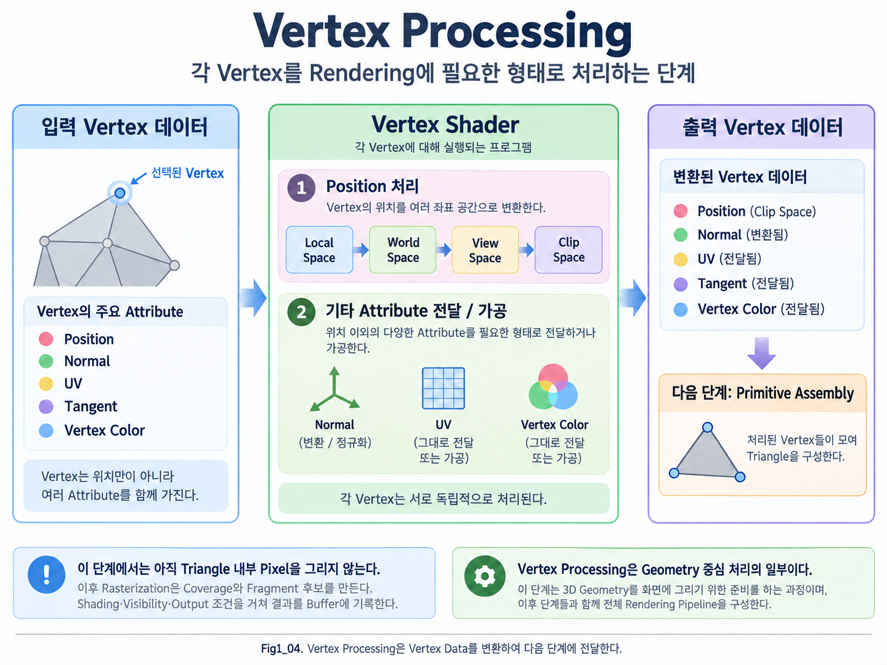

**Figure 1-4. Vertex Processing transforms vertex data and prepares it for the next stage of the rendering pipeline.**

Figure 1-4는 Vertex Processing의 전체 흐름을 단순화하여 보여준다.

왼쪽에는 Mesh를 구성하는 Vertex Data가 입력되고, 가운데의 Vertex Shader에서 Position과 여러 Attribute가 처리된다.

그 결과는 오른쪽의 Output Vertex Data로 전달되고, 이후 Primitive Assembly 단계에서 여러 Vertex가 모여 Triangle을 구성한다.

여기서 중요한 점은 Vertex Shader가 아직 Triangle 내부의 Pixel을 계산하는 단계는 아니라는 것이다.

Vertex Shader는 말 그대로 **Vertex 단위의 처리**를 담당한다.

---

### Vertex Shader

**Vertex Shader**는 Rendering Pipeline에서 각 Vertex에 대해 실행되는 Shader Program이다.

여기서 Shader라는 단어 때문에 처음에는 Material이나 Lighting 계산만 떠올리기 쉽다.

하지만 Shader는 특정 종류의 GPU 계산을 수행하는 Program을 의미하며, Vertex Shader는 그중에서도 **Vertex Data를 처리하는 Shader Stage**다.

예를 들어 Draw가 10,000개의 Rendering Vertex를 사용한다면 그 Vertex Data를 처리할 작업이 필요하다. Vertex Shader는 각 Vertex 입력의 Position과 Attribute를 읽고 필요한 출력을 만든다.

Performance Note — vertex data count and shader invocations

**Vertex 단위의 Program**이라는 설명과 **정확한 실행 횟수**는 구분한다. Buffer 전체의 Vertex 수가 항상 한 Frame의 Shader 실행 횟수와 같지는 않다. Draw가 참조하는 Vertex, Index 재사용, Instance와 Pass 구성 등이 실제 작업량에 영향을 준다. 세부 비용 판단은 1.9와 Chapter 09에서 연결한다.

단순화하면 다음과 같이 생각할 수 있다.

~~~text
Vertex Input
→ Vertex Shader
→ Vertex Output
~~~

이 Program에 입력되는 기본 처리 단위는 하나의 Vertex다. 입력에는 그 Vertex의 Position과 Attribute가 있고, 출력에는 처리된 Position과 뒤에서 사용할 Data가 있다.

따라서 Vertex Shader는 기본적으로 한 Vertex를 처리할 때 주변 Vertex의 정보를 자동으로 알고 있는 것이 아니다. 세 Vertex가 어떤 Triangle을 이루는지는 이후 연결 단계가 다룬다.

이 점은 이후 Primitive Assembly와 Rasterization을 이해할 때 중요하다.

---

### Position Processing

Vertex Shader의 가장 핵심적인 역할 중 하나는 **Vertex Position을 변환하는 것**이다.

Mesh에 저장된 Position은 일반적으로 Object 또는 Local Space 기준으로 존재한다.

예를 들어 Character의 머리 Vertex가 다음 Position을 가진다고 해 보자.

~~~text
Position = (10, 25, 5)
~~~

이 값만으로는 화면 어디에 표시해야 하는지 알 수 없다.

왜냐하면 실제 화면 위치를 결정하려면 다음과 같은 정보가 더 필요하기 때문이다.

- Object가 World의 어디에 배치되어 있는가
- Object가 어떤 방향으로 회전되어 있는가
- Object의 Scale은 얼마인가
- Camera는 어디에 있는가
- Camera가 어느 방향을 바라보는가
- 어떤 Projection을 사용하는가

따라서 Vertex Position은 여러 Coordinate Space를 거치며 변환된다.

대표적인 흐름은 다음과 같다.

~~~text
Local Space
→ World Space
→ View Space
→ Clip Space
~~~

이 과정을 통해 Vertex는 최종적으로 Rasterization에 사용할 수 있는 위치 정보로 변환된다.

각 Space의 정확한 의미와 **Matrix Transformation**은 Chapter 02에서 자세히 다룬다. Matrix는 변환에 사용할 여러 수를 행과 열로 배열한 구조이며, Matrix Transformation은 이 수들의 관계를 이용해 Position이나 Direction을 바꾸는 계산이다. 여기서는 변환이 필요한 목적부터 이해하고, Matrix의 구성과 계산은 다음 Chapter에서 연결한다.

Chapter 01에서는 우선 다음 개념을 잡는 것이 중요하다.

> **Vertex Shader는 3D Mesh의 Vertex Position을 화면에 그릴 수 있는 Coordinate 형태로 변환하는 출발점이다.**

---

### Local Space

Mesh를 Modeling Tool에서 만들 때 Vertex Position은 보통 Object 자체를 기준으로 저장된다.

이 공간을 **Local Space**, 또는 **Object Space**라고 부른다.

예를 들어 Character의 Origin을 기준으로 머리가 위쪽에 있다면, 머리 Vertex의 Position은 그 Object 내부 좌표로 표현된다.

이 단계에서는 Character가 Unreal World의 어디에 배치되어 있는지는 아직 직접 반영되지 않는다.

---

### World Space

서로 다른 Object의 위치를 비교하려면 Object마다 다른 Local Space만으로는 부족하다. Scene 전체가 함께 사용하는 기준이 필요하다. Object가 Scene에 배치되면 Local Space의 Position은 이 공통 기준인 World를 기준으로 한 Position으로 변환될 수 있다.

이 공간을 **World Space**라고 한다.

예를 들어 같은 Character Mesh를 Scene의 서로 다른 위치에 두 개 배치하면 Local Position은 같더라도 World Position은 달라진다.

즉,

~~~text
같은 Mesh
+ 서로 다른 Transform
→ 서로 다른 World Position
~~~

이 되는 것이다.

---

### View Space

World에 존재하는 Object를 화면에 표시하려면 Camera 기준으로 다시 바라봐야 한다.

이때 사용하는 공간이 **View Space**다.

View Space에서는 Camera를 기준으로 Scene의 Position을 표현한다.

쉽게 생각하면

> **Camera가 World의 중심이 된 것처럼 Scene을 다시 표현하는 공간**

이라고 볼 수 있다.

---

### Clip Space

Camera 기준의 위치를 얻어도, 그 위치가 Camera가 고려할 영역 안에 있는지는 더 판단해야 한다. Vertex Position은 Projection을 적용해 이 판정에 적합한 **Clip Space**의 좌표 형태로 변환된다.

Clip Space는 Clipping, 즉 유효한 영역의 경계에 걸친 Geometry를 잘라내는 처리에 사용하는 Coordinate Space다. 이 공간에서 GPU는 Primitive가 Camera가 볼 수 있는 영역 안에 있는지 검사할 수 있다.

이 출력이 곧바로 Pixel 좌표는 아니다. Clipping을 거친 뒤 화면 영역에 대응되는 위치로 바뀌며, 1.7에서 이 연결을 다시 확인한다.

다만 Clip Space는 우리가 Modeling Tool에서 직접 다루는 일반적인 XYZ Coordinate와는 조금 다른 성격을 가진다.

**Homogeneous Coordinate**는 위치의 XYZ와 함께 `W` 성분을 사용하는 좌표 표현이다. 이 표현은 위치를 옮기는 변환과 Projection을 연결하는 데 사용된다. Chapter 01에서는 `W`로 어떤 계산을 하는지보다 Clip Space가 아직 화면 Pixel 좌표가 아니라는 점을 먼저 이해한다.

앞서 소개한 Matrix는 Transform과 Projection의 수치를 묶어 표현할 수 있다. Matrix의 **Row**와 **Column**은 각각 행과 열을 뜻한다. Matrix로 위치와 방향을 어떻게 바꾸는지는 Chapter 02에서 설명한다. 여기서는 이러한 수학적 표현이 Vertex Position을 다음 처리에 필요한 형태로 만드는 데 쓰인다는 목적을 연결한다.

현재는 다음 정도만 이해하면 충분하다.

~~~text
Local
→ World
→ View
→ Clip
~~~

이 흐름을 거치며 Vertex Position이 화면에 그려질 준비를 한다.

---

### Vertex Position Modification

Vertex Shader는 단순히 Coordinate Space를 변환하는 역할만 하는 것은 아니다.

원한다면 Vertex Position 자체를 수정할 수도 있다.

예를 들어 다음과 같은 효과를 생각할 수 있다.

- 바람에 흔들리는 Grass
- 물결치는 Surface
- Character의 Vertex Animation
- World Position Offset
- **Procedural Deformation** — 정한 계산 규칙에 따라 Vertex Position을 바꾸는 변형

이러한 효과들은 Vertex Shader Stage에서 Vertex Position을 변경하는 방식으로 구현될 수 있다.

Unreal Engine Material에서 사용하는 **World Position Offset** 역시 이 개념과 연결된다. World Position Offset은 기존 Vertex Position에 더할 World 기준의 위치 변화량을 제공하는 입력이다. **Material Graph**는 이러한 Material 계산을 Node, 즉 입력과 출력이 있는 계산 단위로 연결한 구조다.

즉, Material Graph에서 World Position Offset에 값을 넣는다는 것은 단순히 Material 색을 바꾸는 것이 아니라,

> **Rendering Pipeline의 Vertex Processing 단계에서 Geometry의 Position을 수정하는 것**

이다.

이런 식으로 Rendering Pipeline을 이해하면 Unreal Material의 각 기능이 어느 Stage에 개입하는지 훨씬 명확하게 볼 수 있다.

---

### Processing Other Attributes

Vertex Shader는 Position만 처리하는 것이 아니다.

앞 절에서 살펴본 다른 Attribute도 함께 입력될 수 있다.

예를 들어 다음과 같은 Data가 있다.

- Normal
- UV
- Tangent
- Vertex Color

이러한 Attribute는 경우에 따라 그대로 다음 단계로 전달될 수도 있고, 필요한 계산을 거쳐 변환될 수도 있다.

---

### Normal Processing

Normal은 방향을 나타내는 Vector이기 때문에 Object가 회전하거나 변형되면 Normal 역시 적절히 변환해야 한다.

예를 들어 Character를 90도 회전시켰다고 생각해 보자.

Geometry만 회전하고 Normal은 원래 방향에 그대로 남아 있다면 Lighting 계산이 잘못된다.

따라서 Position과 마찬가지로 Normal도 Transform과 관련된 처리가 필요할 수 있다.

다만 Normal Transformation은 Position Transformation과 완전히 같은 방식으로 처리되지 않는 경우가 있다.

**Scale**은 형태의 크기를 바꾸는 Transform이다. 축마다 같은 비율로 바꾸지 않는 **Non-uniform Scale**이 포함되면 Normal에 별도의 처리가 필요하다. 표면을 한 방향으로 더 길게 늘렸을 때 Surface의 기울기도 달라질 수 있기 때문이다. 정확한 보정 관계는 Chapter 03에서 문제와 직관부터 살펴본다.

이 부분은 이후 Coordinate System과 Normal Transformation을 다룰 때 더 자세히 살펴본다.

현재는

> **Geometry의 방향이 변하면 Normal 방향도 그에 맞게 변환되어야 한다.**

는 점만 이해하면 된다.

---

### UV Processing

UV는 Position과 달리 반드시 Coordinate Transformation을 거쳐야 하는 Data는 아니다.

많은 경우 Mesh에 저장된 UV가 그대로 다음 Stage로 전달된다. Position을 바꾸어 Object가 다른 곳에 놓여도 Texture의 대응을 함께 다시 만들 필요는 없을 수 있다. 따라서 모든 Attribute에 같은 Transform을 적용하는 것이 아니라, 해당 Data의 목적에 맞는 처리를 선택한다.

예를 들어 다음 UV가 있다고 해 보자.

~~~text
UV = (0.25, 0.75)
~~~

이 값은 Vertex Shader를 통과한 뒤 이후 Rasterization과 Interpolation을 거쳐 Fragment에서 사용할 수 있다.

물론 Shader에서 UV를 수정할 수도 있다.

예를 들어

- **Tiling** — UV의 반복 횟수 조정
- **Offset** — 사용할 UV 위치의 이동
- **Rotation** — UV 좌표의 회전
- **Procedural UV Animation** — 입력 규칙이나 시간에 따라 UV를 계산해서 변화시키는 효과

같은 효과를 만들 수 있다.

따라서 UV도 단순히 고정된 Data가 아니라 필요하면 Vertex Processing에서 가공할 수 있는 Attribute다.

---

### Vertex Color Processing

Vertex Color 역시 Vertex Shader의 입력으로 사용할 수 있다.

많은 경우 그대로 다음 Stage로 전달되며, 이후 Fragment Shader에서 Mask나 Color 정보로 활용된다.

예를 들어 Vertex Color의 Red Channel을 특정 효과의 Mask로 사용한다면

~~~text
Vertex Color
→ Vertex Shader
→ Interpolation
→ Fragment Shader
→ Mask 사용
~~~

과 같은 흐름으로 이어질 수 있다.

이처럼 Vertex Attribute는 Vertex Shader에서 끝나는 Data가 아니다.

필요한 Attribute는 이후 Stage까지 전달된다.

---

### Vertex Shader Output

Vertex Shader가 하나의 Vertex를 처리하면 Output Data를 만든다.

다음 단계는 이 Vertex들을 이용해 Primitive를 구성하고 화면에 대응시켜야 한다. 따라서 대표적으로 중요한 출력은 처리된 **Position**이다. 이 Position과 뒤에서 필요한 Attribute를 연결하면 다음 Stage가 입력 Geometry를 처리할 수 있다.

그리고 이후 Stage에서 사용할 Attribute도 함께 출력할 수 있다.

예를 들어 단순화하면 다음과 같은 Output을 생각할 수 있다.

~~~text
Vertex Output

Position
Normal
UV
Tangent
Vertex Color
~~~

이 중 Position은 Primitive가 어디에 위치하는지를 결정하는 데 사용된다.

그리고 Normal, UV, Vertex Color 같은 Attribute는 이후 Rasterization과 Interpolation을 거쳐 Fragment Processing에서 활용될 수 있다.

---

### Per-Vertex Processing

Vertex Shader의 중요한 특징 중 하나는 각 Vertex가 기본적으로 독립적으로 처리된다는 점이다.

예를 들어 Triangle 하나가 세 Vertex로 구성되어 있다고 하자.

~~~text
Vertex A
Vertex B
Vertex C
~~~

Vertex Shader는 이 세 Vertex를 하나의 Triangle으로 보고 처리하는 것이 아니다.

먼저 각각을 개별적으로 처리한다.

~~~text
Vertex A → Vertex Shader → Output A

Vertex B → Vertex Shader → Output B

Vertex C → Vertex Shader → Output C
~~~

이후 다음 Stage에서 이 Vertex들이 모여 Triangle을 구성한다.

즉,

> **Vertex Shader는 Triangle을 처리하는 단계가 아니라 Vertex를 처리하는 단계다.**

이 구분이 중요하다.

---

### Vertex Processing Before Pixels

Vertex Processing 단계에서는 아직 Screen 내부의 Pixel을 계산하지 않는다.

우리는 현재 Geometry의 Vertex를 처리하고 있을 뿐이다.

Triangle 내부가 어떤 Pixel을 덮는지 판단하는 과정은 이후 **Rasterization** 단계에서 이루어진다.

따라서 다음 두 개를 구분해야 한다.

#### Vertex Processing

~~~text
Vertex 단위의 Geometry 처리
~~~

#### Fragment / Pixel Processing

~~~text
Rasterization 이후 Screen 위치 단위의 Surface 처리
~~~

이 두 과정은 Rendering Pipeline에서 서로 완전히 다른 위치에 있다.

예를 들어 Vertex Shader가 매우 복잡하다면 Vertex 수에 따라 비용이 증가할 수 있고, Fragment Shader가 매우 복잡하다면 화면을 덮는 Pixel 수에 따라 비용이 증가할 수 있다.

이 차이는 이후 Shader Optimization을 이해할 때도 매우 중요하다.

---

### Preparing Geometry

Vertex Processing을 전체적으로 다시 정리하면 다음과 같다.

먼저 Mesh에서 Vertex Data가 입력된다.

~~~text
Position
Normal
UV
Tangent
Vertex Color
...
~~~

이 Data가 Vertex Shader로 전달된다.

Vertex Shader에서는 대표적으로

~~~text
Position Transformation
Attribute Transformation
Attribute Modification
Attribute Forwarding
~~~

같은 처리가 이루어진다.

그 결과는 새로운 Vertex Output으로 만들어지고 다음 Rendering Stage로 전달된다.

즉,

~~~text
Vertex Input
→ Vertex Shader
→ Processed Vertex
→ Next Stage
~~~

라는 흐름이다.

여기까지는 아직 Vertex 각각을 처리했을 뿐이다.

하지만 실제 Surface를 만들려면 이 Vertex들을 서로 연결해야 한다.

다음 절에서는 처리된 여러 Vertex가 어떻게 Triangle과 같은 **Primitive**로 구성되는지, 그리고 **Primitive Assembly**가 무엇인지 살펴본다.

---

## 1.5 Primitive Assembly

Vertex Shader가 Cube의 꼭짓점을 모두 처리했다고 생각해 보자. 위치를 아는 점들이 모였다고 해서 어느 점 사이에 면을 만들어야 하는지는 아직 알 수 없다. 같은 점을 다르게 연결하면 다른 형태가 만들어질 수 있다.

앞 절의 출력은 각각 처리된 Vertex다. 다음 계산에서 Surface를 다루려면 **어떤 Vertex들이 함께 하나의 도형을 이루는가**라는 연결 관계가 필요하다.

GPU가 다루는 기본 도형이 Primitive이고, 처리된 Vertex들을 이 도형으로 묶는 과정이 **Primitive Assembly**다. 여기서는 세 Vertex가 하나의 Triangle을 이루는 경우를 중심으로 살펴본다.

먼저 Triangle을 사용하는 이유를 확인한 뒤, 연결 번호인 Index와 그 저장 공간을 살펴본다. 이 관계를 알면 Vertex 공유, Attribute 때문에 공유할 수 없는 경우, 면의 앞뒤를 정하는 순서까지 연결된다.

---

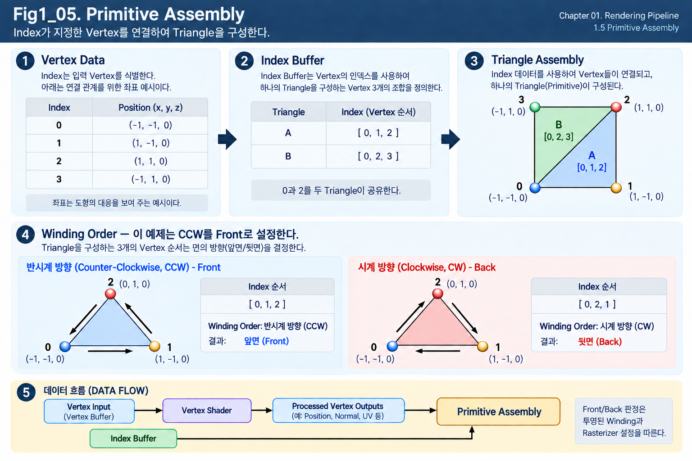

**Figure 1-5. Primitive Assembly**

Figure 1-5는 Vertex Processing을 거친 Vertex Data가 Index Data를 이용해 Triangle으로 구성되는 과정을 보여준다.

왼쪽에는 여러 Vertex가 존재하고, 가운데의 Index Buffer에는 어떤 Vertex들을 연결하여 Triangle을 만들 것인지에 대한 정보가 저장되어 있다.

GPU는 이 Index Data를 참조하여 오른쪽과 같이 Triangle을 구성한다.

이때 만들어지는 Triangle은 Rendering Pipeline에서 사용하는 대표적인 **Primitive**다.

---

### Primitive

**Primitive**는 GPU가 Geometry를 구성하고 Rendering하기 위해 사용하는 기본 도형 단위다.

하나의 점을 표시할 때와 선을 표시할 때, 면을 표시할 때는 입력을 묶는 방식이 다르다. Graphics API나 Rendering 방식에 따라 여러 종류의 Primitive가 존재할 수 있다.

대표적으로 다음과 같은 형태가 있다.

- Point
- Line
- Triangle

하지만 일반적인 Real-time 3D Rendering에서는 **Triangle**이 가장 중요한 Primitive다.

우리가 Modeling Tool에서 **Quad**, 즉 네 꼭짓점의 면이나 **N-gon**, 즉 여러 꼭짓점의 면으로 작업하더라도 실제 GPU Rendering에서는 대부분 Triangle로 변환되어 처리된다. 복잡한 면을 Triangle로 나누는 일을 **Triangulation**이라고 한다.

즉,

> **GPU는 복잡한 3D Surface를 수많은 Triangle의 집합으로 처리한다.**

라고 이해할 수 있다.

---

### Why Triangles?

3D Surface를 표현하기 위해 꼭 Triangle만 사용할 수 있는 것은 아니다.

그럼에도 Real-time Rendering에서 Triangle이 기본 Primitive로 사용되는 데에는 몇 가지 이유가 있다.

#### A Plane from Three Non-Collinear Points

서로 일직선상에 있지 않은 세 점은 하나의 평면을 결정한다.

따라서 Triangle은 항상 평면으로 정의할 수 있다.

이 특성 덕분에 GPU는 Triangle 내부의 Position이나 Attribute를 안정적으로 계산할 수 있다.

---

#### Polygon Triangulation

Quad나 더 복잡한 Polygon도 여러 개의 Triangle로 분할할 수 있다.

예를 들어 하나의 Quad는 다음과 같이 두 개의 Triangle로 나눌 수 있다.

~~~text
Quad
→ Triangle A
+ Triangle B
~~~

따라서 Triangle만 처리할 수 있어도 매우 복잡한 Mesh를 표현할 수 있다.

---

#### Triangle Processing on the GPU

현대 GPU의 Rasterization Pipeline은 Triangle을 빠르게 처리하도록 설계되어 있다.

Triangle의 내부 영역 계산, Attribute Interpolation, Culling과 같은 작업도 Triangle을 기준으로 효율적으로 수행된다.

그래서 Modeling 단계에서는 Quad 중심으로 작업하더라도 Rendering 단계에서는 Triangle이 중요한 기준이 된다.

---

### Vertex Connectivity

다음과 같은 네 개의 Vertex가 있다고 생각해 보자.

~~~text
Vertex 0
Vertex 1
Vertex 2
Vertex 3
~~~

이 Vertex들이 어디에 있는지는 알 수 있어도, GPU는 어떤 Vertex들을 서로 연결해야 하는지 자동으로 알 수 없다.

예를 들어 다음과 같은 Triangle을 만들 수 있다.

~~~text
Triangle A = Vertex 0, 1, 2
Triangle B = Vertex 0, 2, 3
~~~

하지만 다른 조합으로 연결하면 전혀 다른 Geometry가 만들어질 수 있다.

따라서 Mesh에는 Vertex Data와 함께

> **어떤 Vertex들을 연결하여 Triangle을 구성할 것인가**

를 나타내는 정보가 필요하다.

이 역할을 하는 것이 **Index**다.

---

### Index

연결 관계를 저장할 때 같은 Vertex의 모든 Attribute를 매번 복사하지 않아도 된다. 이미 저장한 Vertex를 번호로 가리키면 어떤 입력을 사용할지 알릴 수 있다. 이 번호가 **Index**이며, Vertex Buffer에 저장된 특정 Vertex를 가리킨다.

예를 들어 Vertex Buffer에 다음과 같은 Vertex들이 저장되어 있다고 하자.

~~~text
Vertex Buffer

Index 0 → Vertex A
Index 1 → Vertex B
Index 2 → Vertex C
Index 3 → Vertex D
~~~

Triangle 하나를 만들기 위해 Vertex A, B, C가 필요하다면 다음과 같이 Index를 사용할 수 있다.

~~~text
Triangle 0

[0, 1, 2]
~~~

이것은

> Vertex Buffer의 0번, 1번, 2번 Vertex를 사용해 Triangle을 만들어라.

라는 의미다.

---

### Index Buffer

이러한 Index들을 저장하는 Buffer를 **Index Buffer**라고 한다.

예를 들어 다음과 같은 Index Buffer가 있다고 하자.

~~~text
Index Buffer

Triangle 0 → [0, 1, 2]
Triangle 1 → [0, 2, 3]
~~~

그러면 GPU는 다음과 같은 두 Triangle을 구성할 수 있다.

~~~text
Triangle 0
Vertex 0
Vertex 1
Vertex 2

Triangle 1
Vertex 0
Vertex 2
Vertex 3
~~~

여기서 Vertex 0과 Vertex 2는 두 Triangle에서 다시 사용되고 있다.

즉, 하나의 Vertex Data를 여러 Triangle이 공유할 수 있다.

---

### Shared Vertex

Mesh를 구성하는 여러 Triangle은 같은 Vertex를 공유할 수 있다.

예를 들어 Quad를 두 개의 Triangle로 나누면 다음과 같이 생각할 수 있다.

~~~text
0 ----- 1
| \     |
|   \   |
|     \ |
3 ----- 2
~~~

두 Triangle은 다음과 같이 구성할 수 있다.

~~~text
Triangle A = [0, 1, 2]

Triangle B = [0, 2, 3]
~~~

Vertex 0과 Vertex 2는 두 Triangle 모두에서 사용된다.

Index Buffer를 사용하면 동일한 Vertex Data를 여러 Primitive가 참조할 수 있기 때문에 Geometry Data의 중복을 줄이는 데 도움이 된다.

즉,

> **Indexing은 하나의 Vertex Data를 여러 Triangle이 공유할 수 있게 해주는 구조다.**

---

### Limits of Vertex Sharing

앞 절에서 살펴본 것처럼 Position이 같더라도 Attribute가 다르면 별도의 Vertex Data가 필요하다.

대표적인 경우는 다음과 같다.

- UV Seam
- Hard Edge
- Split Normal
- 서로 다른 Vertex Color
- 서로 다른 Tangent

예를 들어 같은 Position에 있는 점이라도 서로 다른 Face에서 다른 UV를 가져야 한다면 하나의 Vertex로 공유할 수 없다.

따라서 Index Buffer가 Vertex를 공유한다고 할 때 정확한 의미는

> **Position과 Attribute가 모두 동일한 Vertex Data를 여러 Triangle이 공유할 수 있다.**

에 가깝다.

---

### Primitive Assembly

이제 Primitive Assembly의 역할을 다시 정리해보자.

Vertex Shader를 통과한 Vertex들이 다음과 같이 존재한다고 하자.

~~~text
Vertex 0
Vertex 1
Vertex 2
Vertex 3
...
~~~

그리고 Index Buffer에는 다음 정보가 있다.

~~~text
[0, 1, 2]
[0, 2, 3]
...
~~~

위 예시의 Index는 이미 준비된 Vertex 가운데 어느 것을 함께 사용할지 지정한다. **Primitive Topology**는 이 입력들을 Triangle이나 Line 같은 어떤 도형 단위로 묶을지 정한다.

이처럼 Index를 사용하는 요청을 **Indexed Draw**라고 한다. Primitive Assembly는 Index와 Topology를 따라 처리된 Vertex들을 연결한다.

Index Buffer 없이도 그릴 수 있다. **Non-indexed Draw**에서는 순차 Vertex와 Topology로 연결 관계를 정한다. 따라서 Index Buffer는 모든 Draw의 필수 자원이 아니다.

~~~text
Vertex Data
+
Index Data
↓
Primitive Assembly
↓
Triangle
~~~

즉,

> **Primitive Assembly는 처리된 Vertex들을 연결하여 GPU가 실제로 다룰 Primitive를 구성하는 단계다.**

Chapter 01에서는 가장 대표적인 Triangle Primitive를 중심으로 이해하면 충분하다.

---

### Winding Order

Triangle을 구성할 때는 어떤 세 Vertex를 사용하는지만 중요한 것이 아니라, **어떤 순서로 연결하는가**도 의미가 있다.

이러한 Vertex의 순서를 **Winding Order**라고 한다.

세 점을 화면에서 어떤 방향으로 따라 연결하는지 생각해 보면 순서의 의미를 이해하기 쉽다. 대표적으로 다음 두 방향이 있다.

- **Counter-Clockwise(CCW)** — 반시계 방향으로 따라가는 순서
- **Clockwise(CW)** — 시계 방향으로 따라가는 순서

Rendering System은 Winding Order와 설정을 기준으로 Triangle의 **Front Face**, 즉 앞면으로 취급할 면과 **Back Face**, 즉 뒷면으로 취급할 면을 구분할 수 있다. 앞뒤는 Lighting의 Vertex Normal 방향과 같은 Data가 아니라, 도형의 연결과 판정 규칙에 관한 관계다.

다만 실무에서 Modeler가 Winding Order의 Index 순서를 직접 확인하거나 외울 일은 거의 없다.

일반적으로 **DCC(Digital Content Creation) Tool**, 즉 모델링과 콘텐츠 제작 도구에서는 다음과 같은 기능을 이용해 Surface 방향을 시각적으로 확인한다.

- Face Orientation
- Normal Display
- Backface Culling View

따라서 여기서는 다음 원리만 이해하면 충분하다.

> **Triangle의 Vertex 순서가 Front Face와 Back Face를 판정하는 기준으로 사용된다.**

Technical Note — front-face convention

어떤 Winding Order를 Front Face로 사용하는지는 Graphics API나 Rendering 설정에 따라 달라질 수 있으므로, CCW나 CW 중 하나를 절대적인 규칙처럼 외울 필요는 없다. 도형의 순서와 현재 Front Face 설정을 함께 확인한다.

---

### Winding Order and Backface Culling

Winding Order가 중요한 이유는 다음 단계에서 다룰 **Backface Culling**과 연결되기 때문이다.

일반적인 닫힌 Mesh에서는 Camera를 향하지 않는 Triangle의 뒷면을 굳이 Rendering할 필요가 없는 경우가 많다.

Rendering System은 Triangle의 Front Face와 Back Face를 구분하고, 설정에 따라 Back Face를 Rendering 대상에서 제외할 수 있다.

즉, 흐름은 다음과 같다.

~~~text
Primitive Assembly
↓
Triangle 생성
↓
Front / Back Face 판정
↓
Backface Culling
~~~

실무에서는 Winding Order 자체를 직접 다룰 일은 많지 않지만,

> **왜 Face가 뒤집혔을 때 Engine에서 사라질 수 있는가**

를 이해하기 위한 기반이 된다.

---

### Connection to Modeling Tools

Modeling Tool에서 Face Orientation이 뒤집혀 있으면 Engine에서 Back Face로 판정되어 Surface가 사라질 수 있다.

Normal 방향이 잘못된 경우에는 Lighting이 예상과 다르게 보일 수 있다. DCC의 면 뒤집기 작업이 Winding과 Normal을 함께 바꾸기도 하지만, Vertex Normal만 바꾸는 것과 Face Orientation을 바꾸는 것은 같은 작업이 아니다.

Surface가 사라졌다면 Front / Back Face와 Culling 설정을 확인한다. Surface가 남아 있지만 밝기가 이상하다면 Normal Data도 확인한다. 뒤의 1.6에서 이 판정 기준을 더 분명히 구분한다.

따라서 DCC Tool에서 사용하는 다음 개념들은 GPU Rendering과 직접 관련이 있다.

- Face Orientation
- Flipped Face
- Reversed Normal
- Backface Culling

다만 실제 Modeling 작업에서는 Winding Order의 숫자 순서를 직접 확인하기보다, DCC Tool의 시각적인 표시 기능을 통해 Face 방향을 확인하는 것이 일반적이다.

---

### Primitive Assembly Before Pixel Processing

Primitive Assembly가 끝나면 GPU는 어떤 Vertex들이 어떤 Triangle을 구성하는지 알게 된다.

현재까지의 흐름은 다음과 같다.

~~~text
Vertex Data
↓
Vertex Processing
↓
Processed Vertex
↓
Primitive Assembly
↓
Triangle
~~~

여기까지는 여전히 **Geometry 중심의 처리**다.

Triangle 내부의 어떤 Screen 위치가 실제로 영향을 받는지는 아직 계산하지 않았다.

이 과정은 이후 **Rasterization**에서 이루어진다.

하지만 Rasterization으로 넘어가기 전에 모든 Triangle을 그대로 처리할 필요가 있는지 먼저 판단해야 한다.

---

Primitive Assembly가 끝나면 GPU는 Rendering할 Triangle들을 알게 된다.

하지만 그중에는 다음과 같은 Triangle도 존재할 수 있다.

- Camera에서 뒷면이 보이는 Triangle
- Camera가 볼 수 있는 영역 밖에 있는 Triangle
- Camera가 볼 수 있는 영역의 경계에 걸쳐 있는 Triangle

이러한 Geometry를 모두 이후 Stage까지 처리하면 불필요한 계산이 발생할 수 있다.

따라서 다음 절에서는

- 불필요한 Geometry를 제거하는 **Culling**
- Rendering 가능한 영역의 경계에 걸친 Geometry를 잘라내는 **Clipping**

을 살펴본다.

특히 이번 절에서 간단히 살펴본 **Front Face / Back Face** 개념이 다음 절의 **Backface Culling**과 직접 연결된다.

---

## 1.6 Culling and Clipping

Character의 몸처럼 닫힌 Mesh를 생각해 보자. Camera를 바라보는 면뿐 아니라 몸 안쪽을 향하는 면도 있고, Camera 화면 밖에 있는 다른 Object도 Scene 안에 존재한다. 그 Geometry를 모두 끝까지 계산해야 할까?

앞 절에서 Primitive Assembly는 Vertex를 연결해 Triangle을 만들었다. 이제 어떤 Geometry가 현재 작업에 필요하고, 어떤 Geometry의 일부만 유효한 영역에 놓이는지 구분해야 한다.

필요하지 않다고 판정한 대상을 통째로 제외하는 과정이 **Culling**이다. 반면 Triangle의 절반이 유효 영역 안에 있다면 전체를 제거할 수 없다. 경계 밖 부분만 잘라내 유효한 부분을 남기는 과정이 **Clipping**이다.

두 과정은 뒤의 화면 위치 계산에 넘길 Geometry를 준비한다. 먼저 제거와 잘라내기의 차이를 이해한 뒤, 면의 앞뒤, Camera의 공간 범위, Object 단위 선별이 서로 어떤 기준을 사용하는지 살펴본다.

---

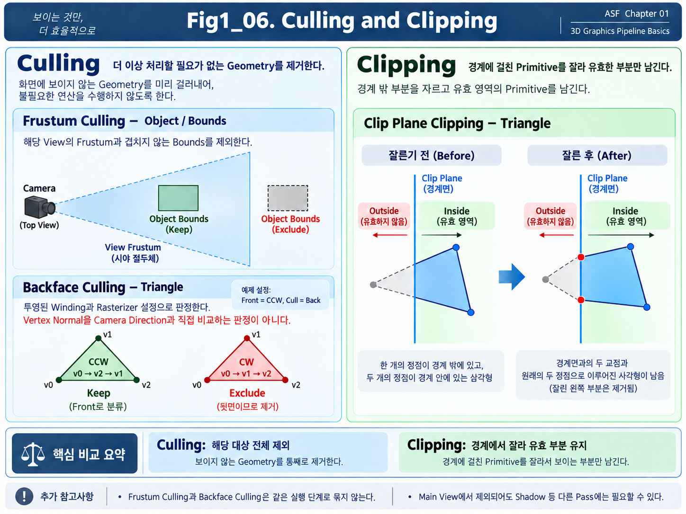

**Figure 1-6. Culling and Clipping**

Figure 1-6은 Culling과 Clipping의 차이를 비교해서 보여준다.

왼쪽의 Culling은 더 이상 처리할 필요가 없는 Geometry를 Rendering 대상에서 제외한다.

오른쪽의 Clipping은 Primitive 전체를 없애는 것이 아니라, View 영역의 경계를 넘어간 부분만 잘라내고 안쪽의 유효한 부분을 남긴다.

이 차이를 먼저 명확히 이해하는 것이 중요하다.

---

### Culling

**Culling**은 Rendering할 필요가 없다고 판단된 Geometry를 이후 Pipeline에서 제외하는 과정이다.

쉽게 말하면,

> **보이지 않거나 처리할 필요가 없는 Geometry를 미리 걸러내는 것**

이다.

Real-time Rendering에서는 Scene에 매우 많은 Object와 Triangle이 존재할 수 있다.

그중 실제 Camera 화면에 영향을 주지 않는 Geometry까지 모두 처리하면 GPU 자원이 낭비된다.

따라서 가능하면 이른 단계에서 불필요한 Geometry를 제거하는 것이 효율적이다.

Culling은 하나의 기준만 사용하는 이름이 아니다. **Backface Culling**은 도형의 뒷면 판정을, **Frustum Culling**은 검사할 View의 공간 범위를, **Occlusion Culling**은 다른 Geometry에 가려지는 관계를 이용한다.

여기서 **View**는 Camera나 Light 등 특정 관찰 기준으로 Scene을 처리하는 단위다. 각 판정의 대상과 수행 위치는 다를 수 있으므로, 모두 같은 Hardware Stage라고 생각하지 않는다.

Chapter 01에서는 이 중 Rendering Pipeline의 기본 개념과 직접 연결되는 **Backface Culling**과 **Frustum Culling**을 중심으로 살펴본다.

---

### Backface Culling

**Backface Culling**은 Camera를 향하지 않는 Triangle의 뒷면을 Rendering 대상에서 제외하는 방식이다.

앞 절에서 Triangle에는 **Front Face**와 **Back Face**가 존재하며, Winding Order를 기준으로 이를 구분할 수 있다고 살펴보았다.

일반적인 닫힌 Mesh를 생각해 보자.

Character의 몸이나 Sphere처럼 Surface가 바깥쪽을 향하도록 만들어진 Mesh에서는 내부를 향하는 Back Face가 Camera에서 직접 보일 필요가 없는 경우가 많다.

이러한 Back Face를 그대로 Rasterization하면 결국 화면에 나타나지 않을 가능성이 높다.

따라서 GPU는 설정에 따라 Back Face라고 판단된 Triangle을 일찍 제거할 수 있다.

즉,

~~~text
Triangle
↓
Front / Back Face 판정
↓
Back Face
→ Culling
~~~

과 같은 흐름으로 이해할 수 있다.

---

Technical Note — winding is different from shading normal data

### Winding and Normal Data

Backface Culling을 처음 배울 때

> "Normal이 Camera 반대쪽을 향하면 제거한다."

라고 설명하는 경우가 많다.

이 설명은 개념을 이해하기에는 편하지만, 실제 Rasterization Pipeline의 판정 원리를 그대로 표현한 것은 아니다.

일반적인 GPU Pipeline에서는 투영된 Triangle의 **Winding Order**와 Rasterizer 설정을 기준으로 Front Face와 Back Face를 판단한다.

즉, Vertex Normal을 직접 Camera Direction과 비교해서 Backface Culling을 수행하는 것이 기본 원리는 아니다.

그래서 앞 절에서 Winding Order를 간단히 짚고 넘어간 것이다.

다만 실무에서 Modeler가 직접 Winding Order를 숫자로 확인할 일은 거의 없다.

DCC Tool에서는 보통 다음과 같은 기능을 통해 Face 방향을 확인한다.

- Face Orientation
- Normal Display
- Backface Culling View

따라서 실무에서는 시각적으로 확인하되, 내부적으로는 Triangle의 방향 판정이 존재한다는 정도를 이해하면 충분하다.

---

Implementation Note — two-sided surfaces and cost

### Two-Sided Materials and Backface Culling

Backface Culling은 항상 적용되는 것은 아니다.

예를 들어 얇은 Plane 하나로 만든 천, 나뭇잎, Hair Card 같은 Geometry는 앞면과 뒷면이 모두 보여야 할 수 있다.

이 경우 Backface Culling을 끄고 양쪽 면을 모두 Rendering할 수 있다.

Unreal Engine에서는 Material의 **Two Sided** 설정이 이 개념과 연결된다.

Two Sided Material을 사용하면 원래 Culling되었을 Back Face도 Rendering 대상이 될 수 있다.

하지만 그만큼 더 많은 Fragment가 처리될 가능성이 있으므로 Performance 비용이 증가할 수 있다.

따라서

> **Backface Culling은 단순히 보이지 않는 면을 없애는 기능이 아니라, 불필요한 Rendering 비용을 줄이는 중요한 기본 최적화 방식**

이라고 볼 수 있다.

---

### View Frustum

앞뒤 면의 판정과 별개로, Camera가 볼 수 있는 공간 자체에도 범위가 있다. 같은 방향을 향한 면이라도 이 범위 밖에 있으면 현재 Camera의 화면에는 들어오지 못한다.

Camera 앞의 모든 공간을 무한히 보는 것이 아니다.

Camera의 Position, Field of View, Aspect Ratio, Near Plane, Far Plane 등에 의해 실제로 볼 수 있는 공간이 정의된다.

이 공간을 **View Frustum**이라고 한다.

Perspective Camera의 경우 View Frustum은 대략 잘린 피라미드와 비슷한 형태를 가진다.

일반적으로 다음 경계로 구성된다.

- Left Plane
- Right Plane
- Top Plane
- Bottom Plane
- Near Plane
- Far Plane

이 여섯 개의 경계 안쪽이 Camera가 볼 수 있는 기본 공간이 된다.

---

### Near and Far Planes

View Frustum에는 Camera로부터 너무 가까운 영역과 너무 먼 영역을 제한하는 경계가 있다.

#### Near Plane

**Near Plane**은 Camera에 너무 가까운 Geometry를 잘라내기 위한 경계다.

Near Plane보다 Camera에 더 가까운 영역은 일반적으로 Rendering 대상에서 제외된다.

#### Far Plane

**Far Plane**은 Camera에서 너무 멀리 떨어진 Geometry를 제한하는 경계다.

Far Plane보다 먼 영역은 Rendering 범위 밖으로 처리될 수 있다.

이러한 범위는 Camera가 실제로 고려해야 하는 공간을 제한하고, 이후 Depth 계산과도 연결된다.

Near / Far Plane의 정확한 수학적 의미와 Projection 관계는 Chapter 02에서 자세히 다룬다.

---

### Frustum Culling

Scene에 있는 Object 가운데 현재 View의 화면에 들어올 수 있는 것만 먼저 고르면, 뒤의 Geometry 작업을 줄일 수 있다.

**Frustum Culling**은 이 목적을 위해 검사 대상 View의 Frustum 밖에 완전히 있는 Object나 Geometry를 해당 View의 Rendering 후보에서 제외하는 방식이다.

현재 제외 여부는 **검사한 View에만 적용되는 판단**이다. 다른 관찰 목적에 필요한 Geometry까지 모두 불필요하다는 뜻은 아니다.

Implementation Note — view scope and frustum selection

Main Camera 밖의 Object라도 Shadow나 **Reflection**, 즉 빛이 Surface에서 반사되어 보이는 결과를 계산하는 작업에는 기여할 수 있다. 특정 목적을 위해 Scene이나 저장된 Data를 처리하는 작업 단위를 **Render Pass**라고 한다. Shadow Pass와 Reflection Pass는 Main Camera 화면과 다른 입력 또는 관찰 기준을 사용할 수 있다.

Object 단위 선별은 CPU 또는 GPU에서 구현할 수 있다. 따라서 Frustum Culling이라는 이름이 Primitive Clipping처럼 하나의 고정 실행 위치를 뜻하지는 않는다.

예를 들어 Camera 뒤쪽에 있는 Object나 화면에서 매우 멀리 벗어난 Object는 현재 Frame에 보일 가능성이 없다.

그렇다면 굳이 해당 Object의 모든 Triangle을 GPU에서 끝까지 처리할 이유가 없다.

따라서 Engine은 가능한 한 일찍

> **이 Object는 Camera가 볼 수 있는 공간 안에 있는가?**

를 판단할 수 있다.

완전히 Frustum 밖에 있다면 해당 Object를 Rendering 대상에서 제외할 수 있다.

---

### Object Bounds and Frustum Culling

여기서 중요한 점이 하나 있다.

Frustum Culling은 반드시 Triangle 하나하나를 검사하는 방식만을 의미하지 않는다.

Character의 모든 Triangle을 검사하기 전에, 전체를 감싸는 단순한 부피만 검사할 수 있다. 이 감싸는 영역이 **Bounding Volume**이며, 상자 형태는 **Bounding Box**, 구 형태는 **Bounding Sphere**라고 한다. 실제 Game Engine에서는 Performance를 위해 이러한 영역을 사용하여 먼저 판정하는 경우가 많다.

예를 들어 Character 전체를 감싸는 Bounding Box가 View Frustum 밖에 있다면 내부의 수만 개 Triangle을 하나씩 검사할 필요 없이 Character 전체를 Rendering 대상에서 제외할 수 있다.

즉,

~~~text
Object Bounding Volume
↓
View Frustum과 비교
↓
완전히 밖
→ Object Culling
~~~

과 같은 방식이다.

이러한 구조는 이후 Unreal Engine의 Bounds와 Culling 문제를 이해할 때도 중요하다.

---

### Culling as Rejection

Culling의 핵심은 단순하다.

> **필요 없는 대상을 통째로 제외한다.**

예를 들어 Geometry가 View Frustum 밖에 완전히 존재한다면 제거할 수 있다.

하지만 다음과 같은 경우는 문제가 다르다.

Triangle의 절반은 View Frustum 안에 있고, 나머지 절반은 밖에 있다고 생각해 보자.

이 Triangle 전체를 Culling하면 화면 안쪽에 보여야 할 부분까지 사라진다.

이 경우에는 Geometry를 제거하는 것이 아니라 **잘라야 한다.**

여기서 Clipping이 필요하다.

---

### Clipping

**Clipping**은 Primitive가 Rendering 가능한 영역의 경계에 걸쳐 있을 때, 경계 밖 부분을 잘라내고 유효한 부분만 남기는 과정이다.

예를 들어 하나의 Triangle이 View Frustum의 Left Plane을 가로질러 있다고 하자.

Triangle의 일부는 Frustum 안에 있고, 나머지는 밖에 있다.

이 경우 다음 두 선택 모두 문제가 있다.

~~~text
Triangle 전체 유지
→ Frustum 밖의 영역까지 처리됨

Triangle 전체 제거
→ 화면에 보여야 할 부분까지 사라짐
~~~

따라서 경계 밖 부분만 잘라내고 Frustum 내부의 Geometry를 새롭게 만들어야 한다.

이 과정이 **Clipping**이다.

---

### Clip Plane

Clipping에서 Geometry를 자르는 기준이 되는 경계를 **Clip Plane**이라고 생각할 수 있다.

View Frustum은 여러 Plane으로 구성되므로 Primitive는 다음과 같은 경계와 비교된다.

- Left
- Right
- Top
- Bottom
- Near
- Far

Primitive가 이 경계 안에 완전히 존재하면 그대로 유지할 수 있다.

완전히 밖에 존재한다면 제거할 수 있다.

하지만 경계에 걸쳐 있다면 Clipping이 필요하다.

단순화하면 다음과 같다.

~~~text
Primitive가 완전히 안쪽
→ 유지

Primitive가 완전히 바깥쪽
→ 제거

Primitive가 경계에 걸침
→ Clipping
~~~

---

### Geometry After Clipping

Clipping은 단순히 Triangle의 일부 Pixel을 나중에 무시하는 과정이 아니다.

Rasterization 이전의 Geometry 단계에서 Primitive 자체가 잘릴 수 있다.

예를 들어 원래 하나의 Triangle이 Near Plane을 가로지르고 있다면 Clipping 결과에 따라 새로운 Vertex가 경계 위치에 생성될 수 있다.

원래 Triangle이

~~~text
Vertex A
Vertex B
Vertex C
~~~

로 구성되어 있었다고 하더라도, Clipping 이후에는 경계와 교차한 위치에 새로운 Vertex가 만들어지고 여러 Triangle로 재구성될 수 있다.

즉,

> **Clipping은 Geometry의 형태 자체를 Rendering 가능한 영역에 맞게 수정할 수 있는 과정**

이다.

이 점이 단순한 Culling과 가장 큰 차이다.

---

### Culling and Clipping

두 개념을 다시 비교하면 다음과 같다.

| 구분 | Culling | Clipping |
|---|---|---|
| 목적 | 불필요한 Geometry 제거 | 경계 밖 Geometry 제거 |
| 처리 방식 | 대상 전체를 제외 | 경계에서 Geometry를 잘라냄 |
| 결과 | Primitive/Object가 사라짐 | 유효한 부분이 남음 |
| 대표 예 | Backface Culling, Frustum Culling | View Frustum 경계 Clipping |

가장 간단하게 기억하면 된다.

> **Culling = 제거**

> **Clipping = 잘라내기**

---

### Rejection Before Rasterization

이 두 과정의 중요한 목적 중 하나는 이후 Pipeline Stage가 처리해야 할 일을 줄이는 것이다.

Rasterization 단계에 들어가면 Triangle이 실제 Screen의 어떤 영역을 덮는지 계산하기 시작한다.

그리고 그 이후에는 수많은 Fragment에 대해 계산이 수행될 수 있다.

그렇다면 어차피 보이지 않을 Geometry는 Rasterization 전에 제거하는 편이 훨씬 효율적이다.

예를 들어 화면 밖에 있는 Triangle을 Rasterization까지 보냈다가 나중에 버리는 것보다

~~~text
Geometry Stage에서 제거
→ Rasterization 자체를 하지 않음
~~~

이 더 효율적이다.

따라서 Culling과 Clipping은 **Geometry 중심의 처리와 Screen 중심의 처리 사이에서 불필요한 작업을 줄이는 중요한 단계**라고 볼 수 있다.

---

### Different Causes of Invisibility

여기서 한 가지 구분할 점이 있다.

최종 화면에 보이지 않는 Geometry라고 해서 모두 같은 방식으로 제거되는 것은 아니다.

예를 들어

#### Back Face

Triangle 자체가 Camera 반대쪽을 향하고 있기 때문에 제거될 수 있다.

→ **Backface Culling**

#### Objects Outside the View Frustum

Camera가 볼 수 있는 공간 자체를 벗어나 있기 때문에 제거될 수 있다.

→ **Frustum Culling**

#### Occluded Objects

View Frustum 안에는 있지만 다른 Geometry에 가려져 보이지 않을 수 있다.

→ **Occlusion Culling**

이들은 모두 최종적으로 보이지 않는 Geometry를 줄이는 방식이지만 판정 기준과 수행 위치가 다를 수 있다.

Occlusion Culling은 Depth와 Visibility에 대한 추가 정보가 필요하므로 Chapter 01에서는 개념만 알아두고 이후 Rendering Optimization에서 다시 다루는 편이 적절하다.

---

### View Frustum and Clip Space

앞 절의 Vertex Processing에서 Vertex Position이 최종적으로 **Clip Space**로 변환된다고 설명했다.

이 이름이 바로 현재 설명하는 **Clipping**과 관련이 있다.

Clip Space는 Primitive가 Camera가 볼 수 있는 범위 안에 있는지 판정하고 Clipping하기에 적합한 Coordinate Space다.

즉, 앞 절에서 살펴본 흐름이

~~~text
Local Space
→ World Space
→ View Space
→ Clip Space
~~~

였다면,

Clip Space에 도달한 Geometry는 이후 View Frustum의 유효 범위와 비교될 수 있다.

다만 Clip Space가 실제로 어떤 좌표값을 가지고 있고 Perspective Projection에서 `W` 값이 어떤 역할을 하는지는 Chapter 02에서 자세히 다룬다.

현재는 다음 연결만 이해하면 충분하다.

> **Vertex Processing에서 Clip Space로 Position을 준비하고, 이후 Geometry가 Camera의 유효 영역에 들어오는지 판정하고 Clipping할 수 있다.**

---

Culling과 Clipping이 끝나면 이제 남아 있는 Triangle들은 실제로 화면에 영향을 줄 가능성이 있는 Geometry다.

현재까지의 흐름을 다시 보면 다음과 같다.

~~~text
Vertex Data
↓
Vertex Processing
↓
Primitive Assembly
↓
Triangle
↓
Culling / Clipping
↓
유효한 Triangle
~~~

여기까지는 여전히 Geometry 중심의 Processing이다.

하지만 최종 Image를 만들려면 이제 중요한 질문에 답해야 한다.

> **이 Triangle이 Screen의 어떤 Pixel 영역을 덮는가?**

이 질문을 해결하는 단계가 **Rasterization**이다.

Rasterization은 3D Geometry 중심의 처리에서 Screen과 Fragment 중심의 처리로 넘어가는 중요한 전환점이다.

다음 절에서는 Triangle이 Screen의 Pixel 후보와 연결되는 **Rasterization** 과정을 자세히 살펴본다.

---

## 1.7 Rasterization

화면 위에 Triangle의 세 꼭짓점만 찍으면 Surface 전체가 보일까? 모서리의 위치는 알 수 있어도, 그 사이에 있는 넓은 영역은 아직 어떤 화면 위치에서 계산해야 할지 정하지 못했다.

앞 절까지는 Vertex와 Triangle 같은 Geometry를 처리했다. Culling과 Clipping을 거친 유효한 Triangle을 화면에 대응시킨 뒤에는, 그 Triangle이 **어떤 Screen 위치를 덮는가**라는 질문에 답해야 한다.

이 판정 과정이 **Rasterization**이다. 화면의 Sample 위치가 Triangle 안에 들어오는지 검사하고, 영향을 받는 위치에 이후 처리할 Fragment를 준비한다. 여기서 바뀌는 것은 Data의 단위다. Triangle이라는 도형에서 화면 위치별 후보로 넘어간다.

Rasterization은 Geometry와 Screen 처리를 연결하지만, 그 위치의 Color까지 결정하는 과정은 아니다. 이번 절에서는 위치의 판정과 후보 생성이 Surface 계산과 어떻게 다른지 따라간다.

---

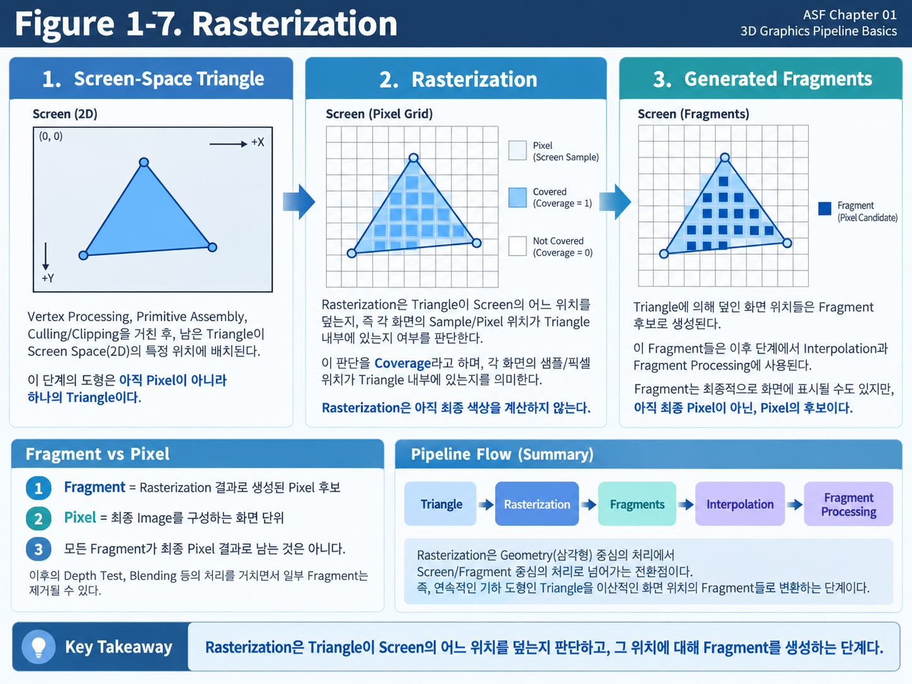

**Figure 1-7. Rasterization**

Figure 1-7은 Screen에 투영된 Triangle이 Pixel Grid의 어떤 위치를 덮는지 판단하고, 해당 위치에 Fragment가 생성되는 과정을 보여준다.

왼쪽에는 Screen 위에 투영된 Triangle이 있고, 가운데에서는 Triangle이 Screen의 어떤 Sample 위치를 덮는지 판단한다.

오른쪽에서는 Triangle에 의해 영향을 받는 위치에 **Fragment**가 생성된다.

이 흐름을 단순화하면 다음과 같다.

~~~text
Screen-Space Triangle
↓
Rasterization
↓
Coverage 판정
↓
Fragments 생성
~~~

---

### Rasterization

**Rasterization**은 Screen에 투영된 Primitive가 화면의 어떤 위치를 덮는지 판단하는 과정이다.

일반적인 3D Rendering에서는 Triangle이 가장 대표적인 Primitive이므로, 여기서는 Triangle을 기준으로 이해하면 된다.

앞 단계까지 GPU는 Triangle이라는 연속적인 기하 도형을 다루고 있었다.

하지만 Display는 일정한 간격으로 배열된 Pixel로 구성된다.

따라서 GPU는

> **연속적인 Triangle을 일정한 간격으로 배치된 Screen의 Pixel/Sample 위치와 어떻게 연결할 것인가**

를 판단해야 한다.

Rasterization은 바로 이 문제를 해결한다.

간단하게 표현하면 다음과 같다.

~~~text
Triangle
↓
Screen 위에 배치
↓
어떤 Screen 위치를 덮는지 검사
↓
해당 위치에 Fragment 생성
~~~

여기서 중요한 점이 있다.

> **Rasterization은 Triangle을 Pixel로 직접 변환하는 과정이 아니다.**

Rasterization의 결과는 최종 Pixel이 아니라 이후 Rendering 계산에 사용될 **Fragment 후보**다.

---

### Screen-Space Triangle

Vertex Processing에서는 Vertex Position이 여러 Coordinate Space를 거쳐 변환되었다.

단순화하면 다음과 같은 흐름이었다.

~~~text
Local Space
→ World Space
→ View Space
→ Clip Space
~~~

View Space에서 Clip Space로 옮길 때 Projection이 이미 적용된다. Clip Space는 Camera의 유효 범위를 검사하기 위한 형태이며, 아직 화면의 Pixel 좌표 자체는 아니다.

Clipping 이후에는 Clip 좌표를 화면에 사용할 범위의 좌표로 바꾸어야 한다. **Perspective Divide**는 Clip 좌표의 `W`를 이용해 좌표를 나누는 처리이며, 이 결과로 정규화된 좌표를 얻는다.

그 좌표를 실제 화면의 크기와 위치에 맞추는 처리가 **Viewport Transform**이다. 이 처리를 거치면 Triangle의 세 꼭짓점이 실제 화면 영역의 어느 위치에 대응되는지 알 수 있다.

Technical Note — projection and screen mapping order

View Space에서 Clip Space로 옮길 때 Projection이 이미 적용된다. Perspective Divide와 Viewport Transform은 Clipping 이후의 화면 대응 처리이며, Projection을 Clip Space 이후에 다시 수행하는 것으로 이해하지 않는다. Chapter 02에서 변환과 `W`의 역할, 좌표 범위의 관례를 자세히 다룬다.

이렇게 Screen과 대응되는 위치에 놓인 Triangle을 여기서는 **Screen-Space Triangle**이라고 부른다.

즉,

~~~text
3D Triangle
↓
Camera / Projection
↓
2D Screen 위의 Triangle
~~~

처럼 생각할 수 있다.

이제 Triangle의 세 Vertex가 Screen의 어느 위치에 놓이는지는 알 수 있다.

하지만 Triangle 내부에는 Vertex가 세 개밖에 없다.

문제는 그 사이의 넓은 영역이다.

GPU는 Triangle의 세 꼭짓점만 표시하는 것이 아니라, Triangle 내부 전체가 화면에 나타나도록 처리해야 한다.

따라서 다음 질문이 생긴다.

> **Triangle 내부에 포함되는 Screen 위치는 어디인가?**

Rasterization이 바로 이 영역을 찾아낸다.

---

### Screen Pixel Grid

Triangle은 수학적으로 연속적인 도형이다.

반면 Screen은 유한한 수의 Pixel로 구성된다.

예를 들어 매우 작은 Screen을 단순화하면 다음처럼 생각할 수 있다.

~~~text
□ □ □ □ □ □
□ □ □ □ □ □
□ □ □ □ □ □
□ □ □ □ □ □
□ □ □ □ □ □
~~~

여기에 Triangle 하나를 겹쳐 놓으면 일부 Screen 위치는 Triangle 안에 들어가고, 일부는 밖에 있게 된다.

GPU는 Rasterization 과정에서

> **어떤 Screen 위치가 Triangle에 의해 덮이는가?**

를 판단한다.

이 판단이 Geometry와 Pixel Grid를 연결하는 핵심이다.

---

### Sample

Rasterization을 이해할 때 **Sample**이라는 용어도 알아둘 필요가 있다.

Pixel을 하나의 작은 정사각형 영역이라고 생각할 수 있지만, GPU가 항상 Pixel 전체 면적을 단순하게 검사하는 것은 아니다.

실제 Rasterization에서는 Pixel 안의 특정 위치에 **Sample Point**를 두고 Primitive가 해당 Sample을 덮는지 판단할 수 있다.

가장 단순한 경우에는 Pixel마다 하나의 Sample이 존재한다고 생각할 수 있다.

~~~text
Pixel
┌─────────┐
│    •    │
│ Sample  │
└─────────┘
~~~

Triangle이 이 Sample 위치를 덮으면 해당 위치는 Triangle의 영향을 받는다고 판단할 수 있다.

화면의 유한한 Pixel 격자 때문에 경계가 계단처럼 보이는 현상을 줄이는 처리가 **Anti-Aliasing**이다. **MSAA(Multisample Anti-Aliasing)**는 하나의 Pixel에 여러 Sample을 사용해 이러한 경계 표현을 개선하는 방식과 연결된다.

Technical Note — samples are not fixed to one per pixel

가장 단순한 학습 예에서는 Pixel마다 하나의 Sample을 상상할 수 있지만, MSAA처럼 하나의 Pixel에 여러 Sample을 사용하는 경우도 있다. 따라서 Sample 수와 Pixel 수를 항상 같은 것으로 세지 않는다. 상세 동작은 Chapter 01의 범위를 넘어가므로 여기서는 판정 위치라는 의미만 알아둔다.

현재는 다음과 같이 이해하면 충분하다.

각 Pixel 안에 판정을 위한 대표 위치가 하나 있다고 상상하면 Sample Point를 이해하기 쉽다. Blender의 Face Center 표시를 떠올릴 수도 있지만, 실제 Rendering의 Sample은 UI 표시가 아니라 Coverage 판정에 사용되는 계산 위치다.

> **Rasterization은 Screen의 Sample 위치가 Triangle에 포함되는지를 판단한다.**

---

### Coverage

특정 Sample 위치가 Primitive에 의해 덮이는지를 판단하는 개념을 **Coverage**라고 한다.

단순화하면 다음처럼 생각할 수 있다.

~~~text
Triangle 내부의 Sample
→ Covered

Triangle 외부의 Sample
→ Not Covered
~~~

Figure 1-7에서 Triangle 내부에 표시된 Screen 위치들이 바로 이러한 Coverage 판정을 통과한 영역이다.

Coverage는

> **이 Screen 위치가 Triangle의 영향을 받는가?**

에 대한 판단이다.

여기서는 아직

> **어떤 Color를 표시해야 하는가?**

를 계산하지 않는다.

이 차이가 매우 중요하다.

---

### Coverage Before Color

Rasterization이라는 단어 때문에 Triangle을 실제 화면에 "그리는" 과정 전체라고 생각하기 쉽다.

하지만 Rendering Pipeline에서 Rasterization의 역할은 더 제한적이다.

Rasterization은 기본적으로

> **Primitive가 Screen의 어디를 덮는지 판단하는 단계**

다.

예를 들어 Triangle의 표면이 빨간색인지, 금속인지, 피부인지에 대한 계산은 Rasterization 자체의 핵심 역할이 아니다.

다음과 같은 계산들은 이후 Fragment Processing과 연결된다.

- Texture Sampling
- Base Color
- Normal
- Lighting
- Roughness
- **Specular** — 반사 방향과 관찰 방향의 관계에 따라 달라지는 반사 성분의 계산
- Emission

따라서 다음 두 개를 구분해야 한다.

#### Rasterization

~~~text
Triangle이 Screen의 어디에 영향을 주는가?
~~~

#### Fragment Processing

~~~text
그 위치에서 어떤 Surface 결과를 계산할 것인가?
~~~

이 구분은 Rendering Pipeline을 이해하는 데 매우 중요하다.

---

### Fragment

Rasterization 과정에서 Triangle이 덮는 Screen 위치가 결정되면, 해당 위치에 대해 이후 Rendering 계산을 수행할 Data가 만들어진다.

이것을 **Fragment**라고 한다.

Fragment라는 단어는 직역하면 "조각"이라는 뜻이다.

Rendering에서는 하나의 Primitive가 Screen 위에 Rasterization되면서 만들어지는 **화면 위치별 Primitive의 조각** 정도로 이해할 수 있다.

간단하게 표현하면 다음과 같다.

~~~text
Triangle
↓
Rasterization
↓
Fragment
Fragment
Fragment
Fragment
...
~~~

하나의 큰 Triangle이 Screen을 넓게 차지한다면 매우 많은 Fragment가 생성될 수 있다.

반대로 Triangle이 화면에서 아주 작게 보인다면 생성되는 Fragment 수도 적다.

---

### Fragments and Pixels

여기서 매우 중요한 구분이 있다.

**Fragment와 Pixel은 같은 개념이 아니다.**

처음 Rendering을 공부할 때 가장 자주 혼동하는 부분 중 하나다.

#### Fragment

Rasterization 결과로 생성된 **Pixel 후보에 해당하는 Rendering Data**다.

#### Pixel

최종 2D Image를 구성하는 **화면 단위**다.

즉,

> **Fragment는 최종 Pixel이 될 가능성이 있는 후보이지, 아직 최종 Pixel 자체는 아니다.**

라고 이해하는 것이 좋다.

---

### From Candidate to Pixel Contribution

한 Screen 위치에 하나의 Surface만 존재한다면 Fragment와 Pixel이 거의 같은 것처럼 느껴질 수도 있다.

하지만 3D Scene에서는 같은 Screen 위치 방향에 여러 Surface가 겹칠 수 있다.

예를 들어 Camera 앞에 Character가 있고, 그 뒤에 Wall이 있다고 생각해 보자.

하나의 Screen 위치에서

~~~text
Camera
↓
Character
↓
Wall
~~~

처럼 여러 Surface가 존재할 수 있다.

Character Triangle도 해당 위치에 Fragment를 만들 수 있고, Wall Triangle도 같은 Screen 위치에 Fragment를 만들 수 있다.

하지만 최종 화면의 Pixel에는 보통 Camera에 더 가까운 Character가 보여야 한다.

따라서 Fragment가 생성된 뒤에도

- **Depth Test** — 저장된 Depth와 새 Depth를 비교하는 앞뒤 판정
- **Stencil Test** — 별도 판정 Data와 규칙을 이용해 결과 기록이 허용되는지 확인하는 처리
- **Blending** — 새 결과와 이미 저장한 결과를 정해진 규칙으로 결합하는 처리
- 기타 Rendering 처리

등을 거칠 수 있다.

그 결과 일부 Fragment는 최종 Image에 남고, 일부는 제거될 수 있다.

즉,

~~~text
Fragment 생성
↓
여러 Rendering Test / Processing
↓
일부 Fragment만 최종 결과에 기여
↓
Pixel Result
~~~

라는 흐름이다.

그래서

> **Fragment = Pixel**

이라고 단순하게 이해하면 이후 Depth Test와 Transparency를 설명할 때 문제가 생긴다.

---

### Multiple Fragments at One Pixel

Fragment와 Pixel의 차이를 이해하기 위해 조금 더 구체적인 상황을 생각해보자.

Camera 앞에 Sphere가 있고 그 뒤에 Wall이 있다고 하자.

같은 Screen 위치를 Sphere와 Wall이 모두 덮고 있다면 Rasterization 과정에서는 각각의 Triangle에서 Fragment가 생성될 수 있다.

~~~text
Screen Pixel 위치

Sphere Fragment
Wall Fragment
~~~

즉, 동일한 Pixel 위치와 관련된 Fragment가 여러 개 존재할 수 있다.

이후 Depth Test에서 어느 Fragment가 Camera에 더 가까운지를 판단하여 최종 Surface를 결정할 수 있다.

이것이 Fragment를 **Pixel 후보**라고 표현하는 이유다.

---

### From Geometry to Screen Samples

Rendering Pipeline의 전체 흐름에서 Rasterization은 매우 중요한 위치에 있다.

Rasterization 이전에는 주로 다음과 같은 것을 다뤘다.

~~~text
Vertex
Triangle
Primitive
Geometry
~~~

즉, **Geometry 중심의 처리**였다.

Rasterization 이후에는 다음과 같은 개념이 중요해진다.

~~~text
Fragment
Screen Position
Pixel
Depth
Color
~~~

즉, **Screen 중심의 처리**로 넘어간다.

따라서 Rendering Pipeline을 크게 나누어 보면 다음처럼 생각할 수 있다.

~~~text
Geometry Processing
↓
Rasterization
↓
Fragment / Screen Processing
~~~

Rasterization은 이 두 영역을 연결하는 경계 역할을 한다.

---

### Triangle Size and Fragment Count

여기서 Performance와 연결되는 중요한 개념 하나를 생각할 수 있다.

같은 Triangle이라도 Screen에서 얼마나 크게 보이는지에 따라 생성되는 Fragment 수가 크게 달라질 수 있다.

예를 들어 동일한 Triangle이 멀리 있을 때는 Screen에서 아주 작게 보인다.

~~~text
작은 Screen 영역
→ 적은 Fragment
~~~

Camera 가까이에 와서 Screen 대부분을 차지하면 상황이 달라진다.

~~~text
큰 Screen 영역
→ 많은 Fragment
~~~

즉, Fragment Processing 비용은 단순히 Mesh의 Triangle Count만으로 결정되지 않는다.

Surface가 Screen을 얼마나 많이 차지하는지도 중요하다.

이것이 Rendering Optimization에서

- Vertex Cost
- Pixel / Fragment Cost

를 따로 생각해야 하는 이유 중 하나다.

Vertex Processing 비용은 Geometry Data의 양과 관련되고, Fragment Processing 비용은 Screen Coverage와 밀접하게 연결될 수 있다.

---

Performance Note — small triangles and measured cost

### Small Triangles and Cost

Triangle이 작으면 생성되는 Fragment가 적을 가능성이 높지만, 그렇다고 무조건 Rendering Cost가 낮다고 단순하게 결론 내릴 수는 없다.

GPU는 Rasterization을 일정한 Hardware 단위로 처리하며, 아주 작은 Triangle이 지나치게 많아지면 Geometry Processing과 Rasterization Efficiency 측면에서 다른 문제가 생길 수도 있다.

이러한 **Micro Triangle**, 즉 화면에서 매우 작은 영역만 덮는 Triangle의 문제는 Optimization에서 더 자세히 다룰 수 있다. 작은 Triangle이 많을 때 처리 효율이 단순한 Fragment 개수만으로 설명되지 않을 수 있다는 뜻이다.

Chapter 01에서는 우선 다음 관계만 기억하면 충분하다.

> **Triangle Count는 Geometry Cost와 관련되고, Screen Coverage는 Fragment Cost와 관련된다.**

둘은 서로 다른 Rendering Pipeline Stage의 문제다.

---

### Attributes After Rasterization

Rasterization으로 Fragment 위치가 만들어졌다고 해도 아직 한 가지 중요한 문제가 남아 있다.

앞에서 Vertex에는 여러 Attribute가 있다고 배웠다.

예를 들어 Triangle의 세 Vertex에 다음과 같은 UV가 있다고 하자.

~~~text
Vertex A → UV (0, 0)
Vertex B → UV (1, 0)
Vertex C → UV (0, 1)
~~~

그런데 Rasterization으로 Triangle 중앙에 Fragment가 생성되었다.

그 위치에는 실제 Vertex가 없다.

그렇다면 이 Fragment에서는 어떤 UV를 사용해야 할까?

Normal은 어떤 값을 사용해야 할까?

Vertex Color는 어떤 값을 사용해야 할까?

GPU는 Triangle의 세 Vertex에 저장된 Attribute를 이용하여 내부 Fragment 위치에 필요한 값을 계산한다.

이 과정이 다음 절에서 다룰 **Interpolation**이다.

---

### Rasterization Data Flow

이번 절의 내용을 단순하게 정리하면 다음과 같다.

~~~text
유효한 Triangle
↓
Screen Space에 배치
↓
Rasterization
↓
Screen Sample Coverage 판정
↓
Fragment 생성
↓
Interpolation
↓
Fragment Processing
~~~

Rasterization의 핵심 역할은 Color를 결정하는 것이 아니다.

> **Triangle이 Screen의 어떤 위치를 덮는지 판단하고, 그 위치에 대해 Fragment를 생성하는 것**

이 핵심이다.

그리고 Fragment는 아직 최종 Pixel이 아니다.

이후 여러 Rendering Stage를 통과한 뒤에야 최종 Image에 기여할 수 있다.

---

### Key Takeaways

- **Rasterization**은 Screen에 투영된 Triangle이 어떤 위치를 덮는지 판단하고, 뒤의 계산에 사용할 Fragment를 준비한다.
- **Coverage**는 특정 Screen Sample이 Triangle에 의해 덮이는지에 대한 판단이다.
- **Fragment**는 Rasterization으로 준비되는 Rendering 후보 Data이며, Depth Test나 Blending 등에 따라 최종 결과에 기여할 수 있다.
- **Pixel**은 최종 Image를 구성하는 화면 단위다. Triangle은 Geometry, Fragment는 후보 Data, Pixel은 Image 단위이므로 서로 구분한다.

---

Fragment 위치에는 원래 Vertex가 없어도 Fragment Processing에는 UV, Normal, Vertex Color와 기타 Vertex Attribute가 필요하다. 앞서 확인한 것처럼 Triangle의 세 Vertex가 가진 값을 그 위치에 맞게 계산하는 과정이 **Interpolation**이다. 다음 절에서는 이 Attribute가 Triangle 내부의 각 Fragment로 어떻게 전달되는지 살펴본다.

---

## 1.8 Interpolation

Triangle의 꼭짓점에는 UV가 저장되어 있다. 그런데 화면에 넓게 나타난 Triangle의 중앙에서 Texture를 읽으려면 어떤 UV를 사용해야 할까? 중앙에는 Mesh에 저장한 별도 Vertex가 없을 수 있다.

앞 절의 Rasterization은 Triangle이 덮는 위치를 찾아 Fragment를 준비했다. 하지만 위치를 찾는 일과 그 위치에서 사용할 Attribute를 준비하는 일은 다르다.

**Interpolation**, 즉 보간은 이미 알고 있는 Vertex의 값들을 이용해 그 사이 Fragment 위치에 맞는 값을 계산하는 과정이다. 두 값 사이의 중간 위치에서 중간값을 구하는 직관을 Triangle의 세 Vertex로 확장하면 된다.

입력은 Triangle의 세 Vertex가 가진 Attribute와 내부 위치의 관계다. 출력은 해당 Fragment에서 사용할 UV, Normal, Vertex Color 등의 값이다. 이 값은 다음 Fragment Shader의 입력이 되므로, 이번 절에서는 **위치에 따른 비율을 구하는 일**과 **그 비율로 Attribute를 만드는 일**을 순서대로 연결한다.

---

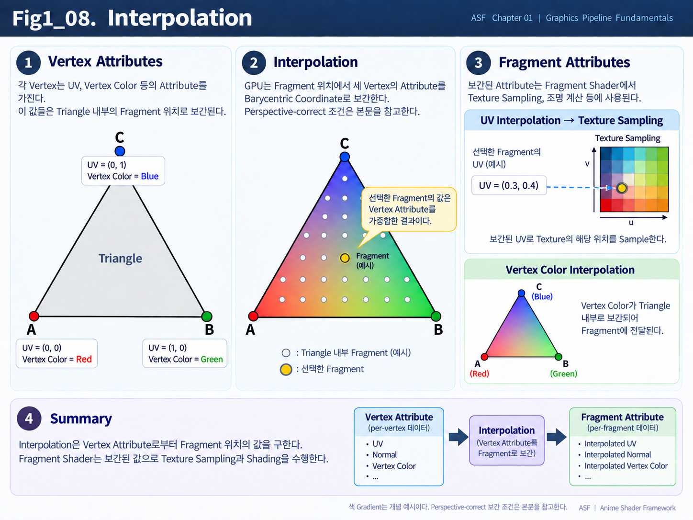

**Figure 1-8. Interpolation**

Figure 1-8은 Triangle의 세 Vertex가 가진 Attribute가 Triangle 내부의 Fragment 위치로 전달되는 과정을 보여준다.

왼쪽의 세 Vertex는 각각 서로 다른 UV와 Vertex Color를 가지고 있다.

가운데에서는 Triangle 내부에 생성된 Fragment의 위치에 따라 세 Vertex의 Attribute가 서로 다른 비율로 섞여, 각 Fragment에 필요한 값이 만들어진다.

오른쪽에서는 이렇게 계산된 UV가 Texture Sampling에 사용되고, Vertex Color 역시 Triangle 내부에서 자연스럽게 이어지는 모습을 볼 수 있다.

전체 흐름을 단순화하면 다음과 같다.

~~~text
Vertex Attributes
↓
Rasterization
↓
Fragment 생성
↓
Interpolation
↓
Fragment에서 사용할 Attribute 계산
~~~

---

### Interpolation

Interpolation을 가장 단순하게 이해하려면 두 값 사이의 중간값을 생각하면 된다.

예를 들어 왼쪽 값이 0이고 오른쪽 값이 10이라고 해보자.

~~~text
왼쪽      가운데      오른쪽
0    →      5      →    10
~~~

가운데 위치의 값은 두 값의 사이에 있기 때문에 5가 될 수 있다.

이처럼

> **이미 알고 있는 값들 사이에서, 중간 위치에 해당하는 값을 계산하는 것**

을 Interpolation이라고 한다.

Triangle에서는 두 점이 아니라 세 Vertex를 사용한다는 차이가 있다.

세 Vertex가 각각 값을 가지고 있고, Triangle 내부의 Fragment가 어디에 위치하는지에 따라 세 Vertex의 값이 서로 다른 비율로 섞인다.

즉,

> **Interpolation은 Vertex 사이의 빈 공간에 필요한 값을 위치에 맞게 계산해서 채우는 과정**

이라고 이해하면 된다.

---

### Why Interpolation Is Needed

Triangle에는 기본적으로 세 개의 Vertex가 있다.

예를 들어 다음과 같은 UV를 가진다고 하자.

~~~text
Vertex A → UV (0, 0)
Vertex B → UV (1, 0)
Vertex C → UV (0, 1)
~~~

하지만 Triangle 중앙에는 별도의 Vertex가 존재하지 않는다.

그럼에도 Rasterization으로 Triangle 내부에 Fragment가 만들어지면, 그 위치에서도 Texture를 Sample하기 위한 UV가 필요하다.

만약 Vertex 위치의 UV만 사용할 수 있다면 Triangle 내부 전체에 Texture를 자연스럽게 표현할 수 없다.

그래서 GPU는 세 Vertex가 가진 UV를 이용해서 각 Fragment 위치에 맞는 새로운 UV를 계산한다.

예를 들어 Triangle 내부의 어떤 Fragment에서 다음과 같은 값이 만들어질 수 있다.

~~~text
Fragment UV = (0.3, 0.4)
~~~

이 값은 원래 Mesh에 별도로 저장되어 있던 UV가 아니다.

세 Vertex의 UV를 이용해서 그 Fragment 위치에 맞게 계산된 값이다.

즉,

> **Fragment에 필요한 값은 Vertex의 Attribute를 바탕으로 중간 위치에 맞게 계산된다.**

이 과정이 Interpolation이다.

---

### Interpolation Weights

Interpolation은 세 Vertex의 값을 항상 똑같이 섞는 과정이 아니다.

Fragment가 Triangle 내부의 어디에 위치하는지에 따라 각 Vertex가 미치는 영향이 달라진다.

세 Vertex의 값으로 내부 위치의 값을 만들려면 먼저 각 Vertex의 값이 어느 비율로 기여할지 정해야 한다. 이 비율을 **Weight**라고 한다.

어떤 Vertex 쪽에 가까운 위치를 표현한다면 그 Vertex의 값이 더 많이 기여한다고 생각할 수 있다. 이렇게 Triangle 내부의 위치를 세 꼭짓점의 기여 비율로 표현하는 Weight가 **Barycentric Weight**다. 같은 의미를 좌표 표현으로 부를 때는 Barycentric Coordinate라고 한다.

이는 단순히 거리의 역수로 세 값을 섞는 방식이 아니다. 먼저 Triangle의 위치 관계를 비율로 표현하고, 그 비율로 Attribute를 계산한다. 원근에 대한 보정은 뒤에서 따로 연결한다.

먼저 이 비율의 의미를 살펴보고, 이후 Perspective가 있을 때 필요한 보정을 연결한다.

개념적으로는 다음과 같이 생각할 수 있다.

~~~text
Fragment가 A에 가까움
→ A의 Attribute 영향이 큼

Fragment가 B에 가까움
→ B의 Attribute 영향이 큼

Fragment가 C에 가까움
→ C의 Attribute 영향이 큼
~~~

Triangle 중앙에 가까운 Fragment라면 세 Vertex의 값이 모두 어느 정도 반영될 수 있다.

따라서 Triangle 내부의 위치가 달라지면 Interpolation 결과도 달라진다.

---

### Barycentric Coordinate

이때 Triangle 내부의 위치가 세 Vertex와 어떤 관계에 있는지를 표현하는 방법이 필요하다.

여기서 등장하는 용어가 **Barycentric Coordinate**다.

이 이름은 처음 보면 어려워 보이지만, 개념 자체는 단순하다.

> **Triangle 내부의 한 위치가 Vertex A, B, C의 영향을 각각 얼마만큼 받는지 나타내는 값**

이라고 이해하면 된다.

예를 들어 전체 기여를 1로 두고 A가 20%, B가 30%, C가 50%를 제공한다고 생각해 보자. 각 Attribute를 이 비율로 섞으면 해당 위치에 사용할 값이 만들어진다.

이 관계를 숫자로 표현하면 다음과 같다.

~~~text
Vertex A 영향 = 0.2
Vertex B 영향 = 0.3
Vertex C 영향 = 0.5
~~~

세 값의 합은 1이다. 이 예시는 Weight의 의미를 설명한다. 실제 Perspective 화면에서 UV 등에 사용할 비율은 뒤의 Perspective-Correct Interpolation까지 고려한다.

이 값을 이용하면 Fragment에서 사용할 Attribute를 계산할 수 있다.

예를 들어 Vertex Color가 다음과 같다면

~~~text
Vertex A → Red
Vertex B → Green
Vertex C → Blue
~~~

Fragment는 A, B, C의 영향을 각각 0.2, 0.3, 0.5만큼 받아 세 Color가 섞인 결과를 만들 수 있다.

수식 자체를 외울 필요는 없다.

Chapter 01에서는 다음 정도로 이해하면 충분하다.

> **Barycentric Coordinate는 Triangle 내부 위치를 세 Vertex의 영향 비율로 표현하는 방법이다.**

그리고 GPU는 이 관계를 이용해 UV, Normal, Vertex Color 같은 Attribute를 Fragment 위치에 맞게 계산한다.

---

### UV Interpolation

Interpolation을 가장 쉽게 이해할 수 있는 대표적인 예가 **UV**다.

Triangle의 세 Vertex가 다음 UV를 가지고 있다고 하자.

~~~text
Vertex A → UV (0, 0)
Vertex B → UV (1, 0)
Vertex C → UV (0, 1)
~~~

Rasterization으로 Triangle 내부에 Fragment가 생성되면, GPU는 Fragment 위치에 맞는 UV를 계산한다.

예를 들어 다음과 같은 값이 만들어질 수 있다.

~~~text
Fragment UV = (0.3, 0.4)
~~~

이 UV를 Fragment Shader에서 사용하면 Texture의 `(0.3, 0.4)` 위치를 Sample할 수 있다.

전체 흐름은 다음과 같다.

~~~text
Vertex UV
↓
Fragment 위치에 맞게 값 계산
↓
Fragment UV
↓
Texture Sampling
~~~

즉, 우리가 DCC Tool에서 만든 UV Mapping이 Triangle 내부 전체에 자연스럽게 이어질 수 있는 이유 중 하나가 바로 Interpolation이다.

---

### Interpolation and Texture Sampling

여기서 두 개념을 구분해야 한다.

**Interpolation**은 Fragment에서 사용할 UV를 계산하는 과정이다.

**Texture Sampling**은 계산된 UV를 사용해서 Texture의 실제 값을 읽는 과정이다.

즉,

~~~text
Vertex UV
↓
Interpolation
↓
Fragment UV
↓
Texture Sampling
↓
Texture Color
~~~

의 순서로 이어진다.

따라서

> **Interpolation은 UV를 만드는 과정이고, Texture Sampling은 그 UV로 Texture에서 값을 읽는 과정이다.**

라고 구분하면 된다.

---

### Vertex Color Interpolation

Vertex Color도 같은 방식으로 처리할 수 있다.

예를 들어 Triangle의 세 Vertex가 다음 Color를 가지고 있다고 하자.

~~~text
Vertex A → Red
Vertex B → Green
Vertex C → Blue
~~~

Triangle 내부 Fragment에서는 세 Color가 위치에 따라 서로 다른 비율로 섞인다.

A에 가까운 영역에서는 Red가 강하고,

B에 가까운 영역에서는 Green이 강하며,

C에 가까운 영역에서는 Blue가 강하다.

Triangle 중앙에서는 세 Color가 서로 섞인 결과가 나타난다.

Figure 1-8의 Gradient Triangle이 이 개념을 시각적으로 보여준다.

---

### Vertex Color as a Mask

Vertex Color라는 이름 때문에 실제 색으로만 사용한다고 생각하기 쉽지만, 실무에서는 각 Channel을 Mask Data로 사용하는 경우가 많다.

예를 들어 다음과 같이 사용할 수 있다.

~~~text
R → Dirt Mask
G → Wetness Mask
B → Effect Mask
A → Blend Mask
~~~

Vertex마다 서로 다른 Mask 값을 저장하면 이 값도 Triangle 내부에서 Interpolation된다.

따라서 Surface 전체에 부드럽게 변화하는 Mask를 만들 수 있다.

즉,

> **Vertex Color Interpolation은 Color뿐 아니라 Vertex 단위의 Mask Data를 Surface 전체로 이어주는 데에도 사용된다.**

---

### Normal Interpolation

Normal도 Vertex에서 Fragment로 전달될 때 Interpolation될 수 있다.

이 개념은 **Smooth Shading**을 이해하는 데 중요하다. Smooth Shading은 Lighting에 사용할 Normal을 Surface 내부에서 부드럽게 이어주어, 여러 평평한 Triangle의 Shading이 부드럽게 보이도록 하는 방식이다. 실제 Geometry가 더 둥글게 변하는 것은 아니다.

Triangle은 Geometry적으로는 평평한 면이다.

하지만 세 Vertex가 서로 다른 Normal을 가지고 있고, 그 Normal을 Triangle 내부에서 Interpolation하면 각 Fragment마다 조금씩 다른 Normal 방향이 만들어진다.

즉,

~~~text
Vertex Normal
↓
Fragment 위치에 맞게 중간 방향 계산
↓
Fragment Normal
~~~

과 같은 흐름이 된다.

이 결과를 Lighting 계산에 사용하면 실제 Geometry는 평평한 Triangle들로 구성되어 있어도 Surface가 부드럽게 이어지는 것처럼 보일 수 있다.

---

### Flat Geometry and Smooth Shading

Low Polygon Sphere를 생각해보자.

실제 Mesh는 여러 개의 평평한 Triangle로 구성되어 있다.

만약 각 Triangle이 하나의 동일한 Normal만 사용한다면 Lighting도 Triangle마다 끊어져 보이게 된다.

이것이 **Flat Shading**에 가까운 모습이다.

반대로 주변 Vertex의 Normal을 부드럽게 연결하고, 그 Normal 값을 Triangle 내부 Fragment에 맞게 계산하면 Lighting 방향도 Surface를 따라 점진적으로 변한다.

그 결과 실제 Geometry보다 훨씬 부드러운 형태처럼 보일 수 있다.

즉,

> **Geometry의 실제 형태와 Shading에 사용하는 Normal의 변화는 서로 다른 문제다.**

이것이 Smooth Shading의 핵심 원리 중 하나다.

---

### Interpolated Normal

Interpolation을 통해 Fragment 위치에서 계산된 Normal을 **Interpolated Normal**이라고 부를 수 있다.

여기서 `Interpolated`는 어렵게 생각할 필요가 없다.

> **Vertex 사이의 위치에 맞게 계산된**

이라는 뜻이다.

따라서

**Interpolated UV**

는

> Vertex UV 사이에서 Fragment 위치에 맞게 계산된 UV

이고,

**Interpolated Normal**

은

> Vertex Normal 사이에서 Fragment 위치에 맞게 계산된 Normal

이라는 의미다.

---

### Normalizing Interpolated Normals

Normal은 방향을 표현하는 Vector이기 때문에 일반적으로 길이가 1인 상태로 사용하는 경우가 많다.

하지만 여러 Vertex Normal을 섞어서 중간값을 만들면 결과 Vector의 길이가 정확히 1이 아닐 수 있다.

방향만 비교하려면 Vector의 길이가 계산에 섞이지 않도록 기준 길이를 정할 필요가 있다. **Unit Vector**는 길이가 1인 Vector다. **Normalize**는 방향을 유지하면서 Vector의 길이를 1로 맞추는 처리다.

여러 Normal을 섞으면 길이가 1이 아닐 수 있으므로, Lighting 계산 전에 다시 Normalize할 수 있다. 여기서는 그 목적을 먼저 이해하고, 길이의 계산과 예외 조건은 Chapter 03에서 살펴본다.

전체 흐름은 다음처럼 생각할 수 있다.

~~~text
Vertex Normal
↓
Interpolation
↓
Interpolated Normal
↓
Normalize
↓
Lighting
~~~

Normalize의 수학적 의미는 Vector를 다루는 Chapter에서 자세히 살펴본다.

현재는

> **Normal을 중간 위치에 맞게 계산한 뒤, 방향 Vector로 사용하기 위해 다시 정리할 수 있다.**

정도로 이해하면 충분하다.

---

### Interpolating Other Attributes

Interpolation은 UV, Normal, Vertex Color만을 위한 기능은 아니다.

Vertex Shader에서 이후 Fragment Shader까지 전달해야 하는 여러 Data가 Fragment 위치에 맞게 계산될 수 있다.

예를 들어 다음과 같은 Data가 있다.

- UV
- Normal
- Tangent
- Vertex Color
- World Position 관련 Data
- Custom Shader Data

전체 흐름은 다음과 같다.

~~~text
Vertex Shader Output
↓
Rasterization
↓
Interpolation
↓
Fragment Shader Input
~~~

즉, Vertex Shader에서 만든 Data가 그대로 사라지는 것이 아니라 Rasterization과 Interpolation을 거쳐 Fragment Shader에서 다시 사용할 수 있다.

---

### Interpolation Modes

UV나 Normal처럼 Surface 전체에서 자연스럽게 이어져야 하는 값은 Interpolation하는 것이 일반적이다.

하지만 모든 Data가 반드시 중간값으로 계산되어야 하는 것은 아니다.

Shader에서는 필요에 따라 Triangle 전체에서 같은 값을 사용하거나, Interpolation하지 않는 방식도 사용할 수 있다.

Chapter 01에서는 이러한 Shader Language의 세부 설정까지 다루지는 않는다.

현재는 다음 기본 구조를 이해하면 충분하다.

> **Vertex에서 Fragment로 전달되는 여러 Attribute는 일반적으로 Fragment 위치에 맞게 Interpolation될 수 있다.**

---

### Perspective and Attribute Interpolation

여기까지는 Interpolation을 이해하기 쉽게 설명하기 위해 Triangle 내부에서 값을 위치에 맞게 섞는다고 설명했다.

하지만 3D Rendering에는 **Perspective**가 있다.

Camera 가까이에 있는 Surface는 크게 보이고, 멀리 있는 Surface는 작게 보인다.

예를 들어 바닥에 Checker Texture가 있다고 생각해보자.

가까운 Checker는 크게 보이고 멀리 갈수록 점점 작게 보여야 한다.

만약 Screen 위의 거리만 보고 UV를 단순하게 계산한다면 Texture가 Perspective와 맞지 않게 뒤틀릴 수 있다.

그래서 실제 GPU에서는 Perspective를 고려하여 Attribute를 계산한다.

이 방식을 **Perspective-Correct Interpolation**이라고 한다.

---

### Perspective-Correct Interpolation

**Perspective-Correct Interpolation**은 Camera Perspective를 고려해서 UV와 같은 Attribute가 Surface 위에서 올바르게 이어지도록 계산하는 방식이다.

이 이름도 처음에는 어렵게 느껴질 수 있다.

간단하게 풀면 다음과 같다.

> **Camera 때문에 가까운 부분은 크게, 먼 부분은 작게 보이는 Perspective까지 고려해서 중간값을 계산하는 방식**

이다.

이 덕분에 Texture가 3D Surface 위에서 자연스럽게 보인다.

Chapter 01에서는 수학식까지 이해할 필요는 없다.

다음 정도로 기억하면 충분하다.

> **GPU는 단순히 Screen 위의 거리만 보고 값을 섞는 것이 아니라, Perspective까지 고려해서 UV 등의 Attribute를 계산한다.**

---

### Application to ASF Materials

ASF에서 Material을 만들면서 Texture Sample을 많이 사용했다.

Material Graph에서는 각 Pixel 또는 Fragment에서 UV가 이미 존재하는 것처럼 보인다.

하지만 그 UV의 시작점은 Mesh Vertex에 저장된 UV Attribute다.

전체 흐름은 다음과 같다.

~~~text
Mesh Vertex UV
↓
Vertex Processing
↓
Rasterization
↓
Interpolation
↓
Fragment UV
↓
Texture Sample
↓
Material 계산
~~~

즉, 우리가 Texture Sample Node에서 사용하는 UV 뒤에는 Rendering Pipeline의 Interpolation 과정이 존재한다.

---

### From Vertex Attributes to Fragment Inputs

Rendering Pipeline 관점에서 보면 Interpolation은 매우 중요한 연결 단계다.

앞에서는 Vertex 단위로 Data를 가지고 있었다.

~~~text
Vertex A
Vertex B
Vertex C
~~~

Rasterization 이후에는 Fragment 단위의 Data가 필요하다.

~~~text
Fragment 1
Fragment 2
Fragment 3
Fragment 4
...
~~~

Interpolation은 이 둘을 연결한다.

~~~text
Vertex Attribute
↓
Fragment 위치에 맞는 값 계산
↓
Fragment Attribute
~~~

즉,

> **Interpolation은 Vertex에만 존재하던 Data를 Triangle 내부의 Fragment에서도 사용할 수 있도록 이어주는 과정이다.**

라고 이해하면 된다.

---

Implementation Note — Interpolator / Varying cost

### Interpolation and Performance

Vertex Shader에서 Fragment Shader로 전달하는 Attribute가 많아질수록 GPU가 처리해야 하는 Data도 증가할 수 있다.

Shader Programming에서는 이런 값을 **Interpolator** 또는 **Varying**과 관련된 Data라고 표현하기도 한다. 이 이름들은 Vertex Stage에서 다음 화면 위치 계산으로 전달되어, Fragment 위치에 맞는 값을 준비하는 입력과 연결된다. API와 Shader 언어별 정확한 인터페이스는 구분해서 확인한다.

따라서 어떤 값을 Vertex Stage에서 계산하고,

어떤 값을 Fragment Stage에서 계산하며,

어떤 Data를 Interpolation해서 전달할지에 따라 Shader의 구조와 Cost가 달라질 수 있다.

이 비용 주의는 Chapter 09의 Geometry Cost와 Shader Cost를 읽을 때 연결한다. Chapter 09는 측정 관점을 제공하며 Interpolator 수의 상세 성능 실험까지 전개하지는 않는다.

Chapter 01에서는 Interpolation이 단순한 수학 개념이 아니라 실제 Shader Data Flow와도 연결된다는 점만 알아둔다.

---

### Data Flow

이번 절의 내용을 다시 정리하면 다음과 같다.

~~~text
Triangle의 Vertex
↓
Vertex Attributes

UV
Normal
Vertex Color
Tangent
...

↓
Rasterization

Fragment 위치 생성

↓
Interpolation

Vertex 사이의 값을
Fragment 위치에 맞게 계산

↓
Fragment Attributes

UV
Normal
Vertex Color
...

↓
Fragment Processing
~~~

Rasterization이

> **어디에서 계산할 것인가**

를 결정하는 단계라면,

Interpolation은

> **그 위치에서 사용할 값을 무엇으로 할 것인가**

를 준비하는 단계라고 볼 수 있다.

---

### Key Takeaways

- **Interpolation**, 즉 보간은 이미 알고 있는 Vertex의 값으로 그 사이 Fragment 위치에 필요한 값을 계산하는 과정이다.
- **Barycentric Coordinate**는 Triangle 내부 위치를 세 Vertex에 대한 영향 비율로 표현한다.
- **Interpolated Attribute**는 Vertex 사이에서 Fragment 위치에 맞게 계산된 Attribute다.
- **Perspective-Correct Interpolation**은 Camera Perspective까지 고려해 UV 같은 Attribute가 Surface 위에서 올바르게 이어지도록 계산한다.
- 계산된 Fragment Attribute는 다음 Fragment Shader의 입력이 된다. UV를 계산하는 Interpolation과, 그 UV로 Texture 값을 읽는 Sampling은 구분한다.

---

Rasterization으로 Fragment 위치를, Interpolation으로 UV, Normal, Vertex Color 등의 입력을 준비했다. 이제 이 Data로 Surface 결과를 어떻게 계산하는지 살펴볼 차례다. 다음 절의 **Fragment / Pixel Processing**에서는 **Fragment Shader / Pixel Shader**가 각 Fragment에서 Texture, Material, Lighting을 계산하는 흐름을 연결한다.

---

## 1.9 Fragment / Pixel Processing

Rasterization으로 화면 위치를 찾고 Interpolation으로 UV와 Normal을 준비했다. 그런데 같은 위치와 같은 형태라도, 피부 Texture를 쓸 때와 금속 Material을 쓸 때는 다르게 보여야 한다. 이제 무엇을 계산해야 할까?

앞 절의 출력은 Fragment에서 사용할 Attribute다. UV는 Texture를 읽을 위치이고 Normal은 Shading 방향이며, 이 입력 자체가 아직 Surface의 완성된 결과는 아니다.

**Fragment Shader / Pixel Shader**는 이 Data와 Material 입력을 이용해 현재 Fragment의 Surface Result를 계산하는 Program이다. Texture에서 값을 읽고, 필요한 Material 계산을 연결하며, 목적에 따라 Light의 영향도 계산한다.

이번 절에서는 입력을 읽는 일, Material의 특성을 계산하는 일, 출력 Data를 다음 작업에 넘기는 일을 나누어 살펴본다. Texture에서 위치마다 값을 읽을 수도 있고, 외부에서 조절할 값을 입력으로 제공할 수도 있다. 이렇게 외부에 노출한 조절 입력이 Material Parameter다.

출력은 현재 Render Pass가 필요로 하는 결과이며, 아직 최종 Pixel에 남는다고 확정된 것은 아니다.

---

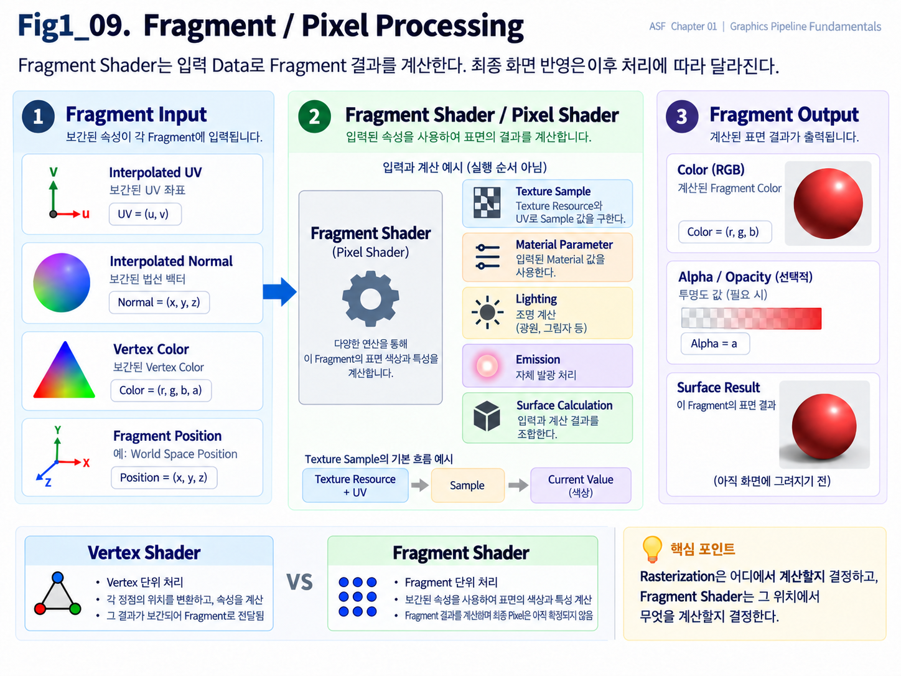

**Figure 1-9. Fragment / Pixel Processing**

Figure 1-9는 Rasterization과 Interpolation을 거친 Fragment Data가 Fragment Shader에 입력되고, Texture Sampling, Material Parameter, Lighting, Emission 등의 계산을 거쳐 Surface 결과를 만드는 흐름을 보여준다.

전체 흐름을 단순화하면 다음과 같다.

~~~text
Fragment Input
↓
Fragment Shader / Pixel Shader
↓
Texture / Material / Lighting 계산
↓
Fragment Output
~~~

여기서 중요한 점은 Fragment Shader가 최종 화면의 Pixel을 바로 확정하는 단계는 아니라는 것이다.

계산된 Fragment Result는 이후 Depth Test, Blending 등의 처리에 따라 최종 Image에 반영될 수도 있고 제거될 수도 있다.

---

### Fragment Shader

**Fragment Shader**는 Rasterization으로 생성된 각 Fragment에 대해 실행되는 Shader Program이다.

Graphics API에 따라 이름이 다르게 사용되기도 한다.

대표적으로

- OpenGL 계열에서는 **Fragment Shader**
- Direct3D 계열에서는 **Pixel Shader**

라는 표현이 많이 사용된다.

두 용어는 세부적인 역사와 API 차이는 있지만, Chapter 01에서는 같은 역할을 설명하는 표현으로 이해해도 된다.

즉,

> **Rasterization으로 생성된 화면 위치마다 Surface 결과를 계산하는 Shader Stage**

라고 보면 된다.

---

### Why Fragment Shading Is Needed

Rasterization까지 진행하면 GPU는

> **Triangle이 Screen의 어느 위치를 덮는가**

를 알고 있다.

하지만 아직

> **그 위치가 어떤 Color로 보여야 하는가**

는 결정되지 않았다.

예를 들어 같은 Triangle이라도

- Texture가 무엇인지
- Material의 Base Color가 무엇인지
- Normal 방향이 어떤지
- Light가 어디에서 들어오는지
- Roughness가 얼마인지
- Emission이 있는지

에 따라 최종 결과는 완전히 달라진다.

따라서 Fragment마다 Surface의 Appearance를 계산하는 Stage가 필요하다.

그 역할을 Fragment Shader가 담당한다.

---

### Rasterization and Fragment Processing

이 두 단계는 서로 이어져 있지만 역할이 다르다.

#### Rasterization

> **어디에서 계산할 것인가?**

Triangle이 어떤 Screen 위치를 덮는지 판단하고 Fragment를 생성한다.

#### Fragment Processing

> **그 위치에서 무엇을 계산할 것인가?**

Fragment의 UV, Normal, Texture, Material, Lighting 등을 이용해 Surface 결과를 계산한다.

즉,

~~~text
Rasterization
→ Screen 위치 결정

Fragment Shader
→ 해당 위치의 Surface 결과 계산
~~~

으로 구분할 수 있다.

이 차이는 Chapter 01에서 매우 중요하다.

---

### Fragment Shader Input

Fragment Shader는 여러 종류의 Data를 입력으로 받을 수 있다.

앞 절에서 Interpolation을 통해 계산된 값들이 대표적이다.

예를 들어 다음과 같은 Data가 있다.

- Interpolated UV
- Interpolated Normal
- Interpolated Vertex Color
- Fragment Position
- Tangent 관련 Data
- Custom Shader Data

이 값들은 Fragment마다 서로 다를 수 있다.

예를 들어 Triangle 내부의 왼쪽 Fragment와 오른쪽 Fragment는 서로 다른 UV를 가질 수 있다.

따라서 같은 Texture를 사용하더라도 서로 다른 위치의 Color를 Sample하게 된다.

---

### Texture Sampling

Fragment Shader에서 가장 자주 수행되는 작업 중 하나가 **Texture Sampling**이다.

앞 절에서 Fragment 위치에 맞는 UV가 Interpolation된다고 설명했다.

이 UV를 이용하면 Texture의 특정 위치에서 값을 읽을 수 있다.

전체 흐름은 다음과 같다.

~~~text
Vertex UV
↓
Interpolation
↓
Fragment UV
↓
Texture Sampling
↓
Texture Value
~~~

예를 들어 Base Color Texture를 Sample하면 해당 Fragment 위치의 Color 값을 얻을 수 있다.

Normal Map을 Sample하면 Surface Normal 계산에 사용할 Data를 얻을 수 있다.

Mask Texture를 Sample하면 특정 Material Effect의 강도를 결정할 수 있다.

즉,

> **Texture Sampling은 Fragment Shader가 Surface 정보를 얻기 위해 Texture에서 값을 읽는 과정**

이다.

---

### Material Parameter

Fragment Shader는 Texture만 사용하는 것이 아니다.

Material에 설정된 여러 Parameter도 사용할 수 있다.

예를 들어 다음과 같은 값이 있다.

- Base Color
- Roughness
- Metallic
- Specular
- Opacity
- Emission Strength

이러한 Parameter는 Texture와 함께 사용될 수도 있고, 독립적인 값으로 사용될 수도 있다.

예를 들어 Roughness를 Texture에서 읽지 않고 **Scalar Parameter** 하나로 지정할 수도 있다. Parameter는 외부에서 설정해 계산에 사용하는 입력이고, **Scalar**는 하나의 숫자 값이다. 여러 위치에 같은 Roughness를 쓰고 싶다면 이런 한 값의 입력을 사용할 수 있다.

즉, Fragment Shader는 다양한 Input Data를 조합하여 Surface의 특성을 계산한다.

---

### Normal

Fragment Shader에서 Normal은 Lighting 계산에 매우 중요한 Data다.

앞 절에서 Vertex Normal이 Interpolation되어 Fragment Normal이 만들어질 수 있다고 설명했다.

또한 Normal Map을 사용한다면 Texture에서 읽은 Normal 정보를 이용해 Surface 방향을 더 세밀하게 표현할 수도 있다.

즉, Fragment Shader는

- Interpolated Normal
- Tangent Space Normal Map
- Tangent / Bitangent
- 기타 Surface Data

를 이용하여 실제 Lighting에 사용할 Normal을 계산할 수 있다.

이 과정은 뒤 Chapter의 Normal Mapping과 Lighting에서 더 자세히 다룬다.

---

### Lighting

Fragment Shader에서는 Light와 Surface의 관계를 계산할 수 있다.

예를 들어 다음과 같은 Data가 사용될 수 있다.

- Surface Normal
- Light Direction
- View Direction
- Light Color
- Material Roughness
- Specular Parameter

이러한 값들을 이용해서

- **Diffuse** — 여러 방향으로 퍼지는 반사 성분의 계산
- Specular
- Shadow 영향
- 기타 Lighting Result

를 계산할 수 있다.

여기서 **Diffuse**는 여러 방향으로 퍼지는 반사 성분을, **Specular**는 반사 방향과 관찰 방향의 관계에 따라 달라지는 반사 성분을 표현하는 데 쓰인다. 각각의 모델과 정확한 구분은 Chapter 05에서 다룬다.

서로 다른 반사 모델을 공통된 방향 관계로 표현하는 함수가 **BRDF(Bidirectional Reflectance Distribution Function)**다. BRDF는 들어오는 빛의 방향과 나가는 관찰 방향에 따라 Surface가 빛을 얼마나 반사하는지 표현한다. 이후 Chapter의 Lambert Lighting, Phong Specular, BRDF 설명도 이 Surface Shading 계산과 연결된다.

Chapter 01에서는 자세한 Lighting 수학을 다시 설명하지 않는다.

현재는

> **Fragment Shader가 Fragment 위치에서 Material과 Lighting을 계산할 수 있다.**

는 점만 이해하면 충분하다.

---

### Emission

**Emission**은 Surface가 Light의 영향을 받지 않고 자체적으로 밝은 Color를 출력하도록 만드는 요소다.

예를 들어

- Neon
- LED
- Magical Effect
- UI-like Surface
- Anime Emissive Effect

등에 사용할 수 있다.

Fragment Shader에서는 Emission 값을 Material Result에 더하거나 별도의 방식으로 Output에 반영할 수 있다.

즉,

> **Fragment Shader는 Light를 계산하는 Stage일 수도 있지만, 반드시 Lighting만 계산하는 것은 아니다.**

이 점이 중요하다.

Unlit Material처럼 Lighting을 사용하지 않고 Color를 직접 출력하는 경우도 존재한다.

---

### Surface Result

Fragment Shader는 입력된 Data를 이용해 해당 Fragment의 Surface Result를 계산한다.

단순화하면 다음과 같은 형태로 생각할 수 있다.

~~~text
UV
Normal
Vertex Color
Material Parameter
Texture
Light
↓
Fragment Shader
↓
Surface Result
~~~

Surface Result는 지금 수행하는 **Render Pass**가 다음 단계에 넘겨야 할 Data다. Render Pass는 특정 목적을 위해 Scene이나 저장된 Data를 처리하는 작업 단위로 생각하면 된다.

현재 Pass에서 Color를 계산한다면 Color와 Alpha 등을 출력할 수 있다. Surface 특성을 먼저 저장하는 Pass라면 Normal이나 Material Data 같은 다른 Output이 필요할 수 있다.

- Color
- Alpha
- 기타 Rendering Output

따라서 Shader Output의 형태는 Rendering Pipeline과 Render Pass의 목적에 따라 달라진다.

1.2에서 소개한 Deferred Rendering은 계산의 목적을 나누는 예다. 여러 Surface 정보를 **GBuffer**라는 Buffer 묶음에 기록한 뒤, 다음 작업에서 그 Data를 이용해 Lighting을 계산할 수 있다. 따라서 같은 Fragment Shader Stage라도 Surface Data를 준비하는 Pass와 Lighting 결과를 만드는 Pass의 출력은 다를 수 있다. Surface Result가 항상 최종 Lighting Color라는 뜻은 아니다.

Chapter 06의 Forward / Deferred 비교에서 이 저장·소비 관계를 이어서 설명한다.

---

### Fragment Output and Final Pixels

여기서 다시 중요한 점을 확인해야 한다.

Fragment Shader가 Color를 계산했다고 해서 그 결과가 반드시 최종 화면에 남는 것은 아니다.

앞 절에서 Fragment는 **Pixel 후보**라고 설명했다.

그 이유가 바로 여기서 드러난다.

Fragment Shader가 계산한 뒤에도 다음과 같은 처리가 남아 있을 수 있다.

- Depth Test
- Stencil Test
- Blending
- 기타 Rendering Test

예를 들어 같은 Screen 위치에 Character와 Wall Fragment가 존재할 수 있다.

둘 다 Fragment Shader를 통과해 Color를 계산했다고 하더라도, Depth Test 결과에 따라 뒤쪽 Wall Fragment는 최종 화면에 반영되지 않을 수 있다.

따라서

> **Fragment Shader Output = Final Pixel**

이라고 생각하면 안 된다.

---

Technical Note — why depth testing can precede shading

### Early Depth Test

여기서 한 가지 예외적인 구조를 알아둘 필요가 있다.

일반적인 설명에서는

~~~text
Fragment Shader
↓
Depth Test
~~~

순서로 배우기 쉽다.

하지만 실제 GPU는 Performance를 위해 Fragment Shader를 실행하기 전에 Depth를 미리 검사할 수 있다.

이를 **Early-Z** 또는 **Early Depth Test**라고 부른다.

예를 들어 어떤 Fragment가 이미 다른 Surface 뒤에 완전히 가려져 있다는 것을 미리 알 수 있다면, 굳이 복잡한 Fragment Shader를 실행할 필요가 없다.

즉,

~~~text
Depth에서 실패할 Fragment
↓
Fragment Shader 실행 생략 가능
~~~

이라는 최적화가 가능하다.

다만 Shader의 동작이나 Rendering 설정에 따라 Early Depth Test를 항상 사용할 수 있는 것은 아니다.

Chapter 01에서는 Pipeline의 개념적 흐름을 이해하는 것이 우선이므로,

> **Depth Test는 Fragment가 최종 결과에 남을지를 결정하며, 실제 GPU에서는 Performance를 위해 Shader 전후의 처리 순서가 최적화될 수 있다.**

정도로 이해하면 충분하다.

Chapter 09의 Pixel Cost와 Shader Cost에서는 Early-Z와 관련된 비용 주의를 연결한다. 실제 적용 가능 조건과 실행 순서는 Shader·Render State·GPU 구현에 따라 확인해야 한다.

---

### Pixel Shader Terminology

Direct3D에서는 Fragment Shader 대신 **Pixel Shader**라는 이름을 사용한다.

이 이름 때문에

> "Pixel Shader는 이미 확정된 Pixel을 계산하는 것인가?"

라고 생각하기 쉽다.

하지만 앞에서 살펴본 것처럼 Shader가 처리하는 결과는 아직 Depth Test나 Blending을 거칠 수 있다.

따라서 개념적으로는

> **최종 Pixel에 영향을 줄 가능성이 있는 Fragment의 Surface Result를 계산한다.**

라고 이해하는 편이 정확하다.

즉, Pixel Shader라는 이름이 있다고 해서 Fragment와 Final Pixel의 구분이 사라지는 것은 아니다.

---

### Vertex and Fragment Shaders

지금까지 두 개의 중요한 Shader Stage를 배웠다.

#### Vertex Shader

Vertex 단위로 실행된다.

대표적인 역할:

- Vertex Position 변환
- Vertex Attribute 처리
- 다음 Stage로 Data 전달

~~~text
Vertex
↓
Vertex Shader
↓
Processed Vertex
~~~

#### Fragment Shader / Pixel Shader

Rasterization으로 생성된 Fragment 단위로 실행된다.

대표적인 역할:

- Texture Sampling
- Material 계산
- Normal 사용
- Lighting 계산
- Surface Color 계산

~~~text
Fragment
↓
Fragment Shader
↓
Surface Result
~~~

이 둘의 차이를 한 문장으로 표현하면 다음과 같다.

> **Vertex Shader는 Geometry의 Vertex를 처리하고, Fragment Shader는 Screen에 생성된 Fragment의 Surface 결과를 처리한다.**

---

### Shader Invocation Counts

이 차이는 Performance 관점에서도 중요하다.

여기서 **Invocation**은 Program이 입력을 처리하기 위해 한 번 실행되는 경우를 뜻한다. 어떤 입력 단위의 작업이 많이 필요한지부터 구분해 보면 실행량과 비용의 출발점을 이해할 수 있다. Vertex Shader의 작업은 주로 Vertex 수와 관련된다.

예를 들어 Mesh에 50,000개의 Rendering Vertex가 있다면 많은 Vertex Processing이 필요할 수 있다.

Fragment Shader는 Screen Coverage와 관련된다.

같은 Mesh라도 Camera 가까이에 있어 Screen 대부분을 덮는다면 매우 많은 Fragment가 생성될 수 있다.

즉,

~~~text
Vertex Shader Cost
→ Geometry / Vertex 수와 관련

Fragment Shader Cost
→ Screen Coverage / Fragment 수와 관련
~~~

이라고 볼 수 있다.

이 때문에 같은 Material이라도 작은 Object에 사용할 때와 Fullscreen Surface에 사용할 때 Performance Cost가 크게 달라질 수 있다.

자세한 비용 측정과 최적화는 Chapter 09에서 다룬다.

---

### Material Graph and Fragment Shader

Unreal Engine의 Material Graph에서 우리가 만드는 많은 계산은 최종적으로 Fragment / Pixel Shader와 연결될 수 있다.

예를 들어

- Texture Sample
- Base Color 계산
- Roughness
- Metallic
- Normal
- Emissive Color

같은 Surface 관련 계산은 Fragment Stage에서 사용되는 경우가 많다.

따라서 Material Graph를 단순히 Node들의 연결로 보는 것보다

> **이 계산이 Vertex에서 수행되는가, Fragment에서 수행되는가**

를 생각할 수 있으면 Rendering Pipeline을 훨씬 명확하게 이해할 수 있다.

예를 들어 앞에서 다룬 World Position Offset은 Vertex Processing과 연결되고,

Base Color나 Roughness를 계산하는 많은 Material Logic은 Fragment Processing과 연결된다.

---

### Fragment Processing Data Flow

이번 절을 전체적으로 정리하면 다음과 같다.

~~~text
Rasterization
↓
Fragment 생성

Interpolation
↓
Fragment Attribute 준비

UV
Normal
Vertex Color
Position
...

↓

Fragment Shader / Pixel Shader

Texture Sampling
Material Parameter
Normal
Lighting
Emission
Surface Calculation

↓

Fragment Result
↓
Depth / Stencil / Blending 등
↓
Final Image에 반영될 가능성
~~~

Fragment Shader의 핵심 역할은

> **Rasterization으로 만들어진 위치에서 Surface가 어떻게 보여야 하는지를 계산하는 것**

이다.

---

### Coverage and Surface Evaluation

두 Stage를 다시 비교하면 다음과 같다.

~~~text
Rasterization
→ 어디에서 계산할 것인가?

Fragment Shader
→ 그 위치에서 무엇을 계산할 것인가?
~~~

Rasterization이 Coverage를 준비하면 Fragment Shader는 그 위치에서 사용할 Surface Result를 계산한다.

---

### Key Takeaways

- **Fragment Shader**는 Rasterization으로 준비된 화면 위치에서 Surface Color와 기타 Rendering Result를 계산하는 Shader Stage다.
- **Pixel Shader**는 Direct3D에서 이와 같은 역할을 가리키는 용어다.
- **Texture Sampling**은 UV를 이용해 Texture의 특정 위치에서 값을 읽는 과정이다.
- **Fragment Input**에는 Interpolation으로 준비된 UV, Normal, Vertex Color 등의 Data가 포함될 수 있다.
- **Fragment Output**은 계산된 Surface Result다. 아직 최종 Pixel로 확정되지 않았으며 Pass 목적에 따라 Color나 Surface Data를 넘길 수 있다.

---

Fragment Shader가 Surface Result를 계산해도 하나의 Screen 위치에 여러 Surface가 겹칠 수 있다. 실제 Camera에 보이는 Fragment를 판단하려면 **Depth**가 필요하다. 다음 절의 **Depth Test and Surface Visibility**에서는 Depth Buffer와 Depth Test가 어떤 Surface를 화면에 남길지 판단하는 관계를 살펴본다.

---

## 1.10 Depth Test and Surface Visibility

앞 절에서는 Fragment Shader / Pixel Shader가 각 Fragment의 UV, Normal, Texture, Material, Lighting 등의 정보를 이용해 Surface Result를 계산하는 과정을 살펴보았다.

하지만 Fragment Shader가 결과를 계산했다고 해서 그 Fragment가 반드시 최종 화면에 남는 것은 아니다.

3D Scene에서는 하나의 Screen 위치 방향에 여러 Surface가 겹쳐 있을 수 있다.

예를 들어 Camera 앞에 Character가 있고, 그 뒤에 Wall이 있다고 생각해보자.

같은 Screen 위치를 바라보는 방향에는 다음과 같이 여러 Surface가 존재할 수 있다.

~~~text
Camera
↓
Character
↓
Wall
~~~

Rasterization 과정에서는 Character와 Wall 모두 같은 Screen 위치에 Fragment를 만들 수 있다.

그렇다면 최종 화면에는 어떤 Surface가 보여야 할까?

앞의 불투명한 Surface가 뒤의 Surface를 가리는 상황이라면 Camera에 더 가까운 Surface가 보여야 한다. 각 후보의 앞뒤 값을 사용할 수 있어야 이 질문에 답할 수 있다.

이 앞뒤 판정값이 **Depth**이며, 새 후보의 값과 해당 화면 위치에 저장한 값을 비교하는 과정이 **Depth Test**다. 이전 후보의 Depth를 저장할 공간인 Depth Buffer가 함께 필요하다. 이번 절에서는 값을 비교하는 일과 비교 결과를 저장하는 일을 순서대로 연결한다.

---

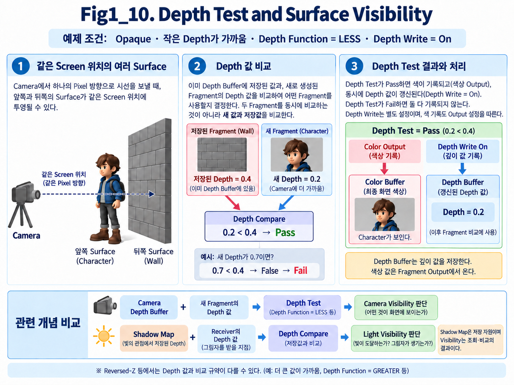

**Figure 1-10. Depth Test and Surface Visibility**

Figure 1-10은 같은 Screen 위치에 여러 Surface가 존재할 때 Depth 값을 비교하여 어떤 Fragment가 최종 화면에 남는지 결정하는 과정을 보여준다.

왼쪽에서는 Camera 기준으로 앞쪽 Character와 뒤쪽 Wall이 같은 Screen 위치 방향에 겹쳐 있다.

가운데에서는 두 Fragment의 Depth 값을 비교한다.

오른쪽에서는 Camera에 더 가까운 Character Fragment가 유지되고, 더 먼 Wall Fragment는 제거된다.

이 Figure는 앞의 불투명한 Surface가 뒤의 Surface를 가리는 기본 예를 보여준다. **Opaque Surface**는 뒤의 Surface를 투명하게 비추지 않는 불투명한 표면이다. 먼저 앞뒤 비교라는 목적을 이해하고, 아래 숫자 예시에서 비교 규칙을 확인한다.

Verification Note — conditions of Figure 1-10

이 그림은 **Opaque Surface**, **작은 Depth가 가까운 규약**, **Depth Function = LESS**, **Depth Write = On**인 예시다. Depth Function은 어느 비교 결과를 통과로 취급할지 정하는 규칙이며, `LESS`는 새 값이 저장값보다 작은 경우를 뜻한다. Depth Write는 통과한 값을 저장하는 설정이다.

새 Fragment를 기존 Depth Buffer 값과 비교한다. 두 Surface를 반드시 동시에 비교하는 것은 아니다. Depth Test를 통과하고 Depth Write도 켜져 있다면 새 Depth를 **Depth Buffer**에 저장한다. Color 기록은 Color Output과 Write 설정의 영향도 받는다.

전체 흐름을 이 조건에서 단순화하면 다음과 같다.

~~~text
여러 Fragment
↓
Depth Compare
↓
가까운 Fragment 선택
↓
Depth Buffer 갱신
↓
Visible Surface 결정
~~~

---

### Depth

**Depth**는 Camera 기준으로 Surface가 얼마나 앞쪽 또는 뒤쪽에 있는지를 나타내는 값이다.

쉽게 말하면,

> **이 Fragment가 Camera에서 얼마나 앞이나 뒤에 있는지를 판단하기 위한 값**

이라고 이해하면 된다.

다만 실제 GPU에서 사용하는 Depth 값은 단순한 World Space 거리값과 완전히 같은 것은 아니다.

Projection 과정에서 변환된 Depth 값이 사용되기 때문이다.

따라서 Chapter 01에서는 정확한 수학식보다 다음 개념을 먼저 이해하는 것이 중요하다.

> **Depth는 같은 Screen 위치에 여러 Surface가 존재할 때 앞뒤 관계를 판단하기 위한 값이다.**

Depth 값이 실제로 Projection 과정에서 어떻게 만들어지는지는 Chapter 02의 Coordinate System에서 다시 다룬다.

---

### Overlapping Fragments

앞에서 Fragment는 최종 Pixel이 아니라 **Pixel 후보**라고 설명했다.

Depth Test를 보면 그 이유를 더욱 명확하게 이해할 수 있다.

예를 들어 같은 Screen 위치에 다음 두 Fragment가 있다고 하자.

~~~text
Character Fragment
Depth = Near

Wall Fragment
Depth = Far
~~~

둘 다 Rasterization을 통해 생성된 정상적인 Fragment다.

하지만 최종 화면에서 불투명한 Character와 Wall이 같은 Pixel 위치에 동시에 보일 수는 없다.

Camera에 더 가까운 Character가 뒤의 Wall을 가리기 때문이다.

따라서 GPU는 두 Fragment의 Depth를 비교하여 어느 Surface가 실제로 보이는지를 결정해야 한다.

---

### Depth Test

**Depth Test**는 새 Fragment의 Depth 값을 현재 Depth Buffer에 저장되어 있는 값과 비교하여, 그 Fragment가 최종 화면에 기여할 수 있는지를 판단하는 과정이다.

가장 단순하게 생각하면 다음과 같다.

~~~text
새 Fragment가 더 가까움
→ Depth Test 통과

새 Fragment가 더 멂
→ Depth Test 실패
~~~

먼저 숫자의 의미를 정해야 한다. 아래 예시는 Figure 1-10처럼 **Depth가 작을수록 가깝고, 새 Depth가 저장값보다 작으면 통과하는 `LESS` 비교**를 사용한다.

예를 들어 현재 어떤 Screen 위치의 Depth Buffer에 다음 값이 저장되어 있다고 하자.

~~~text
Current Depth = 0.4
~~~

새로운 Fragment의 Depth가

~~~text
New Fragment Depth = 0.2
~~~

라면 새 Fragment가 기존 Surface보다 더 앞쪽에 있다고 판단될 수 있다.

이 경우 Depth Test를 통과하고, 필요하다면 Depth Buffer도 새로운 값으로 갱신된다.

반대로 새로운 Fragment의 Depth가

~~~text
New Fragment Depth = 0.7
~~~

이라면 기존 Surface보다 뒤에 있다고 판단되어 Depth Test에 실패할 수 있다.

Technical Note — depth comparison conventions

다른 Depth Function을 사용하면 통과 조건도 달라진다. **Reversed-Z**는 큰 Depth가 가까운 쪽을 나타내는 반대 방향의 Depth 규약이다. 이 규약에서는 `GREATER`, 즉 새 값이 저장값보다 큰 경우를 통과로 보는 계열 비교를 사용할 수 있다. 따라서 `0.2 < 0.4`라는 숫자 관계 자체를 모든 Renderer의 앞뒤 규칙으로 외우지 않는다.

기본 개념은 다음과 같다.

> **Depth Test는 같은 Screen 위치에서 어떤 Surface가 Camera에 더 가까운지를 비교하여 Surface Visibility를 결정하는 과정이다.**

---

### Depth Buffer / Z-Buffer

Depth 값을 저장하는 Buffer를 **Depth Buffer**라고 한다.

또는 **Z-Buffer**라는 이름도 자주 사용한다.

두 용어는 기본적으로 같은 역할을 설명할 때 사용된다.

Depth Buffer에는 Screen의 각 위치에 대해 현재까지 선택된 Surface의 Depth 값이 저장된다.

예를 들어 매우 단순화하면 다음처럼 생각할 수 있다.

~~~text
Screen Position A
Color = Red
Depth = 0.2

Screen Position B
Color = Blue
Depth = 0.5

Screen Position C
Color = Green
Depth = 0.3
~~~

새로운 Fragment가 들어오면 GPU는 해당 Screen 위치에 저장된 Depth와 새 Fragment의 Depth를 비교한다.

그리고 Depth Test 결과에 따라 Fragment를 유지하거나 제거할 수 있다.

---

### Z-Buffer Terminology

3D Graphics에서는 Camera 기준 앞뒤 방향을 Z축과 연결해서 설명하는 경우가 많다.

이 때문에 Depth 정보를 저장하는 Buffer를 전통적으로 **Z-Buffer**라고 부르기도 한다.

하지만 Coordinate System이나 Graphics API에 따라 Z축의 방향이나 Depth Range의 Convention이 달라질 수 있다.

따라서

> **Z-Buffer는 단순히 World Space의 Z Position을 그대로 저장하는 Buffer**

라고 이해하면 안 된다.

Chapter 01에서는

> **Depth Buffer / Z-Buffer는 화면의 각 위치에 Surface의 앞뒤 관계를 판단하기 위한 Depth 값을 저장하는 Buffer**

라고 이해하면 충분하다.

---

### Why a Depth Buffer Is Needed

Depth Buffer가 없다면 같은 Screen 위치에 여러 Geometry가 겹쳤을 때 어떤 Surface가 앞쪽에 있는지를 안정적으로 판단하기 어렵다.

예를 들어 Character 뒤에 Wall이 있다고 해보자.

Character와 Wall 모두 같은 Screen 위치에 Fragment를 생성할 수 있다.

Depth Test가 없다면 단순히 나중에 Rendering된 Surface가 앞의 Surface를 덮어쓸 수도 있다.

그러면 실제 3D Scene의 앞뒤 관계와 다른 결과가 만들어질 수 있다.

Depth Buffer를 사용하면 Rendering 순서만으로 Surface Visibility를 결정하지 않고, 각 Fragment의 Depth를 비교하여 Camera 기준 앞뒤 관계를 판단할 수 있다.

즉,

> **Depth Buffer는 3D Scene의 앞뒤 관계를 Screen 위치별로 저장하고 비교하기 위한 Data다.**

---

### Surface Visibility

**Visibility**는 말 그대로 어떤 것이 보이는지를 의미한다.

이번 절에서 말하는 **Surface Visibility**는

> **Camera에서 바라봤을 때 어떤 Surface가 실제로 화면에 보이는가**

를 의미한다.

같은 Screen 위치에 여러 Surface가 존재할 수 있지만, 불투명한 Surface를 기준으로 보면 일반적으로 Camera에 가장 가까운 Surface가 최종적으로 보인다.

Depth Test는 이러한 Camera 기준 Visibility를 결정하는 대표적인 방법이다.

전체 흐름을 다시 보면 다음과 같다.

~~~text
같은 Screen 위치의 여러 Fragment
↓
Depth 비교
↓
가장 앞쪽 Surface 판정
↓
Visible Surface 결정
~~~

---

### Camera and Light Visibility

여기서 중요한 구분이 하나 있다.

Camera 앞에 보이는 Surface라도 Light와의 사이에 다른 Geometry가 놓이면 그 Light에 직접 보이지 않을 수 있다. Camera가 보는가와 Light가 보는가는 다른 관찰 관계이기 때문이다. Chapter 08의 8.3 Shadow에서는 **Light 기준 Visibility**를 다룬다. 여기서는 Camera 기준 판단과 연결하되 두 기준을 구분한다.

하지만 지금 설명하는 Depth Test와 Shadow Map의 Visibility는 기준이 다르다.

#### Depth Test

**Camera 기준 Visibility**를 판단한다.

즉,

> **Camera에서 봤을 때 어떤 Surface가 앞에 있는가?**

를 판단한다.

#### Shadow Map Comparison

**Shadow Map**은 Light 관점에서 본 Scene의 Depth를 저장한 자원이다. Light가 처음 만나는 Surface의 앞뒤 정보를 저장해 두면, 현재 Surface가 그 뒤에 가려졌는지 검사할 수 있다. 현재 Surface를 같은 Light 좌표와 Depth 규약으로 변환한 뒤 저장값과 비교하여 **Light 기준 Visibility**를 구한다.

즉,

> **Light에서 봤을 때 이 Surface가 Light에 직접 보이는가, 다른 Geometry에 가려져 있는가?**

를 판단한다.

두 과정 모두 Depth 정보를 이용할 수 있다는 점에서는 비슷하지만, 바라보는 기준이 다르다.

~~~text
Depth Test
→ Camera 기준

Shadow Map의 Depth와 현재 Surface Depth 비교
→ Light 기준
~~~

이 차이를 명확히 구분해야 한다.

---

### Camera Depth Buffer and Shadow Map

Depth Buffer와 Shadow Map은 둘 다 Depth 정보를 저장한다는 공통점이 있다.

하지만 목적은 다르다.

#### Camera Depth Buffer

Camera에서 본 Surface의 Depth를 저장한다.

주요 목적:

- Surface Visibility 판단
- Depth Test
- Screen-Space Effect 등에 활용

#### Shadow Map

Light에서 본 Scene의 Depth를 저장한다.

주요 목적:

- Light 기준 Visibility 판단
- Shadow 생성

따라서

> **Depth Buffer = Shadow Map**

이라고 생각하면 안 된다.

둘은 비슷한 원리를 사용하지만 서로 다른 Viewpoint와 목적을 가진다.

---

### Fragments as Pixel Candidates

이제 앞에서 Fragment를 **Pixel 후보**라고 표현한 이유를 다시 확인할 수 있다.

Rasterization으로 Fragment가 생성되었다고 해도 해당 Fragment는 Depth Test에서 실패할 수 있다.

예를 들어 다음 두 Fragment가 있다고 하자.

~~~text
Character Fragment
Depth = Near

Wall Fragment
Depth = Far
~~~

Wall Fragment도 정상적으로 생성된 Fragment다.

하지만 Character 뒤에 가려져 있기 때문에 최종 화면에는 기여하지 못할 수 있다.

즉,

~~~text
Rasterization
↓
Fragment 생성
↓
Depth Test
↓
통과 또는 실패
~~~

라는 추가 판단이 남아 있다.

그래서 Fragment는 아직 최종 Pixel로 확정된 Data가 아니다.

---

### Depth Test Results

Depth Test에서는 일반적으로 두 가지 중요한 결과가 생긴다.

#### Depth Test Pass

새 Fragment가 조건을 만족한다.

이 경우 Fragment가 다음 Rendering 결과에 기여할 수 있다.

필요하면 Depth Buffer도 새 Fragment의 Depth로 갱신된다.

#### Depth Test Fail

새 Fragment가 조건을 만족하지 못한다.

이 경우 해당 Fragment는 최종 Surface Result에 기여하지 못하고 제거될 수 있다.

즉,

~~~text
Fragment
↓
Depth Test

Pass
→ 유지

Fail
→ 제거
~~~

라고 이해하면 된다.

---

### Depth Write

Depth Test와 함께 자주 등장하는 개념이 **Depth Write**다.

두 개는 같은 개념이 아니다.

**Depth Test**는

> 새 Fragment를 현재 Depth와 비교하는 것

이고,

**Depth Write**는

> Depth Test를 통과한 Fragment의 Depth 값을 Depth Buffer에 기록하는 것

이다.

즉,

~~~text
Depth Test
→ 비교

Depth Write
→ 저장
~~~

이라고 구분하면 된다.

Rendering 설정에 따라 Depth Test는 하면서 Depth Write는 하지 않는 경우도 있다.

Transparency Rendering에서 이러한 설정이 중요하게 사용될 수 있지만, 자세한 내용은 이후 Rendering과 Optimization Chapter에서 다시 다룬다.

---

Technical Note — Early-Z and the conceptual pipeline order

### Early-Z

앞 절에서 잠깐 살펴본 것처럼 실제 GPU에서는 Performance를 위해 Depth Test를 Fragment Shader보다 먼저 수행할 수도 있다.

이러한 최적화 방식 중 하나를 **Early-Z** 또는 **Early Depth Test**라고 한다.

만약 어떤 Fragment가 이미 다른 Surface 뒤에 가려져 있다는 것을 Fragment Shader 실행 전에 알 수 있다면,

복잡한 Texture Sampling이나 Lighting 계산을 수행한 뒤 버리는 것보다 처음부터 계산하지 않는 것이 효율적이다.

~~~text
Depth Test Fail 예상
↓
Fragment Shader 실행 생략
↓
불필요한 계산 감소
~~~

다만 실제 GPU Pipeline은 Rendering State와 Shader 동작에 따라 처리 순서가 달라질 수 있다.

따라서 Chapter 01에서는

> **GPU는 불필요한 Fragment Shader 계산을 줄이기 위해 Depth Test를 가능한 한 일찍 수행할 수 있다.**

정도로 이해하면 충분하다.

Chapter 09의 Pixel Cost와 Shader Cost에서는 Early-Z와 관련된 비용 주의를 연결한다. 실제 적용 가능 조건과 실행 순서는 Shader·Render State·GPU 구현에 따라 확인해야 한다.

---

### Transparent Surfaces

지금까지는 주로 불투명한 **Opaque Surface**를 기준으로 설명했다.

Opaque Surface에서는 앞쪽 Surface가 뒤쪽 Surface를 완전히 가리는 경우가 많기 때문에 Depth Test가 비교적 단순하게 작동한다.

하지만 Transparent Surface는 상황이 다르다.

예를 들어 유리처럼 뒤쪽 Surface가 함께 보여야 한다면 단순히 뒤 Fragment를 제거할 수 없다.

이 경우에는 Depth Test뿐 아니라

- **Sorting** — 함께 보일 Surface를 어떤 순서로 처리할지 정하는 작업
- **Blending** — 새 결과와 저장한 결과를 결합하는 작업
- Depth Write 설정

등이 함께 중요해진다.

같은 화면 위치가 여러 Surface의 계산을 반복해 받는 현상이 **Overdraw**다. Transparency와 Overdraw의 자세한 내용은 **Chapter 09 - Rendering Debug and Optimization**에서 다시 다룬다.

현재 Chapter에서는 Opaque Surface를 기준으로 Depth Test의 기본 원리를 이해하는 데 집중한다.

---

### Depth Test Data Flow

이번 절의 내용을 전체적으로 정리하면 다음과 같다.

~~~text
Rasterization
↓
Fragment 생성
↓
Fragment Depth
↓
Depth Buffer의 기존 Depth와 비교
↓
Depth Test

Pass
→ Fragment 유지
→ 필요하면 Depth Write

Fail
→ Fragment 제거

↓
Visible Surface 결정
~~~

Depth Test의 핵심은 다음과 같다.

> **같은 Screen 위치에 여러 Fragment가 있을 때 Camera 기준 앞뒤 관계를 비교하여 어떤 Surface가 보일지를 결정한다.**

---

### Camera and Light Visibility Comparison

두 Visibility는 같은 Depth 정보를 사용할 수 있어도 기준과 목적이 다르다.

~~~text
Depth Test
→ Camera 기준 Visibility
→ 화면에서 어떤 Surface가 보이는가?

Shadow Map의 Depth와 현재 Surface Depth 비교
→ Light 기준 Visibility
→ Light가 어떤 Surface를 직접 볼 수 있는가?
~~~

둘 다 Depth를 사용할 수 있지만 목적은 다르다.

이 차이는 이후 Shadow와 Rendering Pipeline을 이해할 때 매우 중요하다.

---

### Key Takeaways

- **Depth**는 같은 Screen 위치에서 Surface의 앞뒤 관계를 판단하기 위한 값이다.
- **Depth Buffer / Z-Buffer**는 위치별 Depth를 저장해 이후 Fragment와 비교할 수 있도록 한다.
- **Depth Test**는 새 Fragment의 Depth를 저장값과 비교한다. 어떤 비교가 통과인지는 Depth 규약과 설정을 따른다.
- **Depth Write**는 조건을 만족한 Depth를 Buffer에 기록하는 작업이다. Test와 Write는 별도로 설정할 수 있다.
- **Surface Visibility**는 Camera에서 어떤 Surface가 보이는가에 대한 문제다. Shadow의 Light 기준 Visibility와 구분한다.

---

Depth Test로 기여할 수 있는 Fragment를 판단했으므로, 이제 계산된 Color와 Depth 등의 결과를 저장할 공간이 필요하다. 다음 절에서는 여러 Buffer를 함께 사용하는 **Framebuffer**를 통해 Fragment Result가 어디에 저장되고 Final Image로 어떻게 이어지는지 살펴본다.

---

## 1.11 Framebuffer and Final Image

Fragment의 Color를 계산하고 앞뒤 조건을 검사했다고 생각해 보자. 계산한 값을 저장하지 않으면 다음 Fragment는 기존의 결과를 비교할 수 없고, 다음 작업도 Image를 이어서 처리할 수 없다. 앞 절의 Depth Test는 이처럼 저장된 값과 새 값을 연결해 Camera 기준으로 어떤 Surface가 보일지 판단했다.

이제 계산된 결과를 어디에 남길지 생각해 보자. 다음 Fragment가 들어왔을 때 앞뒤를 비교하려면 Depth를 기억해야 한다. 뒤의 작업에서 Image를 완성하려면 Color도 기억해야 한다.

GPU는 이 결과를 Monitor에 곧바로 그려 넣는 대신 **Buffer**에 저장한다. Buffer는 이후 작업에서 읽거나 갱신할 Data를 담아두는 저장 공간이다.

Color를 담는 것이 **Color Buffer**, 앞뒤 비교에 사용할 Depth를 담는 것이 **Depth Buffer**다. 두 Data는 목적이 다르므로 서로 다른 저장 대상이 필요하다.

Rendering 결과를 기록하는 개별 Texture나 Surface를 **Render Target**이라고 한다. 이러한 Color 저장 대상과 Depth / Stencil 저장 대상을 함께 구성하는 관계를 이 Chapter에서는 **Framebuffer**로 설명한다.

먼저 이 저장 목적의 차이를 살펴본 뒤, 저장된 결과가 Post Process와 Present를 거쳐 화면으로 이어지는 흐름을 연결한다.

Technical Note — where the depth value comes from

Color는 Fragment Shader의 출력으로 얻을 수 있다. 기본 Depth는 Rasterization에서 준비되는 값이며, 항상 Fragment Shader가 별도 출력하는 값은 아니다. Shader가 Depth를 명시적으로 덮어쓰는 경우도 있으므로 기본 Raster Depth와 선택적인 Shader Override를 구분한다.

---

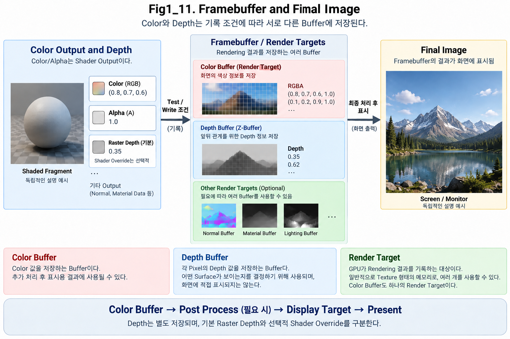

**Figure 1-11. Framebuffer and Final Image**

Figure 1-11은 Fragment Shader에서 계산된 결과가 Framebuffer에 기록되고, 이후 Final Image로 이어지는 흐름을 보여준다.

왼쪽은 결과로 기록할 Color와 Depth를, 가운데는 이 Data를 저장하는 서로 다른 대상을 보여준다. 저장값은 이후 처리에 다시 사용할 수 있으므로, 오른쪽의 최종 Image로 이어지는 관계를 함께 본다.

Verification Note — how to read Figure 1-11

왼쪽의 Color/Alpha는 Fragment Shader 출력으로 읽고, Depth는 기본 raster depth와 선택적인 Shader override를 구분해서 읽는다. 현재 Figure는 기본 Raster Depth와 선택적인 Shader Override를 별도로 표시하며, 서로 다른 Scene 삽화는 독립적인 설명 예시로 구분한다.

가운데에서는 이러한 결과가 Color Buffer, Depth Buffer, 기타 Render Target에 기록된다.

오른쪽에서는 저장된 결과가 최종 Image로 구성되어 Screen에 표시된다.

전체 흐름을 단순화하면 다음과 같다.

~~~text
Fragment Result
↓
Framebuffer / Render Targets
↓
Final Image
↓
Screen
~~~

---

### Framebuffer

**Framebuffer**는 Rendering 결과를 저장하기 위해 사용하는 Buffer들의 집합 또는 연결 구조다.

쉽게 말하면,

> **GPU가 한 Frame의 결과를 기록해두는 저장 공간 묶음**

이라고 이해하면 된다.

Framebuffer에는 하나의 Buffer만 존재하는 것이 아니다.

필요에 따라 여러 종류의 Buffer가 함께 사용될 수 있다.

대표적으로 다음과 같은 것들이 있다.

- Color Buffer
- Depth Buffer
- Stencil Buffer
- 기타 Render Target

즉,

~~~text
Framebuffer
├─ Color Buffer
├─ Depth Buffer
├─ Stencil Buffer
└─ Other Render Targets
~~~

처럼 생각할 수 있다.

---

### Color Buffer

**Color Buffer**는 화면의 Color 결과를 저장하는 Buffer다.

Fragment Shader에서 계산된 RGB 또는 RGBA 값이 최종적으로 기록될 수 있다.

예를 들어 어떤 Screen 위치의 결과가 다음과 같다고 하자.

~~~text
Color = (0.8, 0.7, 0.6, 1.0)
~~~

이 값은 Color Buffer의 해당 Screen 위치에 저장될 수 있다.

즉,

> **Color Buffer는 해당 Rendering 작업의 Color 결과를 위치별로 저장하는 Buffer**

라고 이해하면 된다.

이 결과는 이후 작업의 입력이 될 수도 있고, 추가 처리 뒤 Display에 사용할 Image가 될 수도 있다. Color Buffer에 기록되었다고 해서 모든 경우에 최종 Display Color가 이미 확정된 것은 아니다.

---

### Color Buffer Layout

Color Buffer는 Screen의 Pixel 배열과 대응되는 2D Data라고 생각할 수 있다.

예를 들어 Screen이 1920 × 1080이라면 Color Buffer도 이와 대응되는 해상도의 Color Data를 가질 수 있다.

개념적으로는 다음과 같다.

~~~text
Color Buffer

[Color][Color][Color][Color]...
[Color][Color][Color][Color]...
[Color][Color][Color][Color]...
...
~~~

각 위치에는 RGB 또는 RGBA와 같은 값이 저장된다.

그래서 Color Buffer는 하나의 Image Texture처럼 생각할 수 있다.

---

### Depth Buffer

앞 절에서 살펴본 **Depth Buffer**도 Framebuffer와 함께 사용된다.

Color Buffer가 Color를 저장한다면,

Depth Buffer는 각 Screen 위치의 Depth 값을 저장한다.

예를 들어 다음과 같이 서로 대응될 수 있다.

~~~text
Screen Position A

Color Buffer
→ (0.8, 0.2, 0.1, 1.0)

Depth Buffer
→ 0.35
~~~

즉, 같은 Screen 위치에 대해

- Color 정보
- Depth 정보

가 서로 다른 Buffer에 저장될 수 있다.

이 점이 중요하다.

> **Color와 Depth는 서로 다른 종류의 Data이므로 별도의 Buffer에 저장된다.**

---

### Depth as Internal Data

Color Buffer의 내용은 최종 화면의 색과 직접 연결된다.

반면 Depth Buffer의 값은 일반적으로 사용자가 그대로 보는 최종 Image가 아니다.

Depth Buffer는 주로 다음과 같은 계산에 사용된다.

- Depth Test
- Surface Visibility
- Screen-Space Effect
- 기타 Rendering 계산

따라서 Depth Buffer는 눈에 보이는 Color Image라기보다,

> **Rendering을 위해 사용하는 보조 Data**

에 가깝다.

---

### Render Target

**Render Target**은 GPU가 Rendering 결과를 기록하는 대상이다.

쉽게 말하면,

> **Shader의 결과를 저장하는 Texture 또는 Surface**

라고 생각하면 된다.

예를 들어 Fragment Shader의 Color 결과가 특정 Texture에 기록된다면, 그 Texture가 Render Target 역할을 한다.

Color Buffer 역시 하나의 Render Target으로 볼 수 있다.

즉,

~~~text
Fragment Shader Output
↓
Render Target
↓
Texture 형태로 저장
~~~

라는 구조가 가능하다.

---

### Render Targets and Framebuffer

둘은 매우 밀접하지만 완전히 같은 의미는 아니다.

#### Render Target

GPU가 실제 Rendering 결과를 기록하는 개별 대상이다.

예를 들어

- Color Texture
- Normal Texture
- Material Data Texture

같은 형태가 될 수 있다.

#### Framebuffer

이러한 Render Target과 Depth / Stencil Buffer 등을 함께 묶어 Rendering에 사용할 수 있도록 구성하는 구조다.

즉,

> **Render Target은 개별 저장 대상이고, Framebuffer는 여러 저장 대상을 묶어서 사용하는 구조**

라고 이해하면 좋다.

---

### Multiple Render Targets

현대 Rendering에서는 한 번의 Fragment Processing에서 하나의 Color만 출력하지 않을 수도 있다.

필요에 따라 여러 종류의 Data를 동시에 저장할 수 있다.

예를 들어 다음과 같은 Data가 있을 수 있다.

- Base Color
- Normal
- Roughness
- Metallic
- Material ID

이런 방식으로 여러 Render Target을 사용하는 구조를 **Multiple Render Targets**, 줄여서 **MRT**라고 부른다.

Chapter 01에서는 MRT의 세부 동작까지 다루지 않는다.

현재는

> **Framebuffer에는 하나의 Color Buffer만 있는 것이 아니라, 필요에 따라 여러 Render Target이 연결될 수 있다.**

는 점만 이해하면 충분하다.

---

### Deferred Rendering and GBuffer

Chapter 06의 Forward / Deferred 비교에서 이어서 설명할 **Deferred Rendering**에서는 여러 Surface 정보를 각각의 Buffer에 저장한다.

1.2에서 소개한 이 Buffer 묶음이 **GBuffer(Geometry Buffer)**다. 저장한 Surface Data를 뒤의 Lighting 작업이 읽는다는 관계가 핵심이다.

예를 들어 GBuffer에는 다음과 같은 Data가 저장될 수 있다.

- Base Color
- Normal
- Roughness
- Metallic
- Depth 관련 정보

즉, Chapter 01에서 배우는 Framebuffer와 Render Target 개념이 나중에 Deferred Rendering의 GBuffer 구조로 확장된다.

하지만 여기서는 연결 관계만 알고 넘어가면 된다.

---

### Writing Fragment Results

Fragment Shader가 Surface Result를 계산했다고 하자.

예를 들어 다음과 같은 결과가 나올 수 있다.

~~~text
Shader Color = (0.8, 0.3, 0.2)
Shader Alpha = 1.0
Raster Depth = 0.35  // Shader depth override가 없는 예
~~~

Depth Test를 통과하고 해당 Write가 활성화되어 있다면 다음과 같이 기록될 수 있다. Color는 Blending 설정을 거칠 수 있으며 Depth Test 통과와 Depth Write 활성화는 별도 조건이다.

~~~text
Color Buffer
← Color Result 기록

Depth Buffer
← Depth 기록
~~~

즉,

~~~text
Fragment Shader
↓
Depth Test
↓
Buffer Write
↓
Framebuffer
~~~

라는 흐름으로 이어진다.

---

### Processing After Buffer Writes

Framebuffer에 결과가 기록되었다고 해서 곧바로 Monitor에 표시되는 것은 아니다.

Rendering Pipeline에서는 이후에도 여러 단계가 존재할 수 있다.

예를 들어

- Post Process — 이미 저장한 화면 결과를 입력으로 다시 처리
- **Tone Mapping** — 계산된 밝기 범위를 표시할 범위에 대응시키는 처리
- **Color Grading** — 최종 색 표현을 조정하는 처리
- **UI Composite** — User Interface, 즉 화면 안내 요소를 기존 결과에 결합하는 처리
- **Final Resolve** — 여러 Sample 등으로 준비된 결과를 이후 표시나 처리에 사용할 형태로 정리하는 작업

같은 작업이 수행될 수 있다.

Chapter 01에서는 이 세부 Rendering Pass까지 깊게 들어가지 않는다.

현재는

> **Framebuffer에 저장된 Rendering 결과가 이후 처리 과정을 거쳐 Final Image로 이어진다.**

라고 이해하면 충분하다.

---

### Final Image

Rendering 결과가 모든 필요한 처리를 마치면 최종적으로 하나의 2D Image가 만들어진다.

이 결과가 하나의 **Frame**이다.

예를 들어 60 FPS 게임에서는 이상적으로 1초 동안 약 60개의 Frame이 만들어진다.

즉,

~~~text
Frame 1
Frame 2
Frame 3
...
Frame 60
~~~

이런 Image들이 매우 빠르게 연속적으로 표시되면서 움직이는 영상처럼 보이게 된다.

---

### Double Buffering

실시간 Rendering에서는 화면에 표시 중인 Image와 GPU가 다음 Frame을 그리는 Image를 같은 Buffer 하나에서 동시에 처리하면 문제가 생길 수 있다.

예를 들어 GPU가 아직 새로운 Frame을 그리는 중인데 Monitor가 그 내용을 읽으면 화면이 중간 상태로 보일 수 있다.

이를 피하기 위해 흔히 **Double Buffering**을 사용한다.

개념적으로는 두 Buffer를 번갈아 사용하는 방식이다.

~~~text
Front Buffer
→ 현재 Screen에 표시 중

Back Buffer
→ GPU가 다음 Frame을 Rendering 중
~~~

다음 Frame이 완성되면 역할을 바꾼다.

~~~text
Back Buffer 완성
↓
Swap
↓
새 Frame 표시
~~~

이 분리는 GPU가 다음 Frame을 준비하는 동안 표시 중인 Image를 보존하는 데 도움이 된다. 표시용 결과와 작성 중인 결과의 역할을 나누는 것이 기본 직관이다.

Implementation Note — buffering does not define presentation timing

Double Buffering만으로 **tearing**, 즉 한 화면에 서로 다른 Frame의 일부가 섞여 보이는 현상의 방지나 일정한 Frame 간격이 보장되지는 않는다. 실제 표시는 Present 방식, 동기화, swap chain 설정에 의존한다. 구체 API 동작은 대상 환경에서 확인한다.

---

### Front and Back Buffers

**Front Buffer**는 현재 Display에 사용되는 Image다.

**Back Buffer**는 GPU가 다음 Frame을 Rendering하는 대상이다.

전체 흐름을 단순화하면 다음과 같다.

~~~text
Back Buffer
↓
Rendering 완료
↓
Present
↓
Front Buffer 역할
↓
Screen 표시
~~~

이 역할을 번갈아 수행한다.

---

### Swap Chain

현대 Graphics API에서는 이런 Display용 Buffer들을 관리하는 구조를 **Swap Chain**이라고 부른다.

Swap Chain에는 여러 개의 Image Buffer가 존재할 수 있다.

예를 들어

- Double Buffering
- Triple Buffering

같은 방식이 사용될 수 있다.

Chapter 01에서는 Swap Chain의 세부 API 구조까지 다룰 필요는 없다.

현재는 다음 정도로 이해하면 충분하다.

> **GPU는 완성된 Frame을 Display에 전달하기 위해 여러 Buffer를 순서대로 교체해서 사용할 수 있다.**

---

### Present

완성된 Frame을 Display에 보여주는 과정을 흔히 **Present**라고 표현한다.

즉,

~~~text
Rendering
↓
Framebuffer / Back Buffer
↓
Final Image 완성
↓
Present
↓
Screen
~~~

이라는 흐름이다.

이 단계에서 우리가 실제 Monitor에서 보는 Image가 만들어진다.

---

### Framebuffer and Render Targets in Practice

Unreal Engine을 사용하다 보면 **Render Target**이라는 이름을 직접 접하게 된다.

예를 들어 Render Target Texture를 만들어 SceneCapture 결과를 기록하거나, 특정 Material Effect에서 중간 Rendering 결과를 저장할 수 있다.

이것은 바로 현재 배우고 있는 개념과 연결된다.

즉,

> **Render Target은 GPU가 Rendering 결과를 Texture 형태로 저장하는 대상**

이다.

그래서 Render Target을 다른 Material에서 다시 Sample하는 것도 가능하다.

---

### Render to Texture

Rendering 결과를 바로 Screen에 표시하지 않고 Texture에 기록하는 것을 흔히 **Render to Texture**라고 한다.

예를 들어 다음과 같은 용도로 사용할 수 있다.

- Mirror
- CCTV Screen
- Mini Map
- Portal
- Scene Capture
- Custom Effect

전체 흐름은 다음과 같다.

~~~text
Scene Rendering
↓
Render Target Texture
↓
다른 Material에서 Sample
↓
최종 Screen에 사용
~~~

즉, Rendering 결과가 항상 바로 Final Image로 가는 것은 아니다.

중간 Texture로 저장한 뒤 다른 Rendering 과정에서 다시 사용할 수도 있다.

---

### Storing Rendering Results

지금까지 Chapter 01에서 살펴본 흐름을 다시 연결해보자.

~~~text
3D Model
↓
Vertex Processing
↓
Primitive Assembly
↓
Culling / Clipping
↓
Rasterization
↓
Interpolation
↓
Fragment Processing
↓
Depth Test
↓
Framebuffer
↓
Final Image
~~~

Framebuffer는 이 흐름에서

> **GPU가 계산한 결과를 실제 Image Data로 저장하는 단계**

와 연결된다.

이제 3D Geometry에서 시작한 Data가 실제 2D Image의 Color와 Depth Data로 변환되었다.

---

### Data Flow

~~~text
Fragment Shader Result
↓
Depth Test
↓
Framebuffer

├─ Color Buffer
├─ Depth Buffer
└─ Other Render Targets

↓
Post Process / Final Processing
↓
Back Buffer
↓
Present
↓
Final Image
↓
Screen
~~~

---

### Key Takeaways

- **Framebuffer**는 Rendering 결과를 저장하는 여러 Buffer를 함께 사용하는 집합 또는 연결 구조로 이해한다.
- **Color Buffer**는 Color Result, **Depth Buffer**는 앞뒤 판단에 사용할 Depth를 저장한다.
- **Render Target**은 GPU가 결과를 기록하는 개별 Texture나 Surface다. 여러 저장 대상을 묶는 관계와 구분한다.
- **Double Buffering**은 표시 중인 Frame과 다음 Frame을 그리는 저장 대상을 분리한다. 표시 동기화의 모든 조건을 이 분리만으로 보장하지는 않는다.
- **Present**는 완성된 Frame을 Display에 전달하는 과정이다. 중간 Color Buffer는 추가 처리 뒤 이 결과로 이어질 수 있다.

---

지금까지는 GPU가 Geometry를 처리해 Final Image로 연결하는 흐름을 살펴보았다. 그렇다면 GPU는 어떤 Mesh를 그릴지 어떻게 알까? CPU와 Game Engine은 Scene의 Object, Material, Shader, Buffer 정보를 준비한다. 준비된 Geometry와 설정으로 Primitive를 그리라고 요청하는 명령 단위가 **Draw Call**이다. 다음 절에서는 CPU의 Rendering 준비와 GPU의 Pipeline 실행이 어떻게 연결되는지 살펴본다.

---

## 1.12 CPU, GPU and Draw Calls

Scene에 같은 Character Mesh를 두 개 배치했다고 생각해 보자. GPU가 사용할 Mesh Data는 같아도 각 Character의 위치와 Material 설정은 다를 수 있다. GPU는 그중 어떤 Data와 설정으로 지금의 작업을 수행해야 하는가?

앞 절까지는 GPU가 Geometry를 처리하고 결과를 저장하는 흐름을 따라왔다. 그 흐름을 실행하기 전에는 사용할 Mesh, Material, Transform, Shader와 기록 설정을 준비해야 한다.

이번 절은 **CPU가 Draw를 준비하는 기본 흐름**을 기준으로 설명한다. 1.1에서 소개한 CPU와 Engine이 Scene 상태와 작업에 사용할 Data를 준비하고, GPU는 제출된 명령에 따라 계산을 실행한다.

그 연결에서 Geometry를 그리라고 요청하는 단위가 **Draw Call**이다. 먼저 준비와 요청, 실행의 역할을 구분한 뒤, 한 Object가 왜 여러 Draw로 나뉠 수 있는지 살펴본다. 이 구분은 Data의 저장량, 제출 비용, GPU의 실제 계산 비용을 혼동하지 않는 데 필요하다.

---

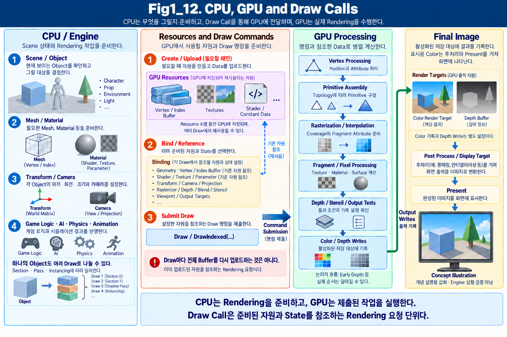

**Figure 1-12. CPU, GPU and Draw Calls**

Figure 1-12는 CPU / Engine이 Scene과 Object를 확인하고 Rendering에 필요한 Data를 준비한 뒤, Draw Call을 통해 GPU에 작업을 전달하는 기본적인 CPU-driven 흐름을 보여준다.

그림 중앙은 먼저 필요한 Data를 준비하고, 그 Data를 현재 작업에 연결한 뒤 Draw를 요청하는 관계다. **State**는 어떤 Program과 자원을 사용하고 어떤 규칙으로 검사·기록할지 정한 설정이다. 준비와 요청을 같은 일로 보지 않는 것이 중요하다.

Implementation Note — creation, binding, and submission are different operations

그림 중앙은 **필요할 때 자원을 생성·업로드하는 단계**, **준비된 자원과 State를 바인딩·참조하는 단계**, **Draw 명령을 제출하는 단계**를 구분한다. 업로드는 Data를 GPU가 사용할 자원에 전달하는 작업이며, 바인딩은 현재 작업에서 사용할 자원을 연결하는 작업이다. 제출은 준비된 명령의 실행을 요청하는 일이다.

매 Draw마다 Vertex / Index Buffer 전체를 다시 복사하는 것은 아니다. 하나의 Object가 여러 Draw로 나뉘는 목록도 예시이며, 실제 Draw 수는 Pass, Section, Instancing 등에 따라 달라진다. 아래 본문에서 이 분리와 반복 Drawing을 연결한다.

Figure / Implementation Note — resource references and verification scope

GPU Resources는 Resource 수명 동안 유지되며, Draw 명령이 필요한 자원과 State를 참조한다. 이 개념도만으로 실제 Buffer 업로드량이나 비용을 추정하지 않는다.

그림 안의 Scene과 Monitor 화면은 `Concept Illustration`으로 표시한 개념 설명용 삽화다. 특정 Engine Version이나 현재 ASF 구현의 실행 검증 결과를 보여주는 자료는 아니다.

GPU는 전달받은 Geometry Data와 Shader State를 이용해 실제 Rendering Pipeline을 실행한다.

전체 흐름을 단순화하면 다음과 같다.

~~~text
CPU / Engine
↓
Rendering Data 준비
↓
Draw Call
↓
GPU
↓
Rendering Pipeline 실행
↓
Framebuffer
↓
Final Image
~~~

이 관계를 가장 간단하게 표현하면 다음과 같다.

> **CPU는 무엇을 그릴지 준비하고, GPU는 그것을 실제로 그린다.**

---

### CPU Responsibilities

**CPU**는 게임 전체의 다양한 작업을 처리한다.

예를 들어 다음과 같은 것들이 있다.

- Game Logic
- AI
- Physics
- Animation
- Scene Management
- Object State
- Rendering Preparation

Rendering과 관련해서는 현재 Scene에서 어떤 Object를 그려야 하는지 판단하고, GPU가 사용할 수 있도록 필요한 Data와 Command를 준비한다.

예를 들어 Character 하나를 Rendering한다고 생각해보자.

CPU / Engine 쪽에서는 다음과 같은 정보를 준비할 수 있다.

- 어떤 Mesh를 사용할 것인가
- 어떤 Material을 사용할 것인가
- Object의 Transform은 무엇인가
- 어떤 Texture와 Parameter를 사용할 것인가
- 어떤 Shader를 사용할 것인가
- 어떤 Render State를 사용할 것인가

즉, CPU는 Rendering을 위한 **준비와 지시**를 담당한다.

---

### GPU Responsibilities

**GPU**는 대량의 Graphics Data를 병렬로 계산하는 데 특화된 Processor다.

CPU가 준비한 Command와 Data를 받으면 실제 Rendering Pipeline을 실행한다.

예를 들어 다음과 같은 단계들이 GPU에서 수행된다.

~~~text
Vertex Buffer
↓
Vertex Shader
↓
Primitive Assembly
↓
Rasterization
↓
Fragment Shader
↓
Depth Test
↓
Framebuffer
~~~

GPU는 매우 많은 Vertex와 Fragment를 동시에 처리할 수 있도록 설계되어 있다.

이 때문에 Real-time Rendering에서 대량의 Geometry와 Pixel 계산을 빠르게 수행할 수 있다.

---

### CPU and GPU Responsibilities

둘의 역할을 단순하게 비교하면 다음과 같다.

#### CPU

> **무엇을 처리할지 준비하고 명령한다.**

대표적인 역할:

- Scene 상태 확인
- Object 관리
- Transform 계산
- Rendering Command 생성
- Draw Call 전달

#### GPU

> **전달받은 Data를 대량으로 계산한다.**

대표적인 역할:

- Vertex Processing
- Rasterization
- Fragment Processing
- Depth Test
- Render Target Write

즉,

~~~text
CPU
→ 준비 / 명령

GPU
→ 대량 계산 / Rendering
~~~

이라고 이해하면 된다.

---

### Draw Call

**Draw Call**은 CPU가 GPU에 보내는 Rendering 요청 단위다.

쉽게 말하면,

> **이 Geometry를, 이 Shader와 Material State를 사용해서 그려라**

라는 명령이라고 생각하면 된다.

예를 들어 Character 하나를 그릴 때 CPU는 GPU에 다음과 같은 정보를 전달해야 한다.

- Vertex Buffer
- Index Buffer
- Shader
- Material
- Texture
- Transform
- Render State

그리고 GPU는 이 정보를 바탕으로 실제 Rendering Pipeline을 실행한다.

---

### Objects and Draw Calls

처음에는

> **Object 하나 = Draw Call 하나**

라고 생각하기 쉽다.

하지만 실제로는 반드시 그렇지 않다.

하나의 Object가 여러 **Material Slot**을 가지고 있다면 여러 Draw Call로 나뉠 수 있다. Material Slot은 Mesh의 일부에 어떤 Material을 사용할지 연결하는 자리다. 같은 Mesh라도 서로 다른 Material을 쓰는 부분은 별도의 처리 단위인 **Section**으로 나뉠 수 있다.

예를 들어 Character가 다음과 같은 Material을 사용한다고 하자.

~~~text
Character

Material 0 → Skin
Material 1 → Hair
Material 2 → Outfit
Material 3 → Eye
~~~

이 경우 Rendering 방식에 따라 각 Material Section이 별도의 Draw Call로 처리될 수 있다.

즉,

~~~text
Character
↓
Skin Draw Call
Hair Draw Call
Outfit Draw Call
Eye Draw Call
~~~

처럼 하나의 Character에서 여러 Draw Call이 발생할 수 있다.

---

### Material Slots and Draw Calls

Character Modeling에서 Material Slot을 여러 개 사용하는 경우가 많다.

예를 들어 다음과 같이 나눌 수 있다.

- Face
- Body
- Hair
- Eye
- Outfit
- Accessory

작업 편의성 측면에서는 Material을 나누는 것이 유용할 수 있다.

하지만 Rendering 관점에서는 Material Section이 나뉘면서 Draw Call이 증가할 수 있다.

따라서 Material Slot은 단순한 Material 관리 문제만은 아니다.

> **Mesh가 몇 개의 Rendering Section으로 나뉘는가**

와 연결될 수 있다.

이 부분은 Character Optimization에서 매우 중요한 요소다.

자세한 내용은 **Chapter 09 - Rendering Debug and Optimization**에서 다시 다룬다.

---

### Draw Call Inputs

Draw Call을 실행하려면 GPU가 어떤 Geometry와 State를 사용할지 알아야 한다. 여기서 입력을 준비한다는 것은 자원 전체를 매 Draw마다 복사한다는 뜻이 아니다. 이미 만들어진 자원을 현재 작업에 연결하고, 필요한 값과 설정을 지정한 뒤 Draw 명령을 제출할 수 있다.

대표적으로 다음과 같은 Data가 필요할 수 있다.

#### Geometry Data

- Vertex Buffer
- Index Buffer

#### Shader State

- Vertex Shader
- Fragment / Pixel Shader

#### Material Data

- Texture
- Material Parameter
- Constant Data

#### Transform Data

- World Matrix
- Camera Matrix
- Projection 관련 Data

#### Render State

- Blend State
- Depth State
- Stencil State
- Rasterizer State
- Render Target

즉, Draw Call은 단순히

> **"Mesh를 그려라."**

라는 명령 하나만 의미하는 것이 아니다.

GPU가 Rendering을 수행하기 위해 필요한 여러 State와 Data가 함께 연결된다.

---

### Vertex Buffer

앞 절에서 Vertex가 Position, Normal, UV, Tangent, Vertex Color 같은 Attribute를 가진다고 설명했다.

이러한 Vertex Data가 GPU에서 사용할 수 있도록 저장된 Buffer를 **Vertex Buffer**라고 한다.

개념적으로는 다음과 같다.

~~~text
Vertex Buffer

Vertex 0
├─ Position
├─ Normal
├─ UV
└─ ...

Vertex 1
├─ Position
├─ Normal
├─ UV
└─ ...

Vertex 2
...
~~~

GPU의 Vertex Shader는 이 Vertex Buffer의 Data를 읽어 Vertex Processing을 수행한다. Vertex Buffer는 입력을 저장하는 자원이고, Vertex Shader는 그 입력을 계산하는 Program이다. 저장 공간과 실행 단계를 구분하면 같은 Mesh 자원을 여러 Object가 공유하는 경우도 이해할 수 있다.

---

### Index Buffer

앞에서 Primitive Assembly를 설명하면서 **Index Buffer**도 살펴보았다.

Index Buffer에는 어떤 Vertex들이 Triangle을 구성하는지에 대한 Index Data가 저장된다.

예를 들어 다음과 같다.

~~~text
Index Buffer

[0, 1, 2]
[0, 2, 3]
...
~~~

Indexed Draw에서는 Vertex Buffer와 Index Buffer를 함께 사용해서 Triangle을 구성한다. Non-indexed Draw에서는 Vertex 순서와 Topology로 연결 관계를 정한다.

즉,

~~~text
Vertex Buffer
+
Index Buffer
↓
Primitive Assembly
↓
Triangle
~~~

이라는 관계다.

---

### Shader State

GPU는 어떤 Shader를 실행할지도 알아야 한다.

대표적으로

- Vertex Shader
- Fragment Shader / Pixel Shader

가 있다.

예를 들어 Vertex Shader에서는 Vertex Position을 처리하고,

Fragment Shader에서는 Texture, Material, Lighting 등의 Surface Result를 계산할 수 있다.

따라서 Draw Call은

> **어떤 Geometry를 어떤 Shader로 처리할 것인가**

를 함께 지정해야 한다.

---

### Materials and Textures

Material은 Fragment Shader에서 사용할 여러 Data를 제공한다.

예를 들어 다음과 같은 것들이 있다.

- Base Color Texture
- Normal Map
- Roughness
- Metallic
- Emission
- Scalar Parameter
- Vector Parameter

Draw Call을 실행할 때 GPU는 현재 Rendering에 사용할 Material과 Texture를 알 수 있어야 한다.

즉,

~~~text
Draw Call
↓
Mesh
+
Shader
+
Material
+
Texture
+
Parameter
~~~

가 함께 연결된다.

---

### Transform Data

같은 Mesh라도 World의 서로 다른 위치에 배치할 수 있다.

예를 들어 동일한 Tree Mesh를 Scene에 100개 배치할 수 있다.

Mesh Data 자체는 같지만 각 Tree의

- Position
- Rotation
- Scale

은 서로 다를 수 있다.

이러한 Object Transform도 GPU에 전달되어 Vertex Processing에서 사용된다.

즉,

~~~text
Mesh
+
Transform
↓
Vertex Shader
↓
World 위치 결정
~~~

으로 연결된다.

---

### Render State

Rendering에는 Geometry와 Shader만 필요한 것이 아니다.

GPU가 어떤 방식으로 Surface를 처리할지 결정하는 여러 **Render State**도 존재한다.

예를 들어 다음과 같은 것들이 있다.

- Backface Culling On / Off
- Depth Test
- Depth Write
- Blending
- Stencil
- Render Target

이러한 State가 달라지면 같은 Geometry와 Shader라도 Rendering 결과가 달라질 수 있다.

즉, Draw Call은

> **어떤 Geometry를 어떤 Rendering 상태로 처리할 것인가**

를 지정하는 작업이기도 하다.

---

### Draw Calls in a Scene

Scene 안에 다음과 같은 Object가 있다고 하자.

~~~text
Character
Sword
Tree
Rock
Building
Effect
...
~~~

각 Object와 Material Section을 Rendering하기 위해 여러 Draw Call이 생성될 수 있다.

예를 들어 다음과 같이 될 수 있다.

~~~text
Draw Call 1 → Character Skin
Draw Call 2 → Character Hair
Draw Call 3 → Character Eye
Draw Call 4 → Sword
Draw Call 5 → Tree
Draw Call 6 → Rock
...
~~~

Scene이 복잡해질수록 Draw Call 수도 증가할 수 있다.

---

### Draw Submission Cost

어떤 계산이 빨라도 그 작업을 지시하는 준비가 늦으면 Frame 전체가 늦어질 수 있다. 이처럼 현재 전체 진행을 제한하는 작업을 **Bottleneck**이라고 한다. Draw Call의 제출 작업은 GPU가 Vertex와 Fragment를 계산하는 비용과는 조금 다른 종류의 Cost를 가진다.

CPU가 Draw Call을 만들고,

필요한 State를 준비하고,

Command를 GPU에 전달해야 하기 때문이다.

따라서 Draw Call이 지나치게 많아지면 GPU가 충분히 빠르더라도 CPU 쪽 Rendering Preparation이 Bottleneck이 될 수 있다.

즉,

~~~text
많은 Draw Calls
↓
CPU Rendering Command 증가
↓
CPU Cost 증가 가능
~~~

라는 문제가 생길 수 있다.

하지만 단순히

> **Draw Call은 적을수록 무조건 좋다**

라고 생각하는 것도 정확하지 않다.

Implementation Note — draw count and modern submission strategies

현대 Rendering Engine에는 여러 작업을 묶어 제출하는 **Batching**, 같은 Mesh를 여러 배치 정보로 반복해서 그리는 **Instancing**, GPU가 작업 선별·실행 요청의 일부를 준비하는 **GPU Driven Rendering**, 여러 Draw 요청을 함께 처리하는 **Multi Draw** 등 다양한 방식이 존재한다.

이 방식들은 작업을 조직하는 방법과 비용을 바꿀 수 있다. 따라서 Draw 수만으로 전체 비용을 확정하지 않는다. 실제 구조와 측정 결과를 함께 확인한다.

따라서 Draw Call Cost와 실제 최적화 방법은 **Chapter 09 - Rendering Debug and Optimization**에서 자세히 다룬다.

---

### CPU and GPU Bottlenecks

CPU가 준비를 마쳐야 GPU가 다음 작업을 받을 수 있고, GPU가 계산을 마쳐야 결과를 이어서 사용할 수 있다. 어느 쪽의 작업이 현재 Frame을 제한하는지에 따라 대응이 달라진다. Rendering Performance 문제는 크게 CPU와 GPU 양쪽에서 발생할 수 있다.

예를 들어 Draw Call이 지나치게 많다면 CPU가 GPU에 Command를 준비하는 데 시간이 많이 걸릴 수 있다.

반면 매우 복잡한 Material이 Screen 전체를 덮고 있다면 GPU의 Fragment Processing이 Bottleneck이 될 수 있다.

즉,

~~~text
CPU Bottleneck
→ Draw Calls / Scene Processing / Command Preparation

GPU Bottleneck
→ Vertex / Pixel / Shader / Rasterization Cost
~~~

처럼 서로 다른 원인이 존재할 수 있다.

이 때문에 Optimization에서는 먼저

> **현재 Bottleneck이 CPU인지 GPU인지**

판단하는 것이 중요하다.

이 주제 역시 Chapter 09에서 자세히 다룬다.

---

### Repeated Mesh Rendering

같은 Mesh를 여러 Object에서 사용하는 경우를 생각해보자.

예를 들어 동일한 Rock Mesh를 Scene에 100개 배치했다고 하자.

모든 Object가 같은 Vertex Buffer를 사용할 수 있지만 Transform은 각각 다르다.

가장 단순한 방식에서는 각각의 Object에 대해 Draw Call이 발생할 수 있다.

~~~text
Rock Mesh
↓
Draw Call 1 → Transform A
Draw Call 2 → Transform B
Draw Call 3 → Transform C
...
~~~

하지만 같은 Mesh와 Material을 반복해서 그리는 경우에는 **Instancing** 같은 Optimization을 사용할 수도 있다.

이를 통해 여러 Object를 더 효율적으로 GPU에 전달할 수 있다.

자세한 내용은 Chapter 09에서 다시 다룬다.

---

### Rendering Command

Draw Call은 더 큰 **Rendering Command** 흐름의 일부라고 볼 수 있다.

CPU는 Frame마다 여러 Rendering Command를 생성하고 GPU에 전달한다.

예를 들어 다음과 같은 Command들이 있을 수 있다.

~~~text
Set Render Target
Set Shader
Set Material
Set Vertex Buffer
Set Index Buffer
Draw
Draw
Draw
...
~~~

GPU는 이러한 Command를 순서대로 처리하면서 Frame을 Rendering한다.

실제 Graphics API에서는 명령들을 담는 **Command Buffer**와 제출된 작업을 관리하는 **Queue** 같은 더 복잡한 구조를 사용하지만, Chapter 01에서는

> **CPU가 Rendering Command를 준비하고 GPU가 이를 실행한다.**

는 큰 흐름만 이해하면 충분하다.

---

Implementation Note — CPU / GPU work can overlap

### CPU and GPU Frame Overlap

CPU와 GPU는 서로 완전히 같은 Timing으로 한 작업씩 번갈아 수행하는 구조는 아니다.

CPU가 다음 Frame의 Command를 준비하는 동안 GPU는 이전에 전달받은 Rendering 작업을 수행할 수 있다.

즉, 두 Processor는 일정 부분 병렬로 동작할 수 있다.

개념적으로는 다음과 같이 생각할 수 있다.

~~~text
CPU
Frame 1 준비
→ Frame 2 준비
→ Frame 3 준비

GPU
     Frame 1 실행
     → Frame 2 실행
     → Frame 3 실행
~~~

이 때문에 CPU와 GPU 사이의 동기화와 Pipeline 관리도 Performance에 영향을 줄 수 있다.

다만 이 부분은 Chapter 01의 범위를 넘어가므로 이후 Optimization에서 다시 다룬다.

---

### Unreal Materials and Draw Calls

Unreal Engine에서 Character Material을 구성할 때도 Draw Call 개념은 중요하다.

예를 들어 Character가

- Skin
- Hair
- Eye
- Outfit
- Accessory

등 여러 Material Slot을 가지고 있다면 Rendering Section이 나뉠 수 있다.

ASF처럼 Character Shader를 구현할 때도 단순히 Shader Instruction 수만 볼 것이 아니라

- Material Slot 수
- Mesh Section 수
- Pass 수
- Transparency
- Shadow Pass

등이 전체 Rendering Cost에 영향을 줄 수 있다.

즉,

> **Material Optimization은 Shader 내부 계산만 줄이는 문제가 아니다.**

Rendering Pipeline 전체 구조를 함께 봐야 한다.

뒤에서는 관찰 조건에 맞는 Geometry의 세부 수준을 선택하는 LOD(Level of Detail)도 살펴본다. 여기서는 준비할 Geometry가 달라지면 GPU에 전달할 작업도 달라질 수 있다는 연결만 확인한다. 이 관계는 Chapter 09의 9.6 Draw Call Cost와 9.7 LOD and Culling에서 다시 연결한다.

---

### From Draw Submission to GPU Processing

CPU가 Draw Call을 GPU에 전달하면 GPU는 해당 Geometry에 대해 Rendering Pipeline을 실행한다.

지금까지 Chapter 01에서 배운 흐름과 연결하면 다음과 같다.

~~~text
CPU / Engine

Scene Object 확인
↓
Mesh / Material / Transform 준비
↓
Draw Call

↓

GPU

Vertex Buffer / Index Buffer
↓
Vertex Processing
↓
Primitive Assembly
↓
Culling / Clipping
↓
Rasterization
↓
Interpolation
↓
Fragment Processing
↓
Depth Test
↓
Framebuffer

↓

Final Image
~~~

이제 Chapter 01의 각 Stage가 하나의 전체 흐름으로 연결되기 시작한다.

---

### Core Relationship

~~~text
CPU
↓
무엇을 그릴지 준비

Draw Call
↓
GPU에 Rendering 요청

GPU
↓
실제 Rendering Pipeline 실행
~~~
---

이제 Chapter 01에서 필요한 주요 Stage를 모두 살펴보았다.

처음에는 단순히

~~~text
3D Scene
↓
Rendering
↓
2D Image
~~~

라고 시작했지만, 실제로 그 사이에는 매우 많은 단계가 존재했다.

### Key Takeaways

- 기본 CPU-driven 흐름에서 **CPU**는 Scene 상태와 Rendering Data / Command를 준비하고, **GPU**는 전달된 작업에 따라 Vertex와 Fragment 등을 계산한다.
- **Draw Call**은 지정한 Geometry와 State로 Rendering하도록 요청하는 단위다.
- **Vertex Buffer**는 Vertex Attribute Data를 저장한다.
- **Index Buffer**는 Indexed Draw에서 어떤 Vertex들이 Primitive를 구성하는지 지정한다. Non-indexed Draw에서는 순차 Vertex와 Topology를 사용한다.
- **Render State**에는 Depth, Blend, Culling, Render Target처럼 Rendering 방식과 기록 결과에 영향을 주는 설정이 포함된다.

---

다음 절의 **Complete Rendering Pipeline**에서는 3D Mesh가 CPU와 GPU를 거쳐 최종 Screen Image가 되기까지의 Data Flow를 하나로 연결한다.

---

## 1.13 Complete Rendering Pipeline

Chapter의 처음에는 3D Mesh가 어떻게 최종 Screen의 Pixel이 되는지 질문했다. 이제 Character 하나를 화면에 보여주는 일을 다시 따라가 보자. Scene에서 필요한 Data를 준비하고, 각 Vertex를 계산하고, Triangle을 구성한 뒤, 화면 위치별 Surface 후보를 계산해 결과를 저장한다. 지금까지 Chapter 01에서는 이 연결을 단계별로 살펴보았다.

처음에는 단순하게

~~~text
3D Scene
↓
Rendering
↓
2D Image
~~~

라고 표현했지만, 실제 Rendering 과정은 여러 Stage로 나뉘어 있다.

CPU / Engine은 Scene과 Object의 상태를 확인하고 Rendering에 필요한 Data와 Command를 준비한다.

그다음 Draw Call을 통해 GPU에 Rendering 작업을 요청한다.

GPU는 전달받은 Geometry Data와 Shader State를 사용하여 Vertex Processing, Primitive Assembly, Rasterization, Fragment Processing과 같은 여러 Stage를 수행한다.

그리고 최종 결과는 Framebuffer에 기록되고 Present 과정을 거쳐 Screen에 표시된다.

이번 절에서는 지금까지 배운 내용을 하나의 **Complete Rendering Pipeline**으로 다시 연결한다. 이미 배운 개념의 뜻을 새로 암기하는 구간이 아니라, 각 단계의 출력이 다음 단계의 입력이 되는지를 확인하는 구간이다. CPU의 준비, GPU의 계산, 결과의 저장과 표시는 서로 다른 역할이라는 점을 따라간다.

---

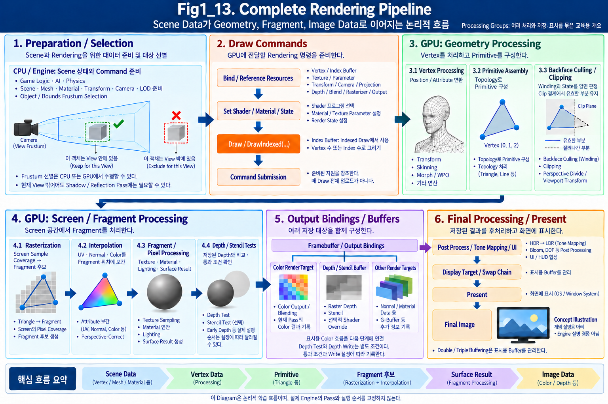

**Figure 1-13. Complete Rendering Pipeline**

Figure 1-13은 Chapter 01에서 살펴본 전체 Rendering 흐름을 하나의 Diagram으로 정리한 것이다.

이 Figure의 여섯 **Processing Group**은 준비, Geometry 처리, Screen / Fragment 처리, 저장 자원, 표시 흐름을 묶은 교육용 개요다. 먼저 Data가 왼쪽에서 오른쪽으로 이동하며 어떤 처리 단위로 바뀌는지 본다. 각 Group은 기능을 이해하기 위해 묶은 영역이며 하나의 Hardware Stage를 뜻하지 않는다.

Verification Note — selection and output groups in Figure 1-13

Object / Bounds Frustum 선별은 `Preparation / Selection`에 따로 표시하고, GPU Geometry 처리의 Backface / Clipping과 구분한다. `Framebuffer / Output Bindings` 아래에는 개별 Color Render Target, Depth / Stencil Buffer, 기타 Render Target을 나누어 표시한다. 본문의 1.6과 1.11 구분을 함께 읽는다.

Figure / Implementation Note — processing groups and verification scope

각 Group은 하나의 Hardware Stage가 아니다. Object / Bounds를 선별하는 Frustum Culling은 CPU 또는 GPU에서 수행할 수 있으며, Triangle의 Backface / Clipping과 판정 대상이 다르다. 현재 View 밖의 Object도 Shadow / Reflection Pass에는 필요할 수 있다.

Framebuffer / Output Bindings는 여러 Buffer / Attachment를 함께 구성하는 관계이고, 각 Render Target은 개별 저장 대상이다. Depth Test와 Depth Write는 별도 조건이며, 실제 기록은 통과 조건과 Write 설정에 따라 달라진다.

그림은 논리적 학습 흐름을 보여준다. Early Depth 등 실제 실행 순서와 Engine의 Pass 구성을 고정하지 않는다. Scene과 Final Image는 `Concept Illustration`으로 표시한 개념 설명용 삽화이며, 특정 Engine Version이나 현재 ASF 구현의 실행 검증 결과를 보여주는 자료는 아니다.

큰 흐름은 다음과 같이 나눌 수 있다.

~~~text
CPU / Engine
↓
Draw Call
↓
GPU - Geometry Processing
↓
GPU - Screen / Fragment Processing
↓
Framebuffer
↓
Present
↓
Final Image
~~~

아래 여섯 Group은 CPU 준비, GPU 처리, 저장 자원, 표시를 묶은 교육용 개요다. 각각이 하나의 GPU Hardware Stage인 것은 아니다. 실제 Stage의 데이터 의존 관계와 여러 Frame 작업의 overlap도 구분한다.

---

### CPU / Engine — Rendering Preparation

Rendering은 GPU에서 시작되지 않는다.

먼저 CPU와 Game Engine이 현재 Scene을 확인하고 Rendering에 필요한 Data를 준비한다.

대표적으로 다음과 같은 작업이 있다.

- 어떤 Object를 Rendering할 것인지 결정
- Mesh 선택
- Material 선택
- Texture 준비
- Transform 준비
- Camera 관련 Data 준비
- Render State 준비
- **LOD(Level of Detail)** 선택 — 관찰 조건에 맞는 Geometry의 세부 수준 선택
- Culling 관련 판단
- Rendering Command 생성

즉, CPU / Engine은 GPU가 실제 Rendering을 수행하기 전에

> **무엇을, 어떤 상태로 그릴 것인지 준비한다.**

---

### Scene and Object Selection

Scene에는 매우 많은 Object가 존재할 수 있다.

하지만 현재 Camera 화면에 모든 Object가 필요한 것은 아니다.

Engine은 Object의 상태를 확인하고 현재 Frame에서 Rendering할 대상을 결정한다.

예를 들어 다음과 같은 판단이 이루어질 수 있다.

- Object가 활성화되어 있는가
- Camera가 볼 수 있는 범위에 있는가
- 어떤 LOD를 사용할 것인가
- 현재 Render Pass에 필요한 Object인가

이러한 판단을 통해 이후 GPU에 전달할 Rendering 작업의 양을 줄일 수 있다.

세부적인 Culling과 Optimization은 Chapter 09에서 다시 다룬다.

---

### Rendering Data Preparation

Rendering할 Object가 결정되면 필요한 Data를 준비한다.

대표적으로 다음과 같다.

#### Mesh Data

- Vertex Buffer
- Index Buffer

#### Material Data

- Shader
- Texture
- Material Parameter

#### Transform Data

- World Transform
- Camera 관련 Matrix
- Projection 관련 Data

#### Render State

- Depth State
- Blend State
- Rasterizer State
- Culling State
- Render Target

이 Data들은 이후 GPU가 Rendering Pipeline을 실행하는 데 사용된다.

---

### Draw Call

필요한 Data와 State가 준비되면 CPU는 GPU에 실제 Rendering 요청을 보낸다.

이 요청 단위가 **Draw Call**이다.

쉽게 말하면,

> **현재 설정된 Geometry와 Shader, Material, Render State를 사용해서 이 Primitive들을 그려라.**

라는 명령이다.

중요한 점은 Vertex Buffer, Index Buffer, Shader, Material 각각이 별도의 Draw Call이라는 뜻이 아니라는 것이다.

CPU는 먼저 필요한 State를 설정하고, 그 상태를 사용하여 실제 Draw 명령을 실행한다.

개념적으로는 다음과 같다.

~~~text
Set Vertex Buffer
Set Index Buffer
Set Shader
Set Material / Texture
Set Transform
Set Render State
↓
DrawIndexed(...)
~~~

이 중 실제 Geometry를 그리도록 요청하는 Draw 명령이 하나의 Draw Call에 해당한다.

---

### Submission and GPU Execution

Draw Call이 GPU에 전달되면 GPU는 지정된 Geometry와 State를 사용해 Rendering Pipeline을 실행한다.

즉,

~~~text
CPU
↓
Rendering 준비

Draw Call
↓
Rendering 요청

GPU
↓
Graphics Pipeline 실행
~~~

이라는 관계다.

여기서부터 지금까지 Chapter 01에서 살펴본 GPU Pipeline이 시작된다.

---

### GPU — Geometry Processing

GPU Rendering의 앞부분은 주로 **Geometry 중심의 처리**다.

대표적으로 다음 Stage가 포함된다.

~~~text
Vertex Processing
↓
Primitive Assembly
↓
Culling / Clipping
~~~

이 단계에서는 아직 최종 Pixel Color를 계산하지 않는다.

3D Geometry를 이후 Screen Rendering에 사용할 수 있도록 준비하는 것이 주요 목적이다.

---

### Vertex Processing

먼저 GPU는 Vertex Buffer의 Vertex를 처리한다.

각 Vertex에는 다음과 같은 Attribute가 존재할 수 있다.

- Position
- Normal
- UV
- Tangent
- Vertex Color
- Bone Data
- 기타 Custom Data

Vertex Shader는 각 Vertex에 대해 실행되며 Position과 Attribute를 처리한다.

대표적인 Position 흐름은 다음과 같다.

~~~text
Local Space
↓
World Space
↓
View Space
↓
Clip Space
~~~

이 과정에서 Object의 Transform과 Camera 관련 정보가 사용된다.

또한 필요하다면 World Position Offset이나 Skinning처럼 Vertex Position 자체를 수정할 수도 있다.

---

### Primitive Assembly

Vertex Processing이 끝난 뒤 처리된 Vertex들이 모여 Triangle과 같은 Primitive를 구성한다.

이 과정이 **Primitive Assembly**다.

Index Buffer는 어떤 Vertex들이 Triangle을 구성하는지 알려준다.

예를 들어 다음 Index가 있다고 하자.

~~~text
[0, 1, 2]
~~~

그러면 Vertex Buffer의 0, 1, 2번 Vertex를 이용해 하나의 Triangle을 구성한다.

즉,

~~~text
Processed Vertices
+
Index Data
↓
Primitive Assembly
↓
Triangle
~~~

이라는 흐름이다.

---

### Culling / Clipping

구성된 모든 Primitive를 Rasterization까지 처리할 필요는 없다.

따라서 불필요한 Geometry를 제거하거나 Rendering 가능한 범위에 맞게 잘라낸다.

#### Culling

불필요한 Geometry를 제거한다.

대표적으로

- Backface Culling
- 별도 Object 선별 단계에서 수행할 수 있는 Frustum Culling

등이 있다. 이 목록은 제거 목적의 분류이며, Frustum Culling을 반드시 Primitive Assembly 직후 GPU Stage에 배치한다는 뜻은 아니다.

#### Clipping

View Frustum의 경계에 걸쳐 있는 Primitive의 바깥 부분을 잘라내고 유효한 부분만 남긴다.

즉,

> **Culling은 제거하고, Clipping은 경계에서 잘라낸다.**

이 과정을 거치고 나면 실제 Screen에 영향을 줄 가능성이 있는 Primitive만 다음 Stage로 넘어간다.

---

### Geometry Processing Output

지금까지의 흐름을 다시 정리하면 다음과 같다.

~~~text
Vertex Buffer / Index Buffer
↓
Vertex Processing
↓
Processed Vertex
↓
Primitive Assembly
↓
Triangle
↓
Culling / Clipping
↓
유효한 Triangle
~~~

여기까지는 주로 Geometry를 다루는 Stage였다.

이제부터 Triangle을 Screen의 위치와 연결해야 한다.

---

### GPU — Screen / Fragment Processing

이 시점부터 Rendering Pipeline은 Geometry 중심의 처리에서 **Screen과 Fragment 중심의 처리**로 넘어간다.

대표적인 흐름은 다음과 같다.

~~~text
Rasterization
↓
Interpolation
↓
Fragment / Pixel Processing
↓
Depth Test
~~~

---

### Rasterization

Rasterization은 Screen에 투영된 Triangle이 어떤 Screen 위치를 덮는지 판단하는 과정이다.

즉,

> **Triangle이 Screen의 어디에 영향을 주는가**

를 결정한다.

Triangle이 덮는 Sample 위치에는 Fragment가 생성된다.

~~~text
Triangle
↓
Rasterization
↓
Coverage 판단
↓
Fragment 생성
~~~

Fragment는 아직 최종 Pixel이 아니라 이후 Rendering 계산을 위한 후보 Data다.

---

### Interpolation

Rasterization으로 Fragment 위치가 만들어져도 Fragment에는 원래 Vertex가 존재하지 않는다.

하지만 Fragment Shader에서는 UV, Normal, Vertex Color 같은 Attribute가 필요하다.

그래서 Triangle의 세 Vertex가 가진 값을 이용해 Fragment 위치에 맞는 값을 계산한다.

이 과정이 **Interpolation**이다.

Interpolation을 쉽게 표현하면

> **이미 알고 있는 Vertex의 값 사이에서 Fragment 위치에 맞는 중간값을 계산해 채우는 과정**

이다.

예를 들어 다음과 같은 흐름이 가능하다.

~~~text
Vertex UV
↓
Interpolation
↓
Fragment UV
~~~

Normal, Vertex Color 등도 같은 방식으로 Fragment 위치에 맞게 계산될 수 있다.

---

### Fragment / Pixel Processing

Fragment 위치와 Attribute가 준비되면 Fragment Shader / Pixel Shader가 실행된다.

이 단계에서는 Surface가 실제로 어떻게 보여야 하는지를 계산한다.

대표적인 작업은 다음과 같다.

- Texture Sampling
- Material Parameter 계산
- Base Color
- Normal
- Roughness
- Metallic
- Lighting
- Emission
- 기타 Surface Calculation

즉,

~~~text
Fragment Data
↓
Fragment Shader
↓
Surface Result
~~~

라는 흐름이다.

Rasterization과 Fragment Shader의 역할을 다시 비교하면 다음과 같다.

~~~text
Rasterization
→ 어디에서 계산할 것인가?

Fragment Shader
→ 그 위치에서 무엇을 계산할 것인가?
~~~

---

### Depth Test

Fragment Shader에서 Surface Result가 계산되었다고 해서 모든 Fragment가 최종 Image에 남는 것은 아니다.

같은 Screen 위치에 여러 Surface가 존재할 수 있기 때문이다.

Depth Test는 새 Fragment의 Depth와 Depth Buffer에 저장된 값을 비교하여 어떤 Surface가 Camera 기준으로 앞에 있는지 판단한다.

~~~text
Fragment
↓
Depth Compare

Pass
→ 유지

Fail
→ 제거
~~~

이 과정을 통해 **Camera 기준 Surface Visibility**가 결정된다.

---

### Geometry and Screen Processing

Chapter 01의 GPU Pipeline은 크게 두 영역으로 구분해서 생각하면 이해하기 쉽다.

#### Geometry Processing

~~~text
Vertex Processing
↓
Primitive Assembly
↓
Culling / Clipping
~~~

주로 Vertex와 Triangle을 처리한다.

#### Screen / Fragment Processing

~~~text
Rasterization
↓
Interpolation
↓
Fragment Processing
↓
Depth Test
~~~

주로 Screen 위치와 Fragment를 처리한다.

그리고 이 두 영역을 연결하는 핵심 전환점이 **Rasterization**이다.

---

### Framebuffer

Depth Test와 Fragment Processing을 통해 결정된 Rendering 결과는 Buffer에 기록된다.

이 결과를 저장하기 위한 구조가 **Framebuffer**다.

Framebuffer에는 필요에 따라 여러 종류의 Buffer가 연결될 수 있다.

대표적으로

- Color Buffer
- Depth Buffer
- Stencil Buffer
- Other Render Targets

가 있다.

즉,

~~~text
Fragment Result
↓
Framebuffer

├─ Color Buffer
├─ Depth Buffer
└─ Other Render Targets
~~~

와 같은 구조다.

---

### Color Buffer

Color Buffer에는 화면의 Color Result가 저장된다.

예를 들어 각 Screen 위치마다 다음과 같은 Data가 기록될 수 있다.

~~~text
RGBA
(0.8, 0.2, 0.1, 1.0)
~~~

이 Color Data가 최종 Image의 기반이 된다.

---

### Depth Buffer

Depth Buffer에는 각 Screen 위치의 Depth 값이 저장된다.

이 값은 Depth Test를 통해 Surface Visibility를 판단하는 데 사용된다.

Color Buffer와 Depth Buffer는 서로 다른 종류의 Data를 저장하지만 같은 Screen 위치에 대응될 수 있다.

---

### Other Render Targets

현대 Rendering에서는 필요에 따라 Color와 Depth 외에도 여러 Data를 별도의 Render Target에 저장할 수 있다.

예를 들어

- Normal
- Material Data
- Lighting Data
- Custom Mask

등이 있다.

Deferred Rendering의 GBuffer가 이러한 구조의 대표적인 예다.

Chapter 06의 Forward / Deferred 비교에서 GBuffer와 Lighting 계산의 관계를 이어서 살펴본다.

---

### Present

Framebuffer에 Final Image가 준비되면 Display에 전달해야 한다.

이 과정을 일반적으로 **Present**라고 한다.

실시간 Rendering에서는 보통 Back Buffer에 다음 Frame을 Rendering한 뒤, 완성된 Image를 Display용 Buffer로 전달한다.

전체 흐름은 다음처럼 생각할 수 있다.

~~~text
Framebuffer / Back Buffer
↓
Rendering 완료
↓
Present
↓
Display
~~~

---

### Final Image

Present까지 완료되면 최종적으로 Monitor에서 하나의 Frame을 볼 수 있다.

즉, Chapter 01의 시작에서 제시했던

~~~text
3D Scene
↓
Rendering
↓
2D Image
~~~

라는 매우 단순한 표현 안에는 실제로 다음과 같은 복잡한 과정이 존재한다.

~~~text
3D Scene
↓
CPU / Engine Preparation
↓
Draw Call
↓
GPU Rendering Pipeline
↓
Framebuffer
↓
Present
↓
Final Image
~~~

---

### Complete Data Flow

Chapter 01에서 배운 전체 Data Flow를 한 번에 정리하면 다음과 같다.

~~~text
3D Scene / Object
↓
CPU / Engine

Scene 확인
Mesh 준비
Material 준비
Transform 준비
Render State 준비

↓
Draw Call

↓
GPU

Vertex Buffer / Index Buffer

↓
Vertex Processing

Vertex Position / Attribute 처리

↓
Primitive Assembly

Triangle 구성

↓
Culling / Clipping

불필요한 Geometry 제거
경계 Geometry 처리

↓
Rasterization

Triangle이 덮는 Screen 위치 판정
Fragment 생성

↓
Interpolation

Vertex Attribute를
Fragment 위치에 맞게 계산

↓
Fragment / Pixel Processing

Texture Sampling
Material
Lighting
Surface Result

↓
Depth Test

Camera 기준 Visibility 판단

↓
Framebuffer

Color Buffer
Depth Buffer
Other Render Targets

↓
Present

↓
Final Image
~~~

---

### Data Transformations

Rendering Pipeline을 이해할 때 Stage 이름만 외우는 것보다 중요한 것은 **Data의 형태가 어떻게 변하는지**다.

처음에는 Scene의 Object와 Mesh Data로 시작한다.

~~~text
Scene Object
↓
Vertex Data
↓
Triangle
↓
Fragment
↓
Surface Result
↓
Pixel / Image Data
~~~

즉,

> **Rendering Pipeline은 3D Geometry Data가 점진적으로 Screen Image Data로 변환되는 과정**

이라고 볼 수 있다.

---

### Chapter 01 Review Questions

Chapter 01을 시작할 때 다음 질문을 제시했다.

> **3D Mesh는 어떤 과정을 거쳐 최종 Screen의 Pixel이 되는가?**

이제 이 질문에 다음과 같이 답할 수 있다.

먼저 CPU / Engine이 Scene과 Rendering Data를 준비하고 Draw Call을 통해 GPU에 작업을 요청한다.

GPU는 Vertex를 처리하고 Triangle을 구성한다.

불필요한 Geometry를 제거하거나 잘라낸 뒤 Rasterization을 통해 Triangle을 Screen 위치의 Fragment로 연결한다.

Vertex Attribute는 Interpolation을 통해 Fragment 위치에 맞는 값으로 계산된다.

Fragment Shader는 Texture, Material, Lighting 등을 이용해 Surface Result를 계산한다.

Depth Test는 어떤 Surface가 Camera에서 실제로 보이는지를 결정한다.

최종 결과는 Framebuffer에 저장되고 Present 과정을 거쳐 Screen에 표시된다.

---

### Why the Rendering Pipeline Matters

Rendering Pipeline을 이해하면 Unreal Engine에서 사용하는 여러 기능이 더 이상 서로 떨어진 개념처럼 보이지 않는다.

예를 들어

**World Position Offset**

→ Vertex Processing과 연결된다.

**Material Texture Sample**

→ Fragment Processing과 연결된다.

**Backface Culling**

→ Primitive와 Rasterizer State에 연결된다.

**Depth Test**

→ Surface Visibility와 연결된다.

**Render Target**

→ Framebuffer와 Rendering Output에 연결된다.

**Draw Call**

→ CPU와 GPU 사이의 Rendering Command와 연결된다.

즉,

> **현재 사용하는 기능이 Rendering Pipeline의 어디에 위치하는지 판단할 수 있게 된다.**

이것이 Chapter 01에서 가장 중요한 목표다.

---

### Rendering Work and Cost

같은 Data Flow를 비용의 관점에서도 다시 읽을 수 있다. 많은 Vertex를 처리하는 일과 넓은 화면의 Fragment를 계산하는 일은 다른 작업이다. CPU에서 Draw를 준비하는 비용도 별도로 존재한다. 따라서 Rendering Performance 역시 하나의 숫자로만 볼 수 없다.

각 Stage에서 서로 다른 Cost가 발생할 수 있다.

예를 들어

~~~text
많은 Vertex
→ Geometry / Vertex Processing Cost

많은 Draw Call
→ CPU Rendering Preparation Cost

큰 Screen Coverage
→ Fragment Processing Cost

복잡한 Material
→ Shader Cost

Transparency
→ Overdraw Cost
~~~

처럼 Bottleneck의 위치가 다를 수 있다.

따라서 Optimization에서는

> **Rendering Pipeline의 어느 Stage에서 Cost가 발생하며, 그 Cost가 현재 Frame을 제한하는가**

를 측정해 판단하는 것이 중요하다. 작업량이 존재한다는 사실과 그 작업이 현재 Bottleneck이라는 사실은 구분한다.

이 내용은 **Chapter 09 - Rendering Debug and Optimization**에서 자세히 다룬다.

---

### Complete Rendering Data Flow

이번 Chapter의 연결 관계를 가장 단순한 형태로 정리하면 다음과 같다.

~~~text
CPU / Engine
↓
Rendering Preparation
↓
Draw Call
↓
GPU

Vertex Processing
↓
Primitive Assembly
↓
Culling / Clipping
↓
Rasterization
↓
Interpolation
↓
Fragment / Pixel Processing
↓
Depth Test
↓
Framebuffer
↓
Present
↓
Final Image
~~~

이제 3D Scene의 Geometry가 어떤 과정을 거쳐 Screen Image가 되는지 전체적인 구조를 이해할 수 있다.

### Chapter Summary

Chapter 01에서는 기본적인 Rasterization-based Rendering Pipeline을 따라가며 다음 개념들을 살펴보았다.

- Rendering
- Rendering Pipeline
- Vertex
- Vertex Attribute
- Vertex Shader
- Primitive
- Index Buffer
- Primitive Assembly
- Winding Order
- Culling
- Clipping
- View Frustum
- Rasterization
- Coverage
- Fragment
- Interpolation
- Barycentric Coordinate
- Fragment Shader / Pixel Shader
- Texture Sampling
- Depth
- Depth Buffer / Z-Buffer
- Depth Test
- Framebuffer
- Color Buffer
- Render Target
- CPU
- GPU
- Draw Call
- Present

이 용어들은 앞으로 Rendering을 공부하면서 반복해서 등장한다.

중요한 것은 각각의 정의를 따로 외우는 것이 아니라

> **이 Data가 어디에서 만들어지고, 어느 Stage에서 사용되며, 다음에 어디로 전달되는가**

를 연결해서 이해하는 것이다.

---

다음 [Chapter 02 — Coordinate System](Chapter02_CoodinateSystem.md)에서는 Pipeline에서 사용한 Local, World, View, Clip Space의 의미를 확인하고, 3D Position과 Direction이 서로 다른 Space 사이에서 어떻게 표현되고 변환되는지 살펴본다.
