# Chapter 02. Coordinate System

Chapter 01에서는 Geometry Data가 Rendering Pipeline을 거쳐 2D Image가 되는 흐름을 살펴보았다. 이번 Chapter에서는 그 과정에서 사용하는 Coordinate Space와 변환을 자세히 다룬다.

같은 `(1, 0, 0)`도 Object, World, Camera 중 무엇을 기준으로 표현했는지에 따라 다른 위치를 뜻한다. 따라서 **값의 의미와 기준 Space를 함께 확인해야 한다.**

~~~text
Local Space → World Space → View Space → Clip Space → NDC → Screen Space
~~~

이 흐름을 따라 Position이 변환되는 이유와 Matrix의 역할을 살펴보고, Direction / Normal의 변환 차이와 Tangent Space를 연결한다. 목표는 공식을 외우는 것이 아니라 각 Data의 기준과 변환 목적을 이해하는 것이다. 후반부에서는 이를 Unreal Material의 World Position, Camera Vector, Normal, Transform 관련 Node에 적용한다.

---

## 2.1 Why Coordinate Systems Matter

3D Graphics에서 Position을 표현할 때는 보통 세 개의 숫자를 사용한다.

예를 들어 다음과 같은 Position이 있다고 하자.

~~~text
(1, 0, 0)
~~~

이 숫자만 보면 X축 방향으로 1만큼 이동한 위치처럼 보인다.

하지만 여기에는 중요한 정보가 하나 빠져 있다.

> **무엇을 기준으로 X축 방향으로 1만큼 이동한 것인가?**

이다.

Object 자신의 중심을 기준으로 한 `(1, 0, 0)`과 World의 Origin을 기준으로 한 `(1, 0, 0)`은 같은 위치를 의미하지 않을 수 있다.

Camera를 기준으로 표현하면 또 다른 값이 될 수 있다.

즉,

> **Coordinate 값은 항상 어떤 Coordinate System을 기준으로 해석해야 한다.**

---

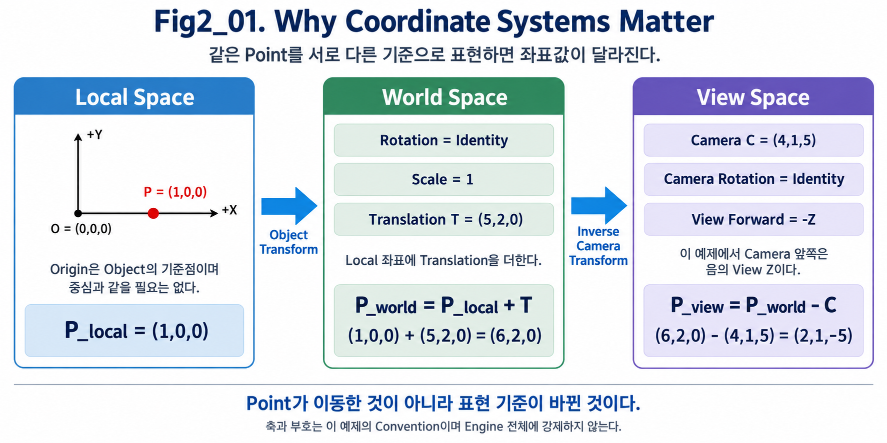

**Figure 2-1. The same position can have different coordinate values depending on the coordinate system used.**

Figure 2-1은 하나의 같은 Point를 Local Space, World Space, View Space에서 각각 표현한 예시다.

왼쪽의 Local Space에서는 Object 자체를 기준으로 Point가 `(1, 0, 0)` 위치에 있다.

하지만 Object 자체가 World의 다른 위치에 배치되어 있기 때문에 같은 Point를 World Space에서 표현하면 `(6, 2, 0)`처럼 다른 값이 될 수 있다.

다시 Camera를 기준으로 표현하는 View Space에서는 또 다른 Coordinate 값이 만들어진다.

중요한 것은 Point 자체가 세 번 다른 장소로 이동한 것이 아니라는 점이다.

> **같은 Point를 서로 다른 기준 Coordinate System으로 표현했기 때문에 숫자가 달라진 것이다.**

---

### Coordinate System

**Coordinate System**은 Position이나 Direction을 표현하기 위한 **기준 체계**다.

3D 공간에서 어떤 위치를 숫자로 표현하려면 최소한 다음과 같은 기준이 필요하다.

- 어디를 시작점으로 할 것인가
- 어느 방향을 X축으로 할 것인가
- 어느 방향을 Y축으로 할 것인가
- 어느 방향을 Z축으로 할 것인가

이 기준이 정해져야 `(1, 2, 3)` 같은 Coordinate 값의 의미가 결정된다.

즉,

~~~text
Coordinate System

Origin
+
Axis
↓
Position과 Direction을 표현할 기준
~~~

이라고 생각할 수 있다.

---

### Origin

**Origin**은 Coordinate System의 기준점이다.

일반적으로 Coordinate 값

~~~text
(0, 0, 0)
~~~

에 해당하는 위치다.

쉽게 말하면

> **이 Coordinate System에서 모든 위치를 측정하기 시작하는 기준점**

이다.

예를 들어 Object 자체를 기준으로 사용하는 Local Space에서는 Object의 Origin이 기준점이 될 수 있다.

World Space에서는 Scene 전체의 World Origin이 기준점이 된다.

View Space에서는 Camera가 기준이 된다.

따라서 같은 Point라도 Origin이 달라지면 Coordinate 값도 달라질 수 있다.

---

### Axis

**Axis**는 Coordinate System에서 방향을 정의하는 기준축이다.

3D Graphics에서는 일반적으로 세 개의 Axis를 사용한다.

- X Axis
- Y Axis
- Z Axis

예를 들어 어떤 Coordinate System에서 다음 값이 있다고 하자.

~~~text
Position = (2, 3, 1)
~~~

이 값은 단순히 세 개의 숫자가 아니라

~~~text
X 방향으로 2
Y 방향으로 3
Z 방향으로 1
~~~

만큼 Origin에서 떨어져 있다는 의미를 가진다.

따라서 Axis의 방향이 달라지면 같은 숫자라도 실제 공간에서 다른 방향을 의미할 수 있다.

---

### Coordinate

**Coordinate**는 Coordinate System의 Origin과 Axis를 기준으로 표현된 값이다.

예를 들어

~~~text
(1, 0, 0)
~~~

이라는 Coordinate는

> **현재 Coordinate System의 Origin에서 X Axis 방향으로 1만큼 이동한 위치**

를 의미할 수 있다.

여기서 중요한 점은 `(1, 0, 0)`이라는 숫자 자체가 절대적인 위치를 의미하지 않는다는 것이다.

어떤 Coordinate System을 사용하고 있는지에 따라 실제 공간의 위치는 달라질 수 있다.

---

### Space

3D Graphics에서 자주 사용하는 **Space**라는 단어도 Coordinate System과 밀접하게 연결된다.

예를 들어 다음과 같은 용어를 사용한다.

- Local Space
- World Space
- View Space
- Clip Space
- Screen Space
- Tangent Space

여기서 Space는 단순히 물리적인 공간을 의미한다기보다,

> **특정 Coordinate System을 기준으로 Data를 표현하고 있는 상태**

라고 이해하면 좋다.

따라서

**World Space Position**

이라고 하면

> World Coordinate System을 기준으로 표현된 Position

이라는 뜻이고,

**Tangent Space Normal**

이라고 하면

> Surface의 Tangent Coordinate System을 기준으로 표현된 Normal

이라는 뜻이다.

---

### One Position in Different Coordinates

Figure 2-1의 Cube에 있는 하나의 Point를 다시 생각해보자.

Local Space에서는 다음과 같은 Position을 가질 수 있다.

~~~text
Local Position = (1, 0, 0)
~~~

이것은

> Object 자신의 Origin에서 X 방향으로 1만큼 떨어져 있다.

는 뜻이다.

하지만 Object가 World의 `(5, 2, 0)` 위치에 배치되어 있다면 같은 Point의 World Position은 단순한 예에서 다음처럼 생각할 수 있다.

~~~text
World Position = (6, 2, 0)
~~~

Point 자체가 Mesh 안에서 움직인 것은 아니다.

기준이 Object에서 World로 바뀌었기 때문에 Coordinate 값이 달라진 것이다.

---

### Coordinate Systems in DCC Tools

Coordinate System은 생소한 Rendering 전용 개념이 아니다.

Blender와 같은 DCC Tool을 사용하면서 이미 계속 접하고 있다.

예를 들어 Object 하나를 World에서 이동시켰다고 생각해보자.

Object Mode에서는 Object의 World Position이 바뀐다.

하지만 Edit Mode에서 Mesh의 Vertex를 보면 Object 내부에서 Vertex의 상대적인 위치 관계는 그대로 유지될 수 있다.

개념적으로는 다음과 같다.

~~~text
Mesh Vertex Local Position
→ 그대로 유지

Object Transform
→ 변경

결과 World Position
→ 변경
~~~

즉, Modeling 작업에서도 이미

- Mesh 자체의 Local Coordinate
- Scene의 World Coordinate

를 서로 구분해서 사용하고 있는 것이다.

Chapter 02에서는 이 익숙한 경험을 Rendering Pipeline의 Coordinate Transformation과 연결한다.

---

### Object Transform and Mesh Data

Cube의 한 Vertex가 Local Space에서 다음 위치에 있다고 하자.

~~~text
Local Position = (1, 1, 1)
~~~

Cube Object를 World에서 오른쪽으로 이동시켜도 Mesh Data 안의 Local Position은 그대로 `(1, 1, 1)`일 수 있다.

대신 Object의 Transform이 달라진다.

~~~text
Mesh Local Position
(1, 1, 1)

+

Object Transform
World 위치 이동

↓

World Position 변화
~~~

이 구조 덕분에 같은 Mesh Data를 World의 여러 위치에서 사용할 수 있다.

예를 들어 같은 Tree Mesh를 Scene에 여러 개 배치하더라도 Tree Mesh 자체의 Local Vertex Data를 매번 새로 만들 필요는 없다.

각 Object의 Transform만 다르게 적용하면 된다.

---

### Shared Mesh Data and Multiple Transforms

같은 Rock Mesh를 Scene에 세 개 배치했다고 생각해보자.

세 Rock은 동일한 Local Vertex Data를 사용할 수 있다.

~~~text
Rock Mesh

Local Vertex Data
→ 동일
~~~

하지만 각 Object의 Transform이 다르다.

~~~text
Rock A
→ World Position A

Rock B
→ World Position B

Rock C
→ World Position C
~~~

그래서 동일한 Mesh를 서로 다른 위치와 방향으로 Rendering할 수 있다.

이것이 Local Space와 World Space를 분리해서 사용하는 중요한 이유 중 하나다.

---

### Camera as a Coordinate Reference

World Space만 있으면 모든 문제가 해결될 것처럼 보일 수 있다.

하지만 Rendering에서는 Camera가 필요하다.

Camera는 World의 특정 위치에 있고 특정 방향을 바라본다.

최종적으로 Screen Image를 만들려면

> **이 Object가 World 어디에 있는가**

뿐 아니라

> **Camera에서 바라봤을 때 어디에 있는가**

를 알아야 한다.

그래서 World Space의 Position을 Camera 기준 Coordinate System으로 다시 표현한다.

이것이 **View Space** 또는 **Camera Space**다.

즉,

~~~text
World Space
↓
Camera 기준으로 다시 표현
↓
View Space
~~~

라는 변환이 필요하다.

---

### Coordinates Relative to the Camera

Object가 World에서 전혀 움직이지 않아도 Camera가 움직이면 View Space Position은 달라질 수 있다.

예를 들어 World에 Cube가 고정되어 있다고 생각해보자.

~~~text
Cube World Position
→ 변하지 않음
~~~

하지만 Camera가 Cube 주변을 이동한다면 Camera 기준에서 Cube가 있는 위치는 계속 변한다.

~~~text
Camera 이동
↓
View Coordinate System 변화
↓
Cube의 View Space Position 변화
~~~

즉,

> **Coordinate는 Object 자체의 상태뿐 아니라 어떤 기준 Coordinate System에서 바라보느냐에 따라 달라진다.**

---

#### View Space and Screen Space

DCC Tool의 Viewport를 오래 사용했다면 **View Space**와 **Screen Space**가 비슷한 개념처럼 느껴질 수 있다.

둘 다 Camera 또는 Viewport를 기준으로 Scene을 바라본다는 점에서는 서로 연결되어 있기 때문이다.

하지만 Rendering Pipeline에서는 두 Space의 역할이 다르다.

**View Space**는 아직 Camera를 기준으로 표현된 **3D 공간**이다.

즉, Object나 Vertex가 Camera의 앞쪽에 얼마나 떨어져 있는지, 왼쪽이나 오른쪽에 얼마나 위치하는지와 같은 3D Position 정보가 남아 있다.

반면 **Screen Space**는 Projection을 거친 뒤, 해당 Position이 실제 화면의 어느 2D 위치에 나타나는지를 표현하는 단계다.

~~~text
View Space
→ Camera 기준의 3D Position

Screen Space
→ 화면 기준의 2D Position
~~~

예를 들어 Camera 기준에서 같은 X 방향에 있지만 서로 다른 Depth를 가진 두 Point가 있다고 하자.

View Space에서는 두 Point 모두 Camera 기준의 3D Position으로 존재한다.

하지만 Perspective Projection을 거치면 Camera에서 더 먼 Point는 화면 중심 쪽으로 더 가까워지는 방향으로 변환된다.

이것이 멀리 있는 Object가 화면에서 더 작게 보이는 Perspective의 기본적인 결과다.

즉,

> **View Space는 Camera 기준의 3D 위치를 표현하고, Screen Space는 Projection을 거친 뒤 실제 화면에 나타날 2D 위치를 표현한다.**

라고 이해하면 된다.

다만 Screen Space 역시 아직 **Final Pixel Color**를 의미하는 것은 아니다.

화면에서의 위치가 정해진 이후에도 Rasterization, Fragment Processing, Depth Test 등의 Rendering Stage가 남아 있다.

따라서 다음과 같이 구분하면 이해하기 쉽다.

~~~text
View Space
→ Camera 기준의 3D 위치

Screen Space
→ 화면 기준의 2D 위치

Final Pixel
→ 해당 화면 위치에 최종적으로 표시되는 Color
~~~

DCC Tool의 Viewport에서는 이 과정이 하나의 화면 결과로 바로 보이기 때문에 View Space와 Screen Space가 비슷하게 느껴질 수 있다.

하지만 Rendering Pipeline 내부에서는

> **Camera 기준 3D 공간과 실제 화면 기준 2D 공간은 서로 다른 단계**

라는 점을 구분해서 이해하는 것이 중요하다.

---

### Coordinate Representation and Geometry

여기서 중요한 점을 하나 구분해야 한다.

Local Space의 Point를 World Space나 View Space로 변환했다고 해서 Mesh Geometry 자체가 계속 새롭게 만들어지는 것은 아니다.

같은 위치를 서로 다른 기준으로 **표현하는 방식이 달라지는 것**이다.

예를 들어 서울의 한 건물 위치를

- 대한민국 전체 지도 기준
- 서울시 기준
- 특정 도로 기준

으로 서로 다른 숫자로 표현할 수 있는 것과 비슷하다.

실제 건물이 움직인 것은 아니다.

기준이 달라졌기 때문에 위치를 표현하는 숫자가 달라진 것이다.

3D Coordinate Transformation도 기본적으로 이와 같은 관점에서 이해할 수 있다.

---

### Why Multiple Spaces Are Needed

그렇다면 하나의 Coordinate System만 사용하면 더 간단하지 않을까?

각 Space는 서로 다른 문제를 해결하기에 적합하다.

#### Local Space

Object 자체를 기준으로 Mesh를 표현하기 좋다.

~~~text
Mesh Modeling
Vertex Position
Object 내부 방향
~~~

#### World Space

여러 Object가 하나의 Scene에서 어디에 존재하는지 표현하기 좋다.

~~~text
Scene 배치
Object 관계
World Lighting
~~~

#### View Space

Camera 기준으로 Object가 어디에 있는지 표현하기 좋다.

~~~text
Camera 기준 위치
Projection 준비
~~~

#### Clip Space

Camera가 볼 수 있는 영역 안에 Geometry가 존재하는지 판정하고 Clipping하기 좋은 형태로 사용된다.

#### Screen Space

최종적으로 Geometry를 실제 Screen 위치와 연결하기 위해 사용된다.

즉,

> **각 Coordinate Space는 Rendering Pipeline의 서로 다른 문제를 해결하기 위한 기준 Coordinate System이다.**

---

### Position Through the Pipeline

Chapter 01에서 Vertex Position은 Rendering 과정에서 여러 Coordinate Space를 거친다고 설명했다.

이제 그 흐름을 조금 더 의미 있게 볼 수 있다.

~~~text
Local Position
↓
Object 기준 위치

World Position
↓
Scene 기준 위치

View Position
↓
Camera 기준 위치

Clip Position
↓
Projection / Clipping을 위한 위치

NDC
↓
정규화된 화면 기준 위치

Screen Position
↓
실제 화면 위치
~~~

Position 자체가 계속 다른 Point로 바뀌는 것이 아니라,

> **Rendering의 각 단계에서 필요한 기준 Coordinate System으로 다시 표현된다.**

고 보는 것이 좋다.

---

#### Normalized Device Coordinates

Rendering Pipeline에서 **NDC**는 **Normalized Device Coordinates**의 약자다.

쉽게 말하면,

> **Projection을 거친 좌표를 실제 Screen Resolution에 맞추기 전에 일정한 범위로 정리한 중간 Coordinate Space**

라고 이해하면 된다.

예를 들어 실제 Screen이

~~~text
1920 × 1080
~~~

이든

~~~text
2560 × 1440
~~~

이든 GPU가 처음부터 각각의 Pixel 좌표를 기준으로 계산하는 것보다,

먼저 일정한 공통 범위 안에서 Position을 정리한 뒤 마지막에 실제 Viewport 크기로 변환하는 편이 더 다루기 쉽다.

개념적인 흐름은 다음과 같다.

~~~text
View Space
↓
Projection
↓
Clip Space
↓
Perspective Divide
↓
NDC
↓
Viewport Transform
↓
Screen Space
~~~

NDC에서는 화면에 보일 위치가 일정한 정규화된 범위 안으로 표현된다.

API에 따라 정확한 범위는 다를 수 있지만, 개념적으로는

> **실제 Pixel 좌표로 바꾸기 직전의 공통화된 Screen 기준 좌표**

라고 생각하면 된다.

예를 들어 NDC의 화면 중심은 대략 다음과 같은 위치로 생각할 수 있다.

~~~text
Center
≈ (0, 0)
~~~

그리고 화면의 왼쪽, 오른쪽, 위쪽, 아래쪽은 일정한 정규화 범위의 끝에 대응한다.

이후 Viewport Transform을 거치면 이 값이 실제 Screen Resolution의 Pixel 위치로 변환된다.

따라서 NDC는

> **3D Camera/Projection 공간과 실제 2D Screen Pixel Coordinate 사이를 연결하는 중간 단계**

라고 이해하면 된다.

NDC의 정확한 범위와 Perspective Divide 과정은 이후 **2.9 Perspective Divide and NDC**에서 자세히 다룬다.

---

### Coordinate Values and Their Meaning

Coordinate Data는 값과 Space를 함께 읽는다. 같은 `Normal = (0, 0, 1)`도 Tangent / Local / World / View Space에 따라 다른 방향이다. Unreal의 **Vertex Normal WS**처럼 변수나 Node 이름에 Space를 표시하면 혼동을 줄일 수 있다.

---

### Mixed Coordinate Spaces

Rendering 계산에서는 서로 다른 Coordinate Space에 있는 Data를 그대로 계산하면 잘못된 결과가 나올 수 있다.

예를 들어 Normal은 World Space에 있는데 Light Direction은 View Space에 있다고 생각해보자.

둘은 서로 다른 기준 Coordinate System의 Vector다.

이 상태에서 두 방향을 바로 비교하면 의미 있는 결과를 얻을 수 없다.

먼저 같은 Space로 맞춰야 한다.

개념적으로는 다음과 같다.

~~~text
Normal
→ World Space

Light Direction
→ View Space

그대로 계산
→ 잘못된 결과 가능
~~~

대신 한쪽을 변환한다.

~~~text
Normal
→ World Space

Light Direction
→ World Space로 변환

↓
같은 Coordinate Space

↓
Lighting 계산
~~~

즉,

> **서로 계산할 Data는 일반적으로 같은 Coordinate Space에서 비교해야 한다.**

이 원칙은 이후 Lighting Mathematics와 Shader 구현에서 매우 중요하다.

---

### Why Coordinate Systems Matter

Coordinate System은 Vertex Transform, Camera, Lighting, Normal Mapping, Shadow 등에서 계산의 기준을 정한다. Space를 잘못 해석하면 계산식이 맞아도 결과는 틀릴 수 있다.

---

### Key Terms

#### Origin

> Coordinate System에서 `(0, 0, 0)`이 되는 기준점

#### Axis

> Coordinate System의 방향을 정의하는 X, Y, Z 기준축

#### Coordinate

> Origin과 Axis를 기준으로 표현된 위치 또는 값

#### Coordinate System

> Position과 Direction을 표현하기 위한 Origin과 Axis의 기준 체계

#### Space

> 특정 Coordinate System을 기준으로 Data가 표현되고 있는 상태

---

### The Key Question

Coordinate를 읽을 때는 **“어떤 Space의 Position 또는 Direction인가?”**를 먼저 확인한다. `(1, 0, 0)`보다 `Local Position = (1, 0, 0)`처럼 의미와 기준을 함께 표시한다.

---

### Next: Position, Direction and Vector

다음 절에서는 같은 XYZ 형태로 표현되는 Position, Direction, Vector의 차이와 Transform에서 이들을 구분하는 이유를 살펴본다.

---

## 2.2 Position, Direction and Vector

3D Graphics에서는 `(x, y, z)` 형태의 Data가 매우 자주 등장한다.

예를 들어 다음 값들은 모두 세 개의 숫자로 표현할 수 있다.

~~~text
Position  = (2, 3, 1)
Direction = (1, 0, 0)
Vector    = (3, 2, 2)
~~~

겉으로 보면 모두 비슷한 XYZ Data처럼 보인다.

하지만 각각이 나타내는 의미는 다르다.

- **Position**은 어떤 Point가 **어디에 있는가**를 나타낸다.
- **Direction**은 **어느 방향을 향하는가**를 나타낸다.
- **Vector**는 일반적으로 **Direction과 Magnitude(크기/길이)를 함께 가지는 값**이다.

이 차이는 단순한 용어 구분이 아니다.

Rendering에서는 Position과 Direction이 Coordinate Space를 변환할 때 서로 다르게 처리된다.

따라서 Shader에서 어떤 XYZ Data를 사용할 때는 숫자만 보는 것이 아니라,

> **이 Data가 Position인지, Direction인지, 그리고 어떤 Coordinate Space에 있는지**

를 함께 판단해야 한다.

---

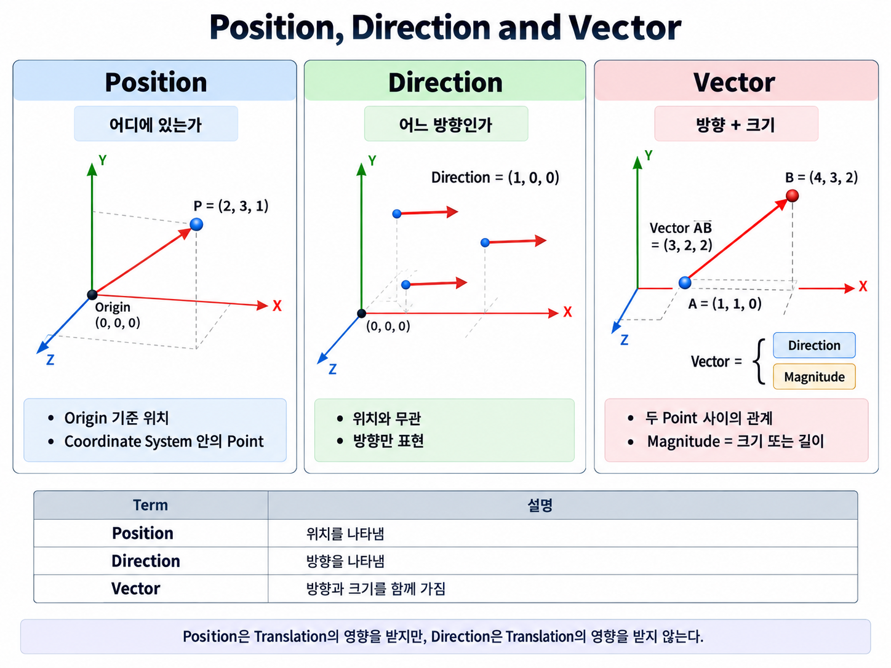

**Figure 2-2. Position, Direction, and Vector**

---

### Position

**Position**은 Space 안에서 특정 Point가 **어디에 있는가**를 나타낸다.

예를 들어 다음과 같은 Position이 있다고 하자.

~~~text
P = (2, 3, 1)
~~~

현재 Coordinate System의 Origin이 `(0, 0, 0)`이라면 이 값은 다음과 같이 이해할 수 있다.

~~~text
Origin에서

X 방향으로 2
Y 방향으로 3
Z 방향으로 1

만큼 떨어진 위치
~~~

즉, Position은 항상 **Coordinate System의 Origin을 기준으로 한 위치**다.

따라서 같은 숫자라도 어떤 Coordinate Space에서 표현되었는지에 따라 실제 의미가 달라질 수 있다.

예를 들어 다음 두 Position이 있다고 하자.

~~~text
Local Position = (2, 3, 1)

World Position = (2, 3, 1)
~~~

숫자는 동일하지만 두 값이 반드시 같은 공간상의 Point를 의미하는 것은 아니다.

`Local Position`은 Object 자신의 Origin과 Axis를 기준으로 표현된 값이고, `World Position`은 World의 Origin과 Axis를 기준으로 표현된 값이기 때문이다.

즉,

> **Position은 특정 Coordinate System을 기준으로 표현된 Point의 위치다.**

---

### Position Depends on Origin

Position의 중요한 특징 중 하나는 **Origin에 영향을 받는다는 것**이다.

하나의 Point가 현재 Coordinate System에서 다음 위치에 있다고 하자.

~~~text
P = (2, 0, 0)
~~~

이것은 Origin에서 X 방향으로 2만큼 떨어져 있다는 의미다.

그런데 Coordinate System의 Origin이 이동한다면 실제 Point가 움직이지 않았더라도 그 Point를 표현하는 Coordinate 값은 달라질 수 있다.

~~~text
같은 Point

Coordinate System A
→ Position = (2, 0, 0)

Coordinate System B
→ Position = 다른 값
~~~

즉,

> **Point의 실제 위치와 그 Point를 표현하는 Coordinate 값은 같은 개념이 아니다.**

Coordinate는 항상 현재 사용하고 있는 Coordinate System을 기준으로 한 표현이다.

이 원리는 이후 Local Space, World Space, View Space를 이해하는 데 중요한 기반이 된다.

---

### Direction

**Direction**은 어떤 Point의 위치가 아니라 **어느 방향을 향하고 있는가**를 나타낸다.

예를 들어 다음 값이 있다고 하자.

~~~text
Direction = (1, 0, 0)
~~~

현재 Coordinate System에서 이것은 X Axis의 양의 방향을 나타낼 수 있다.

~~~text
(1, 0, 0)
→ Right

(0, 1, 0)
→ Up

(0, 0, 1)
→ Forward
~~~

단, 실제로 어느 Axis가 Up 또는 Forward에 해당하는지는 Engine이나 Coordinate System의 규칙에 따라 달라질 수 있다.

중요한 것은 Direction이 특정 Point를 가리키는 것이 아니라는 점이다.

예를 들어 공간의 서로 다른 위치에 같은 방향의 화살표를 놓을 수 있다.

~~~text
→          →

→          →
~~~

화살표가 놓인 위치는 서로 다르지만 모두 오른쪽을 향하고 있다면 같은 Direction을 나타낼 수 있다.

즉,

> **Direction은 "어디에 있는가"가 아니라 "어느 쪽을 향하는가"를 나타낸다.**

---

### Direction Does Not Depend on Position

Position은 Origin과의 관계가 중요하지만 Direction은 특정 위치를 필요로 하지 않는다.

예를 들어 다음 Direction이 있다고 하자.

~~~text
Direction = (1, 0, 0)
~~~

이 방향을 World의 어느 위치에 놓더라도 여전히 같은 X 방향을 의미할 수 있다.

따라서 Object 전체를 단순히 이동시키는 **Translation**은 Position에는 영향을 주지만 Direction 자체에는 영향을 주지 않는다.

예를 들어 Object를 오른쪽으로 10만큼 이동했다고 하자.

~~~text
Position
(1, 0, 0)
↓
Translation +10
↓
(11, 0, 0)
~~~

Position은 바뀐다.

하지만 오른쪽을 향하고 있던 Direction은 Object가 이동했다고 해서 다른 방향으로 바뀌지 않는다.

~~~text
Direction
(1, 0, 0)
↓
Translation +10
↓
(1, 0, 0)
~~~

즉,

> **Translation은 Position을 이동시키지만 Direction을 이동시키지는 않는다.**

이 차이는 이후 Matrix Transformation을 이해할 때 매우 중요해진다.

---

### Vector

**Vector**는 일반적으로 **Direction과 Magnitude를 함께 가지는 값**이다.

여기서 **Magnitude**는 Vector의 크기 또는 길이를 의미한다.

예를 들어 Point A와 Point B가 있다고 하자.

~~~text
A = (1, 1, 0)

B = (4, 3, 2)
~~~

A에서 B로 향하는 Vector는 개념적으로 다음과 같이 만들 수 있다.

~~~text
Vector AB = B - A

          = (4, 3, 2) - (1, 1, 0)

          = (3, 2, 2)
~~~

이 Vector에는 두 가지 정보가 들어 있다.

~~~text
Direction
→ A에서 B로 향하는 방향

Magnitude
→ A와 B 사이의 거리와 관계된 크기
~~~

따라서 Vector는 단순히 "방향"만을 의미하지 않는다.

> **Vector는 Direction과 Magnitude를 가진 수학적 값이다.**

---

### Direction and Vector

여기서 Direction과 Vector의 관계가 조금 헷갈릴 수 있다.

Direction 역시 실제 계산에서는 Vector 형태로 표현하는 경우가 많기 때문이다.

예를 들어 다음 Vector가 있다고 하자.

~~~text
V = (3, 0, 0)
~~~

이 Vector는 X 방향을 향하면서 Magnitude가 3이다.

하지만 우리가 단순히 **방향만 필요하다면** Vector의 길이를 1로 맞춰 사용할 수 있다.

~~~text
V = (3, 0, 0)

↓

Normalize

↓

Direction = (1, 0, 0)
~~~

이처럼 Magnitude를 1로 만든 Vector를 **Normalized Vector** 또는 **Unit Vector**라고 한다.

그래서 Rendering에서 `Direction`이라고 부르는 Data는 실제로는 **길이가 1인 Vector**로 표현되는 경우가 많다.

예를 들어 다음과 같은 Data가 대표적이다.

- Light Direction
- View Direction
- Normal
- Tangent

즉,

> **Direction은 Vector를 이용해 표현하며, 방향만 필요할 때는 보통 Vector를 Normalize해서 사용한다.**

`Normalize`, `Vector Length` 등의 구체적인 계산은 이후 Chapter 03 - Lighting Mathematics에서 자세히 다룬다.

---

### Position and Vector

Position과 Vector 역시 모두 XYZ 값을 사용할 수 있기 때문에 처음에는 비슷하게 보인다.

하지만 의미는 다르다.

~~~text
Position = (3, 2, 1)

Vector   = (3, 2, 1)
~~~

Position의 경우:

> 현재 Coordinate System의 Origin을 기준으로 `(3, 2, 1)` 위치에 있는 Point

를 의미한다.

Vector의 경우:

> `(3, 2, 1)` 방향과 그에 해당하는 Magnitude를 가진 값

을 의미한다.

같은 숫자라도 **Data의 의미가 다르다.**

---

### Vector Between Two Positions

Vector는 두 Position 사이의 관계를 표현할 때 자주 사용된다.

예를 들어 Character의 Position과 Camera의 Position을 알고 있다고 하자.

~~~text
Character Position

Camera Position
~~~

Camera에서 Character를 향하는 방향이 필요하다면 두 Position의 차이를 이용할 수 있다.

~~~text
Character Position
-
Camera Position
↓
Camera에서 Character로 향하는 Vector
~~~

반대로 계산 순서를 바꾸면 Direction도 반대가 된다.

~~~text
Camera Position
-
Character Position
↓
Character에서 Camera로 향하는 Vector
~~~

즉,

> **두 Position을 빼면 한 Point에서 다른 Point로 향하는 Vector를 만들 수 있다.**

이 개념은 이후 Lighting에서도 반복해서 사용된다.

예를 들어

- Surface → Light
- Surface → Camera
- Point A → Point B

같은 Direction을 계산할 때 기본적으로 같은 원리가 사용된다.

---

### Translation Affects Position but Not Direction

Position과 Direction의 차이를 가장 명확하게 보여주는 것이 **Translation**이다.

Object를 World에서 이동시키는 상황을 생각해보자.

~~~text
Before

Position = (1, 2, 0)
Direction = (1, 0, 0)
~~~

Object를 X 방향으로 5만큼 이동하면 Position은 달라진다.

~~~text
After Translation

Position = (6, 2, 0)
~~~

하지만 Object가 바라보는 방향까지 자동으로 바뀌는 것은 아니다.

~~~text
Direction = (1, 0, 0)
~~~

즉,

~~~text
Translation

Position
→ 영향을 받음

Direction
→ 영향을 받지 않음
~~~

이 차이는 이후 `Homogeneous Coordinate`와 `Matrix Transform`을 배울 때 다음과 연결된다.

~~~text
Position
→ w = 1

Direction
→ w = 0
~~~

지금 단계에서는 이 값을 외울 필요는 없다.

중요한 것은

> **GPU가 Position과 Direction을 서로 다른 종류의 Data로 구분해서 Transform할 필요가 있다.**

는 점이다.

`w`가 왜 이러한 차이를 만들 수 있는지는 이후 **2.8 Homogeneous Coordinate and W**에서 자세히 살펴본다.

---

### Rotation Affects Both Position and Direction

Translation과 달리 Rotation은 Position과 Direction 모두에 영향을 줄 수 있다.

예를 들어 Object가 오른쪽을 향하고 있다고 하자.

~~~text
Direction = Right
~~~

Object를 90도 회전시키면 Object의 방향도 함께 바뀐다.

~~~text
Before Rotation
→ Right

After Rotation
→ Forward
~~~

Object 내부의 Vertex Position 역시 Object가 회전하면서 World에서 다른 위치를 가지게 된다.

따라서 개념적으로 다음과 같이 볼 수 있다.

~~~text
             Position    Direction

Translation     O            X

Rotation        O            O
~~~

여기서 중요한 점은 Position과 Direction 모두 Transform의 영향을 받을 수 있지만 **어떤 Transform이 적용되는 방식은 서로 다르다**는 것이다.

이 차이를 이후 Matrix Transformation에서 다시 살펴본다.

---

### Normal Is a Direction

Chapter 01에서 살펴본 **Normal**도 Position이 아니다.

Normal은 Surface가 어느 방향을 향하는지를 나타내는 **Direction Data**다.

예를 들어 Surface가 위쪽을 향하고 있다면 개념적으로 다음과 같은 Normal을 가질 수 있다.

~~~text
Normal = (0, 1, 0)
~~~

Normal은

> Surface가 어디에 있는가

를 알려주는 값이 아니라

> Surface가 어느 방향을 향하는가

를 알려주는 값이다.

따라서 Vertex Position과 Vertex Normal이 모두 XYZ Data로 저장되어 있더라도 의미는 완전히 다르다.

~~~text
Vertex Position
→ Vertex가 어디에 있는가

Vertex Normal
→ Surface가 어느 방향을 향하는가
~~~

이 구분은 Lighting 계산에서 매우 중요하다.

빛이 Surface를 얼마나 정면으로 비추고 있는지를 계산하려면 Surface Position보다 **Normal Direction**이 필요하기 때문이다.

---

### Tangent Is Also a Direction

**Tangent** 역시 Direction Data다.

Tangent는 Surface 위에서 특정 방향, 일반적으로 Texture의 U 방향과 연결된 Surface Direction을 나타낸다.

그리고 Normal, Tangent와 함께 Surface 기준 Coordinate System인 **Tangent Space**를 구성한다.

~~~text
Normal
Tangent
Bitangent

↓

Tangent Space
~~~

Tangent Space는 이후 **2.14 Tangent Space**에서 자세히 다룬다.

지금은 Normal과 Tangent 역시 Position이 아니라 **Surface의 방향을 표현하는 Data**라는 점만 기억하면 된다.

---

### Position, Direction and Vector in Rendering

Rendering에서는 이 세 개념이 계속 함께 사용된다.

예를 들어 Character Surface의 한 Point를 Lighting한다고 생각해보자.

필요한 Data에는 다음과 같은 것들이 있을 수 있다.

~~~text
Surface Position
→ Surface가 어디에 있는가

Surface Normal
→ Surface가 어느 방향을 향하는가

Light Direction
→ Light가 어느 방향에 있는가

View Direction
→ Camera가 어느 방향에 있는가
~~~

여기서 Position은 위치를 나타내고,

Normal, Light Direction, View Direction은 모두 방향과 관련된 Vector Data다.

이러한 Data를 올바르게 구분해야 이후 Lighting Calculation을 정확하게 이해할 수 있다.

---

### Coordinate Space Still Matters

Data의 종류와 Space는 별도로 확인해야 한다. 예를 들어 World Normal과 View-space Light Direction은 모두 방향이지만 그대로 Dot Product할 수 없다. 먼저 같은 Space로 맞춰야 한다.

---

### Position, Direction and Vector Summary

세 개념을 정리하면 다음과 같다.

| Data | Meaning | Origin과의 관계 | Translation 영향 |
|---|---|---|---|
| **Position** | Space 안의 특정 위치 | 있음 | 받음 |
| **Direction** | 어느 방향을 향하는가 | 직접적인 위치와 무관 | 받지 않음 |
| **Vector** | Direction + Magnitude | 용도에 따라 다름 | 일반적인 방향 Vector는 받지 않음 |

그리고 Rendering에서 자주 만나는 Data를 분류하면 다음과 같다.

~~~text
Position Data

Vertex Position
World Position
Camera Position
Light Position

Direction / Vector Data

Normal
Tangent
Bitangent
Light Direction
View Direction
Reflection Vector
~~~

모두 XYZ 형태로 보일 수 있지만 역할은 서로 다르다.

---

### Key Concept

Coordinate Data를 사용할 때는 **의미(Position / Direction / Vector), Space, 적용할 Transform**을 함께 확인한다. 같은 XYZ 형식이라도 Translation의 적용 여부는 다르다.

---

## 2.3 Local Space / Object Space

3D Mesh를 구성하는 Vertex Position은 처음부터 World 전체를 기준으로 저장되는 것이 아니다.

대부분의 경우 Vertex는 **Object 자체를 기준으로 한 Coordinate System** 안에서 자신의 위치를 가진다.

이 Coordinate Space를 **Local Space** 또는 **Object Space**라고 한다.

쉽게 말하면,

> **Local Space는 Object 자신의 Origin과 Axis를 기준으로 Mesh Data를 표현하는 공간이다.**

예를 들어 Cube 하나가 있고, Cube의 한 Vertex가 다음 위치에 있다고 하자.

~~~text
Local Position = (1, 1, 1)
~~~

이 값은 World의 `(1, 1, 1)` 위치를 의미하는 것이 아니다.

Cube 자신의 Origin을 기준으로

~~~text
X 방향으로 1
Y 방향으로 1
Z 방향으로 1
~~~

만큼 떨어져 있다는 의미다.

즉, Local Position을 이해할 때 중요한 것은

> **이 Vertex가 World 어디에 있는가가 아니라 Object 내부에서 어디에 있는가**

이다.

---

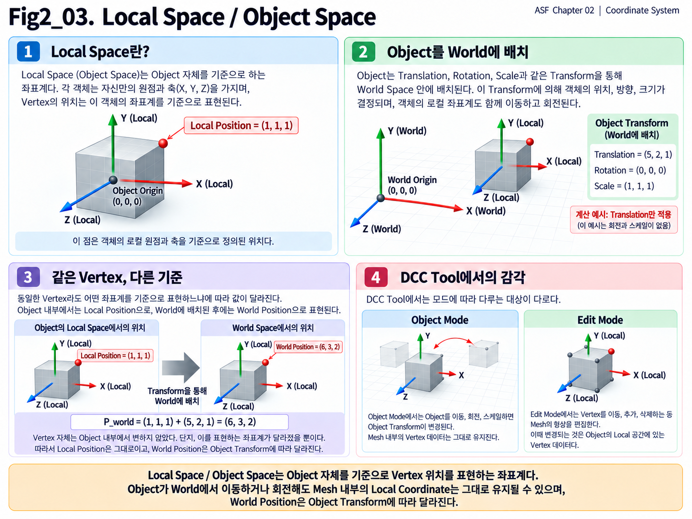

**Figure 2-3. Local Space / Object Space**

---

### Object Has Its Own Coordinate System

각 Object는 자신의 Coordinate System을 가질 수 있다.

기본적으로 다음과 같은 기준으로 생각할 수 있다.

- Object Origin
- Local X Axis
- Local Y Axis
- Local Z Axis

따라서 Mesh의 Vertex Position도 이 Object Coordinate System을 기준으로 표현할 수 있다.

예를 들어 다음 Vertex가 있다고 하자.

~~~text
Vertex Local Position = (1, 1, 1)
~~~

이 값은

> **Object Origin에서 Local X, Y, Z 방향으로 각각 1만큼 떨어진 Point**

를 의미한다.

World에서 Object가 어디에 배치되어 있는지는 이 Local Position 자체와 별개의 문제다.

---

### Local Space and Object Space

`Local Space`와 `Object Space`는 문맥에 따라 거의 같은 의미로 사용되는 경우가 많다.

둘 다 기본적으로

> **Object 자체를 기준으로 Data를 표현하는 Coordinate Space**

를 의미한다.

예를 들어 Mesh의 Vertex Position을 Object 자신의 Origin과 Axis를 기준으로 표현했다면 다음과 같이 부를 수 있다.

~~~text
Local Position

또는

Object Space Position
~~~

Engine이나 Graphics API에 따라 용어가 조금 다르게 사용될 수 있으므로, 이름 자체를 외우는 것보다

> **이 Data가 무엇을 기준으로 표현되고 있는가?**

를 확인하는 것이 더 중요하다.

---

### Object Transform

Local Space 안에 있는 Mesh를 Scene에 배치하려면 Object가 World에서 어디에 있어야 하는지를 결정해야 한다.

이를 위해 Object에는 일반적으로 다음과 같은 Transform 정보가 있다.

- Translation
- Rotation
- Scale

이를 **Object Transform**이라고 생각할 수 있다.

각 Transform의 역할을 단순화하면 다음과 같다.

~~~text
Translation
→ Object가 어디에 있는가

Rotation
→ Object가 어느 방향을 향하는가

Scale
→ Object의 크기가 어떻게 변하는가
~~~

Object Transform을 적용하면 Local Space 안에 있는 Mesh를 World Space의 원하는 위치와 방향에 배치할 수 있다.

---

### Local Position and World Position

하나의 Vertex는 Local Space에서의 Position과 World Space에서의 Position을 각각 가질 수 있다.

예를 들어 Vertex의 Local Position이 다음과 같다고 하자.

~~~text
Local Position = (1, 1, 1)
~~~

그리고 Object가 World에서 다음만큼 이동되어 있다고 하자.

~~~text
Object Translation = (5, 2, 1)
~~~

Rotation과 Scale이 없다고 단순화하면 같은 Vertex의 World Position은 다음과 같이 생각할 수 있다.

~~~text
Local Position
(1, 1, 1)

+

Object Translation
(5, 2, 1)

↓

World Position
(6, 3, 2)
~~~

여기서는 원리를 쉽게 이해하기 위해 Translation만 사용했다.

실제 Object에는 Rotation과 Scale도 적용될 수 있으므로 Local Space에서 World Space로의 변환은 단순한 덧셈만으로 처리되지 않는다.

이러한 여러 Transform을 함께 처리하기 위해 이후 **Matrix**를 사용한다.

---

### Local Position and Object Translation

Local Space를 이해할 때 가장 중요한 부분 중 하나다.

Object 전체를 World에서 이동했다고 생각해보자.

이동하기 전 상태가 다음과 같다고 하자.

~~~text
Object Translation = (0, 0, 0)

Vertex Local Position = (1, 1, 1)
~~~

이제 Object를 World X 방향으로 5만큼 이동한다.

~~~text
Object Translation = (5, 0, 0)

Vertex Local Position = (1, 1, 1)
~~~

Object가 이동했지만 Vertex의 **Local Position은 그대로 유지될 수 있다.**

변경된 것은 Object의 World 배치다.

따라서 같은 Vertex의 World Position은 달라진다.

~~~text
Local Position
→ 유지

Object Transform
→ 변경

World Position
→ 변경
~~~

즉,

> **Mesh 내부의 Local Vertex Data와 Object가 World에 배치되는 Transform은 서로 분리해서 생각할 수 있다.**

---

### Local Position and Rotation

Object를 회전시키더라도 Mesh 내부의 Local Vertex Position은 그대로 유지될 수 있다.

예를 들어 다음 Vertex가 있다고 하자.

~~~text
Local Position = (1, 0, 0)
~~~

이 값은 Object Origin에서 Local X 방향으로 1만큼 떨어진 Position이다.

Object를 회전시키면 이 Vertex의 Local Position 자체가 반드시 바뀌는 것은 아니다.

대신 Object Coordinate System 전체가 World에 대해 회전한다.

~~~text
Local Position
→ 유지

Object Rotation
→ 변경

World Position
→ 변경
~~~

즉, Object가 회전하면서 그 안에 있는 Vertex들이 World에서 보이는 위치도 함께 바뀌는 것이다.

---

### Local Axes and Object Rotation

Local Space의 Axis는 Object 자신의 기준축이다.

따라서 Object가 회전하면 Local Axis 역시 Object와 함께 회전한다.

처음에는 Local Axis와 World Axis가 같은 방향을 향할 수 있다.

~~~text
Local X → World X와 같은 방향
Local Y → World Y와 같은 방향
Local Z → World Z와 같은 방향
~~~

하지만 Object를 회전시키면 두 Axis의 방향이 달라질 수 있다.

~~~text
World Axis
→ Scene 전체의 기준

Local Axis
→ Object 자신의 방향을 기준으로 함
~~~

이 차이는 DCC Tool에서 이미 자주 경험할 수 있다.

예를 들어 Transform Gizmo의 Orientation을 `Global`에서 `Local`로 변경하면 Object가 회전한 상태에서 Gizmo의 Axis 방향도 달라지는 것을 확인할 수 있다.

즉,

> **World Axis는 Scene의 기준이고, Local Axis는 Object 자신의 기준이다.**

---

### Coordinate Systems in DCC Tools

Local Space는 Rendering에서 처음 등장하는 새로운 개념이 아니다.

Blender와 같은 DCC Tool을 사용하면서 이미 자연스럽게 사용하고 있다.

대표적인 예가 **Object Mode**와 **Edit Mode**의 차이다.

#### Object Mode

Object Mode에서 Object 전체를 이동하거나 회전하면 주로 **Object Transform**이 변경된다.

~~~text
Object 이동 / 회전
↓
Object Transform 변경

Mesh 내부의 Vertex 관계
↓
유지 가능
~~~

즉, Mesh 자체를 직접 변형하기보다 Object 전체를 World에 어떻게 배치할지를 변경한다.

#### Edit Mode

Edit Mode에서 Vertex를 직접 이동하면 Mesh 자체의 Geometry Data가 변경된다.

~~~text
Vertex 이동
↓
Local Vertex Position 변경
~~~

즉, Object의 World 배치를 변경하는 것이 아니라 Object 내부의 Mesh 구조를 수정하는 것이다.

이 차이는 Local Space를 이해하는 데 매우 좋은 예다.

---

### Object Mode and Edit Mode

DCC Tool에서의 차이를 단순화하면 다음과 같이 볼 수 있다.

| Operation | Mainly Changes |
|---|---|
| Object Mode에서 Object 이동 | Object Transform |
| Object Mode에서 Object 회전 | Object Transform |
| Object Mode에서 Object Scale | Object Transform |
| Edit Mode에서 Vertex 이동 | Local Vertex Position |
| Edit Mode에서 Vertex 추가 / 삭제 | Mesh Geometry Data |

실제 DCC Tool 내부에서는 `Apply Transform`과 같은 기능으로 Transform과 Mesh Data의 관계를 다시 계산할 수 있으므로 모든 경우가 완전히 분리되는 것은 아니다.

하지만 개념적으로는

> **Object Transform과 Mesh Local Data는 서로 다른 Layer의 정보다.**

라고 이해하면 된다.

---

### Applying Transforms

DCC Tool에서 `Apply Transform`을 사용하면 화면에서 보이는 Object의 형태나 위치를 유지하면서 내부 Data의 표현 방식이 달라질 수 있다.

예를 들어 Object Scale이 다음과 같다고 하자.

~~~text
Object Scale = (2, 2, 2)
~~~

Scale을 Apply하면 외형은 그대로 유지하면서 Object Scale이 다시 다음처럼 바뀔 수 있다.

~~~text
Object Scale = (1, 1, 1)
~~~

그 대신 Mesh의 Local Vertex Position이 새로운 크기를 반영하도록 변경된다.

개념적으로는 다음과 같다.

~~~text
Before Apply

Mesh Local Data
+
Object Scale = 2

↓

After Apply

변경된 Mesh Local Data
+
Object Scale = 1
~~~

즉,

> **최종적으로 보이는 결과가 같더라도 Mesh Local Data와 Object Transform에 정보가 저장되는 방식은 달라질 수 있다.**

이 역시 Local Space와 Object Transform이 서로 구분되는 정보라는 것을 보여준다.

---

### Shared Mesh Data

Local Space를 사용하는 중요한 이유 중 하나는 **Mesh Data와 World 배치를 분리할 수 있기 때문**이다.

예를 들어 Tree Mesh 하나가 있다고 하자.

~~~text
Tree Mesh

Vertex A
Vertex B
Vertex C
...
~~~

이 Mesh의 Local Vertex Data는 그대로 유지하면서 여러 Object를 Scene에 배치할 수 있다.

~~~text
Tree Object A
→ Transform A

Tree Object B
→ Transform B

Tree Object C
→ Transform C
~~~

각 Object의 World Position, Rotation, Scale은 서로 다르지만 기본 Mesh Data는 동일할 수 있다.

즉,

~~~text
Same Mesh Data
+
Different Object Transform
↓
Different World Placement
~~~

가 가능하다.

이 구조 덕분에 같은 Geometry를 여러 위치에서 효율적으로 재사용할 수 있다.

---

### Why Local Space Is Useful

모든 Vertex가 처음부터 World Space Position만 저장한다고 생각해보자.

Object 전체를 이동하려면 Mesh를 구성하는 모든 Vertex Position을 직접 변경해야 한다.

~~~text
Object 이동

Vertex 1 수정
Vertex 2 수정
Vertex 3 수정
Vertex 4 수정
...
~~~

하지만 Local Space와 Object Transform을 분리하면 Mesh 내부의 Vertex Data를 그대로 두고 Object Transform만 변경할 수 있다.

~~~text
Mesh Local Data
→ 유지

Object Transform
→ 변경
~~~

이 구조는 Geometry를 관리하고 재사용하는 데 매우 유리하다.

---

### Local Does Not Mean Small

`Local`은 값의 크기가 아니라 Object 기준임을 뜻한다. `Local Position = (1000, 500, 200)`처럼 큰 값도 Object의 Origin과 Axis를 기준으로 표현되었다면 Local Position이다.

---

### Object Origin and Geometry Center

Object Origin은 반드시 Mesh의 가운데에 있어야 하는 것은 아니다.

Object의 목적에 따라 다른 위치에 둘 수 있다.

예를 들어

- Character는 발 아래
- Door는 Hinge 위치
- Weapon은 Grip 위치

등을 Origin으로 사용할 수 있다.

~~~text
Door Geometry

      ● Geometry Center

● Object Origin
  Hinge
~~~

이 경우 Vertex Position은 Geometry의 중심이 아니라 **Object Origin을 기준으로 표현된다.**

따라서 Origin의 위치는 Local Coordinate의 값에도 직접적인 영향을 준다.

---

### Origin and Pivot

DCC Tool에서는 `Origin`과 `Pivot`이라는 용어를 모두 사용한다.

둘은 비슷하게 느껴질 수 있지만 완전히 같은 개념은 아니다.

**Object Origin**은 Object Coordinate System의 기준점과 연결된다.

반면 **Pivot**은 Rotation이나 Scale 같은 Transform Operation을 수행할 때 사용하는 중심점을 의미하는 경우가 많다.

DCC Tool에서는 Pivot을 일시적으로 다른 위치에 설정할 수도 있다.

따라서 Chapter 02에서는 우선 다음 개념에 집중한다.

> **Local Space의 기본적인 기준점은 Object Origin이다.**

---

### Local Space in Rendering Pipeline

Chapter 01에서 살펴본 Rendering Pipeline의 Vertex Processing은 Mesh의 Vertex Data에서 시작한다.

이 Vertex Position은 일반적으로 Object 기준의 Local Position으로 생각할 수 있다.

~~~text
Mesh Vertex

Local Position
↓
Object Transform
↓
World Position
~~~

즉, Rendering Pipeline에서 Geometry가 Scene에 배치되는 첫 번째 중요한 Coordinate Transformation은

> **Local Space → World Space**

변환이다.

그 이후에는 World Position을 Camera 기준으로 다시 변환한다.

~~~text
Local Space
↓
World Space
↓
View Space
↓
Clip Space
↓
NDC
↓
Screen Space
~~~

Chapter 01에서 보았던 Coordinate 흐름이 이제 Local Space에서부터 시작되는 것이다.

---

### Local Space in Shader

Shader에서도 Local Space Data를 사용할 수 있다.

어떤 Effect가 Object 자체를 기준으로 동작해야 한다면 World Space보다 Local Space가 더 적합할 수 있다.

예를 들어 Object의 위쪽 부분에만 Effect를 적용한다고 생각해보자.

~~~text
Local Position Y
↓
Object 내부 높이 기준으로 판단
~~~

이 경우 Object가 World의 다른 위치로 이동하더라도 Effect는 계속 Object 자체를 기준으로 동작할 수 있다.

반대로 World Position을 기준으로 Effect를 만들면 Object가 World에서 이동했을 때 Effect와 Object의 관계도 달라질 수 있다.

즉,

> **어떤 Coordinate Space를 사용하는가는 Effect가 무엇을 기준으로 동작해야 하는가와 직접 연결된다.**

이 개념은 이후 Material과 Shader를 구현할 때 매우 중요해진다.

---

### Local Space / Object Space Summary

Local Space의 핵심을 정리하면 다음과 같다.

~~~text
Local Space / Object Space

기준
→ Object 자체

Origin
→ Object Origin

Axis
→ Local X / Y / Z

Vertex Position
→ Object 내부에서의 위치

Object가 World에서 이동 / 회전
→ Local Position은 유지될 수 있음

Object Transform 변경
→ World Position은 변경됨
~~~

가장 중요한 관계는 다음과 같다.

> **Mesh 내부의 Local Vertex Data와 Object가 World에 배치되는 Transform은 서로 분리해서 생각할 수 있다.**

그리고 두 정보를 결합하면 World Space에서의 Vertex Position을 얻을 수 있다.

~~~text
Local Position
+
Object Transform
↓
World Position
~~~

실제 Rendering에서는 Translation, Rotation, Scale을 함께 처리하기 위해 Matrix Transformation을 사용한다.

다음 절에서는 Local Space에 존재하는 Object가 Scene 전체의 기준 Coordinate System인 **World Space**에서 어떻게 표현되는지 살펴본다.

---

## 2.4 World Space

Chapter 2.3에서는 Mesh의 Vertex가 Object 자신의 Origin과 Axis를 기준으로 **Local Space** 안에서 표현된다는 점을 살펴보았다.

하지만 실제 Scene에는 하나의 Object만 존재하지 않는다.

여러 개의 Object가 서로 다른 위치와 방향으로 배치되고, Camera와 Light 역시 같은 Scene 안에 존재한다.

이때 모든 Object를 하나의 공통 기준으로 표현하기 위해 사용하는 Coordinate Space가 **World Space**다.

쉽게 말하면,

> **World Space는 Scene 전체가 공유하는 공통 Coordinate System이다.**

각 Object는 자신만의 Local Space를 가지지만, 최종적으로는 Object Transform을 통해 World Space 안에 배치된다.

---

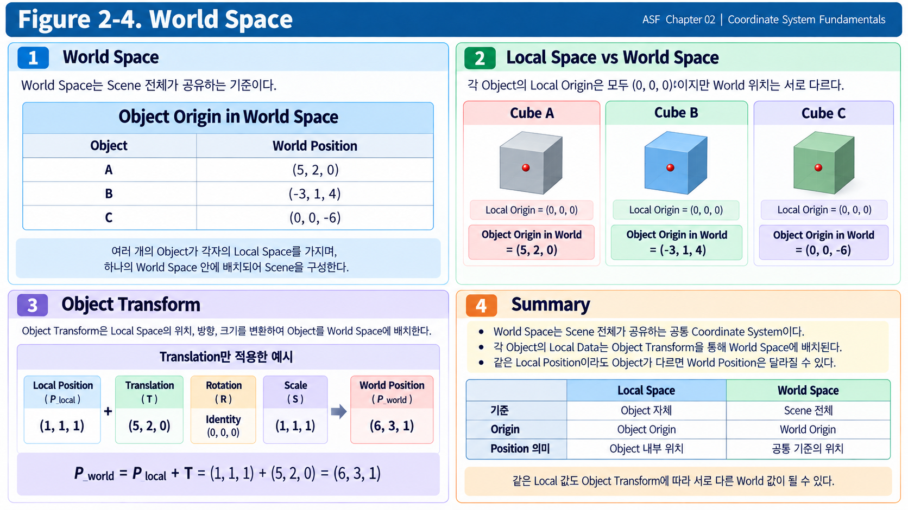

**Figure 2-4. World Space**

---

### World Space Is Shared by the Scene

Local Space는 Object마다 각각 존재할 수 있다.

예를 들어 Scene에 Cube A, Cube B, Cube C가 있다고 하자.

각 Cube는 자신의 Local Space를 가진다.

~~~text
Cube A
→ Local Space A

Cube B
→ Local Space B

Cube C
→ Local Space C
~~~

이 Local Space들은 서로 독립적이다.

각 Object는 자신의 Origin과 Local Axis를 기준으로 Vertex Position을 표현한다.

하지만 Scene 전체의 관점에서는 이 Object들이 서로 어디에 있는지를 비교할 수 있어야 한다.

이를 위해 하나의 공통 Coordinate System을 사용한다.

~~~text
Cube A Local Space
        ↓

Cube B Local Space
        ↓
      World Space

Cube C Local Space
        ↓
~~~

즉,

> **각 Object의 Local Space는 서로 다르지만, 모든 Object는 같은 World Space 안에 존재한다.**

---

### World Origin

World Space에도 기준점이 있다.

이 기준점을 **World Origin**이라고 하며 일반적으로 다음 위치로 표현한다.

~~~text
World Origin = (0, 0, 0)
~~~

World Space의 Position은 이 World Origin과 World Axis를 기준으로 표현된다.

예를 들어 다음 World Position이 있다고 하자.

~~~text
World Position = (5, 2, 0)
~~~

이 값은 World Origin에서

~~~text
World X 방향으로 5
World Y 방향으로 2
World Z 방향으로 0
~~~

만큼 떨어진 위치를 의미한다.

Local Position이 Object 내부의 위치를 나타낸다면,

> **World Position은 Scene 전체를 기준으로 한 위치를 나타낸다.**

---

### World Axis

World Space에는 Scene 전체가 공유하는 World Axis가 존재한다.

~~~text
World X Axis
World Y Axis
World Z Axis
~~~

이 Axis는 각 Object의 Local Axis와는 구분된다.

Object가 회전하지 않았다면 Local Axis와 World Axis가 같은 방향을 향할 수도 있다.

하지만 Object를 회전시키면 Local Axis는 Object와 함께 회전한다.

World Axis는 그대로 유지된다.

~~~text
World Axis
→ Scene 전체의 고정된 기준

Local Axis
→ Object 자신의 방향을 기준으로 함
~~~

따라서 회전된 Object에서는 Local X와 World X가 서로 다른 방향을 가리킬 수 있다.

---

### Multiple Objects in One World Space

Scene에 여러 Object가 있다고 생각해보자.

각 Object는 서로 다른 Object Transform을 가지고 있다.

예를 들어 다음과 같을 수 있다.

~~~text
Cube A
World Position = (5, 2, 0)

Cube B
World Position = (-3, 1, 4)

Cube C
World Position = (0, 0, -6)
~~~

각 Object의 Local Coordinate System은 서로 다를 수 있다.

하지만 World Position으로 표현하면 모든 Object의 위치를 하나의 기준에서 비교할 수 있다.

예를 들어

~~~text
Cube A는 World Origin 오른쪽에 있다.

Cube B는 Cube A보다 왼쪽에 있다.

Cube C는 World의 다른 깊이 위치에 있다.
~~~

처럼 Object 사이의 공간 관계를 하나의 공통 기준에서 이해할 수 있다.

이것이 World Space의 가장 중요한 역할 중 하나다.

---

### Local Position and World Position Are Different

같은 Vertex라도 Local Position과 World Position은 서로 다를 수 있다.

예를 들어 Cube 내부의 한 Vertex가 다음 Local Position을 가진다고 하자.

~~~text
Local Position = (1, 1, 1)
~~~

Object가 World에서 다음 위치에 배치되어 있다고 가정한다.

~~~text
Object Translation = (5, 2, 0)
~~~

Rotation과 Scale이 없다고 단순화하면 World Position은 다음처럼 생각할 수 있다.

~~~text
Local Position
(1, 1, 1)

+

Object Translation
(5, 2, 0)

↓

World Position
(6, 3, 1)
~~~

중요한 것은 Vertex가 두 개 존재하는 것이 아니라는 점이다.

> **같은 Vertex를 Local Space와 World Space라는 서로 다른 기준으로 표현한 것이다.**

---

### Same Local Position, Different World Position

World Space의 특징은 여러 Object를 비교할 때 더 분명해진다.

Cube A와 Cube B가 같은 Mesh를 사용한다고 하자.

두 Object 모두 같은 Vertex Data를 가지고 있다.

~~~text
Vertex Local Position = (1, 1, 1)
~~~

하지만 두 Object의 Transform이 다르다면 World Position도 달라진다.

~~~text
Cube A

Local Position = (1, 1, 1)
Object Translation = (5, 0, 0)

↓

World Position = (6, 1, 1)
~~~

~~~text
Cube B

Local Position = (1, 1, 1)
Object Translation = (-3, 2, 0)

↓

World Position = (-2, 3, 1)
~~~

즉,

> **같은 Local Position을 가진 Vertex라도 Object Transform이 다르면 World Position은 달라질 수 있다.**

이 구조 덕분에 하나의 Mesh를 Scene의 여러 위치에서 재사용할 수 있다.

---

### Object Transform Places Local Space into World Space

Object Transform의 중요한 역할은 Object의 Local Space를 World Space 안에 배치하는 것이다.

Object Transform에는 일반적으로 다음 정보가 포함된다.

- Translation
- Rotation
- Scale

개념적으로는 다음과 같이 볼 수 있다.

~~~text
Local Position
+
Object Transform

↓

World Position
~~~

하지만 실제 계산에서 Translation만 단순하게 더하는 것은 아니다.

Rotation과 Scale까지 포함되면 Local Position의 방향과 거리도 함께 변해야 한다.

따라서 실제 Rendering에서는 이러한 변환을 **Matrix Transformation**으로 처리한다.

~~~text
Local Position
↓
Object / Model Matrix
↓
World Position
~~~

Matrix의 구체적인 구조와 계산 방식은 Chapter 2 후반에서 자세히 다룬다.

지금 단계에서는

> **Object Transform이 Local Space의 Data를 World Space로 변환한다.**

라는 관계를 먼저 이해하면 된다.

---

### Translation

**Translation**은 Object를 World Space의 다른 위치로 이동시킨다.

예를 들어 Object의 Local Origin이 있고 다음 Translation을 적용한다고 하자.

~~~text
Translation = (5, 2, 0)
~~~

Object의 Local Origin은 World Space에서 다음 위치에 배치될 수 있다.

~~~text
Local Origin
(0, 0, 0)

↓

World Position
(5, 2, 0)
~~~

그리고 Object 내부의 모든 Vertex 역시 같은 Object Transform의 영향을 받는다.

즉,

> **Translation은 Object 전체의 World Position을 변경한다.**

---

### Rotation

**Rotation**은 Object의 Local Coordinate System이 World Space에서 어느 방향을 향하는지를 변경한다.

예를 들어 Local X 방향에 있는 Vertex가 있다고 하자.

~~~text
Local Position = (1, 0, 0)
~~~

Object가 회전하지 않은 상태에서는 이 Vertex가 World X 방향에 위치할 수 있다.

하지만 Object를 회전시키면 Local X Axis도 함께 회전한다.

따라서 Vertex의 Local Position은 그대로 `(1, 0, 0)`이더라도 World Position은 다른 방향으로 이동한다.

~~~text
Local Position
→ 유지

Object Rotation
→ 변경

World Position
→ 변경
~~~

즉,

> **Rotation은 Local Space 자체의 방향을 World Space에 대해 바꾼다.**

---

### Scale

**Scale**은 Object의 Local Coordinate가 World Space에서 얼마나 크게 또는 작게 표현될지를 변경한다.

예를 들어 Vertex가 다음 Local Position에 있다고 하자.

~~~text
Local Position = (1, 0, 0)
~~~

Object Scale이 다음과 같다면

~~~text
Scale = (2, 2, 2)
~~~

Object Origin에서 Vertex까지의 거리는 World에서 두 배로 표현된다.

단순화하면 다음과 같이 생각할 수 있다.

~~~text
Local Position
(1, 0, 0)

↓

Scale × 2

↓

(2, 0, 0)
~~~

실제 World Position은 여기에 Rotation과 Translation까지 함께 적용되어 결정된다.

---

### Translation, Rotation and Scale Work Together

실제 Object는 Translation, Rotation, Scale 중 하나만 사용하는 경우보다 여러 Transform이 함께 적용되는 경우가 일반적이다.

따라서 실제 관계는 다음에 가깝다.

~~~text
Local Position

↓
Scale

↓
Rotation

↓
Translation

↓

World Position
~~~

다만 이 Transform의 적용 순서는 중요하며, Matrix를 어떤 방식으로 구성하는지에 따라 표현 방식도 달라질 수 있다.

이 부분은 이후 **Matrix Transform Basics**에서 자세히 다룬다.

지금은

> **Local Space의 Vertex가 Object Transform을 거쳐 World Space에 배치된다.**

는 큰 흐름에 집중한다.

---

### World Space in DCC Tools

World Space 역시 DCC Tool 사용자에게 매우 익숙한 개념이다.

Blender 등의 DCC Tool에서 Transform Orientation을 `Global`로 설정하면 World Axis를 기준으로 Object를 조작할 수 있다.

예를 들어 회전된 Object가 있다고 하자.

`Local` Orientation에서는 Object 자신의 Axis를 기준으로 이동하지만,

`Global` Orientation에서는 Scene 전체의 World Axis를 기준으로 이동한다.

~~~text
Local

Object 자신의 X 방향으로 이동
~~~

~~~text
Global

World X 방향으로 이동
~~~

이 차이는 Local Space와 World Space의 차이를 그대로 보여준다.

---

### Object World Transform

DCC Tool의 Transform Panel에서 보는 Location, Rotation, Scale 값 역시 Object가 Parent를 가지는지, 어떤 Transform Space를 사용하고 있는지 등에 따라 해석이 조금 달라질 수 있다.

하지만 기본 개념에서는 Object가 World에 어떻게 배치되어 있는지를 나타내는 Transform으로 생각할 수 있다.

즉,

~~~text
Mesh Local Data
+
Object Transform
↓
Scene 안에서 보이는 Object
~~~

라는 구조는 Modeling 단계와 Rendering 단계 모두에서 공통적으로 사용된다.

---

### World Space Makes Comparison Possible

World Space의 중요한 장점은 서로 다른 Object의 Position이나 Direction을 **같은 기준에서 비교할 수 있다는 것**이다.

예를 들어 Character와 Light가 있다고 하자.

~~~text
Character World Position = (2, 0, 0)

Light World Position = (10, 5, 3)
~~~

두 Position이 모두 World Space에 있다면 두 Object 사이의 관계를 계산할 수 있다.

예를 들어

~~~text
Light Position
-
Character Position

↓

Character에서 Light로 향하는 Vector
~~~

를 만들 수 있다.

반대로 한쪽은 Local Space이고 다른 한쪽은 World Space라면 두 값을 그대로 빼는 것은 올바른 공간 관계를 의미하지 않는다.

즉,

> **여러 Object 사이의 관계를 계산하려면 먼저 같은 Coordinate Space에서 표현되어 있어야 한다.**

World Space는 이러한 계산에서 매우 자주 사용되는 공통 기준이다.

---

### World Space in Lighting

Lighting에서도 World Space는 자주 사용된다.

예를 들어 Surface에서 Lighting을 계산하기 위해 다음 Data가 필요할 수 있다.

~~~text
Surface World Position

Surface World Normal

Light World Position

Camera World Position
~~~

이 Data들이 모두 World Space에 있다면 서로의 관계를 같은 기준으로 계산할 수 있다.

예를 들어 Point Light가 있는 방향을 계산하려면 다음 관계를 사용할 수 있다.

~~~text
Light World Position
-
Surface World Position

↓

Surface → Light Vector
~~~

이후 이 Vector를 Normalize하면 Light Direction을 만들 수 있다.

이러한 계산은 Chapter 03 - Lighting Mathematics에서 자세히 다룬다.

---

### World Space in Shader

Shader 작업에서도 World Space는 매우 자주 접하게 된다.

Unreal Engine Material에서는 대표적으로 다음과 같은 World Space Data를 사용할 수 있다.

- Absolute World Position
- Vertex Normal WS
- Camera Position WS

여기서 `WS`는 **World Space**를 의미한다.

예를 들어 `Absolute World Position`은 현재 Surface 위치를 World Space 기준으로 제공한다.

이를 이용하면 Object 자신의 위치와 관계없이 World 전체를 기준으로 Effect를 만들 수 있다.

예를 들어 World의 특정 높이 이상에서 색을 바꾸는 Effect를 생각해보자.

~~~text
World Position Z
↓
특정 World Height와 비교
↓
Effect 적용
~~~

이 경우 Object를 World에서 이동시키면 Effect가 적용되는 부분도 달라진다.

왜냐하면 Effect의 기준이 Object가 아니라 World이기 때문이다.

---

### Local Space Effect vs World Space Effect

Local Space와 World Space의 차이는 Shader Effect를 만들 때 매우 중요하다.

예를 들어 Object의 위쪽 절반에 색을 적용한다고 하자.

Local Position을 기준으로 하면 다음과 같다.

~~~text
Local Position
↓
Object 내부 높이 판단
↓
Object와 함께 Effect 이동
~~~

Object를 World에서 이동시켜도 Effect는 Object 자체를 기준으로 유지된다.

반면 World Position을 사용하면 다음과 같다.

~~~text
World Position
↓
World Height 판단
↓
World 기준 Effect
~~~

Object가 이동하면서 World Height가 달라지면 Effect가 적용되는 위치도 달라진다.

즉,

> **Local Space는 Object에 붙어 있는 기준이고, World Space는 Scene에 고정된 기준이라고 생각하면 이해하기 쉽다.**

---

### World Space Is Not the Final Space

World Space는 Scene 전체를 표현하기에는 매우 편리하다.

하지만 Rendering Pipeline에서는 여기서 끝나지 않는다.

최종 Image를 만들려면 Camera가 Scene을 어떻게 바라보고 있는지를 알아야 한다.

World Space의 Object Position을 그대로 사용하면

> Object가 Scene 어디에 있는가

는 알 수 있지만

> Camera에서 바라봤을 때 Object가 어디에 있는가

는 직접 알 수 없다.

따라서 다음 단계에서는 World Space의 Position을 Camera 기준으로 다시 표현한다.

~~~text
Local Space
↓
World Space
↓
View Space
~~~

이 변환을 통해 Scene의 모든 Object를 Camera 기준의 Coordinate System으로 표현할 수 있다.

---

### Local Space and World Space Summary

Local Space와 World Space를 비교하면 다음과 같다.

| Property | Local Space | World Space |
|---|---|---|
| 기준 | Object 자체 | Scene 전체 |
| Origin | Object Origin | World Origin |
| Axis | Local Axis | World Axis |
| Position 의미 | Object 내부 위치 | Scene 안의 위치 |
| Object Rotation 영향 | Local Coordinate 자체는 유지 가능 | World Position / Direction 변화 |
| 여러 Object 비교 | 직접 비교하기 어려움 | 같은 기준에서 비교 가능 |

가장 중요한 관계는 다음과 같다.

~~~text
Local Space
→ Object 내부의 기준

World Space
→ Scene 전체의 공통 기준
~~~

그리고 두 Space는 Object Transform으로 연결된다.

~~~text
Local Position
↓
Object Transform
↓
World Position
~~~

즉,

> **각 Object는 자신만의 Local Space를 가지지만, Object Transform을 통해 모두 하나의 World Space 안에 배치된다.**

다음 절에서는 World Space에 배치된 Scene을 다시 **Camera를 기준으로 표현하는 View Space / Camera Space**에 대해 살펴본다.

---

## 2.5 View Space / Camera Space

Chapter 2.4에서는 여러 Object가 하나의 **World Space** 안에 배치된다는 점을 살펴보았다.

World Space를 사용하면 Scene 전체에서 Object와 Light, Camera의 위치를 하나의 공통 기준으로 표현할 수 있다.

하지만 최종적으로 Image를 만들려면 한 가지 정보가 더 필요하다.

> **Camera에서 바라봤을 때 각 Object가 어디에 있는가?**

World Space는 Scene 전체의 기준이기 때문에 Object가 World 어디에 있는지는 알 수 있지만, Camera를 기준으로 얼마나 왼쪽이나 오른쪽에 있는지, 얼마나 앞이나 뒤에 있는지는 바로 알 수 없다.

그래서 Rendering Pipeline에서는 World Space의 Position과 Direction을 **Camera 기준 Coordinate System**으로 다시 표현한다.

이 Coordinate Space를 **View Space** 또는 **Camera Space**라고 한다.

쉽게 말하면,

> **View Space는 Camera를 기준으로 World의 Position과 Direction을 다시 표현한 3D Coordinate Space다.**

---

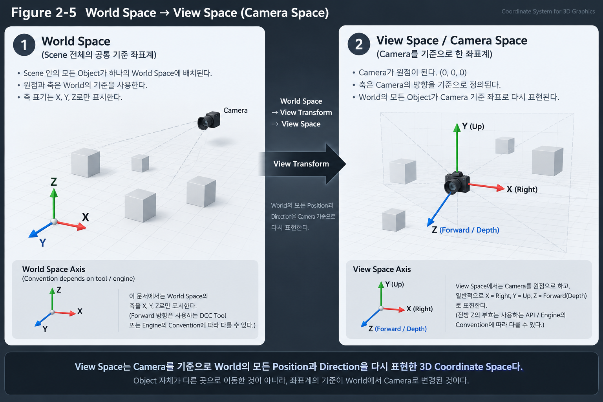

**Figure 2-5. View Space / Camera Space**

---

### Camera Becomes the Reference

World Space에서는 Scene 전체의 World Origin과 World Axis가 기준이었다.

~~~text id="2v5cam"
World Space

Origin
→ World Origin

Axis
→ World X / Y / Z
~~~

하지만 View Space에서는 기준이 Camera로 바뀐다.

개념적으로는 다음과 같다.

~~~text id="4b5cam"
View Space

Origin
→ Camera Position

Axis
→ Camera가 바라보는 방향을 기준으로 한 Axis
~~~

즉, Camera가 View Space의 기준점이 된다.

World Space에서 Camera가 어디에 있었든 View Space로 변환한 뒤에는 Camera를 기준으로 Scene이 다시 표현된다.

이때 Camera는 개념적으로 다음 위치에 있다고 생각할 수 있다.

~~~text id="6c7cam"
Camera Origin = (0, 0, 0)
~~~

---

### World Space to View Space

World Space의 한 Object가 다음 Position에 있다고 하자.

~~~text id="qnp5dq"
World Position = (6, 2, 0)
~~~

Camera도 World의 특정 위치와 Rotation을 가지고 있다.

~~~text id="yxt500"
Camera World Position
Camera World Rotation
~~~

World Position을 그대로 사용하면 Object가 Scene 전체에서 어디에 있는지는 알 수 있다.

하지만 Rendering에서는 Camera 입장에서 Object의 위치를 알아야 한다.

그래서 다음 변환을 수행한다.

~~~text id="htyvx3"
World Position
↓
View Transform
↓
View Position
~~~

이 결과는 같은 Object를 Camera 기준에서 다시 표현한 Position이다.

즉,

> **Object 자체가 다른 곳으로 이동한 것이 아니라 Coordinate System의 기준이 World에서 Camera로 변경된 것이다.**

---

### View Space Is Still 3D

View Space를 처음 접할 때 가장 중요한 점 중 하나다.

View Space는 Camera를 기준으로 만들어지기 때문에 이미 Screen에 보이는 결과처럼 느껴질 수 있다.

하지만 View Space는 아직 **3D Space**다.

Object는 여전히 다음과 같은 정보로 표현된다.

~~~text id="4mdfq6"
Camera 기준

Left / Right
Up / Down
Forward / Backward
~~~

즉, View Position 역시 세 개의 공간적 정보를 가지고 있다.

~~~text id="a61koy"
View Position = (x, y, z)
~~~

여기서 Depth에 해당하는 축 정보도 아직 존재한다.

따라서 View Space는 아직 2D Screen Coordinate가 아니다.

---

### View Space and Screen Space Are Different

DCC Tool의 Viewport를 오래 사용했다면 View Space와 Screen Space가 비슷하게 느껴질 수 있다.

둘 다 Camera나 Viewport를 기준으로 Scene을 바라보는 것처럼 보이기 때문이다.

하지만 Rendering Pipeline에서는 두 Space의 역할이 다르다.

**View Space**는 Camera를 기준으로 표현된 **3D Space**다.

반면 **Screen Space**는 Projection을 거친 뒤 실제 화면의 어느 2D 위치에 나타나는지를 표현한다.

~~~text id="ry3brm"
View Space
→ Camera 기준의 3D Position

Screen Space
→ Screen 기준의 2D Position
~~~

즉,

> **View Space에서는 Camera 기준의 공간 위치를 가지고 있고, Screen Space에서는 그 위치가 화면 어디에 나타날지가 결정된다.**

---

### Depth Still Exists in View Space

View Space에서는 Object가 Camera로부터 얼마나 앞이나 뒤에 있는지에 대한 정보가 여전히 존재한다.

예를 들어 Camera 앞에 두 Point가 있다고 하자.

~~~text id="0jw02v"
Point A
→ Camera와 가까움

Point B
→ Camera에서 멂
~~~

두 Point가 화면상 비슷한 방향에 있더라도 View Space에서는 서로 다른 Depth를 가진다.

개념적으로 다음과 같이 생각할 수 있다.

~~~text id="v754iu"
Point A
View Position = (1, 0, Depth Near)

Point B
View Position = (1, 0, Depth Far)
~~~

이 Depth 차이는 이후 Perspective Projection에서 매우 중요하게 사용된다.

왜냐하면 Camera에서 멀리 있는 Object를 더 작게 보이게 만드는 데 Depth가 필요하기 때문이다.

---

### Why Camera Space Is Needed

그렇다면 World Space Position을 그대로 Projection하면 안 될까?

Camera는 World 안에서 자유롭게 이동하고 회전할 수 있다.

따라서 World Coordinate를 그대로 사용하면 Projection 계산에서 매번 Camera의 Position과 방향을 함께 고려해야 한다.

View Space에서는 먼저 Scene 전체를 Camera 기준으로 변환한다.

~~~text id="3om2gl"
World Space
↓
Camera 기준으로 정리
↓
View Space
↓
Projection
~~~

이렇게 하면 Projection 단계에서는 Camera가 항상 일정한 기준 위치와 방향에 있다고 생각하고 계산할 수 있다.

즉,

> **View Space는 Camera의 위치와 방향을 먼저 정리해서 Projection을 단순한 기준에서 수행할 수 있도록 만드는 중간 Coordinate Space다.**

---

### A Useful Way to Think About View Transform

View Transform을 이해할 때 Camera가 움직이는 장면을 그대로 생각하면 처음에는 조금 헷갈릴 수 있다.

Rendering 관점에서는 반대로 생각하면 이해하기 쉽다.

> **Camera를 기준 위치에 고정하고 World 전체를 Camera의 움직임과 반대 방향으로 변환한다.**

예를 들어 Camera가 World에서 오른쪽으로 이동했다고 하자.

DCC Tool에서는 Camera가 실제로 오른쪽으로 움직인 것으로 보인다.

하지만 Camera 기준으로 Scene을 표현하려면 개념적으로 World 전체가 왼쪽으로 이동한 것처럼 변환할 수 있다.

~~~text id="9hbgfk"
Camera
→ 오른쪽으로 이동

View Transform 관점
→ World 전체를 왼쪽으로 이동
~~~

결과적으로 Camera는 View Space에서 다시 기준 위치에 놓인다.

---

### Camera Rotation Can Be Thought of the Same Way

Camera Rotation 역시 같은 방식으로 생각할 수 있다.

Camera가 오른쪽으로 회전했다고 하자.

Camera 기준으로 Scene을 다시 표현하려면 World 전체를 반대 방향으로 회전시키는 것처럼 생각할 수 있다.

~~~text id="dsiear"
Camera Rotation
→ 오른쪽

View Transform
→ World를 반대 방향으로 변환
~~~

이 과정을 거치면 View Space에서는 Camera가 항상 일정한 방향을 바라보는 기준 Coordinate System으로 표현될 수 있다.

즉,

> **Camera Transform의 반대 변환을 World에 적용한다고 생각하면 View Transform을 이해하기 쉽다.**

이 개념은 이후 View Matrix를 배울 때 다시 등장한다.

---

### View Transform Is the Inverse of Camera Transform

이 관계를 조금 더 정확하게 표현하면 **View Transform은 Camera Transform의 반대 변환**, 즉 **Inverse Transform**과 연결된다.

예를 들어 Camera를 World에 배치하기 위해 다음 Transform이 사용되었다고 하자.

~~~text id="e1c7ol"
Camera Transform

Translation
Rotation
~~~

World를 Camera 기준으로 다시 표현하려면 이 Transform을 반대로 적용해야 한다.

개념적으로는 다음과 같다.

~~~text id="529aur"
Camera World Transform
↓
Inverse
↓
View Transform
~~~

따라서 View Matrix는 일반적으로 Camera의 World Transform과 반대 관계를 가진다.

2.11–2.12에서 행렬 적용 순서와 간단한 Camera inverse 예제를 확인한다. 일반 행렬의 역행렬 계산 알고리즘 전체를 다루는 것은 아니다.

지금은

> **Camera를 World에 배치하는 Transform과 World를 Camera 기준으로 바꾸는 View Transform은 서로 반대 방향의 변환이다.**

정도로 이해하면 충분하다.

---

### A DCC Tool Example

DCC Tool에서도 View Space와 비슷한 감각을 쉽게 확인할 수 있다.

Scene에 Cube 하나를 배치하고 Camera View로 들어간다고 생각해보자.

Camera를 오른쪽으로 이동시키면 화면에서는 Cube가 왼쪽으로 이동하는 것처럼 보인다.

~~~text id="5mw0vh"
Camera → Right

화면에서 Object
→ Left
~~~

Camera를 앞으로 이동시키면 Object가 화면에서 커져 보이고,

Camera를 뒤로 이동시키면 Object가 작아 보인다.

DCC Tool에서는 Camera가 움직이는 것으로 조작하지만, Rendering 계산에서는 Scene을 Camera 기준으로 다시 표현한다고 생각할 수 있다.

둘은 같은 상대적 관계를 다른 관점에서 보는 것이다.

---

### View Space Position Depends on the Camera

World Space에서 Object가 움직이지 않아도 View Position은 달라질 수 있다.

예를 들어 Cube의 World Position이 고정되어 있다고 하자.

~~~text id="j1jqr1"
Cube World Position
→ 변하지 않음
~~~

하지만 Camera가 이동한다.

~~~text id="bqgi6s"
Camera 이동
↓
Camera 기준 변경
↓
Cube View Position 변경
~~~

즉,

> **View Position은 Object의 World Position뿐 아니라 Camera의 Position과 Rotation에도 영향을 받는다.**

이 점이 World Space와 View Space의 중요한 차이다.

---

### Same World Position, Different View Position

같은 Object를 서로 다른 Camera에서 바라보는 경우를 생각해보자.

Object의 World Position은 변하지 않는다.

~~~text id="qt5dda"
Object World Position
= 동일
~~~

하지만 Camera A와 Camera B의 Position과 Rotation이 다르다면 View Position도 다르다.

~~~text id="ey9vas"
Camera A
↓
View Position A

Camera B
↓
View Position B
~~~

즉,

> **World Position은 Scene 기준의 위치이고, View Position은 특정 Camera 기준의 위치다.**

따라서 Camera가 달라지면 같은 Object도 서로 다른 View Position을 갖는다.

---

### Position and Direction Can Both Be Transformed

View Space로 변환되는 것은 Position만이 아니다.

Direction 역시 Camera 기준으로 다시 표현할 수 있다.

예를 들어 World Space의 Normal이 다음 방향을 가리킨다고 하자.

~~~text id="e6z7fg"
World Normal
→ 특정 World Direction
~~~

이 Normal을 View Space로 변환하면 Camera 기준에서 Surface가 어느 방향을 향하고 있는지를 표현할 수 있다.

~~~text id="iqqzyd"
World Normal
↓
View Transform
↓
View Space Normal
~~~

하지만 Chapter 2.2에서 살펴본 것처럼 Position과 Direction은 Translation의 영향을 다르게 받는다.

따라서 같은 Transform을 사용하더라도 Position과 Direction은 수학적으로 구분해서 처리해야 한다.

이 차이는 이후 Matrix Transformation에서 다시 다룬다.

---

### View Space and Camera Direction

View Space에서는 Camera의 방향이 Coordinate System의 기준이 된다.

그래서 Camera에서 바라보는 Object의 위치 관계를 계산하기 편리해진다.

예를 들어 어떤 Point가

- Camera 왼쪽에 있는지
- 오른쪽에 있는지
- 위에 있는지
- 아래에 있는지
- 앞에 있는지
- 뒤에 있는지

를 Camera 기준 Coordinate로 표현할 수 있다.

이것이 이후 Projection으로 연결된다.

Projection은 이러한 Camera 기준 3D Position을 이용해서

> **Screen에서 어디에 나타나야 하는가**

를 계산한다.

---

### Axis Convention Can Differ

View Space의 X, Y, Z Axis가 정확히 어느 방향을 의미하는지는 Graphics API나 Engine의 Convention에 따라 달라질 수 있다.

예를 들어 Camera Forward가

- `+Z`
- `-Z`

중 어느 방향으로 정의되는지는 시스템에 따라 다를 수 있다.

따라서 특정 부호를 무조건 외우기보다 다음 개념을 이해하는 것이 중요하다.

> **View Space는 Camera의 위치와 방향을 기준으로 정의된 Coordinate System이다.**

정확한 Axis Convention은 사용하는 Engine이나 API의 규칙을 확인하면 된다.

---

### View Space Prepares for Projection

View Space의 가장 중요한 다음 단계는 **Projection**이다.

현재 Object들은 Camera 기준 3D Space 안에 있다.

~~~text id="fd69es"
View Space

X
→ Camera 기준 좌우

Y
→ Camera 기준 상하

Depth Axis
→ Camera 기준 앞뒤
~~~

이제 이 3D Position을 2D Screen에 표현해야 한다.

여기서 한 가지 중요한 문제가 발생한다.

현실의 Camera처럼

> 가까운 Object는 크게 보이고, 먼 Object는 작게 보여야 한다.

이 관계를 만들어주는 것이 **Perspective Projection**이다.

따라서 전체 흐름은 다음과 같다.

~~~text id="r8nxtx"
World Space
↓
View Transform
↓
View Space
↓
Projection
↓
Clip Space
~~~

---

### View Space Is an Intermediate Stage

DCC의 Camera View는 최종 화면처럼 보이지만, **View Space 자체는 Camera 기준의 3D 공간**이다. 이후 Projection → Clip Space → NDC → Screen Space 변환이 필요하다.

---

### View Space / Camera Space Summary

World Space와 View Space를 비교하면 다음과 같다.

| Property | World Space | View Space |
|---|---|---|
| 기준 | Scene 전체 | Camera |
| Origin | World Origin | Camera Origin |
| Axis | World Axis | Camera 기준 Axis |
| Position 의미 | Scene 안에서의 위치 | Camera 기준 위치 |
| Camera 이동 영향 | Object World Position은 유지 가능 | View Position 변화 |
| Dimension | 3D | 3D |
| 주요 목적 | Scene 전체 관계 표현 | Projection을 위한 Camera 기준 표현 |

전체 변환 관계는 다음과 같다.

~~~text id="nd4umq"
World Position
↓
View Transform
↓
View Position
~~~

그리고 View Transform을 이해하는 가장 쉬운 관점은 다음과 같다.

> **Camera가 움직이는 대신 World 전체를 Camera의 반대 방향으로 변환해서 Camera를 기준점으로 만든다.**

따라서 View Space는

> **Camera를 Origin과 방향 기준으로 삼아 Scene 전체를 다시 표현한 3D Coordinate Space**

라고 정리할 수 있다.

다음 절에서는 View Space의 3D Position을 실제 Screen에 표현하기 위해 사용하는 **Projection**에 대해 살펴본다.

---

## 2.6 Projection

Chapter 2.5에서는 World Space의 Position을 Camera 기준으로 다시 표현한 **View Space / Camera Space**를 살펴보았다.

View Space에서는 Camera가 기준이 되기 때문에 Object가 Camera의 왼쪽에 있는지, 오른쪽에 있는지, 위에 있는지, 아래에 있는지, 그리고 얼마나 앞이나 뒤에 있는지를 3D Coordinate로 표현할 수 있다.

하지만 최종적으로 우리가 보고 싶은 것은 3D Position 그 자체가 아니다.

> **이 Object가 Screen의 어느 위치에 보이는가?**

를 알아야 한다.

즉, Camera 기준의 3D Space를 2D Screen에 표현하는 과정이 필요하다.

이 과정을 **Projection**이라고 한다.

쉽게 말하면,

> **Projection은 View Space의 3D Position을 Screen에 표현하기 위한 형태로 변환하는 과정이다.**

Projection에는 여러 방식이 있지만, Real-time Rendering에서 가장 대표적인 것은 다음 두 가지다.

- Perspective Projection
- Orthographic Projection

이 절에서는 두 Projection의 차이와 함께 Perspective Projection이 왜 필요한지 살펴본다.

---

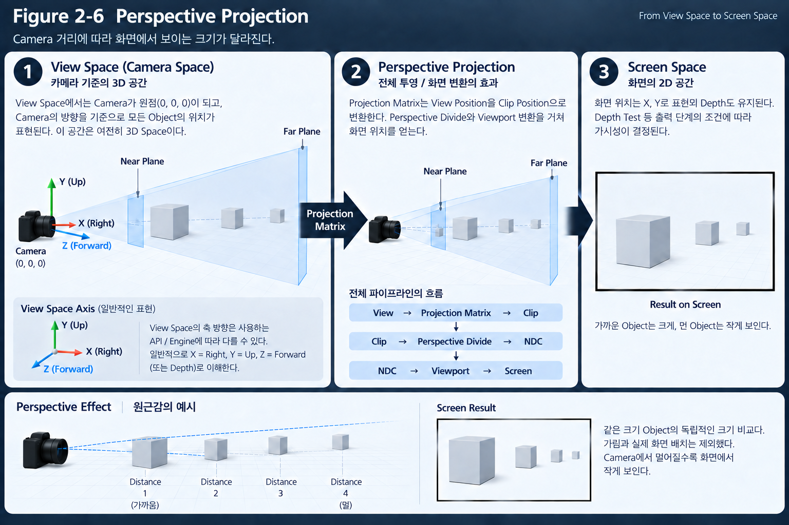

**Figure 2-6. Perspective Projection**

---

### Why Projection Is Needed

View Space는 Camera를 기준으로 정리된 3D Space다.

예를 들어 두 Object가 있다고 하자.

~~~text
Object A
→ Camera에서 가까움

Object B
→ Camera에서 멂
~~~

두 Object 모두 View Space 안에서는 여전히 3D Position을 가진다.

하지만 실제 Screen에서는 멀리 있는 Object가 더 작게 보이고, 가까운 Object가 더 크게 보인다.

즉, 단순히 X와 Y Position만 가져와서 Screen에 찍는 것으로는 현실적인 Camera View를 만들 수 없다.

Camera와의 거리, 즉 Depth를 이용해서 화면상의 위치와 크기를 조정해야 한다.

이 역할을 하는 것이 Projection이다.

---

### Perspective Projection

**Perspective Projection**은 현실의 Camera나 사람의 시각과 비슷한 원근감을 만드는 Projection 방식이다.

가장 중요한 특징은 다음과 같다.

> **Camera에서 가까운 Object는 크게 보이고, 멀리 있는 Object는 작게 보인다.**

같은 크기의 Cube를 Camera에서 서로 다른 거리에 배치했다고 하자.

~~~text
Near Object
→ 크게 보임

Far Object
→ 작게 보임
~~~

실제 Cube의 크기가 달라진 것은 아니다.

Camera와의 Depth 차이가 Screen에 투영될 때 크기 차이로 나타난 것이다.

이것이 Perspective Projection의 핵심이다.

---

### Perspective Is Based on Depth

Perspective Projection에서 Object가 Screen에 얼마나 크게 보이는지는 Camera와의 Depth에 영향을 받는다.

개념적으로는 다음과 같이 생각할 수 있다.

~~~text
같은 크기의 Object

Camera와 가까움
→ Screen에서 크게 보임

Camera와 멂
→ Screen에서 작게 보임
~~~

즉,

> **Perspective Projection은 View Space의 Depth 정보를 이용해서 Screen에서의 크기와 위치를 조정한다.**

이 Depth 관계 때문에 View Space가 아직 3D Space여야 한다.

Projection 전에 Depth 정보를 잃어버리면 Perspective Effect를 만들 수 없다.

---

### A Simple Camera Analogy

Perspective Projection은 실제 Camera를 생각하면 이해하기 쉽다.

Camera 앞에 손을 가까이 가져가면 화면 대부분을 가릴 정도로 크게 보일 수 있다.

같은 손을 멀리 떨어뜨리면 훨씬 작게 보인다.

~~~text
같은 Object

Near
→ Large on Screen

Far
→ Small on Screen
~~~

Object 자체가 변한 것이 아니라 Camera와의 거리 관계가 달라진 것이다.

3D Rendering에서도 동일한 원리를 수학적으로 구현한다.

---

### View Frustum

Perspective Camera가 볼 수 있는 3D 영역은 일반적으로 **View Frustum** 형태로 표현된다.

Frustum은 Camera 앞쪽으로 멀어질수록 넓어지는 형태다.

개념적으로는 다음과 같다.

~~~text
        Far Plane
 /-------------------\
  \                 /
   \               /
    \             /
     \-----------/
       Near Plane

         Camera
~~~

Camera에 가까운 영역은 좁고, 멀어질수록 보이는 범위가 넓어진다.

이 형태가 Perspective Projection의 원근감과 연결된다.

---

### Near Plane

**Near Plane**은 Camera에서 너무 가까운 영역을 잘라내는 기준 Plane이다.

Camera보다 앞에 있다고 해서 모든 Geometry를 무조건 Rendering하는 것은 아니다.

Near Plane보다 Camera에 더 가까운 Geometry는 일반적으로 Rendering 영역에서 제외된다.

~~~text
Camera

X  너무 가까움
|
| Near Plane
|
O  Rendering 가능 영역
~~~

Near Plane은 단순한 Optimization 설정이 아니다.

Perspective Projection의 수학적 구조와 Depth Precision에도 영향을 준다.

Depth 값의 비선형성과 Near/Far 선택의 기본 의미는 2.9 Perspective Divide and NDC에서 연결한다. Chapter 09는 일반적인 측정·진단 관점을 다루며 Depth Precision의 상세 유도는 이 Foundation의 범위 밖이다.

---

### Far Plane

**Far Plane**은 Camera에서 너무 멀리 떨어진 영역을 제한하는 기준 Plane이다.

Near Plane과 Far Plane 사이의 영역이 Camera가 볼 수 있는 기본적인 Depth 범위를 만든다.

~~~text
Camera
↓
Near Plane
↓
Visible Range
↓
Far Plane
~~~

Far Plane보다 멀리 있는 Geometry는 일반적인 Projection 범위 밖에 놓인다.

다만 실제 Engine에서는 Infinite Far Plane이나 Reversed-Z 같은 기법을 사용하면서 전통적인 Far Plane의 역할이 달라질 수도 있다.

Chapter 02에서는 우선

> **Near Plane과 Far Plane이 Camera가 사용하는 Depth 범위를 정의한다.**

정도로 이해하면 충분하다.

---

### Field of View

Perspective Camera에서 중요한 또 하나의 값이 **Field of View**, 줄여서 **FOV**다.

FOV는 Camera가 얼마나 넓은 범위를 바라보는지를 결정한다.

쉽게 말하면,

> **Camera의 시야각**

이다.

FOV가 작으면 좁은 영역을 확대해서 보는 느낌이 난다.

~~~text
Small FOV

좁은 시야
→ 멀리 있는 것을 당겨 보는 느낌
~~~

FOV가 크면 더 넓은 영역이 화면에 들어온다.

~~~text
Large FOV

넓은 시야
→ Wide Angle 느낌
~~~

따라서 FOV는 단순히 Camera가 어디를 보는지만 결정하는 값이 아니라 Screen에 나타나는 Perspective의 느낌에도 큰 영향을 준다.

---

### FOV and Perspective Distortion

FOV가 커질수록 화면 가장자리에서 Perspective Distortion이 강하게 느껴질 수 있다.

예를 들어 Wide Angle Lens처럼 FOV가 매우 크면 화면 가장자리의 Object가 늘어나 보이는 느낌이 강해질 수 있다.

같은 Camera 위치·방향에서 FOV만 줄이면 화면에 포함되는 범위와 배율이 달라진다. 흔히 말하는 Perspective Compression은 같은 크기로 framing하기 위해 Camera를 멀리 옮기는 조건과 함께 구분해야 한다. FOV 하나만으로 Object 사이의 상대 거리 관계가 변한다고 해석하지 않는다.

즉,

~~~text
Small FOV
→ 좁은 시야
→ 같은 Camera 위치에서는 좁은 범위를 확대

Large FOV
→ 넓은 시야
→ 같은 Camera 위치에서는 더 넓은 범위를 포함
~~~

Camera Lens와 비슷한 감각으로 이해할 수 있다.

---

### Aspect Ratio

**Aspect Ratio**는 Screen의 가로와 세로 비율이다.

예를 들어 다음과 같은 비율이 있다.

~~~text
16 : 9

21 : 9

4 : 3
~~~

같은 FOV를 사용하더라도 Screen의 Aspect Ratio가 달라지면 실제 화면에 보이는 영역도 달라질 수 있다.

따라서 Projection은 단순히 Camera의 Depth만 보는 것이 아니라

- FOV
- Aspect Ratio
- Near Plane
- Far Plane

같은 Camera 정보를 함께 사용한다.

---

### Projection Parameters

Perspective Projection을 구성하는 대표적인 Parameter를 정리하면 다음과 같다.

| Parameter | Meaning |
|---|---|
| **FOV** | Camera가 바라보는 시야각 |
| **Aspect Ratio** | Screen의 가로/세로 비율 |
| **Near Plane** | Camera에 가까운 Rendering 경계 |
| **Far Plane** | Camera에서 먼 Rendering 경계 |

이 값들을 이용해 Camera가 볼 수 있는 Frustum과 Projection 규칙이 만들어진다.

---

### What Is a Matrix?

앞에서 Local Space에서 World Space로, World Space에서 View Space로 Coordinate를 변환할 때도 **Matrix**라는 용어가 등장했다.

하지만 지금까지는 Matrix의 역할을 깊게 설명하지 않았다.

여기서는 Projection Matrix를 이해하기 위해 Matrix가 어떤 의미인지 먼저 간단히 정리한다.

쉽게 말하면,

> **Matrix는 Position이나 Direction을 한 Coordinate Space에서 다른 Coordinate Space로 바꾸기 위한 여러 Transform 규칙을 하나의 계산 구조로 묶어놓은 것이다.**

예를 들어 Object를 World에 배치하려면 다음과 같은 Transform이 필요하다.

~~~text
Translation
Rotation
Scale
~~~

이 계산을 각각 따로 처리할 수도 있지만, Rendering에서는 이런 Transform을 Matrix 형태로 정리해서 한 번에 적용할 수 있다.

개념적으로는 다음과 같다.

~~~text
Local Position
↓
Transform Matrix
↓
World Position
~~~

즉, Matrix는 단순히 숫자를 표처럼 배열한 것이 중요한 것이 아니다.

> **어떤 Coordinate를 다른 기준으로 변환하기 위한 규칙을 담고 있다는 점**

이 더 중요하다.

---

### Matrix as a Transformation Rule

Matrix를 처음 보면 여러 숫자가 행과 열로 배치된 복잡한 표처럼 보인다.

하지만 Chapter 02에서는 Matrix를 다음과 같이 이해하면 충분하다.

~~~text
Input Coordinate
↓
Matrix
↓
Transformed Coordinate
~~~

예를 들어 Local Space에서 World Space로 변환할 때는 Object Transform을 담은 Matrix를 사용한다.

~~~text
Local Position
↓
Object / Model Matrix
↓
World Position
~~~

World Space에서 Camera 기준으로 변환할 때는 View Matrix를 사용한다.

~~~text
World Position
↓
View Matrix
↓
View Position
~~~

그리고 현재 다루고 있는 Projection에서는 Projection Matrix를 사용한다.

~~~text
View Position
↓
Projection Matrix
↓
Clip Position
~~~

즉, Matrix의 이름은 **어떤 변환을 담당하는가**에 따라 달라진다.

---

### What Is the Projection Matrix?

**Projection Matrix**는 View Space의 3D Position에 Projection 규칙을 적용하기 위한 Matrix다.

Perspective Projection에서는 단순히 Position을 다른 위치로 옮기는 것만으로는 부족하다.

다음과 같은 조건을 함께 반영해야 한다.

- FOV
- Aspect Ratio
- Near Plane
- Far Plane
- Camera와의 Depth
- Perspective Effect

이러한 규칙들을 하나의 변환 구조로 정리한 것이 Projection Matrix다.

따라서 개념적인 관계는 다음과 같다.

~~~text
View Position
↓
Projection Matrix
↓
Clip Position
~~~

즉,

> **Projection Matrix는 Camera 기준의 3D Position을 Perspective Projection 규칙에 맞는 Clip Space Position으로 변환한다.**

---

### Why Use a Projection Matrix?

Perspective Projection에는 여러 계산이 필요하다.

예를 들어

- 화면의 가로/세로 비율을 고려해야 하고
- FOV에 맞게 시야 범위를 조절해야 하며
- Near / Far 범위를 반영해야 하고
- Depth에 따라 X와 Y가 다르게 보이도록 만들어야 한다.

이 모든 규칙을 Vertex마다 각각 따로 처리하는 대신, Rendering에서는 이 규칙들을 Projection Matrix에 담아 적용한다.

개념적으로는 다음과 같다.

~~~text
FOV
Aspect Ratio
Near Plane
Far Plane
Perspective Rule

↓

Projection Matrix

↓

View Position을 Clip Position으로 변환
~~~

따라서 Projection Matrix는

> **Perspective Camera의 투영 규칙을 계산 가능한 형태로 정리한 Transform**

이라고 이해하면 된다.

---

### Matrix Does Not Mean the Geometry Is Changed

이 Projection 과정은 원본 Mesh Data를 덮어쓰는 작업이 아니다. 같은 Cube가 멀어져 작게 보이는 것은 원본 Geometry의 Scale이 줄어서가 아니라 화면에 투영되는 크기가 달라지기 때문이다.

---

### Projection Does Not Directly Produce Final Pixels

Projection이라는 말을 들으면 3D Position이 바로 Screen Pixel Coordinate로 변환된다고 생각하기 쉽다.

하지만 실제 Rendering Pipeline에서는 Projection 이후에도 여러 단계가 남아 있다.

전체 흐름은 다음과 같다.

~~~text
View Space
↓
Projection Matrix
↓
Clip Space
↓
Perspective Divide
↓
NDC
↓
Viewport Transform
↓
Screen Space
~~~

즉,

> **Projection은 3D Position을 바로 최종 Screen Pixel로 만드는 과정이 아니라, Screen으로 가져가기 위한 중요한 변환 단계다.**

Projection의 결과는 우선 **Clip Space**로 이어진다.

---

### Why Clip Space Exists

Projection 다음에 바로 Screen Space로 가지 않고 Clip Space를 거치는 이유는 Camera가 볼 수 있는 영역과 그렇지 않은 영역을 구분하기 위해서다.

View Frustum 안에 들어오는 Geometry만 Screen에 나타날 수 있다.

따라서 Projection Matrix는 View Position을 Clipping과 이후 Perspective Divide에 적합한 형태로 변환한다.

개념적인 흐름은 다음과 같다.

~~~text
View Space Position
↓
Projection Matrix
↓
Clip Space Position
↓
Frustum 내부 / 외부 판단
~~~

Clip Space는 다음 절에서 자세히 다룬다.

---

### Perspective Projection Changes X and Y Based on Depth

Perspective Projection의 핵심을 조금 더 구체적으로 보면 X와 Y의 Screen 위치가 Depth와 무관하지 않다는 점이 중요하다.

예를 들어 View Space에서 두 Point가 있다고 하자.

~~~text
Point A
→ Camera에 가까움

Point B
→ Camera에서 멂
~~~

여기서는 두 Point가 같은 View Space X/Y Offset을 가지며 View Depth만 다르다고 가정한다. Camera에서 출발하는 동일 ray 위의 Point라면 X/Depth와 Y/Depth 비율이 같아서 같은 화면 위치로 투영된다. 같은 ray와 같은 횡방향 Offset은 다른 조건이다.

Camera에서 멀어질수록 같은 공간상의 X/Y Offset이 Screen에서는 더 작게 나타난다.

즉,

> **Perspective Projection에서는 X와 Y의 표현이 Depth의 영향을 받는다.**

이 관계가 가까운 Object는 크게, 먼 Object는 작게 보이도록 만든다.

---

### Orthographic Projection

Projection에는 Perspective Projection 외에도 **Orthographic Projection**이 있다.

Orthographic Projection에서는 Camera와의 거리에 따라 Object 크기가 줄어들지 않는다.

즉,

~~~text
Near Object
→ 같은 크기

Far Object
→ 같은 크기
~~~

로 보인다.

Depth는 존재하지만 Perspective에 의한 Size Reduction이 없다.

쉽게 말하면,

> **Orthographic Projection은 원근감에 따른 크기 변화를 제거한 Projection 방식이다.**

---

### Perspective vs Orthographic

두 Projection을 비교하면 다음과 같다.

| Property | Perspective Projection | Orthographic Projection |
|---|---|---|
| Distance에 따른 크기 변화 | 있음 | 없음 |
| 원근감 | 있음 | 없음 |
| Camera 느낌 | 실제 Camera와 비슷함 | 설계도 / 정투영과 비슷함 |
| 주요 사용 | 일반 3D Rendering | UI, 전략 게임, 기술 View 등 |

DCC Tool 사용자라면 Perspective View와 Orthographic View의 차이를 이미 익숙하게 경험했을 것이다.

---

### Perspective and Orthographic Views in DCC Tools

Blender 같은 DCC Tool에서는 Viewport를 Perspective와 Orthographic 사이에서 전환할 수 있다.

Perspective View에서는 멀리 있는 Object가 작게 보인다.

~~~text
Perspective

Near Cube
→ 크게 보임

Far Cube
→ 작게 보임
~~~

Orthographic View에서는 Depth가 달라도 같은 크기의 Object는 거의 같은 크기로 보인다.

~~~text
Orthographic

Near Cube
→ 같은 크기

Far Cube
→ 같은 크기
~~~

따라서 Projection이라는 개념 자체는 DCC Tool 사용자에게 매우 익숙하다.

Chapter 02에서는 이 익숙한 결과가 Rendering Pipeline 안에서 어떤 Coordinate Transformation으로 만들어지는지를 연결해서 이해하는 것이 중요하다.

---

### Projection Changes Representation, Not Geometry

앞서 구분했듯이, Camera Distance에 따른 Screen Size 변화와 원본 Mesh의 크기 변화는 다르다. Projection은 전자를 계산한다.

---

### Projection Matrix in the Rendering Pipeline

지금까지 등장한 Matrix를 Rendering Pipeline의 Coordinate 흐름에 연결하면 다음과 같이 볼 수 있다.

~~~text
Local Position
↓
Model / Object Matrix
↓
World Position
↓
View Matrix
↓
View Position
↓
Projection Matrix
↓
Clip Position
~~~

이렇게 보면 각 Matrix의 역할이 명확해진다.

~~~text
Model / Object Matrix
→ Local → World

View Matrix
→ World → View

Projection Matrix
→ View → Clip
~~~

즉, Matrix는 전부 같은 일을 하는 것이 아니다.

> **각 Matrix는 서로 다른 Coordinate Space 사이의 변환을 담당한다.**

이 세 Matrix의 관계는 이후 **2.12 Model / View / Projection Matrix**에서 다시 자세히 정리한다.

---

### Projection and Depth

Projection 이후에도 Depth 정보가 완전히 사라지는 것은 아니다.

최종 Screen은 2D지만 Rendering에서는 어떤 Surface가 Camera 앞에 있고 어떤 Surface가 뒤에 있는지를 계속 판단해야 한다.

따라서 Position을 Screen 방향으로 Projection하는 과정에서도 Depth 정보를 이후 계산에 사용할 수 있도록 유지한다.

이 정보는 이후

- Clipping
- Depth Test
- Perspective-Correct Interpolation

같은 Rendering 과정에 사용된다.

즉,

> **3D Position을 2D 화면에 투영한다고 해서 Depth 정보 자체가 바로 없어지는 것은 아니다.**

---

### Projection Is the Bridge Between 3D and 2D

Projection은 Camera 기준 3D Position을 화면 좌표로 연결하는 과정의 시작이다. Projection Matrix 이후에도 Clipping, Perspective Divide, Viewport Transform이 남아 있다.

---

### Projection Summary

Projection의 핵심을 정리하면 다음과 같다.

~~~text
View Space
→ Camera 기준의 3D Position

Projection
→ 3D Position을 Screen에 표현하기 위한 변환

Projection Matrix
→ Projection 규칙을 하나의 Transform 구조로 정리

Perspective Projection
→ 가까운 Object는 크게
→ 먼 Object는 작게

Orthographic Projection
→ Distance에 따른 크기 변화 없음

Projection Result
→ Clip Space
~~~

Perspective Projection에 사용되는 주요 Camera Parameter는 다음과 같다.

~~~text
FOV
Aspect Ratio
Near Plane
Far Plane
~~~

Matrix는 다음처럼 이해하면 된다.

> **Matrix는 Coordinate를 한 Space에서 다른 Space로 변환하기 위한 규칙을 하나의 계산 구조로 묶어놓은 것이다.**

그리고 Projection Matrix는 그중에서도

> **View Space의 3D Position에 Perspective Projection 규칙을 적용해 Clip Space Position으로 변환하는 Matrix**

다.

따라서 전체 흐름은 다음과 같다.

~~~text
View Position
↓
Projection Matrix
↓
Clip Position
~~~

다음 절에서는 이 Projection 결과가 들어가는 **Clip Space**가 무엇이며, 왜 Screen Space로 바로 가지 않고 이 중간 Space가 필요한지를 살펴본다.

---

## 2.7 Clip Space

Chapter 2.6에서는 View Space의 3D Position에 **Projection Matrix**를 적용해 Perspective Projection을 수행한다고 설명했다.

그 결과는 바로 Screen Position이 되지 않는다.

Rendering Pipeline의 Coordinate 흐름은 다음과 같이 이어진다.

~~~text
View Space
↓
Projection Matrix
↓
Clip Space
↓
Perspective Divide
↓
NDC
↓
Viewport Transform
↓
Screen Space
~~~

Projection Matrix가 만들어내는 첫 번째 결과가 **Clip Space**다.

Clip Space는 처음 접하면 상당히 낯선 개념이다.

Local Space, World Space, View Space는 모두 우리가 DCC Tool에서 쉽게 상상할 수 있는 3D 공간이었다.

하지만 Clip Space는 조금 다르다.

> **Clip Space는 Projection 이후 Geometry가 Camera의 View Frustum 안에 있는지를 판단하고, 이후 Perspective Divide를 수행하기 위해 사용하는 중간 Coordinate Space다.**

즉, 사람이 Scene을 배치하거나 Modeling하기 위해 사용하는 공간이라기보다 **GPU가 Rendering을 처리하기 좋은 형태로 만든 Coordinate Space**라고 생각하는 것이 좋다.

---

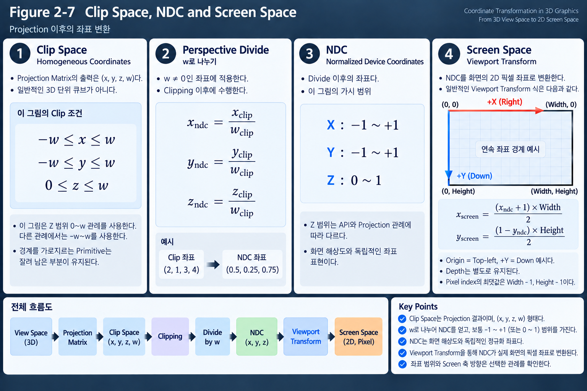

**Figure 2-7. Clip Space, NDC and Screen Space**

Figure 2-7은 Projection 이후의 전체 흐름을 한 번에 보여준다.

~~~text
Clip Space
↓
Perspective Divide
↓
NDC
↓
Viewport Transform
↓
Screen Space
~~~

이 절에서는 그중 첫 번째 단계인 **Clip Space**에 집중한다.

Perspective Divide와 NDC는 이후 절에서 자세히 다룬다.

---

### Why Do We Need Clip Space?

Perspective Projection의 최종 목적은 3D Scene을 2D Screen에 표현하는 것이다.

그렇다면 Projection Matrix를 적용한 뒤 바로 Screen Position을 계산하면 더 간단해 보일 수 있다.

하지만 그 전에 해결해야 할 문제가 있다.

Camera가 바라보는 영역 밖에 있는 Geometry까지 모두 Screen에 그릴 필요는 없다.

예를 들어 다음 Object들이 있다고 하자.

~~~text
Camera View Frustum 내부
→ 보일 가능성이 있음

Camera 뒤쪽
→ 보이지 않음

View Frustum 왼쪽 / 오른쪽 밖
→ 보이지 않음

Near / Far 범위 밖
→ 보이지 않음
~~~

GPU는 이러한 Geometry를 Screen Coordinate로 완전히 변환하기 전에 **Camera가 볼 수 있는 범위 안에 있는지 판단**할 필요가 있다.

이 과정이 **Clipping**과 연결된다.

그리고 Clipping을 하기 좋은 형태로 Projection 결과를 표현한 공간이 Clip Space다.

---

### Clip Space Is the Result of the Projection Matrix

View Space Position에 Projection Matrix를 적용하면 Clip Space Position을 얻는다.

~~~text
View Position
↓
Projection Matrix
↓
Clip Position
~~~

수식의 구체적인 계산은 이후 Matrix를 다루면서 살펴보지만, 개념적으로는 다음 관계만 이해하면 된다.

> **Projection Matrix는 View Space Position을 Clip Space Position으로 변환한다.**

이때 중요한 변화가 하나 있다.

View Space에서는 Position을 일반적으로 다음처럼 생각했다.

~~~text
(x, y, z)
~~~

하지만 Clip Space에서는 다음과 같은 형태가 된다.

~~~text
(x, y, z, w)
~~~

즉, 하나의 값이 추가된다.

---

### Clip Position Has Four Components

Clip Space의 Position은 일반적으로 네 개의 값을 가진다.

~~~text
Clip Position

(x, y, z, w)
~~~

처음 보면 이런 의문이 생길 수 있다.

> **3D Graphics인데 왜 갑자기 네 번째 값인 w가 필요한가?**

이 `w`는 Perspective Projection에서 매우 중요한 역할을 한다.

나중에 다음 단계에서

~~~text
x / w
y / w
z / w
~~~

를 계산하는 **Perspective Divide**가 수행된다.

Perspective Divide를 거치면 Camera에서 멀리 있는 Point일수록 같은 X/Y Offset이 더 작은 Screen Offset으로 변환된다. 그 결과 Object의 Vertex들이 화면상 서로 가까워지고, 멀리 있는 Object가 더 작게 보이는 Perspective Effect가 만들어진다.

즉,

> **Clip Space의 w는 Perspective를 처리하기 위해 필요한 중요한 값이다.**

다만 `w`의 정확한 의미와 왜 3D Coordinate에 네 번째 값이 필요한지는 이후 **2.8 Homogeneous Coordinate and W**에서 자세히 다룬다.

지금은

~~~text
View Space
(x, y, z)

↓

Projection Matrix

↓

Clip Space
(x, y, z, w)
~~~

라는 변화가 일어난다는 점만 기억하면 된다.

---

### Clip Space Is Not Screen Space

Clip Space라는 이름 때문에 이미 화면에 맞게 잘린 2D Coordinate처럼 느껴질 수 있다.

하지만 그렇지 않다.

Clip Space는 아직 실제 Pixel Position이 아니다.

~~~text
Clip Space
≠ Screen Space
~~~

Screen Space까지는 다음 단계가 더 남아 있다.

~~~text
Clip Space
↓
Perspective Divide
↓
NDC
↓
Viewport Transform
↓
Screen Space
~~~

즉,

> **Clip Space는 Projection과 Screen Space 사이에 존재하는 중간 Coordinate Space다.**

---

### Clip Space Is Not an Ordinary 3D Space

Local Space, World Space, View Space에서는 Position을 실제 3D 공간의 위치처럼 생각하기 쉬웠다.

~~~text
Local Position
→ Object 기준 3D 위치

World Position
→ Scene 기준 3D 위치

View Position
→ Camera 기준 3D 위치
~~~

하지만 Clip Space는 같은 방식으로 상상하기 어렵다.

Clip Position은

~~~text
(x, y, z, w)
~~~

형태의 **Homogeneous Coordinate**로 표현되기 때문이다.

따라서 Clip Space를 단순한 또 하나의 일반적인 3D 공간으로 이해하기보다는

> **Projection 이후 Clipping과 Perspective Divide를 위해 만들어진 수학적인 중간 표현**

이라고 이해하는 것이 더 정확하다.

---

### From View Frustum to a Simpler Range

View Space에서 Perspective Camera가 볼 수 있는 영역은 **View Frustum** 형태였다.

~~~text
        Far Plane
 /-------------------\
  \                 /
   \               /
    \             /
     \-----------/
       Near Plane

         Camera
~~~

이 형태는 Camera에서 멀어질수록 넓어진다.

즉, 직관적으로는 이해하기 쉽지만 계산하기에는 일정한 크기의 Box보다 복잡하다.

Projection Matrix는 이 Perspective Frustum을 이후 단계에서 다루기 쉬운 형태로 바꾸는 역할도 한다.

개념적으로는 다음처럼 생각할 수 있다.

~~~text
View Space

Perspective Frustum
↓
Projection Matrix
↓
Clip Space

Clipping하기 쉬운 형태
~~~

따라서 Projection은 단순히 Object를 작게 보이도록 만드는 작업만 하는 것이 아니다.

> **Camera가 볼 수 있는 공간을 GPU가 판정하기 좋은 Coordinate 형태로 변환하는 역할도 한다.**

---

### What Does Clipping Mean?

**Clipping**은 Camera가 볼 수 있는 영역을 벗어난 Geometry를 잘라내는 과정이다.

예를 들어 Triangle 하나가 View Frustum의 경계에 걸쳐 있다고 하자.

~~~text
View Frustum 내부
       |
       |\
       | \
-------|--\------ Frustum Boundary
       |   \
           외부
~~~

Triangle 전체를 단순히 제거하면 안 된다.

일부분은 Camera에 보이기 때문이다.

따라서 경계와 교차하는 Geometry는 필요한 경우 새로운 Vertex를 만들어 **보이는 부분만 남기도록 잘라낼 수 있다.**

~~~text
Before Clipping

Triangle 일부
→ Frustum 밖

After Clipping

Frustum 내부 부분
→ 유지

Frustum 외부 부분
→ 제거
~~~

이것이 Chapter 01에서 살펴본 Clipping과 같은 개념이다.

Chapter 01에서는 Rendering Pipeline의 Stage로 보았다면, 여기서는 그 과정에서 **Coordinate가 왜 Clip Space 형태로 준비되는지**를 살펴보는 것이다.

---

### Why Is It Called Clip Space?

이름 자체가 역할을 잘 설명한다.

~~~text
Clip
→ 잘라낸다

Space
→ Coordinate를 표현하는 기준
~~~

즉,

> **Geometry를 View Frustum 기준으로 Clipping하기 적합한 Coordinate Space**

이기 때문에 Clip Space라고 부른다.

---

### The Role of w in the Clip Range

Clip Space에서는 `w`가 단순히 Perspective Divide에만 사용되는 것이 아니다.

Clipping 범위를 표현하는 데에도 중요한 역할을 한다.

개념적으로 X와 Y는 다음과 같은 범위와 비교할 수 있다.

~~~text
-w ≤ x ≤ +w

-w ≤ y ≤ +w
~~~

즉, `w`가 커지면 허용되는 X와 Y의 범위 역시 함께 커진다.

이 구조는 Perspective Camera의 Frustum이 멀어질수록 넓어지는 특성과 연결된다.

Camera에서 멀리 있는 Point에서는 일반적으로 Perspective와 관련된 `w`도 변화하기 때문에, 허용되는 공간 범위 역시 이에 맞춰 달라질 수 있다.

따라서

> **Clip Space는 w를 이용해서 Perspective Frustum의 범위를 표현할 수 있다.**

---

### What About the Z Range?

X와 Y의 Clip 범위는 비교적 공통적으로 `w`와 비교해서 이해할 수 있다.

하지만 Z, 즉 Depth에 대한 Convention은 Graphics API에 따라 차이가 있다.

예를 들어 API나 Rendering Convention에 따라 Clip / NDC Depth Range가 다를 수 있다.

Clip Space는 (x,y,z,w)의 homogeneous 표현이며 X/Y 경계도 w에 의존한다. Figure 2-7의 고정 Cube를 Clip Space 전체의 실제 3D 범위로 읽어서는 안 된다. Divide 뒤의 NDC 범위와 특정 w 단면을 구분하고, Depth 범위는 사용 convention을 명시한다. 이 구분은 Figure의 후속 정렬에서도 유지한다.

이 Chapter에서는 특정 API의 숫자 범위를 외우기보다

> **Clip Space에서는 Position이 View Frustum 안에 존재하는지를 판단할 수 있는 형태로 변환된다.**

는 원리를 이해하는 것이 더 중요하다.

---

### Inside and Outside

Clip Space에서는 Position이 허용 범위 안에 있는지 판정할 수 있다.

예를 들어 개념적으로 X가 다음 범위를 만족한다면

~~~text
-w ≤ x ≤ +w
~~~

좌우 범위 안에 있는 것으로 볼 수 있다.

반대로

~~~text
x > +w
~~~

라면 오른쪽 범위를 벗어난 것이다.

~~~text
x < -w
~~~

라면 왼쪽 범위를 벗어난 것이다.

Y 역시 비슷한 방식으로 상하 범위를 판단할 수 있다.

즉,

> **복잡한 Perspective Frustum의 내부/외부 관계를 일정한 Coordinate 조건으로 검사할 수 있게 된다.**

이것이 Clip Space의 중요한 장점이다.

---

### Vertex Outside Does Not Always Mean the Whole Triangle Is Removed

여기서 주의할 점이 있다.

Triangle을 구성하는 Vertex 하나가 Clip Range 밖에 있다고 해서 Triangle 전체를 무조건 버리는 것은 아니다.

예를 들어 다음처럼 Triangle이 경계에 걸쳐 있을 수 있다.

~~~text
Vertex A
→ Inside

Vertex B
→ Inside

Vertex C
→ Outside
~~~

이 경우 Triangle 일부가 여전히 화면에 보일 수 있다.

따라서 GPU는 Triangle과 Clip Boundary의 교차 관계를 계산하고 필요한 경우 Geometry를 잘라낸다.

~~~text
Original Triangle
↓
Clipping
↓
Visible Portion
~~~

이 점이 **Culling**과 **Clipping**의 차이이기도 하다.

Culling은 Primitive 전체를 제거할 수 있지만,

Clipping은 경계에 걸친 Primitive의 일부를 잘라낼 수 있다.

---

### Clipping Happens Before Perspective Divide

Coordinate 흐름에서 순서도 중요하다.

개념적인 순서는 다음과 같다.

~~~text
Projection Matrix
↓
Clip Space
↓
Clipping
↓
Perspective Divide
↓
NDC
~~~

즉, 일반적인 Pipeline 설명에서는 **Perspective Divide 전에 Clip Space에서 Clipping을 수행한다.**

이름이 Clip Space인 이유가 바로 여기에 있다.

---

### Why Not Divide by w First?

처음에는 다음처럼 생각할 수도 있다.

> 어차피 `w`로 나눌 것이라면 Perspective Divide부터 하고 나중에 Clipping하면 되지 않을까?

하지만 Perspective Divide 이전의 Clip Coordinate는 Frustum Boundary를 다루기에 유용한 구조를 가지고 있다.

특히 Triangle이 Near Plane과 같은 경계를 가로지를 때 Perspective Divide 전에 Geometry를 올바르게 잘라내는 것이 중요하다.

따라서 개념적인 Rendering Pipeline에서는

~~~text
Clip Space
↓
Clipping
↓
Perspective Divide
~~~

순서로 이해하는 것이 좋다.

---

### Clip Space and Perspective Are Connected

Projection Matrix를 적용하면서 Perspective와 Clipping을 위한 정보가 함께 만들어진다.

따라서 다음 두 과정은 서로 완전히 독립된 것이 아니다.

~~~text
Perspective Projection

+

View Frustum Clipping
~~~

Projection Matrix가 만든 Clip Position에는 이후 두 작업에 필요한 정보가 들어 있다.

~~~text
Clip Position
(x, y, z, w)

↓

Clipping

그리고

↓

Perspective Divide
~~~

즉,

> **Clip Space는 Projection 결과를 Clipping과 Perspective Divide 두 단계로 연결하는 공간이다.**

---

### Perspective Divide

Clipping이 끝나면 다음 단계로 **Perspective Divide**를 수행한다.

Clip Position은 다음과 같은 형태였다.

~~~text
(x, y, z, w)
~~~

이 값을 `w`로 나눈다.

~~~text
x' = x / w

y' = y / w

z' = z / w
~~~

그리고 결과는 다음 단계인 **NDC**로 이동한다.

~~~text
Clip Space
(x, y, z, w)

↓

Perspective Divide
÷ w

↓

NDC
(x, y, z)
~~~

이 과정이 왜 Perspective Effect를 만드는지는 이후 Homogeneous Coordinate와 Perspective Divide를 다루면서 다시 자세히 살펴본다.

---

### NDC Preview

Perspective Divide 이후 Coordinate는 일정한 범위로 정리된다.

이 공간을 **NDC**, 즉 **Normalized Device Coordinates**라고 한다.

NDC의 중요한 특징은 실제 Screen Resolution과 직접적인 관계가 없다는 점이다.

예를 들어

~~~text
1920 × 1080

2560 × 1440

3840 × 2160
~~~

처럼 Screen Resolution이 달라도 NDC는 일정한 정규화 범위를 사용할 수 있다.

따라서

> **NDC는 실제 Pixel Coordinate로 변환되기 전의 표준화된 Coordinate Space**

라고 생각할 수 있다.

NDC는 이후 절에서 자세히 다룬다.

---

### Clip Space Is Resolution Independent

Clip Space 역시 특정 Screen Resolution을 직접 사용하지 않는다.

아직 다음과 같은 실제 Pixel Coordinate를 다루는 단계가 아니다.

~~~text
Pixel X = 1260

Pixel Y = 540
~~~

이런 Screen Position은 훨씬 뒤의 Viewport Transform에서 결정된다.

현재 단계에서는

~~~text
Camera
Projection
Frustum
Clipping
Perspective
~~~

같은 Camera 기반 Geometry 관계를 처리하고 있다.

즉,

> **Clip Space는 Screen Resolution과 독립적인 Rendering 중간 Coordinate Space다.**

---

### Clip Space in the Rendering Pipeline

지금까지 배운 Coordinate 흐름에 Clip Space를 넣어보면 다음과 같다.

~~~text
Local Position
↓
Model / Object Matrix
↓
World Position
↓
View Matrix
↓
View Position
↓
Projection Matrix
↓
Clip Position
↓
Clipping
↓
Perspective Divide
↓
NDC
~~~

여기까지 오면 각 Matrix의 역할도 조금 더 명확해진다.

~~~text
Model Matrix
→ Object를 World에 배치

View Matrix
→ World를 Camera 기준으로 변환

Projection Matrix
→ View Position을 Clip Space로 변환
~~~

Projection Matrix 이후부터는 우리가 DCC Tool에서 직접 다루는 Coordinate보다 **GPU Rendering Pipeline 내부의 Coordinate 표현**에 가까워진다.

---

### A Practical Way to Think About Clip Space

Clip Space는 Projection 설정을 반영한 뒤 **Clipping을 수행하고 Perspective Divide를 준비하는 중간 표현**이다. 아직 실제 Pixel 좌표가 아니다.

---

### Clip Space Summary

Clip Space의 역할을 정리하면 다음과 같다.

| Property | Description |
|---|---|
| Input | View Space Position |
| Transform | Projection Matrix |
| Coordinate | `(x, y, z, w)` |
| 주요 역할 | View Frustum Clipping |
| 다음 단계 | Perspective Divide |
| Screen Pixel인가? | 아니다 |

전체 관계는 다음과 같다.

~~~text
View Position
↓
Projection Matrix
↓
Clip Position
(x, y, z, w)

↓

Clipping

↓

Perspective Divide

↓

NDC
~~~

Clip Space에서 가장 먼저 기억해야 할 것은 세 가지다.

> **첫째, Projection Matrix의 결과가 Clip Space다.**

> **둘째, Clip Space에서는 Camera의 View Frustum 밖에 있는 Geometry를 판정하고 Clipping할 수 있다.**

> **셋째, Clip Position은 `(x, y, z, w)` 형태이며 이후 `w`로 나누는 Perspective Divide로 이어진다.**

그리고 여기서 처음 본 `w`는 단순한 추가 숫자가 아니다.

Perspective Projection과 Coordinate Transformation을 이해하는 핵심 요소다.

다음 절에서는

> **왜 3D Position에 네 번째 값인 w가 필요한가?**

를 중심으로 **Homogeneous Coordinate and W**를 살펴본다.

---

## 2.8 Homogeneous Coordinate and W

Chapter 2.7에서는 Projection Matrix를 적용한 결과가 **Clip Space**로 들어가며, 이때 Position이 다음과 같은 형태로 표현된다고 설명했다.

~~~text
(x, y, z, w)
~~~

여기서 처음으로 `w`라는 네 번째 값이 본격적으로 등장한다.

3D Graphics인데 왜 `(x, y, z)` 세 개가 아니라 `(x, y, z, w)` 네 개의 값을 사용할까?

이 질문에 답하기 위해 사용하는 개념이 **Homogeneous Coordinate**다.

쉽게 말하면,

> **Homogeneous Coordinate는 3D Coordinate에 w를 하나 추가해서 Position과 Direction을 구분하고, Translation과 Perspective Projection을 Matrix 계산 안에서 함께 처리할 수 있도록 만든 표현 방식이다.**

즉, `w`는 단순히 하나의 숫자를 추가한 것이 아니다.

Rendering Pipeline에서 서로 다른 종류의 Transform을 하나의 Matrix 체계 안에서 다루기 위해 필요한 중요한 값이다.

---

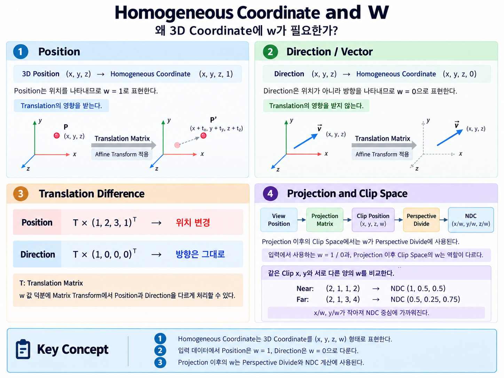

**Figure 2-8. Homogeneous Coordinate and W**

---

### Why Add One More Value?

일반적인 3D Position은 다음과 같이 표현한다.

~~~text
(x, y, z)
~~~

예를 들어

~~~text
Position = (1, 2, 3)
~~~

이라고 하면 어떤 Coordinate System 안에서 X, Y, Z 방향으로 각각 1, 2, 3의 위치를 가진다는 의미다.

그런데 Rendering에서는 Position뿐 아니라 Direction도 함께 다뤄야 한다.

예를 들어

~~~text
Position  = (1, 2, 3)

Direction = (1, 0, 0)
~~~

둘 다 XYZ 값으로 표현된다.

하지만 Chapter 2.2에서 살펴본 것처럼 Position과 Direction은 Transform에서 서로 다르게 처리되어야 한다.

특히 Translation에서 차이가 발생한다.

~~~text
Position
→ Translation의 영향을 받음

Direction
→ Translation의 영향을 받지 않음
~~~

문제는 XYZ 값만 보면 이 Data가 Position인지 Direction인지 알 수 없다는 것이다.

그래서 하나의 값을 추가한다.

~~~text
(x, y, z)

↓

(x, y, z, w)
~~~

이 네 번째 값인 `w`를 이용하면 Matrix 계산에서 Position과 Direction을 구분할 수 있다.

---

### Position Uses w = 1

Position을 Homogeneous Coordinate로 표현할 때는 일반적으로 다음과 같이 사용한다.

~~~text
Position

(x, y, z)

↓

(x, y, z, 1)
~~~

즉,

> **Position은 일반적으로 w = 1로 표현한다.**

예를 들어 다음 Position이 있다고 하자.

~~~text
Position = (1, 2, 3)
~~~

Homogeneous Coordinate로 표현하면 다음과 같다.

~~~text
Position = (1, 2, 3, 1)
~~~

여기서 `w = 1`이라는 정보는 Matrix Transform에서

> **이 Data는 위치를 나타내며 Translation의 영향을 받아야 한다.**

는 의미로 사용할 수 있다.

---

### Direction Uses w = 0

Direction은 일반적으로 다음과 같이 표현한다.

~~~text
Direction

(x, y, z)

↓

(x, y, z, 0)
~~~

즉,

> **Direction은 일반적으로 w = 0으로 표현한다.**

예를 들어 오른쪽을 나타내는 Direction이 다음과 같다고 하자.

~~~text
Direction = (1, 0, 0)
~~~

Homogeneous Coordinate로 표현하면 다음과 같다.

~~~text
Direction = (1, 0, 0, 0)
~~~

여기서 `w = 0`은 Matrix Transform에서

> **이 Data는 위치가 아니라 방향이므로 Translation의 영향을 받지 않아야 한다.**

는 차이를 만들어낸다.

---

### Why Translation Treats Position and Direction Differently

이 차이는 Translation Matrix를 생각하면 더 명확해진다.

Position이 다음과 같다고 하자.

~~~text
Position = (1, 2, 3, 1)
~~~

그리고 X 방향으로 5만큼 이동하는 Translation을 적용한다고 하자.

결과는 개념적으로 다음과 같다.

~~~text
Before

(1, 2, 3, 1)

↓

Translation +5 X

↓

After

(6, 2, 3, 1)
~~~

Position은 이동했다.

반면 Direction이 다음과 같다고 하자.

~~~text
Direction = (1, 0, 0, 0)
~~~

같은 Translation을 적용해도 Direction은 바뀌지 않는다.

~~~text
Before

(1, 0, 0, 0)

↓

Translation +5 X

↓

After

(1, 0, 0, 0)
~~~

왜냐하면 Direction은 어디에 있는지를 나타내는 Data가 아니기 때문이다.

즉,

> **w를 이용하면 하나의 Matrix Transform 안에서도 Position에는 Translation을 적용하고, Direction에는 Translation을 적용하지 않을 수 있다.**

---

### Why Is w = 0 Enough to Ignore Translation?

이 부분은 Matrix의 구조를 보면 완전히 이해할 수 있지만, 아직 Matrix 계산을 본격적으로 다루기 전이므로 개념만 살펴본다.

Translation Matrix에는 이동량이 포함되어 있다.

개념적으로 다음과 같은 정보가 들어 있다고 생각할 수 있다.

~~~text
Translation X
Translation Y
Translation Z
~~~

Matrix가 Coordinate와 계산될 때 이 Translation 값들은 `w`와 연결된다.

따라서

~~~text
w = 1

Translation × 1
→ Translation 적용
~~~

이 되지만,

~~~text
w = 0

Translation × 0
→ Translation 제거
~~~

가 된다.

즉,

> **w는 Translation을 적용할지 말지를 구분하는 역할을 할 수 있다.**

이것이 Position과 Direction을 `(x, y, z, w)` 형태로 표현하는 중요한 이유 중 하나다.

---

### Homogeneous Coordinate Is More Than Position vs Direction

w≠0인 homogeneous Point는 모든 성분을 같은 0이 아닌 값으로 곱해도 Divide 뒤 같은 Cartesian Point를 나타낸다. 예를 들어 (2,4,6,2)와 (1,2,3,1)은 모두 (1,2,3)으로 복원된다. 여기서 동치란 Projective Point의 표현에 관한 것이며, 임의로 Clip 좌표의 부호를 바꾸어도 clipping test 결과가 같다는 뜻은 아니다.

이 관계는 affine 입력의 w=1/0 역할과 Projection 뒤의 w 역할을 연결한다.

여기까지만 보면 Homogeneous Coordinate가 단순히 Position과 Direction을 구분하기 위해 존재하는 것처럼 보일 수 있다.

하지만 더 중요한 역할이 하나 있다.

바로 **Perspective Projection**이다.

앞에서 Perspective Projection에서는 Camera에서 멀리 있는 Object가 작게 보이고, 가까운 Object가 크게 보인다고 설명했다.

이 원근감을 만들기 위해 Rendering Pipeline에서는 Projection Matrix를 적용한 뒤 `w`를 이용한다.

~~~text
View Position
↓
Projection Matrix
↓
Clip Position
(x, y, z, w)
~~~

그리고 다음 단계에서

~~~text
x / w
y / w
z / w
~~~

를 계산한다.

이 과정을 **Perspective Divide**라고 한다.

즉,

> **Homogeneous Coordinate의 w는 Position과 Direction을 구분하는 데 사용될 뿐 아니라 Perspective Projection을 계산하는 데에도 사용된다.**

---

### Input w and Clip Space w Are Not the Same Role

여기서 반드시 구분해야 할 것이 있다.

앞에서 Position과 Direction을 표현할 때 다음과 같이 사용했다.

~~~text
Position
→ w = 1

Direction
→ w = 0
~~~

하지만 이것은 **Matrix Transform에 들어가는 입력 Data를 표현할 때의 w**다.

Projection Matrix를 통과한 뒤 Clip Space에 도착하면 상황이 달라진다.

~~~text
View Position
(x, y, z, 1)

↓

Projection Matrix

↓

Clip Position
(x, y, z, w)
~~~

여기서 Clip Position의 `w`는 더 이상 단순히 1이 아니다.

Perspective Projection 과정에서 Camera와의 Depth에 관계된 값으로 변환될 수 있다.

즉,

> **입력 Coordinate에서의 w = 1 / 0과 Clip Space에서의 w는 역할이 다르다.**

이 차이는 매우 중요하다.

---

### Position w = 1 Does Not Mean w Always Stays 1

Position을 처음 Matrix에 넣을 때는 일반적으로 다음과 같이 표현한다.

~~~text
Position = (x, y, z, 1)
~~~

하지만 여러 Matrix를 통과하면 `w` 값이 달라질 수 있다.

특히 Projection Matrix를 통과한 뒤에는

~~~text
Clip Position = (x, y, z, w)
~~~

형태가 되고, `w`가 Perspective Divide에 사용된다.

따라서

~~~text
Position
→ w는 항상 1
~~~

이라고 이해하면 안 된다.

더 정확하게는

> **Position을 Homogeneous Coordinate로 입력할 때 일반적으로 w = 1을 사용한다.**

라고 이해해야 한다.

---

### Direction w = 0 Does Not Mean Every Vector Always Uses w = 0

Direction도 마찬가지다.

Transformation을 위한 Direction Data를 Homogeneous Coordinate로 표현할 때는 일반적으로

~~~text
Direction = (x, y, z, 0)
~~~

으로 사용한다.

이것은 Direction이 Translation의 영향을 받지 않도록 하기 위한 표현이다.

하지만 Rendering Pipeline에서 등장하는 모든 네 번째 값이 단순히 Position / Direction 구분만을 의미하는 것은 아니다.

특히 Clip Space의 `w`는 Perspective와 연결된다.

따라서 `w`를 볼 때는 항상

> **현재 어떤 단계의 w인가?**

를 함께 확인해야 한다.

---

### w in Projection

Projection 뒤의 w는 View Depth와 Perspective Divide를 연결한다. 같은 x_clip을 가진 두 Point에서 양의 w가 더 크면 x_clip/w는 더 작아진다. 같은 Camera ray처럼 x_clip과 w가 함께 비례하는 경우는 화면 위치가 유지된다.

이 절에서는 affine 입력의 w=1/0과 Projection 뒤 w의 역할 차이를 기억한다. 구체 수치와 Clip/NDC 표기를 갖춘 계산 예제는 바로 다음 2.9 Perspective Divide and NDC에서 이어서 확인한다.

---

### How This Makes Objects Look Smaller

Object 하나를 구성하는 여러 Vertex를 생각해보자.

가까운 Cube의 왼쪽과 오른쪽 Vertex가 Perspective Divide 이후 다음과 같은 값을 가진다고 하자.

~~~text
Left  = -1

Right = +1
~~~

두 Vertex 사이의 Screen Width는 크다.

반면 같은 Cube가 Camera에서 멀어지면 다음처럼 될 수 있다.

~~~text
Left  = -0.2

Right = +0.2
~~~

두 Vertex가 화면 중심 쪽으로 더 가까워졌다.

따라서 Screen에서 Cube가 차지하는 폭도 줄어든다.

즉,

> **Perspective Divide를 거치면 Camera에서 멀리 있는 Point일수록 같은 X/Y Offset이 더 작은 Screen Offset으로 변환된다.**

그리고 Object를 구성하는 Vertex들의 Screen 위치가 서로 가까워지면서

> **멀리 있는 Object가 더 작게 보이는 Perspective Effect가 만들어진다.**

---

### Perspective Divide Does Not Move Everything to the Center

여기서 표현을 조심해야 한다.

Camera에서 먼 Object가 모두 화면 중앙으로 이동한다는 뜻은 아니다.

예를 들어 Object가 Camera의 오른쪽 방향에 있다면 Perspective Projection 이후에도 일반적으로 화면 오른쪽에 나타난다.

다만 같은 3D X/Y Offset이

~~~text
Near
→ 큰 Screen Offset

Far
→ 작은 Screen Offset
~~~

으로 표현되는 것이다.

즉,

> **같은 View Space X/Y Offset에서 View Depth만 커지는 경우, Perspective Divide 뒤의 화면 중심 Offset은 작아진다. 동일 Camera ray의 두 Point는 같은 투영 위치를 가진다.**

그 결과 Object의 Screen Size도 작아진다.

---

### Why Not Use Three Coordinates Only?

이제 3D Coordinate에 굳이 `w`를 추가하는 이유를 조금 더 명확하게 볼 수 있다.

XYZ만 사용한다면 다음 문제들을 하나의 일반적인 Matrix 체계 안에서 처리하기 어렵다.

~~~text
Position과 Direction 구분

Translation

Rotation

Scale

Perspective Projection
~~~

하지만 Homogeneous Coordinate를 사용하면

~~~text
(x, y, z, w)
~~~

형태 안에서 이 Transform들을 일관된 Matrix 계산으로 연결할 수 있다.

즉,

> **Homogeneous Coordinate는 서로 다른 종류의 Transform을 하나의 Matrix System 안에서 표현할 수 있게 해주는 방법이다.**

---

### Why Is It Called Homogeneous Coordinate?

`Homogeneous`라는 단어 자체는 처음 보면 이해하기 어렵다.

Chapter 02에서는 수학적인 정의를 깊게 다루지 않는다.

Rendering 관점에서는 우선

> **3D Coordinate를 w가 포함된 4개의 값으로 확장한 Coordinate 표현**

이라고 이해하면 충분하다.

즉,

~~~text
3D Coordinate

(x, y, z)

↓

Homogeneous Coordinate

(x, y, z, w)
~~~

다만 Homogeneous Coordinate에는 중요한 특징이 하나 있다.

Perspective Divide를 통해 여러 4D 표현을 하나의 3D Coordinate로 다시 변환할 수 있다는 점이다.

이 관계는 다음 절에서 Perspective Divide를 자세히 다룰 때 다시 살펴본다.

---

### Homogeneous Coordinate and Matrix

Homogeneous Coordinate가 중요한 이유는 Matrix와 함께 사용할 때 더욱 명확해진다.

Rendering Pipeline에서 지금까지 등장한 Transform을 다시 보면 다음과 같다.

~~~text
Local Position
↓
Model Matrix
↓
World Position
↓
View Matrix
↓
View Position
↓
Projection Matrix
↓
Clip Position
~~~

이러한 Transform을 하나의 Matrix 기반 계산 구조로 연결하기 위해 Position을 Homogeneous Coordinate 형태로 사용한다.

개념적으로는 다음과 같다.

~~~text
Position

(x, y, z)

↓

Homogeneous Coordinate

(x, y, z, 1)

↓

Matrix Transform
~~~

Direction 역시

~~~text
Direction

(x, y, z)

↓

Homogeneous Coordinate

(x, y, z, 0)

↓

Matrix Transform
~~~

형태로 처리할 수 있다.

즉,

> **Homogeneous Coordinate는 3D Geometry Data를 Matrix Transformation에 적합한 형태로 확장한 표현이라고 생각할 수 있다.**

---

### Position and Direction Revisited

2.2의 구분을 Homogeneous Coordinate에 연결하면 Position은 `(x, y, z, 1)`, Direction은 `(x, y, z, 0)`으로 표현한다. Affine Transform에서 전자는 Translation을 포함하고 후자는 제외한다. Rotation과 Scale은 둘 모두에 작용하며, Normal의 별도 변환 조건은 2.13에서 다룬다.

---

### Homogeneous Coordinate in the Rendering Pipeline

지금까지의 Coordinate 흐름과 `w`를 함께 보면 다음과 같다.

~~~text
Local Position
(x, y, z, 1)

↓

Model Matrix

↓

World Position

↓

View Matrix

↓

View Position

↓

Projection Matrix

↓

Clip Position
(x, y, z, w)

↓

Perspective Divide
(x/w, y/w, z/w)

↓

NDC
~~~

여기서 `w`의 역할이 두 단계로 나뉘는 것을 볼 수 있다.

#### Before Projection

~~~text
w = 1
→ Position

w = 0
→ Direction
~~~

주로 Position과 Direction을 Matrix에서 다르게 처리하는 데 사용된다.

#### After Projection

~~~text
Clip Space w
→ Perspective Divide에 사용
~~~

Perspective Projection을 실제 Coordinate 변화로 반영하는 데 사용된다.

---

### A Useful Mental Model

**w를 모든 단계에서 같은 의미를 갖는 Flag로 해석하면 안 된다.** Position / Direction 입력의 `w = 1 / 0`과 Projection 이후 Perspective Divide에 사용하는 `w_clip`을 구분한다.

---

### What You Need to Understand at This Point

아래 표에서 입력의 표현과 Projection 이후의 역할을 구분하면 된다. 다음 절에서는 Clip Coordinate를 w로 나눈 결과를 수치 예제로 확인한다.

---

### Homogeneous Coordinate and W Summary

Homogeneous Coordinate의 핵심을 정리하면 다음과 같다.

| Data / Stage | Representation | w의 주요 역할 |
|---|---|---|
| Position Input | `(x, y, z, 1)` | Translation 적용 |
| Direction Input | `(x, y, z, 0)` | Translation 제외 |
| Clip Position | `(x, y, z, w)` | Perspective Divide에 사용 |
| After Divide | `(x/w, y/w, z/w)` | NDC로 변환 |

전체 흐름은 다음과 같다.

~~~text
3D Position
(x, y, z)

↓

Homogeneous Coordinate
(x, y, z, 1)

↓

Matrix Transformation

↓

Projection Matrix

↓

Clip Position
(x, y, z, w)

↓

Perspective Divide
÷ w

↓

NDC
(x/w, y/w, z/w)
~~~

가장 중요한 것은 다음과 같다.

> **Homogeneous Coordinate는 3D Coordinate에 w를 추가해서 Position과 Direction을 Matrix에서 다르게 처리하고, Perspective Projection까지 하나의 Matrix 기반 Transform 체계로 연결할 수 있도록 만든다.**

그리고 반드시 구분해야 한다.

> **Position 입력에서 사용하는 w = 1과 Direction 입력에서 사용하는 w = 0은 Data의 종류를 구분하기 위한 표현이며, Projection 이후 Clip Space의 w는 Perspective Divide에 사용되는 값이다.**

다음 절에서는 지금까지 여러 번 등장했던

~~~text
x / w
y / w
z / w
~~~

가 실제로 무엇을 의미하는지 살펴본다.

즉, **Perspective Divide가 왜 필요한지**, 그리고 그 결과가 어떻게 **NDC**로 이어지는지를 자세히 다룬다.

---

## 2.9 Perspective Divide and NDC

Chapter 2.8에서는 Homogeneous Coordinate와 `w`의 역할을 살펴보았다.

Projection 전에는 Position과 Direction을 구분하기 위해 일반적으로 다음과 같이 사용했다.

~~~text
Position
→ w = 1

Direction
→ w = 0
~~~

하지만 Projection Matrix를 통과한 뒤 Clip Space에 들어오면 `w`의 역할은 달라진다.

이제 Coordinate는 다음과 같이 표현된다.

~~~text
Clip Position

(x_clip, y_clip, z_clip, w_clip)
~~~

이때 `w_clip`은 Perspective Projection에 사용되는 값이며 Camera의 View Depth와 연결된다.

그리고 다음 단계에서

~~~text
x_ndc = x_clip / w_clip

y_ndc = y_clip / w_clip

z_ndc = z_clip / w_clip
~~~

를 계산한다.

이 과정을 **Perspective Divide**라고 한다.

쉽게 말하면,

> **Perspective Divide는 Clip Space Coordinate를 `w_clip`으로 나누어 Perspective 효과를 실제 Coordinate 변화로 반영하는 과정이다.**

그리고 그 결과로 만들어지는 Coordinate Space가 **NDC**, 즉 **Normalized Device Coordinates**다.

---

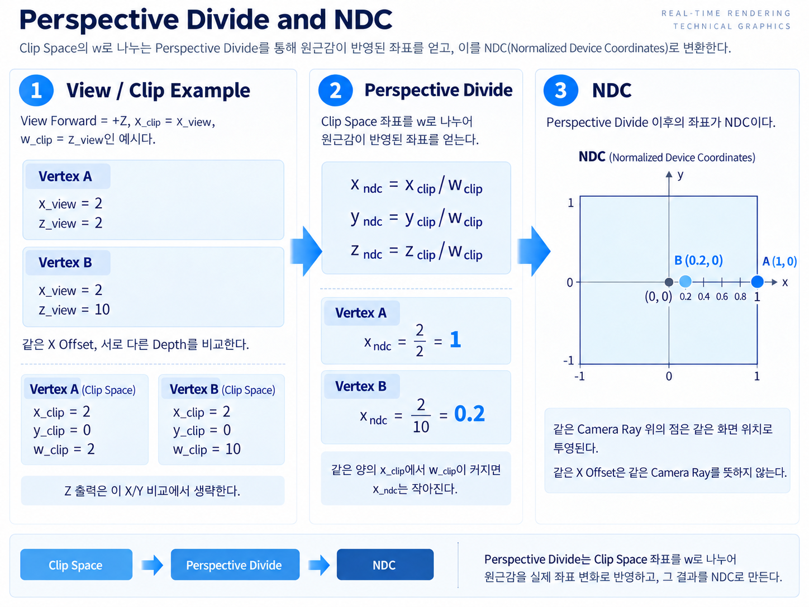

**Figure 2-9. Perspective Divide and NDC**

---

### Coordinate Notation Convention

Chapter 02에서는 같은 `x`, `y`, `z` 값이 여러 Coordinate Space를 거치면서 서로 다른 의미를 가지기 때문에, 혼동을 줄이기 위해 Space를 이름에 함께 표기한다.

예를 들어 다음과 같이 사용한다.

~~~text
x_view
→ View Space의 X Coordinate

x_clip
→ Clip Space의 X Coordinate

x_ndc
→ NDC의 X Coordinate
~~~

`x_clip`, `w_clip`과 같은 표기는 특정 Graphics API에서 반드시 사용하는 고정된 변수명이 아니다.

교재, Shader Code, Graphics API에 따라 다음처럼 서로 다른 이름을 사용할 수 있다.

~~~text
x_clip

clipPos.x

positionCS.x

x_c
~~~

이 문서에서는 Coordinate가 어느 Space의 값인지 명확하게 구분하기 위해 다음 표기 규칙을 사용한다.

~~~text
_view
→ View Space

_clip
→ Clip Space

_ndc
→ NDC
~~~

따라서 이후 등장하는

~~~text
x_ndc = x_clip / w_clip
~~~

이라는 표현은

> **Clip Space의 X 값을 Clip Space의 W로 나눈 결과가 NDC의 X가 된다.**

는 의미다.

즉, `_clip`, `_ndc`는 새로운 수학 개념이 아니라 **Coordinate Space를 구분하기 위해 이 문서에서 사용하는 표기 규칙**이다.

---

### Which x, y, z Are Divided by w?

Perspective Divide에서 사용하는 `x`, `y`, `z`는 원래 View Space Coordinate를 그대로 사용하는 것이 아니다.

정확히는 **Projection Matrix를 통과한 뒤 만들어진 Clip Space Coordinate**다.

흐름을 정확히 쓰면 다음과 같다.

~~~text
View Position
(x_view, y_view, z_view, 1)

↓

Projection Matrix

↓

Clip Position
(x_clip, y_clip, z_clip, w_clip)

↓

Perspective Divide

↓

NDC
(x_ndc, y_ndc, z_ndc)
~~~

즉,

~~~text
x_ndc = x_clip / w_clip

y_ndc = y_clip / w_clip

z_ndc = z_clip / w_clip
~~~

이다.

---

### What Does a View Space Point Mean?

여기서 `View Position`이라고 할 때의 Point는 일반적으로 **Rendering할 Geometry를 구성하는 하나의 Vertex Position**이라고 생각하면 된다.

예를 들어 Triangle 하나가 있다고 하자.

~~~text
Vertex A
Vertex B
Vertex C
~~~

각 Vertex는 View Space에서 각각 자신의 Position을 가진다.

~~~text
Vertex A
→ View Position A

Vertex B
→ View Position B

Vertex C
→ View Position C
~~~

그리고 각 Vertex Position에 Projection Matrix가 적용된다.

~~~text
View Space Vertex Position

↓

Projection Matrix

↓

Clip Space Vertex Position
~~~

즉,

> **View Space Point는 Camera 기준으로 표현된 Geometry의 한 Vertex Position이라고 이해하면 가장 쉽다.**

이후 Rasterization에서는 이 Vertex들을 이용해 Triangle 내부의 Fragment가 만들어진다.

---

### Perspective Divide

Clip Space에서는 Position이 다음과 같은 형태로 존재한다.

~~~text
(x_clip, y_clip, z_clip, w_clip)
~~~

Perspective Divide에서는 Clip Space의 X, Y, Z 값을 각각 `w_clip`으로 나눈다.

~~~text
x_ndc = x_clip / w_clip

y_ndc = y_clip / w_clip

z_ndc = z_clip / w_clip
~~~

그 결과는 다음과 같이 세 개의 Coordinate 값으로 표현된다.

~~~text
NDC

(x_ndc, y_ndc, z_ndc)
~~~

즉,

~~~text
Clip Space

(x_clip, y_clip, z_clip, w_clip)

↓

Perspective Divide

↓

NDC

(x_ndc, y_ndc, z_ndc)
~~~

라는 흐름이 된다.

---

### Where Does w_clip Come From?

Perspective Divide를 이해할 때 가장 먼저 생기는 질문은 다음과 같다.

> **w_clip은 어디에서 만들어지는가?**

`w_clip`은 외부에서 따로 가져오는 값이 아니다.

View Space의 Vertex Position에 **Projection Matrix**를 적용하는 과정에서 계산된다.

~~~text
View Position

(x_view, y_view, z_view, 1)

↓

Projection Matrix

↓

Clip Position

(x_clip, y_clip, z_clip, w_clip)
~~~

이때 만들어진 `w_clip`은 Camera의 View Depth와 연결된다.

쉽게 이해하면,

> **w_clip은 Vertex가 Camera Forward 방향으로 얼마나 깊이 위치하는가와 관련된 값**

이라고 생각할 수 있다.

다만 Camera에서 Vertex까지의 실제 직선거리 자체와 완전히 같은 값은 아니다.

보다 정확하게는

> **Camera Forward 방향의 Depth와 연결된 값**

이라고 이해하는 것이 좋다.

또한 실제 `w_clip`의 부호와 정확한 계산 형태는 사용하는 Projection Convention에 따라 달라질 수 있다.

---

#### View Depth and Camera Distance Are Different

`w_clip`을 이해할 때 Camera와 Vertex 사이의 **실제 직선거리**와 Camera Forward 방향의 **View Depth**를 구분할 필요가 있다.

처음에는 두 값이 같은 것처럼 느껴질 수 있다.

예를 들어 Camera가 Origin에 있고 Forward 방향을 Z축이라고 단순화해보자.

~~~text
Camera
= (0, 0, 0)

Vertex A
= (0, 0, 10)
~~~

Vertex A는 Camera 정면에 있다.

이 경우 Camera Forward 방향으로의 View Depth는 다음과 같다.

~~~text
View Depth = 10
~~~

Camera에서 Vertex A까지의 실제 직선거리 역시 10이다.

~~~text
Camera Distance = 10
~~~

따라서 Camera 정면에 있는 Point에서는 두 값이 같아 보일 수 있다.

하지만 Vertex가 Camera 정면에서 옆으로 이동하면 두 값의 차이가 나타난다.

예를 들어 다음 Vertex가 있다고 하자.

~~~text
Vertex B
= (6, 0, 10)
~~~

Vertex B는 Camera Forward 방향으로는 여전히 10만큼 떨어져 있다.

~~~text
View Depth = 10
~~~

하지만 Camera에서 Vertex까지의 실제 직선거리는 대각선 거리다.

~~~text
Camera Distance

= sqrt(6² + 10²)

≈ 11.66
~~~

즉,

~~~text
View Depth
= 10

Camera Distance
≈ 11.66
~~~

처럼 서로 다른 값이 된다.

개념적으로 보면 다음과 같다.

~~~text
          Vertex B
             ●
            /|
           / |
          /  |  View Depth = 10
         /   |
Camera ●-----+
        6

대각선
→ 실제 Camera Distance
~~~

여기서 중요한 차이는 다음과 같다.

> **Camera Distance는 Camera와 Vertex 사이의 실제 공간상 직선거리다.**

반면,

> **View Depth는 Camera가 바라보는 Forward 방향을 기준으로 Vertex가 얼마나 깊이 위치하는지를 나타낸다.**

따라서 Camera 정면에서 옆으로 떨어진 Vertex들은 실제 Camera Distance가 서로 다르더라도 같은 View Depth를 가질 수 있다.

예를 들어 다음 세 Vertex를 생각해보자.

~~~text
Vertex A = (0, 0, 10)

Vertex B = (6, 0, 10)

Vertex C = (-8, 3, 10)
~~~

세 Vertex 모두 Camera Forward 방향으로는 같은 위치에 있다.

~~~text
View Depth = 10
~~~

하지만 Camera와의 실제 직선거리는 각각 다르다.

즉,

> **Perspective Projection에서 중요한 것은 Camera와 Vertex 사이의 실제 직선거리 자체가 아니라 Camera Forward 방향의 View Depth다.**

그래서 `w_clip`을 처음 이해할 때는

> **Camera에서 얼마나 멀리 떨어져 있는가**

라고 단순하게 생각할 수도 있지만,

보다 정확하게는

> **Camera Forward 방향으로 얼마나 깊이 있는가와 연결된 값**

이라고 이해하는 것이 좋다.

---

### How Depth Affects Perspective Divide

이제 Camera 앞에 두 Vertex가 있다고 하자.

혼동을 피하기 위해 `Near Vertex`, `Far Vertex`라는 표현 대신 **Vertex A**, **Vertex B**라고 부른다.

이때 `Near Plane`, `Far Plane`과는 관계없는 예시다.

두 Vertex는 Camera 기준으로 같은 좌우 방향 Offset을 가지지만 View Depth만 다르다고 가정한다.

~~~text
Vertex A
→ Camera와 가까움
→ 같은 X 방향 Offset
→ 작은 View Depth

Vertex B
→ Camera에서 멂
→ 같은 X 방향 Offset
→ 큰 View Depth
~~~

Projection Matrix를 통과한 뒤 이해를 위해 다음과 같은 단순화된 Clip Space 값을 얻었다고 가정해보자.

~~~text
Vertex A

x_clip = 2
w_clip = 2
~~~

~~~text
Vertex B

x_clip = 2
w_clip = 10
~~~

두 Vertex의 `x_clip`은 같지만 `w_clip`이 다르다.

Perspective Divide를 적용하면 다음과 같다.

~~~text
Vertex A

x_ndc
= x_clip / w_clip
= 2 / 2
= 1.0
~~~

~~~text
Vertex B

x_ndc
= x_clip / w_clip
= 2 / 10
= 0.2
~~~

즉, 이 단순화된 예에서는 Camera에서 더 깊이 위치한 Vertex B의 `x_ndc` 값이 더 작아진다.

여기서 중요한 것은

> **Vertex A와 Vertex B의 A/B 이름은 Camera Depth 조건을 구분하기 위한 것이며, Near Plane / Far Plane을 의미하지 않는다.**

는 점이다.

---

### What Does "Closer to the Center" Mean?

앞의 예에서 Perspective Divide 결과는 다음과 같았다.

~~~text
Vertex A
Camera와 가까움
x_ndc = 1.0

Vertex B
Camera에서 멂
x_ndc = 0.2
~~~

NDC의 X축에서 화면 중심에 해당하는 값은 `0`이다.

따라서 X축상의 위치를 나열하면 다음처럼 볼 수 있다.

~~~text
Center        Vertex B        Vertex A

0               0.2             1.0
~~~

즉, Camera에서 더 먼 Vertex B는 같은 X 방향 Offset을 가지고 있었음에도 Perspective Divide 이후에는 중심값 `0`에 더 가까운 `x_ndc`를 가진다.

여기서 `Camera와 가까움 / 멂`은 **Depth 조건**이고,

`x_ndc = 1.0 / 0.2`는 그 Depth 차이가 Perspective Divide를 거친 뒤 **화면 좌우 위치에 미친 결과**다.

즉,

> **Depth가 X축 값으로 바뀐 것이 아니라, Depth와 연결된 `w_clip`이 X Coordinate를 나누기 때문에 X의 최종 Offset이 달라진 것이다.**

이것이

> **멀리 있는 Position의 Screen Offset이 더 작아진다**

는 의미다.

Object 자체가 무조건 화면 중앙으로 이동한다는 뜻은 아니다.

보다 정확하게는,

> **같은 3D X/Y 방향 Offset이라도 Camera에서 멀수록 Screen에서는 더 작은 Offset으로 표현된다.**

는 뜻이다.

---

### Perspective Makes Objects Look Smaller

Object 하나는 여러 Vertex로 구성되어 있다.

예를 들어 Camera와 가까운 Cube의 좌우 Vertex가 Perspective Divide 이후 다음과 같은 값을 가진다고 하자.

~~~text
Left Vertex
x_ndc = -1

Right Vertex
x_ndc = +1
~~~

두 Vertex 사이의 화면상 간격은 크다.

같은 Cube가 Camera에서 더 멀리 위치하면 다음처럼 표현될 수 있다.

~~~text
Left Vertex
x_ndc = -0.2

Right Vertex
x_ndc = +0.2
~~~

두 Vertex 사이의 간격이 줄어들었다.

~~~text
Closer Cube

-1 ---------------- +1

Farther Cube

-0.2 ---- +0.2
~~~

즉,

> **Object를 구성하는 Vertex들의 NDC 간격이 줄어들면서 Screen에서 Object가 차지하는 크기도 작아진다.**

이것이 멀리 있는 Object가 작아 보이는 Perspective Effect의 핵심이다.

---

### Perspective Divide Applies to Y as Well

X뿐 아니라 Y도 같은 원리로 계산된다.

~~~text
y_ndc = y_clip / w_clip
~~~

Camera 기준으로 같은 Vertical Offset을 가진 두 Vertex가 있지만 View Depth만 다르다고 하자.

~~~text
Vertex A
→ Camera와 가까움

Vertex B
→ Camera에서 멂
~~~

단순화된 Clip Space 값이 다음과 같다고 가정한다.

~~~text
Vertex A

y_clip = 2
w_clip = 2

y_ndc = 1.0
~~~

~~~text
Vertex B

y_clip = 2
w_clip = 10

y_ndc = 0.2
~~~

즉, X와 Y 모두 View Depth와 연결된 `w_clip`의 영향을 받아 Perspective가 적용된다.

---

### What About z_ndc?

Perspective Divide에서는 X와 Y뿐 아니라 Z도 `w_clip`으로 나눈다.

~~~text
z_ndc = z_clip / w_clip
~~~

하지만 Z의 역할은 X/Y와 조금 다르다.

X와 Y는 주로 Screen에서의 위치와 크기 변화에 직접 연결된다.

반면 Z는 이후 **Depth**를 표현하는 데 사용된다.

정리하면 다음과 같다.

~~~text
x_ndc
→ 화면의 좌우 위치와 연결

y_ndc
→ 화면의 상하 위치와 연결

z_ndc
→ Depth와 연결
~~~

이 `z_ndc` 값은 이후 Depth Buffer와 Depth Test로 이어진다.

정확한 Depth Range는 Graphics API와 Projection Convention에 따라 달라질 수 있다.

---

### Perspective Divide Happens After Clipping

Chapter 2.7에서는 Clipping이 Perspective Divide보다 먼저 수행된다고 설명했다.

순서는 다음과 같다.

~~~text
Projection Matrix
↓
Clip Space
↓
Clipping
↓
Perspective Divide
↓
NDC
~~~

Camera에 지나치게 가까운 Vertex나 Camera 뒤쪽에 있는 Vertex는 `w_clip`이 매우 작아지거나 Projection Convention에 따라 부호가 바뀔 수 있다.

이 상태에서 먼저 Divide를 수행하면 다음과 같이 Coordinate가 매우 크게 변할 수 있다.

~~~text
x_clip / very small w_clip

↓

매우 큰 값
~~~

따라서 GPU는 먼저 Clip Space에서 View Frustum Boundary를 기준으로 Geometry를 정리한 뒤, 남은 Geometry에 Perspective Divide를 적용한다.

즉,

> **먼저 Camera가 볼 수 있는 Geometry를 확정하고, 그다음 Perspective Divide를 수행한다.**

라고 이해하면 된다.

---

#### FOV and Aspect Ratio Are Applied Before Clipping

여기서 한 가지 의문이 생길 수 있다.

> **FOV가 바뀌면 View Frustum도 달라지는데, Clipping과 Perspective Divide의 순서는 어떻게 되는가?**

Perspective Projection에서 **FOV**와 **Aspect Ratio**는 Perspective Divide 이후에 별도로 적용되는 값이 아니다.

이 값들은 먼저 **Projection Matrix를 구성하는 데 사용된다.**

Camera의 Projection 설정에는 대표적으로 다음 정보가 포함된다.

~~~text
FOV

Aspect Ratio

Near Plane

Far Plane
~~~

이 정보가 먼저 Projection Matrix에 반영된다.

전체 흐름은 다음과 같다.

~~~text
View Position

↓

FOV / Aspect Ratio / Near / Far를 반영한
Projection Matrix

↓

Clip Position

↓

Clipping

↓

Perspective Divide

↓

NDC
~~~

즉, FOV가 변경되면 먼저 Projection Matrix가 달라진다.

예를 들어 FOV를 좁게 만들면 Camera가 볼 수 있는 View Frustum도 좁아진다.

~~~text
Small FOV

→ 좁은 View Frustum

→ 좌우 / 상하 경계 밖의 Geometry가 증가할 수 있음
~~~

반대로 FOV를 넓게 만들면 View Frustum도 넓어진다.

~~~text
Large FOV

→ 넓은 View Frustum

→ 더 많은 Geometry가 Frustum 내부에 들어올 수 있음
~~~

즉, FOV가 변경되면 기존 Clip Space에 나중에 FOV를 추가로 적용하는 것이 아니다.

> **변경된 FOV를 반영한 Projection Matrix가 새로운 Clip Space Coordinate를 만든다.**

그리고 GPU는 그 결과를 기준으로 Clipping을 수행한다.

---

#### Aspect Ratio Also Changes the Frustum

**Aspect Ratio** 역시 Projection Matrix에 포함된다.

예를 들어 같은 FOV를 사용하더라도

~~~text
16 : 9

4 : 3

21 : 9
~~~

처럼 화면 비율이 달라지면 Camera가 표현해야 하는 가로와 세로 범위도 달라질 수 있다.

따라서 View Frustum의 좌우 / 상하 경계는

> **FOV와 Aspect Ratio를 함께 고려한 Projection Matrix**

에 의해 결정된다.

개념적으로는 다음과 같다.

~~~text
Camera Setting

FOV
+
Aspect Ratio
+
Near Plane
+
Far Plane

↓

Projection Matrix

↓

Clip Space

↓

Frustum Boundary 기준 Clipping
~~~

즉, Near Plane과 Far Plane만 Clipping 기준이 되는 것이 아니다.

Camera의

- Left
- Right
- Top
- Bottom
- Near
- Far

경계 전체가 View Frustum을 구성한다.

---

#### Clipping Happens Using the Current Projection

Camera Setting이 변경되면 Projection Matrix도 변경된다.

예를 들어 FOV를 `60°`에서 `90°`로 변경했다고 하자.

~~~text
FOV 60°
↓
Projection Matrix A
↓
Clip Space A
↓
Clipping

FOV 90°
↓
Projection Matrix B
↓
Clip Space B
↓
Clipping
~~~

같은 Vertex라도 두 Projection Matrix를 통과한 결과인

~~~text
x_clip
y_clip
z_clip
w_clip
~~~

값이 달라질 수 있다.

따라서 Frustum 내부 / 외부 판정 결과 역시 달라질 수 있다.

즉,

> **Clipping은 현재 FOV와 Aspect Ratio가 이미 반영된 Clip Space를 기준으로 수행된다.**

그 이후에 남은 Geometry에 Perspective Divide가 적용된다.

~~~text
Current Camera Setting
↓
Projection Matrix
↓
Clip Space
↓
Clipping
↓
Perspective Divide
↓
NDC
~~~

따라서 Perspective Projection의 연산 순서를 이해할 때는 다음 관계가 중요하다.

> **FOV와 Aspect Ratio가 Projection Matrix를 결정하고, Projection Matrix가 Clip Space를 만들며, 그 Clip Space에서 Clipping을 수행한 뒤 Perspective Divide가 이루어진다.**

---

### From Clip Space to NDC

Perspective Divide가 끝나면 Coordinate는 **NDC**로 들어간다.

NDC는 **Normalized Device Coordinates**의 약자다.

쉽게 말하면,

> **실제 Screen Resolution에 관계없이 일정한 범위로 정리된 Coordinate Space**

다.

예를 들어 Screen Resolution이 다음처럼 서로 달라도

~~~text
1920 × 1080

2560 × 1440

3840 × 2160
~~~

NDC에서는 같은 정규화된 Coordinate Range를 사용할 수 있다.

---

### Why Normalize Coordinates?

Screen마다 Resolution이 다르다.

예를 들어 동일한 화면 중앙이라도 Resolution에 따라 실제 Pixel Coordinate는 다르다.

~~~text
1920 × 1080

Center
→ (960, 540)
~~~

~~~text
3840 × 2160

Center
→ (1920, 1080)
~~~

Rendering Pipeline이 처음부터 실제 Pixel Coordinate를 기준으로 모든 Projection 계산을 한다면 Resolution에 따라 처리 방식이 달라져야 한다.

그래서 먼저 Resolution과 무관한 공통 Coordinate Space로 정리한다.

이것이 NDC다.

즉,

> **NDC는 Projection 결과와 실제 Screen Resolution 사이를 연결하는 공통 중간 Coordinate Space다.**

---

### NDC Range

NDC의 X와 Y는 일반적으로 다음과 같은 정규화 범위로 생각할 수 있다.

~~~text
X
-1 ~ +1

Y
-1 ~ +1
~~~

개념적으로는 다음과 같다.

~~~text
          Y = +1
            ↑

X = -1 ← (0, 0) → X = +1

            ↓
          Y = -1
~~~

따라서 NDC의 중심은 다음과 같다.

~~~text
x_ndc = 0

y_ndc = 0
~~~

실제 Pixel Number를 사용하지 않고도 화면 안에서 상대적으로 어느 위치에 있는지를 표현할 수 있다.

---

### NDC Is Still Not Screen Space

NDC는 화면과 매우 비슷한 Coordinate Range를 가지고 있기 때문에 이미 Screen Space처럼 느껴질 수 있다.

하지만 둘은 다르다.

~~~text
NDC
→ 정규화된 Coordinate

Screen Space
→ 실제 Pixel Coordinate
~~~

예를 들어 NDC에서 다음 Position이 있다고 하자.

~~~text
x_ndc = 0
y_ndc = 0
~~~

이 값은 정규화된 화면의 중앙을 의미한다.

하지만 실제 Screen Space에서는 Resolution에 따라 구체적인 Pixel Position이 달라진다.

~~~text
1920 × 1080

Center
→ (960, 540)
~~~

이 변환을 **Viewport Transform**이라고 한다.

---

### NDC Is Resolution Independent

NDC의 중요한 특징은 Resolution과 독립적이라는 것이다.

예를 들어 다음 NDC Coordinate가 있다고 하자.

~~~text
NDC

(0.5, 0.5)
~~~

1920 × 1080 Screen과 3840 × 2160 Screen에서는 실제 Pixel Position이 서로 다르다.

하지만 NDC 값 자체는 동일하다.

즉,

> **NDC는 Screen Size가 달라도 동일한 상대적 위치를 표현할 수 있다.**

---

### Why NDC Is Useful

NDC를 사용하면 Projection 결과와 실제 Display Resolution을 분리할 수 있다.

개념적으로는 다음과 같다.

~~~text
3D Scene
↓
Projection
↓
Clip Space
↓
Perspective Divide
↓
NDC

여기까지는 Resolution과 독립적

↓

Viewport Transform

↓

실제 Screen Resolution
~~~

따라서 동일한 3D Scene을 여러 Resolution과 Viewport Size에 적용하기 쉬워진다.

---

### NDC z Range Can Differ

X와 Y의 NDC Range는 일반적으로 `-1 ~ +1` 범위로 설명할 수 있다.

하지만 Z, 즉 Depth Range는 Graphics API에 따라 다를 수 있다.

예를 들어 어떤 API에서는

~~~text
z_ndc = -1 ~ +1
~~~

을 사용하고,

다른 API에서는

~~~text
z_ndc = 0 ~ 1
~~~

을 사용할 수 있다.

따라서

> **NDC의 정확한 Z Range는 Graphics API와 Rendering Convention에 따라 달라질 수 있다.**

Chapter 02에서는 특정 API의 숫자 범위를 외우기보다 NDC의 역할을 이해하는 것이 더 중요하다.

---

### NDC Is Still 3D

NDC를 Screen과 연결해서 생각하다 보면 완전한 2D Coordinate라고 생각하기 쉽다.

하지만 NDC에는 여전히 Z 값이 존재한다.

~~~text
NDC

(x_ndc, y_ndc, z_ndc)
~~~

X와 Y는 Screen Position과 연결되고,

Z는 Depth와 연결된다.

따라서 NDC는

> **Screen Mapping을 준비한 정규화된 3D Coordinate Space**

라고 생각할 수 있다.

실제 Screen의 2D Pixel Coordinate로 변환되는 것은 이후 Viewport Transform에서다.

---

### Perspective Divide and Depth

Perspective Divide 이후의 `z_ndc`는 Depth Buffer에 사용할 형태로 이어진다.

하지만 Perspective Projection에서는 Depth 값이 실제 Camera Distance와 단순한 1:1 비례 관계를 가지지 않는다.

즉,

~~~text
Camera Distance
→ 일정하게 증가

Depth Value
→ 반드시 일정한 간격으로 증가하지 않음
~~~

일반적인 Perspective Projection에서는 Near 영역과 Far 영역 사이의 Depth Precision이 균등하지 않다.

Near Plane을 불필요하게 Camera에 가깝게 두거나 넓은 Depth 범위를 선택하면 정밀도 배분에 영향을 준다. 구체 오차는 Projection과 Depth 저장 형식에도 의존한다. Reversed-Z는 비교 방향과 Depth 표현을 달리하는 방법이며 정확한 이득과 설정은 대상 Renderer에서 확인해야 한다. 상세 유도는 후속 범위로 남기고, 여기서는 두 Depth를 같은 규약으로 비교해야 한다는 원리를 Chapter 08의 Shadow Map에 연결한다.

---

### Projection Matrix and Perspective Divide Work Together

Perspective Projection을 이해할 때 Projection Matrix와 Perspective Divide를 하나의 과정으로 보는 것이 중요하다.

Projection Matrix가 먼저 다음 값을 만든다.

~~~text
Clip Position

(x_clip, y_clip, z_clip, w_clip)
~~~

이때 Perspective에 필요한 View Depth 관계가 `w_clip`에 반영된다.

그다음 Perspective Divide가 수행된다.

~~~text
x_ndc = x_clip / w_clip

y_ndc = y_clip / w_clip

z_ndc = z_clip / w_clip
~~~

즉,

> **Projection Matrix가 Perspective Divide에 필요한 값을 준비하고, Perspective Divide가 그 값을 NDC Coordinate로 변환한다.**

라고 이해하면 된다.

---

### A Simple Numerical Example

전체 과정을 단순화해서 다시 보자.

Camera 기준으로 같은 X 방향 Offset을 가진 두 Vertex가 있다고 하자.

여기서 A와 B는 **Near Plane / Far Plane을 의미하지 않는다.**

단순히 Camera와의 View Depth가 서로 다른 두 Vertex다.

~~~text
Vertex A
→ Camera와 가까움

Vertex B
→ Camera에서 멂
~~~

설명을 단순화하기 위해 Projection 이후 두 Vertex가 다음 값을 가진다고 가정한다.

~~~text
Vertex A

x_clip = 2
w_clip = 2
~~~

~~~text
Vertex B

x_clip = 2
w_clip = 10
~~~

Perspective Divide를 수행한다.

~~~text
Vertex A

x_ndc
= x_clip / w_clip
= 2 / 2
= 1.0
~~~

~~~text
Vertex B

x_ndc
= x_clip / w_clip
= 2 / 10
= 0.2
~~~

NDC의 X축에서 비교하면 다음과 같다.

~~~text
Center        Vertex B        Vertex A

0               0.2             1.0
~~~

여기서

~~~text
Vertex A / Vertex B
→ View Depth 조건

x_ndc
→ Perspective Divide 이후 좌우 위치
~~~

라는 점을 구분해야 한다.

즉,

> **Depth가 X Coordinate로 바뀐 것이 아니다.**

View Depth와 연결된 `w_clip`이 `x_clip`의 분모로 사용되기 때문에, 같은 X 방향 Offset이라도 Depth에 따라 최종 `x_ndc`가 달라지는 것이다.

---

### One Important Correction

다음과 같이 이해하면 안 된다.

> Camera에서 멀어지면 모든 Object가 화면 중앙으로 이동한다.

정확하지 않다.

더 정확한 표현은 다음과 같다.

> **Camera에서 멀어질수록 동일한 3D X/Y Offset이 Screen에서는 더 작은 Offset으로 표현된다.**

따라서 Object가 화면 오른쪽에 있다면 여전히 오른쪽에 나타난다.

다만 화면 중심으로부터 떨어진 정도가 Perspective에 따라 줄어드는 것이다.

Object를 구성하는 여러 Vertex에서 이 현상이 발생하기 때문에 결과적으로 Object의 Screen Size도 작아진다.

---

### Perspective Divide and NDC in the Rendering Pipeline

지금까지의 전체 Coordinate 흐름을 다시 정리하면 다음과 같다.

~~~text
Local Position
↓
Model Matrix
↓
World Position
↓
View Matrix
↓
View Position
(x_view, y_view, z_view, 1)
↓
Projection Matrix
↓
Clip Position
(x_clip, y_clip, z_clip, w_clip)
↓
Clipping
↓
Perspective Divide
↓
NDC
(x_ndc, y_ndc, z_ndc)
↓
Viewport Transform
↓
Screen Space
~~~

여기서 Perspective Divide는

> **Clip Space와 NDC를 연결하는 단계**

다.

---

### A Useful Mental Model

고정된 Perspective Projection과 같은 View X/Y Offset을 비교할 때, 양의 View Depth가 커지면 화면 중심선으로부터의 Offset은 작아진다. 분모인 `w_clip`은 View Depth와 연결되며 Camera까지의 직선거리 자체가 아니다. 같은 Camera ray 위의 점을 비교하는 경우와는 구분한다.

---

### Perspective Divide and NDC Summary

Perspective Divide의 핵심을 정리하면 다음과 같다.

| Stage | Coordinate | Role |
|---|---|---|
| View Space | `(x_view, y_view, z_view)` | Camera 기준 Vertex Position |
| Clip Space | `(x_clip, y_clip, z_clip, w_clip)` | Projection Matrix의 결과 |
| Clipping | Clip Coordinate | 현재 View Frustum 밖 Geometry 정리 |
| Perspective Divide | `x_clip/w_clip`, `y_clip/w_clip`, `z_clip/w_clip` | Perspective를 Coordinate에 반영 |
| NDC | `(x_ndc, y_ndc, z_ndc)` | 정규화된 Coordinate |
| Viewport Transform | NDC → Pixel | 실제 Screen Coordinate 생성 |

전체 흐름은 다음과 같다.

~~~text
Clip Position

(x_clip, y_clip, z_clip, w_clip)

↓

Clipping

↓

Perspective Divide

x_ndc = x_clip / w_clip
y_ndc = y_clip / w_clip
z_ndc = z_clip / w_clip

↓

NDC

(x_ndc, y_ndc, z_ndc)
~~~

가장 중요한 개념은 다음과 같다.

> **Perspective Divide에서 나누는 X, Y, Z는 View Space의 원래 값이 아니라 Projection Matrix를 통과한 Clip Space의 `x_clip`, `y_clip`, `z_clip` 값이다.**

그리고

> **Projection Matrix는 FOV, Aspect Ratio, Near Plane, Far Plane 등의 Camera Projection 설정을 반영해 Clip Space를 만들고, 그 과정에서 View Depth와 연결된 `w_clip`을 생성한다.**

그 다음,

> **Clip Space에서 현재 View Frustum 기준으로 Clipping을 수행한 뒤, Perspective Divide가 Clip Coordinate를 `w_clip`으로 나누어 Perspective를 NDC Coordinate에 반영한다.**

그 결과는

> **실제 Screen Resolution과 무관한 정규화된 Coordinate Space인 NDC**

로 들어간다.

다음 절에서는 이 NDC Coordinate를 실제 Screen의 Pixel Coordinate로 변환하는 **Viewport Transform and Screen Space**를 살펴본다.

---

## 2.10 Viewport Transform and Screen Space

Chapter 2.9에서는 Clip Space의 Coordinate를 `w_clip`으로 나누어 **NDC - Normalized Device Coordinates**로 변환하는 과정을 살펴보았다.

Perspective Divide가 끝난 뒤 Coordinate는 다음과 같은 형태를 가진다.

~~~text
NDC

(x_ndc, y_ndc, z_ndc)
~~~

이때 X와 Y는 일반적으로 정규화된 범위 안에 존재한다.

~~~text
X
-1 ~ +1

Y
-1 ~ +1
~~~

하지만 실제 Monitor나 Game Window는 이러한 `-1 ~ +1` Coordinate를 직접 사용하지 않는다.

예를 들어 실제 화면은 다음과 같은 Pixel Resolution을 가진다.

~~~text
1920 × 1080

2560 × 1440

3840 × 2160
~~~

따라서 Rendering Pipeline에서는 NDC의 정규화된 Coordinate를 실제 Viewport의 크기와 위치에 맞는 Coordinate로 다시 변환해야 한다.

이 과정을 **Viewport Transform**이라고 한다.

쉽게 말하면,

> **Viewport Transform은 NDC의 정규화된 Coordinate를 실제 화면 영역의 Coordinate로 변환하는 과정이다.**

전체 흐름은 다음과 같다.

~~~text
NDC

↓

Viewport Transform

↓

Screen Space
~~~

---

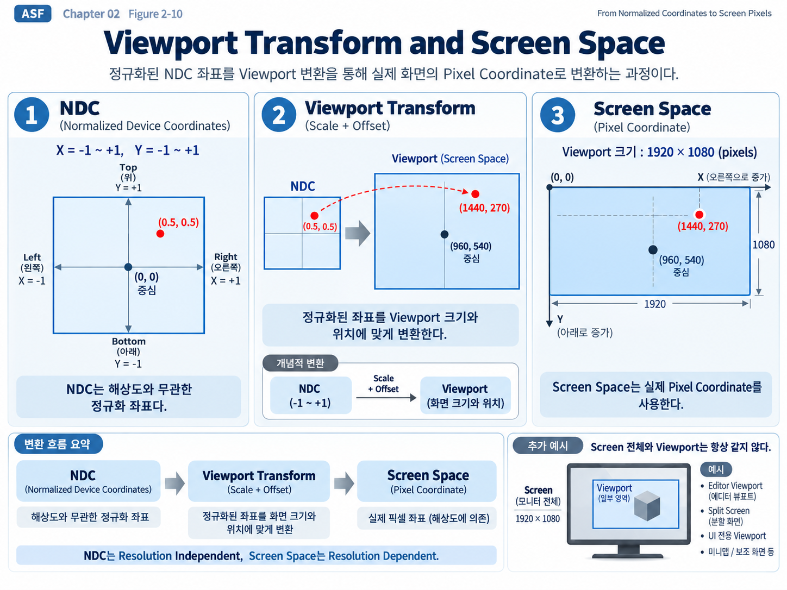

**Figure 2-10. Viewport Transform and Screen Space**

---

### From NDC to Screen Space

NDC에서는 Screen의 위치가 실제 Pixel Number가 아니라 정규화된 값으로 표현된다.

예를 들어 NDC의 중심은 다음과 같다.

~~~text
NDC Center

(0, 0)
~~~

NDC의 좌우 끝은 일반적으로 다음처럼 생각할 수 있다.

~~~text
Left
x_ndc = -1

Center
x_ndc = 0

Right
x_ndc = +1
~~~

하지만 실제 Screen이 `1920 × 1080`이라면 가로 방향 Pixel 범위는 대략 다음과 연결된다.

~~~text
Left
→ x = 0

Center
→ x = 960

Right
→ x = 1920
~~~

즉,

~~~text
NDC

-1 -------- 0 -------- +1

↓

Viewport Transform

↓

Screen

0 -------- 960 -------- 1920
~~~

처럼 Coordinate Range가 변환된다.

이것이 Viewport Transform의 기본적인 역할이다.

---

### Viewport Transform Is Scale + Offset

Viewport Transform을 개념적으로 보면 크게 두 가지 작업으로 이해할 수 있다.

~~~text
Scale

+

Offset
~~~

먼저 NDC의 `-1 ~ +1` 범위를 Viewport의 실제 크기에 맞게 확대한다.

그리고 Viewport가 Screen의 어디에 위치하는지에 따라 Coordinate를 이동시킨다.

즉,

> **정규화된 Coordinate를 Viewport 크기에 맞게 Scale하고, Viewport 위치에 맞게 Offset하는 과정**

이라고 이해할 수 있다.

개념적으로 다음과 같다.

~~~text
NDC
(-1 ~ +1)

↓

Scale

Viewport Width / Height에 맞는 크기로 변환

↓

Offset

Viewport의 실제 위치로 이동

↓

Screen Space
~~~

---

### A Simple X Coordinate Example

가로 크기가 `1920 Pixel`인 Viewport가 있다고 하자.

NDC의 X Range는 다음과 같다.

~~~text
-1 ~ +1
~~~

이 범위를 실제 Viewport Width에 대응시키면 다음처럼 생각할 수 있다.

~~~text
x_ndc = -1
→ x_screen = 0

x_ndc = 0
→ x_screen = 960

x_ndc = +1
→ x_screen = 1920
~~~

예를 들어

~~~text
x_ndc = 0.5
~~~

인 Position이 있다고 하자.

이 값은 NDC 중심에서 오른쪽으로 절반 정도 이동한 위치다.

`1920 Pixel` Width의 Viewport에서는 개념적으로 다음 위치에 대응한다.

~~~text
x_screen = 1440
~~~

즉,

~~~text
NDC
x = 0.5

↓

Viewport Transform

↓

Screen
x = 1440
~~~

이 된다.

---

### A Simple Y Coordinate Example

세로 크기가 `1080 Pixel`인 Viewport를 생각해보자.

NDC의 Y Range 역시 일반적으로 다음처럼 정규화되어 있다.

~~~text
-1 ~ +1
~~~

하지만 여기서는 한 가지 주의해야 할 점이 있다.

NDC와 Screen Space에서는 **Y Axis가 증가하는 방향이 서로 다를 수 있다.**

예를 들어 설명을 위해 NDC에서

~~~text
Top
→ y_ndc = +1

Center
→ y_ndc = 0

Bottom
→ y_ndc = -1
~~~

이라고 생각할 수 있다.

반면 많은 Screen Coordinate System에서는 화면의 왼쪽 위를 Origin으로 사용하고 Y가 아래쪽으로 증가한다.

~~~text
Top
→ y_screen = 0

Center
→ y_screen = 540

Bottom
→ y_screen = 1080
~~~

따라서 Viewport Transform에서는 단순히 크기만 바꾸는 것이 아니라 필요에 따라 Axis Direction까지 고려해야 한다.

---

### Screen Space Y Direction Can Differ

Screen Space의 Y Axis 방향은 Graphics API, Engine, Window System 등의 Convention에 따라 달라질 수 있다.

예를 들어 다음 두 방식이 모두 가능하다.

~~~text
Convention A

Origin
→ Bottom Left

Y
→ 위로 증가
~~~

~~~text
Convention B

Origin
→ Top Left

Y
→ 아래로 증가
~~~

따라서

> **Screen Space의 정확한 Origin과 Y Axis 방향은 사용하는 Rendering Convention에 따라 확인해야 한다.**

Chapter 02에서는 특정 API의 Convention을 외우는 것보다

> **NDC Coordinate가 Viewport Transform을 통해 실제 화면 Coordinate로 변환된다.**

는 구조를 이해하는 것이 더 중요하다.

---

### Screen Space Is Resolution Dependent

NDC와 Screen Space의 가장 중요한 차이 중 하나는 Resolution 의존성이다.

NDC에서는 화면 중앙이 항상 다음과 같이 표현될 수 있다.

~~~text
(0, 0)
~~~

Screen Resolution이 바뀌어도 이 값은 변하지 않는다.

하지만 Screen Space에서는 실제 Pixel Coordinate가 달라진다.

예를 들어

~~~text
1920 × 1080

Center
→ (960, 540)
~~~

이고,

~~~text
3840 × 2160

Center
→ (1920, 1080)
~~~

이다.

즉,

> **NDC는 Resolution Independent하지만, Screen Space는 Resolution Dependent하다.**

이 차이가 중요한 이유는 Rendering Pipeline이 Projection 계산과 실제 Display Resolution을 분리할 수 있기 때문이다.

---

### Why Not Use Pixel Coordinates from the Beginning?

처음부터 모든 Position을 Pixel Coordinate로 계산하면 더 간단해 보일 수도 있다.

하지만 Display와 Viewport의 크기는 상황에 따라 달라질 수 있다.

예를 들어 같은 Scene을 다음 Resolution에서 Rendering할 수 있다.

~~~text
1280 × 720

1920 × 1080

2560 × 1440

3840 × 2160
~~~

만약 Projection 단계부터 실제 Pixel Coordinate를 직접 사용한다면 Screen Resolution이 달라질 때마다 Projection 계산 역시 Resolution에 강하게 의존하게 된다.

대신 Rendering Pipeline은 먼저

~~~text
NDC
→ Resolution과 독립적인 Coordinate
~~~

를 만들고,

마지막 단계에서

~~~text
Viewport Transform
→ 현재 Viewport 크기에 맞게 변환
~~~

한다.

따라서

> **3D Scene의 Projection과 실제 Output Resolution을 서로 분리할 수 있다.**

---

### Viewport Is Not Always the Entire Screen

Viewport라는 말을 처음 들으면 Monitor 전체나 Game Window 전체를 의미한다고 생각하기 쉽다.

하지만 Viewport는

> **Rendering 결과를 표시할 Screen 내부의 특정 영역**

을 의미한다.

따라서 Viewport가 Screen 전체를 사용할 수도 있지만 반드시 그런 것은 아니다.

예를 들어 다음과 같은 상황을 생각할 수 있다.

#### Full Screen Viewport

~~~text
Screen
1920 × 1080

Viewport
1920 × 1080
~~~

Screen 전체를 하나의 Viewport로 사용한다.

---

#### Split Screen

2명의 Player가 하나의 Screen을 절반씩 사용하는 경우를 생각해보자.

~~~text
Screen
1920 × 1080

Player 1 Viewport
960 × 1080

Player 2 Viewport
960 × 1080
~~~

각 Camera는 자신의 NDC Coordinate를 별도의 Viewport 영역으로 변환할 수 있다.

---

#### Editor Viewport

Unreal Engine 같은 Editor에서는 전체 Application Window 안에

- Menu
- Details Panel
- Content Browser
- Outliner
- Editor Viewport

등 여러 UI 영역이 존재한다.

이 경우 실제 3D Scene이 Rendering되는 것은 전체 Application Screen이 아니라 **Editor Viewport 영역**이다.

즉,

~~~text
Application Window
≠
Rendering Viewport
~~~

일 수 있다.

---

### Viewport Has Both Size and Position

Viewport Transform에는 단순히 Width와 Height만 필요한 것이 아니다.

Viewport가 Screen의 어디에 위치하는지도 중요하다.

개념적으로 Viewport는 다음 정보를 가질 수 있다.

~~~text
Viewport X

Viewport Y

Viewport Width

Viewport Height
~~~

예를 들어 Screen 전체가 `1920 × 1080`이고,

그 안에 다음 Viewport가 있다고 하자.

~~~text
Viewport Position
= (200, 100)

Viewport Size
= 800 × 600
~~~

NDC의 중심

~~~text
(0, 0)
~~~

은 Screen 전체의 중심으로 이동하는 것이 아니라 이 **Viewport 영역의 중심**으로 이동한다.

즉,

> **Viewport Transform은 NDC를 Monitor 전체가 아니라 현재 지정된 Viewport Rectangle에 Mapping한다.**

이 때문에 앞에서 Viewport Transform을

~~~text
Scale + Offset
~~~

이라고 설명한 것이다.

---

### Screen Space and Pixel Coordinates

Screen Space에서는 Coordinate가 실제 Screen 또는 Viewport 위치와 직접 연결된다.

예를 들어

~~~text
(100, 200)
~~~

이라는 Screen Position은 개념적으로

> **Viewport Origin을 기준으로 가로 100, 세로 200에 해당하는 위치**

를 의미할 수 있다.

이 때문에 Screen Space는

- UI Placement
- Mouse Position
- Screen Effect
- Post Process
- Screen-space Texture
- Screen-space Shader Effect

등과 직접적으로 연결된다.

이후 Unreal이나 Shader를 다룰 때

~~~text
Screen Position

Screen UV

Viewport UV
~~~

같은 용어들이 반복해서 등장하게 되는데, 기본적으로 모두 현재 화면 영역을 기준으로 Position을 표현한다는 공통점을 가진다.

다만 각각의 정확한 Range와 Convention은 사용하는 Engine이나 Shader Context에 따라 다를 수 있다.

---

### Pixel Coordinate and Pixel Center

Screen Space를 Pixel Coordinate와 연결할 때 한 가지 알아둘 점이 있다.

개념 설명에서는 흔히

~~~text
1920 × 1080

Top Left
→ (0, 0)

Bottom Right
→ (1920, 1080)
~~~

처럼 단순하게 표현한다.

하지만 실제 Rasterization에서는 Pixel이 면적을 가지며, Pixel Center와 Sampling Convention도 존재한다.

따라서 실제 GPU 내부에서는

> **Coordinate Boundary와 실제 Pixel Center가 완전히 같은 개념은 아니다.**

이 부분은 Rasterization, Sampling, Texture Coordinate 등을 더 깊게 다룰 때 중요해진다.

Chapter 02에서는 우선

> **Viewport Transform이 NDC를 실제 Pixel Grid와 연결한다.**

는 정도로 이해하면 충분하다.

---

### What Happens to z_ndc?

Viewport Transform을 설명할 때 X와 Y가 가장 눈에 띄지만 Z도 사라지는 것은 아니다.

Perspective Divide 이후에는

~~~text
(x_ndc, y_ndc, z_ndc)
~~~

가 존재한다.

여기서

~~~text
x_ndc
→ Viewport의 가로 위치로 연결

y_ndc
→ Viewport의 세로 위치로 연결

z_ndc
→ Depth로 연결
~~~

된다.

X와 Y는 실제 Screen Position을 만드는 데 사용되고,

Z는 이후 Depth Buffer에서 Surface의 앞뒤 관계를 판단하는 데 사용된다.

즉,

> **Viewport Transform 이후 Screen 위의 2D 위치와 함께 Depth 정보도 Rendering Pipeline에 계속 유지된다.**

---

### Screen Space Does Not Mean Final Pixel Color

Screen Space까지 왔다고 해서 최종 Pixel Color가 완성된 것은 아니다.

여기서 만들어진 것은 기본적으로

> **어느 Screen 위치에 Geometry가 Mapping되는가**

에 대한 Coordinate 관계다.

Rendering Pipeline에서는 이후 Rasterization을 통해 Triangle 내부의 Fragment가 만들어지고,

각 Fragment에서 Material, Lighting, Texture 등의 계산이 수행된다.

즉,

~~~text
Screen Position
≠
Final Pixel Color
~~~

다.

Chapter 01에서 살펴본 전체 Rendering Pipeline과 연결하면 Coordinate Transform은

> **Vertex가 Screen의 어느 위치에 나타날 것인가를 결정하는 과정**

이라고 볼 수 있다.

그 이후 실제 Surface의 색을 계산하는 과정은 별도의 Rendering 단계에서 이어진다.

---

### Coordinate Flow Up to Screen Space

지금까지 Chapter 02에서 따라온 Position의 흐름을 다시 연결하면 다음과 같다.

~~~text
Local Position

↓

Model Transform

↓

World Position

↓

View Transform

↓

View Position

↓

Projection Matrix

↓

Clip Position
(x_clip, y_clip, z_clip, w_clip)

↓

Clipping

↓

Perspective Divide

↓

NDC
(x_ndc, y_ndc, z_ndc)

↓

Viewport Transform

↓

Screen Space
~~~

이제 하나의 Vertex Position이

> **Object 자신의 Coordinate에서 시작해 실제 화면 위치까지 이동하는 전체 흐름**

이 연결되었다.

---

### A Useful Mental Model

NDC가 해상도와 무관한 상대적 위치라면, Screen Space는 그 위치를 **현재 Viewport의 크기와 시작 위치**에 맞춘 좌표다.

---

### NDC and Screen Space Comparison

| Coordinate Space | 기준 | 대표적인 Coordinate | Resolution |
|---|---|---|---|
| NDC | 정규화된 화면 영역 | `-1 ~ +1` | Independent |
| Screen Space | 실제 Viewport / Screen | Pixel Coordinate | Dependent |

예를 들어 Screen Center를 비교하면 다음과 같다.

~~~text
NDC

(0, 0)
~~~

~~~text
1920 × 1080 Screen Space

(960, 540)
~~~

~~~text
3840 × 2160 Screen Space

(1920, 1080)
~~~

NDC 값은 같지만 Screen Space 값은 Output Resolution에 따라 달라진다.

---

### Viewport Transform and Screen Space Summary

Viewport Transform의 핵심을 정리하면 다음과 같다.

> **Perspective Divide 이후 만들어진 NDC는 실제 Resolution과 독립적인 정규화 Coordinate다.**

그리고

> **Viewport Transform은 이 NDC Coordinate를 현재 Viewport의 Width, Height, Position에 맞게 Scale하고 Offset한다.**

그 결과

> **실제 화면 영역과 연결되는 Screen Space Coordinate가 만들어진다.**

전체 흐름은 다음과 같다.

~~~text
NDC

(x_ndc, y_ndc, z_ndc)

↓

Viewport Transform

Scale
+
Offset

↓

Screen Space

Pixel Position
+
Depth
~~~

또한 Viewport는 반드시 Screen 전체와 같을 필요가 없다.

~~~text
Full Screen Viewport

Split Screen

Editor Viewport

UI 내부 Viewport
~~~

처럼 Screen의 일부 영역만 사용할 수도 있다.

가장 중요한 개념은 다음과 같다.

> **NDC는 "화면 안에서 상대적으로 어디에 있는가"를 나타내고, Viewport Transform은 그것을 "현재 Viewport에서 실제로 어디에 있는가"로 변환한다.**

이로써

~~~text
Local
↓
World
↓
View
↓
Clip
↓
NDC
↓
Screen
~~~

으로 이어지는 Coordinate Space의 기본 흐름이 완성된다.

다음 절에서는 이러한 Coordinate Transform을 실제로 수행하는 핵심 구조인 **Matrix Transform Basics**를 살펴본다.

---

## 2.11 Matrix Transform Basics

지금까지 Chapter 02에서는 하나의 Position이 Rendering Pipeline을 따라 여러 Coordinate Space를 이동하는 과정을 살펴보았다.

~~~text
Local Space
↓
World Space
↓
View Space
↓
Clip Space
↓
NDC
↓
Screen Space
~~~

그런데 여기서 자연스럽게 한 가지 질문이 생긴다.

> **Coordinate는 실제로 어떤 계산을 통해 한 Space에서 다른 Space로 변환되는가?**

그 중심에 있는 것이 **Matrix**다.

Matrix는 단순히 숫자가 여러 줄로 배열된 표가 아니다.

Rendering에서는 Matrix를 다음과 같이 이해하는 것이 가장 중요하다.

> **Matrix는 Position이나 Direction을 다른 Coordinate Space로 변환하기 위한 Transform 규칙을 하나의 계산 구조로 묶어놓은 것이다.**

즉,

~~~text
Input Coordinate
↓
Matrix
↓
Transformed Coordinate
~~~

라는 구조로 이해할 수 있다.

---

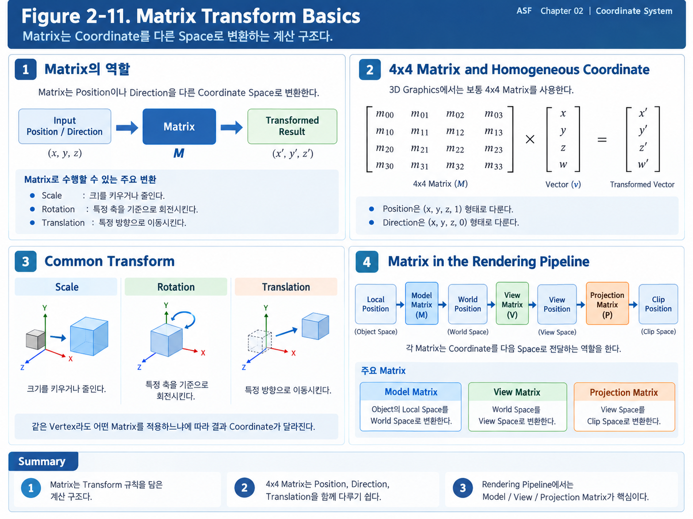

**Figure 2-11. Matrix Transform Basics**

---

### Matrix as a Transform Rule

Matrix를 처음 보면 다음과 같이 숫자가 배열된 형태가 먼저 보인다.

~~~text
[ m00 m01 m02 m03 ]
[ m10 m11 m12 m13 ]
[ m20 m21 m22 m23 ]
[ m30 m31 m32 m33 ]
~~~

하지만 Chapter 02에서는 이 숫자 하나하나를 외우는 것이 목적이 아니다.

먼저 중요한 것은

> **이 Matrix가 어떤 Transform을 수행하는가?**

다.

예를 들어 하나의 Object에 다음 Transform을 적용할 수 있다.

- Scale
- Rotation
- Translation

각각의 역할은 다음과 같다.

~~~text
Scale
→ 크기를 키우거나 줄인다.

Rotation
→ 특정 Axis를 기준으로 회전시킨다.

Translation
→ 특정 Direction으로 이동시킨다.
~~~

Matrix는 이러한 Transform 정보를 하나의 계산 구조 안에 담을 수 있다.

---

### Input and Output

Matrix Transform은 기본적으로 하나의 Coordinate를 입력으로 받아 다른 Coordinate를 출력한다.

개념적으로는 다음과 같다.

~~~text
Input

(x, y, z)

↓

Matrix M

↓

Output

(x', y', z')
~~~

여기서 중요한 점은

> **같은 Position이라도 어떤 Matrix를 적용하느냐에 따라 결과 Coordinate가 달라진다.**

는 것이다.

예를 들어 같은 Vertex Position에

- Scale Matrix
- Rotation Matrix
- Translation Matrix

를 각각 적용하면 결과는 모두 달라진다.

즉, Matrix는 단순한 계산 도구가 아니라

> **Coordinate에 어떤 변화를 줄 것인지 정의하는 Transform 규칙**

이다.

---

### Scale Transform

Scale은 Object의 크기를 변경한다.

예를 들어 다음 Position이 있다고 하자.

~~~text
Position

(1, 2, 3)
~~~

X, Y, Z를 모두 2배 Scale한다면 결과는 다음처럼 생각할 수 있다.

~~~text
Before

(1, 2, 3)

↓

Scale × 2

↓

After

(2, 4, 6)
~~~

즉,

> **Scale Matrix는 Origin을 기준으로 Coordinate의 크기를 확대하거나 축소한다.**

라고 이해할 수 있다.

Scale은 각 Axis마다 서로 다른 값을 사용할 수도 있다.

~~~text
Scale X = 2
Scale Y = 1
Scale Z = 0.5
~~~

이 경우 Object는 한 방향으로 늘어나고 다른 방향으로 줄어들 수 있다.

---

### Rotation Transform

Rotation은 Coordinate의 방향을 바꾼다.

예를 들어 X축 방향을 바라보던 Position이나 Direction이 Z축을 기준으로 회전하면 새로운 X/Y Coordinate를 가지게 된다.

개념적으로는 다음과 같다.

~~~text
Before

→

↓

Rotation

↓

↑
~~~

Rotation Matrix는

> **Coordinate를 특정 Axis를 기준으로 회전된 위치나 방향으로 변환한다.**

는 역할을 한다.

여기서 중요한 점은 Rotation이 단순히 Object의 외형만 돌리는 것이 아니라

> **Object를 구성하는 각 Vertex Position의 Coordinate를 새로운 방향으로 다시 계산하는 과정**

이라는 것이다.

---

### Translation Transform

Translation은 Position을 특정 Direction으로 이동시킨다.

예를 들어

~~~text
Position

(1, 2, 3)
~~~

을 X 방향으로 `+5`만큼 이동시키면

~~~text
(1, 2, 3)

↓

Translate X +5

↓

(6, 2, 3)
~~~

가 된다.

즉,

> **Translation은 Position의 위치 자체를 바꾸는 Transform이다.**

Scale과 Rotation은 Origin을 기준으로 Coordinate의 크기나 방향을 바꾸고,

Translation은 Position을 다른 위치로 이동시킨다.

---

### Why 4x4 Matrix Is Common in 3D Graphics

3D Coordinate는 기본적으로 다음과 같이 표현된다.

~~~text
(x, y, z)
~~~

그런데 3D Graphics에서는 Scale, Rotation뿐 아니라 Translation도 하나의 일관된 계산 구조로 처리할 필요가 있다.

이 때문에 일반적으로 **4x4 Matrix**와 **Homogeneous Coordinate**를 함께 사용한다.

Coordinate는 다음과 같이 확장된다.

~~~text
(x, y, z, w)
~~~

그리고 Matrix는 다음과 같은 형태를 가진다.

~~~text
4 × 4 Matrix
~~~

개념적으로는 다음과 같다.

~~~text
4x4 Matrix

×

(x, y, z, w)

↓

(x', y', z', w')
~~~

이 구조를 사용하면

- Scale
- Rotation
- Translation

을 하나의 Matrix Transform 체계 안에서 처리할 수 있다.

---

### Homogeneous Coordinate Revisited

Chapter 2.8에서 살펴본 `w`가 여기서 다시 중요해진다.

Position과 Direction은 일반적으로 다음처럼 표현할 수 있다.

~~~text
Position

(x, y, z, 1)
~~~

~~~text
Direction

(x, y, z, 0)
~~~

이 차이 때문에 Translation에 대한 반응도 달라진다.

~~~text
Position
w = 1

→ Translation 적용
~~~

~~~text
Direction
w = 0

→ Translation 적용되지 않음
~~~

즉,

> **4x4 Matrix와 Homogeneous Coordinate를 사용하면 Position과 Direction을 같은 Matrix 구조로 처리하면서도 Translation에 대한 동작은 다르게 만들 수 있다.**

이것이 3D Graphics에서 4x4 Matrix를 사용하는 중요한 이유 중 하나다.

---

### Matrix Multiplication Concept

Matrix Transform은 보통 Matrix와 Vector의 곱 형태로 표현한다.

~~~text
M × v = v'  // 이 장의 수식은 Column Vector convention
~~~

여기서

~~~text
M
→ Matrix

v
→ Input Vector

v'
→ Transformed Vector
~~~

다.

이를 조금 더 구체적으로 쓰면

~~~text
Matrix

×

(x, y, z, w)

=

(x', y', z', w')
~~~

의 구조다.

여기서 `x'`, `y'`, `z'`, `w'`는 단순히 원래 값을 그대로 복사한 것이 아니다.

Matrix 안에 들어 있는 Transform 규칙에 따라 새롭게 계산된 결과다.

Chapter 02에서는 아직 Matrix 내부의 각 Row와 Column을 직접 계산하는 것보다

> **Matrix가 Input Coordinate를 받아 새로운 Coordinate를 만든다.**

는 구조를 먼저 이해하는 것이 중요하다.

---

### Matrix Does Not Mean Only One Transform

Matrix 하나가 반드시 Scale 하나, Rotation 하나만 담는 것은 아니다.

여러 Transform을 결합해 하나의 Matrix로 만들 수도 있다.

예를 들어 Object에

~~~text
Scale

↓

Rotation

↓

Translation
~~~

을 순서대로 적용할 수 있다.

이 Transform들을 각각 따로 계산할 수도 있지만,

Rendering에서는 여러 Transform을 하나의 Matrix로 미리 결합해 사용할 수 있다.

개념적으로는 다음과 같다.

~~~text
Combined Matrix = Translation × Rotation × Scale

Column Vector v에 적용:
Combined Matrix × v = T × (R × (S × v))

실제 적용 순서: Scale → Rotation → Translation
~~~

그리고 이후 Vertex마다 이 Combined Matrix를 적용할 수 있다.

즉,

> **Matrix는 여러 Transform을 하나의 계산 구조로 합칠 수 있다.**

이것이 Rendering Pipeline에서 Matrix가 매우 효율적으로 사용되는 이유 중 하나다.

---

### Transform Order Matters

여기서 매우 중요한 점이 하나 있다.

> **Transform은 적용 순서에 따라 결과가 달라질 수 있다.**

예를 들어

~~~text
Scale
→ Rotation
→ Translation
~~~

과

~~~text
Translation
→ Rotation
→ Scale
~~~

은 같은 결과가 아니다.

왜냐하면 각각의 Transform이 이전 Transform 결과를 기준으로 계산되기 때문이다.

예를 들어 Object를 먼저 이동한 뒤 회전시키면

> **이동된 위치 자체가 회전의 영향을 받을 수 있다.**

반대로 먼저 회전한 뒤 이동하면

> **회전된 Object가 지정된 방향으로 이동한다.**

즉,

> **Matrix Transform에서는 어떤 Transform을 어떤 순서로 적용하는지가 매우 중요하다.**

구체적인 Matrix Multiplication Order는 사용하는 Math Convention과 Engine에 따라 표기 방식이 달라질 수 있으므로, Chapter 02에서는 우선

> **Transform Order가 결과에 영향을 준다.**

는 개념을 기억하는 것이 중요하다.

---

### Matrix and Coordinate Space Conversion

Rendering에서 Matrix는 단순히 Object를 움직이는 데만 사용되지 않는다.

Coordinate Space를 바꾸는 핵심 도구이기도 하다.

지금까지 살펴본 Coordinate Flow를 Matrix 기준으로 보면 다음과 같다.

~~~text
Local Position

↓

Model Matrix

↓

World Position

↓

View Matrix

↓

View Position

↓

Projection Matrix

↓

Clip Position
~~~

각 Matrix는 서로 다른 역할을 한다.

---

### Model Matrix

Model Matrix는 Local Space의 Coordinate를 World Space로 변환한다.

~~~text
Local Space

↓

Model Matrix

↓

World Space
~~~

즉,

> **Object 자신의 좌표를 Scene 전체의 공통 좌표로 옮기는 Matrix**

다.

Model Matrix에는 일반적으로 Object의

- Scale
- Rotation
- Translation

정보가 반영될 수 있다.

따라서 같은 Mesh Vertex라도 Object Transform이 다르면 서로 다른 World Position을 가지게 된다.

---

### View Matrix

View Matrix는 World Space의 Coordinate를 Camera 기준 View Space로 변환한다.

~~~text
World Space

↓

View Matrix

↓

View Space
~~~

즉,

> **Scene 전체의 Position을 Camera 기준 Coordinate로 다시 표현하는 Matrix**

다.

Chapter 2.5에서 살펴본 것처럼 View Matrix는 Camera Transform의 Inverse와 연결된다.

---

### Projection Matrix

Projection Matrix는 View Space의 Coordinate를 Clip Space로 변환한다.

~~~text
View Space

↓

Projection Matrix

↓

Clip Space
~~~

Projection Matrix에는 Perspective Projection에 필요한

- FOV
- Aspect Ratio
- Near Plane
- Far Plane

등의 정보가 반영된다.

그리고 이 과정에서

~~~text
(x_view, y_view, z_view, 1)

↓

Projection Matrix

↓

(x_clip, y_clip, z_clip, w_clip)
~~~

형태의 Clip Position이 만들어진다.

이후 `w_clip`은 Perspective Divide에 사용된다.

---

### The Same Vertex Can Have Different Coordinates

하나의 Vertex를 생각해보자.

Mesh 내부에서는 다음 Local Position을 가질 수 있다.

~~~text
Local Position

(1, 0, 0)
~~~

Model Matrix를 적용하면

~~~text
World Position

(5, 3, 2)
~~~

처럼 다른 값이 될 수 있다.

다시 View Matrix를 적용하면

~~~text
View Position

(...)
~~~

이 되고,

Projection Matrix를 적용하면

~~~text
Clip Position

(...)
~~~

이 된다.

즉,

> **같은 Vertex라도 Coordinate Space가 바뀔 때마다 Coordinate 값은 달라질 수 있다.**

이것이 Matrix Transform을 이해해야 하는 가장 중요한 이유 중 하나다.

Matrix는 단순히 숫자를 바꾸는 것이 아니라

> **같은 Geometry를 다른 기준 Space에서 다시 표현한다.**

---

### Matrix Is Not Always a Space Conversion

여기서 한 가지 구분할 점이 있다.

Matrix를 사용한다고 해서 항상 Coordinate Space가 바뀌는 것은 아니다.

예를 들어 World Space 안에서 Object를 추가로 회전시키는 Transform Matrix를 적용할 수도 있다.

즉, Matrix는 더 넓게 보면

> **Coordinate를 Transform하는 계산 구조**

이고,

그중 Rendering Pipeline에서는 자주

> **한 Coordinate Space에서 다른 Coordinate Space로 변환하는 용도**

로 사용되는 것이다.

---

### Matrix and Vertex Processing

Chapter 01에서 Vertex Shader는 Vertex 단위의 Position과 Attribute를 처리한다고 배웠다.

Coordinate Transform 역시 대표적인 Vertex Processing 작업이다.

개념적으로는 다음과 같다.

~~~text
Vertex Local Position

↓

Matrix Transform

↓

World / View / Clip Position
~~~

각 Vertex에 동일한 Transform Matrix를 적용하면 Object 전체의 Geometry가 일관되게 변환된다.

예를 들어 Cube 하나는 여러 Vertex로 구성되어 있지만,

각 Vertex에 동일한 Model Matrix를 적용하면 Cube 전체가

- 이동하고
- 회전하고
- Scale된다.

즉,

> **Object가 움직이는 것처럼 보이지만 실제 계산에서는 각 Vertex Position이 Matrix를 통해 변환되는 것이다.**

---

### A Useful Mental Model

Matrix는 Coordinate에 적용할 Transform 규칙이다. Scale / Rotation / Translation을 표현하거나, Model / View / Projection처럼 다음 Space로 변환하는 데 사용한다.

---

### Matrix Transform Basics Summary

Matrix Transform의 핵심을 정리하면 다음과 같다.

| Concept | Meaning |
|---|---|
| Matrix | Transform 규칙을 담은 계산 구조 |
| Scale | Coordinate 크기 변경 |
| Rotation | Coordinate 방향 변경 |
| Translation | Position 이동 |
| 4x4 Matrix | 3D Transform과 Homogeneous Coordinate를 함께 처리 |
| Position | 일반적으로 `(x, y, z, 1)` |
| Direction | 일반적으로 `(x, y, z, 0)` |
| Model Matrix | Local → World |
| View Matrix | World → View |
| Projection Matrix | View → Clip |

전체 흐름은 다음과 같다.

~~~text
Input Coordinate

↓

Matrix

↓

Transformed Coordinate
~~~

Rendering Pipeline에서는 이것이 다음처럼 이어진다.

~~~text
Local Position
↓
Model Matrix
↓
World Position
↓
View Matrix
↓
View Position
↓
Projection Matrix
↓
Clip Position
~~~

가장 중요한 개념은 다음과 같다.

> **Matrix는 단순히 숫자가 배열된 표가 아니라 Coordinate를 Transform하기 위한 규칙을 담은 계산 구조다.**

그리고

> **3D Rendering에서는 4x4 Matrix와 Homogeneous Coordinate를 사용해 Scale, Rotation, Translation뿐 아니라 Coordinate Space Conversion까지 하나의 일관된 방식으로 처리한다.**

다음 절에서는 지금까지 개별적으로 살펴본 **Model Matrix, View Matrix, Projection Matrix**가 실제 Rendering Pipeline에서 어떻게 연결되는지 더 구체적으로 살펴본다.

---

## 2.12 Model / View / Projection Matrix

Chapter 2.11에서는 Matrix를

> **Coordinate를 다른 상태나 다른 Space로 변환하기 위한 Transform 규칙을 담은 계산 구조**

라고 정리했다.

이제 Rendering Pipeline에서 가장 자주 등장하는 세 가지 Matrix를 연결해서 살펴보자.

- Model Matrix
- View Matrix
- Projection Matrix

이 세 Matrix는 하나의 Vertex Position을 다음과 같이 순서대로 변환한다.

~~~text
Local Position

↓

Model Matrix

↓

World Position

↓

View Matrix

↓

View Position

↓

Projection Matrix

↓

Clip Position
~~~

즉,

> **하나의 Vertex가 Object 자신의 Local Space에서 시작해 Clip Space까지 이동하는 핵심 변환 과정**

을 담당한다.

---

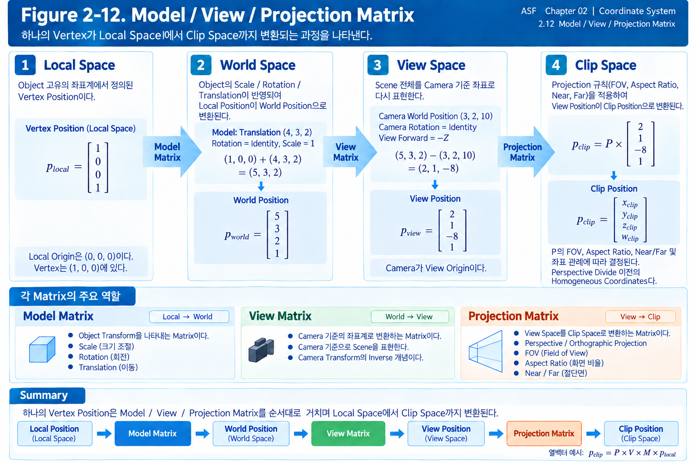

**Figure 2-12. Model / View / Projection Matrix**

---

### Model Matrix

Model Matrix는 Object의 Local Space Coordinate를 World Space Coordinate로 변환한다.

~~~text
Local Space

↓

Model Matrix

↓

World Space
~~~

Local Space에서 Vertex Position은 Object 자신의 Origin과 Axis를 기준으로 표현된다.

예를 들어 한 Vertex가 다음 Local Position을 가진다고 하자.

~~~text
Local Position

(1, 0, 0)
~~~

이 값은

> **Object 자신의 기준에서 X 방향으로 1만큼 떨어진 위치**

라는 뜻이다.

하지만 이 Object가 World에서 어디에 위치하고, 얼마나 회전하고, 얼마나 Scale되어 있는지는 이 Local Position만으로는 알 수 없다.

그 정보를 반영하는 것이 Model Matrix다.

---

### Model Matrix Contains Object Transform

Model Matrix에는 일반적으로 Object의 Transform 정보가 반영된다.

~~~text
Scale

Rotation

Translation
~~~

즉,

~~~text
Local Position

↓

Object의
Scale
Rotation
Translation

↓

World Position
~~~

의 관계로 이해할 수 있다.

예를 들어 Local Space에서

~~~text
(1, 0, 0)
~~~

이었던 Vertex가 Model Matrix를 통과한 뒤

~~~text
(5, 3, 2)
~~~

라는 World Position을 가질 수 있다.

중요한 점은

> **Vertex 자체가 다른 Vertex로 바뀐 것이 아니라, 같은 Vertex를 World Space 기준으로 다시 표현한 것**

이라는 점이다.

---

### The Same Mesh Can Have Different Model Matrices

같은 Mesh Data를 여러 Object가 공유할 수도 있다.

예를 들어 같은 Cube Mesh가 있다고 하자.

~~~text
Cube Mesh

Vertex Local Position
(1, 0, 0)
~~~

Object A와 Object B가 같은 Mesh를 사용하더라도 서로 다른 Model Matrix를 가지면 World Position은 달라진다.

~~~text
Object A
Model Matrix A
→ World Position A
~~~

~~~text
Object B
Model Matrix B
→ World Position B
~~~

즉,

> **Model Matrix는 Mesh 자체보다 Object Instance가 World에서 어떻게 배치되어 있는지를 표현한다.**

이 때문에 하나의 Mesh를 여러 위치에 반복해서 배치할 수 있다.

---

### View Matrix

World Space까지 변환된 Vertex는 아직 Scene 전체의 Coordinate System을 기준으로 표현되어 있다.

하지만 Rendering에서는 Camera 기준으로 Scene을 해석해야 한다.

이때 사용하는 것이 View Matrix다.

~~~text
World Space

↓

View Matrix

↓

View Space
~~~

View Matrix의 역할은

> **World Space Coordinate를 Camera 기준 Coordinate로 다시 표현하는 것**

이다.

---

### Camera Becomes the Reference

World Space에서는 Scene 전체의 Origin과 Axis가 기준이다.

View Space에서는 Camera가 기준이 된다.

개념적으로 다음처럼 생각할 수 있다.

~~~text
World Space

"Object가 World에서 어디에 있는가?"

↓

View Matrix

↓

View Space

"Object가 Camera 기준으로 어디에 있는가?"
~~~

같은 World Position이라도 Camera가 이동하거나 회전하면 View Position은 달라질 수 있다.

즉,

> **View Position은 Object 자체의 World Position뿐 아니라 Camera Transform에도 영향을 받는다.**

---

### View Matrix and Camera Transform

Chapter 2.5에서 View Matrix는 Camera Transform의 Inverse와 연결된다고 설명했다.

왜 그런지 직관적으로 생각해보자.

Camera가 World에서 오른쪽으로 이동했다고 하자.

화면에서는 Scene 전체가 상대적으로 왼쪽으로 이동한 것처럼 보인다.

~~~text
Camera
→ Right

Scene relative to Camera
→ Left
~~~

Camera가 위로 이동하면 Scene은 상대적으로 아래로 이동한 것처럼 보인다.

즉 View Space에서는

> **Camera를 기준 위치에 두고, World를 Camera Transform의 반대 방향으로 변환하는 것처럼 생각할 수 있다.**

그래서 View Matrix는 Camera Transform의 Inverse 개념과 연결된다.

---

### A Simple View Transform Example

World Space에서 Vertex가 다음 위치에 있다고 하자.

~~~text
World Position

(10, 0, 0)
~~~

Camera가 World Origin에 있다면 View Position도 비슷한 관계로 표현될 수 있다.

하지만 Camera가 X 방향으로 이동하면 Camera 기준에서 Vertex와의 상대 위치는 달라진다.

예를 들어 Camera가

~~~text
Camera Position

(5, 0, 0)
~~~

에 있다면,

Vertex는 Camera 기준으로 더 가까운 위치에 보이게 된다.

즉,

> **View Matrix는 World Position을 Camera와의 상대적인 Coordinate로 변환한다.**

---

### Projection Matrix

View Matrix까지 적용하면 Vertex는 Camera 기준 3D Coordinate를 가진다.

하지만 아직 Screen에 직접 Mapping할 수 있는 형태는 아니다.

다음 단계가 Projection Matrix다.

~~~text
View Space

↓

Projection Matrix

↓

Clip Space
~~~

Projection Matrix는

> **Camera 기준 3D Coordinate를 Projection 규칙이 반영된 Clip Coordinate로 변환한다.**

---

### What Projection Matrix Contains

Perspective Projection의 경우 Projection Matrix에는 대표적으로 다음 정보가 반영된다.

~~~text
FOV

Aspect Ratio

Near Plane

Far Plane
~~~

이 값들은 Camera가 볼 수 있는 View Frustum의 구조와 관련된다.

즉,

~~~text
View Position

↓

Projection Matrix

FOV
Aspect Ratio
Near
Far

↓

Clip Position
~~~

의 관계다.

---

### Projection Matrix Produces Clip Position

View Position은 일반적으로 다음과 같이 생각할 수 있다.

~~~text
(x_view, y_view, z_view, 1)
~~~

Projection Matrix를 적용하면

~~~text
(x_clip, y_clip, z_clip, w_clip)
~~~

형태의 Clip Position이 만들어진다.

즉,

~~~text
View Position

(x_view, y_view, z_view, 1)

↓

Projection Matrix

↓

Clip Position

(x_clip, y_clip, z_clip, w_clip)
~~~

이 된다.

여기서 `w_clip`은 이후 Perspective Divide에 사용된다.

---

### Projection Matrix Is Not the Final Perspective Result

Projection Matrix를 적용했다고 해서 바로 NDC나 Screen Space가 만들어지는 것은 아니다.

전체 흐름은 다음과 같다.

~~~text
View Space

↓

Projection Matrix

↓

Clip Space

↓

Clipping

↓

Perspective Divide

↓

NDC

↓

Viewport Transform

↓

Screen Space
~~~

즉,

> **Projection Matrix는 Perspective Projection에 필요한 Clip Coordinate를 준비하는 단계**

이고,

Perspective Divide가 이후 실제 NDC Coordinate를 만든다.

---

### Model, View and Projection as a Chain

세 Matrix를 하나로 연결해서 보면 다음과 같다.

~~~text
Local Position

↓

Model Matrix

↓

World Position

↓

View Matrix

↓

View Position

↓

Projection Matrix

↓

Clip Position
~~~

각 단계의 의미를 정리하면 다음과 같다.

~~~text
Model Matrix

"Object 기준 Position을
World 기준으로 바꾼다."
~~~

~~~text
View Matrix

"World 기준 Position을
Camera 기준으로 바꾼다."
~~~

~~~text
Projection Matrix

"Camera 기준 Position을
Projection 규칙이 반영된
Clip Coordinate로 바꾼다."
~~~

이 세 Matrix가 연속적으로 적용되면서 하나의 Vertex가 Rendering Pipeline의 여러 Coordinate Space를 이동한다.

---

### One Vertex, Multiple Coordinates

같은 Vertex 하나를 예로 들어보자.

Local Space에서는 다음 값을 가질 수 있다.

~~~text
Local Position

(1, 0, 0)
~~~

Model Matrix를 적용하면

~~~text
World Position

(5, 3, 2)
~~~

가 될 수 있다.

View Matrix를 적용하면

~~~text
View Position

(2, 1, -8)
~~~

처럼 Camera 기준의 다른 Coordinate가 될 수 있다.

Projection Matrix를 적용하면

~~~text
Clip Position

(x_clip, y_clip, z_clip, w_clip)
~~~

형태로 다시 변한다.

즉,

> **하나의 Vertex는 그대로지만 어느 Coordinate Space에서 표현하느냐에 따라 숫자 값은 계속 달라진다.**

---

### Why Do We Need Separate Matrices?

처음에는

> **그냥 Local Position을 바로 Clip Position으로 한 번에 바꾸면 되지 않나?**

라고 생각할 수 있다.

수학적으로 여러 Transform을 결합하는 것은 가능하다.

하지만 개념적으로 Matrix를 분리하면 각각의 역할이 명확해진다.

~~~text
Model Matrix
→ Object Transform 담당

View Matrix
→ Camera Transform 담당

Projection Matrix
→ Camera Projection 담당
~~~

이렇게 분리하면

- Object를 움직여도 Camera 설정은 그대로 둘 수 있고
- Camera를 움직여도 Object Local Data는 바꿀 필요가 없으며
- FOV가 바뀌어도 Model Transform은 유지할 수 있다.

즉,

> **각 Transform 책임을 분리할 수 있다.**

---

### Matrix Combination

여러 Matrix는 필요에 따라 하나의 Combined Matrix로 결합해서 사용할 수 있다.

개념적으로는

~~~text
Model Matrix
+
View Matrix
+
Projection Matrix

↓

Combined Transform
~~~

처럼 생각할 수 있다.

이렇게 결합된 Transform을 흔히 **MVP - Model View Projection**과 연결해서 설명한다.

~~~text
M
→ Model

V
→ View

P
→ Projection
~~~

즉,

> **MVP는 Local Position을 Clip Position까지 전달하는 Model, View, Projection Transform의 조합**

이라고 이해하면 된다.

---

### Why Combine Matrices?

Object 하나가 수천 또는 수만 개의 Vertex를 가지고 있다고 하자.

각 Vertex마다

~~~text
Model Transform
↓
View Transform
↓
Projection Transform
~~~

을 개별적으로 준비하는 것보다,

가능한 Transform을 미리 결합해두고 반복해서 사용할 수 있다.

개념적으로는 다음과 같다.

~~~text
Projection × View × Model

↓

Combined Matrix (Column Vector convention)

↓

Vertex 1
Vertex 2
Vertex 3
Vertex 4
...
~~~

이 방식은 Rendering에서 매우 자주 사용된다.

다만 실제 Engine이나 Shader에서는 중간 결과가 필요하거나 다른 계산을 위해 Matrix를 분리해서 사용하는 경우도 많다.

---

### A Small Matrix Example

이 예제는 Column Vector와 World Z축 기준 +90° 회전을 사용한다. Local x를 2배 늘린 뒤 회전하고 (5,2,0)만큼 이동한다.

~~~text
M = T × R × S =
[ 0 -1  0  5 ]
[ 2  0  0  2 ]
[ 0  0  1  0 ]
[ 0  0  0  1 ]

Position p = (1,0,0,1)
M × p = (5,4,0,1)

Direction d = (1,0,0,0)
M × d = (0,2,0,0)
normalize(d_world) = (0,1,0)
~~~

같은 XYZ라도 Position에는 Translation이 적용되고 Direction에는 적용되지 않는다. Direction의 길이는 Scale로 바뀔 수 있으므로 각도 계산에는 필요에 따라 Normalize한다. Normal은 이 일반 Direction 예제와 구분하여 2.13과 Chapter 03의 3.5에서 다룬다.

Camera가 회전 없이 World (5,0,0)에 있다면 View Transform은 (-5,0,0)의 Translation이다. 위 World Position (5,4,0)은 View Position (0,4,0)이 된다. Rotation R_c와 Translation t_c만 갖는 Camera의 inverse는 먼저 t_c를 빼고 R_c의 transpose를 적용한다. 이는 R_c가 orthonormal인 rigid transform 조건의 간단한 inverse 예제다.

---

### Matrix Multiplication Order

여기서 중요한 주의점이 있다.

Matrix를 결합할 때는 **순서가 중요하다.**

하지만 실제 코드나 교재에서는 다음과 같은 표기가 서로 다르게 보일 수 있다.

~~~text
P × V × M × Position
~~~

또는 Convention에 따라 다른 순서로 표현될 수 있다.

식의 좌우 배치는 Row Vector / Column Vector convention에 따라 달라진다. 이 장의 Column Vector 표기는 P × V × M × Position이며 오른쪽 변환부터 적용한다. Row Vector를 사용한다면 그에 맞춘 행렬과 식으로 일관되게 표현해야 한다.

Matrix Storage의 row-major/column-major는 메모리 배치 문제이며 Vector를 왼쪽 또는 오른쪽에 곱하는 수학 convention과 동일한 개념이 아니다. Engine/Math Library의 storage와 multiplication 규칙을 각각 확인한다.

따라서 Chapter 02에서는

> **문자 순서를 외우는 것보다 실제 Transform의 논리적 순서를 이해하는 것이 중요하다.**

논리적인 Transform 흐름은 항상 다음과 같다.

~~~text
Local

↓

Model Transform

↓

World

↓

View Transform

↓

View

↓

Projection Transform

↓

Clip
~~~

즉,

> **어떤 식으로 적혀 있든 Vertex가 실제로 거치는 Space의 순서를 먼저 확인해야 한다.**

---

### Model Matrix vs View Matrix

Model Matrix와 View Matrix는 둘 다 Position을 Transform하지만 역할은 반대 관점에 가깝다.

#### Model Matrix

~~~text
Object 기준
↓
World 기준
~~~

Object를 World에 배치한다.

#### View Matrix

~~~text
World 기준
↓
Camera 기준
~~~

World를 Camera 기준으로 다시 표현한다.

따라서

> **Model Matrix는 Object의 위치와 방향을 Scene에 적용하고, View Matrix는 Scene을 Camera 관점으로 재해석한다.**

라고 볼 수 있다.

---

### View Matrix vs Projection Matrix

View Matrix와 Projection Matrix 역시 서로 다른 역할을 한다.

#### View Matrix

~~~text
World → View
~~~

Camera 기준 3D Coordinate를 만든다.

#### Projection Matrix

~~~text
View → Clip
~~~

Perspective 또는 Orthographic Projection 규칙을 적용한다.

즉,

> **View Matrix는 Camera 기준을 만들고, Projection Matrix는 그 Camera가 Scene을 어떻게 볼 것인지를 결정한다.**

---

### Perspective and Orthographic Projection Matrix

Projection Matrix는 Perspective Projection만을 위한 것은 아니다.

Orthographic Projection에서도 Projection Matrix를 사용할 수 있다.

~~~text
Perspective Projection Matrix

→ Distance에 따른 크기 변화
→ Perspective Effect
~~~

~~~text
Orthographic Projection Matrix

→ Distance에 따른 크기 변화 없음
→ Parallel Projection
~~~

즉,

> **Projection 방식이 달라지면 Projection Matrix의 내용도 달라진다.**

하지만 View Space를 Clip Space로 변환한다는 역할 자체는 동일하다.

---

### Matrix and Rendering Responsibility

Model / View / Projection Matrix를 각각 어떤 주체와 연결할지 생각하면 이해하기 쉽다.

~~~text
Model Matrix
→ Object
~~~

~~~text
View Matrix
→ Camera
~~~

~~~text
Projection Matrix
→ Camera Lens / Projection Setting
~~~

즉,

~~~text
Object Transform
↓
Model Matrix

Camera Transform
↓
View Matrix

Camera Projection Setting
↓
Projection Matrix
~~~

라고 연결해서 생각할 수 있다.

---

### A Practical DCC Mental Model

DCC Tool 경험과 연결하면 더 이해하기 쉽다.

#### Model Matrix

Object Mode에서 Object의

- Location
- Rotation
- Scale

을 변경하는 것과 연결된다.

~~~text
Mesh Local Data

↓

Object Transform

↓

Scene에 배치된 Mesh
~~~

#### View Matrix

Viewport Camera나 Render Camera를 이동하거나 회전하는 것과 연결된다.

~~~text
World Scene

↓

Camera Transform

↓

Camera 기준 Scene
~~~

#### Projection Matrix

Camera의

- Perspective / Orthographic
- FOV
- Aspect Ratio
- Near / Far

설정과 연결된다.

~~~text
Camera 기준 Scene

↓

Camera Projection Setting

↓

Projected Coordinate
~~~

따라서 DCC 관점에서는

> **Object Transform → Camera Transform → Camera Projection**

의 흐름으로 이해하면 된다.

---

### The Complete Transform Flow

지금까지 Chapter 02에서 살펴본 흐름을 Matrix까지 포함해서 다시 연결하면 다음과 같다.

~~~text
Vertex Local Position

↓

Model Matrix

↓

World Position

↓

View Matrix

↓

View Position

↓

Projection Matrix

↓

Clip Position

↓

Clipping

↓

Perspective Divide

↓

NDC

↓

Viewport Transform

↓

Screen Space
~~~

이 흐름에서 Model / View / Projection Matrix는

> **3D Coordinate를 Local Space에서 Clip Space까지 전달하는 핵심 Transform Chain**

을 구성한다.

---

### A Useful Mental Model

세 Matrix는 각각 **Object의 World 배치(Model), Camera 기준 표현(View), Clipping을 위한 투영(Projection)**을 담당한다. 실제 적용 순서와 곱셈 표기는 위에서 정한 Matrix convention을 따른다.

---

### Model / View / Projection Matrix Summary

세 Matrix의 핵심을 정리하면 다음과 같다.

| Matrix | Input Space | Output Space | Main Role |
|---|---|---|---|
| Model Matrix | Local Space | World Space | Object Transform 반영 |
| View Matrix | World Space | View Space | Camera 기준으로 변환 |
| Projection Matrix | View Space | Clip Space | Projection 설정 반영 |

전체 Coordinate Flow는 다음과 같다.

~~~text
Local Position

↓

Model Matrix

↓

World Position

↓

View Matrix

↓

View Position

↓

Projection Matrix

↓

Clip Position
~~~

가장 중요한 개념은 다음과 같다.

> **Model Matrix는 Object를 World에 배치한다.**

> **View Matrix는 World를 Camera 기준으로 다시 표현한다.**

> **Projection Matrix는 Camera 기준 3D Position을 Clip Space로 변환한다.**

그리고 이 세 Transform은 필요에 따라 결합해서 사용할 수 있으며, 이를 흔히 **MVP - Model View Projection** 구조와 연결해서 이해한다.

하지만 Matrix 표기 순서를 외우는 것보다 먼저 기억해야 할 것은

> **Local → World → View → Clip**

이라는 실제 Coordinate Space의 이동 순서다.

다음 절에서는 Matrix Transform에서 매우 중요한 차이인 **Position Transform vs Direction Transform**을 살펴본다.

---

## 2.13 Position Transform vs Direction Transform

Chapter 2.8에서는 Homogeneous Coordinate를 사용하면 Position과 Direction을 서로 다르게 표현할 수 있다고 설명했다.

일반적으로 다음과 같이 표현한다.

~~~text id="88ixl1"
Position
→ (x, y, z, 1)

Direction
→ (x, y, z, 0)
~~~

겉으로 보면 둘 다 `x`, `y`, `z` 값을 가지는 Vector처럼 보인다.

하지만 Rendering에서는 두 Data의 의미가 다르다.

~~~text id="pa4s9z"
Position
→ 어디에 있는가?

Direction
→ 어느 방향을 향하는가?
~~~

따라서 같은 Transform Matrix를 적용하더라도 Position과 Direction이 동일하게 변환되는 것은 아니다.

특히 가장 큰 차이는 **Translation**이다.

---

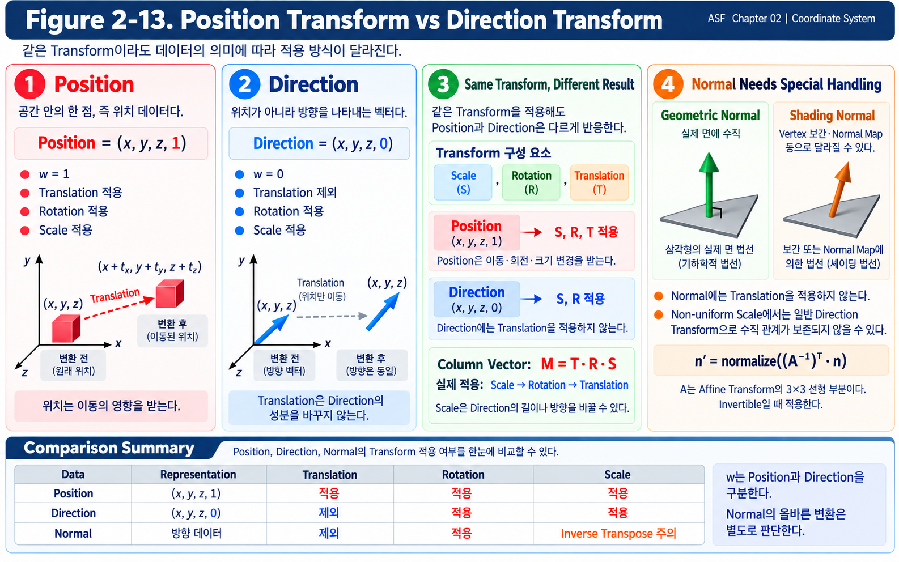

**Figure 2-13. Position Transform vs Direction Transform**

---

### Position Represents a Location

Position은 공간 안의 특정 위치를 나타낸다.

예를 들어 다음 Position이 있다고 하자.

~~~text id="jd8lu1"
Position

(2, 1, 0)
~~~

이 값은 어떤 Coordinate Space의 Origin을 기준으로

~~~text id="7yhocc"
X 방향으로 2
Y 방향으로 1
Z 방향으로 0
~~~

만큼 떨어진 위치를 의미한다.

즉,

> **Position은 Origin과의 관계를 가지는 Point다.**

따라서 Object가 이동하면 Position 역시 함께 이동해야 한다.

---

### Direction Represents an Orientation

Direction은 공간 안의 특정 위치를 나타내는 것이 아니다.

예를 들어 다음 Direction을 생각해보자.

~~~text id="93s8qg"
Direction

(1, 0, 0)
~~~

이 값은

> **X 방향을 향한다.**

는 의미다.

이 Direction이 World Origin에 있든,

~~~text id="s5ee7r"
(0, 0, 0)
~~~

다른 Position에 있든

~~~text id="ia39x0"
(10, 5, 2)
~~~

Direction 자체는 여전히 X 방향을 나타낼 수 있다.

즉,

> **Direction은 위치가 아니라 방향 관계를 나타낸다.**

---

### Translation Is the Key Difference

Position과 Direction의 차이가 가장 명확하게 드러나는 Transform이 Translation이다.

예를 들어 X 방향으로 `+5` 이동시키는 Translation이 있다고 하자.

Position이 다음과 같다면

~~~text id="hgjgq3"
Position

(1, 2, 3)
~~~

Translation 이후에는

~~~text id="a4dpvr"
(1, 2, 3)

↓

Translate X +5

↓

(6, 2, 3)
~~~

이 된다.

즉, Position은 실제 위치가 바뀐다.

---

### Direction Does Not Move with Translation

반면 Direction은 위치가 아니다.

다음 Direction이 있다고 하자.

~~~text id="t5o1dh"
Direction

(1, 0, 0)
~~~

이것은 단순히 X 방향을 나타낸다.

여기에 Object를 X 방향으로 `+5`만큼 이동시키는 Translation을 적용한다고 해도 Direction 자체는 바뀌지 않는다.

~~~text id="skn5dr"
Direction

(1, 0, 0)

↓

Translation

↓

Direction

(1, 0, 0)
~~~

즉,

> **Object가 이동했다고 해서 Object의 방향까지 이동하는 것은 아니다.**

이것이 Position과 Direction Transform의 핵심적인 차이다.

---

### Why w = 1 and w = 0 Matter

이 차이를 Matrix 계산 안에서 자동으로 처리하기 위해 Homogeneous Coordinate의 `w`가 사용된다.

Position은 일반적으로

~~~text id="40jvut"
(x, y, z, 1)
~~~

로 표현하고,

Direction은

~~~text id="6mycd8"
(x, y, z, 0)
~~~

으로 표현한다.

왜 `w`가 중요한지 단순화해서 생각해보자.

Translation 정보가 Matrix 안에 있다고 가정한다.

Position은 `w = 1`이므로 Translation 항이 계산에 참여한다.

~~~text id="jxmss1"
Position

(x, y, z, 1)

↓

Transform Matrix

↓

Translation 적용
~~~

반면 Direction은 `w = 0`이므로 Translation 항이 사라진다.

~~~text id="kjvqci"
Direction

(x, y, z, 0)

↓

Transform Matrix

↓

Translation 적용되지 않음
~~~

즉,

> **Position과 Direction은 같은 4x4 Matrix를 사용할 수 있지만 `w` 값의 차이 때문에 Translation에 서로 다르게 반응한다.**

---

### Rotation Affects Both Position and Direction

Translation과 달리 Rotation은 Position과 Direction 모두에 영향을 줄 수 있다.

예를 들어 X 방향을 향하는 Direction이 있다고 하자.

~~~text id="vz0tns"
Direction

(1, 0, 0)
~~~

이 Object를 회전시키면 Direction 역시 회전해야 한다.

예를 들어 개념적으로 90도 회전했다고 하면

~~~text id="xkz41j"
Before

→

↓

Rotation

↓

↑
~~~

처럼 방향 자체가 달라진다.

즉,

~~~text id="iq7c6i"
Position
→ Rotation 영향 O

Direction
→ Rotation 영향 O
~~~

다.

---

### Why Rotation Must Affect Direction

예를 들어 Character의 얼굴이 Forward 방향을 나타내는 Direction을 가지고 있다고 하자.

Character가 회전했는데 Direction이 그대로라면

~~~text id="6rq9vr"
Character
→ 오른쪽을 봄

Direction Data
→ 계속 앞을 봄
~~~

처럼 실제 Object 방향과 Data가 일치하지 않게 된다.

따라서 Object가 회전하면

- Forward Vector
- Right Vector
- Up Vector
- Tangent
- Normal

같은 Direction Data도 함께 회전해야 한다.

---

### Scale Can Affect Direction Values

Scale 역시 Position과 Direction 모두의 숫자 값에 영향을 줄 수 있다.

예를 들어 Direction Vector가 다음과 같다고 하자.

~~~text id="xp44gk"
Direction

(1, 1, 0)
~~~

X Axis에만 2배 Scale을 적용하면 결과 Vector는 개념적으로 다음과 같이 변할 수 있다.

~~~text id="1y08nx"
Before

(1, 1, 0)

↓

X Scale ×2

↓

After

(2, 1, 0)
~~~

즉 방향 자체도 달라질 수 있다.

특히 **Non-uniform Scale**에서는 이러한 현상이 더 중요해진다.

---

### Direction and Unit Direction Are Not Always the Same

여기서 한 가지 구분할 필요가 있다.

Direction Data는 종종 단순히 방향만 필요하기 때문에 길이를 `1`로 맞춰 사용한다.

이런 Vector를 **Normalized Vector** 또는 **Unit Vector**라고 한다.

예를 들어

~~~text id="u1ntys"
Direction

(2, 0, 0)
~~~

과

~~~text id="17pycd"
Direction

(1, 0, 0)
~~~

은 길이는 다르지만 같은 X 방향을 가리킨다.

따라서 Transform 이후 Direction Vector의 길이가 변했다면 필요에 따라 다시 Normalize할 수 있다.

~~~text id="03st83"
Direction Transform

↓

Vector Length 변경 가능

↓

Normalize

↓

길이 1의 Direction
~~~

즉,

> **Direction Transform에서는 방향과 Magnitude를 구분해서 생각할 필요가 있다.**

---

### Scale, Rotation and Translation Comparison

Position과 Direction의 기본적인 Transform 차이를 정리하면 다음과 같다.

| Transform | Position | Direction |
|---|---|---|
| Translation | 영향 O | 영향 X |
| Rotation | 영향 O | 영향 O |
| Scale | 영향 O | 영향 O |
| Homogeneous w | `1` | `0` |

가장 중요한 차이는 Translation이다.

~~~text id="yoc85w"
Position

w = 1
→ Translation 적용
~~~

~~~text id="9yz77x"
Direction

w = 0
→ Translation 제외
~~~

---

### A Practical DCC Example

DCC Tool에서 Cube 하나를 생각해보자.

Cube에는 Vertex Position도 있고 Surface Normal도 있다.

Object를 World에서 오른쪽으로 이동시키면

~~~text id="avg5qn"
Vertex Position
→ 오른쪽으로 이동
~~~

하지만 Surface Normal은

~~~text id="diu5te"
Normal Direction
→ 그대로
~~~

다.

Cube를 회전시키면 상황이 달라진다.

~~~text id="fa7sdt"
Vertex Position
→ 회전

Normal Direction
→ 함께 회전
~~~

즉 DCC에서 Object Transform을 사용할 때도 실제 내부 Data에서는

> **Position과 Direction이 서로 다른 규칙으로 Transform되고 있다.**

---

### Normal Is Also a Direction, but It Needs Special Care

Normal은 Surface가 어느 방향을 향하고 있는지를 나타낸다.

따라서 기본적으로 Direction Data로 생각할 수 있다.

~~~text id="7i35pk"
Normal

→ Surface Direction

→ Translation 영향 X
~~~

Object를 이동시켜도 Normal 방향 자체는 바뀌지 않는다.

Rotation을 적용하면 Normal도 함께 회전한다.

여기까지는 일반 Direction과 비슷하다.

하지만 **Non-uniform Scale**이 들어가면 문제가 생길 수 있다.

---

### What Is Non-uniform Scale?

모든 Axis를 같은 비율로 Scale하는 것을 Uniform Scale이라고 한다.

~~~text id="bzgqyb"
Uniform Scale

X = 2
Y = 2
Z = 2
~~~

반대로 Axis마다 서로 다른 Scale을 적용하면 Non-uniform Scale이다.

~~~text id="7e08eu"
Non-uniform Scale

X = 2
Y = 1
Z = 0.5
~~~

Object가 한 방향으로 늘어나거나 눌리는 경우다.

DCC Tool에서는 매우 흔한 Transform이다.

---

### Why Normal Becomes a Special Case

Normal의 중요한 조건은

> **Geometric Normal은 해당 Surface의 Tangent에 수직이다. Shading Normal은 보간·Normal Map·Artist 조정으로 Geometry의 Face Normal과 달라질 수 있다.**

는 것이다.

예를 들어 Surface가 변형되면 Surface의 방향도 바뀐다.

이때 Normal에 일반 Direction과 동일한 Transform을 그대로 적용하면, Non-uniform Scale에서는 Normal이 더 이상 Surface에 정확히 수직이 아닐 수 있다.

즉,

~~~text id="tet9uk"
Surface

↓

Non-uniform Scale

↓

Surface 방향 변화
~~~

가 발생했는데,

Normal을 단순히 같은 방식으로 변환하면

~~~text id="05xry8"
Transformed Normal

≠

새 Surface에 정확히 수직
~~~

인 문제가 생길 수 있다.

---

### Why This Matters for Lighting

Normal은 Lighting 계산에서 매우 중요하다.

예를 들어 Lighting에서는 자주

~~~text id="q49gih"
Normal

Light Direction
~~~

사이의 관계를 사용한다.

Normal이 Surface의 실제 방향과 맞지 않으면 Lighting 결과도 틀어진다.

즉,

> **Normal Transform이 잘못되면 Geometry는 올바르게 보이더라도 Lighting이 잘못될 수 있다.**

따라서 Normal은 일반 Direction과 완전히 동일하게 처리할 수 없는 경우가 있다.

---

### Normal Matrix

Non-uniform Scale이 포함된 Transform에서는 Normal을 올바르게 변환하기 위해 일반적으로 **Normal Matrix** 개념이 사용된다.

이 Matrix는 일반적인 Transform Matrix를 그대로 사용하는 것이 아니라

> **Inverse Transpose**

와 연결된 방식으로 계산한다.

개념적으로는 다음과 같다.

~~~text id="jyg2tg"
Position
→ 일반 Transform Matrix

Direction
→ Translation을 제외한 Transform

Normal
→ Non-uniform Scale이 있다면
   Normal 전용 Transform 필요
~~~

이 절은 Position/Direction/Normal의 변환 책임을 구분한다. Inverse Transpose가 수직 관계를 보존하는 이유와 수치 예제의 Primary Explanation은 Chapter 03의 3.5 Normal Transformation에 둔다.

현재 단계에서 중요한 것은

> **Normal은 Translation을 받지 않는 방향 데이터지만, Surface의 Tangent와 맺는 관계를 변환해야 하므로 일반 Direction과 다른 Normal Transform을 사용할 수 있다. Artist가 만든 Shading Normal도 어떤 공간의 방향인지 명시한다.**

는 점이다.

---

### Why Not Treat Every Vector the Same?

Rendering에서는 많은 Data가 Vector 형태를 가진다.

예를 들면

- Position
- Direction
- Normal
- Tangent
- Light Direction
- View Direction
- Velocity

등이 있다.

모두 숫자 세 개로 표현될 수 있다.

~~~text id="01226g"
(x, y, z)
~~~

하지만 같은 모양이라고 해서 의미가 같은 것은 아니다.

~~~text id="gj6k72"
Position
→ 위치

Direction
→ 방향

Normal
→ Surface에 수직인 방향

Tangent
→ Surface 위의 기준 방향
~~~

따라서 Shader나 Rendering Code에서는

> **이 Vector가 무엇을 의미하는 Data인가?**

를 먼저 확인해야 한다.

---

### Coordinate Space Still Matters

2.2에서 확인한 같은 Space 원칙은 Transform 이후에도 적용된다. 예를 들어 World Normal과 View-space Light Direction을 비교하려면 먼저 한쪽을 변환해야 한다. **Data Type과 입출력 Space를 함께 확인한다.**

---

### Position Transform vs Direction Transform in the Pipeline

Rendering Pipeline에서 Position은 계속 Space를 이동한다.

~~~text id="ty5s1c"
Local Position
↓
Model Matrix
↓
World Position
↓
View Matrix
↓
View Position
↓
Projection Matrix
↓
Clip Position
~~~

반면 Direction Data는 Projection Matrix까지 Position과 완전히 같은 방식으로 처리하는 것이 일반적인 목적은 아니다.

예를 들어 Lighting에 사용하는

~~~text id="o48fph"
Normal

Light Direction

View Direction
~~~

등은 주로 Lighting 계산에 필요한 Coordinate Space로 변환해서 사용한다.

즉,

> **Position Transform의 목적과 Direction Transform의 목적은 서로 다를 수 있다.**

Position은 Geometry를 Screen까지 전달하기 위한 Coordinate Flow를 따라가고,

Direction은 주로 Surface Orientation이나 Lighting 관계를 계산하기 위한 Space Conversion에 사용된다.

---

### Position Does Not Mean Translation Only

Position은 Translation뿐 아니라 Rotation과 Scale의 영향도 받는다. Object를 회전하거나 Scale하면 Vertex Position도 해당 기준점에 대해 변한다.

---

### Direction Does Not Mean Rotation Only

Direction에도 Scale이 작용하며 Non-uniform Scale은 방향 자체를 바꿀 수 있다. Position과의 핵심 차이는 **Translation을 적용하지 않는다는 것**이다.

---

### A Useful Mental Model

Position은 “어디에 있는가”, Direction은 “어느 방향인가”에 답한다. 따라서 Object의 순수한 Translation은 Position을 바꾸지만 Direction은 바꾸지 않는다.

---

### Normal Mental Model

Normal은 Surface의 방향을 나타낸다. Translation에는 변하지 않고 Rotation에는 함께 회전하지만, Non-uniform Scale에서는 Surface와의 수직 관계를 보존하는 별도 변환을 확인해야 한다.

---

### Position Transform vs Direction Transform Summary

Position과 Direction의 Transform 차이를 정리하면 다음과 같다.

| Data | Homogeneous Coordinate | Translation | Rotation | Scale |
|---|---|---|---|---|
| Position | `(x, y, z, 1)` | O | O | O |
| Direction | `(x, y, z, 0)` | X | O | O |
| Normal | Direction Data | X | O | 특별한 주의 필요 |

가장 중요한 차이는 다음과 같다.

> **Position은 공간 안의 위치이므로 Translation의 영향을 받는다.**

반면,

> **Direction은 위치가 아니라 방향이므로 Translation의 영향을 받지 않는다.**

이 차이를 4x4 Matrix 안에서 표현할 수 있게 해주는 것이 Homogeneous Coordinate의 `w`다.

~~~text id="a3kcbh"
Position

w = 1
→ Translation 포함
~~~

~~~text id="jtfhjm"
Direction

w = 0
→ Translation 제외
~~~

하지만 Direction이라고 해서 모든 Vector를 동일하게 처리할 수 있는 것은 아니다.

특히 Normal은

> **Surface와 수직 관계를 유지해야 하는 Direction Data**

이므로 Non-uniform Scale에서는 일반 Direction Transform과 다른 처리가 필요할 수 있다.

그리고 실제 Shader에서는 Position인지 Direction인지뿐 아니라

> **현재 어떤 Coordinate Space의 Data인가**

도 반드시 함께 확인해야 한다.

다음 절에서는 Surface Direction Data를 이해하는 데 핵심이 되는 **Tangent Space**를 살펴본다.

---

## 2.14 Tangent Space

Chapter 2.13에서는 Position과 Direction이 같은 Matrix Transform을 적용받더라도 서로 다르게 처리된다는 점을 살펴보았다.

특히 Normal은 단순한 Direction Data이면서도

> **Geometric Normal은 해당 Surface의 Tangent에 수직이다. Shading Normal은 보간·Normal Map·Artist 조정으로 Geometry의 Face Normal과 달라질 수 있다.**

는 추가 조건을 가지고 있기 때문에 일반적인 Direction과 구분해서 생각할 필요가 있었다.

이제 다음 질문으로 이어갈 수 있다.

> **Normal은 어느 Coordinate Space에서 표현되는가?**

Rendering에서는 Normal을 여러 Coordinate Space에서 사용할 수 있다.

예를 들어

- Local Space Normal
- World Space Normal
- View Space Normal

처럼 표현할 수 있다.

하지만 Normal Map에서는 매우 자주 **Tangent Space**를 사용한다.

Tangent Space는 Object 전체를 기준으로 하는 Local Space와 조금 다르다.

> **Tangent Space는 Surface의 각 지점에 붙어 있는 작은 Local Coordinate System이다.**

즉, Mesh 전체에 하나만 존재하는 Space가 아니라 Surface 방향에 따라 각 Vertex 또는 Surface Point에서 서로 다른 방향을 가질 수 있다.

---

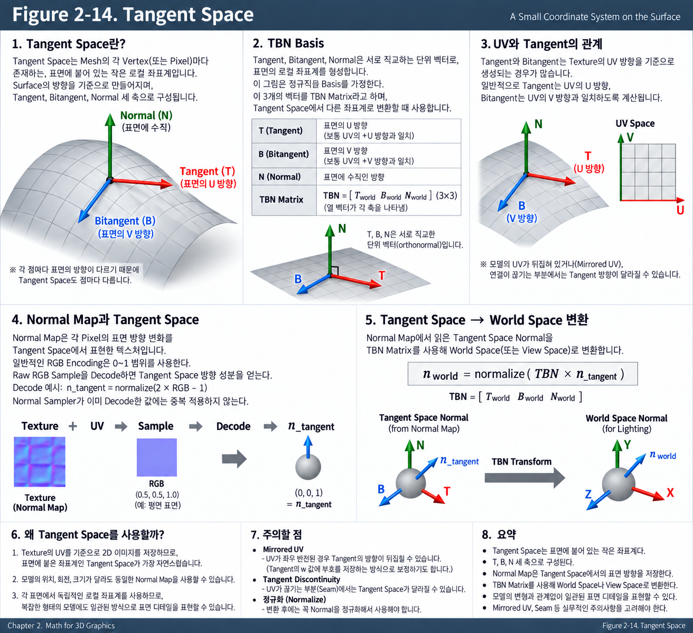

**Figure 2-14. Tangent Space**

---

### Tangent Space Is a Local Coordinate System on the Surface

Local Space는 Object 전체의 Origin과 Axis를 기준으로 한다.

예를 들어 Cube 하나가 있다면 Cube 전체가 하나의 Local Coordinate System을 가진다.

반면 Tangent Space는 Surface의 각 지점에서 만들어진다.

개념적으로는 다음과 같다.

~~~text id="wz3u18"
Object Local Space

→ Object 전체 기준 Coordinate System
~~~

~~~text id="4zfy7m"
Tangent Space

→ Surface의 한 Point 기준 Coordinate System
~~~

즉,

> **Tangent Space는 Surface의 방향을 기준으로 정의되는 작은 Coordinate System**

이라고 이해하면 된다.

---

### TBN Basis

Tangent Space는 일반적으로 세 개의 Direction Vector로 구성된다.

~~~text id="22y3p7"
Tangent

Bitangent

Normal
~~~

각 역할은 다음과 같다.

#### Tangent

Tangent는 Surface 위의 한 방향을 나타낸다.

보통 Mesh의 UV 방향과 연결된다.

~~~text id="r1q71l"
Tangent

→ Surface의 U 방향과 연결
~~~

---

#### Bitangent

Bitangent는 Tangent와 다른 Surface 방향을 나타낸다.

보통 UV의 V 방향과 연결된다.

~~~text id="mk24i3"
Bitangent

→ Surface의 V 방향과 연결
~~~

---

#### Normal

Normal은 Surface에 수직인 방향이다.

~~~text id="1pw1s2"
Normal

→ Surface에 수직
~~~

이 세 방향을 함께 묶어서 흔히

> **TBN Basis**

라고 부른다.

~~~text id="tbx0e1"
T
→ Tangent

B
→ Bitangent

N
→ Normal
~~~

---

### Why Is It Called a Basis?

여기서 **Basis**는 Coordinate System을 구성하는 기준 방향이라고 생각하면 된다.

예를 들어 World Space에는

~~~text id="17f9hy"
World X

World Y

World Z
~~~

가 있다.

Tangent Space에서는 그 역할을

~~~text id="4g8ffm"
Tangent

Bitangent

Normal
~~~

이 대신한다.

즉,

> **Tangent, Bitangent, Normal은 Tangent Space의 X/Y/Z Axis와 비슷한 역할을 한다.**

라고 이해할 수 있다.

정확한 축 대응 방식은 Convention에 따라 달라질 수 있지만, 개념적으로는

~~~text id="q4ufb3"
Tangent
→ Surface의 한 Axis

Bitangent
→ Surface의 다른 Axis

Normal
→ Surface 바깥 방향 Axis
~~~

처럼 생각하면 충분하다.

---

### Tangent Space Changes Across the Surface

Object Local Space는 Object 전체에서 하나의 기준 Coordinate System을 가진다.

하지만 Tangent Space는 Surface가 휘어지면 방향도 함께 변한다.

예를 들어 Sphere를 생각해보자.

Sphere의 위쪽 Normal과 옆쪽 Normal은 서로 다른 방향을 가진다.

따라서 각 Surface Point의 Tangent Space도 서로 다르게 배치된다.

~~~text id="j5hmr7"
Surface Point A

T_A
B_A
N_A
~~~

~~~text id="qfkz1z"
Surface Point B

T_B
B_B
N_B
~~~

즉,

> **Tangent Space는 Surface의 Orientation을 따라 움직이는 Coordinate System이다.**

이 특징이 Normal Map을 이해하는 데 매우 중요하다.

---

### Tangent and UV Are Closely Related

Tangent와 Bitangent는 보통 Mesh의 UV Coordinate와 밀접하게 연결된다.

UV에는 두 방향이 있다.

~~~text id="8305mk"
U

V
~~~

그리고 Surface 위에서는 일반적으로

~~~text id="qmr02y"
Tangent
→ U 방향과 연결

Bitangent
→ V 방향과 연결
~~~

해서 계산할 수 있다.

즉,

> **UV가 Surface 위에서 어느 방향으로 펼쳐지는지를 이용해 Tangent Space의 방향을 정의한다.**

이 때문에 UV Layout이 바뀌면 Tangent 방향도 달라질 수 있다.

---

### Why Does Normal Mapping Need Tangent Space?

Normal Map은 Texture다.

Texture는 2D UV Space에 저장된다.

하지만 실제 Lighting 계산은 3D Surface 위에서 이루어진다.

따라서 Texture에 저장된 방향 정보를 Surface Orientation과 연결할 Coordinate System이 필요하다.

그 역할을 하는 것이 Tangent Space다.

개념적으로는 다음과 같다.

~~~text id="t1my47"
Normal Map

2D Texture
UV 기준 정보

↓

Tangent Space

Surface 방향 기준으로 해석

↓

Lighting에 사용할 Normal
~~~

즉,

> **Normal Map은 Surface에 붙어 움직일 수 있는 Coordinate System이 필요하고, Tangent Space가 그 기준을 제공한다.**

---

### Tangent Space Normal Map

일반적인 Tangent Space Normal Map은 다음과 같은 보라색 계열의 Texture로 보인다.

이 Texture의 RGB 값은 Color 자체가 목적이 아니다.

각 Channel은 Direction 정보를 저장한다.

개념적으로는 다음과 같다.

~~~text id="95fbw1"
R
→ Tangent Axis 방향 성분

G
→ Bitangent Axis 방향 성분

B
→ Normal Axis 방향 성분
~~~

즉,

> **Normal Map의 RGB는 Tangent Space에서의 방향 Vector를 Encoding한 값이다.**

---

### Why Does a Flat Normal Map Look Purple?

Tangent Space에서 Surface 바깥 방향을 Normal Axis라고 생각해보자.

평평한 Surface의 기본 Normal은 Tangent Space 기준으로 일반적으로 다음 방향과 연결된다.

~~~text id="d5ao1x"
(0, 0, 1)
~~~

하지만 Texture는 보통 RGB를 `0 ~ 1` 범위로 저장한다.

Direction Vector는 보통 `-1 ~ +1` 범위가 필요하므로 Texture에 저장할 때 값을 다시 Mapping한다.

개념적으로

~~~text id="69nsqa"
Normal Vector

(-1 ~ +1)

↓

Texture Encoding

(0 ~ 1)
~~~

의 과정이 들어간다.

그래서 기본적인 Tangent Space Normal은 RGB로 표현했을 때 대략 파란색 또는 보라색 계열로 보이게 된다.

즉,

> **Normal Map의 보라색은 색을 칠하기 위한 것이 아니라 방향 데이터를 저장한 결과다.**

---

### Normal Map Stores Surface Detail

Low Poly Mesh의 실제 Geometry Normal만 사용하면 Surface는 비교적 단순하게 보인다.

하지만 Normal Map을 사용하면 Texture 안에 미세한 Surface Direction 변화를 저장할 수 있다.

예를 들어 Brick Surface를 생각해보자.

실제 Geometry는 평평할 수 있다.

~~~text id="2uyb0d"
Geometry

────────────
~~~

하지만 Normal Map에서는 Pixel마다 서로 다른 Normal Direction을 저장한다.

~~~text id="n1ibjo"
Pixel A
→ Normal A

Pixel B
→ Normal B

Pixel C
→ Normal C
~~~

Lighting 계산에서는 이 방향 차이를 사용한다.

결과적으로 실제 Geometry를 크게 늘리지 않고도

- 홈
- 돌출
- 주름
- 작은 Surface Detail

이 있는 것처럼 Lighting을 표현할 수 있다.

---

### Tangent Space Moves with the Surface

Tangent Space Normal Map의 큰 장점은 Object Transform에 자연스럽게 따라간다는 것이다.

예를 들어 Object를 World에서 회전시키더라도 Normal Map Texture 자체를 새로 만들 필요는 없다.

왜냐하면 Normal Map은

> **World 방향이 아니라 Surface 자신의 Tangent Space 기준**

으로 방향을 저장하기 때문이다.

즉,

~~~text id="u9aylk"
Normal Map

"World에서 위쪽"

이 아니라

"이 Surface 기준으로 바깥쪽 / 옆쪽"
~~~

으로 저장되어 있다.

따라서 Object가 회전하면 Tangent Space도 함께 회전하고 Normal Map도 같은 Surface Detail을 유지할 수 있다.

---

### Why Not Store Everything in World Space?

Normal Map을 World Space 기준으로 저장한다고 생각해보자.

Object가 회전하면 기존 Texture에 저장된 World Direction과 실제 Surface 방향의 관계가 달라진다.

~~~text id="a2mw1j"
World Space Normal Map

Object Rotation

↓

Texture Direction과 Surface Direction 불일치 가능
~~~

반면 Tangent Space에서는

~~~text id="81yx3d"
Object Rotation

↓

Surface 회전

↓

Tangent Space도 함께 회전

↓

Normal Map Detail 유지
~~~

가 가능하다.

그래서 일반적인 Game Asset에서는 Tangent Space Normal Map이 매우 널리 사용된다.

---

### Tangent Space Normal Is Not Yet World Space Normal

Normal Map에서 읽은 값은 일반적으로 Tangent Space 기준의 Normal이다.

예를 들어

~~~text id="5333av"
Normal Map Sample

↓

Tangent Space Normal
~~~

이 값은 아직 World Space Lighting에 바로 사용할 수 없는 경우가 많다.

만약 Lighting 계산이 World Space에서 이루어진다면

~~~text id="8u8f03"
Tangent Space Normal

↓

Coordinate Space Conversion

↓

World Space Normal
~~~

이 필요하다.

---

### TBN Matrix

Tangent Space에서 World Space로 방향을 변환할 때 Tangent, Bitangent, Normal을 이용할 수 있다.

세 Vector를 이용해 만든 Transform 구조를 흔히 **TBN Matrix**라고 부른다.

개념적으로는 다음과 같다.

~~~text id="k3p4ld"
Tangent

Bitangent

Normal

↓

TBN Matrix
~~~

Normal Map의 raw RGB는 먼저 방향으로 Decode해야 한다. Engine의 Normal sampler가 이미 Decode한 결과라면 RGB×2−1을 다시 적용하지 않는다. 그 Tangent Space 방향에 TBN Transform을 적용하고 Lighting에 사용할 Unit Normal을 준비한다. 저장 형식과 Sampling의 상세 원리는 Chapter 04의 4.6에서 연결한다.

~~~text id="qyz0jb"
Tangent Space Normal

↓

TBN Transform

↓

World Space Normal
~~~

개념식으로 표현하면 다음처럼 생각할 수 있다.

~~~text id="17wy1a"
N_world

=

normalize(TBN × N_tangent)
~~~

여기서는 World Space의 T, B, N을 열로 둔 TBN과 Column Vector를 사용한다. Basis의 공간·orthonormal 상태와 mirrored UV의 handedness를 일치시켜야 한다. Basis의 transpose가 inverse와 같은 것은 orthonormal일 때이다. 이 예제의 곱 방향을 실제 Library convention과 혼용하지 않는다.

Chapter 02에서는

> **TBN은 Tangent Space Direction을 다른 Coordinate Space로 바꾸는 기준**

이라고 이해하는 것이 중요하다.

---

### Why Convert Normal to World Space?

Lighting 계산에서는 모든 Direction이 같은 Coordinate Space에 있어야 한다.

예를 들어 다음 두 Vector가 있다고 하자.

~~~text id="7mlfux"
Normal
→ Tangent Space

Light Direction
→ World Space
~~~

이 둘을 그대로 Dot Product하면 서로 다른 기준의 값을 비교하는 것이 된다.

따라서 먼저 Space를 맞춘다.

~~~text id="hv9u01"
Tangent Space Normal

↓

TBN Transform

↓

World Space Normal
~~~

이제

~~~text id="keuqp9"
World Space Normal

World Space Light Direction
~~~

을 같은 Space에서 비교할 수 있다.

즉,

> **Lighting 계산에서 중요한 것은 Normal이 어떤 Space에 있느냐가 아니라, 서로 비교하는 Direction들이 같은 Space에 있느냐이다.**

---

### World Space Is Not the Only Option

Normal을 반드시 World Space로 변환해야 하는 것은 아니다.

Lighting 계산을 View Space에서 수행한다면 Normal도 View Space로 변환할 수 있다.

또는 반대로 Light Direction을 Tangent Space로 변환해서 계산할 수도 있다.

즉,

~~~text id="1z4e1t"
방법 A

Normal
Tangent → World

Light
World 그대로
~~~

또는

~~~text id="97de89"
방법 B

Normal
Tangent 그대로

Light
World → Tangent
~~~

처럼 여러 방식이 가능하다.

핵심은

> **Lighting에 사용되는 Vector들이 동일한 Coordinate Space에 있어야 한다.**

는 것이다.

---

### Tangent Space and Interpolation

Mesh에는 일반적으로 Vertex마다

- Normal
- Tangent

같은 Attribute가 존재한다.

Rasterization 과정에서는 Vertex 사이의 값이 Fragment 위치에 맞게 Interpolation된다.

즉,

~~~text id="8ocnct"
Vertex A Tangent / Normal

Vertex B Tangent / Normal

Vertex C Tangent / Normal

↓

Rasterization + Interpolation

↓

Fragment의 Tangent / Normal
~~~

을 만들 수 있다.

그 결과 Pixel 또는 Fragment 단위에서도 Surface에 맞는 Tangent Space를 구성할 수 있다.

이 위에 Normal Map의 Detail Normal을 적용한다.

즉,

> **Tangent Space는 Vertex 단계의 Surface 방향 정보와 Fragment 단계의 Normal Map Detail을 연결하는 역할도 한다.**

---

### Tangent Space and Smooth Surface

Curved Mesh에서는 Surface 위치마다 Normal 방향이 달라진다.

예를 들어 Sphere에서는

~~~text id="o5yqcv"
Top Surface
→ Normal Up

Side Surface
→ Normal Side

Bottom Surface
→ Normal Down
~~~

처럼 방향이 계속 변한다.

Tangent Space도 Surface 방향에 맞춰 함께 변한다.

따라서 같은 Normal Map Texture를 Sphere 전체에 적용해도 각 Surface 위치에 맞는 방향으로 Detail이 표현될 수 있다.

---

### Mirrored UV

실무에서 Tangent Space를 사용할 때 주의해야 할 대표적인 경우가 **Mirrored UV**다.

UV를 좌우 반전해서 재사용하면 Texture 공간의 방향이 뒤집힌다.

~~~text id="of4zkt"
Original UV

U →

Mirrored UV

← U
~~~

이 경우 Tangent 방향 역시 뒤집힐 수 있다.

따라서 Tangent Basis를 올바르게 처리하지 않으면 Normal Map Lighting이 반대로 보이거나 Seam이 생길 수 있다.

즉,

> **Mirrored UV에서는 UV Orientation과 Tangent Orientation의 관계를 주의해야 한다.**

---

### Tangent Discontinuity

UV Seam이나 Hard Edge에서는 Tangent Space가 연속적이지 않을 수 있다.

예를 들어 UV Island가 분리되면 같은 Geometry 위치라도 UV 방향이 달라질 수 있다.

~~~text id="y5id9f"
Surface A

Tangent A

↓

UV Seam

↓

Surface B

Tangent B
~~~

따라서 Seam 경계에서는 Tangent가 달라질 수 있다.

이 때문에 Rendering용 Mesh에서는 같은 Position에 여러 Vertex가 존재하는 경우도 생긴다.

Chapter 01에서 살펴본

> **같은 DCC Point가 UV나 Normal이 다르면 Rendering에서는 여러 Vertex로 분리될 수 있다.**

는 내용과 연결된다.

---

### Tangent and Vertex Splits

예를 들어 하나의 Geometry Point가 UV Seam에 걸려 있다고 하자.

DCC에서는 하나의 위치처럼 보일 수 있다.

하지만 Render Data에서는

~~~text id="hv09sc"
Position
→ 같음

UV
→ 다름

Tangent
→ 다를 수 있음
~~~

이므로 여러 Vertex Data로 분리될 수 있다.

즉,

> **Tangent Space는 Vertex Count와도 간접적으로 연결될 수 있다.**

이 내용은 이후 Chapter 09 - Rendering Debug and Optimization에서 Vertex Split과 Geometry Cost를 다룰 때 다시 연결할 수 있다.

---

### Normalization After Transform

Normal이나 Tangent 같은 Direction Vector는 Transform 이후 Length가 `1`이 아닐 수 있다.

특히

- Interpolation
- Scale
- Coordinate Transform

과정을 거치면서 길이가 변할 수 있다.

따라서 Lighting 계산 전에 다시 Normalize하는 경우가 많다.

~~~text id="zqg7aq"
Transformed Normal

↓

Normalize

↓

Unit Normal

↓

Lighting
~~~

즉,

> **Direction의 방향이 중요할 때는 Transform 이후 Length도 확인해야 한다.**

---

### Tangent Space vs Local Space

두 Space는 모두 Object와 관련되어 있기 때문에 처음에는 비슷하게 느껴질 수 있다.

하지만 기준이 다르다.

| Space | 기준 |
|---|---|
| Local Space | Object 전체의 Origin과 Axis |
| Tangent Space | Surface의 각 Point에서 T/B/N으로 만든 Axis |

Local Space는 Object 전체에서 공통이다.

Tangent Space는 Surface 위치에 따라 달라진다.

즉,

~~~text id="gh4d11"
Local Space

Object 기준
~~~

~~~text id="gvyc6w"
Tangent Space

Surface 기준
~~~

이다.

---

### Tangent Space vs UV Space

UV Space와 Tangent Space 역시 관련은 있지만 같은 Space는 아니다.

UV Space는 Texture 위의 2D Coordinate다.

~~~text id="dvn0wo"
UV Space

(U, V)
~~~

Tangent Space는 Surface 위의 3D Coordinate System이다.

~~~text id="zp1lk7"
Tangent Space

(T, B, N)
~~~

UV의 U/V 방향을 이용해서 Tangent와 Bitangent 방향을 계산할 수 있기 때문에 서로 밀접한 관계가 있다.

하지만

> **UV Space는 2D Texture Coordinate이고, Tangent Space는 Surface 위의 3D Direction Coordinate System이다.**

라는 차이를 구분해야 한다.

---

### Tangent Space in a Character Shader

Character Shader에서도 Tangent Space는 매우 중요하다.

예를 들어 Character의 Skin Normal Map에는

- 피부 주름
- 모공
- 작은 형태 변화

등이 저장될 수 있다.

Hair나 Cloth에서도 Surface Detail을 표현하는 데 Normal Map을 사용할 수 있다.

이 Detail을 실제 Lighting에 사용하려면

~~~text id="v190aq"
Normal Map Sample

↓

Tangent Space Normal

↓

TBN Transform

↓

Lighting Space Normal

↓

Lighting Calculation
~~~

과정을 거친다.

즉,

> **Normal Map Texture와 실제 3D Lighting을 연결하는 중간 다리가 Tangent Space다.**

---

### A Useful Mental Model

Tangent Space는 Surface 위에 작은 Coordinate Axis가 붙어 있다고 생각하면 쉽다.

~~~text id="y81h4d"
        Normal
          ↑
          |
          |
          ●────→ Tangent
         /
        /
 Bitangent
~~~

Surface가 회전하면 이 Axis도 함께 회전한다.

Surface가 휘어지면 각 Point의 Axis 방향도 달라진다.

Normal Map은 이 작은 Axis를 기준으로

> **현재 Pixel의 Normal이 기본 Surface Normal에서 어느 방향으로 얼마나 틀어져 있는가**

를 저장한다고 생각하면 된다.

---

### Tangent Space Summary

Tangent Space의 핵심을 정리하면 다음과 같다.

| Component | Role |
|---|---|
| Tangent | Surface 위 U 방향과 연결 |
| Bitangent | Surface 위 V 방향과 연결 |
| Normal | Surface에 수직 |
| TBN Basis | Tangent Space를 구성하는 세 방향 |
| TBN Matrix | Tangent Space와 다른 Coordinate Space 사이의 변환에 사용 |
| Normal Map | Tangent Space 기준 Surface Direction Detail 저장 |

전체 흐름은 다음과 같이 정리할 수 있다.

~~~text id="vo2oz1"
Mesh Surface

↓

Tangent
Bitangent
Normal

↓

Tangent Space

↓

Normal Map Sample

↓

Tangent Space Normal

↓

TBN Transform

↓

World / View Space Normal

↓

Lighting Calculation
~~~

가장 중요한 개념은 다음과 같다.

> **Tangent Space는 Object 전체가 아니라 Surface의 각 지점에 붙어 있는 작은 Coordinate System이다.**

그리고

> **Tangent, Bitangent, Normal이 Tangent Space의 Basis를 구성한다.**

Normal Map은

> **이 Tangent Space 기준으로 Surface의 미세한 방향 변화를 저장한다.**

따라서 Object가 이동하거나 회전하더라도 Surface Detail을 일관되게 표현할 수 있다.

또한 Lighting 계산에서는

> **Normal과 Light Direction 같은 Vector들을 반드시 같은 Coordinate Space에 맞춰야 한다.**

이 때문에 TBN Transform을 이용해 Tangent Space Normal을 World Space나 View Space로 변환할 수 있다.

다음 절에서는 이러한 Coordinate Space Conversion이 Unreal Engine 안에서 실제로 어떻게 다뤄지는지 **Coordinate Space Conversion in Unreal**을 통해 살펴본다.

---

## 2.15 Coordinate Space Conversion in Unreal

지금까지 Chapter 02에서는 Coordinate Space를 개념적으로 따라왔다.

~~~text id="3xq4jv"
Local Space
↓
World Space
↓
View Space
↓
Clip Space
↓
NDC
↓
Screen Space
~~~

그리고 Tangent Space까지 살펴보면서

> **같은 Vector라도 어느 Coordinate Space에 존재하느냐에 따라 의미가 달라진다.**

는 점을 확인했다.

이제 이 개념을 Unreal Engine의 Material과 Shader 관점에서 연결해보자.

Unreal에서 Position, Normal, Camera Direction, Screen Coordinate 등을 사용할 때 가장 먼저 확인해야 하는 것은 숫자 자체가 아니다.

> **이 값이 현재 어느 Coordinate Space 기준의 Data인가?**

를 먼저 확인해야 한다.

---

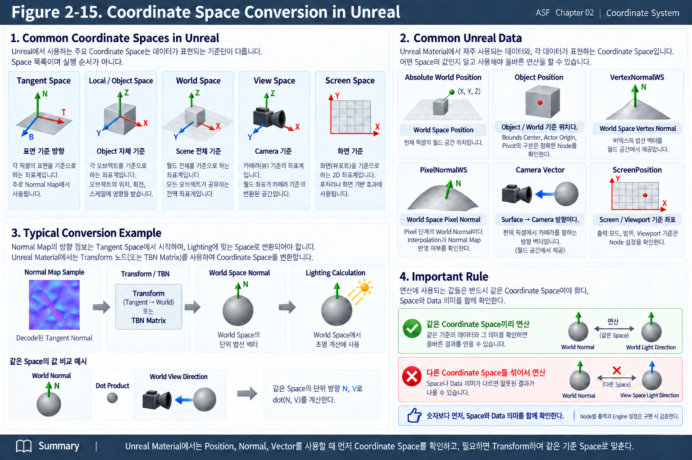

**Figure 2-15. Coordinate Space Conversion in Unreal**

---

### Common Coordinate Spaces in Unreal

Unreal Material에서는 여러 Coordinate Space의 Data를 직접 사용하게 된다.

대표적인 Space는 다음과 같다.

~~~text id="b7h79f"
Tangent Space

Local / Object Space

World Space

View Space

Screen Space
~~~

각 Space는 같은 Position이나 Direction을 서로 다른 기준으로 표현한다.

---

### Tangent Space

Tangent Space는 Surface 기준의 Local Coordinate System이다.

~~~text id="p9tqse"
Tangent
Bitangent
Normal
~~~

세 방향을 기준으로 한다.

Normal Map에서 읽어온 Normal은 일반적으로 Tangent Space 기준으로 생각할 수 있다.

~~~text id="ox89dc"
Normal Map Sample

↓

Tangent Space Normal
~~~

즉,

> **Normal Map의 방향 정보는 World Space가 아니라 Surface 자신의 방향 기준으로 저장되는 경우가 많다.**

---

### Local / Object Space

Local Space는 Object 자신의 Origin과 Axis를 기준으로 한다.

~~~text id="qbbu2h"
Local Position

→ Object 자신의 기준 Position
~~~

Object가 World에서 이동하거나 회전하더라도 Mesh 내부의 Local Position은 그대로 유지될 수 있다.

Unreal에서는 Object Transform을 통해 이러한 Local Data가 World Space로 변환된다.

---

### World Space

World Space는 Scene 전체가 공유하는 Coordinate System이다.

Unreal Material에서 많은 Position과 Direction Data가 World Space 기준으로 제공된다.

예를 들면

- Absolute World Position
- VertexNormalWS
- PixelNormalWS

같은 값들이 있다.

이름 뒤의 `WS`는 일반적으로

> **World Space**

를 의미한다.

---

### View Space

View Space는 Camera 기준 Coordinate System이다.

~~~text id="ijrr6o"
World Space

↓

View Transform

↓

View Space
~~~

Camera를 기준으로 Position과 Direction을 해석하기 때문에 Camera 관련 계산이나 View-dependent Effect와 연결된다.

---

### Screen Space

Screen Space는 현재 Viewport나 Screen을 기준으로 한다.

예를 들어

- Screen Position
- Viewport UV
- Screen UV

같은 개념이 여기에 연결된다.

~~~text id="jz4vwd"
Screen Space

→ 화면 기준 Coordinate
~~~

이 Space에서는 Geometry 자체의 World Position보다

> **화면에서 어디에 보이는가**

가 중요해진다.

---

### Absolute World Position

Unreal Material에서 자주 사용하는 값 중 하나가 **Absolute World Position**이다.

이 값은 현재 Surface Point의 World Space Position을 제공한다.

개념적으로는 다음과 같다.

~~~text id="apw9mc"
Current Surface Point

↓

Absolute World Position

↓

World Space Position
(X, Y, Z)
~~~

즉,

> **현재 Shader가 계산 중인 Surface 위치가 World에서 어디에 있는가**

를 알 수 있다.

---

### Why Absolute World Position Is Useful

World Position을 알면 World를 기준으로 Effect를 만들 수 있다.

예를 들어

~~~text id="i57bfa"
World Height

World Gradient

World-aligned Mask

Distance from World Position
~~~

같은 계산에 사용할 수 있다.

Object Local Space가 아니라 World Space를 기준으로 하기 때문에 Object가 이동하더라도 Effect가 World에 고정된 것처럼 만들 수도 있다.

---

### Object Position

Object Position 계열의 Data는 Object의 World 기준 위치를 제공하지만, 정확한 Node에 따라 bounds center, Actor origin, pivot 등 의미가 다를 수 있다. 현재 문서의 일반 이름을 Pivot의 동의어로 쓰지 않는다. 구현 시 정확한 Node 이름·출력·Engine 버전을 확인한다(Needs Technical Verification).

개념적으로는

~~~text id="opz05s"
Object Position

→ Object의 World 기준 위치
~~~

로 이해할 수 있다.

현재 Pixel의 Position을 나타내는 Absolute World Position과는 의미가 다르다.

~~~text id="sye0s4"
Absolute World Position

→ 현재 Surface Point의 위치

Object Position

→ Object 자체의 기준 위치
~~~

두 값을 이용하면 Object의 중심 또는 기준점과 현재 Surface 사이의 관계를 계산할 수 있다.

예를 들어

~~~text id="h0mrcv"
Absolute World Position
-
Object Position
~~~

을 이용하면 Object Position을 기준으로 한 상대적인 방향이나 Offset을 만들 수 있다.

---

### VertexNormalWS

**VertexNormalWS**는 Vertex Normal을 World Space 기준으로 제공하는 Data다.

~~~text id="tldbyl"
Vertex Normal

↓

World Space Transform

↓

VertexNormalWS
~~~

즉,

> **Mesh Vertex가 가진 Normal Direction을 World Space 기준으로 표현한 값**

이라고 이해할 수 있다.

Vertex 단계에서 사용하는 Effect나 Vertex Orientation과 관련된 계산에 활용할 수 있다.

---

### PixelNormalWS

**PixelNormalWS**는 현재 Pixel 또는 Fragment 단계에서 사용되는 World Space Normal과 연결된다.

개념적으로는 다음과 같다.

~~~text id="ue39vi"
Vertex Normal

↓

Interpolation

↓

Normal Map / Surface Detail 반영

↓

Pixel Normal

↓

World Space

↓

PixelNormalWS
~~~

따라서 VertexNormalWS와 PixelNormalWS는 같은 Normal Data처럼 보여도 의미가 다를 수 있다.

~~~text id="5bsjtv"
VertexNormalWS

→ Vertex 기준 Normal

PixelNormalWS

→ Pixel / Fragment 단계의 최종 Surface Normal
~~~

특히 Normal Map이 적용된 Material에서는 PixelNormalWS가 실제 Lighting에 사용되는 Surface Direction과 더 가까운 개념이 된다.

---

### Camera Vector

Camera Vector 계열의 Data는 현재 Surface Point와 Camera 사이의 Direction을 표현한다.

개념적으로는 다음과 같다.

~~~text id="7asjdo"
Current Surface Point

↓

Camera Direction

↓

Camera
~~~

즉,

> **현재 Surface에서 Camera를 향하는 방향 Vector**

로 이해할 수 있다.

이 Data는 View-dependent Effect에 매우 자주 사용된다.

예를 들어

- Fresnel
- Rim Light
- View-dependent Highlight
- Stylized Edge Effect

등에서 Normal과 Camera Direction의 관계를 사용할 수 있다.

---

### Camera Vector and Coordinate Space

Camera Vector를 사용할 때도 현재 어떤 Space 기준인지 확인해야 한다.

만약 Camera Direction이 World Space라면 비교하는 Normal 역시 World Space여야 한다.

~~~text id="6vx8da"
World Space Normal

+

World Space Camera Direction

→ 계산 가능
~~~

하지만

~~~text id="4j4r3j"
Tangent Space Normal

+

World Space Camera Direction
~~~

처럼 서로 다른 Space의 값을 그대로 비교하면 올바른 결과를 기대할 수 없다.

---

### Screen Position

Screen Position은 현재 Surface Point가 화면에서 어디에 위치하는지와 연결되는 Data다.

~~~text id="ts5rfc"
3D Surface Point

↓

Projection

↓

Screen Position
~~~

즉,

> **현재 Pixel이 Viewport 또는 Screen에서 어디에 위치하는가**

를 나타내는 데 사용할 수 있다.

이 값은

- Screen-space Effect
- Post Process
- UI-related Mask
- Screen Gradient
- Distortion

등과 연결될 수 있다.

---

### Transforming Between Coordinate Spaces

Unreal Material에서는 필요에 따라 Vector를 한 Coordinate Space에서 다른 Coordinate Space로 변환해야 한다.

개념적으로는 다음과 같다.

~~~text id="u2br0a"
Input Vector

↓

Source Space

↓

Transform

↓

Destination Space

↓

Converted Vector
~~~

예를 들어

~~~text id="i7j7nk"
Tangent Space

↓

Transform

↓

World Space
~~~

처럼 사용할 수 있다.

---

### Transform Position and Transform Direction Are Different

Chapter 2.13에서 살펴본 것처럼 Position과 Direction은 같은 Transform을 사용할 때도 Translation 처리 방식이 다르다.

~~~text id="o9rpd0"
Position

w = 1

→ Translation 영향 O
~~~

~~~text id="yaogsk"
Direction

w = 0

→ Translation 영향 X
~~~

따라서 Unreal에서 Coordinate Space Conversion을 할 때도

> **현재 변환하려는 값이 Position인지 Direction인지 먼저 구분해야 한다.**

예를 들어 Normal은 Direction Data이므로 Position처럼 Translation을 적용하면 안 된다.

---

### A Typical Normal Map Conversion

Normal Map을 사용하는 경우를 생각해보자.

Normal Map에서 읽은 값은 일반적으로 Tangent Space Normal이다.

~~~text id="82i1dj"
Normal Map Sample

↓

Tangent Space Normal
~~~

하지만 Lighting 계산이 World Space에서 이루어진다면 Normal을 World Space로 변환해야 한다.

~~~text id="k1gsyp"
Tangent Space Normal

↓

TBN / Coordinate Transform

↓

World Space Normal

↓

World Space Lighting
~~~

즉,

> **Normal Map의 방향 정보를 현재 Lighting 계산 Space에 맞게 변환해야 한다.**

---

### Why TBN Is Needed

Tangent Space Normal을 World Space로 변환하려면 Surface의 Tangent Basis가 필요하다.

~~~text id="luj78t"
Tangent

Bitangent

Normal

↓

TBN Basis
~~~

이를 이용해

~~~text id="yv4kxg"
Tangent Space Direction

↓

TBN Transform

↓

World Space Direction
~~~

으로 변환할 수 있다.

Unreal 내부에서도 이러한 Tangent Basis와 Coordinate Transform이 Material과 Rendering Pipeline에서 사용된다.

---

### The Most Important Rule: Use the Same Space

Shader 계산에서 가장 중요한 규칙 중 하나는 다음과 같다.

> **서로 비교하거나 연산하는 Vector들은 같은 Coordinate Space에 있어야 한다.**

예를 들어 Lighting에서 Normal과 Light Direction을 Dot Product한다고 하자.

~~~text id="v3rvpl"
dot(Normal, Light Direction)
~~~

올바른 경우는 다음과 같다.

~~~text id="o7a8mh"
Normal
→ World Space

Light Direction
→ World Space
~~~

또는

~~~text id="h3j75k"
Normal
→ View Space

Light Direction
→ View Space
~~~

처럼 둘 다 같은 Space여야 한다.

---

### What Happens If Spaces Are Mixed?

다음처럼 서로 다른 Space를 그대로 계산한다고 하자.

~~~text id="b1f0pp"
Normal
→ Tangent Space

Light Direction
→ World Space
~~~

둘 다 숫자로는

~~~text id="nbs8ks"
(x, y, z)
~~~

형태라서 계산 자체는 가능하다.

하지만 이 숫자들이 의미하는 Axis 기준이 다르다.

따라서 결과는 수학적으로 계산되더라도 Rendering 관점에서는 의미가 없거나 잘못된 값이 될 수 있다.

즉,

> **Vector의 숫자가 같아 보여도 Coordinate Space가 다르면 같은 Direction을 의미하지 않는다.**

---

### A Simple Example of Space Mismatch

예를 들어 다음 두 Vector가 있다고 하자.

~~~text id="jxhjdo"
Normal

(0, 0, 1)

Tangent Space
~~~

~~~text id="nrvkuo"
Light Direction

(0, 0, 1)

World Space
~~~

숫자만 보면 완전히 같다.

하지만 첫 번째 `(0, 0, 1)`은

> **현재 Surface의 Normal Axis 방향**

을 의미하고,

두 번째 `(0, 0, 1)`은

> **World Coordinate System의 특정 Axis 방향**

을 의미한다.

따라서 숫자가 같다고 해서 실제 3D 공간에서 같은 Direction이라는 보장은 없다.

이것이 Coordinate Space를 반드시 확인해야 하는 이유다.

---

### Compare Values Only After Conversion

Space가 다르면 먼저 변환한다.

예를 들어

~~~text id="6z8hkn"
Tangent Space Normal

World Space Light Direction
~~~

이 있다면 두 가지 방법이 가능하다.

#### Method A

Normal을 World Space로 변환한다.

~~~text id="mo3d2u"
Tangent Normal

↓

Tangent → World

↓

World Normal

+

World Light Direction
~~~

#### Method B

Light Direction을 Tangent Space로 변환한다.

~~~text id="0jf61o"
World Light Direction

↓

World → Tangent

↓

Tangent Light Direction

+

Tangent Normal
~~~

둘 중 어떤 방식을 사용해도 된다.

중요한 것은

> **연산 순간에는 같은 Coordinate Space여야 한다.**

는 것이다.

---

### Coordinate Space and Dot Product

ASF에서 자주 사용하게 될 Dot Product도 같은 원칙을 따른다.

예를 들어 Lambert Lighting은 개념적으로

~~~text id="512nnb"
N · L
~~~

을 사용한다.

여기서

~~~text id="l8jonk"
N
→ Normal

L
→ Light Direction
~~~

이다.

이 두 Vector의 Space가 다르면 Dot Product의 결과는 올바른 Surface-Light Angle을 의미하지 않는다.

따라서 먼저

~~~text id="rubbq8"
Normal
→ World Space

Light Direction
→ World Space
~~~

처럼 맞춘 뒤 계산해야 한다.

---

### Coordinate Space and View Direction

View-dependent Effect에서도 동일하다.

예를 들어

~~~text id="uyyf01"
Normal

View Direction
~~~

의 관계를 계산하고 싶다면 둘이 같은 Space여야 한다.

~~~text id="a0b63n"
World Normal

World View Direction
~~~

또는

~~~text id="e29y4u"
View Normal

View Space View Direction
~~~

처럼 맞춘다.

이 원칙은 이후

- Fresnel
- Specular
- Rim Lighting
- Stylized Lighting

을 구현할 때 계속 반복된다.

---

### Absolute World Position and Object Position Example

Unreal Material에서 World Space를 사용하는 간단한 예를 생각해보자.

현재 Surface Position과 Object Position의 차이를 계산한다.

~~~text id="tcc79k"
Absolute World Position

-

Object Position

↓

Object 기준 상대 Offset
~~~

두 값이 모두 같은 World Space 기준이라면 직접 Subtract할 수 있다. 결과는 Object 기준점에서 현재 Surface까지의 **World Space Offset**이다. 이 차이만으로 Object의 회전·Scale을 제거한 Local Position이 되지는 않는다.

이렇게 만들어진 Vector를 이용해

- Object 중심에서의 거리
- Object 중심에서 Surface로 향하는 Direction
- Procedural Mask

등을 만들 수 있다.

---

### World-space Effect vs Object-space Effect

Coordinate Space를 어떻게 선택하느냐에 따라 Effect의 행동도 달라진다.

예를 들어 World Position을 사용해서 Gradient를 만든다고 하자.

~~~text id="84vwv5"
Absolute World Position Z

↓

World Height Mask
~~~

Object가 이동하면 Object가 World Gradient를 통과하는 것처럼 보일 수 있다.

WorldPosition−ObjectPosition으로 만든 Offset은 기준점의 Translation을 따르지만 축 방향은 여전히 World 기준이다. Object의 Rotation/Scale까지 따르는 Local-space Effect에는 World Position을 inverse Model Transform으로 바꾼 Local Position이 필요하다.

즉,

~~~text id="zbs1n7"
World Space Effect

→ World에 고정
~~~

~~~text id="ti7vc3"
Local Space Effect (inverse Model Transform 사용)

→ Object의 Local 축·Transform을 따름
~~~

이 차이는 Stylized Shader에서도 매우 중요하다.

---

### Unreal Material Node Names Often Reveal the Space

Unreal Material에서 일부 Node 이름은 현재 Data의 Space를 직접 알려준다.

예를 들어

~~~text id="tqu449"
VertexNormalWS

PixelNormalWS
~~~

에서 `WS`는 World Space를 의미한다.

이런 Naming을 보면

> **이 값이 어느 Space인지 먼저 확인하는 습관**

을 들이는 것이 좋다.

Node 이름만 보고 의미가 불분명하다면 Documentation이나 Node 설명을 확인해야 한다.

---

### Position Data and Direction Data Should Not Be Mixed

Unreal Material에서 Vector처럼 보이는 값이라고 해서 모두 같은 종류는 아니다.

예를 들어

~~~text id="qnbutm"
Absolute World Position
→ Position

PixelNormalWS
→ Direction

Camera Vector
→ Direction
~~~

이다.

Position과 Direction은 서로 다른 의미를 가진다.

따라서

> **Data가 어느 Space인지뿐 아니라 Position인지 Direction인지도 함께 확인해야 한다.**

Chapter 2.13의 내용이 Unreal Material 작업에서도 그대로 적용된다.

---

### PixelNormalWS and VertexNormalWS Are Not Interchangeable

둘 다 World Space Normal이지만 사용 목적은 다를 수 있다.

~~~text id="v4c75j"
VertexNormalWS

→ Vertex 기준 Surface Orientation
~~~

~~~text id="304ufy"
PixelNormalWS

→ Pixel 단계의 Surface Orientation
~~~

Normal Map이나 Interpolation이 반영되는 상황에서는 두 값이 서로 다를 수 있다.

즉,

> **같은 Coordinate Space라고 해서 같은 Data라는 뜻은 아니다.**

Space와 함께

- 어느 Pipeline Stage인지
- 어떤 Data가 반영되어 있는지

도 확인해야 한다.

---

### Coordinate Space Conversion Is Not Always Free

Coordinate Space Conversion은 Matrix Transform 계산을 필요로 할 수 있다.

따라서 Material Graph에서 불필요하게

~~~text id="swxhtl"
World → Tangent
→ World
→ View
→ World
~~~

처럼 반복 변환하는 것은 피하는 것이 좋다.

실무에서는 먼저

> **이 계산을 어느 Space에서 수행할 것인가**

를 결정하고, 필요한 Data를 그 Space로 맞추는 방식이 좋다.

즉,

~~~text id="1j3qur"
Choose Calculation Space

↓

Convert Required Inputs

↓

Perform Calculation
~~~

이라는 흐름을 갖는 것이 좋다.

구체적인 Shader Instruction Cost나 Optimization은 Chapter 09 - Rendering Debug and Optimization에서 다시 다룬다.

---

### Choosing a Calculation Space

어떤 Space가 항상 정답인 것은 아니다.

계산 목적에 따라 적절한 Space를 선택한다.

#### World Space

다음과 같은 경우 이해하기 쉽다.

~~~text id="w84464"
World Direction 기반 Lighting

World Height Effect

World-aligned Effect
~~~

---

#### Tangent Space

Normal Map과 Surface-relative Direction을 직접 다룰 때 유용할 수 있다.

~~~text id="furryl"
Normal Map

Surface-relative Lighting
~~~

---

#### View Space

Camera 기준 계산을 단순하게 만들고 싶을 때 유용할 수 있다.

~~~text id="3667m5"
Camera-relative Effect

View-dependent Calculation
~~~

---

#### Screen Space

화면 기준 Effect에 사용한다.

~~~text id="2fbp5m"
Screen Mask

Post Process

Viewport Effect
~~~

---

### A Practical Material Workflow

Unreal Material에서 Vector 계산을 할 때 다음 순서로 확인하면 좋다.

#### Step 1. What Does the Data Represent?

~~~text id="yyeozr"
Position?

Direction?

Normal?

UV?

Screen Coordinate?
~~~

---

#### Step 2. Which Coordinate Space?

~~~text id="ns5foo"
Tangent?

Local?

World?

View?

Screen?
~~~

---

#### Step 3. What Space Should the Calculation Use?

예를 들어 Lighting을 World Space에서 계산하기로 했다면

~~~text id="z6ua0l"
Normal
→ World

Light Direction
→ World

View Direction
→ World
~~~

로 통일한다.

---

#### Step 4. Convert Only What Is Necessary

필요한 값만 해당 Space로 변환한다.

~~~text id="6nwjj7"
Input Data

↓

Required Transform

↓

Calculation Space
~~~

이렇게 하면 Material Graph의 구조도 이해하기 쉬워진다.

---

### ASF Implementation Perspective

이 원칙은 이후 Anime Shader를 구현할 때 매우 중요하다.

예를 들어 Stylized Lighting에서 다음 값을 사용한다고 하자.

~~~text id="wqk3w1"
Normal

Light Direction

View Direction
~~~

각 Data가 서로 다른 Space에 있다면

~~~text id="ekdz1e"
Dot Product

Lighting Threshold

Specular

Rim Light
~~~

같은 계산의 결과가 틀어질 수 있다.

따라서 ASF에서는 계산 전에 항상

> **현재 사용하는 Vector들이 어느 Coordinate Space에 있는가?**

를 확인하는 습관을 유지한다.

---

### A Useful Mental Model

Vector에 `World Space Direction` 또는 `Tangent Space Direction`이라는 Label이 붙어 있다고 생각하면 된다. **같은 숫자라도 Label이 다르면 바로 비교하지 않는다.**

---

### Coordinate Space Conversion in Unreal Summary

Unreal에서 Coordinate Space를 사용할 때 핵심은 다음과 같다.

| Data / Concept | Typical Meaning |
|---|---|
| Absolute World Position | 현재 Surface의 World Position |
| Object Position | Object 기준 World Position |
| VertexNormalWS | World Space Vertex Normal |
| PixelNormalWS | World Space Pixel Normal |
| Camera Vector | Surface와 Camera 사이의 Direction |
| Screen Position | Screen / Viewport 기준 Position |
| Tangent Space Normal | Normal Map에서 읽은 Surface-relative Normal |

가장 중요한 규칙은 다음과 같다.

> **숫자를 보기 전에 Data가 어느 Coordinate Space에 있는지 확인한다.**

그리고

> **서로 비교하거나 연산하는 Position과 Direction은 필요한 경우 같은 Coordinate Space로 변환한다.**

특히 Lighting에서는

~~~text id="lt66ca"
Normal

Light Direction

View Direction
~~~

과 같은 Vector들의 Space가 서로 맞아야 한다.

예를 들어

~~~text id="t56uwh"
Tangent Space Normal

↓

Tangent → World Transform

↓

World Space Normal

+

World Space Light Direction

+

World Space View Direction

↓

Lighting Calculation
~~~

처럼 계산 Space를 통일할 수 있다.

또한 Position과 Direction은 같은 Vector 형태로 보여도 Transform 방식이 다르므로

> **이 값이 Position인지 Direction인지도 함께 확인해야 한다.**

이 원칙은 이후 Unreal Material과 ASF Shader를 구현할 때 반복해서 사용하게 된다.

다음 절에서는 Chapter 02에서 살펴본 모든 Coordinate Space와 Transform을 하나의 흐름으로 다시 연결하는 **Complete Coordinate Flow**를 정리한다.

---

## 2.16 Complete Coordinate Flow

지금까지 살펴본 Space와 Transform을 하나의 흐름으로 연결한다. Position은 화면 위치까지 전달하고, Direction과 Normal은 계산에 필요한 Space로 변환한다.

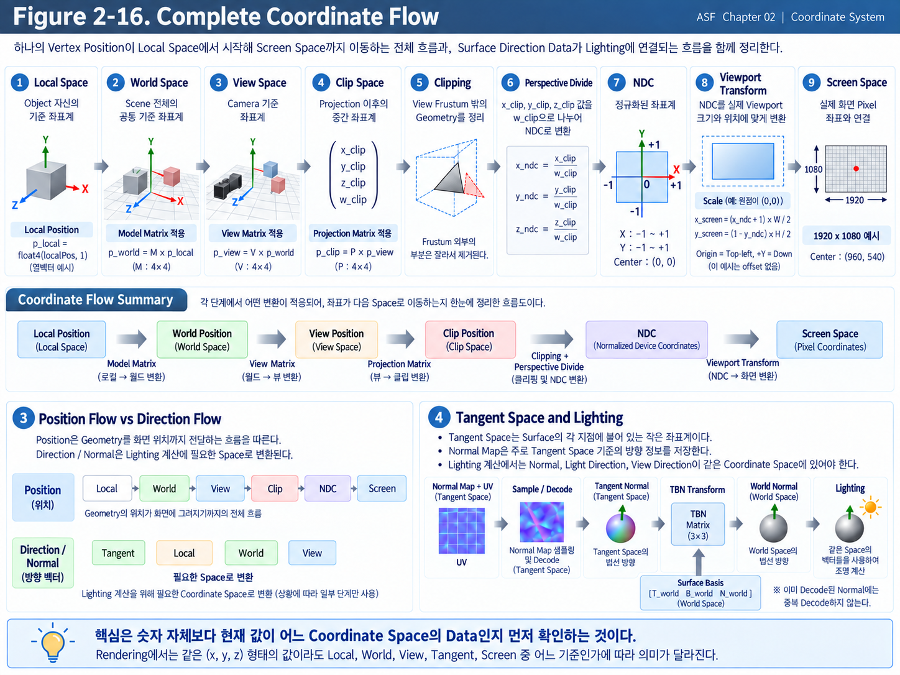

**Figure 2-16. Complete Coordinate Flow**

### The Complete Position Flow

~~~text
Local Position
  → Model Matrix → World Position
  → View Matrix → View Position
  → Projection Matrix → Clip Position
  → Clipping → Perspective Divide → NDC
  → Viewport Transform → Screen Space
~~~

| 단계 | 역할 | 다시 확인할 절 |
|---|---|---|
| Local / Object Space | Object의 Origin과 Axis를 기준으로 Vertex Position 저장 | 2.3 |
| Model Matrix → World Space | Scale / Rotation / Translation을 반영해 Scene 공통 기준으로 표현 | 2.4, 2.12 |
| View Matrix → View Space | Camera Transform의 Inverse로 Camera 기준 3D Position 표현 | 2.5, 2.12 |
| Projection Matrix → Clip Space | Projection 설정을 반영한 `(x_clip, y_clip, z_clip, w_clip)` 생성 | 2.6–2.8 |
| Clipping | Frustum 밖 Primitive를 제외하거나 경계를 가로지르는 부분을 잘라냄 | 2.7 |
| Perspective Divide → NDC | Clip XYZ를 `w_clip`으로 나누어 정규화된 좌표 생성 | 2.9 |
| Viewport Transform → Screen Space | NDC를 현재 Viewport의 크기와 시작 위치에 맞게 Scale + Offset | 2.10 |

같은 Local Position도 Model Matrix가 다르면 서로 다른 World Position이 된다. World Space에서는 Object, Light, Camera의 위치를 공통 기준으로 비교할 수 있다. View Space는 이 관계를 Camera 기준으로 다시 표현한 **3D 공간**이며 아직 Screen Space가 아니다.

### Projection, Clipping and Perspective Divide

FOV, Aspect Ratio, Near / Far 설정은 Projection Matrix에 반영된다. 따라서 Clipping은 이 설정이 반영된 Clip Coordinate를 대상으로 수행한다. Vertex 하나가 범위를 벗어났다고 Triangle 전체가 반드시 제거되는 것은 아니다.

Clipping 이후의 Divide는 **View Position이 아니라 Clip Position**에 적용한다.

~~~text
x_ndc = x_clip / w_clip
y_ndc = y_clip / w_clip
z_ndc = z_clip / w_clip
~~~

Perspective Projection에서 `w_clip`은 View Depth와 연결되며 Camera까지의 직선거리 자체가 아니다. 고정된 Projection과 같은 View X/Y Offset을 비교하면 Depth가 커질수록 화면상의 Offset이 작아진다. 예를 들어 `x_clip = 2`일 때 `w_clip = 2`이면 `x_ndc = 1`, `w_clip = 10`이면 `x_ndc = 0.2`다. 같은 Camera ray를 따라 이동하는 경우는 이 비교와 다르다(2.9).

Orthographic Projection에서는 같은 방식의 Depth에 따른 원근 축소가 생기지 않는다. 입력 Position의 `w = 1`을 Projection 이후의 `w_clip`과 혼동하지 않는다.

### NDC and Viewport

Clipping 후 유효한 NDC의 X/Y는 일반적으로 `-1 ~ +1` 범위이며 중심은 `(0, 0)`이다. NDC에는 Z도 남아 있고 그 범위와 Depth convention은 API / Projection 설정에 따라 확인해야 한다.

NDC는 해상도와 독립적이지만 Screen 좌표는 Viewport에 의존한다. 시작 위치가 `(0, 0)`인 `1920 × 1080` Viewport의 기하학적 중심은 `(960, 540)`이다. 이 경계 기반 좌표와 개별 Pixel Center의 구분은 2.10을 따른다.

Viewport는 Monitor 전체와 같지 않을 수 있다. Split Screen, Editor Viewport, Render Target에서도 **현재 Viewport의 크기와 위치**로 Mapping한다. Screen 위치가 정해졌다고 최종 Pixel Color까지 계산된 것은 아니다.

### Position, Direction and Normal

| Data | Affine Transform 입력 | Translation | Rotation / Scale |
|---|---|---|---|
| Position | `(x, y, z, 1)` | 적용 | 적용 |
| Direction | `(x, y, z, 0)` | 제외 | 적용; Unit Direction이 필요하면 Normalize 조건 확인 |
| Normal | 방향 Data | 제외 | Surface와의 관계를 보존하는 Normal Transform 사용 |

Vertex Position의 투영 흐름과 달리 Light Direction, View Direction, Normal, Tangent는 보통 Lighting / Surface 계산에 필요한 Space까지만 변환한다. 이 방향들을 모두 Clip / NDC / Screen으로 보내는 것이 목적은 아니다.

Geometric Normal은 Surface의 Tangent에 수직이다. Shading Normal은 보간, Normal Map, Artist 조정으로 Face Normal과 다를 수 있다. Non-uniform Scale에서는 일반 Direction 변환으로 수직 관계가 보존되지 않을 수 있으므로 Inverse Transpose와 Normalize 조건을 확인한다. 데이터 종류별 비교는 2.13, 상세 원리와 수치 예제는 Chapter 03의 3.5를 참고한다.

### Tangent Space and Lighting Inputs

Tangent Space의 T / B / N은 Surface 지점의 Basis다. 일반적인 Tangent-space Normal Map은 다음과 같이 Lighting 입력으로 연결된다.

~~~text
Normal Map Sample
  → Decode된 Tangent-space Normal
  → 목표 Space의 TBN으로 변환
  → Normalize → Lighting
~~~

Engine Sampler가 이미 Decode한 값은 다시 Decode하지 않는다. TBN의 Space, Handedness, 보간 후 정규화 조건은 2.14와 Chapter 04의 Normal Mapping 설명을 따른다. World Space Lighting이라면 Normal, Light Direction, View Direction을 모두 World Space로 맞춘다. View Space Lighting도 같은 원칙을 적용한다.

### Matrix Chain

이 Chapter의 Column Vector convention에서는 다음과 같다.

~~~text
p_world = M × p_local
p_view  = V × p_world
p_clip  = P × p_view = P × V × M × p_local
~~~

MVP는 세 변환의 결합을 가리키며 Matrix를 더한다는 뜻이 아니다. 표기 convention과 관계없이 실제 Space 흐름은 Local → World → View → Clip이다. Matrix의 storage와 곱 convention의 구분 및 실제 수치 예제는 2.11–2.12를 참고한다.

### Practical Checklist

Unreal Material이나 Shader의 입력을 연결할 때 다음을 확인한다.

1. **Data Type:** Position, Direction, Normal 중 무엇인가?
2. **Space:** 현재 값과 계산 대상은 같은 Space인가?
3. **Transform:** Translation을 포함해야 하는가? Normal의 별도 변환이 필요한가?
4. **Node 계약:** `Absolute World Position`, `VertexNormalWS`, `PixelNormalWS`, `Camera Vector`, `Screen Position`의 실제 Output 의미와 사용 조건을 확인했는가? 자세한 차이는 2.15를 따른다.

숫자만이 아니라 **Data의 의미와 기준 Space를 함께 확인하는 것**이 이 Chapter의 핵심이다. 다음 Chapter에서는 이 Position과 Direction을 실제 Lighting 계산에 사용하는 **Lighting Mathematics**를 살펴본다.

