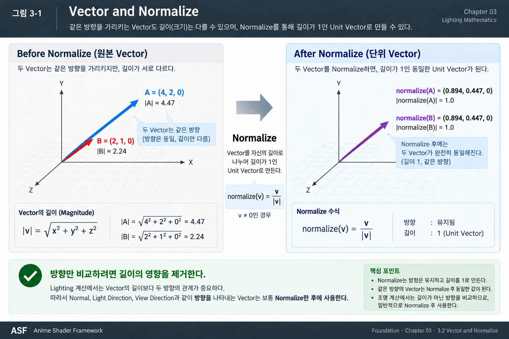
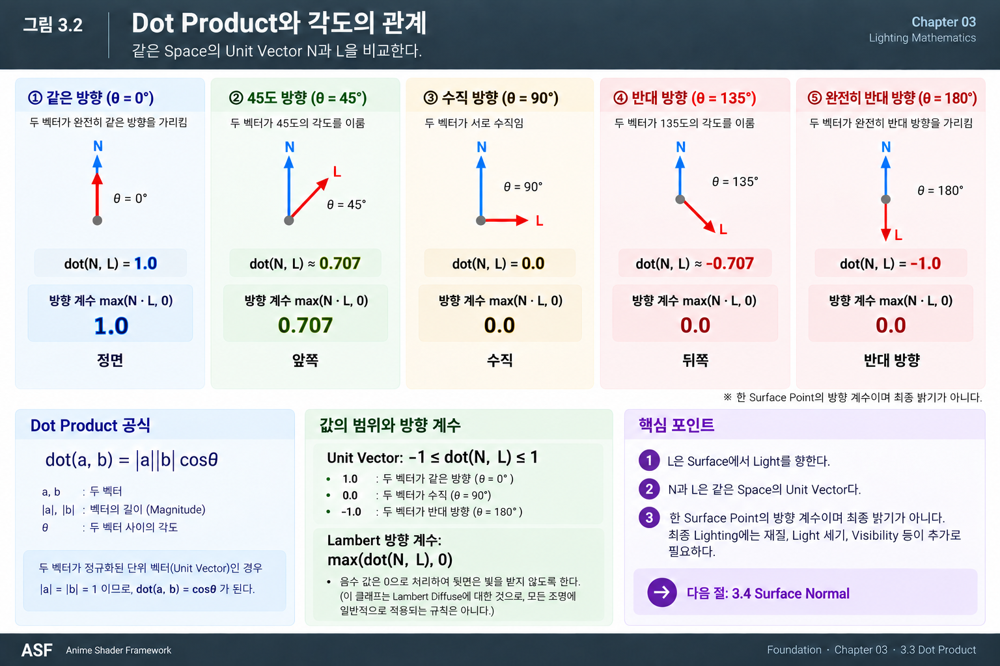
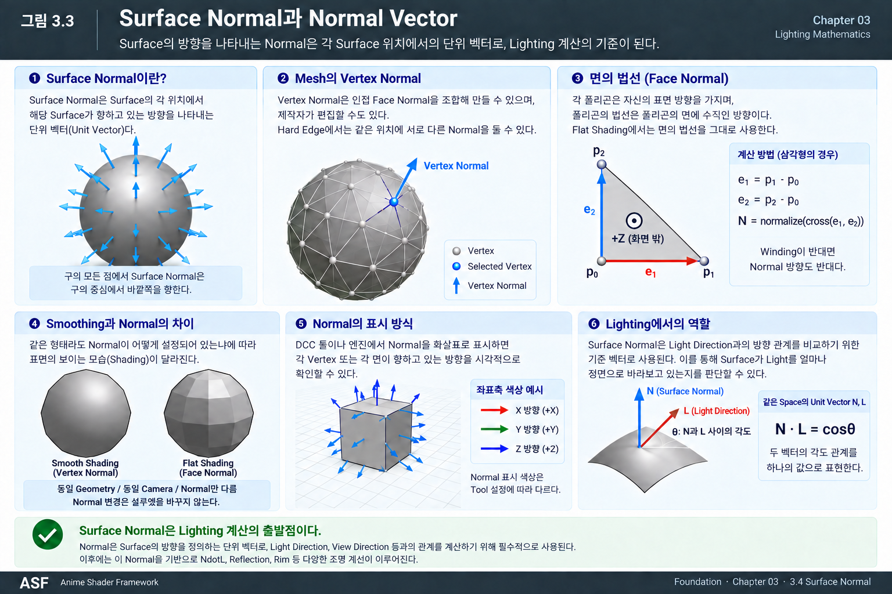
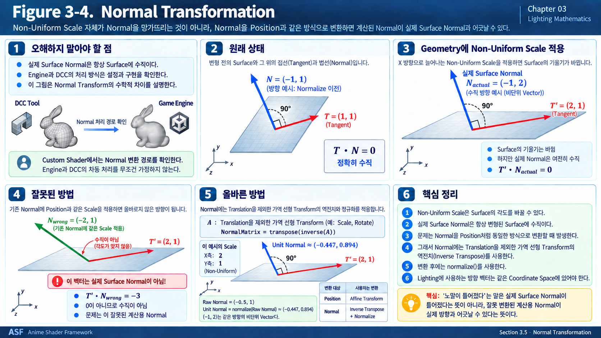
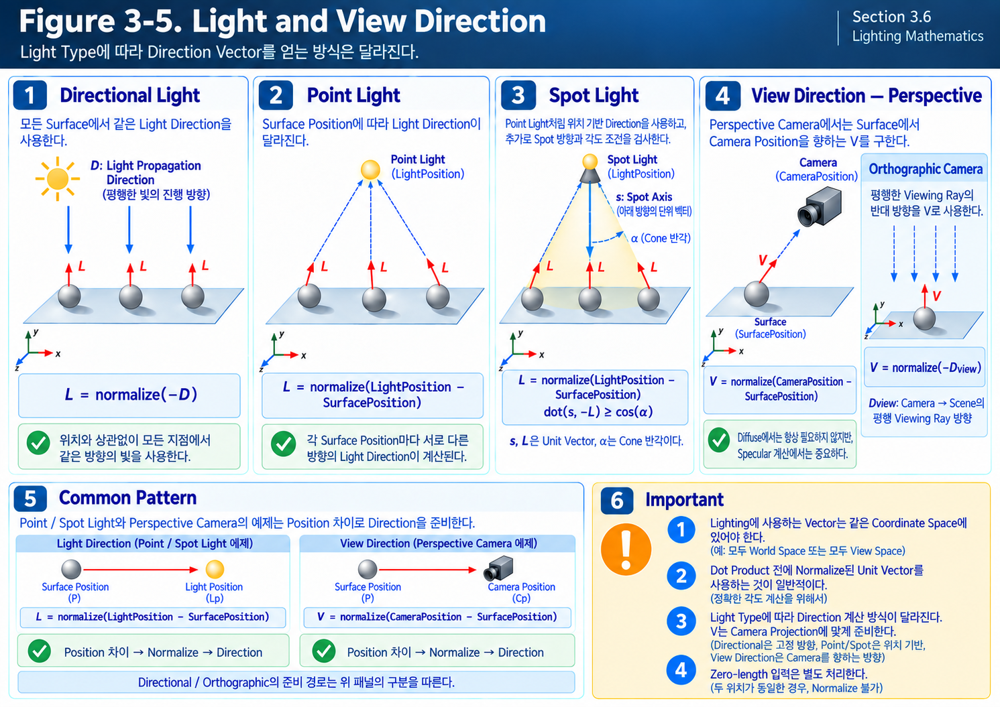
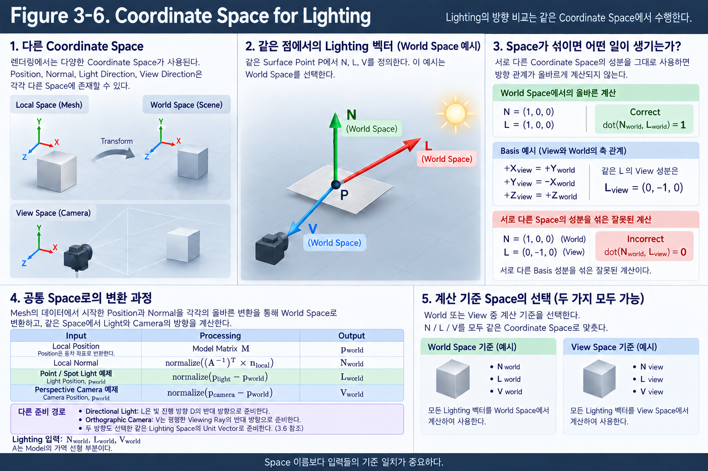

# Chapter 03 — Lighting Mathematics

Rendering Pipeline은 Geometry와 Material, Light 등의 정보를 이용해 화면에 표시할 결과를 만들어가는 과정이다.

Geometry의 위치와 형태가 결정되면 Rasterization을 통해 화면에서 처리할 Surface의 입력 데이터가 준비된다.

Shader는 이 데이터를 받아 해당 Surface가 빛을 어떻게 받는지 계산한다.

여기서 계산한 Lighting 결과는 이후 화면을 만드는 과정에 전달되는 값이다. 곧바로 최종 화면의 Pixel Color와 같은 것은 아니다.

Lighting에서 먼저 확인해야 할 것은 단순히 Light의 밝기가 아니다.

**현재 Surface는 어느 방향을 향하고 있으며, 그 Surface를 기준으로 Light와 Camera는 어느 방향에 있는가?**

같은 Light 아래에서도 Surface가 Light를 정면으로 바라보는지, 옆으로 기울어져 있는지에 따라 결과가 달라진다. Specular Reflection처럼 관찰하는 방향에 따라 달라지는 결과도 있다.

Rendering에서는 이러한 위치와 방향의 관계를 Vector로 표현하고 계산한다.

Chapter 02에서 Coordinate System을 통해 **데이터를 어떤 공간에서 표현하는가**를 살펴봤다면, 이번 Chapter에서는 **그 데이터를 이용해 Surface와 Light의 관계를 어떻게 비교하는가**를 살펴본다.

이번 Chapter의 중심은 다음 흐름을 이해하는 것이다.

> **Surface의 위치와 방향 확인 → Light와 Camera의 방향 준비 → 같은 Coordinate Space로 통일 → 방향의 길이 정리 → 방향 관계 비교**

수식은 이 과정을 이해한 뒤, Shader가 수행하는 계산을 짧게 표현하는 용도로 사용한다. 특히 `Normalize`, `Dot Product`, `NdotL`이 각각 어떤 문제를 해결하는지 이해하는 것이 중요하다.

---

## 3.1 Lighting Inputs

### From Geometry to Surface Data

Chapter 01에서 Vertex는 Position만 전달하는 것이 아니라 Normal, Tangent, UV와 같은 Attribute도 함께 전달하는 단위였다.

이 데이터들은 서로 다른 역할을 한다.

Vertex Position과 Triangle의 연결 관계는 Geometry의 실제 위치와 형태를 결정한다.

Normal은 그 Geometry 위에서 Lighting에 사용할 Surface의 방향을 제공한다.

Tangent는 Surface를 따라가는 기준 방향을 제공하고, UV는 Texture의 어느 위치를 읽을지 연결한다. 이 두 입력의 사용은 Chapter 02의 Tangent Space와 Chapter 04의 Texture Sampling으로 이어진다.

따라서 같은 Geometry라도 Normal이나 Texture 데이터가 다르면 Shading 결과가 달라질 수 있다.

이번 Chapter에서는 이러한 입력 가운데 **위치와 방향의 관계를 계산하는 데 필요한 데이터**에 집중한다. Texture Sampling은 Chapter 04에서, Material의 반사 응답은 Chapter 05에서 이어서 살펴본다.

---

### Required Lighting Data

Lighting을 계산할 때는 먼저 현재 Surface를 기준으로 주변의 관계를 정리해야 한다.

대표적인 입력은 다음 네 가지다.

| Input | Meaning | Role |
|---|---|---|
| Surface Position | 현재 계산할 Surface의 위치 | Light와 Camera의 상대적인 방향을 구하는 기준점 |
| Surface Normal | Shading에서 사용할 Surface의 방향 | Light가 Surface의 어느 쪽에 있는지 판단하는 기준 |
| Light Direction | Surface에서 Light를 향하는 방향 | Surface가 Light를 얼마나 정면으로 바라보는지 비교 |
| View Direction | Surface에서 Camera 쪽을 바라보는 관찰 방향 | Reflection과 Specular처럼 관찰 방향에 따라 달라지는 관계 계산 |

이 가운데 Surface Normal은 `N`, Light Direction은 `L`, View Direction은 `V`로 표기한다.

---

### Surface Position

Surface Position은 **지금 Lighting을 계산하려는 Surface가 어디에 있는가**를 나타낸다.

Pixel Shader 단계에서는 전달된 Surface 데이터를 이용해 현재 처리하는 위치가 Geometry 위의 어느 지점에 해당하는지 알 수 있다.

예를 들어 Point Light가 Scene 안의 특정 위치에 있다고 해보자.

Surface가 Light의 왼쪽에 있는지, 오른쪽에 있는지에 따라 Light를 향하는 방향은 달라진다. 따라서 Light의 위치만 알아서는 충분하지 않고, **어느 Surface 위치에서 Light를 바라보고 있는지**도 알아야 한다.

Surface Position은 이러한 상대적인 방향을 계산하는 기준점이다.

두 Position으로부터 Direction을 만드는 구체적인 방법은 3.6에서 살펴본다.

---

### Surface Normal

Surface Normal은 **현재 Surface가 어느 방향을 향한다고 보고 Lighting을 계산할 것인가**를 나타낸다.

Light가 같은 곳에 있어도 Surface의 방향이 바뀌면 Light와의 관계가 달라진다.

Surface가 Light를 정면으로 바라보면 직접 받는 빛의 기여가 커지고, 옆으로 기울어질수록 줄어든다. 이때 Surface의 방향을 대표하는 기준이 Normal이다.

다만 실제 Geometry의 면에 수직인 Normal과, 부드러운 Shading을 위해 사용하는 Normal은 항상 같지는 않다. 이 차이는 3.4에서 구분한다.

---

### Light Direction

Light Direction은 **현재 Surface에서 Light가 어느 방향에 있는가**를 나타낸다.

Directional Light처럼 Scene의 여러 위치에서 같은 방향을 사용할 수 있는 경우도 있고, Point Light처럼 Surface Position에 따라 방향을 다시 계산해야 하는 경우도 있다.

어떤 방식으로 얻었든 Lighting에서는 이 방향과 Normal을 비교한다.

---

### View Direction

View Direction은 **현재 Surface에서 Camera 쪽을 바라보는 방향**이다.

Surface와 Light의 관계만으로 계산하는 기본적인 Diffuse Lighting에서는 View Direction이 직접 필요하지 않을 수 있다.

반면 Specular Reflection은 같은 Surface와 Light라도 어느 방향에서 관찰하느냐에 따라 결과가 달라진다. 이때 View Direction이 필요하다.

Perspective Camera와 Orthographic Camera에서 이 방향을 준비하는 방식은 3.6에서 구분한다.

---

### From Inputs to Relationships

입력 데이터의 역할을 정리하면 다음과 같다.

**Surface Position**은 방향을 계산할 기준점을 제공한다.

**Normal과 Light Direction**은 Surface가 Light를 얼마나 정면으로 바라보는지 비교하는 데 사용한다.

여기에 **View Direction**이 더해지면 관찰 방향과 관련된 Reflection과 Specular 관계를 계산할 수 있다.

이번 Chapter에서는 먼저 방향을 비교하기 전에 필요한 준비 과정인 Normalize부터 살펴본다.

---

## 3.2 Vector and Normalize

### Direction and Magnitude

같은 방향에서 Light를 받는 두 Surface가 있다고 해보자.

이 Section에서 비교하려는 것은 Light를 얼마나 정면으로 바라보는가다. 따라서 방향이 같다면 방향 비교의 결과도 같아야 한다.

그런데 이 방향을 표현하는 Vector에는 방향뿐 아니라 길이도 들어 있다. 이 길이를 Magnitude라고 한다.

하지만 서로 길이가 다른 Vector가 같은 방향을 가리킬 수도 있다.

다음 두 Vector를 생각해보자.

`A = (4, 2, 0)`

`B = (2, 1, 0)`

A는 B의 각 성분을 두 배로 만든 값이다. 따라서 A의 화살표는 B보다 두 배 길지만, 가리키는 방향은 같다.

Lighting에서 **방향만 비교하려는 상황**이라면 A와 B는 같은 방향으로 취급되어야 한다.

그런데 이후의 계산에 Vector의 길이까지 영향을 준다면, 같은 방향을 가리키고 있어도 서로 다른 결과가 나올 수 있다.

이 문제를 해결하기 위해 사용하는 것이 Normalize다.

---

### What Normalize Does

Normalize는 **Vector의 방향을 유지하면서 길이를 1로 맞추는 과정**이다.

화살표가 가리키는 방향은 그대로 두고, 비교에 사용할 화살표의 길이를 통일한다고 생각하면 된다.

이렇게 길이가 1인 Vector를 Unit Vector라고 한다.

앞의 A와 B를 Normalize하면 둘 다 같은 Unit Vector가 된다.

| Vector | Original Value | Normalized Value |
|---|---|---|
| A | `(4, 2, 0)` | 약 `(0.894, 0.447, 0)` |
| B | `(2, 1, 0)` | 약 `(0.894, 0.447, 0)` |

원래의 길이는 달랐지만 방향이 같았기 때문에 Normalize 이후에는 같은 결과가 나온다.

여기서 중요한 것은 소수점 값을 외우는 것이 아니다.

**Normalize는 방향을 새로 정하는 연산이 아니라, 기존 방향을 유지한 채 길이만 정리하는 연산**이라는 점이다.

---

### How Normalize Works

길이가 서로 다른 화살표를 모두 길이 1로 만들려면, 각 Vector를 자신의 길이만큼 나누면 된다.

예를 들어 어떤 Vector의 길이가 2라면 각 성분을 2로 나눈다. 길이가 5라면 각 성분을 5로 나눈다.

모든 성분에 같은 비율을 적용하므로 방향은 바뀌지 않는다.

Shader에서는 이러한 처리를 다음과 같이 표현한다.

`normalize(Vector)`

이 표현을 읽을 때는 **“이 Vector의 방향은 유지하고 길이를 1로 맞춘다”**라고 이해하면 된다.

**Figure 3-1. Vector and Normalize.** 왼쪽의 두 화살표는 방향이 같고 길이만 다르다. 오른쪽에서는 같은 길이로 정리되어 겹친다. 그림의 길이 계산은 왜 각 Vector를 자신의 길이로 나누는지를 확인하는 보조 표현이다.

---

### Why Normalize Matters in Lighting

Surface가 Light를 얼마나 정면으로 바라보는지 비교하려면 Normal과 Light Direction의 **방향 관계**가 필요하다.

Normal의 길이가 1인지 3인지, Light Direction의 길이가 2인지 10인지가 방향 비교의 결과를 바꾸어서는 안 된다.

따라서 비교에 사용할 두 Vector의 길이를 먼저 통일한다.

`N = normalize(Normal)`

`L = normalize(LightDirection)`

이후에는 두 Vector가 얼마나 같은 방향을 향하는지 비교할 수 있다.

이것이 Normalize와 다음 Section의 Dot Product가 자주 함께 사용되는 이유다.

> **Normalize는 비교 조건을 준비하고, Dot Product는 준비된 두 방향의 관계를 계산한다.**

---

### What Normalize Does Not Fix

Normalize는 길이를 정리하는 연산이므로, 이미 잘못된 방향을 올바른 방향으로 고쳐주지는 않는다.

예를 들어 Normal이 Surface의 반대쪽을 향하고 있다면 Normalize 이후에도 반대쪽을 향한다.

서로 다른 Coordinate Space의 Vector를 Normalize한다고 해서 같은 Space가 되는 것도 아니다.

따라서 다음 세 가지는 별도로 확인해야 한다.

- Vector가 올바른 방향을 가리키는가?
- 비교할 Vector들이 같은 Coordinate Space에 있는가?
- 방향 비교에 사용할 Vector의 길이가 1인가?

---

Implementation Note — Zero-Length Vector

길이가 0인 Zero Vector에는 방향이 없다. 따라서 일반적인 Normalize 계산으로 유효한 방향을 만들 수 없다.

예를 들어 Point Light와 Surface Position이 완전히 같으면, 두 위치의 차이도 0이 된다.

이런 경우에는 입력을 확인하고 별도의 처리 방법을 정해야 한다. 길이가 매우 작은 Vector도 계산이 불안정할 수 있으므로 구현에서는 주의가 필요하다.

여기서는 **Normalize가 존재하지 않는 방향까지 만들어주는 기능은 아니라는 점**을 기억하면 된다.

---

## 3.3 Dot Product

### The Question Lighting Needs to Answer

Lighting에서 먼저 알고 싶은 것은 다음과 같다.

**현재 Surface는 Light를 얼마나 정면으로 바라보고 있는가?**

사람은 그림을 보고 이 관계를 판단할 수 있지만, Shader에서는 계산에 사용할 숫자가 필요하다.

따라서 Surface Normal과 Light Direction의 관계를 하나의 Scalar 값으로 표현해야 한다.

이 Section에서는 다음 조건으로 비교한다.

**N과 L은 같은 Coordinate Space에 있으며, 둘 다 Normalize된 Unit Vector다.**

---

### Comparing Two Directions

우리가 원하는 결과를 먼저 생각해보자.

Normal과 Light Direction이 같은 방향이면 Surface는 Light를 정면으로 바라보고 있다. 따라서 가장 큰 값을 얻어야 한다.

Light가 옆으로 이동하여 Normal과 Light Direction이 수직이 되면 정면을 향하는 관계는 0이 된다.

Light가 Surface의 뒤쪽으로 넘어가면 앞쪽과 뒤쪽을 구분할 수 있도록 음수 값을 얻는다.

이러한 방향 관계를 하나의 값으로 계산하는 연산이 Dot Product다.

두 Unit Vector를 비교하면 다음과 같은 결과를 얻는다.

| Angle Between N and L | Direction Relationship | Dot Product |
|---|---|---|
| `0°` | 같은 방향 | `1` |
| `45°` | 비슷한 방향 | 약 `0.707` |
| `90°` | 서로 수직 | `0` |
| `135°` | 반대쪽으로 기울어진 방향 | 약 `-0.707` |
| `180°` | 완전히 반대 방향 | `-1` |

핵심은 두 방향 사이의 관계를 **양수, 0, 음수와 그 크기**로 읽을 수 있다는 것이다.

각도를 직접 구하지 않아도 이 값으로 방향 관계를 비교할 수 있다.

---

### NdotL

Surface Normal과 Light Direction의 Dot Product를 일반적으로 NdotL이라고 부른다.

이름 그대로 **N과 L을 Dot Product한 값**이다.

`NdotL = dot(N, L)`

여기서 `dot()`은 두 Vector를 비교해 하나의 Scalar 값을 반환하는 연산을 의미한다.

따라서 다음과 같이 읽을 수 있다.

- `NdotL = 1`이면 N과 L이 같은 방향이다.
- `NdotL = 0`이면 N과 L이 서로 수직이다.
- `NdotL < 0`이면 L이 N의 반대쪽 반공간에 있다.

NdotL은 이후 Lighting에 사용할 기본적인 방향 계수다.

---

### Connecting the Result to the Formula

앞에서 확인한 값들은 두 방향 사이의 각도와 연결되어 있다.

두 Vector 사이의 각도를 `θ`라고 표기한다.

Cosine은 각도에 따라 값을 반환하는 함수이며, 여기서 필요한 관계는 다음과 같다.

**0°에서는 1, 90°에서는 0, 180°에서는 -1이다.**

이 변화는 앞에서 살펴본 두 Unit Vector의 Dot Product 결과와 같다.

따라서 N과 L이 Unit Vector라면 다음과 같이 표현할 수 있다.

`dot(N, L) = cosθ`

이 식은 새로운 계산 절차를 추가하는 것이 아니다.

**앞에서 이해한 방향 관계를 수학적으로 표현한 것**이다.

실제 사용에서는 N과 L을 Dot Product하면 되므로, 먼저 각도를 구한 뒤 Cosine을 계산할 필요는 없다.

또한 이 관계를 그대로 사용하려면 두 입력이 Unit Vector여야 한다. 일반적인 Vector는 길이도 Dot Product 결과에 영향을 주기 때문에, 결과가 항상 `-1~1` 범위에 들어오는 것은 아니다.

---

### NdotL Is Not the Final Brightness

NdotL이 크다고 해서 그 값 자체가 최종 화면의 밝기인 것은 아니다.

NdotL이 표현하는 것은 먼저 **Surface의 방향과 Light Direction의 관계**다.

이 방향 관계를 실제 Diffuse Lighting에 어떻게 반영하는지는 Lighting Model의 역할이다.

따라서 다음 두 개념을 구분해야 한다.

**NdotL은 방향 관계를 나타내는 입력값이고, Lighting 결과는 그 입력을 반사 응답 등과 결합해 얻는 값이다.**

이 연결은 Chapter 05의 5.4 Lambert에서 이어서 살펴본다.

---

### Removing Negative Values

NdotL의 음수 값은 Light가 Surface Normal의 반대쪽에 있다는 의미다.

여기서 다루는 One-sided Opaque Surface 앞면의 기본적인 Diffuse Lighting에서는 이 음수를 그대로 음수 밝기로 사용하지 않는다.

앞면에 기여하지 않는 방향은 0으로 처리할 수 있다.

이때 다음 연산을 사용한다.

`max(NdotL, 0)`

`max()`는 두 값 중 큰 값을 선택한다. 따라서 NdotL이 양수이면 그대로 사용하고, 음수이면 0을 사용한다.

Shader에서는 다음 표현도 자주 사용한다.

`saturate(NdotL)`

`saturate()`는 입력값을 `0~1` 범위로 제한한다.

예를 들어 NdotL이 `-0.5`라면 결과는 0이 된다. NdotL이 `0.5`라면 그대로 `0.5`를 사용한다.

N과 L이 Unit Vector라면 NdotL은 `-1~1` 범위이므로, 두 방법은 같은 방향 계수를 만든다.

다만 두 연산의 역할 자체가 같은 것은 아니다.

**`max(NdotL, 0)`은 음수만 제한하고, `saturate(NdotL)`는 1보다 큰 값도 제한한다.**

따라서 입력을 Normalize하지 않아 Dot Product가 1을 넘을 수 있는 상태라면 두 결과가 달라질 수 있다.

---

### Signed NdotL and Clamped Factor

음수를 포함한 원래 NdotL과, 음수를 제거한 값은 구분해서 사용해야 한다.

| Value | Meaning |
|---|---|
| Signed NdotL | 앞쪽과 뒤쪽을 포함한 원래의 방향 관계 |
| Clamped Diffuse Factor | 앞면의 기본적인 Diffuse 계산에 사용하기 위해 음수를 제거한 방향 계수 |

음수를 제거하면 앞쪽과 뒤쪽을 구분하던 정보 일부가 사라진다.

따라서 모든 상황에서 무조건 먼저 `saturate()`를 적용하는 것이 아니라, **이후 계산에 어떤 정보가 필요한지**에 따라 원래 값을 유지할지 결정해야 한다.

이 구분은 Chapter 07의 Remap에서도 다시 사용한다.

Dot Product의 핵심은 복잡한 성분 계산을 외우는 것이 아니다.

**두 방향의 관계를 Shader가 사용할 수 있는 하나의 값으로 바꾸는 것**이다.

**Figure 3-2. Dot Product and Direction Factor.** 위쪽의 Signed Dot Product와 아래쪽의 Clamped Factor를 나누어 읽는다. 두 값 모두 최종 화면 밝기는 아니다.

### Key Takeaways

- Normalize는 비교할 방향의 길이를 맞추고, Dot Product는 두 방향의 관계를 Scalar로 바꾼다.
- 같은 Space의 Unit Vector를 비교할 때 NdotL은 두 방향 사이 각도의 Cosine으로 읽을 수 있다.
- Signed NdotL과 Clamped Diffuse Factor는 보존하는 정보가 다르다.
- 방향 계수에 Material의 응답과 Light의 기여가 결합되어야 Lighting 결과가 만들어진다.

---

## 3.4 Surface Normal

### What Is a Surface Normal?

앞 Section에서는 Normal을 Surface 방향의 기준으로 사용했다.

그런데 같은 Low Poly Mesh도 어떤 설정에서는 면마다 각져 보이고, 다른 설정에서는 부드러운 곡면처럼 보인다.

Vertex Position을 바꾸지 않았는데도 이런 차이가 생긴다면, Lighting에서 비교하는 방향은 어디에서 달라진 것일까?

이 질문을 이해하려면 실제 Geometry의 면 방향과 Shading에 사용할 방향을 나누어 살펴봐야 한다. 먼저 그 기준이 되는 Surface Normal을 확인한다.

먼저 Geometry의 표면을 기준으로 생각하면, Normal은 **그 Surface에 수직인 방향**이다.

평평한 Plane에서는 여러 위치의 Normal이 같은 방향을 가리킬 수 있다.

반면 Sphere처럼 휘어진 Surface에서는 위치에 따라 표면의 방향이 달라지므로 Normal도 달라진다. 위쪽에서는 위를 향하고, 옆쪽에서는 바깥쪽을 향한다.

즉 Normal은 Object 전체를 대표하는 하나의 방향이 아니라, **Surface의 각 위치에서 사용하는 방향 정보**다.

여기서 먼저 구분할 것은 Geometry의 실제 면 방향과 Shading에서 사용하는 방향이다.

---

### Face Normal

Triangle의 세 Vertex는 하나의 평면을 만든다.

이 면에 수직인 방향이 Face Normal이다.

면을 따라가는 방향과 면에 수직인 방향은 서로 다르다. Face Normal을 구하려면 먼저 면이 어떻게 놓여 있는지 알아야 한다.

Triangle에서는 같은 Vertex에서 출발하는 두 Edge를 사용할 수 있다. 두 Edge가 면을 따라가는 서로 다른 방향을 제공하기 때문이다.

이처럼 **두 방향에 모두 수직인 방향을 얻는 연산**이 Cross Product다.

두 Edge를 `EdgeA`, `EdgeB`라고 하면 계산의 의미를 다음과 같이 정리할 수 있다.

> **두 Edge 준비 → Cross Product로 수직 방향 생성 → Normalize로 길이를 1로 정리**

이 흐름을 짧게 표현하면 다음과 같다.

`FaceNormal = normalize(cross(EdgeA, EdgeB))`

여기서는 Cross Product의 성분 계산을 직접 전개하는 것보다, **두 Edge가 만드는 면의 수직 방향을 얻는다**는 역할을 이해하는 것이 중요하다.

수직 방향에는 서로 반대인 두 방향이 있다. 두 Edge의 순서를 바꾸면 Cross Product의 방향도 반대로 바뀐다.

따라서 Face Normal의 방향은 Vertex가 나열되는 순서인 Winding과 연결되며, Renderer의 Front-Face 규칙도 함께 확인해야 한다.

Technical Note — Degenerate Geometry

세 Vertex가 일직선에 있거나 중복되어 Triangle의 면적이 0이라면 이 방식으로 유효한 Face Normal을 만들 수 없다. 또한 하나의 평면에 놓이지 않은 Polygon은 Triangle 단위로 해석해야 한다.

이 조건은 정상적인 Triangle의 설명을 바꾸는 예외가 아니라, Normal을 만들 입력 Geometry가 유효한지 확인하는 조건이다.

---

### Vertex Normal

모든 Polygon이 자신의 Face Normal만 사용하면 각 면의 방향 차이가 Lighting에 그대로 드러난다.

하지만 Character나 곡면 형태의 Asset에서는 표면이 부드럽게 이어져 보이기를 원하는 경우가 많다.

이를 위해 Vertex에 별도의 Normal 방향을 저장할 수 있다. 이것이 Vertex Normal이다.

Vertex Normal은 주변 Face의 방향을 바탕으로 생성되거나, DCC Tool에서 Artist가 조정한 방향을 사용할 수 있다.

여기서 중요한 점은 다음과 같다.

**Vertex Normal은 반드시 특정 Triangle의 실제 Face Normal과 같아야 하는 값이 아니다.**

Geometry의 실제 방향과, Shading에서 Surface가 향한다고 가정하는 방향을 다르게 사용할 수 있다.

이 구분을 위해 Geometry의 실제 방향을 나타내는 Normal을 Geometric Normal, Shading 계산에 사용하는 방향을 Shading Normal이라고 부른다.

---

### Smooth Shading and Flat Shading

같은 Low Poly Sphere를 생각해보자.

각 Triangle이 자신의 Face Normal을 그대로 사용하면 Triangle마다 Lighting의 기준 방향이 달라진다. 그 결과 면과 면의 경계가 눈에 띈다.

이것이 Flat Shading이다.

반대로 Vertex Normal이 주변 Surface의 흐름을 따라 부드럽게 이어지도록 설정되어 있다면, Triangle 내부에서도 Lighting 방향을 점진적으로 바꿀 수 있다.

그 결과 실제 Geometry는 그대로여도 부드러운 곡면처럼 보인다.

이것이 Smooth Shading의 기본 원리다.

다만 Smooth Shading이 Geometry 자체를 부드럽게 만드는 것은 아니다.

**Vertex Position과 Triangle 구조는 그대로이며, 달라지는 것은 Lighting에서 사용하는 Normal 방향이다.**

따라서 Silhouette는 여전히 실제 Polygon Geometry에 의해 결정된다.

---

### From Vertex Normal to Pixel Normal

Vertex에 저장된 Normal을 Pixel 단위의 Lighting에서 사용하려면, Triangle 내부의 각 위치에서 사용할 방향이 필요하다.

Rasterization 과정에서는 Vertex Attribute가 Triangle 내부의 위치에 맞게 Interpolation된다. Normal도 이 방식으로 전달될 수 있다.

> **Vertex Normal → Interpolation → 현재 Pixel에서 사용할 Normal**

서로 다른 Vertex Normal 사이를 점진적으로 이어주므로, Vertex 수가 적어도 Triangle 내부의 각 Pixel은 조금씩 다른 Shading 방향을 사용할 수 있다.

다만 **길이가 1인 Vector들을 보간했다고 해서 결과의 길이도 항상 1이 되는 것은 아니다.**

두 화살표가 서로 다른 방향을 가리키면 그 사이의 값을 만드는 과정에서 일부 성분이 서로 상쇄될 수 있기 때문이다. 따라서 방향을 부드럽게 이어주는 Interpolation과 길이를 통일하는 Normalize는 서로 다른 일을 한다.

따라서 Lighting에서 방향을 비교하기 전에는 다시 Normalize한다.

`N = normalize(InterpolatedNormal)`

이것은 방향을 임의로 바꾸는 처리가 아니라, 보간 후의 방향을 유지하면서 길이를 다시 정리하는 과정이다.

**Figure 3-3. Surface Normal and Shading.** Face Normal은 실제 Triangle 면의 방향을, Vertex Normal은 Shading에 사용할 방향을 제공한다. Smooth Shading에서는 Normal의 변화가 부드러워지지만 Geometry와 Silhouette는 그대로다. 그림의 Unit Vector 설명은 Lighting에 사용하기 위해 길이를 정리한 상태를 뜻한다.

---

### Normal and Lighting Debugging

Position과 Normal은 서로 다른 정보를 제공한다.

**Position은 Surface가 어디에 있는지, Normal은 Lighting에서 Surface가 어느 방향을 향하는지를 나타낸다.**

따라서 Geometry가 정상이어도 Normal이 의도와 다르면 Lighting이 이상하게 보일 수 있다.

예를 들어 Surface가 반대 방향으로 밝아지거나, Polygon 경계가 예상보다 강하게 드러나거나, 곡면의 Lighting이 울퉁불퉁하게 보일 수 있다.

이런 경우에는 Material 값만 바꾸기보다 다음을 먼저 확인한다.

- Face Normal과 Vertex Normal이 의도한 방향을 향하는가?
- Smooth Shading과 Flat Shading이 의도대로 설정되어 있는가?
- 보간된 Normal을 적절히 Normalize했는가?
- Lighting과 같은 Coordinate Space의 Normal을 사용하고 있는가?

마지막 항목을 이해하기 위해 다음 Section에서는 Normal Transformation을 살펴본다.

---

## 3.5 Normal Transformation

### Why Normal Transformation Is Needed

Mesh의 Vertex Normal은 일반적으로 Mesh의 Local Space를 기준으로 저장된다.

하지만 Lighting을 계산할 때 사용하는 Light Direction은 World Space로 준비되어 있을 수 있다.

이 상태에서는 두 방향의 숫자를 바로 비교할 수 없다. 서로 다른 기준축을 사용하고 있기 때문이다.

따라서 Lighting을 World Space에서 계산한다면 Normal도 World Space로 변환해야 한다.

> **Local Normal → World Normal → Lighting Calculation**

이때 Normal은 Position과 역할이 다르기 때문에, 변환 방식에도 주의가 필요하다.

---

### Normal Starts in Local Space

어떤 Mesh의 Local Normal이 다음과 같다고 해보자.

`Nlocal = (0, 0, 1)`

이 값은 해당 Surface가 **Mesh의 Local Z축 방향을 향한다**는 의미다.

Mesh가 World에서 회전하면 Local Z축이 가리키는 World 방향도 달라진다. 따라서 같은 Local Normal이라도 Object의 회전에 따라 World Normal은 달라질 수 있다.

Local Normal은 Mesh 자체를 기준으로 한 방향 정보이고, World Normal은 현재 Object의 배치를 반영한 방향 정보라고 구분하면 된다.

---

### Translation and Rotation

Object를 오른쪽으로 이동시키면 Surface Position은 바뀐다.

하지만 이동만 했다고 해서 Surface가 바라보는 방향까지 바뀌지는 않는다.

따라서 **Translation은 Normal 방향에 적용하지 않는다.**

Rotation은 다르다.

Object가 회전하면 Surface도 함께 회전하므로 Normal도 같은 회전을 따라가야 한다.

| Transform | Geometry에서 일어나는 변화 | Normal에서 필요한 처리 |
|---|---|---|
| Translation | 위치가 이동함 | 방향은 그대로 유지 |
| Rotation | Surface의 방향이 회전함 | Surface와 함께 회전 |
| Positive Uniform Scale | 모든 축이 같은 양의 비율로 늘어남 | 방향은 유지되며 필요하면 길이를 다시 정리 |
| Non-Uniform Scale | 축별로 다른 비율로 늘어남 | 변형된 Surface에 맞도록 방향을 별도로 보정 |

Rotation만 생각하면 Surface와 Normal을 함께 돌리면 되므로 이해하기 쉽다.

문제는 축마다 서로 다른 Scale이 적용될 때다.

---

### Why Non-Uniform Scale Needs Special Handling

비스듬한 Surface를 X축 방향으로만 늘린다고 생각해보자.

Surface는 가로로 더 길어지면서 기울기가 달라질 수 있다.

이때 Normal이 해야 할 일은 **변형된 Surface에 수직인 방향을 계속 나타내는 것**이다.

그런데 Normal도 Geometry와 똑같이 가로로 늘리면, 변형된 Surface에 더 이상 수직이 아닐 수 있다.

즉 Non-Uniform Scale이 올바른 Normal 자체를 없애는 것은 아니다.

변형된 Geometry에도 그 면에 수직인 방향은 존재한다. 문제는 **기존 Normal에 적용한 변환 방식이 그 방향을 제대로 만들어주지 못하는 것**이다.

---

### The Perpendicular Relationship

이 관계를 보기 위해 Surface를 따라가는 방향 하나를 생각해보자.

이런 방향을 Tangent라고 한다.

Tangent는 Surface를 따라가고, Geometric Normal은 그 Surface에 수직이다. 따라서 두 방향은 서로 직각이어야 한다.

3.3에서 Dot Product가 0이면 두 방향이 수직이라는 점을 살펴봤다.

Tangent를 `T`, Normal을 `N`이라고 하면 이 조건은 다음과 같이 표현할 수 있다.

`dot(T, N) = 0`

이 값은 곧 이어질 예제에서 **Normal이 여전히 Surface에 수직인지 확인하는 기준**으로만 사용한다.

여기서는 먼저 Geometric Normal과 실제 Surface의 관계로 변환 원리를 설명한다. 앞에서 구분한 Artist 조정이나 보간에 의한 Shading Normal이 모든 Triangle의 실제 면에 수직이라는 뜻은 아니다.

---

### A Small Non-Uniform Scale Example

3D 전체보다 2D 단면으로 보면 변화를 이해하기 쉽다.

X축은 오른쪽, Y축은 위쪽이라고 생각하자.

Surface를 따라가는 Tangent가 다음과 같다고 해보자.

`T = (1, 1)`

오른쪽으로 1, 위로 1만큼 향하므로 오른쪽 위로 기울어진 방향이다.

여기에 수직인 Normal은 다음 방향으로 둘 수 있다.

`N = (-1, 1)`

왼쪽 위를 향하는 방향이며, T와 직각을 이룬다.

이 예제의 Vector들은 계산을 단순하게 보여주기 위한 값이다. 아직 길이를 1로 맞춘 상태는 아니다.

---

#### Stretching the Surface

이제 X축만 두 배로 늘린다.

Surface를 따라가는 Tangent도 Geometry와 함께 가로로 늘어난다.

`T: (1, 1) → (2, 1)`

원래보다 가로 방향의 비중이 커졌으므로 Surface는 더 완만하게 기울어진다.

그렇다면 Surface에 수직인 Normal은 상대적으로 더 위쪽을 향해야 한다.

---

#### Applying the Same Scale to the Normal

그런데 Normal에도 똑같이 X축 두 배 Scale을 적용하면 다음과 같다.

`N: (-1, 1) → (-2, 1)`

Normal도 가로 방향으로 더 눕게 된다.

Surface는 가로로 완만해졌는데 Normal까지 가로로 눕기 때문에, 두 방향의 직각 관계가 깨진다.

Dot Product로 확인해도 결과는 0이 아니다.

`dot((2, 1), (-2, 1)) = -3`

이것이 Normal에 Geometry와 같은 Scale을 그대로 적용하면 안 되는 이유다.

여기서 잘못된 Normal을 Normalize해도 문제는 해결되지 않는다.

**Normalize는 길이만 바꾸므로, 이미 틀어진 방향과 수직 관계는 고쳐주지 못한다.**

---

#### Correcting the Normal Direction

이번에는 Normal의 X성분을 두 배로 늘리는 대신 절반으로 줄여보자.

`N: (-1, 1) → (-0.5, 1)`

가로 성분이 줄었으므로 Normal은 더 위쪽을 향한다.

이 방향을 변형된 Tangent와 비교하면 다음과 같다.

`dot((2, 1), (-0.5, 1)) = 0`

수직 관계가 다시 유지된다.

즉 이처럼 축에 맞춘 Scale만 있는 예제에서는,

**Geometry의 X축이 두 배로 늘어났을 때 Normal의 X성분은 반대로 절반으로 보정하면 된다.**

여기서 Scale에 대한 **역방향 보정**이 필요하다는 점을 이해할 수 있다.

---

#### Direction and Unit Length

보정된 `(-0.5, 1)`은 올바른 방향을 가리키지만 아직 Unit Vector는 아니다.

`(-1, 2)` 역시 같은 방향을 가리키지만 길이가 1은 아니다.

Lighting에 사용하기 위해 Normalize하면 약 `(-0.447, 0.894)`가 된다.

| State | Value | Meaning |
|---|---|---|
| Corrected Normal | `(-0.5, 1)` | 수직 관계를 회복한 방향 |
| Same Direction at Another Length | `(-1, 2)` | 같은 방향이지만 다른 길이 |
| Normalized Normal | 약 `(-0.447, 0.894)` | 같은 방향을 길이 1로 정리한 값 |

따라서 **방향을 올바르게 보정하는 것과 길이를 1로 맞추는 것은 서로 다른 단계**다.

---

### From Inverse Scale to Inverse Transpose

앞의 예제는 Rotation 없이 X축 Scale만 적용한 단순한 경우였다.

이런 경우에는 축별 Scale의 반대 비율을 적용하는 방식으로 Normal을 보정할 수 있었다.

하지만 실제 Transform에는 Rotation과 Scale 등이 함께 들어갈 수 있다. 따라서 모든 상황을 단순히 “World X성분을 절반으로 줄인다”는 방식으로 처리할 수는 없다.

필요한 것은 다음 두 조건을 함께 만족하는 변환이다.

**Surface가 회전하면 Normal도 함께 회전해야 한다.**

**축별 변형으로 Surface의 기울기가 바뀌면 Normal은 수직 관계를 유지하도록 보정되어야 한다.**

이러한 관계를 일반적인 Matrix Transform으로 처리할 때 사용하는 것이 Inverse Transpose Matrix다.

이름을 나누어 보면 다음과 같다.

Inverse는 원래 변환을 되돌리는 Matrix를 구하는 연산이다. 단순한 Scale에서는 두 배를 절반으로 바꾸는 관계와 연결된다.

Transpose는 Matrix의 행과 열을 바꾸는 연산이다.

두 연산을 결합한 Inverse Transpose는 Normal 변환에 필요한 수직 관계를 유지하도록 사용한다.

여기서 **Inverse라는 이름 때문에 Normal이 Object와 반대로 회전한다고 이해해서는 안 된다.**

Normal은 Surface와 함께 회전해야 한다. 앞에서 확인한 역방향 보정은 Scale에 대한 직관이며, 일반적인 Transform 전체를 단순히 반대로 적용한다는 뜻은 아니다.

---

### Reading the Normal Matrix Formula

이제 이 변환을 수식으로 표현할 수 있다.

먼저 `M`은 Local Space에서 World Space로 가는 Transform 가운데, Translation을 제외한 선형 3×3 부분을 의미한다.

이 M으로 Normal 전용 변환 Matrix를 다음과 같이 만든다.

`NormalMatrix = transpose(inverse(M))`

이것을 Normal Matrix라고 부른다.

앞에서 살펴본 과정을 연결하면 다음과 같다.

> **Local Normal → Normal Matrix로 방향 변환 → Normalize → World Normal**

이를 짧게 표현하면 다음과 같다.

`Nworld = normalize(NormalMatrix × Nlocal)`

이 식에서 Matrix를 적용하는 단계는 변형된 Surface에 맞는 방향을 준비한다.

Normalize 단계는 그렇게 준비된 방향의 길이를 1로 정리한다.

따라서 Inverse Transpose를 배우는 핵심은 행렬 전개를 외우는 것이 아니라 다음 차이를 이해하는 것이다.

> **Position Transform은 Geometry의 위치와 형태를 변환하고, Normal Transform은 그 결과에 맞는 Surface 방향을 준비한다.**

**Figure 3-4. Normal Transformation.** 원래 Tangent, 변형된 Tangent, 같은 Scale을 적용한 잘못된 Normal, 보정한 Normal 순서로 읽는다. 그림의 `(-1, 2)`와 본문의 `(-0.5, 1)`은 길이가 다르지만 같은 방향이다. 이 수직 관계의 설명은 Geometric Normal을 기준으로 한다.

---

Implementation Note — Matrix Convention and Zero Scale

위 표기는 Chapter 02와 같은 Column Vector 기준이며, Matrix를 Vector의 왼쪽에서 곱하는 형태다.

다른 Engine이나 코드로 옮길 때는 Matrix와 Vector의 곱셈 순서 및 표기 규약을 확인해야 한다.

또한 Inverse Transpose는 M의 Inverse가 존재하는 경우에 사용할 수 있다.

어떤 축의 Scale이 0이면 그 축의 정보가 사라지므로, 해당 Transform에는 이 식을 그대로 적용할 수 없다. 이런 경우는 유효한 Transform을 사용하도록 제한하거나 별도의 처리 방법이 필요하다.

전체 4×4 Position Transform에 Translation을 포함한 채 Normal을 Position처럼 처리하는 것도 아니다.

---

### Why This May Not Look Wrong in a DCC Tool

DCC Tool에서 Non-Uniform Scale을 적용해도 Normal이 Surface와 어긋나는 모습을 직접 보지 못할 수 있다.

화면에 표시되는 단계에서는 이미 Normal 변환이나 재계산이 처리된 결과를 보고 있을 수 있기 때문이다.

따라서 이 Section의 설명은 “Non-Uniform Scale을 사용하면 DCC Tool에서 항상 잘못된 Shading이 나타난다”는 뜻이 아니다.

**Renderer나 Shader가 올바른 결과를 만들기 위해 Normal을 왜 별도로 처리해야 하는가**에 대한 설명이다.

---

### Why Normalize Again?

Normal 변환이 올바르게 끝났더라도 Vector의 길이가 1이라고 보장할 수는 없다.

또한 3.4에서 살펴본 것처럼 Rasterization 과정에서 Normal이 Interpolation되면 길이가 다시 달라질 수 있다.

따라서 방향을 비교하는 Lighting 계산 직전에는 Unit Vector 상태인지 확인해야 한다.

예를 들어 Vertex Normal을 World Space로 변환해 전달하는 흐름은 다음과 같다.

> **Mesh Local Normal → Normal Transformation → World Space Normal → Interpolation → Normalize → Light Direction과 비교**

이 과정에서 확인해야 할 것은 두 가지다.

**Transform이 올바른 방향을 만들었는가?**

**최종 방향 비교에 사용할 길이가 1인가?**

이 둘을 함께 만족해야 NdotL을 올바르게 해석할 수 있다.

### Key Takeaways

- Translation은 Normal 방향을 바꾸지 않으며, Rotation은 Surface와 Normal을 함께 회전시킨다.
- Non-Uniform Scale에서는 변형된 Surface에 맞는 방향 보정이 필요하다.
- Inverse Transpose는 방향을 준비하고, Normalize는 그 방향의 길이를 정리한다.
- 올바른 Normal Transform을 적용했어도 Interpolation 뒤에는 Unit Length를 다시 확인한다.

---

## 3.6 Light and View Direction

### Start with a Direction Convention

지금까지 Surface의 방향인 Normal을 준비했다.

이제 Surface를 기준으로 Light와 Camera가 어느 방향에 있는지 알아야 한다.

방향을 계산하기 전에 먼저 Vector가 어디에서 출발해서 어디를 향하는지 정한다.

이 Foundation에서는 다음 기준을 사용한다.

| Symbol | Direction Convention |
|---|---|
| L | Surface → Light |
| V | Surface → Camera 쪽의 관찰 방향 |

Light Direction이라는 이름이 항상 이 방향을 뜻하는 것은 아니다.

어떤 Engine이나 API는 빛이 실제로 진행하는 **Light → Surface** 방향을 제공할 수도 있다. 이 방향은 이 문서에서 사용하는 L과 반대다.

따라서 외부에서 받은 Light Direction을 사용할 때는 변수 이름뿐 아니라 방향의 정의도 확인해야 한다. 반대 방향을 그대로 Dot Product에 사용하면 결과의 부호도 반대로 바뀐다.

---

### Direction from Two Positions

어떤 위치에서 다른 위치를 향하는 방향을 구하려면, **출발점을 기준으로 목적지가 얼마나 떨어져 있는지**를 계산하면 된다.

목적지의 Position에서 출발점의 Position을 빼면 이 상대적인 차이를 얻을 수 있다.

`TargetPosition - StartPosition`

이 결과는 출발점에서 목적지를 향하는 Vector다.

다만 아직은 방향뿐 아니라 두 위치 사이의 거리도 길이에 포함되어 있다.

방향 비교에 사용하려면 앞에서 배운 Normalize를 적용한다.

`Direction = normalize(TargetPosition - StartPosition)`

이 식은 다음 순서로 읽으면 된다.

**두 위치의 차이로 목적지를 향하는 Vector를 만든 뒤, 길이를 1로 맞춘다.**

이때 두 Position은 먼저 같은 Coordinate Space에 있어야 한다.

---

### Directional Light

Directional Light는 매우 멀리 있는 광원에서 들어오는 빛을 단순화한 형태다.

태양빛처럼 광원이 충분히 멀리 있다면 작은 Scene 안에서는 빛이 거의 평행하게 들어온다고 볼 수 있다.

따라서 Directional Light에서는 Surface Position이 달라져도 기본적인 Light Direction은 같다.

Point Light처럼 각 Surface에서 Light Position까지의 차이를 계산하는 것이 아니라, Light의 방향 정보를 사용한다.

다만 그 정보가 **빛의 진행 방향인지, Surface에서 Light를 향하는 방향인지**는 확인해야 한다.

---

### Point Light

Point Light는 Scene 안의 특정 Position에 존재한다.

따라서 Surface가 어디에 있는지에 따라 Light를 향하는 방향이 달라진다.

출발점은 Surface Position이고, 목적지는 Light Position이다.

앞에서 살펴본 두 Position의 관계를 적용하면 다음과 같다.

`L = normalize(LightPosition - SurfacePosition)`

이 결과는 현재 Surface에서 Point Light를 향하는 Unit Vector다.

따라서 같은 Point Light를 계산하더라도 Surface 위치마다 L이 다를 수 있다.

---

### Spot Light

Spot Light도 특정 Position을 가지므로, Surface에서 Light를 향하는 L은 Point Light와 같은 방식으로 준비할 수 있다.

하지만 L을 구하는 것만으로는 충분하지 않다.

Spot Light는 모든 방향이 아니라 특정 Spot Direction과 Cone Angle 안으로 빛을 내보낸다.

따라서 추가로 **현재 Surface가 Spot Cone 안에 들어오는지** 확인해야 한다.

Spot Light에서는 다음 두 관계를 구분한다.

**Surface에서 Light를 향하는 방향을 구하는 것**

**Surface가 Light의 조사 범위 안에 있는지 판단하는 것**

첫 번째는 Point Light와 공통이고, 두 번째가 Spot Light에 추가되는 조건이다.

---

### View Direction for a Perspective Camera

Perspective Camera에서는 Surface에서 Camera Position을 향하는 방향을 구한다.

출발점은 Surface Position이고, 목적지는 Camera Position이다.

`V = normalize(CameraPosition - SurfacePosition)`

이 결과는 현재 Surface에서 Camera를 향하는 Unit Vector다.

Surface Position이나 Camera Position이 달라지면 이 방향도 달라질 수 있다.

Specular Reflection처럼 관찰 방향에 따라 달라지는 계산에서는 V가 중요한 입력이 된다.

한 Camera를 사용해도 화면의 서로 다른 Surface 위치에서는 Camera를 향하는 방향이 다를 수 있다. 따라서 V는 Camera의 Forward Direction을 모든 Surface에 그대로 복사한 값이 아니다.

---

### View Direction for an Orthographic Camera

Orthographic Camera에서는 Perspective Camera와 같은 Position 차이 계산을 그대로 사용하지 않는다.

Orthographic Camera의 Viewing Ray는 서로 평행하므로, 각 Surface에서 하나의 Camera Position으로 모이는 방향을 만드는 것이 적절하지 않다.

대신 **평행한 Viewing Ray의 반대 방향**을 V로 사용한다.

따라서 View Direction을 준비할 때는 Camera의 Projection 방식을 확인해야 한다.

---

### Comparing the Input Sources

방향을 만드는 방법을 정리하면 다음과 같다.

| Input | Direction Source | Additional Check |
|---|---|---|
| Directional Light의 L | Light의 방향 정보 | 제공된 Vector의 부호 방향 |
| Point Light의 L | Light Position과 Surface Position의 차이 | 같은 Coordinate Space와 Normalize |
| Spot Light의 L | Light Position과 Surface Position의 차이 | Spot Cone 내부 여부 |
| Perspective Camera의 V | Camera Position과 Surface Position의 차이 | 같은 Coordinate Space와 Normalize |
| Orthographic Camera의 V | 평행한 Viewing Ray의 반대 방향 | Projection 방식 |

Light Direction과 View Direction은 Light와 Camera의 Position 자체가 아니다.

**현재 Surface를 기준으로 방향 관계를 비교하기 위해 준비한 Vector**다.

**Figure 3-5. Light and View Direction.** Directional Light의 빛 진행 방향 D와 Surface → Light 방향 L은 서로 반대다. Point/Spot Light에서는 같은 Space의 Position 차이로 L을 준비한다. 그림은 Camera Position 차이로 V를 만드는 **Perspective Camera 예제**와, 평행 Viewing Ray의 반대 방향을 V로 사용하는 **Orthographic Camera 경로**를 별도로 구분한다.

다음 Section에서는 이렇게 준비한 N, L, V를 하나의 Lighting 계산에 연결한다.

---

## 3.7 Coordinate Space for Lighting

### Bringing the Inputs Together

지금까지 각 입력을 준비하는 방법을 살펴봤다.

Normal은 Surface의 Shading 방향에서 출발해 필요한 Space로 변환한다.

Light Direction은 Light의 종류에 따라 방향 정보나 Position 차이로 만든다.

View Direction은 Camera의 Projection 방식에 맞게 준비한다.

이제 중요한 것은 **각각 올바르게 준비한 Vector들이 서로 같은 기준에서 표현되어 있는가**다.

---

### The Same Direction Can Have Different Coordinates

Chapter 02에서 살펴본 것처럼 같은 물리적인 방향도 Coordinate System의 기준축이 달라지면 다른 값으로 표현된다.

예를 들어 하나의 Surface Normal을 Local Space, World Space, View Space에서 표현하면 각각의 성분 값이 다를 수 있다.

이것은 Surface가 세 가지 방향을 동시에 향한다는 뜻이 아니다.

**같은 방향을 서로 다른 기준축으로 표현한 것**이다.

따라서 Vector의 숫자만 보고 방향 관계를 판단하기 전에, 그 값이 어느 Space의 값인지 알아야 한다.

---

### Why Mixed Spaces Produce Wrong Results

N은 World Space이고 L은 View Space라고 해보자.

두 Vector가 모두 길이 1이고 각각의 Space에서 올바른 방향을 나타내더라도, 그대로 Dot Product하면 의도한 관계를 얻을 수 없다.

N의 X성분은 World X축 기준이고, L의 X성분은 View X축 기준이기 때문이다.

수학적인 연산 자체는 가능하지만, **같은 기준축으로 표현된 두 방향을 비교한 결과가 아니다.**

Normalize로도 이 문제를 해결할 수 없다. Normalize는 Space를 변환하는 기능이 아니기 때문이다.

따라서 Lighting에 사용하는 입력은 계산 전에 같은 Space로 맞춰야 한다.

---

### Preparing World Space Inputs

World Space는 Object, Light, Camera를 Scene 전체의 기준으로 함께 표현하기 편리하다.

World Space에서 Lighting을 계산한다면 입력을 다음과 같이 준비할 수 있다.

| Input | Preparation |
|---|---|
| Surface Position | Local Position에 Position Transform을 적용해 World Position 준비 |
| N | Local Normal에 Normal Transform을 적용하고 보간 후 필요한 Normalize 수행 |
| L | World Space의 Light 방향 정보 또는 World Position들의 차이로 준비 |
| V | World Space에서 Camera의 Projection 방식에 맞게 준비 |

여기서 Position과 Normal의 Transform 경로는 같지 않다.

Position은 Chapter 02의 Position Transform 경로를 사용하고, Normal은 3.5에서 살펴본 Normal Transform 경로를 사용한다.

그 결과로 준비된 N, L, V가 같은 World Space의 방향이면 서로의 관계를 비교할 수 있다.

**Figure 3-6. A Common Coordinate Space.** 오른쪽 비교에서는 물리적으로 같은 L을 World와 View의 서로 다른 성분으로 표현한 뒤, 기준을 섞었을 때 Dot Product가 달라지는 문제를 보여준다. 아래 표의 Position 차이 경로는 **Point/Spot Light와 Perspective Camera 예제**다. 별도의 `다른 준비 경로`는 Directional Light의 L과 Orthographic Camera의 V를 구분한다. 이 방향들도 선택한 같은 Lighting Space의 Unit Vector로 준비하며, 입력 조건은 3.6의 구분을 따른다.

---

### World Space Is Not Mandatory

Lighting을 반드시 World Space에서 계산해야 하는 것은 아니다.

필요한 입력을 모두 View Space로 준비한 뒤 계산할 수도 있다.

중요한 것은 World Space와 View Space 중 어느 쪽을 골랐는가보다, **한 Lighting 계산에 참여하는 값들이 일관된 기준을 사용하는가**다.

따라서 다른 구현을 읽을 때도 먼저 확인할 것은 변수 이름이 아니라 다음 질문이다.

**이 입력은 어느 Coordinate Space에 있는가?**

---

### A Practical Debugging Order

Lighting 결과가 이상하면 Material의 값을 바꾸기 전에 입력부터 확인한다.

| Check | Question |
|---|---|
| Coordinate Space | N, L, V가 같은 Space에 있는가? |
| Direction Convention | L이 Surface → Light 방향인가? |
| Vector Length | 방향 비교에 사용하는 입력이 Unit Vector인가? |
| Normal Transformation | Non-Uniform Scale이 있는 Normal을 올바르게 변환했는가? |
| Interpolation | 보간 후 Normal의 길이를 다시 확인했는가? |
| Input Generation | Light Type과 Camera Projection에 맞게 방향을 준비했는가? |

이 항목들은 서로 대체할 수 없다.

예를 들어 Vector의 길이가 1이라고 해서 올바른 Space에 있다는 뜻은 아니다.

같은 Space에 있더라도 L의 방향을 반대로 사용하면 결과가 달라진다.

따라서 **Space, 방향, 길이, 생성 과정**을 나누어 확인해야 한다.

---

### Basic Verification

다음 항목은 입력과 계산이 의도대로 준비되었는지 확인하는 기본 기준이다.

---

#### Direction Comparison

Normal을 길이 1인 위쪽 방향으로 고정한다.

`N = (0, 0, 1)`

Light Direction을 같은 방향, 수직 방향, 반대 방향으로 바꾸면 다음 결과를 기대할 수 있다.

| L | Signed NdotL | Clamped Diffuse Factor |
|---|---|---|
| `(0, 0, 1)` | `1` | `1` |
| `(1, 0, 0)` | `0` | `0` |
| `(0, 0, -1)` | `-1` | `0` |

이 검사는 Normal과 Light Direction의 부호, 그리고 Clamp 전후의 차이를 확인하는 데 사용할 수 있다.

---

#### Camera Independence of NdotL

Object와 Light를 고정하고 Camera를 움직이거나 회전시켜 본다.

이때 비교 대상은 화면의 같은 Pixel이 아니라 **같은 World Space Surface 위치**다.

그 위치의 Normal과 Light Direction이 변하지 않았다면 NdotL도 변하지 않아야 한다.

Camera가 이동하면서 V가 달라져 Specular 같은 결과가 바뀌는 것은 별개의 문제다.

따라서 Camera 변화에 따라 Lighting이 달라졌다는 이유만으로 모두 오류라고 판단하지 말고, **NdotL이 달라진 것인지 View Direction에 의존하는 결과가 달라진 것인지**를 구분해야 한다.

---

#### Non-Uniform Scale

3.5의 예제를 이용해 변형된 Tangent와 Normal의 수직 관계를 확인한다.

올바르게 보정된 Normal은 변형된 Tangent와 Dot Product했을 때 0이 되어야 한다.

그다음 Normalize한 Normal의 길이가 1인지 확인한다.

이 두 검사는 각각 다른 조건을 확인한다.

**Dot Product가 0인지는 수직 관계를 확인하고, 길이가 1인지는 Normalize 상태를 확인한다.**

---

#### Values and Visualization

Normal이나 Direction을 RGB로 표시하면 방향의 변화를 살펴보는 데 도움이 될 수 있다.

하지만 Direction의 성분에는 음수가 포함될 수 있고, 화면 표시에는 색의 표시 변환도 영향을 줄 수 있다.

따라서 화면의 색이 그럴듯하다는 이유만으로 입력이 올바르다고 판단해서는 안 된다.

필요할 때는 실제 Vector의 성분, 길이, Coordinate Space를 함께 확인한다.

---

### Lighting Vector Flow

이번 Chapter에서 준비한 입력의 흐름은 다음과 같다.

> **Mesh와 Scene의 데이터 확인 → Surface Position과 Normal 준비 → Light와 View Direction 생성 → Coordinate Space와 방향 규약 확인 → Normalize → Dot Product → Lighting 계산에 사용**

이 흐름에서 각 연산은 서로 다른 문제를 해결한다.

Normal Transformation은 변형된 Surface에 맞는 방향을 준비한다.

Position의 차이는 한 위치에서 다른 위치를 향하는 Vector를 만든다.

Normalize는 방향 비교에 불필요한 길이의 영향을 정리한다.

Dot Product는 그렇게 준비된 두 방향의 관계를 하나의 Scalar 값으로 바꾼다.

이번 Chapter의 목표는 이 연산들을 따로 외우는 것이 아니라, **어떤 입력을 왜 준비하고, 어떤 조건에서 서로 비교해야 하는지** 이해하는 것이다.

### Key Takeaways

- Surface Position은 상대 방향을 만드는 기준점이고, Normal은 Shading 방향의 기준이다.
- L과 V는 Light Type과 Camera Projection에 맞는 입력에서 준비한다.
- Space, 방향 규약, Unit Length는 각각 확인해야 하는 조건이다.
- 기본 검증에서는 화면 인상과 실제 입력값을 함께 확인한다.

다음 Chapter 04에서는 이렇게 준비한 Surface에 Texture Sample과 Material Parameter가 어떻게 합류하는지 살펴본다.

Chapter 03은 방향 관계를, Chapter 04는 Surface의 Material Data를 준비한다. Chapter 05에서는 이 두 입력이 실제 반사 응답에 어떻게 연결되는지 살펴본다.

Chapter 08에서는 구현한 Module의 입력과 결과를 검증하는 과정으로 이어간다.
