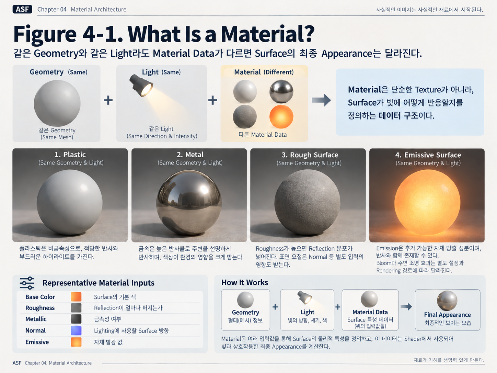
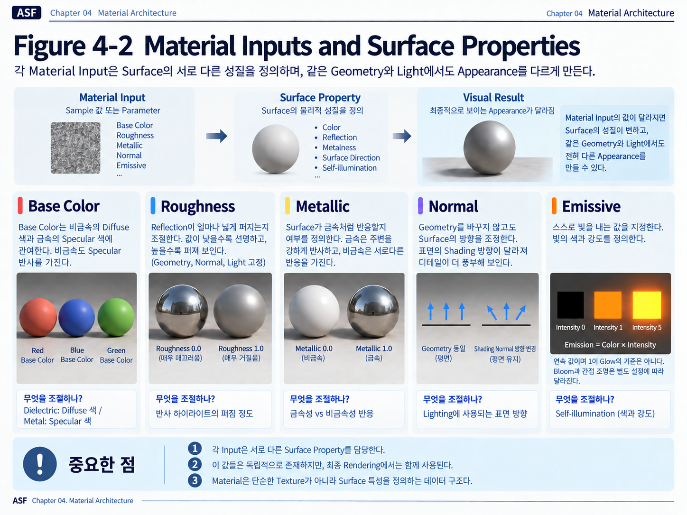
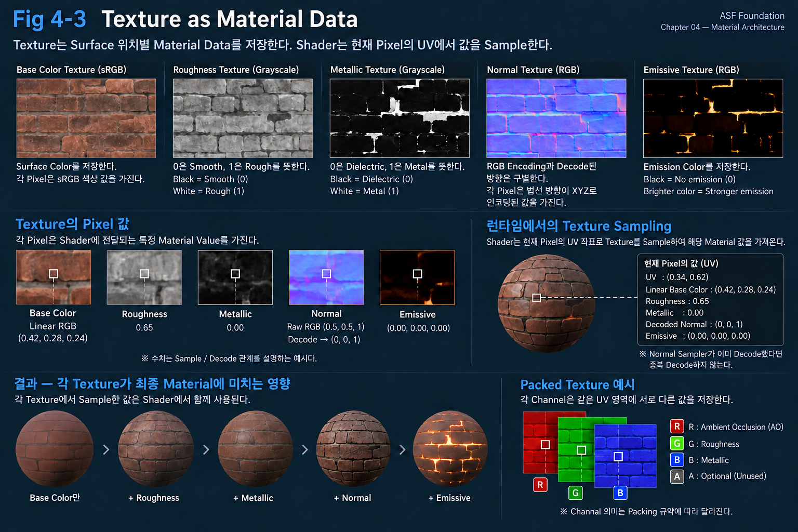
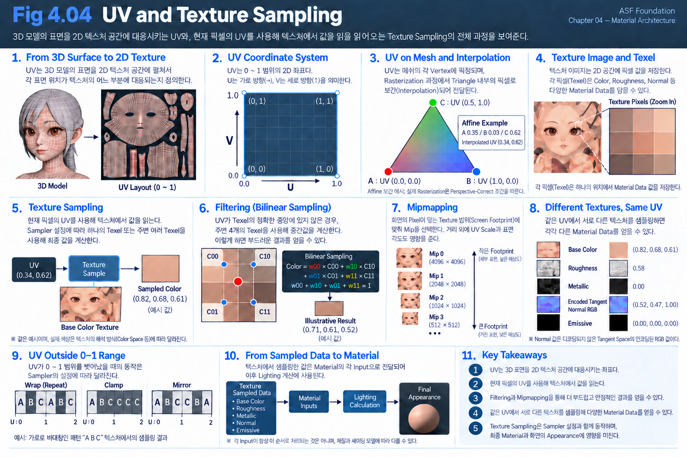
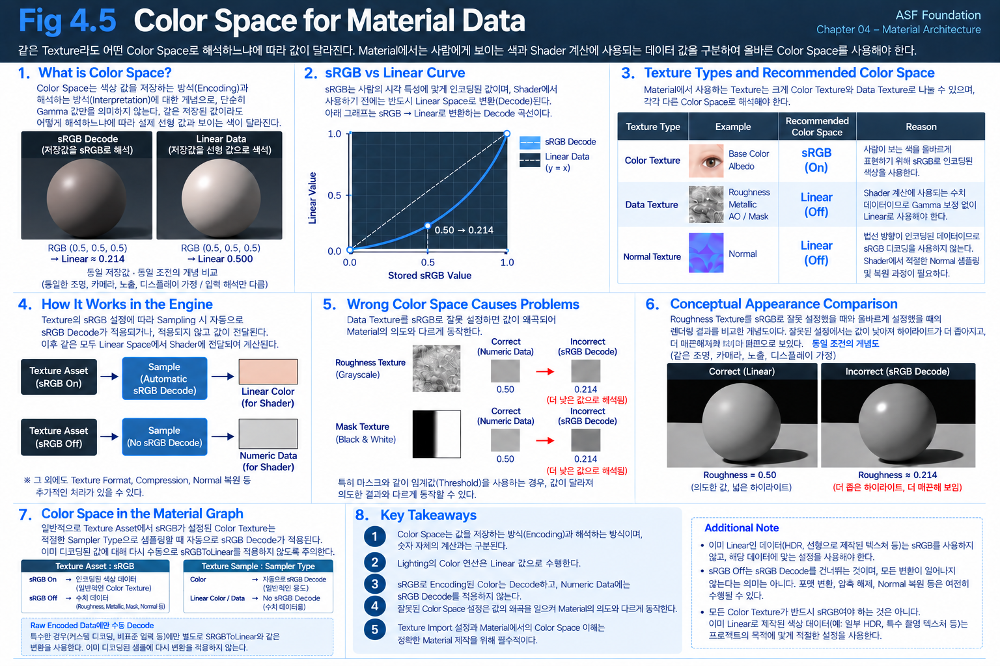
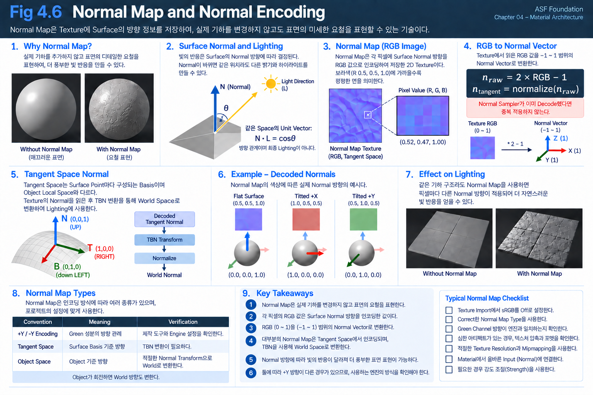
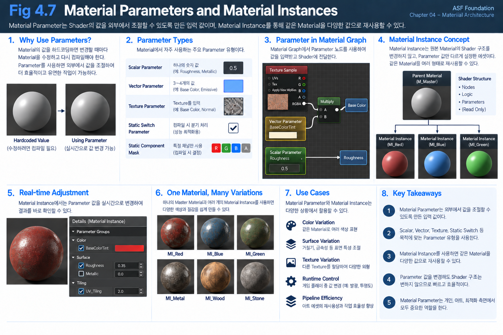
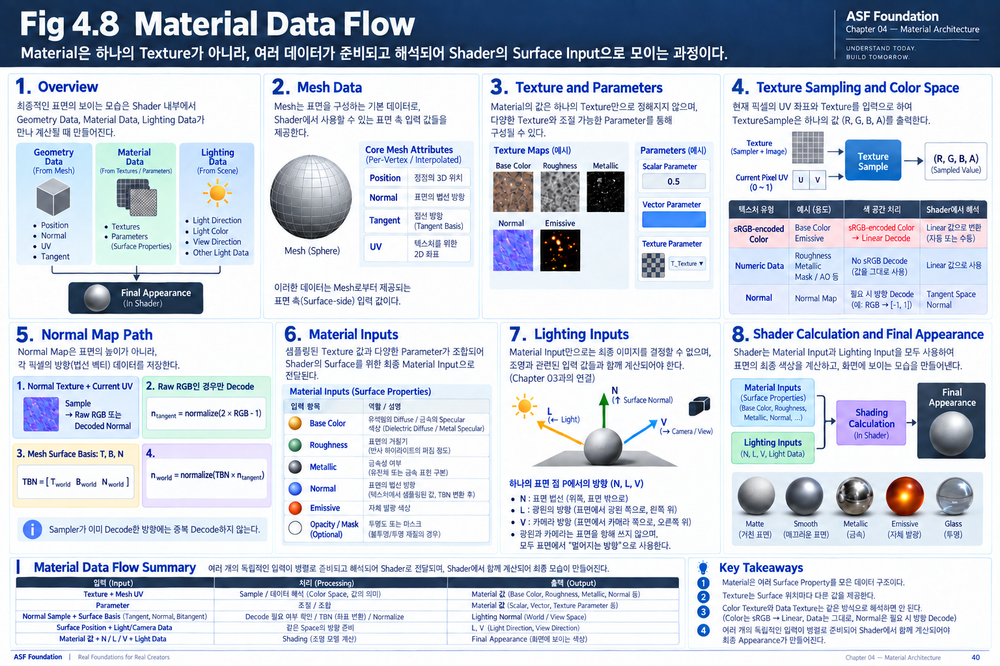

# Chapter 04 — Material Architecture

같은 Sphere에 같은 Light를 비추어도 Plastic과 Metal은 다르게 보인다. Geometry의 형태와 Light의 위치가 같다면 이 차이는 어디에서 오는 것일까?

Geometry와 Lighting Data만으로는 Surface가 어떤 성질을 갖는지 알 수 없다. Surface의 Color, 거친 정도, 금속성, Lighting에 사용할 Direction과 발광 Data가 함께 필요하다.

이 Surface Property를 구성하고 Shader에 제공하는 구조가 Material이다. Texture를 화면에 보여주는 기능보다 넓은 역할이다.

```text
Geometry → Surface의 형태 / 위치 / 기준 Attribute
Material → Surface Property를 준비하는 Data와 Logic
Lighting → Surface와 Light / Camera의 관계
    → Shader에서 함께 사용 → Final Appearance
```

Chapter 03에서는 Position, Normal, Light Direction과 View Direction을 Lighting에 사용할 형태로 준비했다. 이번 Chapter에서는 그 계산에 사용할 또 다른 입력인 Material Data가 어디에서 시작하고 어떻게 Shader에 전달되는지 살펴본다.

먼저 Input이 어떤 Property를 표현하는지 이해한다. 그 뒤 Constant, Texture와 Parameter가 그 값을 제공하는 방법을 살펴보고, 마지막에 Lighting Data와 합류하는 흐름을 연결한다.

```text
Surface에 필요한 Property
    → Material Input의 역할
    → Texture / Parameter 등으로 값 준비
    → Shader가 사용할 입력 해석
    → Lighting Data와 함께 Shading
    → Final Appearance
```

---

## 4.1 What Is a Material?

Surface의 색만 바꾸면 Plastic과 Metal의 차이를 표현할 수 있을까?

Color가 같아도 Reflection의 형태와 금속성 반응이 다르면 결과는 달라진다. 따라서 Surface를 표현하려면 Texture Image뿐 아니라 여러 Property와 그 Data를 처리하는 구조가 필요하다.

Texture는 Surface에 사용할 Data를 저장하는 한 가지 방법이다. Material은 이 Texture와 다른 Data, 설정과 Logic을 포함해 **Surface가 Rendering에서 어떻게 동작할지를 정의하는 전체 구조**다.

### Same Geometry, Different Appearance

같은 Sphere Geometry에 같은 Light를 비춘다고 생각해보자.

Geometry와 Light가 완전히 같더라도 Material이 달라지면 결과는 전혀 다르게 보일 수 있다.

예를 들어 하나의 Sphere를 다음과 같이 표현할 수 있다.

- Plastic
- Metal
- Rough Surface
- Emissive Surface

Geometry는 모두 동일하다.

Light의 Direction과 Intensity도 동일하다.

달라지는 것은 Surface가 가진 Material Data다.

Plastic은 비교적 부드러운 Reflection과 Diffuse Color를 가질 수 있고, Metal은 주변 환경을 강하게 반사할 수 있다.

Rough Surface는 Reflection이 넓게 퍼져 Highlight가 흐려질 수 있으며, Emissive Surface는 외부 Light와 별개로 스스로 빛을 내는 것처럼 표현할 수 있다.

즉 최종 Appearance의 차이는 Geometry가 아니라 **Surface Property의 차이**에서 만들어진다.



**Figure 4-1. What Is a Material?** 같은 Geometry와 Light 조건에 서로 다른 Material Data를 사용한 개념 비교다. Roughness가 Reflection 분포를 바꾸는 효과와 Normal이 만드는 표면 요철을 구분한다. Emissive Sphere의 Bloom과 주변 조명은 별도 Rendering 경로의 영향을 받을 수 있으므로 Emissive 값 하나의 효과로 모두 해석하지 않는다.

---

### Material Describes Surface Properties

Material은 Surface가 어떤 특성을 가지고 있는지를 여러 값으로 표현한다.

대표적으로 다음과 같은 Material Input이 사용된다.

- `Base Color`
- `Roughness`
- `Metallic`
- `Normal`
- `Emissive`

각 Input은 서로 다른 Surface Property를 담당한다.

`Base Color`는 Surface의 기본적인 색 정보를 제공한다.

`Roughness`는 Reflection이 얼마나 넓게 퍼지는지를 조절한다.

`Metallic`은 Surface가 금속성 재질로 동작하는지를 결정하는 데 사용된다.

`Normal`은 Lighting 계산에 사용할 Surface 방향을 조정한다.

`Emissive`는 외부 Lighting과 별개로 Surface 자체에서 방출되는 Color 값을 제공한다.

이러한 값들은 각각 독립된 역할을 가지지만, 최종 Rendering에서는 서로 함께 사용된다.

---

### Material Is Not the Final Lighting

여기서 Material과 Lighting의 역할을 구분할 필요가 있다.

Light에 반응하는 Material에서는 Material Input만으로 최종 밝기가 정해지지 않는다. Unlit 출력과 Emission처럼 Scene Light 없이도 결과를 내는 경로는 뒤에서 별도로 구분한다.

Material은 우선 Shader에 Surface의 특성을 전달한다.

예를 들어 Roughness가 낮다고 해서 Surface가 무조건 밝아지는 것은 아니다.

낮은 Roughness는 Reflection이 더 집중되는 Surface 특성을 의미하고, 실제로 어떻게 보이는지는 Light Direction, View Direction, Reflection 환경과 같은 다른 Rendering Data와 함께 계산해야 한다.

즉 Material은,

**Surface가 Light에 어떻게 반응할 수 있는지를 정의하는 입력 데이터**

라고 이해하는 것이 좋다.

그리고 Lighting Model은 이 Material Data와 Lighting Data를 이용해 최종 Shading 결과를 계산한다.

---

### Material and Shader

Material과 Shader 역시 완전히 같은 의미는 아니다.

Shader는 GPU에서 실행되어 실제 Rendering 계산을 수행하는 Program이다.

Material은 그 Shader가 Surface를 계산할 때 사용할 Data와 설정을 제공한다.

Engine의 Material Graph는 이 입력을 준비하는 Logic도 표현하며, 필요한 Shader Program으로 Compile될 수 있다. 개념을 구분할 때는 Material이 정의하는 Surface 구조와 GPU에서 실제 실행되는 Shader Program의 역할을 나누어 본다.

개념적으로 보면 다음과 같다.

`Material Data`

→ `Shader`

→ `Lighting Calculation`

→ `Final Appearance`

하나의 Shader Architecture를 여러 Material이 공유하면서 서로 다른 Parameter와 Texture를 사용할 수도 있다. Architecture 재사용과 동일한 Compiled Shader Variant의 조건은 4.7에서 구분한다.

이 구조를 이용하면 같은 Rendering Logic을 유지하면서도 여러 종류의 Surface를 표현할 수 있다.

---

### Material as Data

Material을 이해할 때 중요한 관점은 Material을 하나의 완성된 이미지로 보는 것이 아니라 **Surface Data의 집합으로 보는 것**이다.

예를 들어 Character Material은 단순히 Character Texture 한 장을 사용하는 것이 아니다.

Surface 위치에 따라 서로 다른 값이 필요할 수 있다.

어떤 Pixel에서는 피부색이 필요하고, 다른 Pixel에서는 머리카락이나 의상의 색이 필요하다.

Roughness 역시 모든 Surface에서 같은 값일 필요가 없다.

Metallic, Normal, Emissive 같은 값도 Surface 위치마다 달라질 수 있다.

따라서 Material System은 이러한 값을 Constant, Parameter, Texture 등의 형태로 Shader에 전달한다.

그리고 Shader는 현재 Rendering하고 있는 Pixel에서 필요한 Material Data를 읽어 Lighting 계산에 사용한다.

---

### Material in the Rendering Flow

Chapter 03까지의 Lighting Data와 Material Data를 함께 보면 전체 구조를 다음과 같이 정리할 수 있다.

`Geometry`

→ Position / Normal / UV

`Material`

→ Base Color / Roughness / Metallic / Normal / Emissive

`Lighting`

→ Light Direction / View Direction / Light Color

이 Data들이 Shader에서 결합된다.

`Geometry Data`

+

`Material Data`

+

`Lighting Data`

→ `Shading Calculation`

→ `Final Appearance`

따라서 Material은 Texture 하나를 Surface에 붙이는 기능이 아니라,

**Surface가 Rendering 과정에서 어떤 특성을 가지는지를 Shader에 전달하는 데이터 구조**

라고 이해할 수 있다.

다음 Section에서는 Material이 사용하는 대표적인 Surface Property들을 하나씩 살펴보고, 각각의 값이 Rendering에서 어떤 역할을 하는지 정리한다.

---

## 4.2 Material Inputs and Surface Properties

앞 Section에서는 `Material`이 단순한 Texture가 아니라 Surface의 특성을 정의하는 Data Structure라는 점을 살펴봤다.

그렇다면 Material은 실제로 어떤 정보를 가지고 있어야 할까?

Surface의 색, 반사 특성, 금속성, 방향, 자체 발광 여부는 서로 다른 성질이다.

따라서 하나의 값만으로 Material 전체를 표현할 수는 없다.

Rendering에서는 이러한 Surface의 성질을 여러 개의 `Material Input`으로 나누어 표현한다.

각 Input은 서로 다른 역할을 담당하며, Shader는 이 값들을 함께 사용해 최종 Surface의 Appearance를 계산한다.

### Material Input and Surface Property

`Material Input`은 Shader에 전달되는 값이다.

그리고 그 값은 Surface의 특정한 `Surface Property`를 표현한다.

예를 들어,

`Base Color`

는 Surface의 기본적인 색 정보를 제공하고,

`Roughness`

는 Reflection이 얼마나 넓게 퍼지는지를 결정하는 데 사용된다.

즉 Material Input은 단순한 숫자나 Texture가 아니라,

**Surface가 어떤 성질을 가지는지를 Shader에게 전달하기 위한 Data**

라고 볼 수 있다.

Material의 여러 Input은 서로 독립된 역할을 가지지만 최종 Rendering에서는 함께 사용된다.

---

### Base Color

`Base Color`는 Surface가 가지는 기본적인 Color 정보를 제공한다.

예를 들어 같은 Material 구조에서 Base Color만 변경하면 Surface를 빨간색, 파란색, 초록색 등으로 표현할 수 있다.

하지만 Base Color를 단순히 최종 Pixel Color라고 생각해서는 안 된다.

Base Color는 Lighting 계산에 사용되는 Material Data 중 하나다. Surface의 Color 입력과 화면의 최종 Color를 먼저 구분한다. Metal과 Non-Metal에서 이 입력이 반사색에 어떻게 관여하는지는 아래 Metallic 설명과 연결한다.

따라서 같은 Base Color를 사용하더라도 Light의 방향과 밝기, Material의 다른 Property에 따라 화면에 나타나는 최종 Color는 달라질 수 있다.

즉,

**Base Color는 최종 밝기를 포함한 결과가 아니라 Surface가 가진 기본적인 색 정보다.**

이 값이 이후 Lighting Calculation과 결합되어 최종 Appearance를 만든다.

---

### Roughness

`Roughness`는 Surface의 미세한 구조가 얼마나 거친지를 나타내는 Property다.

Rendering 결과에서는 주로 Reflection과 Highlight의 형태에 영향을 준다.

Roughness가 낮으면 Surface가 비교적 매끄럽기 때문에 Reflection이 한 방향에 집중된다.

그 결과 Highlight가 작고 선명하게 나타날 수 있다.

반대로 Roughness가 높으면 Surface의 미세한 방향이 다양해지고 Reflection이 넓은 방향으로 퍼진다.

그 결과 Highlight는 넓고 흐릿하게 보인다.

개념적으로는 다음과 같이 생각할 수 있다.

`Low Roughness`

→ Reflection이 집중됨

→ Sharp Highlight

`High Roughness`

→ Reflection이 넓게 퍼짐

→ Broad / Soft Highlight

여기서 Roughness가 단순히 Surface를 밝거나 어둡게 만드는 값은 아니라는 점이 중요하다.

Roughness는 **빛이 반사되는 분포의 형태**를 바꾸는 Property다.

---

### Metallic

`Metallic`은 Surface가 Metal의 특성을 가지는지 판단하는 데 사용되는 Material Input이다.

일반적인 PBR Material에서는 크게 다음 두 종류의 Surface를 구분한다.

- `Dielectric`
- `Metal`

Plastic, Wood, Skin, Stone과 같은 대부분의 비금속 재질은 `Dielectric`에 해당한다.

Iron, Gold, Copper와 같은 금속 재질은 `Metal`에 해당한다.

Metallic 값은 일반적으로 다음과 같이 사용된다.

`0`

→ Dielectric

`1`

→ Metal

실제 Material에서는 Mask나 Transition 영역 때문에 중간값이 존재할 수도 있지만, 물리적인 Material의 기본적인 구분은 Metal과 Non-Metal에 가깝다.

Metallic이 변하면 단순히 Reflection의 양만 달라지는 것이 아니라 **Surface가 Light를 반사하는 방식 자체가 달라진다.**

이 차이는 이후 PBR과 BRDF를 다룰 때 더 자세히 살펴본다.

여기서는 Metallic을 Reflection의 밝기 Slider로 외우지 않고, Surface 응답 종류를 구분하는 Input으로 이해한다. Roughness와 Metallic을 함께 바꾼 결과를 볼 때도 어느 Property의 변화인지 분리해 확인한다.

**Technical Note — Base Color in the Metallic Workflow.** Dielectric의 Base Color는 주로 Diffuse 반사색을, Metal의 Base Color는 주로 Specular 반사색을 제어한다. 하나의 Input이 항상 Diffuse Color와 같은 뜻은 아니다. 이 연결은 Chapter 05의 BRDF/F0에서 자세히 살펴본다.

---

### Normal

`Normal` Input은 Lighting 계산에 사용할 Surface Direction을 조절하는 데 사용된다.

Chapter 03에서 살펴봤듯이 Surface Normal은 Light Direction과의 관계를 계산하는 기준 Vector다.

하지만 실제 Geometry의 Polygon만으로 모든 작은 Surface Detail을 표현하려면 매우 많은 Geometry가 필요하다.

대신 Normal Map과 같은 데이터를 사용하면 Geometry 자체를 변경하지 않고도 Pixel마다 Lighting에 사용할 Normal 방향을 바꿀 수 있다.

즉,

**Normal Input은 Geometry의 실제 Silhouette를 변경하는 것이 아니라 Lighting Calculation에서 사용하는 Surface Direction을 변경한다.**

그 결과 작은 홈, 주름, 돌기와 같은 Detail이 실제 Geometry가 존재하는 것처럼 보일 수 있다.

Normal Map의 구조와 Tangent Space에 대해서는 이후 관련 Section에서 더 자세히 다룬다.

---

### Emissive

`Emissive`는 Surface가 외부 Light와 별개로 스스로 빛을 내는 것처럼 보이도록 하는 Color 값을 제공한다.

일반적인 Surface는 Light를 받아야 밝게 보인다.

하지만 Emissive는 Lighting 결과와 별도로 Surface Color에 값을 추가할 수 있다.

예를 들어,

- LED
- Display
- Neon Sign
- Magic Effect

등을 표현할 때 사용할 수 있다.

여기서 주의할 점은 Emissive Material이 밝게 보인다고 해서 반드시 주변 Geometry를 실제로 비추는 것은 아니라는 점이다.

Emissive가 Scene Lighting에 영향을 주는지는 Rendering System과 Lighting 방식에 따라 달라질 수 있다.

따라서 Foundation 단계에서는 Emissive를,

**Surface 자체의 발광 Color를 제공하는 Material Input**

으로 이해하면 충분하다.

---

### Each Input Controls a Different Property

Material Input을 이해할 때 중요한 것은 각각의 값을 단순한 옵션 목록으로 외우는 것이 아니다.

각 Input은 서로 다른 Surface Property를 표현한다.

예를 들어,

`Base Color`

→ Surface Color

`Roughness`

→ Reflection Distribution

`Metallic`

→ Metal / Dielectric Response

`Normal`

→ Lighting에 사용할 Surface Direction

`Emissive`

→ Self-Illumination Color

와 같이 서로 다른 역할을 가진다.

이 값들은 따로 존재하지만 최종 Rendering에서는 동시에 사용된다.

즉 하나의 Material은 여러 Surface Property를 모아 하나의 Surface 특성을 정의한다.



**Figure 4-2. Material Inputs and Surface Properties.** 각 Input이 바꾸는 Property를 비교한다. Base Color는 Metallic workflow에서 Dielectric의 Diffuse Color와 Metal의 Specular Color에 다르게 관여한다. Roughness 비교는 Geometry, Normal과 Light를 고정한 관계이며, Emissive의 연속적인 Color 예시는 Glow나 주변 조명의 정량 결과가 아니다.

---

### Material Values Are Not Always Constants

Material Input이 반드시 하나의 고정된 값일 필요는 없다.

예를 들어 Sphere 전체의 Roughness를 `0.5`로 설정하면 Surface 전체가 같은 Roughness를 가진다.

하지만 실제 Asset에서는 Surface 위치마다 다른 값이 필요한 경우가 많다.

예를 들어 Character Face에서는,

- Skin
- Lip
- Eyebrow
- Makeup
- Sweat

등의 영역이 서로 다른 Roughness를 가질 수 있다.

이 경우 하나의 Constant Value만으로는 Surface 전체의 차이를 표현할 수 없다.

그래서 Material Input은 다음과 같은 다양한 형태로 제공될 수 있다.

- Constant
- Parameter
- Texture
- 계산된 Shader Value

즉 `Roughness`는 하나의 특정 Texture를 의미하는 것이 아니라 **Shader가 현재 Surface에서 사용할 Roughness 값 자체**를 의미한다.

이 값이 어디에서 오는지는 Material 구조에 따라 달라질 수 있다.

---

### From Input to Final Appearance

Material Input은 각각 Surface의 다른 성질을 정의한다.

하지만 화면에 보이는 최종 결과는 어느 하나의 Input만으로 결정되지 않는다.

예를 들어,

`Base Color`

`Roughness`

`Metallic`

`Normal`

과 같은 Material Data가 Lighting Data와 함께 Shader에 전달된다.

이를 단순화하면 다음과 같이 볼 수 있다.

`Material Inputs`

→ `Surface Properties`

→ `Lighting Calculation`

→ `Final Appearance`

즉 Material Input은 최종 Color 그 자체가 아니라,

**Shader가 Surface를 어떻게 계산해야 하는지를 결정하기 위한 입력 데이터**다.

다음 Section에서는 이러한 Material Input 값이 Surface 위치마다 달라질 수 있도록 데이터를 저장하는 대표적인 방법인 `Texture`를 살펴본다.

---

## 4.3 Texture as Material Data

하나의 Character Face에 Base Color 하나와 Roughness 하나만 지정하면 어떤 일이 생길까?

피부, 입술, 눈썹, 메이크업이 모두 같은 색과 같은 Surface 반응을 갖게 된다. 땀이나 유분이 많은 영역도 주변 피부와 구별할 수 없다.

4.2에서 설명한 Material Input의 종류는 충분하지만, 이제는 **같은 Input의 값이 Surface 위치에 따라 달라져야 한다.** 하나의 Constant는 Surface 전체에 같은 값을 제공하므로 이 차이를 저장할 다른 방법이 필요하다.

Texture는 이 문제를 해결한다. Surface의 여러 위치에 사용할 Material Data를 2D 영역에 나누어 저장하고, Shader가 현재 Surface 위치에 필요한 값을 찾도록 한다.

### Texture Is Data, Not Just an Image

Texture를 열면 하나의 Image가 보인다. 그러나 Shader가 사용하는 것은 Image의 전체 모습이 아니라 그 안에 저장된 값이다.

Texture를 구성하는 각 저장 단위를 `Texel`이라고 한다. 화면의 Pixel과 구분하기 위한 이름이며, 자세한 Sampling 관계는 4.4에서 살펴본다.

각 Texel의 숫자가 어떤 Material Property를 표현하는지에 따라 같은 Image 형식도 다른 Data가 된다. Base Color Texture의 RGB는 Surface Color를 표현한다. Roughness Texture의 한 Channel은 거친 정도를 표현한다. Metallic Texture의 값은 Metal과 Dielectric의 반응을 구분하는 데 사용된다.

따라서 Shader 관점의 Texture는 다음처럼 이해할 수 있다.

> **Texture는 Surface 위치마다 다른 Material Data를 제공하기 위해 값을 나누어 저장한 Data Map이다.**

이 정의는 Texture가 Color를 표현할 수 없다는 뜻이 아니다. Color도 저장할 수 있는 Material Data의 한 종류라는 뜻이다.



**Figure 4-3. Texture as Material Data.** 위쪽 Texture들은 같은 Surface 영역에 대응하는 서로 다른 Property를 저장한다. 가운데 선택된 위치에서는 각 Texture가 현재 Pixel에 필요한 값을 제공한다. 그림의 숫자는 Sample과 Decode의 관계를 설명하는 예시이며 실제 Texel을 측정한 결과가 아니다. Normal의 Raw RGB와 Decode된 Direction을 구분하고, 아래의 연속된 Sphere는 Property가 함께 사용되는 개념 비교로 읽는다.

---

### Base Color Texture

Character의 피부와 입술처럼 위치마다 Color가 달라야 할 때 `Base Color Texture`를 사용할 수 있다.

각 Texel에는 일반적으로 RGB 값이 저장된다. Shader는 현재 Surface에 대응하는 위치를 Sample하고, Color Space를 올바르게 해석한 결과를 Base Color로 사용한다.

예를 들어 입력 해석까지 끝난 현재 Surface의 Linear Base Color가 다음과 같을 수 있다.

`Base Color = (0.42, 0.28, 0.24)`

이 값은 Texture 전체의 대표 Color가 아니다. 지금 처리하는 Surface 위치에 사용할 값이다. 다른 위치를 Sample하면 입술이나 의상의 다른 Base Color를 얻을 수 있다.

sRGB로 저장한 파일의 Raw RGB와 Shader가 사용할 Linear RGB가 언제나 같지는 않다는 점도 기억한다. 이 차이는 4.5에서 설명한다.

---

### Grayscale Data Textures

Roughness는 현재 위치에서 숫자 하나가 필요하다. 색을 표현하기 위해 RGB 세 값이 필요한 경우와 달리, 한 Channel만으로도 값을 전달할 수 있다.

그래서 Roughness Texture를 열면 Grayscale Image처럼 보이는 경우가 많다. 하지만 Shader에게 중요한 것은 흑백 무늬 자체가 아니라 저장된 Scalar다.

일반적인 Roughness 입력에서는 `0`이 매우 Smooth한 Surface를, `1`이 매우 Rough한 Surface를 나타낸다. `0.5`는 그 사이의 입력값이다. 화면에서 관찰하는 Highlight는 이 값에 Lighting과 View 조건이 함께 작용한 결과다.

Metallic도 Scalar를 저장할 수 있다. 기본적인 해석은 `0 → Dielectric`, `1 → Metal`이며 Mask나 Transition 영역의 중간값은 4.2에서 설명한 조건을 따른다.

이처럼 Image가 흑백으로 보이더라도 그 역할은 **현재 Surface에서 사용할 0~1 Numeric Data를 제공하는 것**이다.

---

### Normal Texture

작은 홈과 주름은 색만 바꾸어서 충분히 표현되지 않는다. Light와의 방향 관계도 위치마다 바뀌어야 한다.

`Normal Texture`는 이때 사용할 Surface Direction 정보를 저장한다. Base Color의 Color나 Roughness의 Scalar와 달리, Shader가 복원할 대상은 Direction Vector다.

일반적인 Tangent Space Normal Map은 Direction의 X, Y, Z 성분을 RGB에 Encoding하므로 파란색이나 보라색 계열로 보인다. 이 색을 Base Color로 사용할 목적은 아니다.

여기서는 Normal Texture가 Direction Data를 저장한다는 점을 이해하면 된다. 저장 범위, Tangent Space, Decode, TBN은 4.6에서 순서대로 연결한다.

---

### Emissive Texture

Surface 전체가 아니라 특정 Pattern만 발광하게 하려면 `Emissive Texture`를 사용할 수 있다.

예를 들어 벽돌 사이 Mortar나 특정 표시만 빛나게 만들 수 있다. 검은 영역은 Emissive가 거의 없는 위치로, 밝은 영역은 더 큰 Emissive Color를 제공하는 위치로 사용할 수 있다.

이 Sample 결과에 Intensity Parameter를 곱하는 등 Material Logic을 결합하면 발광 영역과 강도를 별도로 조절할 수도 있다. Surface 자체의 발광과 Bloom 또는 주변 Scene 조명은 4.2에서 구분한 관계를 따른다.

Texture는 이렇게 하나의 Material 안에서도 일부 영역만 다른 Property를 갖게 한다.

---

### A Texture Provides a Value at the Current Surface Position

Shader가 하나의 Surface Pixel을 처리한다고 생각해보자. 지금 필요한 것은 Character Texture 전체가 아니라, 이 Pixel에 해당하는 Base Color와 Roughness다.

현재 위치를 Texture 안에서 찾을 수 있도록 사용하는 좌표가 `UV`다. UV가 Texture의 주소 역할을 하고, Texture는 그 주소에서 읽을 Data를 제공한다.

예를 들어 현재 Pixel의 `UV = (0.34, 0.62)`에서 여러 Texture를 Sample하고 필요한 입력 해석을 마친 결과는 다음처럼 구성될 수 있다.

| Property | Example Value | Meaning |
|---|---|---|
| Base Color | `(0.42, 0.28, 0.24)` | Linear Surface Color |
| Roughness | `0.65` | 현재 위치의 Roughness |
| Metallic | `0.0` | Dielectric 입력 |
| Normal Sample | Encoded RGB 또는 sampler-decoded Direction | 4.6의 방향 복원 경로로 전달 |
| Emissive | `(0.0, 0.0, 0.0)` | 이 위치에서는 발광 없음 |

Normal Sample이 Encoded RGB라면 아직 Lighting Direction으로 준비된 값이 아니다. Decode와 필요한 Space 변환을 거친다.

Mask를 읽는 경우에도 같은 원리가 적용된다. Sample 결과에서 필요한 Channel을 선택하면 현재 Surface 위치의 Scalar를 얻는다. Texture 전체가 하나의 Scalar로 바뀌는 것이 아니다.

---

### Texture Sampling

UV로 현재 위치를 지정한 뒤 Texture에서 그 위치의 값을 얻는 과정을 `Texture Sampling`이라고 한다.

```text
Current Surface Location
    → UV
UV + Texture Resource
    → Texture Sampling
    → Sampled Value
    → Interpretation for the Material Property
```

UV는 읽을 위치를 제공하고 Texture는 읽을 자원을 제공한다. Texture가 UV를 만들어 다음 단계로 넘기는 직렬 관계가 아니다.

같은 Sampling 동작으로 얻은 값도 용도에 따라 다르게 해석된다. Base Color는 Color로, Roughness는 Scalar로, Normal은 Direction Data로 사용한다.

실제 Sampler는 주변 Texel을 이용해 값을 계산할 수도 있다. 따라서 Sample 결과를 반드시 특정 Texel 하나의 원래 값과 같다고 가정하지 않는다. 이 과정은 다음 Section의 Filtering에서 살펴본다.

---

### One Texture Can Store Multiple Values

Roughness나 Metallic처럼 값 하나가 필요한 Data를 각각 RGB Texture에 저장하면 사용하지 않는 Channel이 생길 수 있다.

일반적인 RGBA Texture의 `R`, `G`, `B`, `A`를 서로 다른 Scalar Data에 배정하면 하나의 Texture에서 여러 Property를 읽을 수 있다. 이를 `Channel Packing`이라고 한다.

예를 들어 다음과 같은 배정이 가능하다.

| Channel | Example Data |
|---|---|
| R | Ambient Occlusion |
| G | Roughness |
| B | Metallic |
| A | Mask 또는 다른 Scalar Data |

Shader는 한 위치를 Sample한 뒤 필요한 Channel을 분리해 각각의 Input에 사용한다. Channel은 같은 UV 영역에 대응하지만 저장된 숫자의 의미는 서로 다르다.

여러 Texture의 값을 한 Sample에서 얻을 수 있다면 Texture Sampling Cost를 줄이는 데 도움이 될 수 있다. Memory Usage도 형식과 기존 Texture 구성을 고려할 때 줄일 수 있다. Packing만으로 모든 경우의 Memory나 GPU 시간이 감소한다고 단정하지는 않는다.

어떤 Data를 어느 Channel에 넣는지는 Project와 Engine Pipeline의 약속에 따라 달라진다. Packing 규칙과 Texture Import Setting을 함께 확인해야 올바르게 해석할 수 있다.

---

### Texture Data Needs the Correct Interpretation

같은 `(0.5, 0.5, 1.0)`을 읽더라도 Color로 사용할지 Direction으로 복원할지에 따라 다음 처리가 달라진다.

또한 Color를 저장한 Texture와 Roughness를 저장한 Texture는 Color Space 처리도 다를 수 있다. 숫자를 읽는 것만으로 Material Input이 완성되는 것은 아니다.

따라서 Import와 Material 연결 과정에서 다음을 확인한다.

- 무엇을 저장했는가: Color, Scalar, Encoded Direction인가?
- 어떤 Channel을 사용하는가: RGB 전체인가, 특정 Scalar Channel인가?
- 어떤 입력 해석이 필요한가: sRGB Decode 또는 Normal Decode가 필요한가?

Texture File이 정상이어도 이 해석이 틀리면 Material 결과가 달라진다. Color Space는 4.5에서, Normal의 Direction 복원은 4.6에서 설명한다.

---

### From Texture to Material

Texture는 완성된 Material 자체가 아니다. Surface의 여러 위치에 사용할 Property를 저장하는 Data Source다.

Material은 Texture에서 얻은 값과 Parameter, Shader Logic을 결합해 현재 Surface의 Input을 준비한다. 그 Input이 Lighting 계산에 사용되어 최종 Appearance에 영향을 준다.

```text
Texture → Material Property Data 저장
UV → 읽을 Surface 위치에 대응하는 Texture 위치 지정
UV + Texture → Sampled Value
Sampled Value + 필요한 해석 → Current Material Input
Material Inputs + Lighting Data → Final Appearance
```

이 흐름을 이해하려면 아직 한 단계가 더 필요하다. Mesh는 Vertex로 구성되어 있는데, Triangle 안쪽의 Pixel은 자신의 UV를 어디에서 얻을까? 다음 Section은 바로 이 연결을 설명한다.

---

## 4.4 UV and Texture Sampling

Character Face의 Triangle 안쪽을 처리하는 Pixel Shader는 Texture의 피부 영역을 읽어야 한다. 그러나 Shader가 받는 3D 위치만으로는 Texture의 어느 2D 위치가 피부인지 알 수 없다.

따라서 Mesh의 Surface와 Texture 영역 사이에 대응 관계를 준비해야 한다. 그 관계를 표현하는 좌표가 `UV`다.

먼저 Surface에 UV를 지정하고, Vertex에 저장된 UV가 Triangle 내부로 전달되는 과정을 이해한다. 그 뒤 현재 Pixel에서 Texture 값을 얻고, Texel 사이의 위치를 처리하는 Filtering으로 연결한다.

### UV Maps 3D Surface to 2D Texture Space

Mesh의 Surface는 3D 공간에 있지만 일반적인 Material Texture는 2D 영역에 값을 저장한다. Surface의 어느 부분을 Texture의 어느 부분과 대응시킬지 정하는 것이 `UV Mapping`이다.

각 Vertex는 Position과 Normal 외에 UV를 가질 수 있다. 예를 들어 `UV = (0.25, 0.75)`인 Vertex는 Texture Space의 그 좌표에 대응한다.

`U`와 `V`는 2D Texture Space의 두 Axis다. 일반적으로 U는 가로, V는 세로 위치를 나타낸다. 그림의 위아래 표시와 실제 Texture/Data의 좌표 Convention은 사용하는 Pipeline에서 확인한다.

UV는 3D 공간의 Position을 그대로 줄여 쓴 좌표가 아니다. Surface와 Texture 사이에 설정한 대응 정보다. 그래서 같은 Geometry에도 다른 UV Layout을 지정할 수 있다.

---

### UV Coordinate Range

Texture Resolution이 달라져도 같은 영역을 가리키려면 Texel 개수와 독립된 좌표가 편리하다. 이를 위해 UV는 Texture 한 영역을 보통 `0~1`로 정규화해 표현한다.

네 모서리는 개념적으로 `(0, 0)`, `(1, 0)`, `(0, 1)`, `(1, 1)`에 대응한다. `UV = (0.5, 0.5)`는 `1024 × 1024`와 `4096 × 4096` Texture 모두에서 중앙 위치를 의미한다.

같은 UV를 사용할 수 있다는 것이 같은 Texel을 읽는다는 뜻은 아니다. Resolution이 달라지면 그 위치 주변의 Texel 수와 Detail은 달라진다.

UV의 0~1 범위는 한 Texture 영역을 설명하는 기본 범위다. 반드시 이 범위에 제한되는지는 뒤의 Addressing Setting에서 구분한다.

---

### UV Is Stored on the Mesh

Texture는 Data를 저장하지만 Mesh의 어떤 Triangle이 어느 Texture 영역을 사용할지까지 자동으로 정하지는 않는다. 이 예제에서는 그 대응 정보를 Mesh의 Vertex UV에 저장한다.

Vertex가 가질 수 있는 Attribute에는 Position, Normal, Tangent, UV, Vertex Color 등이 있다. Chapter 01의 Rasterization은 Triangle 내부에 해당하는 Fragment를 만들면서 이 Attribute를 사용할 위치에 맞게 Interpolation한다.

즉 Triangle 안쪽의 Fragment가 Texture 안에서 어디를 읽어야 하는지 알 수 있는 이유는 Vertex의 UV가 내부 위치로 보간되어 전달되기 때문이다.

```text
Mesh Surface에 UV 대응 관계 설정
    → Vertex UV
    → Rasterization / Attribute Interpolation
    → Current Fragment / Pixel의 Interpolated UV
    → Pixel Shader에서 사용할 Sampling Coordinate
```

Fragment는 Rasterization이 만드는 처리 후보이며 최종 화면 Pixel과 항상 일대일인 것은 아니라는 Chapter 01의 구분을 유지한다. 여기서 Current Pixel UV는 Pixel Shader가 지금 처리하는 Surface Sample의 UV라는 뜻으로 사용한다.

일반적인 Perspective Rendering에서는 Perspective-correct Interpolation으로 UV를 준비한다. 화면상의 단순한 선형 보간 그림은 흐름을 보여주는 모델이며 실제 보간 조건 전체를 뜻하지 않는다.

**Technical Note — Generated Coordinates.** 이 예제의 UV는 Mesh에 저장된 Surface Attribute다. 모든 Sampling Coordinate가 반드시 Mesh에서 와야 하는 것은 아니다. Shader가 Position이나 Direction으로 좌표를 만들 수도 있다. Chapter 08의 MatCap은 View Space Normal에서 UV를 만드는 예다.

---

### Texture Sampling

현재 Pixel의 UV가 준비되면 Shader는 Texture Resource와 그 좌표를 함께 사용해 값을 얻는다.

예를 들어 `UV = (0.34, 0.62)`에서 Base Color Texture를 Sample하고 입력 해석을 마치면 `Base Color = (0.82, 0.68, 0.61)`을 얻을 수 있다. 같은 좌표로 Roughness Texture를 Sample하면 `Roughness = 0.58`을 얻을 수도 있다.

이 숫자는 설명용 예시다. 실제 결과는 Texture에 저장된 Data, Filtering, Mip Level과 입력 해석에 따라 달라진다.

Normal Texture를 Sample하면 같은 Surface 위치에 사용할 Encoded Direction 또는 Engine sampler가 이미 복원한 Direction을 얻는다. 이 결과가 바로 Lighting Space Normal인지는 4.6의 처리 조건으로 판단한다.

여기까지의 핵심은 **UV가 위치를 지정하고, 선택한 Texture가 그 위치에서 읽을 Data를 제공한다**는 관계다.

---

### One UV Can Sample Multiple Textures

Color, Roughness, Normal이 같은 얼굴의 위치에 대응해야 한다면 여러 Texture를 같은 UV로 Sample할 수 있다.

예를 들어 한 Pixel의 Data는 다음처럼 준비될 수 있다.

| Texture / Property | Example Result |
|---|---|
| Base Color | `(0.82, 0.68, 0.61)` |
| Roughness | `0.58` |
| Metallic | `0.0` |
| Normal | Encoded Direction 또는 sampler-decoded Direction |
| Emissive | `(0.0, 0.0, 0.0)` |

같은 UV를 사용한다는 것은 같은 Surface 위치를 대응시킨다는 뜻이다. Texture마다 저장한 Property가 다르므로 결과값도 다르다. Material은 필요한 해석을 거친 이 값들을 서로 다른 Input에 사용한다.

---

### Texel

Texture에 저장된 값을 이해했다면 이제 읽을 위치와 저장 단위의 관계를 살펴볼 수 있다.

`Texel`은 Texture Element의 줄임말로 Texture를 구성하는 저장 단위다. 화면을 구성하는 Pixel과 구분한다. `4096 × 4096` Texture는 가로 4096개, 세로 4096개의 Texel을 갖는다.

하나의 화면 Pixel이 Texture의 Texel 하나와 항상 대응하지는 않는다. Object 크기와 UV 변화에 따라 하나의 Pixel 영역이 Texture에서 여러 Texel에 걸칠 수도 있고, 여러 Pixel이 하나의 Texel 주변을 Sample할 수도 있다.

이 차이가 Filtering과 Mipmapping이 필요한 이유다.

---

### Texture Sampling Does Not Always Read a Single Texel

Texture는 Texel 단위로 값을 저장하지만 UV는 그 사이의 위치도 지정할 수 있다. Sampling Point가 언제나 Texel Center에 정확히 놓이는 것은 아니다.

예를 들어 두 Texel이 서로 다른 Color를 가질 때 그 중간 위치에서는 어떤 값을 사용해야 할까?

가장 가까운 Texel 하나만 고르면 이동 중에 선택 대상이 바뀌는 순간 Color가 갑자기 바뀔 수 있다. 주변 Texel의 값을 위치에 맞게 섞으면 그 사이를 점진적으로 변화시킬 수 있다.

이처럼 Sampling Point 주변의 Data로 현재 값을 계산하는 것이 Filtering의 역할이다. 2D Texture에서 대표적으로 사용하는 방식이 `Bilinear Filtering`이다.

---

### Bilinear Filtering

2D에서 Sampling Point 주변에는 가로와 세로 방향으로 가까운 Texel들이 있다. Bilinear Filtering은 한 Mip Level에서 주변 네 Texel의 값을 사용해 현재 위치의 중간값을 계산한다.

먼저 각 가로 방향의 두 값을 위치에 맞게 섞고, 그 두 결과를 세로 위치에 맞게 다시 섞는다고 이해할 수 있다. Sample 위치가 특정 Texel Center에 가까울수록 그 Texel의 기여가 커진다.

```text
Sampling Point와 주변 네 Texel의 위치 관계
    → 가로 방향의 중간값
    → 세로 방향으로 두 중간값 결합
    → Current UV의 Filtered Value
```

그 결과 Texel 경계가 그대로 드러나는 대신 더 부드러운 변화가 나타날 수 있다. 이것은 Base Color뿐 아니라 Sampling Setting이 허용하는 다른 Texture Data에도 적용된다.

따라서 Texture Sample은 단순히 저장된 Texel 하나를 가져오는 동작으로만 이해하지 않는다. **Sampler Setting에 따라 주변 Data를 이용해 현재 UV의 값을 계산할 수 있는 과정**이다.

이 Chapter에서는 Figure의 네 기여값 관계를 해석하면 충분하며 Bilinear의 Component 수학 전개를 추가하지 않는다.

---

### Mipmapping

Filtering으로 Texel 사이를 부드럽게 만들더라도, 화면 Pixel 하나에 너무 많은 Texture Detail이 들어오는 문제는 남는다.

Camera에서 먼 Object는 화면에서 작게 보인다. 이때 고해상도 Texture의 많은 Texel이 적은 Screen Pixel에 압축되면 작은 Detail이 프레임마다 다르게 선택되어 Shimmering이나 Aliasing이 발생할 수 있다.

이를 줄이기 위해 미리 해상도를 단계적으로 낮춘 Texture Version들을 준비한다. 이 구조를 `Mipmap`이라고 한다.

| Level | Resolution Relative to Mip 0 |
|---|---|
| Mip 0 | Original Resolution |
| Mip 1 | 가로·세로 각각 1/2 |
| Mip 2 | 가로·세로 각각 1/4 |
| Mip 3 | 가로·세로 각각 1/8 |

현재 Screen Pixel의 영역이 Texture에서 넓은 영역에 대응하면, 그 영역을 대표하기에 알맞은 Mip를 사용할 수 있다. 불필요하게 높은 Detail을 읽는 것을 줄이고 Aliasing도 완화한다.

**Technical Note — Texture Footprint.** 실제 Mip 선택은 Texture에서 차지하는 footprint와 관련된다. 거리뿐 아니라 UV Scale, Surface 기울기, 화면 해상도와 좌표 변화율도 영향을 준다. Object 전체의 화면 크기 하나만으로 정해지는 것은 아니다.

---



**Figure 4-4. UV and Texture Sampling.** Vertex UV가 Rasterization을 거쳐 현재 Pixel의 UV가 되고, 그 UV로 여러 Texture를 Sample하는 흐름을 확인한다. 3번의 별도 숫자 예시는 Affine 보간의 가중치와 UV 관계를 보여준다. 6번은 네 주변 Texel Center를 이용하는 Filtering, 7번은 Texture footprint에 맞춘 Mip 선택, 9번은 비대칭 Pattern의 Addressing 차이를 설명한다.

<details>
<summary>Figure Reading Note — UV Sampling Conditions</summary>

Character/UV 자료와 Sample Color, Filtering 결과는 관계를 설명하는 개념 예시다. 그림의 비교 이미지를 정량 검증 자료로 사용하지 않는다.

- 3번의 Vertex UV는 A `(0, 0)`, B `(1, 0)`, C `(0.5, 1.0)`이다. Affine 가중치 A `0.35`, B `0.03`, C `0.62`를 적용하면 UV `(0.34, 0.62)`가 된다. 이 숫자 관계는 별도 Box로 읽으며, 실제 Rasterization의 UV는 Perspective-correct 보간 조건을 확인한다.
- 6번은 한 Mip Level에서 주변 네 Texel의 값에 위치 가중치를 적용하는 Bilinear Filtering 예시다. 네 가중치의 합은 `1`이며, 표시한 Color는 설명용 값이다.
- 7번의 Mip 선택은 화면 Pixel이 Texture에서 차지하는 footprint에 따른다. 거리 외에도 UV Scale, Surface 기울기, 화면 해상도와 좌표 변화율이 영향을 줄 수 있다.
- 8번 Normal `(0.52, 0.47, 1.00)`은 Tangent Space Direction을 저장한 Encoded RGB 예시이며 Decode된 Unit Normal이 아니다. 실제 sampler output의 Direction 복원 여부는 4.6의 구분을 따른다.
- 9번은 가로 Pattern `A B C`를 예로 든다. U `0~1`의 첫 구간은 세 방식 모두 `A B C`이며, U `1~2`에서는 Wrap은 `A B C`, Clamp는 `C C C`, Mirror는 `C B A`가 된다. 비대칭 Pattern이므로 반복과 반전의 차이를 구분할 수 있다.

이는 이미지의 관계를 읽는 안내다. 실제 Engine의 Perspective-correct UV, Mip/Filtering, Addressing과 sampler output은 해당 Setting과 Format에서 확인해야 한다. Engine 재현 검증을 완료한 것으로 취급하지 않는다.

</details>

---

### UV Outside the 0–1 Range

Tile Texture를 넓은 Surface에 반복하려면 UV가 한 Texture 영역을 넘어갈 수 있다. UV가 반드시 0~1 안에만 있어야 하는 것은 아니다.

범위를 벗어난 좌표를 어떻게 읽을지는 Sampler의 Addressing Setting이 정한다.

| Setting | Behavior |
|---|---|
| Wrap | Texture 영역을 반복한다. 예를 들어 U가 `1.2`이면 반복된 앞쪽 영역을 읽는다. |
| Clamp | 범위를 벗어난 위치를 Texture 가장자리 값으로 제한한다. |
| Mirror | 반복되는 영역마다 방향을 번갈아 뒤집는다. |

Wrap은 Tile Texture에 자주 사용된다. Mirror는 비대칭 Pattern을 사용하면 Wrap과의 차이가 분명해진다. Sampling 결과는 Texture뿐 아니라 이러한 Sampler Setting에도 의존한다.

---

### Texture Sampling Cost

Texture Sample은 Shader에 필요한 Data를 제공하지만 무료 작업은 아니다. GPU가 Texture Memory에서 Data를 가져와 Sampling 결과를 준비해야 한다.

Material이 많은 Sample을 사용하면 Texture Sampling Cost가 증가할 수 있다. 필요하지 않은 Sample을 줄이거나 여러 Scalar를 Channel Packing으로 함께 읽는 이유가 여기에 있다.

그러나 Texture 개수만으로 현재 GPU Cost를 확정할 수는 없다. Cache, Resolution, Filtering, Platform 등도 영향을 준다. Cost가 존재한다는 것과 그것이 현재 Bottleneck이라는 것은 구분한다.

이 측정과 Optimization의 연결은 Chapter 09에서 다시 다룬다.

---

### From UV to Material Data

Surface에 Texture를 사용하기 위해 필요한 연결을 이제 처음부터 추적할 수 있다.

```text
Mesh Surface
    → Vertex UV
    → Rasterization / Interpolation
    → Current Fragment / Pixel UV
Current UV + Texture + Sampler Setting
    → Texture Sampling
    → Sampled Material Value
    → 필요한 입력 해석
    → Material Input
Material Inputs + Lighting Data
    → Lighting Calculation → Final Appearance
```

Texture가 Surface에 자동으로 붙는 것이 아니다. Mesh와 Texture의 대응 정보가 UV로 전달되고, Shader는 현재 위치의 Data를 읽는다.

### Key Takeaways

- UV는 Surface와 Texture 영역의 대응 정보이며, Vertex UV는 Rasterization에서 내부 위치로 보간된다.
- 현재 UV와 Texture Resource는 Sampling의 서로 다른 입력이다.
- Filtering은 Texel 사이의 위치에서 사용할 값을 계산하고, Mipmapping은 Screen Pixel에 비해 많은 Texture Detail을 처리하는 데 도움을 준다.
- Sample 결과는 Texture, UV, Sampler Setting과 입력 해석의 영향을 함께 받는다.

다음 Section에서는 마지막 항목 가운데 입력 해석에 집중한다. 같은 숫자를 읽어도 Color와 Roughness로 사용할 때 필요한 처리가 다른 이유를 살펴본다.

---

## 4.5 Color Space for Material Data

같은 Texture 형식이라도 저장한 숫자의 의미는 다를 수 있다. Base Color의 회색은 사람이 볼 Color를 표현하지만, Roughness의 회색은 Shader에 전달할 숫자를 표현한다.

둘 다 `0.5`로 보인다는 이유만으로 같은 방식으로 읽어도 될까?

Color를 효율적으로 저장하는 과정에서는 원래의 Linear 값에 Encoding을 적용할 수 있다. 반면 Roughness처럼 Numeric Data를 저장할 때는 Artist가 지정한 숫자의 의미를 보존해야 한다.

따라서 먼저 사람이 보는 Color를 저장하는 이유를 살펴보고, Shader 계산에 필요한 Linear 값으로 되돌리는 과정과 Data Texture의 처리 차이를 연결한다.

### Why sRGB Exists

사람의 시각은 물리적인 Light Intensity 변화에 완전히 선형적으로 반응하지 않는다. 어두운 영역의 작은 변화와 밝은 영역의 같은 크기 변화를 동일하게 느끼지 않는다.

Texture를 제한된 Bit Depth로 저장할 때 Linear 값에 균일하게 단계를 배정하면, 사람이 구별하기 쉬운 어두운 영역의 표현이 부족해질 수 있다. 시각 특성에 맞게 저장값을 비선형적으로 배분하면 Color를 표현하는 데 유리하다.

이때 흔히 사용하는 표현이 `sRGB`다. Color를 저장하기 위해 Linear 값을 비선형적으로 Encoding한다. 그래서 파일에 저장한 sRGB Color 값과 Lighting 계산에 사용할 Linear 값은 같은 숫자가 아닐 수 있다.

여기서 Encoding은 저장을 위한 변환이다. Shader가 그 Color를 계산에 사용하려면 저장된 표현을 다시 Linear 값으로 Decode해야 한다.

```text
Linear Color
    → sRGB Encode
    → Stored sRGB Color
    → sRGB Decode
    → Linear Color for Calculation
```

이 두 방향을 구분하면 같은 숫자가 저장값인지 계산값인지 먼저 확인할 수 있다.

---

### What Is Color Space?

Color의 숫자를 저장하고 읽으려면 그 숫자가 어떤 기준의 Color를 뜻하는지도 정해야 한다. 이 기준을 정의하는 체계가 `Color Space`다.

Material에서 자주 비교하는 sRGB와 Linear는 특히 **비선형 저장 표현과 light-linear 계산값의 차이**를 설명할 때 사용된다.

Linear 값에서는 값의 크기와 Light Energy의 비례 관계가 유지된다. 같은 기준에서 개념적으로 `0.5`는 `1.0`의 절반에 해당하는 Light 값을 나타낸다. sRGB에 Encoding된 `0.5`는 그 자체가 같은 Linear Light 값 `0.5`를 의미하지 않는다.

**Technical Note — Color Space and Transfer Encoding.** sRGB라는 Color Space에는 transfer function뿐 아니라 primaries와 white point도 포함된다. Linear라는 말만으로 전체 Color Space가 정해지는 것은 아니다. 이 Section에서는 주로 동일한 RGB 기준에서 transfer Encoding/Decode의 차이를 설명한다. Working Color Space를 지정하는 Engine 설정과 Texture의 저장 Encoding 설정도 구분한다.

---

### Lighting Calculation Needs Linear Values

두 Light가 같은 Surface에 도달하면 Contribution을 더해야 한다. Surface의 반응을 적용할 때도 Light 값에 비율을 곱해야 한다. 이 계산이 의미를 유지하려면 입력 숫자의 비례 관계가 유지되어야 한다.

따라서 Lighting Calculation은 일반적으로 Linear 값으로 수행한다. sRGB로 Encoding한 값에 그대로 더하기와 곱하기를 적용하면, 저장을 위한 비선형 관계가 계산에 섞이게 된다.

sRGB로 저장한 Color Texture는 Sampling 경로에서 Linear 값으로 Decode하여 Shader에 제공한다.

```text
UV + sRGB-encoded Texture
    → Texture Sampling with sRGB Decode
    → Linear Color
    → Lighting Calculation
```

이 흐름은 Shader에 도달하는 값의 의미를 설명하는 논리적 모델이다. sRGB Decode와 Filtering을 독립된 수동 Node처럼 차례로 연결해야 한다는 뜻은 아니다. 실제 format/sampler의 처리 순서는 Engine과 Graphics API에서 확인한다.

---

### Color Texture and Data Texture

이제 Texture가 저장한 목적에 따라 읽는 방식을 나눌 수 있다.

`Color Texture`는 사람이 보는 Color를 표현하는 Data다. Base Color, Albedo, Diffuse Color, Emissive Color가 대표적인 예다.

일반적인 sRGB-encoded Color Texture에는 sRGB Decode를 적용해 Linear Color를 얻는다. 그러나 Color Texture라고 해서 모두 sRGB로 저장된 것은 아니다. HDR 또는 이미 Linear로 저장한 Color에는 중복 Decode를 적용하지 않는다.

`Data Texture`는 Shader 계산에 사용할 숫자를 저장한다. Roughness, Metallic, Ambient Occlusion, Mask, Height, Normal 등이 여기에 해당한다.

Grayscale이나 RGB Image로 보이더라도 이 Texture의 목적은 사람에게 Color를 보여주는 것이 아니다. 숫자의 의미를 사용해야 하므로 일반적으로 sRGB Decode를 적용하지 않고 Numeric Data로 읽는다. Normal은 그 뒤 Direction을 복원하는 별도의 Decode가 필요할 수 있다.

즉 Color인지 Numeric Data인지를 먼저 구분하고, 실제로 어떤 Encoding으로 저장되어 있는지도 확인한다.

---

### Why Roughness Should Not Use sRGB

Artist가 현재 Surface의 Roughness를 `0.50`으로 지정했다고 생각해보자. 이 숫자는 Color의 밝기가 아니라 Material이 사용할 Roughness다.

올바르게 Numeric Data로 읽으면 Shader 입력도 `0.50`이다. 그런데 Texture를 잘못 `sRGB On`으로 설정하면 Engine은 저장된 숫자를 sRGB Color라고 해석하여 Linear로 Decode한다.

그 결과는 다음 방향이다.

```text
Correct Linear Data
    Stored 0.50 → Roughness 0.50

Incorrect sRGB Interpretation
    Stored 0.50 → sRGB Decode → approximately 0.214
    → Lower Roughness
    → More Glossy Appearance tendency
```

같은 Geometry, Normal, Light와 View 조건을 비교하면 낮아진 Roughness 때문에 Reflection이 더 집중되고 Surface가 더 Glossy하게 보이는 방향이다. 모든 위치의 최종 Color가 밝아진다는 뜻은 아니다.

여기서 Texture File이 깨진 것은 아니다. **Roughness 숫자를 Color의 저장 표현으로 잘못 해석한 것**이다.

AO나 Mask의 중간값도 잘못 낮아질 수 있다. Metallic에서도 Numeric Data의 의도가 달라질 수 있다. 각 Input의 Rendering 결과는 그 값의 사용 방식에 따라 확인한다.

<details>
<summary>Implementation Note — Decode Direction and Numeric Example</summary>

sRGB에 저장된 Component `c = 0.50`을 Linear로 Decode하면 이 값 구간에서 `((c + 0.055) / 1.055)^2.4 ≈ 0.214`가 된다. 이는 sRGB transfer Decode 관계다. 실제 8-bit quantization과 Format 처리에 따라 관찰값은 근사값이 될 수 있다.

Linear `0.50`을 sRGB로 Encode하면 약 `0.735`가 된다. 이것은 반대 방향의 변환이며, Roughness Texture에 잘못 sRGB Decode가 적용되는 예시와 섞지 않는다.

전체 transfer function의 구간별 전개를 Main Flow에 추가하지 않는다. 여기서는 저장 표현을 계산값으로 되돌리는 방향이 핵심이다. 관계는 [Khronos sRGB conversion specification](https://github.com/KhronosGroup/OpenGL-Registry/blob/main/extensions/ARB/ARB_framebuffer_sRGB.txt)에서 확인할 수 있다.

</details>

---



**Figure 4-5. Color Space for Material Data.** 1번과 2번은 같은 저장값을 sRGB로 Decode한 값과 Linear Data로 읽은 값을 구분한다. 5번과 6번의 Roughness 비교에서는 올바른 `0.50`과 잘못된 sRGB Decode 후 약 `0.214`를 비교한다. 낮아진 Roughness에서 더 Glossy해지는 방향을 읽고, Color Texture와 Numeric Data의 해석 차이를 함께 확인한다.

<details>
<summary>Implementation Note — Texture Encoding and Sampling</summary>

- 1번은 동일한 저장 RGB `0.5`를 sRGB로 해석하면 Linear 약 `0.214`, 선형 Data로 해석하면 Linear `0.500`이 된다는 비교다. Sphere는 같은 Lighting, Camera, Exposure와 Display 가정을 둔 개념 예시이며 정량 Render Capture가 아니다.
- 2번 Curve는 Stored sRGB Value를 Linear Value로 바꾸는 Decode 방향이다. `0.50 → 약 0.214`는 이 관계의 수치 예시다. Linear→sRGB Encode와 반대 방향이며, 정확한 sRGB transfer를 단일 Gamma 2.2 식과 동일하게 취급하지 않는다.
- 4번의 `sRGB Off / No sRGB Decode`는 sRGB transfer Decode가 없다는 뜻이다. Filtering, Compression, Format 변환과 Normal reconstruction까지 없다는 뜻은 아니다.
- 7번은 Texture Asset의 저장 Encoding 설정과 Material의 Sampler Type을 구분하는 개념 표다. 구체적인 UI, Format과 sampler output은 대상 Engine Version에서 확인한다. 자동 Decode된 Color에 수동 SRGBToLinear를 다시 적용하지 않는다. Raw Encoded Data를 수동 Decode하는 예시는 아직 Decode되지 않은 값에 한정한다.
- sRGB-encoded Color는 Linear로 Decode하고 Roughness/Metallic/Mask 같은 Numeric Data는 sRGB Decode로 바꾸지 않는다. 이미 Linear로 저장한 Color, HDR 등에는 저장 방식에 맞는 설정을 사용하며 중복 Decode하지 않는다. Normal의 Direction 복원은 sRGB Color Decode와 별도 작업이다.

이미지의 값과 Curve는 입력 해석 관계를 설명한다. 실제 Engine의 Texture Format/Sampler 처리와 동일 조건의 Roughness Appearance 비교는 별도 검증 대상이며, 이미지 교정만으로 Engine 검증을 완료한 것으로 표시하지 않는다.

</details>

---

### Normal Texture Is Also Data

Normal Map의 파란색 RGB를 보고 Color Texture라고 판단하면 방향이 달라진다. RGB에 저장된 것은 Surface Direction을 복원하기 위한 성분이다.

잘못 sRGB Decode를 적용하면 각각의 저장 Component가 달라져 원래 의도한 Direction을 복원할 수 없게 된다. 따라서 일반적인 Normal Map은 sRGB Off로 Numeric Data를 보존하는 경로를 사용한다.

이때 sRGB Decode와 Normal Decode는 서로 다른 작업이다. sRGB Decode는 Color의 저장 표현을 Linear Color로 바꾸는 과정이고, Normal Decode는 Encoded Data를 Direction으로 복원하는 과정이다.

Normal Map의 Direction 복원은 다음 Section에서 단계적으로 설명한다.

---

### What the Engine Does

Engine은 Texture의 저장 Encoding과 Import Setting에 맞춰 Sample 결과를 준비할 수 있다. sRGB On인 Texture는 sRGB 값으로 해석하여 Shader가 사용할 Linear Color로 Decode하는 경로를 사용한다.

Numeric Data에서는 sRGB Off로 해당 transfer Decode를 피한다. 그러나 이 설정이 모든 처리를 없애지는 않는다. Filtering, Compression, Format 변환, Normal 채널 reconstruction이나 Normal Decode는 다른 문제다.

```text
sRGB-encoded Color + sRGB-enabled Sampling
    → Linear Color
Numeric Data + no sRGB transfer Decode
    → Sampled Numeric Data
```

그래서 Material Graph의 Texture Sample 연결만 확인해서는 충분하지 않다. Texture Import Setting, 실제 Format, Sampler Type과 출력의 의미를 함께 확인한다.

**Engine Version Note.** Unreal Engine의 Texture sRGB 설정은 저장 Encoding과 관련된다. Working Color Space 설정은 별도의 기준이다. 구체적인 UI 위치와 지원 Format은 사용하는 Engine Version에서 확인한다. [Epic Working Color Space documentation](https://dev.epicgames.com/documentation/en-us/unreal-engine/working-color-space-in-unreal-engine)의 구분을 참고한다.

---

### Same RGB Value, Different Meaning

Texture의 `RGB = (0.5, 0.5, 0.5)`를 보았을 때 먼저 저장 목적을 확인한다.

sRGB로 저장된 Base Color라면 Color의 표현이므로 Decode한 Linear Color를 사용한다. Roughness의 Channel `0.5`라면 그 숫자가 Material Input이므로 같은 sRGB Decode를 적용하지 않는다.

즉 Texture를 볼 때 필요한 질문은 “어떤 Color로 보이는가?”에 그치지 않는다.

> **이 숫자는 무엇을 의미하며, 어떤 저장 표현에서 Shader의 입력값으로 읽히는가?**

이 질문에 답해야 같은 파일 형식도 올바르게 처리할 수 있다.

---

### Common Material Texture Settings

Foundation 단계에서는 다음을 일반적인 출발점으로 사용할 수 있다.

| Texture | Data Meaning | Typical sRGB Setting |
|---|---|---|
| Base Color / Albedo | Color | sRGB-encoded 자원은 On |
| Roughness | Numeric Data | Off |
| Metallic | Numeric Data | Off |
| Ambient Occlusion | Numeric Data | Off |
| Mask | Numeric Data | Off |
| Normal | Encoded Direction Data | Off |

이는 모든 파일에 무조건 적용하는 Checkbox 목록이 아니다. 이미 Linear인 Color, HDR, Engine의 Format이나 Project Pipeline에서는 해당 저장 의미에 맞는 설정을 사용한다.

중요한 원칙은 **Texture에 저장한 Data의 의미와 실제 Encoding에 맞춰 Color Space 처리를 결정하는 것**이다.

---

### Color Space in the Material Flow

4.4에서 UV가 준비된 뒤 두 Texture 경로를 비교하면 차이가 분명해진다.

```text
UV + sRGB-encoded Color Texture
    → Sampling / sRGB Decode → Linear Material Color

UV + Numeric Data Texture
    → Sampling without sRGB Decode → Material Numeric Value

Prepared Material Values + Lighting Data
    → Lighting Calculation
```

Texture와 UV는 Sampling의 별도 입력이다. Parameter가 반드시 Texture 경로를 거쳐야 하는 것도 아니다. 이 Flow는 현재 Shader 입력값의 의미를 추적하는 모델이며 실제 Hardware 동작의 모든 순서를 표현하지 않는다.

---

### Why This Matters in Production

Color Space 오류는 UV가 어긋난 경우처럼 Surface에서 구조가 직접 드러나지 않을 수 있다. Texture Preview와 Graph 연결이 정상이어도 실제 Material Input이 다른 숫자가 된다.

대표적인 증상은 다음과 같다.

- Roughness가 예상과 다르게 보임
- Mask 경계가 이상하게 변함
- Normal Map 결과가 틀어짐
- Base Color가 지나치게 어둡거나 밝아짐

**Debugging Note.** 이때 Texture가 저장한 값과 Engine이 읽은 값의 의미를 나누어 확인한다. Import의 sRGB 설정, Sampler Type, Format을 확인하고 Color나 Normal을 이미 Decode한 뒤 다시 Decode하는 경로가 없는지도 확인한다.

특정 Gamma 수식을 외우는 것보다 저장값이 현재 Shader 입력까지 어떻게 해석되었는지 추적하는 것이 중요하다.

### Key Takeaways

- sRGB Encode는 Linear Color를 저장 표현으로 바꾸고, Decode는 저장 표현을 Linear 계산값으로 되돌린다.
- Color Texture는 실제 저장 Encoding을 확인해 처리하고, Roughness와 Mask 같은 Numeric Data는 Color Decode로 바꾸지 않는다.
- 잘못 sRGB로 읽은 Roughness `0.50`은 약 `0.214`가 되어 더 Glossy해지는 방향이다.
- sRGB Off는 모든 Decode나 변환을 없앤다는 뜻이 아니다. Normal의 Direction 복원은 별도의 과정이다.

다음 Section에서는 Numeric Data 가운데 Direction을 저장하는 Normal Map이 어떤 과정을 거쳐 Lighting의 N이 되는지 살펴본다.

---

## 4.6 Normal Mapping and Tangent Space

옷의 주름이나 작은 홈을 모두 Polygon으로 만들면 많은 Geometry가 필요하다. 그런데 이 작은 Detail이 보이는 이유 가운데 하나는 위치마다 Surface가 Light를 바라보는 방향이 달라지기 때문이다.

Geometry를 늘리지 않고 Lighting에 사용할 방향만 위치마다 바꿀 수 있다면, 작은 굴곡의 반응을 표현할 수 있다. 이것이 `Normal Mapping`의 출발점이다.

이 Section에서는 먼저 방향을 바꾸면 왜 Detail이 보이는지 확인한다. 그 다음 Direction을 Texture에 저장하는 문제, 그 Direction의 기준 Space, 저장값을 복원하는 과정, Lighting Space로 옮기는 과정을 하나씩 연결한다.

### Why Normal Mapping Works

Chapter 03에서 N과 L의 방향 관계가 Lighting의 입력이 된다는 점을 살펴봤다. 같은 Surface 위치에서도 Normal이 달라지면 Light를 향하는 각도가 달라진다.

그래서 Diffuse Lighting, Specular Highlight, Reflection의 결과가 달라질 수 있다. 주변 Pixel마다 다른 Normal을 사용하면 Surface에 작은 굴곡이 있는 것처럼 Light의 반응이 달라진다.

Normal Mapping은 실제 Polygon을 세밀하게 추가하는 대신 **Pixel마다 Lighting에 사용할 Shading Normal의 Direction을 조절하는 방법**이다.

Chapter 03의 Geometric Normal과 Shading Normal을 구분한다. Geometry로 정해지는 실제 Surface와, Lighting에 사용하도록 조정한 Shading Direction은 서로 다른 역할이다.

Geometry를 바꾸지 않았기 때문에 Surface의 실제 Silhouette는 그대로다. 보이는 Detail은 Lighting의 변화에서 만들어진다.

---

### Normal Map Does Not Store Height

Normal Map의 밝고 어두운 Pattern을 높낮이로 읽으면 방향을 잘못 이해할 수 있다.

Height Map은 높고 낮음을 Scalar로 저장한다. Normal Map은 현재 위치에서 Normal이 어느 방향으로 기울어져 있는지를 Vector로 저장한다.

따라서 Normal Map의 밝은 부분이 반드시 돌출된 곳이고 어두운 부분이 반드시 들어간 곳인 것은 아니다. 각 Channel의 값을 Direction 성분으로 해석해야 한다.

이제 필요한 Data는 분명하다. Geometry를 변경할 높이가 아니라, **Lighting에 사용할 Surface Direction**이다.

---

### Storing a Direction in a Texture

Surface 위치마다 다른 Direction을 쓰려면 그 Direction들을 Texture처럼 위치별로 저장할 수 있어야 한다.

Direction Vector에는 X, Y, Z Component가 있다. 일반적인 RGB Texture의 세 Channel에 이 성분을 대응시킬 수 있다. 그러나 저장 범위가 맞지 않는 문제가 남는다.

Normal의 Component는 음수와 양수를 가지므로 `-1~1` 범위를 사용한다. 반면 여기서 설명하는 일반적인 unsigned RGB 저장은 `0~1` 범위다. 음수 Direction을 저장하려면 이 범위에 맞게 Encoding해야 한다.

즉 RGB는 사람이 볼 Color가 아니라 Direction을 저장하기 위한 표현이다. Sampling한 숫자를 Direction으로 복원해야 한다는 의미에서 4.5의 Numeric Data에 해당한다.

범위 문제와 별도로 한 가지 질문이 더 필요하다. 저장한 X 방향은 World의 X인가, Object의 X인가, 아니면 현재 Surface를 기준으로 한 방향인가?

---

### Tangent Space Basis

Object가 회전하더라도 같은 Normal Map의 Detail이 Surface에 붙어 움직여야 한다. World의 고정된 Axis를 기준으로 Direction을 저장하면 회전한 Surface와 방향이 어긋날 수 있다.

이를 위해 일반적인 Character와 Game Asset의 Normal Map은 `Tangent Space`를 사용한다. Surface 위치마다 마련한 Basis를 기준으로 기울어진 방향을 표현하는 방식이다.

그 Basis에는 세 방향이 있다.

| Axis | Role |
|---|---|
| T — Tangent | 일반적으로 UV의 U 방향과 연결되는 Surface의 기준 방향 |
| B — Bitangent | 일반적으로 UV의 V 방향과 연결되는 Surface의 기준 방향 |
| N — Normal | Detail을 적용하기 전 Surface가 기본적으로 향하는 방향 |

T와 B는 Surface를 따라가는 두 기준 방향이고 N은 바깥쪽 기준 방향이다. 이 작은 Coordinate System에서 현재 Normal이 각 Axis 쪽으로 얼마나 기울었는지를 저장한다.

이것은 Mesh 전체의 Object Local Space와 같지 않다. Surface의 각 위치에서 구성되는 Basis다. Chapter 02의 2.14 Tangent Space에서 배운 기준을 여기서는 Normal Map의 Direction을 해석하는 데 사용한다.

UV의 handedness와 Tangent Basis를 만드는 방식이 맞아야 Texture의 기울기가 의도한 방향으로 나타난다. 구체적인 Transform 조건은 아래의 Lighting Space 변환에서 확인한다.

---

### RGB Channels Store Direction Components

기준 Space를 정했으므로 이제 세 Component가 무엇을 의미하는지 말할 수 있다.

Tangent Space Normal을 `Nt = (x, y, z)`로 표현하면 x는 T 방향, y는 B 방향, z는 기본 N 방향의 성분이다.

RGB에는 이 세 성분을 각각 Encoding하여 저장한다.

| Channel | Encoded Component |
|---|---|
| R | Tangent 방향 성분 x |
| G | Bitangent 방향 성분 y |
| B | 기본 Normal 방향 성분 z |

이는 `Raw R = signed x`라는 뜻은 아니다. Texture의 0~1 범위에 맞게 변환한 성분을 저장한 뒤, 읽을 때 다시 signed 성분으로 복원한다.

---

### Why a Flat Normal Map Looks Blue

기울어지지 않은 Surface라면 Normal은 T나 B 방향 성분 없이 기본 N 방향만 가리킨다. Tangent Space에서는 다음 방향이다.

`Nt = (0, 0, 1)`

음수와 양수 범위를 0~1에 저장하려면 가운데 값인 0이 저장 범위의 가운데 0.5에 대응해야 한다. -1은 0에, +1은 1에 대응한다.

이 관계를 한 식으로 쓰면 다음과 같다.

`Encoded = Normal × 0.5 + 0.5`

따라서 flat Direction `(0, 0, 1)`은 RGB `(0.5, 0.5, 1.0)`으로 Encoding된다. 일반적인 8-bit 표현으로는 대략 `(128, 128, 255)`이다.

R과 G는 중간값이고 B는 높은 값이므로 파란색 또는 보라색 계열로 보인다. Surface가 파란색인 것이 아니라 **기본 Direction을 RGB에 Encoding한 결과**다.

실제 Format이나 Compression은 일부 Component를 다른 방식으로 저장·복원할 수 있다. 이 식은 세 Component를 raw unsigned RGB로 저장하는 개념 모델이다.

---

### R Channel and Tangent Direction

이 Encoding에서 R의 중간값 0.5는 Tangent 성분이 0이라는 뜻이다. 더 큰 R은 양의 Tangent 성분을, 더 작은 R은 음의 Tangent 성분을 뜻한다.

```text
R > 0.5 → +Tangent 방향 성분
R = 0.5 → Tangent 방향 기울기 없음
R < 0.5 → -Tangent 방향 성분
```

Normal이 +Tangent 쪽으로 기울면 R이 밝아지고 -Tangent 쪽으로 기울면 R이 어두워진다. R의 밝고 어두움은 높이가 아니라 Tangent 방향 기울기를 표현한다.

---

### G Channel and Bitangent Direction

G도 같은 관계로 Bitangent 성분을 저장한다.

```text
G > 0.5 → +Bitangent 방향 성분
G = 0.5 → Bitangent 방향 기울기 없음
G < 0.5 → -Bitangent 방향 성분
```

여기서 위아래 방향은 Surface의 Bitangent 기준이며 World의 고정된 위아래를 뜻하지 않는다. Bitangent 방향으로 Normal이 기울어질수록 G가 달라진다.

볼록한 Bump 주변에서는 위치에 따라 기울어지는 방향이 바뀌므로 R과 G에 서로 다른 방향성을 가진 Gradient가 나타난다. 이는 어디가 높은지 직접 저장한 Pattern이 아니라 각 위치에서 Normal이 어느 쪽으로 기울었는지를 나타낸다.

---

### B Channel and Surface Normal Direction

B는 기본 N 방향 성분을 저장한다. 일반적인 Tangent Space Normal Map은 Normal이 대체로 바깥쪽을 향하므로 B가 높은 경우가 많다.

그래서 전체가 파란색으로 보이지만 B는 장식용 Color가 아니다. 현재 Normal이 기본 Surface Normal 방향을 얼마나 유지하는지를 나타내는 Component다.

Tangent나 Bitangent 쪽으로 더 기울면 이 기본 N 성분도 함께 달라질 수 있다. 실제 Direction은 어느 Channel 하나가 아니라 복원한 Vector 전체로 판단한다.

---

### Decoding the Normal Map

저장 범위로 변환한 숫자를 Lighting Direction으로 사용하려면 원래의 signed 범위로 되돌려야 한다.

앞에서 0을 0.5에 저장했다면, 읽을 때 0.5를 다시 0으로 만들고 0과 1은 각각 -1과 +1로 되돌린다. 그 관계가 다음 식이다.

`Normal = RGB × 2 - 1`

예를 들어 raw RGB `(0.5, 0.5, 1.0)`은 `(0, 0, 1)`로 복원된다. flat Direction을 얻는 것이다.

raw RGB `(1.0, 0.5, 0.5)`는 `(1, 0, 0)`이 된다. 이는 Tangent 방향으로 완전히 기울어진 경계 예시다. Height를 의미하지 않는다.

일반적인 Sample 결과는 Filtering과 Compression의 영향을 받을 수 있다. 범위를 되돌렸다고 자동으로 Unit Length가 보장되는 것은 아니므로 Lighting에 사용할 유효한 Unit Normal을 준비한다. Chapter 03의 Normalize가 여기서 사용된다.

<details>
<summary>Implementation Note — Avoid Double Decode</summary>

`RGB × 2 - 1`은 0~1에 저장된 raw encoded RGB를 직접 읽는 예제다. Engine의 Normal sampler가 이미 signed Direction을 반환하거나 압축 Channel에서 Normal을 복원했다면 이 식을 다시 적용하지 않는다.

확인할 것은 Texture가 파랗게 보이는지가 아니라 Material의 실제 sampler output이 raw RGB인지 이미 복원된 Direction인지다. Normal sampler type, Format, Compression과 출력 경로는 대상 Engine에서 확인한다. `Needs Technical Verification`: 대상 Engine에서 실제 sampler output을 확인해야 한다.

sRGB Off만으로 Normal Decode가 없어지는 것은 아니다. sRGB Color Decode와 Direction Decode를 서로 다른 작업으로 구분한다.

</details>

---

### From Tangent Space to Lighting Space

Direction을 복원했지만 아직 Lighting에 바로 사용할 수 있는지는 알 수 없다. 복원한 Vector는 Tangent Space 기준이고, L과 V는 World Space 또는 View Space에서 준비되어 있을 수 있다.

Chapter 03에서 배운 것처럼 방향 관계를 계산하려면 같은 Coordinate Space가 필요하다. Tangent 성분을 Lighting Space의 방향으로 옮기는 기준이 `TBN Basis`다.

목표 Space로 표현한 T, B, N을 사용하면 Tangent Space Normal의 x, y, z 성분을 각각 그 기준 방향의 기여로 결합할 수 있다. 즉 “T 방향으로 이만큼, B 방향으로 이만큼, N 방향으로 이만큼”이라는 관계를 목표 Space의 Vector로 바꾼다.

```text
Tangent Space Normal
    + T / B / N expressed in the target Lighting Space
    → TBN Transform
    → Normal in the target Space
    → Normalize
    → Lighting with L and V in the same Space
```

예를 들어 T/B/N이 World Space에 준비되어 있다면 World Space Normal을 얻는다. View Space에서 Lighting을 계산한다면 같은 목표 Space로 준비한다. TBN이 언제나 World Space만을 출력하는 것으로 이해하지 않는다.

**Technical Note — Basis Conditions.** Basis의 Primary Explanation은 Chapter 02의 2.14 Tangent Space다. T/B/N이 목표 Lighting Space에 있는지, UV handedness와 orthonormal 조건이 맞는지 확인한다. 기본 Normal의 Transform에는 Chapter 03의 Normal Transformation 조건도 유지한다. 변환 뒤에는 유효한 Unit Normal을 준비한다.

---



**Figure 4-6. Normal Map and Normal Encoding.** Geometry를 유지하면서 Shading Direction을 바꾸는 원리와 Tangent Space의 방향을 Lighting Space로 준비하는 연결을 확인한다. 4번은 raw RGB를 복원하는 경로와 Normal sampler가 이미 Decode한 Direction을 반환하는 경로를 구분한다. `RGB × 2 - 1`은 raw RGB에만 적용하며 이미 Decode된 Direction에는 중복 적용하지 않는다. 3번의 `(0.52, 0.47, 1.00)`은 저장 RGB 예시이고, 6번의 flat/+X/+Y는 Encoded RGB와 복원된 Unit Direction을 함께 보여준다. 5번의 TBN→World 경로는 World Space에서 Lighting을 계산하는 예제다. N, L, V는 선택한 같은 Lighting Space의 Unit Direction으로 준비한다. 실제 Normal sampler, Compression/Format과 TBN의 목표 Space·Basis 조건은 별도 Engine 검증이 필요하다.

---

### Why Tangent Space Is Useful

Tangent Space에서 +X는 World의 고정된 X가 아니라 현재 Surface의 Tangent 방향을 뜻한다. Object가 회전해도 Texture의 Direction 성분은 같은 Surface 기준을 유지하고, 바뀐 Basis를 통해 목표 Space로 옮길 수 있다.

반면 World Space Direction을 Texture에 고정하여 저장한 뒤 아무 보정 없이 사용하면 Object가 회전할 때 Surface 방향과 어긋난다.

이 때문에 Tangent Space Normal Map은 회전하거나 이동하는 Object, Character Animation에서 Surface에 붙은 Detail을 표현하는 데 유용하다. 실제 Animation 결과는 Geometry에 맞게 준비한 Tangent Basis와 함께 확인한다.

---

### DirectX and OpenGL Normal Maps

DCC Tool에서 만든 Normal Map을 Engine으로 가져왔는데 굴곡의 방향이 반대로 보일 수 있다. 대표적인 원인 중 하나는 G Channel, 즉 Bitangent/Y 성분의 Convention 차이다.

흔히 `DirectX` Style과 `OpenGL` Style이라고 부르는 Normal Map의 대표적인 차이는 Y 성분의 부호다. 한 방식의 +Y가 다른 방식에서는 반대 방향을 뜻할 수 있다.

그래서 제작 Convention과 Engine의 기대가 다르면 G Channel을 반전해야 의도한 Lighting 결과를 얻을 수 있다. 같은 문제가 모두 G 반전으로 해결된다고 단정하지는 않는다. UV와 Tangent Basis도 확인해야 한다.

핵심은 특정 Tool의 이름을 외우는 것이 아니라 **G가 Direction Component이므로 기준 Convention이 바뀌면 그 방향도 바뀐다**는 점이다.

**Verification Note.** 제작 Tool의 Export Convention과 대상 Engine의 Normal Map Type을 확인한다. 심한 Artifact가 있다면 Texture Compression/Format, sRGB 설정, 적절한 Resolution과 Mipmapping, Material Normal Input 연결과 Strength 조절도 확인한다. Figure의 Checklist는 검증 대상이며 실제 Engine 검증을 완료했다는 표시가 아니다.

---

### Normal Map Does Not Change the Silhouette

Normal Map만 적용하면 Lighting Normal이 달라지지만 Vertex Position과 Polygon Geometry는 변하지 않는다.

따라서 Normal Map 자체는 다음을 바꾸지 않는다.

- Silhouette
- 실제 Surface Depth
- Geometry Collision
- 실제 Shadow Geometry

Camera 가까이에서 큰 돌출을 Normal Map만으로 표현하면 Lighting에는 Detail이 있어도 외곽선은 평평하게 남을 수 있다.

큰 형태는 Geometry로, 작은 Surface Detail은 Normal Map으로 나누는 이유가 여기에 있다. 다른 Geometry 변형을 함께 사용하는 Material의 결과와 Normal Mapping 자체의 효과를 구분한다.

---

### Normal Map in the Material Flow

4.3의 Texture Sample이 Normal Input이 되기까지는 숫자를 Direction으로 해석하고 기준 Space를 맞추는 과정이 필요하다.

```text
Current UV + Normal Texture
    → Texture Sampling
    → raw RGB or sampler-decoded Direction
    → raw RGB인 경우 Direction Decode
       이미 복원된 Direction은 중복 Decode하지 않음
    → Tangent Space Normal
    + target-Space TBN Basis
    → Lighting Space Normal
    → Normalize
    → Lighting Calculation
```

Normal Map의 RGB는 Color가 아니라 Encoded Direction Data다. 이 Direction을 복원하고 Light와 같은 Space로 준비하면, 작은 방향 변화가 Lighting의 변화로 나타난다.

### Key Takeaways

- Normal Mapping은 Geometry를 추가하지 않고 Pixel마다 Lighting에 사용할 Shading Direction을 조절한다.
- Normal Map은 높이가 아니라 Direction을 저장한다. RGB의 밝고 어두움은 Direction Component의 Encoding이다.
- Tangent Space는 Surface 위치마다의 Basis이며, 같은 Texture Detail을 움직이는 Surface 기준으로 사용할 수 있게 한다.
- raw RGB Decode와 TBN Space 변환은 서로 다른 단계다. 이미 Decode된 Normal에는 `RGB × 2 - 1`을 다시 적용하지 않는다.
- Lighting에는 N, L, V를 같은 Space의 유효한 Unit Direction으로 준비한다.

다음 Section에서는 이렇게 준비하는 Material Data를 Graph 내부의 고정값에서 분리해 외부에서 조절하고 재사용하는 구조를 살펴본다.

---

## 4.7 Material Parameters and Material Instances

같은 Shader 구조를 사용하는 두 Character가 서로 다른 Texture와 Roughness를 가져야 한다고 생각해보자. Data만 다른데 Material Graph 전체를 복사하면 이후 Logic을 고칠 때 두 Graph를 각각 관리해야 한다.

또 Artist가 Roughness를 조절할 때마다 Graph를 열어 고정값을 바꾸어야 한다면 Look Development도 불편해진다.

이 문제는 **Material Logic과 조절할 Data를 분리**하면 해결할 수 있다. 공통 Logic은 Parent Material에 두고, 외부에서 조절할 Input은 Parameter로 노출한다. Material Instance는 그 Interface를 재사용해 다른 값을 지정한다.

다만 모든 Parameter가 같은 방식으로 바뀌는 것은 아니다. 값만 공급하는 Parameter, Compile Time 구성을 선택하는 Parameter, Editor에서의 조절과 Runtime에서의 조절을 차례로 구분한다.

### Why Use Parameters?

Graph에 `Roughness = 0.5`를 직접 입력하면 그 값은 Material Logic 안에 고정된다. 변경하려면 Graph의 값을 수정해야 한다.

같은 자리를 Scalar Parameter로 바꾸면 이름과 기본값을 가진 조절 가능한 Input이 된다. Parent의 Logic을 다시 작성하지 않고 Instance에서 그 값을 Override할 수 있다.

```text
Hardcoded Value
    → Material Graph 안에서 고정
Parameter
    → 외부에서 조절할 수 있는 Input으로 노출
```

Parameter의 목적은 단순히 숫자를 저장하는 것이 아니다. **어떤 Logic을 실행할 것인지와 그 Logic에 어떤 Data를 제공할 것인지를 분리하는 Interface**다.

이 Interface가 있으면 여러 Asset이 같은 Logic을 재사용하면서도 다른 Surface Appearance를 가질 수 있다.

---

### Common Parameter Types

먼저 기존 Logic에 Data를 공급하는 `Non-Static Parameter`를 살펴본다. Scalar, Vector, Texture Parameter가 대표적이다.

그 다음 Compile Time에 기능이나 Channel 구성을 선택하는 `Static Parameter`를 구분한다. Static Switch와 Static Component Mask가 여기에 해당한다.

| Parameter Type | Example | Role |
|---|---|---|
| Scalar Parameter | Roughness, Metallic, Intensity | 숫자 하나를 기존 Logic에 공급 |
| Vector Parameter | Base Color Tint, Emissive Color | 여러 Component 또는 Color를 공급 |
| Texture Parameter | Base Color, Normal, Mask | 기존 Sampling Logic에서 사용할 Texture 지정 |
| Static Switch Parameter | Detail Normal 사용 여부 | Compile Time 기능 구성 선택 |
| Static Component Mask | R / G / B / A | Compile Time Channel 선택 |

Non-Static은 일반적으로 지원되는 Runtime 경로에서 값 변경이 가능하다. Static은 Compile Time Shader 구성을 선택하는 종류다. Table의 모든 항목을 하나의 Runtime 조절 목록으로 읽지 않는다.

---

### Scalar Parameter

Roughness처럼 현재 Logic이 숫자 하나를 필요로 할 때 `Scalar Parameter`를 사용한다.

대표적인 용도는 Roughness, Metallic, Normal Strength, Emissive Intensity, UV Tiling, Mask Threshold다. 각각의 숫자가 어디에 사용되는지는 Parent Material의 Graph가 정한다.

예를 들어 같은 Parent에서 Roughness를 `0.2`, `0.6`, `0.9`로 다르게 지정할 수 있다. Shader의 Roughness 처리 Logic을 새로 작성하는 대신 그 Logic에 다른 입력 Data를 공급한다.

숫자를 노출했다고 그 값의 의미가 자동으로 정해지는 것은 아니다. Parameter Name과 Group, 값이 연결된 처리 구조가 함께 의미를 전달한다.

---

### Vector Parameter

Base Color Tint처럼 여러 Component가 필요한 Input에는 `Vector Parameter`를 사용할 수 있다.

Color로 사용하면 RGB를 `(R, G, B)`로 생각할 수 있고, Alpha까지 포함한 Parameter는 `(R, G, B, A)` 형태다. 여러 연속적인 값을 전달하는 Data로도 사용할 수 있다.

예를 들어 Texture를 수정하지 않고 Base Color Tint만 바꾸어 Red, Blue, Green Variation을 만들 수 있다. Parent의 Tint 처리 Logic은 공유하고 각 Instance가 다른 Color를 공급한다.

Vector라는 형식과 Color라는 의미는 같은 말이 아니다. 그 값이 무엇을 제어하는지는 Material Interface와 사용처로 판단한다.

---

### Texture Parameter

여러 Character가 같은 Material 구조를 사용하더라도 Base Color, Normal, Mask Texture는 Character마다 다를 수 있다.

`Texture Parameter`를 노출하면 Parent Material의 Sampling Logic을 수정하지 않고 각 Instance에 맞는 Texture를 지정할 수 있다.

```text
Same Shader Logic + Different Texture Data
    → 서로 다른 Character / Asset Appearance
```

Texture를 교체하는 것은 새 Sampling Logic을 Instance에서 추가하는 것과 다르다. Parent가 제공한 Input과 지원되는 Texture/Sampler 조건 안에서 사용할 자원을 바꾸는 것이다.

Color Texture와 Numeric Data, Normal의 Import Setting을 구분해야 한다는 앞 Section의 원칙도 계속 적용된다.

---

### Static Switch Parameter

어떤 Material에는 Detail Normal이 필요하고 다른 Material에는 필요하지 않을 수 있다. 이때 숫자만 다르게 공급하는 것보다 기능을 포함할지 제외할지 선택하고 싶을 수 있다.

이 Compile Time 선택에 사용하는 것이 `Static Switch Parameter`다. 예를 들어 Detail Normal, Emissive 기능, Clear Coat, Additional Mask 사용 여부를 선택하도록 Parent Graph를 구성할 수 있다.

```text
Static Switch On
    → 해당 Logic을 사용하는 구성
Static Switch Off
    → 해당 Logic을 사용하지 않는 구성
```

이 선택은 Shader가 실행 중에 값에 따라 분기하는 일반적인 Runtime Branch와 다르다. Static Switch는 Compile Time에 구성을 정하므로 선택 조합이 다르면 다른 Compiled Shader Variant가 필요할 수 있다.

따라서 Editor에서 Switch를 조절할 수 있다는 사실을 Runtime에서 매 프레임 같은 방식으로 바꿀 수 있다는 뜻으로 해석하지 않는다.

---

### Static Component Mask

Packed Texture의 어느 Channel을 사용할지 Compile Time에 선택할 수도 있다. 이 역할의 Static Parameter가 `Static Component Mask`다.

R, G, B, A 중 사용할 Component를 선택한다. Channel 선택이 Compiled Shader 구성을 결정하는 데 영향을 줄 수 있으므로 일반적인 Runtime Data 변경과 구분한다.

Static Switch와 Static Component Mask는 같은 Static 범주지만 선택하는 대상이 다르다. 전자는 기능 경로를, 후자는 Component 구성을 선택한다.

---

### Parent Material and Material Instance

Parameter를 어디에서 정의하고 어디에서 값을 정하는지 구분하면 Material Instance의 역할이 분명해진다.

`Parent Material`에는 Texture Sampling, Mask Calculation, Normal Processing, Material Property 구성과 같은 실제 Logic이 존재한다. 그 Logic에서 외부에 공개할 Input을 Parameter로 노출한다.

`Material Instance`는 이 구조와 Parameter Interface를 재사용하고 사용할 Override 값을 저장한다. 새 Logic을 처음부터 만드는 대신 기존 구조를 어떤 Data와 설정으로 사용할지 지정한다.

예를 들어 Parent `M_Master`에서 `MI_Red`, `MI_Blue`, `MI_Green`을 만들 수 있다.

```text
Parent Material → Logic과 공개할 Parameter Interface 정의
Material Instance → 공개된 Parameter의 Override 지정
Asset Variation → 그 Data와 설정을 사용한 Surface Appearance
```

여기서 공유하는 것은 Parent의 Architecture다. 모든 Instance가 무조건 하나의 동일한 Compiled Shader를 쓴다는 뜻은 아니다. Static 선택에 따른 Variant는 아래에서 별도로 연결한다.

---

### Editor Adjustment

Editor에서는 Instance의 노출된 Parameter를 Override하면서 Surface 결과를 확인할 수 있다.

Artist는 Roughness, Base Color Tint, Metallic, Normal Strength, Emissive Intensity, UV Tiling 등을 조절한다. Graph의 공통 Logic을 계속 수정하지 않고 Look Development를 반복할 수 있다.

이때 Unreal Engine에서 Asset으로 만들어 Editor에서 설정하는 대표적인 Instance가 `Material Instance Constant`, 즉 `MIC`다. Gameplay에서 바뀌지 않을 Variation을 준비하는 데 사용할 수 있다.

Editor의 빠른 Non-Static 값 조절과 Static 구성 변경은 구분한다. Static 선택이 바뀌면 필요한 Variant의 Compile 작업이 발생할 수 있다. 화면의 Preview가 갱신된다는 사실만으로 모든 변경이 재Compile 없이 이루어졌다고 판단하지 않는다.

따라서 Editor Adjustment는 **Parent의 Interface를 이용해 Data 또는 허용된 구성을 선택하고 Look을 확인하는 과정**으로 이해한다.

---

### Runtime Adjustment

게임 실행 중에는 Damage에 따라 Emissive가 증가하거나, Hit Effect가 발생하거나, Dissolve Amount가 연속적으로 바뀔 수 있다. Character 상태에 따른 Color 변화와 다른 Gameplay 효과도 같은 문제다.

이 경우 실행 중에 조절할 수 있는 Instance가 필요하다. Unreal Engine에서는 일반적으로 `Material Instance Dynamic`, 즉 `MID` 또는 `Dynamic Material Instance`를 사용한다.

```text
Game Logic / Blueprint
    → 대상에 사용하는 Dynamic Material Instance
    → 지원되는 Non-Static Parameter 변경
    → 기존 Logic이 사용할 Material Data 변경
    → Rendered Result
```

대표적인 변경 대상은 Scalar, Vector, Texture Parameter다. MID는 기존 Shader Logic에 다른 Data를 공급한다. Parent에 없는 Logic을 만들거나 Static Switch를 일반적인 Runtime Slider처럼 바꾸는 구조가 아니다.

MIC는 Gameplay에서 Parameter를 동적으로 조절할 대상으로 쓰는 Instance와 구분한다. MIC 자체를 사용하는 것과, 그 Material 또는 MIC를 기반으로 MID를 만들어 사용하는 상황도 구분한다.

**Implementation Note — Instance Types.** Epic의 [Instanced Materials documentation](https://dev.epicgames.com/documentation/unreal-engine/instanced-materials-in-unreal-engine)은 MIC와 MID, Compile Time Static Parameter를 구분한다. MID를 만들고 Parameter를 변경했다면 실제 Rendering하는 대상이 그 MID를 사용하고 있는지도 확인한다. 세부 Node/API 지원은 대상 Engine Version에서 검증한다.

---

### Static Parameters and Shader Variants

Non-Static Roughness를 바꾸면 기존 Logic에 공급되는 값이 달라진다. Static Switch를 바꾸면 사용할 Logic 구성 자체가 달라질 수 있다.

이 차이 때문에 같은 Parent에서도 Static On의 `Shader Variant A`와 Static Off의 `Shader Variant B`가 필요할 수 있다.

```text
Shared Parent Architecture
    + Static Parameter Configuration A → Compiled Variant A
    + Static Parameter Configuration B → Compiled Variant B
```

따라서 **Parent Architecture를 공유하는 것과 동일한 Compiled Shader Variant를 공유하는 것은 다른 조건**이다.

Static Parameter가 많고 실제로 사용하는 조합이 다양하면 Shader Permutation 수와 Compile 부담이 증가할 수 있다. 반대로 Switch 개수만 보고 모든 이론적인 조합이 현재 Project에서 쓰인다고 가정하지 않는다. 실제 사용 구성과 Engine 결과를 확인한다.

이 연결은 Chapter 09의 Material and Shader Cost에서 다시 다룬다.

---



**Figure 4-7. Material Parameters and Material Instances.** 2번에서는 Non-Static Scalar/Vector/Texture와 Compile Time Static Switch/Component Mask를 구분한다. 4번 Editor Adjustment와 5번 MID를 사용하는 Runtime Adjustment는 서로 다른 상황이다. 6번과 오른쪽 Additional Note는 Parent Logic을 재사용해도 Static 조합에 따라 Compiled Shader Variant가 달라질 수 있다는 관계를 보여준다. 이 구분을 유지하고 실제 MIC/MID 조작과 Compile 결과는 대상 Engine에서 확인한다.

---

### One Material, Many Variations

Parent가 제공하는 Logic과 Interface가 적합하면 여러 Asset에서 같은 Architecture를 재사용할 수 있다.

예를 들어 Metal, Painted Metal, Dirty Metal, Wood, Stone Variation을 준비하고, 각 Instance에서 Base Color Texture, Normal Texture, Roughness, Metallic, Color Tint, UV Tiling을 다르게 지정할 수 있다.

모든 Surface가 반드시 하나의 Parent를 공유해야 하는 것은 아니다. Rendering 요구가 크게 다르면 별도의 Architecture가 더 적합할 수 있다.

Material Instance의 목적은 모든 Material을 하나로 합치는 것이 아니라 **공통 Logic을 불필요하게 복제하지 않고 재사용하는 것**이다.

---

### Material Instance Does Not Mean Completely Free Changes

Instance가 조절할 수 있는 범위는 Parent가 미리 제공한 Interface로 정해진다.

예를 들어 Parent에 Roughness Parameter가 없다면 Instance에서 그 Roughness 값을 직접 Override할 수 없다. Parent에 없는 새로운 Shader Logic도 Instance에서 추가할 수 없다.

```text
Parent Material → 어떤 기능과 Interface를 제공할 것인가?
Material Instance → 그 기능을 어떤 값과 허용된 구성으로 사용할 것인가?
```

이 범위를 잘 설계해야 Instance를 사용하는 사람이 필요한 Variation을 만들 수 있다. Parameter가 많다는 것만으로 Interface가 좋은 것은 아니다.

---

### Parameter Design

모든 값을 외부에 노출하면 Instance의 조절 항목이 많아지고 어떤 값이 어떤 결과를 바꾸는지 판단하기 어려워질 수 있다.

Production에서 실제로 조절할 값을 중심으로 Parameter를 정하고, 사용하는 사람이 역할을 찾기 쉽게 Group을 구성한다.

| Group | Example Parameters |
|---|---|
| Color | Base Color Tint, Skin Tint |
| Surface | Roughness, Specular Intensity, Normal Strength |
| Texture | Base Color, Normal, Mask |
| Tiling | UV Scale, Detail Scale |

Group은 UI 정리만을 위한 장치가 아니다. Material Interface가 어떤 Data를 제공하고 무엇을 조절할 수 있는지 전달한다.

고정할 값과 노출할 값을 구분하고 Non-Static 조절과 Static 구성을 혼동하지 않도록 이름과 역할을 설계한다.

---

### Material Parameter Flow

처음의 문제로 돌아가면 이제 Data만 다른 Asset을 위해 Logic 전체를 복사할 필요가 없다는 이유를 설명할 수 있다.

```text
Parent Material
    → Material Logic / Exposed Parameters
Material Instance
    → Parameter Override
Non-Static Values
    → 기존 Logic의 Material Data → Shader Calculation
Static Configuration
    → 필요한 Compiled Shader Variant 선택
Together
    → Final Appearance
```

Runtime에서 값을 변경해야 한다면 지원되는 Non-Static Parameter와 MID 경로를 사용한다. Static Parameter는 Compile Time 구성을 선택하는 별도의 범주다.

### Key Takeaways

- Parameter는 공통 Logic과 조절할 Data를 분리하는 Interface다.
- Instance는 Parent의 구조와 공개된 Parameter를 재사용하며 새 Graph Logic을 추가하는 곳이 아니다.
- Editor의 MIC 조절과 Runtime의 MID를 통한 Non-Static 변경은 서로 다른 상황이다.
- Static Switch와 Static Component Mask는 Compile Time 구성을 선택하며 Shader Variant/Permutation에 영향을 줄 수 있다.
- Parent Architecture 재사용이 모든 Instance의 동일한 Compiled Shader Variant를 보장하지는 않는다.

마지막 Section에서는 Texture, Parameter, Mesh 기준과 Scene Lighting Data가 Shader에서 어디에서 만나는지 전체 흐름으로 정리한다.

---

## 4.8 Material Data Flow

Texture와 Parameter를 각각 이해했더라도 Material Graph에서 Data가 여러 방향으로 합류하면 흐름을 놓칠 수 있다.

예를 들어 Roughness는 Texture에서 올 수도 있고 Scalar Parameter에서 올 수도 있다. Normal은 Texture를 읽은 뒤 Direction을 복원하고 Space를 맞춰야 한다. Light Direction은 Texture에서 나오지 않고 Scene의 Light와 Surface Position에서 준비한다.

따라서 지금 필요한 것은 모든 요소를 한 줄의 순서로 나열하는 것이 아니라 **어떤 Data가 어디에서 시작해 어떤 Shader 입력으로 합류하는지** 추적하는 것이다.

Material Input, Texture, UV, Texture Sampling, Color Space, Normal Map, Parameter, Material Instance를 이 관점에서 함께 살펴본다.

### Material Starts with Mesh Data

Material 계산에 Texture만 필요한 것은 아니다. 현재 Surface의 위치와 방향, Sampling Coordinate를 준비할 기준도 필요하다.

Mesh는 대표적으로 다음 정보를 제공한다.

| Mesh Data | Role |
|---|---|
| Position | Surface의 위치를 계산할 기준 |
| Normal | Surface의 기본 방향을 준비할 기준 |
| UV | Texture에서 읽을 위치에 대응하는 좌표 |
| Tangent | Tangent Space Normal을 해석할 Basis의 기준 Axis |

이 Attribute들은 필요한 처리와 Interpolation을 거쳐 Shader에 제공된다. Position과 Normal의 Space 변환은 Chapter 02와 Chapter 03의 구분을 유지한다.

Mesh Data는 Material과 Lighting Calculation이 동작할 Surface 기준을 제공한다. 모든 Data가 Texture에서 만들어지는 것이 아니다.

---

### Texture and Parameter Data

Surface Property의 Data Source는 Material 설계에 따라 달라진다.

Base Color는 Texture를 Sample해 얻을 수도 있고 Vector Parameter로 지정할 수도 있다. Roughness도 Constant, Scalar Parameter, Texture Sample 또는 여러 값의 계산 결과로 준비할 수 있다.

어느 Source를 사용했더라도 최종적으로 필요한 것은 현재 Surface에서 사용할 Property 값이다.

예를 들어 Texture에서 가져온 Roughness와 Scalar Parameter가 제공한 Roughness는 Source가 다르지만 둘 다 Roughness Input에 공급할 숫자를 준비하는 경로다.

Parameter가 Texture 뒤를 반드시 지나가는 것은 아니다. Texture와 Parameter는 각각 Data를 제공하고 Parent의 Logic이 필요한 방식으로 결합한다.

---

### Texture Sampling

Texture를 사용하는 경로에서는 4.4에서 준비한 현재 Fragment/Pixel UV가 읽을 위치를 지정한다.

```text
Current UV + Texture Resource + Sampler Setting
    → Texture Sampling
    → Sampled Value
```

같은 UV로 Base Color, Roughness, Metallic, Normal, Emissive Texture를 읽을 수 있다. 위치는 같아도 각 Resource가 저장한 Property가 다르므로 결과값의 의미는 다르다.

이 Sample 결과가 무엇을 의미하는지 해석해야 Material Input으로 사용할 수 있다.

---

### Color Space Interpretation

Color의 저장 표현과 Numeric Data의 의미를 여기서 다시 구분한다.

sRGB-encoded Color는 Linear로 Decode한다. Roughness, Metallic, Mask의 숫자는 sRGB Color Decode로 바꾸지 않는다. 이미 Linear로 저장한 Color에는 중복 Decode를 적용하지 않는다.

Normal은 Color가 아니며, 필요한 경우 다음의 Direction 복원 경로로 보낸다.

이것은 Shader가 받는 값의 의미를 설명하는 논리적 연결이다. 자동 Decode와 Filtering의 세부 실행 순서는 실제 format/sampler에 따라 확인한다. 4.5의 Engine Version Note와 입력 해석 조건을 유지한다.

---

### Normal Map Has an Additional Path

Roughness Sample은 올바르게 해석한 Scalar로 사용할 수 있다. Normal Sample에는 기준 Space와 Direction 복원 여부를 한 번 더 확인해야 한다.

raw encoded RGB를 읽었다면 signed Direction으로 Decode한다. Engine Normal sampler가 이미 복원한 Direction을 반환했다면 중복 Decode하지 않는다.

```text
Current UV + Normal Texture
    → Sampling
    → raw RGB인 경우 Direction Decode
       sampler-decoded Direction은 중복 Decode하지 않음
    → Tangent Space Normal
```

그 다음 목표 Lighting Space에 표현한 TBN Basis로 Direction을 변환한다.

```text
Tangent Space Normal + target-Space TBN
    → World Space / View Space Normal
    → Normalize
    → N for Lighting
```

이는 Texture Data를 Surface Direction으로 복원하고 같은 Space의 Lighting 입력으로 준비하는 과정이다. TBN의 Basis 조건과 실제 sampler output 검증은 4.6의 Technical/Implementation Note를 따른다.

---

### Material Inputs Are Assembled

Texture와 Parameter를 해석하고 Parent Logic의 계산을 거치면 현재 Surface의 Material Input이 준비된다.

예를 들어 Base Color, Roughness, Metallic, Normal, Emissive와 필요한 Opacity/Mask를 사용할 수 있다. 각 값은 서로 다른 Property를 담당하지만 같은 Surface를 계산하는 입력으로 모인다.

이때 Input은 Texture Resource 자체와 구분한다. Roughness Texture 전체를 숫자 하나로 연결하는 것이 아니라, 현재 UV에서 읽은 값을 Roughness로 사용한다. Normal Texture도 현재 위치에서 복원한 Direction이 Lighting 경로에 사용된다.

따라서 Graph를 읽을 때 “어느 Texture가 연결되었는가?”와 함께 “현재 이 연결선의 값은 어떤 Property를 의미하는가?”를 확인한다.

---

### Lighting Inputs Come from the Scene

Material Data는 Surface의 성질을 정의한다. Light에 반응하는 Surface를 평가하려면 그 Surface와 Light, Camera의 관계도 필요하다.

Chapter 03에서 준비한 대표적인 입력은 다음과 같다.

- N: Geometry와 Normal Map 경로에서 준비한 Surface Shading Normal
- L: Surface→Light Direction
- V: Surface→Camera Direction
- Light Color
- Light Intensity

N은 Surface 기준 경로에서 준비하고, L과 V는 Surface Position과 Scene의 Light/Camera Data에서 준비한다. Directional/Point/Spot Light와 Perspective/Orthographic Camera에서는 필요한 Direction 준비 방식이 다르므로 Chapter 03의 Light Direction/View Direction 구분을 따른다. 모든 L과 V를 Position 차이로 만든다는 뜻은 아니다. 같은 Space와 필요한 Unit Length 조건을 만족한 뒤 방향 관계를 계산한다.

같은 Material이라도 L이나 V가 달라지면 Appearance가 달라질 수 있는 이유가 이 입력에 있다.

**Technical Note — Lighting Path Scope.** 이 설명은 Light에 반응하는 Material의 Data 합류를 설명한다. Unlit 출력이나 Emission은 Scene Light가 없어도 값이 나오는 경로이므로 별도로 구분한다. Material Input만으로 Final Appearance를 설명하거나, 모든 출력이 Scene Light를 반드시 기다린다고 표현하지 않는다.

---

### Material Data and Lighting Data Meet in the Shader

이제 현재 Surface의 Property와 Light/Camera 관계가 준비되었다. Shader는 이 입력들을 결합해 Surface의 반응을 계산한다.

Base Color는 기본 Color를 제공하고, Roughness는 Reflection Distribution에 영향을 준다. Metallic은 Metal과 Dielectric의 응답 차이에 관여한다. Normal은 Light와의 방향 관계를 평가하는 기준이 된다.

이 값들이 Light Direction, View Direction, Light Color 등의 Data와 함께 사용된다.

```text
Material Inputs + N / L / V / Light Data
    → Shading Calculation
    → Surface Result
    → later display processing
    → Final Appearance
```

어느 Texture 한 장이나 Parameter 하나가 최종 화면 Color를 혼자 결정하는 것이 아니다. Surface의 여러 Property와 현재 Lighting 조건이 함께 계산된 결과다.

---



**Figure 4-8. Material Data Flow.** Mesh, Texture, Parameter와 Scene Data가 각각 준비된 뒤 Shader에서 합류하는 흐름을 확인한다. 4번은 Texture와 UV를 별도 Sampling 입력으로 보여주고, 5번은 Normal의 raw RGB/이미 Decode된 Direction을 구분한다. 아래 Summary도 하나의 직렬 경로가 아니라 여러 입력이 합류하는 구조다. 그림의 Lighting N은 Chapter 03에서 구분한 Shading Normal이며, 기본 Geometry Normal과 항상 같은 방향이라는 뜻은 아니다.

---

### Material Instance Fits into the Same Flow

Material Instance는 Parent의 Interface를 통해 이 흐름에 사용할 값과 허용된 구성을 지정한다.

다른 Texture를 선택하면 해당 Sampling 경로에서 사용할 Resource가 바뀐다. Roughness를 다르게 지정하면 그 Property를 준비하는 Non-Static Data가 바뀐다. 최종적으로 필요한 Material Input의 역할은 유지된다.

```text
Parent Material → Shader Logic / Parameter Interface
Material Instance → 사용할 Override와 허용된 구성
Prepared Inputs → Parent가 제공한 Material 처리 경로
```

Architecture를 재사용한다는 관계와 Static Parameter에 따른 Compiled Variant의 차이는 4.7의 조건을 따른다. MID의 Runtime 변경도 지원되는 Non-Static 범위에서 이루어진다.

Instance는 임의의 새 Data Flow를 만드는 곳이 아니라 Parent가 제공한 흐름을 다른 Data와 설정으로 사용하는 구조다.

---

### Chapter 03 and Chapter 04 Connection

Chapter 03에서는 Surface와 Light의 방향 관계를 계산하기 위한 Data를 준비했다. Position, Normal, Light Direction, View Direction과 Dot Product가 그 연결이었다.

Chapter 04에서는 그 Surface의 성질을 준비했다. Texture, UV, Color Space, Normal Map, Parameter와 Material Instance가 Material Data의 Source와 해석 과정을 설명했다.

Normal은 두 Chapter를 직접 연결한다. Geometry/Normal Map에서 준비한 Surface Direction이 Lighting의 N이 되고, L과 V와 같은 Space에서 사용된다.

```text
Chapter 03: Surface / Light / Camera의 관계
Chapter 04: Surface Property와 그 Data의 준비
    → Shader에서 합류
    → Shading / Final Appearance
```

이 흐름은 Reflection/BRDF 모델에 필요한 입력이 어디에서 준비되는지 보여준다.

---

### Complete Material Data Flow

전체 흐름을 정리하면 다음과 같다.

```text
Mesh UV / Generated UV + Texture Resource
    → Sampling and input interpretation
    → current Color / Scalar values
Parameters
    → current Material Property values

Mesh Normal / Tangent Basis + sampled Normal Direction
    → target-Space Normal → Normalize → N

Surface Position + Scene Light / Camera Data
    → L / V / Light Data in the same Space

Material Properties + N / L / V / Light Data
    → response evaluation and contribution composition
    → Surface Result → later display processing
```

Texture는 UV를 만드는 이전 Stage가 아니라 Sampling의 별도 Resource다. Parameter도 Texture 뒤를 반드시 통과하는 값이 아니다. N은 Surface 기준 경로에서 준비되고 Scene Light/Camera Data와 계산 시점에 합류한다.

**Implementation Connection — Chapter 08.** Chapter 08의 Unlit+Emissive 구현은 교육용 응답을 명시적으로 합성하는 별도 예제다. 그 완성 Lighting 결과를 일반적인 Lit Material의 Property pin에 그대로 넣는 것으로 해석하지 않는다. MatCap의 Generated UV도 4.4에서 설명한 별도 Sampling Coordinate 경로로 연결된다.

Material Architecture를 이해한다는 것은 특정 Texture Format이나 Node를 외우는 것이 아니다. Data가 어디에서 시작하고, 어떻게 해석되며, 어떤 입력으로 Shader에 도달하는지 추적할 수 있다는 뜻이다.

### Chapter Summary

- Material Input은 Texture 자체가 아니라 현재 Surface에서 사용할 Property 값이다.
- Texture, Parameter, Mesh 기준과 Scene Lighting Data는 서로 다른 Source에서 준비된다.
- Color와 Numeric Data, Normal Direction은 각자의 의미에 맞게 해석한다.
- 최종 Shading은 Material Property와 같은 Space에 준비한 Lighting Data가 합류한 결과다.
- 이 흐름을 추적하는 능력이 Production Material, Character Material과 Anime Shader의 복잡한 Graph를 이해하는 기반이 된다.

다음 [Chapter 05 — Reflection and BRDF](Chapter05_Reflection_BRDF.md)에서는 이렇게 준비한 입력으로 Surface가 Light를 어떻게 반사하는지 살펴본다.
