# Chapter 05 Reflection and BRDF

---

**Part I — Reflection Models**

> Reflection을 설명하기 위해 제안된 대표적인 Reflection Model을 살펴본다.
> Lambert의 Diffuse와 Phong/Blinn-Phong의 Specular를 비교한 뒤 Microfacet과 BRDF로 연결한다. 이 순서는 학습 순서이며 모든 모델의 엄밀한 역사적 계보를 뜻하지 않는다.

---

## 5.1 Reflection

### Why Reflection Matters

우리는 매일 수많은 물체를 바라보며 살아간다.

거울은 주변 환경을 선명하게 비추고,
종이는 어느 방향에서 보아도 비슷한 밝기를 유지하며,
금속은 강한 하이라이트를 만들고,
플라스틱은 은은한 광택을 가진다.

이처럼 같은 빛을 받아도 물체마다 서로 다른 모습으로 보이는 이유는 **빛을 반사(Reflection)하는 방식이 서로 다르기 때문**이다.

컴퓨터 그래픽스(Rendering)의 중요한 목표 중 하나는 이러한 Reflection을 최대한 현실과 가깝게 재현하는 것이다.

---

<p align="center">
    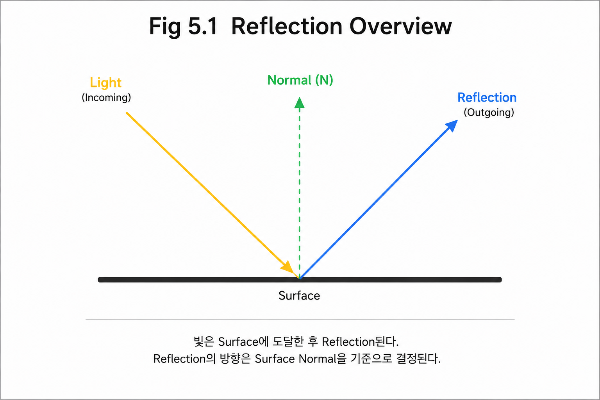
</p>

**Figure 5-1. Reflection Overview.** 이상적으로 매끄러운 Surface의 거울 반사 방향을 보여주는 예시다. 모든 Material의 Reflection이 하나의 방향으로만 나간다는 뜻은 아니며, Roughness와 Diffuse/Specular 모델에 따른 방향 분포는 이후 절에서 구분한다.

---

### What Is Reflection?

빛(Light)이 물체 표면(Surface)에 도달하면 여러 가지 현상이 동시에 발생한다.

일부는 물체 내부로 흡수(Absorption)되고,
일부는 내부를 통과(Transmission)하며,
일부는 다시 외부로 되돌아간다.

이때 표면에서 다시 외부로 방출되는 빛을 **Reflection(반사)** 이라고 한다.

Reflection은 우리가 물체를 인식하는 데 가장 중요한 광학 현상 중 하나이며, 재질(Material)의 특성을 결정하는 핵심 요소이기도 하다.

---

### Reflection and Material Appearance

같은 조명 아래에서도 재질마다 전혀 다른 모습을 보이는 이유는 Reflection 방식이 서로 다르기 때문이다.

예를 들어,

- 거울은 대부분의 빛을 일정한 방향으로 반사한다.
- 종이는 빛을 여러 방향으로 고르게 퍼뜨린다.
- 금속은 강한 하이라이트를 만든다.
- 거친 표면은 반사가 넓게 퍼지고 부드러운 표면은 반사가 집중된다.

즉,

> **재질(Material)의 차이는 Reflection 방식의 차이에서 비롯된다.**

Rendering은 바로 이러한 차이를 수학적으로 표현하는 과정이라고 볼 수 있다.

---

### Modeling Reflection

현실에서는 수많은 광자가 표면과 상호작용하며 매우 복잡한 반사 현상을 만들어 낸다.

하지만 이러한 현상을 모두 계산하는 것은 현재의 컴퓨터에서도 매우 큰 비용이 필요하다.

따라서 컴퓨터 그래픽스에서는 현실을 그대로 계산하는 대신,

**Reflection의 중요한 특징만 추출하여 단순화된 모델(Model)** 을 만든다.

이러한 모델을 사용하면 현실과 비슷한 결과를 훨씬 적은 계산량으로 표현할 수 있다.

---

### A Learning Path through Reflection Models

Reflection을 표현하는 방법은 오랜 시간 동안 계속 발전해 왔다.

초기의 모델은 단순하고 계산이 빨랐지만 현실과 차이가 컸다.

이후 더 현실적인 결과를 얻기 위해 다양한 Reflection Model이 등장했고,

오늘날 대부분의 Rendering Engine은 물리 기반(Physically Based Rendering, PBR)의 Reflection Model을 사용한다.

이번 Chapter에서는 이러한 발전 과정을 순서대로 살펴본다.

```text
Reflection
    ↓
Reflection Vector
    ↓
Lambert
    ↓
Phong
    ↓
Blinn-Phong
    ↓
Cook-Torrance
    ↓
Microfacet
    ↓
Radiometry
    ↓
BRDF
```

각 모델은 서로 다른 가정으로 Reflection의 일부 특성을 설명하며,

결국 하나의 질문을 해결하기 위한 과정이다.

> **Surface는 빛을 어떻게 반사하는가?**

이 질문에 대한 답을 찾는 것이 이번 Chapter의 목표이다.

---

### Key Takeaways

- Reflection은 표면에서 다시 외부로 나오는 빛이다.
- 재질의 차이는 Reflection 방식의 차이에서 비롯된다.
- 현실의 Reflection은 매우 복잡하기 때문에 단순화된 Reflection Model을 사용한다.
- 이번 Chapter에서는 Reflection Model이 BRDF까지 발전하는 과정을 학습한다.

---

## 5.2 Surface Normal

### Why Surface Normal Matters

우리는 물체의 표면을 바라볼 때 흔히 "어느 방향을 향하고 있는가?"라는 표현을 사용한다.

예를 들어,

- 바닥은 위를 향하고 있고,
- 벽은 옆을 향하며,
- 천장은 아래를 향한다.

사람은 이러한 방향을 직관적으로 이해할 수 있지만,

컴퓨터는 "표면이 어느 방향을 향하고 있는지"를 알 수 없다.

따라서 Rendering에서는 표면의 방향을 수학적으로 표현할 방법이 필요하다.

이때 사용하는 벡터가 **Surface Normal**이다.

---

### Surface Normal

Surface Normal은

> **표면에 수직(Perpendicular)인 방향을 나타내는 벡터(Vector)** 이다.

보통 **N**으로 표기하며,

Rendering에서는 가장 기본이 되는 방향 벡터이다.

<p align="center">
    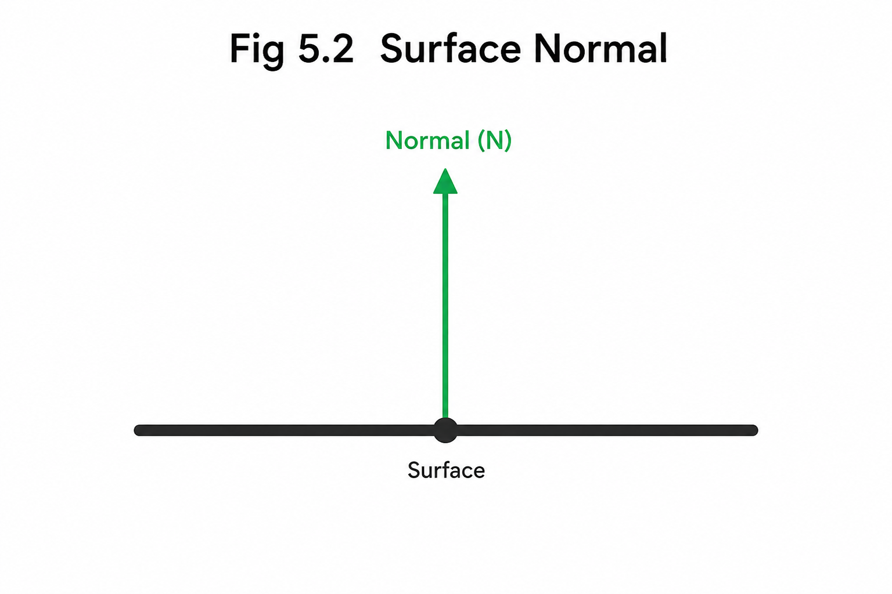
</p>


Surface Normal은

표면이 어느 방향을 향하고 있는지를 정의하는 기준축(Reference Direction) 역할을 한다.

---

### Normal Orientation

표면에는 무한히 많은 방향이 존재한다.

예를 들어 평평한 바닥 위에서는

앞뒤,
좌우,
대각선 등

수많은 방향을 정의할 수 있다.

하지만 이러한 방향들은 모두 표면 위에 존재하는 방향일 뿐,

표면 자체가 어느 방향을 향하고 있는지는 알려주지 않는다.

반면,

평면의 수직 방향은 서로 반대인 두 방향이다. Geometry의 Winding과 Surface의 앞면 규칙으로 사용할 방향을 정한다. Chapter 03의 Geometric Normal과 Shading Normal 구분도 유지한다. 아래 Lighting 계산의 N은 같은 Space에서 정규화한 Shading Normal이다.

따라서 컴퓨터 그래픽스에서는

표면의 방향을 표현하는 기준으로

Surface Normal을 사용한다.

---

### A Reference for Lighting

Rendering에서 계산하는 대부분의 값은

Surface Normal을 기준으로 이루어진다.

예를 들어,

- 빛이 어느 각도로 들어오는가?
- Reflection은 어느 방향으로 발생하는가?
- Surface는 얼마나 밝게 보이는가?
- Specular Highlight는 어디에 생기는가?

이 모든 계산은

Surface Normal을 기준으로 수행된다.

즉,

> **Surface Normal은 Rendering에서 모든 방향 계산의 기준축이다.**

---

### Callback

Chapter의 처음에서 우리는

> **왜 같은 빛을 받아도 물체마다 다르게 보일까?**

라는 질문을 던졌다.

이 질문에 답하기 위해서는

먼저 표면의 방향을 정의해야 한다.

왜냐하면

빛이 어느 방향으로 들어오고,

어느 방향으로 반사되는지는

모두 Surface Normal을 기준으로 결정되기 때문이다.

다음 장에서는

Surface Normal을 이용하여

빛이 어떤 방향으로 반사되는지 나타내는

**Reflection Vector**를 살펴본다.

---

### Key Takeaways

- Surface Normal은 표면에 수직인 방향을 나타내는 벡터이다.
- 보통 **N**으로 표기한다.
- Surface Normal은 표면의 방향을 정의하는 기준축이다.
- Rendering의 대부분의 방향 계산은 Surface Normal을 기준으로 이루어진다.

---

## 5.3 Reflection Vector

### Reflection Direction

Surface Normal을 이용하면 이제 빛이 표면과 어떤 관계를 가지는지 설명할 수 있다.

그렇다면 새로운 질문이 생긴다.

> **빛은 표면에 닿은 뒤 어떤 방향으로 반사될까?**

빛은 임의의 방향으로 반사되지 않는다.

Reflection에는 항상 일정한 규칙이 존재한다.

---

### Reflection Law

Reflection은 **Reflection Law(반사의 법칙)** 를 따른다.

이 법칙은 매우 단순하다.

> **입사각(Angle of Incidence)과 반사각(Angle of Reflection)은 항상 같다.**

여기서 중요한 점은

각도를 **Surface 자체가 아니라 Surface Normal을 기준으로 측정한다**는 것이다.

```
   Incident I          Reflected R
         ↘       N       ↗
           ↘     ↑     ↗
             ↘ θi│θr ↗
────────────────●──────────────── Surface
```

즉,

```
θi = θr
```

이 항상 성립한다.

이 규칙은 거울과 같은 완전히 매끄러운 표면(Specular Surface)에서 정확하게 성립하며,

이후 등장하는 Reflection Model의 출발점이 된다.

---

### Representing Reflection as a Vector

Reflection Law는 반사의 방향을 설명하지만,

컴퓨터는 "각도"보다 "벡터"를 이용하여 계산하는 것이 훨씬 편하다.

따라서 Rendering에서는

반사 방향을 하나의 벡터로 표현한다.

이 벡터를

**Reflection Vector**라고 한다.

보통 다음과 같이 표기한다.

- **L** : Surface에서 Light를 향하는 Unit Direction. 빛의 진행 방향은 I = -L
- **N** : Surface Normal
- **R** : Reflection Vector

<p align="center">
    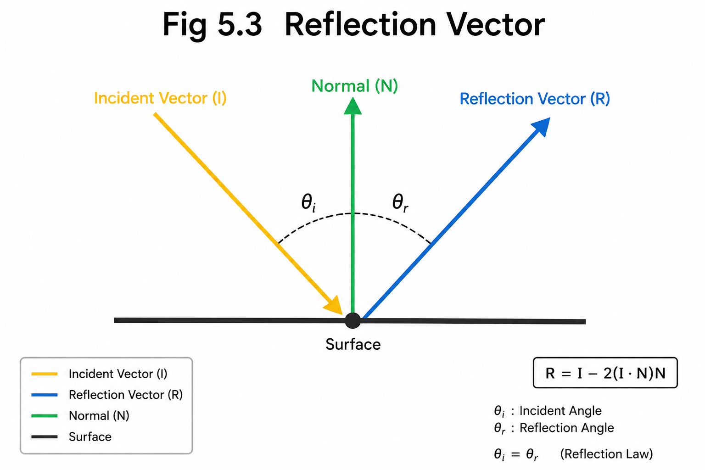
</p>

**Figure 5-3. Reflection Vector.** 그림의 `I`는 Surface로 들어오는 빛의 진행 방향이며, 본문의 Surface→Light 방향 `L`과 `I = -L` 관계다. 같은 Space의 Unit Normal `|N| = 1`을 사용하면 `R = I - 2(I·N)N = 2(N·L)N - L`이다. 입사각은 `-I`와 `N` 사이의 각도다.


Reflection Vector는

입사한 빛과 Surface Normal이 주어졌을 때

유일하게 결정되는 반사 방향이다.

---

### Computing the Reflection Vector

Reflection Vector는

입사 벡터를 Surface Normal을 기준으로 대칭시킨 결과이다.

수학적으로는 다음과 같이 계산한다.

```text
R = 2(N · L)N - L
// N과 L은 같은 Space의 Unit Vector. reflect(I, N)의 I는 -L이다.
```

여기서

- **N · L**은 Light Direction과 Surface Normal 사이의 내적(Dot Product)이다.
- 이 값을 이용하여 입사 벡터를 Normal 기준으로 반사시킨다.

이 공식 자체를 외우는 것이 중요한 것은 아니다.

중요한 것은

> **Reflection Vector는 Reflection Law를 수학적으로 표현한 결과**라는 점이다.

---

### Reflection Vector Decomposition

Chapter 03의 Dot Product로 L을 N 방향 성분과 접선 성분으로 나누면 식의 이유를 볼 수 있다.

```text
Lparallel = dot(N, L) * N
Lperpendicular = L - Lparallel
R = Lparallel - Lperpendicular = 2 * dot(N, L) * N - L
```

N 방향 성분은 유지하고 접선 성분의 부호를 바꾼다. N=(0,0,1), L=(0.6,0,0.8)이면 R=(-0.6,0,0.8)이다. 이 부호 규칙은 Chapter 08.4에서도 동일하게 사용한다.


Reflection Vector는

단순히 반사 방향 하나를 구하기 위한 벡터가 아니다.

초기의 Reflection Model 대부분은

Reflection Vector를 중심으로 만들어졌다.

예를 들어

- Phong Reflection은 Reflection Vector와 View Direction의 관계를 이용하여 Specular Reflection을 계산한다.
- Blinn-Phong은 Reflection Vector 계산을 단순화하기 위해 Half Vector를 도입한다.
- Cook-Torrance 역시 Reflection 방향을 기반으로 더욱 현실적인 Reflection을 모델링한다.

즉,

Reflection Vector는

Reflection Model 발전의 출발점이라고 할 수 있다.

---

### Callback

앞에서 우리는

Surface Normal이

Rendering의 기준 방향이라는 사실을 배웠다.

Reflection Vector는

그 기준 방향을 이용하여

빛이 어디로 반사되는지를 계산한다.

하지만 현실의 대부분의 Surface는

거울처럼 완벽하게 매끄럽지 않다.

그렇다면

거친 종이나 벽처럼

빛이 여러 방향으로 퍼지는 Surface는 어떻게 표현할 수 있을까?

다음 장에서는

가장 단순한 Reflection Model인

**Lambert Reflection**을 살펴본다.

---

### Key Takeaways

- Reflection은 Reflection Law를 따른다.
- 입사각과 반사각은 항상 같다.
- Reflection Vector는 반사 방향을 나타내는 벡터이다.
- Reflection Vector는 Reflection Law를 벡터로 표현한 결과이다.
- 이후의 Reflection Model은 Reflection Vector를 기반으로 발전하였다.

---

## 5.4 Lambert Reflection

### Beyond a Single Reflection Direction

Reflection Vector는 거울과 같이 매우 매끄러운 표면에서 빛이 어떻게 반사되는지를 설명한다.

하지만 주변을 둘러보면 대부분의 물체는 거울처럼 보이지 않는다.

종이,
나무,
콘크리트,
벽,
천과 같은 재질은 어느 방향에서 바라보아도 비슷한 밝기를 유지한다.

왜 이런 차이가 생기는 것일까?

Reflection Vector만으로는 이러한 현상을 설명할 수 없다.

---

### Diffuse Reflection

Diffuse는 종이·도료 같은 비금속에서 내부 산란 후 빛이 다시 나오는 현상 등을 단순화한 성분이다. Rough Surface에서 Specular가 넓게 퍼지는 현상과는 구분한다. 표면이 거칠다는 이유만으로 그 Reflection을 Diffuse라고 부르지는 않는다.

이처럼 빛이 특정 방향으로 집중되지 않고 다양한 방향으로 퍼지는 반사를

**Diffuse Reflection(난반사)** 이라고 한다.

Diffuse Reflection은 우리가 일상에서 가장 많이 보는 Reflection 형태이다.

---

### Lambertian Assumption

Lambertian Model은 다음과 같은 이상화된 Diffuse 가정을 사용한다.

> **같은 Irradiance를 받는 Surface의 Outgoing Radiance는 관찰 방향에 의존하지 않는다.**

즉,

관찰자가 어느 방향에서 Surface를 바라보더라도

Outgoing Radiance가 같다고 가정한다. 모든 방향으로 나가는 Power가 동일하다는 뜻은 아니다.

이 가정 덕분에 Reflection을 매우 간단한 수학으로 표현할 수 있게 되었다.

---

### Incident Angle and Irradiance

그렇다면 Surface의 밝기는 무엇으로 결정될까?

Lambert는

빛이 Surface에 얼마나 정면으로 도달하는가가

받는 에너지를 결정한다고 생각했다.

빛이 Surface를 정면으로 비출수록

더 많은 빛이 도달하고,

비스듬히 들어올수록

같은 양의 빛도 더 넓은 면적으로 퍼지게 된다.

따라서 Surface는 더 어둡게 보인다.

즉,

> **Surface의 밝기는 입사각에 따라 달라진다.**

---

### Lambert's Cosine Law

Lambert는 이러한 관계를 다음과 같이 표현하였다.

```text
DiffuseDirectionFactor = max(0, dot(N, L))
```

여기서

- **N** : Surface Normal
- **L** : Light Direction
- **N · L** : N과 L이 같은 Space의 Unit Vector일 때 두 방향 사이의 Cosine 값

이 식은 입사 방향에 따른 Cosine Factor이다. BRDF 자체는 아니며 Lambert BRDF의 Reflectance와 1/π는 5.19에서 연결한다.

입사각이 0°라면

빛은 Surface를 가장 정면으로 비추며

가장 밝게 보인다.

입사각이 커질수록

Cosine 값이 감소하여

Surface도 점차 어두워진다.

빛이 Surface 뒤쪽에서 들어오는 경우에는

여기서 다루는 One-sided Opaque Surface의 앞면에는 직접 기여하지 않으므로

음수는 0으로 처리한다.

---

<p align="center">
    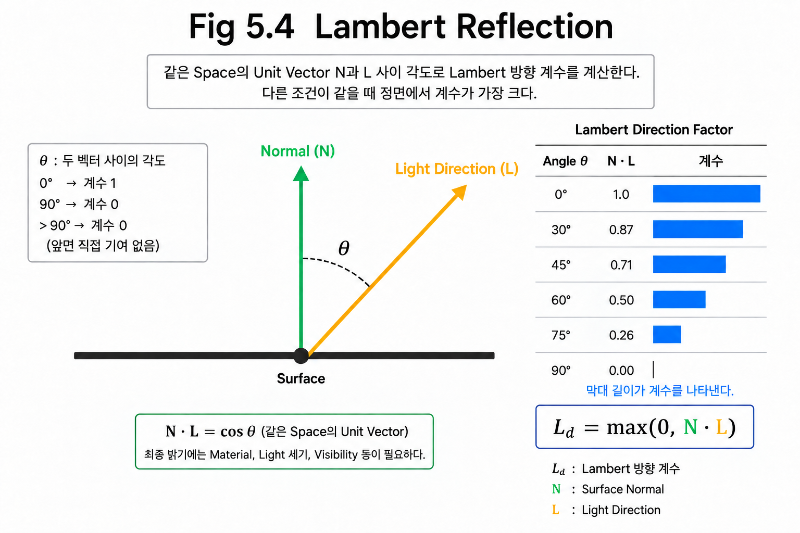
</p>

---

### The Role of Lambert Reflection

Lambert Reflection은

오늘날 기준으로는 매우 단순한 Reflection Model이다.

Specular Reflection도 없고,

재질에 따른 다양한 특성도 표현하지 못한다.

그럼에도 불구하고

Lambert는 Rendering 역사에서 매우 중요한 의미를 가진다.

왜냐하면

처음으로 Reflection을

수학적인 모델로 표현한 대표적인 Diffuse Reflection Model이기 때문이다.

오늘날의 PBR에서도

Diffuse Lighting의 기본 개념은 Lambert Reflection에서 시작된다.

---

### Callback

Reflection Vector는

거울처럼 빛이 한 방향으로 반사되는 현상을 설명했다.

Lambert는

현실에서 훨씬 흔한

Diffuse Reflection을 설명하기 위해 등장하였다.

하지만 Lambert에는 또 하나의 한계가 있다.

금속이나 플라스틱처럼 반짝이는 Surface를 전혀 표현할 수 없다.

다음 장에서는

이 문제를 해결하기 위해 등장한

**Phong Reflection**을 살펴본다.

---

### Key Takeaways

- Reflection Vector는 Specular Reflection을 설명한다.
- 현실의 대부분의 Surface는 Diffuse Reflection이 지배적이다.
- Lambert는 Diffuse Reflection을 설명하는 가장 대표적인 Reflection Model이다.
- Surface의 밝기는 **N · L**에 의해 결정된다.
- Lambert는 이후 모든 Reflection Model의 출발점이 되었다.

---

## 5.5 Phong Reflection

### Beyond Diffuse Reflection

Lambert Reflection은 현실에서 가장 흔한 Diffuse Reflection을 매우 간단하게 표현할 수 있는 모델이다.

하지만 Lambert만으로는 설명할 수 없는 Surface가 존재한다.

예를 들어,

- 금속은 밝은 하이라이트(Highlight)가 나타난다.
- 플라스틱은 은은한 광택이 보인다.
- 자동차 도장은 빛을 받으면 반짝인다.
- 물 표면은 시점에 따라 강한 빛을 반사한다.

이러한 현상은 Lambert Reflection만으로는 표현할 수 없다.

---

### Diffuse and Specular

지금까지 우리는 Reflection이라는 하나의 현상을 설명해 왔다.

하지만 실제 Reflection은 크게 두 가지 성분으로 나눌 수 있다.

#### Diffuse Reflection

빛이 Surface에서 여러 방향으로 퍼지는 반사이다.

관찰자의 위치가 달라져도 밝기가 크게 변하지 않는다.

대표적인 예는

- 종이
- 콘크리트
- 벽
- 나무

등이다.

Lambert Reflection은 이러한 Diffuse Reflection을 표현한다.

---

#### Specular Reflection

빛이 특정 방향으로 집중되어 반사되는 현상이다.

관찰자의 위치에 따라 밝기가 크게 달라진다.

대표적인 예는

- 금속
- 유리
- 플라스틱
- 물
- 자동차 도장

등이다.

우리가 흔히 말하는 **광택(Gloss)** 또는 **하이라이트(Highlight)** 가 바로 Specular Reflection이다.

---

### Highlight Formation

Highlight는 Surface 자체가 빛을 내는 것이 아니다.

빛이 특정 방향으로 강하게 반사되기 때문에

관찰자가 그 방향에 위치할 때 밝게 보이는 것이다.

즉,

Highlight는

- Light Direction
- Surface Normal
- View Direction

이 세 방향의 관계에 의해 결정된다.

여기서 처음으로

**View Direction**이라는 새로운 요소가 등장한다.

Lambert Reflection에서는 관찰자의 위치와 관계없이 밝기가 동일했지만,

Specular Reflection은 관찰자의 위치에 따라 계속 변한다.

---

### Phong Reflection

1975년, Bui Tuong Phong은

Specular Reflection을 매우 간단한 수학으로 표현하는 모델을 제안하였다.

Phong Reflection은

Reflection Vector와 View Direction이 얼마나 일치하는지를 이용하여

Highlight의 세기를 계산한다.

즉,

관찰자의 시선이 Reflection Vector와 가까울수록

Highlight는 더욱 강하게 나타난다.

반대로,

Reflection Vector에서 멀어질수록

Highlight는 빠르게 약해진다.

---

<p align="center">
    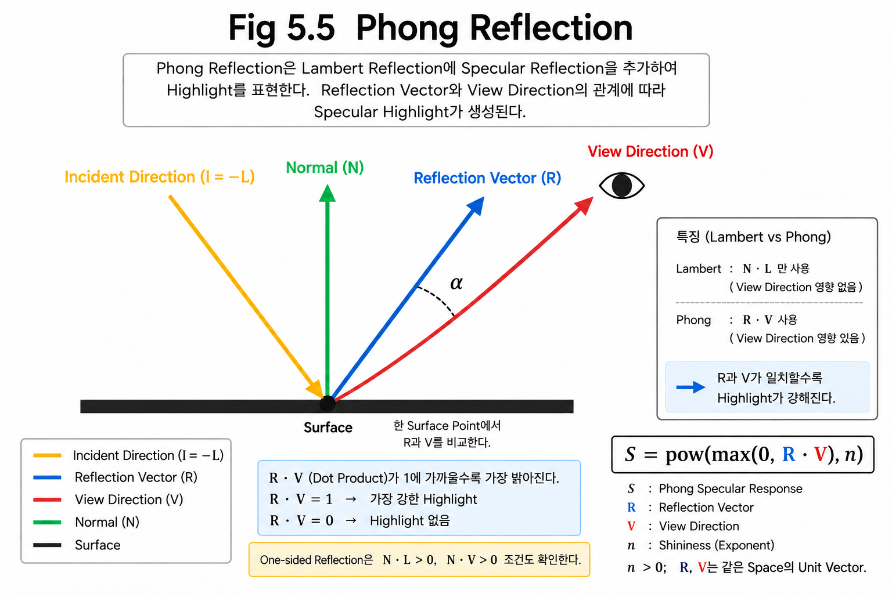
</p>

---

### Phong Response and Limitations

```text
SpecularResponse = pow(max(0, dot(R, V)), n)  // n > 0
```

R과 V는 같은 Space의 Unit Vector이며 V는 Surface→Camera이다. One-sided Reflection에는 dot(N,L)>0, dot(N,V)>0 조건도 필요하다. 이 경험적 Response에 Color와 Intensity를 곱하는 것만으로 Energy-conserving BRDF가 되지는 않는다. Chapter 08.4는 이 Response의 교육용 구현을 다룬다.


Phong Reflection은

Lambert가 표현하지 못했던

광택과 Highlight를 표현할 수 있게 만들었다.

덕분에 Surface는 훨씬 현실적으로 보이게 되었다.

하지만 여전히 한계도 존재한다.

Reflection Vector와 View Direction의 관계를 사용하며, 실제 계산 비용은 구현·컴파일 결과·Hardware에 따라 달라진다.

Highlight의 모양 역시 현실과는 차이가 있다.

이러한 문제를 해결하기 위해

다음 장에서는

Reflection Vector 대신 **Half Vector**를 사용하는

Blinn의 아이디어를 살펴본다.

---

### Callback

Lambert Reflection은

빛이 Surface에 얼마나 정면으로 들어오는지를 설명하였다.

Phong Reflection은

여기에 관찰자의 위치(View Direction)를 추가하여

Highlight를 표현하였다.

이제 Reflection은

단순히 빛이 들어오는 것만이 아니라

**빛과 시선이 함께 만드는 현상**으로 확장되기 시작한다.

---

### Key Takeaways

- Reflection은 Diffuse Reflection과 Specular Reflection으로 나눌 수 있다.
- Lambert Reflection은 Diffuse Reflection을 표현한다.
- Phong Reflection은 Specular Reflection을 표현한다.
- Phong은 Reflection Vector와 View Direction의 관계를 이용하여 Highlight를 계산한다.
- Specular Reflection은 관찰자의 위치에 따라 달라진다.

---

## 5.6 Half Vector

### From Reflection Vector to Half Vector

Phong Reflection은 Reflection Vector를 이용하여 Highlight를 계산하였다.

Reflection Vector는 Reflection Law를 기반으로 계산되기 때문에

물리적으로도 직관적인 방법이었다.

하지만 한 가지 문제가 있었다.

Highlight를 계산하려면

먼저 Reflection Vector를 계산한 후,

다시 View Direction과 비교해야 한다.

즉,

```text
Light Direction
        │
        ▼
Reflection Vector 계산
        │
        ▼
View Direction과 비교
        │
        ▼
Highlight 계산
```

Reflection Model이 복잡해질수록

Reflection Vector를 반복적으로 계산하는 비용은 점점 부담이 되었다.

더 간단한 방법이 필요했다.

---

### Blinn's Approach

James F. Blinn은

Reflection Vector를 직접 계산하지 않아도

Highlight를 표현할 수 있는 방법을 제안하였다.

그는 이렇게 생각했다.

> **Reflection Vector를 구하지 말고, Light와 View의 중간 방향을 사용하면 어떨까?**

이것이 Half Vector의 시작이다.

---

### Half Vector Definition

```text
H = normalize(L + V)
BlinnPhongResponse = pow(max(0, dot(N, H)), n)
```

L과 V는 같은 Space에서 Surface 바깥쪽을 향하는 Unit Vector이다. L+V가 0이면 H가 정의되지 않으므로 해당 경계에서는 Response를 0으로 처리하는 등의 명시적인 정책이 필요하다. Phong과 같은 n을 사용해도 Highlight 폭은 일반적으로 같지 않다.


Half Vector는

Light Direction과 View Direction의 정확한 중간 방향을 나타내는 벡터이다.

보통 **H**로 표기한다.

즉,

Light와 View가 이루는 각도를 정확히 절반으로 나누는 방향이다.

그래서 Half Vector(Halfway Vector)라는 이름이 붙었다.

<p align="center">
    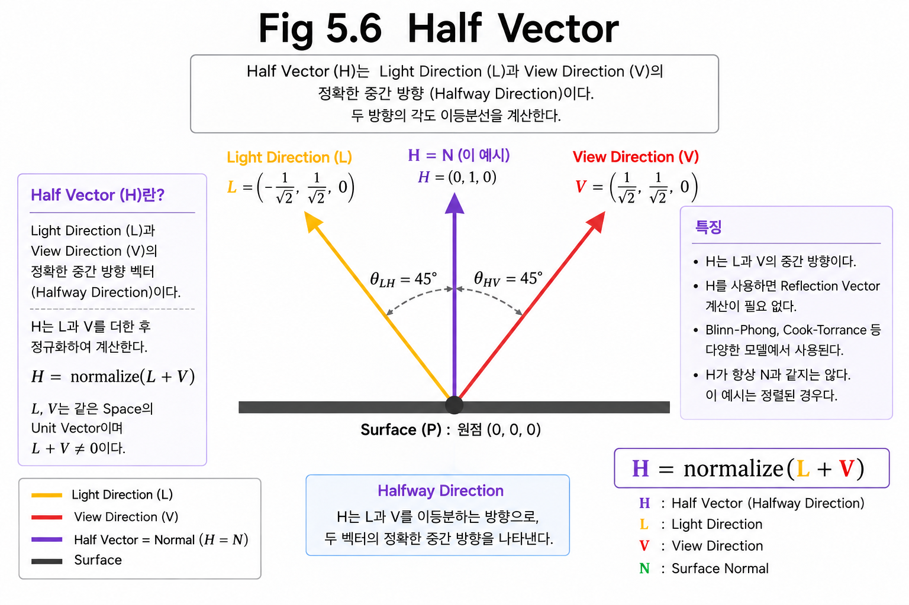
</p>

---

### Half Vector Alignment

거울처럼 완벽하게 매끄러운 Surface에서는

Highlight가 가장 강하게 나타나는 순간이 있다.

바로

Reflection Vector와 View Direction이 완전히 일치할 때이다.

Blinn은 이 조건을 다른 방식으로 바라보았다.

Reflection Vector를 계산하지 않아도

Surface Normal이 Half Vector와 일치하면

정반사의 최대 정렬 조건을 표현할 수 있다.

즉,

Phong은

```text
Reflection Vector ≈ View Direction
```

을 비교했다면,

Blinn은

```text
Surface Normal ≈ Half Vector
```

를 비교하였다.

Highlight의 최대 정렬 조건을 다른 Vector 관계로 표현한 것이다. 두 Model의 전체 Highlight 모양이 동일하다는 뜻은 아니다.

---

### The Role of the Half Vector

Half Vector는

Reflection Vector를 직접 계산하지 않아도 되므로

R 대신 H를 사용하는 구조가 된다. Normalize 비용을 포함한 실제 성능 우열은 별도로 측정해야 한다.

또한 Highlight의 모양도

Phong보다 더 자연스럽게 나타나는 경우가 많다.

이러한 이유로

Blinn-Phong Reflection은 오랫동안

실시간 Rendering의 대표적인 Specular Reflection Model로 사용되었다.

하지만 Half Vector의 진정한 가치는

단순히 계산량을 줄인 것이 아니다.

Microfacet Theory에서는 주어진 L과 V 사이에 완전한 거울 Reflection을 만드는 Microfacet의 Normal이 H와 정렬된다. 모든 Microfacet이 H를 향하는 것이 아니라, 그 방향의 분포 밀도를 D(H)로 평가한다.

즉,

Half Vector는

Cook-Torrance와 PBR을 이해하기 위한 가장 중요한 연결고리가 된다.

---

### Callback

Phong Reflection은

Reflection Vector를 이용하여 Highlight를 계산하였다.

Blinn은

Reflection Vector 대신 Half Vector를 사용하여

같은 정반사 정렬 조건을 H와 N의 관계로 표현하였다.

그리고 이 Half Vector는

다음 장에서 배우게 될 **Blinn-Phong Reflection**의 핵심 요소가 된다.

더 나아가

Cook-Torrance와 Microfacet Theory에서도

가장 중요한 벡터 중 하나로 사용된다.

---

### Key Takeaways

- Half Vector는 Light Direction과 View Direction의 중간 방향이다.
- Blinn은 Reflection Vector 대신 Half Vector를 사용하였다.
- Half Vector는 L과 V 사이에서 Reflection을 만드는 Facet 방향을 나타내며, 실제 성능은 구현에 따라 달라진다.
- Half Vector는 이후 Blinn-Phong과 Cook-Torrance의 핵심 개념이 된다.

---

## 5.7 Blinn-Phong Reflection

### Using the Half Vector

앞 장에서 Half Vector는

Light Direction과 View Direction의 중간 방향을 나타내는 벡터라는 것을 배웠다.

하지만 Half Vector 자체는 단지 하나의 벡터일 뿐이다.

실제로 Rendering에서는

이 벡터를 이용하여 Highlight의 세기를 계산해야 한다.

이를 위해 James F. Blinn은

Phong Reflection을 개선한 새로운 Reflection Model을 제안하였다.

이를 **Blinn-Phong Reflection**이라고 한다.

---

### Comparison with Phong

Phong Reflection은

Reflection Vector와 View Direction이 얼마나 일치하는지를 비교하였다.

즉,

```text
Reflection Vector ≈ View Direction
```

일수록 Highlight가 강해진다.

반면 Blinn-Phong은

Reflection Vector를 계산하지 않는다.

대신

Surface Normal과 Half Vector를 비교한다.

```text
Surface Normal ≈ Half Vector
```

Surface Normal이 Half Vector와 가까울수록

Surface는 더 강한 Highlight를 가진다.

즉,

비교 대상 자체가 달라진 것이다.

---

### Peak Alignment and Lobe Differences

Half Vector는

Light Direction과 View Direction의 정확한 중간 방향이다.

거울과 같은 이상적인 Surface에서는

가장 강한 Reflection이 발생하는 순간

Surface Normal 역시 Half Vector와 거의 같은 방향을 향하게 된다.

따라서

Reflection Vector를 직접 계산하지 않아도

비슷한 Highlight를 얻을 수 있다.

이것이 Blinn-Phong Reflection의 핵심 아이디어이다.

<p align="center">
    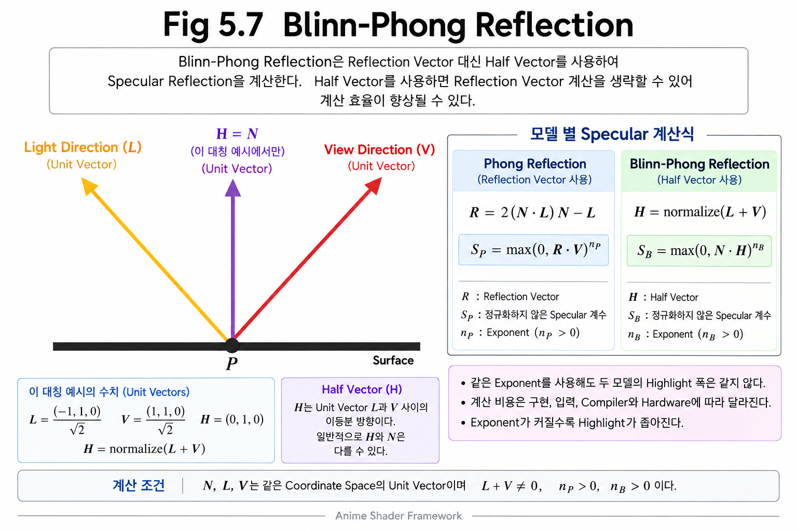
</p>

---

### Blinn-Phong Characteristics

Blinn-Phong Reflection은

Phong Reflection보다 계산이 단순하다.

또한 Highlight의 모양도

보다 자연스럽게 표현되는 경우가 많다.

이러한 이유로

Blinn-Phong은 오랫동안

실시간 Rendering에서 가장 널리 사용된 Specular Reflection Model이었다.

특히 게임 엔진에서는

PBR이 보편화되기 전까지

사실상의 표준 Reflection Model로 사용되었다.

---

### Remaining Limitations

Blinn-Phong은

Phong보다 개선된 Reflection Model이지만,

여전히 경험적인(Empirical) 모델이다.

즉,

실제 빛의 물리적인 특성을 기반으로 만들어진 것이 아니라,

현실과 비슷하게 보이도록 설계된 모델이다.

따라서 다음과 같은 문제들이 남아 있었다.

- Material마다 다른 Reflection 특성을 정확하게 표현하기 어렵다.
- 여기서 소개한 정규화되지 않은 Response는 Energy Conservation을 보장하지 않는다. 별도의 정규화와 에너지 배분을 적용한 변형과 구분한다.
- Surface의 미세한 구조(Micro Geometry)를 고려하지 않는다.
- Fresnel Effect를 표현하지 못한다.

이러한 한계를 해결하기 위해

Rendering은 점점 물리 기반(Physically Based) 모델로 발전하게 된다.

---

### Callback

Reflection의 역사를 살펴보면

Reflection Model은

조금씩 현실에 가까워지는 방향으로 발전해 왔다.

Reflection Vector에서 시작하여

Phong,

Blinn-Phong까지 발전했지만,

여전히 각 Shading Point의 Response에 Microfacet 분포·차폐·Fresnel을 명시적으로 결합하지 않았다.

하지만 현실의 Surface는

현미경으로 보면 전혀 그렇지 않다.

다음 장에서는

이러한 관점에서 등장한

**Microfacet Theory**를 살펴본다.

Microfacet Theory는

오늘날 PBR의 출발점이 되는 가장 중요한 아이디어이다.

---

### Key Takeaways

- Blinn-Phong은 Half Vector를 이용하여 Highlight를 계산한다.
- Phong은 Reflection Vector와 View Direction을 비교한다.
- Blinn-Phong은 Surface Normal과 Half Vector를 비교한다.
- Blinn-Phong은 계산이 단순하고 실시간 Rendering에 적합하다.
- 하지만 여전히 경험적인 Reflection Model이며 물리적인 정확성에는 한계가 있다.

---

**Part II — Physically Based Rendering**

> 기존 Reflection Model의 한계를 극복하기 위해 등장한
> 현대 Rendering의 핵심 개념을 살펴본다.

---

## 5.8 Limits of Simple Reflection Models

### Reflection Models So Far

지금까지 우리는

Reflection을 설명하기 위해 다양한 Reflection Model을 살펴보았다.

- Lambert Reflection
- Phong Reflection
- Blinn-Phong Reflection

각 모델은

이전 모델보다 현실에 가까운 Reflection을 표현할 수 있도록 발전해 왔다.

Lambert는 Diffuse Reflection을 설명하였고,

Phong은 Highlight를 표현하였으며,

Blinn-Phong은 Half Vector를 이용해 다른 Highlight Response를 구성하였다.

하지만 이러한 발전에도 불구하고

여전히 해결되지 않은 문제가 남아 있었다.

<p align="center">
    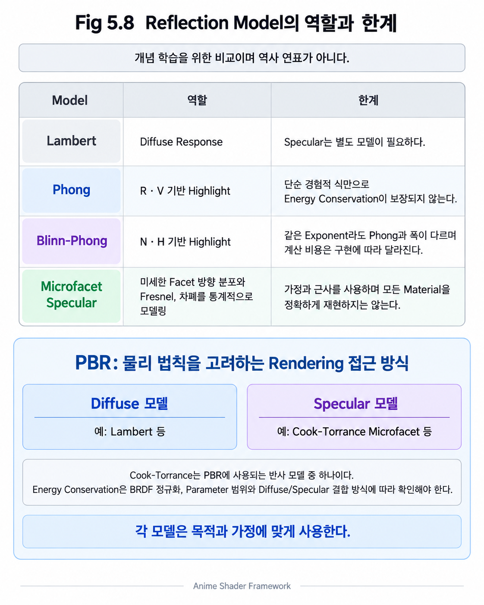
</p>

---

### Unresolved Microstructure

기존의 단순한 Phong/Blinn-Phong 설명은 각 Shading Point의 N과 경험적 지수로 Highlight를 조절한다. Mesh 전체가 하나의 Normal을 갖는다는 뜻은 아니다. 부족한 것은 Pixel보다 작은 Microfacet 방향 분포와 차폐·Fresnel을 결합한 명시적인 물리 모델이다.

하지만 현실의 Material은

현미경으로 확대하면

수많은 미세한 요철로 이루어져 있다.

Surface는 하나의 평면이 아니라,

매우 복잡한 구조를 가진다.

이러한 차이 때문에

기존 Reflection Model은

현실의 Reflection을 완전히 표현할 수 없다.

---

### Material Response Limitations

현실에는

금속,

플라스틱,

세라믹,

나무,

천,

피부처럼

매우 다양한 Material이 존재한다.

각 Material은

빛을 서로 다른 방식으로 반사한다.

하지만 기존 Reflection Model은

Material의 고유한 Reflection 특성을

충분히 표현하지 못한다.

결국

Highlight의 크기나 밝기를 조절하는 정도에 머무르게 된다.

---

### Physical Constraints

빛은

입사각에 따라

반사되는 양이 달라진다.

또한

Surface 내부에서 흡수되거나,

다른 Microfacet에 의해 가려질 수도 있다.

하지만 기존 Reflection Model은

이러한 물리적인 현상을 대부분 고려하지 않는다.

즉,

결과는 비슷하게 보일 수 있지만,

빛이 실제로 어떻게 반사되는지는 설명하지 못한다.

---

### Toward Physically Based Rendering

Rendering 기술이 발전하면서

단순히 보기 좋은 Reflection보다

실제 빛의 거동을 기반으로 한 Reflection이 필요해졌다.

이를 위해서는

Surface의 미세한 구조,

빛의 진행,

Material의 물리적인 특성을

함께 고려해야 한다.

이러한 요구에서 등장한 것이

**Microfacet Theory**이다.

---

### Callback

Lambert,

Phong,

Blinn-Phong은

각 시대를 대표하는 훌륭한 Reflection Model이었다.

하지만

현실의 Surface와 빛을

보다 정확하게 표현하기에는 한계가 있었다.

다음 장에서는

Surface를 하나의 평면이 아니라

수많은 작은 거울들의 집합으로 바라보는

**Microfacet Theory**를 살펴본다.

이 아이디어는

오늘날 PBR의 가장 중요한 기반이 된다.

---

### Key Takeaways

- 기존 Reflection Model은 Surface를 하나의 평면으로 가정한다.
- Material의 다양한 Reflection 특성을 충분히 표현하지 못한다.
- 빛의 물리적인 거동을 완전히 반영하지 못한다.
- 이러한 한계를 해결하기 위해 Microfacet Theory가 등장하였다.

---

## 5.9 Microfacet Theory

### Surface Microstructure

지금까지 살펴본 Reflection Model들은

각 Shading Point에서 단순화된 Surface Response를 사용하였다.

Lambert도,

Phong도,

Blinn-Phong도 모두 같은 가정을 사용한다.

하지만 현실의 Surface는 정말 완벽하게 매끄러울까?

현미경으로 확대해 보면

대부분의 Material은 수많은 미세한 요철을 가지고 있다.

우리가 눈으로는 매끄럽게 보이는 금속이나 플라스틱도

매우 작은 규모에서는 거친 구조를 가진다.

즉,

Rendering에서 사용하는 이상적인 Surface는

현실을 단순화한 모델일 뿐이다.

---

### The Microfacet Model

Microfacet Theory는

Surface를 하나의 평면으로 보지 않는다.

대신,

수많은 아주 작은 Surface들의 집합으로 생각한다.

이 작은 Surface 하나를

Microfacet이라고 한다.

각 Microfacet은

작은 거울처럼 빛을 반사한다.

즉,

Surface 전체가 빛을 반사하는 것이 아니라,

수많은 작은 거울들이 각각 빛을 반사한 결과가

우리가 보는 Reflection이 된다.

<p align="center">
    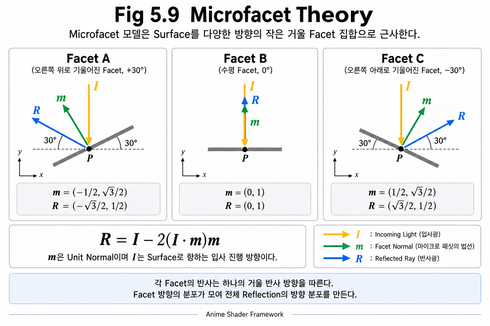
</p>

---

### Microfacet Orientation and Reflection Spread

모든 Microfacet이

같은 방향을 바라본다면

Reflection은 거울처럼 선명하게 나타난다.

하지만 현실에서는

각 Microfacet이

조금씩 다른 방향을 향하고 있다.

그 결과,

반사광도 여러 방향으로 퍼지게 된다.

이것이

Material마다 Highlight의 크기와 모양이 다른 이유이다.

매끄러운 금속은

Microfacet들의 방향이 거의 일정하므로

Highlight가 작고 선명하다.

거친 Surface는

Microfacet들의 방향이 다양하기 때문에

Highlight가 넓고 흐리게 퍼진다.

---

### Connection to the Half Vector

앞 장에서

Half Vector는

Light Direction과 View Direction의 중간 방향이라고 설명하였다.

Microfacet Theory에서는

이 Half Vector가 새로운 의미를 갖는다.

빛이 눈으로 반사되기 위해서는

Microfacet의 방향이

Half Vector와 거의 일치해야 한다.

즉,

Highlight를 만드는 것은

Surface 전체가 아니라,

Half Vector 방향을 향하고 있는 Microfacet들이다.

이 아이디어는

이후 Cook-Torrance Reflection의 핵심이 된다.

---

### A Statistical Model of Reflection

현실의 Surface에는

수많은 Microfacet이 존재한다.

그렇다면

Half Vector를 향하는 Microfacet은

전체 중 얼마나 될까?

Cook-Torrance Reflection은

이 질문을 수학적으로 해결한다.

즉,

Reflection을 하나의 방향으로 계산하는 것이 아니라,

특정 방향을 가진 Microfacet이

얼마나 존재하는지를 확률적으로 계산한다.

이것이

현대 PBR의 출발점이다.

---

### Callback

Lambert,

Phong,

Blinn-Phong은

Surface를 하나의 평면으로 생각하였다.

Microfacet Theory는

Surface를

수많은 작은 거울들의 집합으로 바라본다.

이 관점의 변화는

Reflection을 훨씬 현실적으로 표현할 수 있게 만들었다.

다음 장에서는

이 아이디어를 실제 Reflection Model로 구현한

**Cook-Torrance Reflection**을 살펴본다.

---

### Key Takeaways

- 현실의 Surface는 완벽하게 매끄럽지 않다.
- Surface는 수많은 Microfacet으로 이루어져 있다고 가정한다.
- 각 Microfacet은 작은 거울처럼 빛을 반사한다.
- Highlight는 Half Vector 방향을 향한 Microfacet들이 만든다.
- Microfacet Theory는 Cook-Torrance Reflection의 기반이 된다.

---

## 5.10 Cook-Torrance Reflection

### Physically Based Reflection

Microfacet Theory는

Surface가 수많은 작은 거울(Microfacet)로 이루어져 있다고 설명하였다.

하지만 이것만으로는 Reflection을 계산할 수 없다.

실제로 Rendering에서는

빛이 얼마나 반사되는지를 수학적으로 계산해야 한다.

Cook-Torrance Reflection은

Microfacet Theory를 기반으로

Reflection을 물리적으로 계산하기 위해 만들어진 Reflection Model이다.

오늘날 대부분의 PBR(Rendering)은

Cook-Torrance BRDF를 기반으로 동작한다.

---

### Required Terms

빛이 눈으로 반사되려면

단순히 Microfacet이 존재하는 것만으로는 충분하지 않다.

다음과 같은 조건들이 모두 만족되어야 한다.

- 적절한 방향을 가진 Microfacet이 존재해야 한다.
- 빛이 다른 Microfacet에 가려지지 않아야 한다.
- Material은 입사각에 따라 서로 다른 양의 빛을 반사한다.

Cook-Torrance는

이 세 가지 요소를 각각 계산하여

최종 Reflection을 구한다.

<p align="center">
    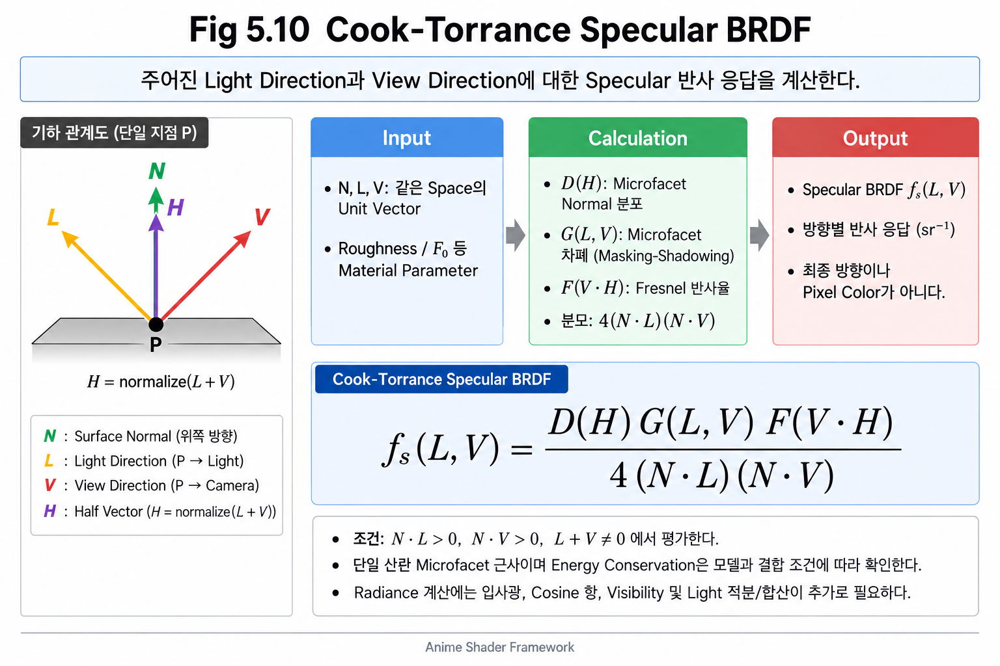
</p>

---

### Distribution, Geometry, and Fresnel

Cook-Torrance Reflection은

세 개의 핵심 요소로 이루어진다.

#### D (Normal Distribution Function)

Surface에는

어떤 방향을 가진 Microfacet이

얼마나 많이 존재하는가?

즉,

Microfacet의 방향 분포를 계산한다.

---

#### G (Geometry Function)

빛이

Microfacet 사이에서

가려지거나 차단되지 않는가?

즉,

Self Shadowing과 Masking 효과를 계산한다.

---

#### F (Fresnel)

Material은

입사각에 따라

반사되는 빛의 양이 달라진다.

이를 Fresnel Effect라고 하며,

Cook-Torrance는 이를 Reflection 계산에 포함한다.

---

### Combining the Terms

대표적인 Single-scattering Microfacet Specular BRDF는 다음 구조를 가진다.

```text
fr_specular = D(H) * F(dot(V,H)) * G(L,V) / (4 * dot(N,L) * dot(N,V))
H = normalize(L + V)
```

같은 Space의 Unit Vector와 양의 dot(N,L), dot(N,V)를 전제로 한다. 경계의 0 분모를 그대로 계산하지 않는다. D·G·F만 곱한 값은 이 BRDF 전체가 아니다. G는 Microfacet 사이의 차폐이며, 다른 Object가 Light를 가리는 Scene Visibility와 다르다. Chapter 08.3의 Vis를 G와 중복 또는 대체 관계로 취급하지 않는다.


세 요소는

각각 서로 다른 역할을 담당한다.

D가 없다면

Surface의 거칠기를 표현할 수 없다.

G가 없다면

Microfacet 사이의 차폐 효과를 표현할 수 없다.

F가 없다면

현실에서 나타나는 각도에 따른 Reflection 변화를 표현할 수 없다.

즉,

세 요소는 모두 필요하다.


---

### The Role of Cook-Torrance

Cook-Torrance Reflection은

기존 Reflection Model처럼

Highlight를 단순히 그리는 것이 아니다.

대신,

빛이 실제 Surface에서 어떻게 반사되는지를

물리적인 관점에서 계산한다.

이것이

오늘날 PBR이

기존 Reflection Model보다 훨씬 현실적인 이유이다.

---

### Callback

Reflection Model은

Lambert,

Phong,

Blinn-Phong을 거치며

점점 현실에 가까워졌다.

Cook-Torrance는

Microfacet Theory를 기반으로

Reflection을 물리적으로 설명하는 단계에 도달하였다.

하지만

아직 D, G, F 각각이

어떻게 Reflection에 영향을 주는지는 살펴보지 않았다.

다음 장에서는

Material의 가장 중요한 속성 중 하나인

**Roughness**를 먼저 이해한 후,

D, G, F를 자세히 살펴본다.

---

### Key Takeaways

- Cook-Torrance는 Microfacet Theory 기반의 Reflection Model이다.
- Reflection을 물리적으로 계산하기 위해 만들어졌다.
- D는 Microfacet의 방향 분포를 계산한다.
- G는 가려짐과 차폐 효과를 계산한다.
- F는 Fresnel Effect를 계산한다.
- Cook-Torrance는 현대 PBR의 핵심 Reflection Model이다.

---

**Part III — Cook-Torrance Components**

> Cook-Torrance Reflection은 하나의 공식이 아니라,
> 여러 물리적인 요소가 결합되어 만들어진 Reflection Model이다.
>
> 이제부터는 Cook-Torrance를 구성하는 핵심 요소들을 하나씩 살펴본다.

---

## 5.11 Roughness

### Highlight Variation

금속은 모두 같은 Highlight를 가질까?

그렇지 않다.

같은 금속이라도

거울처럼 잘 연마된 금속은
선명하고 작은 Highlight를 만들고,

사포로 긁힌 금속은
넓고 흐린 Highlight를 만든다.

플라스틱도 마찬가지이다.

새 제품은 반짝이는 광택을 가지지만,

오랫동안 사용한 플라스틱은
광택이 줄어들고 Reflection이 넓게 퍼져 보인다.

이처럼 같은 Material이라도
Surface 상태에 따라 Reflection은 크게 달라질 수 있다.

---

### Roughness

이러한 Surface의 거친 정도를 나타내는 값이

**Roughness**이다.

Roughness는

Surface가 얼마나 매끄러운지,
또는 얼마나 거친지를 나타내는 Material Parameter이다.

보통

- Roughness = 0 에 가까울수록 매우 매끄러운 Surface
- Roughness = 1 에 가까울수록 매우 거친 Surface

를 의미한다.

즉,

Roughness는
Reflection의 강도를 조절하는 값이 아니라,

Reflection이 얼마나 넓게 퍼지는지를 결정하는 값이다.

<p align="center">
    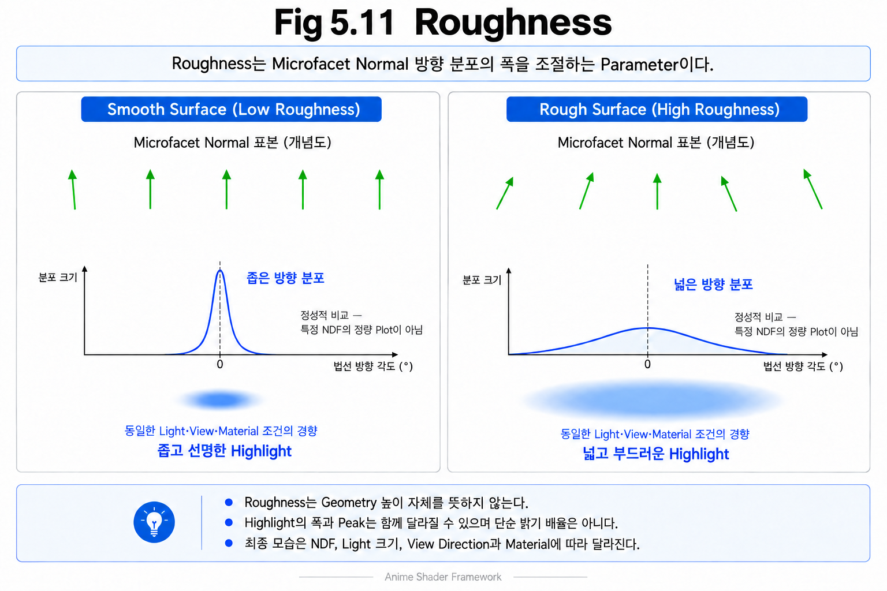
</p>

---

### Roughness and Reflection

Surface가 매우 매끄러우면

Microfacet들의 방향이 거의 일정하다.

따라서 Reflection은
하나의 방향으로 집중되고,

Highlight는 작고 선명하게 나타난다.

반대로

Surface가 거칠수록

Microfacet들은
서로 다른 방향을 향하게 된다.

그 결과

Reflection은 여러 방향으로 퍼지고,

Highlight도 넓고 부드럽게 나타난다.

즉,

> **Roughness가 증가할수록 Reflection은 넓게 퍼지고 Highlight는 흐려진다.**

---

### Roughness and Microfacet Distribution

앞 장에서

Surface는 수많은 Microfacet으로 이루어져 있다고 설명하였다.

Roughness는

이 Microfacet들이
얼마나 다양한 방향을 향하고 있는지를 나타낸다.

- Roughness가 작다.
  - Microfacet들의 방향이 거의 비슷하다.
  - Reflection이 집중된다.

- Roughness가 크다.
  - Microfacet들의 방향이 다양하다.
  - Reflection이 넓게 퍼진다.

즉,

Roughness는

Microfacet의 방향 분포를 간접적으로 표현하는 값이라고 볼 수 있다.

---

### Roughness as a Material Control

오늘날 대부분의 PBR Material에서는

가장 중요한 입력 값으로
Roughness를 사용한다.

왜냐하면

사람이 Material을 구분할 때

가장 먼저 인식하는 특성 중 하나가

Reflection의 퍼짐 정도이기 때문이다.

같은 색(Material Color)을 가진 Surface라도

Roughness가 달라지면

전혀 다른 Material처럼 보일 수 있다.

이러한 이유로

Roughness는

현대 Rendering에서
가장 중요한 Material Parameter 중 하나가 되었다.

---

### Callback

Roughness는

Surface가 얼마나 거친지를 나타내는 값이며,

Reflection의 퍼짐 정도를 결정한다.

하지만 아직 한 가지 질문이 남아 있다.

> **Roughness는 실제 Reflection 계산에 어떻게 사용될까?**

다음 장에서는

Cook-Torrance의 첫 번째 구성 요소인

**Normal Distribution Function(D)** 를 통해

Microfacet의 방향 분포를 어떻게 계산하는지 살펴본다.

---

### Key Takeaways

- Roughness는 Surface의 거친 정도를 나타내는 Material Parameter이다.
- Roughness는 Reflection의 퍼짐 정도를 결정한다.
- Roughness가 작을수록 Highlight는 작고 선명하다.
- Roughness가 클수록 Highlight는 넓고 부드럽다.
- Roughness는 Microfacet의 방향 분포와 밀접한 관계가 있다.

---

## 5.12 Normal Distribution Function (D)

### From Roughness to Distribution

앞 장에서는

Roughness가

Surface의 거친 정도를 나타내며,

Reflection의 퍼짐 정도를 결정한다는 것을 배웠다.

하지만 Roughness 자체만으로는

Reflection을 계산할 수 없다.

왜냐하면

Roughness는

Surface가 거칠다는 사실만 알려줄 뿐,

Microfacet들이

실제로 어떤 방향을 향하고 있는지는 알려주지 않기 때문이다.

---

### Microfacet Orientation Density

Microfacet Theory에서는

Surface가

수많은 작은 거울들로 이루어져 있다고 가정한다.

하지만

모든 Microfacet이

같은 방향을 향하고 있는 것은 아니다.

어떤 방향을 향한 Microfacet은 많고,

어떤 방향을 향한 것은 매우 적다.

그렇다면

Highlight를 만들 수 있는

Microfacet은

전체 중 얼마나 존재할까?

이 질문에 답하는 것이

**Normal Distribution Function(D)** 이다.

<p align="center">
    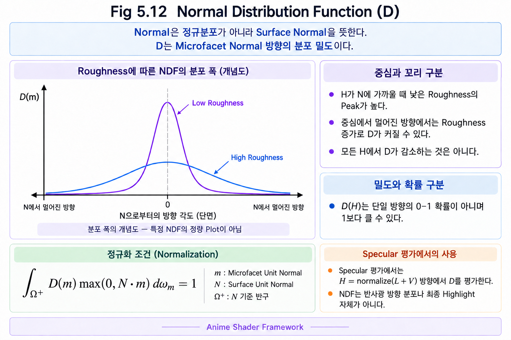
</p>

---

### Normal Distribution Function

Normal Distribution Function(NDF)은

특정 방향을 향하고 있는

Microfacet이

얼마나 존재하는지를 계산하는 함수이다.

즉,

Reflection을 만드는

Microfacet의 분포를

확률적으로 표현한 것이다.

여기서 말하는 "Normal"은

정규분포(Normal Distribution)가 아니라

**Surface Normal**을 의미한다.

따라서

Normal Distribution Function은

Surface Normal의 방향 분포 밀도를 나타내는 함수라고 이해하면 된다. D(H)는 단일 방향의 0–1 확률이 아니며 1보다 클 수 있다. 일반적인 Microfacet NDF는 반구에서 D(m)·max(0,N·m)을 Solid Angle에 대해 적분한 값이 1이 되도록 정규화한다.

---

### Roughness and Distribution

Roughness는

Surface가 얼마나 거친지를 나타내는 값이다.

D는

그 Roughness를 이용하여

Microfacet들의 방향 분포를 계산한다.

즉,

Roughness는 입력 값이고,

D는 그 값을 이용해

Reflection 계산에 필요한 분포를 만들어 낸다.

---

### Common Distributions

Rendering에서는

여러 종류의 Distribution Function이 사용된다.

대표적으로는

- Beckmann Distribution
- GGX (Trowbridge-Reitz Distribution)

등이 있다.

Beckmann과 GGX는 서로 다른 분포 모양을 가진다. GGX의 긴 Tail은 Highlight 바깥으로 퍼지는 응답을 표현하는 데 유용하다. 어떤 분포가 모든 Material에 항상 더 정확한 것은 아니다. Roughness에서 분포 Parameter로의 변환과 선택한 G는 구현별로 확인한다.

Foundation에서는 D가 방향 분포 밀도라는 관계를 이해하고, 구체적인 분포 유도와 비교 실험은 Advanced로 남긴다.

---

### Callback

Cook-Torrance에서

D는

Reflection을 만들 수 있는

Microfacet이 얼마나 존재하는지를 계산한다.

하지만

Microfacet이 존재한다고 해서

항상 Reflection이 눈에 도달하는 것은 아니다.

다른 Microfacet에 의해

빛이 가려질 수도 있기 때문이다.

다음 장에서는

이러한 차폐 효과를 계산하는

**Geometry Function(G)** 를 살펴본다.

---

### Key Takeaways

- D는 Normal Distribution Function이다.
- D는 특정 방향을 가진 Microfacet의 분포를 계산한다.
- Roughness는 D의 입력 값으로 사용된다.
- GGX와 Beckmann은 서로 다른 방향 분포를 제공하며 Model 선택과 Parameter 변환을 함께 확인한다.
- D는 Cook-Torrance의 첫 번째 구성 요소이다.

---

## 5.13 Geometry Function (G)

### Beyond the Distribution Term

앞 장에서는

Normal Distribution Function(D)을 통해

특정 방향을 향하고 있는 Microfacet이

얼마나 존재하는지를 계산하였다.

하지만

Reflection을 만들 수 있는 Microfacet이 존재한다고 해서

항상 그 빛이 눈까지 도달하는 것은 아니다.

현실의 Surface에서는

다른 Microfacet이

빛을 가릴 수도 있기 때문이다.

---

### Microfacet Occlusion

Surface는

수많은 Microfacet으로 이루어져 있다.

Surface가 거칠어질수록

Microfacet들은

서로 다른 방향을 향하게 된다.

이때

일부 Microfacet은

다른 Microfacet 뒤에 가려질 수 있다.

그 결과

빛이 Surface에 도달하지 못하거나,

반사된 빛이 눈까지 전달되지 못하는 현상이 발생한다.

즉,

실제로는 Reflection이 발생할 수 없는 상황이 생기는 것이다.

---

### Shadowing and Masking

Geometry Function은

대표적으로 두 가지 현상을 계산한다.

#### Shadowing

빛이 Surface에 들어오는 과정에서

다른 Microfacet에 의해 가려지는 현상이다.

즉,

Light Direction에서 발생하는 차폐이다.

---

#### Masking

반사된 빛이

관찰자에게 전달되는 과정에서

다른 Microfacet에 의해 가려지는 현상이다.

즉,

View Direction에서 발생하는 차폐이다.

---

### Geometry Function

Geometry Function(G)은

이러한 Shadowing과 Masking 효과를 고려하여

실제로 관찰자에게 도달할 수 있는 Reflection의 양을 계산하는 함수이다.

즉,

D가

Reflection을 만들 수 있는 Microfacet의 개수를 계산한다면,

G는

그 Reflection이 실제로 보일 수 있는지를 계산한다.

<p align="center">
    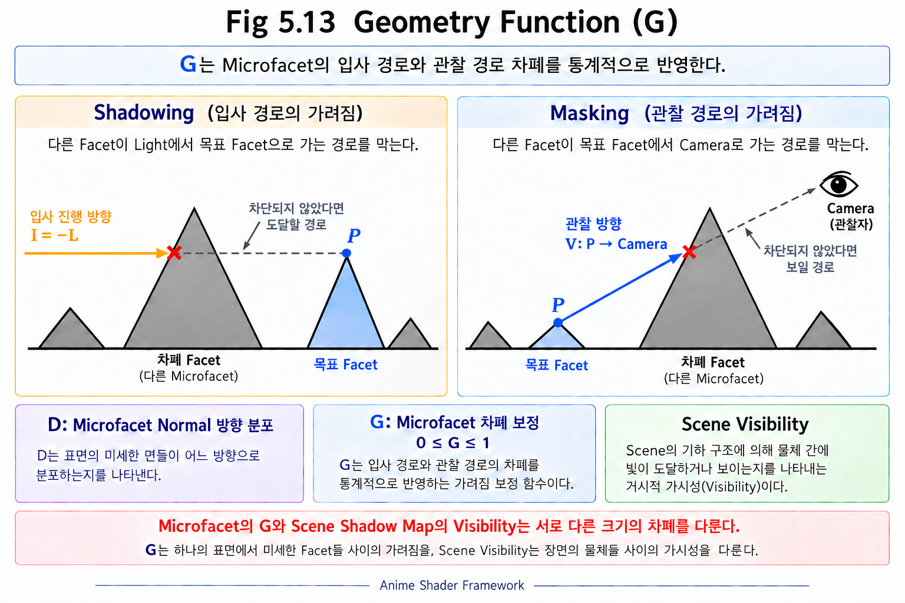
</p>

---

### The Role of Geometry Attenuation

Geometry Function이 없다면

빛은 항상

모든 Microfacet에서

자유롭게 반사되는 것처럼 계산된다.

하지만 현실에서는

Surface가 거칠어질수록

Microfacet끼리 서로 가려지는 현상이 자주 발생한다.

Geometry Function은

이러한 차이를 반영하여

Reflection을 더욱 현실적으로 만든다.

---

### Common Geometry Functions

Rendering에서는

여러 종류의 Geometry Function이 사용된다.

대표적으로

- Smith Geometry Function
- Schlick-GGX Geometry Function

등이 널리 사용된다.

오늘날 대부분의 PBR에서는

Smith 기반 Geometry Function을 사용하며,

GGX Distribution과 함께 사용하는 경우가 많다.

이번 Chapter에서는

Geometry Function의 수학적 유도보다,

왜 이러한 계산이 필요한지를 이해하는 것이 중요하다.

---

### Callback

Cook-Torrance에서

D는

Reflection을 만들 수 있는 Microfacet의 분포를 계산하였다.

G는

그 Reflection이

실제로 관찰자에게 도달할 수 있는지를 계산한다.

하지만

아직도 한 가지 요소가 남아 있다.

같은 Surface라도

빛이 들어오는 각도에 따라

반사되는 양 자체가 달라진다.

다음 장에서는

이 현상을 설명하는

**Fresnel(F)** 을 살펴본다.

---

### Key Takeaways

- G는 Geometry Function이다.
- G는 Shadowing과 Masking 효과를 계산한다.
- D는 Microfacet의 분포를 계산한다.
- G는 실제로 보이는 Reflection의 양을 계산한다.
- 현대 PBR에서는 Smith 기반 Geometry Function이 널리 사용된다.

---

## 5.14 Fresnel (F)

### Angle-dependent Reflectance

금속 공이나 유리컵을 자세히 보면

정면보다 가장자리에서 Reflection이 더욱 강하게 나타나는 것을 볼 수 있다.

자동차 도장,

물 표면,

플라스틱,

심지어 사람 피부도

비슷한 현상을 보인다.

같은 Material인데도

보는 각도에 따라 Reflection의 세기가 달라지는 것이다.

왜 이런 현상이 발생할까?

---

### Fresnel Effect

이러한 현상을

**Fresnel Effect**라고 한다.

Fresnel Effect는

빛이 Surface에 입사하는 각도에 따라

Reflection의 양이 달라지는 현상이다.

빛이 Surface를 정면으로 비출 때보다,

비스듬한 각도로 들어올수록

더 많은 빛이 Reflection된다.

즉,

> **Surface를 비스듬히 바라볼수록 Reflection은 더욱 강해진다.**

이것은 거의 모든 Material에서 나타나는 자연스러운 물리 현상이다.

<p align="center">
    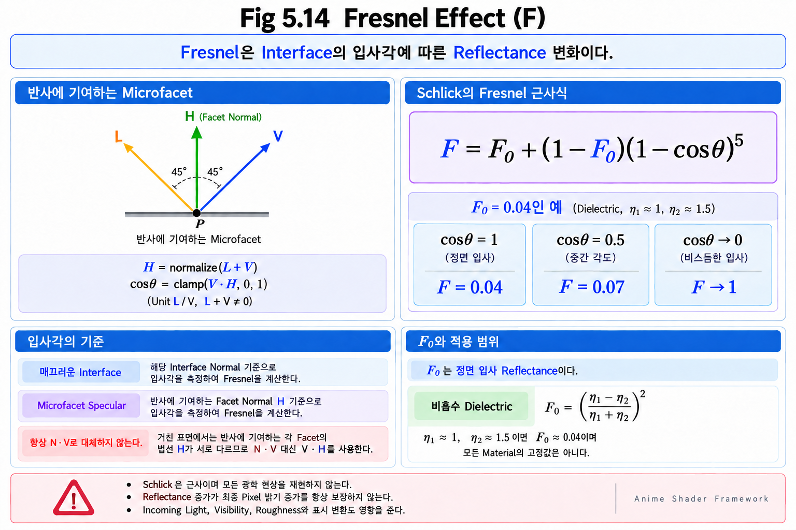
</p>

---

### The Role of Fresnel

기존 Reflection Model에서는

Reflection의 세기를

일정한 값으로 계산하는 경우가 많았다.

하지만 현실에서는

같은 Surface라도

입사각에 따라 Reflection의 양이 계속 변한다.

Fresnel을 고려하면

Surface는 훨씬 자연스럽고 현실적으로 보인다.

특히

금속,

유리,

물과 같은 Material에서는

이 차이가 더욱 크게 나타난다.

---

### Fresnel in Cook-Torrance

Cook-Torrance Reflection에서

F는

Fresnel Effect를 계산하는 요소이다.

즉,

현재의 입사각에서

얼마나 많은 빛이 Reflection되는지를 계산한다.

D가

Microfacet의 분포를 계산하고,

G가

Reflection이 실제로 보이는지를 계산했다면,

F는

Reflection의 양 자체를 결정한다.

---

### Schlick Approximation

Fresnel은 입사각에 따른 Reflectance 변화이다. 대표적인 실시간 근사는 다음과 같다.

```text
F = F0 + (1 - F0) * pow(1 - cosTheta, 5)
```

F0는 정면 입사 Reflectance이다. 매끄러운 Interface에서는 cosTheta가 입사 방향과 Interface Normal의 Dot Product이며, Microfacet Specular에서는 반사에 기여하는 Facet Normal H를 사용해 cosTheta=clamp(dot(V,H),0,1)로 평가한다. 이를 항상 N·V로 대체하지 않는다.

비흡수 Dielectric의 정면 입사에서는 F0=((η1-η2)/(η1+η2))²이다. 공기 η1≈1, 유리 계열 η2≈1.5의 예는 F0≈0.04가 된다. 이는 모든 Material의 고정값이 아니다. F0=0.04, cosTheta=0.5이면 Schlick 값은 약 0.07이다.

Metallic Workflow에서는 Dielectric의 Base Color가 주로 Diffuse를, Metal의 Base Color가 주로 RGB Specular Reflectance를 제어한다. 순수 Metal은 이 Model에서 Diffuse 성분을 두지 않는다. Roughness는 분포를 조절하는 값이며 Metallic은 단순한 Highlight 강도 Slider가 아니다.

Schlick은 근사이며 모든 광학 현상을 재현하지 않는다. 입사각에 따른 Reflectance 증가가 화면 가장자리의 최종 밝기 증가를 항상 보장하지도 않는다. Incoming Light, Visibility, Roughness, 표시 변환을 함께 고려한다. Chapter 07/08의 Artistic Rim과도 구분한다.

---

### Callback

Cook-Torrance Reflection은

세 가지 핵심 요소로 이루어진다.

- D는 Microfacet의 방향 분포를 계산한다.
- G는 Shadowing과 Masking을 계산한다.
- F는 입사각에 따른 Reflection의 양을 계산한다.

이 세 요소가 함께 동작하여

현실적인 Reflection을 만들어 낸다.

하지만 아직 한 가지 질문이 남아 있다.

> **Reflection은 정확히 무엇을 계산하고 있는 것일까?**

다음 Part에서는

빛의 에너지를 어떻게 표현하는지 살펴보는

**Radiometry**를 알아본다.

---

### Key Takeaways

- Fresnel Effect는 입사각에 따라 Reflection의 양이 달라지는 현상이다.
- Surface를 비스듬히 바라볼수록 Reflection은 강해진다.
- F는 Cook-Torrance에서 Fresnel Effect를 계산하는 요소이다.
- 대부분의 PBR Engine은 Schlick Approximation을 사용한다.
- D, G, F가 함께 현실적인 Reflection을 만든다.

---

---

### Part III Summary

지금까지 Cook-Torrance Reflection을 구성하는 핵심 요소들을 살펴보았다.

Cook-Torrance는 하나의 거대한 공식이 아니라,

각기 다른 역할을 하는 세 가지 요소가 함께 동작하여 현실적인 Reflection을 만들어내는 Reflection Model이다.

- **Normal Distribution Function(D)** 는 Reflection을 만들 수 있는 Microfacet의 분포를 계산한다.
- **Geometry Function(G)** 는 Shadowing과 Masking을 고려하여 실제로 관찰자에게 도달하는 Reflection을 계산한다.
- **Fresnel(F)** 은 입사각에 따라 Reflection의 양이 어떻게 달라지는지를 계산한다.

이 세 요소는 서로 독립적으로 존재하는 것이 아니라, 하나의 Reflection Model 안에서 함께 작동하며 현실적인 Material 표현을 가능하게 한다.

하지만 아직 한 가지 중요한 질문이 남아 있다.

> **Cook-Torrance는 정확히 무엇을 계산하고 있는 것일까?**

지금까지는 Reflection의 형태와 특성을 중심으로 살펴보았다면,

다음 Part에서는 빛을 **에너지(Energy)** 의 관점에서 바라보는 **Radiometry**를 통해 Reflection이 실제로 어떤 물리량을 계산하는지 알아본다.

---

**Part IV — Light and BRDF**

> 지금까지는 Reflection이 어떻게 만들어지는지를 살펴보았다.
>
> 이제부터는 Reflection을 구성하는 **빛(Light)** 을 물리적인 관점에서 이해하고,
> Surface가 빛을 어떻게 반사하는지를 설명하는 **BRDF**를 알아본다.

---

## 5.15 Radiometry

### Why Measure Light?

현실의 빛은

밝기도 다르고,

방향도 다르며,

거리와 Surface의 상태에 따라서도

전달되는 양이 달라진다.

Rendering에서는

이러한 빛을 단순히

"밝다", "어둡다"라고 표현하는 것이 아니라,

얼마나 많은 빛의 에너지가 이동하는지를

수학적으로 계산해야 한다.

이를 위해 사용하는 체계가

**Radiometry**이다.

---

### Radiometry

Radiometry는

빛을 **에너지(Energy)** 의 관점에서 측정하는 학문이다.

즉,

빛이

얼마나 많이 방출되고,

얼마나 많이 전달되며,

얼마나 많이 Surface에 도달하고,

얼마나 많이 반사되는지를

물리량으로 표현한다.

Rendering에서 사용하는 대부분의 Reflection 계산은

Radiometry를 기반으로 한다.

---

### The Role of Radiometry

지금까지 살펴본

Lambert,

Phong,

Blinn-Phong,

Cook-Torrance는

모두 Reflection을 계산하는 모델이다.

하지만

이 Reflection들은

무언가를 반사하고 있다.

그 "무언가"가 바로

빛의 에너지이다.

즉,

Reflection Model은

빛의 에너지를 입력으로 받아

Surface에서 어떻게 반사되는지를 계산하는 것이다.

Radiometry는

바로 그 입력이 되는 빛을 정의한다.

---

### Radiometric Quantities

Rendering에서 가장 자주 등장하는 Radiometry의 물리량은

다음 네 가지이다.

- **Radiant Flux(Φ)** : 단위 시간당 전달되는 Radiant Energy, 단위 W (= J/s).
- **Irradiance(E)** : Surface의 단위 면적당 입사 Flux, 단위 W/m².
- **Radiance(L)** : 진행 방향에 수직인 투영 면적과 Solid Angle당 Flux, 단위 W/(m²·sr).
- **Radiant Intensity(I)** : 광원이 단위 Solid Angle로 방출하는 Flux, 단위 W/sr.

Solid Angle은 방향들이 차지하는 입체적인 범위이며 단위는 sr이다. Energy와 Power, 면적당 값과 방향당 값을 구분하면 BRDF의 단위를 이해할 수 있다.

이들은 각각

빛이

방출되고,

전달되고,

Surface에 도달하며,

다시 반사되는 과정을 설명한다.

---

### Understanding the Relationships

처음 Radiometry를 접하면

용어가 많고 비슷해 보여 어렵게 느껴질 수 있다.

하지만 지금 단계에서는

각 물리량의 정의를 모두 암기할 필요는 없다.

중요한 것은

Rendering이

빛의 에너지를 계산하는 과정이며,

Radiometry는

그 에너지를 표현하기 위한 언어라는 점이다.

각 물리량은

이후 BRDF를 설명하면서

자연스럽게 다시 등장하게 된다.

---

### Callback

지금까지는

빛 자체를 설명하였다.

하지만

Rendering에서 중요한 것은

빛 자체보다

빛이 Surface에서 어떻게 반사되는가이다.

이 관계를 수학적으로 표현한 것이

**BRDF(Bidirectional Reflectance Distribution Function)** 이다.

다음 장에서는

BRDF가 무엇이며,

왜 현대 Rendering의 핵심 개념이 되었는지 알아본다.

---

### Key Takeaways

- Radiometry는 빛을 에너지의 관점에서 측정하는 체계이다.
- Reflection Model은 빛의 에너지를 입력으로 사용한다.
- Rendering은 빛의 이동과 반사를 계산하는 과정이다.
- Radiometry는 BRDF를 이해하기 위한 기초가 된다.

---

## 5.16 BRDF Framework

### A Common Description of Reflection

앞에서 Lambert, Phong, Blinn-Phong, Cook-Torrance를 비교했다. 이제 같은 질문으로 묶는다.

> 특정 방향에서 도달한 Irradiance가 특정 방향의 Outgoing Radiance에 얼마나 기여하는가?

**BRDF(Bidirectional Reflectance Distribution Function)**는 이 관계를 나타낸다. Bidirectional은 입사와 출사라는 두 방향을 뜻한다. 여기서 두 Vector는 모두 Surface에서 바깥을 향하도록 정의한다. Incoming Direction L은 광원 쪽을 가리키며 빛의 실제 진행 방향은 -L이다.

BRDF는 특정 Algorithm 이름이 아니다. Lambertian BRDF와 Microfacet BRDF는 이 정의를 만족시키는 서로 다른 Model이다. 앞에서 소개한 단순 Phong/Blinn-Phong Highlight Response를 그대로 Energy-conserving BRDF라고 부르지는 않는다. 정규화와 Diffuse/Specular 에너지 배분을 함께 확인해야 한다.

### Connection to Implementation

Chapter 08의 Artistic Mask도 방향과 재질을 입력받지만 모든 Mask가 BRDF인 것은 아니다. 교육용 Highlight나 Rim Mask의 목적은 제어 가능한 모양을 만드는 것이며 물리적 Reflectance와 역할을 구분한다. 다음 Section에서는 BRDF 값과 Lighting Result를 분리한다.

---

## 5.17 BRDF Inputs and Output

### Inputs

BRDF는 현재 Shading Point의 Material과 방향 관계로 평가한다.

| Input | Meaning |
|---|---|
| L / ωi | Surface에서 입사 광원을 향하는 Unit Direction |
| V / ωo | Surface에서 출사 방향을 향하는 Unit Direction |
| N | 같은 Space의 Unit Shading Normal |
| Material | Base Color, Roughness, Metallic 등 선택한 Model의 Parameter |
| Tangent Basis | Anisotropic Model처럼 접선 방향이 필요한 경우의 기준 |

N과 Material은 간결한 기호 fr(ωi,ωo)에서 생략될 수 있지만 실제 평가에는 포함된다. Light Intensity를 Material Property와 혼동하지 않는다.

### Output

BRDF의 출력 fr은 **단위 입사 Irradiance당 특정 방향의 Outgoing Radiance 응답**이다. 단위는 sr⁻¹이며 최종 RGB 밝기나 0–1 비율 자체가 아니다. RGB Rendering에서는 파장별 특성을 RGB 세 성분으로 근사한다.

빛의 세기가 바뀌면 같은 Material의 BRDF는 그대로여도 최종 Radiance는 바뀐다. Roughness를 바꾸면 BRDF의 방향 분포가 달라져 Highlight가 변한다. 따라서 Shader에서 Material Response와 Incoming Light를 별도 입력으로 유지한다.

### Data Flow

```text
Directions + Surface Basis + Material Properties → BRDF
Incoming Radiance + BRDF + Incident Cosine       → Reflected Contribution
Contributions over Incoming Directions          → Reflected Radiance
Reflected Radiance + Emitted Radiance           → Outgoing Radiance
```

이것은 하나의 Surface에서 평가하는 관계이다. Chapter 06은 Direct/Indirect Lighting이 Incoming Radiance를 어떻게 제공하는지 연결한다.

---

## 5.18 BRDF Definition and Rendering Equation

### Definition

현재 Surface 위치를 고정하면 BRDF는 다음과 같이 정의한다.

```text
fr(ωi, ωo) = dLo(ωo) / dEi(ωi)
dEi(ωi)   = Li(ωi) * max(0, dot(N, ωi)) * dωi
```

Li와 Lo는 Radiance이며 E는 Irradiance이다. d는 작은 방향 영역이 만드는 미소 기여를 나타낸다. 입사각의 Cosine은 빛이 Surface의 실제 면적에 얼마나 분산되는지를 반영한다. fr 안에 Light Intensity를 넣는 것이 아니라 이 입사 기여와 곱해 사용한다.

### Rendering Equation

Opaque Reflective Surface의 반구 Ω+에 대한 기본 관계는 다음과 같다.

```text
Lo(ωo) = Le(ωo)
       + ∫Ω+ fr(ωi, ωo) * Li(ωi) * max(0, dot(N,ωi)) dωi
```

Le는 Surface 자체의 Emission이다. Li는 해당 Surface에 실제 도달하는 Radiance이므로 이미 차폐된 값이라면 Visibility를 다시 곱하지 않는다. 차폐 전 Light 기여를 별도로 평가하는 구현에서는 해당 Light의 Vis를 한 번 적용한다. V는 View Direction, Vis는 Visibility로 표기를 구분한다.

Real-time Rendering은 모든 방향을 매 Pixel에서 정확히 적분하기보다 Light별 평가, Environment Sampling, Probe 등으로 근사한다. BRDF는 Surface의 응답이며 어떤 Light를 어떻게 Sample할지는 별개의 문제이다.

### Physical Constraints

일반적인 수동 반사 Material에는 Non-negativity와 Energy Conservation이 필요하다. 고정된 입사 방향에 대해 fr·max(0,N·ωo)를 출사 반구 전체에서 적분한 값이 1을 넘지 않아야 한다. 일반적인 Reciprocal Material은 입사·출사 방향을 교환해도 같은 BRDF를 가진다.

이 조건은 식에 PBR 또는 Cook-Torrance라는 이름을 붙이는 것만으로 충족되지 않는다. Diffuse와 Specular를 합칠 때의 에너지 배분, Model의 정규화, Parameter 범위를 함께 확인한다. Multiple Scattering 보정 등 정밀한 Model 비교는 Advanced에서 다룰 수 있지만 기본 조건은 Foundation에 남긴다.

### Basic Validation

Light Intensity만 두 배로 바꾸면, 선형 연산과 같은 Visibility 조건에서 반사 Radiance는 두 배가 된다. BRDF 자체가 두 배가 되는 것은 아니다. 화면의 표시 RGB는 Exposure와 Tone Mapping을 거치므로 이 선형 관계를 그대로 보장하지 않는다. Chapter 06에서 그 차이를 연결한다.

---

## 5.19 Lambertian BRDF

### Cosine Factor and Reflectance

5.4의 max(0,N·L)은 입사 방향의 Cosine Factor였다. Lambertian BRDF 자체는 다음과 같다.

```text
fr_diffuse = ρ / π
Lo_diffuse = (ρ / π) * Ei
```

ρ는 Diffuse Reflectance이며 각 Color 성분은 물리적인 기본 Model에서 0–1 범위이다. Ei는 이미 입사 Cosine을 포함해 Surface에 도달한 전체 Irradiance이다. 따라서 두 번째 식에 N·L을 다시 곱하지 않는다. 반대로 방향별 Incoming Radiance로부터 시작하면 5.18처럼 입사 Cosine과 방향 영역을 포함해 적분한다.

1/π는 단순한 밝기 조절 상수가 아니다. 출사 반구의 Cosine 적분이 π이므로, 이를 나눠 반사 Flux가 입사 Flux의 ρ배가 되도록 만든다. 고정된 Ei에서 Lo는 관찰 방향에 의존하지 않는다.

### Numerical Check

ρ=0.5, Ei=π W/m²이면 Lo=0.5 W/(m²·sr)이다. Ei를 두 배로 하면 Lo도 두 배가 되고, Camera 방향만 바꾸면 이상적인 Lambertian Lo는 유지된다. 이 검사는 Specular가 없는 동일 Surface 위치를 가정한다.

Chapter 08.2의 BaseColor·max(0,N·L)은 제어 가능한 교육용 Base Lighting이다. 별도 광량 및 단위·정규화 없이 이를 완성된 PBR Lighting으로 취급하지 않는다.

### Chapter Summary

- N, L, V의 Space와 방향 규칙이 Reflection 계산의 출발점이다.
- Phong/Blinn-Phong은 방향 관계로 Highlight를 구성하는 방법을 보여준다.
- Microfacet Model은 Roughness와 D·G·F를 통해 Specular 분포와 차폐·반사율을 연결한다.
- BRDF와 Incoming Radiance를 결합해야 Lighting Result를 얻는다.
- BRDF 값, Diffuse Cosine Factor, 최종 표시 밝기는 서로 다른 값이다.

### Next: Modern Real-time Rendering

Chapter 06에서는 이 Surface Response에 Direct/Indirect Lighting과 Environment Reflection이 합쳐지는 과정, 그리고 HDR·Exposure·Tone Mapping·Color Output을 살펴본다. Chapter 04의 Material Property가 실제 Rendering 결과에 어떻게 연결되는지 이어서 확인한다.
