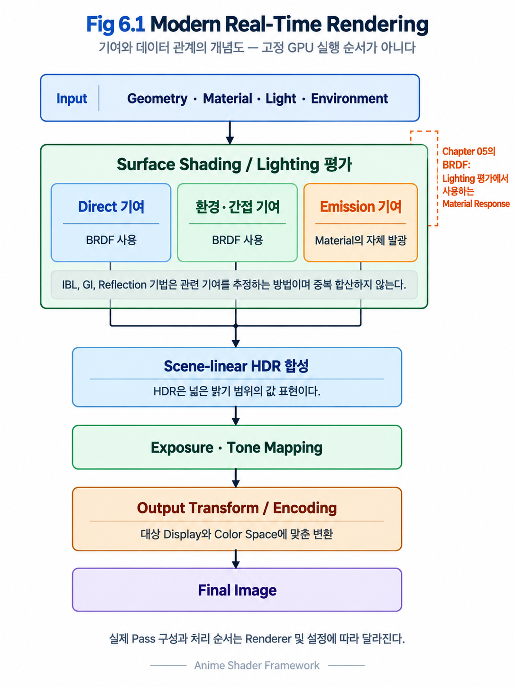
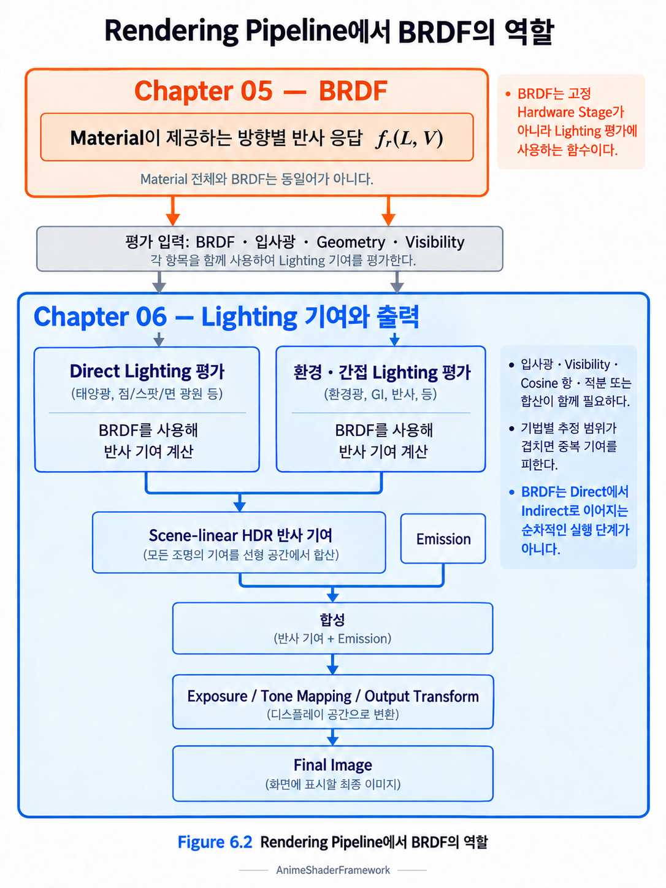
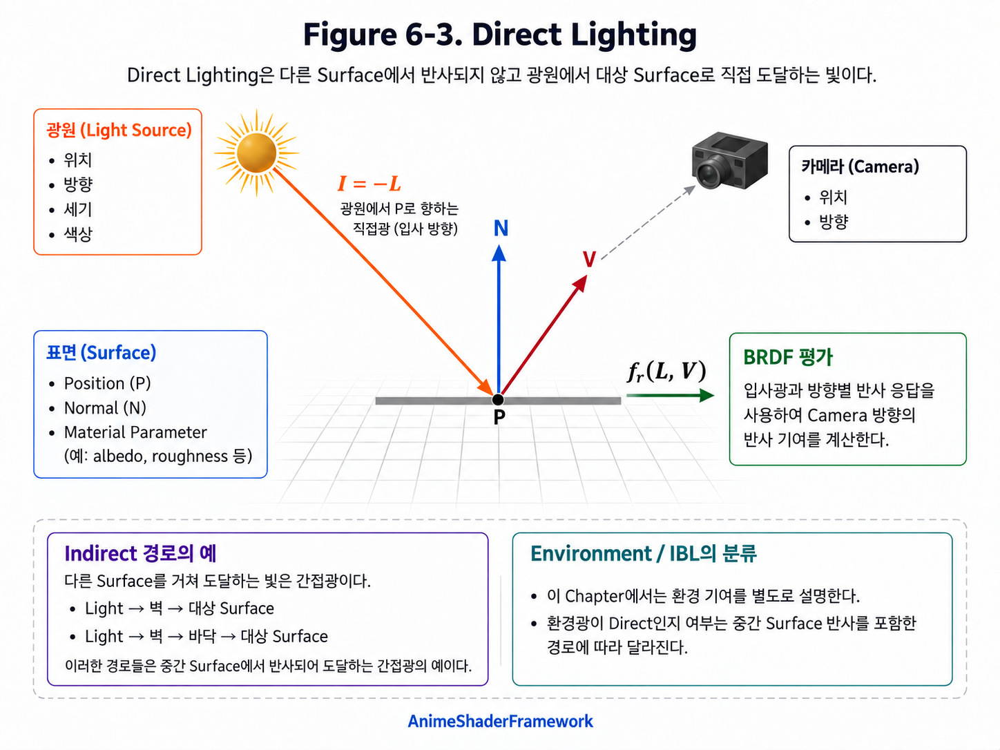
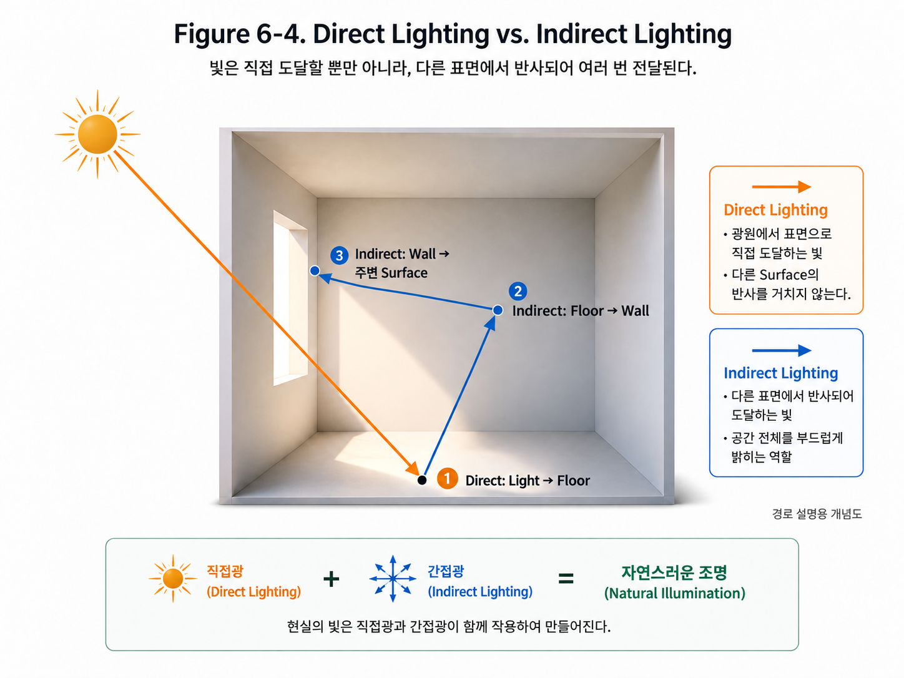
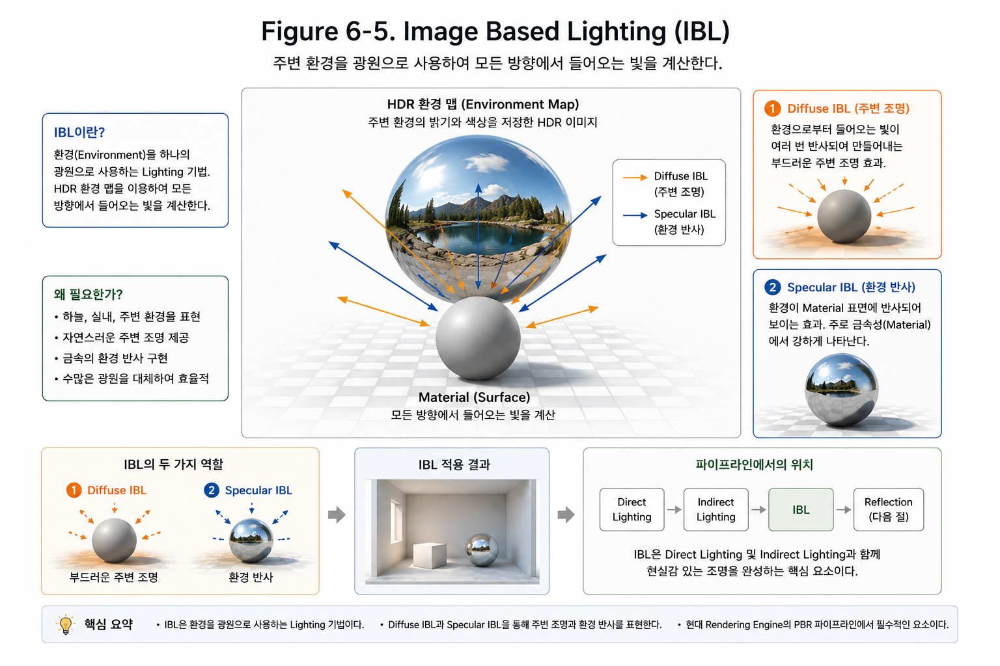
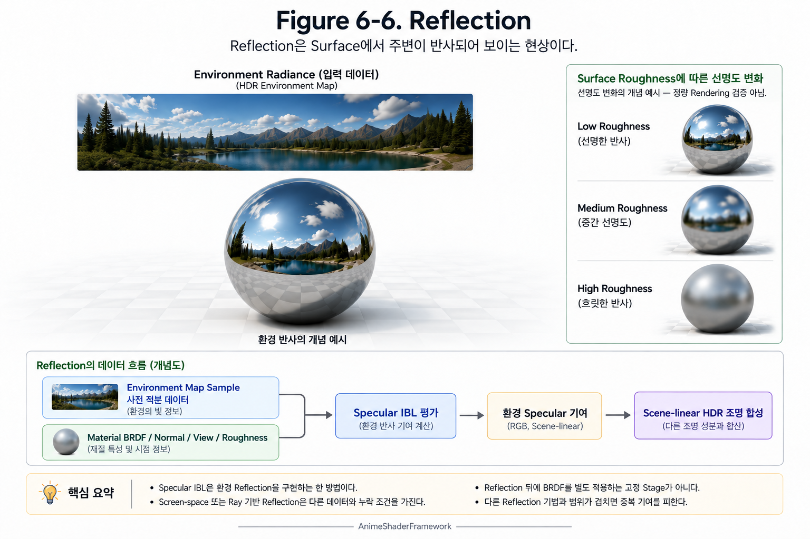
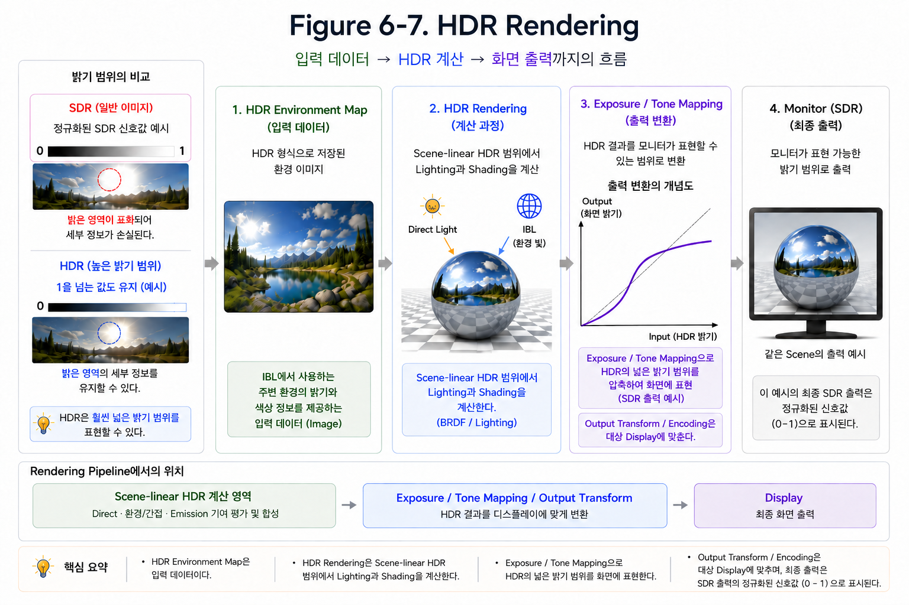
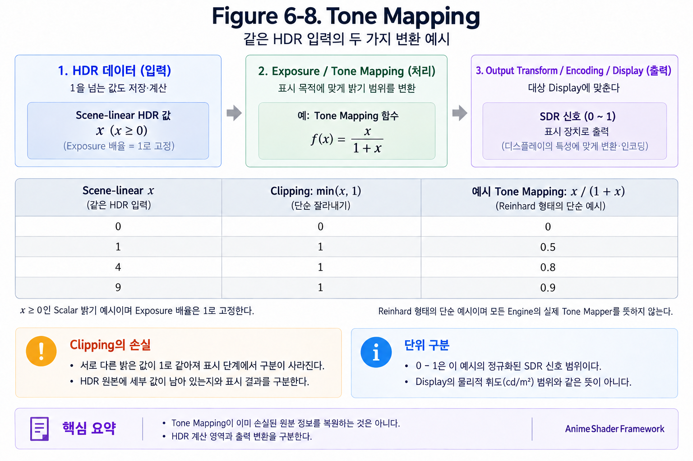
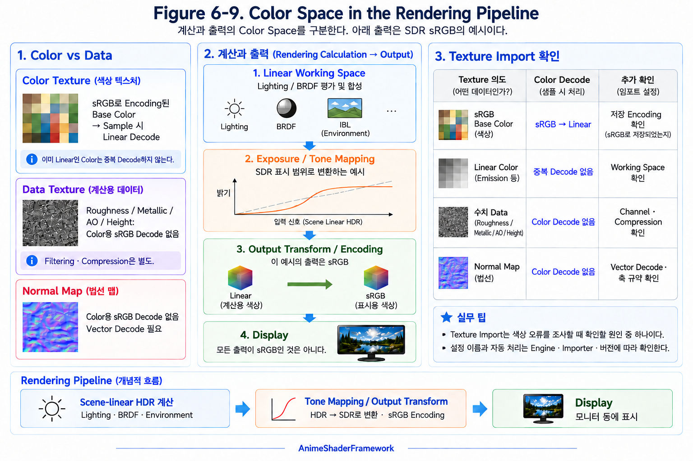
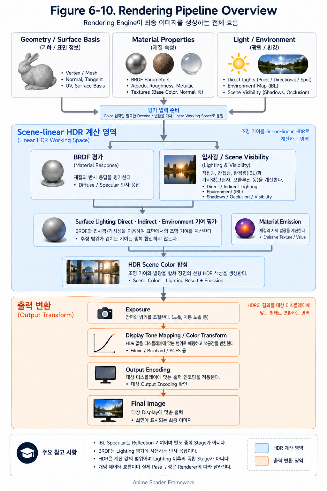

# Chapter 06 — Modern Real-time Rendering

## 6.1 From BRDF to the Rendering Pipeline

### Why Study the Rendering Pipeline?

이전 Chapter에서는 Radiometry부터 Reflection, Fresnel, 그리고 BRDF까지 학습하며 Surface가 빛과 어떻게 상호작용하는지 살펴보았다.

우리는 이제 Material이 빛을 어떻게 반사하는지를 설명할 수 있게 되었다.

그렇다면 자연스럽게 다음과 같은 질문이 생긴다.

> **BRDF를 만들었는데, 왜 아직 화면은 만들어지지 않을까?**

BRDF는 Material의 반사 특성을 정의하는 매우 중요한 모델이다.

하지만 실제 Rendering에서는 BRDF 하나만으로는 최종 이미지를 생성할 수 없다.

게임 엔진은 Material 평가와 여러 Lighting 기여를 결합하고 HDR 결과를 출력 장치에 맞게 변환한다. Direct/Indirect Lighting과 Reflection은 반드시 하나의 직렬 단계씩 실행되는 관계가 아니다.

이러한 전체 과정을 **Rendering Pipeline**이라고 한다.

이번 절에서는 Rendering Pipeline의 전체 구조를 살펴보고, 이후 절에서 배우게 될 내용들을 미리 이해해보자.

---

### Rendering Pipeline

Rendering Pipeline은 3D Scene으로부터 최종 이미지를 생성하기 위한 일련의 처리 과정이다.

각 작업은 데이터를 주고받고, 일부 기여는 별도로 계산한 뒤 합쳐진다. 이 Chapter의 개념별 설명 순서는 GPU의 고정된 실행 순서가 아니다.

Figure 6-1은 현대 Real-Time Rendering에서 일반적으로 사용되는 Rendering Pipeline을 단순화하여 나타낸 것이다.

<p align="center">
    
</p>

우리가 이전 Chapter에서 학습한 BRDF는 Surface Shading에서 평가하는 Material Response이다. **Material**을 독립된 고정 Hardware Stage로 뜻하지 않는다.

Figure 6-2는 BRDF가 Rendering Pipeline에서 어떤 위치를 차지하는지 보여준다.

<p align="center">
    
</p>

즉, BRDF는 Surface가 빛을 어떻게 반사하는지를 정의할 뿐이다.

빛을 계산하고, 환경을 반영하며, 최종 이미지를 화면에 출력하는 과정은 Rendering Pipeline의 다른 단계에서 담당한다.

---

### Beyond the BRDF

BRDF는 다음 질문에 대한 답을 제공한다.

> **"빛이 Surface에 도달했을 때, 얼마나 어떤 방향으로 반사되는가?"**

하지만 Rendering에서는 여전히 해결해야 하는 문제가 남아 있다.

예를 들어,

- 빛은 어디에서 오는가?
- 여러 개의 광원은 어떻게 계산하는가?
- 하늘과 주변 환경은 어떻게 반사되는가?
- 간접광은 어떻게 표현하는가?
- 현실의 밝기를 모니터에서는 어떻게 표현하는가?

이러한 문제들은 BRDF만으로 해결할 수 없다.

그래서 현대 Rendering Engine은 BRDF 위에 다양한 Rendering Technique를 추가하여 하나의 완전한 Rendering Pipeline을 구성한다.

---

### Forward and Deferred Rendering

Chapter 01에서 예고한 Forward/Deferred는 BRDF의 종류가 아니라 **Surface 정보와 Lighting 평가를 배치하는 방식**이다.

| Path | Basic Flow | Main Consideration |
|---|---|---|
| Forward | Geometry를 그리는 과정에서 Material과 해당 Light를 평가해 Color 출력 | Light 평가 비용과 각 Pass의 처리 범위를 확인 |
| Deferred | Geometry Pass에서 GBuffer에 Normal·Material 등 필요한 데이터를 기록한 뒤 Lighting 평가 | Buffer 저장·대역폭·Shading Model 표현 및 별도 경로의 비용을 확인 |

GBuffer는 완성된 Lighting 이미지가 아니라 후속 평가에 필요한 Screen-space Surface Data이다. 모든 Material이 같은 경로를 따르지는 않는다. Translucency 등은 별도 Pass/Path를 사용할 수 있다. MSAA, 지원 Shading Model, 실제 Buffer 구성과 기능 제한은 Engine 설정에 따라 확인한다.

어느 방식이 항상 더 빠르다고 단정하지 않는다. Chapter 09에서는 Pass별 GPU 시간과 CPU 제출 비용을 나누어 측정한다. Chapter 08의 Material Function이 Renderer의 모든 Light/Shadow Data를 자동으로 읽을 수 있다는 뜻도 아니다.

### Material Response in the Lighting Context

Chapter 04의 Base Color/Roughness/Metallic은 Chapter 05의 BRDF를 선택·평가하는 입력이다. Roughness를 높이면 Specular 분포가 넓어지지만 모든 방향의 값이 단순히 감소하는 것은 아니다. Metallic Workflow에서 순수 Metal의 Base Color는 주로 Specular Reflectance를 제어하고 Diffuse는 두지 않는다. Dielectric의 Base Color는 주로 Diffuse Reflectance에 쓰인다.

동일한 Material이라도 Direct Light와 Environment가 달라지면 결과가 바뀐다. 반대로 같은 조명에서 Roughness만 바꾸면 Highlight의 분포 변화를 확인할 수 있다. 이때 Exposure를 고정하고 한 변수씩 비교한다.

### Chapter Overview

이번 Chapter에서는 Rendering Pipeline을 구성하는 주요 기술들을 순서대로 학습한다.

- Direct Lighting
- Indirect Lighting
- Image Based Lighting (IBL)
- Reflection
- HDR Rendering
- Tone Mapping
- Color Space

각 기술은 서로 다른 문제를 담당하며, 입력·계산·출력 관계로 연결된다. 다음의 순서는 이러한 역할을 학습하기 위한 순서이다.

Rendering Pipeline 전체를 이해하면 각 기술이 왜 필요한지, 그리고 서로 어떻게 연결되는지를 자연스럽게 이해할 수 있다.

BRDF와 Lighting 기여를 연결하려면 Surface에 어떤 빛이 입사하는지부터 살펴볼 필요가 있다. Surface에 입사하는 빛이 없으면 반사 성분은 0이다. Surface 자체의 Emission은 별도로 남을 수 있다.

---

### Key Takeaways

- Rendering Pipeline은 최종 이미지를 생성하기 위한 전체 처리 과정이다.
- BRDF는 Material의 Surface Response를 정의하며 Hardware Stage 자체가 아니다.
- BRDF만으로는 최종 이미지를 생성할 수 없다.
- Modern Rendering은 여러 Rendering Technique가 연결된 Pipeline으로 구성된다.

다음 6.2에서는 Lighting 기여의 첫 학습 주제인 **Direct Lighting**을 살펴보며, 광원이 Surface에 어떤 영향을 주는지 알아본다.

---

## 6.2 Direct Lighting

### Starting with Direct Lighting

Light와 Material Response의 관계를 이해하려면 Surface에 입사하는 **Light** 기여부터 구분해야 한다.

Surface에 도달하는 빛이 없으면 BRDF의 반사 기여는 0이지만 Emission은 별개이다.

BRDF는 **"빛이 도달한 이후 어떻게 반사되는가?"**를 정의하는 모델이다.

즉, BRDF가 동작하기 위해서는 먼저 Surface에 빛이 도달해야 한다.

이처럼 광원으로부터 Surface까지 직접 전달되는 빛을 **Direct Lighting**이라고 한다.

이번 절에서는 Direct Lighting이 무엇이며, Rendering Pipeline에서 어떤 역할을 하는지 살펴보자.

---

### Direct Lighting

Direct Lighting은 **광원(Light Source)에서 Surface까지 직접 도달하는 빛**을 의미한다.

태양, 전구, 손전등, 게임 속 Point Light와 Directional Light는 모두 Direct Lighting을 생성하는 광원이다.

Surface는 먼저 이러한 빛을 받고, 그 이후 BRDF를 이용하여 얼마나 반사할지를 계산한다.

즉,

**Light가 먼저 존재하고, BRDF는 그 다음에 동작한다.**

---

### Direct Lighting Inputs

Direct Lighting은 광원과 Surface 사이의 직접적인 관계만 계산한다.

즉,

- 광원의 위치
- 광원의 방향
- 광원의 세기
- Surface의 방향(Normal)

등을 이용하여 현재 Surface에 도달하는 빛을 계산한다.

반대로, 다른 Surface에서 한 번 이상 반사되어 들어오는 기여는 Indirect Lighting이다. 환경 이미지로 표현했다는 이유만으로 항상 Indirect가 되는 것은 아니다. Environment Map에는 직접 보이는 하늘·광원과 반사된 환경이 함께 들어갈 수 있다.

이러한 빛은 이후 6.3과 6.4에서 배우게 될 Indirect Lighting과 Image Based Lighting에서 다루게 된다.

---

**Figure 6-3. Direct Lighting**

> Direct Lighting의 개념도

<p align="center">
    
</p>

(광원 → Surface로 직접 도달하는 빛만 표시)

---

### Role in Rendering

이 Chapter에서는 Direct Lighting의 기여부터 조명 계산의 관계를 설명한다.

이 단계에서 계산된 빛을 기반으로 BRDF가 Surface의 반사 특성을 적용하고, Indirect/Environment 기여도 해당 Material Response와 결합한다. 합쳐진 HDR 결과가 이후 출력 변환으로 이어진다.

즉, Direct Lighting은 광원과 Surface의 직접적인 기여를 이해하기 위한 출발점이다.

Direct Lighting은 광원에서 Surface까지 직접 도달하는 빛이다. 현실에서는 빛이 벽에서 반사되고 천장에서 다시 반사되며 주변 환경에서도 계속 Surface로 들어온다. 다른 Surface에서 한 번 이상 반사되어 도달하는 빛은 **Indirect Lighting**으로 구분한다.

---

### Key Takeaways

- Direct Lighting은 광원에서 Surface까지 직접 도달하는 빛이다.
- BRDF는 Direct Lighting이 Surface에 도달한 이후 반사량을 계산한다.
- Direct Lighting은 광원과 Surface의 직접적인 관계만 계산한다.
- 다른 Surface에서 반사되어 들어오는 빛은 Indirect Lighting에 포함된다.

다음 6.3에서는 Direct Lighting과 **Indirect Lighting**의 경로와 기여를 비교한다.

---

## 6.3 Indirect Lighting

### Why Indirect Lighting Matters

Direct Lighting은 광원에서 Surface까지 직접 도달하는 빛만 계산한다.

하지만 현실의 빛은 한 번만 이동하지 않는다.

광원에서 나온 빛은 Surface에 도달한 후 반사되고, 그 반사된 빛이 다시 다른 Surface를 비추며, 이 과정은 여러 번 반복된다.

만약 Direct Lighting만 계산한다면 그림자는 지나치게 어둡고, 주변 물체의 색이 서로 영향을 주지 않아 현실감이 크게 떨어진다.

이러한 현상을 표현하기 위해 **Indirect Lighting**이 필요하다.

---

### Indirect Lighting

Indirect Lighting은 **다른 Surface에서 한 번 이상 반사되어 도달하는 빛**을 의미한다.

예를 들어, 햇빛이 흰 벽에 닿으면, 벽은 일부 빛을 다시 주변 공간으로 반사한다.

그 결과 원래 직접 빛이 닿지 않던 바닥이나 천장도 은은하게 밝아진다.

즉, 광원이 직접 비추지 않는 영역도 다른 물체를 통해 전달된 빛의 영향을 받는다.

이러한 빛을 모두 Indirect Lighting이라고 한다.

---

### Direct and Indirect Paths

Direct Lighting은 광원에서 Surface까지 **한 번에 전달되는 빛**만 계산한다.

반면 Indirect Lighting은 Surface에서 반사된 빛이 다른 Surface로 전달되는 과정까지 포함한다.

따라서 현실에서는 Direct Lighting과 Indirect Lighting이 함께 계산되어야 자연스러운 조명이 만들어진다.

<p align="center">
    
</p>

---

### Role in Rendering

Indirect Lighting은 Scene 전체의 분위기를 결정하는 중요한 요소이다.

벽과 바닥 사이의 Color Bleeding과 반사광이 채우는 실내 밝기는 Indirect Lighting의 예이다. Shadow 경계의 부드러움인 Penumbra는 주로 Light의 크기와 차폐 Geometry의 관계로 생긴다. Indirect Light가 Shadow 내부를 밝히는 효과와 구분한다.

현대 Rendering Engine은 이러한 효과를 다양한 방법으로 근사하여 현실감 있는 이미지를 생성한다.

이번 Chapter에서는 계산 방법보다는 **빛이 여러 번 반사된다는 개념**을 이해하는 데 집중한다.

Surface에서 반사된 빛이 다른 Surface에 도달하는 경우뿐 아니라 하늘과 주변 환경에서 들어오는 빛도 고려해야 한다. 맑은 하늘 아래에서 그늘이 완전히 검지 않은 이유도 주변 환경에서 들어오는 빛이 존재하기 때문이다.

---

### Key Takeaways

- Indirect Lighting은 다른 Surface에서 반사되어 도달하는 빛이다.
- 현실의 빛은 여러 번 반사되며 Scene 전체에 영향을 준다.
- Color Bleeding과 부드러운 간접 조명은 Indirect Lighting의 대표적인 효과이다.
- 현대 Rendering Engine은 다양한 방법으로 Indirect Lighting을 근사한다.

다음 6.4에서는 이러한 **Environment**를 광원으로 사용하는 **Image Based Lighting (IBL)**을 살펴본다.

---

## 6.4 Image Based Lighting (IBL)

### Why Environment Lighting Matters

지금까지는 광원과 Surface 사이에서 이동하는 빛을 살펴보았다.

하지만 현실에서는 빛이 반드시 Point Light나 Directional Light와 같은 광원에서만 오는 것은 아니다.

맑은 하늘 아래에서 그늘이 완전히 검게 보이지 않는 이유도, 실내에서 창문을 통해 들어오는 은은한 빛도, 주변 환경 전체가 하나의 광원처럼 작용하기 때문이다.

이처럼 주변 환경을 광원으로 사용하는 기법이 **Image Based Lighting (IBL)**이다.

---

### Image Based Lighting

Image Based Lighting은 **환경(Environment)을 광원으로 사용하는 Lighting 기법**이다.

일반적인 Direct Lighting은 하나 이상의 광원을 이용하여 Surface를 비춘다.

반면 IBL은 HDR Environment Map에 저장된 밝기와 색상 정보를 이용하여 모든 방향에서 들어오는 빛을 계산한다.

HDR(High Dynamic Range)은 넓은 밝기 범위를 표현하는 특성이다. 특정 파일 형식 하나를 뜻하지 않으며 Environment Map, Scene Buffer, 출력 Display의 역할도 구분한다.

따라서 매우 밝은 태양과 어두운 그림자까지 하나의 환경 맵에 함께 저장할 수 있으며, IBL은 이 정보를 이용하여 더욱 현실감 있는 조명을 계산한다.

즉, Surface는 특정 광원뿐만 아니라 주변 환경 전체로부터 조명을 받게 된다.

<p align="center">
    
</p>

> **Figure 6-5 읽기 보정:** Environment Map은 Diffuse IBL과 Specular IBL의 입력으로 사용된다. Diffuse IBL이 반드시 여러 번 반사된 빛을 뜻하는 것은 아니다. 두 기여는 병렬로 평가하며, 하단의 Direct → Indirect → IBL → Reflection은 고정 실행 순서로 해석하지 않는다. 중앙의 양방향 화살표도 실제 입사·반사 경로를 나타내는 정확한 광선 도식으로 사용하지 않는다. “IBL 적용 결과” 이미지의 출처와 현재 Unreal 구현 일치는 확인되지 않았으므로 검증 결과로 인용하지 않는다. 해당 이미지 영역을 보존한 설명·화살표 부분 수정이 필요하다.

---

### Diffuse and Specular IBL

IBL은 단순히 주변을 밝게 만드는 기술이 아니다.

환경으로부터 들어오는 빛을 이용하여 두 가지 중요한 조명 효과를 계산한다.

- **Diffuse IBL** : 환경으로부터 들어오는 부드러운 주변 조명(Ambient Lighting)
- **Specular IBL** : 주변 환경이 Material 표면에 반사되는 효과

즉, IBL은 주변 조명과 환경 반사를 함께 계산하여 더욱 현실감 있는 이미지를 만들어낸다.

---

### Role in Rendering

IBL을 사용하면 수많은 광원을 직접 배치하지 않아도 현실감 있는 조명을 만들 수 있다.

특히,

- 야외의 하늘
- 실내 공간
- 금속(Material)의 환경 반사
- PBR Material

등에서 매우 중요한 역할을 한다.

현재 대부분의 Real-Time Rendering Engine은 HDR Environment Map과 IBL을 Rendering Pipeline의 기본 요소로 사용한다.

환경은 Surface를 비추는 역할과 Surface에 반사되어 보이는 역할을 함께 갖는다. 앞에서 구분한 Diffuse IBL과 Specular IBL은 이 관계를 읽는 기준이다.

---

### Key Takeaways

- Image Based Lighting은 환경(Environment)을 광원으로 사용하는 Lighting 기법이다.
- HDR Environment Map을 이용하여 모든 방향에서 들어오는 빛을 계산한다.
- IBL은 Diffuse IBL과 Specular IBL을 통해 주변 조명과 환경 반사를 표현한다.
- 현대 Rendering Engine은 Direct Lighting과 IBL을 함께 사용하여 현실감 있는 조명을 구현한다.

다음 6.5에서는 **Specular IBL**과 연결되는 **Reflection**을 통해 Surface가 주변 환경을 어떻게 반영하는지 살펴본다.

---

## 6.5 Reflection

### Reflection in the Rendering Context

이전 Chapter에서는 Reflection Law부터 Fresnel, 그리고 BRDF까지 학습하며 Surface가 빛을 어떻게 반사하는지 살펴보았다.

즉, Reflection이 **어떻게 계산되는지**를 이해했다.

이번 절에서는 Reflection의 계산 방법을 다시 설명하지 않는다.

대신 Rendering Pipeline에서 Reflection이 어떤 역할을 하며, Image Based Lighting과 어떻게 연결되는지를 살펴보자.

---

### Environment Reflection

여기서 다루는 Reflection은 **환경의 Specular Reflection**에 초점을 맞춘다. Chapter 05의 넓은 의미의 Reflection에는 Diffuse와 Direct Light의 Specular도 포함된다.

거울처럼 매끄러운 Surface는 주변 환경을 선명하게 반사하고, 거친 Surface는 반사가 여러 방향으로 퍼져 흐릿하게 보인다.

즉, Reflection의 형태는 Material의 종류와 Surface의 Roughness에 따라 달라진다.

<p align="center">
    
</p>

---

### Reflection and Image Based Lighting

앞 절에서 살펴본 Image Based Lighting(IBL)은 HDR Environment Map을 이용하여 주변 환경의 빛을 Lighting에 활용하는 기법이다.

IBL은 크게 두 가지 방식으로 환경 정보를 사용한다.

- **Diffuse IBL** : Environment Radiance에 대한 Diffuse 응답을 근사한다.
- **Specular IBL** : Surface에 주변 환경이 반사되는 Reflection을 계산한다.

즉, Specular IBL은 환경 Reflection을 구현하는 한 방법이다. Screen-space 또는 Ray 기반의 Reflection 등 다른 방법도 있으며, 사용할 데이터와 비용·누락 조건이 다르다.

---

### Role in Rendering

Reflection은 Material의 재질감을 표현하는 핵심 요소이다.

금속, 유리, 물, 광택이 있는 플라스틱과 같은 Material은 Reflection이 없으면 현실감이 크게 떨어진다.

현대 Rendering Engine은 HDR Environment Map과 Specular IBL을 이용하여 자연스럽고 현실감 있는 Reflection을 구현한다.

Reflection은 주변 환경의 색상뿐 아니라 밝기 정보도 함께 사용하여 계산된다. 이러한 환경 정보는 넓은 밝기 범위를 지원하는 저장 형식으로 보관할 수 있다. HDR은 그 Dynamic Range의 특성을 뜻한다.

---

### Key Takeaways

- Chapter 5에서는 Reflection의 원리를, 이번 절에서는 Rendering Pipeline에서의 역할을 살펴보았다.
- Reflection은 Surface가 주변 환경을 반사하여 보여주는 Rendering 효과이다.
- Reflection의 형태는 Material과 Roughness에 따라 달라진다.
- Specular IBL은 HDR Environment Map을 이용하여 Reflection을 계산한다.
- Reflection은 현실감 있는 Material을 표현하는 핵심 요소이다.

다음 6.6에서는 **HDR**의 의미와 Rendering Engine이 높은 밝기 정보를 저장하고 활용하는 방식을 살펴본다.

---

## 6.6 HDR Rendering

### HDR Input and Processing

앞 절에서는 Image Based Lighting(IBL)에서 **HDR Environment Map**을 사용한다는 것을 살펴보았다.

HDR Environment Map은 HDR 형식으로 저장된 환경 이미지이며, IBL에서 주변 환경의 밝기와 색상 정보를 제공하는 **입력 데이터(Input)** 이다.

하지만 이것이 곧 **HDR Rendering**을 의미하는 것은 아니다.

이번 절에서는 HDR Environment Map과 HDR Rendering의 차이를 이해하고, Rendering Engine이 높은 밝기 정보를 어떻게 계산하는지 살펴보자.

---

### Environment Map and Rendering

이름은 비슷하지만 두 개념은 서로 다른 역할을 한다.

- **HDR Environment Map**은 HDR 형식으로 저장된 환경 이미지이다.
- **HDR Rendering**은 Rendering 과정 전체를 HDR 범위에서 계산하는 기술이다.

즉, HDR Environment Map은 **Rendering에 사용되는 입력 데이터**이고, HDR Rendering은 **그 데이터를 포함하여 모든 Lighting과 Shading을 계산하는 과정**이다.

<p align="center">
    
</p>

---

### HDR Rendering

현실에는 태양처럼 매우 밝은 광원과 그림자처럼 매우 어두운 영역이 동시에 존재한다.

현대 Rendering Engine은 이러한 밝기 차이를 가능한 한 실제와 가깝게 계산해야 한다.

하지만 일반적인 이미지처럼 제한된 밝기 범위만 사용하면 매우 밝은 영역은 쉽게 흰색으로 포화(Clipping)되고, 어두운 영역의 세부 정보도 손실될 수 있다.

HDR Rendering은 이러한 문제를 해결하기 위해 높은 밝기 범위를 유지한 상태에서 Lighting과 Shading을 계산하는 방식이다.

---

### Role in Rendering

HDR Rendering을 사용하면 매우 밝은 영역과 매우 어두운 영역을 동시에 유지하면서 Rendering을 수행할 수 있다.

이를 통해 Reflection, Image Based Lighting, Bloom, Exposure와 같은 Rendering 효과도 더욱 자연스럽게 동작한다.

즉, 현대 Rendering Engine은 먼저 HDR 공간에서 모든 Lighting을 계산한 후, 최종 단계에서 화면이 표현할 수 있는 밝기 범위로 변환하여 출력한다.

---

### Exposure and Basic Validation

Exposure는 Scene Linear 값의 표시 기준을 조절하는 단계이다. 단순한 설명에서는 Exposure Scale을 곱하는 것으로 볼 수 있다. 한 Stop 증가하면 Scale은 두 배가 되지만 실제 Engine의 Pre-exposure와 Camera 설정은 구현별로 확인한다.

Auto Exposure는 화면 밝기 분포에 반응하므로 Material Intensity 변화와 화면 표시 변화가 상쇄될 수 있다. 비교할 때는 Fixed Exposure, 같은 Camera, 같은 Tone Mapping/Post Process 조건을 사용한다. Chapter 08.7의 Emission 검증에서도 이 조건을 유지한다.

예를 들어 Scene 값 1과 4를 HDR Buffer에서 구분할 수 있어도 SDR 화면에서는 둘 다 밝게 압축될 수 있다. 화면 Screenshot의 흰색만으로 Shader 출력이 1인지 4인지 판단하지 않는다. Buffer 값과 표시 결과를 구분하는 것이 기본 Debugging이다.

Scene에서 계산한 Radiance 범위는 출력 Display의 표현 범위와 같지 않다. 따라서 Rendering 결과를 화면이 표현할 수 있는 범위로 변환하는 과정이 필요하며, 이 역할을 **Tone Mapping**이 맡는다.

---

### Key Takeaways

- HDR Environment Map은 HDR 형식으로 저장된 환경 이미지이며 IBL의 입력 데이터이다.
- HDR Rendering은 Rendering 전체를 높은 밝기 범위에서 계산하는 기술이다.
- HDR Environment Map은 입력(Input)이고, HDR Rendering은 계산(Process)이다.
- HDR Rendering은 현실의 넓은 밝기 범위를 유지한 채 Lighting과 Shading을 수행한다.
- 계산된 결과는 Tone Mapping을 통해 화면에 표현된다.

다음 6.7에서는 **Tone Mapping**이 HDR Rendering 결과를 화면에 표현하는 방식을 살펴본다.

---

## 6.7 Tone Mapping

### Why Tone Mapping Matters

앞 절에서는 Rendering Engine이 HDR 공간에서 모든 Lighting과 Shading을 계산한다는 것을 살펴보았다.

하지만 Scene에서 계산한 Radiance 범위는 출력 Display의 표현 범위와 같지 않다.

즉, HDR Rendering 결과를 화면에 출력하려면 밝기 범위를 모니터가 표현할 수 있는 범위로 변환해야 한다.

이 과정을 **Tone Mapping**이라고 한다.

---

#### SDR Output

SDR(Standard Dynamic Range)은 일반적인 모니터와 이미지가 표현할 수 있는 밝기 범위를 의미한다.

이 Section은 SDR Display 출력을 예로 든다. HDR Display도 Scene 값과 출력 장치의 범위·Encoding이 같지는 않으므로 별도의 출력 변환이 필요하다.

따라서 HDR 이미지는 Tone Mapping을 통해 SDR 범위로 변환되어 화면에 출력된다.

---

### Tone Mapping

Tone Mapping은 **HDR Rendering 결과를 화면에 표현 가능한 밝기 범위로 변환하는 과정**이다.

Rendering Engine은 HDR 공간에서 매우 높은 밝기 값을 계산하지만, 최종 출력 장치는 이러한 값을 그대로 표시할 수 없다.

따라서 매우 밝은 영역은 적절히 압축하고, 어두운 영역은 가능한 한 세부 정보를 유지하면서 화면에 출력한다.

<p align="center">
    
</p>

---

### Role in Rendering

Tone Mapping이 없다면 HDR Rendering의 결과는 정상적으로 화면에 표시될 수 없다.

밝은 영역은 모두 흰색으로 포화되고, 어두운 영역은 검게 뭉개질 수 있다.

Tone Mapping은 넓은 밝기 범위를 압축하면서도 사람이 자연스럽게 느끼는 명암을 유지하도록 도와준다.

즉, HDR Rendering이 계산을 위한 기술이라면, Tone Mapping은 그 결과를 사람이 볼 수 있도록 변환하는 기술이다.

---

### HDR Processing and Output Transformation

HDR Rendering과 Tone Mapping은 서로 다른 역할을 수행한다.

- **HDR Rendering** : 높은 밝기 범위를 유지하며 Rendering을 계산한다.
- **Tone Mapping** : 계산된 HDR 결과를 화면에 표현 가능한 범위로 변환한다.

즉, HDR Rendering은 **계산(Process)** 이고, Tone Mapping은 **출력(Output Transformation)** 이다.

Tone Mapping으로 밝기 범위를 연결한 뒤에도 색상을 어떤 기준으로 입력하고 계산하며 출력하는지 구분해야 한다. 올바른 이미지를 얻으려면 밝기와 함께 Color 처리의 일관성도 필요하다.

---

### Key Takeaways

- Tone Mapping은 HDR Rendering 결과를 화면에 표현 가능한 밝기 범위로 변환하는 과정이다.
- HDR Rendering은 계산이고, Tone Mapping은 출력 변환이다.
- Tone Mapping은 밝은 영역과 어두운 영역의 세부 정보를 최대한 유지하도록 밝기를 압축한다.
- Tone Mapping을 통해 HDR Rendering 결과를 화면에 출력할 수 있다.

다음 6.8에서는 입력부터 출력까지 **Color Space**가 맡는 역할을 연결한다.

---

## 6.8 Color Space

### Color Management

앞 절에서는 Tone Mapping을 통해 HDR Rendering 결과를 SDR 범위로 연결하는 과정을 살펴보았다. 이 출력 연결을 이해하려면 밝기뿐 아니라 **색상(Color)**을 어떤 기준으로 다루는지도 알아야 한다. 이번 절에서는 **Color Space**를 Texture Input부터 Linear Working Space와 Display Output까지 연결한다.

---

### Color Space

Color Space는 **색상을 저장하고 표현하는 기준**이다.

Rendering Engine은 Lighting과 Shading을 계산하는 과정에서 수많은 색상 연산을 수행한다.

이때 모든 색상 계산은 동일한 기준(Color Space)을 사용해야 일관된 Rendering 결과를 얻을 수 있다.

<p align="center">
    
</p>

---

### Linear Working Space and sRGB

Rendering Pipeline에서는 하나의 Color Space만 사용하는 것이 아니라, **계산과 출력 목적에 따라 서로 다른 Color Space를 사용한다.**

- **Linear Color Space** : Lighting과 Shading을 계산하는 공간
- **sRGB** : 흔히 쓰이는 SDR Color Encoding/Color Space의 예. 모든 출력이 sRGB인 것은 아니다

Rendering Engine은 Linear Color Space에서 Lighting과 Shading을 계산한 후, 출력 목표에 맞는 Tone Mapping과 Color Transform/Encoding을 거쳐 표시한다. SDR sRGB 출력은 그중 하나의 예이다.

---

### Role in Rendering

Color Space가 올바르게 처리되지 않으면 Rendering 계산 결과와 화면에 표시되는 색상이 서로 다르게 표현될 수 있다.

예를 들어 같은 Texture라도 잘못된 Color Space로 가져오면 색상이 지나치게 밝거나 어둡게 보이거나, Material의 특성이 의도와 다르게 표현될 수 있다.

따라서 현대 Rendering Engine은 계산과 출력에 서로 다른 Color Space를 사용하여 정확한 Rendering 결과를 유지한다.

---

### Texture Import Intent

Blender, Unreal Engine, Unity는 모두 동일한 원리를 사용하지만, 사용자에게 제공하는 설정 방식은 조금씩 다르다.

sRGB로 Encoding한 **Base Color Texture**는 Sample 시 Linear 값으로 Decode한다. 이미 Linear로 저장된 Color Texture에는 같은 Decode를 반복하지 않는다.

반면 **Roughness**, **Metallic**, **Ambient Occlusion**, **Height**, **Normal Map**과 같은 Texture는 색상이 아니라 Rendering 계산에 사용하는 데이터이다.

이러한 Data Texture에는 Color용 sRGB Decode를 적용하지 않는다. Filtering·Compression은 여전히 있을 수 있고 Normal Map은 별도의 Vector Decode가 필요하다. Chapter 04.5–4.6의 구분을 유지한다.

다음 표는 sRGB Base Color와 일반적인 Data Map의 Import 의도를 비교한다. 실제 UI와 Compression/Sampler 설정은 사용 버전에서 확인한다.

| Texture | Blender | Unreal Engine | Unity |
|---------|----------|---------------|--------|
| Base Color | sRGB | sRGB ON | sRGB ON |
| Roughness | Non-Color | sRGB OFF | sRGB OFF |
| Metallic | Non-Color | sRGB OFF | sRGB OFF |
| Ambient Occlusion | Non-Color | sRGB OFF | sRGB OFF |
| Height | Non-Color | sRGB OFF | sRGB OFF |
| Normal Map | Non-Color | sRGB OFF (Normal Map) | Normal Map |

표현 방식은 서로 다르지만 모두 같은 의미이다.

즉,

- **sRGB로 Encoding한 Color Texture → sRGB Decode**
- **계산에 사용하는 Texture → Non-Color 또는 sRGB OFF**

라는 동일한 원리를 사용한다.

---

### Input, Working Space, and Output

지금까지 살펴본 Rendering Pipeline을 정리하면 다음과 같다.

- HDR Environment Map은 Rendering에 필요한 환경 정보를 제공한다.
- HDR Rendering은 Linear Color Space에서 Lighting과 Shading을 계산한다.
- Tone Mapping은 HDR 결과를 SDR 범위로 변환한다.
- Color Transform과 Encoding은 실제 Display Output에 맞춘다.

즉, Color 관리는 Input Decode, Linear Working Space, Output Transform 전체에 걸쳐 적용된다. 마지막 Encoding만을 뜻하지 않는다.

---

### Common Texture Import Errors

Texture를 가져올 때는 **Texture가 무엇을 저장하는지**를 먼저 생각하는 것이 중요하다.

예를 들어 Roughness Texture를 sRGB로 가져오면 거칠기 값이 올바르게 전달되지 않아 표면이 지나치게 매끄럽거나 거칠게 표현될 수 있다.

예를 들어 sRGB Encoded 값 0.5는 Linear로 약 0.214이다. Decode를 생략하고 0.5를 Linear로 사용하면 입력이 과대해진다. 반대로 Linear Data 0.5에 sRGB Decode를 잘못 적용하면 약 0.214로 바뀐다. 최종 화면 차이는 Lighting과 출력 변환에도 좌우된다.

이러한 문제는 Shader가 잘못된 것이 아니라 Texture Import 설정 때문에 발생하는 경우가 많다.

새로운 Texture를 사용할 때는 다음 기준만 기억해도 대부분의 문제를 예방할 수 있다.

> **색상을 저장하는 Texture인가?**
>
> → **저장 Encoding을 확인하고, sRGB Encoded Color일 때 Decode**
>
> **Rendering 계산에 사용하는 데이터인가?**
>
> → **Non-Color 또는 sRGB OFF**

Texture의 이름보다 **무엇을 저장하는 Texture인지**를 먼저 판단하는 습관이 중요하다.

---

### Key Takeaways

- Color Space는 색상을 저장하고 표현하는 기준이다.
- Rendering 계산은 Linear Color Space에서 수행된다.
- 최종 Output Encoding은 Display 설정에 맞추며 sRGB는 SDR 예이다.
- sRGB Encoded Base Color는 Decode하고, 계산용 Data에는 Color Decode를 적용하지 않는다.
- Blender, Unreal Engine, Unity는 표현 방식만 다를 뿐 동일한 원리를 사용한다.
- Color 관리는 Texture Input부터 Working Space와 Display Output까지 연결된다.

다음 6.9에서는 지금까지 학습한 Lighting 기여, HDR 계산 범위와 출력 변환의 관계를 종합한다.

---

## 6.9 Chapter Summary

이번 Chapter에서는 Rendering Engine이 하나의 이미지를 생성하는 전체 과정을 Rendering Pipeline의 관점에서 살펴보았다.

앞선 장과 이번 장의 각 절에서 Reflection, HDR, Lighting과 같은 개별 개념을 학습했다면, 이번 Chapter에서는 이러한 개념들이 Rendering Pipeline 안에서 어떻게 연결되는지를 이해하는 데 초점을 맞추었다.

Direct Light, Indirect Light, Environment는 입사 기여를 제공하며 BRDF는 각각에 대한 Surface Response를 정한다. 이 기여와 Emission이 결합되어 HDR Scene Color를 만든다. IBL의 Specular는 Reflection 기여이므로 같은 기여를 다시 더하지 않는다.

이 모든 과정은 HDR 환경에서 높은 밝기 범위를 유지한 상태로 수행된다.

Rendering 결과는 Exposure와 목표 Display에 맞는 Tone Mapping을 거쳐, 마지막으로 Color Space를 변환하여 화면에서 올바르게 표현되는 최종 이미지를 출력한다.

즉, Rendering Pipeline은 단순히 화면을 그리는 과정이 아니라, **빛을 계산하고(Material Shading), 반사를 표현하며(Reflection), 밝기를 조정하고(Tone Mapping), 최종 색상을 화면에 전달(Color Space)하는 일련의 과정**이다.

<p align="center">
    
</p>

---

### Data Flow

Rendering Pipeline의 전체 흐름은 다음과 같이 정리할 수 있다.

```
Geometry / Surface Basis + Material Properties → BRDF evaluation
Direct / Indirect / Environment contributions   → Surface Lighting
Surface Lighting + Emission                    → HDR Scene Color
HDR Scene Color → Exposure → Display Tone Mapping / Color Transform
                → Output Encoding → Final Image

Input Color Decode → Linear Working Space throughout Lighting
IBL Specular is a Reflection contribution, not an extra duplicate stage
```

---

### Key Takeaways

- 이번 장의 Environment Reflection은 주변 환경을 Material에 반영하는 과정이다.
- IBL은 Environment Map을 이용하여 조명과 반사를 계산한다.
- HDR Rendering은 넓은 밝기 범위에서 Rendering을 수행한다.
- Tone Mapping은 HDR 결과를 화면에 출력 가능한 밝기 범위로 변환한다.
- Color Space는 계산된 색상을 올바른 형태로 화면에 전달한다.
- 여러 Lighting 기여가 합쳐지고, HDR는 계산 범위이며, 출력 변환은 그 결과에 적용된다.

---

지금까지 Foundation에서는 Rendering의 핵심 원리를 단계적으로 학습했다.

다음 Chapter부터는 이러한 기초 지식을 바탕으로 **Non-Photorealistic Rendering(NPR)** 을 살펴본다.

NPR은 현실을 그대로 재현하는 대신, 어떤 정보를 단순화하고 강조하여 원하는 스타일을 표현하는 Rendering 기법이다.

지금까지 학습한 Reflection, BRDF, HDR, Tone Mapping, Color Space 역시 NPR Shader를 구현하는 중요한 기반이 된다.

[Next: Chapter 07 — Stylized Rendering](<Chapter07_Stylized Rendering.md>)
