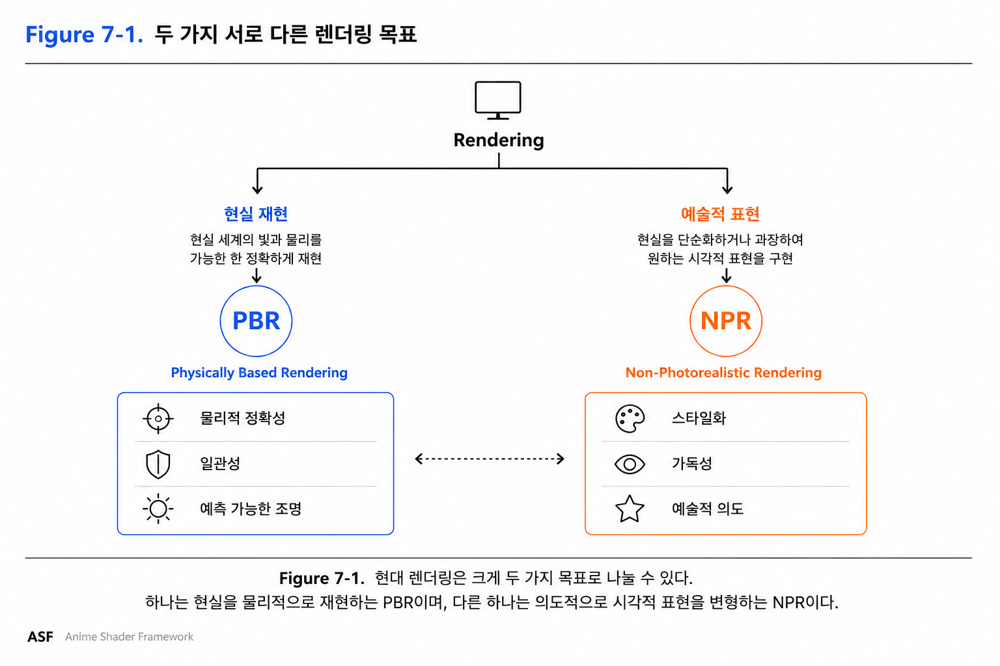
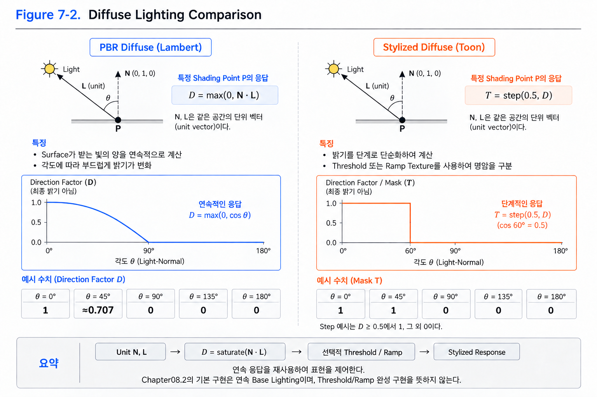
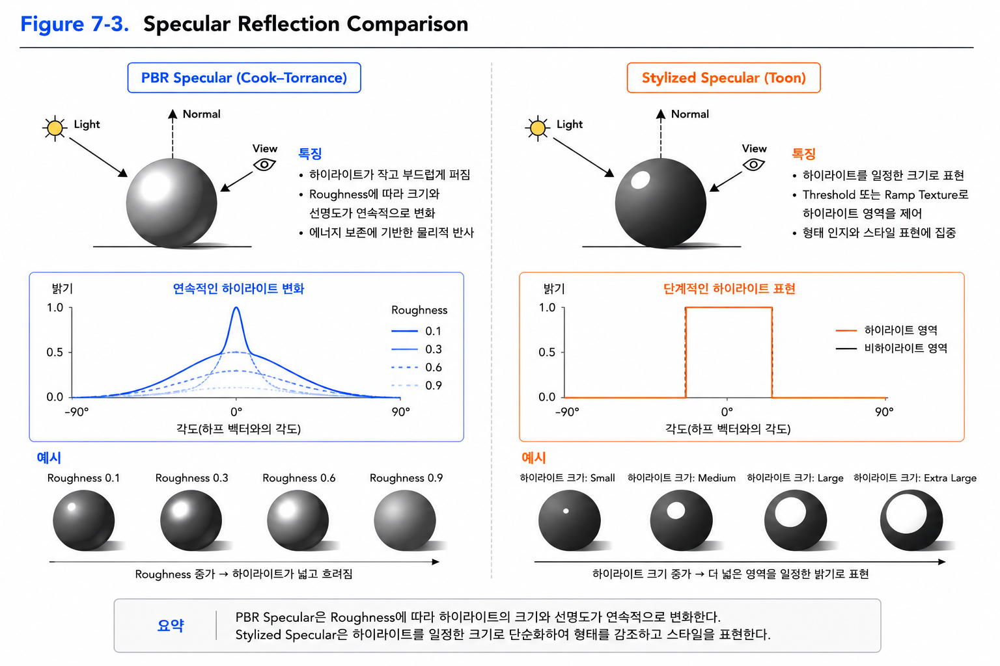
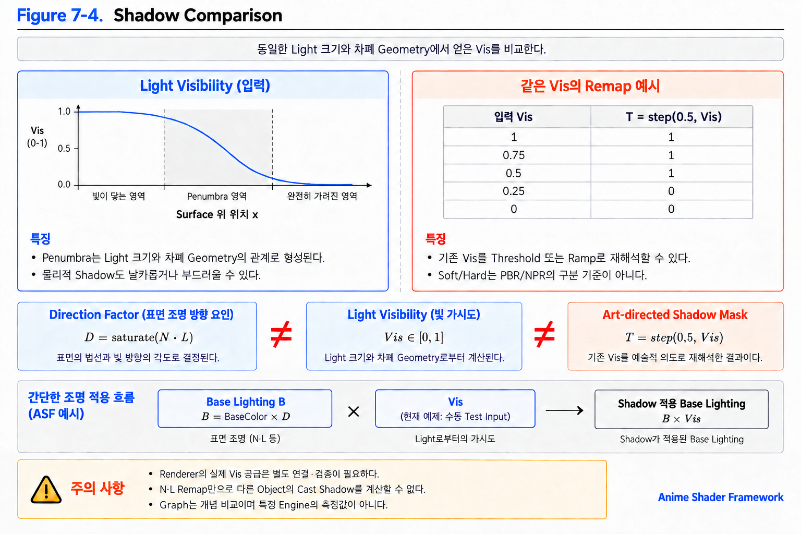
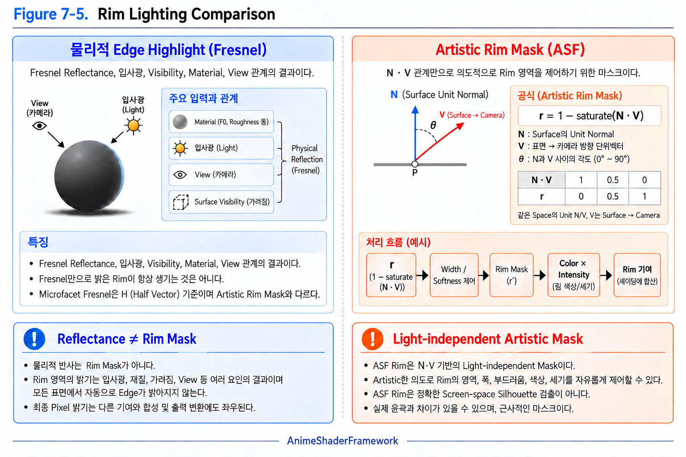
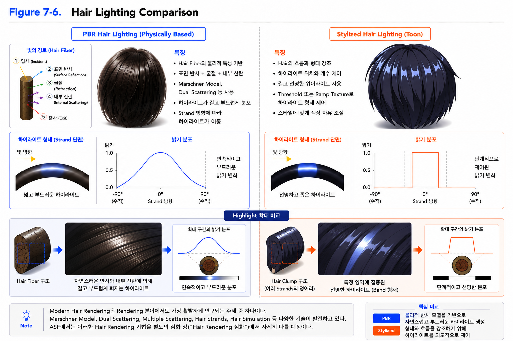
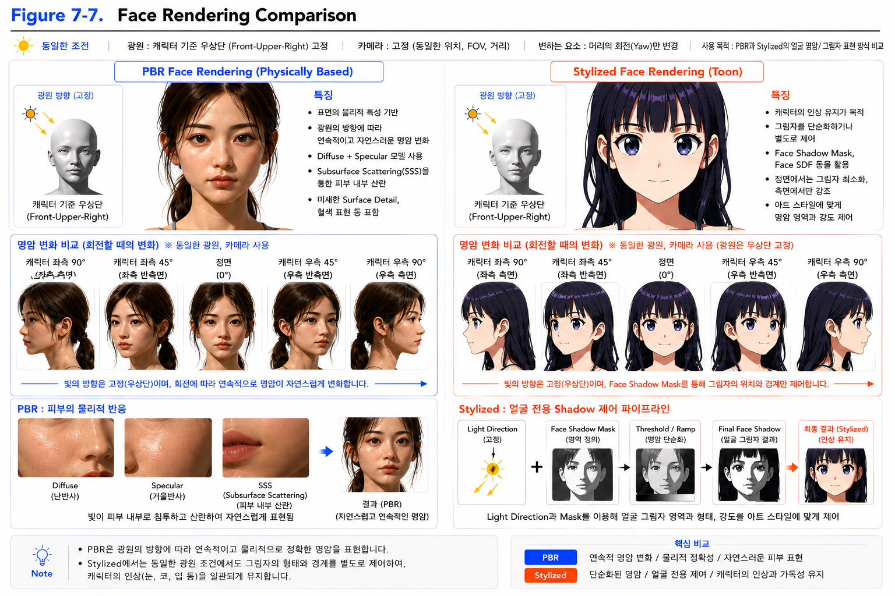
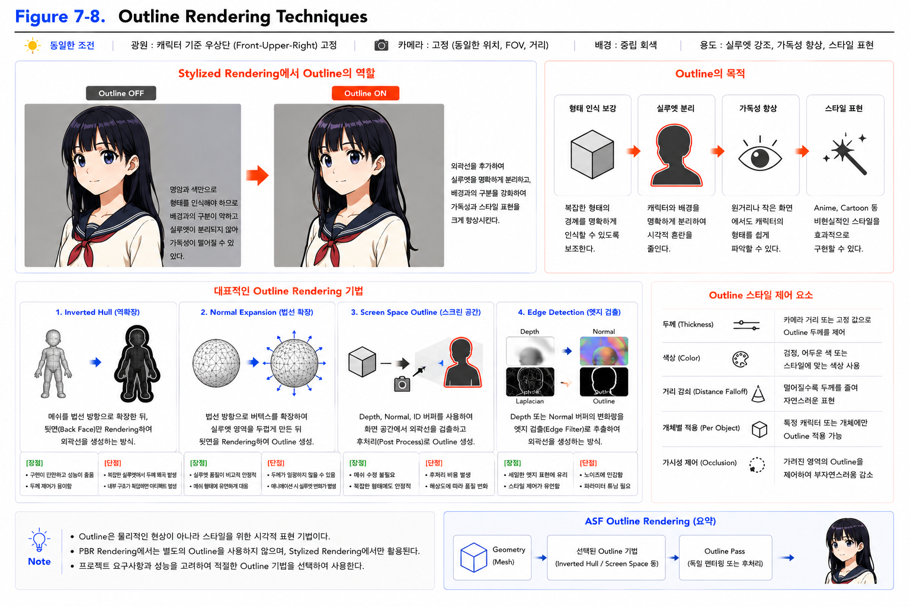
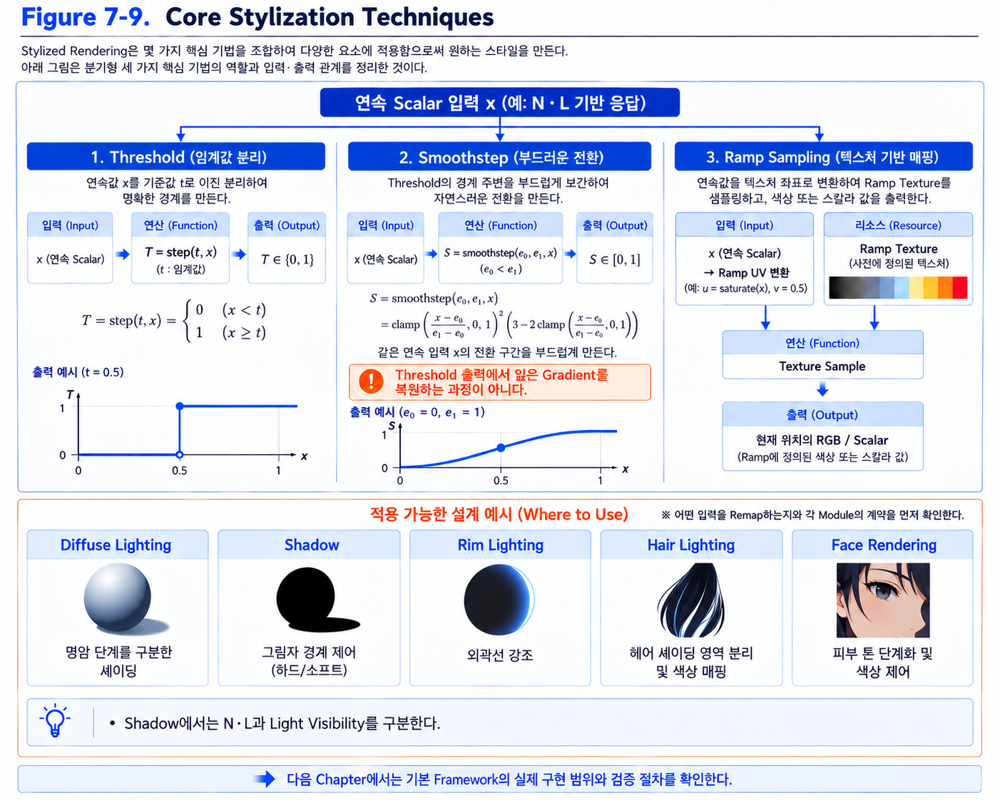

# Chapter 07 Stylized Rendering

## 7.1 Why Stylized Rendering?

### Why Stylized Rendering Matters

지금까지 우리는 Modern Real-Time Rendering의 기반이 되는 다양한 개념들을 살펴보았다.

Radiometry부터 Reflection, BRDF, Lighting, HDR Rendering, Tone Mapping, Color Space에 이르기까지 모든 과정은 현실 세계의 빛을 가능한 한 정확하게 표현하기 위한 연구의 결과이다.

이러한 접근은 오늘날 **Physically Based Rendering(PBR)** 으로 발전하였으며, 대부분의 Modern Rendering Engine에서 표준 Rendering 방식으로 사용되고 있다.

하지만 현실을 정확하게 재현하는 것이 항상 가장 좋은 Rendering은 아니다.

게임과 애니메이션에서는 현실을 그대로 표현하는 것보다 형태를 강조하거나, 명암을 단순화하거나, 특정한 분위기를 전달하는 것이 더 중요한 경우도 많다.

이처럼 현실을 의도적으로 단순화하거나 변형하여 원하는 시각적 표현을 만드는 Rendering 기법을 **Stylized Rendering** 또는 **Non-Photorealistic Rendering(NPR)** 이라고 한다.

이번 절에서는 Stylized Rendering이 왜 필요한지 살펴보고, PBR과 어떤 차이를 가지는지 알아보자.

---

### Stylized Rendering

Stylized Rendering은 현실을 그대로 재현하는 것이 목적이 아니다.

현실을 단순화하거나 과장하여 원하는 시각적 스타일을 표현하는 Rendering 기법이다.

예를 들어,

애니메이션에서는 그림자를 두 단계로 단순화하기도 하고,

윤곽선을 추가하여 형태를 더욱 강조하기도 하며,

현실에는 존재하지 않는 색상이나 하이라이트를 사용하기도 한다.

PBR은 Material과 Light의 물리적인 일관성을 다루는 접근이고, Stylized/NPR은 시각적인 표현 목표를 다룬다. 두 축은 함께 사용할 수 있다. 물리적으로 일관된 Material을 유지하면서 형태·색·조명 배치를 Stylized하게 설계할 수도 있다.

즉,

PBR과 NPR은 서로 경쟁하는 기술이 아니라,

서로 다른 목적을 가진 Rendering 접근 방식이라고 볼 수 있다.

    

Figure 7-1은 물리적 일관성과 표현 의도를 비교하기 위한 도식이다. 두 범주가 배타적으로 나뉜다고 해석하지 않는다.

PBR은 현실을 물리적으로 재현하는 것을 목표로 하며,

NPR은 원하는 시각적 표현을 위해 현실을 의도적으로 변형하는 것을 목표로 한다.

---

### Connection to Rendering Foundations

Modern Stylized Rendering은 기존 Rendering 기술과 완전히 분리되어 존재하지 않는다.

Lighting,

Reflection,

HDR Rendering,

Tone Mapping,

Color Space와 같은 Modern Rendering Pipeline을 기반으로 필요한 요소만 단순화하거나 변형하여 원하는 스타일을 만든다.

즉,

Stylized Rendering을 제대로 이해하기 위해서는 먼저 Modern Rendering이 어떻게 동작하는지를 이해해야 한다.

그래야 어떤 요소를 유지하고,

어떤 요소를 변경하며,

어떤 요소를 새롭게 추가하는지를 명확하게 설명할 수 있다.

---

### Callback

이번 절에서는 Stylized Rendering이 무엇이며 왜 필요한지를 살펴보았다.

그렇다면 현실을 단순화하는 첫 번째 대상은 무엇일까?

가장 먼저 변화하는 것은 **Diffuse Lighting**이다.

다음 절에서는 PBR의 Diffuse Lighting과 Stylized Diffuse를 비교하며, 현실적인 명암이 어떻게 Anime 스타일의 단순한 명암으로 변하는지 살펴보자.

---

### Key Takeaways

- Stylized Rendering은 현실을 그대로 재현하는 것이 목적이 아니다.
- PBR의 물리적 제약과 NPR의 표현 목표는 서로 다른 축이며 조합할 수 있다.
- Modern NPR은 Modern Rendering Pipeline 위에서 동작한다.
- Stylized Rendering은 기존 Rendering 요소를 단순화하거나 변형하여 새로운 표현을 만든다.
- 다음 절에서는 Diffuse Lighting부터 PBR과 NPR를 비교해 본다.

---

## 7.2 Diffuse Lighting

### Starting with Diffuse

Stylized Rendering에서 가장 먼저 변화하는 요소는 **Diffuse Lighting**이다.

현실적인 Rendering에서는 Surface가 받는 빛의 양을 물리적으로 계산하지만,

Stylized Rendering에서는 현실적인 밝기보다 형태의 전달과 명암의 단순화가 더 중요하다.

따라서 대부분의 Stylized Shader는 Diffuse Lighting부터 변형하기 시작한다.

이번 절에서는 PBR에서 사용하는 Lambert Diffuse를 다시 살펴보고,

Stylized Rendering에서는 이것이 어떻게 변화하는지 비교해 보자.

---

### PBR Diffuse

PBR에서 가장 기본이 되는 Diffuse Model은 **Lambert Diffuse**이다.

Lambertian BRDF는 ρ/π이고 입사 기여에는 max(0,N·L)이 곱해진다(Chapter 05.19). 여기서는 같은 Space의 Unit N/L로 구한 Direction Factor D=max(0,N·L)을 Remap하는 데 집중한다. D 자체가 Irradiance나 BRDF는 아니다.

빛이 Surface를 정면으로 비출수록 밝아지고,

측면으로 갈수록 점차 어두워진다.

이러한 연속적인 밝기 변화는 현실 세계의 부드러운 명암을 표현하는 데 적합하다.

---

### Stylized Diffuse

여기서 사용할 기본 도구를 먼저 구분한다.

- **Threshold**: 기준 t에서 입력 x를 두 영역으로 나눈다. 예를 들어 x<t는 0, x≥t는 1이다.
- **Smoothstep**: e0<e1 구간에서 0→1을 부드럽게 연결한다. 경계값이 같거나 뒤집히지 않도록 한다.
- **Ramp Texture**: Scalar 입력을 UV 좌표로 사용해 원하는 Scalar 또는 Color를 Sample한다. 입력 Data와 출력 Color Encoding을 구분한다.

예를 들어 D=0.4, Threshold=0.5이면 어두운 Band이고 D=0.6이면 밝은 Band이다. 이 변환은 Scene의 다른 Object가 Light를 가렸는지는 알려주지 않는다. 7.4에서 별도의 Visibility를 연결하고 7.9에서 공통 도구를 정리한다.

Stylized Rendering에서는 이러한 연속적인 밝기 변화가 항상 필요한 것은 아니다.

오히려 명암을 몇 단계로 단순화하면 형태를 더 명확하게 전달할 수 있으며,

애니메이션 특유의 시각적인 스타일도 쉽게 표현할 수 있다.

대표적인 방법이 **Toon Diffuse**이다.

Toon Diffuse는 Lambert 결과를 그대로 사용하지 않고,

Threshold를 기준으로 밝은 영역과 어두운 영역을 구분하거나,

Ramp Texture를 이용하여 원하는 명암 단계를 만든다.

    

Figure 7-2는 PBR의 Lambert Diffuse와 Stylized Diffuse를 비교한 그림이다.

PBR에서는 Surface가 받는 빛의 양이 연속적으로 변화하여 자연스러운 명암을 만든다.

반면 Stylized Diffuse는 Threshold 또는 Ramp Texture를 이용하여 명암을 몇 단계로 단순화함으로써 형태를 더욱 명확하게 표현한다.

---

### Comparison

Lambert와 Stylized Diffuse의 가장 큰 차이는 **명암의 변화 방식**이다.

Lambert는 현실의 빛을 자연스럽게 표현하기 위해 연속적인 밝기 변화를 사용한다.

반면 Stylized Diffuse는 형태를 강조하기 위해 명암을 의도적으로 단순화한다.

즉,

PBR은 물리적 정확성을 추구하고,

Stylized Rendering은 시각적 전달력을 추구한다.

---

### ASF Implementation

ASF에서는 Lambert를 제거하지 않는다.

먼저 N·L 기반 Direction Factor를 계산하고 필요에 따라 Remap을 설계한다. Chapter 08.2의 기본 구현은 연속적인 Base Lighting이며, Threshold/Ramp의 완성 구현을 이미 포함한다고 가정하지 않는다.

즉,

기존 Lighting 정보를 활용하면서,

표현 방식만 Stylized Rendering에 맞게 변경하는 구조를 사용한다.

---

### Callback

Diffuse Lighting은 Stylized Rendering에서 가장 먼저 변화하는 요소이다.

하지만 명암만 단순화한다고 해서 Anime 스타일이 완성되는 것은 아니다.

Material의 느낌을 결정하는 또 다른 중요한 요소는 **Specular Reflection**이다.

다음 절에서는 PBR의 Specular Reflection이 Stylized Rendering에서 어떻게 변화하는지 살펴보자.

---

### Key Takeaways

- Stylized Rendering에서 가장 먼저 변하는 요소는 Diffuse Lighting이다.
- Lambert는 연속적인 밝기 변화를 사용한다.
- Stylized Diffuse는 명암을 단순화하여 형태를 강조한다.
- ASF는 Lambert 결과를 기반으로 Stylized Diffuse를 생성한다.
- 다음 절에서는 Stylized Specular를 살펴본다.

---

## 7.3 Specular Reflection

### The Role of Specular Reflection

Diffuse Lighting이 Surface의 전체적인 명암을 결정한다면,

**Specular Reflection**은 Material의 질감과 광택을 표현하는 중요한 요소이다.

현실적인 Rendering에서는 Material의 종류에 따라 하이라이트의 크기와 선명도가 자연스럽게 변화한다.

반면 Stylized Rendering에서는 현실적인 광택보다 형태를 강조하거나 특정한 분위기를 표현하기 위해 하이라이트를 단순화하는 경우가 많다.

이번 절에서는 PBR에서 사용하는 Specular Reflection을 다시 살펴보고,

Stylized Rendering에서는 이것이 어떻게 변화하는지 비교해 보자.

---

### PBR Specular Reflection

Modern PBR에서는 **Cook–Torrance BRDF**를 기반으로 Specular Reflection을 계산한다.

Material의 Roughness에 따라 하이라이트의 크기와 선명도가 연속적으로 변화하며,

빛의 방향과 View 방향에 따라 자연스러운 광택이 표현된다.

이러한 방식은 금속, 플라스틱, 세라믹과 같은 다양한 Material을 현실적으로 표현하는 데 적합하다.

    

> **Figure 7-3 읽기 기준:** Graph와 Sphere는 응답 폭·형태의 정성적 비교이며 특정 Cook-Torrance 구현의 정량 결과가 아니다. Graph의 각도는 고정된 Unit L/V에서 H=normalize(L+V)를 기준으로 N의 방향을 변화시킨 단면의 부호 있는 N–H 각도이며, 세로 값은 비교용 상대 응답이다. 표시된 1은 물리적 최대 밝기나 BRDF 상한을 뜻하지 않는다. Sphere의 전체 모습에는 지점별 Normal 차이가 있으므로 단일 각도 Graph와 일대일로 대응시키지 않는다. Camera→Surface 방향의 검정 View 화살표는 관찰 경로이며, 계산에 사용하는 V는 반대로 Surface→Camera이다.

Figure 7-3은 PBR Specular와 Stylized Specular의 차이를 비교한 그림이다.

PBR에서는 Roughness에 따라 하이라이트가 연속적으로 변화하며,

Material의 특성을 자연스럽게 표현한다.

---

### Stylized Specular

Stylized Rendering에서는 현실적인 광택을 그대로 사용할 필요가 없는 경우가 많다.

대신 하이라이트의 모양과 크기를 단순화하여 형태를 더욱 명확하게 전달하거나,

캐릭터의 분위기를 강조하는 표현으로 활용한다.

대표적으로 Threshold 또는 Ramp Texture를 이용하여 하이라이트 영역을 일정한 형태로 제어한다.

이러한 방식은 현실성과는 거리가 있지만,

애니메이션 특유의 선명하고 직관적인 표현을 만드는 데 효과적이다.

---

### Comparison

PBR Specular와 Stylized Specular의 가장 큰 차이는

**하이라이트를 표현하는 방식**이다.

PBR은 Material의 물리적 특성을 기반으로 하이라이트가 연속적으로 변화한다.

반면 Stylized Rendering은 하이라이트를 의도적으로 단순화하여

형태를 강조하고 원하는 스타일을 표현한다.

즉,

PBR은 현실적인 광택을 목표로 하고,

Stylized Rendering은 시각적인 전달력을 목표로 한다.

---

### ASF Implementation

ASF는 방향 기반 Specular Response를 이해한 뒤 원하는 Artistic Control을 더한다. Chapter 08.4의 교육용 구현은 Phong 계열 Response이며 Cook-Torrance PBR 전체 구현이 아니다. Threshold/Ramp는 확장 선택지이고 현재 구현 여부는 해당 Section의 최종 Interface로 확인한다.

즉,

기존 Reflection 정보를 활용하면서,

표현 방식만 Stylized Rendering에 맞게 변경하는 구조를 사용한다.

---

### Callback

Diffuse Lighting과 Specular Reflection을 단순화하면

기본적인 Stylized Material은 표현할 수 있다.

하지만 Anime 스타일을 완성하기 위해서는

그림자 역시 현실과 다른 방식으로 표현되어야 한다.

다음 절에서는 **Stylized Shadow**가 어떻게 만들어지는지 살펴보자.

---

### Key Takeaways

- Specular Reflection은 Material의 광택과 질감을 표현한다.
- PBR은 Roughness에 따라 하이라이트가 연속적으로 변화한다.
- Stylized Rendering은 하이라이트를 단순화하여 형태를 강조한다.
- ASF는 기존 Specular Reflection을 기반으로 Stylized Highlight를 생성한다.
- 다음 절에서는 Stylized Shadow를 살펴본다.

---

## 7.4 Shadow

### The Role of Shadow

Diffuse Lighting과 Specular Reflection만으로는 Stylized Rendering의 특징을 모두 표현할 수 없다.

현실적인 Rendering에서는 Shadow가 빛의 차단 정도를 자연스럽게 표현하지만,

Stylized Rendering에서는 Shadow 역시 형태를 강조하는 중요한 표현 요소가 된다.

특히 Anime 스타일에서는 Shadow를 단순히 어둡게 만드는 것이 아니라,

명확한 경계를 만들어 캐릭터의 형태와 분위기를 전달하는 데 활용한다.

이번 절에서는 PBR에서 사용하는 Shadow와,

Stylized Rendering에서 사용하는 Shadow를 비교해 보자.

---

### PBR Shadow

Shadow는 Light까지의 경로가 가려지는 Visibility 문제이다. N·L에 의한 명암이나 Distance Attenuation과 같지 않다. Point/Directional Light의 이상적인 차폐는 날카로운 경계를 만들 수 있고, 면적을 가진 Light는 Penumbra를 만든다. Indirect Light가 어두운 영역을 채우는 현상은 경계의 부드러움과 구분한다.

이러한 방식은 현실 세계의 자연스러운 조명 환경을 재현하는 데 적합하다.

---

### Stylized Shadow

Stylized Rendering에서는 현실적인 Shadow보다

형태를 명확하게 전달하는 것이 더 중요하다.

따라서 Shadow의 경계를 의도적으로 선명하게 만들거나,

명암을 두세 단계 정도로 단순화하여 표현한다.

대표적으로 **Threshold**를 이용하여 Shadow의 경계를 결정하거나,

**Ramp Texture**를 이용하여 원하는 명암 단계를 만든다.

> **Threshold** : 밝기를 특정 기준값으로 나누어 밝은 영역과 어두운 영역을 구분하는 기법이다. 자세한 내용은 후반부에서 다시 설명한다.
>
> **Ramp Texture** : 밝기 값을 사용자가 원하는 명암이나 색상으로 변환하는 Texture이다. 자세한 내용은 후반부에서 다시 설명한다.

이러한 방식은 캐릭터의 실루엣과 형태를 더욱 또렷하게 만들어,

애니메이션 특유의 시각적인 스타일을 표현하는 데 효과적이다.

    

Figure 7-4는 PBR Shadow와 Stylized Shadow를 비교한 그림이다.

물리적인 Shadow도 Light 크기와 Geometry에 따라 경계가 날카롭거나 부드러울 수 있다.

반면 Stylized Shadow는 명확한 경계를 사용하여,

형태를 더욱 직관적으로 전달한다.

---

### Comparison

PBR Shadow와 Stylized Shadow의 가장 큰 차이는

**Shadow의 경계를 표현하는 방식**이다.

물리적 Shadow는 Light의 가시성을 표현한다. 부드러운 경계만이 PBR의 조건은 아니다.

반면 Stylized Rendering은

형태를 강조하기 위해 Shadow의 경계를 의도적으로 선명하게 만든다.

즉,

PBR은 현실적인 조명을 목표로 하고,

Stylized Rendering은 시각적인 전달력을 목표로 한다.

---

### ASF Implementation

ASF에서는 Direction Factor와 Light Visibility, Art-directed Shadow Mask를 구분한다. Chapter 08.3의 기본 결합은 Base Lighting·Vis이며 Renderer에서 실제 Vis를 공급하는 부분과 수동 Test Input을 분리한다. N·L의 Remap만으로 다른 Object의 Cast Shadow를 계산할 수는 없다.

즉,

기존 Lighting 정보를 유지하면서,

표현 방식만 Stylized Rendering에 맞게 변경하는 구조를 사용한다.

---

### Callback

Diffuse Lighting, Specular Reflection, Shadow를 Stylized 방식으로 변형하면,

기본적인 Anime 스타일의 Material을 표현할 수 있다.

하지만 캐릭터를 더욱 입체적으로 보이게 만드는 요소가 하나 더 있다.

바로 물체의 가장자리를 따라 나타나는 **Rim Lighting**이다.

다음 절에서는 Rim Lighting이 PBR과 Stylized Rendering에서 어떻게 다르게 활용되는지 살펴보자.

---

### Key Takeaways

- Shadow는 형태와 공간감을 전달하는 중요한 요소이다.
- Shadow 경계는 Light 크기와 차폐 Geometry에 따라 달라진다.
- Stylized Rendering은 Shadow의 경계를 단순화하여 형태를 강조한다.
- ASF는 Lighting 결과를 기반으로 Stylized Shadow를 생성한다.
- 다음 절에서는 Stylized Rim Lighting을 살펴본다.

---

## 7.5 Rim Lighting

### The Role of Rim Lighting

Diffuse Lighting, Specular Reflection, Shadow를 통해 Material의 기본적인 형태는 표현할 수 있다.

하지만 캐릭터를 더욱 입체적으로 보이게 하거나,

배경과 명확하게 구분하기 위해서는 추가적인 표현 기법이 필요하다.

그중 가장 널리 사용되는 기법이 **Rim Lighting**이다.

Rim Lighting은 물체의 가장자리에 빛을 더하여 실루엣을 강조하는 효과를 만든다.

이번 절에서는 PBR에서 사용하는 Rim Lighting과,

Stylized Rendering에서 사용하는 Rim Lighting을 비교해 보자.

---

### PBR Rim Lighting

물리적인 Edge Highlight에는 뒤쪽 Light 배치, Surface 방향, Visibility, Fresnel 및 Material 특성이 함께 영향을 준다. Fresnel은 각도에 따른 Reflectance 변화이며 그 자체가 빛을 생성하지 않는다. 따라서 N·V가 작다는 이유만으로 실루엣이 항상 밝아지는 것은 아니다.

IOR는 매질의 굴절률이며 Dielectric F0와의 기본 관계는 Chapter 05.14에서 설명했다. Chapter 08.5의 Artistic Rim Mask는 이 물리적인 Fresnel 계산과 구분한다.

---

### Stylized Rim Lighting

Stylized Rendering에서는 Rim Lighting을 단순한 물리 현상으로 사용하지 않는다.

오히려 캐릭터의 형태를 강조하거나,

배경과의 분리를 돕는 시각적인 효과로 적극 활용한다.

대표적으로 Fresnel 값을 이용하거나,

View Direction과 Surface Normal의 관계를 이용하여

원하는 위치에 Rim Lighting을 추가한다.

또한 **Threshold**를 적용하여 Rim 영역을 선명하게 만들거나,

**Ramp Texture**를 이용하여 Rim의 강도와 색상을 자유롭게 제어하기도 한다.

> **Threshold** : 밝기를 특정 기준값으로 나누어 원하는 영역을 구분하는 기법이다. 자세한 내용은 후반부에서 다시 설명한다.
>
> **Ramp Texture** : 밝기 값을 사용자가 원하는 색상이나 명암 단계로 변환하는 Texture이다. 자세한 내용은 후반부에서 다시 설명한다.

    

Figure 7-5는 PBR Rim Lighting과 Stylized Rim Lighting을 비교한 그림이다.

물리적인 Edge Highlight는 Fresnel뿐 아니라 입사 조명과 가시성 조건에 좌우된다.

반면 Stylized Rim Lighting은 Rim 영역을 의도적으로 제어하여,

형태와 실루엣을 더욱 선명하게 표현한다.

---

### Comparison

PBR Rim Lighting과 Stylized Rim Lighting의 가장 큰 차이는

**Rim을 사용하는 목적**이다.

물리적인 Rendering의 Edge Highlight는 조명·Material·관찰 방향 관계의 결과이다.

반면 Stylized Rendering은

캐릭터의 형태와 실루엣을 강조하기 위해 Rim Lighting을 적극적으로 활용한다.

즉,

PBR은 현실적인 빛의 거동을 목표로 하고,

Stylized Rendering은 시각적인 전달력을 목표로 한다.

---

### ASF Implementation

Chapter 08.5의 ASF Rim은 1-saturate(N·V)를 기반으로 한 Artistic Mask이다. Width와 Softness로 영역을 제어하고 Color·Intensity를 곱한다. Light-independent Mask이며 물리적인 Fresnel Reflectance나 정확한 Screen-space Silhouette 검출을 뜻하지 않는다.

즉,

Normal과 View의 방향 관계를 활용하면서,

표현 방식만 Stylized Rendering에 맞게 변경하는 구조를 사용한다.

---

### Callback

Diffuse Lighting, Specular Reflection, Shadow, Rim Lighting을 변형하면

기본적인 Stylized Material을 표현할 수 있다.

하지만 Anime 캐릭터에서 가장 독특한 표현은

머리카락에서 나타나는 Lighting이다.

다음 절에서는 **Hair Lighting**이 PBR과 Stylized Rendering에서 어떻게 다르게 표현되는지 살펴보자.

---

### Key Takeaways

- Rim Lighting은 물체의 가장자리를 강조하는 효과이다.
- 물리적 Edge Highlight는 입사 조명·Visibility·Fresnel·Roughness 등의 관계로 결정된다.
- Stylized Rendering은 Rim을 의도적으로 제어하여 형태와 실루엣을 강조한다.
- ASF의 기본 Rim은 N·V 기반 Artistic Mask이며 Fresnel과 역할이 다르다.
- 다음 절에서는 Stylized Hair Lighting을 살펴본다.

---

## 7.6 Hair Lighting

### The Role of Hair Lighting

지금까지 Diffuse Lighting, Specular Reflection, Shadow, Rim Lighting을 통해 Stylized Rendering의 기본적인 표현 방식을 살펴보았다.

하지만 이러한 요소만으로는 Anime 캐릭터 특유의 머리카락 표현을 완성하기 어렵다.

머리카락은 얼굴 다음으로 가장 시선을 끄는 요소이며,

빛을 반사하는 방식 역시 일반적인 Material과는 다른 특징을 가진다.

특히 Anime 스타일에서는 현실적인 광택보다,

머리카락의 흐름과 형태를 강조하는 표현이 더욱 중요하다.

이번 절에서는 PBR Hair Lighting과 Stylized Hair Lighting을 비교해 보자.

---

### PBR Hair Lighting

현실적인 Hair Rendering은 일반적인 Surface Reflection과 다른 특성을 가진다.

머리카락은 수많은 Hair Fiber가 모여 이루어진 구조이므로,

빛은 표면에서 한 번만 반사되지 않고,

반사와 굴절, 내부 산란이 함께 발생한다.

이러한 특성을 표현하기 위해

Hair Rendering에서는 Fiber의 Reflection/Transmission과 여러 Fiber 사이의 Scattering을 다루는 전용 Model을 사용한다.

대표적으로 Marschner Model이나 Dual Scattering과 같은 Hair Model이 사용되며,

Hair Strand의 방향에 따라 Specular Highlight가 길게 형성되는 것이 특징이다.

Modern Hair Rendering은 Rendering 분야에서도 가장 활발하게 연구되는 주제 중 하나이다.

Marschner 계열 Fiber Scattering Model과 Dual/Multiple Scattering 근사처럼 서로 다른 범위를 다루는 접근이 있으며,

최근에는 Hair Strands 기반 Rendering과 실시간 Hair Simulation까지 함께 발전하고 있다.

ASF에서는 이러한 Hair Rendering 기법을 별도의 심화 장에서 자세히 다룰 예정이다.

---

### Stylized Hair Lighting

Stylized Rendering에서는 이러한 물리적인 Hair Model을 그대로 사용할 필요는 없다.

대신 Hair의 흐름과 덩어리감을 강조하는 것이 더 중요하다.

대표적으로 긴 형태의 Highlight를 직접 추가하거나,

Hair Strand의 방향을 기준으로 Highlight의 위치를 제어한다.

또한 Highlight의 개수와 크기를 단순화하여,

애니메이션 특유의 선명한 Hair Highlight를 표현하기도 한다.

필요에 따라 Threshold를 적용하거나,

Ramp Texture를 이용하여 Highlight의 형태를 더욱 명확하게 만들 수도 있다.

    

> **Figure 7-6 읽기 기준:** Hair Fiber와 Hair Clump, Highlight 및 곡선은 표현 목적의 개념 비교이며 실제 ASF Hair Shader의 검증 결과가 아니다. Strand 방향 각도는 고정된 Light/View 조건에서 선택한 기준 Strand 방향을 0°로 둔 상대 회전 단면으로 읽는다. 0°가 모든 물리 Hair 모델의 최대 응답 방향이라는 뜻은 아니며, 세로 0–1은 비교용 상대 응답이다. 단면 inset의 입사·반사·굴절·내부 산란·출사 화살표는 현상 표식이며 하나로 연결된 실제 광경로나 특정 Hair 모델의 정량 해가 아니다. 이 Section은 설계 방향이며 Chapter 08 기본 Framework의 Hair 전용 구현 완료를 뜻하지 않는다.

Figure 7-6은 PBR Hair Lighting과 Stylized Hair Lighting을 비교한 그림이다.

PBR에서는 Hair Fiber의 물리적인 반사를 기반으로 자연스러운 Highlight를 생성한다.

반면 Stylized Hair Lighting은 Hair의 흐름을 강조하는 방향으로 Highlight를 단순화하여 표현한다.

---

### Comparison

PBR Hair Lighting과 Stylized Hair Lighting의 가장 큰 차이는

**Hair Highlight를 표현하는 목적**이다.

PBR은 실제 머리카락의 물리적인 반사를 재현하는 것을 목표로 한다.

반면 Stylized Rendering은

Hair의 방향과 형태를 더욱 명확하게 전달하기 위해 Highlight를 적극적으로 활용한다.

즉,

PBR은 현실적인 Hair Material을 표현하고,

Stylized Rendering은 캐릭터의 디자인과 실루엣을 강조한다.

---

### ASF Implementation

ASF의 Hair 확장에서는 Hair 방향을 기준으로 Highlight를 설계할 수 있다. 이 Section은 설계 방향이며 Chapter 08의 기본 Framework가 Hair 전용 Shader까지 완성했다는 뜻은 아니다.

필요에 따라 Fresnel, Threshold, Ramp Texture를 함께 활용하여,

Anime 스타일의 Hair Highlight를 표현한다.

즉,

Hair의 물리적인 반사를 완전히 재현하기보다,

형태와 흐름을 효과적으로 전달하는 방향으로 구현한다.

이번 절에서는 Hair Lighting의 개념적인 차이만 살펴보았다.

실제 Hair Shader 구현과 Hair BRDF, Anisotropic Highlight, Hair Flow Map 등의 내용은 Hair Rendering 심화에서 자세히 다룬다.

---

### Callback

Hair Lighting은 Anime 스타일에서 가장 중요한 표현 요소 중 하나이다.

하지만 캐릭터의 인상을 결정하는 또 다른 핵심 요소는 얼굴의 명암 표현이다.

다음 절에서는 **Face Rendering**이 PBR과 Stylized Rendering에서 어떻게 다르게 표현되는지 살펴보자.

---

### Key Takeaways

- Hair는 일반적인 Surface와 다른 반사 특성을 가진다.
- 물리적인 Hair Rendering은 Fiber의 Reflection/Transmission 및 Scattering을 다룬다.
- Stylized Rendering은 Hair의 흐름과 형태를 강조하기 위해 Highlight를 단순화한다.
- ASF는 Hair Strand 방향을 기반으로 Stylized Hair Lighting을 생성한다.
- 다음 절에서는 Stylized Face Rendering을 살펴본다.

---

## 7.7 Face Rendering

### The Role of Face Rendering

지금까지 살펴본 Diffuse Lighting, Specular Reflection, Shadow, Rim Lighting, Hair Lighting은 대부분의 Material에 공통적으로 적용할 수 있다.

하지만 얼굴은 일반적인 Material과 다른 방식으로 표현되는 경우가 많다.

특히 Anime 스타일에서는 얼굴의 형태를 사실적으로 표현하는 것보다,

캐릭터의 인상과 감정을 자연스럽게 전달하는 것이 더욱 중요하다.

따라서 많은 Anime Shader는 얼굴만을 위한 별도의 Lighting 방식을 사용한다.

이번 절에서는 PBR Face Rendering과 Stylized Face Rendering을 비교해 보자.

---

### PBR Face Rendering

PBR에서는 얼굴 역시 다른 Material과 동일한 Lighting Model을 사용한다.

Surface Normal과 Light Direction을 기반으로 Diffuse와 Specular를 계산하며,

얼굴 역시 빛의 방향에 따라 자연스럽게 명암이 변화한다.

또한 피부의 특성을 표현하기 위해

**Subsurface Scattering (SSS)** 를 적용하여,

빛이 피부 내부에서 부드럽게 퍼지는 효과를 표현하기도 한다.

> **Subsurface Scattering (SSS)** : 빛이 Material 내부로 일부 침투한 뒤 다시 빠져나오는 현상이다. 피부, 왁스, 대리석과 같은 Material에서 자주 사용된다. 전용 Skin/SSS 구현은 향후 Advanced 범위이며 Chapter 08의 기본 Framework 구현 범위에는 포함하지 않는다.

현실적인 Character Rendering에서는 피부뿐만 아니라,

미세한 Surface Detail과 혈색 표현까지 함께 고려된다.

또한 최근 Character Rendering에서는

Digital Human Rendering, Face Scan, Real-Time Skin Rendering 등

다양한 기술이 함께 발전하고 있다.

ASF에서는 이러한 Character Face Rendering 기법을

별도의 심화 장에서 자세히 다룰 예정이다.

---

### Stylized Face Rendering

Stylized Rendering에서는 현실적인 얼굴 명암을 그대로 사용하지 않는 경우가 많다.

Anime 캐릭터는 얼굴의 입체감보다

눈, 코, 입과 같은 특징이 명확하게 보이는 것이 더 중요하다.

따라서 얼굴의 Shadow를 단순화하거나,

얼굴 전용 Shadow Mask를 사용하여

의도한 명암 패턴을 유지하도록 제어한다. 고정 Mask와 Light 방향에 따라 Threshold를 바꾸는 Face SDF 방식은 다르며, Face SDF가 항상 Light-independent한 것은 아니다.

또한 캐릭터의 정면에서는 그림자를 최소화하고,

측면에서만 Shadow를 추가하는 등

아트 스타일에 맞추어 얼굴의 명암을 별도로 제어한다.

대표적으로 Face Shadow Mask, Face SDF, Face Forward Vector 등을 이용하여

얼굴의 Shadow를 안정적으로 제어하기도 한다.

> **Face Shadow Mask** : 얼굴 전용 Shadow 영역을 정의하기 위한 Texture 또는 Mask이다.
>
> **Face SDF (Signed Distance Field)** : 얼굴의 형태를 기준으로 Shadow 경계를 안정적으로 제어하기 위한 표현 방식이다.
>
> 자세한 구현 방법은 Face Rendering 심화에서 다시 설명한다.

    

> **Figure 7-7 검증 범위:** 현재 이미지는 서로 다른 얼굴 Geometry와 스타일을 비교하는 표현 예시로만 읽는다. 상단의 “동일한 조건”과 Yaw 비교는 World 고정 Light인지 Head-relative 고정 Light인지 확인되지 않았으므로 통제된 Lighting 실험으로 인용하지 않는다. 피부 확대 이미지는 실제 Diffuse/Specular/SSS 분리 Pass임이 확인되지 않았고, 우측 Face Mask 흐름도 현재 ASF 구현 완료의 증거가 아니다. 실제 검증에 사용할 때는 Light의 기준 Space, Camera/Exposure, Geometry 및 Parameter 조건을 기록하고 실제 분리 출력을 확보해야 한다. Character 결과의 출처를 확인하기 전에는 해당 이미지 영역을 보존한다.

Figure 7-7은 PBR Face Rendering과 Stylized Face Rendering을 비교한 그림이다.

PBR에서는 얼굴의 명암이 빛의 방향에 따라 자연스럽게 변화한다.

반면 Stylized Face Rendering은

캐릭터의 인상을 유지하기 위해

얼굴의 Shadow를 의도적으로 제어한다.

---

### Comparison

PBR Face Rendering과 Stylized Face Rendering의 가장 큰 차이는

**얼굴의 명암을 결정하는 기준**이다.

PBR은 현실적인 얼굴의 형태를 표현하기 위해

빛의 방향에 따라 자연스럽게 명암을 계산한다.

반면 Stylized Rendering은

캐릭터의 인상과 감정 표현을 유지하기 위해

얼굴의 Shadow를 별도로 제어한다.

즉,

PBR은 물리적인 정확성을 목표로 하고,

Stylized Rendering은 캐릭터의 표현력을 목표로 한다.

---

### ASF Implementation

ASF의 Face 확장에서는 일반 Surface와 다른 Shadow 제어를 설계한다. 아래 내용은 향후 설계 방향이며 Chapter 08에서 구현 완료된 기능 목록은 아니다.

Face Shadow Mask, Face SDF 등의 정보를 이용하여

얼굴 전용 Shadow를 생성한다.

필요에 따라 Threshold와 Ramp Texture를 함께 사용하여

Anime 스타일의 얼굴 명암을 구현한다.

즉,

얼굴의 명암은 별도 Artistic Control을 갖되 필요에 따라 Light 방향과 연결한다.

이번 절에서는 Face Rendering의 개념적인 차이만 살펴보았다.

실제 Face Shader 구현과 Face Shadow Mask, Face SDF, Eye Occlusion, Nose Shadow 등의 내용은

**Face Rendering 심화**에서 자세히 다룬다.

---

### Callback

Hair Lighting과 Face Rendering을 적용하면

Anime 캐릭터의 대표적인 표현 요소를 대부분 구현할 수 있다.

하지만 아직 하나의 요소가 남아 있다.

바로 캐릭터의 형태를 가장 직관적으로 보여주는 **Outline**이다.

다음 절에서는 Outline이 PBR과 Stylized Rendering에서 어떻게 다르게 활용되는지 살펴보자.

---

### Key Takeaways

- 얼굴은 일반적인 Material과 다른 방식으로 표현되는 경우가 많다.
- PBR은 피부의 물리적인 특성과 자연스러운 명암을 표현한다.
- Stylized Rendering은 얼굴의 Shadow를 별도로 제어하여 캐릭터의 인상을 유지한다.
- ASF는 Face Shadow Mask와 Face SDF 등을 활용하여 얼굴 전용 Lighting을 구현한다.
- Face Rendering의 심화 내용은 별도의 장에서 자세히 다룬다.
- 다음 절에서는 Stylized Outline을 살펴본다.

---

## 7.8 Outline

### The Role of Outline

지금까지 살펴본 Diffuse Lighting, Specular Reflection, Shadow, Rim Lighting, Hair Lighting, Face Rendering은

Material의 명암과 반사를 변화시켜 원하는 스타일을 표현하는 방법이었다.

하지만 이러한 요소만으로는 캐릭터의 형태를 명확하게 구분하기 어려운 경우가 있다.

특히 Anime 스타일에서는

캐릭터의 실루엣을 강조하고,

배경과 명확하게 구분하기 위해 **Outline**을 함께 사용하는 경우가 많다.

Outline은 현실 세계의 물리적인 현상이 아니라,

형태를 전달하기 위한 시각적인 표현 기법이다.

이번 절에서는 Stylized Rendering에서 Outline이 수행하는 역할과 대표적인 구현 방법을 살펴본다.

---

### Outline and Readability

Outline은 캐릭터의 외곽을 강조하여

형태를 더욱 명확하게 전달하는 역할을 한다.

특히 복잡한 배경이나 작은 화면에서는

외곽선을 추가하는 것만으로도

캐릭터의 가독성과 시인성을 크게 향상시킬 수 있다.

또한 Anime와 Cartoon 스타일에서는

현실적인 표현보다 스타일을 강조하기 위해

Outline을 적극적으로 활용한다.

    

> **Figure 7-8 읽기 보정:** 하단 네 항목은 독립된 네 기술이 아니다. Geometry-based 계열에서는 Inverted Hull에 Normal Expansion을 사용할 수 있고, Screen-space 계열에서는 Depth/Normal 등의 Buffer에 Edge Detection을 적용한다. Depth가 Normal을 생성한다는 뜻으로 화살표를 읽지 않는다. Outline은 PBR Material과도 결합할 수 있는 별도 표현 효과이다. 위 Character OFF/ON 이미지의 출처와 통제 조건은 확인되지 않았으며, OFF에도 기존 Texture/Geometry의 선이 보일 수 있으므로 추가 Outline Pass만의 효과를 검증한 비교로 인용하지 않는다. 이미지 영역을 보존한 Grouping/Label 정정이 필요하다.

**Figure 7-8**은 Stylized Rendering에서 Outline이 수행하는 역할과 대표적인 Outline Rendering 기법을 정리한 그림이다.

Outline는 단순히 검은색 선을 추가하는 것이 아니라,

캐릭터의 실루엣을 강조하고,

가독성을 높이며,

프로젝트의 스타일을 결정하는 중요한 Rendering 요소이다.

---

### Outline Technique Families

Stylized Rendering에서는 다양한 방법으로 Outline을 생성할 수 있다.

대표적으로 다음과 같은 기법이 널리 사용된다.

- **Geometry-based Outline**: Inverted Hull은 확장 Mesh의 뒷면을 이용하며, Normal Expansion은 확장 방향을 만드는 한 방법이다.
- **Screen-space Outline**: Depth/Normal 등의 Buffer에서 Edge Detection을 수행한다.

각 기법은 구현 방식과 장단점이 다르며,

프로젝트의 스타일과 성능 요구사항에 따라 적절한 방법을 선택한다.

> **Inverted Hull** : Mesh를 바깥쪽으로 확장한 뒤 뒷면만 Rendering하여 Outline을 생성하는 방식이다.
>
> **Normal Expansion** : Vertex Normal 방향으로 Mesh를 확장하는 연산이다. Inverted Hull과 배타적인 독립 기법이 아니다.
>
> **Screen Space Outline** : Depth Buffer와 Normal Buffer를 이용하여 화면 공간(Screen Space)에서 외곽선을 검출하는 방식이다.
>
> **Edge Detection** : Screen-space Outline에서 Buffer의 변화량을 검출하는 연산이다.

---

### ASF Implementation

Outline은 방식에 따라 별도 Geometry Pass 또는 Post Process Pass로 구현할 수 있다. Rendering Pass는 논리적인 Rendering Module이나 Material Function과 같은 단위가 아니다. 이 Section은 확장 설계이며 현재 Chapter 08에 Outline Pass 구현이 완료되었다는 뜻은 아니다.

프로젝트의 요구사항에 따라

Geometry 기반 방식(Inverted Hull, Normal Expansion)과

Screen Space 기반 방식을 선택하여 사용할 수 있다.

또한 Outline의

- Thickness
- Color
- Distance Falloff
- Per Object 적용 여부

등을 조절하여

프로젝트에 맞는 Anime 스타일을 구현할 수 있다.

이번 절에서는 Outline의 개념과 역할만 소개하였다.

각 Outline Rendering 기법의 Shader 구현과 성능 비교,

그리고 실제 프로젝트 적용 방법은

**Outline Rendering 심화**에서 자세히 다룬다.

---

### Callback

Chapter 7에서는

Stylized Rendering을 구성하는 주요 Rendering 요소를 모두 살펴보았다.

다음 절에서는

지금까지 반복적으로 등장했던

**Threshold, Smoothstep, Ramp Texture**와 같은

공통적인 Stylization 기법을 정리해 본다.

---

### Key Takeaways

- Outline은 현실 세계의 물리적인 현상이 아니라 시각적인 표현 기법이다.
- Outline은 실루엣을 강조하고 가독성을 높이는 역할을 한다.
- Stylized Rendering에서는 다양한 Outline Rendering 기법을 활용한다.
- Outline 확장에서는 프로젝트 목적에 따라 Geometry 또는 Screen-space 방식을 선택한다.
- Outline Rendering의 구현은 별도의 심화 장에서 자세히 다룬다.

---

## 7.9 Core Stylization Techniques

### Shared Stylization Controls

지금까지 Diffuse Lighting, Shadow, Rim Lighting, Hair Lighting, Face Rendering, Outline을 살펴보면서 하나의 공통점을 발견할 수 있었다.

Stylized Rendering은 하나의 특별한 Shader가 아니라, 여러 표현 기법을 조합하여 원하는 스타일을 만드는 Rendering 방식이다.

특히 대부분의 Toon Shader는 몇 가지 핵심 기법을 반복적으로 활용한다.

이번 절에서는 지금까지 등장했던 핵심 기법들을 정리하고, 앞으로 구현 과정에서 어떻게 활용되는지 살펴본다.

---

### Threshold

Threshold는 Stylized Rendering에서 가장 기본적인 기법이다.

연속적으로 변화하는 값을 특정 기준값(Threshold)을 중심으로 두 영역으로 나누어 명암을 단순화한다.

이를 통해 현실적인 Gradient 대신 명확한 Toon 스타일의 명암 경계를 만들 수 있다.

대표적으로 다음과 같은 요소에서 반복적으로 사용된다.

- Toon Diffuse
- Toon Shadow
- Rim Lighting
- Face Shadow
- Hair Highlight

---

### Smoothstep

Threshold는 선명한 경계를 만들지만,

경우에 따라서는 경계가 지나치게 딱딱하게 표현될 수 있다.

Smoothstep은 Threshold 주변을 부드럽게 보간하여

자연스러운 명암 전환을 만들어 주는 함수이다.

이를 이용하면 Toon 스타일은 유지하면서도

값의 전환을 완화할 수 있다. 고정 Width Smoothstep만으로 모든 Spatial/Temporal Aliasing을 해결하지는 못하며 화면상 Pixel Footprint와 Sampling도 확인한다.

대표적으로 다음과 같은 곳에서 활용된다.

- Shadow Boundary
- Rim Lighting
- Highlight Transition
- Dissolve Effect

---

### Ramp Texture

Threshold와 Smoothstep이 수학적인 함수라면,

Ramp Texture는 Texture를 이용하여 명암과 색상을 제어하는 방법이다.

밝기 값을 Texture의 좌표로 사용하여

프로젝트의 스타일에 맞는 색상과 명암을 자유롭게 정의할 수 있다.

Anime Shader에서 가장 널리 사용되는 Stylization 기법 중 하나이다.

    

**Figure 7-9**는 Stylized Rendering에서 가장 자주 사용되는 세 가지 핵심 기법과, 각 기법이 Rendering 요소에 어떻게 적용되는지를 요약한 그림이다.

Threshold는 명암을 단계적으로 구분하고,

Smoothstep은 경계를 자연스럽게 연결하며,

Ramp Texture는 명암과 색상을 자유롭게 제어한다.

이 세 가지 기법은 서로 독립적으로 사용되기도 하지만,

대부분의 Stylized Shader에서는 서로 조합되어 하나의 스타일을 만든다.

---

### Additional Techniques

앞에서 소개한 세 가지 기법 외에도 Stylized Rendering에서는 다양한 응용 기법이 활용된다.

#### Gradient Mapping

입력값을 미리 정의된 Gradient로 변환하여

조명이나 상태에 따른 색상 변화를 자유롭게 표현하는 기법이다.

#### Banding

현실 Rendering에서는 줄이려는 현상이지만,

Stylized Rendering에서는 의도적으로 명암을 단계화하여

Anime 특유의 그래픽 스타일을 표현하는 요소로 활용되기도 한다.

---

### ASF Implementation

ASF에서는 이러한 Core Stylization Techniques를 독립적인 기능으로 구현한다.

각 기법은 프로젝트의 스타일에 맞추어 자유롭게 조합할 수 있으며,

Threshold, Smoothstep, Ramp Texture를 기반으로 다양한 Stylized Shader를 구성한다.

이번 절에서는 각 기법의 역할을 정리하였다.

실제 Shader 구현과 파라미터 조정,

시각적 비교,

기본 Validation/Debugging은 Chapter 08, 측정 중심 Workflow는 Chapter 09에서 연결한다. 통제된 비교 실험과 Production Case는 Advanced 범위이다.

---

### Callback

Chapter 7에서는 Stylized Rendering을 구성하는 주요 Rendering 요소와 핵심 표현 기법을 모두 살펴보았다.

이제 Foundation 단계의 이론은 모두 준비되었다.

다음 Chapter에서는 지금까지 학습한 내용을 바탕으로

Concept를 Data Flow와 Material Function으로 연결하고 기본 입력·출력과 화면 반응을 검증한다. 모든 전용 Stylization 확장을 한 번에 구현하는 것은 아니다.

---

### Key Takeaways

- Stylized Rendering은 여러 표현 기법의 조합으로 구성된다.
- Threshold는 명암을 단계적으로 구분한다.
- Smoothstep은 명암 경계를 부드럽게 연결한다.
- Ramp Texture는 Texture 기반으로 명암과 색상을 자유롭게 제어한다.
- Gradient Mapping과 Banding은 프로젝트에 따라 활용되는 대표적인 응용 기법이다.
- 다음 Chapter에서는 이러한 기법들을 실제 Shader로 구현하고 검증한다.

---

### Transition to Implementation

──────────────────────

지금까지 우리는

Stylized Rendering을 구성하는
핵심 요소와 공통 기법을 살펴보았다.

이제부터는

이론을 실제 Shader로 구현하고,

실험과 검증을 통해

각 기법이 Rendering 결과에 어떤 영향을 주는지 확인한다.

──────────────────────

Next Chapter

Theory to Implementation