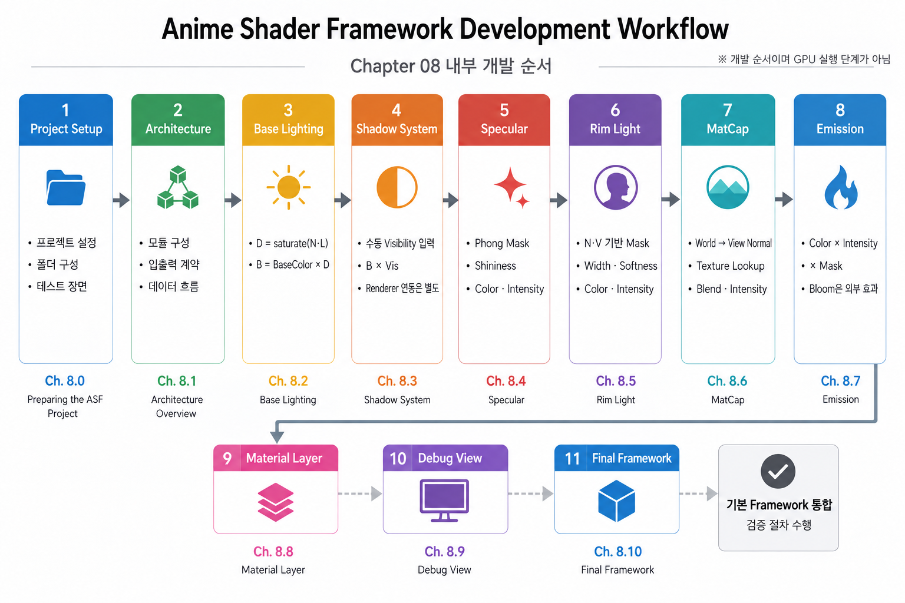
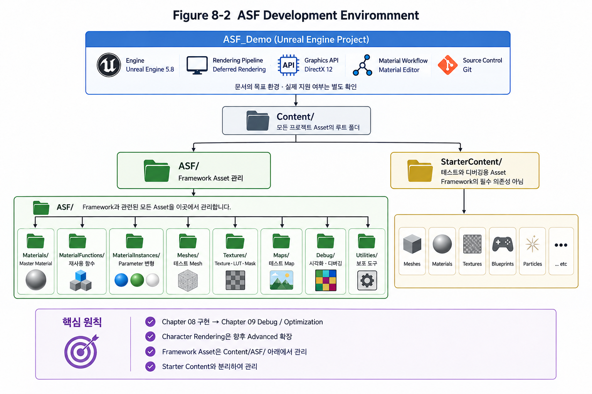
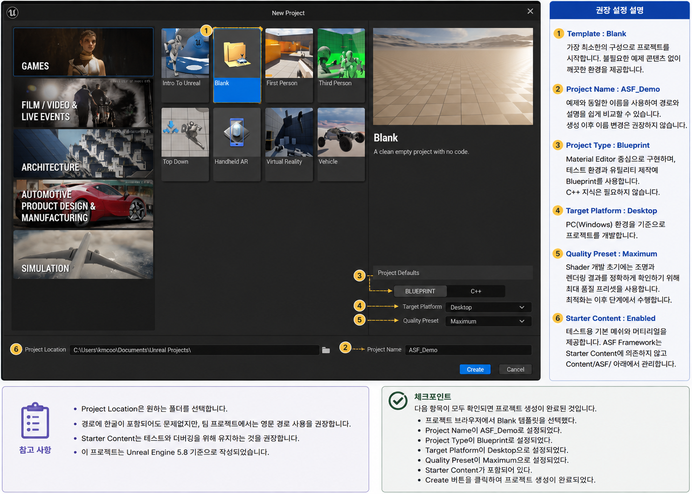
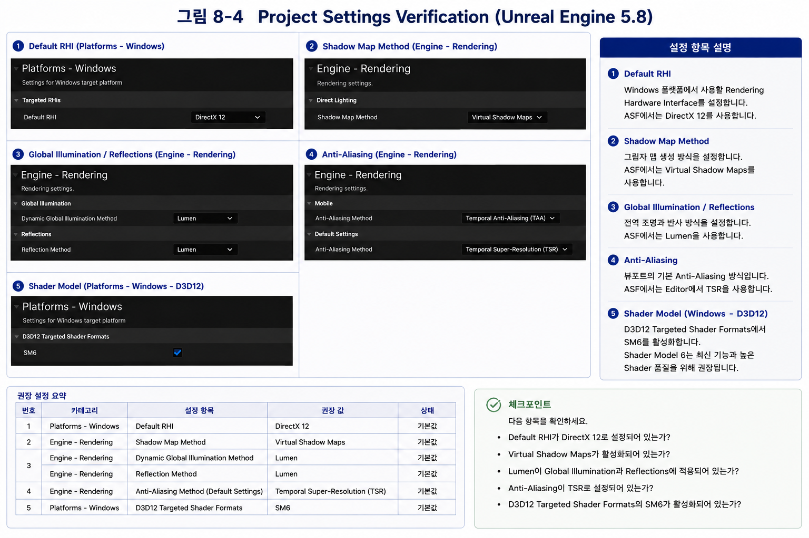
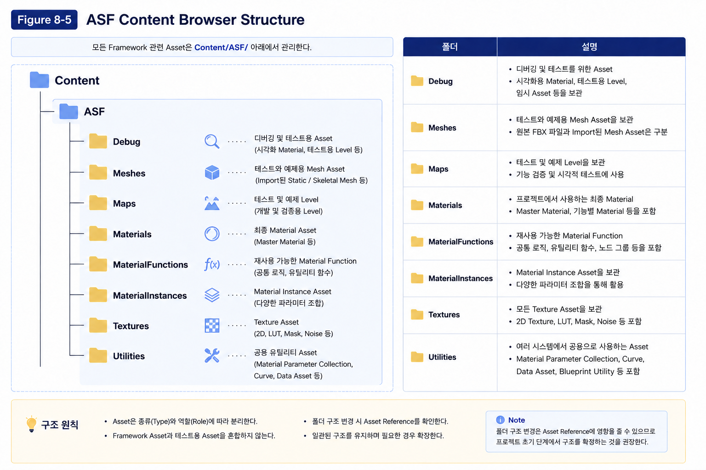
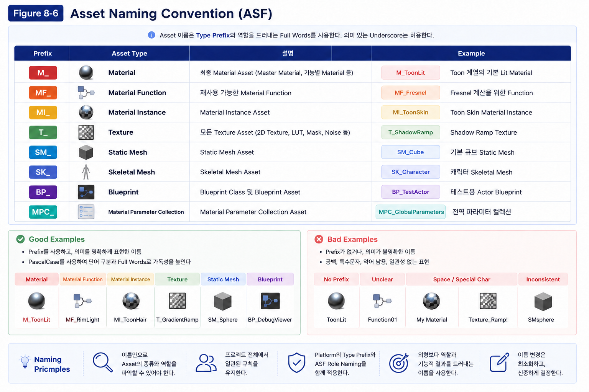
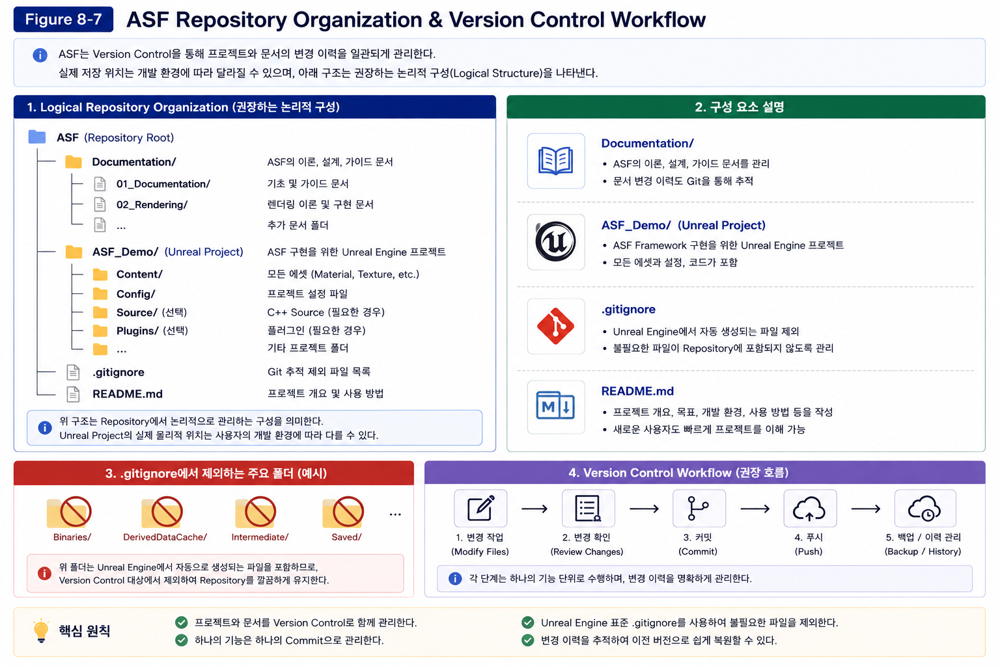
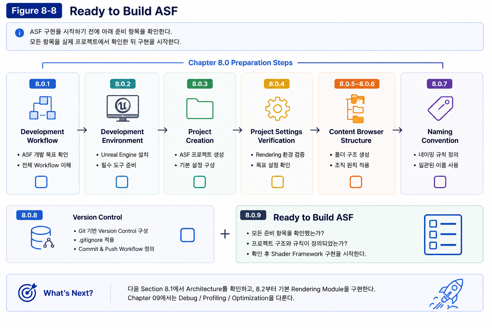

# Chapter 08 — Building an Anime Shader

## 8.0 Preparing the ASF Project

### Overview

Chapter 01부터 07까지 Radiometry, Reflection, BRDF, Modern Real-Time Rendering, NPR을 학습했다. Chapter 08에서는 이 이론을 실제 프로젝트에 옮겨 재사용 가능한 Anime Shader Framework(ASF)를 구축한다.

8.0은 그 구현에 필요한 개발 환경과 운영 규칙을 준비하는 절이다. 하나의 Unreal Engine 프로젝트를 지속적으로 확장하여 이후 실습에서도 구현한 기능을 재사용한다.

---

#### Development Workflow

Figure 8-1은 ASF 프로젝트의 전체 개발 흐름을 나타낸다.

<p align="center">
    
</p>

Chapter 8에서는 Anime Shader Framework를 구축한다.

Chapter 09에서는 구축한 Framework를 바탕으로 Debug/Profiling/Optimization의 사고 흐름을 익힌다. 전용 Character Rendering과 Production Case는 향후 Advanced 확장 범위이다.

모든 실습은 하나의 프로젝트 안에서 연속적으로 진행되며, 이전 Chapter에서 구현한 결과를 다음 Chapter에서 그대로 활용한다.

---

### Development Environment

#### Purpose

Anime Shader Framework(ASF)는 하나의 Unreal Engine 프로젝트를 기반으로 개발된다.

프로젝트를 생성하기 전에 개발 환경과 프로젝트 운영 원칙을 먼저 정의하면, 이후 구현하는 모든 Shader와 Asset을 일관된 기준으로 관리할 수 있다.

본 절에서는 ASF에서 사용할 개발 환경과 프로젝트 구성 원칙을 정의한다.

---

#### Project Workflow

ASF는 하나의 프로젝트를 지속적으로 확장하는 방식으로 개발된다.

Chapter 8에서 생성한 프로젝트는 Character Rendering과 Optimization Chapter에서도 계속 사용되며, 새로운 프로젝트를 생성하지 않는다.

Figure 8-2는 ASF 프로젝트의 전체 개발 환경과 Asset 구성 방식을 나타낸다.

<p align="center">
    
</p>

프로젝트는 Unreal Engine 5.8을 기반으로 구성되며, 모든 Shader와 Material은 하나의 프로젝트 안에서 단계적으로 구현된다.

또한 테스트용 Asset과 Framework Asset을 명확하게 분리하여 프로젝트 규모가 커져도 일관된 구조를 유지하도록 설계하였다.

---

#### Target Environment Specification

이 Documentation의 목표 환경은 아래와 같다. 실제 실행이 검증된 Support Matrix를 뜻하지 않으며, 설치된 Engine 버전과 각 Node의 지원 경로를 별도로 확인한다.

| Item | Specification |
|------|---------------|
| Engine | Unreal Engine 5.8 |
| Project | ASF_Demo |
| Rendering Pipeline | Deferred Rendering |
| Graphics API | DirectX 12 |
| Material Workflow | Material Editor |
| Source Control | Git |

가능한 한 동일한 개발 환경에서 실습을 진행하는 것을 권장한다.

Rendering Concept와 Data Flow는 Engine에 독립적이지만, 구현 예제는 Unreal Engine 5.8을 기준으로 설명한다.

---

#### Production-Oriented Project Structure

ASF는 **Tutorial-Oriented Project**가 아니라 **Production-Oriented Project**를 목표로 설계하였다.

많은 튜토리얼은 하나의 Material이나 Asset만으로 기능을 구현하지만, 실제 프로젝트에서는 Asset의 관리와 재사용성이 더욱 중요하다.

따라서 ASF는 프로젝트 초기부터 실제 프로젝트와 동일한 방식으로 구조를 구성한다.

- 하나의 Project를 지속적으로 확장한다.
- Framework와 테스트 Asset을 분리한다.
- 모든 ASF 관련 Asset은 `Content/ASF/` 아래에서 관리한다.
- Starter Content는 테스트와 디버깅 목적으로만 사용한다.

이러한 구조는 Framework의 확장성과 유지보수성을 높이고, 실제 프로젝트에서도 동일한 방식으로 적용할 수 있다.

---

#### Starter Content

프로젝트 생성 시 **Starter Content**를 포함하는 것을 권장한다.

Starter Content는 Sphere, Cube, Plane과 같은 기본 Mesh와 테스트용 Material을 제공하므로 초기 Shader 개발과 디버깅을 빠르게 진행할 수 있다.

다만 ASF Framework는 Starter Content에 의존하지 않는다.

Framework를 구성하는 모든 Material, Material Function, Texture, Map은 `Content/ASF/` 아래에서 관리하며, Starter Content는 테스트용 Asset으로만 사용한다.

이러한 분리는 Framework와 테스트 환경을 명확하게 구분하여 프로젝트를 더욱 체계적으로 관리할 수 있도록 한다.

---

#### Recommended Content Structure

ASF는 다음과 같은 Content Browser 구조를 권장한다.

```text
Content/
│
├── ASF/
│   ├── Materials/
│   ├── MaterialFunctions/
│   ├── MaterialInstances/
│   ├── Meshes/
│   ├── Textures/
│   ├── Maps/
│   ├── Debug/
│   └── Utilities/
│
└── StarterContent/
```

이 구조는 Figure 8-2와 같이 Framework Asset과 Starter Content를 명확하게 분리하여 관리하기 위한 것이다.

프로젝트 규모가 커져도 Asset의 위치를 쉽게 파악할 수 있으며, Git을 이용한 버전 관리와 협업에도 유리하다.

---

#### ASF Principle

> **ASF는 학습을 위한 예제 프로젝트가 아니라, 실제 프로젝트에서도 그대로 적용할 수 있는 구조를 목표로 설계되었다.**

따라서 본 서적에서 사용하는 프로젝트 구조와 Asset 관리 방식은 튜토리얼만을 위한 구성이 아니라, Production 환경에서도 사용할 수 있는 방식을 기준으로 한다.

---

#### Best Practice

프로젝트 생성 이후에는 Engine Version과 프로젝트 구조를 변경하지 않는 것을 권장한다.

또한 Framework Asset과 테스트용 Asset을 명확하게 분리하여 관리하면 프로젝트 규모가 커져도 일관성과 유지보수성을 확보할 수 있다.

---

#### Environment Review

Anime Shader Framework는 하나의 Unreal Engine 프로젝트를 기반으로 구축된다.

Starter Content는 테스트와 디버깅을 위한 Asset으로만 사용하며, Framework를 구성하는 모든 Asset은 `Content/ASF/` 아래에서 관리한다.

ASF는 Production-Oriented Project Structure를 기반으로 설계되었으며, 실제 프로젝트에서도 적용할 수 있는 Asset 관리 방식을 지향한다.

---

### Creating the Project

#### Purpose

Anime Shader Framework(ASF)를 구현하기 위한 Unreal Engine 프로젝트를 생성한다.

본 Chapter에서 생성하는 프로젝트는 일회성 예제가 아니라, 이후 Character Rendering과 Optimization Chapter까지 계속 확장되는 하나의 Framework 프로젝트이다.

따라서 프로젝트를 생성하는 단계부터 일관된 기준을 적용하는 것이 중요하다.

---

#### Creating a New Project

Epic Games Launcher에서 **Unreal Engine 5.8**을 실행한 후 **Games → Blank** 템플릿을 선택한다.

Figure 8-3은 ASF 프로젝트 생성 화면과 권장 설정을 나타낸다.

<p align="center">
    
</p>

*Figure 8-3. 프로젝트 생성 화면. ⑥은 Project Location이며 Starter Content 설정을 가리키지 않는다. 이 캡처만으로 Engine 버전, Starter Content 포함 여부 또는 Ray Tracing 비활성화를 검증할 수 없다. 해당 항목은 실제 프로젝트에서 별도로 확인해야 하며, 현재 설정을 보여주는 재촬영이 필요하다.*

프로젝트는 다음 설정을 사용하여 생성한다.

| Setting | Value |
|----------|-------|
| Template | Blank |
| Project Name | ASF_Demo |
| Project Type | Blueprint |
| Target Platform | Desktop |
| Quality Preset | Maximum |
| Starter Content | Enabled |
| Ray Tracing | Disabled |

---

#### Choosing the Project Template

ASF는 Rendering Framework를 처음부터 직접 구축하는 것을 목표로 한다.

따라서 Character, Animation Blueprint, Input Mapping 등 예제 콘텐츠가 포함된 템플릿보다 가장 단순한 **Blank Template**를 사용하는 것이 적합하다.

> 💡 **Why Blank Template?**
>
> Third Person이나 First Person Template는 학습용 예제로는 편리하지만, Shader Framework를 구축하기에는 불필요한 Asset과 시스템이 함께 생성된다.
>
> ASF는 프로젝트를 최소 구성으로 시작한 후 필요한 기능만 단계적으로 추가하는 방식을 사용한다.

---

#### Project Type

본 서적은 **Blueprint Project**를 기준으로 진행한다.

Anime Shader Framework의 핵심 구현은 **Material Editor**에서 이루어지며, Blueprint는 테스트 환경과 Utility 제작에만 사용한다.

Shader 구현을 위해 C++ 지식은 필요하지 않으며, 필요할 경우 후반부에서 선택적인 확장 방법만 소개한다.

---

#### Quality Preset

**Maximum Quality**를 선택한다.

Shader를 개발하는 초기 단계에서는 Lighting, Shadow, Specular와 같은 Rendering 결과를 정확하게 확인하는 것이 중요하다.

기본 구현 단계에서도 비용과 측정 조건을 인식한다. 먼저 정확한 Data Flow와 기본 Validation을 확보하고, 실제 Bottleneck을 측정한 뒤 필요한 최적화를 적용한다. 측정을 Framework 완성 이후로만 미루지는 않는다.

---

> 💡 **Production Tip**
>
> 초기 단계부터 동일한 테스트 조건과 Frame/Pass 측정 기준을 유지한다. 복잡한 Production 최적화 사례는 Advanced에서 다루되 기본 Profiling Awareness는 Foundation에 포함한다.
>
> ASF 역시 이러한 Production Workflow를 기준으로 구성하였다.

---

#### Starter Content

Starter Content는 **Enabled**를 선택한다.

Starter Content에는 Sphere, Cube, Plane과 같은 기본 Static Mesh와 테스트용 Material이 포함되어 있어 초기 Shader 개발과 Rendering 검증을 빠르게 진행할 수 있다.

다만 Starter Content는 테스트 환경을 위한 Asset일 뿐이며, Framework를 구성하는 Asset은 포함하지 않는다.

모든 Material, Material Function, Texture, Map은 `Content/ASF/` 아래에서 별도로 관리한다.

> 📌 **Note**
>
> Starter Content를 사용하는 이유는 개발 속도를 높이기 위함이다.
>
> Framework를 독립적으로 이전하려면 실제 Asset Reference를 확인한다. Test Scene과 Framework Asset의 폴더 분리만으로 의존성 제거를 보장하지 않는다.

---

#### Ray Tracing

Ray Tracing은 **Disabled**를 선택한다.

ASF는 Deferred Rendering 환경을 기준으로 구현하며, Anime Shader는 Stylized Lighting과 Material 표현을 중심으로 구성된다.

또한 모든 독자가 동일한 결과를 얻을 수 있도록 기본 환경을 통일하는 것을 목표로 한다.

---

#### Verifying the Project

프로젝트 생성이 완료되면 다음 항목을 확인한다.

- Unreal Engine 5.8 프로젝트가 정상적으로 실행된다.
- 프로젝트 이름이 `ASF_Demo`로 생성되었다.
- Starter Content가 포함되어 있다.
- `Content/` 폴더가 생성되었다.
- `StarterContent/` 폴더가 정상적으로 생성되었다.

---

> ✅ **Checkpoint**
>
> 다음 항목이 모두 확인되면 프로젝트 생성이 완료된 것이다.
>
> - Unreal Engine 프로젝트 정상 실행
> - ASF_Demo 프로젝트 생성
> - Starter Content 포함
> - Content Browser 정상 생성
> - 프로젝트 저장 완료

---

#### Best Practice

프로젝트 생성 이후에는 Engine Version과 Project Name을 변경하지 않는 것을 권장한다.

또한 Framework Asset과 테스트용 Asset을 명확하게 분리하여 관리하면 프로젝트 규모가 커져도 일관된 구조를 유지할 수 있으며, Git을 이용한 버전 관리와 협업도 더욱 용이해진다.

---

#### Project Creation Review

Anime Shader Framework의 기본 프로젝트를 생성하였다.

프로젝트는 Blank Template를 기반으로 생성하고, Starter Content를 활용하여 초기 개발 환경을 구성하였다.

또한 프로젝트는 Production-Oriented 구조를 기준으로 설계하며, Framework Asset과 테스트용 Asset을 분리하여 관리하는 것을 원칙으로 한다.

---

### Project Settings Verification

#### Purpose

프로젝트를 생성한 후에는 ASF에서 권장하는 Rendering 환경이 올바르게 적용되어 있는지 확인해야 한다.

아래 설정은 문서가 선택한 목표 구성이다. Engine 버전·Template·Platform에 따라 기본값과 지원 조합이 다르므로 기본값이라고 가정하지 않는다.

따라서 본 절에서는 Project Settings를 변경하는 것이 아니라, ASF에서 사용하는 Rendering 환경과 동일한지 확인하는 과정을 진행한다.

---

#### Why Verification?

Rendering Framework는 Project Settings에 직접적인 영향을 받는다.

Rendering Pipeline, Shadow Method, Global Illumination, Reflection, Anti-Aliasing과 같은 기능은 Project Settings에 따라 Rendering 결과가 달라질 수 있다.

ASF는 모든 실습이 동일한 결과를 얻을 수 있도록 프로젝트 생성 직후 권장 환경을 검증하는 것을 권장한다.

> 💡 **Production Tip**
>
> 실무에서도 Shader 개발을 시작하기 전에 프로젝트의 Rendering 환경을 먼저 확인한다.
>
> 개발 중간에 Rendering 설정을 변경하면 기존 Shader를 다시 검증해야 하는 경우가 많기 때문이다.

---

#### Recommended Settings

Figure 8-4는 ASF에서 사용하는 Project Settings를 나타낸다.

<p align="center">
    
</p>

*Figure 8-4. 문서가 목표로 하는 Project Settings. 하단 표의 “기본값”은 보편적인 Engine 기본값이나 현재 프로젝트의 검증 결과를 뜻하지 않는다. 실제 버전과 Template에서 값을 확인한다. ④의 Mobile TAA와 Default Settings의 Desktop TSR은 서로 다른 대상이며, 본 실습의 목표는 후자이다. 이 설정 화면은 ASF Module 구현이나 Material Function 합성의 증거가 아니다.*

다음 항목이 동일하게 설정되어 있는지 확인한다.

| Category | Setting | Recommended Value |
|-----------|----------|-------------------|
| Platforms → Windows | Default RHI | DirectX 12 |
| Engine → Rendering | Shadow Map Method | Virtual Shadow Maps |
| Engine → Rendering | Dynamic Global Illumination Method | Lumen |
| Engine → Rendering | Reflection Method | Lumen |
| Engine → Rendering | Anti-Aliasing Method | Temporal Super-Resolution (TSR) |
| Platforms → Windows | D3D12 Targeted Shader Formats | SM6 Enabled |

---

#### Default Configuration

위 표는 비교할 목표 설정이며 기본값 확인 결과가 아니다.

따라서 ASF에서는 별도의 값을 변경하기보다 프로젝트가 동일한 환경으로 생성되었는지를 확인하는 것을 목표로 한다.

> 📌 **Note**
>
> Engine 버전이나 기존 프로젝트를 기반으로 생성한 경우에는 일부 설정이 다를 수 있다.
>
> 특히 `Default RHI`, `Shadow Map Method`, `Global Illumination`, `Reflection Method`, `D3D12 Targeted Shader Formats`는 반드시 확인하는 것을 권장한다.

---

#### Why These Settings?

각 설정은 Rendering 결과의 일관성을 유지하기 위해 사용된다.

- **DirectX 12**는 Unreal Engine 5의 최신 Rendering 기능을 지원한다.
- **Virtual Shadow Maps**는 고해상도 그림자를 안정적으로 표현한다.
- **Lumen**은 Dynamic Global Illumination과 Reflection을 제공한다.
- **Temporal Super-Resolution (TSR)**은 기본 Rendering 환경에서 높은 화질과 안정적인 Anti-Aliasing을 제공한다.
- **Shader Model 6 (SM6)**은 최신 Shader 기능과 최적화를 지원한다.

ASF는 이러한 기본 Rendering 환경을 기준으로 모든 Material과 Shader를 구현한다.

---

> ⚠️ **Important**
>
> Project Settings를 변경한 경우에는 Shader Cache가 다시 생성될 수 있으며, 프로젝트 규모에 따라 Shader Compilation에 시간이 소요될 수 있다.

---

> ✅ **Checkpoint**
>
> 다음 항목을 확인한다.
>
> - Default RHI가 **DirectX 12**로 설정되어 있다.
> - Shadow Map Method가 **Virtual Shadow Maps**로 설정되어 있다.
> - Global Illumination과 Reflection이 **Lumen**으로 설정되어 있다.
> - Anti-Aliasing Method가 **TSR**로 설정되어 있다.
> - D3D12 Targeted Shader Formats의 **SM6**가 활성화되어 있다.

---

#### Settings Review

ASF의 목표 환경은 이 Section에서 지정한 Engine/Rendering 설정이며, 실제 검증한 값은 실행 환경에서 기록한다.

프로젝트 생성 직후 실제 설정과 Node 지원 여부를 확인한다. Deferred 설정과 Forward 전용 데이터 접근을 같은 조건으로 취급하지 않는다. Chapter 08.2는 명시적 LightDirection 입력을 기본 경로로 사용한다.

이후 모든 실습은 본 절에서 검증한 Rendering 환경을 기준으로 진행한다.

---

### Project Organization

#### Purpose

ASF는 하나의 프로젝트를 지속적으로 확장하는 Framework이다.

프로젝트가 커질수록 Asset의 수가 증가하므로, 초기부터 일관된 구조를 유지하는 것이 중요하다.

본 절에서는 ASF 프로젝트를 어떤 원칙으로 구성하는지 설명한다.

---

#### Why Project Organization?

튜토리얼 프로젝트는 하나의 Material만 만들어도 동작한다.

하지만 실제 프로젝트에서는 수백 개의 Material과 Texture, Material Function이 생성된다.

초기 구조가 잘못되면 프로젝트 규모가 커질수록 Asset 관리가 어려워진다.

ASF는 Production-Oriented 구조를 기준으로 프로젝트를 설계한다.

> 💡 **Production Tip**
>
> 실무에서는 기능을 구현하는 것보다 Asset을 유지보수하는 시간이 더 길다.
>
> 따라서 프로젝트 초기에 폴더 구조와 Naming Convention을 먼저 정의하는 것이 일반적이다.

---

#### Asset Categories

ASF는 Asset의 종류에 따라 폴더를 분리한다.

예를 들어,

- Material
- Material Function
- Material Instance
- Texture
- Mesh
- Map

은 각각 독립적으로 관리한다.

이러한 방식은 Asset 검색과 유지보수를 단순화한다.

---

#### Framework and Test Assets

Framework를 구성하는 Asset과 테스트용 Asset은 명확하게 분리한다.

Starter Content는 테스트와 디버깅에만 사용하며, Framework를 구성하는 모든 Asset은 `Content/ASF/` 아래에서 관리한다.

이는 Framework를 다른 프로젝트로 쉽게 이전할 수 있도록 하기 위한 것이다.

---

#### Project Growth

ASF 프로젝트는 Chapter가 진행될수록 새로운 기능이 추가된다.

하지만 기존 구조는 변경하지 않는다.

처음 정의한 프로젝트 구조를 유지하면서 기능만 확장하는 것이 Production 프로젝트의 일반적인 개발 방식이다.

---

> 📌 **Note**
>
> 프로젝트 구조는 개발 초기에 결정하는 것이 가장 효율적이다.
>
> 프로젝트가 커진 이후 폴더를 변경하면 Asset Reference를 수정해야 하는 경우가 발생할 수 있다.

---

> ✅ **Checkpoint**
>
> 다음 사항을 확인한다.
>
> - Framework Asset과 테스트용 Asset을 구분하였다.
> - 프로젝트 구조를 변경하지 않고 유지할 계획을 세웠다.
> - 모든 ASF Asset은 `Content/ASF/` 아래에서 관리한다.

---

#### Organization Review

ASF는 하나의 프로젝트를 지속적으로 확장하는 Framework이다.

프로젝트 구조는 기능 중심이 아니라 Asset의 역할을 기준으로 구성하며, Framework Asset과 테스트용 Asset을 분리하여 Production-Oriented 프로젝트 구조를 유지한다.

---

### Content Browser Structure

#### Purpose

프로젝트 규모가 커질수록 Asset의 수는 빠르게 증가한다.

초기에는 몇 개의 Material과 Texture만으로도 작업이 가능하지만, Framework가 확장될수록 Asset을 체계적으로 관리할 수 있는 구조가 반드시 필요하다.

본 절에서는 ASF에서 사용하는 Content Browser 구조를 정의한다.

---

#### Why Content Structure?

Unreal Engine의 모든 Asset은 Content Browser에서 관리된다.

Material, Texture, Mesh, Material Function과 같은 Asset이 명확하게 분류되어 있지 않으면 프로젝트 규모가 커질수록 Asset을 찾거나 유지보수하기 어려워진다.

ASF는 Asset의 **종류(Type)** 와 **역할(Role)** 을 기준으로 Content Browser를 구성한다.

> 💡 **Production Tip**
>
> 실제 프로젝트에서는 Asset을 만드는 시간보다 기존 Asset을 검색하고 수정하는 시간이 더 길다.
>
> 따라서 초기 Content Structure를 올바르게 설계하는 것이 장기적인 유지보수에 큰 영향을 준다.

---

#### Recommended Content Structure

ASF는 다음과 같은 Content Browser 구조를 권장한다.

<p align="center">
    
</p>

모든 Framework 관련 Asset은 `Content/ASF/` 아래에서 관리하며, Starter Content는 테스트용 Asset으로만 사용한다.

---

#### Folder Overview

| Folder | Description |
|----------|-------------|
| Materials | 최종 Material Asset |
| MaterialFunctions | 재사용 가능한 Material Function |
| MaterialInstances | Material Instance |
| Meshes | 테스트 및 예제 Mesh |
| Textures | Texture Asset |
| Maps | 테스트 및 예제 Level |
| Utilities | Utility Material 및 공용 Asset |
| Debug | Debug Material 및 테스트용 Asset |

각 폴더는 하나의 역할만 담당하며, 서로 다른 종류의 Asset을 혼합하지 않는다.

---

#### Separation of Responsibilities

ASF는 Framework Asset과 테스트용 Asset을 명확하게 분리한다.

- `Content/ASF/`
  - Framework를 구성하는 모든 Asset
- `Content/StarterContent/`
  - Unreal Engine에서 제공하는 테스트용 Asset

폴더 분리는 관리 경계이다. 실제 독립 배포 가능 여부는 Asset Reference에 달려 있으므로 Test Asset을 참조하는 Material/Map 등을 확인한 뒤 이전한다. 폴더가 분리되었다는 사실만으로 의존성이 사라지지는 않는다.

---

#### Asset Management Principles

ASF는 다음 원칙에 따라 Asset을 관리한다.

- Asset은 종류(Type)에 따라 분리한다.
- Framework와 테스트 Asset을 혼합하지 않는다.
- 폴더 구조 변경이 필요하면 Reference 영향과 Migration을 검토하여 의도적으로 변경한다.
- 새로운 기능이 추가되더라도 기존 구조를 유지한다.

이러한 원칙은 Asset 검색과 유지보수를 단순화하고 프로젝트의 일관성을 유지하는 데 도움이 된다.

---

> ⚠️ **Important**
>
> 프로젝트가 진행된 이후에는 폴더 구조를 변경하지 않는 것을 권장한다.
>
> Asset을 이동하면 Reference가 변경될 수 있으며, 프로젝트 규모가 커질수록 관리 비용이 증가한다.

---

> ✅ **Checkpoint**
>
> 다음 항목을 확인한다.
>
> - `Content/ASF/` 폴더가 생성되었다.
> - Framework Asset과 Starter Content가 분리되어 있다.
> - 권장 폴더 구조가 모두 생성되었다.
> - 각 폴더의 역할을 이해하였다.

---

#### Content Structure Review

ASF는 Production-Oriented 프로젝트 구조를 기준으로 Content Browser를 구성한다.

모든 Framework 관련 Asset은 `Content/ASF/` 아래에서 관리하며, Asset의 종류와 역할에 따라 폴더를 분리하여 프로젝트의 확장성과 유지보수성을 확보한다.

---

### Asset Naming Convention

#### Purpose

프로젝트 규모가 커질수록 Material, Texture, Blueprint와 같은 Asset의 수는 지속적으로 증가한다.

일관되지 않은 이름은 Asset 검색과 유지보수를 어렵게 만들며, 협업 과정에서도 혼란을 유발할 수 있다.

Naming의 Source of Truth는 ASF-001 Naming Philosophy이다. Role을 먼저 명확히 하고 Full Words와 Unreal 계열 Type Prefix를 함께 사용한다.

---

#### Why Naming Convention?

Unreal Engine에서는 Content Browser 검색과 Asset Reference가 이름을 기준으로 이루어지는 경우가 많다.

Asset 이름만 보더라도 종류와 역할을 즉시 파악할 수 있도록 Prefix와 일관된 Naming Rule을 사용하는 것이 중요하다.

> 💡 **Production Tip**
>
> 실무에서는 새로운 Naming Convention을 만들기보다 Unreal Engine에서 널리 사용하는 Prefix 규칙을 그대로 사용하는 것이 일반적이다.
>
> ASF-001의 Role-first 규칙이 우선이며 Prefix는 Asset Type을 보조적으로 표시한다.

---

#### Asset Naming Convention

Figure 8-6은 ASF에서 사용하는 Asset Naming Convention을 나타낸다.

<p align="center">
    
</p>

Asset 이름은 ASF-001에 따라 Role을 드러내는 Full Words와 Type Prefix를 사용한다. `MF_BaseLighting`, `M_ASF_Master`처럼 의미 있는 구분용 Underscore는 허용한다. 공백과 불필요한 기호는 피한다.

---

#### General Rules

ASF는 다음 규칙을 따른다.

- Asset 이름은 **Prefix + PascalCase**를 사용한다.
- 공백(Space)은 사용하지 않는다.
- Prefix/의미 구분용 Underscore 외의 불필요한 기호는 피한다.
- 의미 없는 이름(Test, NewMaterial, Material01 등)은 사용하지 않는다.
- Asset의 역할을 이름만으로 파악할 수 있도록 작성한다.

---

#### Standard Prefix

ASF는 Unreal Engine에서 일반적으로 사용하는 Prefix를 그대로 사용한다.

| Asset Type | Prefix | Example |
|------------|---------|----------|
| Material | `M_` | `M_ToonLit` |
| Material Function | `MF_` | `MF_Fresnel` |
| Material Instance | `MI_` | `MI_ToonSkin` |
| Texture | `T_` | `T_ShadowRamp` |
| Static Mesh | `SM_` | `SM_Sphere` |
| Skeletal Mesh | `SK_` | `SK_Character` |
| Blueprint | `BP_` | `BP_DebugViewer` |
| Material Parameter Collection | `MPC_` | `MPC_GlobalParameters` |

---

#### Good and Bad Examples

Figure 8-6의 예시와 같이 이름만 보더라도 Asset의 종류와 역할을 쉽게 파악할 수 있어야 한다.

좋은 예시는 Prefix와 PascalCase를 사용하여 Asset의 목적을 명확하게 표현한다.

반대로 Prefix가 없거나 의미 없는 이름, 공백과 특수문자를 포함한 이름은 프로젝트의 가독성과 유지보수성을 떨어뜨릴 수 있으므로 사용하지 않는다.

---

#### Folder Naming

폴더 이름은 Asset의 종류를 기준으로 작성하며, 프로젝트 전체에서 동일한 규칙을 유지한다.

| Folder | Example |
|---------|---------|
| Debug | ✔ |
| Fbx | ✔ |
| Maps | ✔ |
| Materials | ✔ |
| MaterialFunctions | ✔ |
| MaterialInstances | ✔ |
| Textures | ✔ |
| Utilities | ✔ |

프로젝트가 진행된 이후에는 폴더 이름과 구조를 변경하지 않는 것을 권장한다.

---

> ⚠️ **Important**
>
> Asset 이름이나 폴더 구조를 변경하면 Asset Reference가 갱신될 수 있다.
>
> 프로젝트 규모가 커질수록 이러한 변경은 관리 비용을 증가시키므로, 초기 단계에서 Naming Convention을 확정하는 것이 중요하다.

---

> ✅ **Checkpoint**
>
> 다음 항목을 확인한다.
>
> - 모든 Asset이 Prefix를 사용한다.
> - PascalCase 규칙을 적용하였다.
> - 공백과 특수문자를 사용하지 않는다.
> - Unreal Engine 표준 Prefix를 사용한다.
> - 프로젝트 전체에서 동일한 Naming Convention을 유지한다.

---

#### Naming Review

ASF는 ASF-001의 Role-first Naming과 Unreal 계열 Type Prefix를 일관되게 사용한다.

모든 Asset은 **Prefix + PascalCase** 형식을 따르며, 이름만으로 Asset의 종류와 역할을 쉽게 파악할 수 있도록 작성한다.

일관된 Naming Convention은 프로젝트의 가독성과 유지보수성을 높이며, 장기적인 협업과 Framework 확장에도 중요한 기반이 된다.

---

### Version Control

#### Purpose

ASF는 프로젝트와 Documentation의 변경 이력을 체계적으로 관리하기 위해 Version Control System(VCS)을 사용한다.

Version Control은 단순한 백업이 아니라 프로젝트의 변경 사항을 기록하고, 이전 상태로 복원하며, 기능 단위로 개발 과정을 관리하기 위한 핵심 도구이다.

ASF에서는 Git을 기본 Version Control System으로 사용한다.

---

#### Why Version Control?

Framework는 지속적으로 기능이 추가되고 문서가 수정된다.

Version Control을 사용하면 다음과 같은 장점을 얻을 수 있다.

- 변경 이력을 안전하게 관리할 수 있다.
- 이전 버전으로 복원할 수 있다.
- 기능 단위로 개발 과정을 추적할 수 있다.
- 구현과 Documentation을 함께 관리할 수 있다.

> 💡 **Production Tip**
>
> Version Control은 프로젝트 규모와 관계없이 사용하는 것을 권장한다.
>
> 작은 프로젝트라도 기능 단위의 Commit을 유지하면 문제를 추적하거나 이전 상태를 복원하기 훨씬 쉬워진다.

---

#### Repository Organization

Figure 8-7은 ASF에서 권장하는 Repository 구성과 Version Control Workflow를 나타낸다.

<p align="center">
    
</p>

Repository에는 프로젝트와 Documentation을 함께 관리하는 것을 권장하지만, 실제 프로젝트의 저장 위치는 개발 환경에 따라 달라질 수 있다.

예를 들어 Unreal Project는 SSD와 같은 빠른 저장 장치에 저장하고, Documentation은 별도의 작업 공간에서 관리할 수도 있다.

중요한 것은 물리적인 위치가 아니라 변경 이력을 일관된 방식으로 관리하는 것이다.

---

#### Version Control Workflow

ASF에서는 다음과 같은 Workflow를 권장한다.

1. Asset 또는 Documentation 수정
2. 변경 사항 확인(Review Changes)
3. 기능 단위 Commit
4. Remote Repository에 Push
5. 변경 이력 관리 및 백업

각 Commit은 하나의 기능만 포함하도록 작성하는 것이 좋다.

---

#### .gitignore

Unreal Engine 프로젝트에는 자동으로 생성되는 파일이 많다.

ASF에서는 Unreal Engine 표준 `.gitignore`를 사용하여 다음과 같은 폴더를 Version Control에서 제외하는 것을 권장한다.

- Binaries/
- DerivedDataCache/
- Intermediate/
- Saved/

이러한 폴더는 프로젝트 실행 과정에서 자동으로 생성되므로 Repository에 포함할 필요가 없다.

---

#### Commit Guidelines

Commit Message는 변경 내용을 명확하게 표현해야 한다.

다음은 권장하는 예시이다.

| Good Example |
|--------------|
| Add Toon Base Material |
| Create Material Function Library |
| Implement Rim Lighting |
| Update Documentation |

의미를 알기 어려운 Commit Message는 사용하지 않는다.

| Avoid |
|-------|
| Update |
| Test |
| Fix |
| 수정 |

Commit은 가능한 작은 단위로 수행하며, 하나의 Commit에는 하나의 기능만 포함하는 것을 권장한다.

---

> ⚠️ **Important**
>
> Material, Texture, Blueprint와 같은 Asset의 이름 변경이나 이동도 하나의 Commit으로 관리하는 것이 좋다.
>
> 여러 종류의 변경을 하나의 Commit에 포함하면 변경 이력을 추적하기 어려워질 수 있다.

---

> ✅ **Checkpoint**
>
> 다음 항목을 확인한다.
>
> - Git Repository를 생성하였다.
> - Unreal Engine 표준 `.gitignore`를 적용하였다.
> - 변경 사항을 Commit 단위로 관리한다.
> - Documentation과 프로젝트의 변경 이력을 함께 관리한다.

---

#### Version Control Review

ASF는 Git을 기반으로 프로젝트의 변경 이력을 관리한다.

Version Control은 안정적인 개발 환경을 유지하기 위한 핵심 도구이며, 기능 단위의 Commit과 Unreal Engine 표준 `.gitignore` 사용을 원칙으로 한다.

프로젝트의 저장 위치는 개발 환경에 따라 달라질 수 있지만, 변경 이력은 일관된 방식으로 관리하는 것이 중요하다.

---

### Final Preparation Checks

#### Purpose

지금까지 ASF 구현을 위한 개발 환경을 준비하였다.

프로젝트 생성부터 Rendering 환경 검증, Content Browser 구조, Asset Naming Convention, Version Control까지 모든 준비 과정이 완료되었다.

본 절에서는 지금까지의 준비 과정을 최종적으로 확인하고, 이후 Chapter에서 Shader Framework를 구현하기 위한 준비 상태를 점검한다.

---

#### Preparing the Foundation

ASF는 하나의 프로젝트를 지속적으로 확장하는 Framework이다.

초기 환경을 올바르게 구성하면 이후 Chapter에서는 개발 환경을 다시 수정할 필요 없이 구현에만 집중할 수 있다.

Figure 8-8은 ASF 구현을 시작하기 전에 확인해야 하는 준비 항목을 나타낸다.

<p align="center">
    
</p>

---

#### Verification Checklist

다음 항목이 모두 완료되었는지 확인한다.

| Category | Status |
|----------|--------|
| Development Environment | ✅ |
| Unreal Engine Project | ✅ |
| Project Settings Verification | ✅ |
| Content Browser Structure | ✅ |
| Asset Naming Convention | ✅ |
| Version Control | ✅ |

모든 항목이 완료되었다면 ASF 구현을 시작할 준비가 완료된 것이다.

---

> 💡 **Production Tip**
>
> 프로젝트 초기에 개발 환경과 구조를 충분히 준비하면 이후 구현 과정에서는 기능 개발에만 집중할 수 있다.
>
> 실무에서도 프로젝트 초기에는 환경 구성에 시간을 투자하고, 이후에는 구조를 유지하면서 기능을 확장하는 방식을 사용한다.

---

#### Development Principles

Chapter 8 이후에는 다음 원칙을 유지한다.

- 프로젝트 구조를 변경하지 않는다.
- Naming Convention을 유지한다.
- Version Control을 지속적으로 사용한다.
- 새로운 Asset은 정의된 폴더에 저장한다.
- 구현과 Documentation을 함께 관리한다.

---

> ✅ **Checkpoint**
>
> 다음 항목을 확인한다.
>
> - ASF 프로젝트가 정상적으로 실행된다.
> - 모든 기본 폴더가 생성되어 있다.
> - Naming Convention을 이해하였다.
> - Version Control이 구성되어 있다.
> - ASF 구현을 시작할 준비가 완료되었다.

---

### Key Takeaways

8.0에서는 ASF 구현을 시작하기 위한 개발 환경을 준비했다.

프로젝트 생성부터 Rendering 환경 검증, Content Browser 구조, Asset Naming Convention, Version Control까지 Framework 개발에 필요한 기반을 모두 준비하였다.

이후 실습은 이 절에서 준비한 개발 환경과 프로젝트 구조를 기준으로 진행한다.

---

#### What We Prepared

| Section | Description |
|---------|-------------|
| [Overview](#overview) | ASF 프로젝트의 개발 목표와 전체 Workflow를 이해하였다. |
| [Development Environment](#development-environment) | Unreal Engine 개발 환경과 필요한 도구를 준비하였다. |
| [Creating the Project](#creating-the-project) | ASF Unreal Project를 생성하였다. |
| [Project Settings Verification](#project-settings-verification) | ASF에서 사용하는 Rendering 환경을 검증하였다. |
| [Project Organization](#project-organization) | 프로젝트 구성 원칙(Project Organization)을 이해하였다. |
| [Content Browser Structure](#content-browser-structure) | ASF Content Browser 구조를 구성하였다. |
| [Asset Naming Convention](#asset-naming-convention) | Asset Naming Convention을 정의하였다. |
| [Version Control](#version-control) | Version Control 관리 원칙을 정의하였다. |
| [Final Preparation Checks](#final-preparation-checks) | ASF 구현을 시작하기 위한 준비를 완료하였다. |

---

#### Working Principles

프로젝트 준비 이후에도 유지할 핵심 원칙은 다음과 같다.

- Development Environment는 프로젝트 시작 시 한 번만 구성한다.
- Rendering 환경은 Unreal Engine 기본 설정을 기준으로 검증한다.
- 모든 Framework Asset은 `Content/ASF/` 아래에서 관리한다.
- Asset은 Unreal Engine 표준 Naming Convention을 따른다.
- Version Control을 통해 프로젝트와 Documentation을 함께 관리한다.
- 이후 Chapter도 ASF-001을 따르며 필요한 구조 변경은 Reference 영향과 함께 기록한다.

---

준비 확인을 마쳤다면 다음 8.1에서 Architecture를 살펴보고, 8.2부터 기본 Rendering Module을 구현한다. 여기서 준비한 프로젝트 환경과 Asset 규칙은 이후 실습의 공통 기반으로 사용한다.

---

**Next → [8.1 Architecture Overview](<./Chapter08.1_ArchitectureOverview copy.md>)**
