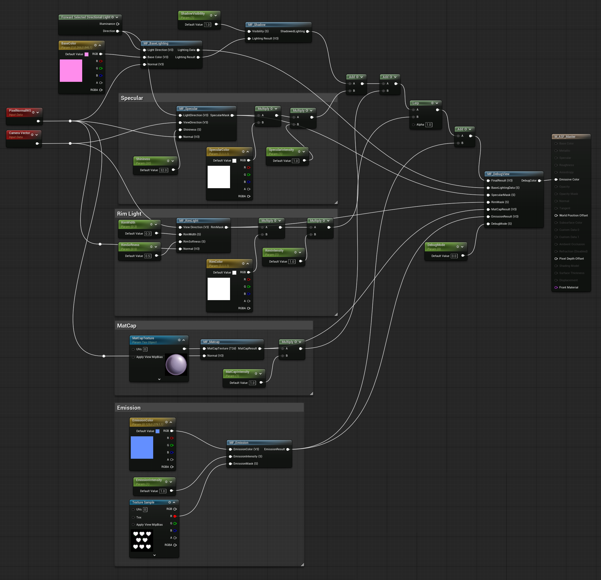
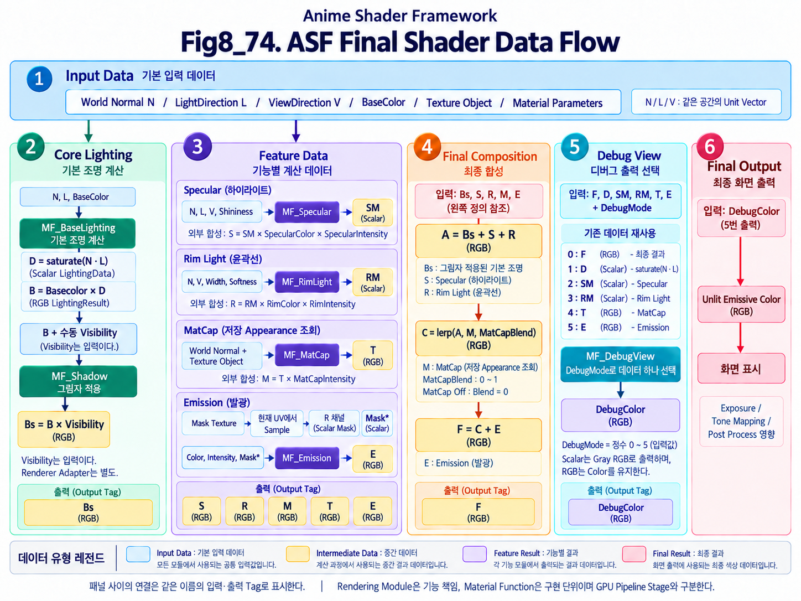

# Chapter 08 Building an Anime Shader

## 8.10 Final Framework

### Canonical Interface and Composition

아래 계약은 Chapter 08의 기본 교육용 Framework를 연결하는 기준이다. 각 Function은 논리적 Module의 구현 단위이며 Renderer Stage가 아니다. 모든 방향은 명시한 Space의 비영 Unit Vector를 사용한다.

| Function | Inputs | Outputs / Composition |
|---|---|---|
| MF_BaseLighting | World N, Surface→Light L, Linear BaseColor | D=saturate(N·L) Scalar; B=BaseColor·D Vector3 |
| MF_Shadow | B, manual Vis Scalar 0–1 | B·Vis Vector3; Renderer Visibility 공급은 별도 |
| MF_Specular | N, L, Surface→Camera V, Shininess>0 | saturate(R·V)^Shininess Scalar Artistic Mask; Color/Intensity 외부 적용 |
| MF_RimLight | N, V, RimWidth, RimSoftness | Scalar RimMask; 0<Softness≤Width≤1, Width=0 Off 별도 정책 |
| MF_MatCap | World Normal, Texture Object | View-normal Lookup의 Linear RGB; Intensity 외부 적용 |
| MF_Emission | Linear EmissionColor, Intensity, 현재 UV Sample의 Mask Scalar | Color·Intensity·Mask Vector3; Texture Sample은 함수 밖 |
| MF_DebugView | DebugMode, F, D, SpecularMask, RimMask, MatCapResult, EmissionResult | 선택된 Vector3 DebugColor |

```text
S = SpecularMask * SpecularColor * SpecularIntensity
Rim = RimMask * RimColor * RimIntensity
A = B * Vis + S + Rim
M = MatCapResult * MatCapIntensity
E = EmissionResult
F = lerp(A, M, MatCapBlend) + E
Output = SelectDebug(DebugMode, F, D, SpecularMask, RimMask, MatCapResult, E)
```

MatCapBlend는 0–1의 Constant 또는 선택적인 MI Parameter이다. Blend=0은 A, Blend=1은 M을 선택한다. Intensity=0만으로 MatCap Off가 되는 것은 아니다. E는 Blend 뒤에 더하므로 MatCapBlend=1에도 유지된다.

현재 Vis는 수동 Test Input이며 Base에만 적용하는 Artistic 정책이다. 실제 Cast Shadow 공급과 같은 Light의 물리적 Specular 차폐는 완료된 기능이 아니다. 8.4의 ungated Phong Mask 역시 PBR BRDF가 아니다. LightDirection의 기본 경로는 명시적 World Vector이며 Scene Adapter와 Forward 전용 Expression의 지원은 8.2 기준으로 검증한다.

DebugMode는 정수 0–5이다. 0=F, 1=D, 2=SpecularMask, 3=RimMask, 4=MatCapResult, 5=EmissionResult이며 Shadow/Region Mask는 현재 계약에 없다. 화면 출력은 Unlit Emissive를 거쳐도 Post Process의 영향을 받는다.

### Basic Contract Checks

아래 값은 식에서 도출한 예상 결과이며 Engine 실행 결과가 아니다. 각 Function과 합성 연결을 따로 확인하고, 화면 비교에는 Fixed Exposure 조건을 사용한다.

| Check | Input | Expected Calculation |
|---|---|---|
| Base Lighting | Unit N=L, 수직 N/L, N=-L | D=1, 0, 0; B=BaseColor·D |
| Manual Shadow | B=(0.2,0.4,0.6), Vis=1/0.5/0 | B, (0.1,0.2,0.3), (0,0,0) |
| Rim | Width=0.4, Softness=0.1, X=1-saturate(N·V) | Smoothstep edges=0.6/0.7; X=0.6/0.65/0.7에서 Mask≈0/0.5/1 |
| MatCap Blend | Blend=0 또는 1 | Emission을 더하기 전 A 또는 M; Intensity=0만으로 Off 판정 금지 |
| Emission | Mask=0 또는 1 | (0,0,0) 또는 EmissionColor·Intensity |
| Debug Selection | 서로 구분되는 각 입력, Mode=0–5 | 위 Mode 표의 입력만 선택; Scalar는 RGB로 표시 |

Zero Direction, 비유효 Rim 범위, DebugMode의 비정수 값은 정상 입력 테스트와 분리한다. 현재 Graph가 모든 비유효 입력을 자동 보정한다고 가정하지 않는다. Renderer Shadow 수집, Engine Light Adapter 지원, Platform별 Compile/Runtime 동작은 별도 실행 검증 대상이다.

---


Chapter 08에서는 Anime Shader를 하나의 완성된 결과로 바로 만드는 대신, Rendering을 구성하는 주요 기능을 단계적으로 분해하여 각각의 역할과 Data Flow를 직접 구현했다.

지금까지 구현한 주요 Material Function은 다음과 같다.

~~~text
MF_BaseLighting
MF_Shadow
MF_Specular
MF_RimLight
MF_MatCap
MF_Emission
MF_DebugView
~~~

각 Material Function은 하나의 독립된 Shader Feature 또는 Utility 역할을 담당한다.

이러한 구조를 사용한 가장 중요한 이유는 단순히 Node Graph를 보기 좋게 정리하기 위해서가 아니다.

Chapter 08의 첫 번째 목적은 Rendering 과정에서 각각의 기능이 어떤 Input을 받고, 어떤 계산을 수행하며, 어떤 Result를 다음 단계로 전달하는지를 직접 확인하는 것이었다.

예를 들어 Final Shading Result만 바라보면 Specular, Rim Light, MatCap, Emission과 같은 결과가 하나의 Color 안에 모두 섞여 있다.

하지만 이를 각각의 Material Function으로 분리하면 다음과 같은 질문을 명확하게 할 수 있다.

- 이 Feature는 어떤 Data를 Input으로 사용하는가
- 내부에서 어떤 계산이 수행되는가
- 계산 결과는 Scalar인가, Vector인가, Mask인가
- 이 Result는 다음 Feature에서 어떻게 사용되는가
- Final Composition에서는 어떤 방식으로 합쳐지는가
- 문제가 발생했을 때 어느 단계의 Data를 확인해야 하는가

이러한 방식으로 Chapter 08에서는 Shader를 하나의 거대한 결과가 아니라 **여러 단계의 Data Processing Pipeline**으로 바라보는 연습을 진행했다.

또한 각 Feature를 `MF_` 단위로 분리하면서 Material Function을 **논리적 Module을 구현하는 재사용 가능한 단위**로 사용하는 방법도 함께 확인했다. Module의 책임과 이를 구현하는 Function은 구분한다.

~~~text
Shader Feature
      ↓
Material Function
      ↓
Reusable Module
      ↓
Master Material Integration
~~~

이를 통해 하나의 기능을 다른 Material에서 다시 사용할 수 있고, 기능 내부의 변경이 Master Material 전체 구조에 직접 영향을 주지 않도록 역할을 분리할 수 있다.

Chapter 08 후반부에서는 이러한 Feature Module을 Master Material에 통합하고, `MF_DebugView`를 추가하여 Intermediate Data와 Feature Result까지 직접 확인할 수 있는 구조를 완성했다.

즉 Chapter 08의 흐름은 다음과 같이 정리할 수 있다.

~~~text
Rendering Concept 이해
        ↓
Feature 단위로 분해
        ↓
Material Function 구현
        ↓
Master Material 통합
        ↓
Feature Composition
        ↓
Debug View를 통한 Data 확인
        ↓
Final Framework
~~~

Chapter 08.10에서는 새로운 Shader Feature를 추가하지 않는다.

대신 지금까지 구현한 모든 Material Function과 Data Flow를 하나의 Framework 관점에서 다시 정리하고, 각 기능이 최종 Master Material 안에서 어떤 역할을 담당하는지 확인한다.

이를 통해 Chapter 08에서 구현한 구조를 단순한 학습용 Node Graph의 집합이 아니라, **Rendering Concept → Module → Data Flow → User Control → Debugging**으로 이어지는 하나의 Shader Architecture로 정리한다.

---

### Final Framework Overview

현재 Master Material은 공유 입력을 사용하는 여러 Function Branch와 최종 합성으로 구성된다. 모든 Function의 결과가 다음 Function의 Input으로 직렬 연결되는 것은 아니다.

전체 구조를 단순화하면 다음과 같이 볼 수 있다.

~~~text
Shared N/L/V + Material Inputs
  ├─ MF_BaseLighting → MF_Shadow (manual Vis) ─┐
  ├─ MF_Specular → Color * Intensity ──────────┤→ A
  ├─ MF_RimLight → Color * Intensity ──────────┘
  ├─ MF_MatCap → Intensity ─────────────────────→ Lerp(A,M,Blend)
  └─ MF_Emission ──────────────────────────────→ Add → F
Actual intermediate outputs + F → MF_DebugView → Emissive Color
~~~

이 흐름은 단순히 Feature를 위에서 아래로 하나씩 적용한다는 의미만 가지는 것은 아니다.

각 단계에서는 서로 다른 종류의 Data가 생성된다.

예를 들어 다음과 같다.

~~~text
MF_BaseLighting
→ Lighting Data
→ Lighting Result

MF_Shadow
→ Shadowed Lighting

MF_Specular
→ Specular Mask
→ Specular Result

MF_RimLight
→ Rim Mask
→ Rim Result

MF_MatCap
→ MatCap Result

MF_Emission
→ Emission Result
~~~

이러한 Intermediate Data와 Feature Result는 최종적으로 하나의 Final Shading Result를 만들기 위해 사용된다.

따라서 ASF Master Material은 다음과 같은 형태의 Data Flow를 가진다고 볼 수 있다.

~~~text
Input
  ↓
Intermediate Data
  ↓
Feature Result
  ↓
Feature Composition
  ↓
Final Result
  ↓
Debug / Output
~~~

이 구조에서 중요한 것은 각 Material Function이 자신의 역할을 명확하게 유지한다는 점이다.

예를 들어 `MF_Specular`는 Rim Light 계산을 담당하지 않고, `MF_RimLight`는 MatCap Mapping을 처리하지 않는다.

각 Module은 가능한 한 하나의 기능에 집중한다.

~~~text
MF_BaseLighting
→ Lighting

MF_Shadow
→ Visibility Application

MF_Specular
→ Specular

MF_RimLight
→ Rim Lighting

MF_MatCap
→ MatCap Mapping

MF_Emission
→ Emission

MF_DebugView
→ Debug Selection
~~~

이렇게 역할을 나누면 각각의 기능을 독립적으로 이해하고 수정하기 쉬워진다.

또한 특정 Feature가 필요 없는 Material에서는 해당 Module을 제외하거나, 다른 Shader에서도 필요한 Module만 선택적으로 재사용할 수 있다.

---

#### Function Implementation Units

Chapter 08에서는 Rendering 기능을 가능한 한 Material Function 단위로 분리했다.

이 구조의 장점은 단순한 Graph 정리에만 있지 않다.

Material Function은 Shader 기능을 독립적인 Module로 관리할 수 있게 해준다.

예를 들어 `MF_RimLight` 내부 계산 방식을 변경한다고 하더라도 Master Material에서는 다음 Interface만 유지하면 된다.

~~~text
Input
→ MF_RimLight
→ Output
~~~

Master Material은 Rim 계산이 내부에서 어떻게 변경되었는지 모두 알 필요가 없다.

이러한 구조는 프로그래밍에서 Function 또는 Module을 사용하는 방식과 유사하다.

~~~text
Complex Internal Logic
        ↓
Defined Input / Output
        ↓
Reusable Module
~~~

따라서 Material Function을 사용하면 다음과 같은 장점이 있다.

- 복잡한 Node Graph를 기능별로 분리할 수 있다.
- Feature의 Input / Output 관계를 명확하게 만들 수 있다.
- 같은 기능을 다른 Material에서 재사용할 수 있다.
- Feature 내부 수정이 Master Material 전체에 미치는 영향을 줄일 수 있다.
- Debugging 시 문제가 발생한 Module의 범위를 좁힐 수 있다.

다만 Chapter 08에서 구현한 모든 Material Function을 향후 모든 Production Material에서 반드시 사용해야 한다는 의미는 아니다.

이번 Framework의 가장 중요한 목적은 **Rendering 구조를 직접 분해하고 다시 구성하면서 각 기능의 원리와 관계를 이해하는 것**이다.

---

#### Learning Framework and Production Material

Unreal Engine은 이미 Default Lit을 비롯한 다양한 Shading Model과 Material System을 제공한다.

따라서 실제 Production 환경에서는 Chapter 08에서 직접 구현한 모든 Lighting 계산을 항상 다시 만들어 사용할 필요는 없다.

예를 들어 일반적인 PBR Material에서는 Unreal Renderer가 다음과 같은 많은 계산을 이미 처리한다.

~~~text
Lighting
Diffuse
Specular
Roughness
Fresnel
Shadow
Indirect Lighting
Reflection
~~~

이 경우 Production Material에서는 Unreal이 제공하는 기본 Rendering 기능을 사용하고, 프로젝트에 필요한 기능만 추가하는 것이 일반적으로 더 효율적이다.

~~~text
Unreal Rendering System
        ↓
Default Material / Shading Model
        ↓
Project-specific Extension
        ↓
Material Function / Custom Logic
~~~

Chapter 08에서 직접 Base Lighting이나 Specular를 구현한 이유는 Unreal의 기본 기능을 대체하기 위해서가 아니다.

직접 구현하는 과정을 통해 다음 내용을 이해하기 위한 것이다.

- Light와 Normal이 어떻게 Lighting Result를 만드는가
- Specular Highlight가 어떤 Vector 관계에서 생성되는가
- Mask와 Color가 어떤 방식으로 Feature Result를 구성하는가
- 여러 Feature가 어떤 순서와 구조로 합성되는가
- Intermediate Data를 어떻게 분리하고 Debug할 수 있는가

이러한 이해가 있으면 이후 Unreal의 기본 Material System을 사용할 때도 단순히 Input에 값을 연결하는 수준을 넘어, Renderer가 어떤 역할을 대신 수행하고 있는지를 이해할 수 있다.

---

#### Extension Direction

Chapter 08 이후의 Unreal Material 학습에서는 지금 만든 Framework를 계속 확장하여 Unreal의 기본 Renderer를 대체하는 것을 목표로 하지 않는다.

기본 방향은 다음과 같다.

~~~text
Unreal 기본 기능으로 가능한가?
        ↓
       Yes
        ↓
Engine / Material 기본 기능 사용
~~~

기본 기능만으로 요구사항을 해결하기 어렵다면 다음 단계로 확장한다.

~~~text
Material Function으로 해결 가능한가?
        ↓
       Yes
        ↓
Material Function Extension
~~~

그보다 더 낮은 수준의 제어가 필요하다면:

~~~text
Custom HLSL
        ↓
Custom Shader
        ↓
Renderer / Engine Extension
~~~

과 같은 방향으로 필요에 따라 깊이를 확장할 수 있다.

즉 중요한 것은 모든 것을 직접 구현하는 것이 아니라, **어디까지 Unreal의 기본 기능을 사용하고 어디부터 Custom Logic이 필요한지를 판단하는 능력**이다.

Chapter 08에서 직접 구현한 경험은 이러한 판단을 하기 위한 Foundation 역할을 한다.

---

#### Current Framework Scope

현재 Chapter 08까지의 ASF Framework는 크게 네 가지 역할을 가진다.

**1. Rendering Concept의 구현**

~~~text
Lighting
Shadow
Specular
Rim Light
MatCap
Emission
~~~

각 기능의 기본 원리를 직접 Material Graph에서 구현했다.

**2. Feature Module Architecture**

~~~text
Rendering Feature
      ↓
MF_
      ↓
Reusable Module
~~~

각 기능을 독립적인 Material Function으로 분리했다.

**3. Master Material Integration**

~~~text
Individual Modules
      ↓
Feature Composition
      ↓
Final Result
~~~

각 Feature Result가 하나의 Master Material 안에서 결합되는 구조를 구현했다.

**4. Debug Architecture**

~~~text
Intermediate Data
      ↓
MF_DebugView
      ↓
DebugMode
      ↓
Visual Inspection
~~~

Shader 내부 Data를 직접 확인할 수 있는 Debug View를 통합했다.

이 네 가지가 결합되면서 Chapter 08은 단순한 Anime Shader Effect 구현을 넘어, 작은 규모이지만 하나의 완전한 Shader Framework 구조를 갖추게 되었다.

---

#### Framework Perspective

Chapter 08의 최종 결과를 볼 때 중요한 것은 최종 Sphere가 어떤 모습으로 Rendering되는가만이 아니다.

더 중요한 것은 그 결과까지 도달하는 구조다.

~~~text
Concept
   ↓
Data
   ↓
Function
   ↓
Feature
   ↓
Composition
   ↓
Debug
   ↓
Final Result
~~~

이 과정을 직접 구축하면서 Shader를 단순한 Visual Node Graph가 아니라 **Data가 여러 단계의 계산을 통과하며 최종 Pixel Result를 만드는 Processing System**으로 바라볼 수 있게 되었다.

따라서 Chapter 08의 Final Framework는 완성된 Production Renderer라기보다 다음 단계로 넘어가기 위한 학습 기반이라고 보는 것이 정확하다.

> **Rendering 원리를 직접 구현하여 이해하고, 이를 Module과 Data Flow 구조로 정리한 뒤, 이후 Unreal의 실제 Production Material System을 이해하고 확장하기 위한 Foundation Framework**

다음 절에서는 현재 Master Material의 전체 구조를 실제 Graph 기준으로 확인하고, 각 Material Function이 Final Architecture 안에서 어디에 위치하는지 정리한다.

---

### Final Master Material Architecture

앞 절에서는 Chapter 08 전체를 하나의 Framework 관점에서 바라보며, 지금까지 구현한 Material Function들이 어떤 역할을 가지는지 개괄적으로 정리했다.

이번 절에서는 실제 Unreal Master Material Graph를 기준으로 현재 ASF의 최종 구조를 확인하고, 각 Feature Module이 어떤 순서로 배치되어 Final Result까지 연결되는지 정리한다.



**Fig8_73. ASF Master Material의 기존 통합 Graph — 현재 계약 반영 후 재촬영 필요.** 수동 ShadowVisibility=1은 Renderer 연동이 아니며 MatCap Alpha=1에서는 앞선 Lighting 합성의 기여가 최종 출력에 남지 않는다. RimWidth=0.3/RimSoftness=0.5는 현재 유효 범위에 맞지 않는다. MatCap Debug 배선도 Intensity 적용 전 MF_MatCap RGB 출력에서 분기하는지 명확하게 보여줘야 한다. 기존 MF_Matcap 표기는 문서 MF_MatCap에 해당하며, Forward Light Adapter는 지원 조건을 별도 확인한다.

위 Graph는 Chapter 08에서 구현한 주요 기능이 하나의 Master Material 안에서 어떻게 연결되어 있는지를 보여준다.

전체 흐름을 단순화하면 다음과 같다.

~~~text
Shared N/L/V + Material Inputs
  ├─ MF_BaseLighting → MF_Shadow (manual Vis) ─┐
  ├─ MF_Specular → Color * Intensity ──────────┤→ A
  ├─ MF_RimLight → Color * Intensity ──────────┘
  ├─ MF_MatCap → Intensity ─────────────────────→ Lerp(A,M,Blend)
  └─ MF_Emission ──────────────────────────────→ Add → F
Actual intermediate outputs + F → MF_DebugView → Emissive Color
~~~

이 구조는 단순히 기능을 나열한 것이 아니라, 각 단계에서 생성된 Data가 다음 단계의 Input 또는 Final Composition의 일부로 사용되는 **Shader Data Flow**를 반영한다.

---

#### Input, Calculation, and Output

현재 Master Material Architecture는 크게 세 개의 영역으로 나누어 이해할 수 있다.

**1. Core Shading Data 생성 영역**

~~~text
Light Direction
Base Color
Normal
View Direction
Texture Sample
Scalar Parameters
~~~

이 영역에서는 각 Feature가 필요로 하는 기본 Input Data가 준비된다.

**2. Feature Module 계산 영역**

~~~text
MF_BaseLighting
MF_Shadow
MF_Specular
MF_RimLight
MF_MatCap
MF_Emission
~~~

여기서 각 Material Function이 자신의 역할에 해당하는 Intermediate Data 또는 Feature Result를 계산한다.

**3. Final Composition / Debug / Output 영역**

~~~text
Add
Lerp
Final Result
MF_DebugView
Emissive Color
~~~

여기서는 앞 단계에서 만든 결과들을 최종적으로 합성하고, 필요할 경우 Debug Mode에 따라 다른 Result를 출력한다.

즉 현재 Master Material은 하나의 거대한 Node Graph가 아니라 다음과 같은 구조로 볼 수 있다.

~~~text
Input
→ Feature Calculation
→ Feature Composition
→ Debug / Output
~~~

---

#### Input Data

Graph의 왼쪽에는 여러 Feature가 공통으로 사용하거나 개별적으로 사용하는 Input Data가 위치한다.

대표적인 Input은 다음과 같다.

~~~text
World-space LightDirection
BaseColor
PixelNormalWS
Camera Vector
MatCap Texture
Emission Texture Sample
Scalar Parameters
Color Parameters
~~~

각각의 역할은 다음과 같다.

- `World-space LightDirection`
  - 선택한 Light에 대한 World-space Surface→Light 방향을 공급한다. 현재 Base Function이 별도 Illumination 값을 입력받는 것은 아니다.
  - Base Lighting 계산의 출발점이 된다.

- `BaseColor`
  - 표면의 기본 색상을 의미한다.
  - `MF_BaseLighting`의 Input으로 들어가 Lighting Result를 만든다.

- `PixelNormalWS`
  - 현재 Pixel의 World Space Normal이다.
  - Base Lighting, Specular, Rim Light, MatCap에서 공통으로 사용된다.

- `Camera Vector`
  - View Direction 계산에 사용된다.
  - Specular, Rim Light에서 중요하며, View 기반 Feature의 핵심 Input이다.

- `MatCap Texture`
  - `MF_MatCap`에서 Surface에 Mapping할 Texture다.

- `Emission Texture Sample`
  - Emission 적용 영역을 결정하는 Mask 역할을 한다.
  - 현재 구조에서는 Texture Sample의 선택된 Channel 값이 `MF_Emission`의 `EmissionMask` Input으로 전달된다.

- 각종 Scalar / Color Parameter
  - Specular, Rim Light, MatCap, Emission의 강도와 색상, 폭, 부드러움 등을 제어한다.

이렇게 보면 Master Material은 모든 계산을 내부에서 즉흥적으로 수행하는 것이 아니라, 각 Feature에 필요한 Input을 준비한 뒤 Feature Module로 전달하는 구조라는 것을 알 수 있다.

---

#### Base Lighting and Shadow

가장 먼저 실제 표면의 기본 명암을 만드는 것은 `MF_BaseLighting`이다.

~~~text
Directional Light
BaseColor
Normal
    ↓
MF_BaseLighting
    ├─ LightingData
    └─ LightingResult
~~~

여기서 중요한 점은 `MF_BaseLighting`이 두 가지 성격의 Result를 만든다는 것이다.

- `LightingData`
  - Base Color가 적용되기 전의 기본 조명 분포
  - Debug View에서 Base Lighting 상태를 확인할 때 사용

- `LightingResult`
  - Base Color가 반영된 기본 Lighting 결과
  - 이후 Shadow와 Final Composition에 사용

즉 `MF_BaseLighting`은 단순히 하나의 최종 색상만 만드는 것이 아니라, **진단용 Intermediate Data와 실제 Composition용 Result를 함께 생성**한다.

그 다음 단계는 `MF_Shadow`다.

~~~text
LightingResult
ShadowVisibility
    ↓
MF_Shadow
    ↓
ShadowedLighting
~~~

현재 Chapter 08의 Shadow 구조는 독립적인 Shadow Map 계산을 수행하는 구조가 아니라, 외부에서 전달된 `ShadowVisibility` Scalar를 이용해 Base Lighting Result에 그림자 영향을 적용하는 형태다.

즉 `MF_Shadow`의 역할은 다음과 같이 정리할 수 있다.

~~~text
Visibility 적용
→ Lighting 밝기 감소
→ ShadowedLighting 생성
~~~

이 결과는 이후 Specular와 Rim Light, MatCap 등을 포함한 Final Composition의 바탕이 된다.

---

#### Specular

`Specular` 영역은 Highlight를 계산하고, 해당 Result를 Final Composition에 추가하는 역할을 한다.

기본 구조는 다음과 같다.

~~~text
Light Direction
View Direction
Normal
Shininess
    ↓
MF_Specular
    ↓
SpecularMask
    ↓
SpecularColor
SpecularIntensity
    ↓
Specular Result
~~~

현재 Graph를 보면 `MF_Specular`는 `SpecularMask`를 생성하고, 이후 `Multiply` Node를 통해 Color와 Intensity가 곱해져 실제 Specular Result가 만들어진다.

즉 `MF_Specular` 자체는 Final Highlight Color 전체를 직접 완성하는 것이 아니라, 먼저 Highlight의 형태와 분포를 결정하는 핵심 Mask를 만든다.

이 구조의 장점은 다음과 같다.

- Highlight의 위치와 형태를 `SpecularMask`로 분리해서 확인할 수 있다.
- Color와 Intensity는 별도의 Parameter로 제어할 수 있다.
- Final Result가 이상할 때 Highlight 형태 문제와 색/강도 문제를 분리하여 진단할 수 있다.

현재 Master Material에서는 이렇게 계산된 Specular Result가 `Add`를 통해 Base Lighting 계열 Result와 합성된다.

즉 Specular는 독립된 Feature Module이면서 동시에 Final Composition의 한 요소다.

---

#### Rim Light

`Rim Light` 영역도 Specular와 비슷하게 **Mask 생성 → Result 생성 → Composition**의 구조를 가진다.

~~~text
View Direction
Normal
RimWidth
RimSoftness
    ↓
MF_RimLight
    ↓
RimMask
    ↓
RimColor
RimIntensity
    ↓
Rim Result
~~~

현재 Graph를 보면 `MF_RimLight`는 `RimMask`를 생성하고, 그 이후 `Multiply` Node를 통해 `RimColor`, `RimIntensity`와 결합되어 최종 Rim Result가 만들어진다.

이 구조는 Rim Light를 다음 두 단계로 분리한다.

~~~text
1. Rim이 어디에 생기는가
→ RimMask

2. 그 Rim을 어떤 Color와 Intensity로 표현할 것인가
→ Rim Result
~~~

이렇게 나누면 Look Development와 Debugging이 모두 쉬워진다.

- Artist 관점에서는 Width, Softness, Color, Intensity를 쉽게 제어할 수 있다.
- TA / Shader 관점에서는 Rim의 형태와 최종 Rim 표현을 분리해서 볼 수 있다.

현재 Master Material에서는 Rim Result 역시 Final Composition 단계에 더해진다.

---

#### MatCap

`MatCap`은 Base Lighting이나 Specular처럼 물리적인 Light Response를 직접 계산하기보다, Surface Normal과 View 관계를 이용해 Texture를 Screen / View 기반으로 Mapping하는 Feature다.

현재 구조는 다음과 같다.

~~~text
MatCap Texture
Normal
    ↓
MF_MatCap
    ↓
MatCapResult
    ↓
MatCapIntensity
    ↓
Final MatCap Contribution
~~~

`MF_MatCap`은 원본 `Texture2D`를 그대로 Output하는 것이 아니라, 현재 Surface에 대한 Mapping 계산을 수행한 뒤 `MatCapResult`를 생성한다.

따라서 Master Material에서 중요하게 사용되는 값은 다음이다.

~~~text
Texture Resource
≠
Final MatCap Debug Data

실제로 사용하는 값
=
MatCapResult
~~~

이 점은 Debug View 구조와도 연결된다.

`MF_DebugView`에서 MatCap을 확인할 때는 원본 Texture가 아니라 실제 Surface에 매핑된 `MatCapResult`를 전달한다.

현재 Composition에서는 `MatCapResult`에 `MatCapIntensity`를 곱한 뒤, 나머지 Feature들과 함께 Final Result에 합성한다.

---

#### Emission

`Emission`은 Base Lighting에 의존하는 조명 응답이라기보다, 표면이 스스로 빛을 내는 Feature다.

현재 구조는 다음과 같다.

~~~text
EmissionColor
EmissionIntensity
EmissionMask
    ↓
MF_Emission
    ↓
EmissionResult
~~~

여기서 `EmissionMask`는 Texture Sample의 특정 Channel에서 가져온 Scalar 값이다.

즉 구조는 다음과 같이 볼 수 있다.

~~~text
Texture Sample
    ↓
Selected Channel
    ↓
EmissionMask
    ↓
MF_Emission
~~~

그리고 `MF_Emission` 내부에서는 다음 조합이 수행된다.

~~~text
EmissionColor
    ×
EmissionIntensity
    ×
EmissionMask
    ↓
EmissionResult
~~~

현재 Master Material에서는 이 `EmissionResult`를 Final Composition에 더한다.

따라서 Emission은 다음 두 역할을 동시에 가진다.

- 표면의 특정 영역에 발광 효과를 준다.
- Final Color에 추가적인 시각적 Accent를 만든다.

또한 Debug View에서도 Emission은 `EmissionMask`가 아니라 `EmissionResult`를 전달하도록 정리되어 있다.

이 결정은 단순히 발광 영역만 확인하는 것이 아니라, Emission Feature 전체가 정상적으로 작동하는지 확인하기 위함이다.

---

#### Final Composition

각 Feature Module이 결과를 만든 뒤에는 이들을 실제 Final Rendering으로 합치는 단계가 필요하다.

Graph의 중앙에서 오른쪽으로 이어지는 `Add`, `Lerp`, `Add` 구조가 바로 이 역할을 수행한다.

연산 종류를 생략하면 Add와 Lerp가 혼동되므로 위 Canonical Composition과 동일하게 읽는다.

~~~text
A = ShadowedLighting + Specular Contribution + Rim Contribution
FinalResult = Lerp(A, MatCapResult * MatCapIntensity, MatCapBlend) + EmissionResult
~~~

이 단계에서 중요한 것은 모든 Feature가 서로 완전히 독립된 채 화면에 나타나는 것이 아니라, **최종적으로 하나의 Color Result로 합성된다는 점**이다.

즉 지금까지 만든 각 Module은 다음 두 가지 중 하나에 해당한다.

- Intermediate Data를 만드는 Module
- Final Composition에 사용할 Feature Result를 만드는 Module

그리고 Final Composition은 이 Feature Result들을 한곳으로 모으는 단계다.

이 구조를 통해 Shader를 단순한 Node 집합이 아니라 다음과 같은 Pipeline으로 볼 수 있다.

~~~text
Feature Calculation
    ↓
Feature Result
    ↓
Feature Composition
    ↓
Final Result
~~~

---

#### Debug Selection Placement

Final Composition 이후에는 `MF_DebugView`가 위치한다.

이 위치는 매우 중요하다.

`MF_DebugView`는 Specular, Rim, MatCap, Emission 계산을 대신하는 Feature Module이 아니다.

`MF_DebugView`의 역할은 다음과 같다.

~~~text
FinalResult
BaseLightingData
SpecularMask
RimMask
MatCapResult
EmissionResult
DebugMode
    ↓
MF_DebugView
    ↓
DebugColor
~~~

즉 `MF_DebugView`는 **이미 계산된 Data 중 어떤 것을 최종 Output으로 보여줄지 선택하는 Selector Module**이다.

현재 구조에서 `MF_DebugView`가 Final Composition 뒤에 위치한다는 것은 다음 의미를 가진다.

- Normal Rendering과 Debug Rendering이 같은 Output Path를 공유한다.
- 기존 Final Result도 `MF_DebugView`를 통과한다.
- `DebugMode = 0`이면 기존 Final Result를 그대로 출력한다.
- `DebugMode = 1~5`이면 선택한 Intermediate Data 또는 Feature Result를 출력한다.

이 구조는 다음과 같이 정리할 수 있다.

~~~text
Rendering Feature를 만드는 모듈
≠
Debug 출력을 선택하는 모듈
~~~

즉 `MF_DebugView`는 Rendering Feature가 아니라 **개발과 검증을 위한 Utility Function**이다.

---

#### Emissive Output

현재 Master Material의 최종 출력은 `Emissive Color`를 사용한다.

즉 구조는 다음과 같다.

~~~text
MF_DebugView
    ↓
DebugColor
    ↓
Emissive Color
~~~

이 방식의 핵심 이유는 Debug Data를 가능한 한 직접적인 형태로 화면에 출력하기 위해서다.

예를 들어 `SpecularMask` 같은 값을 Base Color 경로로 보내면, Default Lit Lighting의 영향을 다시 받을 수 있다.

하지만 Emissive는 장면 조명에 다시 반응하는 경로가 아니라, 현재 전달된 Color를 보다 직접적으로 보여주는 출력 경로로 사용할 수 있다.

현재 Chapter 08에서는 Final Shading 역시 Emissive 중심으로 구성하고 있기 때문에, 다음 두 가지가 하나의 Output Path 안에서 자연스럽게 통합된다.

- Final Rendering Output
- Debug View Output

즉 Output 구조를 따로 분리하지 않고도 같은 Master Material 안에서 Normal Rendering과 Debug Rendering을 모두 다룰 수 있다.

---

#### Parameters and Functions

현재 Graph를 보면 여러 Feature Module 주변에 Color Parameter, Intensity Parameter, Width / Softness Parameter 등이 배치되어 있다.

이 구조는 Material Function과 Material Instance의 역할 구분을 잘 보여준다.

~~~text
Material Function
→ 계산 구조

Parameter
→ 사용자 제어 값
~~~

예를 들면:

- `SpecularColor`, `SpecularIntensity`, `Shininess`
  - Specular의 표현을 제어

- `RimWidth`, `RimSoftness`, `RimColor`, `RimIntensity`
  - Rim Light의 표현을 제어

- `MatCapIntensity`
  - MatCap의 영향력을 제어

- `EmissionColor`, `EmissionIntensity`
  - Emission Feature를 제어

- `DebugMode`
  - Debug View가 어떤 Data를 출력할지 선택

즉 Master Material은 계산 구조를 정의하고, Parameter는 그 구조를 사용하는 사용자 Interface를 형성한다.

이 관계는 Chapter 08 후반부에서 정리한 다음 개념과 연결된다.

~~~text
Shader Architecture
→ Master Material / Material Function

User Control
→ Material Instance Parameter
~~~

---

#### Architecture Benefits

Chapter 08 기준 ASF Final Master Material Architecture는 다음과 같은 장점을 가진다.

**1. 기능 분리가 명확하다**

각 Material Function이 하나의 역할에 집중한다.

~~~text
Lighting
Shadow
Specular
Rim
MatCap
Emission
Debug
~~~

**2. Intermediate Data와 Feature Result를 구분할 수 있다**

~~~text
LightingData
SpecularMask
RimMask
MatCapResult
EmissionResult
FinalResult
~~~

이 구조는 Debugging과 Documentation에 매우 유리하다.

**3. Feature 확장과 수정이 쉽다**

특정 Feature를 수정할 때 해당 Module의 Input / Output 관계만 유지하면 Master Material 전체를 크게 바꾸지 않아도 된다.

**4. Debug View가 자연스럽게 통합되어 있다**

기존 Final Rendering을 유지하면서도 필요할 때 내부 Data를 바로 확인할 수 있다.

**5. 학습용 Framework로서 구조가 명확하다**

Rendering 원리를 직접 구현하고, 이를 Module과 Data Flow로 정리하며, 최종적으로 하나의 Architecture로 통합하는 전체 흐름이 드러난다.

---

#### Architecture Scope

중요한 점은 현재 구조가 Unreal의 기본 Renderer 전체를 대체하는 시스템이라는 뜻은 아니라는 것이다.

현재 Master Material Architecture는 다음 목적에 더 가깝다.

~~~text
Rendering 원리 이해
    ↓
Feature 단위 분해
    ↓
Material Function Module화
    ↓
Data Flow 확인
    ↓
Final Framework 정리
~~~

즉 이 구조는 **직접 구현을 통해 Rendering Concept와 Shader Architecture를 이해하기 위한 Framework**다.

이 기반이 있기 때문에 이후 Unreal의 기본 Material System, Shading Model, Substrate, Custom HLSL 등을 다룰 때도 단순히 기능 사용법만 아는 것이 아니라, 그 내부에서 어떤 Data와 역할이 연결되는지를 더 명확하게 해석할 수 있다.

---

#### Summary

현재 ASF Master Material은 여러 Feature Module이 독립적으로 계산을 수행하고, 그 결과를 Final Composition에서 합성한 뒤, `MF_DebugView`를 통해 Final Output 또는 Debug Data를 선택적으로 출력하는 구조를 가진다.

이를 다시 요약하면 다음과 같다.

~~~text
Input Data
    ↓
Feature Module Calculation
    ↓
Intermediate Data / Feature Result 생성
    ↓
Final Composition
    ↓
MF_DebugView
    ↓
Emissive Color
~~~

즉 Chapter 08의 Final Master Material Architecture는 다음 세 가지를 모두 포함한다.

- Shader Feature 구현 구조
- Feature Result 합성 구조
- Debug / Inspection 구조

이로써 Chapter 08에서 개별적으로 구현한 기능들은 하나의 통합된 Master Material Architecture로 정리되었다.

다음 절에서는 이러한 Master Material 안에서 각 Material Function이 정확히 어떤 책임을 가지는지, 그리고 서로 어떤 Input / Output 관계로 연결되는지를 보다 압축된 관점에서 정리한다.

---

### Material Function Responsibilities

앞 절에서는 ASF Final Master Material의 전체 Architecture를 실제 Graph를 기준으로 확인했다.

이번 절에서는 전체 Graph를 다시 세부적으로 설명하기보다, Chapter 08에서 구현한 각 Material Function이 정확히 어떤 책임을 가지는지 정리한다.

현재 ASF의 주요 Material Function은 다음과 같다.

~~~text
MF_BaseLighting
MF_Shadow
MF_Specular
MF_RimLight
MF_MatCap
MF_Emission
MF_DebugView
~~~

각 Function은 서로 다른 역할을 담당하지만 모두 동일한 설계 원칙을 따른다.

> **하나의 Material Function은 가능한 한 하나의 명확한 책임을 가진다.**

이 원칙을 사용하면 Shader Graph를 기능 단위로 분리할 수 있고, 각 Module의 Input과 Output 관계도 쉽게 파악할 수 있다.

---

#### Material Function Responsibility

현재 각 Material Function의 역할을 요약하면 다음과 같다.

| Material Function | Main Responsibility | 주요 Input | 주요 Output |
|---|---|---|---|
| `MF_BaseLighting` | 기본 Lighting 계산 | Light Direction, Base Color, Normal | LightingData, LightingResult |
| `MF_Shadow` | Visibility를 Lighting에 적용 | Visibility, LightingResult | ShadowedLighting |
| `MF_Specular` | Specular Highlight 영역 계산 | Light Direction, View Direction, Shininess, Normal | SpecularMask |
| `MF_RimLight` | View 기반 Rim 영역 계산 | View Direction, Rim Width, Rim Softness, Normal | RimMask |
| `MF_MatCap` | Normal 기반 MatCap Mapping | MatCap Texture, Normal | MatCapResult |
| `MF_Emission` | Emission Color / Intensity / Mask 결합 | Emission Color, Intensity, Mask | EmissionResult |
| `MF_DebugView` | Debug Data 선택 및 출력 | DebugMode, Intermediate Data, Feature Result | DebugColor |

이 표를 보면 각 Function이 Final Material 전체를 처리하는 것이 아니라, 하나의 제한된 계산 책임만 담당한다는 것을 확인할 수 있다.

---

#### MF_BaseLighting

`MF_BaseLighting`은 Chapter 08 Shader Pipeline의 기본 Lighting을 담당한다.

~~~text
Light Direction
Base Color
Normal
      ↓
MF_BaseLighting
      ├─ LightingData
      └─ LightingResult
~~~

이 Function은 두 종류의 Output을 제공한다.

**LightingData**

~~~text
Lighting 계산 자체의 결과
→ Base Color 영향 이전의 Lighting 정보
~~~

`LightingData`는 Debug View에서 기본 조명 분포를 확인할 때 사용된다.

**LightingResult**

~~~text
LightingData
      ×
Base Color
      ↓
LightingResult
~~~

`LightingResult`는 실제 Shading Composition에 사용되는 Base Lighting 결과다.

즉 `MF_BaseLighting`은 다음 두 가지 역할을 동시에 지원한다.

~~~text
LightingData
→ 계산 상태 확인

LightingResult
→ Rendering Result 생성
~~~

이처럼 Intermediate Data와 실제 Rendering Result를 구분하여 Output하는 구조는 이후 Debugging에서도 유용하게 사용되었다.

---

#### MF_Shadow

`MF_Shadow`는 Shadow 자체를 생성하는 Function이 아니다.

현재 Chapter 08 구조에서는 외부에서 전달된 `Visibility`를 Base Lighting Result에 적용하는 역할을 담당한다.

~~~text
LightingResult
      ×
Visibility
      ↓
MF_Shadow
      ↓
ShadowedLighting
~~~

따라서 `MF_Shadow`의 책임은 명확하다.

> **이미 계산된 Visibility 정보를 Lighting Result에 적용한다.**

현재 구조에서는 Shadow Map Sample이나 Pixel별 Shadow Mask를 내부에서 생성하지 않는다.

이는 Shadow 관련 기능을 다음 두 책임으로 구분한 것이다.

~~~text
Shadow Data 생성
≠
Shadow Data 적용
~~~

Chapter 08의 `MF_Shadow`는 이 중 **적용 단계**만 담당한다.

따라서 향후 실제 Shadow Map, Face Shadow Mask, SDF Shadow 등의 데이터가 추가되더라도 Visibility를 만드는 부분과 이를 Lighting에 적용하는 부분을 분리해서 설계할 수 있다.

---

#### MF_Specular

`MF_Specular`는 최종 Specular Color 전체를 만드는 Function이 아니라, Specular Highlight가 생성될 영역을 계산한다.

~~~text
Light Direction
View Direction
Normal
Shininess
      ↓
MF_Specular
      ↓
SpecularMask
~~~

이후 Master Material에서 다음 Parameter가 추가된다.

~~~text
SpecularMask
      ×
SpecularColor
      ×
SpecularIntensity
      ↓
Specular Result
~~~

즉 Specular 기능은 두 단계로 나뉜다.

~~~text
MF_Specular
→ Highlight 형태 계산

Master Material
→ Color / Intensity 적용
~~~

이 구조를 통해 Specular 계산과 Artist Control을 분리할 수 있다.

`SpecularMask`만 Debug View에서 직접 확인할 수 있는 것도 이러한 구조 덕분이다.

---

#### MF_RimLight

`MF_RimLight` 역시 Specular와 비슷하게 Final Color가 아니라 Rim 영역을 정의하는 Mask를 만든다.

~~~text
View Direction
Normal
RimWidth
RimSoftness
      ↓
MF_RimLight
      ↓
RimMask
~~~

이후 Master Material에서 다음과 같이 Final Rim Result를 만든다.

~~~text
RimMask
    ×
RimColor
    ×
RimIntensity
    ↓
Rim Result
~~~

따라서 `MF_RimLight`의 책임은 다음과 같이 정의할 수 있다.

> **View Direction과 Surface Normal의 관계를 이용하여 Rim Effect가 적용될 영역을 계산한다.**

Color와 Intensity는 Function 외부에서 제어하기 때문에 Rim 계산 구조와 Look Development Parameter를 분리할 수 있다.

---

#### MF_MatCap

`MF_MatCap`은 MatCap Texture를 현재 Surface에 Mapping하고 Sample Result를 생성한다.

~~~text
MatCap Texture
Normal
      ↓
MF_MatCap
      ↓
MatCapResult
~~~

여기서 중요한 점은 Function의 Output이 Texture Resource 자체가 아니라는 것이다.

~~~text
Texture2D
→ Resource

MatCapResult
→ 현재 Pixel에서 계산된 RGB Result
~~~

즉 `MF_MatCap`은 Texture 입력을 받아 현재 Surface에 필요한 Sampling 결과를 생성하는 역할을 담당한다.

이후 Master Material에서는:

~~~text
MatCapResult
      ×
MatCapIntensity
      ↓
MatCap Contribution
~~~

형태로 최종 영향력을 제어한다.

MatCap Debug에서도 원본 Texture가 아니라 `MatCapResult`를 확인하는 이유가 여기에 있다.

---

#### MF_Emission

`MF_Emission`은 Emission Feature에 필요한 Color, Intensity, Mask를 하나의 결과로 결합한다.

~~~text
EmissionColor
EmissionIntensity
EmissionMask
      ↓
MF_Emission
      ↓
EmissionResult
~~~

현재 Emission Mask는 Function 외부에서 Texture Sample을 수행한 뒤 선택된 Channel 값을 Scalar로 전달한다.

~~~text
Texture
      ↓
Current Pixel UV Sample
      ↓
R Channel
      ↓
Scalar Mask
      ↓
MF_Emission
~~~

즉 역할이 다음과 같이 분리되어 있다.

~~~text
Texture Sampling
→ Function 외부

Emission Feature Composition
→ MF_Emission
~~~

`MF_Emission`은 Texture Resource나 UV Sampling 자체를 처리하는 것이 아니라, 현재 Surface에 전달된 Mask 값과 Emission Parameter를 조합하는 데 집중한다.

최종 Output인 `EmissionResult`는 Vector3 RGB Data이며 Final Composition과 Debug View 양쪽에서 사용된다.

---

#### MF_DebugView

`MF_DebugView`는 앞의 Function들과 성격이 다르다.

다른 Material Function들은 실제 Shading Result를 만드는 데 사용되지만, `MF_DebugView`는 새로운 Shading Effect를 생성하지 않는다.

~~~text
FinalResult
BaseLightingData
SpecularMask
RimMask
MatCapResult
EmissionResult
DebugMode
      ↓
MF_DebugView
      ↓
DebugColor
~~~

이 Function의 책임은 다음 한 가지다.

> **현재 DebugMode에 해당하는 Data를 선택하여 Output한다.**

즉 `MF_DebugView`는 Shader Feature가 아니라 Selector / Utility Module이다.

~~~text
Lighting 계산 X
Specular 계산 X
Rim 계산 X
MatCap 계산 X
Emission 계산 X

Existing Data 선택
→ DebugColor
~~~

이렇게 기존 계산 결과를 그대로 재사용하기 때문에 Debug View와 실제 Rendering Data 사이의 불일치를 방지할 수 있다.

---

#### Function and Composition Responsibilities

현재 ASF Architecture에서 중요한 특징 중 하나는 모든 계산을 Material Function 안에 넣지 않았다는 점이다.

예를 들어 Specular는 다음 구조다.

~~~text
MF_Specular
→ SpecularMask

Master Material
→ SpecularColor
→ SpecularIntensity
→ Final Specular Result
~~~

Rim Light 역시:

~~~text
MF_RimLight
→ RimMask

Master Material
→ RimColor
→ RimIntensity
→ Final Rim Result
~~~

MatCap은:

~~~text
MF_MatCap
→ MatCapResult

Master Material
→ MatCapIntensity
~~~

형태로 구성되어 있다.

이는 Function을 크게 만드는 것이 항상 좋은 설계는 아니라는 점을 보여준다.

Material Function에는 해당 Feature의 **핵심 계산 책임**을 넣고, Artist가 자주 조절해야 하는 Parameter와 Feature Composition은 Master Material에서 명확하게 보여주는 방식으로 구성했다.

현재 Chapter 08에서는 학습 목적도 있기 때문에 이 구조가 특히 중요하다.

Master Material을 보았을 때 다음 관계가 그대로 드러나기 때문이다.

~~~text
Core Calculation
      ↓
Material Function

Artist Control
      ↓
Parameter

Feature Composition
      ↓
Master Material
~~~

---

#### Interface Contract

Material Function을 Module로 사용할 때 가장 중요한 것은 내부 Node 개수보다 Input / Output Interface다.

Master Material 입장에서는 Function 내부 계산이 어떻게 이루어지는지 항상 알 필요는 없다.

예를 들어 `MF_RimLight`는 다음 Interface만 유지하면 된다.

~~~text
Inputs
→ ViewDirection
→ RimWidth
→ RimSoftness
→ Normal

Output
→ RimMask
~~~

내부 Rim 계산 방식이 변경되더라도 이 Interface를 유지한다면 Master Material 구조를 크게 변경할 필요가 없다.

이는 Shader Module을 설계할 때 중요한 개념이다.

> **Module 내부의 구현과 Module 외부의 Interface를 분리한다.**

이 개념은 이후 Material Function뿐 아니라 Custom HLSL, Shader Function, Engine-level Shader Code를 다룰 때도 동일하게 적용된다.

---

#### Reusable Calculation Units

Chapter 08에서 Material Function을 여러 개 만든 이유 중 하나는 각각의 Shader Feature를 재사용 가능한 단위로 분리하기 위함이다.

개념적으로는 다음과 같이 볼 수 있다.

~~~text
MF_BaseLighting
      +
MF_Specular
      +
MF_RimLight
      +
MF_MatCap
      +
MF_Emission
      ↓
Master Material
~~~

필요에 따라 일부 Module만 사용하는 것도 가능하다.

예를 들어 MatCap이 필요 없는 Material이라면:

~~~text
Base Lighting
Specular
Rim
Emission
~~~

만 사용할 수 있다.

Rim Light가 필요 없다면 해당 Module을 제외할 수도 있다.

따라서 Material Function은 어느 정도 **Lego Block처럼 조합 가능한 Shader Module**로 이해할 수 있다.

다만 한 가지 중요한 점이 있다.

Chapter 08에서 만든 모든 Module을 이후 모든 Production Material에 반드시 사용하는 것이 목표는 아니다.

---

#### Production Module Selection

Unreal Engine의 기본 Material과 Shading Model에는 이미 많은 Rendering 기능이 구현되어 있다.

따라서 실제 Production에서는 다음과 같이 판단하는 것이 중요하다.

~~~text
Unreal 기본 기능으로 해결 가능
      ↓
기본 기능 사용
~~~

프로젝트 특화 기능이 필요하다면:

~~~text
기본 기능으로 부족
      ↓
Material Function
      ↓
Custom Logic 추가
~~~

즉 Chapter 08에서 직접 구현한 `MF_BaseLighting`, `MF_Specular` 등을 무조건 Production Material의 기본 구성으로 사용해야 하는 것은 아니다.

이 Function들을 직접 구현한 가장 중요한 목적은 다음과 같다.

~~~text
Rendering 원리 이해
      ↓
Feature 책임 분리
      ↓
Input / Output 설계
      ↓
Module화 경험
      ↓
Shader Architecture 이해
~~~

이 기반을 바탕으로 이후에는 Unreal의 기본 기능을 활용하면서 프로젝트에서 실제로 필요한 부분만 Custom Module로 확장하는 방향으로 발전한다.

---

#### Responsibility Boundaries

각 Material Function의 책임을 명확하게 나누면 다음과 같은 장점이 생긴다.

**1. 이해가 쉬워진다**

문제가 발생했을 때 어느 Function을 확인해야 하는지 빠르게 판단할 수 있다.

~~~text
Specular 문제
→ MF_Specular

Rim 문제
→ MF_RimLight

MatCap Mapping 문제
→ MF_MatCap
~~~

**2. 수정 범위를 줄일 수 있다**

하나의 Feature를 수정할 때 다른 Feature의 내부 구조를 건드릴 필요가 줄어든다.

**3. 재사용하기 쉽다**

특정 기능이 다른 Material에서도 필요하다면 해당 Function을 가져와 사용할 수 있다.

**4. Debugging이 쉬워진다**

Intermediate Data를 Function Output으로 노출하면 해당 단계의 계산 상태를 직접 확인할 수 있다.

**5. Framework 확장이 쉬워진다**

새로운 Feature가 필요하면 기존 Function을 억지로 확장하는 대신 새로운 Module을 추가할 수 있다.

---

#### Function Summary

Chapter 08의 Material Function 구조는 다음과 같이 정리할 수 있다.

~~~text
MF_BaseLighting
→ Lighting 계산

MF_Shadow
→ Visibility 적용

MF_Specular
→ Specular Mask 계산

MF_RimLight
→ Rim Mask 계산

MF_MatCap
→ MatCap Mapping

MF_Emission
→ Emission Result 생성

MF_DebugView
→ Debug Data 선택
~~~

그리고 Master Material은 이 Function들을 조합하여 다음 역할을 담당한다.

~~~text
Parameter Control
      ↓
Feature Result 생성
      ↓
Feature Composition
      ↓
Final Result
      ↓
Debug / Output
~~~

즉 ASF Architecture에서는 다음과 같이 책임을 분리한다.

~~~text
Material Function
→ Feature의 핵심 계산

Master Material
→ Feature 연결과 Composition

Material Instance
→ 사용자 Parameter Control

Debug View
→ 내부 Data Inspection
~~~

이 역할 구분은 Chapter 08에서 만든 Final Framework를 이해하는 핵심 구조다.

다음 절에서는 개별 Module의 책임을 넘어, 이 Module들 사이에서 실제 Shader Data가 어떻게 이동하고 최종 Pixel Result까지 도달하는지를 전체 Data Flow 관점에서 정리한다.

---

### Final Shader Data Flow

앞 절에서는 각 Material Function이 어떤 책임을 가지고 있는지 정리했다.

이번 절에서는 개별 Function을 다시 설명하는 대신, ASF 전체에서 Shader Data가 어떤 순서로 생성되고 전달되며 최종 Pixel Color까지 도달하는지를 하나의 Data Flow 관점에서 정리한다.

Shader Graph를 이해할 때 중요한 것은 Node의 개수가 아니라 **Data가 어디서 시작하고, 어떤 계산을 거치며, 어떤 형태로 다음 단계에 전달되는가**를 파악하는 것이다.

Chapter 08에서 구현한 ASF 역시 다음과 같은 하나의 Processing Pipeline으로 볼 수 있다.

~~~text
Input Data
    ↓
Core Lighting
    ↓
Feature Data
    ↓
Final Composition
    ↓
Debug View
    ↓
Final Output
~~~

전체 Data Flow는 다음과 같이 정리할 수 있다.



**Fig8_74. ASF Final Shader Data Flow**

위 Diagram은 Chapter 08의 Shader 구조를 여섯 설명 그룹으로 나누어 보여준다. 이 그룹은 직렬 GPU Stage가 아니며 같은 이름의 입력·출력 Tag로 실제 데이터 관계를 연결한다.

~~~text
1. Input Data
2. Core Lighting
3. Feature Data
4. Final Composition
5. Debug View
6. Final Output
~~~

각 단계는 서로 독립된 시스템이 아니라, 이전 단계에서 생성된 Data를 다음 단계가 받아 사용하는 연속적인 Pipeline이다.

---

#### Input Data

Shader 계산의 시작점은 Scene, Mesh, Texture, Material Parameter 등에서 전달되는 Input Data다.

현재 ASF에서 주요 Input은 다음과 같다.

~~~text
Directional Light
BaseColor
PixelNormalWS
Camera Vector
MatCap Texture
Emission Mask Texture
Scalar / Color Parameters
~~~

이 Data는 서로 다른 출처에서 만들어진다.

예를 들어:

~~~text
Directional Light
→ Scene Lighting Data

PixelNormalWS
→ 현재 Pixel의 Surface Normal

Camera Vector
→ 현재 Pixel에서 Camera를 향하는 방향

BaseColor
→ Material Parameter

MatCap Texture
→ Texture Resource

Emission Mask
→ Texture Sample Result
~~~

Shader는 이 Data를 직접 화면에 출력하는 것이 아니라, 각 Feature 계산에 필요한 Input으로 사용한다.

즉 첫 번째 단계는 다음과 같이 이해할 수 있다.

> **Rendering 계산을 수행하기 위해 필요한 원본 Data를 준비하는 단계**

---

#### Core Lighting

Input Data가 준비되면 먼저 Surface의 기본 Lighting 상태를 계산한다.

현재 ASF에서는 `MF_BaseLighting`이 이 역할을 담당한다.

~~~text
Light Direction
BaseColor
Normal
      ↓
MF_BaseLighting
      ├─ LightingData
      └─ LightingResult
~~~

여기서 `LightingData`와 `LightingResult`는 서로 다른 의미를 가진다.

`LightingData`는 Base Color가 적용되기 전의 Lighting 정보다.

~~~text
LightingData
→ 조명 분포를 나타내는 Intermediate Data
~~~

반면 `LightingResult`는 실제 Base Color가 반영된 결과다.

~~~text
LightingData
    ×
BaseColor
    ↓
LightingResult
~~~

즉 이 단계에서 이미 두 종류의 Data가 만들어진다.

~~~text
Intermediate Data
→ LightingData

Rendering Result
→ LightingResult
~~~

이후 `MF_Shadow`는 `LightingResult`에 `ShadowVisibility`를 적용한다.

~~~text
LightingResult
      ×
ShadowVisibility
      ↓
MF_Shadow
      ↓
ShadowedLighting
~~~

`ShadowedLighting`은 이후 Final Composition의 기본 바탕이 된다.

따라서 Core Lighting 단계는 다음 역할을 가진다.

~~~text
Surface Lighting 계산
      ↓
Visibility 적용
      ↓
기본 Shaded Result 생성
~~~

---

#### Intermediate Data and Feature Results

Chapter 08에서는 여러 종류의 Data가 등장한다.

이를 구분해서 이해하는 것이 중요하다.

가장 대표적인 두 종류는 다음과 같다.

~~~text
Intermediate Data
Feature Result
~~~

**Intermediate Data**는 계산 과정 중간에서 사용되는 Data다.

예를 들어:

~~~text
LightingData
SpecularMask
RimMask
~~~

이 값들은 최종 Color 자체라기보다 이후 계산을 위한 정보에 가깝다.

반면 **Feature Result**는 특정 Shader Feature가 최종적으로 만들어낸 결과다.

예를 들어:

~~~text
ShadowedLighting
MatCapResult
EmissionResult
~~~

이러한 Result는 이후 Final Composition에 직접 사용될 수 있다.

따라서 전체 Data Flow는 단순히 Color가 계속 전달되는 구조가 아니다.

~~~text
Input
→ Intermediate Data
→ Feature Result
→ Final Result
~~~

와 같이 Data의 의미가 단계에 따라 변화한다.

---

#### Feature Data

Core Lighting 이후에는 Character Shading을 구성하는 여러 Feature가 독립적으로 계산된다.

현재 ASF에서는 다음 기능을 사용한다.

~~~text
Specular
Rim Light
MatCap
Emission
~~~

각 Feature는 필요한 Input Data를 받아 자신만의 Result를 생성한다.

---

#### Specular Data Flow

Specular는 Light Direction, View Direction, Normal, Shininess를 이용해 Highlight 영역을 계산한다.

~~~text
Light Direction
View Direction
Normal
Shininess
      ↓
MF_Specular
      ↓
SpecularMask
~~~

`SpecularMask`는 Intermediate Data다.

이 값은 Specular Highlight가 어느 Pixel에 얼마나 적용될지를 나타낸다.

이후 Master Material에서 Color와 Intensity를 곱한다.

~~~text
SpecularMask
      ×
SpecularColor
      ×
SpecularIntensity
      ↓
Specular Result
~~~

따라서 Specular Data Flow는 다음과 같이 구분할 수 있다.

~~~text
SpecularMask
→ Intermediate Data

Specular Result
→ Feature Result
~~~

---

#### Rim Light Data Flow

Rim Light 역시 먼저 Mask를 만든 뒤 Color와 Intensity를 적용한다.

~~~text
View Direction
Normal
RimWidth
RimSoftness
      ↓
MF_RimLight
      ↓
RimMask
~~~

`RimMask`는 Surface에서 Rim Effect가 적용될 영역을 나타내는 Intermediate Data다.

이후:

~~~text
RimMask
      ×
RimColor
      ×
RimIntensity
      ↓
Rim Result
~~~

형태로 Feature Result를 만든다.

즉 Rim Light 역시 다음 구조를 가진다.

~~~text
Intermediate Data
      ↓
Artist Parameter
      ↓
Feature Result
~~~

이 구조 덕분에 Rim의 형태와 표현을 서로 분리해서 확인할 수 있다.

---

#### MatCap Data Flow

MatCap은 Mask 생성 구조와 조금 다르다.

MatCap Texture와 Surface Normal을 이용해 Mapping을 수행하고 바로 RGB Result를 생성한다.

~~~text
MatCap Texture
Normal
      ↓
MF_MatCap
      ↓
MatCapResult
~~~

`MatCapResult`는 이미 Vector3 Color Data다.

즉 MatCap에서는 다음과 같은 별도의 Mask 단계가 기본 구조에 존재하지 않는다.

~~~text
Texture / Normal
      ↓
Mapping
      ↓
RGB Feature Result
~~~

이후 `MatCapIntensity`를 통해 최종 영향력을 조절한다.

~~~text
MatCapResult
      ×
MatCapIntensity
      ↓
MatCap Contribution
~~~

---

#### Emission Data Flow

Emission은 Color, Intensity, Mask를 하나의 Result로 결합한다.

~~~text
Emission Texture
      ↓
Texture Sample
      ↓
Selected Channel
      ↓
EmissionMask
~~~

여기서 중요한 점은 Texture 전체가 하나의 Scalar가 되는 것이 아니라는 것이다.

현재 Pixel의 UV 위치에서 Texture를 Sample하고, 선택한 단일 Channel 값이 현재 Pixel의 `EmissionMask` Scalar 값으로 전달된다.

이후:

~~~text
EmissionColor
      ×
EmissionIntensity
      ×
EmissionMask
      ↓
MF_Emission
      ↓
EmissionResult
~~~

`EmissionResult`는 최종적으로 RGB Color를 가진 Feature Result다.

따라서 Emission Data Flow 역시 다음 두 단계를 가진다.

~~~text
EmissionMask
→ Intermediate Data

EmissionResult
→ Feature Result
~~~

---

#### Final Composition

각 Feature에서 생성된 Result는 Final Composition 단계에서 하나의 Color로 결합된다.

전체 개념을 단순화하면 다음과 같다.

~~~text
A = ShadowedLighting + Specular Contribution + Rim Contribution
FinalResult = Lerp(A, MatCapResult * MatCapIntensity, MatCapBlend) + EmissionResult
~~~

이 단계는 Shader의 여러 Feature를 하나의 Pixel Color로 통합하는 과정이다.

각 Feature가 독립적으로 정상 동작하더라도 Final Composition이 잘못되면 화면 결과가 예상과 달라질 수 있다.

따라서 Shader Debugging에서는 다음 두 영역을 구분하는 것이 중요하다.

~~~text
Feature Calculation 문제

vs

Feature Composition 문제
~~~

예를 들어 `MatCapResult` 자체는 정상인데 Final Result에서 MatCap이 이상하다면, 문제는 `MF_MatCap`보다 Composition 단계에 있을 가능성이 높다.

이런 이유로 Chapter 08.9에서 Feature Result를 직접 확인할 수 있는 Debug View를 추가했다.

---

#### Final Result

`FinalResult`는 Chapter 08의 여러 Feature 계산을 모두 거친 최종 Color Data다.

~~~text
Feature Results
      ↓
Composition
      ↓
FinalResult
~~~

Data Type은 Vector3 RGB다.

즉 다음 형태의 Pixel Color를 가진다.

~~~text
FinalResult
=
(R, G, B)
~~~

하지만 이 단계에서도 아직 반드시 화면에 Final Result가 출력되는 것은 아니다.

현재 ASF에서는 Final Result 역시 `MF_DebugView`를 통과한다.

---

#### Debug View

Final Composition 이후에는 `MF_DebugView`가 위치한다.

~~~text
FinalResult
LightingData
SpecularMask
RimMask
MatCapResult
EmissionResult
DebugMode
      ↓
MF_DebugView
      ↓
DebugColor
~~~

여기서 중요한 점은 이 Data가 모두 같은 단계에서 생성된 값은 아니라는 것이다.

~~~text
LightingData
→ Core Lighting Intermediate Data

SpecularMask
→ Specular Intermediate Data

RimMask
→ Rim Intermediate Data

MatCapResult
→ MatCap Feature Result

EmissionResult
→ Emission Feature Result

FinalResult
→ Final Composition Result
~~~

즉 `MF_DebugView`는 Shader Pipeline의 여러 위치에서 생성된 관찰 가능한 Data를 한곳에 모은다.

이 때문에 Debug View는 Data Flow를 추적하는 도구로 사용할 수 있다.

---

#### Debug Mode Selection

현재 Debug Mode는 다음과 같이 구성되어 있다.

~~~text
0 → FinalResult
1 → LightingData
2 → SpecularMask
3 → RimMask
4 → MatCapResult
5 → EmissionResult
~~~

따라서 Material Instance에서 `DebugMode`를 변경하면 Shader 계산 구조를 직접 수정하지 않고도 Pipeline의 서로 다른 지점을 관찰할 수 있다.

개념적으로는 다음과 같다.

~~~text
Shader Pipeline
      │
      ├─ LightingData ─────┐
      ├─ SpecularMask ─────┤
      ├─ RimMask ──────────┤
      ├─ MatCapResult ─────┤
      ├─ EmissionResult ───┤
      └─ FinalResult ──────┤
                           ▼
                      MF_DebugView
~~~

즉 Debug View는 Shader Data Flow에 여러 개의 **Inspection Point**를 만드는 역할을 한다.

---

#### Selecting at the Output Boundary

`MF_DebugView`는 Final Composition 뒤에 위치한다.

하지만 그렇다고 해서 Final Result만 입력받는 것은 아니다.

앞 단계의 Intermediate Data가 별도 경로를 통해 Debug View까지 전달된다.

~~~text
LightingData ─────────────────────┐
SpecularMask ─────────────────────┤
RimMask ──────────────────────────┤
MatCapResult ─────────────────────┤
EmissionResult ───────────────────┤
                                 │
Final Composition → FinalResult ──┤
                                 ▼
                            MF_DebugView
~~~

이 구조를 사용하면 실제 Rendering Path를 변경하지 않고 Output 직전에 어떤 Data를 보여줄지만 선택할 수 있다.

즉 Debug View는 계산 단계 사이에 삽입되어 Shader 결과를 바꾸는 것이 아니라, **최종 관찰 경로만 변경한다.**

---

#### Final Output

`MF_DebugView`의 최종 Output은 `DebugColor`다.

~~~text
MF_DebugView
      ↓
DebugColor
      ↓
Emissive Color
~~~

`DebugMode = 0`이면:

~~~text
FinalResult
      ↓
DebugColor
      ↓
Emissive Color
~~~

가 되므로 기존 Final Rendering이 출력된다.

반면 Debug Mode를 변경하면:

~~~text
Intermediate Data
또는
Feature Result
      ↓
DebugColor
      ↓
Emissive Color
~~~

가 된다.

따라서 동일한 Material Output을 사용하면서 Normal Rendering과 Debug Rendering을 전환할 수 있다.

---

#### Per-sample Data Flow

Shader Data Flow를 이해할 때 전체 Object를 한 번에 계산한다고 생각하면 안 된다.

실제 Pixel Shader 관점에서는 현재 Rendering되는 Pixel마다 필요한 Data가 계산된다.

예를 들어 하나의 Pixel에서 다음과 같은 값이 만들어질 수 있다.

~~~text
Normal
      ↓
LightingData = 0.65

SpecularMask = 0.2

RimMask = 0.0

MatCapResult = (0.5, 0.3, 0.7)

EmissionResult = (0.0, 0.0, 0.0)
~~~

이 값들이 최종적으로 결합되어 해당 Pixel의 `FinalResult`를 만든다.

그리고 다음 Pixel에서는 Normal, UV, View Direction 등이 달라지기 때문에 결과도 달라진다.

즉 Shader Data Flow는 Object 전체에 대해 한 번 실행되는 것이 아니라, Surface를 구성하는 각 Pixel에서 반복적으로 수행되는 계산 구조라고 이해할 수 있다.

---

#### Data Flow and Debugging

전체 Data Flow를 이해하면 Debugging도 보다 체계적으로 진행할 수 있다.

문제가 Final Result에서 발견되었다고 가정하자.

~~~text
FinalResult
→ 이상 발견
~~~

그 다음 관련 Intermediate Data를 확인한다.

예를 들어 Specular 문제라면:

~~~text
Final Result
      ↓
SpecularMask 확인
~~~

Mask가 정상이라면:

~~~text
SpecularMask 정상
      ↓
Specular Color / Intensity
      ↓
Composition 확인
~~~

Mask가 비정상이라면:

~~~text
SpecularMask 비정상
      ↓
Light Direction
View Direction
Normal
Shininess
확인
~~~

즉 Data Flow를 알고 있다는 것은 문제의 원인을 무작정 찾는 것이 아니라 **Pipeline을 거슬러 올라가며 문제 지점을 좁힐 수 있다는 의미**다.

---

#### Data Flow and Modules

Chapter 08에서 사용한 Material Function 구조와 Data Flow는 서로 분리된 개념이 아니다.

Material Function은 Data Flow의 특정 단계를 하나의 Module로 묶은 것이다.

예를 들어:

~~~text
Lighting Data Flow
      ↓
MF_BaseLighting

Specular Data Flow
      ↓
MF_Specular

Rim Data Flow
      ↓
MF_RimLight

MatCap Data Flow
      ↓
MF_MatCap
~~~

즉 Function을 기준으로 Shader를 보면 **Module Architecture**가 보이고,

Data를 기준으로 Shader를 보면 **Data Flow Architecture**가 보인다.

둘은 같은 Shader를 서로 다른 관점에서 바라보는 방법이다.

~~~text
Module View
→ 누가 계산하는가?

Data Flow View
→ 무엇이 어디로 전달되는가?
~~~

Shader Architecture를 이해할 때 두 관점을 함께 보는 것이 중요하다.

---

#### Data Flow Takeaways

현재 ASF Shader Pipeline은 다음 구조로 정리할 수 있다.

~~~text
1. Input Data를 받는다.

2. Core Lighting을 계산한다.

3. 각 Feature의 Intermediate Data와 Result를 만든다.

4. Feature Result를 Final Composition에서 결합한다.

5. 필요하면 Debug View에서 Intermediate Data를 선택한다.

6. 최종 Color를 Emissive Color로 출력한다.
~~~

이를 더 압축하면 다음과 같다.

~~~text
Input
      ↓
Calculation
      ↓
Intermediate Data
      ↓
Feature Result
      ↓
Composition
      ↓
Final Result
      ↓
Inspection
      ↓
Output
~~~

이 흐름이 Chapter 08에서 구현한 ASF Final Framework의 기본 Data Flow다.

그리고 이 구조를 직접 구성하면서 Shader를 단순히 여러 Node가 연결된 Graph로 보는 것이 아니라, **Data가 단계적으로 변환되면서 최종 Pixel Color를 만들어내는 Processing Pipeline**으로 이해할 수 있게 되었다.

다음 절에서는 이러한 계산 구조를 실제 사용자가 어떻게 제어하는지, Master Material과 Material Instance가 각각 어떤 역할을 가지는지를 정리한다.

---

### Material Instance as User Interface

앞 절에서는 ASF 내부에서 Shader Data가 Input부터 Final Output까지 어떻게 이동하는지 전체 Data Flow 관점에서 정리했다.

하지만 실제 Material을 사용하는 Artist 또는 사용자가 매번 Master Material Graph를 열어 Node를 직접 수정하는 것은 적절한 Workflow가 아니다.

Master Material의 역할은 Shader의 계산 구조를 정의하는 것이고, 실제 Look Development 과정에서는 필요한 값을 Parameter로 노출하여 Material Instance에서 조절하는 것이 일반적이다.

즉 ASF에서도 다음과 같이 역할을 분리할 수 있다.

~~~text
Master Material
→ Shader Structure
→ Calculation
→ Feature Composition

Material Instance
→ Parameter Control
→ Look Development
→ User Interface
~~~

이 두 구조는 같은 Material System을 구성하지만 서로 다른 책임을 가진다.

---

#### Master Material Responsibility

Master Material은 Shader의 실제 계산 구조를 정의한다.

현재 ASF Master Material에는 다음과 같은 요소가 포함되어 있다.

~~~text
MF_BaseLighting
MF_Shadow
MF_Specular
MF_RimLight
MF_MatCap
MF_Emission
MF_DebugView

Multiply
Add
Lerp

Texture Sample

Material Output
~~~

이 Node들은 다음과 같은 질문을 담당한다.

- Lighting은 어떻게 계산되는가
- Specular Mask는 어떻게 생성되는가
- Rim 영역은 어떤 조건으로 결정되는가
- MatCap은 어떻게 Mapping되는가
- Emission은 어떤 방식으로 합성되는가
- 각 Feature는 어떤 순서로 Final Result에 결합되는가
- Debug View는 어떤 Data를 선택하는가

즉 Master Material의 핵심 역할은 **어떻게 계산할 것인가**를 정의하는 것이다.

~~~text
Master Material
→ How the Shader Works
~~~

따라서 일반적인 Look Development 과정에서 사용자가 Master Material 내부 구조를 반복적으로 변경하는 것은 바람직하지 않다.

Master Material의 구조를 직접 변경하면 계산 Logic 자체가 달라질 수 있기 때문이다.

---

#### Material Instance Responsibility

Material Instance는 Master Material에 정의된 Shader 구조를 유지한 상태에서, 미리 노출된 Parameter 값만 변경할 수 있게 한다.

~~~text
Master Material
      ↓
Parameter
      ↓
Material Instance
      ↓
User Control
~~~

Material Instance에서는 Shader의 계산식을 변경하지 않는다.

대신 다음과 같은 값을 조절한다.

~~~text
Color
Intensity
Width
Softness
Texture
Mask
Debug Mode
~~~

즉 Material Instance의 핵심 역할은 다음과 같다.

> **Shader의 구조를 변경하지 않고 그 구조가 사용하는 값을 조절한다.**

이 특성 덕분에 하나의 Master Material을 여러 Material Instance에서 재사용할 수 있다.

예를 들어 동일한 Shader Architecture를 사용하면서도 다음과 같이 서로 다른 Look을 만들 수 있다.

~~~text
Master Material
      │
      ├─ MI_Character_A
      │    ├─ Pink Base Color
      │    ├─ Strong Rim
      │    └─ Purple MatCap
      │
      ├─ MI_Character_B
      │    ├─ Blue Base Color
      │    ├─ Weak Rim
      │    └─ Different MatCap
      │
      └─ MI_Character_C
           ├─ Different Emission
           └─ Different Specular
~~~

Shader Logic은 하나지만 Parameter 조합을 통해 서로 다른 Material 표현을 만들 수 있다.

---

#### Exposed and Internal Values

모든 Shader Data를 Material Instance에 Parameter로 노출하는 것이 좋은 설계는 아니다.

Material 내부에는 사용자에게 직접 보여줄 필요가 없는 많은 Intermediate Data가 존재한다.

예를 들어:

~~~text
LightingData
SpecularMask
RimMask
MatCapResult
EmissionResult
~~~

이 값들은 Shader가 내부 계산을 통해 자동으로 생성하는 Data다.

사용자가 직접 숫자를 입력해서 만드는 값이 아니다.

반면 다음 값들은 Look Development 과정에서 반복적으로 수정할 가능성이 높다.

~~~text
BaseColor

SpecularColor
SpecularIntensity
Shininess

RimColor
RimIntensity
RimWidth
RimSoftness

MatCapTexture
MatCapIntensity

EmissionColor
EmissionIntensity
~~~

따라서 Parameter를 설계할 때 다음 기준을 사용할 수 있다.

~~~text
사용자가 결과를 만들기 위해 반복적으로 조절하는 값
→ Material Instance에 노출

Shader 내부 계산을 위한 값
→ Master Material 내부에서 유지
~~~

이러한 분리는 Material Instance를 단순하고 사용하기 쉬운 Interface로 유지하는 데 중요하다.

---

#### User Parameters

현재 Chapter 08 기준 ASF에서 주요 Parameter는 다음과 같이 정리할 수 있다.

| Feature | Parameter | 역할 |
|---|---|---|
| Base Lighting | `BaseColor` | Surface 기본 색상 |
| Shadow | `ShadowVisibility` | 수동 Visibility Application 테스트; 실제 Renderer Shadow 공급 아님 |
| Specular | `Shininess` | Highlight 크기 / 집중도 |
| Specular | `SpecularColor` | Highlight 색상 |
| Specular | `SpecularIntensity` | Highlight 강도 |
| Rim Light | `RimWidth` | Rim 영역 폭 |
| Rim Light | `RimSoftness` | Rim 경계 부드러움 |
| Rim Light | `RimColor` | Rim 색상 |
| Rim Light | `RimIntensity` | Rim 강도 |
| MatCap | `MatCapTexture` | MatCap Texture 선택 |
| MatCap | `MatCapIntensity` | Lookup RGB의 Scale |
| MatCap | `MatCapBlend` | 0–1 Blend; Constant 유지 또는 선택적으로 MI 노출 |
| Emission | `EmissionColor` | Emission 색상 |
| Emission | `EmissionIntensity` | Emission 강도 |
| Debug | `DebugMode` | Debug Output 선택 |

이 Parameter들은 모두 Shader의 핵심 계산식을 변경하지 않고 Result의 표현이나 출력 상태를 제어한다.

---

#### Parameters and Intermediate Data

Material Instance Parameter와 Shader Intermediate Data는 서로 다른 개념이지만 직접적인 관계를 가진다.

예를 들어 Rim Light에서는 다음과 같은 흐름이 존재한다.

~~~text
Material Instance

RimWidth
RimSoftness
      ↓

MF_RimLight
      ↓
RimMask
      ↓

RimColor
RimIntensity
      ↓

Final Rim Result
~~~

여기서:

~~~text
RimWidth
RimSoftness
RimColor
RimIntensity
→ 사용자 입력

RimMask
→ Shader 내부 계산 결과
~~~

라는 차이가 있다.

Specular도 마찬가지다.

~~~text
Shininess
      ↓
MF_Specular
      ↓
SpecularMask
      ↓
SpecularColor
SpecularIntensity
      ↓
Specular Result
~~~

즉 사용자는 Parameter를 제어하지만 Shader 내부 Data를 직접 만드는 것은 아니다.

Shader가 Parameter를 Input으로 받아 새로운 Data를 계산한다.

이 관계는 다음처럼 정리할 수 있다.

~~~text
User Parameter
      ↓
Shader Calculation
      ↓
Intermediate Data
      ↓
Feature Result
~~~

Material Instance는 이 Pipeline의 시작 부분에 사용자 Control을 제공하는 Interface다.

---

#### Artist Control and Shader Logic

Artist가 원하는 Look을 만들기 위해 Shader Graph 구조 자체를 수정해야 한다면 여러 문제가 발생할 수 있다.

예를 들어:

- Node 연결 실수
- Feature Logic 변경
- 다른 Material Instance에 영향
- Shader Compile 문제
- 유지보수 어려움
- Artist마다 서로 다른 Shader 구조 생성

이 문제를 줄이기 위해 Production Material에서는 Shader Logic과 Artist Control을 분리한다.

~~~text
TA / Shader Developer

Master Material
→ Logic
→ Architecture
→ Function
→ Optimization
~~~

~~~text
Artist

Material Instance
→ Color
→ Intensity
→ Texture
→ Look Development
~~~

물론 실제 프로젝트에서는 역할이 완전히 분리되지 않을 수도 있다.

TA가 Material Instance를 직접 조절하기도 하고, Technical Artist 성향이 강한 Artist가 Master Material을 수정할 수도 있다.

하지만 시스템 설계 관점에서는 **계산 구조와 사용자 Control을 분리하는 것**이 중요하다.

---

#### Parameter Naming

Material Instance가 사용자 Interface 역할을 한다면 Parameter 이름 역시 중요하다.

예를 들어 다음과 같은 이름은 의미가 불명확하다.

~~~text
Value01
ParamA
Control
MultiplyValue
~~~

반면 다음과 같은 이름은 기능을 바로 이해할 수 있다.

~~~text
SpecularIntensity
RimWidth
RimSoftness
MatCapIntensity
EmissionColor
~~~

좋은 Parameter 이름은 다음 정보를 전달해야 한다.

- 어떤 Feature에 속하는가
- 무엇을 조절하는가
- Color인지 Intensity인지 Width인지
- 결과에 어떤 영향을 주는가

따라서 Parameter Naming 역시 Material Architecture의 일부라고 볼 수 있다.

---

#### Parameter Groups

Material Instance에서 Parameter가 많아지면 Feature별로 Group을 나누는 것이 좋다.

예를 들어 Production Material에서는 다음과 같은 구조를 사용할 수 있다.

~~~text
Base
├─ BaseColor

Shadow
├─ ShadowVisibility

Specular
├─ Shininess
├─ SpecularColor
└─ SpecularIntensity

Rim Light
├─ RimWidth
├─ RimSoftness
├─ RimColor
└─ RimIntensity

MatCap
├─ MatCapTexture
└─ MatCapIntensity

Emission
├─ EmissionColor
└─ EmissionIntensity

Debug
└─ DebugMode
~~~

이렇게 Group을 나누면 사용자는 Master Material 내부 구조를 알지 못하더라도 필요한 Feature Parameter를 빠르게 찾을 수 있다.

즉 Material Instance의 사용성 역시 Shader Framework 품질의 일부다.

---

#### Debug and Look Controls

`DebugMode` 역시 Material Instance에 노출된 Scalar Parameter지만, 다른 Parameter와 목적이 다르다.

예를 들어:

~~~text
SpecularIntensity
→ Look을 변경

RimWidth
→ Look을 변경

MatCapIntensity
→ Look을 변경
~~~

반면:

~~~text
DebugMode
→ 관찰할 Data를 변경
~~~

즉 `DebugMode`는 Final Look을 만들기 위한 Artist Parameter가 아니라 개발과 진단을 위한 Utility Parameter다.

따라서 실제 Production에서는 `DebugMode`를 별도의 Debug Group에 배치하거나 Artist가 일반적으로 사용하지 않는 영역으로 분리하는 것이 좋다.

~~~text
Artist Parameters
→ Look Development

Debug Parameters
→ Development / Inspection
~~~

이 역할 구분은 Material Instance가 복잡해질수록 중요해진다.

---

#### Checking Parameter Values

Shader 문제를 발견했다고 해서 항상 Debug View부터 사용할 필요는 없다.

예를 들어 다음과 같은 문제는 Material Instance Parameter만 확인해도 해결할 수 있다.

~~~text
Rim이 너무 강하다.
→ RimIntensity

Specular가 너무 넓다.
→ Shininess

Emission이 너무 밝다.
→ EmissionIntensity

MatCap이 너무 강하다.
→ MatCapIntensity
~~~

이런 경우 Debug View를 사용할 필요가 없다.

하지만 다음과 같은 문제는 내부 계산을 확인할 필요가 있다.

~~~text
Specular 위치가 이상하다.
→ SpecularMask 확인

Rim이 예상하지 못한 곳에서 생긴다.
→ RimMask 확인

MatCap Mapping이 이상하다.
→ MatCapResult 확인

Final Result에서만 문제가 발생한다.
→ Feature Result와 Composition 비교
~~~

따라서 실제 Workflow는 다음과 같이 진행할 수 있다.

~~~text
문제 발견
   ↓
Material Instance Parameter 확인
   ↓
해결 가능?
   ├─ Yes → Parameter 수정
   │
   └─ No
       ↓
     Debug View
       ↓
     Shader Data 확인
~~~

즉 Material Instance와 Debug View는 경쟁 관계가 아니라 서로 다른 단계에서 사용되는 도구다.

---

#### Graph, Parameters, and Inspection

Chapter 08에서 최종적으로 세 가지 역할을 구분할 수 있게 되었다.

~~~text
Master Material
→ Shader Architecture
→ 계산 구조

Material Instance
→ User Interface
→ Look Control

Debug View
→ Diagnostic Interface
→ Internal Data Inspection
~~~

이 관계를 하나의 흐름으로 정리하면 다음과 같다.

~~~text
            Master Material
            Shader Logic
                 │
                 ▼
           Material Instance
           Parameter Control
                 │
                 ▼
             Final Look

문제 발생
    │
    ▼
 Debug View
    │
    ▼
Intermediate Data 확인
~~~

이 구조는 복잡한 Material System에서 역할을 분리하기 위한 기본적인 설계 관점이다.

---

#### Production Context

실제 Production에서는 하나의 Master Material이 많은 Material Instance에서 재사용될 수 있다.

따라서 Master Material을 설계할 때는 단순히 현재 결과가 정상적으로 보이는지만 고려해서는 안 된다.

다음 요소들도 함께 고려해야 한다.

- Parameter가 이해하기 쉬운가
- 자주 사용하는 값이 적절하게 노출되어 있는가
- 필요 없는 내부 Data가 노출되어 있지 않은가
- Parameter Group이 논리적으로 정리되어 있는가
- Default Value가 합리적인가
- Debug Parameter와 Artist Parameter가 분리되어 있는가
- Material Instance만으로 충분한 Look Variation을 만들 수 있는가

즉 좋은 Master Material은 단순히 계산이 정확한 Shader가 아니라, **다른 사람이 안전하고 쉽게 사용할 수 있는 Material System**이어야 한다.

---

#### Chapter Scope

현재 ASF Chapter 08에서는 Material Instance UI 자체를 Production 수준으로 세밀하게 설계하는 것을 목표로 하지는 않는다.

이번 단계의 핵심은 다음 관계를 이해하는 것이다.

~~~text
Shader Logic
→ Master Material

Feature Logic
→ Material Function

User Control
→ Material Instance

Debugging
→ Debug View
~~~

이 역할 분리가 명확해지면 이후 Character Master Material이나 Production Material을 제작할 때 Parameter Naming, Grouping, Default Value, Texture Packing, Material Instance Workflow 등을 보다 체계적으로 설계할 수 있다.

---

#### Summary

Material Instance는 Master Material의 단순한 복사본이 아니다.

Master Material에 정의된 Shader Architecture를 유지하면서 필요한 Parameter만 변경할 수 있도록 제공되는 **사용자 제어 Interface**다.

~~~text
Master Material
→ 계산 방법 정의

Material Function
→ Feature 계산 Module

Material Instance
→ 사용자가 조절할 값 제공

Debug View
→ 내부 계산 결과 확인
~~~

Chapter 08의 ASF는 이 역할을 분리함으로써 Shader Architecture와 User Control, Debugging을 서로 다른 계층으로 정리했다.

이러한 구조는 이후 실제 Character Master Material을 구축할 때 더욱 중요해진다.

다음 절에서는 Chapter 08에서 만든 Framework가 어떤 범위의 문제를 해결하기 위한 구조인지, 그리고 Unreal의 실제 Production Material과 비교했을 때 어디까지를 직접 구현하고 어디부터 Engine 기능을 활용해야 하는지를 정리한다.

---

### What This Framework Does — and Does Not Do

Chapter 08에서 완성한 ASF Final Framework는 여러 Rendering Feature를 직접 구현하고, 이를 Material Function 단위로 분리한 뒤 Master Material에서 조합하는 구조를 가진다.

하지만 이 구조의 의미를 정확하게 이해하려면 먼저 한 가지를 분명히 해야 한다.

> **현재 ASF Framework는 Unreal Engine의 Renderer를 대체하기 위한 시스템이 아니다.**

또한 앞으로 모든 Production Material을 지금 만든 방식처럼 처음부터 직접 계산하겠다는 의미도 아니다.

Chapter 08에서 Base Lighting, Shadow, Specular, Rim Light, MatCap, Emission 등을 직접 구현한 가장 중요한 목적은 **Rendering이 어떤 원리와 Data Flow를 통해 최종 Pixel Color를 만드는지 직접 이해하는 것**이었다.

---

#### Why Implement the Concepts?

Unreal Engine의 기본 Material System은 이미 매우 많은 Rendering 기능을 내부에서 처리한다.

예를 들어 일반적인 Lit Material에서는 다음과 같은 개념이 이미 Engine Rendering Pipeline 안에서 처리된다.

~~~text
Lighting
Diffuse
Specular
Roughness
Fresnel
Shadow
Reflection
Indirect Lighting
BRDF
~~~

따라서 단순히 Material을 사용하는 것만 목표라면, Chapter 08에서처럼 Base Lighting이나 Specular 계산을 다시 직접 구현할 필요는 없다.

하지만 그렇게 하면 다음 질문을 건너뛰기 쉽다.

~~~text
Light Direction은 실제로 어디에 사용되는가?

Normal은 Lighting Result에 어떤 영향을 주는가?

Specular Highlight는 왜 특정 위치에 나타나는가?

Mask와 Color는 어떻게 분리되어 계산되는가?

여러 Feature는 어떤 순서로 최종 Color에 합쳐지는가?

Intermediate Data는 어떤 의미를 가지는가?
~~~

Chapter 08에서는 이러한 질문에 답하기 위해 Rendering 계산을 작은 단위로 분해하고 직접 재구성했다.

즉 목적은 다음과 같다.

~~~text
Engine 기능을 대체한다.
X

Engine이 수행하는 기본 원리를 직접 이해한다.
O
~~~

---

#### Framework and Renderer Boundary

현재 ASF는 하나의 완전한 Renderer가 아니다.

실제 Renderer는 Material Graph보다 훨씬 넓은 영역을 포함한다.

예를 들어 Unreal Renderer는 다음과 같은 시스템을 함께 다룬다.

~~~text
Geometry Processing

Vertex Shader

Pixel Shader

GBuffer

Deferred / Forward Rendering

Shadow Map

Virtual Shadow Maps

Lighting Pass

Reflection

Global Illumination

Post Process

HDR

Color Management

Anti-Aliasing

Translucency

GPU Resource Management

Optimization
~~~

Chapter 08에서 만든 ASF Material은 이러한 전체 Rendering Pipeline 중 **Surface Shading의 일부 개념을 Material Graph에서 직접 재구성한 것**에 가깝다.

따라서 현재 구조를 다음처럼 이해하는 것이 정확하다.

~~~text
Unreal Renderer
        │
        └─ Surface / Material Shading
                  │
                  └─ Chapter 08 ASF Learning Framework
~~~

즉 ASF가 Unreal Renderer 위에 새로운 Renderer를 만든 것은 아니다.

Rendering 원리를 이해하기 위해 일부 계산을 의도적으로 직접 구현한 것이다.

---

#### Material Function Scope

Chapter 08에서는 각 기능을 `MF_` 단위로 분리했다.

~~~text
MF_BaseLighting
MF_Shadow
MF_Specular
MF_RimLight
MF_MatCap
MF_Emission
MF_DebugView
~~~

이 Function들은 학습용 구조이면서 동시에 Material Function을 Module로 사용하는 방법을 보여준다.

따라서 두 가지 의미를 가진다.

**첫 번째 의미는 학습이다.**

~~~text
Rendering Concept
      ↓
직접 구현
      ↓
Input / Output 이해
      ↓
Data Flow 이해
~~~

**두 번째 의미는 Module Design이다.**

~~~text
Feature Logic
      ↓
Material Function
      ↓
Reusable Module
~~~

이 때문에 필요한 경우 일부 Function을 다른 Material에서 재사용할 수도 있다.

하지만 다음과 같이 이해해서는 안 된다.

~~~text
Production Material을 만들 때
항상 MF_BaseLighting부터 다시 시작해야 한다.
X
~~~

실제 Production에서는 Unreal이 이미 제공하는 기능을 먼저 사용하는 것이 일반적으로 더 적절하다.

---

#### Production Engine Features

Foundation 이후 실제 Unreal Material을 심화할 때 기본 방향은 다음과 같다.

~~~text
Unreal에서 이미 제공하는 기능인가?
        ↓
       Yes
        ↓
Engine 기능을 사용한다.
~~~

예를 들어 일반적인 PBR Character Material을 만든다면 Unreal의 기본 Material Input을 활용할 수 있다.

~~~text
Base Color
Metallic
Specular
Roughness
Normal
Subsurface
Opacity
Emissive
~~~

이 경우 Lighting과 BRDF 전체를 다시 Material Graph에서 직접 구현할 이유는 없다.

Unreal Renderer가 이미 해당 계산을 담당하기 때문이다.

따라서 Production Material은 보통 다음 구조에 가까워진다.

~~~text
Unreal Rendering System
        ↓
Built-in Material / Shading Model
        ↓
Project-specific Material Logic
        ↓
Material Instance
~~~

즉 Engine이 잘 처리하는 영역은 Engine에 맡긴다.

---

#### Targeted Custom Logic

Unreal 기본 기능만으로 모든 프로젝트 요구사항을 해결할 수 있는 것은 아니다.

예를 들어 Stylized Character에서는 다음과 같은 요구가 있을 수 있다.

~~~text
Custom Face Shadow

Anime Highlight

Hair Specular

Custom Rim Light

Special Eye Shading

MatCap Layer

Stylized Emission

Character-specific Mask
~~~

이런 경우에는 기본 Material 위에 필요한 기능을 추가한다.

첫 번째 확장 단계는 일반적으로 Material Graph와 Material Function이다.

~~~text
Built-in Material
      ↓
Material Function
      ↓
Project-specific Feature
~~~

예를 들어:

~~~text
Default Lit
      +
Custom Character Mask
      +
Custom Rim
      +
Special Emission
~~~

처럼 사용할 수 있다.

즉 Chapter 08에서 배운 Material Function 설계 경험이 실제 Production에서는 이런 방식으로 연결된다.

---

#### Beyond Material Functions

Material Graph만으로 구현하기 어렵거나 더 낮은 수준의 제어가 필요하다면 다음 단계로 내려갈 수 있다.

~~~text
Material Graph
      ↓
Material Function
      ↓
Custom HLSL
      ↓
Custom Shader
      ↓
Renderer / Engine Modification
~~~

하지만 이 순서에서 중요한 것은 **항상 가장 낮은 수준부터 시작하는 것이 아니라는 점**이다.

예를 들어 어떤 기능을 Material Function으로 충분히 구현할 수 있다면 굳이 Custom Shader까지 내려갈 필요가 없다.

반대로 Material Graph에서 지나치게 복잡하게 우회해야 하는 기능이라면 Custom HLSL이 더 적절할 수 있다.

따라서 중요한 것은 기술 자체보다 적절한 구현 레벨을 선택하는 것이다.

---

#### Choosing an Implementation Level

실제 TA 또는 Shader Developer 관점에서는 다음과 같은 판단 과정이 중요하다.

~~~text
요구사항 발생
      ↓
Unreal 기본 기능으로 가능한가?
      │
      ├─ Yes
      │    ↓
      │  Built-in Feature 사용
      │
      └─ No
           ↓
Material Graph / Material Function으로 가능한가?
      │
      ├─ Yes
      │    ↓
      │  Material 확장
      │
      └─ No
           ↓
Custom HLSL로 가능한가?
      │
      ├─ Yes
      │    ↓
      │  Custom HLSL
      │
      └─ No
           ↓
Custom Shader / Renderer Modification 검토
~~~

이 흐름은 매우 중요하다.

Technical Artist의 역할은 모든 기능을 직접 Shader Code로 만드는 것이 아니다.

오히려 다음 질문에 답할 수 있어야 한다.

> **이 문제는 어느 수준에서 해결하는 것이 가장 적절한가?**

Chapter 08의 직접 구현 경험은 이러한 판단을 하기 위한 기반 지식을 제공한다.

---

#### Implementation and Production Decisions

Rendering 원리를 공부하다 보면 직접 구현할 수 있는 기능이 점점 많아진다.

하지만 Production에서는 다음 두 문장을 구분해야 한다.

~~~text
직접 구현할 수 있다.

직접 구현해야 한다.
~~~

두 문장은 같은 의미가 아니다.

예를 들어 Unreal의 기본 Specular가 프로젝트 요구사항을 충분히 만족한다면 직접 Specular 계산을 다시 구현하는 것은 불필요할 수 있다.

~~~text
Built-in Specular
→ 요구사항 만족
→ 그대로 사용
~~~

반면 특정 Anime Hair에서 방향성을 가진 Highlight가 필요하고 기본 Specular로 해결하기 어렵다면 Custom Logic이 필요할 수 있다.

~~~text
Built-in Specular
→ 요구사항 부족
      ↓
Hair-specific Specular
      ↓
Custom Material Logic
~~~

이처럼 Custom Implementation은 **필요성이 있을 때 선택하는 도구**다.

---

#### Substrate Evaluation Scope

이후 Unreal Material 심화에서는 Substrate도 다루게 된다.

Substrate는 Chapter 08에서 배운 Rendering 개념과 별개의 새로운 세계가 아니다.

오히려 지금까지 배운 개념을 기반으로 이해해야 한다.

예를 들어 Chapter 08에서 익힌 다음 개념들은 그대로 연결된다.

~~~text
Base Color
Normal
Specular
Roughness
Fresnel
Layer
Mask
Emission
Surface Response
~~~

이후 Substrate를 학습할 때는 다음과 같은 질문을 하게 된다.

~~~text
이 Surface Property는 어떤 역할인가?

Material Layer가 어떻게 결합되는가?

Specular Response는 어디에서 결정되는가?

Surface 간 Blend는 어떤 Data를 사용하는가?
~~~

즉 Foundation에서 원리를 먼저 이해했기 때문에 이후 Unreal의 고수준 Material System을 더 구조적으로 해석할 수 있다.

---

#### Custom Unlit Applications

일부 프로젝트에서는 Unreal의 기본 Lighting Result를 사용하지 않고 Material을 `Unlit` 기반으로 구성한 뒤, Lighting과 Shading을 거의 모두 직접 계산하기도 한다.

Chapter 08에서 만든 ASF 구조는 이러한 방식과 개념적으로 가까운 부분이 있다.

~~~text
Unlit Material
      ↓
Custom Lighting
      ↓
Custom Specular
      ↓
Custom Shadow
      ↓
Custom Feature Composition
      ↓
Emissive Output
~~~

이 방식은 특히 강하게 Stylized된 Rendering이나 매우 특수한 Art Direction이 필요한 경우 사용할 수 있다.

장점은 높은 제어력이다.

하지만 동시에 다음 책임도 직접 관리해야 한다.

- Lighting
- Shadow
- Reflection
- Environment Response
- Optimization
- Engine Feature Compatibility

따라서 Custom Unlit 방식은 단순히 더 고급이거나 더 좋은 방식이라고 볼 수 없다.

프로젝트 요구사항에 따라 선택해야 한다.

---

#### Built-in and Custom Material Roles

Unreal 기본 Material과 Custom Shader를 서로 반대되는 방식으로 생각할 필요는 없다.

실제 Production에서는 둘을 섞어 사용하는 경우가 많다.

예를 들어:

~~~text
Unreal Default Lit
      +
Custom Mask
      +
Custom Rim Feature
      +
Custom Emission Logic
~~~

또는:

~~~text
Substrate
      +
Project-specific Layer
      +
Custom HLSL Function
~~~

처럼 구성할 수 있다.

즉 실제 목표는 다음 두 가지 중 하나를 고르는 것이 아니다.

~~~text
Built-in만 사용

vs

모든 것을 Custom으로 구현
~~~

대신 다음 구조가 더 현실적이다.

~~~text
Built-in Renderer
      +
필요한 Custom Extension
~~~

이것이 Foundation 이후 실제 Unreal Material 학습에서 사용할 기본 방향이다.

---

#### Learning Foundation

Chapter 08까지 진행하면서 다음 경험을 얻었다.

~~~text
Rendering Concept를 직접 구현했다.

Feature를 Function으로 분리했다.

Input / Output Interface를 설계했다.

Intermediate Data를 확인했다.

Feature Result를 합성했다.

Material Instance Parameter를 구성했다.

Debug View를 만들었다.

Master Material Architecture를 정리했다.
~~~

이 경험은 이후 Unreal의 실제 Material System을 학습할 때 기반이 된다.

예를 들어 Unreal의 어떤 기능을 보았을 때 단순히:

~~~text
이 Node를 연결하면 된다.
~~~

에서 끝나는 것이 아니라 다음 질문을 할 수 있게 된다.

~~~text
이 Node가 어떤 Data를 만드는가?

Renderer의 어느 단계와 연결되는가?

이 값은 Scalar인가 Vector인가?

어떤 Feature의 Input인가?

어떤 계산이 Engine 내부에서 대신 이루어지는가?

Custom Extension이 필요하다면 어디에 넣어야 하는가?
~~~

이러한 관점이 Foundation에서 얻고자 하는 가장 중요한 결과 중 하나다.

---

#### Included Scope

현재 ASF Chapter 08 Framework가 제공하는 것은 다음과 같다.

- Rendering Concept를 직접 구현할 수 있는 학습 구조
- Material Function 기반 Feature Module 구조
- Shader Input / Output 관계에 대한 이해
- Intermediate Data와 Feature Result의 구분
- Final Composition 구조
- Material Instance를 통한 User Control
- Debug View를 통한 Data Inspection
- Shader Data Flow에 대한 이해

즉 다음과 같이 요약할 수 있다.

~~~text
Rendering Concept
      ↓
Material Implementation
      ↓
Module Architecture
      ↓
Data Flow
      ↓
User Control
      ↓
Debugging
~~~

---

#### Excluded Scope

반대로 현재 Framework는 다음을 목표로 하지 않는다.

- Unreal Renderer 전체 대체
- 완전한 Production Renderer 구축
- Unreal의 모든 Lighting Feature 재구현
- 모든 Material에서 Custom Lighting 강제
- 모든 Feature를 직접 Shader로 다시 작성
- Engine 기본 Shading Model을 사용하지 않는 것을 목표로 함
- 현재 구조를 모든 프로젝트에 그대로 적용

즉 현재 Framework는 최종 목적지가 아니라 다음 단계로 넘어가기 위한 Foundation이다.

---

#### Beyond Foundation

이후 Unreal 심화에서는 Chapter 08에서 만든 Framework를 계속 확장하여 모든 기능을 직접 구현하는 방향으로 진행하지 않는다.

대신 다음 순서로 접근한다.

~~~text
Foundation에서 원리 이해
        ↓
Unreal Built-in Material System 학습
        ↓
Shading Model 이해
        ↓
Substrate 이해
        ↓
Production Material 제작
        ↓
필요한 부분 Custom Extension
        ↓
Material Function / Custom HLSL
        ↓
필요 시 Custom Shader
~~~

즉 Chapter 08에서 직접 구현한 경험은 이후 Unreal 기본 기능을 사용하지 않기 위한 것이 아니라, **Unreal 기본 기능을 더 깊게 이해하고 올바르게 확장하기 위한 기반**이다.

---

#### Decision Criteria

Chapter 08에서 얻은 경험을 Production 관점으로 한 문장으로 정리하면 다음과 같다.

> **좋은 Shader Architecture는 모든 것을 직접 구현하는 구조가 아니라, Engine이 제공하는 기능과 프로젝트에서 필요한 Custom Logic의 경계를 올바르게 판단하고 조합하는 구조다.**

따라서 이후의 목표는 단순히 더 많은 Custom Shader를 만드는 것이 아니다.

다음 능력을 갖추는 것이 더 중요하다.

~~~text
Rendering 원리를 이해한다.

Engine 기능이 무엇을 처리하는지 이해한다.

프로젝트 요구사항을 분석한다.

어느 구현 수준이 필요한지 판단한다.

필요한 부분만 확장한다.

결과를 Debug하고 Optimization한다.
~~~

이것이 Chapter 08에서 만든 학습용 Framework가 이후 Unreal Production Material 학습으로 연결되는 방향이다.

다음 절에서는 새로운 기능 추가 없이 현재 Chapter 08 Final Framework가 의도한 구조대로 완성되었는지 최종적으로 검증한다.

---

### Final Verification

Chapter 08의 마지막 단계에서는 지금까지 구현한 각 Shader Feature와 Master Material Architecture가 의도한 구조대로 동작하는지 최종적으로 검증한다.

이번 검증의 목적은 새로운 기능을 추가하는 것이 아니다.

이미 구현한 Feature들이 서로 올바르게 연결되어 있고, Material Instance와 Debug View까지 포함한 전체 Framework가 정상적으로 작동하는지를 확인하는 것이다.

즉 이번 단계는 다음 질문에 답하는 과정이다.

> **Chapter 08에서 설계하고 구현한 Shader Framework가 구조적으로 완성되었는가?**

---

#### Base Lighting Validation

`MF_BaseLighting`은 기본 Lighting 계산을 담당한다.

확인 항목은 다음과 같다.

~~~text
Light Direction이 정상적으로 전달되는가

Surface Normal이 Lighting 계산에 정상적으로 사용되는가

LightingData가 예상한 밝기 분포를 만드는가

LightingResult에 BaseColor가 정상적으로 반영되는가
~~~

Debug View의 `DebugMode = 1`을 통해 `LightingData`를 직접 확인했고, Light Direction을 기준으로 밝은 영역과 어두운 영역이 정상적으로 분포하는 것을 확인했다.

따라서 Base Lighting 단계는 정상적으로 동작한다.

---

#### Visibility Application Validation

`MF_Shadow`는 Shadow 자체를 생성하는 Function이 아니라, 외부에서 전달된 `Visibility`를 `LightingResult`에 적용하는 역할을 담당한다.

현재 구조는 다음과 같다.

~~~text
LightingResult
      ×
Visibility
      ↓
ShadowedLighting
~~~

검증 항목은 다음과 같다.

~~~text
LightingResult가 정상적으로 Input에 전달되는가

Visibility 값이 정상적으로 적용되는가

Visibility = 1일 때 LightingResult가 유지되는가

Visibility 감소에 따라 Lighting Result가 정상적으로 어두워지는가
~~~

현재 Chapter 08 구조에서는 `ShadowVisibility`가 단일 Scalar Parameter이므로 Pixel별 Shadow Mask를 검증하는 단계는 포함하지 않는다.

다만 현재 정의된 역할인 **Visibility Application**은 정상적으로 동작하는 것을 확인했다.

---

#### Specular Validation

`MF_Specular`는 Specular Highlight가 발생하는 영역을 `SpecularMask`로 계산한다.

~~~text
Light Direction
View Direction
Normal
Shininess
      ↓
MF_Specular
      ↓
SpecularMask
~~~

검증 항목은 다음과 같다.

~~~text
Highlight가 예상 위치에 생성되는가

View Direction 변화에 따라 Highlight가 이동하는가

Shininess 변화가 Highlight 크기에 반영되는가

SpecularMask가 정상적인 0~1 분포를 가지는가

SpecularColor와 SpecularIntensity가 정상적으로 적용되는가
~~~

`DebugMode = 2`를 통해 `SpecularMask`를 직접 확인했으며, 최종 Specular Color와 분리된 Highlight 영역이 정상적으로 출력되는 것을 확인했다.

---

#### Rim Validation

`MF_RimLight`는 View Direction과 Surface Normal의 관계를 이용하여 Rim 영역을 계산한다.

~~~text
View Direction
Normal
RimWidth
RimSoftness
      ↓
MF_RimLight
      ↓
RimMask
~~~

검증 항목은 다음과 같다.

~~~text
Silhouette 영역에 Rim이 정상적으로 생성되는가

Surface 중앙부에서 Rim 영향이 감소하는가

RimWidth가 영역의 폭에 정상적으로 반영되는가

RimSoftness가 경계 부드러움에 정상적으로 적용되는가

RimColor와 RimIntensity가 정상적으로 적용되는가
~~~

`DebugMode = 3`을 통해 `RimMask`를 Gray Scale로 확인했고, Surface 가장자리에서 Rim 값이 증가하는 것을 확인했다.

따라서 Rim Light Feature는 정상적으로 동작한다.

---

#### MatCap Validation

`MF_MatCap`은 MatCap Texture를 Surface Normal 기반으로 Mapping하여 `MatCapResult`를 생성한다.

~~~text
MatCap Texture
Normal
      ↓
MF_MatCap
      ↓
MatCapResult
~~~

검증 항목은 다음과 같다.

~~~text
MatCap Texture가 정상적으로 Sample되는가

Surface에 예상한 방향으로 Mapping되는가

Camera 변화에 따라 Mapping Result가 정상적으로 반응하는가

Color 정보가 유지되는가

MatCapIntensity가 정상적으로 적용되는가
~~~

`DebugMode = 4`에서는 `MatCapResult`의 RGB Color가 유지된 상태로 출력되는 것을 확인했다.

따라서 Mapping과 Color 전달 모두 정상적으로 동작한다.

---

#### Emission Validation

`MF_Emission`은 Emission Color, Intensity, Mask를 결합하여 `EmissionResult`를 생성한다.

~~~text
EmissionColor
      ×
EmissionIntensity
      ×
EmissionMask
      ↓
MF_Emission
      ↓
EmissionResult
~~~

검증 항목은 다음과 같다.

~~~text
EmissionMask가 정상적으로 전달되는가

현재 Pixel의 Texture Sample Channel 값이 Mask로 사용되는가

EmissionColor가 정상적으로 적용되는가

EmissionIntensity가 정상적으로 적용되는가

EmissionResult의 RGB Color가 유지되는가
~~~

`DebugMode = 5`를 통해 `EmissionResult`를 직접 출력했고, Mask와 Color가 결합된 최종 Emission Feature Result가 정상적으로 표시되는 것을 확인했다.

---

#### Composition Validation

각 Feature Result가 정상적으로 계산되더라도 Final Composition 단계에서 문제가 발생할 수 있다.

따라서 다음 흐름을 확인한다.

~~~text
A = ShadowedLighting + Specular Contribution + Rim Contribution
FinalResult = Lerp(A, MatCapResult * MatCapIntensity, MatCapBlend) + EmissionResult
~~~

검증 항목은 다음과 같다.

- 각 Feature가 Final Result에 정상적으로 반영되는가
- Feature 간 연결이 끊어지거나 누락된 부분이 없는가
- Color Channel이 정상적으로 유지되는가
- MatCapBlend=0에서 A, 1에서 M이 선택되는가. Blend=1의 A 대체는 의도된 동작이며 이후 E는 유지되는가
- Final Result가 Debug View 통합 전과 동일하게 유지되는가

`DebugMode = 0` 상태에서 기존 Final Rendering 결과가 정상적으로 유지되는 것을 확인했다.

따라서 Final Composition 구조 역시 정상적으로 동작한다.

---

#### Debug Selection Validation

`MF_DebugView`는 Chapter 08의 최종 Utility Module이다.

현재 Mode 구성은 다음과 같다.

~~~text
0 → FinalResult
1 → BaseLightingData
2 → SpecularMask
3 → RimMask
4 → MatCapResult
5 → EmissionResult
~~~

검증 항목은 다음과 같다.

~~~text
DebugMode 0~5가 모두 정상적으로 전환되는가

Scalar Debug Data가 Gray Scale로 출력되는가

Vector3 Data가 RGB Color를 유지하는가

DebugMode = 0에서 FinalResult가 그대로 유지되는가

Material Graph 연결을 변경하지 않고 Mode를 전환할 수 있는가
~~~

Chapter 08.9에서 모든 Mode를 Material Instance에서 직접 테스트했고 정상 동작을 확인했다.

따라서 Debug View 역시 최종 Framework에 정상적으로 통합되어 있다.

---

#### Data Type Validation

Debug Selector는 분기마다 Vector3를 명시적으로 전달하여 Type을 분명히 한다. Scalar/Vector 혼합이 항상 실패하거나 Color를 잃는다는 일반 규칙으로 해석하지 않는다. 실제 Conversion과 Compile 결과를 확인한다.

이를 해결하기 위해 Scalar Debug Data를 Vector3로 변환했다.

~~~text
BaseLightingData
SpecularMask
RimMask

      ↓

Scalar × (1,1,1)

      ↓

Vector3 Gray Scale
~~~

Vector3 Data는 그대로 유지한다.

~~~text
FinalResult
MatCapResult
EmissionResult

→ Vector3 유지
~~~

최종적으로 `MF_DebugView`의 Selector 내부 Data Type을 Vector3로 통일했고, 모든 Mode에서 Color 정보가 정상적으로 유지되는 것을 확인했다.

---

#### Parameter Validation

Material Instance에서 주요 Feature를 정상적으로 제어할 수 있는지 확인했다.

현재 주요 Parameter는 다음과 같다.

~~~text
BaseColor

ShadowVisibility

Shininess
SpecularColor
SpecularIntensity

RimWidth
RimSoftness
RimColor
RimIntensity

MatCapTexture
MatCapIntensity

EmissionColor
EmissionIntensity

DebugMode
~~~

검증 기준은 다음과 같다.

- Parameter가 예상한 Feature에 영향을 주는가
- Parameter 변경 시 Master Material 구조를 수정할 필요가 없는가
- DebugMode가 0~5 범위에서 정상적으로 동작하는가
- Color와 Scalar Parameter가 의도한 Type으로 사용되는가

현재 Chapter 08 범위에서 필요한 Material Instance Control이 정상적으로 동작하는 것을 확인했다.

---

#### Architecture Validation

최종 Master Material의 전체 구조는 다음과 같이 정리된다.

~~~text
Shared N/L/V + Material Inputs
  ├─ MF_BaseLighting → MF_Shadow (manual Vis) ─┐
  ├─ MF_Specular → Color * Intensity ──────────┤→ A
  ├─ MF_RimLight → Color * Intensity ──────────┘
  ├─ MF_MatCap → Intensity ─────────────────────→ Lerp(A,M,Blend)
  └─ MF_Emission ──────────────────────────────→ Add → F
Actual intermediate outputs + F → MF_DebugView → Emissive Color
~~~

실제 전체 Graph는 `Fig8_73`에서 확인할 수 있다.


**Fig8_73. ASF Master Material의 기존 통합 Graph — 현재 계약 반영 후 재촬영 필요.** 수동 ShadowVisibility=1은 Renderer 연동이 아니며 MatCap Alpha=1에서는 앞선 Lighting 합성의 기여가 최종 출력에 남지 않는다. RimWidth=0.3/RimSoftness=0.5는 현재 유효 범위에 맞지 않는다. MatCap Debug 배선도 Intensity 적용 전 MF_MatCap RGB 출력에서 분기하는지 명확하게 보여줘야 한다. 기존 MF_Matcap 표기는 문서 MF_MatCap에 해당하며, Forward Light Adapter는 지원 조건을 별도 확인한다.

그리고 전체 Shader Data Flow는 `Fig8_74`에서 정리했다.


**Fig8_74. ASF Final Shader Data Flow**

Fig8_74는 현재 계약의 Data Flow를 정리한다. Fig8_73의 기존 Implementation 화면은 위에 명시한 재촬영 항목을 반영한 뒤 이 Data Flow와 대조해야 한다.

---

#### Final Verification Checklist

Chapter 08의 최종 Framework를 다음 기준으로 확인했다.

| Verification Item | Result |
|---|---|
| `MF_BaseLighting` | Complete |
| `MF_Shadow` | Complete |
| `MF_Specular` | Complete |
| `MF_RimLight` | Complete |
| `MF_MatCap` | Complete |
| `MF_Emission` | Complete |
| Final Composition | Complete |
| `MF_DebugView` | Complete |
| Material Instance Control | Complete |
| DebugMode 0~5 | Complete |
| Scalar / Vector3 Type Handling | Complete |
| Final RGB Color 유지 | Complete |
| Master Material Integration | Complete |
| Final Data Flow Verification | Complete |

Chapter 08은 기본 교육용 계산과 Interface, 합성 및 검증 절차를 정리한다. 아래 Complete는 문서의 기본 구현 범위에 한정하며 모든 Engine 조합의 Compile/Runtime 검증이나 Renderer Shadow 연결 완료를 뜻하지 않는다. 이 Text Refactoring에서 Engine을 실행하여 확인하지는 않았다.

---

### Chapter 08 Summary

Chapter 08에서는 하나의 Anime Shader 결과를 빠르게 만드는 것이 아니라, Shader가 어떤 Data와 계산을 통해 최종 Pixel Color를 만드는지를 단계적으로 이해하는 것을 목표로 했다.

이를 위해 Rendering 기능을 작은 단위로 분리하고, 각각을 직접 구현한 뒤 최종적으로 하나의 Master Material Architecture로 통합했다.

Chapter 08 전체 흐름은 다음과 같이 정리할 수 있다.

~~~text
Shader Architecture 설계
        ↓
Base Lighting 구현
        ↓
Shadow 적용
        ↓
Specular 구현
        ↓
Rim Light 구현
        ↓
MatCap 구현
        ↓
Emission 구현
        ↓
Material Region 구조 검토
        ↓
Debug View 구현
        ↓
Final Framework 정리
~~~

---

#### Rendering as Data Processing

Chapter 08에서 가장 중요한 변화 중 하나는 Shader를 단순히 최종 화면 결과로만 보지 않게 된 것이다.

Shader 내부에서는 다양한 Data가 단계적으로 생성되고 변환된다.

~~~text
Input
      ↓
Intermediate Data
      ↓
Feature Result
      ↓
Composition
      ↓
Final Result
~~~

예를 들어 다음 Data를 직접 확인했다.

~~~text
LightingData
SpecularMask
RimMask
MatCapResult
EmissionResult
FinalResult
~~~

이 과정을 통해 최종 Pixel Color는 하나의 계산 결과가 아니라 여러 단계의 Data Processing을 거쳐 만들어지는 값이라는 것을 확인했다.

---

#### Function-based Implementation

Rendering Feature를 `MF_` 단위로 분리했다.

~~~text
MF_BaseLighting
MF_Shadow
MF_Specular
MF_RimLight
MF_MatCap
MF_Emission
MF_DebugView
~~~

이 과정에서 Material Function을 단순히 Graph를 정리하는 기능이 아니라 **명확한 Input과 Output을 가진 Shader Module**로 사용하는 방법을 확인했다.

~~~text
Input
      ↓
Material Function
      ↓
Output
~~~

각 Module은 가능한 한 하나의 책임을 가지도록 구성했다.

~~~text
MF_BaseLighting
→ Lighting

MF_Shadow
→ Visibility Application

MF_Specular
→ Specular Mask

MF_RimLight
→ Rim Mask

MF_MatCap
→ MatCap Mapping

MF_Emission
→ Emission Result

MF_DebugView
→ Debug Selection
~~~

이러한 역할 분리는 Shader 구조를 이해하고 수정하며 재사용하는 데 중요한 기반이 된다.

---

#### Intermediate and Feature Results

Chapter 08에서는 모든 Shader Output이 같은 의미를 가지는 것이 아니라는 점도 확인했다.

예를 들어:

~~~text
LightingData
SpecularMask
RimMask
~~~

는 계산 과정에서 사용되는 Intermediate Data에 가깝다.

반면:

~~~text
MatCapResult
EmissionResult
FinalResult
~~~

는 Color 정보를 가진 Feature 또는 Final Result다.

즉 Shader Architecture를 이해할 때는 단순히 Data Type만 보는 것이 아니라, **그 값이 Pipeline 안에서 어떤 역할을 가지는지**까지 함께 이해해야 한다.

---

#### Scalar and Vector Data

Shader 구현 과정에서 Scalar와 Vector의 차이도 실제 문제를 통해 확인했다.

예를 들어:

~~~text
SpecularMask
→ Scalar

RimMask
→ Scalar

MatCapResult
→ Vector3

EmissionResult
→ Vector3
~~~

Debug View에서 Scalar와 Vector3를 동일한 `If` Chain에 직접 혼합했을 때 Color 정보가 손실되는 문제를 경험했다.

이를 해결하기 위해:

~~~text
Scalar × (1,1,1)
→ Vector3
~~~

방식으로 Output Type을 통일했다.

이 과정은 Shader Data Type이 단순한 설정 값이 아니라, 실제 Data Flow와 Result에 직접 영향을 주는 중요한 요소라는 것을 보여준다.

---

#### Texture Resource and Sample

MatCap과 Emission을 구현하면서 Texture 자체와 현재 Pixel에서 Sample된 Result가 서로 다른 개념이라는 점을 반복해서 확인했다.

예를 들어 Emission은 다음 흐름을 가진다.

~~~text
Texture
      ↓
Current Pixel UV Sample
      ↓
Selected Channel
      ↓
Scalar Mask
~~~

즉 Texture 전체가 하나의 Scalar로 바뀌는 것이 아니다.

현재 Pixel의 UV 위치에서 Texture를 Sample한 뒤 선택한 Channel 값이 해당 Pixel의 Scalar Data로 사용된다.

MatCap 역시:

~~~text
Texture2D
      ↓
Mapping / Sample
      ↓
MatCapResult
~~~

구조를 가지며, Debug View에서 확인하는 값은 원본 Texture가 아니라 실제 계산된 `MatCapResult`다.

이 차이는 이후 Texture, Mask, Normal, Material Function을 다룰 때 계속 중요한 개념이 된다.

---

#### Calculation and Artist Controls

Specular와 Rim Light에서는 Feature 계산과 최종 표현을 분리했다.

Specular의 경우:

~~~text
MF_Specular
      ↓
SpecularMask
      ↓
SpecularColor
SpecularIntensity
      ↓
Specular Result
~~~

Rim Light는:

~~~text
MF_RimLight
      ↓
RimMask
      ↓
RimColor
RimIntensity
      ↓
Rim Result
~~~

형태를 가진다.

이를 통해 다음 역할을 구분할 수 있었다.

~~~text
Material Function
→ 핵심 Feature 계산

Parameter
→ Artist Control

Master Material
→ Feature Composition
~~~

이 구조는 이후 Production Master Material을 설계할 때 더욱 중요해진다.

---

#### Material Instance Interface

Master Material과 Material Instance의 역할도 구분했다.

~~~text
Master Material
→ Shader Logic

Material Function
→ Feature Module

Material Instance
→ User Control
~~~

Material Instance에서는 Look Development에 필요한 Parameter만 조절하고, Shader 내부 계산 구조는 Master Material에 유지한다.

이 구조를 사용하면 하나의 Master Material을 여러 Material Instance에서 재사용할 수 있으며, Artist가 Shader Graph를 직접 수정하지 않고도 다양한 Look을 만들 수 있다.

---

#### Debug Data Inspection

Chapter 08 후반부에서는 `MF_DebugView`를 구현했다.

~~~text
DebugMode 0
→ FinalResult

DebugMode 1
→ LightingData

DebugMode 2
→ SpecularMask

DebugMode 3
→ RimMask

DebugMode 4
→ MatCapResult

DebugMode 5
→ EmissionResult
~~~

이 구조를 통해 Shader 내부 Data를 직접 시각화할 수 있게 되었다.

Debug View의 목적은 문제를 자동으로 해결하는 것이 아니다.

~~~text
Final Result 문제 발견
        ↓
관련 Data 확인
        ↓
정상 / 비정상 판단
        ↓
문제 범위 축소
~~~

즉 Shader Debugging을 **Data Flow Inspection** 관점에서 접근하는 방법을 익혔다.

---

#### Final Framework Structure

Chapter 08의 최종 Architecture는 다음과 같다.

~~~text
Input Data
      ↓
Core Lighting
      ↓
Feature Calculation
      ↓
Intermediate Data
      ↓
Feature Result
      ↓
Final Composition
      ↓
Debug View
      ↓
Final Output
~~~

이를 Module 관점에서 보면:

~~~text
Shared N/L/V + Material Inputs
  ├─ MF_BaseLighting → MF_Shadow (manual Vis) ─┐
  ├─ MF_Specular → Color * Intensity ──────────┤→ A
  ├─ MF_RimLight → Color * Intensity ──────────┘
  ├─ MF_MatCap → Intensity ─────────────────────→ Lerp(A,M,Blend)
  └─ MF_Emission ──────────────────────────────→ Add → F
Actual intermediate outputs + F → MF_DebugView → Emissive Color
~~~

즉 Chapter 08에서 만든 것은 단순한 Shader Effect 하나가 아니라, Rendering Feature가 Module화되고 서로 Data를 전달하며 최종 결과를 만드는 작은 규모의 Shader Framework다.

---

#### Learning and Production

현재 ASF Chapter 08 Framework는 Unreal Renderer를 대체하기 위한 시스템이 아니다.

Chapter 08에서 직접 Base Lighting, Specular, Shadow 등을 구현한 목적은 Engine 기능을 사용하지 않기 위해서가 아니라, **Engine이 처리하는 Rendering 원리를 이해하기 위해서**였다.

따라서 이후 Production Material에서는 다음 원칙을 사용한다.

~~~text
Unreal 기본 기능으로 해결 가능한가?
        ↓
       Yes
        ↓
Built-in 기능 사용
~~~

부족한 기능만 확장한다.

~~~text
Built-in 기능 부족
      ↓
Material Function
      ↓
Custom HLSL
      ↓
필요 시 Custom Shader
~~~

즉 앞으로의 목표는 모든 Shader 계산을 직접 다시 구현하는 것이 아니다.

중요한 것은 다음 능력이다.

> **Engine이 제공하는 기능과 프로젝트에서 필요한 Custom Logic의 경계를 판단하고, 적절한 구현 수준을 선택하는 것**

Chapter 08에서 직접 구현한 경험은 이러한 판단을 위한 Foundation 역할을 한다.

---

#### Chapter Skills

Chapter 08 전체에서 학습한 내용을 기술적인 관점으로 정리하면 다음과 같다.

**Rendering Concept**

- Light Direction
- Normal
- View Direction
- Lighting
- Shadow
- Specular
- Rim Light
- MatCap
- Emission

**Shader Data**

- Scalar
- Vector
- Mask
- Texture Sample
- Intermediate Data
- Feature Result
- Final Result

**Shader Architecture**

- Material Function
- Input / Output Interface
- Feature Module
- Master Material
- Feature Composition

**User Control**

- Scalar Parameter
- Vector Parameter
- Texture Parameter
- Material Instance

**Debugging**

- Intermediate Data Visualization
- Feature Result Inspection
- DebugMode
- Data Flow Analysis

이 모든 내용이 서로 독립된 주제가 아니라 하나의 Shader Pipeline 안에서 연결되어 있다는 점이 Chapter 08의 핵심이다.

---

#### Chapter Perspective

Chapter 08을 한 문장으로 정리하면 다음과 같다.

> **Shader를 단순한 Node Graph가 아니라, Input Data가 여러 계산 Module을 통과하며 Intermediate Data와 Feature Result로 변환되고, 최종적으로 Pixel Color를 만드는 Data Processing Pipeline으로 이해한다.**

이 관점을 이해하면 이후 Unreal Material System을 사용할 때도 Node의 사용 방법만 외우는 것이 아니라 다음 질문을 할 수 있다.

~~~text
이 Data는 어디에서 왔는가?

어떤 Type인가?

어떤 계산을 거쳤는가?

어느 Function의 책임인가?

다음 단계에서는 어떻게 사용되는가?

문제가 발생하면 어느 Data를 확인해야 하는가?
~~~

이 질문을 할 수 있는 것이 Chapter 08에서 얻은 가장 중요한 Foundation이다.s

---

#### Chapter 08 Complete

Chapter 08에서는 Rendering Concept를 직접 구현하고, 이를 Material Function으로 Module화하며, Master Material에 통합하고, Material Instance와 Debug View까지 연결하는 전체 과정을 완료했다.

~~~text
Concept
      ↓
Implementation
      ↓
Module
      ↓
Data Flow
      ↓
Composition
      ↓
User Control
      ↓
Debugging
      ↓
Final Framework
~~~

이로써 Chapter 08의 구현과 Documentation을 완료한다.

이후 단계에서는 Chapter 08에서 직접 구현하며 이해한 Rendering Foundation을 기반으로 Unreal의 실제 Material System과 Rendering Pipeline을 더 깊게 학습하고, Production 환경에서는 Engine의 기본 기능을 적극적으로 활용하면서 프로젝트에서 필요한 기능만 선택적으로 확장하는 방향으로 진행한다.