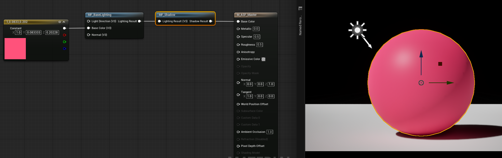
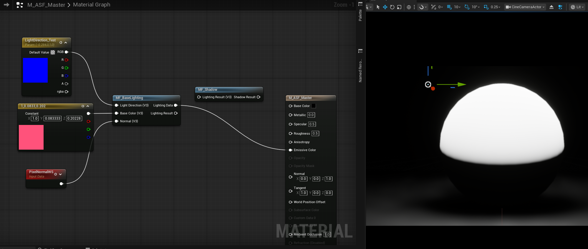
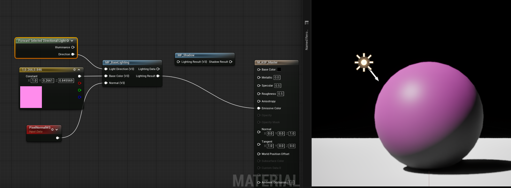
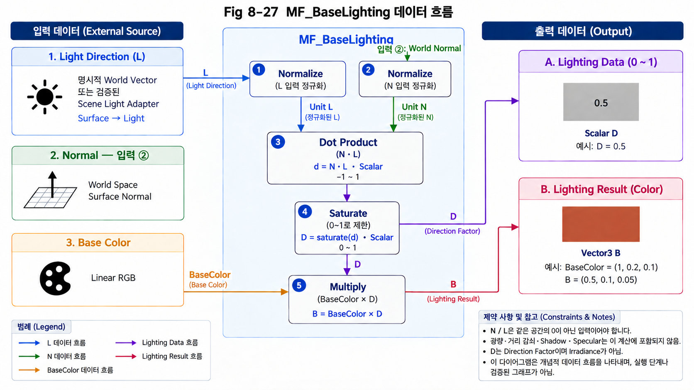

# Chapter 08 — Building an Anime Shader

## 8.2 Base Lighting

### The Role of Base Lighting

8.1에서는 ASF Shader를 여러 개의 Rendering Module로 분리하고, 각 Module이 명확한 역할과 Input / Output을 가지도록 하는 Architecture를 정의했다.

이제부터는 실제 Rendering Module을 하나씩 구현한다.

첫 번째 Module은 **Base Lighting**이다.

8.1에서 Input과 Output의 경계를 정했다면, 여기서는 그 경계 안에 첫 계산을 넣는다. 같은 분홍색 구에서 정면을 향한 부분과 옆을 향한 부분의 밝기가 왜 달라지는지 생각하고, 그 차이를 먼저 한 숫자로 만든 뒤 Color에 적용한다.

Base Lighting은 표면이 현재 조명으로부터 얼마나 직접적인 영향을 받는지를 계산하는 가장 기본적인 Lighting Module이다.

표면의 최종 색상은 단순히 `Base Color`만으로 결정되지 않는다.

같은 색상의 물체라도 빛을 정면으로 받는 면과 빛을 비스듬하게 받는 면은 서로 다른 밝기로 보인다.

따라서 Shader에서는 다음과 같은 관계를 계산해야 한다.

~~~text
Surface
   │
   ├── Surface Normal
   │
   └── Base Color

Light
   │
   └── Light Direction

        ↓

Surface와 Light의 방향 관계 계산

        ↓

Lighting Data

        ↓

Base Color에 적용

        ↓

Lighting Result
~~~

여기서 Base Lighting이 담당하는 핵심은 **표면의 방향과 빛의 방향을 비교하여 현재 표면이 얼마나 빛을 받고 있는지를 계산하는 것**이다.

---

### Why Base Lighting Matters

Material의 `Base Color`는 표면이 가진 기본적인 색을 나타낸다.

예를 들어 다음과 같은 Base Color가 있다고 하자.

~~~text
Base Color = Pink
~~~

이 값만 Material에 출력하면 표면 전체가 동일한 색으로 표시된다.

하지만 실제 물체에서는 표면의 모든 부분이 동일한 양의 빛을 받지 않는다.

빛을 직접 바라보는 면은 밝게 보이고, 빛과 멀어지는 면은 어둡게 보인다.

따라서 실제 Rendering에서는 Base Color에 조명의 영향을 적용해야 한다.

~~~text
Base Color
     ×
Lighting Influence
     ↓
Lighting Result
~~~

Base Lighting은 여기서 `Lighting Influence`에 해당하는 값을 계산한다.

즉, Base Lighting은 색상을 새롭게 만드는 기능이라기보다 **현재 표면에 적용되는 기본적인 빛의 영향을 계산하는 Module**이라고 이해하는 것이 좋다.

---

### Surface Normal and Light Direction

표면에 빛이 얼마나 직접적으로 들어오는지를 판단하기 위해 두 가지 방향 정보가 필요하다.

첫 번째는 **Surface Normal**이다.

Normal은 현재 표면이 향하고 있는 방향을 나타낸다.

~~~text
Surface
──────────────
        ↑
        │
      Normal
~~~

두 번째는 **Light Direction**이다.

Light Direction은 현재 표면과 빛의 방향 관계를 계산하기 위해 사용하는 방향 정보다.

~~~text
       Light
         ↑
         │ L: Surface → Light
─────────●────
      Surface
Incident direction = -L
~~~

두 방향이 서로 어떤 관계를 가지고 있는지를 계산하면 현재 표면이 빛을 얼마나 직접적으로 받고 있는지 판단할 수 있다.

예를 들어 표면의 Normal과 Light Direction이 같은 방향을 향하고 있다면 표면은 빛을 정면으로 받는 상태에 가깝다.

반대로 두 방향이 서로 멀어질수록 표면에 직접적으로 들어오는 빛의 영향은 감소한다.

따라서 Base Lighting의 기본적인 계산은 다음과 같은 질문에서 시작한다.

> **현재 표면이 빛을 얼마나 직접적으로 바라보고 있는가?**

---

### Inputs

이 관계를 계산하기 위해 `MF_BaseLighting`은 기본적으로 다음과 같은 데이터를 입력받는다.

~~~text
MF_BaseLighting

Input
├── Light Direction
├── Base Color
└── Normal
~~~

각 Input의 역할은 다음과 같다.

**Light Direction**

빛의 방향을 나타내는 벡터이다.

Base Lighting에서는 이 값을 Surface Normal과 비교하여 표면이 빛을 얼마나 직접적으로 받고 있는지 계산한다.

**Base Color**

표면의 기본 색상이다.

Lighting 계산을 통해 얻은 조명값을 Base Color에 적용하여 최종적인 Lighting Result를 만든다.

**Normal**

현재 표면이 향하고 있는 방향을 나타내는 벡터이다.

표면의 방향은 위치에 따라 달라질 수 있으므로, 같은 물체 안에서도 서로 다른 Lighting Result가 만들어질 수 있다.

---

### Outputs

Base Lighting은 계산 결과를 두 가지 형태로 사용할 수 있도록 구성한다.

~~~text
MF_BaseLighting

Input
├── Light Direction
├── Base Color
└── Normal

Output
├── Lighting Data
└── Lighting Result
~~~

먼저 **Lighting Data**는 표면과 Light의 방향 관계를 한 숫자로 표현한 값이다. Chapter 03의 Scalar를 여기서는 Direction Factor로 사용하며, 계산은 D=saturate(dot(N,L))이다. 이 한 값에 Base Color를 곱하면 RGB 각 성분에 같은 방향 비율을 적용한 **Lighting Result**가 된다. 따라서 Lighting Result는 BaseColor·D인 Vector3이다.

<details>
<summary>Lighting Data Scope Note</summary>

Lighting Data는 광량·거리 감쇠·Shadow·BRDF 정규화를 포함한 Irradiance가 아니다. Chapter 05에서 배운 물리적 Light 양과 이 실습의 방향 Factor를 구분한다.

</details>

이 값은 이후 다른 Rendering Module에서 추가적인 계산에 사용할 수 있는 **Lighting 정보**로 볼 수 있다.

**Lighting Result**는 Lighting Data를 Base Color에 적용한 결과이다.

즉:

~~~text
Light Direction
      +
    Normal
      ↓
Lighting Data
      ↓
Base Color × Lighting Data
      ↓
Lighting Result
~~~

이렇게 `Lighting Data`와 `Lighting Result`를 구분해두면 이후 Module에서 필요한 데이터를 선택적으로 사용할 수 있다.

---

### Function Interface

앞에서 정의한 Input과 Output을 실제 Material Function의 Interface로 구성한다.

~~~text
MF_BaseLighting

┌─────────────────────────────┐
│        MF_BaseLighting      │
│                             │
│ Input                       │
│  • Light Direction          │
│  • Base Color               │
│  • Normal                   │
│                             │
│ Output                      │
│  • Lighting Data            │
│  • Lighting Result          │
└─────────────────────────────┘
~~~

이 Interface는 Module의 외부와 내부를 구분하는 경계가 된다.

Master Material이나 다른 Module에서는 `MF_BaseLighting` 내부의 구체적인 계산을 알 필요가 없다.

필요한 데이터를 Input으로 전달하고, Module이 반환하는 Output을 사용하면 된다.

따라서 이후 실제 계산을 변경하더라도 외부 Interface가 유지된다면 Module을 사용하는 다른 부분은 동일한 방식으로 사용할 수 있다.

---

### Creating the Function Interface

이제 Unreal Engine에서 `MF_BaseLighting`을 생성하고 앞에서 정의한 Interface를 구성한다.

현재 단계에서는 아직 Base Lighting의 세부적인 수학 계산을 구현하지 않는다.

먼저 Module의 **Input과 Output을 정의하고 데이터가 들어오고 나갈 수 있는 구조를 만드는 것**이 목적이다.

`MF_BaseLighting` Material Function Asset을 만든 뒤 Light Direction과 Normal에는 방향 입력, Base Color에는 Color 입력을 둔다. 출력은 방향 비율을 전달할 Scalar Lighting Data와 그 비율을 Color에 적용한 Vector3 Lighting Result로 나눈다. 이 단계에서는 두 출력의 역할을 구분하여 이름과 Type을 확인하는 것이 먼저다.

아래 Figure는 기존 연결 상태를 읽는 참고이며, 현재 Interface는 앞의 Input/Output 계약을 기준으로 구성한다.



*Figure 8-24. 기존 Master Material 연결 화면 — 현재 Function Interface의 검증 자료로는 불충분하다.*

<details>
<summary>Verification Note</summary>

화면에는 Lighting Result 출력만 있고 Lighting Data 출력은 없으며, Light Direction/Normal 입력도 연결되어 있지 않다. MF_Shadow와 Lit Base Color를 거친 결과는 여기서 정의한 Interface 단독 검증이 아니다. 세 입력과 Lighting Data(Scalar)/Lighting Result(Vector3) 두 출력을 갖춘 실제 MF_BaseLighting 화면으로 재촬영한다.

</details>

이 단계에서 중요한 것은 노드의 연결 자체가 아니라 **Module이 어떤 데이터를 요구하고 어떤 결과를 반환하도록 설계되었는가**이다.

앞으로 이 Interface를 기준으로 실제 Lighting 계산을 내부에 구현한다.

---

입출력 경계가 정해졌으므로 이제 [Implementing the Direction Factor](#implementing-the-direction-factor)에서 **표면의 Normal과 Light Direction의 관계를 어떻게 수치로 표현하는가**를 확인한다. Dot Product로 방향 관계를 측정하고 Normalize와 Saturate를 적용하여 계산에 사용할 값을 준비한다.

---

### Implementing the Direction Factor

앞의 [Function Interface](#function-interface)에서는 `MF_BaseLighting`이 어떤 데이터를 입력받고 어떤 결과를 반환해야 하는지 정의했다.

이제 Module 내부에 실제 Lighting 계산을 구현한다.

Base Lighting에서 가장 기본적으로 필요한 계산은 **Light Direction과 Surface Normal의 관계를 구하는 것**이다.

표면이 빛을 정면으로 받을수록 밝아지고, 빛을 비스듬하게 받을수록 그 영향이 감소하며, 빛을 등지고 있는 면은 직접적인 빛의 영향을 받지 않는다.

이를 수치로 표현하기 위해 두 벡터의 방향 관계를 계산한다.

---

#### Preparing the Directions

먼저 `Light Direction`과 `Normal`을 비교할 수 있는 형태로 만든다.

두 값은 모두 벡터이며, 벡터는 방향뿐만 아니라 길이도 가지고 있다.

하지만 Base Lighting에서 필요한 것은 두 벡터의 **길이 차이가 아니라 방향의 관계**다.

두 벡터를 같은 Space(이 예제는 World Space)로 맞춘 후 `Normalize`한다. 길이가 0인 입력은 유효한 방향이 아니므로 피하고, 외부 데이터가 0일 수 있다면 고정된 유효 방향 또는 0 기여 같은 정책을 먼저 정한다.

`Normalize`는 벡터의 방향은 유지하면서 길이를 1로 만드는 연산이다.

예를 들어:

~~~text
(3, 0, 0)
~~~

이라는 벡터가 있다면 방향은 X축을 향하고 있지만 길이는 3이다.

이를 Normalize하면:

~~~text
(1, 0, 0)
~~~

이 된다.

방향은 동일하지만 길이가 1이 되었다.

따라서 Normalize를 사용하면 벡터의 크기 정보를 제거하고 **방향만을 기준으로 비교**할 수 있다.

Base Lighting에서는 다음과 같이 두 벡터를 각각 Normalize한다.

~~~text
Light Direction
      ↓
  Normalize
      │
      │
      ↓
   Dot Product
      ↑
      │
  Normalize
      ↑
    Normal
~~~

이제 두 벡터는 모두 길이가 1인 방향 벡터가 된다.

---

#### Comparing Directions with Dot Product

두 벡터를 Normalize한 다음 `Dot Product`를 사용한다.

Dot Product는 두 벡터가 얼마나 같은 방향을 향하고 있는지를 하나의 숫자로 표현할 수 있게 해준다.

정규화된 두 벡터를 `L`과 `N`이라고 하면:

~~~text
L · N
~~~

의 결과는 두 방향의 관계에 따라 달라진다.

두 벡터가 같은 방향을 향한다면:

~~~text
L · N = 1
~~~

서로 직각이라면:

~~~text
L · N = 0
~~~

서로 반대 방향이라면:

~~~text
L · N = -1
~~~

따라서 이 하나의 값으로 표면이 빛을 얼마나 직접적으로 받고 있는지를 표현할 수 있다.

이를 Base Lighting의 관점에서 해석하면:

~~~text
1
↓
빛을 가장 직접적으로 받는 상태

0
↓
빛의 영향을 직접적으로 받지 않는 경계

-1
↓
빛을 등지고 있는 상태
~~~

여기서 중요한 것은 Dot Product의 결과가 **색상이 아니라 두 방향 사이의 관계를 나타내는 값**이라는 것이다.

이 값을 이후 Lighting 계산에 사용할 수 있는 형태로 변환해야 한다.

---

#### Clamping the Direction Factor

Dot Product의 결과는 `-1 ~ 1` 범위를 가진다.

하지만 Base Lighting에서 직접적인 빛의 영향을 나타내는 값으로 사용할 때는 음수 영역이 필요하지 않다.

빛을 받지 않는 표면을 음수의 밝기로 처리하는 대신 0으로 처리해야 하기 때문이다.

따라서 Dot Product 결과에 `Saturate`를 적용한다.

`Saturate`는 입력값을 **0에서 1 사이로 제한하는 연산**이다.

~~~text
입력값     Saturate 결과

-1       → 0
-0.5     → 0
 0       → 0
 0.5     → 0.5
 1       → 1
 2       → 1
~~~

0보다 작은 값은 0이 되고, 0과 1 사이의 값은 그대로 유지되며, 1보다 큰 값은 1이 된다.

따라서:

~~~text
L · N
  ↓
Saturate
  ↓
0 ~ 1
~~~

의 결과를 얻는다.

이 값을 `Lighting Data`로 사용한다.

이제 `Lighting Data`는 다음과 같은 의미를 갖는다.

- **0** : 직접적인 빛의 영향을 받지 않는 영역
- **0과 1 사이** : 빛을 비스듬하게 받는 영역
- **1** : 빛을 가장 직접적으로 받는 영역

---

#### Applying the Factor to Base Color

계산된 `Lighting Data`는 그 자체로 최종 색상이 아니다.

이 값은 현재 표면이 빛을 얼마나 받고 있는지를 나타내는 조명값이다.

따라서 `Base Color`에 Lighting Data를 적용한다.

~~~text
Base Color
     │
     │
     ▼
   Multiply
     ▲
     │
Lighting Data
     │
     ▼
Lighting Result
~~~

Base Color가 특정 색을 가지고 있다면 Lighting Data의 값에 따라 그 색의 밝기가 달라진다.

예를 들어:

~~~text
Lighting Data = 1.0
→ Base Color가 그대로 유지된다.

Lighting Data = 0.5
→ Base Color의 밝기가 절반 수준으로 감소한다.

Lighting Data = 0.0
→ 결과는 검은색이 된다.
~~~

따라서 `Lighting Result`는 다음과 같은 관계를 갖는다.

~~~text
Lighting Result
    =
Base Color × Lighting Data
~~~

이제 `MF_BaseLighting`은 단순히 방향 관계를 계산하는 것을 넘어, 실제 Base Lighting 결과를 출력할 수 있게 된다.

---

#### Complete Function Calculation

지금까지의 과정을 하나로 연결하면 다음과 같다.

~~~text
Light Direction
      ↓
  Normalize
      │
      │
      ▼
   Dot Product
      ▲
      │
  Normalize
      ↑
    Normal
      │
      ↓
   Saturate
      │
      ↓
 Lighting Data
      │
      │
      ├──────────────┐
      │              │
      │              ▼
      │           Multiply
      │              ▲
      │              │
      └──────── Base Color
                     │
                     ↓
              Lighting Result
~~~

이것이 현재 단계에서 구현하는 Base Lighting의 기본적인 흐름이다.

여기까지의 계산은 특정 Anime Style을 적용하기 위한 것이 아니다.

먼저 **표면의 방향과 빛의 방향을 비교하고, 그 결과를 기본적인 조명값으로 변환하는 가장 기초적인 Lighting 계산**을 구현한 것이다.

---

#### Basic Implementation Validation

이제 이 계산을 실제 `MF_BaseLighting`에 구성한다.

테스트 단계에서는 `Light Direction`에 실제 Directional Light의 값을 직접 연결하지 않고, Vector Parameter인 `LightDirection_Test`를 사용한다.

이는 실제 엔진의 광원 시스템과 연결하기 전에 **Base Lighting의 계산 자체가 올바르게 작동하는지 검증하기 위한 임시 입력**이다.

구조는 다음과 같다.

~~~text
LightDirection_Test
        ↓
   MF_BaseLighting
        ↑
 PixelNormalWS
~~~

계산의 변화만 보려면 Scene Light가 추가로 만드는 명암을 함께 섞지 않아야 한다. Chapter 04의 Unlit 출력 역할을 떠올려 Master Material의 Shading Model을 **Unlit**으로 설정하고 `Lighting Result`를 `Emissive Color`에 연결한다. 비교 시 Exposure와 Post Process 조건을 고정한다(Chapter 06.6).

<details>
<summary>Display Verification Note</summary>

Emissive에 연결했다는 사실만으로 Lit Material의 다른 조명 기여가 사라지는 것은 아니다. Material의 Unlit Shading Model은 계산 경로를 정하고, Viewport의 Lit 표시 모드는 Scene을 보여주는 방식이다. 두 설정을 따로 확인한다.

</details>

실제 Directional Light의 영향을 제거하면 우리가 직접 만든 Lighting 계산만 확인할 수 있다.

테스트에서 먼저 예상할 것은 Light Direction을 향하는 면과 등지는 면의 방향 Factor 차이다. 현재 연결한 출력이 Lighting Data인지 Lighting Result인지에 따라 방향 분포만 보는지 Base Color의 적용까지 보는지가 달라진다.



*Figure 8-25. 기존 Lighting Data 표시 화면.*

<details>
<summary>Verification Note</summary>

연결된 출력은 Scalar Lighting Data이며 Vector3 Lighting Result는 미연결이다. 따라서 분홍색 Base Color가 적용된 결과의 검증 화면이 아니다. Material의 Unlit Shading Model과 고정 Exposure도 이 캡처만으로 확인할 수 없다. 현재 절의 검증 목적에 맞게 Lighting Result→Unlit Emissive 연결과 색상 적용 결과를 실제 Unreal에서 재촬영한다.

</details>

이 캡처에서 확인 가능한 것은 Lighting Data 출력의 Emissive 연결이다. `Normalize → Dot Product → Saturate` 내부 계산과 Lighting Result의 색상 적용은 해당 Graph 및 통제된 결과로 별도 확인한다.

`LightDirection_Test`의 방향을 변경했을 때 밝은 영역의 위치가 함께 변화하는지 확인한다. 먼저 Lighting Data의 분포를 보고, 다음으로 Lighting Result에서 Base Color의 적용을 확인하면 두 출력의 의미를 분리해 검증할 수 있다.

실제 프로젝트에서 확인할 항목은 다음 두 가지다.

1. Surface Normal과 Light Direction의 방향 관계가 Lighting Data에 반영된다.
2. 계산된 Lighting Data가 Base Color에 적용되어 Lighting Result를 만든다.

기본 검증에서는 N=(0,0,1)에 L=(0,0,1), (1,0,0), (0,0,-1)을 각각 넣어 D=1,0,0을 확인한다. L의 길이만 두 배로 바꾸어도 Normalize 후 결과는 같아야 한다. Figure는 예시이며 실제 프로젝트에서 이 조건을 확인해야 검증을 완료할 수 있다.

다음 단계에서는 명시적 방향 입력을 유지하면서 실제 Directional Light를 그 입력에 동기화하는 방법과 지원 조건을 구분한다.

즉, 다음 절에서는:

~~~text
임시 Vector Parameter
        ↓
실제 Directional Light
~~~

로 입력 구조를 변경한다.

---

### Connecting Directional Light Data

8.2의 계산 Interface는 LightDirection, Normal, BaseColor 세 입력이다. LightDirection의 **출처를 바꾸어도 수식은 같아야 한다**. 먼저 고정 Vector로 계산을 검증한 뒤 Scene Light와 동기화한다.

#### Reference Input

8.0의 목표 환경은 Deferred이다. 이 경로에서는 명시적 World-space `LightDirection_Test` Vector Parameter를 기본 입력으로 유지한다. 수동 입력은 Renderer 연결을 완료했다는 뜻은 아니지만 Function의 방향 계산을 재현하는 기준이 된다.

```text
World-space LightDirection Parameter ─┐
World-space Shading Normal ──────────┤→ MF_BaseLighting → D / BaseColor * D
Linear BaseColor ────────────────────┘
```

고정 입력 상태에서 Scene Light만 회전해도 Parameter가 자동 변경되지는 않는다. 이 사실을 먼저 확인하면 Function 오류와 데이터 공급 오류를 분리할 수 있다.

#### Scene Light Adapter

실제 Directional Light와 연결하려면 해당 Light의 World-space 진행 방향을 구해 Surface→Light 방향으로 변환하고 Material Parameter 또는 적절한 공유 입력에 전달한다.

```text
Chosen Directional Light orientation
 → World-space light travel direction
 → Negate if needed: L points from Surface to Light
 → Vector Parameter / shared input
 → MF_BaseLighting
```

예를 들어 Light가 -Z로 진행하면 L은 +Z이고 N=(0,0,1)의 D는 1이어야 한다. API/Node가 이미 Surface→Light를 반환한다면 다시 Negate하지 않는다. 데이터 갱신 주기와 선택한 Light도 명확히 한다. 다중 Light의 누적을 이 하나의 방향 입력이 자동으로 처리하지는 않는다.

Blueprint나 Material Parameter Collection 등 구체적 공급 수단은 프로젝트 환경에서 구현·확인해야 한다. 이 문서는 계산 Interface를 정의하며 실제 Asset 구현이 생성되었다고 주장하지 않는다.

#### Conditional Engine Expression

Engine Expression을 사용하면 수동 Parameter 대신 Engine이 제공하는 Light Data를 읽을 수 있는 경우가 있다. 다만 Data를 읽는 Node가 있다는 것과 현재 프로젝트의 Rendering Path에서 그 Node를 사용할 수 있다는 것은 별개의 조건이다. 따라서 아래 경로는 기본 명시 입력의 대체 가능성을 확인하는 단계로 읽는다.

기존 예제의 `Forward Selected Directional Light`는 Forward 계열 경로에서 선택된 Light 데이터를 읽는 용도로 제시되어 있다. **8.0의 Deferred 설정에서 그대로 지원된다고 가정하지 않는다.** 정확한 Engine 버전, Material Domain/Shading Model, Rendering Path, 선택되는 Light, Direction 부호를 확인하고 Compile 및 Light 회전 테스트를 통과한 경우에만 Adapter로 사용한다.

지원이 확인되지 않으면 명시적 Vector 입력을 유지한다. 과거/현재 Engine의 일반적인 지원 여부를 근거 없이 단정하지 않으며, 이 노드 사용을 위해 전체 프로젝트의 Rendering Path를 조용히 바꾸지도 않는다.

#### Validation

1. Unlit Material과 Fixed Exposure에서 기본 N/L 테스트를 통과한다.
2. Scene Light Adapter를 적용한 경우 Light 회전이 실제 입력 Vector에 반영되는지 확인한다.
3. Object를 고정하고 Light만 회전하여 밝은 면이 Surface→Light 부호에 맞게 이동하는지 확인한다.
4. Camera만 회전할 때 같은 Surface 위치의 D가 바뀌지 않는지 확인한다.
5. 사용 버전·Rendering Path·입력 출처·부호와 결과를 실행 기록에 남긴다.



Figure는 기존 Engine 연결 예시이다. 정지 이미지 하나로 현재 Deferred 환경의 Node 지원이나 Light 회전 동작까지 검증되었다고 판단하지 않는다.

#### Current Implementation Boundary

Function은 Direction Factor와 BaseColor를 곱한 결과를 반환한다. 실제 Scene Light 데이터 공급은 별도 Adapter의 책임이다. Shadow, 광량·거리 감쇠, 여러 Light 누적, 정규화된 PBR BRDF는 아직 이 Function의 범위가 아니다.

---

### Implementation Reference

앞의 Interface 정의와 방향 계산, Scene 연결 설명에서 Base Lighting이 어떤 역할을 담당하는지 정의하고, 실제 Material Function으로 구현했다.

이제 구현된 내용을 하나의 흐름으로 정리해 보자.

Base Lighting의 핵심은 복잡한 조명 모델을 만드는 것이 아니다.

현재 표면의 방향과 광원의 방향을 비교하여,

> **현재 표면이 빛을 얼마나 직접적으로 받고 있는가?**

를 계산하고, 그 결과를 Base Color에 적용하는 것이다.

#### Input and Output Contract

`MF_BaseLighting`에는 세 개의 Input이 들어온다. Light의 데이터 출처는 별도의 네 번째 Input이 아니다.

- **Light Direction**  
  현재 선택된 Directional Light의 방향
- **Normal**  
  현재 픽셀이 바라보고 있는 표면의 방향
- **Base Color**  
  머티리얼이 가지고 있는 기본 색상
Light Direction은 고정 Vector 또는 검증된 Engine Adapter에서 공급한다. 어떤 출처든 동일한 World Space의 Surface→Light 방향 계약을 만족해야 한다.

이 데이터들은 다음과 같은 순서로 처리된다.



#### Normalize the Directions

먼저 Light Direction과 Surface Normal을 각각 Normalize한다.

두 값은 모두 방향을 나타내는 벡터이므로, 길이보다는 **방향 자체의 관계**를 비교하는 것이 중요하다.

Normalize를 통해 두 벡터를 단위 벡터로 만들어 두면 이후 Dot Product의 결과를 방향의 관계를 나타내는 값으로 사용할 수 있다.

#### Evaluate the Dot Product

정규화된 Light Direction과 Normal을 Dot Product한다.

~~~text
N · L
~~~

이 결과는 두 방향이 얼마나 같은 방향을 향하고 있는지를 나타낸다.

- 같은 방향에 가까울수록 `1`
- 서로 직각이면 `0`
- 반대 방향이면 `-1`

이 값은 표면이 빛을 직접적으로 얼마나 받고 있는지를 판단하는 기본적인 기준이 된다.

#### Clamp the Result

Dot Product의 결과는 `-1 ~ 1` 범위를 가질 수 있다.

하지만 표면의 뒤쪽에서 들어오는 빛을 기본적인 직접 조명으로 표현할 필요는 없다.

따라서 Saturate를 사용하여 결과를 `0 ~ 1` 범위로 제한한다.

~~~text
Lighting Data = Saturate(N · L)
~~~

Lighting Data는 0–1 Direction Factor이다. 실제 Light Intensity나 Visibility는 포함하지 않는다.

#### Applying the Factor to Base Color

마지막으로 Lighting Data와 Base Color를 Multiply한다.

~~~text
Lighting Result = Base Color × Lighting Data
~~~

따라서 빛을 정면으로 받는 표면은 Base Color에 가까운 밝기를 가지며, 빛과 비스듬하거나 반대 방향을 향하는 표면은 점점 어두워진다.

중요한 점은 **Base Lighting이 색상을 새로 만드는 것이 아니라 Base Color에 빛의 영향을 적용한다는 것**이다.

---

#### Light Direction Source

기본 경로는 명시적인 World-space Vector 입력이다. Scene Light에 동기화할 때에는 위 Adapter의 Space·부호·지원 경로를 확인한다. `Forward Selected Directional Light` 사용 여부와 관계없이 Function의 수식과 세 Input 계약은 동일하다.

---

#### Implementation Responsibility

현재 `MF_BaseLighting`이 담당하는 범위는 명확하다.

**처리하는 것**

- Directional Light의 방향
- Surface Normal과 Light Direction의 관계
- 기본적인 직접 조명의 양 계산
- Base Color에 조명 결과 적용

**아직 처리하지 않는 것**

- Shadow
- Specular Highlight
- Rim Light
- 추가적인 Stylization
- Anime 스타일의 단계적인 명암 처리

따라서 `MF_BaseLighting`은 최종적인 Anime Shader가 아니다.

이 Module은 이후 여러 Rendering Module이 사용할 수 있는 **기본적인 Lighting Result를 만드는 역할**을 담당한다.

---

### Key Takeaways

ASF에서는 하나의 거대한 Material Graph 안에서 모든 계산을 처리하지 않는다.

각 기능을 독립적인 Module로 분리하고, 각각의 Module이 자신의 역할에 집중하도록 구성한다.

현재의 구조에서는 Base Lighting이 먼저 기본적인 빛의 영향을 계산한다.

~~~text
Base Color
    +
Light Direction
    +
Surface Normal
    ↓
MF_BaseLighting
    ↓
Lighting Result
~~~

Lighting Result는 Shadow 적용에 사용한다. Specular는 N/L/V로 별도 계산하고 이후 합성하며 Lighting Result를 필수 Input으로 사용하지 않는다.

즉, `MF_BaseLighting`의 완성은 단순히 하나의 조명 계산을 끝냈다는 의미가 아니다.

**ASF의 Rendering Architecture에서 실제 조명 데이터를 생성하는 첫 번째 독립적인 Rendering Module이 완성되었다는 의미**를 가진다.

다음 단계에서는 이 Lighting Result에 Shadow를 적용하면서, 기본적인 조명 계산 위에 추가적인 Rendering Module을 어떻게 쌓아가는지 살펴본다.

---

**Next → [8.3 Shadow](<./Chapter08.3_Shadow.md>)**
