# Chapter 08 — Building an Anime Shader

## 8.3 Shadow

### What Is Shadow?

#### Overview

8.2에서는 광원과 표면의 방향 관계를 이용해 직접광의 기본적인 기여량을 계산했다.

표면의 Normal과 Light Direction이 같은 방향에 가까울수록 표면은 더 많은 빛을 받는다. 이를 통해 표면의 기본적인 밝기를 결정할 수 있었다.

하지만 실제 장면에서는 **표면이 광원을 향하고 있음에도 불구하고 어두워지는 경우**가 존재한다.

그 이유는 간단하다.

> **빛이 표면까지 도달하지 못했기 때문이다.**

다른 물체가 광원과 표면 사이의 경로를 가로막으면 해당 표면에는 직접광이 도달하지 않는다. 우리가 관찰하는 **Shadow**는 이러한 빛의 차단으로 인해 발생한다.

따라서 렌더링에서 Shadow는 단순히 어두운 색을 칠하는 효과가 아니라,

> **광원과 표면 사이의 빛이 실제로 도달할 수 있는지를 판단하는 문제**

로 이해해야 한다.

---

#### Beyond N dot L

8.2에서 살펴본 기본적인 직접광 계산은 표면이 광원을 얼마나 향하고 있는지를 판단한다.

개념적으로 다음과 같이 표현할 수 있다.

~~~text
N · L
↓
표면과 광원의 방향 관계
↓
표면이 광원을 얼마나 향하고 있는가?
~~~

여기서 `N`은 Surface Normal이고 `L`은 Light Direction이다.

표면이 광원을 정면으로 향하고 있다면 `N · L`은 큰 값을 갖는다.

하지만 여기에는 한 가지 중요한 정보가 빠져 있다.

> **광원과 표면 사이에 다른 물체가 존재하는가?**

표면이 광원을 향하고 있더라도 중간에 다른 물체가 있다면 빛은 표면까지 도달할 수 없다.

즉, `N · L`은 **빛의 방향 관계**를 설명하지만 **빛의 도달 여부**까지 설명하지는 않는다.

---

#### Light Occlusion

광원이 있고, 표면이 있으며, 그 사이에 다른 물체가 존재할 때 빛의 경로가 차단되면서 그림자가 만들어진다.

빛을 가로막는 물체를 **Occluder**라고 한다.

~~~text
Light
  ●
   \
    \
     \    Occluder
      \  ███████
       \ ███████
        \███████
                 \
                  \
                   ● Surface
~~~

Occluder가 광원과 표면 사이의 경로를 차단하면 해당 표면은 광원으로부터 직접광을 받지 못한다.

이것이 우리가 일반적으로 말하는 **Shadow**다.

따라서 Shadow를 이해할 때는 다음 관계가 중요하다.

~~~text
Light
  ↓
Light Path
  ↓
Occluder에 의한 차단
  ↓
빛이 표면에 도달하지 못함
  ↓
Shadow
~~~

---

#### N dot L and Visibility

렌더링에서는 이 현상을 조금 더 일반적인 개념으로 표현할 수 있다.

질문은 다음과 같다.

> **광원에서 표면까지의 경로가 다른 물체에 의해 가려져 있는가?**

가려져 있지 않다면 광원은 표면에서 **Visible**하다.

가려져 있다면 광원은 표면에서 **Occluded**되어 있다.

따라서 직접광을 계산하기 위해서는 최소한 두 가지 정보를 구분해야 한다.

~~~text
Light Orientation

표면과 광원의 방향 관계
→ N · L

Light Visibility

광원에서 표면까지 빛이 도달할 수 있는가?
→ Visibility
~~~

이 둘은 서로 다른 문제를 해결한다.

`N · L`은 표면이 빛을 향하고 있는지를 판단한다.

`Visibility`는 그 빛이 실제로 표면까지 도달할 수 있는지를 판단한다.

---

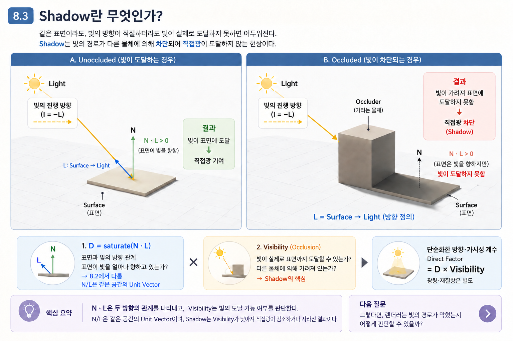

> **Figure 28. N · L과 Light Visibility**
>
> 같은 표면이라도 광원과 표면 사이의 경로가 차단되면 직접광의 결과가 달라진다. `N · L`은 표면과 빛의 방향 관계를 나타내지만, `Visibility`는 빛이 실제로 표면까지 도달할 수 있는지를 나타낸다.

그림에서 볼 수 있듯이 표면이 광원을 향하고 있다는 사실만으로는 직접광의 존재를 보장할 수 없다.

---

#### Shadow as a Visibility Problem

이제 Shadow를 조금 더 일반적인 렌더링 개념으로 바라볼 수 있다.

~~~text
                Direct Lighting
                      │
            ┌─────────┴─────────┐
            │                   │
        N · L              Visibility
            │                   │
    빛의 방향 관계          빛의 도달 가능 여부
            │                   │
            └─────────┬─────────┘
                      ↓
             Direct Light
~~~

여기서 중요한 것은 **N · L과 Visibility가 서로 다른 정보를 제공한다는 것**이다.

예를 들어 표면이 광원을 정면으로 향하고 있다고 가정하자.

~~~text
N · L ≈ 1
~~~

이 경우 표면의 방향 관계만 보면 충분히 많은 직접광을 받을 수 있는 상태다.

그러나 두 가지 상황이 가능하다.

**Unoccluded Light**

~~~text
N · L ≈ 1
Visibility = 1
~~~

표면은 광원을 향하고 있으며, 빛도 실제로 표면에 도달한다.

→ 직접광이 기여한다.

**Occluded Light**

~~~text
N · L ≈ 1
Visibility = 0
~~~

표면은 여전히 광원을 향하고 있다.

그러나 다른 물체가 빛의 경로를 차단하고 있기 때문에 직접광이 도달하지 않는다.

→ Shadow가 발생한다.

따라서,

> **`N · L`이 크다고 해서 반드시 직접광이 존재하는 것은 아니다.**

이것이 Shadow를 이해하기 위해 가장 먼저 구분해야 하는 개념이다.

---

#### Shadow and Direct Lighting

Shadow는 일반적으로 직접광의 기여에 영향을 준다.

빛이 표면에 도달하지 못한다면 해당 광원에 의한 직접광은 감소하거나 사라진다.

따라서 개념적으로 직접광은 다음과 같은 구조로 생각할 수 있다.

~~~text
Light
  ↓
Direction
  ↓
N · L
  ↓
Light Contribution
  ×
Visibility
  ↓
Shadowed Direct Lighting
~~~

가장 단순한 경우 Visibility는 다음과 같이 생각할 수 있다.

~~~text
Visibility = 1
→ 광원이 보임
→ 직접광 차단 없음

Visibility = 0
→ 광원이 가려짐
→ 직접광 차단
~~~

하지만 실제 렌더링에서는 광원의 크기와 그림자 경계의 처리 방식 등에 따라 완전히 0 또는 1이 아닌 중간값이 나타날 수도 있다.

이러한 세부적인 계산 방법은 뒤에서 다룬다.

현재 단계에서는 **Shadow의 본질이 Visibility와 관련된다는 사실**만 이해하면 충분하다.

---

#### Shadow and Artistic Tone

스타일라이즈드 렌더링에서는 그림자 영역을 특정 색상이나 명암 단계로 표현할 수 있다.

하지만 이것은 **Shadow를 표현하는 방법**이지 Shadow의 본질 자체는 아니다.

물리적인 Cast Shadow는 Light Visibility에 기반한다. 다만 Anime Shader의 Art-directed Shadow Mask나 N·L 기반 Tone 영역이 항상 실제 차폐 결과인 것은 아니다. 여기서는 Renderer Visibility를 먼저 설명하고 Artistic Mask와 구분한다.

~~~text
Rendering Concept
        ↓
Light Visibility
        ↓
Shadow Region
        ↓
Stylization
        ↓
Shadow Color / Tone
~~~

따라서 ASF에서도 먼저 **Shadow가 발생하는 Rendering 원리**를 이해한 후, 그 결과를 어떻게 스타일라이즈할 것인지 결정해야 한다.

이는 7장에서 다룬 NPR의 기본적인 접근 방식과도 연결된다.

> **렌더링 현상을 먼저 이해하고, 그 결과를 어떻게 재해석할 것인지는 그 다음 문제다.**

---

#### Defining the Rendering Problem

이제 Shadow를 단순한 시각적 현상이 아니라 렌더링 문제로 정의할 수 있다.

~~~text
Surface Point P
       │
       │
       ↓
     Light
       │
       │
       ↓
다른 물체에 의해 경로가 차단되는가?
       │
   ┌───┴───┐
   │       │
  No      Yes
   │       │
Visible  Occluded
   │       │
   ↓       ↓
직접광    Shadow
~~~

따라서 렌더러가 Shadow를 만들기 위해 해결해야 하는 핵심 문제는 다음과 같다.

> **특정 Surface Point에서 특정 Light까지의 경로가 가려져 있는지 판단하는 것.**

이를 **Visibility Test**라고 생각할 수 있다.

이렇게 바라보면 Shadow는 특정 엔진이나 특정 기술에 종속된 개념이 아니다.

Unreal Engine, Unity, Blender와 같은 서로 다른 Rendering System에서도 Shadow를 표현하는 방법은 달라질 수 있지만, 그 아래에 있는 핵심 문제는 동일하다.

~~~text
빛이 표면에 도달할 수 있는가?
~~~

---

#### Direction and Visibility Relationship

8.2에서 다룬 `N · L`은 **표면이 빛을 향하고 있는가**를 판단한다.

8.3에서 새롭게 등장하는 Visibility는 **그 빛이 실제로 표면에 도달할 수 있는가**를 판단한다.

두 개념은 서로 다른 문제를 해결한다.

~~~text
Surface–Light Direction
        ↓
      N · L
        ↓
표면이 빛을 얼마나 향하고 있는가?

Light–Surface Visibility
        ↓
   Visibility
        ↓
빛이 실제로 표면에 도달할 수 있는가?
~~~

이 둘을 함께 고려해야 직접광을 제대로 설명할 수 있다.

개념적으로 가장 단순화하면 다음과 같이 표현할 수 있다.

~~~text
Direct Lighting Contribution
        =
(N · L) × Visibility
~~~

이 식은 지금 단계에서 실제 엔진의 구현식을 의미하는 것이 아니다.

**직접광이 방향 관계와 빛의 도달 가능 여부라는 서로 다른 정보에 의해 결정된다는 개념적 구조**를 나타낸다.

실제 렌더러는 Visibility를 직접 계산하거나, 이를 효율적으로 판단하기 위한 별도의 자료구조와 알고리즘을 사용한다.

---

#### Key Takeaways

- Shadow는 단순히 어두운 영역을 만드는 효과가 아니다.
- Shadow는 **빛이 다른 물체에 의해 차단되어 표면에 직접광이 도달하지 못하는 현상**이다.
- `N · L`은 표면과 광원의 **방향 관계**를 판단한다.
- `Visibility`는 광원과 표면 사이의 빛이 **실제로 도달할 수 있는지**를 판단한다.
- 따라서 `N · L`만으로는 Shadow를 설명할 수 없다.
- Shadow의 핵심은 **Light Visibility와 Occlusion**이다.
- Shadow의 시각적 표현은 NPR에서 스타일라이즈할 수 있지만, 그 이전에 Shadow가 발생하는 Rendering 원리를 이해해야 한다.
- 실제 Shadow 계산 방법은 다음 절부터 다룬다.

**Core Relationship**

~~~text
Surface–Light Direction
        ↓
      N · L
        ↓
빛을 향하고 있는가?

Light–Surface Visibility
        ↓
   Visibility
        ↓
빛이 실제로 도달할 수 있는가?

두 정보가 결합
        ↓
Direct Lighting
        ↓
Shadow
~~~

---

이제 Shadow의 본질을 다음과 같이 정리할 수 있다.

~~~text
Shadow
= 빛의 경로가 차단된 결과

Rendering 관점
= Light Visibility 문제
~~~

그렇다면 다음 질문이 남는다.

> **렌더러는 광원과 표면 사이의 빛의 경로가 다른 물체에 의해 차단되었는지를 어떻게 판단할 수 있을까?**

가장 직관적인 방법은 표면에서 광원을 향해 경로를 직접 확인하는 것이다.

~~~text
Surface
   ●
    \
     \
      \
       ● Light

경로 중간에 물체가 존재하는가?
~~~

이러한 접근은 **Shadow Ray와 Visibility Test**라는 개념으로 이어진다.

하지만 실제 실시간 렌더링에서는 매 픽셀마다 이러한 경로를 직접 계산하는 것이 비용 문제가 될 수 있다.

따라서 다음 절에서는 먼저 **Visibility와 Occlusion을 보다 정확하게 정의하고**, 렌더링에서 이 문제를 어떻게 다루는지 살펴본다.

이어서 [Visibility and Occlusion](#visibility-and-occlusion)에서 다음 질문을 살펴본다.

---

### Visibility and Occlusion

[What Is Shadow?](#what-is-shadow)에서는 Shadow를 단순히 어두운 영역으로 보는 것이 아니라, **빛이 표면에 도달할 수 있는가를 판단하는 Visibility 문제**로 정의했다.

이제 한 단계 더 들어가 보자.

렌더러가 그림자를 계산하기 위해 실제로 해결해야 하는 문제는 다음과 같다.

> **특정 Surface Point에서 특정 Light까지의 경로가 다른 물체에 의해 가려져 있는가?**

이 질문에 답하기 위해 **Visibility**와 **Occlusion**이라는 개념을 구분할 필요가 있다.

---

#### Visibility

Visibility는 특정 지점에서 다른 대상까지의 경로가 열려 있는지를 판단하는 개념이다.

Shadow의 경우에는 다음과 같이 생각할 수 있다.

~~~text
Surface Point
      │
      │  Light Path
      │
      ▼
    Light
~~~

Surface에서 Light까지의 경로를 확인했을 때 중간에 다른 물체가 없다면 광원은 Surface에서 **Visible**한 상태다.

반대로 경로 중간에 다른 물체가 존재한다면 광원은 Surface에서 보이지 않는다.

~~~text
Visible
Surface ───────────────── Light

Occluded
Surface ───── Object ───── Light
                 ███
~~~

따라서 가장 단순한 형태의 Visibility는 다음과 같이 생각할 수 있다.

~~~text
Visibility = 1
→ 광원이 표면에 보임
→ 빛이 표면에 도달할 수 있음

Visibility = 0
→ 광원이 표면에서 가려짐
→ 빛이 표면에 도달할 수 없음
~~~

여기서 중요한 점은 Visibility가 **밝기 자체를 계산하는 값이 아니라 경로가 열려 있는지를 판단하는 정보**라는 것이다.

---

#### Occlusion

**Occlusion**은 한 지점에서 다른 지점으로 향하는 경로가 다른 물체에 의해 가려지는 상황을 의미한다.

빛의 경우에는 다음과 같은 구조가 된다.

~~~text
Light
  ●
   \
    \
     \    Occluder
      \  ███████
       \ ███████
        \███████
                 \
                  \
                   ● Surface
~~~

여기서 중간의 물체가 **Occluder**다.

Occluder가 Light와 Surface 사이의 경로를 차단하면 Surface에서 Light는 Occluded 상태가 된다.

즉,

~~~text
Occlusion
    ↓
경로를 가리는 물체가 존재함
    ↓
Light가 Surface에서 보이지 않음
    ↓
Visibility = 0
~~~

따라서 두 개념은 다음과 같이 연결된다.

~~~text
Occlusion
    ↓
경로가 차단됨
    ↓
Visibility 감소 또는 차단
~~~

---

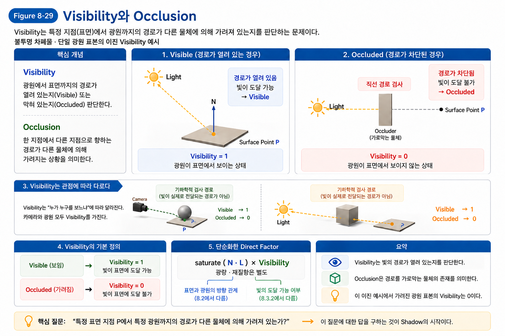

> **Figure 29. Visibility와 Occlusion**
>
> Visibility는 특정 Surface Point에서 Light까지의 경로가 열려 있는지를 판단한다. 경로가 다른 물체에 의해 차단되면 Occlusion이 발생하며, 가장 단순한 경우 Visibility는 0이 된다.

---

#### Visibility Reference

Visibility는 절대적인 속성이 아니다.

즉, 어떤 물체가 항상 Visible하거나 항상 Occluded되어 있는 것이 아니다.

**어디에서 무엇을 바라보느냐에 따라 결과가 달라진다.**

예를 들어 카메라에서 Surface를 바라볼 때와 Light에서 Surface를 바라볼 때는 서로 다른 Visibility를 판단한다.

~~~text
Camera
   │
   │ Camera → Surface
   ↓
Surface

Light
   │
   │ Light → Surface
   ↓
Surface
~~~

카메라와 Surface 사이에 물체가 없다면 Surface는 카메라에서 Visible하다.

하지만 같은 Surface라도 Light와 Surface 사이에 다른 물체가 존재한다면 Light에서는 Occluded될 수 있다.

따라서 렌더링에서는 다음 두 Visibility를 구분해서 생각할 수 있다.

~~~text
Camera → Surface
      ↓
Camera Visibility

Light → Surface
      ↓
Light Visibility
~~~

우리가 8.3에서 관심을 갖는 것은 두 번째인 **Light Visibility**다.

Shadow는 카메라에서 물체가 보이는지의 문제가 아니라,

> **광원에서 Surface까지 빛의 경로가 열려 있는가**

라는 문제이기 때문이다.

---

#### Visibility Test

이제 렌더러가 해결해야 하는 문제가 명확해진다.

특정 Surface Point `P`가 있다고 하자.

그리고 특정 Light가 존재한다.

~~~text
       Light
         ●
        /
       /
      /
     ● P
 Surface
~~~

렌더러는 `P`에서 Light까지의 경로를 확인해야 한다.

그 경로를 따라갔을 때 다른 물체가 발견되지 않는다면:

~~~text
Visibility = 1
~~~

반대로 경로 중간에서 다른 물체가 발견된다면:

~~~text
Visibility = 0
~~~

이러한 판단을 **Visibility Test**라고 생각할 수 있다.

개념적으로는 다음과 같다.

~~~text
Surface Point P
       │
       │
       ▼
    Light까지 경로 확인
       │
       ▼
중간에 Occluder가 존재하는가?
       │
   ┌───┴───┐
   │       │
  No      Yes
   │       │
   ↓       ↓
Visible  Occluded
   │       │
   ↓       ↓
  1         0
~~~

이것이 Shadow 계산의 가장 기본적인 형태다.

---

#### Direction and Visibility

[What Is Shadow?](#what-is-shadow)에서 살펴본 것처럼 `N · L`과 Visibility는 서로 다른 정보를 제공한다.

`N · L`은 **표면과 광원의 방향 관계**를 판단한다.

Visibility는 **광원과 표면 사이의 경로가 열려 있는지**를 판단한다.

~~~text
N · L
  ↓
표면이 광원을 얼마나 향하고 있는가?

Visibility
  ↓
광원의 빛이 표면까지 도달할 수 있는가?
~~~

따라서 다음과 같은 상황이 가능하다.

~~~text
N · L ≈ 1
Visibility = 0
~~~

표면은 광원을 거의 정면으로 향하고 있다.

하지만 중간에 Occluder가 있기 때문에 빛은 표면까지 도달하지 못한다.

결과적으로 해당 광원의 직접광은 차단된다.

이것이 Shadow다.

---

#### Binary Visibility

처음에는 Visibility를 단순한 이진값으로 생각하는 것이 이해하기 쉽다.

~~~text
Visible   → 1
Occluded  → 0
~~~

이렇게 생각하면 직접광의 구조도 간단하게 정리할 수 있다.

~~~text
Direct Lighting Contribution
        =
(N · L) × Visibility
~~~

예를 들어,

~~~text
N · L = 0.8
Visibility = 1

→ Direct Lighting = 0.8 × 1
→ 빛이 정상적으로 기여
~~~

반대로,

~~~text
N · L = 0.8
Visibility = 0

→ Direct Lighting = 0.8 × 0
→ 해당 광원의 직접광 차단
~~~

여기서 중요한 것은 Visibility가 `N · L`을 대신하는 값이 아니라는 것이다.

두 값은 서로 다른 정보를 표현한다.

~~~text
N · L
→ 방향 관계

Visibility
→ 경로의 가시성
~~~

---

#### Partial Visibility

여기서 한 가지 주의할 점이 있다.

앞에서는 Visibility를 0과 1의 값으로 설명했지만, 실제 렌더링에서 그림자 영역이 항상 완전한 검정과 완전한 비그림자로만 나뉘는 것은 아니다.

특히 **광원의 크기**를 고려하면 하나의 Surface Point에서 광원의 일부는 보이고 일부는 가려지는 상황이 발생할 수 있다.

~~~text
          Area Light
      ┌──────────────┐
      │ ● ● ● ● ● ● │
      │ ● ● ● ● ● ● │
      └──────────────┘
          \  |  /
           \ | /
            \|/
         Occluder
           ███
            |
            |
         Surface
             ●
~~~

이 경우 Surface Point에서 광원의 일부 영역은 Visible하고 일부 영역은 Occluded된다.

따라서 전체 광원에 대한 평균적인 Visibility를 생각하면 0과 1 사이의 값이 될 수 있다.

~~~text
Visibility = 0
→ 완전히 가려짐

Visibility = 0.5
→ 광원의 일부가 가려짐

Visibility = 1
→ 완전히 보임
~~~

이러한 개념은 **Soft Shadow**와 연결된다.

다만 현재 단계에서는 Soft Shadow의 구현 방법까지 들어갈 필요는 없다.

중요한 것은 다음 한 가지다.

> **Visibility는 단순히 그림자의 색을 결정하는 값이 아니라, 광원에서 표면까지 빛이 얼마나 도달할 수 있는지를 나타내는 개념이다.**

Soft Shadow와 부분적인 Visibility는 이후 Shadow의 실제 계산 방법을 다룰 때 다시 살펴본다.

---

#### Shadow Definition

이제 [What Is Shadow?](#what-is-shadow)에서 정의했던 Shadow를 더 정확하게 표현할 수 있다.

~~~text
Light
  ↓
Light Path
  ↓
Occluder가 경로를 차단하는가?
  ↓
Visibility Test
  ↓
Visibility
  ↓
Direct Lighting
  ↓
Shadow
~~~

즉, Shadow 자체를 계산하는 것이 첫 번째 문제가 아니다.

렌더러가 먼저 해결해야 하는 것은:

> **이 Surface Point에서 이 Light까지의 경로가 가려져 있는가?**

라는 Visibility 문제다.

그리고 그 결과가 직접광 계산에 반영되면서 Shadow가 나타난다.

---

#### Key Takeaways

- **Visibility**는 한 지점에서 다른 대상까지의 경로가 열려 있는지를 판단하는 개념이다.
- **Occlusion**은 그 경로가 다른 물체에 의해 차단된 상태를 의미한다.
- Shadow에서 중요한 것은 **Light Visibility**다.
- `N · L`은 표면과 광원의 방향 관계를 판단하고, Visibility는 빛의 도달 가능 여부를 판단한다.
- 가장 단순한 Visibility는 `1 = Visible`, `0 = Occluded`로 생각할 수 있다.
- 광원의 일부만 가려지는 경우에는 0과 1 사이의 Visibility가 나타날 수 있다.
- Shadow 계산의 핵심은 결국 **Surface와 Light 사이에 Occluder가 존재하는지 확인하는 것**이다.
- 이 판단을 실제로 수행하는 방법으로 이어지는 개념이 **Shadow Ray**다.

**Core Relationship**

~~~text
Surface Point
      ↓
Light까지의 경로 확인
      ↓
Occluder 존재 여부
      ↓
Visibility Test
      ↓
Visibility
      ↓
Direct Lighting
      ↓
Shadow
~~~

---

여기까지 정리하면 Shadow의 원리는 상당히 단순해진다.

~~~text
Surface Point P
      ↓
Light까지 경로를 확인
      ↓
Occluder가 있는가?
      ↓
   ┌──┴──┐
  No    Yes
   ↓      ↓
Visible  Occluded
   ↓      ↓
  빛 도달  빛 차단
   ↓      ↓
Direct   Shadow
Light
~~~

그렇다면 이제 중요한 질문이 남는다.

> **렌더러는 실제로 이 경로를 어떻게 확인할 수 있을까?**

가장 직관적인 방법은 Surface에서 Light를 향해 직접 경로를 추적하는 것이다.

~~~text
Surface
   ●
    \
     \
      \
       ● Light
~~~

그리고 그 경로 중간에 다른 물체가 있는지를 확인한다.

이것이 다음 단계에서 살펴볼 **Shadow Ray**의 기본적인 아이디어다.

이어서 [Shadow Ray and Visibility Test](#shadow-ray-and-visibility-test)에서 다음 질문을 살펴본다.

---

### Shadow Ray and Visibility Test

[Visibility and Occlusion](#visibility-and-occlusion)에서는 Shadow를 판단하기 위해 **Light와 Surface 사이의 경로가 다른 물체에 의해 가려졌는지**를 확인해야 한다는 것을 살펴봤다.

그렇다면 렌더러는 실제로 이 경로를 어떻게 확인할까?

가장 직관적인 방법은 Surface Point에서 Light를 향해 하나의 경로를 만들고, 그 경로에 다른 Geometry가 존재하는지 검사하는 것이다.

이때 사용하는 것이 **Ray**다.

---

#### Ray Definition

Ray는 원래 수학에서 사용하는 용어로, **한 점에서 시작하여 한 방향으로 무한히 뻗어나가는 반직선**을 의미한다.

~~~text
Origin
  ●────────────────────────────→
            Direction
~~~

렌더링에서도 기본적인 개념은 같다.

Ray는 두 가지 정보로 생각할 수 있다.

- **Origin** — Ray가 시작하는 위치
- **Direction** — Ray가 진행하는 방향

즉, 어떤 위치에서 특정 방향으로 계속 진행하는 경로를 나타낸다.

수학적으로 Ray는 다음과 같이 표현할 수 있다.

~~~text
R(t) = O + tD

O : Origin
D : Direction
t : Ray Parameter (D가 Unit Vector일 때 이동 거리)
~~~

여기서 `t`가 0이면 Ray는 Origin에 있다. Point/Area Light의 특정 Sample까지 검사할 때에는 t를 Surface와 Light Sample 사이의 유한 구간으로 제한한다. Light 뒤쪽의 Geometry를 Occluder로 처리하지 않는다. 시작점의 Self-intersection을 피하기 위한 작은 Offset/최소 t도 별도로 다룬다.

`t`가 증가하면 Direction을 따라 앞으로 이동한다.

따라서 Ray는 특정 지점에서 시작하여 한 방향으로 계속 뻗어나가는 **경로를 수학적으로 표현한 것**이라고 이해하면 된다.

렌더링에서는 이 Ray를 이용해 장면의 Geometry와 교차하는지 검사할 수 있다.

---

#### Rays in Rendering

Rendering에서 Ray 자체가 어떤 특정한 "빛"이나 "그림자"를 의미하는 것은 아니다.

Ray는 기본적으로 다음과 같은 질문을 해결하기 위한 **경로 표현 방법**이다.

> **이 위치에서 이 방향으로 이동했을 때 무엇을 만나게 되는가?**

예를 들어 Camera에서 Scene을 바라보는 경우에도 Ray를 사용할 수 있다.

~~~text
Camera
  ●────────────────────────────→
                Scene
                  ███
~~~

Ray가 Geometry와 만나면 **Intersection**이 발생한다.

이러한 Ray와 Geometry의 교차 관계를 검사하는 것이 **Ray–Geometry Intersection Test**다.

이 개념은 Shadow를 계산할 때도 그대로 사용할 수 있다.

---

#### Shadow Ray

Shadow Ray는 특별한 종류의 Ray라기보다,

> **Surface Point에서 Light를 향해 발사하여 Light의 Visibility를 확인하는 Ray**

라고 이해하면 된다.

Surface Point `P`와 Light가 있다면 다음과 같은 경로를 생각할 수 있다.

~~~text
Surface Point P
      ●
       \
        \
         \
          ● Light
~~~

Surface Point에서 Light를 향하는 이 경로가 바로 Shadow Ray의 기본적인 개념이다.

이제 렌더러는 Shadow Ray를 따라가면서 **Light에 도달하기 전에 다른 Geometry와 교차하는지**를 검사한다.

---

#### Shadow Ray and Visibility

Shadow Ray의 목적은 Shadow 자체를 그리는 것이 아니다.

Shadow Ray의 목적은 다음 질문에 답하는 것이다.

> **"이 Surface Point에서 Light가 보이는가?"**

이 질문은 [Visibility and Occlusion](#visibility-and-occlusion)에서 살펴본 **Visibility Test**와 동일하다.

**Open Path**

~~~text
Light
  ●
   \
    \
     \
      ● Surface Point
~~~

Shadow Ray가 Light에 도달하기 전에 다른 Geometry와 교차하지 않는다.

따라서:

~~~text
Intersection 없음
        ↓
Light가 Visible
        ↓
Visibility = 1
        ↓
빛이 Surface에 도달
        ↓
직접광에 기여
~~~

**Blocked Path**

~~~text
Light
  ●
   \
    \   ███
     \ ███
      \███
       \
        ● Surface Point
~~~

Shadow Ray가 Light에 도달하기 전에 다른 Geometry와 교차한다.

그 Geometry가 **Occluder**다.

따라서:

~~~text
Intersection 발생
        ↓
Light가 Occluded
        ↓
Visibility = 0
        ↓
빛이 Surface에 도달하지 못함
        ↓
Shadow
~~~

---

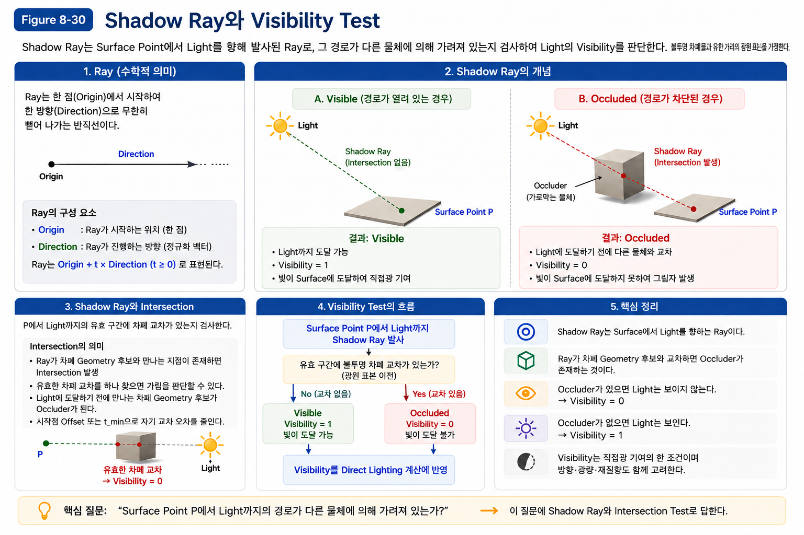

> **Figure 30. Shadow Ray와 Visibility Test**
>
> Shadow Ray는 Surface Point에서 Light를 향해 발사되는 Ray다. Ray가 Light에 도달하기 전에 Geometry와 교차하면 Light는 Occluded 상태가 되고, 교차하지 않으면 Light는 Visible한 상태가 된다.

---

#### Intersection Test

Shadow Ray가 생성되었다고 해서 바로 Shadow가 결정되는 것은 아니다.

렌더러는 먼저 Ray와 Scene의 Geometry가 **교차하는지** 확인해야 한다.

이를 **Intersection Test**라고 한다.

~~~text
Ray
────────────────────────────→

        █████
        █████
        █████
~~~

Ray가 Geometry를 만나면 Intersection이 발생한다.

~~~text
Ray
──────────────●─────────────→
              ↑
        Intersection
~~~

Shadow Ray에서는 이 Intersection의 존재 여부가 중요하다.

하지만 모든 Intersection이 Shadow를 의미하는 것은 아니다.

중요한 것은:

> **Light에 도달하기 전에 Geometry와 교차하는가?**

이다.

---

#### Occluders before the Light

Surface Point에서 Light까지 Shadow Ray를 발사했다고 생각해 보자.

~~~text
Surface P
   ●───────●────────●──────● Light
           A        B
~~~

Ray가 여러 Geometry와 교차할 수도 있다.

이 경우 중요한 것은 **Light보다 먼저 만나는 Geometry**다.

~~~text
Surface P
   ●───────███────────────────● Light
           ↑
       Occluder
~~~

Surface와 Light 사이에 Geometry가 존재한다면 Light의 빛은 그 물체를 통과해서 Surface까지 도달할 수 없다.

반면 Geometry가 Light를 지나서 존재한다면 Surface와 Light 사이의 경로를 차단하지 않는다.

~~~text
Surface P
   ●────────────────● Light────███
                              ↑
                       경로를 막지 않음
~~~

따라서 Shadow Ray에서 중요한 것은 **Light까지의 경로 중간에 Occluder가 존재하는가**이다.

---

#### Shadow Ray Data Flow

지금까지의 내용을 하나의 흐름으로 정리하면 다음과 같다.

~~~text
Surface Point P
       ↓
Light를 향하는 Shadow Ray 생성
       ↓
Ray–Geometry Intersection Test
       ↓
Light에 도달하기 전에 Geometry와 교차하는가?
       │
   ┌───┴───┐
   │       │
  No      Yes
   │       │
   ↓       ↓
Visible  Occluded
   │       │
   ↓       ↓
Visibility Visibility
    = 1      = 0
   │       │
   └───┬───┘
       ↓
Direct Lighting에 반영
       ↓
Shadow 결정
~~~

이 흐름을 보면 [What Is Shadow?](#what-is-shadow)과 [Visibility and Occlusion](#visibility-and-occlusion)에서 배운 개념이 그대로 실제 계산으로 연결되는 것을 알 수 있다.

---

#### From Intersection to Visibility

여기서 중요한 오해를 하나 구분해야 한다.

Shadow Ray가 **Shadow를 그리는 것은 아니다.**

Shadow Ray가 하는 일은 단순하다.

~~~text
"Light가 보이는가?"
~~~

그 결과를 Visibility 정보로 만들고, 그 결과가 직접광 계산에 반영되면서 Shadow가 나타난다.

따라서 개념적으로는 다음과 같이 구분하는 것이 정확하다.

~~~text
Shadow Ray
    ↓
Visibility Test
    ↓
Light가 Visible / Occluded
    ↓
Visibility
    ↓
Direct Lighting
    ↓
Shadow
~~~

즉, Shadow Ray는 **Shadow를 생성하는 시각 효과**가 아니라 **Light Visibility를 판단하는 계산 방법**이다.

---

#### Connection to Ray Tracing

여기서 Ray Tracing이라는 더 큰 개념과 연결된다.

Ray Tracing은 Ray를 이용하여 Scene의 Geometry와의 관계를 검사하고, 그 결과를 이용해 Rendering을 수행하는 방법이다.

Shadow Ray는 그중에서도 **Light Visibility를 확인하기 위한 Ray**라고 볼 수 있다.

~~~text
Ray Tracing
     │
     ├── Camera Ray
     │
     ├── Shadow Ray
     │
     └── 기타 Ray
~~~

각각의 Ray는 서로 다른 Rendering 문제를 해결하는 데 사용될 수 있다.

예를 들어 Camera Ray는 카메라에서 Scene을 바라보며 어떤 Geometry가 보이는지를 판단하는 데 사용될 수 있다.

Shadow Ray는 Surface에서 Light를 바라보며 Light가 보이는지를 판단한다.

따라서 Shadow Ray는 Ray Tracing이라는 더 큰 개념의 한 가지 활용이라고 이해하면 된다.

---

#### Direct Visibility Testing

Shadow Ray의 장점은 원리가 매우 직접적이라는 것이다.

우리가 알고 싶은 것은 단순히:

> **Surface와 Light 사이에 물체가 있는가?**

이다.

Shadow Ray는 바로 이 질문을 Geometry Intersection Test로 해결한다.

~~~text
Surface
   │
   │ Shadow Ray
   ↓
Light
~~~

경로가 막혀 있으면:

~~~text
Surface ──── ███ ──── Light
               ↑
            Occluder
~~~

막혀 있지 않으면:

~~~text
Surface ───────────── Light
~~~

즉, Shadow Ray는 **Visibility 문제를 가장 직관적으로 직접 해결하는 방법**이다.

---

#### Ray Cost and Trade-offs

문제는 계산 비용이다.

하나의 Surface Point만 생각하면 매우 간단하다.

하지만 실제 화면에는 수많은 Pixel이 존재한다.

~~~text
Pixel 1 → Light
Pixel 2 → Light
Pixel 3 → Light
Pixel 4 → Light
Pixel 5 → Light
...
Pixel 수백만 개
~~~

각 Pixel마다 Shadow Ray를 발사하고 Scene의 Geometry와 Intersection Test를 수행한다면 상당한 계산량이 발생한다.

특히 복잡한 Scene에서는 Geometry의 수가 많기 때문에 이 작업을 모든 Pixel에 대해 반복하는 비용이 커진다.

따라서 실시간 렌더링에서는 다음과 같은 문제가 생긴다.

> **Shadow의 원리는 간단하지만, 모든 Surface Point에 대해 직접 Visibility Test를 수행하는 것은 비쌀 수 있다.**

이 문제를 해결하기 위해 발전한 대표적인 방법이 **Shadow Map**이다.

---

#### Connection to Shadow Maps

Shadow Map은 Shadow Ray와 완전히 다른 Shadow 원리를 사용하는 것이 아니다.

둘 모두 같은 문제를 해결한다.

> **"이 Surface Point에서 Light가 보이는가?"**

차이는 그 질문에 답하는 방법이다.

**Shadow Ray**

~~~text
Surface
   ↓
Light를 향해 Ray 발사
   ↓
Geometry와 직접 Intersection Test
   ↓
Visibility 판단
~~~

**Shadow Map**

~~~text
Light
   ↓
Light의 시점에서 Scene을 관찰
   ↓
Depth 정보 저장
   ↓
Surface의 위치와 비교
   ↓
Visibility 판단
~~~

즉, Shadow Map은 **Light Visibility라는 문제를 직접 Ray로 검사하는 대신, 미리 계산해 둔 Depth 정보를 이용해 효율적으로 판단하는 방법**이다.

이 차이는 다음 절에서 자세히 살펴본다.

---

#### Shadow Map and Lightmap

이 과정에서 **Shadow Map과 Lightmap을 혼동하지 않는 것이 중요하다.**

둘 다 빛과 관련된 데이터를 미리 계산해 저장한다는 점에서는 비슷해 보이지만, 목적은 다르다.

**Shadow Map**

Shadow Map의 핵심 목적은:

> **"이 Surface가 Light에서 보이는가?"**

를 판단하는 것이다.

일반적인 Shadow Map은 Light의 시점에서 Scene을 렌더링하여 **Depth 정보**를 저장한다.

~~~text
Light
  ↓
Light View
  ↓
Scene의 Depth 저장
  ↓
Surface 위치와 비교
  ↓
Light Visibility 판단
~~~

따라서 Shadow Map은 기본적으로 **Visibility를 판단하기 위한 데이터**다.

**Lightmap**

Lightmap은 정적인 Scene의 조명 결과를 미리 계산하여 저장하는 방식이다.

~~~text
Scene
  ↓
Offline Lighting Calculation
  ↓
Lighting 결과 저장
  ↓
Lightmap
  ↓
Runtime에서 사용
~~~

따라서 둘을 간단하게 비교하면:

~~~text
Shadow Map
→ "가려졌는가?"

Lightmap
→ "미리 계산했을 때 어떻게 조명되는가?"
~~~

Shadow Map은 **그림자와 Visibility를 판단하기 위한 데이터**이고, Lightmap은 **조명 결과 자체를 미리 저장하는 데이터**다.

따라서 Shadow Map을 "그림자용 Lightmap"이라고 생각해서는 안 된다.

---

#### Approaches to Shadow Rendering

Shadow Ray를 이해하면 현대적인 실시간 Shadow 기술이 왜 발전했는지도 자연스럽게 이해할 수 있다.

기본적인 문제는 처음부터 변하지 않았다.

~~~text
Surface에서 Light가 보이는가?
~~~

문제는 이 질문을 **얼마나 효율적으로 해결할 것인가**였다.

개념적인 발전을 단순화하면 다음과 같다.

~~~text
Light Visibility
      ↓
Shadow Ray
      ↓
직접적인 Intersection Test
      ↓
계산 비용 문제
      ↓
Shadow Map
      ↓
효율적인 Visibility 판단
      ↓
GPU와 Hardware 발전
      ↓
Hardware Ray Tracing
      ↓
실시간 Ray-based Visibility
~~~

따라서 Hardware Ray Tracing은 Shadow의 새로운 원리가 등장한 것이 아니다.

오히려 기존에 이해했던 **Shadow Ray와 Ray–Geometry Intersection을 실시간으로 수행할 수 있는 하드웨어와 알고리즘 환경이 발전한 것**으로 이해하는 것이 정확하다.

---

#### Hardware Ray Tracing

최근 GPU에는 Ray–Geometry Intersection 계산을 가속하기 위한 전용 하드웨어가 포함되어 있다.

이를 이용하면 과거에는 실시간으로 수행하기 어려웠던 Ray Tracing 작업을 실시간 Rendering 과정에서 수행할 수 있다.

Shadow의 관점에서는:

~~~text
Surface Point
      ↓
Shadow Ray
      ↓
Hardware-accelerated
Ray–Geometry Intersection
      ↓
Occluder 확인
      ↓
Visibility
      ↓
Shadow
~~~

라는 구조가 가능해진다.

즉, 우리가 [Shadow Ray and Visibility Test](#shadow-ray-and-visibility-test)에서 배우는 Shadow Ray는 과거의 특정 기술에만 해당하는 것이 아니다.

**현대의 실시간 Ray Traced Shadow에서도 동일한 기본 원리가 사용된다.**

달라지는 것은 주로 **그 계산을 얼마나 빠르게 수행하는가**, 그리고 **어떤 자료구조와 하드웨어를 사용하는가**이다.

---

#### Concept Connections

8.3에서 지금까지 배운 내용을 연결하면 다음과 같다.

~~~text
Shadow
  ↓
빛의 경로가 차단됨
  ↓
Visibility 문제
  ↓
Light와 Surface 사이의 경로 검사
  ↓
Shadow Ray
  ↓
Ray–Geometry Intersection
  ↓
Occluder 확인
  ↓
Visible / Occluded
  ↓
Visibility
  ↓
Direct Lighting
  ↓
Shadow
~~~

그리고 실시간 Rendering에서는 이 Visibility Test를 효율적으로 수행하기 위해 여러 방법이 사용된다.

~~~text
Light Visibility
      │
      ├── Shadow Ray
      │      ↓
      │   Intersection
      │
      ├── Shadow Map
      │      ↓
      │   Depth Comparison
      │
      └── Hardware Ray Tracing
             ↓
          Accelerated
          Intersection
~~~

이렇게 보면 Shadow Map과 Ray Tracing은 서로 완전히 별개의 원리가 아니다.

둘은 모두 **동일한 Light Visibility 문제를 해결하기 위한 서로 다른 방법**이다.

---

#### Key Takeaways

- **Ray**는 수학적으로 한 점에서 시작하여 한 방향으로 무한히 뻗어나가는 반직선이다.
- Rendering에서는 Ray를 이용하여 특정 위치에서 특정 방향으로 이동했을 때 Geometry와 교차하는지를 검사할 수 있다.
- Ray는 기본적으로 **Origin**과 **Direction**으로 정의할 수 있다.
- **Shadow Ray**는 Surface Point에서 Light를 향해 발사하여 Light의 Visibility를 확인하는 Ray다.
- Shadow Ray가 Light에 도달하기 전에 Geometry와 교차하면 해당 Geometry는 **Occluder**가 된다.
- Occluder가 존재하면 Light는 Surface에서 **Occluded** 상태가 된다.
- Occluder가 없다면 Light는 **Visible** 상태가 된다.
- Shadow Ray 자체가 Shadow를 그리는 것이 아니라, **Visibility를 판단하고 그 결과가 Direct Lighting에 반영되면서 Shadow가 나타난다.**
- Shadow Ray의 핵심 계산은 **Ray–Geometry Intersection Test**다.
- **Shadow Map**은 동일한 Light Visibility 문제를 Depth 정보를 이용해 효율적으로 판단하는 방법이다.
- **Lightmap**은 조명 결과를 미리 계산하여 저장하는 방식으로, Shadow Map과 목적이 다르다.
- Hardware Ray Tracing은 새로운 Shadow 원리를 만드는 것이 아니라, **Ray–Geometry Intersection을 실시간으로 효율적으로 수행할 수 있도록 발전한 기술**이다.

**Core Relationship**

~~~text
Ray
= Origin + Direction으로 정의되는 경로
        ↓
Shadow Ray
= Surface → Light
        ↓
Ray–Geometry Intersection Test
        ↓
┌───────────────┐
│               │
교차 없음       교차 있음
│               │
↓               ↓
Visible       Occluded
│               │
↓               ↓
Visibility=1  Visibility=0
│               │
└───────┬───────┘
        ↓
Direct Lighting
        ↓
Shadow
~~~

이어서 [Shadow Map](#shadow-map)에서 다음 질문을 살펴본다. Light Visibility를 Depth 정보로 효율적으로 판단하는 방법을 확인한다.

---

### Shadow Map

[Shadow Ray and Visibility Test](#shadow-ray-and-visibility-test)에서는 Surface Point에서 Light를 향해 **Shadow Ray**를 발사하고, 그 경로에 다른 Geometry가 존재하는지를 검사하여 Light의 Visibility를 판단하는 방법을 살펴보았다.

이 방법은 원리 자체는 직관적이지만, 화면의 많은 Surface Point에 대해 Geometry와의 Intersection Test를 반복해야 한다.

그렇다면 다음과 같은 질문이 생긴다.

> **Shadow Ray를 매번 직접 계산하지 않고도 Light Visibility를 효율적으로 판단할 수 있을까?**

Shadow Map은 이 문제를 해결하기 위한 대표적인 방법이다.

---

#### Shadow Map Principle

Shadow Map의 핵심은 **Light의 시점에서 Scene을 바라보는 것**이다.

Camera에서 Scene을 바라보는 대신 Light를 하나의 Camera처럼 생각한다.

~~~text
Camera → Scene

       ↓

Light → Scene
~~~

Light의 시점에서 Scene을 렌더링하면 각 방향에서 **가장 먼저 만나는 Geometry까지의 Depth**를 얻을 수 있다.

이 Depth 정보를 Shadow Map에 저장하고, 나중에 실제 Surface의 Depth와 비교하면 해당 Surface가 Light에서 보이는지를 판단할 수 있다.

~~~text
Light의 시점에서 Scene을 바라본다
          ↓
각 위치에서 가장 가까운 Geometry의 Depth를 기록
          ↓
Shadow Map 생성
          ↓
Camera에서 보이는 Surface의 위치를
Light Space로 변환
          ↓
현재 Surface의 Depth와 Shadow Map의 Depth를 비교
          ↓
Visible / Occluded 판단
~~~

따라서 Shadow Map은 **그림자 자체를 저장하는 이미지가 아니라 Light Visibility를 판단하기 위한 Depth 정보**라고 이해하는 것이 정확하다.

---

#### Depth Data and Baked Lighting

여기서 Shadow Map을 Lightmap과 혼동하지 않는 것이 중요하다.

Lightmap은 일반적으로 게임 실행 전에 조명 결과를 계산하고 저장하는 **Baked Lighting 데이터**다.

~~~text
정적인 Scene
    ↓
Offline Lighting Calculation
    ↓
Lightmap Baking
    ↓
조명 결과 저장
    ↓
Runtime에서 결과 사용
~~~

반면 실시간 Shadow Map은 Runtime의 현재 Scene 상태를 기준으로 Shadow Map을 생성하거나 갱신할 수 있다.

~~~text
현재 Frame의 Scene
        ↓
Light의 시점에서 Depth 생성
        ↓
Shadow Map
        ↓
Visibility 판단
        ↓
Shadow
~~~

따라서 여기서 말하는 **"미리 Depth를 기록한다"**는 표현은 Shadow를 계산하기 전에 해당 Frame의 Depth를 먼저 기록한다는 의미다.

게임 실행 전에 한 번 Bake해놓는다는 의미가 아니다.

---

#### Light View

Shadow Map을 이해하기 위해 Light를 하나의 Camera처럼 생각해 보자.

일반적인 Camera는 다음과 같이 Scene을 바라본다.

~~~text
Camera
   │
   │ View
   ↓
 Scene
~~~

Shadow Map에서는 Light가 그 역할을 대신한다.

~~~text
Light
   │
   │ Light View
   ↓
 Scene
~~~

Light의 시점에서 Scene을 바라보고 각 위치에서 **가장 가까운 Geometry까지의 Depth**를 기록한다.

이렇게 만들어진 Depth 정보가 Shadow Map이다.

---

#### Nearest Geometry

Light에서 Scene을 바라보면 하나의 방향에 여러 Geometry가 겹쳐 있을 수 있다.

~~~text
Light
  ●
  │
  ↓
 ███  ← 가까운 Geometry
  │
  ↓
 ███  ← 뒤쪽 Geometry
~~~

Light 입장에서 먼저 만나는 것은 앞쪽의 Geometry다.

따라서 해당 방향의 Shadow Map에는 **Light에서 가장 가까운 Geometry의 Depth**가 기록된다.

이것은 나중에 뒤쪽에 있는 Surface가 Light에서 보이는지를 판단하는 기준이 된다.

~~~text
Light
  ●
  │
  ↓
 ███  ← Shadow Map에 기록된 Geometry
  │
  ↓
 ● P  ← 현재 Surface
~~~

현재 Surface `P`가 저장된 Depth보다 더 멀리 있다면, 이미 앞에 다른 Geometry가 존재한다는 뜻이다.

따라서 Light가 `P`까지 직접 도달할 수 없다고 판단한다.

---

#### Shadow Map as Depth Data

Shadow Map을 단순히 "그림자가 그려진 이미지"라고 생각하면 안 된다.

Shadow Map에는 기본적으로 다음 정보가 저장된다.

> **Light의 시점에서 각 방향으로 가장 가까운 Geometry까지의 Depth**

즉:

~~~text
Light
  ↓
Light View
  ↓
가장 가까운 Geometry의 Depth
  ↓
Depth 저장
  ↓
Shadow Map
~~~

따라서 Shadow Map을 간단하게 정의하면:

> **Shadow Map = Light의 시점에서 기록한 Depth Map**

이다.

---

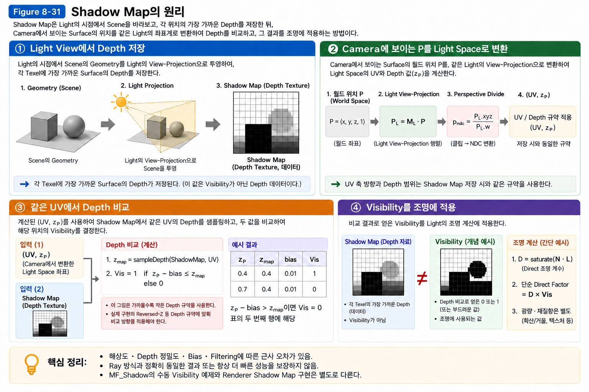

> **Figure 8-31. Shadow Map의 원리**  
> Shadow Map은 Light의 시점에서 Scene을 바라보고 각 위치의 가장 가까운 Depth를 저장한 뒤, Camera에서 보이는 Surface의 Light-space Depth와 비교하여 Light의 Visibility를 판단한다.

---

#### Transforming the Surface to Light Space

이제 Camera에서 실제로 보이는 Surface Point `P`가 있다고 생각해 보자.

~~~text
Camera
   ↓

       ● P
      Surface
~~~

이 Surface가 Light에서 보이는지를 확인하려면 Surface의 위치를 **Light의 좌표계(Light Space)**에서 확인해야 한다.

따라서 Surface Point `P`의 위치를 Light Space로 변환한다.

~~~text
World Space
    ↓
Light Space
    ↓
Light 기준의 위치와 Depth 확인
~~~

현재 Surface에 Light View/Projection을 적용하고 필요한 Perspective Divide와 UV 변환을 수행한다. 조회 위치와 비교 Depth는 Shadow Map 생성 때와 동일한 투영·Encoding을 사용해야 한다. 일반적인 Projected Depth를 Light까지의 Euclidean Distance와 직접 비교하지 않는다. Chapter 02의 Clip/NDC 구분을 유지한다.

이 Depth를 Shadow Map에 저장된 Depth와 비교한다.

---

#### Depth Comparison

여기서 Shadow Map의 핵심적인 비교가 이루어진다.

~~~text
Shadow Map에 저장된 Depth
            │
            │ 비교
            ↓
현재 Surface의 Light-space Depth
~~~

이 비교의 목적은 **Shadow Map을 다시 만들지 결정하는 것이 아니다.**

> **현재 Surface가 Light에서 보이는지, 다른 Geometry에 의해 가려졌는지를 판단하는 것**이 목적이다.

아래 10/15 예제는 멀어질수록 값이 커지는 동일한 선형 Depth 표현의 개념 예이다. 실제 GPU의 0–1 Projected Depth를 그대로 나타내지는 않는다. Reversed-Z 등 반대 Convention에서는 비교 방향과 Bias 부호가 달라진다. 예를 들어 Shadow Map의 해당 위치에 Depth가 `10`이라고 하자.

현재 Surface의 Light-space Depth가 `10`과 같거나 더 가까우면, 해당 Surface보다 앞에 다른 Geometry가 존재하지 않는다.

~~~text
Shadow Map Depth = 10
Surface Depth    = 10

        ↓

Visible
        ↓
Visibility = 1
        ↓
직접광 도달
~~~

반대로 현재 Surface의 Depth가 `15`라면, 이미 Depth `10` 위치에 Geometry가 존재한다.

~~~text
Shadow Map Depth = 10
Surface Depth    = 15

        ↓

앞에 다른 Geometry 존재
        ↓
Occluded
        ↓
Visibility = 0
        ↓
직접광 차단
        ↓
Shadow
~~~

즉:

~~~text
현재 Surface가 Shadow Map의
저장된 Depth보다 더 멀리 있는가?

        │
   ┌────┴────┐
   │         │
  No        Yes
   │         │
Visible   Occluded
   │         │
   ↓         ↓
Light      Shadow
도달 가능   발생
~~~

---

#### Reusing Depth Data

Shadow Map의 효율성을 이해하려면 **Depth 정보를 재사용한다는 개념**을 이해해야 한다.

Shadow Ray 방식에서는 Camera에서 보이는 각 Surface Point가 Light를 향해 직접 Ray를 발사하고 Geometry와의 Intersection을 검사한다.

~~~text
Pixel 1 → Shadow Ray → Geometry Test
Pixel 2 → Shadow Ray → Geometry Test
Pixel 3 → Shadow Ray → Geometry Test
Pixel 4 → Shadow Ray → Geometry Test
...
~~~

반면 Shadow Map 방식에서는 먼저 Light의 시점에서 Scene을 렌더링하여 Depth를 만든다.

~~~text
Light
  ↓
Scene Depth 계산
  ↓
Shadow Map 생성
~~~

그 다음 Camera에서 보이는 여러 Surface가 이 Shadow Map을 조회한다.

~~~text
Surface 1 ─┐
Surface 2 ─┤
Surface 3 ─┼──→ Shadow Map 조회
Surface 4 ─┤
Surface 5 ─┘
~~~

여기서 **재사용한다**는 것은 Shadow Map이 모든 Surface에 동일한 그림자를 제공한다는 뜻이 아니다.

각 Surface는 자신의 위치를 Light Space에서 확인한 뒤, 그 위치에 대응하는 Shadow Map의 Depth를 조회하여 자신의 Visibility를 판단한다.

즉:

> **각 Surface가 Geometry와 직접 Intersection Test를 다시 수행하는 대신, 이미 생성된 Shadow Map의 Depth 정보를 조회하여 Visibility를 판단한다.**

이것이 Shadow Map이 효율적으로 사용될 수 있는 핵심 이유다.

---

#### Dynamic Geometry

여기서 애니메이션 캐릭터에 대한 의문이 생길 수 있다.

캐릭터가 애니메이션으로 움직이면 Geometry의 형태와 위치가 달라진다.

~~~text
Frame 1

    O
   /|\
  / | \
    |
   / \
~~~

다음 Frame에서는:

~~~text
Frame 2

    O
   /|
  / |
    |
   / \
~~~

Light에서 바라본 Geometry가 달라졌기 때문에 Depth도 달라진다.

따라서 실시간 Shadow Map을 사용하는 경우 현재 Frame의 Scene 상태를 반영하여 Shadow Map을 생성하거나 갱신해야 한다.

~~~text
Animation
    ↓
현재 Mesh Pose
    ↓
Light View에서 Scene 렌더링
    ↓
현재 Pose의 Depth 생성
    ↓
Shadow Map
    ↓
Visibility 판단
~~~

따라서 Shadow Map은 캐릭터처럼 애니메이션으로 형태가 변하는 Geometry에도 사용할 수 있다.

---

#### Static and Dynamic Geometry

실제 Rendering Engine에서는 여기서 다양한 최적화가 추가된다.

예를 들어:

~~~text
건물 ───── 정적
바닥 ───── 정적
벽 ─────── 정적

캐릭터 ─── 동적
오브젝트 ─ 동적
~~~

정적인 Geometry는 상태가 변하지 않는 경우 기존 Shadow 관련 데이터를 재사용하거나 필요한 부분만 갱신하는 등의 최적화가 가능하다.

동적인 Geometry는 현재 위치와 형태가 변경되므로 새로운 Shadow 정보가 필요할 수 있다.

다만 이것은 **Shadow Map이라는 기술의 정의 자체가 아니다.**

> **Shadow Map의 기본 원리는 현재 Scene을 Light의 시점에서 바라보고 Depth를 생성하여 Visibility를 판단하는 것이다.**

정적/동적 Geometry의 분리, Caching, 필요한 영역만 갱신하는 방법 등은 이 과정을 효율적으로 수행하기 위한 **Rendering Engine의 최적화 전략**이다.

---

#### Two Methods for Visibility

여기서 [Shadow Ray and Visibility Test](#shadow-ray-and-visibility-test)의 Shadow Ray와 연결해 보자.

두 방법 모두 결국 같은 질문에 답한다.

> **"이 Surface Point에서 Light가 보이는가?"**

**Shadow Ray**

~~~text
Surface
   ↓
Light를 향해 Ray 발사
   ↓
Geometry와 Intersection Test
   ↓
Visible / Occluded
~~~

**Shadow Map**

~~~text
Light
   ↓
Light의 시점에서 Depth 기록
   ↓
Shadow Map 생성
   ↓
Surface의 Light-space Depth와 비교
   ↓
Visible / Occluded
~~~

따라서 두 방법은 **해결하려는 문제는 같지만 Visibility를 판단하는 시작점과 방법이 다르다.**

~~~text
                 Light Visibility
                        │
          ┌─────────────┴─────────────┐
          │                           │
      Shadow Ray                 Shadow Map
          │                           │
  Surface → Light              Light → Scene
          │                           │
Intersection Test              Depth Comparison
          │                           │
          ↓                           ↓
       Visibility                 Visibility
          │                           │
          └─────────────┬─────────────┘
                        ↓
                      Shadow
~~~

Shadow Ray는 **Surface에서 Light를 향해 직접 Visibility를 검사**한다.

Shadow Map은 **Light에서 바라본 Depth를 먼저 기록하고, 그 정보를 조회하여 Surface의 Visibility를 판단**한다.

둘은 같은 문제를 해결하지만 서로 다른 계산 전략을 사용한다.

---

#### Shadow Map Trade-offs

Shadow Map을 단순히 **"최적화된 그림자"**라고 표현하는 것은 정확하지 않다.

보다 정확한 표현은 다음과 같다.

> **Shadow Map은 Shadow Ray처럼 모든 Surface에서 Geometry와 직접 Intersection Test를 수행하는 대신, Light에서 미리 생성한 Depth 정보를 이용하여 Light Visibility를 효율적으로 판단하는 방식이다.**

이 방식은 전통적인 Rasterization 기반 Rendering에서 매우 효율적으로 실시간 Shadow를 처리할 수 있다는 장점이 있다.

하지만 그 대가로 Shadow Map의 해상도와 Depth 비교 방식에서 발생하는 고유한 문제가 존재한다.

---

#### Real-time Shadow Maps

**Real-time Shadow**는 특정 알고리즘의 이름이 아니다.

Runtime에 현재 Scene 상태를 반영하여 그림자를 계산한다는 **더 넓은 개념**이다.

~~~text
Real-time Shadow
       │
       ├── Shadow Map
       │      └── Depth Comparison
       │
       └── Ray Traced Shadow
              └── Ray–Geometry Intersection
~~~

따라서 Shadow Map을 사용하는 실시간 그림자는 다음과 같이 이해할 수 있다.

~~~text
현재 Scene
    ↓
Light에서 Depth 생성
    ↓
Shadow Map
    ↓
Surface에서 Shadow Map 조회
    ↓
Depth Comparison
    ↓
Visibility
    ↓
Shadow
~~~

반면 Ray Traced Shadow는 Surface에서 Light를 향해 Shadow Ray를 발사하고 Geometry와의 Intersection을 직접 검사한다.

---

#### Comparison with Ray-traced Shadows

Ray Traced Shadow는 Shadow Map과 다른 방식으로 Visibility를 판단한다.

~~~text
Surface
   ↓
Shadow Ray
   ↓
Geometry와 Intersection
   ↓
Occluder 존재?
   │
 ┌─┴───────────┐
 │             │
Yes           No
 │             │
Occluded     Visible
 │             │
 ↓             ↓
Shadow       Light
~~~

Ray Traced Shadow는 실제 Geometry와 Ray의 교차를 직접 검사하기 때문에 Shadow Map에서 발생하는 Texture Resolution이나 Shadow Map의 Depth 저장 방식에 따른 일부 문제를 다른 방식으로 해결할 수 있다.

하지만 Ray를 추적하는 계산 비용과 충분한 Sampling의 필요성, Noise 및 Denoising 등의 새로운 문제가 발생할 수 있다.

현대 GPU와 전용 Ray Tracing Hardware의 발전으로 이러한 계산을 실시간으로 수행할 수 있는 성능이 크게 향상되었으며, 그 결과 Ray Tracing은 고품질 실시간 Rendering에서 중요한 기술로 활용되고 있다.

다만 **Ray Traced Shadow 자체가 항상 더 좋은 결과를 보장하는 것은 아니다.**

샘플 수, Noise, Denoising, 성능 등의 조건에 따라 결과 품질은 달라진다.

---

#### Shadow Map Limitations

Shadow Map은 효율적인 실시간 Shadow를 제공하지만, Depth를 제한된 해상도의 Texture에 저장한다는 구조적인 특성 때문에 몇 가지 문제가 발생한다.

**Resolution Limit**

Shadow Map은 Texture이기 때문에 해상도가 제한된다.

해상도가 낮으면 하나의 Shadow Texel이 넓은 공간을 담당하게 되어 Shadow 경계가 거칠어질 수 있다.

**Depth Precision**

Shadow Map은 Depth 값을 저장하기 때문에 깊이값의 정밀도가 충분하지 않으면 서로 가까운 Surface를 정확하게 구분하지 못할 수 있다.

**Shadow Acne**

Depth 비교 과정에서 미세한 수치 오차가 발생하면 Surface가 자기 자신에 의해 가려진 것처럼 판단될 수 있다.

그 결과 표면에 얼룩이나 줄무늬처럼 보이는 Shadow가 나타난다.

**Peter Panning**

Shadow Acne를 줄이기 위해 Depth 비교에 Bias를 적용할 수 있다.

하지만 Bias가 너무 크면 Shadow의 시작점이 실제 Geometry에서 떨어져 보이면서 물체가 그림자 위에 떠 있는 것처럼 보일 수 있다.

이를 **Peter Panning**이라고 한다.

**Shadow Aliasing**

Shadow Map은 Texture의 Pixel 단위로 Depth를 저장하기 때문에 Shadow 경계가 충분한 해상도로 표현되지 않으면 계단 현상이나 거친 경계가 나타날 수 있다.

**Filtering and Soft Shadow**

기본적인 Shadow Map은 Visibility를 비교하는 방식이므로 Shadow 경계가 딱딱하게 나타난다.

부드러운 Shadow를 만들기 위해서는 Filtering이나 추가적인 Sampling 방법이 필요하다.

---

#### Acne and Peter Panning

Shadow Acne와 Peter Panning은 Bias와 관련된 Trade-off 관계를 가진다.

~~~text
Depth 비교 오차
      ↓
Shadow Acne
      ↓
Bias 증가
      ↓
Shadow Acne 감소
      ↓
Bias가 너무 커짐
      ↓
Peter Panning
~~~

따라서 Shadow Acne를 줄이기 위해 Bias를 무조건 크게 설정하는 것은 해결책이 아니다.

적절한 Bias를 선택하는 것이 중요하다.

이 문제와 해결 방법은 이후 Shadow Quality와 Filtering을 다루면서 자세히 살펴본다.

---

#### Shadow Map and Lightmap Comparison

두 기술은 모두 Lighting과 관련된 데이터를 저장하지만 목적이 다르다.

| 구분 | Shadow Map | Lightmap |
|---|---|---|
| 목적 | Light Visibility 판단 | 조명 결과 저장 |
| 저장 정보 | Light 기준 Depth | 미리 계산된 Lighting 결과 |
| 계산 시점 | Runtime에서 생성/갱신 가능 | 주로 Offline Baking |
| 동적 Geometry | 대응 가능 | 기본적으로 제약이 큼 |
| 핵심 질문 | "Light가 Surface에 보이는가?" | "이 Surface의 조명 결과는 무엇인가?" |

따라서 Shadow Map을 **"Shadow용 Lightmap"**이라고 생각해서는 안 된다.

둘은 저장하는 정보와 사용 목적이 완전히 다르다.

---

#### Depth-based Visibility

지금까지의 내용을 하나로 연결하면 Shadow Map의 본질을 명확하게 볼 수 있다.

~~~text
Shadow
  ↓
Light Visibility 문제
  ↓
"이 Surface에서 Light가 보이는가?"
  ↓
Light에서 Scene을 바라본다
  ↓
가장 가까운 Geometry의 Depth를 저장한다
  ↓
Shadow Map
  ↓
현재 Surface를 Light Space에서 확인한다
  ↓
Shadow Map의 Depth와 비교한다
  ↓
Visible / Occluded
  ↓
Direct Lighting
  ↓
Shadow
~~~

결국 Shadow Map은 **Shadow를 직접 저장하는 기술이 아니다.**

Shadow가 발생하는 근본적인 원인인 **Light Visibility를 Depth Comparison을 통해 효율적으로 판단하는 기술**이다.

---

#### Key Perspective

[Shadow Ray and Visibility Test](#shadow-ray-and-visibility-test)에서 배운 Shadow Ray와 비교하면 Shadow Map의 의미가 더욱 명확해진다.

~~~text
                 Light Visibility
                       │
          ┌────────────┴────────────┐
          │                         │
      Shadow Ray                Shadow Map
          │                         │
 Surface → Light              Light → Scene
          │                         │
Intersection Test             Depth 기록
          │                         │
          ↓                         ↓
   Visible / Occluded        Depth Comparison
          │                         │
          └────────────┬────────────┘
                       ↓
                    Shadow
~~~

Shadow Ray는 **Surface에서 Light를 향해 직접 Visibility를 검사**한다.

Shadow Map은 **Light에서 바라본 Depth를 먼저 기록하고, 그 정보를 조회하여 Visibility를 판단**한다.

둘은 같은 문제를 해결하지만 서로 다른 계산 전략을 사용한다.

---

#### From Principle to Quality

Shadow Map은 실시간 Shadow를 효율적으로 처리할 수 있지만, Texture 해상도와 Depth Precision이라는 구조적인 한계를 가지고 있다.

이러한 한계는 실제 Rendering에서 여러 가지 품질 문제로 나타난다.

~~~text
Shadow Map
     ↓
Resolution / Precision 한계
     ↓
Shadow Acne
Peter Panning
Shadow Aliasing
Hard Shadow
     ↓
Filtering / Bias / Shadow Quality
~~~

이 절에서는 각 문제의 개념만 간단하게 살펴보았다.

**Shadow Acne, Bias, Peter Panning, Shadow Aliasing, Filtering과 Soft Shadow의 구체적인 원인과 해결 방법은 이후 Shadow Quality와 Filtering을 다루는 절에서 자세히 살펴본다.**

---

#### Key Takeaways

- **Real-time Shadow**는 Runtime에 현재 Scene 상태를 반영하여 계산되는 그림자의 전체적인 개념이다.
- **Shadow Map**은 Real-time Shadow를 구현하는 대표적인 방법 중 하나다.
- Shadow Map은 **Light의 시점에서 Scene을 바라보고 가장 가까운 Geometry까지의 Depth를 저장한다.**
- 저장된 Depth는 Shadow 자체가 아니라 **Light Visibility를 판단하기 위한 데이터**다.
- Camera에서 보이는 Surface의 위치를 Light Space로 변환하고 Shadow Map의 Depth와 비교하여 Visibility를 판단한다.
- Depth 비교의 목적은 Shadow Map의 재생성 여부를 결정하는 것이 아니라 **현재 Surface가 Light에서 보이는지 판단하는 것**이다.
- Shadow Map을 여러 Surface가 조회하기 때문에 각 Surface에서 Geometry와 직접 Intersection Test를 반복하는 방식보다 효율적으로 Visibility를 계산할 수 있다.
- 애니메이션 캐릭터처럼 Geometry가 변화하는 경우 현재 Scene 상태를 반영하도록 Shadow Map을 Runtime에 생성하거나 갱신할 수 있다.
- 정적/동적 Geometry의 분리, Caching, 필요한 영역만 갱신하는 등의 방법은 Shadow Map 자체의 원리가 아니라 **Rendering Engine의 최적화 전략**이다.
- **Shadow Ray**는 Surface → Light 방향에서 직접 Intersection Test를 수행한다.
- **Shadow Map**은 Light → Scene 방향에서 Depth를 기록한 뒤 Surface의 Depth와 비교한다.
- **Ray Traced Shadow**는 Shadow Ray를 실제 Geometry에 추적하여 Visibility를 직접 판단하는 방식이다.
- Hardware Ray Tracing의 발전으로 Ray Traced Shadow를 고품질 실시간 Rendering에 활용할 수 있게 되었다.
- Shadow Map은 Resolution, Depth Precision, Shadow Acne, Peter Panning, Shadow Aliasing, Filtering 등의 문제를 가진다.
- **Lightmap은 Baked Lighting 결과를 저장하는 기술**이며 Shadow Map과 목적이 다르다.

> **핵심 질문:**  
> "이 Surface에서 Light가 보이는가?"

> **Shadow Map의 답변 방식:**  
> "Light에서 미리 기록한 Depth와 현재 Surface의 Depth를 비교하여 판단한다."

> **Shadow Ray의 답변 방식:**  
> "Surface에서 Light까지 Ray를 보내 Geometry와 직접 교차하는지 검사한다."

---

이어서 [Shadow Map Quality & Filtering](#shadow-map-quality--filtering)에서 다음 질문을 살펴본다.

다음 절에서는 Shadow Map의 해상도, Depth Precision, Shadow Acne, Peter Panning, Shadow Aliasing 등의 문제가 왜 발생하는지 살펴보고, Bias와 Filtering이 이러한 문제를 어떻게 개선하는지 알아본다.

---

### Shadow Map Quality & Filtering

[Shadow Map](#shadow-map)에서는 Shadow Map이 **Light의 시점에서 Depth를 기록하고, Surface의 Depth와 비교하여 Light Visibility를 판단하는 방법**이라는 것을 살펴보았다.

Shadow Map은 효율적으로 실시간 그림자를 계산할 수 있다는 장점이 있지만, 하나의 중요한 조건을 가진다.

> **Shadow Map은 결국 제한된 해상도의 Texture에 Depth 정보를 저장한다.**

따라서 Shadow Map의 해상도와 Depth 정밀도, 그리고 Depth를 비교하는 과정에서 여러 가지 품질 문제가 발생한다.

이번 절에서는 이러한 문제가 **왜 발생하는지**를 먼저 이해하고, Bias와 Filtering이 각각 어떤 문제를 해결하는지 살펴본다.

---

#### Texture Reminder

Shadow Map과 Texel을 이해하기 전에 먼저 **Texture**라는 개념을 정확하게 정의할 필요가 있다.

Texture는 단순히 "이미지"를 의미하는 것이 아니다.

Rendering에서 Texture는 **Surface나 Rendering 과정에서 사용할 데이터를 일정한 배열 형태로 저장한 리소스**라고 이해하는 것이 좋다.

우리가 흔히 사용하는 Color Texture는 그 데이터가 색상인 경우다.

~~~text
Texture
   ↓
데이터를 저장하는 배열
   ↓
각 위치에 데이터가 존재

Color Texture
   ↓
Color 데이터

Normal Texture
   ↓
Normal 방향 데이터

Roughness Texture
   ↓
Roughness 데이터

Shadow Map
   ↓
Depth 데이터
~~~

따라서 Texture는 반드시 색상만 저장하는 것이 아니다.

Rendering에서는 다음과 같이 다양한 정보를 Texture 형태로 저장하고 사용할 수 있다.

- Color
- Normal
- Roughness
- Metallic
- Depth
- Shadow 관련 정보

즉:

> **Texture는 Rendering에 필요한 데이터를 저장하고 조회하기 위한 하나의 데이터 구조이며, 우리가 흔히 보는 이미지는 그중 하나의 활용 형태다.**

---

#### Texture and Texel

Texture는 하나의 데이터가 아니라 여러 개의 작은 데이터 단위로 구성된다.

이 하나의 단위를 **Texel(Texture Element)**이라고 한다.

~~~text
Texture

┌───┬───┬───┬───┐
│ T │ T │ T │ T │
├───┼───┼───┼───┤
│ T │ T │ T │ T │
├───┼───┼───┼───┤
│ T │ T │ T │ T │
└───┴───┴───┴───┘

T = Texel
~~~

예를 들어 Color Texture에서는 각각의 Texel에 색상 정보가 저장될 수 있다.

~~~text
Color Texture

┌────┬────┬────┐
│Red │Blue│Green
├────┼────┼────┤
│Gray│White│Black
└────┴────┴────┘

각 칸 = 하나의 Texel
각 Texel = 색상 데이터
~~~

반면 Shadow Map에서는 같은 Texture 구조를 사용하지만 저장하는 데이터가 다르다.

~~~text
Shadow Map

┌────┬────┬────┐
│0.2 │0.4 │0.7 │
├────┼────┼────┤
│0.3 │0.5 │0.8 │
└────┴────┴────┘

각 Texel = Light 기준 Depth 데이터
~~~

즉:

> **Texture는 데이터를 저장하는 전체 구조이고, Texel은 그 Texture를 구성하는 각각의 데이터 단위다.**

---

#### Pixel and Texel

Texel을 이해할 때 함께 알아야 하는 개념이 **Pixel**이다.

둘은 비슷해 보이지만 서로 다른 대상을 구성한다.

- **Pixel** → 최종 화면을 구성하는 단위
- **Texel** → Texture를 구성하는 단위

~~~text
화면

┌───┬───┬───┬───┐
│ P │ P │ P │ P │
├───┼───┼───┼───┤
│ P │ P │ P │ P │
├───┼───┼───┼───┤
│ P │ P │ P │ P │
└───┴───┴───┴───┘

P = Pixel
~~~

Texture는 다음과 같다.

~~~text
Texture

┌───┬───┬───┬───┐
│ T │ T │ T │ T │
├───┼───┼───┼───┤
│ T │ T │ T │ T │
├───┼───┼───┼───┤
│ T │ T │ T │ T │
└───┴───┴───┴───┘

T = Texel
~~~

따라서 최종 Rendering에서는 **Texture의 Texel에 저장된 정보를 이용하여 화면의 Pixel을 계산**하게 된다.

이 차이는 Shadow Map을 이해할 때 특히 중요하다.

---

#### Shadow Map Storage

이제 Shadow Map을 다시 생각해 보자.

Shadow Map은 별도의 특별한 데이터 구조라기보다, **Light의 시점에서 바라본 Scene의 Depth 정보를 Texture 형태로 저장한 것**이라고 이해할 수 있다.

~~~text
Light
  ↓
Scene을 바라봄
  ↓
각 위치의 Depth 계산
  ↓
Texture에 저장
  ↓
Shadow Map
~~~

일반적인 Color Texture와 비교하면 다음과 같다.

~~~text
Color Texture
    ↓
Texel
    ↓
Color 데이터

Shadow Map
    ↓
Texel
    ↓
Depth 데이터
~~~

따라서 Shadow Map의 각 Texel에는 일반적인 색상 대신 **Light 기준 Depth 정보**가 저장된다.

예를 들어 Shadow Map이 2048 × 2048이라면:

> **2048 × 2048개의 Texel에 Light 기준 Depth 정보를 저장한다.**

라고 이해할 수 있다.

---

#### Shadow Texel Data

Shadow Map 생성 과정을 다시 보면:

~~~text
Light
  ↓
Light Space
  ↓
Geometry의 Depth 계산
  ↓
Shadow Map
  ↓
각 Texel에 Depth 저장
~~~

이렇게 생성된 Shadow Map은 나중에 실제 Surface를 Shading할 때 조회된다.

~~~text
3D Surface
    ↓
Light Space에서 위치 계산
    ↓
Shadow Map의 해당 위치 조회
    ↓
해당 Texel의 Depth 확인
    ↓
현재 Surface의 Depth와 비교
    ↓
Visibility 판단
~~~

즉, Texel은 단순히 "그림자의 색"을 저장하는 것이 아니다.

**Light에서 바라본 Geometry의 Depth라는 정보를 저장하고 있으며, 나중에 이 정보를 Visibility 판단에 재사용한다.**

---

#### Pixel Footprint in the Shadow Map

최종적으로 우리가 화면에서 보는 것은 **Pixel**이다.

반면 Shadow 정보가 저장되어 있는 것은 **Texel**이다.

따라서 Rendering 과정에서는 이 둘이 다음과 같이 연결된다.

~~~text
3D Surface
    ↓
Light Space로 변환
    ↓
Shadow Map의 해당 위치 조회
    ↓
Shadow Map Texel의 Depth 확인
    ↓
현재 Surface의 Depth와 비교
    ↓
Visibility 판단
    ↓
Lighting 계산
    ↓
최종 Pixel
~~~

즉 **Texel이 화면에 직접 보이는 것이 아니다.**

Texel에 저장되어 있는 Shadow 관련 정보를 조회하고, 그 결과를 최종 Pixel의 Shading에 사용한다.

이 차이를 이해하면 Shadow Map Resolution이 왜 Shadow Quality에 영향을 주는지도 자연스럽게 이해할 수 있다.

---

#### Sources of Shadow Quality Issues

Shadow Map의 기본적인 흐름을 다시 생각해 보자.

~~~text
Light
  ↓
Light View
  ↓
Scene Depth 기록
  ↓
Shadow Map
  ↓
현재 Surface의 Depth와 비교
  ↓
Visible / Occluded
~~~

이 과정에서 Shadow Map은 무한히 정밀한 공간 정보를 저장하지 않는다.

Shadow Map은 결국 일정한 해상도의 Texture다.

~~~text
실제 공간
    ↓
Shadow Map으로 투영
    ↓
제한된 Texel에 Depth 저장
    ↓
다시 Surface의 Visibility 판단
~~~

따라서 실제 Geometry의 연속적인 공간 정보를 **제한된 해상도의 Texel과 Depth 값으로 근사**하게 된다.

이것이 Shadow Map 품질 문제의 출발점이다.

---

#### Shadow Map Resolution

Shadow Map의 가장 직관적인 한계는 **해상도**다.

Shadow Map이 낮은 해상도를 가지고 있다면 하나의 Texel이 더 넓은 공간을 담당하게 된다.

~~~text
낮은 해상도

┌───┬───┬───┬───┐
│   │   │   │   │
├───┼───┼───┼───┤
│   │   │   │   │
├───┼───┼───┼───┤
│   │   │   │   │
└───┴───┴───┴───┘

하나의 Texel이 넓은 공간을 담당
~~~

반대로 해상도가 높으면 같은 공간을 더 많은 Texel로 표현할 수 있다.

~~~text
높은 해상도

┌─┬─┬─┬─┬─┬─┬─┬─┐
├─┼─┼─┼─┼─┼─┼─┼─┤
├─┼─┼─┼─┼─┼─┼─┼─┤
├─┼─┼─┼─┼─┼─┼─┼─┤
└─┴─┴─┴─┴─┴─┴─┴─┘

더 많은 Texel로 공간을 표현
~~~

따라서 일반적으로 Shadow Map의 해상도가 높을수록 Shadow의 세부적인 형태를 더 정확하게 표현할 수 있다.

하지만 해상도를 무작정 높이는 것은 메모리와 연산 비용을 증가시킨다.

즉:

> **Shadow Quality와 Performance 사이에는 Trade-off가 존재한다.**

---

#### Shadow and Screen Resolution

여기서 한 가지 중요한 점이 있다.

Shadow Map의 해상도는 **Camera의 화면 해상도와 별개의 개념**이다.

예를 들어 화면이 1920×1080이라고 하더라도 Shadow Map은 1024×1024일 수 있고, 2048×2048 또는 그 이상일 수도 있다.

~~~text
Camera
1920 × 1080
     │
     ↓
화면에 보이는 Pixel

Light
     │
     ↓
Shadow Map
2048 × 2048
     │
     ↓
Shadow 정보를 저장하는 Texel
~~~

따라서 화면 자체는 고해상도인데 Shadow 경계가 거칠게 보이는 경우가 발생할 수 있다.

그 원인이 화면의 해상도가 아니라 **Shadow Map의 해상도 부족**일 수 있다.

---

#### Shadow Aliasing

Shadow Map은 Texture이기 때문에 Shadow 경계 역시 Texel의 영향을 받는다.

실제 Shadow 경계는 연속적인 공간에 존재하지만 Shadow Map은 이를 제한된 Texel로 표현한다.

~~~text
실제 Shadow Boundary

────────────╲
             ╲
              ╲
               ╲
                ╲

Shadow Map

┌──┬──┬──┬──┐
│██│██│  │  │
├──┼──┼──┼──┤
│██│  │  │  │
├──┼──┼──┼──┤
│  │  │  │  │
└──┴──┴──┴──┘
~~~

이 때문에 Shadow의 경계가 계단처럼 보일 수 있다.

이를 **Shadow Aliasing**이라고 한다.

특히 Shadow Map의 Texel이 화면의 Pixel보다 크게 확대되어 보이는 상황에서 문제가 더욱 두드러진다.

---

#### Projection and Shadow Footprint

Shadow Map은 Light의 시점에서 Scene 전체를 일정한 Texture 공간에 투영한다.

따라서 하나의 Shadow Map Texel이 담당하는 실제 공간의 크기는 Scene의 모든 위치에서 동일하게 느껴지지 않는다.

Camera에서 가까운 영역과 먼 영역, Light와 가까운 영역과 먼 영역에서 Shadow Map의 해상도가 다르게 체감될 수 있다.

~~~text
Shadow Map
┌──┬──┬──┬──┬──┬──┐
│  │  │  │  │  │  │
├──┼──┼──┼──┼──┼──┤
│  │  │  │  │  │  │
├──┼──┼──┼──┼──┼──┤
│  │  │  │  │  │  │
└──┴──┴──┴──┴──┴──┘
        ↓
Scene의 넓은 영역을 담당
        ↓
각 Texel이 넓은 공간을 표현
        ↓
Shadow Detail 감소
~~~

이 때문에 게임에서는 Shadow Map의 전체 영역을 하나의 Texture로 처리하는 것뿐만 아니라, Camera와의 거리나 중요도에 따라 Shadow 정보를 효율적으로 분배하는 여러 기법이 사용된다.

이러한 고급 기법은 이후 Rendering Architecture와 Engine 구현을 살펴보면서 다시 다룬다.

---

#### Depth Precision

Shadow Map의 또 다른 중요한 문제는 **Depth Precision**이다.

Shadow Map에는 Geometry까지의 거리를 Depth 값으로 저장한다.

하지만 이 Depth 역시 무한히 정밀한 값을 저장할 수 있는 것은 아니다.

~~~text
실제 Depth
──────────────────────────────
0.0000001
0.0000002
0.0000003
0.0000004
...

        ↓ 저장

제한된 Precision의 Depth
────────────────────────
0
1
2
3
...
~~~

Depth를 표현할 수 있는 정밀도가 충분하지 않으면 서로 가까이 있는 Surface의 Depth를 정확하게 구분하기 어려워진다.

특히 Light와 멀리 떨어진 영역이나 Depth Range가 넓게 설정된 경우 이러한 문제가 더욱 커질 수 있다.

---

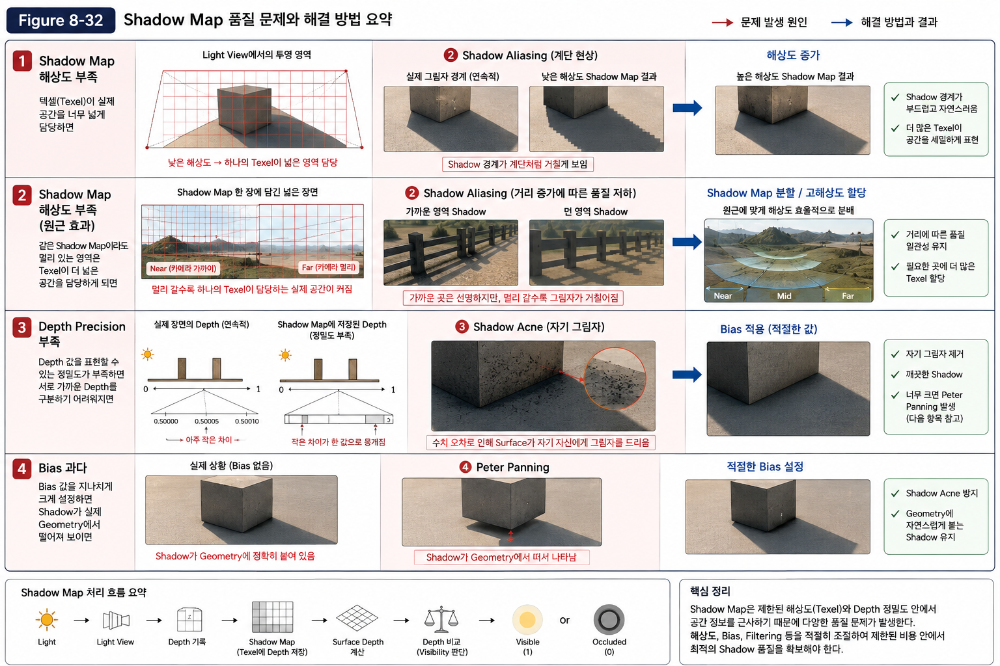

> **Figure 8-32. Shadow Map 품질 문제의 기존 비교 자료.**
> 이미지 안의 Rendering 결과 영역은 출처와 촬영 조건이 확인되지 않았으므로 현재 Unreal 구현의 검증 증거로 사용하지 않는다. 동일 해상도에서 Texel이 담당하는 World 영역은 Light Projection과 Coverage에 따라 달라지며, Camera 거리만으로 항상 증가한다고 일반화하지 않는다. Shadow Acne는 실제 자기 그림자 자체가 아니라 잘못된 Self-shadowing 판정이다. Peter Panning은 Geometry가 움직이는 현상이 아니라 Shadow가 접촉부에서 분리되는 오류이므로, 물체가 떠 있는 것처럼 보이는 비교는 부적절하다. 이 그림에는 Filtering 비교가 포함되어 있지 않으며 Filtering은 본문의 별도 설명을 따른다. 결과 영역을 보존한 설명 수정과 동일 접지 Geometry의 비교 자료 확인이 필요하다.

---

#### Shadow Acne

Depth Precision과 Shadow Map의 투영 과정에서 발생하는 오차는 더욱 특이한 문제를 만들어낸다.

바로 **Shadow Acne**다.

Shadow Acne는 Surface가 자기 자신에게 그림자를 드리우는 것처럼 보이는 현상이다.

~~~text
Light
  ↓
  ↓
█████████
 Surface
~~~

Surface가 실제로 자기 자신을 가리는 것은 아니다.

문제는 **현재 Surface의 Depth와 Shadow Map에 기록된 Depth가 수치적으로 완전히 동일하지 않을 수 있다는 것**이다.

예를 들어 실제로는 같은 Surface인데:

~~~text
Shadow Map Depth = 10.0000
Surface Depth    = 10.0001
~~~

처럼 아주 작은 차이가 발생할 수 있다.

그러면 Rendering System은 다음과 같이 판단할 수 있다.

~~~text
현재 Surface Depth
        >
Shadow Map Depth
        ↓
앞에 Geometry가 존재한다고 판단
        ↓
Occluded
        ↓
Shadow
~~~

그 결과 Surface 전체에 작은 Shadow가 반복적으로 나타나는 것처럼 보인다.

이것이 Shadow Acne다.

---

#### Depth Comparison Error

Shadow Acne를 단순히 "Shadow Map의 오류"라고 생각하면 원인을 이해하기 어렵다.

보다 정확하게는:

> **Shadow Map의 Depth와 현재 Surface의 Depth를 비교하는 과정에서 발생하는 작은 수치 오차가 잘못된 Occlusion 판단을 만들어내는 현상**

이라고 이해해야 한다.

즉:

~~~text
Shadow Map
    ↓
Depth 저장
    ↓
수치적 오차
    ↓
Depth Comparison
    ↓
잘못된 Occlusion 판단
    ↓
Shadow Acne
~~~

따라서 Shadow Acne를 해결하려면 **Depth Comparison에 어느 정도의 오차를 허용하는 방법**이 필요하다.

---

#### Bias

Shadow Acne를 줄이기 위해 사용하는 대표적인 방법이 **Bias**다.

Bias는 Depth를 비교할 때 작은 Offset을 적용하는 방식이다.

개념적으로는 다음과 같이 생각할 수 있다.

~~~text
Shadow Map Depth
        │
        │
        ↓
현재 Surface Depth에 작은 Bias 적용
        │
        ↓
Depth Comparison
~~~

즉, 아주 작은 수치 오차 때문에 Surface가 자기 자신에게 가려졌다고 판단하지 않도록 비교 기준을 조금 이동시키는 것이다.

간단하게 표현하면:

~~~text
Surface Depth ≤ Shadow Map Depth + Bias
~~~

와 같은 형태로 생각할 수 있다.

실제 Rendering Engine에서는 이보다 다양한 형태의 Bias와 Depth Offset이 사용될 수 있지만, 지금 단계에서 중요한 것은 **Bias가 Depth Comparison의 작은 오차를 보정하기 위한 값**이라는 점이다.

---

#### Excessive Bias

Bias는 Shadow Acne를 줄여주지만 무조건 크게 설정하면 문제가 생긴다.

~~~text
Bias가 너무 작음
        ↓
Shadow Acne

적절한 Bias
        ↓
깨끗한 Shadow

Bias가 너무 큼
        ↓
Shadow가 실제 Geometry에서 떨어짐
~~~

즉 Bias 역시 Trade-off를 가진다.

---

#### Peter Panning

Bias를 지나치게 크게 설정하면 Shadow가 실제 Geometry와 떨어져 보이는 현상이 발생한다.

이를 **Peter Panning**이라고 한다.

~~~text
실제 Geometry
      ███
      ███
──────███──────── Ground

Shadow
────────────────────
        ↑
     떨어져 있음
~~~

실제 물체는 바닥에 붙어 있는데 Shadow가 물체와 분리되어 나타나기 때문에 마치 물체가 바닥에서 떠 있는 것처럼 보인다.

따라서:

> **Shadow Acne를 줄이기 위해 Bias를 증가시키면, 너무 큰 Bias로 인해 Peter Panning이 발생할 수 있다.**

이것이 Shadow Map에서 중요한 Quality Trade-off 중 하나다.

---

#### Bias Trade-off

두 현상을 하나의 관계로 정리하면 다음과 같다.

~~~text
Bias 작음
    ↓
Depth 오차에 민감
    ↓
Shadow Acne

        ↓ Bias 증가

적절한 Bias
    ↓
오차 보정
    ↓
깨끗한 Shadow

        ↓ Bias 과다

Geometry와 Shadow의 거리 증가
    ↓
Peter Panning
~~~

따라서 좋은 Shadow를 만들기 위해서는 **무조건 Bias를 높이는 것이 아니라 Scene과 Light의 조건에 맞는 적절한 Bias를 선택해야 한다.**

---

#### Hard Shadow

기본적인 Shadow Map은 Visibility를 비교하는 방식이다.

가장 단순하게 생각하면 결과는 두 가지다.

~~~text
Visible
   ↓
1

Occluded
   ↓
0
~~~

따라서 Shadow의 경계가 매우 명확하게 나뉘는 **Hard Shadow**가 만들어진다.

하지만 실제 세계의 그림자는 항상 이렇게 완벽하게 딱딱하지 않다.

---

#### Area Light Penumbra

현실의 Light Source는 점 하나가 아닌 일정한 크기를 가진 경우가 많다.

예를 들어 태양이나 큰 Area Light를 생각해 보자.

~~~text
Point Light

      ●
      │
      │
      ↓
   Shadow
   └────┘
~~~

점광원은 하나의 방향에서 Light가 들어오기 때문에 Shadow의 경계가 비교적 명확하다.

반면 Area Light는 여러 위치에서 Light가 들어온다.

~~~text
Area Light

  ● ● ● ● ●
   \  |  /
    \ | /
     \|/
      ↓
    Object
      ↓
  Shadow
~~~

어떤 Surface Point에서는 Light Source의 일부가 보이고, 일부가 가려질 수 있다.

이 영역에서는 완전히 Visible도 아니고 완전히 Occluded도 아니다.

이것이 우리가 보는 **Soft Shadow**의 근본적인 원리다.

---

#### Filtering

앞에서 Shadow Map의 기본적인 Visibility 판단을 살펴보았다.

가장 단순한 방식에서는 현재 Surface에 해당하는 **Shadow Map의 Texel 하나를 조회**한다.

그리고 그 Texel에 저장된 Depth와 현재 Surface의 Depth를 비교한다.

~~~text
Shadow Map Texel
      ↓
Depth 조회
      ↓
현재 Surface의 Depth와 비교
      ↓
Visible 또는 Occluded
      ↓
Visibility = 1 또는 0
~~~

따라서 기본적인 Shadow Map의 Visibility는 연속적인 값이 아니라 **0 또는 1로 판단된다.**

문제는 실제 Shadow의 경계는 공간에서 연속적으로 존재하지만, Shadow Map은 **Texel이라는 격자 단위로 공간을 샘플링한다는 것**이다.

예를 들어 실제 Shadow 경계가 다음과 같이 존재한다고 생각해 보자.

~~~text
실제 공간의 Shadow Boundary

████████████
███████████
████████
██████
████
~~~

하지만 Shadow Map은 제한된 Texel로 이 공간을 표현한다.

~~~text
Shadow Map

┌───┬───┬───┬───┬───┐
│ 1 │ 1 │ 1 │ 1 │ 0 │
├───┼───┼───┼───┼───┤
│ 1 │ 1 │ 1 │ 1 │ 0 │
├───┼───┼───┼───┼───┤
│ 1 │ 1 │ 1 │ 0 │ 0 │
├───┼───┼───┼───┼───┤
│ 1 │ 1 │ 0 │ 0 │ 0 │
└───┴───┴───┴───┴───┘

1 = Visible
0 = Occluded
~~~

Surface가 Shadow 경계를 조금씩 지나가더라도 조회하는 Texel이 바뀌는 순간 Visibility가

~~~text
1 → 0
~~~

처럼 갑자기 변할 수 있다.

즉, 실제 공간에서는 연속적인 Shadow 경계를 **제한된 Texel과 0/1의 Visibility로 근사**하기 때문에 경계가 계단처럼 나타날 수 있다.

이것이 Shadow Map에서 발생하는 **Shadow Aliasing**의 중요한 원인 중 하나다.

---

#### Multiple Samples

이 문제를 완화하기 위해 현재 위치의 Texel 하나만 보는 대신 **주변의 여러 Texel을 함께 확인**할 수 있다.

예를 들어 다음과 같이 네 개의 Texel을 Sampling한다고 생각해 보자.

~~~text
┌────┬────┐
│  1 │  1 │
├────┼────┤
│  1 │  0 │
└────┴────┘

1 = Visible
0 = Occluded
~~~

각 Texel의 Visibility를 계산한 뒤 결과를 평균하면:

~~~text
(1 + 1 + 1 + 0) / 4
= 0.75
~~~

가 된다.

그러면 Visibility가 단순히

~~~text
1 = 완전히 Visible
0 = 완전히 Occluded
~~~

만 존재하는 것이 아니라,

~~~text
1.0
0.75
0.5
0.25
0.0
~~~

처럼 **중간값을 가질 수 있게 된다.**

이렇게 Shadow 경계에서 Visibility가 급격하게 1에서 0으로 바뀌는 것을 완화할 수 있다.

---

#### Filtering Principle

따라서 Filtering의 기본적인 아이디어는 다음과 같다.

~~~text
Texel 하나만 Sampling
        ↓
Visibility = 0 또는 1
        ↓
경계가 급격하게 변화
        ↓
Shadow Aliasing
~~~

여러 Texel을 Sampling하면:

~~~text
여러 Texel Sampling
        ↓
각각 Visibility 계산
        ↓
결과를 평균
        ↓
0 ~ 1 사이의 Visibility
        ↓
Shadow Boundary 완화
~~~

중요한 것은 **Depth 자체를 단순히 평균하는 것이 아니라, 각각의 Texel에 대해 먼저 Shadow Comparison을 수행한다는 것**이다.

즉:

~~~text
잘못된 이해

Depth → 평균 → Visibility

실제 개념

Depth
 ↓
각각 비교
 ↓
Visibility 0 / 1
 ↓
Visibility 결과를 평균
 ↓
최종 Visibility
~~~

이 차이가 중요하다.

---

#### PCF

Shadow Map에서 이러한 Filtering을 대표적으로 사용하는 방법이 **PCF(Percentage-Closer Filtering)**다.

PCF는 여러 위치의 Shadow Map Texel을 Sampling하고, 각각에 대해 Shadow Comparison을 수행한다.

~~~text
주변 Texel Sampling
        ↓
각 Texel의 Depth 비교
        ↓
각각의 Visibility 계산
        ↓
0 / 1 결과
        ↓
결과를 평균
        ↓
최종 Visibility
~~~

예를 들어 4개의 Texel을 확인한 결과가:

~~~text
Visible
Visible
Visible
Occluded
~~~

이라면:

~~~text
Visibility
= (1 + 1 + 1 + 0) / 4
= 0.75
~~~

가 된다.

따라서 해당 위치는 완전히 밝거나 완전히 어두운 것이 아니라 **75% 정도의 Visibility를 가진 영역**으로 처리할 수 있다.

이러한 중간값이 Shadow 경계에 만들어지면서 결과적으로 Shadow가 더 부드럽게 보인다.

---

#### The Role of Filtering

Filtering을 적용하면 Shadow Map의 제한된 Texel 때문에 발생하는 급격한 Visibility 변화를 완화할 수 있다.

~~~text
Filtering 없음

1 ──────────┐
            │
            │
0 ──────────┘

Visibility가 갑자기 변화
        ↓
딱딱한 Shadow Boundary
~~~

Filtering을 적용하면:

~~~text
Filtering 적용

1 ──────────
       ╲
        ╲
         ╲
0 ─────────

Visibility가 점진적으로 변화
        ↓
부드러운 Shadow Boundary
~~~

따라서 Filtering은 **Shadow Map의 해상도를 실제로 증가시키는 방법이 아니다.**

제한된 Texel을 여러 개 Sampling하여 **Visibility를 보다 부드럽게 표현하는 방법**이다.

---

#### Filtered Edges and Physical Penumbra

여기서 한 가지 구분이 필요하다.

Filtering으로 Shadow가 부드러워졌다고 해서 **실제 Light Source의 크기가 커진 것은 아니다.**

실제 Soft Shadow는 Light Source가 일정한 크기를 가지고 있기 때문에 발생한다.

~~~text
작은 Point Light

       ●
       │
       ↓
    Object
       ↓
   비교적 명확한 Shadow
~~~

반면 넓은 Area Light에서는 Light의 여러 위치에서 빛이 들어온다.

~~~text
넓은 Area Light

   ●  ●  ●  ●  ●
    ╲  │  │  │  ╱
     ╲ │  │  │ ╱
      ╲│  │  │╱
       Object
          ↓
     부드러운 Shadow
~~~

이 경우 Object의 일부 지점에서는 Light의 일부가 보이고, 다른 일부는 가려진다.

이것이 물리적인 Soft Shadow가 발생하는 근본적인 원리다.

반면 PCF와 같은 Filtering은 **Shadow Map에서 얻은 Visibility 결과를 여러 Sample을 이용해 부드럽게 만드는 방법**이다.

따라서 둘은 결과가 비슷하게 보일 수 있지만 원리는 동일하지 않다.

---

#### Connecting Quality Issues

이제 8.3에서 지금까지 살펴본 내용을 하나의 흐름으로 연결해 보자.

~~~text
Light
  ↓
Light의 시점에서 Scene을 바라봄
  ↓
Depth 생성
  ↓
Shadow Map에 저장
  ↓
Texel 단위로 Depth 정보 보관
  ↓
Surface의 Depth와 비교
  ↓
Visibility 판단
~~~

여기에서 Shadow Map이 **제한된 Texture**라는 사실 때문에 여러 문제가 발생한다.

~~~text
제한된 Resolution
    ↓
하나의 Texel이 넓은 공간 담당
    ↓
Shadow Boundary의 계단 현상
    ↓
Shadow Aliasing

제한된 Depth Precision
    ↓
Depth Comparison의 작은 오차
    ↓
Shadow Acne
    ↓
Bias로 보정

단일 Texel의 0 / 1 판단
    ↓
Shadow Boundary의 급격한 변화
    ↓
Hard / Aliased Boundary
    ↓
여러 Texel Sampling
    ↓
Filtering / PCF
    ↓
부드러운 Boundary
~~~

즉 Shadow Map의 품질 문제는 서로 완전히 별개의 문제가 아니다.

**제한된 Texture에 실제 공간의 정보를 저장하고 다시 조회한다는 Shadow Map의 구조에서 여러 문제가 파생된다.**

---

#### Bias Trade-off Reminder

앞의 Shadow Acne → Bias → Peter Panning 설명에서 확인한 관계를 유지한다. 작은 Depth 불일치는 잘못된 Self-shadowing을 만들 수 있고 Bias는 이를 완화하지만 과하면 접촉 Shadow가 떨어진다. 같은 수치 예제를 다시 유도하기보다 Scene/Light 조건을 고정하고 Bias 하나씩 바꾸어 두 오류를 함께 관찰한다. 다음은 Bias와 다른 문제를 해결하는 Resolution/Filtering의 관계다.

---
#### Resolution and Filtering

Resolution과 Filtering은 서로 다른 문제를 해결한다.

**Resolution**은 Shadow Map이 얼마나 세밀한 공간 정보를 저장할 수 있는가와 관련된다.

~~~text
Resolution 증가
    ↓
더 많은 Texel
    ↓
더 세밀한 Shadow 정보
    ↓
Aliasing 감소 가능
~~~

반면 **Filtering**은 이미 존재하는 Texel들을 어떻게 Sampling하여 최종 Visibility를 만들 것인가와 관련된다.

~~~text
여러 Texel Sampling
    ↓
Visibility 비교
    ↓
결과 평균
    ↓
경계 부드럽게
~~~

따라서 Filtering이 있다고 해서 낮은 Resolution의 한계가 완전히 사라지는 것은 아니다.

**Resolution은 공간 정보를 얼마나 세밀하게 저장할 수 있는가의 문제이고, Filtering은 저장된 정보를 어떻게 Sampling하여 표현할 것인가의 문제다.**

---

#### Shadow Maps and Ray-traced Shadows

이제 Shadow Map과 Ray Traced Shadow의 차이를 다시 연결해 볼 수 있다.

Shadow Map은:

~~~text
Light
  ↓
Depth Map 생성
  ↓
Texture에 저장
  ↓
Surface에서 조회
  ↓
Depth Comparison
  ↓
Visibility
~~~

라는 방식이다.

이미 계산해 둔 Depth 정보를 **Texture 형태로 저장하고 재사용**하기 때문에 많은 Surface의 Visibility를 효율적으로 판단할 수 있다.

반면 Ray Traced Shadow는:

~~~text
Surface
  ↓
Light 방향으로 Shadow Ray
  ↓
Geometry와 Intersection 검사
  ↓
Occluded / Visible
  ↓
Visibility
~~~

라는 방식이다.

즉 두 방법은 Visibility를 판단하는 **출발점 자체가 다르다.**

~~~text
Shadow Map
Light
 ↓
Depth 기록
 ↓
재사용
 ↓
Visibility

Ray Tracing
Surface
 ↓
Shadow Ray
 ↓
Intersection
 ↓
Visibility
~~~

Shadow Map은 Depth 정보를 재사용하는 대신 **Resolution과 Depth Precision 등의 제약**을 가진다.

Ray Tracing은 Geometry와의 Intersection을 직접 계산하기 때문에 이러한 Shadow Map 특유의 해상도 문제에서 자유롭지만, 그만큼 많은 Ray 계산과 Sampling 비용이 필요할 수 있다.

현대 Hardware의 발전으로 실시간 Ray Tracing을 사용할 수 있는 성능이 확보되면서, 이러한 직접적인 Visibility 계산을 실시간 Rendering에서도 활용할 수 있게 되었다.

따라서 일반적인 관점에서는:

> **Ray Tracing을 사용하면 기존 Shadow Map에서 발생하던 일부 한계를 다른 방식으로 해결하여 더 높은 품질의 Shadow를 만들 수 있다.**

라고 이해할 수 있다.

다만 Ray Tracing 역시 Sample 수, Denoising, Light 구성, Scene 복잡도와 같은 조건에 따라 결과와 성능이 달라진다.

---

#### Shadow Quality and Performance

Shadow Quality를 높이는 것은 항상 공짜가 아니다.

~~~text
Shadow Map Resolution 증가
        ↓
더 많은 Texel
        ↓
Memory / Processing Cost 증가

Filtering Sample 증가
        ↓
더 많은 Shadow Comparison
        ↓
연산 비용 증가

Ray Tracing Sample 증가
        ↓
더 많은 Ray / Intersection
        ↓
연산 비용 증가
~~~

따라서 실시간 Rendering에서는 단순히 "가장 높은 품질"을 선택하는 것이 아니라,

> **화면에서 충분한 품질을 유지하면서 제한된 Performance Budget 안에서 가장 효율적인 방법을 선택하는 것**

이 중요하다.

이러한 이유로 실제 Rendering Engine에서는 Shadow Map Resolution, Filtering, Bias, Shadow Distance, Cascaded Shadow Maps 등 다양한 방법을 조합하여 품질과 성능을 조절한다.

이러한 Engine 수준의 최적화는 이후 **Rendering Architecture와 실제 Engine 구현**을 살펴보면서 다시 다룬다.

---

#### Key Takeaways

- Shadow Map은 **Light의 시점에서 바라본 Scene의 Depth 정보를 Texture에 저장한 것**이다.
- Texture를 구성하는 각각의 데이터 단위를 **Texel**이라고 한다.
- Shadow Map의 각 Texel에는 일반적인 색상이 아니라 **Light 기준 Depth 정보**가 저장된다.
- 현재 Surface의 Depth와 Shadow Map의 Depth를 비교하여 Visibility를 판단한다.
- 가장 단순한 방식에서는 Visibility가 **0 또는 1**로 결정된다.
- 실제 Shadow 경계는 연속적이지만 Shadow Map은 Texel이라는 제한된 격자로 공간을 표현한다.
- 따라서 Shadow 경계를 따라 Visibility가 1에서 0으로 급격하게 변하면서 **Shadow Aliasing**이 발생할 수 있다.
- 여러 Texel을 Sampling하고 각각의 Visibility를 계산한 뒤 평균하면 0과 1 사이의 중간 Visibility를 만들 수 있다.
- **Filtering**은 이러한 방식으로 Shadow Boundary의 급격한 변화를 완화한다.
- **PCF(Percentage-Closer Filtering)**는 여러 위치에서 Shadow Comparison을 수행하고 그 Visibility 결과를 평균하는 대표적인 Filtering 방법이다.
- Filtering은 실제 Light Source의 크기를 변경하는 것이 아니므로 물리적인 Soft Shadow와 원리는 다르다.
- Shadow Map의 제한된 Depth Precision과 Depth Comparison 오차는 **Shadow Acne**를 발생시킬 수 있다.
- **Bias**는 이러한 작은 Depth 오차를 보정하기 위한 방법이다.
- Bias가 너무 작으면 Shadow Acne가 남을 수 있다.
- Bias가 너무 크면 Shadow가 Geometry에서 떨어져 보이는 **Peter Panning**이 발생할 수 있다.
- Resolution은 **얼마나 세밀한 정보를 저장할 수 있는가**의 문제다.
- Filtering은 **저장된 정보를 어떻게 Sampling하여 표현할 것인가**의 문제다.
- Shadow Map과 Ray Traced Shadow는 모두 Visibility를 판단하지만, Shadow Map은 Light에서 생성한 Depth 정보를 재사용하고 Ray Tracing은 Surface에서 Ray를 발사하여 Geometry와의 Intersection을 직접 확인한다.
- 결국 모든 방식에서 중요한 것은 **Visibility를 어떻게 계산하고, 그 계산을 제한된 Performance Budget 안에서 얼마나 높은 품질로 수행할 것인가**이다.

> **핵심 질문:**  
> "Shadow Map은 왜 제한된 Texture 때문에 품질 문제가 발생하는가?"

> **핵심 답변:**  
> "실제 공간의 연속적인 Depth와 Visibility 정보를 제한된 Resolution과 Precision의 Texel로 근사하기 때문이다."

> **그리고 어떻게 개선하는가?**

> **Resolution으로 공간 정보를 더 세밀하게 저장하고, Bias로 Depth Comparison의 오차를 보정하며, Filtering과 Sampling으로 Visibility의 급격한 변화를 완화한다.**

이제 Shadow Map을 단순히 **"그림자를 만드는 Texture"**라고 이해하는 것이 아니라,

~~~text
Depth 저장
    ↓
Texel
    ↓
Depth Comparison
    ↓
Visibility
    ↓
Aliasing / Precision 문제
    ↓
Bias / Filtering
    ↓
최종 Shadow
~~~

라는 하나의 Rendering 과정으로 이해할 수 있다.

---

이어서 [From Visibility to Lighting](#from-visibility-to-lighting)에서 다음 질문을 살펴본다.

앞의 절들에서는 Light가 Surface에 도달할 수 있는지를 판단하는 **Visibility**를 중심으로 Shadow의 원리를 살펴보았다.

다음 절에서는 이렇게 결정된 Visibility가 실제 **Lighting 계산에 어떻게 연결되는지**를 살펴본다.

즉:

~~~text
Light
  ↓
Light Visibility
  ↓
Direct Lighting
  ↓
Visibility에 따른 Light Contribution
  ↓
Final Shading
~~~

을 연결하여, Shadow가 단순히 "어두운 영역을 만드는 기능"이 아니라 **Lighting에서 Light Contribution을 제한하는 과정**이라는 것을 확인한다.

이 과정을 통해 8.2의 Base Lighting과 8.3의 Visibility 적용이 Material Data Flow에서 연결된다.

---

### From Visibility to Lighting

앞에서는 Shadow와 Visibility를 별도의 개념으로 나누어 살펴보았다.

이제 이 둘을 실제 Lighting 계산과 연결해 보자.

Shadow는 단순히 화면의 특정 영역을 검게 칠하는 별도의 효과가 아니다.

핵심은 **Light가 Surface에 실제로 도달할 수 있는지를 판단하고, 그 결과를 Lighting Contribution에 반영하는 것**이다.

즉, 지금까지 살펴본 Visibility는 Lighting 계산의 결과를 결정하는 중요한 입력이 된다.

---

#### Occlusion and Light Contribution

앞에서 Shadow의 본질을 다음과 같이 정의했다.

> **Shadow는 Light가 Surface에 도달하지 못하는 상태다.**

따라서 어떤 Surface를 렌더링할 때 먼저 다음과 같은 질문을 할 수 있다.

~~~text
Light
  ↓
Surface까지 경로가 열려 있는가?
  ↓
Visibility
~~~

Visibility가 1이라면 Light가 Surface에 도달할 수 있다.

Visibility가 0이라면 다른 Geometry에 의해 Light가 가려져 Surface에 도달할 수 없다.

Filtering이나 Soft Shadow와 같은 방법을 사용하면 그 사이의 값도 사용할 수 있다.

~~~text
Visibility = 1.0
→ Light가 완전히 도달

Visibility = 0.5
→ 부분적으로 도달

Visibility = 0.0
→ Light가 도달하지 못함
~~~

중요한 것은 이 값 자체가 화면에 표시되는 색상이 아니라는 점이다.

**Visibility는 Light가 Surface에 얼마나 기여할 수 있는지를 결정하는 정보다.**

---

#### Visibility and Lighting Contribution

Lighting을 계산할 때는 Light의 방향, 세기, 색상, Surface의 Normal, Material의 BRDF 등 여러 요소가 사용된다.

이 과정을 단순화하면 다음과 같이 생각할 수 있다.

~~~text
Light Properties
      ↓
Surface와 Light의 관계
      ↓
Material / BRDF
      ↓
Lighting Contribution
~~~

이 값은 기본적으로 **해당 Light가 Surface에 기여할 수 있다고 가정했을 때의 결과**라고 볼 수 있다.

여기에 Visibility가 추가된다.

~~~text
Lighting Contribution
        ×
    Visibility
        ↓
실제로 기여하는 Light
~~~

즉:

~~~text
Visibility = 1
→ Lighting Contribution × 1
→ Light의 기여가 그대로 반영

Visibility = 0
→ Lighting Contribution × 0
→ 해당 Light의 기여가 차단

Visibility = 0.5
→ Lighting Contribution × 0.5
→ 일부만 기여
~~~

따라서 Shadow는 별도의 검은색을 더하는 과정이 아니라 **Light Contribution을 제한하는 과정**으로 이해하는 것이 더 정확하다.

---

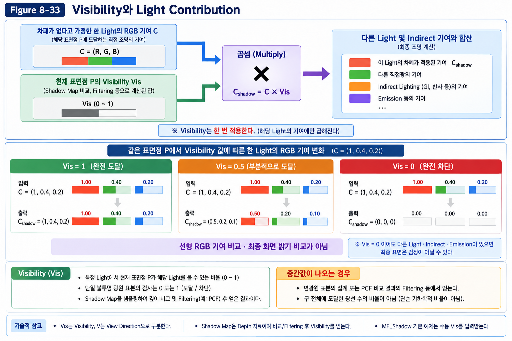

> **Figure 33. Visibility가 Lighting Contribution을 제한하는 과정**
>
> Visibility는 Light가 Surface에 실제로 기여할 수 있는 정도를 나타내며, 최종 Lighting에서 해당 Light의 Contribution을 제한한다.

---

#### Visibility = 1

Surface까지 Light의 경로가 완전히 열려 있다면:

~~~text
Visibility = 1.0
~~~

이 경우 해당 Light의 Lighting Contribution이 그대로 적용된다.

~~~text
Lighting Contribution × 1.0
= Lighting Contribution
~~~

따라서 Shadow의 영향을 받지 않는 영역에서는 해당 Light가 계산한 기여가 정상적으로 Surface에 반영된다.

---

#### Visibility = 0

반대로 다른 Geometry가 Light를 완전히 가리고 있다면:

~~~text
Visibility = 0.0
~~~

이 경우:

~~~text
Lighting Contribution × 0.0
= 0
~~~

이 된다.

즉 해당 Light는 Surface에 기여하지 않는다.

이것이 우리가 화면에서 보는 **Shadow 영역**이다.

여기서 중요한 점은 Surface 자체가 검은색으로 바뀐 것이 아니라는 것이다.

**해당 Light가 기여하지 않게 된 것이다.**

다른 Light가 존재한다면 그 Light의 Contribution은 여전히 Surface에 영향을 줄 수 있다.

~~~text
Light A
  ↓
Occluded
  ↓
Contribution = 0

Light B
  ↓
Visible
  ↓
Contribution > 0

              ↓

Final Lighting
= Light A + Light B
~~~

따라서 현실적인 Scene에서는 Shadow 영역이 항상 완전히 검은색이 되는 것은 아니다.

---

#### Partial Visibility Contribution

Shadow Boundary에서는 Light가 부분적으로 가려지는 상황을 표현할 수 있다.

특히 Area Light나 Filtering된 Shadow에서는 다음과 같은 중간 Visibility를 얻을 수 있다.

~~~text
Visibility = 0.75
Visibility = 0.50
Visibility = 0.25
~~~

예를 들어:

~~~text
Lighting Contribution × 0.5
= Lighting Contribution의 절반
~~~

이렇게 Visibility가 0과 1 사이의 값을 가지면 Light Contribution도 그에 따라 연속적으로 변화한다.

이것이 Shadow Boundary가 부드럽게 표현되는 기본적인 원리다.

---

#### Filtering and Partial Visibility

여기서 앞에서 설명한 Filtering과 Soft Shadow의 관계도 다시 연결할 수 있다.

Shadow Map의 Filtering은 여러 Texel의 Visibility 결과를 이용하여 **0과 1 사이의 중간 Visibility**를 만들어낼 수 있다.

~~~text
1.0 ─────────
       ╲
        ╲
         ╲
0.0 ─────────
~~~

이 때문에 Shadow Boundary가 부드럽게 보일 수 있다.

하지만 이것이 곧 물리적으로 정확한 Soft Shadow를 의미하는 것은 아니다.

실제 Soft Shadow에서는 Light Source의 크기 때문에 한 Surface에서 Light의 일부는 보이고 일부는 가려지는 상황이 발생한다.

~~~text
Area Light
● ● ● ● ●
 ╲ │ │ │ ╱
  ╲│ │ │╱
   Object
     ↓
Partial Visibility
~~~

즉 두 경우 모두 결과적으로 **0과 1 사이의 Visibility**가 나타날 수 있지만, 그 값이 만들어지는 원리는 다르다.

---

#### Applying Visibility to Lighting

이제 8.2에서 다룬 Lighting과 8.3에서 다룬 Shadow를 하나의 흐름으로 연결할 수 있다.

기본적인 Direct Lighting을 단순화하면:

~~~text
Light
  ↓
Light Properties
  ↓
Surface Normal과 Light Direction
  ↓
Material / BRDF
  ↓
Lighting Contribution
~~~

여기에 Shadow와 Visibility가 추가된다.

~~~text
Light
  ↓
Light Properties
  │
  ├───────────────┐
  ↓               ↓
Lighting        Visibility
계산              계산
  │               │
  └───────┬───────┘
          ↓
Lighting Contribution × Visibility
          ↓
Final Direct Lighting
~~~

즉 Shadow는 Lighting Pipeline의 바깥에서 별도로 처리되는 효과가 아니라, **Light Contribution을 제한하는 과정으로 Lighting 계산에 연결된다.**

---

#### Per-light Visibility

여기서 또 하나 중요한 점이 있다.

Visibility는 일반적으로 **특정 Light와 특정 Surface 사이의 관계**를 나타낸다.

하나의 Surface에 여러 Light가 있다면 각각의 Light에 대해 Visibility가 다를 수 있다.

~~~text
              Light A
                 ↓
              Visible
                 ↓
Surface  ←───────┤

              Light B
                 ↓
              Occluded
                 ↓
Surface
~~~

따라서:

~~~text
Light A Contribution × Visibility A
+
Light B Contribution × Visibility B
+
Light C Contribution × Visibility C
...
~~~

와 같이 각각의 Light Contribution에 Visibility가 적용될 수 있다.

이것이 실제 Scene에서 Shadow가 존재하더라도 Surface가 완전히 검은색이 되지 않는 이유이기도 하다.

---

#### Light Contribution and Shadow Appearance

처음 Shadow를 접하면 다음과 같이 생각하기 쉽다.

~~~text
Light
 ↓
Shadow가 생김
 ↓
Shadow 영역을 어둡게 칠함
~~~

하지만 Rendering 관점에서는 다음과 같이 이해하는 것이 더 정확하다.

~~~text
Light
 ↓
Lighting Contribution 계산
 ↓
Light가 Surface에 도달하는가?
 ↓
Visibility 계산
 ↓
Contribution 제한
 ↓
Final Lighting
~~~

즉 Shadow는 최종 이미지에 검은색을 덧붙이는 효과가 아니다.

**Light Contribution을 차단하거나 제한하는 Visibility의 결과가 화면에서 Shadow로 나타나는 것이다.**

---

#### Shadow and Lighting

이제 Shadow와 Lighting의 관계를 다음과 같이 정리할 수 있다.

~~~text
Lighting
→ "빛이 도달한다고 가정했을 때 얼마나 기여하는가?"

Visibility
→ "그 빛이 실제로 Surface까지 도달할 수 있는가?"

Shadow
→ "Visibility가 낮거나 0이 되어 Light Contribution이 제한된 결과"
~~~

따라서 두 개념은 서로 다른 역할을 담당한다.

**Lighting은 빛의 기여량을 계산하고, Visibility는 그 기여가 실제로 이루어질 수 있는지를 결정한다.**

---

#### Connection to the Rendering Equation

이 관계는 Chapter 05.18의 Rendering Equation과 연결된다. Li가 이미 차폐를 포함한 도달 Radiance라면 Vis를 다시 곱하지 않는다. 아래는 차폐 전 Radiance를 사용하는 방향별 기여의 구조이며 적분 전체가 아니다.

Rendering Equation에서 특정 Light가 Surface에 기여하는 과정에는 Light와 Surface의 방향 관계뿐만 아니라 **Light가 실제로 Surface에 도달할 수 있는지**라는 조건이 포함된다.

이를 단순화해서 표현하면:

~~~text
Light Contribution
        ×
Visibility
        ↓
실제로 들어오는 Light
~~~

보다 일반적인 형태에서는 Visibility를 별도의 함수로 표현할 수 있다.

~~~text
Lᵢ_unoccluded
×
fᵣ
×
max(0, N · L)
×
Vis
~~~

여기서:

- `Lᵢ_unoccluded` : 차폐를 적용하기 전 해당 방향의 Light Radiance
- `fᵣ` : Material의 BRDF
- `N · L` : Surface Normal과 Light Direction의 관계
- `Vis` : Light와 Surface 사이의 Visibility. V는 다른 Section에서 View Direction으로 사용한다

이다.

다만 이 식은 전체 Rendering Equation을 다시 설명하기 위한 것이 아니다.

여기서 확인해야 할 핵심은 **Visibility 역시 Lighting 계산에 참여하는 하나의 요소**라는 것이다.

---

#### Visibility Summary

8.3에서 지금까지 살펴본 내용을 하나로 연결하면 다음과 같다.

~~~text
Light
  ↓
Light와 Surface 사이의 경로
  ↓
Visibility 판단
  ↓
Visible / Occluded
  ↓
Visibility 0 ~ 1
  ↓
Lighting Contribution 제한
  ↓
Final Lighting
~~~

그리고 Visibility를 얻는 방법은 여러 가지가 있다.

~~~text
Shadow Map
→ Light 시점의 Depth 정보를 이용
→ Surface에서 비교
→ Visibility 판단

Ray Tracing
→ Surface에서 Light 방향으로 Ray 발사
→ Geometry와 Intersection 검사
→ Visibility 판단
~~~

방법은 다르지만 최종적으로 필요한 정보는 동일하다.

> **"이 Light가 이 Surface에 도달할 수 있는가?"**

그리고 그 결과가 Lighting에 반영되어 우리가 화면에서 Shadow를 보게 된다.

---

#### Key Takeaways

- Shadow는 별도의 색을 칠하는 과정이 아니다.
- Shadow의 본질은 **Light가 Surface에 도달하지 못하는 상태**다.
- 이 상태를 판단하기 위해 **Visibility**를 사용한다.
- Visibility는 특정 Light와 특정 Surface 사이의 관계를 나타낸다.
- `Visibility = 1`이면 Light가 완전히 도달한다.
- `Visibility = 0`이면 Light가 완전히 차단된다.
- `Visibility`가 0과 1 사이의 값을 가지면 Light Contribution도 부분적으로 제한된다.
- Filtering이나 Area Light 등의 방식에서는 이러한 Partial Visibility가 나타날 수 있다.
- 최종적으로 Visibility는 해당 Light의 **Lighting Contribution을 제한하는 요소**로 사용된다.
- 여러 Light가 존재한다면 각각의 Light Contribution과 Visibility가 별도로 계산될 수 있다.
- 따라서 Shadow 영역도 다른 Light나 Indirect Lighting의 영향을 받을 수 있다.
- Shadow Map과 Ray Tracing은 Visibility를 얻는 방법이 다르지만, 최종적으로는 같은 목적을 가진다.
- 그 목적은 **Light가 Surface에 실제로 도달할 수 있는지를 판단하는 것**이다.

> **핵심 질문:**  
> "Shadow는 Rendering에서 무엇을 의미하는가?"

> **핵심 답변:**  
> "Shadow는 Light가 Surface에 도달하지 못하여 해당 Light의 Contribution이 제한된 결과다."

결국 8.3에서 배운 Shadow와 Visibility는 다음 한 문장으로 연결할 수 있다.

> **Visibility가 Light Contribution을 결정하고, 그 결과가 우리가 보는 Shadow로 나타난다.**

---

#### Shadow Data Flow

8.3에서 지금까지 배운 내용을 전체 Rendering 흐름으로 연결하면 다음과 같다.

~~~text
Light
  ↓
Shadow / Occlusion
  ↓
Visibility
  ↓
Lighting Contribution
  ↓
Final Lighting
  ↓
Shading
~~~

Shadow를 이해한다는 것은 단순히 그림자를 만드는 방법을 배우는 것이 아니다.

**Light와 Surface 사이의 관계를 Visibility라는 정보로 판단하고, 그 정보를 Lighting 계산에 연결하는 Rendering 구조를 이해하는 것**이다.

그리고 이제 이 원리를 실제 Rendering Engine에서 어떻게 구현하고 있는지 확인할 수 있다.

---

이어서 [Shadow Map Observation](#shadow-map-observation)에서 다음 질문을 살펴본다.

다음 절에서는 지금까지 정리한 Shadow와 Visibility의 원리를 실제 Unreal Engine에서 확인한다.

목표는 Unreal의 내부 구현을 모두 분석하는 것이 아니다.

대신 우리가 직접 만든 Material에서:

~~~text
Light
  ↓
Surface
  ↓
Visibility
  ↓
Lighting Contribution
  ↓
Shadow
~~~

라는 개념적 흐름이 실제 Rendering 결과에서도 어떻게 나타나는지 확인한다.

이를 통해 Foundation에서 학습한 원리가 특정 Engine의 기능 설명에 머무르지 않고, 실제 Engine 구현으로 연결될 수 있음을 검증한다.

---

### Shadow Map Observation

앞에서 살펴본 Shadow Map의 개념을 실제 Unreal Engine에서 확인한다.

이번 실습의 목적은 Shadow Map을 직접 구현하는 것이 아니다.

Unreal Engine이 제공하는 기본 Directional Light와 Shadow 시스템을 관찰하면서,

- 라이트가 그림자를 어떻게 만들어내는지
- Shadow Map의 Depth 정보가 어떻게 Visibility 판단으로 이어지는지
- 오브젝트의 이동과 크기 변화에 따라 그림자가 어떻게 갱신되는지
- 정적/동적 오브젝트에서 그림자 계산이 어떻게 달라지는지
- 실제 화면에서 Shadow Map 특유의 Artifact가 어떻게 나타날 수 있는지

를 직접 확인한다.

> **핵심**
>
> Shadow Map은 미리 구워놓은 그림자 이미지가 아니다.
> 라이트의 관점에서 생성한 **Depth 정보**를 이용하여, 최종 화면에서 각 Surface가 라이트에 보이는지 판단하는 실시간 그림자 기법이다.

---

#### Observation Setup

간단한 테스트 레벨을 구성한다.

- Directional Light
- Plane
- Sphere
- 기본 Lit Material

만을 사용한다.

이번 실습에서는 복잡한 머티리얼이나 후처리를 사용하지 않는다.

그림자 자체의 동작을 관찰하는 것이 목적이기 때문이다.

---

#### Basic Shadow Observation

먼저 Directional Light를 배치하고 Sphere와 Plane에 기본 Lit Material을 적용한다.

Directional Light의 방향에 따라 Sphere의 표면과 Plane에 그림자가 형성되는 것을 확인한다.

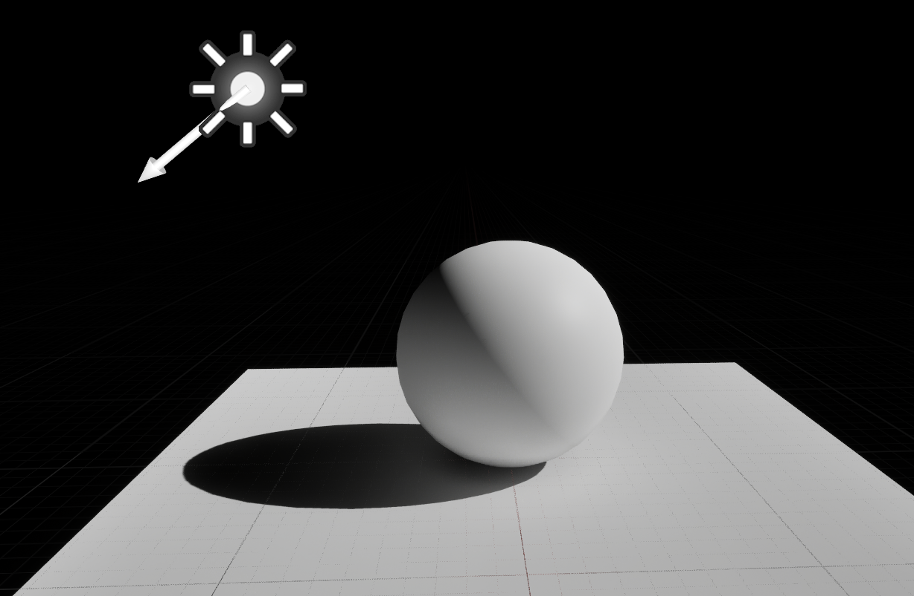

*Figure 8-34. 기본 Lit 결과의 관찰 예시. 구 표면의 방향에 따른 명암과 Plane에 투영된 Cast Shadow를 구분해 관찰한다. 이 정지 화면만으로 Engine 버전, Light Mobility, Shadow Map 방식이나 내부 Depth 저장을 확인할 수는 없다.*

이 상태에서는 단순히

> "빛이 있으니 그림자가 생긴다."

라고 생각하기 쉽다.

하지만 Shadow Map에서는 이 과정에 한 단계가 더 존재한다.

라이트의 위치 또는 방향을 기준으로 Scene을 바라보면서, 라이트에서 보이는 가장 가까운 Surface까지의 **Depth 정보**를 먼저 기록한다.

이렇게 만들어진 Depth 정보가 Shadow Map이다.

---

#### Stored Shadow Data

Shadow Map에는 최종적인 그림자의 색이나 밝기를 저장하는 것이 아니다.

핵심적으로 저장되는 것은 다음과 같은 정보다.

> **라이트 관점에서 얻은 Surface의 Depth**

이를 아주 단순화하면 다음과 같이 생각할 수 있다.

~~~text
Light
  │
  │  Depth 측정
  ▼
[Surface]
  │
  ▼
Shadow Map

"라이트에서 이 위치를 바라봤을 때
 가장 먼저 만나는 Surface는 얼마나 멀리 있는가?"
~~~

이 정보를 가지고 최종적으로 화면에 그려지는 Surface의 위치와 비교한다.

---

#### From Depth to Visibility

예를 들어 라이트에서 바라봤을 때 Shadow Map에 기록된 Depth가 다음과 같다고 하자.

~~~text
Shadow Map에 기록된 Depth
        ↓
      10.0
~~~

그런데 현재 화면에서 검사하고 있는 Surface의 라이트 기준 Depth가 10.0이라면,

~~~text
현재 Surface Depth = 10.0
Shadow Map Depth   = 10.0

→ 라이트보다 뒤에 가려진 것이 아님
→ Light Visibility = 1
→ 빛을 받음
~~~

반대로 현재 Surface가 라이트에서 더 먼 위치에 있다면,

~~~text
현재 Surface Depth = 15.0
Shadow Map Depth   = 10.0

→ 이미 앞에 다른 Surface가 존재함
→ 현재 Surface는 가려져 있음
→ Light Visibility = 0
→ 그림자
~~~

즉 Shadow Map의 Depth 정보는 **그림자 그 자체가 아니라, 그림자 여부를 판단하기 위한 기준 데이터**다.

---

#### Shadow Map and Shadow Mask

이 차이를 구분하는 것이 중요하다.

**Shadow Map**

라이트 관점에서 얻은 **Depth 정보**다.

~~~text
Light
  ↓
Depth를 기록
  ↓
Shadow Map
~~~

**Shadow Mask**

Shadow Map의 Depth와 현재 Surface의 Depth를 비교하여 얻는 **Visibility 결과**다.

~~~text
Shadow Map Depth
       +
현재 Surface Depth
       ↓
Visibility 판단
       ↓
Shadow Mask
~~~

따라서 둘은 같은 것이 아니다.

Shadow Map은 **판단에 사용되는 데이터**이고,

Shadow Mask는 그 데이터를 기반으로 만들어지는 **빛의 가시성 결과**에 가깝다.

---

#### Shadow Debug View

지원되는 Debug View는 Engine 버전과 Shadow Method에 따라 다르다. 사용한 정확한 View/Command와 Buffer의 의미를 확인한 경우에만 Depth 또는 Visibility 관찰로 해석한다.

Debug View에서는 일반적인 Lit 결과와 달리 Shadow Map의 Depth 또는 Shadow 관련 정보를 색상으로 표현할 수 있다.

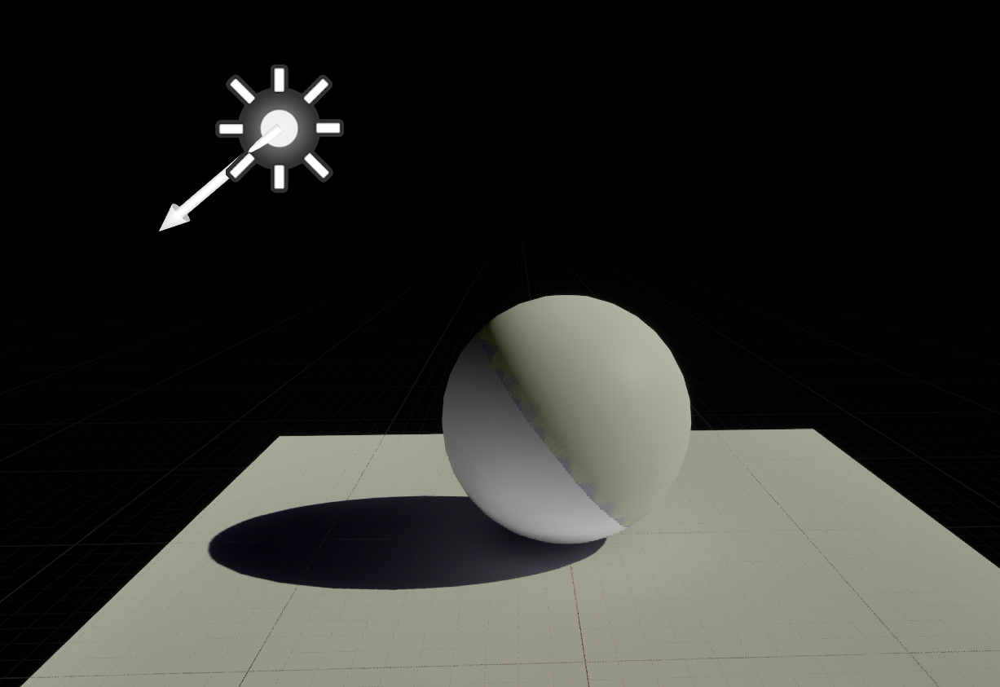

*Figure 8-35. 사용한 Debug Mode와 Buffer 의미가 확인되지 않은 기존 화면. Depth, Visibility 또는 Shadow Mask 중 무엇을 표시하는지 특정할 수 없으므로 현재 Debug View 검증 자료로는 불충분하다. 실제 View/Command와 값의 범례가 보이는 캡처로 재촬영한다.*

이 화면에서 중요한 것은 색상 자체가 아니다.

색이 다르다는 사실만으로 Depth/Visibility를 구분할 수 없다. 아래 Figure의 정확한 Debug Mode와 값의 의미는 별도 확인이 필요하며, 원시 Depth 검증 완료의 증거로 사용하지 않는다.

즉,

~~~text
일반적인 Lit View
    ↓
최종적으로 보이는 그림

Shadow Map Debug View
    ↓
그 그림을 만들기 위해 사용되는
Shadow 관련 중간 데이터를 시각화
~~~

라고 이해하면 된다.

---

#### Object Motion and Shadow Updates

이번에는 Sphere를 이동시켜본다.

Sphere의 위치를 변경하면 Plane에 만들어지는 그림자의 위치와 형태도 함께 변한다.

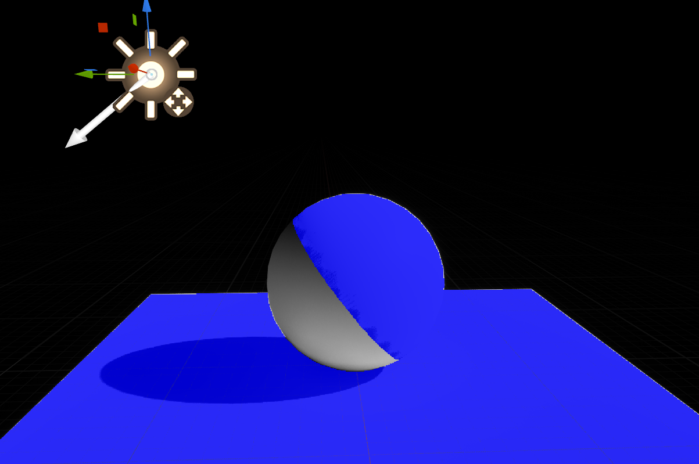

*Figure 8-36. 기존 관찰 화면. 선택 Gizmo는 Light에 있으며 Sphere의 이동 전후 또는 위치값은 보이지 않는다. 파란색 영역의 Debug Mode/범례도 확인되지 않는다. Sphere 이동에 따른 Shadow 갱신 실습에는 동일 Camera/Light에서 Sphere 위치만 바꾼 전후 캡처가 필요하다.*

Figure는 이동 관찰의 예이다. 실제 갱신을 검증하려면 동일한 Light/Camera 조건에서 이동 전후를 비교하고 사용 Shadow Method와 Cache/Mobility 조건을 기록한다. 정지 이미지 하나로 갱신 동작을 입증하지 않는다.

동적인 오브젝트의 위치가 변경되면 라이트에서 바라본 Scene의 Depth 관계 역시 변경된다.

따라서 필요한 Shadow Map 정보가 다시 갱신되고, 최종적인 그림자 역시 새로운 위치에 맞게 계산된다.

여기서 앞에서 배운 **베이크드 라이팅과의 차이**가 명확해진다.

~~~text
Baked Lighting

Scene 상태
   ↓
Bake
   ↓
미리 계산된 결과 저장
   ↓
런타임에서 재사용

Dynamic Shadow Map

현재 Scene 상태
   ↓
Shadow Map 생성/갱신
   ↓
Visibility 판단
   ↓
현재 프레임의 그림자
~~~

따라서 캐릭터처럼 움직이는 오브젝트도 Shadow Map을 이용하여 그림자를 표현할 수 있다.

---

#### Mobility and Dynamic Shadows

Unreal Engine에서는 오브젝트의 Mobility 설정을 통해 해당 오브젝트가 정적인지 동적인지를 구분한다.

테스트용 Sphere를 **Movable**로 설정한다.

Movable 오브젝트는 런타임에서 위치, 회전, 스케일 등의 변화를 가질 수 있다.

따라서 해당 오브젝트가 그림자를 만드는 경우, 그림자 역시 현재 오브젝트 상태에 맞게 갱신되어야 한다.

Sphere를 이동한 뒤 그림자의 위치가 함께 변경되는 것을 확인할 수 있다.

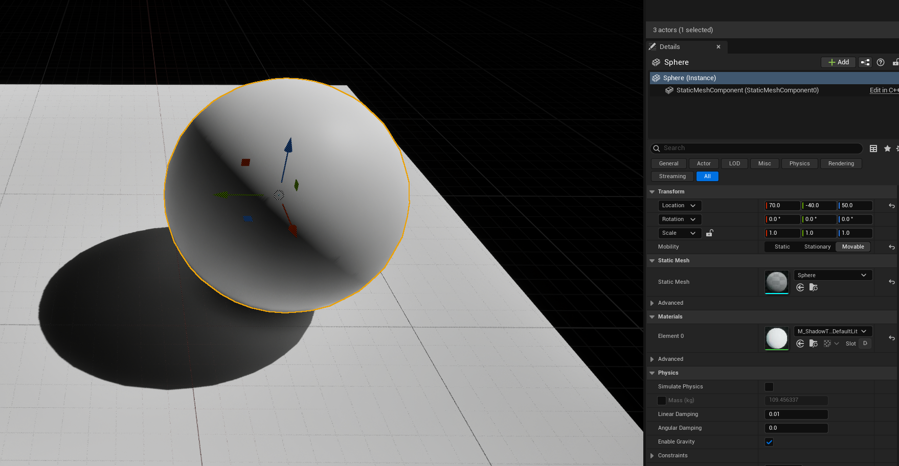

*Figure 8-37. Sphere의 Movable 설정 확인. Details에서 Mobility와 현재 Transform을 읽을 수 있다. 단일 캡처이므로 이동 전후나 Shadow 갱신 동작을 입증하지 않으며, 그 동작은 Fig8_36의 재촬영 조건에 따라 별도 비교한다.*

여기서 중요한 것은 **Movable이라고 해서 Shadow Map 전체를 무조건 매 프레임 처음부터 다시 계산한다는 의미는 아니라는 것**이다.

실제 Unreal Engine의 렌더링 시스템은 상황에 따라 여러 최적화 기법을 사용한다.

하지만 개념적으로는 다음과 같이 이해하면 충분하다.

> 동적 오브젝트의 변화가 그림자 관계에 영향을 주면, 그 변화가 현재 그림자 결과에 반영되어야 한다.

---

#### Object Scale

이번에는 Sphere의 Scale을 변경한다.

Sphere의 크기가 변경되면 라이트에서 바라본 Surface의 위치와 그림자의 형태 역시 달라진다.

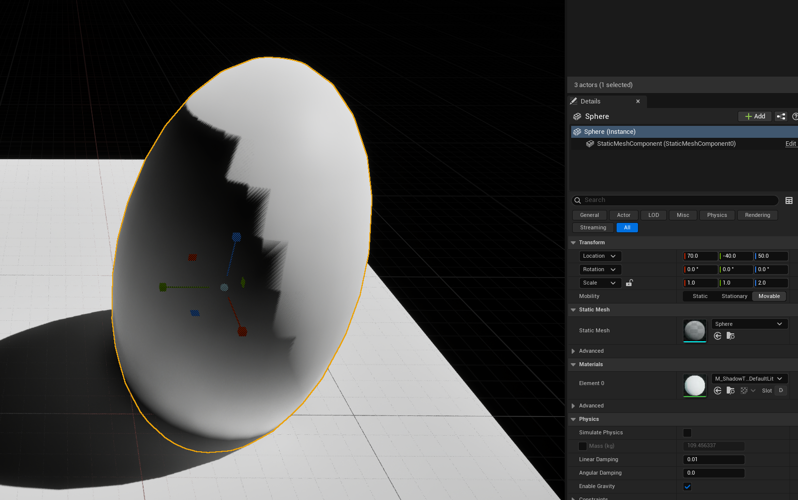

*Figure 8-38. Sphere의 비균일 Scale `(1,1,2)` 설정 예시. Transform과 길어진 Geometry를 확인할 수 있다. 표면의 큰 계단형 경계는 정상적인 Scale 효과로 단정하지 않고 별도 Artifact로 진단한다. Plane의 Shadow 일부가 잘려 있어 전체 Shadow 형태나 동일 조건의 변화량을 검증하는 비교 자료로는 사용하지 않는다.*

이 역시 Shadow Map의 중요한 특징을 보여준다.

그림자는 단순히 오브젝트에 붙어 있는 이미지가 아니다.

현재 Scene의 기하학적 관계와 라이트의 방향을 기반으로 만들어지는 결과이기 때문에,

- 오브젝트 이동
- 오브젝트 회전
- 오브젝트 스케일
- 다른 오브젝트와의 위치 관계 변화

등에 따라 그림자의 형태가 달라진다.

---

#### Shadow Resolution and Quality

테스트 중 Sphere의 표면에서 그림자의 경계가 매끄럽지 않거나, 계단 형태 또는 미세한 패턴처럼 보이는 현상을 발견할 수 있다.

이러한 현상은 반드시 메쉬의 폴리곤 수가 부족해서 발생하는 것은 아니다.

Shadow Map 자체도 결국 **텍스처 형태의 유한한 해상도를 가진 데이터**이기 때문이다.

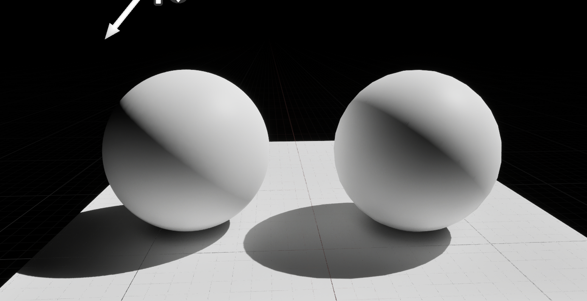

*Figure 8-39. 설정값과 변경 조건이 없는 기존 비교 화면. 두 Sphere의 차이를 Shadow Map 해상도만의 영향으로 특정할 수 없다. 같은 Geometry·Normal·Material·Camera·Light·Exposure와 Bias/Filtering 조건에서 해상도 관련 설정 하나만 바꾸고, 실제 값과 기준/변경 라벨을 포함해 재촬영한다.*

Shadow Map의 해상도가 충분하지 않으면 라이트 공간에서 기록된 Depth 정보가 제한된 Texel 단위로 표현된다.

그 결과 그림자 경계에서 다음과 같은 문제가 발생할 수 있다.

- Shadow Aliasing
- 계단 형태의 그림자 경계
- Shadow Acne
- Peter Panning
- Depth Precision 문제
- Filtering에 따른 경계 품질 변화

이러한 문제는 실제 게임에서도 중요한 문제이며, 엔진에서는 Shadow Map 해상도, 필터링, Bias, Cascade 등의 여러 방법을 이용하여 완화한다.

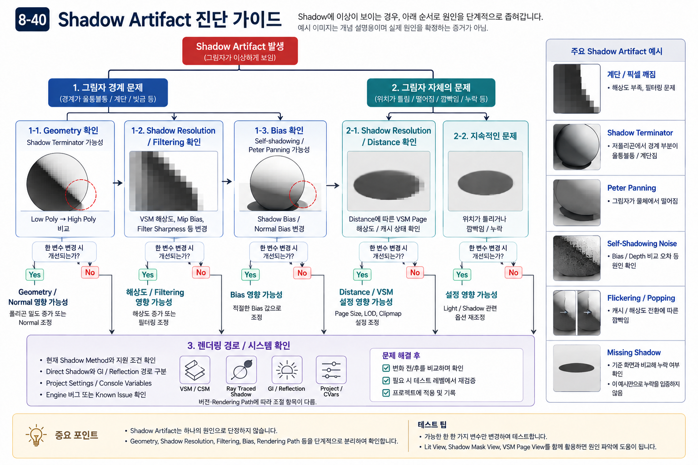

> **주의**
>
> 이번 테스트에서 관찰한 그림자 Artifact를 단순히 "폴리곤이 부족해서 생긴 현상"이라고 결론내리면 안 된다.
>
> 메쉬의 기하학적 해상도뿐 아니라 **Shadow Map 해상도와 Depth Precision, Filtering, Bias 등의 렌더링 설정**도 함께 확인해야 한다.

특히 실제 캐릭터처럼 충분한 폴리곤을 사용하는 모델에서도 비슷한 Shadow Artifact가 발생할 수 있다.

이 부분은 이후 Shadow Map의 기술적 한계를 자세히 다룰 때 다시 확인한다.

---

#### Observation Checklist

이번 실습을 통해 Shadow Map을 단순히 "실시간 그림자"라는 결과로만 이해하지 않고, 그 내부의 흐름까지 연결해서 생각할 수 있어야 한다.

전체 과정은 다음과 같다.

~~~text
[Light]

   ↓

Light 관점에서 Scene을 바라봄

   ↓

각 위치에서 가장 가까운 Surface의
Depth 정보를 기록

   ↓

[Shadow Map]

   ↓

현재 화면에서 그려지는 Surface의
Light 기준 Depth와 비교

   ↓

[Visibility 판단]

   ↓

Light Visibility
   1 = 빛에 보임
   0 = 가려짐

   ↓

[Shadow Mask]

   ↓

최종 Lighting에 반영

   ↓

[그림자]
~~~

이 흐름을 이해하면 Shadow Map이라는 이름도 자연스럽게 이해할 수 있다.

**Shadow를 직접 저장한 Map이 아니라, Shadow를 판단하기 위한 Depth Map**이기 때문이다.

---

#### Shadow Map and Ray-traced Shadow Comparison

Shadow Map과 Ray Traced Shadow는 모두 최종적으로는 "이 Surface가 라이트에 보이는가?"라는 문제를 해결한다.

하지만 출발점이 다르다.

**Shadow Map**

라이트에서 출발한다.

~~~text
Light
  ↓
Scene Depth를 기록
  ↓
Shadow Map
  ↓
Surface와 Depth 비교
  ↓
Visibility 판단
~~~

이미 라이트 관점에서 만들어둔 Depth 정보를 활용하기 때문에, 많은 Surface에 대해 효율적으로 그림자를 계산할 수 있다.

대신 Shadow Map의 해상도와 샘플링 구조 때문에 그림자 경계의 계단 현상이나 Depth 관련 Artifact가 발생할 수 있다.

**Ray Traced Shadow**

반대로 Surface에서 출발한다.

~~~text
Surface
   ↓
Light 방향으로 Ray 발사
   ↓
다른 Geometry와 교차하는가?
   ↓
Visibility 판단
~~~

즉 각 Surface가 실제로 라이트를 볼 수 있는지를 Ray를 통해 직접 확인한다.

따라서 Scene의 동적 변화나 복잡한 Geometry 관계를 보다 직접적으로 처리할 수 있지만, 많은 Ray를 추적해야 하기 때문에 계산량이 커진다.

현대 GPU의 성능 향상과 하드웨어 Ray Tracing 기술의 발전으로 이러한 방식도 실시간 렌더링에서 실용적인 수준으로 사용할 수 있게 되었다.

다만 Ray Tracing 역시 샘플 수와 성능 사이의 Trade-off가 존재한다.

> **정리하면**
>
> Shadow Map은 **라이트에서 바라본 Depth 정보를 재활용하여 Visibility를 판단하는 방식**이고,
>
> Ray Traced Shadow는 **Surface에서 라이트 방향으로 Ray를 추적하여 Visibility를 직접 판단하는 방식**이다.

따라서 "Shadow Map = 저품질 그림자, Ray Tracing = 고품질 그림자"라고 단순하게 이해하기보다는,

> **서로 다른 방식으로 Visibility 문제를 해결하며, 현대 하드웨어에서는 Ray Tracing을 충분한 품질로 사용할 수 있게 되었다.**

라고 이해하는 것이 정확하다.

---

#### Foundation and Advanced Boundary

이번 절에서는 Shadow Map의 내부 구조와 기본적인 동작 원리를 이해하는 것을 우선한다.

Resolution/Acne/Bias/Filtering의 기본 관계는 앞의 Shadow Map Quality & Filtering에서 이미 설명했다. 아래 항목의 Engine별 세부 튜닝과 Production 성능 비교는 Advanced 범위이다.

- Shadow Map Resolution
- Shadow Aliasing
- Depth Precision
- Shadow Acne
- Peter Panning
- Filtering
- Bias
- Cascaded Shadow Maps
- Virtual Shadow Maps

각 기술은 모두 Shadow Map의 품질과 성능을 결정하는 중요한 요소다.

특히 Unreal Engine에서는 이러한 문제를 해결하기 위해 다양한 Shadow 시스템과 최적화 기법을 사용한다.

기본 원인과 Trade-off는 앞의 설명을 참고하고, 특정 Engine 설정의 성능·품질 비교는 별도 실험으로 남긴다.

---

#### MF_Shadow: Visibility Application

8.3에서는 Shadow Map의 생성 과정과 `Visibility`의 의미를 단계적으로 살펴보았다.

중요한 점은 Shadow를 단순히 Surface 위에 검은색을 칠하는 효과로 이해하지 않는 것이다.

Shadow의 본질은 다음 질문에 있다.

> 현재 Surface까지 Light의 Contribution이 실제로 도달할 수 있는가?

Shadow Map과 Depth Comparison을 통해 얻는 결과는 결국 이 질문에 대한 답이며, 이를 `Visibility`라고 표현할 수 있다.

~~~text
Visibility = 1
→ Light가 Surface에 도달함

Visibility = 0
→ 다른 Geometry에 의해 Light가 차단됨

0 < Visibility < 1
→ Filtering 등에 의해 부분적인 Visibility를 가짐
~~~

따라서 Direct Lighting과 Shadow의 관계는 개념적으로 다음과 같이 표현할 수 있다.

~~~text
Shadowed Lighting
=
Lighting Contribution
×
Visibility
~~~

이 관계를 ASF의 Module Architecture에 맞춰 정리하기 위해 `MF_Shadow`를 구성한다.

---

**Visibility Generation and Application**

여기서 `MF_Shadow`의 역할을 명확하게 구분할 필요가 있다.

Shadow를 구성하는 전체 과정은 크게 두 단계로 나눌 수 있다.

~~~text
1. Visibility를 계산한다.

Shadow Map
↓
Light-space Depth
↓
Depth Comparison
↓
Visibility

2. Visibility를 Lighting에 적용한다.

Lighting Contribution
×
Visibility
↓
Shadowed Lighting
~~~

첫 번째 단계는 Unreal Renderer의 Shadow System이 담당한다.

즉,

- Shadow Map 생성
- Virtual Shadow Map 처리
- Light-space Depth 저장
- Depth Comparison
- Filtering
- Visibility 계산

과 같은 과정은 `MF_Shadow` 내부에서 새로 구현하는 것이 아니다.

`MF_Shadow`가 담당하는 것은 두 번째 단계다.

> 이미 계산된 Visibility가 주어졌을 때, 그 값을 Lighting Contribution에 적용한다.

따라서 `MF_Shadow`는 Shadow Map Generator가 아니라

**Visibility Application Module**

로 이해하는 것이 정확하다.

---

**Function Input and Output**

`MF_Shadow`의 구조는 의도적으로 단순하게 유지한다.

Input은 다음 두 가지다.

~~~text
LightingResult
→ Vector3

Visibility
→ Scalar
~~~

`LightingResult`는 `MF_BaseLighting` 등에서 계산된 Direct Lighting 결과다.

`Visibility`는 해당 Surface에 Light가 얼마나 도달할 수 있는지를 나타내는 값이다.

Output은 다음과 같다.

~~~text
ShadowedLighting
→ Vector3
~~~

전체 Data Flow는 다음과 같다.

~~~text
LightingResult
        \
         Multiply
        /
Visibility
        ↓
ShadowedLighting
~~~

수식으로 표현하면 다음과 같다.

~~~text
ShadowedLighting
=
LightingResult × Visibility
~~~

---

**Effect of Visibility**

이 구조가 의미하는 것을 간단한 값으로 확인해보자.

**Visibility = 1**

~~~text
ShadowedLighting
=
LightingResult × 1

=
LightingResult
~~~

Light가 완전히 보이는 영역이므로 기존 Lighting이 그대로 유지된다.

**Visibility = 0.5**

~~~text
ShadowedLighting
=
LightingResult × 0.5
~~~

Lighting Contribution이 절반만 남는다.

**Visibility = 0**

~~~text
ShadowedLighting
=
LightingResult × 0

=
0
~~~

Light가 완전히 차단된 영역이므로 해당 Direct Lighting Contribution이 제거된다.

이 과정에서 중요한 점은 Shadow가 새로운 검은색을 추가하는 것이 아니라는 것이다.

~~~text
Shadow

X  Black Color를 Surface에 추가

O  Light Contribution을 제한
~~~

즉 Shadow는 Color 자체라기보다

**Lighting이 Surface에 얼마나 전달될 수 있는지를 결정하는 Visibility Control**

에 가깝다.

---

**Base Lighting and Shadow Responsibilities**

`MF_BaseLighting`과 `MF_Shadow`는 서로 다른 질문을 담당한다.

`MF_BaseLighting`은 다음을 계산한다.

> Surface가 Light 방향을 기준으로 얼마나 빛을 받을 수 있는가?

예를 들어 Lambert 계열의 기본 Lighting에서는 다음과 같은 방향 관계를 사용한다.

~~~text
N · L
~~~

반면 `MF_Shadow`는 다음을 다룬다.

> 그 Light가 실제로 Surface까지 도달할 수 있는가?

따라서 두 Module의 관계는 다음과 같이 정리할 수 있다.

~~~text
Surface Normal
+
Light Direction
↓
MF_BaseLighting
↓
LightingResult

Visibility
↓
MF_Shadow
↓
ShadowedLighting
~~~

즉,

~~~text
Base Lighting
→ 빛을 받을 수 있는 방향인가?

Shadow / Visibility
→ 실제로 그 빛이 도달하는가?
~~~

라는 서로 다른 역할을 가진다.

이 구분은 Lighting과 Shadow를 하나의 개념처럼 섞어서 이해하지 않기 위해 중요하다.

---

**Renderer and Material Boundary**

여기서 한 가지 중요한 구현상의 한계가 있다.

현재 ASF의 Master Material은 자체 Lighting을 계산하고 결과를 `Emissive Color`로 출력하는 `Unlit` 기반 구조를 사용한다.

이 구조에서는 Unreal의 기본 Lit Material이 내부적으로 사용하는 Shadow Visibility 값을 단순한 Material Input처럼 자동으로 받을 수 있는 것은 아니다.

즉 다음 두 문제는 분리해서 생각해야 한다.

~~~text
MF_Shadow

Visibility가 주어졌을 때
어떻게 Lighting에 적용할 것인가?
~~~

그리고,

~~~text
Renderer Integration

Unreal Renderer가 계산한
실제 Shadow Visibility를
ASF Material에서 어떻게 가져올 것인가?
~~~

`MF_Shadow`는 첫 번째 문제를 해결한다.

두 번째 문제는 Unreal의 Rendering Pipeline 및 Engine Integration과 연결되는 별도의 문제다.

따라서 현재 `MF_Shadow`를 구성했다고 해서 Shadow Map 생성이나 실제 Renderer Visibility 연결까지 모두 구현된 것은 아니다.

---

**Validation with Manual Visibility**

실제 Renderer Visibility를 연결하기 전에 `MF_Shadow` 자체의 동작은 Scalar 값을 이용하여 검증할 수 있다.

예를 들어 임시 Parameter를 다음과 같이 구성한다.

~~~text
ShadowVisibility
~~~

그리고 값을 변경한다.

~~~text
ShadowVisibility = 1.0

ShadowVisibility = 0.5

ShadowVisibility = 0.0
~~~

각 경우에 Lighting이

~~~text
100%
50%
0%
~~~

로 변화한다면 `MF_Shadow`의 Visibility Application Logic은 정상적으로 동작하고 있는 것이다.

이 테스트는 실제 Shadow Map을 대체하기 위한 것이 아니다.

목적은

> Visibility와 Lighting Contribution의 관계를 독립적인 Module 수준에서 검증하는 것

이다.

---

**Composition in ASF**

`MF_Shadow`는 `MF_BaseLighting` 이후에 위치한다.

~~~text
MF_BaseLighting
↓
LightingResult
↓
MF_Shadow
← Visibility
↓
ShadowedLighting
~~~

그 이후 별도 Branch의 Stylized Specular와 Rim을 합성할 수 있다. 현재 교육용 합성은 Vis를 Base Lighting에만 적용하는 정책이다. 물리적인 동일 Light의 Direct Specular까지 표현하려면 그 Light의 Visibility도 해당 기여에 적용해야 한다. 현재의 Artistic 합성을 완전한 물리적 Light Transport로 해석하지 않는다.

~~~text
MF_BaseLighting
↓
MF_Shadow
↓
ShadowedLighting
        +
Specular Contribution
        +
Rim Contribution
        ↓
Final ASF Color
~~~

이 구조에서 각 Module의 책임은 다음과 같이 분리된다.

~~~text
MF_BaseLighting
→ 기본 Direct Lighting 계산

MF_Shadow
→ Visibility를 Lighting에 적용

MF_Specular
→ Specular 영역 계산

MF_RimLight
→ Rim 영역 계산

Master Material
→ 각 Contribution을 최종적으로 Composition
~~~

이렇게 역할을 분리하면 Shadow Map의 생성 과정과 Stylized Material Logic이 서로 섞이지 않고, ASF 전체 Data Flow를 더 명확하게 관리할 수 있다.

---

**Implementation Boundary**

`MF_Shadow`의 Graph가 단순하다고 해서 Shadow 자체가 단순한 Rendering 기술이라는 의미는 아니다.

오히려 복잡한 부분은 `Visibility`가 만들어지기 전 단계에 있다.

~~~text
Light View
↓
Shadow Map
↓
Depth Storage
↓
Depth Comparison
↓
Filtering
↓
Visibility
↓
MF_Shadow
↓
Lighting Application
~~~

즉 `MF_Shadow`가 단순한 이유는 Shadow Rendering의 복잡한 과정을 생략했기 때문이 아니라,

**Renderer와 Material Module의 책임을 분리했기 때문**

이다.

Shadow Map과 Visibility 생성은 Renderer가 담당하고,

ASF Material에서는 그 결과가 Lighting에 어떤 의미를 가지는지 명확하게 처리한다.

---

#### Key Takeaways

Shadow Map은 **미리 구워놓은 그림자 데이터가 아니다.**

라이트의 관점에서 Scene을 바라보고 Depth 정보를 생성한 뒤, 이 정보를 이용하여 각 Surface가 라이트에 보이는지를 판단한다.

~~~text
Shadow Map
= Light-space Depth 정보

Shadow Mask
= Shadow Map을 이용한 Visibility 결과
~~~

따라서 다음 세 가지를 구분해서 기억한다.

**Baked Lighting**

미리 계산한 Lighting 결과를 저장하고 런타임에서 재사용한다.

**Shadow Map**

라이트 관점의 Depth 정보를 이용하여 런타임에서 그림자를 판단한다.

**Ray Traced Shadow**

Surface에서 라이트 방향으로 Ray를 추적하여 Visibility를 직접 판단한다.

이번 실습에서 가장 중요한 것은 특정 Unreal Engine 설정값을 외우는 것이 아니다.

> **"그림자가 어떻게 생기는가?"에서 한 단계 더 나아가,
> "렌더러가 이 Surface가 빛에 가려졌다는 사실을 어떻게 알아내는가?"를 이해하는 것**

이 질문에 대한 대표적인 답 중 하나가 Shadow Map이다.

---

### Key Takeaways

이번 절에서는 실시간 그림자를 구현하는 대표적인 방법인 Shadow Map의 원리를 살펴보았다.

가장 중요한 흐름은 다음과 같다.

~~~text
Light
  ↓
Light 관점에서 Scene의 Depth 기록
  ↓
Shadow Map
  ↓
현재 Surface의 Depth와 비교
  ↓
Visibility 판단
  ↓
Shadow Mask
  ↓
Lighting에 반영
  ↓
최종 그림자
~~~

여기서 반드시 구분해야 할 개념은 다음과 같다.

| 개념 | 역할 |
|---|---|
| **Lightmap** | 미리 계산해 저장한 Lighting 결과 |
| **Shadow Map** | Light 관점에서 기록한 Depth 정보 |
| **Shadow Mask** | Depth 비교를 통해 얻은 Light Visibility 결과 |
| **Ray Traced Shadow** | Surface에서 Light 방향으로 Ray를 추적하여 Visibility를 직접 판단 |

Shadow Map은 효율적인 실시간 그림자를 제공하지만, 제한된 해상도의 Depth 데이터를 사용하기 때문에 Shadow Aliasing, Depth Precision, Shadow Acne, Peter Panning 등의 문제가 발생할 수 있다.

이러한 문제를 해결하기 위해 Filtering, Bias, Shadow Map 해상도 조절 등 다양한 기법이 사용되며, 현대의 실시간 렌더링에서는 Shadow Map과 Ray Tracing을 상황에 따라 조합하여 사용한다.

**Core Principle**

> **Shadow Map은 그림자를 저장하는 기술이 아니라, 그림자를 판단하기 위한 Depth 정보를 저장하는 기술이다.**

그리고 실시간 그림자의 본질적인 문제는 결국 다음 질문으로 정리할 수 있다.

> **"현재 이 Surface는 Light를 볼 수 있는가?"**

Shadow Map은 이 Visibility 문제를 **Light 공간의 Depth 비교를 통해 효율적으로 해결하는 방법**이며, Ray Tracing은 **Ray를 직접 추적하여 해결하는 방법**이다.

이 차이를 이해했다면 Shadow Map의 기본적인 구조와 실시간 그림자의 핵심 원리를 이해한 것이다.

ASF Architecture에서는 Shadow Map 생성과 Visibility 계산 자체는 Renderer의 역할로 두고,
Material 영역에서는 계산된 Visibility를 Lighting Contribution에 적용하는 단계를
MF_Shadow라는 독립 Module로 분리한다.

MF_Shadow는 Shadow Map을 생성하는 Function이 아니라,
LightingResult × Visibility를 통해 Shadowed Lighting을 만드는 Visibility Application Module이다.

---

**Next → [8.4 Phong Specular — From Reflection to Specular Highlight](<./Chapter08.4_Specular.md>)**
