# Chapter 08 — Building an Anime Shader

## 8.4 Phong Specular — From Reflection to Specular Highlight

이 Section은 Chapter 05의 Reflection 관계를 Material Graph로 옮기는 교육용 Phong Response이다. 정규화된 Cook-Torrance PBR BRDF 구현이 아니다. 같은 Space의 Unit N/L/V와 Surface→Light, Surface→Camera 규칙을 사용한다.

### Diffuse Does Not Explain Everything

Chapter 5에서는 Surface에서 빛이 어떻게 Reflection되는지를 살펴보았다.

Lambert, Phong, Blinn-Phong 등의 Reflection Model을 비교하면서, 단순한 Diffuse Reflection에서 시작하여 Specular Reflection이 추가되는 과정을 이해했다.

그중 Phong Model은 **Reflection Vector `R`과 View Direction `V`의 관계**를 이용하여 Specular Highlight를 표현한다.

Chapter 8에서는 앞에서 학습한 Rendering Theory를 실제 ASF의 Shader 구현으로 옮긴다.

따라서 여기서는 Phong Model의 개념을 다시 암기하는 것이 아니라, 이미 이해한 원리를 **Material Editor의 Data Flow로 직접 구현**해 본다.

---

Diffuse Lighting은 표면이 빛을 얼마나 강하게 받는지를 설명한다.

Light Direction과 Surface Normal의 관계에 따라 표면의 밝기가 달라지고, 이를 통해 물체의 기본적인 형태와 명암을 표현할 수 있다.

하지만 실제 물체를 관찰하면 Diffuse Lighting만으로는 설명하기 어려운 밝은 영역이 나타난다.

특히 매끄러운 표면에서는 광원을 바라보는 특정 위치에 작고 강한 밝은 영역이 나타날 수 있다.

이러한 밝은 영역을 **Specular Highlight**라고 한다.

Specular Highlight는 단순히 표면이 얼마나 많은 빛을 받고 있는지를 나타내는 것이 아니다.

중요한 것은 **표면에서 Reflection된 빛이 Camera 방향과 얼마나 일치하는가**이다.

따라서 Diffuse와 Specular는 서로 다른 질문을 다룬다.

- **Diffuse:** 표면이 빛을 얼마나 잘 받는가?
- **Specular:** 표면에서 Reflection된 빛이 Camera 방향과 얼마나 일치하는가?

Diffuse에서는 Light Direction과 Surface Normal의 관계를 통해 표면의 밝기를 계산했다.

하지만 Specular를 계산하려면 한 단계가 더 필요하다.

먼저 빛이 Surface에 도달한 뒤 **어느 방향으로 Reflection되는지**를 알아야 한다.

그리고 계산된 **Reflection Vector `R`**과 Camera를 향하는 **View Direction `V`**의 관계를 비교해야 한다.

이 과정을 개념적으로 나타내면 다음과 같다.

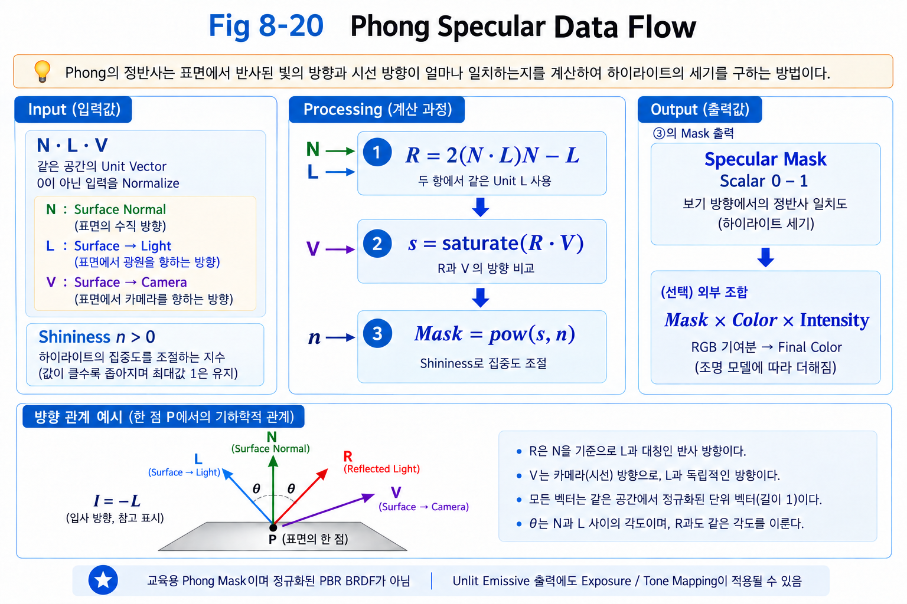

**Figure 8-20. Phong Specular의 기본 Data Flow**

```text
Light Direction
      ↓
Reflection Vector (R)
      ↓
View Direction (V)과 비교
      ↓
Specular Highlight
```

이 흐름에서 중요한 것은 Reflection Vector `R`을 먼저 알아야 한다는 것이다.

따라서 Phong Specular를 실제로 구현하기 위한 첫 번째 질문은 다음과 같다.

> **빛이 Surface에 들어왔을 때, 어느 방향으로 Reflection되는가?**

이 질문에 답하기 위해 다음 절에서는 **Reflection Vector `R`**을 하나씩 만들어 본다.

---

### Defining the Light Direction

Reflection Vector를 계산하기 전에 먼저 **Light Direction `L`의 방향을 명확하게 정의해야 한다.**

Vector는 단순히 Light의 위치를 나타내는 값이 아니라, 특정 지점에서 다른 지점을 향하는 **방향 정보**로 사용된다.

ASF에서는 `L`을 다음과 같이 정의한다.

> **`L`은 Surface에서 Light Source를 향하는 방향이다.**

즉, 하나의 Surface Point를 기준으로 광원을 바라보는 방향이다.

```text
Surface Point ─────────→ Light Source
             L
```

여기서 중요한 것은 `L`이 **빛이 실제로 이동하는 방향을 의미하지 않는다는 것**이다.

실제 빛은 Light Source에서 Surface를 향해 이동한다.

```text
Light Source ─────────→ Surface
       실제 빛의 진행 방향
```

하지만 ASF에서 Lighting 계산에 사용하는 `L`은 그 반대 방향인 **Surface → Light**로 정의한다.

```text
Light Source
      ●
      ↑
      │ L
      │
      ● Surface Point
```

따라서 `L`은 다음과 같이 기억하는 것이 가장 정확하다.

> **`L = Surface → Light`**

이 방향 정의를 이후의 Reflection 계산 전체에서 일관되게 사용한다.

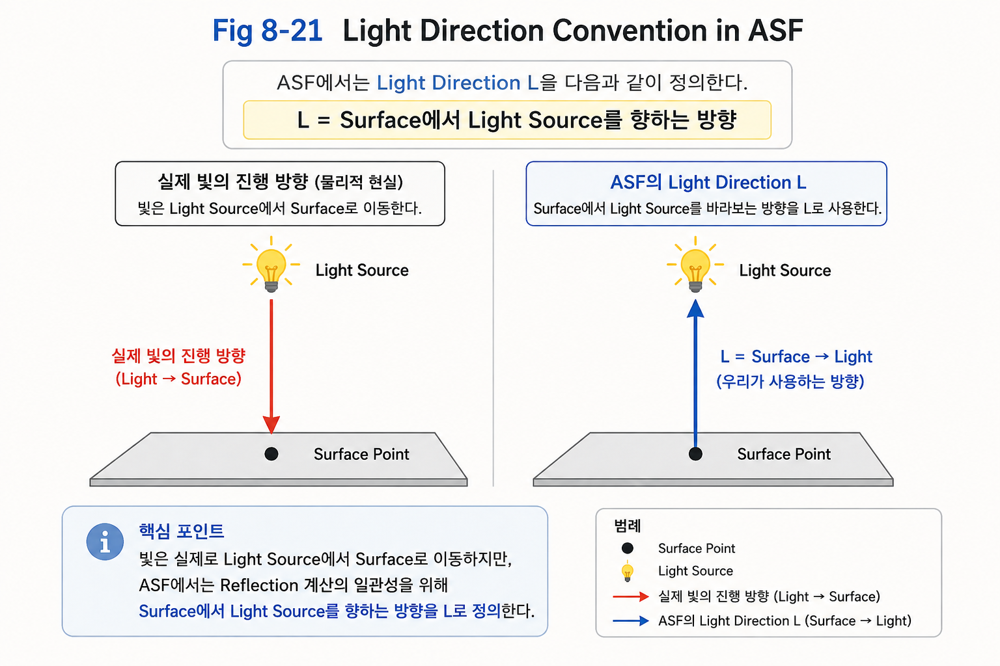

**Figure 8-21. ASF에서 정의하는 Light Direction `L`**

---

#### Why Do We Define `L` This Way?

Reflection을 계산하기 위해서는 Surface에서 바라본 Light의 방향이 필요하다.

Surface의 한 점을 기준으로 보면 Light Source가 어느 방향에 있는지를 Vector로 표현할 수 있다.

이때 Surface의 방향을 나타내는 **Surface Normal `N`**과 Light를 바라보는 **Light Direction `L`**을 함께 사용하면 두 방향의 관계를 살펴볼 수 있다.

```text
             Light Source
                  ●
                   ↗
                 ↗ L
               ↗
              ● Surface Point
              ↑
              │ N
              │
           Surface
```

여기서 각각의 의미는 다음과 같다.

- `L` : Surface에서 Light Source를 향하는 방향
- `N` : Surface가 향하고 있는 방향인 Surface Normal

이제 중요한 것은 `L`과 `N`이 서로 어떤 방향을 향하고 있는가이다.

```text
                L
                 ↗
               ↗
             ↗
            ●
            ↑
            │ N
```

두 Vector가 같은 방향에 가까울수록 Light는 Surface를 정면에 가깝게 비춘다.

반대로 두 Vector가 서로 직각에 가까워질수록 Light는 Surface를 비스듬하게 비추게 된다.

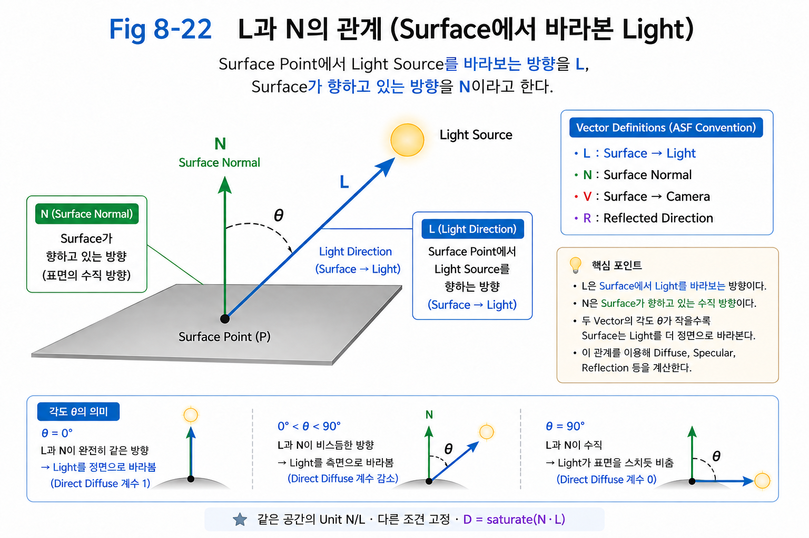

**Figure 8-22. Surface에서 바라본 `L`과 Surface Normal `N`의 관계**

---

#### Common Coordinate Space for L and N

`L`과 `N`의 방향 관계를 계산하려면 두 Vector가 **같은 Coordinate Space**에 정의되어 있어야 한다.

예를 들어 하나의 Vector가 World Space에 있고 다른 Vector가 Tangent Space에 있다면, 두 Vector의 숫자를 그대로 비교할 수 없다.

따라서 Reflection 계산에서는 먼저 `L`과 `N`을 동일한 공간에서 사용할 수 있도록 준비해야 한다.

```text
L → Same Coordinate Space
N → Same Coordinate Space
           ↓
       Compare
```

이것이 중요한 이유는 이후 두 Vector의 방향 관계를 계산할 때, 서로 같은 Coordinate Space를 기준으로 비교해야 하기 때문이다.

서로 다른 공간의 Vector를 비교하면 그 결과는 실제 Surface와 Light의 관계를 올바르게 나타내지 못한다.

ASF에서는 이후 Reflection 계산에서 사용할 `L`과 `N`을 같은 공간의 Vector로 취급한다.

---

#### The Relationship Between `L` and `N`

`L`과 `N`이 이루는 각도를 `θ`라고 생각해보자.

```text
             L
            ↗
           ↗
          ↗
         ●
         ↑
         │ N
```

`θ`가 작다는 것은 `L`과 `N`의 방향이 서로 비슷하다는 뜻이다.

즉, Surface가 Light를 정면에 가깝게 바라보고 있는 상태이다.

반대로 `θ`가 커질수록 Light는 Surface를 더 비스듬한 방향에서 비추게 된다.

특히 두 Vector가 직각이 되는 경우,

```text
L ⟂ N
```

두 Vector의 방향은 서로 수직이 된다.

이처럼 `L`과 `N`의 각도는 Surface와 Light의 관계를 나타내는 중요한 정보가 된다.

하지만 아직 이 관계를 하나의 숫자로 표현하지는 않았다.

다음 절에서는 두 Vector의 방향 관계를 하나의 값으로 측정하기 위해 **Dot Product**를 사용한다.

---

#### ASF Vector Convention

이 절에서 정의한 Vector는 이후 Lighting 계산에서도 동일한 의미로 사용한다.

| Vector | Definition |
|--------|------------|
| `L` | Surface → Light |
| `N` | Surface Normal |
| `V` | Surface → Camera |
| `R` | Reflected Direction |

특히 `L`은 일반적인 "빛의 진행 방향"과 혼동하지 않아야 한다.

ASF에서 사용하는 `L`은 어디까지나 **Surface에서 Light Source를 향하는 방향**이다.

```text
L = Surface → Light
```

이 방향 정의가 정해졌기 때문에 이제 `L`과 `N`의 관계를 실제 계산으로 옮길 수 있다.

다음 절에서는 **Dot Product `L · N`**을 통해 이 방향 관계를 하나의 Scalar 값으로 측정한다.

---

### Measuring the Light-Normal Relationship

Reflection Vector를 만들기 위해서는 먼저 `L`과 `N`의 관계를 하나의 값으로 측정해야 한다.

앞 절에서 정의한 것처럼,

```text
L = Surface → Light
N = Surface Normal
```

두 Vector가 준비되었다면 이제 다음과 같은 질문을 할 수 있다.

> **Surface가 Light를 얼마나 정면으로 바라보고 있는가?**

예를 들어 Light가 Surface의 Normal 방향과 거의 같은 방향에 있다면 Surface는 Light를 정면으로 바라보고 있다.

반대로 Light가 Surface에 비스듬히 위치할수록 두 방향의 차이가 커진다.

따라서 필요한 것은 단순히 두 Vector가 존재한다는 사실이 아니라,

> **두 Vector의 방향이 얼마나 비슷한지를 하나의 값으로 측정하는 것**

이다.

#### Dot Product

두 Vector의 방향 관계를 하나의 숫자로 측정하기 위해 **Dot Product**를 사용한다.

`L`과 `N`은 모두 Vector이지만,

```text
L · N
```

의 결과는 하나의 **Scalar** 값이다.

즉,

```text
Vector + Vector
        ↓
   Dot Product
        ↓
     Scalar
```

Dot Product는 두 Vector가 얼마나 같은 방향을 향하고 있는지를 하나의 숫자로 표현한다.

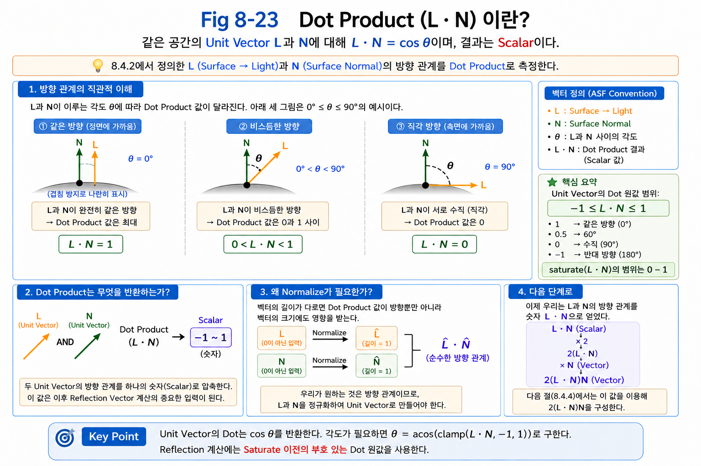

**Figure 8-23. Dot Product를 통한 두 Vector의 방향 관계 측정**

두 Vector의 길이가 모두 1인 **Unit Vector**라면 Dot Product는 다음과 같이 이해할 수 있다.

```text
L · N = cos θ
```

여기서 `θ`는 `L`과 `N`이 이루는 각도이다.

따라서 두 Vector의 방향에 따라 결과가 달라진다.

```text
같은 방향
θ = 0°
L · N = 1

        ↓

비슷한 방향
0° < θ < 90°
0 < L · N < 1

        ↓

직각
θ = 90°
L · N = 0
```

즉, `L · N`은 단순한 계산 결과가 아니라,

> **Light Direction과 Surface Normal이 얼마나 같은 방향을 향하고 있는지를 하나의 숫자로 측정한 값**

이라고 이해하면 된다.

---

#### Why Normalize?

Dot Product는 Vector의 방향뿐만 아니라 Vector의 길이에도 영향을 받는다.

일반적인 Dot Product는 다음과 같이 표현할 수 있다.

```text
L · N = |L| |N| cos θ
```

따라서 `L`과 `N`의 길이가 제각각이라면 결과에는 방향뿐만 아니라 Vector의 크기도 영향을 준다.

하지만 지금 우리가 알고 싶은 것은 Vector의 길이가 아니다.

우리가 필요한 것은 오직,

> **두 방향이 얼마나 비슷한가**

이다.

따라서 `L`과 `N`을 각각 Normalize하여 길이가 1인 **Unit Vector**로 만든다.

```text
L → Normalize → Unit L
N → Normalize → Unit N
```

그러면,

```text
|L| = 1
|N| = 1
```

이므로,

```text
L · N
= |L| |N| cos θ
= 1 × 1 × cos θ

∴ L · N = cos θ
```

가 된다.

이제 `L · N`은 Vector의 길이가 아니라 **두 Vector의 방향 관계만을 나타내는 값**이 된다.

---

#### Material Graph Implementation

이제 이 관계를 실제 Material Graph로 옮겨본다.

먼저 `LightDirection`을 Normalize하여 Unit Vector `L`을 만든다.

그리고 Surface의 `PixelNormalWS` 역시 Normalize하여 Unit Vector `N`으로 준비한다.

두 Vector를 **Dot Product**에 연결하면 두 방향의 관계가 하나의 Scalar 값으로 출력된다.

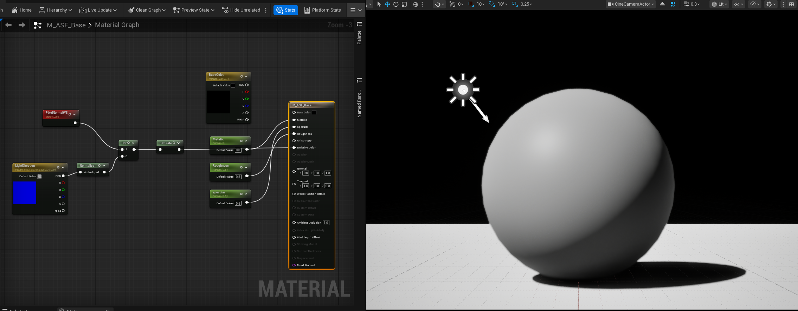

**Figure 8-10. Dot 계산을 표시한 기존 Material Graph.** 화면에서는 `LightDirection`만 명시적으로 Normalize되고 `PixelNormalWS`는 Dot에 직접 연결되어 있다. Dot 뒤의 Saturate 출력은 `[0,1]` 시각화용 값이며, Reflection Vector 구성에 필요한 부호 있는 `L · N` 원값 `[-1,1]`과 구분한다. 아래 구현 계약에서는 두 입력을 같은 공간의 Unit Vector로 준비하고 Reflection 계산에 Saturate 이전 값을 사용한다. 오른쪽 Lit 결과에는 조명과 화면 변환이 포함되므로 수치 검증 자료로 사용하지 않는다. 현재 계약을 명확히 보여주는 Graph와 통제된 Debug 출력의 재촬영이 필요하다.

Graph에서는 `LightDirection`과 Surface Normal을 각각 Normalize한 뒤 **Dot Product**에 연결한다.

```text
LightDirection
      ↓
   Normalize
      ↓
       L
        \
         \
      Dot Product
         /
        /
       N
      ↑
   Normalize
      ↑
PixelNormalWS

        ↓

      L · N
        ↓
     Scalar
```

여기서 중요한 점은 **Dot Product의 출력은 Vector가 아니라 Scalar**라는 것이다.

`L`과 `N`이라는 두 Vector의 방향 관계를 계산하여 하나의 숫자값으로 압축한다.

현재까지의 흐름을 정리하면 다음과 같다.

```text
Light Direction (L)
        ↓
    Normalize
        │
        ├────────────┐
        │            │
        │        Dot Product
        │            │
Surface Normal (N)   │
        ↓            │
    Normalize ───────┘
                     ↓
                  L · N
                     ↓
                Scalar 값
```

이제 Reflection Vector를 구성하기 위한 첫 번째 계산이 완료되었다.

```text
L · N
```

하지만 이것만으로는 아직 Reflection Vector가 아니다.

`L · N`은 Scalar이기 때문에, 다음 단계에서는 이 값을 Surface Normal `N`과 결합하여 **Vector 형태의 값**을 만들어야 한다.

그 첫 번째 단계가 다음과 같다.

```text
L · N
  ↓
× 2
  ↓
2(L · N)
```

다음 절에서는 왜 `L · N`에 `2`를 곱하고, 그 결과에 다시 `N`을 곱하는지 살펴본다.

---

```text
L · N
  ↓
2(L · N)
  ↓
2(L · N)N
```

이 과정을 통해 Reflection Vector를 구성하는 핵심 요소를 하나씩 만들어 간다.

---

### Building the Reflection Vector

앞 절에서는 `L · N`을 통해 Light Direction `L`과 Surface Normal `N`이 얼마나 같은 방향을 향하고 있는지를 측정했다.

이제 이 관계를 이용하여 **Reflection Vector `R`**을 만들어야 한다.

Reflection Vector는 Light가 Surface에 도달했을 때, Surface의 Normal을 기준으로 **어느 방향으로 반사되는지를 나타내는 Vector**이다.

---

#### From Light-Normal Relationship to Reflection

앞에서 계산한 결과는 다음과 같다.

```text
L · N
```

이 값은 두 Vector의 방향 관계를 나타내는 **Scalar**다.

```text
L · N
  ↓
Scalar
```

하지만 Reflection Vector를 만들기 위해서는 Scalar 값만으로는 충분하지 않다.

Reflection 방향을 구성하기 위해서는 이 Scalar가 **Surface Normal 방향에서 얼마나 떨어져 있는지를 나타내는 Vector 성분**으로 변환되어야 한다.

따라서 `L · N`에 다시 `N`을 곱한다.

```text
(L · N)N
```

여기서 두 부분은 서로 다른 역할을 한다.

```text
L · N
→ L이 N 방향으로 얼마나 향하고 있는지를 나타내는 Scalar

(L · N)N
→ 그 크기를 N 방향의 Vector로 만든 것
```

즉,

> **`(L · N)N`은 Light Direction `L`을 Surface Normal `N` 방향으로 투영한 Vector이다.**

---

#### Projecting L onto N

Vector `L`은 하나의 방향으로만 생각할 수도 있지만, Reflection을 이해하기 위해서는 `N`을 기준으로 성분을 나누어 생각할 수 있다.

```text
L = L_parallel + L_perpendicular
```

여기서 `L_parallel`은 Surface Normal `N`과 같은 방향의 성분이고, `L_perpendicular`는 그에 수직인 성분이다.

앞에서 계산한 `(L · N)N`이 바로 이 Normal 방향 성분이다.

```text
L_parallel = (L · N)N
```

개념적으로 보면 다음과 같다.

```text
             L
            ↗
           /
          /
         ●
         │
         │  L의 Normal 방향 성분
         │
         ↑
         N
```

따라서 지금까지의 계산은 다음과 같은 의미를 가진다.

```text
L
↓
L · N
↓
Normal 방향 성분의 크기
↓
(L · N)N
↓
Normal 방향의 Vector 성분
```

이제 Reflection을 만들기 위한 핵심적인 Vector가 준비되었다.

---

#### Why Multiply by 2?

다음 단계에서는 `(L · N)N`에 `2`를 곱한다.

```text
2(L · N)N
```

처음 보면 단순히 값을 두 배로 만드는 계산처럼 보이지만, 여기서 `2`는 Reflection Geometry를 구성하기 위해 필요한 의미를 가진다.

Reflection은 Surface의 Normal을 기준으로 Light Direction을 **반대편으로 대칭시키는 과정**이다.

Normal 방향 성분을 기준으로 생각하면, 기존 Vector의 Normal 방향 성분을 기준으로 반대편에 같은 거리만큼 이동해야 한다.

따라서 Normal 방향 성분을 한 번 더 이동시키는 효과가 필요하다.

```text
(L · N)N
      ↓
2(L · N)N
```

즉,

> **`2`는 Normal 방향의 투영 성분을 Reflection 방향으로 대칭시키기 위해 필요한 두 배의 이동을 만든다.**

이를 Vector 성분으로 표현하면 Reflection Vector는 다음과 같은 형태가 된다.

```text
R = 2L_parallel - L
```

앞에서 정의한 것처럼

```text
L_parallel = (L · N)N
```

이므로,

```text
R = 2(L · N)N - L
```

이 된다.

---

#### Constructing the Reflection Vector

이제 각 단계가 하나의 흐름으로 연결된다.

```text
L · N
  ↓
Normal 방향 성분의 크기
  ↓
× N
  ↓
(L · N)N
  ↓
Normal 방향의 Vector 성분
  ↓
× 2
  ↓
2(L · N)N
  ↓
- L
  ↓
Reflection Vector R
```

여기서 마지막으로 `L`을 빼는 이유는 Reflection Vector를 완성하기 위해 원래의 Light Direction을 기준으로 Normal 방향 성분을 반대편으로 이동시키기 위해서다.

결과적으로 다음과 같은 Reflection Vector를 얻는다.

```text
R = 2(L · N)N - L
```

이 공식은 단순히 외워야 하는 식이 아니라, 앞에서 살펴본 Vector의 관계를 하나의 식으로 정리한 것이다.

```text
L
↓
L · N
↓
N 방향으로 투영
↓
(L · N)N
↓
Normal 방향으로 두 배 이동
↓
2(L · N)N
↓
원래 L을 기준으로 정리
↓
R
```

---

#### Material Graph Implementation

이제 이 과정을 Material Graph에서 구현한다.

`PixelNormalWS`에서 Surface Normal `N`을 가져오고, `LightDirection`에서 Light Direction `L`을 가져온다.

먼저 두 Vector를 **Dot Product**에 연결하여 `L · N`을 계산한다.

그 다음 이 Scalar에 `2`를 곱하고 다시 `N`과 곱하여 `2(L · N)N`을 구성한다.

마지막으로 원래의 `L`을 빼면 Reflection Vector `R`이 완성된다.

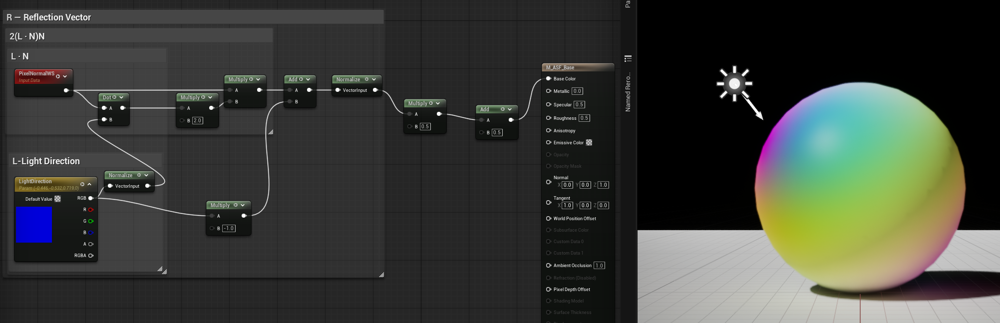

**Figure 8-14. Reflection Vector를 표시한 기존 Graph — 입력 분기 수정 후 재촬영 필요.** 캡처는 Dot에는 Normalize된 L을 사용하지만 `−L` 항에는 Normalize 이전 입력을 사용한다. 올바른 `R = 2(L·N)N − L`은 두 항에서 같은 Unit L을 사용해야 하며 마지막 Normalize만으로 이 오류를 일반적으로 복구할 수 없다. `0.5R + 0.5`는 RGB Debug 표시용 변환이지 Reflection 계산이나 최종 Highlight가 아니다. Base Color로 연결된 Lit 결과에는 조명과 화면 변환이 추가되므로 방향값의 직접 검증 자료로 해석하지 않는다.

Material Graph의 전체 구조는 다음과 같이 읽을 수 있다.

```text
Pixel Normal N
      │
      ├──────────────┐
      │              │
      ↓              │
    L · N            │
      ↓              │
     × 2             │
      ↓              │
      ├─────── × N ──┘
      ↓
2(L · N)N
      ↓
     - L
      ↓
Reflection Vector R
```

이제 Surface에서 Light가 반사되는 방향을 나타내는 `R`을 얻었다.

중요한 것은 여기까지의 계산이 **Specular Highlight 자체를 만드는 과정은 아니라는 것**이다.

지금까지 계산한 것은 어디까지나,

> **Light가 Surface에서 반사되었을 때 어느 방향으로 향하는가?**

를 구하는 과정이다.

이제 이 Reflection Vector `R`이 실제로 Camera를 향하고 있는지를 확인해야 한다.

다음 절에서는 Reflection Vector `R`과 **View Direction `V`**를 비교하여 Specular Highlight가 나타날 조건을 살펴본다.

---

### Comparing Reflection and View Directions

앞 절에서는 Surface에서 Reflection된 빛의 방향을 나타내는 **Reflection Vector `R`**을 완성했다.

```text
R = 2(L · N)N - L
```

하지만 `R`을 계산했다고 해서 아직 Specular Highlight가 만들어지는 것은 아니다.

Phong Specular에서 중요한 것은 Reflection된 빛이 **Camera 방향과 얼마나 가까운가**이다.

따라서 이제 Surface에서 Camera를 향하는 **View Direction `V`**를 정의하고, `R`과 `V`의 관계를 비교한다.

---

#### View Direction

`V`는 Surface Point에서 Camera를 향하는 방향이다.

```text
V = Surface → Camera
```

개념적으로 나타내면 다음과 같다.

```text
              Camera
                 ●
                ↗
              ↗ V
            ↗
           ● Surface
```

여기서 `V` 역시 Direction Vector이므로 Reflection Vector `R`과 같은 Coordinate Space에서 비교해야 한다.

앞 절에서 계산한 `R`과 함께 보면 다음과 같다.

```text
             Camera
                ●
               ↗ V
             ↗
            ● Surface
             ↗
           R
          ↗
```

Specular Highlight가 강하게 나타나기 위해서는 Reflection된 빛의 방향 `R`이 Camera 방향 `V`와 가까워야 한다.

즉,

> **`R`과 `V`가 같은 방향을 향할수록 Specular Response가 강해진다.**

반대로 두 방향의 차이가 커질수록 Camera가 Reflection된 빛을 직접 바라보지 못하게 되므로 Specular Response는 약해진다.

---

#### Measuring the Reflection-View Relationship

`R`과 `V`가 얼마나 가까운 방향을 향하고 있는지를 측정하기 위해 앞에서 사용했던 **Dot Product**를 다시 사용한다.

```text
R · V
```

두 Vector가 Unit Vector라면,

```text
R · V = cos θ
```

로 이해할 수 있다.

여기서 `θ`는 Reflection Vector `R`과 View Direction `V`가 이루는 각도이다.

따라서 결과는 다음과 같은 관계를 갖는다.

```text
R과 V가 같은 방향
θ = 0°
R · V = 1

        ↓

R과 V의 방향 차이가 증가
0° < θ < 90°
0 < R · V < 1

        ↓

서로 직각
θ = 90°
R · V = 0
```

즉, `R · V`는

> **Reflection된 빛이 Camera 방향과 얼마나 가까운지를 나타내는 Scalar 값**

이 된다.

---

#### Material Graph Implementation

이제 실제 Material Graph에서 `R`과 `V`를 비교한다.

앞 절에서 완성한 Reflection Vector `R`을 준비하고, Surface에서 Camera를 향하는 View Direction `V`를 준비한다.

두 Vector를 **Dot Product**에 연결하면 하나의 Scalar 값이 출력된다.

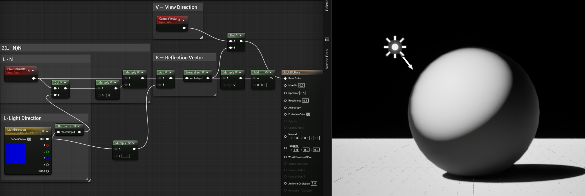

**Figure 8-15. R·V를 Base Color에 연결한 기존 Material Graph — 재촬영 필요.** 실제 이미지에서는 위쪽 Dot 출력이 Base Color로 연결되며, `0.5R + 0.5` Add 출력은 연결되지 않았다. 다만 Fig8_14와 같은 정규화 전/후 L 혼용 오류가 남아 있으므로 이 R을 올바른 Reflection Vector로 간주하지 않는다. 동일 Unit L 분기와 Unit N/V를 확인한 뒤 다시 촬영해야 한다. 오른쪽 Lit 결과는 조명과 화면 변환이 포함되어 부호 있는 R·V 원값의 직접 표시가 아니다.

Graph의 핵심 흐름은 다음과 같다.

```text
Reflection Vector (R)
          │
          │
          ├────────────┐
          │            │
          │        Dot Product
          │            │
          │            │
View Direction (V) ────┘
                       ↓
                     R · V
                       ↓
                    Scalar
```

여기서도 Dot Product의 결과는 Vector가 아니라 **Scalar**이다.

앞에서 `L · N`을 통해 Light와 Surface Normal의 방향 관계를 측정했다면,

이번에는 `R · V`를 통해 **Reflection과 Camera의 방향 관계**를 측정한다.

두 계산은 서로 다른 단계에서 같은 원리를 사용한다.

```text
L · N
  ↓
Light와 Surface의 관계
  ↓
Reflection Vector R 생성


R · V
  ↓
Reflection과 Camera의 관계
  ↓
Specular Response 계산
```

따라서 지금까지의 Phong Specular 흐름은 다음과 같이 연결된다.

```text
Light Direction L
        ↓
     L · N
        ↓
  2(L · N)N
        ↓
   2(L · N)N - L
        ↓
Reflection Vector R
        ↓
      R · V
        ↑
View Direction V
        ↓
   Specular Response
```

여기서 `R · V`는 아직 최종 Specular Highlight의 모양을 결정하지 않는다.

현재 얻은 값은 단순히 **Reflection과 View가 얼마나 가까운지를 나타내는 Scalar**이다.

이 값을 그대로 사용하면 방향에 따른 Response만 얻을 수 있지만, 실제 Phong Specular에서는 이 값을 더 조절하여 Highlight의 크기와 집중도를 결정한다.

다음 단계에서는 `R · V`에 **Power**를 적용하여 Specular Highlight의 집중도를 조절한다.

---

### Controlling Specular Highlight with Power

앞 절에서는 Reflection Vector `R`과 View Direction `V`의 관계를 **Dot Product**로 계산했다.

```text
R · V
```

이 값은 Reflection된 빛이 Camera 방향과 얼마나 가까운지를 나타낸다.

두 방향이 거의 같으면 `R · V`는 `1`에 가까워지고, 방향 차이가 커질수록 값은 작아진다.

하지만 `R · V`를 그대로 사용하면 Specular Highlight의 형태를 충분히 조절하기 어렵다.

예를 들어 표면이 매우 매끄러운 재질과 거친 재질은 모두 Reflection 방향과 Camera 방향의 관계를 이용하지만, 실제로 나타나는 Highlight의 크기와 선명도는 크게 다르다.

따라서 `R · V`에 **Power**를 적용하여 이 값을 조절한다.

---

#### Applying Power

`Power`는 입력된 값을 특정 **Exponent**로 거듭제곱하는 연산이다.

Phong Specular에서는 다음과 같은 형태로 표현할 수 있다.

```text
Specular = pow(saturate(R · V), n)
```

여기서 `n`은 0보다 큰 **Exponent**이며 Highlight의 집중도를 결정한다. Power 전에 Dot Product를 0–1로 제한하여 음수 입력과 비정수 지수의 문제를 피한다.

중요한 것은 Power가 새로운 방향을 계산하는 것이 아니라는 점이다.

이미 계산한 `R · V`의 값을 **Exponent를 이용해 재분배**하는 것이다.

```text
R · V
  ↓
Power
  ↓
pow(saturate(R · V), n)
  ↓
Specular Response
```

`R · V`가 `0~1` 범위의 값이라고 생각하면 Exponent의 변화가 결과에 어떤 영향을 주는지 이해하기 쉽다.

예를 들어 `R · V = 0.5`라고 하면,

```text
0.5^1 = 0.5
0.5^2 = 0.25
0.5^4 = 0.0625
```

Exponent가 커질수록 `1`에 가까운 값은 상대적으로 유지되지만, `1`에서 조금만 떨어진 값은 빠르게 작아진다.

따라서 결과적으로 **Reflection 방향과 View 방향이 거의 일치하는 영역만 강하게 남게 된다.**

---

#### Exponent and Highlight Shape

이를 시각적으로 생각해보면 다음과 같다.

```text
낮은 Exponent
      ↓
더 넓은 범위의 R · V 값이 유지됨
      ↓
넓고 부드러운 Highlight


높은 Exponent
      ↓
1에 가까운 R · V 값만 강하게 유지됨
      ↓
좁고 집중된 Highlight
```

즉, Exponent는 Specular Highlight의 **크기와 집중도**를 조절한다.

```text
Exponent 증가
      ↓
Response 집중
      ↓
Highlight 좁아짐
      ↓
Highlight 선명해짐
```

반대로 Exponent가 낮으면 더 넓은 영역에서 Specular Response가 나타난다.

```text
Exponent 감소
      ↓
Response 분산
      ↓
Highlight 넓어짐
      ↓
Highlight 부드러워짐
```

---

#### Comparing Different Exponent Values

이 차이는 실제 Material Graph의 결과를 비교하면 더욱 명확하게 확인할 수 있다.

**Low Exponent**

낮은 Exponent에서는 `R · V`가 1에서 어느 정도 떨어져 있는 영역에서도 Response가 유지된다.

따라서 Specular Highlight가 넓게 나타난다.


**Figure 8-16. Exponent 8의 기존 표시 예시.** 보이는 계산은 `pow(saturate(R·V), 8)`이며 결과는 Lit Material의 Base Color에 연결되어 있다. 화면의 밝기는 Specular Mask 원값이 아니며 추가 조명과 화면 변환의 영향을 받는다. 잘린 R 입력 계산의 정확성이나 다른 Figure와의 통제 조건은 이 캡처만으로 검증할 수 없다. 올바른 Unit L/N/V와 Reflection 분기를 확인하고 같은 Camera·Exposure·출력 경로에서 Exponent만 바꾼 Debug 결과로 재촬영한다.

---

**Medium Exponent**

Exponent를 높이면 `1`에 가까운 `R · V` 값이 더 강조된다.

그 결과 Highlight의 범위가 줄어들고 더욱 집중된다.

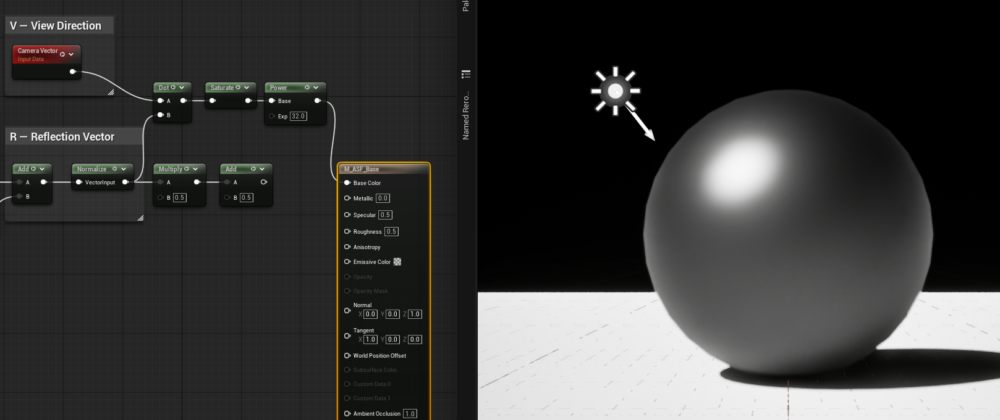

**Figure 8-17. Exponent 32의 기존 표시 예시.** `pow(saturate(R·V), 32)`가 Lit Material의 Base Color로 연결되어 있으며, 기존 Material의 Specular 값도 남아 있다. 화면 밝기를 Phong Mask 단독 결과로 해석하지 않는다. Fig8_16과 함께 올바른 R 입력을 확인한 뒤 Camera·Exposure·출력 경로를 고정하고 Exponent만 바꿔 재촬영한다. 잘린 입력부와 사용하지 않는 RGB remap 경로는 검증 범위와 구분한다.

---

**High Exponent**

Exponent를 더욱 높이면 `R · V`가 `1`에 가까운 매우 좁은 영역만 강하게 남는다.

따라서 Highlight가 작고 날카롭게 집중된다.

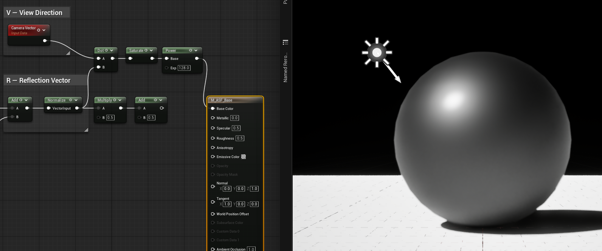

**Figure 8-18. Exponent 128의 기존 표시 예시.** `pow(saturate(R·V), 128)`는 좁은 Mask를 만들지만 이 화면은 Lit Base Color와 기존 Specular 반응을 포함한다. 넓게 남은 밝기까지 Power의 결과로 해석하지 않는다. Fig8_16/17과 함께 정확한 R 입력을 확인하고 같은 Camera·Exposure·출력 경로에서 Exponent 8/32/128만 바꾸어 재촬영한다.

---

#### Exponent and Material Appearance

세 결과를 비교하면 Exponent가 Specular Highlight의 형태에 직접적인 영향을 주는 것을 확인할 수 있다.

```text
Low Exponent
     ↓
넓은 Highlight
     ↓
부드러운 Appearance


Medium Exponent
     ↓
중간 정도의 Highlight
     ↓
일반적인 Glossy Appearance


High Exponent
     ↓
좁은 Highlight
     ↓
날카롭고 집중된 Appearance
```

따라서 Exponent는 단순히 Specular의 밝기를 조절하는 값이 아니다.

**Reflection 방향과 View 방향이 얼마나 가까운 영역을 Highlight로 남길 것인지**, 즉 Specular Response의 **집중도와 분포**를 결정한다.

이를 하나의 흐름으로 정리하면 다음과 같다.

```text
Reflection Vector R
        ↓
View Direction V
        ↓
      R · V
        ↓
     Power
        ↓
   Exponent 적용
        ↓
Specular Response
        ↓
Highlight의 크기와 집중도 결정
```

최종적으로 Phong Specular에서 Exponent는 다음과 같은 역할을 한다.

> **Exponent가 낮을수록 넓고 부드러운 Highlight가 나타나고, 높을수록 좁고 날카로운 Highlight가 나타난다.**

이제 `R · V`와 Exponent를 이용해 Specular Response를 만들 수 있게 되었다.

다음 단계에서는 이 Mask에 Color와 Intensity를 적용해 Unlit Material의 최종 Color에 합성한다.

---

### Completing the Phong Specular Response

앞 절에서는 `R · V`에 **Power**를 적용하여 Specular Response의 집중도를 조절했다.

```text
R · V
  ↓
Power
  ↓
pow(saturate(R · V), n)
```

이제 계산된 값은 Reflection과 View의 관계를 기반으로 만들어진 **Specular Response**이다.

하지만 이 값 자체가 화면에 바로 Highlight로 출력되는 것은 아니다.

이 결과는 직접 계산한 Highlight Mask이다. Lit Material의 **Specular Property Pin**은 Renderer BRDF의 재질 Parameter이므로 계산 완료된 Highlight를 그대로 전달하는 출력 Pin이 아니다. ASF의 Unlit 경로에서는 Mask·Color·Intensity를 Final Color에 더한 뒤 Emissive Color로 출력한다.

---

#### From Specular Response to Material Input

현재까지 계산한 결과를 하나의 값으로 정리하면 다음과 같다.

```text
pow(saturate(R · V), n)
```

이 값은 다음과 같은 의미를 가진다.

> **Reflection된 빛이 Camera 방향과 얼마나 가까운지를 Exponent에 따라 조절한 Specular Response**

값이 높을수록 해당 Surface Point에서 Specular Response가 강하게 나타나고, 값이 낮을수록 약해진다.

Mask에 SpecularColor와 SpecularIntensity를 곱하면 Vector3 Specular Contribution이 된다. 이 기여를 다른 Branch와 합성한다.

```text
Reflection Vector R
        ↓
      R · V
        ↓
      Power
        ↓
    pow(saturate(R · V), n)
        ↓
Specular Response
        ↓
Specular Contribution → Unlit Final Color
        ↓
Final Shading
```

이제 우리가 앞에서 단계별로 만들었던 계산이 하나의 완전한 Data Flow로 연결된다.

---

#### Connecting the Specular Response

Material Graph에서는 Specular Response를 SpecularColor·SpecularIntensity와 곱하고 Base/Rim 등의 결과와 Add한다. Material의 Shading Model은 Unlit이며 최종 Color는 Emissive Color로 전달한다. Viewport Lit 모드와 Unlit Shading Model을 구분한다.

이 과정에서 중요한 것은 **Specular Highlight가 별도의 새로운 현상으로 추가되는 것이 아니라**, 앞에서 계산한 방향 관계의 결과가 최종 Shading에 반영되는 것이라는 점이다.

즉,

```text
Light
 ↓
L
 ↓
L · N
 ↓
Reflection Vector R
 ↓
R · V
 ↓
Power
 ↓
Specular Response
 ↓
Specular Contribution → Unlit Final Color
```

이라는 하나의 흐름으로 이해할 수 있다.

최종적으로 실제 Material Graph에서는 다음과 같이 구성된다.

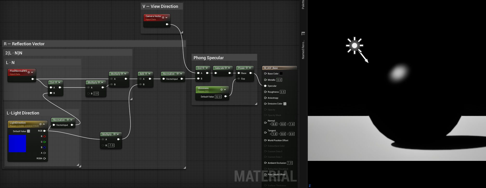

이 Figure의 기존 Lit/Specular Pin 연결은 위에서 정의한 Unlit Color 합성과 구분한다. 직접 계산한 Phong Response를 Lit Specular Property에 연결한 모습이 있다면 현재 최종 Architecture의 근거로 사용하지 않는다. 수정된 Data Flow는 Mask × Color × Intensity → Final Color 합성이다.

**Figure 8-19. 기존 Lit Specular Pin 연결 예시 — 현재 ASF 최종 합성의 증거가 아님.** 현재 캡처에는 정규화 전 L을 `−L` 항에 사용하는 오류도 남아 있다. 두 Reflection 항에서 동일 Unit L을 사용하도록 수정하고, `Mask × Color × Intensity`를 Unlit Final Color에 합성한 실제 Graph와 결과로 재촬영한다. Lit Specular Property를 조절하는 것과 사용자 Phong Response를 직접 출력하는 것은 구분한다.

이제 Material Graph 안에서 계산된 Specular Response가 실제 Surface의 Shading에 반영된다.

---

#### The Complete Phong Specular Flow

지금까지 구현한 전체 과정을 다시 연결하면 다음과 같다.

```text
Light Direction L
        ↓
     Normalize
        ↓
Surface Normal N
        ↓
     Normalize
        ↓
      L · N
        ↓
     × 2
        ↓
   2(L · N)
        ↓
       × N
        ↓
   2(L · N)N
        ↓
      - L
        ↓
Reflection Vector R
        ↓
      R · V
        ↓
      Power
        ↓
    pow(saturate(R · V), n)
        ↓
Specular Response
        ↓
Specular Contribution → Unlit Final Color
        ↓
Final Shading
```

이 흐름에서 각각의 단계는 서로 다른 역할을 가진다.

```text
L · N
→ Light와 Surface의 방향 관계 측정

2(L · N)N - L
→ Reflection Vector R 구성

R · V
→ Reflection과 Camera의 방향 관계 측정

Power
→ Specular Highlight의 집중도 조절

Specular Contribution → Unlit Final Color
→ 계산된 Response를 최종 Shading에 반영
```

따라서 Phong Specular를 단순히 하나의 공식으로 외우기보다는,

> **Light와 Surface의 관계를 측정하고 → Reflection 방향을 만들고 → Camera와 비교하고 → 그 결과의 집중도를 조절하여 → 최종 Material에 반영하는 과정**

으로 이해하는 것이 중요하다.

---

#### From Theory to Material Graph

처음에는 Phong Specular가 하나의 수식처럼 보일 수 있다.

```text
Specular = pow(saturate(R · V), n)
```

하지만 실제 구현에서는 이 식을 한 번에 입력하는 것이 아니라, 각각의 의미를 가진 여러 단계로 분해한다.

```text
        Light
          ↓
          L
          ↓
       L · N
          ↓
   Reflection R
          ↓
        R · V
          ↓
        Power
          ↓
 Specular Response
          ↓
 Specular Contribution → Unlit Final Color
```

이렇게 보면 Material Graph의 각 Node는 단순히 공식을 구현하기 위한 부품이 아니다.

각 Node는 **Lighting 현상을 설명하는 하나의 개념**을 담당한다.

- `Normalize` → 방향만 비교하기 위한 준비
- `Dot Product` → 두 방향의 관계 측정
- `Multiply` → Reflection Geometry 구성
- `Subtract` → Reflection 방향 완성
- `Power` → Highlight의 집중도 조절
- `Multiply / Add` → Mask에 Color·Intensity를 적용하고 Final Color에 합성

따라서 Shader Graph를 이해할 때는 Node를 먼저 외우기보다,

> **"지금 이 값은 무엇을 의미하고, 다음 단계에서 왜 필요한가?"**

를 따라가는 것이 중요하다.

이것이 ASF에서 Material Graph를 구성할 때 사용하는 기본적인 접근 방식이다.

---

### MF_Specular as an Implementation Unit

앞 단계에서는 Phong Specular의 계산 과정을 이해하기 위해 `M_ASF_Base` Material 내부에서 Node를 직접 구성했다.

이 과정의 목적은 단순히 최종 Highlight를 얻는 것이 아니라,

- Light Direction
- Surface Normal
- View Direction
- Reflection Vector
- Shininess

이 서로 어떤 관계를 가지며 Specular Highlight를 만드는지 직접 확인하는 것이었다.

이제 계산 원리와 결과가 검증되었으므로, 동일한 계산을 ASF의 Module Architecture에 맞게 독립적인 Material Function으로 분리한다.

새로운 Material Function의 이름은 다음과 같다.

~~~text
MF_Specular
~~~

---

#### Function Responsibility

`MF_Specular`의 역할은 최종 Specular Color를 만드는 것이 아니다.

핵심 역할은

> 현재 Surface에서 Phong Specular Highlight가 얼마나 강하게 나타나는지를 나타내는 Mask를 계산하는 것

이다.

따라서 Function의 Output은 최종 Color가 아니라

~~~text
SpecularMask
~~~

로 정의한다.

이렇게 하면 Specular 계산과 최종 색상 표현을 서로 분리할 수 있다.

~~~text
MF_Specular
↓
SpecularMask

SpecularMask
×
SpecularColor
×
SpecularIntensity
↓
Specular Contribution
~~~

`MF_Specular`는 Highlight가 생성될 영역과 강도를 계산하고,

최종 Color와 Intensity는 Master Material에서 조합한다.

---

#### Function Inputs

`MF_Specular`는 다음 네 가지 Input을 사용한다.

~~~text
Normal
→ Vector3

LightDirection
→ Vector3

ViewDirection
→ Vector3

Shininess
→ Scalar
~~~

`Normal`은 현재 Surface의 방향을 나타낸다.

`LightDirection`은 현재 Surface에서 Light 방향을 나타낸다.

`ViewDirection`은 현재 Surface에서 Camera를 향하는 방향이다.

`Shininess`는 0보다 큰 값으로 설정한다. Color와 Intensity는 이 Function의 Input이 아니며 Master Material에서 곱한다. Normal/LightDirection/ViewDirection은 같은 Space의 비영 Vector여야 한다.

---

#### Normalized Direction Inputs

Phong Specular 계산에서는 Dot Product를 이용하여 여러 방향 Vector 사이의 각도 관계를 계산한다.

Dot Product가 순수한 방향 관계를 나타내려면 입력 Vector의 길이가 `1`인 상태여야 한다.

따라서 `MF_Specular` 내부에서는 다음 세 Vector를 먼저 Normalize한다.

~~~text
N = Normalize(Normal)

L = Normalize(LightDirection)

V = Normalize(ViewDirection)
~~~

이렇게 하면 Function 외부에서 전달되는 Vector의 길이에 영향을 받지 않고 방향 관계만 사용할 수 있다.

또한 한 번 Normalize한 Vector는 이후 계산 전체에서 동일하게 재사용한다.

이는 Dot Product에는 Normalize된 Vector를 사용하면서 다른 계산에서는 원본 Vector를 사용하는 식의 불일치를 방지하기 위해 중요하다.

---

#### Reflection Vector Calculation

Phong Specular에서는 Light Direction이 Surface Normal을 기준으로 반사된 방향을 계산한다.

Reflection Vector `R`은 다음과 같이 표현할 수 있다.

~~~text
R = 2(L · N)N - L
~~~

계산 흐름은 다음과 같다.

~~~text
L · N
↓
× 2
↓
× N
↓
- L
↓
Reflection Vector
~~~

이를 Node 구조로 풀어보면 다음과 같다.

~~~text
Normalized LightDirection
+
Normalized Normal
↓
Dot Product
↓
× 2
↓
× Normal
↓
+ (-LightDirection)
↓
Normalize
↓
Reflection Vector R
~~~

Reflection Vector 역시 이후 `ViewDirection`과의 각도 관계를 계산하기 전에 Normalize한다.

---

#### Reflection and View Alignment

Reflection Vector를 얻은 뒤에는 이 방향이 Camera 방향과 얼마나 일치하는지를 계산한다.

~~~text
R · V
~~~

Camera가 Reflection Vector 방향과 가까워질수록 Dot Product 값은 `1`에 가까워진다.

반대로 두 방향이 멀어질수록 값은 작아진다.

이 결과를 `Saturate`로 `0~1` 범위에 제한한 뒤 `Power`를 적용한다.

~~~text
SpecularMask
=
Pow(
    Saturate(R · V),
    Shininess
)
~~~

`Shininess` 값이 커질수록 중간 영역의 값이 빠르게 줄어들기 때문에 Highlight가 더 좁고 집중된 형태로 나타난다.

---

#### Function Data Flow

**Hemisphere Policy**

현재 Mask는 방향 정렬을 보여주는 Artistic Response이다. One-sided Direct Reflection으로 사용하려면 dot(N,L)>0 및 dot(N,V)>0 조건으로 Gate해야 한다. 현재의 ungated Mask가 뒤쪽 Light에서도 값을 만들 수 있음을 검증하고, Production용 물리적 Specular와 동일시하지 않는다. 이 Section의 기본 Interface와 이후 Final Framework는 동일한 Artistic Mask를 사용한다.

**Basic Validation**

N=(0,0,1), L=V=(0,0,1)이면 Mask=1이다. dot(R,V)=0.5에서 Shininess=2이면 0.25, 4이면 0.0625가 된다. Negative dot(R,V)는 Saturate 후 0이어야 한다. Color와 Intensity만 바꾸면 Mask는 그대로이고 Contribution만 변해야 한다. 표시 비교는 Fixed Exposure에서 수행한다.


최종적으로 `MF_Specular`는 다음 구조를 가진다.

~~~text
Normal
↓
Normalize
↓
N

LightDirection
↓
Normalize
↓
L

ViewDirection
↓
Normalize
↓
V


N + L
↓
L · N
↓
2(L · N)N - L
↓
Normalize
↓
Reflection Vector R

R + V
↓
Dot Product
↓
Saturate
↓
Power(Shininess)
↓
SpecularMask
~~~

즉 Function의 Input과 Output은 다음처럼 정리된다.

~~~text
MF_Specular

Inputs
├─ Normal
├─ LightDirection
├─ ViewDirection
└─ Shininess

Output
└─ SpecularMask
~~~

---

#### From Direct Graph to Function

초기 구현에서는 Phong Specular 계산을 `M_ASF_Base` Material 내부에 직접 구성했다.

이 방식은 계산 과정을 하나씩 확인하고 Debug하기에는 적합하지만, 최종 ASF Master Material에서 여러 Rendering 기능을 함께 관리하기에는 Graph가 빠르게 복잡해질 수 있다.

따라서 검증된 계산을 `MF_Specular`로 분리한다.

~~~text
Before

M_ASF_Base

Normal
LightDirection
ViewDirection
Shininess
↓
Phong Specular 계산
↓
Result
~~~

~~~text
After

Normal
LightDirection
ViewDirection
Shininess
↓
MF_Specular
↓
SpecularMask
~~~

이제 Master Material에서는 Phong Specular의 내부 계산 구조를 반복해서 구성할 필요가 없다.

대신 필요한 Data를 Function에 전달하고 Output인 `SpecularMask`를 최종 Composition에 사용할 수 있다.

---

#### Function Integration

다음은 기존 `M_ASF_Base`에서 직접 구현했던 Phong Specular 계산을 `MF_Specular` Material Function으로 분리한 결과다.

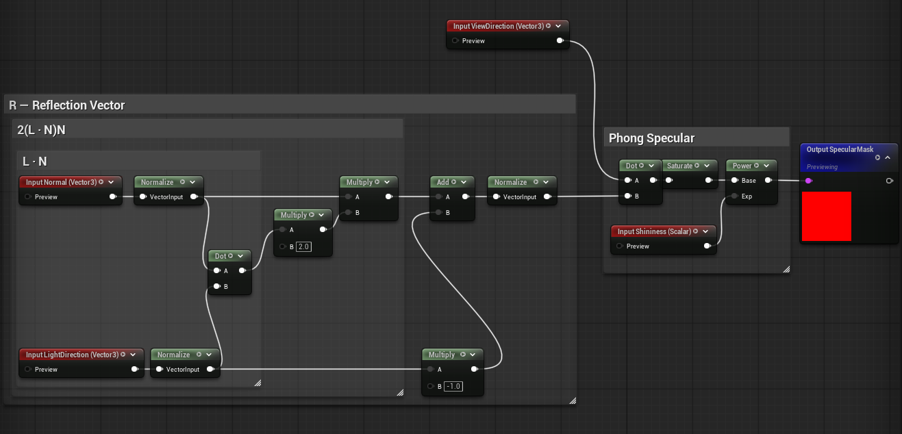

*Figure 8-49. `MF_Specular` 내부 Graph. N과 L을 정규화하고 동일한 Unit L을 Dot 및 −L 분기에 사용한다. ViewDirection은 내부 Normalize 없이 연결되므로 호출부에서 같은 공간의 비영 Unit Vector V(Surface→Camera)를 제공해야 한다. Shininess는 0보다 커야 하며 출력은 `pow(saturate(R·V), Shininess)`인 교육용 Scalar Mask이다. Color/Intensity 합성이나 에너지 보존 BRDF를 이 Graph 자체가 제공하지는 않는다.*

`MF_Specular` 내부에서는

~~~text
Normal
LightDirection
ViewDirection
Shininess
~~~

을 Input으로 받아 Reflection Vector와 Phong Specular 값을 계산한다.

최종 Output은

~~~text
SpecularMask
~~~

로 정의하여 이후 Master Material에서 Color와 Intensity를 별도로 적용할 수 있도록 구성했다.

이 구조를 통해 Phong Specular 계산은 독립적인 Rendering Module로 분리되었으며, 이후 `MF_RimLight`와 같은 다른 Module과 동일한 방식으로 Master Material에 통합할 수 있다.

---

#### Function and Composition Responsibilities

최종 구조에서는 `MF_Specular`와 Master Material의 책임을 다음처럼 구분한다.

~~~text
MF_Specular
→ Specular Highlight의 형태와 강도 계산
→ SpecularMask 출력

Master Material
→ SpecularColor 적용
→ SpecularIntensity 적용
→ 다른 Lighting Module과 Composition
~~~

즉 `MF_Specular`는

**어디에 Specular Highlight가 나타나는가**

를 계산하고,

Master Material은

**그 Highlight를 어떤 색과 밝기로 표현할 것인가**

를 결정한다.

이러한 역할 분리는 ASF의 각 Rendering 기능을 독립적인 Module로 유지하고, 최종 Shader Composition을 명확하게 관리하기 위한 구조다.

---

### Key Takeaways

이번 절에서는 Anime Shader에서 사용하는 Specular Highlight를 구현하면서, 현실적인 반사광을 그대로 재현하는 것이 아니라 **필요한 형태만 선택적으로 단순화하고 제어하는 과정**을 살펴보았다.

Specular Highlight는 단순히 표면을 밝게 만드는 효과가 아니다.

빛의 방향, 표면의 방향, 카메라의 방향 사이의 관계를 이용하여 특정 영역을 강조하고, 그 결과를 원하는 스타일에 맞게 다시 가공하는 과정이다.

특히 이번 구현에서는 다음과 같은 흐름을 확인했다.

- Light Direction과 View Direction을 이용해 Highlight가 나타날 수 있는 방향을 계산한다.
- Surface Normal과의 관계를 통해 Highlight의 중심 영역을 얻는다.
- Power 값을 이용해 Highlight의 크기와 집중도를 조절한다.
- 현재 구현은 Saturate와 Power로 Mask를 만든다. Threshold/Smoothstep은 후속 확장 선택지이며 여기서 완료된 기능은 아니다.
- 최종적으로 Specular Color와 Intensity를 적용하여 독립적으로 제어 가능한 Specular Module을 구성한다.

이 과정에서 중요한 점은 Specular 공식 자체를 외우는 것이 아니라, **각 방향 벡터가 무엇을 의미하고 그 관계가 화면에서 어떤 결과로 나타나는지를 이해하는 것**이다.

이러한 방향 기반 계산은 다음 단계에서도 다시 사용된다.

Specular가 주로 빛의 방향과 시선 방향이 만들어내는 Highlight를 다루었다면, Rim Light에서는 시선에 대해 표면이 얼마나 비스듬하게 놓여 있는지를 이용해 외곽 영역을 검출한다.

이를 통해 지금까지 사용해 온 Normal과 View Direction의 개념을 다시 연결하고, View-dependent한 표현이 Anime Shader에서 어떻게 스타일 요소로 활용될 수 있는지 살펴본다.

다음 절에서는 카메라 방향과 Surface Normal의 관계를 이용하여 캐릭터의 외곽 영역을 강조하는 **Rim Light**를 구현한다.

---

**Next → [8.5 Rim Light](<./Chapter08.5_RimLight.md>)**
