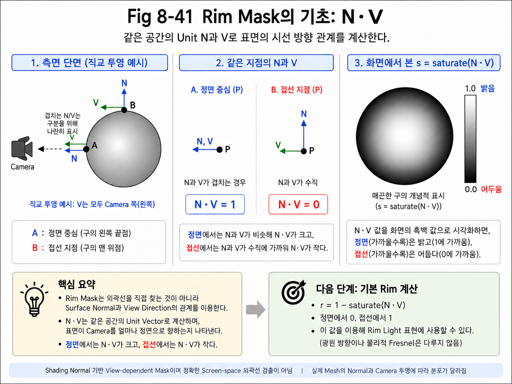
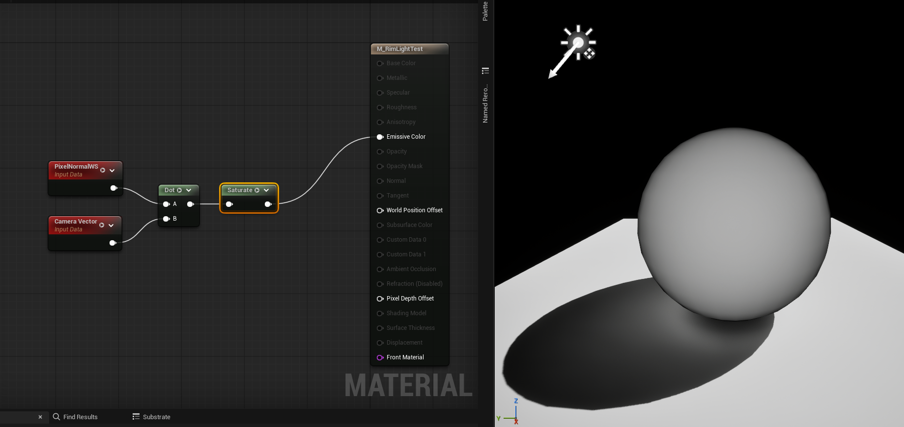
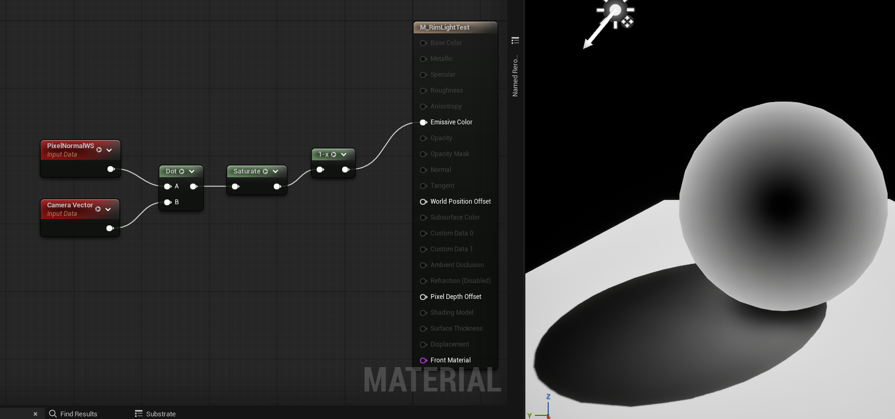
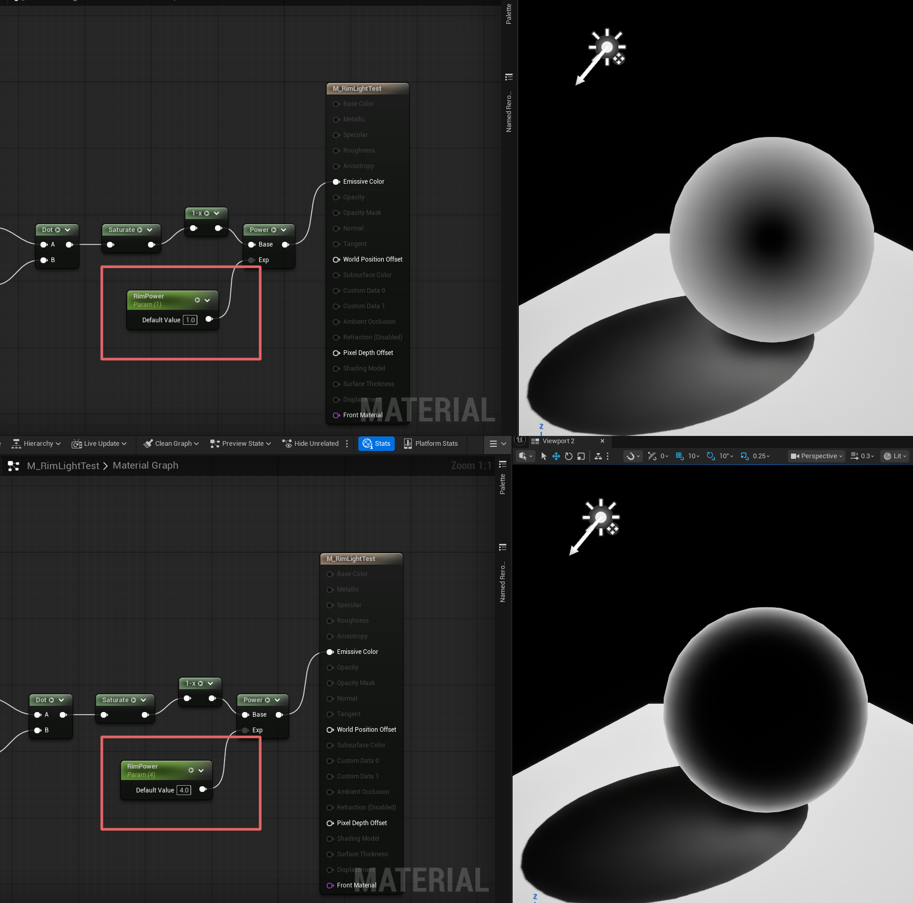
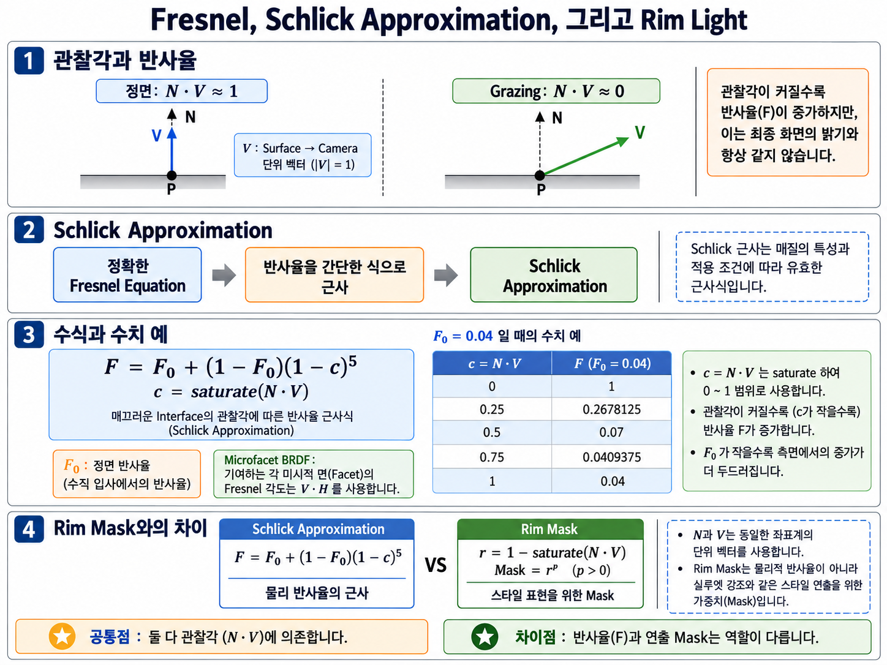
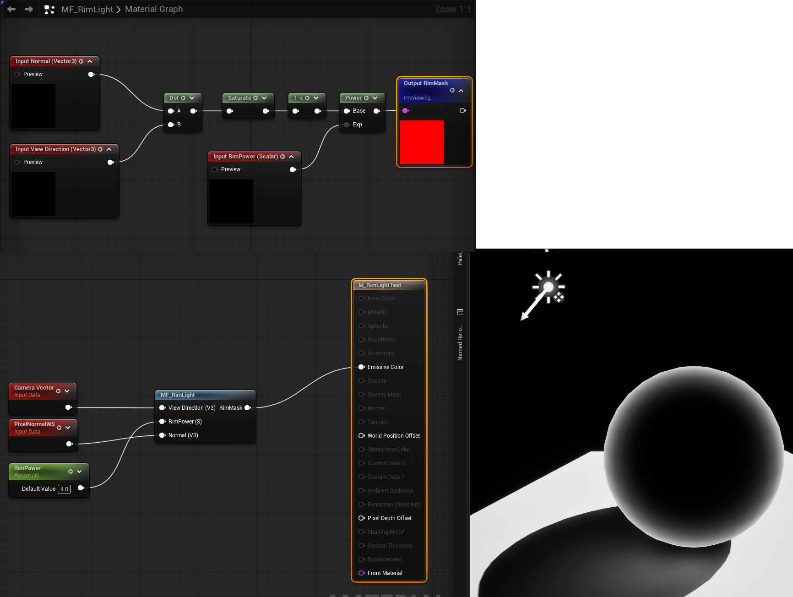
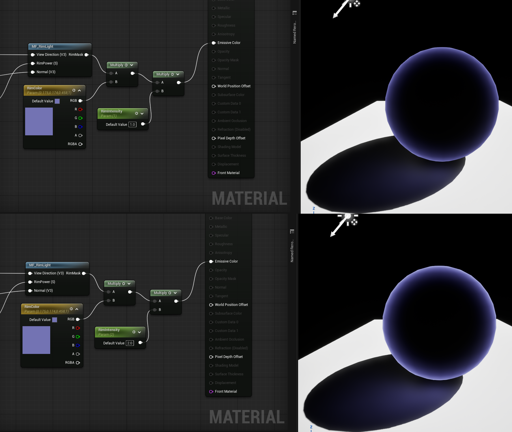
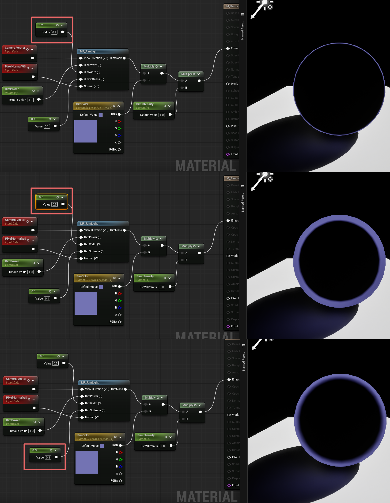
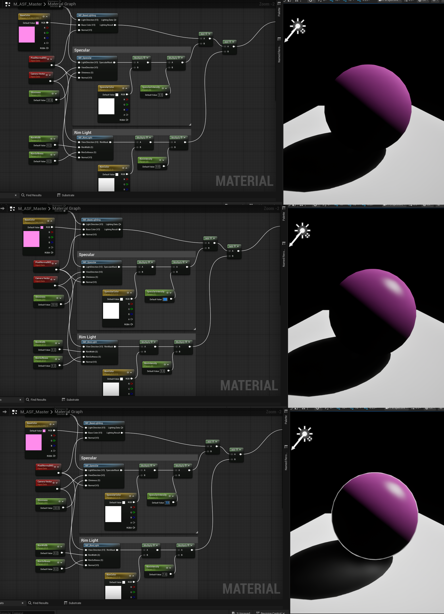

# Chapter 08 — Building an Anime Shader

## 8.5 Rim Light

이 Section은 Power 기반 Prototype을 먼저 만든 뒤 Width/Softness 기반 최종 Interface로 교체한다. 이후 Master Material에서는 Normal, ViewDirection, RimWidth, RimSoftness → Scalar RimMask 계약을 사용하며 RimPower를 필수 Input으로 혼합하지 않는다. N과 V는 같은 Space의 비영 Unit Vector이고 V는 Surface→Camera이다. 외부에서 정규화하거나 Function 경계에서 정규화한 뒤 모든 Dot에 같은 값을 사용한다.

이번 절에서는 이러한 View-dependent한 관계가 어떻게 Rim 영역으로 변환되는지를 단계적으로 살펴본다.

먼저 `Surface Normal`과 `View Direction`의 관계를 통해 Camera에서 보이는 Surface의 방향을 분석하고, 그 결과가 Object의 실루엣과 어떻게 연결되는지를 확인한다.

이후 Rim 영역을 Mask로 변환하고, Width와 Intensity 같은 Stylization Parameter를 추가하여 Anime Shader에 적합한 형태로 조절한다.

최종적으로 Rim Light 계산을 독립적인 Material Function으로 구성하여 기존 ASF Shader Architecture에 통합한다.

이번 절의 목표는 단순히 Unreal의 Fresnel Node나 특정 Material Graph를 따라 만드는 것이 아니다.

다음과 같은 흐름을 이해하는 것이 핵심이다.

~~~text
Surface Normal
+
View Direction
↓
View-dependent Surface Relation
↓
Silhouette Region
↓
Rim Mask
↓
Stylization
↓
Rim Light
~~~

이를 통해 Rim Light가 어떤 원리로 Object의 외곽을 찾아내고, 그 정보를 Anime Shader의 스타일 요소로 사용할 수 있는지 이해해본다.

### Why Rim Appears near the Silhouette

Rim Light는 Character나 Object의 외곽을 밝게 강조하여 실루엣을 더 선명하게 보여주는 표현이다.

Anime Shader에서는 이 효과를 이용하여 Character의 형태를 배경에서 분리하거나, 머리카락과 의상처럼 실루엣이 중요한 부분을 강조할 수 있다.

하지만 Shader 입장에서 생각하면 한 가지 질문이 생긴다.

> 현재 Pixel이 Object의 외곽에 있다는 것을 어떻게 알 수 있을까?

Mesh에는 일반적으로 "이 부분이 화면의 외곽이다"라는 정보가 저장되어 있지 않다.

또한 Camera가 움직이면 화면에서 보이는 Object의 실루엣 위치도 계속 달라진다.

따라서 고정된 Texture Mask나 UV 위치만으로는 현재 Camera에서 보이는 실루엣 영역을 정확하게 찾기 어렵다.

Rim Light에서는 Object의 외곽 위치를 직접 찾는 대신,

**Surface가 현재 Camera를 얼마나 정면으로 바라보고 있는가**

를 이용한다.

이 관계를 알아내기 위해 사용하는 두 가지 방향 정보가 있다.

- `Surface Normal N`
- `View Direction V`

`Surface Normal`은 현재 Surface가 어느 방향을 향하고 있는지를 나타낸다.

`View Direction`은 현재 Surface에서 Camera를 향하는 방향을 나타낸다.

이 두 방향의 관계는 Object의 중앙 부분과 실루엣 부분에서 크게 달라진다.

#### Front-facing Normal and View Direction

Camera에서 Sphere의 정면 중심을 바라본다고 생각해보자.

Sphere의 정면에 있는 Surface Normal은 Camera 방향을 향한다.

따라서 이 영역에서는 `Normal N`과 `View Direction V`가 거의 같은 방향을 가진다.

두 Vector가 같은 방향을 바라볼수록 Dot Product 값은 `1`에 가까워진다.

따라서 Object의 정면에서는 다음과 같은 관계가 만들어진다.

~~~text
N과 V가 거의 같은 방향

N · V ≈ 1
~~~

즉 `N · V` 값이 크다는 것은 해당 Surface가 Camera를 비교적 정면으로 바라보고 있다는 의미로 해석할 수 있다.

---

#### Grazing Angles near the Silhouette

이번에는 Sphere의 가장자리 부분을 생각해보자.

Camera에서 보았을 때 Sphere의 실루엣에 가까운 Surface Normal은 화면 바깥 방향으로 향한다.

반면 `View Direction`은 여전히 Surface에서 Camera를 향한다.

따라서 실루엣에 가까워질수록 `Normal N`과 `View Direction V` 사이의 각도는 점점 커진다.

실루엣 경계에서는 두 방향이 거의 직각에 가까운 관계가 된다.

Normalized Vector 두 개가 직각일 때 Dot Product 값은 `0`이므로 다음과 같은 관계가 만들어진다.

~~~text
N과 V가 거의 직각

N · V ≈ 0
~~~

즉 `N · V` 값이 작다는 것은 Surface가 Camera를 정면으로 바라보는 것이 아니라, Camera에 대해 옆으로 돌아서 있다는 의미다.

---

#### N dot V as Orientation

이제 Object의 표면 전체를 생각해보면 `N · V` 값은 정면에서 실루엣으로 이동하면서 연속적으로 변화한다.

~~~text
Center

N · V ≈ 1

↓

Mid Area

N · V ≈ 0.5

↓

Silhouette

N · V ≈ 0
~~~

이 값은 결국 다음 질문에 대한 답이라고 볼 수 있다.

> 현재 Surface가 Camera를 얼마나 정면으로 바라보고 있는가?

정면을 바라보는 Surface에서는 값이 크고,

Camera에 대해 옆으로 돌아선 Surface에서는 값이 작다.

따라서 별도의 외곽선 위치 정보를 가지고 있지 않아도 `Surface Normal`과 `View Direction`의 관계만으로 현재 Camera에서 보이는 실루엣 영역을 간접적으로 찾을 수 있다.

---

#### Grazing Mask and Silhouette Detection

여기서 중요한 점은 Rim Light가 화면의 외곽선을 직접 검출하는 기술이 아니라는 것이다.

Rim Light에서 사용하는 기본 아이디어는 다음과 같다.

~~~text
Surface Normal
+
View Direction

↓

Surface가 Camera를 향하는 정도

↓

실루엣에 가까운 Surface 판별
~~~

Camera를 정면으로 바라보는 Surface는 Object의 화면 중앙 영역에 나타나는 경우가 많고,

Camera에 대해 거의 옆으로 돌아선 Surface는 화면에서 실루엣에 가까운 영역에 나타난다.

따라서 방향 관계만으로도 Camera에 따라 계속 변화하는 View-dependent Mask를 만들 수 있다.

이것이 Rim Light를 구성하는 가장 기본적인 출발점이다.

---

#### Inverting the Orientation Factor

`N · V`를 그대로 흑백 값으로 표현한다고 생각해보자.

정면에서는 값이 `1`에 가까우므로 밝게 나타나고,

실루엣에서는 값이 `0`에 가까우므로 어둡게 나타난다.

~~~text
N · V

Center
→ Bright

Silhouette
→ Dark
~~~

하지만 우리가 Rim Light에서 원하는 결과는 반대다.

~~~text
Rim Light

Center
→ Dark

Silhouette
→ Bright
~~~

즉 `N · V`는 실루엣을 찾기 위한 중요한 정보를 가지고 있지만, 아직 그대로 Rim Mask로 사용할 수 있는 상태는 아니다.

다음 단계에서는 이 값을 실제 Unreal Material에서 직접 확인하고,

**정면은 어둡고 실루엣은 밝은 값으로 어떻게 변환할 수 있는지**

살펴본다.

---

### Inspecting N dot V

앞 절에서는 `Surface Normal N`과 `View Direction V`의 관계를 이용하면 Surface가 Camera를 얼마나 정면으로 바라보고 있는지를 알 수 있다는 것을 살펴보았다.

이제 이 관계가 실제 Unreal Material에서도 같은 형태로 나타나는지 직접 확인해본다.

이번 단계에서는 아직 Rim Light를 완성하지 않는다.

먼저 `N · V` 값 자체를 화면에 출력하여,

**정면을 바라보는 Surface와 실루엣에 가까운 Surface에서 값이 실제로 어떻게 달라지는지**

검증하는 것이 목적이다.

---

#### Computing N dot V

먼저 Rim Light 테스트용 Material을 만들고 Shading Model을 `Unlit`으로 설정한다.

이번 테스트에서는 Scene Lighting이나 Specular 같은 다른 요소가 결과에 영향을 주면 안 되기 때문에, 계산 결과를 `Emissive Color`에 직접 출력한다.

필요한 Node는 다음과 같다.

~~~text
PixelNormalWS
+
Camera Vector
↓
Dot Product
↓
Saturate
↓
Emissive Color
~~~

`PixelNormalWS`는 현재 Pixel의 World Space Surface Normal을 제공한다.

`Camera Vector`는 현재 Surface에서 Camera를 향하는 방향을 제공한다.

두 Vector를 `Dot Product`에 입력하면 다음 값을 얻을 수 있다.

~~~text
N · V
~~~

이 값은 두 방향이 얼마나 비슷한 방향을 바라보고 있는지를 나타낸다.

---

#### Clamping the Dot Product

`Dot Product` 결과는 상황에 따라 음수가 포함될 수 있다.

하지만 이번 단계에서 필요한 것은 Camera를 향하는 Surface에 대한 `0~1` 범위의 Mask이므로 `Saturate`를 사용하여 값을 정리한다.

`Saturate`는 입력 값을 다음 범위로 제한한다.

~~~text
0 ≤ Value ≤ 1
~~~

즉,

~~~text
Value < 0
→ 0

0 ~ 1
→ 그대로 유지

Value > 1
→ 1
~~~

의 형태로 값이 제한된다.

이렇게 하면 `N · V` 결과를 Grayscale Mask로 확인하기 쉬워진다.

---

#### N · V Debug Result

다음은 `PixelNormalWS`와 `Camera Vector`를 Dot Product한 뒤 `Saturate`를 적용하고, 그 결과를 `Emissive Color`에 직접 출력한 모습이다.

*Figure 8-42. `saturate(N·V)`의 Emissive 연결과 구 표면 분포를 확인하는 정성적 Debug 예시. N/V는 같은 공간의 Unit Vector라는 전제로 읽는다. Viewport 밝기를 Scalar 원값으로 직접 읽지 않으며 정량 비교에는 Material 설정과 Exposure/Post Process 조건을 확인한다. 바닥의 Cast Shadow는 이 Rim 계산의 출력이 아니다.*

Sphere를 보면 정면 중심부가 가장 밝고, 외곽으로 갈수록 점점 어두워지는 것을 확인할 수 있다.

이 결과는 앞 절에서 예상한 값과 일치한다.

~~~text
Center

N · V ≈ 1

→ Bright
~~~

반대로 Sphere의 실루엣에 가까워질수록 Surface Normal과 View Direction의 각도가 커지고 Dot Product 값은 작아진다.

~~~text
Silhouette

N · V ≈ 0

→ Dark
~~~

즉 실제 Unreal Material에서도 `N · V`는

**Surface가 Camera를 얼마나 정면으로 바라보고 있는가**

를 나타내는 View-dependent한 값으로 사용할 수 있다.

---

#### From Facing to Grazing

하지만 현재 결과를 그대로 보면 우리가 원하는 Rim Light와 밝기의 방향이 반대라는 것을 알 수 있다.

현재 `N · V`의 분포는 다음과 같다.

~~~text
Center
→ Bright

Silhouette
→ Dark
~~~

Rim Light에서 원하는 것은 반대다.

~~~text
Center
→ Dark

Silhouette
→ Bright
~~~

따라서 다음 단계에서는 현재 값을 반전시켜야 한다.

가장 단순한 방법은 `One Minus`를 사용하는 것이다.

~~~text
1 - N · V
~~~

`N · V`가 `1`에 가까운 정면 영역에서는

~~~text
1 - 1 = 0
~~~

이 되어 어두워진다.

반대로 `N · V`가 `0`에 가까운 실루엣에서는

~~~text
1 - 0 = 1
~~~

이 되어 밝아진다.

이를 Material Graph에 적용하면 다음과 같은 흐름이 된다.

~~~text
PixelNormalWS
+
Camera Vector
↓
Dot Product
↓
Saturate
↓
One Minus
↓
Emissive Color
~~~

실제 결과를 확인하면 Sphere의 중앙은 어두워지고, 외곽으로 갈수록 밝아지는 것을 볼 수 있다.

이제 처음으로 Rim Light의 기본 형태와 유사한 Mask가 만들어졌다.

---

#### Meaning of One Minus N dot V

여기서 중요한 점은 `One Minus`가 특별한 Rim Light 기능을 수행하는 Node가 아니라는 것이다.

단순히 기존 값의 의미를 반대로 바꾸는 역할을 한다.

`N · V`가 다음 의미를 가지고 있었다면,

~~~text
1
→ Camera를 정면으로 바라보는 Surface

0
→ Camera에 대해 옆으로 돌아선 Surface
~~~

`1 - N · V`는 이를 반대로 만든다.

~~~text
0
→ Camera를 정면으로 바라보는 Surface

1
→ Camera에 대해 옆으로 돌아선 Surface
~~~

따라서 결과적으로 Camera에 대해 옆으로 돌아선 Surface, 즉 화면에서 실루엣에 가까운 영역이 밝아진다.

이 값이 이후 Rim Light를 만들기 위한 기본 Mask가 된다.

---

#### Mask and Final Contribution

현재 결과는 외곽이 밝아지기는 하지만 Rim 영역이 상당히 넓고 부드럽게 퍼져 있다.

이는 `1 - N · V` 값이 Surface의 방향 변화에 따라 연속적으로 변하기 때문이다.

즉 현재 상태는

**Rim이 어디에 나타날 수 있는지를 찾은 기본 Mask**

라고 보는 것이 정확하다.

다음 단계에서는 이 Mask의 분포를 조절하여,

- Rim을 더 얇게 만들거나
- 더 넓게 만들고
- Anime Style에 맞는 명확한 형태로 제어하는 방법

을 살펴본다.

---

### Rim Width and Shape Control

앞 단계에서 `1 - N · V`를 이용해 기본적인 Rim Mask를 만들었다.

이제 Surface의 실루엣에 가까운 영역이 밝아지고, 정면 영역은 어두워지는 형태를 얻었지만 아직 바로 Anime Shader의 Rim Light로 사용하기에는 한 가지 문제가 남아 있다.

현재 Mask는 실루엣 주변이 넓고 부드러운 Gradient 형태로 퍼져 있다.

즉,

~~~text
1 - N · V
~~~

만으로는 **Rim이 어디에 나타나야 하는가**는 찾을 수 있지만,

**Rim을 얼마나 얇게 만들 것인가**

까지는 제어하기 어렵다.

Anime Style Rendering에서는 일반적으로 넓게 퍼지는 부드러운 Gradient보다, 실루엣 주변에 더 집중된 얇은 띠 형태의 Rim이 더 적합한 경우가 많다.

따라서 다음 단계에서는 기본 Rim Mask의 분포를 조절하여 Rim의 두께와 형태를 제어한다.

---

#### Basic Mask Limitations

`1 - N · V` 결과는 Surface가 Camera에 대해 얼마나 옆으로 돌아서 있는지를 연속적인 값으로 표현한다.

따라서 실루엣에 매우 가까운 영역만 밝아지는 것이 아니라, 그 안쪽의 중간 영역들도 어느 정도 밝은 값을 유지한다.

결과적으로 화면에서는 다음과 같은 형태가 나타난다.

~~~text
Center
→ Dark

Mid Area
→ Gray

Silhouette
→ Bright
~~~

이 구조는 Rim의 기본 원리를 보여주기에는 적합하지만, 실제 Stylized Rendering에서는 Rim의 폭이 지나치게 넓게 느껴질 수 있다.

즉 지금 필요한 것은

**중간 Gray 영역을 줄이고, 밝은 영역을 실루엣 부근에 더 집중시키는 것**

이다.

---

#### Power-based Distribution Control

이 문제를 해결하는 가장 간단한 방법은 `Power` Node를 사용하는 것이다.

기본 Rim Mask를 `R`이라고 하면,

~~~text
R = 1 - N · V
~~~

이고, 여기에 `Power`를 적용하면 다음과 같은 형태가 된다.

~~~text
Pow(R, RimPower)
~~~

Unreal의 `Power` Node는 입력값을 지정한 지수만큼 거듭제곱한다.

즉 개념적으로는 다음과 같다.

~~~text
Base ^ Exp
~~~

이번 경우에는

~~~text
Rim Mask ^ RimPower
~~~

를 계산하는 셈이다.

---

#### Power and Apparent Width

`Power`가 Rim의 분포를 바꾸는 원리를 이해하려면, `0`과 `1` 사이의 중간값이 어떻게 변하는지를 보면 된다.

예를 들어 Rim Mask의 어떤 중간 영역 값이 `0.5`라고 가정해보자.

~~~text
RimPower = 1
0.5^1 = 0.5

RimPower = 2
0.5^2 = 0.25

RimPower = 4
0.5^4 = 0.0625
~~~

즉 `RimPower`가 커질수록 `0`과 `1` 사이의 중간값은 빠르게 더 어두운 값으로 줄어든다.

반면 실루엣에 매우 가까운 영역처럼 원래 값이 `1`에 가까운 부분은 비교적 밝게 유지된다.

예를 들어 값이 `1`이라면,

~~~text
1^1 = 1
1^2 = 1
1^4 = 1
~~~

로 계속 `1`을 유지한다.

이 결과를 정리하면 다음과 같다.

~~~text
RimPower 증가
↓
중간 Gray 영역 감소
↓
밝은 영역이 실루엣 근처에만 남음
↓
Rim이 더 얇아짐
~~~

따라서 `Power` Node는 단순히 값을 키우는 역할이 아니라,

**기본 Rim Mask의 분포를 실루엣 쪽으로 압축하는 역할**

을 한다고 이해하는 것이 더 정확하다.

---

#### Material Graph

`Power`를 적용한 Rim Mask의 구성은 다음과 같다.

~~~text
PixelNormalWS
+
Camera Vector
↓
Dot Product
↓
Saturate
↓
One Minus
↓
Power
↓
Emissive Color
~~~

여기서 `Power` Node의 `Exp` 입력에는 Scalar Parameter를 연결하여 사용자가 값을 조절할 수 있도록 만든다.

이번 예시에서는 다음 이름을 사용한다.

~~~text
RimPower
~~~

이 Parameter를 이용하면 Material을 수정하지 않고도 Rim의 두께를 손쉽게 조절할 수 있다.

---

#### RimPower Comparison

다음은 `RimPower` 값을 변경했을 때 Rim Mask가 어떻게 달라지는지를 비교한 결과다.

위쪽은 `RimPower = 1`인 상태이고, 아래쪽은 `RimPower = 4`인 상태다.

`RimPower = 1`에서는 `Power`를 적용하지 않은 것과 거의 같은 결과가 나타난다.

즉 실루엣 바깥쪽뿐 아니라 그 안쪽의 중간 영역도 넓게 남아 있어 Rim이 비교적 두껍고 부드럽게 퍼져 보인다.

반면 `RimPower = 4`에서는 중간 Gray 영역이 크게 줄어들고, 밝은 값이 실루엣 주변에 더 강하게 집중된다.

그 결과 Rim이 더 얇고 선명한 띠처럼 보인다.

즉 `RimPower`는 단순히 밝기를 조절하는 Parameter가 아니라,

**Rim Mask의 형태를 조절하여 실루엣 부근의 강조 범위를 결정하는 Parameter**

라고 볼 수 있다.

---

#### Width and Power

여기서 한 가지 주의할 점이 있다.

이번 단계에서 실제로 조절하는 값은 `Rim Width`라는 이름의 길이나 거리 값이 아니라, `Power`를 이용한 **분포의 압축 정도**다.

하지만 화면 결과만 놓고 보면 `RimPower`가 커질수록 Rim의 폭이 좁아지기 때문에, 실질적으로는 Rim Width를 조절하는 것처럼 동작한다.

즉 관계는 다음과 같이 정리할 수 있다.

~~~text
RimPower 증가
→ Rim Width 감소

RimPower 감소
→ Rim Width 증가
~~~

따라서 초기 구현 단계에서는 Parameter 이름을 `RimWidth`보다 `RimPower`로 두는 편이 더 정확하다.

나중에 사용자 친화적인 인터페이스가 필요하다면, 별도의 `RimWidth` Parameter를 설계하여 더 직관적으로 변환할 수 있다.

---

#### Remaining Controls

이제 우리는 다음 두 단계를 거쳐 Rim Light의 핵심 Mask를 확보했다.

~~~text
N · V
↓
1 - N · V
↓
Power Control
↓
Stylized Rim Mask
~~~

즉 Camera와 Surface 방향의 관계로 Grazing 영역을 강조하고, 그 결과를 Anime Style에 맞는 더 얇고 집중된 형태로 가공할 수 있게 되었다.

하지만 아직 이 값은 흑백 Mask일 뿐이며, 실제 Rim Light 표현으로 사용하려면 색상과 강도를 적용하고 기존 ASF Shader 흐름에 통합해야 한다.

다음 단계에서는 Unreal의 `Fresnel` 개념과 이번 Rim Mask의 관계를 정리하고, 이후 Rim Light를 독립적인 Module로 구성하는 방향으로 이어간다.

---

### Fresnel and Artistic Rim

지금까지 우리는 `Surface Normal`과 `View Direction`의 관계를 이용하여 Rim Mask를 직접 만들었다.

구현한 구조를 다시 보면 다음과 같다.

~~~text
Surface Normal
+
View Direction
↓
N · V
↓
1 - N · V
↓
Power
↓
Rim Mask
~~~

이 구조는 Camera에 대해 정면을 바라보는 Surface보다, 실루엣에 가까운 Surface에서 값이 커지도록 만든다.

그런데 이 흐름은 Rendering에서 자주 등장하는 **Fresnel**과 매우 비슷한 형태를 가지고 있다.

따라서 이번 절에서는

- 현실 세계의 Fresnel 현상이 무엇인지
- 왜 Schlick Approximation이 필요한지
- Schlick Fresnel 식이 어떤 의미인지
- 우리가 만든 Rim Mask와 어떤 부분이 같고 어떤 부분이 다른지

를 단계적으로 정리한다.

---

#### Physical Fresnel

현실에서 빛이 Surface에 도달하면 모든 빛이 같은 방식으로 처리되는 것은 아니다.

일부는 반사되고, 일부는 Surface 내부로 전달된다.

이때 반사되는 비율은 항상 일정하지 않으며, **Surface를 바라보는 각도에 따라 달라진다.**

Surface를 비교적 정면에 가깝게 바라볼 때는 반사 비율이 상대적으로 낮다.

반면 Surface를 매우 비스듬하게 바라보는 경우, 즉 `Grazing Angle`에 가까워질수록 반사 비율이 증가한다.

~~~text
정면에 가까운 View Angle
→ Reflection 약함

Grazing Angle
→ Reflection 강함
~~~

물이나 유리 표면에서도 이러한 현상을 쉽게 관찰할 수 있다.

정면에 가까운 방향에서는 Surface 너머의 정보를 비교적 쉽게 볼 수 있지만,

시선을 Surface에 거의 평행하게 낮추면 주변 환경의 Reflection이 훨씬 강하게 보인다.

이러한 각도에 따른 Reflection 변화가 **Fresnel Effect**다.

---

#### Reflectance and Edge Brightness

Fresnel을 처음 접하면 Object 외곽이 밝아지는 효과처럼 보일 수 있다.

하지만 Fresnel의 본래 의미는 외곽선을 만드는 것이 아니다.

핵심은 다음과 같다.

> Surface와 View Direction의 각도에 따라 Reflection 비율이 달라진다.

Object의 실루엣 부근은 Camera에서 보았을 때 Surface가 Grazing Angle에 가까워지는 영역이기 때문에,

결과적으로 Fresnel Reflection이 외곽에서 강하게 나타나는 것처럼 보이는 것이다.

즉,

~~~text
Silhouette을 직접 찾는다
~~~

가 아니라,

~~~text
View Angle을 계산한다
↓
Grazing Angle에서 Reflection이 증가한다
↓
화면에서는 실루엣 부근이 강하게 보인다
~~~

라는 흐름이다.

이 점은 우리가 Rim Mask를 만들 때 사용한 원리와 매우 유사하다.

---

#### Fresnel Approximation

물리적으로 정확한 Fresnel Equation은 빛이 서로 다른 매질의 경계를 통과할 때 Reflection과 Refraction이 어떻게 나뉘는지를 계산한다.

하지만 정확한 Fresnel Equation은 실제 Rendering에서 사용하기에는 계산 구조가 비교적 복잡하다.

실시간 Rendering에서는 수많은 Pixel에 대해 같은 계산을 반복해야 하기 때문에,

물리적인 결과를 충분히 유지하면서도 더 간단하게 계산할 수 있는 방법이 필요하다.

이 문제를 해결하기 위해 Christophe Schlick은 실제 Fresnel Curve를 간단한 연산으로 매우 비슷하게 근사할 수 있는 방법을 제안했다.

이것이 **Schlick Approximation**이다.

중요한 점은 Schlick Approximation이 Fresnel이라는 새로운 물리 현상을 만든 것이 아니라는 것이다.

~~~text
정확한 Fresnel Equation
→ 물리적으로 정확하지만 계산이 복잡함

Schlick Approximation
→ 실제 Fresnel Curve를
   훨씬 간단한 계산으로 근사
~~~

즉 목적은

**Fresnel 현상의 결과를 실시간 Rendering에서 효율적으로 사용하기 위한 것**

이다.

---

#### Schlick Fresnel

Chapter 05.14의 Schlick/F0를 Rim과 비교한다. 아래 N·V 표기는 매끄러운 Interface의 관찰각 설명용이다. Microfacet Specular에서 기여 Facet의 Fresnel을 평가할 때에는 cosTheta=V·H를 사용하며 항상 N·V로 대체하지 않는다.

~~~text
F = F0 + (1 - F0)(1 - N · V)^5
~~~

처음 보면 여러 항이 한 번에 등장하기 때문에 복잡해 보일 수 있다.

하지만 이 식을 문장으로 풀어보면 구조는 비교적 단순하다.

~~~text
최종 Fresnel 반사율
=
정면에서의 기본 반사율
+
아직 증가할 수 있는 반사량
×
View Angle에 따른 증가 비율
~~~

이를 다시 수식과 대응시키면 다음과 같다.

~~~text
F
=
F0
+
(1 - F0)
×
(1 - N · V)^5
~~~

각 항이 담당하는 역할을 하나씩 살펴보자.

---

#### F: Angle-dependent Reflectance

`F`는 최종적으로 계산된 Fresnel Reflection 비율이다.

즉 현재 Surface를 현재 Camera 방향에서 바라보았을 때

**얼마나 많은 빛이 Reflection으로 나타나는가**

를 나타내는 값이다.

~~~text
F = Final Fresnel Reflectance
~~~

---

#### F0: Normal-incidence Reflectance

`F0`는 Surface를 정면에서 바라보았을 때의 기본 Reflection 비율이다.

Fresnel Effect가 있다고 해서 정면 Reflection이 반드시 `0`인 것은 아니다.

Material은 정면에서도 일정량의 빛을 반사한다.

예를 들어 어떤 비금속 Material의 정면 Reflection이 약 `4%`라고 가정하면,

~~~text
F0 = 0.04
~~~

라고 표현할 수 있다.

즉 `F0`는

**View Angle 변화가 적용되기 전에도 Surface가 기본적으로 가지고 있는 Reflection**

이라고 볼 수 있다.

---

#### One Minus F0

Reflection 값의 최대 범위를 `1`이라고 생각해보자.

이미 `F0`만큼 Reflection이 존재한다면,

추가로 증가할 수 있는 남은 범위는

~~~text
1 - F0
~~~

가 된다.

예를 들어,

~~~text
F0 = 0.04
~~~

라면,

~~~text
1 - F0 = 0.96
~~~

이다.

즉 현재 Material은 정면에서 이미 `4%`를 반사하고 있으며,

Grazing Angle로 이동하면서 나머지 `96%` 범위 안에서 Reflection이 증가할 수 있다는 의미다.

따라서 `1 - F0`는

**남아 있는 Reflection 증가 가능 범위**

라고 이해할 수 있다.

---

#### N dot V: Surface and Camera

`N · V`는 우리가 Rim Light를 구현하면서 이미 확인한 값이다.

~~~text
N = Surface Normal
V = View Direction
~~~

Normalized Vector 두 개의 Dot Product는 두 방향 사이의 각도 관계를 나타낸다.

정면에서는 두 방향이 거의 같기 때문에,

~~~text
N · V ≈ 1
~~~

이 된다.

반면 Grazing Angle에 가까워질수록 두 방향은 직각에 가까워지고,

~~~text
N · V ≈ 0
~~~

이 된다.

따라서 `N · V`는

**Surface가 Camera를 얼마나 정면으로 바라보고 있는가**

를 나타내는 값으로 사용할 수 있다.

---

#### One Minus N dot V: Grazing Factor

Fresnel Reflection은 정면에서 약하고 Grazing Angle에서 강해져야 한다.

하지만 `N · V`는 반대로 동작한다.

~~~text
Center
N · V ≈ 1

Silhouette
N · V ≈ 0
~~~

따라서 값을 뒤집는다.

~~~text
1 - N · V
~~~

그러면 관계는 다음과 같이 바뀐다.

~~~text
Center
1 - N · V ≈ 0

Grazing Angle
1 - N · V ≈ 1
~~~

즉 우리가 Rim Mask를 만들 때 `One Minus`를 사용했던 이유와 정확히 같은 방향의 계산이다.

---

#### The Fifth Power

Schlick Approximation에서 가장 낯설게 느껴질 수 있는 부분은 다음 항이다.

~~~text
(1 - N · V)^5
~~~

여기서 `5`는 정확한 Fresnel Equation에서 반드시 나타나는 물리 상수가 아니다.

Christophe Schlick은 복잡한 Fresnel Curve를 훨씬 간단한 계산으로 근사하기 위해 이 형태를 제안했다.

즉,

**5제곱을 적용한 Curve가 실제 Fresnel Reflection Curve와 충분히 비슷한 형태를 만들어주기 때문**

이다.

이 원리는 우리가 Rim Mask에 `Power`를 적용했을 때와 동일하다.

예를 들어 중간값이 `0.5`라고 하면,

~~~text
0.5^1 = 0.5

0.5^2 = 0.25

0.5^5 = 0.03125
~~~

처럼 지수가 커질수록 중간값이 빠르게 `0`에 가까워진다.

반면 값이 `1`인 경우에는

~~~text
1^1 = 1
1^2 = 1
1^5 = 1
~~~

로 그대로 유지된다.

따라서 `5제곱`은 정면과 중간 영역의 값을 강하게 낮추면서,

Grazing Angle에 가까운 영역의 값을 상대적으로 유지한다.

결과적으로 Reflection이 Surface 전체에서 일정하게 증가하는 것이 아니라,

**Grazing Angle에 가까워질수록 급격하게 증가하는 Curve**

를 만들 수 있다.

---

#### Normal-incidence Example

이제 실제 값을 넣어보자.

정면 기본 Reflection을 다음과 같이 가정한다.

~~~text
F0 = 0.04
~~~

Surface를 Camera가 정면으로 보고 있다면,

~~~text
N · V = 1
~~~

이다.

따라서,

~~~text
1 - N · V = 0
~~~

이고,

~~~text
(1 - N · V)^5 = 0
~~~

이 된다.

Schlick 식에 넣으면,

~~~text
F = F0 + (1 - F0)(1 - N · V)^5

F = 0.04 + (1 - 0.04) × 0

F = 0.04
~~~

이 된다.

즉 정면에서는

**기본 Reflection인 4%만 남는다.**

---

#### Grazing-angle Example

이번에는 Surface가 Camera에 대해 거의 옆으로 돌아선 상태를 생각해보자.

~~~text
N · V = 0
~~~

이라면,

~~~text
1 - N · V = 1
~~~

이고,

~~~text
(1 - N · V)^5 = 1
~~~

이다.

따라서,

~~~text
F = 0.04 + (1 - 0.04) × 1

F = 0.04 + 0.96

F = 1.0
~~~

이 된다.

즉 Grazing Angle에 가까워질수록 Reflection은 이론적으로 `1`, 즉 거의 100%에 가까운 값까지 증가한다.

이렇게 Schlick Approximation은

~~~text
정면
→ F0

Grazing Angle
→ 1
~~~

사이를 View Angle에 따라 변화시키는 구조를 가진다.

---

#### Comparison with the Rim Mask

이제 지금까지 만든 Rim Mask와 Schlick Fresnel을 비교해보자.

Rim Mask는 다음과 같다.

~~~text
Rim = (1 - N · V)^RimPower
~~~

Schlick Fresnel은 다음과 같다.

~~~text
F = F0 + (1 - F0)(1 - N · V)^5
~~~

두 식을 보면 공통된 구조가 분명하게 보인다.

~~~text
1 - N · V
~~~

를 이용하여 Grazing Angle에서 값이 커지도록 만들고,

그 결과에 Power를 적용하여 중간 영역의 분포를 조절한다.

따라서 우리가 만든 Rim Mask와 Schlick Fresnel이 비슷한 형태로 보이는 것은 우연이 아니다.

둘 다

**Surface Normal과 View Direction의 각도 관계**

를 사용하기 때문이다.

---

#### Different Responsibilities

계산 구조가 비슷하다고 해서 Rim Light와 Fresnel이 같은 의미를 가지는 것은 아니다.

Schlick Fresnel은

~~~text
Physical Reflection
~~~

을 근사하기 위한 계산이다.

즉 현재 View Angle에서 Surface가 실제로 얼마나 많은 빛을 반사해야 하는지를 계산하는 것이 목적이다.

반면 우리가 만든 Rim Mask는

~~~text
Stylized Silhouette Mask
~~~

다.

즉 물리적으로 정확한 Reflection 양을 계산하려는 것이 아니라,

Camera 기준 실루엣 영역을 찾아 Anime Style의 강조 표현에 사용하는 것이 목적이다.

이를 정리하면 다음과 같다.

~~~text
Schlick Fresnel

F = F0 + (1 - F0)(1 - N · V)^5

목적
→ Physical Reflection 근사
~~~

~~~text
Rim Mask

Rim = (1 - N · V)^RimPower

목적
→ Stylized Silhouette 강조
~~~

---

#### Schlick Exponent and RimPower

이 차이는 Power 값에서도 나타난다.

Schlick Approximation에서 `5`는 실제 Fresnel Curve를 효율적으로 근사하기 위해 사용되는 형태다.

따라서 이 값은 단순한 Style Parameter가 아니다.

반면 Rim Light의 `RimPower`는 표현을 위한 Parameter다.

~~~text
RimPower = 2
→ 넓은 Rim

RimPower = 4
→ 더 얇은 Rim

RimPower = 8
→ 매우 좁은 Rim
~~~

처럼 원하는 Anime Style에 따라 자유롭게 변경할 수 있다.

즉 같은 Power 연산을 사용하더라도

**왜 그 값을 사용하는가**

가 서로 다르다.

---

#### Interpreting the Fresnel Node

Unreal Material에는 `Fresnel` Node가 제공된다.

이 Node를 처음 보면

"Object 외곽을 밝게 만드는 Node"

라고 이해하기 쉽다.

하지만 실제로는 외곽 위치를 직접 찾아내는 것이 아니다.

기본 원리는 우리가 직접 구현한 것과 같은 View-dependent 관계다.

~~~text
Surface Normal
+
View Direction
↓
N · V
↓
Grazing Angle 계산
↓
Fresnel 형태의 Falloff
~~~

따라서 `Fresnel` Node를 사용할 때도 단순히 결과만 사용하는 것보다,

**Surface와 Camera의 각도 관계를 계산하여 Grazing Angle에서 값이 커지는 Node**

라고 이해하는 것이 중요하다.

우리가 Rim Light를 처음부터 Fresnel Node 하나로 구현하지 않고,

`N · V → One Minus → Power`

의 구조를 직접 만든 이유도 여기에 있다.

Node의 이름을 외우는 것보다,

**어떤 Data를 이용하고, 그 Data가 왜 그런 화면 결과를 만드는지 이해하는 것**

이 더 중요하기 때문이다.

---

#### Rim Falloff Review

Fresnel과 Rim Light는 서로 다른 목적을 가지고 있지만 같은 View-dependent 정보를 활용한다.

~~~text
Surface Normal
+
View Direction
↓
N · V
↓
1 - N · V
↓
Grazing Angle에서 값 증가
~~~

여기까지는 두 표현이 공통적으로 사용하는 핵심 구조다.

그 이후의 목적이 달라진다.

~~~text
Schlick Fresnel
↓
F0와 실제 Reflection 범위를 포함
↓
Physical Reflection 근사
~~~

~~~text
Rim Light
↓
RimPower와 Style Parameter 적용
↓
Stylized Silhouette 강조
~~~

따라서 Rim Light를 Fresnel과 완전히 동일한 효과로 이해하기보다는,

**Fresnel에서도 사용되는 View-angle 기반 Falloff를 Stylized Rendering을 위한 Mask로 활용한 표현**

이라고 이해하는 것이 더 정확하다.

다음 단계에서는 지금까지 만든 Rim Mask를 독립적인 `MF_RimLight` Material Function으로 정리하고, ASF Shader Architecture 안에서 사용할 수 있는 Module 형태로 구성한다.

---

### Creating MF_RimLight

지금까지 Rim Light의 핵심 Mask를 단계적으로 직접 구성했다.

기본 구조는 다음과 같다.

~~~text
Surface Normal
+
View Direction
↓
Dot Product
↓
Saturate
↓
One Minus
↓
Power
↓
Rim Mask
~~~

이제 이 계산을 하나의 독립적인 Material Function으로 정리한다.

ASF에서는 각 Rendering 기능을 하나의 거대한 Material Graph 안에 직접 쌓기보다, 역할별로 분리된 Module 형태로 관리한다.

Rim Light 역시 같은 원칙을 적용하여

~~~text
MF_RimLight
~~~

라는 독립적인 Material Function으로 구성한다.

---

#### Function Responsibility

이번 단계에서 `MF_RimLight`가 담당하는 역할은 Rim Light의 최종 색을 만드는 것이 아니다.

핵심 역할은 다음과 같다.

> Camera와 Surface 방향의 관계를 이용하여 Rim 영역을 나타내는 Mask를 생성한다.

즉 `MF_RimLight`는 Lighting Color 자체를 만드는 Function이라기보다,

**View-dependent Rim Mask Generator**

에 가깝다.

이렇게 역할을 제한하면 Function의 책임이 명확해지고, 이후 다른 Material이나 Shader에서도 같은 Rim Mask를 재사용하기 쉬워진다.

---

#### Input and Output

`MF_RimLight`는 다음 세 가지 Input을 사용한다.

~~~text
Normal
→ Vector3

View Direction
→ Vector3

RimPower
→ Scalar
~~~

`Normal`은 현재 Surface의 방향 정보를 받는다.

`View Direction`은 현재 Surface에서 Camera를 향하는 방향을 받는다.

`RimPower`는 Rim Mask의 분포를 조절하는 Scalar Parameter다.

Output은 다음 하나만 사용한다.

~~~text
RimMask
~~~

즉 Function의 전체 구조는 다음과 같다.

~~~text
MF_RimLight

Inputs
├─ Normal
├─ View Direction
└─ RimPower

Processing
├─ Dot Product
├─ Saturate
├─ One Minus
└─ Power

Output
└─ RimMask
~~~

---

#### Explicit Direction Inputs

`MF_RimLight` 내부에서 직접 `PixelNormalWS`와 `Camera Vector`를 가져올 수도 있다.

하지만 이번 구현에서는 이 값을 외부에서 Input으로 전달하는 구조를 사용한다.

이렇게 하면 Function이 특정 Scene Data에 직접 의존하지 않고,

**필요한 Data를 외부에서 받아 처리하는 독립적인 Module**

이 된다.

이 구조의 장점은 다음과 같다.

- Function의 Input과 Output 관계가 명확해진다.
- 어떤 Data를 사용하고 있는지 Graph만 보고 확인할 수 있다.
- 다른 Normal Data를 넣어 테스트하거나 확장하기 쉬워진다.
- 이후 ASF Master Material의 Data Flow를 추적하기 쉬워진다.

즉 단순히 Node 수를 줄이는 것이 아니라,

**Module의 책임과 Data Flow를 명확하게 유지하기 위한 구조**

다.

---

#### Function Calculation

`MF_RimLight` 내부에서는 지금까지 테스트했던 계산을 그대로 사용한다.

~~~text
Normal
+
View Direction
↓
Dot Product
↓
Saturate
↓
One Minus
↓
Power
↓
RimMask
~~~

먼저 `Normal`과 `View Direction`을 Dot Product하여 Surface가 Camera를 얼마나 정면으로 바라보고 있는지를 계산한다.

그 결과를 `Saturate`로 `0~1` 범위에 제한한다.

이후 `One Minus`를 사용하여 값을 반전한다.

~~~text
1 - N · V
~~~

이 과정을 통해 정면에서는 값이 작고, 실루엣에 가까워질수록 값이 커지는 기본 Rim Mask를 얻는다.

마지막으로 `Power`를 적용하여 중간 Gray 영역의 분포를 조절한다.

~~~text
RimMask = Pow(1 - Saturate(N · V), RimPower)
~~~

`RimPower`가 커질수록 중간값이 빠르게 감소하기 때문에 밝은 영역이 실루엣 주변에 더 집중된다.

---

#### Scalar RimPower

`RimPower`는 하나의 값으로 Rim Mask의 분포를 조절한다.

따라서 `Vector3`가 아니라 `Scalar` Input으로 구성하는 것이 적절하다.

~~~text
Normal
→ Vector3

View Direction
→ Vector3

RimPower
→ Scalar
~~~

이 구분은 작은 부분처럼 보이지만 Function의 Input 의미를 명확하게 유지하는 데 중요하다.

Vector는 방향이나 색처럼 여러 Component를 가지는 Data에 사용하고,

Power처럼 하나의 수치로 전체 분포를 제어하는 값은 Scalar로 사용하는 편이 구조적으로 더 정확하다.

---

#### Naming the Mask Output

Function Output의 이름도 단순한 `Result`보다

~~~text
RimMask
~~~

로 지정한다.

이렇게 하면 Master Material에서 Function을 호출했을 때 Output이 어떤 Data인지 바로 알 수 있다.

~~~text
MF_RimLight
↓
RimMask
~~~

즉 Output 이름 자체가 Function의 역할을 설명하도록 구성한다.

---

#### Function Integration

다음은 지금까지 만든 Rim 계산을 `MF_RimLight` Material Function으로 구성하고, 테스트 Material에서 다시 호출한 결과다.

위쪽 Graph는 `MF_RimLight` 내부 구조를 보여준다.

~~~text
Normal
+
View Direction
↓
Dot
↓
Saturate
↓
One Minus
↓
Power
↓
RimMask
~~~

아래쪽에서는 기존 테스트 Material에서

- `PixelNormalWS`
- `Camera Vector`
- `RimPower`

를 `MF_RimLight`에 전달하고 있다.

Function에서 출력된 `RimMask`를 `Emissive Color`에 직접 연결하여 결과를 검증한다.

Sphere의 결과를 보면 기존에 직접 Node를 연결했을 때와 동일하게 실루엣 주변에 밝은 Rim Mask가 생성되는 것을 확인할 수 있다.

즉 모듈화 과정에서 계산 결과가 변하지 않았으며,

기존 Rim 계산을 독립적인 Function으로 성공적으로 분리했다.

---

#### Implementation Boundary

이번 단계에서 중요한 것은 단순히 여러 Node를 하나의 Function 안에 넣었다는 것이 아니다.

기존에는 Rim 계산이 Material Graph 안에 직접 존재했다.

~~~text
Material

PixelNormalWS
+
Camera Vector
↓
Dot
↓
Saturate
↓
One Minus
↓
Power
↓
Rim Mask
~~~

이를 Module로 분리하면 Master Material에서는 다음처럼 훨씬 단순한 구조로 사용할 수 있다.

~~~text
PixelNormalWS
+
Camera Vector
+
RimPower
↓
MF_RimLight
↓
RimMask
~~~

즉 Master Material은

**Rim이 어떻게 계산되는가**

를 매번 다시 구성할 필요가 없다.

대신

**어떤 Data를 Rim Module에 전달하고, 그 결과를 어디에 사용할 것인가**

에 집중할 수 있다.

이것이 ASF에서 Rendering 기능을 Material Function 단위로 분리하는 핵심 이유다.

---

#### Mask and Contribution

현재 `MF_RimLight`는 `RimMask`까지만 출력한다.

아직 다음 요소들은 포함하지 않았다.

~~~text
Rim Color
Rim Intensity
Final Composition
~~~

이 요소들을 Function 내부에 모두 포함시킬 수도 있지만, 현재 ASF 구조에서는 Mask 생성과 최종 Color Composition을 분리하는 편이 더 명확하다.

즉 다음과 같은 구조를 사용할 수 있다.

~~~text
MF_RimLight
↓
RimMask

RimMask
×
RimColor
×
RimIntensity
↓
Rim Contribution
~~~

이렇게 하면 `MF_RimLight`는

**어디에 Rim을 적용할 것인가**

만 담당하고,

Master Material에서는

**그 Rim을 어떤 색과 강도로 표현할 것인가**

를 결정할 수 있다.

---

#### Function Contract Review

이번 단계에서는 지금까지 직접 구성했던 Rim Mask 계산을 `MF_RimLight`라는 독립적인 Material Function으로 정리했다.

~~~text
Normal
+
View Direction
+
RimPower
↓
MF_RimLight
↓
RimMask
~~~

이를 통해 Rim Light 계산을 Master Material의 다른 Lighting Logic과 분리하고,

재사용 가능한 Rendering Module로 구성할 수 있게 되었다.

현재 `MF_RimLight`의 역할은 명확하다.

> Surface와 Camera의 방향 관계를 기반으로 Stylized Rim Mask를 생성한다.

다음 단계에서는 이 `RimMask`에 실제 `Rim Color`와 `Rim Intensity`를 적용하고, 기존 ASF Shader Composition 안에서 다른 Lighting Module과 함께 사용할 수 있도록 통합한다.

---

### Color, Intensity, and Shape Controls

지금까지 `MF_RimLight`를 통해 Rim이 적용될 영역을 나타내는 `RimMask`를 만들었다.

다음 단계에서는 이 Mask에 실제 Color와 Intensity를 적용하여 최종 Rim Contribution을 구성한다.

기본 구조는 다음과 같다.

~~~text
RimMask
×
RimColor
×
RimIntensity
↓
Rim Contribution
~~~

`RimColor`는 Rim의 색상을 결정하고,

`RimIntensity`는 최종 밝기를 조절한다.

처음에는 이 구조만으로 Rim의 형태와 밝기를 충분히 독립적으로 제어할 수 있을 것으로 예상했다.

하지만 실제 테스트 과정에서 한 가지 문제가 나타났다.

---

#### Intensity and Apparent Width

기본 Rim Mask는 완전히 0과 1로 나뉘는 Binary Mask가 아니다.

실루엣에서 안쪽으로 이동하면서 다음과 같은 연속적인 Gradient를 가진다.

~~~text
Silhouette

1.0
↓
0.8
↓
0.5
↓
0.3
↓
0.1
↓
0.0

Center
~~~

여기에 `RimIntensity`를 곱하면 Mask 전체의 값이 함께 증가한다.

예를 들어 다음과 같은 Mask가 있다고 생각해보자.

~~~text
1.0
0.6
0.3
0.1
0.0
~~~

`RimIntensity = 2`를 적용하면 다음과 같이 변화한다.

~~~text
2.0
1.2
0.6
0.2
0.0
~~~

수학적으로 Mask가 존재하는 위치 자체는 변하지 않았다.

하지만 원래는 너무 어두워서 거의 보이지 않던 `0.1`, `0.3` 등의 중간 영역도 밝아지기 때문에,

화면에서는 Rim이 더 안쪽까지 확장된 것처럼 느껴질 수 있다.

즉,

~~~text
RimIntensity 증가
↓
Soft Gradient의 낮은 값도 밝아짐
↓
기존에는 보이지 않던 영역이 눈에 띄기 시작
↓
Rim이 넓어진 것처럼 보임
~~~

이라는 현상이 발생한다.

다음은 `RimIntensity`를 변경했을 때 나타난 차이를 확인한 결과다.

이 테스트를 통해 `RimPower`로 기본 Shape를 만들고 `RimIntensity`를 곱하는 것만으로는,

사용자 입장에서 Rim의 Width와 Brightness가 완전히 독립적으로 느껴지지 않을 수 있다는 점을 확인했다.

---

#### Mathematical and Perceived Width

여기서 중요한 점은 두 종류의 Width를 구분하는 것이다.

첫 번째는 실제 Mask가 가지고 있는 **계산상의 영역**이다.

두 번째는 최종 화면에서 사람이 인지하는 **시각적 Rim Width**다.

`RimIntensity`를 변경한다고 해서 Mask의 Threshold나 위치 자체가 이동하는 것은 아니다.

따라서 계산상의 Rim 영역은 그대로 유지된다.

하지만 Soft Gradient 영역의 밝기가 함께 증가하기 때문에 사람이 인지하는 Rim의 폭은 달라질 수 있다.

즉 다음 두 문장은 동시에 성립한다.

~~~text
RimIntensity는 Rim Mask의 위치를 직접 변경하지 않는다.

하지만 RimIntensity가 증가하면
시각적으로 Rim이 더 넓게 느껴질 수 있다.
~~~

이 차이는 Stylized Rendering Parameter를 설계할 때 중요하다.

사용자는 `Intensity`라는 Parameter를 조절할 때

**밝기만 변경되기를 기대하는 경우가 많기 때문**이다.

따라서 Rim Shape와 Brightness 사이의 체감 결합을 최대한 줄일 필요가 있다.

---

#### Smoothstep Shape Control

이 문제를 완화하기 위해 Rim Mask의 형태를 보다 명확하게 제어하는 방법을 검토했다.

기존 구조는 다음과 같았다.

~~~text
1 - N · V
↓
Power
↓
RimMask
~~~

`Power`는 중간값을 줄여 Rim을 실루엣 주변으로 압축할 수 있지만,

결과는 여전히 연속적인 Gradient다.

따라서 다음 단계에서는 `SmoothStep`을 이용하여 Rim이 시작되는 영역과 Transition 영역을 보다 명확하게 구분해보았다.

`SmoothStep`은 개념적으로 다음과 같이 동작한다.

~~~text
Value < Min
→ 0

Min ~ Max
→ 0에서 1까지 부드럽게 변화

Value > Max
→ 1
~~~

즉 Rim Mask에 적용하면,

~~~text
어디까지 Rim에서 제외할 것인가

어디부터 완전한 Rim으로 볼 것인가
~~~

를 결정할 수 있다.

초기 테스트에서는 다음 Parameter를 직접 사용했다.

~~~text
RimEdgeMin
RimEdgeMax
~~~

하지만 실제 결과를 확인하면 Min과 Max를 직접 조절하는 방식은 사용자 입장에서 의미를 직관적으로 이해하기 어렵고,

값에 따라 Rim이 인위적인 띠처럼 보이는 문제가 있었다.

따라서 최종 사용자용 Parameter는 보다 직관적인 의미로 다시 설계할 필요가 있었다.

---

#### Width and Softness Interface

Min / Max를 직접 노출하는 대신 다음 두 Parameter를 사용하도록 구조를 변경했다.

~~~text
RimWidth
RimSoftness
~~~

`RimWidth`는 Rim이 얼마나 넓은 영역까지 나타날지를 제어한다.

`RimSoftness`는 Rim과 비-Rim 영역 사이의 Transition이 얼마나 부드럽게 연결될지를 제어한다.

기본 Rim 값은 다음과 같다.

~~~text
BaseRim
=
1 - Saturate(N · V)
~~~

이 값은 다음과 같은 분포를 가진다.

~~~text
Center
→ 0

Silhouette
→ 1
~~~

사용자가 `RimWidth` 값을 크게 만들수록 실제 Rim도 넓어지는 방향으로 동작하게 하기 위해,

내부에서는 먼저 Width 값을 반전시킨다.

~~~text
Threshold
=
1 - RimWidth
~~~

이 Threshold는 Rim이 시작되는 기준 위치가 된다.

예를 들어,

~~~text
RimWidth = 0.2

Threshold = 0.8
~~~

이라면 실루엣에 매우 가까운 높은 값만 Rim으로 포함되므로 Rim이 좁게 나타난다.

반대로,

~~~text
RimWidth = 0.6

Threshold = 0.4
~~~

라면 더 안쪽 영역부터 Rim에 포함되므로 Rim이 넓어진다.

즉 사용자 관점에서는 다음과 같이 동작한다.

~~~text
RimWidth 증가
→ Rim Width 증가

RimWidth 감소
→ Rim Width 감소
~~~

---

#### Transition Range and Valid Parameters

이 식의 기본 유효 범위는 0<RimWidth≤1, 0<RimSoftness≤RimWidth이다. 그러면 Min<Max≤1이 되어 Grazing 값 1이 완전한 Rim 값에 도달한다. Width=0은 Rim Off로 별도 처리하고, Softness=0의 Hard Edge가 필요하면 Step 경로를 명시적으로 사용한다. Min=Max인 Smoothstep을 그대로 계산하지 않는다. 현재 Node 예시는 유효 입력을 전제로 하므로 UI 범위와 경계 처리를 실제 프로젝트에서 확인한다.

예를 들어 Width=0.4, Softness=0.1이면 Min=0.6, Max=0.7이다. BaseRim 0.6/0.65/0.7에서 Mask는 0/0.5/1이 된다. Width=0과 Softness=0의 별도 정책도 검증한다.

Rim의 시작 위치를 결정한 뒤 `RimSoftness`를 이용하여 Transition 범위를 만든다.

개념적으로 다음과 같이 구성할 수 있다.

~~~text
Min
=
1 - RimWidth

Max
=
Min + RimSoftness
~~~

그리고 기본 Rim 값을 `SmoothStep`의 Value로 전달한다.

~~~text
BaseRim
→ SmoothStep Value

1 - RimWidth
→ Min

(1 - RimWidth) + RimSoftness
→ Max
~~~

전체 구조는 다음과 같다.

~~~text
Normal
+
View Direction
↓
Dot
↓
Saturate
↓
One Minus
↓
BaseRim
─────────────────────────────┐
                             │
RimWidth                      │
↓                             │
One Minus                     │
↓                             │
Threshold ───────────→ Min    │
│                            │
└─ + RimSoftness             │
        ↓                    │
       Max ──────────→ Max   │
                             ↓
                        SmoothStep
                             ↓
                          RimMask
~~~

이렇게 하면 `RimWidth`와 `RimSoftness`가 각각 다른 역할을 가진다.

---

#### Width and Softness Responsibilities

두 Parameter의 차이는 다음과 같다.

~~~text
RimWidth
→ Rim이 존재하는 영역의 크기

RimSoftness
→ Rim 경계가 전환되는 부드러운 범위
~~~

예를 들어 `RimSoftness`를 동일하게 유지한 상태에서 `RimWidth`만 증가시키면 Rim이 더 안쪽까지 확장된다.

반대로 `RimWidth`를 유지하고 `RimSoftness`를 증가시키면 Rim의 기본 위치는 크게 유지하면서 경계의 Transition이 더 부드러워진다.

다음은 두 Parameter를 실제로 변경하여 비교한 결과다.

*Figure 8-48. 중간 실험 Interface의 비교 화면. 위에서부터 (RimWidth, RimSoftness)는 (0.2, 0.1), (0.5, 0.1), (0.5, 0.3)이다. 세 화면 모두 RimPower=4 입력이 남아 있으며 내부 Graph가 보이지 않아 Power 적용 여부는 확인할 수 없다. 따라서 이 이미지는 아래 최종 Width/Softness 계약의 구현 검증 자료가 아니며, 해당 계약의 내부 Graph와 비교 결과를 실제 Unreal에서 재촬영해야 한다.*

첫 번째와 두 번째 결과를 비교하면 `RimWidth` 증가에 따라 Rim 영역이 넓어진 것을 확인할 수 있다.

두 번째와 세 번째 결과를 비교하면 Width를 유지한 상태에서 `RimSoftness`를 증가시켰을 때 경계가 보다 부드럽게 변화하는 것을 확인할 수 있다.

이를 통해 기존 `RimPower` 하나만으로 Shape를 제어하는 것보다,

사용자가 Rim의 폭과 경계의 부드러움을 보다 직관적으로 다룰 수 있게 되었다.

---

#### Replacing the Prototype Control

초기 구현에서는 `RimPower`를 이용하여 기본 Rim Mask의 중간값을 압축하고 Rim Width를 간접적으로 조절했다.

~~~text
RimPower 증가
→ 중간값 감소
→ Rim이 좁아짐
~~~

이 방식은 계산적으로 단순하고 효과적이지만,

사용자 관점에서는 숫자가 증가할수록 실제 Width가 감소한다는 점이 직관적이지 않다.

또한 `RimWidth`, `RimSoftness`와 동시에 노출하면 여러 Parameter가 모두 Shape에 영향을 주게 되어 역할이 겹칠 수 있다.

따라서 ASF의 기본 Rim Control에서는 다음 Parameter를 중심으로 사용하는 것이 더 적절하다.

~~~text
RimWidth
RimSoftness
RimColor
RimIntensity
~~~

`RimPower`는 필요할 경우 추가적인 Shape Bias를 위한 Advanced Control로 남길 수 있지만,

기본 사용자 Interface에서는 Width와 Softness를 중심으로 구성하는 편이 의미가 명확하다.

---

#### Rim Color and Intensity

Shape Control이 정리된 뒤 최종 Rim Contribution은 다음과 같이 구성한다.

~~~text
RimMask
×
RimColor
×
RimIntensity
↓
Rim Contribution
~~~

각 Parameter의 역할은 다음과 같다.

~~~text
RimWidth
→ Rim 영역의 크기

RimSoftness
→ Rim Edge Transition

RimColor
→ Rim의 색상

RimIntensity
→ 최종 Rim 밝기
~~~

이렇게 Parameter의 책임을 분리하면 Material Instance에서 사용자가 각 값을 보다 쉽게 이해하고 조절할 수 있다.

---

#### Limits of Perceptual Independence

여기서 한 가지 중요한 한계를 명확하게 남겨둘 필요가 있다.

`RimWidth`와 `RimSoftness`를 분리했다고 해서 `RimIntensity`와 시각적인 Rim Width가 완전히 독립되는 것은 아니다.

`RimSoftness`가 `0`보다 큰 경우 Rim 경계에는 여전히 다음과 같은 Gradient가 존재한다.

~~~text
0
↓
0.2
↓
0.5
↓
0.8
↓
1
~~~

이 Gradient에 Intensity를 곱하면 Transition 영역 전체의 밝기도 함께 증가한다.

따라서 Intensity가 충분히 커지면 원래는 거의 보이지 않던 Transition의 낮은 값도 눈에 띄기 시작할 수 있다.

즉,

~~~text
Soft Gradient가 존재하는 한

RimIntensity 증가와
시각적으로 느껴지는 Rim Width 변화를

완전히 분리하는 것은 불가능하다.
~~~

Binary Step Mask는 Intensity와 무관한 수학적 Support를 만들 수 있다. 다만 Bloom, Exposure, Tone Mapping, Sampling과 지각적 대비 때문에 화면에서 느끼는 폭까지 완전히 독립적으로 보장하지는 않는다.

~~~text
Outside Rim
→ 0

Inside Rim
→ 1
~~~

이 경우 Shader Mask의 0/1 영역은 유지된다. 최종 표시상의 퍼짐은 별도로 확인한다.

하지만 경계가 지나치게 단단해지고 인위적인 형태가 되기 쉽다.

Anime Shader에서도 모든 상황에서 완전히 Hard한 Rim이 필요한 것은 아니므로,

ASF에서는 완전한 독립 제어보다

**자연스러운 Soft Edge를 유지하면서 Width와 Brightness의 체감 결합을 최대한 줄이는 방향**

을 선택한다.

따라서 `RimWidth + RimSoftness` 구조는 Intensity와 Width의 관계를 완전히 제거하는 해결책이 아니라,

**사용자가 Rim Shape를 보다 예측 가능하고 직관적으로 제어할 수 있도록 개선한 구조**

라고 이해하는 것이 정확하다.

---

#### Final Rim Interface

이번 테스트를 통해 ASF Rim Light의 기본 Parameter 구조를 다음과 같이 정리할 수 있다.

~~~text
MF_RimLight

Inputs
├─ Normal
├─ ViewDirection
├─ RimWidth
└─ RimSoftness

Output
└─ RimMask
~~~

Master Material에서는 다음 Parameter를 추가한다.

~~~text
RimColor
RimIntensity
~~~

최종 Data Flow는 다음과 같다.

~~~text
Normal
+
ViewDirection
+
RimWidth
+
RimSoftness
↓
MF_RimLight
↓
RimMask
↓
× RimColor
↓
× RimIntensity
↓
Rim Contribution
~~~

이 구조를 통해

**Rim 영역의 계산과 최종 Color Composition을 분리하면서도, 사용자가 Width / Softness / Color / Intensity를 각각 명확한 목적에 맞게 조절할 수 있는 구조**

를 만들 수 있다.

다음 단계에서는 이 Rim Contribution을 `MF_BaseLighting`, `MF_Shadow`, `MF_Specular`와 함께 `M_ASF_Master` 안에서 조합하여 최종 ASF Shader Composition을 구성한다.

---

### Integration into the Master Material

지금까지 Chapter 8에서는 각 Rendering 기능을 개별적으로 구현하고 검증했다.

현재까지 정리된 주요 Module은 다음과 같다.

~~~text
MF_BaseLighting
→ Base Lighting 계산

MF_Shadow
→ Visibility를 Lighting에 적용

MF_Specular
→ Phong Specular Mask 계산

MF_RimLight
→ View-dependent Rim Mask 계산
~~~

각 기능을 개별적으로 구현하는 것만으로는 최종 Anime Shader가 완성되지 않는다.

실제 Shader에서는 각각의 Module에서 생성된 결과를 하나의 Material 안에서 조합하여 최종 Color를 만들어야 한다.

이 역할을 담당하는 것이

~~~text
M_ASF_Master
~~~

다.

이번 단계에서는 지금까지 구현한 `Base Lighting`, `Specular`, `Rim Light`를 `M_ASF_Master` 안에서 하나의 Data Flow로 통합하고, 각 Module이 독립적으로 동작하는지 확인한다.

---

#### Master Material Responsibility

각 Rendering 기능을 하나의 Material 안에 직접 구현하면 처음에는 간단해 보일 수 있다.

하지만 기능이 증가하면 Graph는 빠르게 복잡해진다.

~~~text
Base Lighting
Shadow
Specular
Rim Light
MatCap
...
~~~

각 기능의 내부 계산까지 모두 Master Material에 직접 배치하면,

어떤 Node가 어떤 기능에 속하는지 구분하기 어려워지고 수정이나 Debug도 복잡해진다.

ASF에서는 이를 방지하기 위해 각 Rendering Logic을 독립적인 Material Function으로 분리한다.

~~~text
Detailed Calculation
↓
Material Function

Final Composition
↓
Master Material
~~~

즉 `M_ASF_Master`의 역할은 모든 Rendering 계산을 직접 수행하는 것이 아니라,

> 각 Module에 필요한 Data를 전달하고, Module에서 반환된 결과를 최종적으로 조합하는 것

이다.

---

#### Current Master Material

현재 `M_ASF_Master`에서는 다음 공통 Data를 사용한다.

~~~text
PixelNormalWS
→ Surface Normal

Forward Selected Directional Light
→ Light Direction

Camera Vector
→ View Direction
~~~

이러한 방향 Data는 여러 Module에서 공통으로 사용된다.

예를 들어 `PixelNormalWS`는 `MF_BaseLighting`, `MF_Specular`, `MF_RimLight`에서 모두 필요하다.

따라서 Master Material은 공통 Rendering Data를 생성하고 각 Module에 전달하는 중심 역할도 담당한다.

---

#### Base Lighting Connection

먼저 기본 Lighting을 계산한다.

`MF_BaseLighting`에는 다음 Data를 전달한다.

~~~text
Light Direction
← Forward Selected Directional Light

Normal
← PixelNormalWS

Base Color
← BaseColor Parameter
~~~

`MF_BaseLighting` 내부에서는 Surface Normal과 Light Direction의 관계를 계산하고 Base Color에 적용한다.

~~~text
N · L
↓
Saturate
↓
× BaseColor
↓
Lighting Result
~~~

따라서 Master Material에서는 복잡한 내부 계산 대신 다음과 같은 단순한 형태로 사용할 수 있다.

~~~text
Light Direction
+
Normal
+
BaseColor
↓
MF_BaseLighting
↓
Lighting Result
~~~

---

#### Base Color Parameter

초기 테스트에서는 고정된 Constant Color를 `Base Color`로 사용했다.

하지만 Master Material에서는 Material Instance에서 값을 변경할 수 있어야 하므로 이를 Vector Parameter로 변경한다.

~~~text
BaseColor
→ Vector Parameter
~~~

현재 단계에서는 단색 Parameter를 사용하지만, 이후 Character Material에서는 Texture의 Base Color Data를 연결할 수도 있다.

즉 현재 구조는 이후 다음과 같은 형태로 확장될 수 있다.

~~~text
BaseColor Texture
↓
MF_BaseLighting
~~~

Master Material에서는 특정 색상을 내부에 고정하기보다 필요한 Surface Data를 외부에서 전달할 수 있는 구조를 유지하는 것이 중요하다.

---

#### Specular Connection

8.4에서 직접 구현했던 Phong Specular 계산은 최종적으로 `MF_Specular`라는 독립적인 Module로 분리했다.

Master Material에서는 다음 Data를 전달한다.

~~~text
Normal
← PixelNormalWS

LightDirection
← Forward Selected Directional Light

ViewDirection
← Camera Vector

Shininess
← Scalar Parameter
~~~

Function Output은 다음과 같다.

~~~text
SpecularMask
~~~

`SpecularMask`는 Specular의 최종 Color가 아니라 Highlight가 나타나는 영역과 강도를 나타내는 값이다.

따라서 Master Material에서 별도의 Color와 Intensity를 적용한다.

~~~text
SpecularMask
×
SpecularColor
×
SpecularIntensity
↓
Specular Contribution
~~~

Parameter의 역할은 다음과 같다.

~~~text
Shininess
→ Highlight의 집중도

SpecularColor
→ Highlight 색상

SpecularIntensity
→ Highlight의 최종 밝기
~~~

이 구조를 통해 Specular의 Shape 계산과 최종 표현을 분리할 수 있다.

---

#### Rim Connection

Rim Light도 동일한 Module 구조를 사용한다.

`MF_RimLight`에는 다음 Data를 전달한다.

~~~text
Normal
← PixelNormalWS

ViewDirection
← Camera Vector

RimWidth
← Scalar Parameter

RimSoftness
← Scalar Parameter
~~~

Output은 다음과 같다.

~~~text
RimMask
~~~

이후 Master Material에서 다음 계산을 수행한다.

~~~text
RimMask
×
RimColor
×
RimIntensity
↓
Rim Contribution
~~~

즉 Specular와 Rim은 서로 다른 Rendering Logic을 사용하지만 Master Material에서는 유사한 Composition 구조를 가진다.

~~~text
MF_Specular
↓
SpecularMask
↓
Color / Intensity
↓
Specular Contribution
~~~

~~~text
MF_RimLight
↓
RimMask
↓
Color / Intensity
↓
Rim Contribution
~~~

이러한 대칭적인 구조는 각 Module의 역할을 이해하고 관리하기 쉽게 만든다.

---

#### Final Color Composition

현재 단계에서 실제로 연결된 ASF Master Material의 최종 Composition은 다음과 같다.

~~~text
MF_BaseLighting
↓
Lighting Result
        │
        ├─────────────────────┐
        │                     │
        │               MF_Specular
        │                     ↓
        │               SpecularMask
        │                     ↓
        │       SpecularColor × Intensity
        │                     ↓
        │          Specular Contribution
        │                     │
        └─────────── Add ─────┘
                      ↓
                Lighting + Specular
                      │
                      │
                MF_RimLight
                      ↓
                   RimMask
                      ↓
              RimColor × Intensity
                      ↓
               Rim Contribution
                      │
                      ↓
                     Add
                      ↓
               Final ASF Color
~~~

수식의 의미만 단순하게 표현하면 다음과 같다.

~~~text
Final ASF Color

=
Base Lighting
+
Specular Contribution
+
Rim Contribution
~~~

각 Module은 최종 결과에 필요한 하나의 Contribution을 제공하고,

Master Material이 이를 조합하여 최종 Color를 만든다.

---

#### Unlit Shading Model

현재 ASF에서는 Unreal의 기본 Lighting Model을 그대로 사용하는 것이 아니라,

Material 내부에서 직접

~~~text
Base Lighting
+
Specular
+
Rim
~~~

을 계산한다.

따라서 Material의 Shading Model은

~~~text
Unlit
~~~

으로 설정한다.

최종 계산 결과는 다음과 같이 출력한다.

~~~text
Final ASF Color
↓
Emissive Color
~~~

만약 Material을 `Default Lit`으로 설정하면 Unreal의 기본 Lighting 계산이 ASF에서 직접 만든 Lighting 위에 다시 적용될 수 있다.

즉 Lighting이 중복 계산될 가능성이 있다.

따라서 현재 ASF의 기본 구조는 다음과 같다.

~~~text
Material Shading Model
→ Unlit

ASF Lighting Calculation
→ 직접 구현

Final Result
→ Emissive Color
~~~

---

#### Material Shading Model and Viewport Mode

여기서 Unreal Editor의 두 가지 `Lit / Unlit` 설정을 혼동하지 않도록 주의해야 한다.

Material의 Shading Model은

~~~text
Unlit
~~~

을 사용한다.

하지만 Editor Viewport는

~~~text
Lit
~~~

Mode를 사용한다.

두 설정은 서로 다른 역할을 가진다.

~~~text
Material Shading Model = Unlit

→ Unreal의 기본 Material Lighting을 사용하지 않음
→ ASF가 직접 Lighting 계산

Viewport View Mode = Lit

→ Scene Light와 Shadow 등
   실제 Rendering 환경을 표시
~~~

Viewport까지 `Unlit` Mode로 변경하면 Scene Lighting 자체를 표시하지 않기 때문에 Directional Light와 Cast Shadow 등의 결과가 사라져 보일 수 있다.

따라서 ASF 테스트에서는 기본적으로 다음 조합을 사용한다.

~~~text
Material
→ Unlit

Viewport
→ Lit
~~~

---

#### Incremental Module Validation

여러 Module을 한 번에 연결한 뒤 최종 결과만 확인하면 문제가 발생했을 때 어느 Module이 원인인지 찾기 어렵다.

따라서 Master Material 통합 과정에서는 각 Contribution을 단계적으로 활성화하여 결과를 확인한다.

첫 번째 단계에서는 Specular와 Rim을 모두 비활성화한다.

~~~text
SpecularIntensity = 0

RimIntensity = 0
~~~

이 상태에서는 `MF_BaseLighting`의 결과만 확인할 수 있다.

두 번째 단계에서는 Specular만 활성화한다.

~~~text
SpecularIntensity = 1

RimIntensity = 0
~~~

Base Lighting 위에 Phong Specular Highlight가 추가되는지 확인한다.

마지막으로 Rim Light를 활성화한다.

~~~text
SpecularIntensity = 1

RimIntensity = 1
~~~

이제 Base Lighting, Specular, Rim Light가 모두 합성된 결과를 확인할 수 있다.

다음은 이 세 단계를 순서대로 비교한 결과다.

*Figure 8-50. 위에서부터 (SpecularIntensity, RimIntensity)=(0,0), (1,0), (1,1)인 합성 비교. 최종 Material 입력과 Shading Model 설정이 화면 밖이므로 Unlit + Emissive 연결까지 이 이미지로 검증할 수는 없다. 해당 연결과 설정을 포함한 실제 Unreal 재촬영이 필요하며, 바닥 Cast Shadow는 MF_Shadow 출력의 증거가 아니다.*

위에서부터 각각

~~~text
Base Lighting

Base Lighting + Specular

Base Lighting + Specular + Rim
~~~

결과를 보여준다.

Module을 하나씩 추가하면서 결과를 확인하면 각 기능이 기존 Lighting을 예상하지 못한 방식으로 변경하지 않고 독립적인 Contribution으로 추가되는지 검증할 수 있다.

---

#### Shadow Integration Boundary

Chapter 8.3에서는 Shadow의 원리를 다음과 같이 정리했다.

~~~text
Shadowed Lighting
=
Lighting Result
×
Visibility
~~~

이를 ASF Architecture에서는 `MF_Shadow`라는 Module로 분리한다.

개념적인 최종 구조는 다음과 같다.

~~~text
MF_BaseLighting
↓
Lighting Result
↓
MF_Shadow
← Visibility
↓
Shadowed Lighting

+
Specular Contribution

+
Rim Contribution

↓
Final ASF Color
~~~

하지만 여기서 중요한 구현상의 구분이 있다.

현재 `M_ASF_Master`에서 실제로 통합하여 검증한 것은 다음 세 Module이다.

~~~text
Base Lighting
+
Specular
+
Rim Light
~~~

`MF_Shadow`는 `Visibility`를 Lighting에 적용하는 Module로 구조를 정의했지만,

현재 `Unlit + Emissive` 기반 ASF Material에서 Unreal Renderer가 계산한 실제 Shadow Visibility를 일반 Material Input처럼 직접 전달하는 부분은 아직 별도의 Renderer Integration 문제로 남아 있다.

따라서 Fig8_50에서 확인하는 것은

**Base Lighting + Specular + Rim Light의 Master Material 통합 결과**

이며,

화면에 나타나는 Scene의 Cast Shadow를 `MF_Shadow`가 생성한 결과라고 해석해서는 안 된다.

---

#### Current Module Architecture

Chapter 8.5까지 진행하면서 ASF의 주요 Module은 다음과 같이 정리되었다.

~~~text
M_ASF_Master

Common Data
├─ Surface Normal
├─ Light Direction
└─ View Direction

Rendering Modules
├─ MF_BaseLighting
├─ MF_Shadow
├─ MF_Specular
└─ MF_RimLight

Composition
├─ Base Lighting
├─ Shadow Visibility Application
├─ Specular Contribution
└─ Rim Contribution
~~~

각 Module은 서로 다른 책임을 가진다.

~~~text
MF_BaseLighting
→ Surface가 Light 방향을 기준으로
   얼마나 빛을 받을 수 있는지 계산

MF_Shadow
→ Visibility가 주어졌을 때
   Direct Lighting Contribution을 제한

MF_Specular
→ Light / Normal / View 관계를 이용해
   Specular Highlight Mask 계산

MF_RimLight
→ Normal / View 관계를 이용해
   Rim Mask 계산

M_ASF_Master
→ 각 Module의 결과를 최종 Composition
~~~

이렇게 각 기능의 책임을 분리하면 새로운 Rendering 기능을 추가하더라도 기존 Module 내부를 크게 수정하지 않고 Master Material에서 새로운 Contribution을 조합할 수 있다.

---

#### Architecture and Implementation

Chapter 8.1에서는 Anime Shader를 하나의 거대한 Graph로 만들기보다 기능별 Module로 나누는 구조를 먼저 설계했다.

당시에는 일부 Material Function이 실제 계산을 포함하지 않은 Placeholder 상태로 존재했다.

이후 각 절을 진행하면서 실제 구현이 하나씩 채워졌다.

~~~text
8.2
→ MF_BaseLighting

8.3
→ MF_Shadow의 Visibility Application 역할 정리

8.4
→ MF_Specular

8.5
→ MF_RimLight
~~~

즉 Chapter 8.1에서 먼저 설계했던 Architecture가 이후 Rendering 기능을 학습하면서 실제 구현 구조로 구체화되고 있다.

이 과정은 ASF에서 Architecture를 먼저 설계한 이유를 보여준다.

~~~text
기능 추가
↓
기존 Master Graph를 다시 작성

X
~~~

대신,

~~~text
기능 추가
↓
새 Module 구현
↓
Master Material에서 Composition

O
~~~

라는 확장 가능한 구조를 유지할 수 있다.

---

#### Current Limitations

현재 Master Material은 ASF의 기본 Lighting Module을 통합할 수 있는 구조를 갖추었지만 아직 완성된 Character Shader는 아니다.

현재 남아 있는 주요 과제는 다음과 같다.

~~~text
Actual Shadow Visibility Integration

Character Base Color Texture

Material별 Parameter 구성

추가 Stylized Lighting Module

MatCap

Character 적용 및 Validation
~~~

특히 `MF_Shadow`의 실제 Renderer Visibility 연결은 Material 내부의 단순 Node 구성만으로 해결되는 문제와 구분하여 이후 Rendering Pipeline 확장 단계에서 검토해야 한다.

이처럼 구현 가능한 영역과 Renderer Integration이 필요한 영역을 구분하는 것도 Technical Artist가 Rendering 구조를 이해할 때 중요한 부분이다.

---

#### Integration Review

이번 단계에서는 독립적으로 구현했던 Lighting Module들을 `M_ASF_Master` 안에서 하나의 Shader Composition으로 연결했다.

현재 실제 통합 결과는 다음과 같다.

~~~text
MF_BaseLighting
↓
Base Lighting
        +
MF_Specular
↓
Specular Contribution
        +
MF_RimLight
↓
Rim Contribution
        ↓
Final ASF Color
        ↓
Emissive Color
~~~

Material은 `Unlit`을 사용하여 Unreal의 기본 Lighting과 ASF의 직접 Lighting 계산이 중복되지 않도록 하고,

Viewport는 `Lit` Mode를 유지하여 실제 Scene 환경을 확인한다.

또한 각 Module의 Intensity를 단계적으로 활성화하여

~~~text
Base

Base + Specular

Base + Specular + Rim
~~~

순서로 결과를 검증했다.

이를 통해 `MF_BaseLighting`, `MF_Specular`, `MF_RimLight`가 서로 독립적인 Rendering Module로 동작하면서 Master Material에서 하나의 최종 결과로 조합되는 것을 확인했다.

`MF_Shadow`는 동일한 Architecture 안에서 `Visibility × Lighting`을 담당하지만, 실제 Unreal Renderer Visibility를 ASF의 `Unlit` Material에 전달하는 부분은 별도의 Integration 단계로 구분한다.

이제 ASF는 하나의 효과를 개별적으로 테스트하는 단계에서 벗어나,

**여러 Rendering Module을 조합하여 하나의 Anime Shader를 구성하는 구조**

로 확장되었다.

---

### Implementation Reference

Rim 구현을 다시 찾을 때 사용할 방향 관계와 Mask의 기준이다. Surface를 정면으로 볼 때와 실루엣에 가까울 때의 N·V 차이, 그리고 그 값을 반전하는 기본 흐름을 함께 읽는다.

~~~text
Center

N · V ≈ 1

↓

Silhouette

N · V ≈ 0
~~~

~~~text
1 - N · V
~~~

~~~text
Center
→ 0

Silhouette
→ 1
~~~

~~~text
Surface Normal
+
View Direction
↓
N · V
↓
1 - N · V
↓
Rim Mask
~~~

---

#### From View-dependent Mask to Rim

Power Prototype은 0–1 중간값을 줄여 Mask를 실루엣에 집중시킨다. RimPower 하나로는 Width를 직관적으로 제어하기 어려워 최종 Interface에서는 Width/Softness를 사용한다. 아래 Flow는 초기 Prototype의 참고이며 최종 필수 Input 계약과 구분한다.

~~~text
1 - N · V
↓
Power
↓
Narrower Rim
~~~

---

#### Fresnel and Rim

아래 Schlick 관계와 Rim Mask는 View angle에 따른 Grazing 증가를 공유하지만 목적이 다르다. Fresnel Reflection을 근사하는 계산과 Stylized Mask를 구분하여 읽는다.

~~~text
F = F0 + (1 - F0)(1 - N · V)^5
~~~

~~~text
최종 Fresnel 반사율

=

정면에서의 기본 반사율

+

아직 증가할 수 있는 반사량

×

View Angle에 따른 증가 비율
~~~

~~~text
1 - N · V
~~~

~~~text
Schlick Fresnel
→ 실제 Fresnel Reflection을 근사하기 위한 계산

Rim Light
→ 실루엣 강조를 위한 Stylized Mask
~~~

---

#### MF_RimLight

최종 MF_RimLight는 Normal, ViewDirection, RimWidth, RimSoftness를 받아 RimMask를 반환한다. 최종 Color와 Intensity는 Master에서 적용하여 영역 계산과 표현을 분리한다.

~~~text
MF_RimLight
~~~

~~~text
Normal
ViewDirection
RimWidth
RimSoftness
~~~

~~~text
RimMask
~~~

~~~text
MF_RimLight
↓
RimMask
↓
× RimColor
↓
× RimIntensity
↓
Rim Contribution
~~~

---

#### RimWidth and RimSoftness

RimIntensity로 Soft Gradient가 더 넓게 보이는 문제를 줄이기 위해 Shape를 Width와 Softness로 분리했다. 아래는 기본 Rim 값, Width를 Threshold로 바꾸는 관계, SmoothStep 경계와 사용자 Control의 대응이다.

~~~text
RimIntensity 증가
↓
Transition 영역의 낮은 값도 밝아짐
↓
기존에는 잘 보이지 않던 영역이 가시화
↓
Rim이 더 넓어진 것처럼 보임
~~~

~~~text
RimWidth
→ Rim 영역의 크기

RimSoftness
→ Rim Edge의 Transition 범위
~~~

~~~text
BaseRim
=
1 - Saturate(N · V)
~~~

~~~text
Threshold
=
1 - RimWidth
~~~

~~~text
Min
=
1 - RimWidth

Max
=
Min + RimSoftness
~~~

~~~text
RimWidth 증가
→ Rim이 넓어짐

RimSoftness 증가
→ Rim Edge가 부드러워짐
~~~

---

#### Width and Intensity Coupling

Soft Gradient가 남아 있으면 표시상의 Width와 Intensity가 완전히 독립하지 않는다. Step은 Mask Support를 고정하는 선택지지만 Post Process와 Sampling 영향이 남고 Edge가 단단해질 수 있다. ASF 기본 Rim은 자연스러운 Soft Edge를 유지하면서 체감 결합을 줄이는 선택이다. 이는 사용자가 Parameter 역할을 예측할 수 있도록 하는 설계 조건이다.

~~~text
Soft Gradient
+
Intensity 증가

↓

Transition 영역의 가시성 증가
~~~

---

#### Master Material Integration

Rim Contribution은 기존 Module과 Master에서 합성한다. Material은 Unlit으로 직접 계산한 Color를 출력하고 Editor Viewport는 Lit으로 Scene Light/Cast Shadow 환경을 관찰한다. 아래는 통합 구조와 각 Intensity를 단계적으로 켜는 검증 순서이며 실제 Renderer Visibility 공급의 별도 경계는 앞 통합 설명을 따른다.

~~~text
MF_BaseLighting
↓
Base Lighting

+

MF_Specular
↓
SpecularMask
↓
SpecularColor
×
SpecularIntensity

+

MF_RimLight
↓
RimMask
↓
RimColor
×
RimIntensity

↓

Final ASF Color
↓

Emissive Color
~~~

~~~text
Material
→ Unlit

Viewport
→ Lit
~~~

~~~text
Base Lighting

↓

Base Lighting
+
Specular

↓

Base Lighting
+
Specular
+
Rim
~~~

---

#### Current Rim Scope

현재 범위는 N·V 기반 기본 Rim Module이다. 아래의 더 다양한 Rim 제어는 LightDirection이나 추가 Mask Data를 결합하는 확장 선택지이며 이번 절에서 완료한 기능이 아니다. 실제 Character Shader의 고급 표현은 이후 Advanced Stylized Lighting에서 다룬다.

~~~text
View Direction
+
Surface Normal
↓
View-dependent Relation
↓
Rim Mask
↓
Stylization
↓
Rim Contribution
~~~

~~~text
Directional Rim

Light-aware Rim

Back Light 기반 Rim

Hair / Face별 Rim Control

Texture Mask 기반 Rim

지역별 Rim Color / Width

Animation 또는 Scene 조건에 따른 Rim 제어
~~~

---

#### Final Data Flow

Chapter 8.5에서 구현한 Rim Light의 전체 흐름은 다음과 같이 정리할 수 있다.

~~~text
Surface Normal
+
View Direction
↓
Dot Product
↓
N · V
↓
One Minus
↓
1 - N · V
↓
View-dependent Rim Data
↓
Width / Softness Control
↓
RimMask
↓
RimColor
×
RimIntensity
↓
Rim Contribution
↓
M_ASF_Master
↓
Final ASF Color
~~~

### Key Takeaways

Rim은 화면 외곽의 고정 위치가 아니라 Surface와 Camera의 방향 관계에서 얻는 View-dependent Mask다. 초기 Power Prototype에서 최종 Width/Softness Interface로 옮기고, Mask 계산과 Color/Intensity 합성을 분리했다. Soft Edge의 표시 폭은 Intensity·Post Process·Sampling 조건까지 함께 보아야 한다.

다음 MatCap에서는 같은 Surface Direction을 수식 기반 Mask 대신 Texture의 Appearance Lookup에 사용한다.

---

**Next → [8.6 MatCap](<./Chapter08.6_MatCap.md>)**