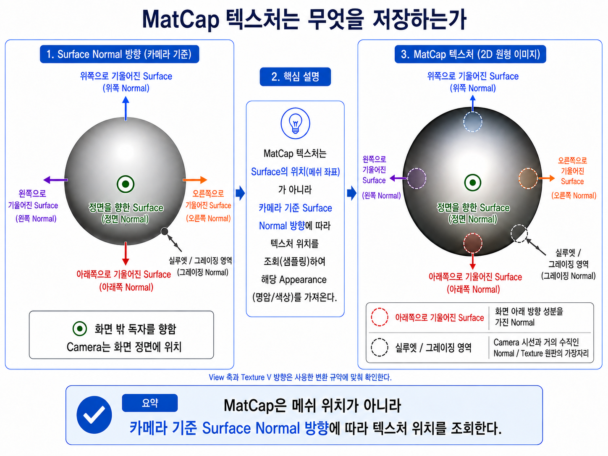
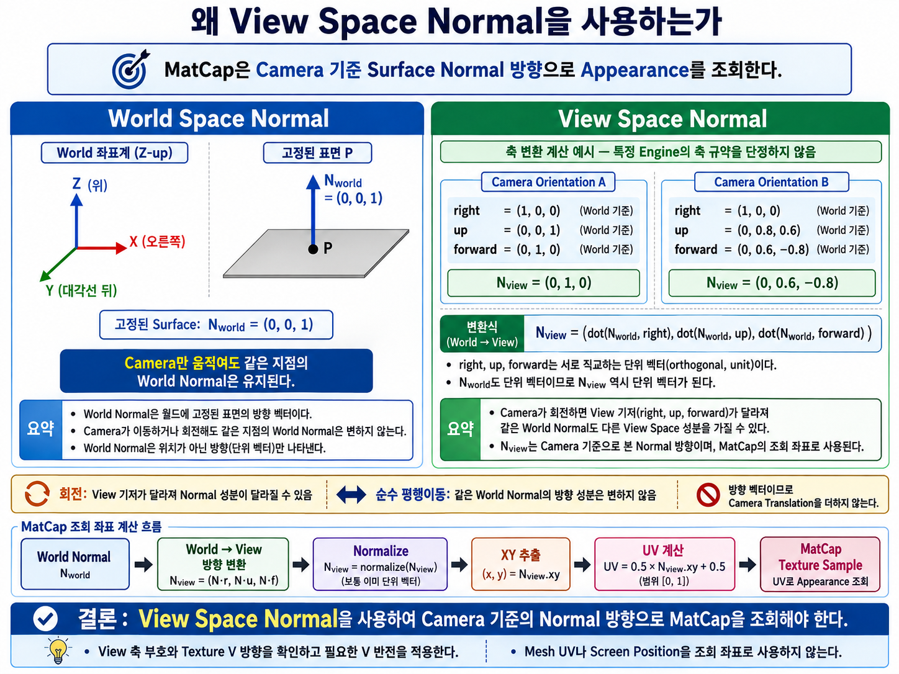
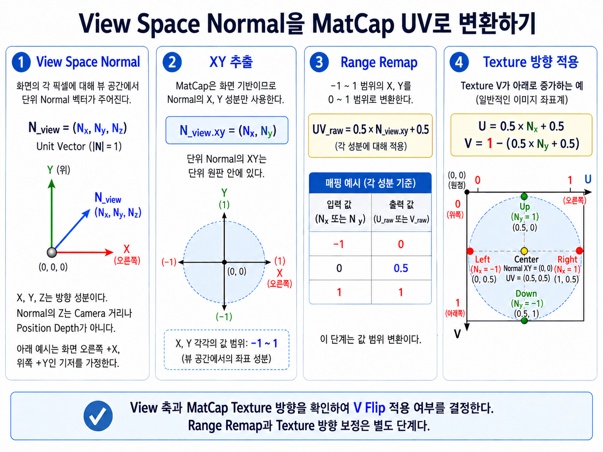
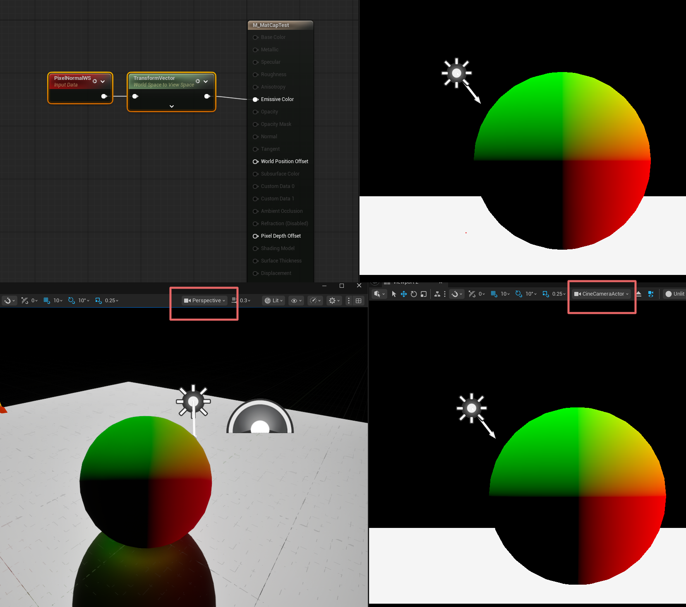
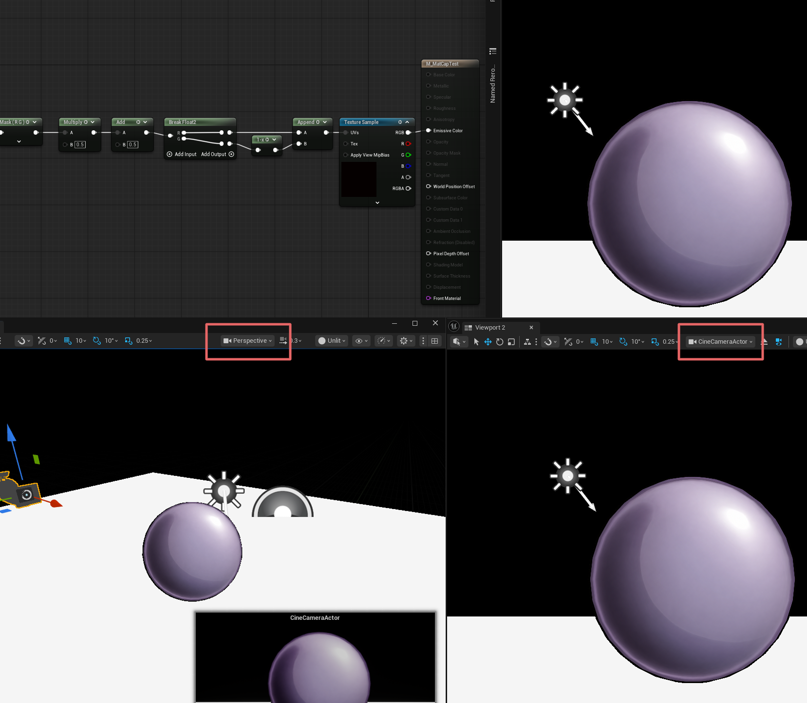
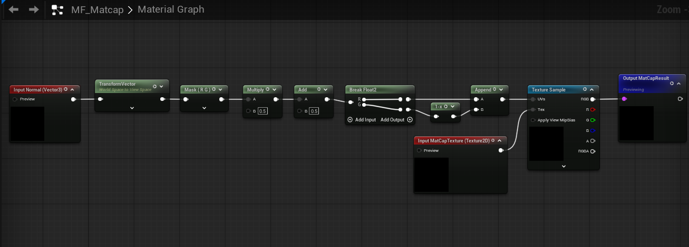
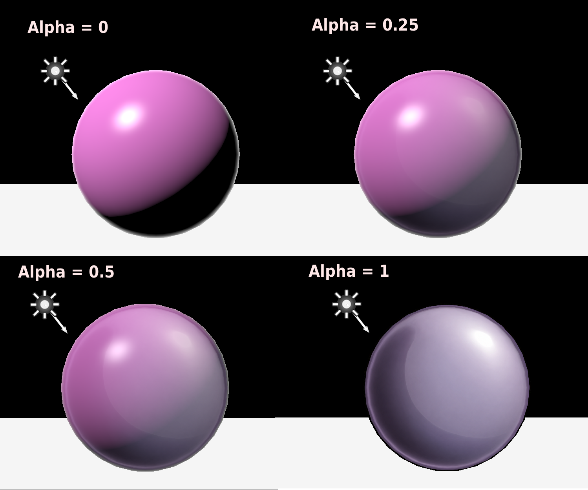
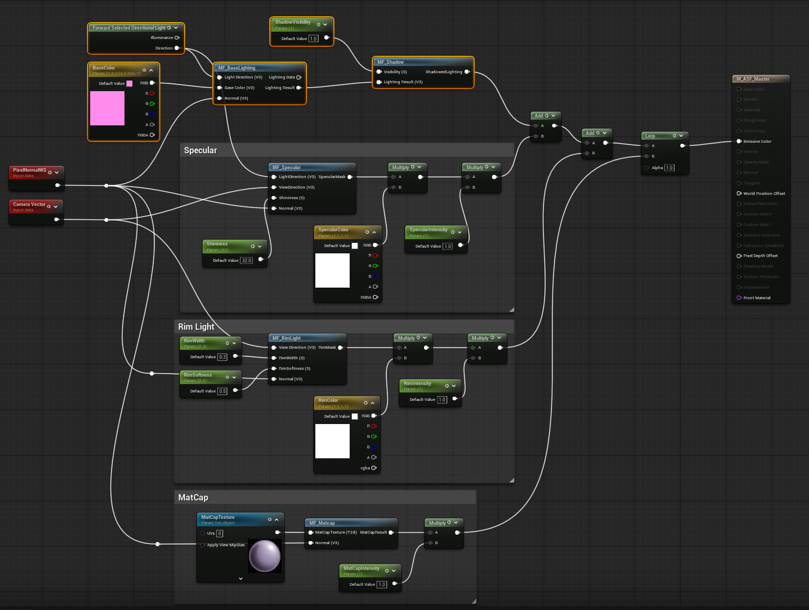

# Chapter 08 — Building an Anime Shader

## 8.6 MatCap

Chapter 8.5까지는 `Surface Normal`, `Light Direction`, `View Direction`과 같은 방향 Data를 이용하여 Base Lighting, Specular, Rim Light를 직접 계산했다.

이 방식은 Shader 안에서 실제 방향 관계를 계산하고, 그 결과를 필요에 맞게 Stylization하는 구조다.

하지만 Stylized Rendering에서는 항상 모든 표현을 Light Equation만으로 만들 필요는 없다.

때로는 복잡한 재질 느낌이나 특정한 Highlight Pattern을 수식으로 매번 계산하기보다,

**이미 만들어진 Lighting / Material Appearance를 Texture에 저장해두고 필요한 방향에 따라 읽어오는 방식**

이 더 효율적이고 직관적일 수 있다.

MatCap은 `Material Capture`의 줄임말이며, 재질이 보이는 모습인 Appearance를 이미지에 저장하고 표면 방향에 맞는 부분을 다시 읽는 기법이다. 예를 들어 보라색 구의 오른쪽 위에 밝은 무늬를 그려두면, 다른 Mesh에서도 Camera 기준으로 오른쪽 위를 향하는 표면이 그 무늬를 읽도록 만들 수 있다.

여기서 새로 계산할 것은 빛의 양 전체가 아니라 **이 표면 방향에 대응하는 이미지 위치**다. 앞에서 배운 Normal은 이번에도 표면의 방향을 알려주지만, 그 방향을 밝기 대신 Texture 좌표를 찾는 데 사용한다.

이번 절에서는 MatCap Texture를 단순히 Sphere에 Mapping하는 효과로 이해하지 않고,

**Surface Normal Direction을 2D Texture Coordinate로 변환하여 미리 저장된 Appearance를 조회하는 Rendering 방식**

이라는 관점에서 살펴본다.

전체 흐름은 다음과 같다.

~~~text
Surface Normal
↓
Camera 기준 방향으로 변환
↓
2D Coordinate 생성
↓
MatCap Texture Lookup
↓
Stored Lighting / Material Appearance
↓
Stylized Result
~~~

Implementation Note — Lookup Contract

MatCap은 View-space Normal 기반 Appearance Lookup이며 실제 Environment Reflection/IBL 계산과 다르다. 이 예제는 Camera Basis를 공유하는 투영 근사로, Perspective 화면의 모든 Pixel View Ray를 정확하게 사용하는 구면 Reflection Mapping과 같지 않다. Function Input은 World-space Normal과 Texture Object이고 Output은 Linear RGB MatCapResult이다.

Texture Object는 Chapter 04에서 구분한 Texture Resource를 전달하는 입력이다. 이미 읽힌 RGB 값이 아니라, Function이 자신이 만든 UV로 읽을 대상 Texture를 지정한다. Normal은 현재 계약의 World Space 비영 Unit Vector를 공급하고, 읽힌 Color가 Linear RGB가 되는 Decode 조건은 Sampling 단계에서 확인한다.

이를 통해 MatCap이 일반적인 Lighting 계산과 어떤 차이를 가지는지 이해하고, 최종적으로 `MF_MatCap`이라는 독립적인 Module로 구성하여 ASF Master Material에 통합한다.

---

### Why MatCap?

MatCap을 구현하기 전에 먼저 한 가지 질문을 생각해볼 필요가 있다.

> 이미 Base Lighting, Specular, Rim Light를 직접 계산하고 있는데 MatCap은 왜 필요한가?

기존 ASF Lighting Module은 Surface와 Light, Camera 사이의 방향 관계를 직접 계산한다.

예를 들어 Base Lighting에서는 다음과 같은 관계를 사용한다.

~~~text
Surface Normal
+
Light Direction
↓
N · L
↓
Lighting Contribution
~~~

Specular에서는 Light Direction과 View Direction까지 함께 사용한다.

~~~text
Light Direction
+
Surface Normal
+
View Direction
↓
Reflection Relation
↓
Specular Highlight
~~~

이러한 방식의 공통점은

**현재 Scene의 Lighting Condition을 기반으로 결과를 실시간으로 계산한다**

는 것이다.

---

#### Lighting Evaluation

일반적인 Lighting 기반 Shader는 다음과 같은 질문에 답한다.

~~~text
현재 Light는 어디에 있는가?

Surface는 어느 방향을 향하고 있는가?

Camera는 어느 방향에 있는가?

이 관계에서 Surface는 얼마나 밝아져야 하는가?
~~~

즉 Lighting은 여러 방향 Data와 Material Property를 이용해 매 Frame 결과를 계산한다.

~~~text
Light Data
+
Surface Data
+
View Data
↓
Lighting Equation
↓
Final Appearance
~~~

이 방식은 Scene의 Light 변화에 자연스럽게 반응하고, Lighting과 Object 사이의 논리적인 관계를 유지하기 좋다.

하지만 Stylized Rendering에서는 이러한 정확한 반응이 항상 가장 중요한 것은 아니다.

---

#### Artistic Appearance

Anime Style이나 NPR Rendering에서는 때때로 실제 Light 관계보다

**특정한 시각적 Pattern을 안정적으로 유지하는 것**

이 더 중요할 수 있다.

예를 들어 다음과 같은 표현을 생각할 수 있다.

- 금속처럼 보이는 강한 Highlight Pattern
- 특정 방향에 고정된 Gloss 표현
- 캐릭터 피부에 사용하는 부드러운 Lighting Gradient
- Hair에 사용하는 독특한 반사 Pattern
- 현실적인 Light Equation으로 만들기 어려운 과장된 Material Response

이러한 표현을 모두 수식과 Lighting Module만으로 만들 수도 있다.

하지만 원하는 결과가 명확하게 정해져 있다면, 그 결과를 Texture 형태로 미리 저장하고 필요한 위치에서 읽어오는 방법이 더 단순할 수 있다.

이때 사용하는 방식이 MatCap이다.

---

#### Appearance Lookup

MatCap의 핵심 차이는 여기서 나온다.

일반 Lighting은

~~~text
빛을 계산한다.
~~~

MatCap은

~~~text
빛처럼 보이는 결과를 조회한다.
~~~

즉 MatCap Texture에는 이미 어떤 Lighting 또는 Material Appearance가 저장되어 있다.

Shader는 현재 Surface 방향에 따라 Texture의 어느 위치를 읽을지를 결정하고, 그 위치에 저장된 Color를 가져온다.

개념적으로는 다음과 같다.

~~~text
Lighting

Surface / Light / View Data
↓
계산
↓
Appearance
~~~

반면 MatCap은 다음과 같다.

~~~text
Surface Direction
↓
Texture Coordinate
↓
MatCap Texture Lookup
↓
Stored Appearance
~~~

이 차이가 MatCap을 이해하는 가장 중요한 출발점이다.

---

#### Mesh UV and Normal-based Lookup

일반적인 Base Color Texture는 Mesh의 UV를 이용한다.

~~~text
Mesh UV
↓
Texture Coordinate
↓
Base Color Texture
~~~

따라서 Texture의 특정 위치는 Mesh의 특정 위치에 고정되어 있다.

예를 들어 얼굴 Texture의 눈 위치는 항상 얼굴 Mesh의 눈 영역에 대응한다.

하지만 MatCap은 다르다.

MatCap에서 Texture의 위치는 Object의 고정된 Surface Position보다

**Surface가 Camera를 기준으로 어느 방향을 향하고 있는가**

에 대응한다.

즉 MatCap은 위치 기반 Texture라기보다

**Direction Lookup Texture**

에 가깝다.

~~~text
일반 Texture
→ Surface Position / UV 기준

MatCap
→ Surface Normal Direction 기준
~~~

이 차이 때문에 Object를 회전하거나 Camera 방향이 바뀌면 같은 Surface라도 MatCap Texture에서 읽어오는 위치가 달라질 수 있다.

---

#### MatCap Benefits

MatCap의 가장 큰 장점은 복잡한 Appearance를 비교적 단순한 계산으로 표현할 수 있다는 점이다.

일반적인 Lighting에서는 특정 Material Look을 만들기 위해 여러 계산이 필요할 수 있다.

~~~text
Diffuse
Specular
Reflection
Roughness Response
Additional Mask
...
~~~

하지만 MatCap을 사용하면 이러한 결과 일부를 Texture에 미리 담아둘 수 있다.

~~~text
Stored Appearance
↓
Texture Lookup
↓
Result
~~~

따라서 다음과 같은 장점이 있다.

- 복잡한 Material Look을 빠르게 재현할 수 있다.
- Art Direction이 직관적이다.
- Texture 자체를 수정하여 Look을 쉽게 변경할 수 있다.
- Scene Light와 무관하게 비교적 일관된 Style을 유지할 수 있다.
- Stylized Character의 특정 Material 표현을 간단하게 강화할 수 있다.

특히 실사 Rendering보다 Art Direction의 비중이 큰 Anime Shader에서는 이러한 특성이 유용하다.

---

#### MatCap Limitations

하지만 MatCap이 모든 Lighting을 대체할 수 있는 것은 아니다.

MatCap은 실제 Scene Light를 계산한 결과가 아니기 때문에, Scene Lighting과 물리적으로 일치하지 않을 수 있다.

예를 들어 Scene의 Directional Light가 오른쪽으로 이동하더라도 MatCap에 저장된 Highlight Pattern은 같은 방식으로 반응하지 않을 수 있다.

즉 다음과 같은 한계가 있다.

~~~text
Scene Light와 직접적인 연동이 약함

실제 Light Direction과
MatCap Highlight Direction이 다를 수 있음

복잡한 환경 변화에
물리적으로 자연스럽게 반응하지 않을 수 있음
~~~

따라서 MatCap은

**정확한 Scene Lighting을 구현하기 위한 대체 기술**

이라기보다,

**원하는 Material Appearance를 추가하거나 강화하기 위한 Stylization Tool**

로 보는 것이 더 적절하다.

---

#### MatCap in ASF

ASF에서는 이미 다음과 같은 역할을 각각의 Module이 담당하고 있다.

~~~text
MF_BaseLighting
→ 기본 Light Direction에 따른 형태 표현

MF_Specular
→ Reflection 방향에 따른 Highlight

MF_RimLight
→ View Direction에 따른 Silhouette 강조
~~~

MatCap은 이 Module들과 다른 역할을 가진다.

~~~text
MF_MatCap
→ Texture에 저장된 Material / Lighting Appearance를
   Surface Direction에 따라 Lookup
~~~

즉 MatCap을 기존 Lighting의 완전한 대체로 사용하기보다,

~~~text
Base Lighting
→ 전체 형태와 Light 방향

Specular
→ Highlight

Rim
→ Silhouette

MatCap
→ 추가적인 Material / Lighting Style
~~~

처럼 사용하는 것이 ASF 구조에서는 더 자연스럽다.

---

#### Appearance and Additional Lighting

MatCap Texture에 밝은 Highlight가 포함되어 있기 때문에 MatCap을 하나의 추가 Light처럼 생각하기 쉽다.

하지만 MatCap은 반드시 Light만 저장하는 Texture는 아니다.

Texture 안에는 다음과 같은 다양한 Appearance를 담을 수 있다.

- Diffuse Gradient
- Specular Pattern
- Reflection 느낌
- Metallic Appearance
- Soft Lighting
- Stylized Highlight
- Material Color Variation

즉 MatCap은

**Lighting Result와 Material Appearance를 Texture 형태로 미리 표현한 Lookup Data**

라고 이해하는 편이 더 넓고 정확하다.

---

#### Stylized Applications

Anime Style에서는 실제 물리적 Lighting보다 특정 Material의 인상을 유지하는 것이 중요한 경우가 많다.

예를 들어 Hair Highlight를 생각해보자. 실제 Hair Reflection을 물리적으로 구현하려면 Hair Tangent, Anisotropic Reflection 등 더 복잡한 계산이 필요할 수 있다.

하지만 특정한 Anime Style의 Hair Highlight Pattern이 이미 정해져 있다면, 그 Pattern을 MatCap 형태로 저장하고 Surface 방향에 따라 읽어오는 방식으로 비슷한 인상을 빠르게 만들 수 있다.

또한 Armor, Accessory, Eye, Hair 등 특정 Material 영역에만 MatCap을 적용하여 기본 Lighting 위에 추가적인 스타일을 만들 수도 있다.

따라서 MatCap은 ASF에서

**복잡한 Material Response를 간단한 Texture Lookup으로 보완할 수 있는 Stylized Rendering Module**

로 사용할 수 있다.

---

#### Lookup Responsibility

MatCap이 Texture Lookup 방식이라고 해서 계산이 전혀 없는 것은 아니다.

여전히 Shader는

~~~text
Surface Normal
↓
Camera 기준 방향
↓
2D Coordinate
~~~

를 계산해야 한다.

다만 일반 Lighting처럼

~~~text
Surface가 이 Light를 얼마나 받는가?
~~~

를 계산하는 것이 아니라,

~~~text
이 방향의 Surface라면
MatCap Texture의 어디를 읽어야 하는가?
~~~

를 계산한다.

즉 계산의 목적이 다르다.

~~~text
Lighting

Direction
↓
Brightness 계산
~~~

~~~text
MatCap

Direction
↓
Texture Coordinate 계산
~~~

이 차이를 이해하면 이후 MatCap 구현에서 왜 `Surface Normal`과 `View Space`가 중요한지도 자연스럽게 연결된다.

---

이제 MatCap을 사용하는 목적과 일반 Lighting과의 차이를 확인했다.

다음 질문은 자연스럽게 다음으로 이어진다.

> MatCap Texture의 각 위치는 어떤 Surface Direction을 의미하는가?

MatCap Texture는 일반적인 UV Texture와 달리 Surface Normal Direction을 기준으로 조회된다.

다음 절에서는 MatCap Texture가 왜 일반적으로 Sphere 형태의 Lighting Pattern처럼 보이는지 살펴보고,

**Surface Normal과 MatCap Texture Position이 어떻게 대응되는지**

확인한다.

---

### MatCap Texture Contents

앞에서 이름을 풀어본 `Material Capture`는 재질의 모습을 저장한다는 뜻이었다. 이제 저장된 이미지의 각 위치가 무엇을 의미하는지 살펴보자. 이름 그대로 보면,

~~~text
Material
+
Capture
↓
MatCap
~~~

즉 **재질이 보이는 모습(Material Appearance)을 하나의 이미지로 캡처해 둔 것**에 가깝다.

다만 실제 Shader에서는 단순히 “캡처 이미지를 붙인다”기보다,

**현재 Surface가 Camera 기준으로 어느 방향을 향하고 있는지를 이용해 MatCap Texture의 적절한 위치를 찾아 그 Appearance를 가져오는 방식**

으로 사용한다.

여기서 중요한 개념이 바로 `Lookup`이다.

`Lookup`은 말 그대로

~~~text
어떤 값을 기준으로
미리 저장된 Data에서
대응하는 값을 찾아오는 것
~~~

을 의미한다.

예를 들어 Dictionary에서 단어를 찾거나, Table에서 Key에 맞는 값을 찾는 것과 비슷하다.

MatCap에서는 다음처럼 생각할 수 있다.

~~~text
Surface Normal Direction
↓
이 방향에 해당하는 Texture 위치 찾기
↓
그 위치의 Color / Appearance 가져오기
~~~

즉 MatCap Texture는 일반적인 UV Texture처럼 Mesh의 고정된 위치를 저장하는 이미지라기보다,

**Surface Normal Direction에 대응하는 Appearance를 저장한 Lookup Texture**

라고 이해하면 된다.

---

#### Texture Lookup Coordinates

일반적인 Base Color Texture는 Mesh의 UV에 따라 조회된다.

~~~text
Mesh UV
↓
Texture Position
↓
Base Color
~~~

이 경우 Texture의 특정 위치는 Mesh의 특정 영역과 직접 연결된다.

예를 들어 얼굴 Texture에서 눈썹이 그려진 위치는 항상 얼굴 Mesh의 눈썹 영역에 대응한다.

즉 일반 Texture는 기본적으로 다음 질문에 답한다.

~~~text
Mesh의 어느 위치인가?
~~~

반면 MatCap은 다른 질문을 사용한다.

~~~text
이 Surface는 Camera를 기준으로
어느 방향을 향하고 있는가?
~~~

따라서 두 방식을 간단히 비교하면 다음과 같다.

~~~text
일반 Texture
→ Mesh UV / Surface Position 기준

MatCap Texture
→ Surface Normal Direction 기준
~~~

MatCap에서는 같은 Surface라도 Camera와 Object의 관계가 달라지면 다른 Texture 위치를 조회할 수 있다.

이것이 일반 UV Texture와 MatCap의 가장 중요한 차이다.

---

#### Sphere Appearance

MatCap Texture가 흔히 구처럼 보이는 이유는 Sphere가 다양한 Surface Normal Direction을 한 화면 안에서 매우 쉽게 보여줄 수 있기 때문이다.

Sphere의 정면 중앙을 생각해보자. Camera가 Sphere를 정면에서 보고 있다면, 중앙 Surface의 Normal은 거의 Camera를 향한다.

~~~text
Sphere Center
↓
Front-facing Normal
~~~

Sphere의 오른쪽으로 이동하면 Surface Normal은 오른쪽으로 기울어진다.

~~~text
Sphere Right
↓
Right-facing Normal
~~~

왼쪽은 왼쪽으로, 위쪽은 위쪽으로, 아래쪽은 아래쪽으로 기울어진다.

~~~text
          Up Normal
             ↑

Left Normal ← Center → Right Normal

             ↓
         Down Normal
~~~

그리고 Sphere의 외곽으로 갈수록 Surface Normal은 Camera 방향과 점점 수직에 가까워진다.

즉 하나의 Sphere만으로도

- Front-facing Normal
- Left / Right Normal
- Up / Down Normal
- Grazing Normal

을 모두 표현할 수 있다.

그래서 MatCap Texture는 자연스럽게 구를 정면에서 바라본 것과 비슷한 형태를 가진다.

---

#### Texture Center

MatCap Texture의 중앙은 일반적으로 Camera를 정면으로 향하는 Surface를 의미한다.

즉 다음과 같은 상태다.

~~~text
Surface Normal
≈
View Direction
~~~

따라서 MatCap Texture의 중앙이 밝다면, Camera를 정면으로 바라보는 Surface가 밝게 보인다.

~~~text
MatCap Center = Bright
↓
Front-facing Surface = Bright
~~~

여기서 중요한 점은, MatCap Texture의 중앙이 **Object의 중앙 위치를 의미하지 않는다**는 것이다.

중앙은 위치가 아니라 방향을 의미한다.

~~~text
MatCap Center
≠
Object Center

MatCap Center
=
Front-facing Normal Direction
~~~

---

#### Texture Axes

MatCap Texture의 각 방향은 Camera 기준 Surface Normal의 방향과 대응한다.

~~~text
MatCap Left
→ Left-facing Normal

MatCap Right
→ Right-facing Normal

MatCap Top
→ Up-facing Normal

MatCap Bottom
→ Down-facing Normal
~~~

예를 들어 MatCap Texture의 오른쪽 위에 강한 Highlight가 있다면, Camera 기준으로 오른쪽 위 방향을 향하는 Surface에서 그 Highlight가 나타난다.

이 때문에 MatCap은 특정한 Material Pattern을 매우 직관적으로 디자인할 수 있다.

원하는 방향에 밝은 영역을 그려두면, 그 방향을 향하는 Surface가 해당 Appearance를 Lookup해서 가져오기 때문이다.

---

#### Grazing Region

Sphere의 가장자리에서는 Surface가 Camera를 정면으로 바라보지 않는다.

대신 Surface Normal은 Camera 방향과 거의 수직에 가까워진다.

이 관계는 Rim Light에서 확인했던 `N · V`와도 연결된다.

Sphere 중앙에서는

~~~text
N · V ≈ 1
~~~

이지만, 실루엣에 가까워질수록

~~~text
N · V ≈ 0
~~~

에 가까워진다.

따라서 MatCap Texture의 외곽은

**Grazing Angle에 가까운 Surface**

를 의미한다.

~~~text
MatCap Center
→ Front-facing Surface

MatCap Border
→ Grazing Surface
~~~

그래서 MatCap Texture의 외곽에 밝은 Pattern을 그려두면, Object의 실루엣 주변에서 밝은 효과가 나타날 수 있다.

겉으로 보면 Rim Light와 비슷해 보일 수 있지만 계산 방식은 다르다.

Rim Light는

~~~text
N · V
↓
Mask 계산
~~~

을 수행하지만, MatCap은

~~~text
Surface Normal Direction
↓
Texture Position 찾기
↓
Stored Appearance Lookup
~~~

을 수행한다.

---

#### Stored Appearance

MatCap Texture에는 반드시 현실적인 Lighting만 저장할 필요는 없다.

Texture 자체가 최종 Appearance의 형태를 결정하기 때문이다.

예를 들어 다음과 같은 정보를 저장할 수 있다.

- Diffuse Gradient
- Specular Highlight
- Metallic Reflection 느낌
- Soft Skin Lighting
- Hair Highlight
- Color Variation
- Edge Highlight
- Stylized Reflection
- 비현실적인 Anime Style Pattern

즉 MatCap은 단순히 Light 정보를 저장하는 Texture라기보다,

**특정 Surface Direction에서 보여주고 싶은 Material Appearance를 저장하는 Texture**

라고 이해하는 것이 더 정확하다.

---

#### Reusing the Lookup

MatCap은 Mesh의 UV에 직접 종속되지 않는다.

일반 Texture는 보통 특정 Mesh의 UV 구조에 맞게 제작한다.

~~~text
Face Texture
→ Face UV 필요

Armor Texture
→ Armor UV 필요
~~~

하지만 MatCap은 Surface Normal Direction을 기준으로 Appearance를 Lookup한다.

따라서 서로 다른 Mesh라도 같은 방향을 향하는 Surface라면 같은 MatCap 영역을 사용할 수 있다.

~~~text
Sphere
Cube
Character
Armor
↓
Surface Normal Direction 확인
↓
같은 MatCap Texture Lookup
~~~

그래서 하나의 MatCap Texture를 다양한 Object에 빠르게 적용할 수 있다.

이 특징은 MatCap이 Material Look을 빠르게 테스트하거나 Stylized Appearance를 추가할 때 유용한 이유 중 하나다.

---

#### Camera-relative Direction

여기까지 보면 MatCap이 Surface Normal을 사용한다는 것은 이해할 수 있다.

하지만 한 가지 질문이 남는다.

> 그렇다면 World Space Normal을 그대로 사용하면 되는가?

그렇지 않다.

MatCap은 기본적으로

**Camera에서 바라본 Surface 방향**

을 기준으로 동작한다.

World Space에서 같은 Normal이라도 Camera가 회전하면 Camera 기준으로 보이는 방향은 달라진다.

따라서 MatCap에서는 Surface Normal을 Camera 기준 공간으로 변환해서 사용하는 것이 중요하다.

~~~text
World Space Normal
↓
Camera 기준 공간으로 변환
↓
View Space Normal
↓
MatCap Lookup
~~~

이것이 이후 구현에서 `View Space Normal`이 필요한 이유다.

---

#### A Virtual Sphere

MatCap Texture를 이해하는 가장 쉬운 방법 중 하나는

**Camera 앞에 가상의 Sphere가 하나 있다고 생각하는 것**

이다.

그 Sphere의 각 위치는 서로 다른 Surface Normal Direction을 가진다.

~~~text
Sphere Center
→ Front-facing Normal

Sphere Left
→ Left-facing Normal

Sphere Right
→ Right-facing Normal

Sphere Top
→ Up-facing Normal

Sphere Bottom
→ Down-facing Normal

Sphere Border
→ Grazing Normal
~~~

그리고 MatCap Texture에는 그 가상의 Sphere에서 각 방향이 어떤 모습으로 보여야 하는지가 저장되어 있다고 생각할 수 있다.

실제 Mesh에서는 현재 Surface Normal Direction을 확인한 뒤, 가상의 Sphere에서 같은 방향에 해당하는 위치를 찾아 그 Color를 가져온다.

~~~text
Actual Mesh Surface
↓
Surface Normal Direction
↓
가상의 Sphere에서 같은 방향 찾기
↓
MatCap Texture Position
↓
Color / Appearance Lookup
~~~

이렇게 생각하면 MatCap Texture가 왜 Sphere를 정면에서 바라본 이미지처럼 생기는지도 자연스럽게 이해할 수 있다.

---

#### Key Takeaways

MatCap은 `Material Capture`의 줄임말이다.

말 그대로 Material Appearance를 미리 이미지 형태로 저장해두고, Surface Direction을 기준으로 필요한 Appearance를 찾아 사용하는 방식이다.

여기서 `Lookup`은

~~~text
어떤 값을 기준으로
미리 저장된 Data에서
대응하는 값을 찾아오는 것
~~~

을 의미한다.

MatCap에서 Lookup 기준은 Mesh 위치가 아니라 Surface Normal Direction이다.

~~~text
일반 Texture
→ Mesh UV 기준

MatCap
→ Surface Normal Direction 기준
~~~

MatCap Texture가 Sphere처럼 보이는 이유는 Sphere가 다양한 Surface Normal Direction을 한 화면 안에서 표현할 수 있기 때문이다.

~~~text
Center
→ Front-facing Normal

Left / Right
→ 좌우 방향 Normal

Top / Bottom
→ 위아래 방향 Normal

Border
→ Grazing Normal
~~~

따라서 MatCap의 기본 Data Flow는 다음과 같이 정리할 수 있다.

~~~text
Surface Normal Direction
↓
MatCap Texture Position 찾기
↓
Lookup
↓
Stored Appearance
~~~

이제 다음 질문이 남는다.

> Surface Normal을 Camera 기준 Direction으로 어떻게 바꿀 수 있을까?

다음 절에서는 `World Space Normal`과 `View Space Normal`의 차이를 살펴보고, 왜 MatCap 구현에서 `View Space Normal`이 필요한지 확인한다.

---

이어서 [Why View-space Normal?](#why-view-space-normal)에서 다음 단계를 살펴본다.

---

### Why View-space Normal?

앞 절에서는 MatCap Texture가 Mesh의 고정된 UV 위치를 기준으로 동작하는 것이 아니라,

**Surface Normal Direction을 기준으로 Appearance를 Lookup하는 Texture**

라는 점을 확인했다.

그렇다면 다음 질문이 생긴다.

> Surface Normal을 그냥 그대로 사용하면 되는가?

여기서 중요한 것이 `Coordinate Space`다.

같은 Surface Normal이라도

- World를 기준으로 바라보는가
- Camera를 기준으로 바라보는가

에 따라 그 방향의 의미가 달라진다.

MatCap은 Camera 기준 Appearance를 사용하기 때문에, Surface Normal도 Camera 기준으로 해석해야 한다.

즉 MatCap 구현에서는 `World Space Normal`보다 `View Space Normal`이 더 적합하다.

---

#### World-space Normal

먼저 `World Space Normal`을 생각해보자. World Space는 Scene 전체에서 사용하는 고정된 기준 좌표계다.

예를 들어 Unreal Scene에서 World Space의 축은 Object나 Camera가 움직여도 기본적으로 변하지 않는다.

~~~text
World Space

X
→ World 기준 좌우 방향

Y
→ World 기준 다른 수평 방향

Z
→ World 기준 위쪽 방향
~~~

중요한 점은

**Camera가 움직여도 World Space 자체는 Camera를 따라 움직이지 않는다**

는 것이다.

예를 들어 Sphere의 어떤 Surface에 하나의 Normal이 있다고 하자. Camera가 왼쪽에 있을 때도, Camera가 오른쪽으로 이동했을 때도, 그 Surface 자체가 변하지 않았다면 World Space Normal 값은 그대로다.

~~~text
Camera A

        Normal
          ↗
       Surface
          ○

World Space Normal
= 동일
~~~

Camera가 이동해도

~~~text
                Camera B

        Normal
          ↗
       Surface
          ○

World Space Normal
= 동일
~~~

이다.

왜냐하면 World Space Normal은

~~~text
Camera에서 어떻게 보이는가?
~~~

를 표현하는 값이 아니라,

~~~text
World에서 어느 방향을 향하고 있는가?
~~~

를 표현하는 값이기 때문이다.

---

#### World and Screen Orientation

MatCap에서 필요한 것은 단순히 World에서의 방향이 아니다.

우리가 알고 싶은 것은 다음이다.

> 현재 Camera에서 이 Surface를 보았을 때, 이 Surface는 화면 기준으로 어느 방향으로 기울어져 있는가?

예를 들어 어떤 Surface Normal이 World 기준으로 오른쪽 위를 향하고 있다고 하자. Camera가 정면에 있을 때는 화면에서도 오른쪽 위를 향하는 것처럼 보일 수 있다.

하지만 Camera가 Object 주위를 돌아가면, 같은 World Space Normal이라도 화면에서는 전혀 다른 방향으로 보일 수 있다.

즉

~~~text
World Space Normal
→ World에서의 방향은 알 수 있음

하지만

→ 화면에서 어느 방향으로 기울어져 보이는지는
  직접 알기 어려움
~~~

이다.

MatCap은 화면 기준으로 Texture를 Lookup해야 하므로, 이 상태는 충분하지 않다.

---

#### Camera Orientation

이 부분이 View Space를 이해하는 핵심이다.

하나의 Surface Point를 고정해두고 Camera만 이동한다고 생각해보자. Surface도 그대로고, Surface Normal도 World Space에서는 그대로다.

하지만 Camera가 바뀌면

**Camera에서 바라본 Surface의 기울기**

는 달라진다.

예를 들어 Camera A에서는 Surface가 화면 기준으로 왼쪽 위를 향하고 있을 수 있다.

~~~text
Camera A 기준

Surface Normal
→ 화면 왼쪽 위
~~~

Camera가 반대쪽으로 이동하면, 같은 Surface Normal이 이번에는 화면 기준으로 오른쪽 방향에 더 가깝게 보일 수 있다.

~~~text
Camera B 기준

같은 Surface Normal
→ 화면 오른쪽 방향
~~~

즉 실제 Normal은 바뀌지 않았지만,

**Camera 기준 해석은 달라진다.**

MatCap에서는 바로 이 Camera 기준 해석이 필요하다.

---

#### Camera Basis

`View Space`는 Camera를 기준으로 만들어지는 Coordinate Space다.

World Space가 Scene 전체에 고정된 Coordinate System이라면, View Space는 Camera의 위치와 방향을 기준으로 좌표계를 다시 정의한다.

개념적으로는 다음과 같다.

~~~text
World Space
→ Scene 기준

View Space
→ Camera 기준
~~~

Camera가 회전하면 View Space의 기준 축도 함께 회전한다.

Camera가 회전하면 같은 World-space Normal의 View-space 성분이 바뀐다. Camera의 순수 Translation은 방향 Vector의 성분을 바꾸지 않는다. Position과 Direction의 변환을 구분한다(Chapter 02). Camera 이동 시 관찰되는 Pixel/Surface는 달라질 수 있다.

이것이 MatCap에 필요한 특성이다.

---

#### World and View Bases

두 Space의 차이를 아주 단순하게 정리하면 다음과 같다.

~~~text
World Space

"이 Surface는
World에서 어느 방향을 향하고 있는가?"
~~~

반면 View Space는

~~~text
View Space

"이 Surface는
Camera에서 보았을 때
어느 방향을 향하고 있는가?"
~~~

를 표현한다.

MatCap이 필요한 것은 두 번째 정보다.

왜냐하면 MatCap Texture의 좌우와 상하는 World의 좌우와 상하가 아니라,

**화면에서 보이는 좌우와 상하 방향**

에 대응해야 하기 때문이다.

---

#### View-relative Lookup

앞 절에서 MatCap Texture의 의미를 다음과 같이 정리했다.

~~~text
MatCap Center
→ Front-facing Normal

MatCap Left
→ 화면 기준 왼쪽으로 기울어진 Normal

MatCap Right
→ 화면 기준 오른쪽으로 기울어진 Normal

MatCap Top
→ 화면 기준 위쪽으로 기울어진 Normal

MatCap Bottom
→ 화면 기준 아래쪽으로 기울어진 Normal
~~~

여기서 핵심은 모두

~~~text
화면 기준
~~~

이라는 점이다.

MatCap Texture의 오른쪽에 Highlight가 있다고 해보자. 그 Highlight가 적용되어야 하는 Surface는

~~~text
World에서 오른쪽을 향하는 Surface
~~~

가 아니라,

~~~text
현재 Camera 화면에서
오른쪽 방향으로 기울어져 보이는 Surface
~~~

다.

따라서 World Space보다 View Space가 MatCap에 더 적합하다.

---

#### View-space Axes

View Space에서는 축을 Camera 기준으로 해석할 수 있다.

개념적으로 보면 다음과 같다.

~~~text
View Space X
→ 화면의 좌 / 우 방향

View Space Y
→ 화면의 위 / 아래 방향

View Space Z
→ Camera를 향하거나 멀어지는 방향
~~~

이 중 MatCap에서 특히 중요한 것은 `X`와 `Y`다.

왜냐하면 MatCap Texture는 2D 이미지이기 때문이다.

Texture 좌표도 결국

~~~text
U
→ 좌 / 우

V
→ 위 / 아래
~~~

라는 두 축으로 구성된다.

그래서 다음과 같은 연결이 가능하다.

~~~text
View Space Normal X
↓
MatCap Texture U

View Space Normal Y
↓
MatCap Texture V
~~~

이 관계가 MatCap UV를 만드는 핵심이 된다.

---

#### Using Normal XY

Surface Normal은 3차원 Vector다.

~~~text
Normal
=
X, Y, Z
~~~

하지만 MatCap Texture는 2차원 이미지다.

~~~text
MatCap UV
=
U, V
~~~

따라서 3D Direction을 2D Coordinate로 바꾸어야 한다.

View Space에서 Normal의 `X`와 `Y`는 화면 평면에서 Surface가 어느 방향으로 기울어져 있는지를 나타낸다.

~~~text
X
→ 화면 좌우 방향

Y
→ 화면 상하 방향
~~~

그래서 MatCap의 2D 위치를 만들기 위한 정보로 사용할 수 있다.

반면 `Z`는

~~~text
Surface가 Camera를 얼마나 향하고 있는가
~~~

에 가까운 정보를 가진다.

즉 Z는 화면 평면 위의 위치를 직접 나타내기보다는, Camera의 기준 축에 대한 Normal 방향 성분이다. Position의 Depth나 Camera까지의 거리가 아니다.

MatCap Texture의 좌우·상하 위치를 만들기 위해서는

~~~text
View Space Normal XY
~~~

가 더 직접적인 Data가 된다.

---

#### Connection to Rim Light

앞에서 구현한 Rim Light를 떠올리면 이 관계를 조금 더 쉽게 이해할 수 있다.

Rim Light에서는

~~~text
N · V
~~~

를 사용하여

~~~text
Surface가 Camera를 얼마나 정면으로 향하고 있는가?
~~~

를 판단했다.

즉 Camera와 Surface의 관계를 하나의 Scalar 값으로 압축했다.

반면 MatCap에서는 그 관계를 더 구체적으로 사용한다.

~~~text
Rim Light
→ Camera와 Surface의 각도 크기

MatCap
→ Camera 기준에서 Surface가
   어느 방향으로 기울어져 있는가
~~~

즉 MatCap에서는 단순히 정면인지 외곽인지뿐만 아니라,

~~~text
왼쪽인가?
오른쪽인가?
위쪽인가?
아래쪽인가?
~~~

까지 알아야 한다.

그래서 Dot Product 하나만으로는 부족하고, Camera 기준으로 변환된 Normal Vector 자체가 필요하다.

---

#### Orientation Example

MatCap Texture의 오른쪽 위에 강한 Highlight가 있다고 가정해보자.

~~~text
MatCap Texture

        Highlight
             ●
             ↗
       ○
~~~

이 Highlight가 나타나려면 Surface가 Camera 기준으로

~~~text
오른쪽
+
위쪽
~~~

방향으로 기울어져 있어야 한다.

즉 View Space Normal에서

~~~text
X
→ 오른쪽 방향 성분

Y
→ 위쪽 방향 성분
~~~

이 존재해야 한다.

Shader는 이 값을 이용하여 MatCap Texture의 오른쪽 위 영역을 Lookup한다.

Camera가 Object 주위를 이동하면 같은 Surface라도 View Space Normal이 달라진다.

그러면 MatCap Texture에서 Lookup하는 위치도 달라진다.

결과적으로 Highlight가

**Camera 기준 Material Appearance**

처럼 보이게 된다.

---

#### Transforming the Normal

실제 MatCap 구현에서는 일반적으로 Surface Normal을 먼저 얻는다.

예를 들어 Unreal에서는 `PixelNormalWS`를 통해 World Space Normal을 얻을 수 있다.

~~~text
PixelNormalWS
↓
World Space Normal
~~~

하지만 이 값을 그대로 MatCap UV로 사용하지 않는다.

Camera 기준으로 해석하기 위해 View Space로 변환한다.

~~~text
World Space Normal
↓
World → View Transform
↓
View Space Normal
~~~

이렇게 얻어진 View Space Normal은

~~~text
X
→ Camera 화면 기준 좌우

Y
→ Camera 화면 기준 상하

Z
→ Camera 방향 관계
~~~

로 해석할 수 있다.

그리고 여기서 `XY`를 사용하여 MatCap Texture Coordinate를 만들 수 있다.

---

#### View-space Summary

MatCap은

~~~text
World에서 Surface가 어느 방향인가?
~~~

가 아니라,

~~~text
Camera에서 보았을 때
Surface가 어느 방향으로 기울어져 있는가?
~~~

를 기준으로 Appearance를 Lookup한다.

따라서 MatCap에는

**Camera 기준으로 표현된 Surface Normal**

즉 `View Space Normal`이 필요하다.

---

#### Key Takeaways

World Space Normal은 Surface가 World 기준으로 어느 방향을 향하고 있는지를 나타낸다.

~~~text
World Space Normal
→ World 기준 Surface Direction
~~~

Camera가 이동해도 Surface와 Object가 그대로라면 World Space Normal은 변하지 않는다.

하지만 MatCap에서 필요한 것은 World 기준 방향이 아니다.

MatCap은 Texture의

~~~text
Left
Right
Top
Bottom
Center
~~~

을 Camera 화면 기준 Surface Direction과 대응시켜야 한다.

따라서 Surface Normal을 Camera 기준 Coordinate Space로 변환해야 한다.

~~~text
World Space Normal
↓
View Space Transform
↓
View Space Normal
~~~

View Space에서는 Normal의 각 성분을 다음처럼 해석할 수 있다.

~~~text
X
→ 화면 좌 / 우

Y
→ 화면 위 / 아래

Z
→ Camera 방향 관계
~~~

그리고 MatCap은 주로 `View Space Normal`의 `X`, `Y` 성분을 이용하여 2D Texture Coordinate를 만든다.

전체 흐름은 다음과 같다.

~~~text
World Space Normal
↓
View Space Normal
↓
XY 추출
↓
2D MatCap Coordinate
↓
MatCap Texture Lookup
~~~

이제 Surface Normal을 Camera 기준으로 해석할 수 있게 되었다.

다음 단계에서는 `View Space Normal`의 `XY` 값이 어떤 범위를 가지는지 살펴보고, 이를 실제 Texture에서 사용할 수 있는 `0~1 UV Coordinate`로 어떻게 변환하는지 확인한다.

---

이어서 [From Normal to MatCap UV](#from-normal-to-matcap-uv)에서 다음 단계를 살펴본다.

---

### From Normal to MatCap UV

앞 절에서는 MatCap이 `World Space Normal`이 아니라,

**Camera 기준으로 해석된 `View Space Normal`**

을 사용하는 이유를 살펴보았다.

이제 다음 단계는 View Space Normal을 실제 MatCap Texture에서 사용할 수 있는 2D UV Coordinate로 변환하는 것이다.

전체 흐름은 다음과 같다.

~~~text
World Space Normal
↓
View Space Normal
↓
XY 추출
↓
-1 ~ 1
↓
0 ~ 1 Remap
↓
MatCap UV
~~~

---

#### Three-dimensional Normal

Surface Normal은 방향을 나타내는 3차원 Vector다.

~~~text
Normal
=
X, Y, Z
~~~

View Space로 변환한 이후에도 Normal은 여전히 3개의 성분을 가진다.

~~~text
View Space Normal

X
→ 화면 기준 좌 / 우 방향

Y
→ 화면 기준 위 / 아래 방향

Z
→ Camera 방향과의 관계
~~~

하지만 우리가 Lookup하려는 MatCap Texture는 2차원 이미지다.

Texture Coordinate는 다음 두 값만 필요하다.

~~~text
UV

U
→ Texture 좌 / 우

V
→ Texture 위 / 아래
~~~

따라서 3D Normal Direction을 2D Coordinate로 바꾸기 위해 `View Space Normal`의 `X`, `Y` 성분을 사용한다.

~~~text
View Space Normal
(X, Y, Z)

↓

XY 추출

↓

(X, Y)
~~~

개념적으로는 다음과 같이 대응된다.

~~~text
Normal X
→ Texture U

Normal Y
→ Texture V
~~~

---

#### Selecting XY

앞 절에서 확인했듯이 View Space에서 X와 Y는 화면 평면에서의 Surface 방향을 나타낸다.

~~~text
X
→ 화면 좌 / 우

Y
→ 화면 위 / 아래
~~~

MatCap Texture 역시 화면에서 보이는 방향을 2D 이미지로 표현한다.

따라서

~~~text
View Space Normal XY
~~~

가 MatCap Texture의 위치를 결정하기 위한 가장 직접적인 정보가 된다.

반면 Z는 Surface가 Camera 방향을 얼마나 향하고 있는지를 표현하는 성분에 가깝다.

MatCap Texture의 2D 좌우·상하 위치를 직접 만들기 위해서는 X와 Y가 필요하다.

---

#### Normal Component Range

Normalize된 Direction Vector의 각 성분은 일반적으로

~~~text
-1 ~ 1
~~~

사이의 값을 가진다.

예를 들어 View Space Normal의 X 성분을 생각해보자.

~~~text
X = -1
→ 화면 기준 왼쪽 방향

X = 0
→ 좌우 기울기가 없음

X = 1
→ 화면 기준 오른쪽 방향
~~~

Y도 마찬가지다.

~~~text
Y = -1
→ 화면 기준 아래 방향

Y = 0
→ 상하 기울기가 없음

Y = 1
→ 화면 기준 위 방향
~~~

따라서 View Space Normal의 XY를 그대로 보면 다음과 같은 좌표 공간을 가진다.

~~~text
             Y = 1

               ↑

X = -1  ←   (0,0)   →  X = 1

               ↓

             Y = -1
~~~

하지만 이 값을 Texture UV에 그대로 사용할 수는 없다.

---

#### MatCap Tile Range

이 MatCap 예제는 한 Texture Tile의 0–1 UV를 사용한다. UV 일반이 항상 0–1로 제한되는 것은 아니며 범위 밖은 Address Mode에 따라 처리된다.

~~~text
U
0 → 1

V
0 → 1
~~~

즉 Texture의 좌측은 U = 0, 우측은 U = 1에 해당한다.

~~~text
U

0 ---------------- 1

Left             Right
~~~

V도 같은 방식으로 Texture의 세로 위치를 나타낸다.

따라서 현재 가지고 있는

~~~text
Normal XY

-1 ~ 1
~~~

범위를

~~~text
Texture UV

0 ~ 1
~~~

범위로 바꿔야 한다.

이 과정이 `Remap`이다.

---

#### Remap

`Remap`은 어떤 값의 범위를 다른 범위로 비례해서 옮기는 것이다.

이번 경우에는

~~~text
Input

-1 ~ 1
~~~

을

~~~text
Output

0 ~ 1
~~~

로 바꾼다.

중요한 것은 값의 상대적인 위치 관계가 유지된다는 점이다.

~~~text
-1
→ 0

0
→ 0.5

1
→ 1
~~~

즉 입력 범위에서 가운데였던 `0`은 출력 범위에서도 가운데인 `0.5`가 된다.

그래서 Remap은 단순히 값을 잘라내거나 강제로 제한하는 것이 아니다.

~~~text
기존 범위 안에서의 상대적인 위치
↓
유지
↓
새로운 범위로 이동
~~~

이라고 이해하면 된다.

---

#### Normalize and Remap

여기서 `Normalize`와 `Remap`을 혼동하기 쉽다.

둘은 전혀 다른 연산이다.

**Normalize**

Normalize는 Vector의 **길이를 1로 만드는 연산**이다.

~~~text
Vector
↓
Normalize
↓
방향은 유지
Length = 1
~~~

예를 들어

~~~text
(2, 0, 0)

↓

Normalize

↓

(1, 0, 0)
~~~

이다.

또 다른 예를 보면

~~~text
(2, 2, 0)

↓

Normalize

↓

(0.707, 0.707, 0)
~~~

정도가 된다.

중요한 점은

**Normalize한다고 해서 값이 0 ~ 1 범위로 바뀌는 것이 아니라는 것**이다.

음수도 그대로 존재할 수 있다.

예를 들어

~~~text
(-2, 0, 0)

↓

Normalize

↓

(-1, 0, 0)
~~~

이다.

즉 Normalize의 목적은

~~~text
0 ~ 1로 만들기
~~~

가 아니라

~~~text
Vector Length를 1로 만들기
~~~

다.

---

**Remap**

반면 Remap은 Vector의 길이를 조정하는 연산이 아니다.

값의 범위를 바꾸는 것이다.

~~~text
-1 ~ 1

↓

Remap

↓

0 ~ 1
~~~

따라서 두 연산은 다음처럼 구분할 수 있다.

~~~text
Normalize

→ Vector의 방향 유지
→ Vector Length를 1로 맞춤
→ 음수 값도 존재 가능
~~~

~~~text
Remap

→ 값의 범위를 다른 범위로 이동
→ 상대적인 위치 관계 유지
~~~

MatCap UV를 만드는 과정에서 필요한 것은

~~~text
Normalize
~~~

가 아니라

~~~text
-1 ~ 1
→
0 ~ 1

Remap
~~~

이다.

---

#### Range Conversion

이제 실제 변환 과정을 살펴보자. 현재 값은 다음 범위에 있다.

~~~text
-1 -------- 0 -------- 1
~~~

먼저 전체 범위를 절반으로 줄인다.

즉 `0.5`를 Multiply한다.

~~~text
Value × 0.5
~~~

그러면

~~~text
-1 → -0.5

 0 →  0

 1 →  0.5
~~~

가 된다.

범위는 다음처럼 바뀐다.

~~~text
-0.5 -------- 0 -------- 0.5
~~~

범위의 크기는 이제 `0 ~ 1`과 동일한 크기지만, 중심이 아직 0에 있다.

Texture UV의 중심은 `0.5`이므로 전체 값을 오른쪽으로 `0.5`만큼 이동시킨다.

~~~text
Value + 0.5
~~~

그러면

~~~text
-0.5 → 0

0
→ 0.5

0.5
→ 1
~~~

이 된다.

결과적으로

~~~text
-1 → 0

0 → 0.5

1 → 1
~~~

이라는 원하는 변환이 만들어진다.

---

#### MatCap UV Formula

앞의 범위 변환이 해결한 것은 좌표의 크기다. 아직 좌표가 가리키는 방향까지 맞춘 것은 아니다. 아래 식은 Unit View Normal의 XY를 한 Tile 안에 옮기는 기본 관계이며, 사용할 Texture의 좌우·상하 규약은 구현 단계에서 별도로 확인한다.

위 과정을 하나로 합치면 매우 간단한 형태가 된다.

~~~text
UV
=
NormalXY × 0.5 + 0.5
~~~

하지만 이 식을 외우기보다 앞의 과정을 이해하는 것이 중요하다.

~~~text
NormalXY

-1 ~ 1

↓

× 0.5

↓

-0.5 ~ 0.5

↓

+ 0.5

↓

0 ~ 1

↓

MatCap UV
~~~

즉 `0.5`를 두 번 사용하는 이유도 단순하다.

첫 번째 `0.5`는

~~~text
범위 크기를 절반으로 줄이기
~~~

위한 값이고, 두 번째 `0.5`는

~~~text
범위의 중심을 0에서 0.5로 이동시키기
~~~

위한 값이다.

---

Technical Note — Lookup Domain and Texture Edge

Unit Normal의 XY는 사각형 전체가 아니라 Unit Disk 안에 놓인다. 따라서 이 Remap은 Texture 안의 원형 영역을 사용한다. Z 부호를 버리므로 앞/뒤 Hemisphere 구분이 필요한 재질은 별도 정책이 필요하다. 원 가장자리의 Filtering/Texture Padding과 Address Mode도 확인한다.

Unit Disk는 원점을 중심으로 반지름이 1인 원 안의 영역이다. Unit Normal의 길이가 정해져 있으므로 XY가 모든 사각형 좌표를 독립적으로 가질 수는 없다. 여기서는 XY로 조회하는 방식의 범위를 이해하면 된다. Hemisphere는 구를 앞/뒤로 나눈 반쪽이며, Z 부호를 사용하지 않는 Lookup은 그 두 방향을 구별하는 별도 처리가 없다.

원 가장자리에서는 Filtering이 인접한 Texel을 함께 읽을 수 있다. 따라서 원 밖의 Padding과 Address Mode가 경계 Appearance에 미치는 영향도 실제 Texture와 함께 점검한다. 이 내용은 Normal→XY→Remap이라는 기본 계산에 추가되는 Asset/경계 조건이다.

---

#### Numerical Examples

몇 가지 값을 직접 대입하면 더 쉽게 이해할 수 있다.

**Normal 값이 -1일 때**

~~~text
-1 × 0.5
=
-0.5

-0.5 + 0.5
=
0
~~~

따라서

~~~text
Normal = -1
→ UV = 0
~~~

이다.

---

**Normal 값이 0일 때**

~~~text
0 × 0.5
=
0

0 + 0.5
=
0.5
~~~

따라서

~~~text
Normal = 0
→ UV = 0.5
~~~

이다.

이 값이 MatCap Texture의 중앙에 해당한다.

---

**Normal 값이 1일 때**

~~~text
1 × 0.5
=
0.5

0.5 + 0.5
=
1
~~~

따라서

~~~text
Normal = 1
→ UV = 1
~~~

이다.

---

#### Applying the Remap to XY

지금까지는 이해를 위해 하나의 Scalar 값처럼 설명했지만, 실제 MatCap에서는 X와 Y 두 값을 동시에 변환한다.

~~~text
View Space Normal

X, Y
↓
각각 × 0.5
↓
각각 + 0.5
↓
U, V
~~~

즉

~~~text
U
=
NormalX × 0.5 + 0.5
~~~

~~~text
V
=
NormalY × 0.5 + 0.5
~~~

이다.

예를 들어 Surface가 Camera를 정면으로 향하고 있다고 생각해보자. 이 경우 화면 방향의 기울기가 거의 없다.

~~~text
Normal X ≈ 0

Normal Y ≈ 0
~~~

Remap하면

~~~text
U = 0.5

V = 0.5
~~~

가 된다.

즉 MatCap Texture의 중앙을 조회한다.

~~~text
Front-facing Surface

↓

Normal XY
≈
(0, 0)

↓

Remap

↓

UV
≈
(0.5, 0.5)

↓

MatCap Center
~~~

앞 절에서

~~~text
Front-facing Surface
→ MatCap Center
~~~

라고 설명했던 관계가 실제 좌표 계산으로 연결된 것이다.

---

#### Right-facing Surface

Surface가 Camera 기준으로 오른쪽을 향할수록 X 값은 양수 방향으로 증가한다.

~~~text
Normal X

0
↓
0.5
↓
1
~~~

Remap하면

~~~text
UV U

0.5
↓
0.75
↓
1
~~~

로 이동한다.

따라서 Texture에서도 오른쪽 영역을 Lookup한다.

~~~text
Right-facing Surface
↓
Normal X > 0
↓
U > 0.5
↓
MatCap Right
~~~

왼쪽은 반대다.

~~~text
Left-facing Surface
↓
Normal X < 0
↓
U < 0.5
↓
MatCap Left
~~~

Y 역시 같은 원리로 위와 아래를 결정한다.

---

#### Generated Lookup Coordinates

이 과정을 통해 처음으로 3차원 Surface Direction을 2차원 Texture Coordinate로 변환할 수 있게 되었다.

~~~text
Surface Normal
↓
View Space
↓
XY
↓
-1 ~ 1
↓
Remap
↓
0 ~ 1
↓
MatCap UV
~~~

이 UV는 일반 Mesh UV가 아니다.

Mesh에 저장되어 있던 UV를 읽은 것이 아니라,

**현재 Surface Normal Direction으로부터 Shader가 실시간으로 만들어낸 UV**

다.

이 차이가 중요하다.

~~~text
일반 Texture

Mesh UV
→ Texture Lookup
~~~

~~~text
MatCap

Surface Normal
→ UV 생성
→ Texture Lookup
~~~

즉 MatCap은 Surface Direction 자체를 Texture Coordinate Generator로 사용하고 있는 셈이다.

---

#### Material Node Flow

이 원리를 Unreal Material Graph로 옮기면 기본적인 흐름은 다음과 같다.

~~~text
PixelNormalWS
↓
World → View Transform
↓
View Space Normal
↓
ComponentMask XY
↓
Multiply
0.5
↓
Add
0.5
↓
MatCap UV
↓
Texture Sample
~~~

아직 실제 Node를 연결하지는 않았지만, 이제 각 Node가 왜 필요한지는 원리적으로 설명할 수 있다.

~~~text
Transform
→ Camera 기준 Normal 만들기

ComponentMask
→ XY만 추출

Multiply 0.5
→ -1~1 범위를 절반으로 축소

Add 0.5
→ 중심을 0.5로 이동

Texture Sample
→ 생성한 UV로 MatCap Lookup
~~~

다음 절에서는 이 Data Flow를 Unreal Material Graph에서 실제로 구현하고, Sphere를 이용해 MatCap Texture가 정상적으로 Sampling되는지 확인한다.

---

#### Key Takeaways

MatCap Texture는 2D 이미지이기 때문에 3차원 `View Space Normal`에서 화면 평면에 해당하는 `X`, `Y` 성분을 사용한다.

~~~text
View Space Normal

(X, Y, Z)

↓

XY 추출

↓

(X, Y)
~~~

Normal의 각 성분은

~~~text
-1 ~ 1
~~~

범위를 가질 수 있지만, Texture UV는

~~~text
0 ~ 1
~~~

범위를 사용한다.

따라서 Remap이 필요하다.

~~~text
-1 ~ 1
↓
× 0.5
↓
-0.5 ~ 0.5
↓
+ 0.5
↓
0 ~ 1
~~~

이를 하나로 표현하면 다음과 같다.

~~~text
MatCap UV
=
ViewSpaceNormal.xy × 0.5 + 0.5
~~~

여기서 `Normalize`와 `Remap`은 반드시 구분해야 한다.

~~~text
Normalize
→ Vector Length를 1로 만든다.
→ 음수 값도 존재할 수 있다.

Remap
→ 값의 범위를 다른 범위로 옮긴다.
~~~

이번 MatCap 과정에서 수행하는 것은

~~~text
-1 ~ 1
→
0 ~ 1
~~~

범위 변환이므로 `Remap`이다.

결과적으로 MatCap의 Coordinate 생성 과정은 다음과 같이 정리할 수 있다.

~~~text
World Space Normal
↓
View Space Normal
↓
XY
↓
-1 ~ 1
↓
Remap
↓
0 ~ 1
↓
MatCap UV
~~~

이제 MatCap Texture를 읽기 위한 Coordinate가 준비되었다.

다음 단계에서는 이 과정을 Unreal Material Graph에서 직접 구현하고, 생성된 UV를 사용하여 실제 MatCap Texture를 Sampling한다.

---

이어서 [Implementing MatCap Sampling](#implementing-matcap-sampling)에서 다음 단계를 살펴본다.

---

### Implementing MatCap Sampling

앞 절에서는 `View Space Normal`의 `XY` 성분을 이용해 MatCap Texture에서 사용할 UV Coordinate를 만드는 원리를 살펴보았다.

이번 절에서는 그 과정을 Unreal Material Graph에 직접 구현하고, 실제로 MatCap Texture를 Sampling했을 때 Camera 기준 Appearance가 유지되는지 확인한다.

구현의 전체 흐름은 다음과 같다.

~~~text
PixelNormalWS
↓
World → View Transform
↓
View Space Normal
↓
XY 추출
↓
-1 ~ 1 → 0 ~ 1 Remap
↓
V 방향 보정
↓
MatCap UV
↓
Texture Sample
↓
MatCap Result
~~~

---

#### World-space Normal Input

먼저 필요한 입력을 한 가지로 좁힌다. 밝은 Pattern을 어느 표면에 보여줄지는 그 표면의 방향이 결정하므로 World Space Normal을 준비한다. 현재 계약은 비영 Unit Normal을 전제로 한다. 방향을 올바른 Space에 두는 것은 XY 범위를 옮기기 전에 확인해야 한다.

MatCap Lookup의 기준은 Surface Normal Direction이다.

Unreal에서는 현재 Pixel의 World Space Normal을 `PixelNormalWS`로 가져올 수 있다.

~~~text
PixelNormalWS
↓
World Space Normal
~~~

하지만 MatCap은 World 기준 방향이 아니라 Camera 기준 Surface Direction이 필요하므로, 이 값을 그대로 Texture UV로 사용하지 않는다.

먼저 World Space Normal을 View Space로 변환한다.

---

#### World-to-View Transformation

`TransformVector` Node를 사용한다.

~~~text
Source
→ World Space

Destination
→ View Space
~~~

구조는 다음과 같다.

~~~text
PixelNormalWS
↓
TransformVector
World Space → View Space
↓
View Space Normal
~~~

이 단계에서는 아직 Texture를 Sample하지 않고, View Space Normal 자체를 `Emissive Color`에 연결하여 Debug했다.

Normal Vector의 각 성분은 RGB Channel에 대응하여 표시된다.

~~~text
View Space Normal X
→ Red

View Space Normal Y
→ Green

View Space Normal Z
→ Blue
~~~

다만 Normal 성분은 `-1 ~ 1` 범위를 가질 수 있으므로, 음수 영역은 일반적인 Color 출력에서 그대로 표현되지 않는다.

따라서 일부 영역이 검게 보이는 것은 오류가 아니라 Raw Normal Data를 Color로 확인했기 때문에 나타나는 결과다.

---

#### Validating the View Basis

View Space를 사용하는 이유는 MatCap이 Camera 기준 Surface Direction에 따라 동작해야 하기 때문이다.

따라서 단순히 Transform Node를 연결한 것만으로 끝내지 않고, 서로 다른 View에서 같은 Sphere를 확인했다.

*Figure 8-54. World→View Transform의 Raw Normal RGB와 두 Camera View를 보여주는 기존 비교.*

Verification Note — Raw Normal and Camera Comparison

*Figure 8-54. World→View Transform의 Raw Normal RGB Debug와 두 View. 음수 성분은 이 화면에서 직접 읽을 수 없으며, [−1,1]을 [0,1]로 Remap한 시각화와 다르다. 왼쪽 Perspective는 Lit, 오른쪽 CineCamera는 Unlit이므로 Camera 차이만 통제한 비교는 아니다. View Mode와 Exposure/Post Process 조건을 통일한 실제 Unreal 재촬영이 필요하다.*

Fig8_54에서는

- Material Graph의 `World → View Transform`
- Perspective View
- CineCameraActor View

를 함께 비교했다.

중요한 것은 두 View에서 완전히 동일한 숫자 값이 나온다는 의미가 아니다.

각 View는 자신의 Camera를 기준으로 View Space를 계산한다.

따라서 결과는 각 Camera의 화면에서

~~~text
좌 / 우
위 / 아래
정면 / 외곽
~~~

이라는 동일한 방향 규칙으로 해석된다.

즉 MatCap에서 필요한 것은

~~~text
World에서 Surface가 어디를 향하고 있는가?
~~~

가 아니라

~~~text
현재 Camera 화면에서
Surface가 어느 방향으로 기울어져 보이는가?
~~~

라는 정보를 읽으려는 비교다. 기존 화면은 방향 분포를 이해하는 자료이며, Camera만 바꾼 통제 비교는 위 Verification Note의 조건을 맞추어 따로 수행한다.

---

#### Extracting XY

View Space Normal은 3차원 Vector다.

~~~text
View Space Normal

X
Y
Z
~~~

하지만 MatCap Texture는 2차원 이미지이므로 Texture Coordinate에 사용할 값은 두 개만 필요하다.

따라서 `ComponentMask`를 사용하여 `R`, `G` Channel만 추출한다.

~~~text
View Space Normal
↓
ComponentMask RG
↓
Normal XY
~~~

여기서

~~~text
R
→ X

G
→ Y
~~~

에 해당한다.

이렇게 얻은 XY는 Camera 화면 기준 Surface의 좌우와 상하 기울기를 나타낸다.

---

#### Remapping to the Texture Tile

View Space Normal의 XY 성분은 다음 범위를 가진다.

~~~text
-1 ~ 1
~~~

하지만 Texture UV는

~~~text
0 ~ 1
~~~

범위를 사용한다.

따라서 앞 절에서 확인한 Remap을 그대로 Material Graph에 구현한다.

먼저 `Multiply`를 사용한다.

~~~text
Normal XY
↓
× 0.5
↓
-0.5 ~ 0.5
~~~

그 다음 `Add`를 사용한다.

~~~text
-0.5 ~ 0.5
↓
+ 0.5
↓
0 ~ 1
~~~

결과적으로 다음 계산이 만들어진다.

~~~text
Remapped XY
=
ViewSpaceNormal.xy × 0.5 + 0.5
~~~

여기까지 하면 `X`와 `Y`는 모두 Texture UV에서 사용할 수 있는 `0 ~ 1` 범위로 바뀐다.

하지만 아직 한 가지 중요한 문제가 남아 있다.

바로 **View Space의 Y 증가 방향과 Texture V 증가 방향이 서로 반대라는 점**이다.

---

#### Checking the V Convention

V 반전은 현재 View Basis와 Texture 제작 방향에 대한 보정이다. 모든 MatCap Asset에 무조건 적용하는 규칙은 아니다. 좌우/상하가 서로 다른 표식 Texture와 ±X/±Y 방향으로 축을 확인한 뒤 반전 여부를 정한다.

이 부분은 단순한 예외 상황이 아니라,

**이 예제에서 선택한 View Space 축과 Texture 제작 방향이 서로 달라 생기는 Coordinate Convention 차이**다. 뒤의 계산은 그 조합을 전제로 읽는다.

먼저 View Space의 Y 방향을 다시 보자. View Space에서 화면 기준으로는 다음처럼 해석한다.

~~~text
Y 증가
→ 화면 위쪽

Y 감소
→ 화면 아래쪽
~~~

즉 화면 위쪽으로 기울어진 Surface는 `Y > 0` 값을 가진다.

예를 들어 가장 위쪽 방향은 다음처럼 생각할 수 있다.

~~~text
View Space Y = 1
→ 화면 위쪽
~~~

이 값을 앞에서 만든 Remap에 적용하면

~~~text
Y = 1

↓

1 × 0.5 + 0.5

↓

1
~~~

이 된다.

즉 View Space 기준으로 화면 위쪽 Surface가

~~~text
Remapped V = 1
~~~

이 되는 셈이다.

그런데 Unreal에서 일반적인 Texture UV는 화면에서 다음 방향으로 읽힌다.

~~~text
V = 0
→ Texture 위쪽

V = 1
→ Texture 아래쪽
~~~

즉 Texture에서는 V 값이 커질수록 아래쪽으로 내려간다.

이 둘을 나란히 놓으면 차이가 명확하다.

~~~text
View Space Y

+1
→ 화면 위쪽

-1
→ 화면 아래쪽
~~~

~~~text
Texture V

0
→ Texture 위쪽

1
→ Texture 아래쪽
~~~

따라서 View Space Y를 단순히 `0 ~ 1`로 Remap한 값을 Texture V로 그대로 사용하면, 방향 관계가 정확히 반대로 연결된다.

~~~text
View Space 위쪽
Y = +1

↓

Remap

↓

V = 1

↓

Texture 아래쪽
~~~

즉 위쪽 Surface가 아래쪽 Texture 영역을 읽게 된다.

반대로 화면 아래쪽 Surface는

~~~text
View Space 아래쪽
Y = -1

↓

Remap

↓

V = 0

↓

Texture 위쪽
~~~

을 읽게 된다.

결과적으로 MatCap Texture는 세로 방향으로 완전히 뒤집혀 보이게 된다.

다음은 기존 테스트에 기록된 방향 차이다.

~~~text
원본 Highlight
→ 오른쪽 위

구현 결과 Highlight
→ 오른쪽 아래
~~~

로 나타난 정확한 이유다.

즉 이것은

~~~text
가끔 뒤집혀 보일 수 있다
~~~

정도의 문제가 아니라,

**현재 예제의 축 조합에서는 Remap 결과만 사용할 때 상하 대응이 반대가 되는 구조적 이유가 존재한다.** 다른 Texture에서는 같은 이름의 Node를 복사하기 전에 축 표식으로 대응을 확인한다.

---

#### View Y and Texture V

이 관계를 다시 가장 단순하게 정리하면 다음과 같다.

~~~text
View Space Y

위쪽
= +1

중앙
= 0

아래쪽
= -1
~~~

이를 단순 Remap하면

~~~text
+1 → 1

 0 → 0.5

-1 → 0
~~~

이 된다.

하지만 Texture V가 원하는 방향은 다음과 같다.

~~~text
Texture 위쪽
= 0

Texture 중앙
= 0.5

Texture 아래쪽
= 1
~~~

따라서 원하는 대응은 사실 다음과 같다.

~~~text
View Y = +1
→ V = 0

View Y = 0
→ V = 0.5

View Y = -1
→ V = 1
~~~

즉 Remap 결과를 한 번 뒤집어야 한다.

~~~text
V
=
1 - RemappedY
~~~

이 보정이 필요한 이유는 바로 이 축 방향 차이 때문이다.

---

#### Conditional V Flip

세로 방향을 수정하기 위해 Remap된 Float2를 다시 U와 V로 분리했다.

`BreakOutFloat2Components`를 사용하면 다음처럼 분리할 수 있다.

~~~text
Remapped XY
↓
Break Float2

R
→ U

G
→ V
~~~

U는 View Space X와 Texture U가 같은 방향 관계를 사용하므로 그대로 사용한다.

~~~text
View X 증가
→ 화면 오른쪽

Texture U 증가
→ Texture 오른쪽
~~~

따라서

~~~text
U
→ 그대로 사용
~~~

하면 된다.

반면 V에는 `OneMinus`를 적용한다.

~~~text
V
↓
OneMinus
↓
1 - V
~~~

그리고 다시 `AppendVector`로 두 Scalar 값을 합친다.

~~~text
U ──────────────────┐
                    ↓
                 Append
                    ↓
V → OneMinus ───────┘
                    ↓
                 UV Float2
~~~

최종 MatCap UV는 다음과 같다.

~~~text
U
=
X × 0.5 + 0.5
~~~

~~~text
V
=
1 - (Y × 0.5 + 0.5)
~~~

V 식을 정리하면 다음과 같다.

~~~text
V
=
-Y × 0.5 + 0.5
~~~

즉 최종적으로는 Y축 방향 자체를 반대로 해석하고 있는 셈이다.

---

#### Axis-specific Correction

U는 View Space와 Texture Space가 같은 방향으로 증가하기 때문이다.

~~~text
View Space X

왼쪽
→ 음수

오른쪽
→ 양수
~~~

Remap하면

~~~text
-1 → 0
 0 → 0.5
 1 → 1
~~~

Texture U 역시

~~~text
0
→ 왼쪽

1
→ 오른쪽
~~~

이므로 정확히 같은 방향이다.

따라서 U는 별도의 보정이 필요 없다.

반면 V는

~~~text
View Space Y 증가
→ 위쪽

Texture V 증가
→ 아래쪽
~~~

이므로 이 예제의 축 조합에서는 반전해야 한다.

즉 최종적인 축 관계는 다음처럼 정리된다.

~~~text
View X
→ Texture U
→ 같은 방향

View Y
→ Texture V
→ 반대 방향
~~~

그래서 MatCap UV 생성 과정에서

~~~text
U
→ 그대로 사용

V
→ OneMinus
~~~

라는 보정이 들어간다.

---

#### Sampling the MatCap

이제 최종적으로 만들어진 Float2 UV를 `Texture Sample`의 `UVs`에 연결한다.

~~~text
MatCap UV
↓
Texture Sample UVs
~~~

Texture Sample에는 테스트를 위해 준비한 MatCap Texture를 사용했다.

~~~text
T_MatCap_LavenderGloss
~~~

이 예제의 Texture가 sRGB Encoded Color로 제작되었다면 sRGB Decode를 활성화한다. Linear/HDR Color Asset에는 같은 Decode를 반복하지 않는다. Color라는 이유만으로 항상 sRGB On을 선택하지 않는다(Chapter 04.5). Texture Sample에서 중요한 두 부분은 다음과 같다.

~~~text
UVs
→ Texture의 어디를 읽을 것인가

RGB
→ 그 위치에서 읽어온 Color
~~~

즉 Shader는 생성한 MatCap UV를 이용하여 Texture의 특정 위치를 Lookup하고, 그 위치에 저장되어 있던 RGB Appearance를 가져온다.

~~~text
Surface Normal
↓
View Space Direction
↓
MatCap UV
↓
Texture Position
↓
RGB Lookup
↓
MatCap Appearance
~~~

---

#### Sampled RGB

`Texture Sample`에는 여러 Output이 존재한다.

~~~text
RGB
R
G
B
A
~~~

이 중 `RGB`는 Texture에서 읽어온 Red, Green, Blue 세 Color Channel을 하나의 Vector3로 출력한 것이다.

MatCap에서는 Texture에 저장된 Appearance Color 전체가 필요하므로 `RGB` Output을 사용한다.

~~~text
Texture Sample RGB
↓
Emissive Color
~~~

이번 테스트 Material은 `Unlit` Shading Model을 사용했기 때문에, 샘플링된 MatCap Color를 `Emissive Color`에 직접 연결하여 결과를 확인했다.

여기서 Emissive는 MatCap 자체가 반드시 발광한다는 의미가 아니라,

**직접 계산하고 Lookup한 Shader 결과를 Unreal의 기본 Lighting 계산 없이 화면에 출력하기 위한 경로**

로 사용한다.

---

#### Checking the Corrected Lookup

다음 화면에서는 V 방향 보정 이후의 Lookup 결과를 확인할 수 있다. 원본 MatCap Texture의 방향과 일치하는지 검증하려면 원본 Texture를 함께 비교해야 한다.

*Figure 8-55. Remap한 좌표를 U/V로 나누고 V를 보정하여 Texture Sample에 연결한 기존 Graph.*

Verification Note — Texture Orientation Evidence

*Figure 8-55. Remap→V OneMinus→Append→Texture Sample→Emissive 연결 예시. 원본 Texture가 읽을 수 있게 표시되지 않아 Highlight 방향의 원본 일치를 이 화면만으로 확인할 수 없다. 사용한 원본 Texture와 방향 표시, World→View부터의 전체 Graph를 포함해 실제 Unreal에서 재촬영한다. V Flip은 사용한 View 축과 Texture 규약에 따른다.*

Fig8_55에서는 다음 구현 흐름과 최종 결과를 함께 확인할 수 있다.

~~~text
View Space Normal
↓
XY
↓
× 0.5
↓
+ 0.5
↓
Break Float2
↓
V OneMinus
↓
Append
↓
MatCap UV
↓
Texture Sample
↓
RGB
↓
Emissive
~~~

기존 구현 기록에는 원본의 오른쪽 위 Highlight가 Sphere에서도 오른쪽 위에 나타났다고 정리되어 있다. 이 관찰을 현재 Lookup의 검증으로 재사용하려면 원본 Texture와 축 표식을 함께 보여주어 U/V 대응을 확인한다.

즉 V Flip은 임의의 시각적 보정이 아니라,

**이 예제에서 확인한 View Space Y와 Texture V의 증가 방향 차이를 맞추는 Coordinate Conversion**

이다.

---

#### Camera Comparison

Camera 비교에서는 같은 표면의 방향을 어느 기준으로 읽었는지를 확인한다. 먼저 View Mode·Exposure·Post Process를 같게 고정한 뒤 Camera 방향을 바꾸고, 좌우·상하 표식이 각 화면의 방향과 대응하는지 본다. Sphere는 회전 대칭이므로 이 단계의 관찰과 비대칭 Mesh의 Rotation 검증은 구분한다.

MatCap은 View Space를 기준으로 동작하므로, Camera 위치가 달라졌을 때에도 현재 Camera 기준으로 Surface Direction을 다시 해석한다.

Perspective View와 CineCameraActor View에서 결과를 비교했을 때, 각 View에서 MatCap Appearance가 화면 기준으로 일관된 형태를 유지하는 것을 확인했다.

이것은 MatCap Texture가 Object의 World Position이나 기존 Mesh UV에 고정되어 있는 것이 아니라,

~~~text
Current View
+
Surface Normal
↓
View Space Direction
↓
MatCap Texture Lookup
~~~

이라는 방식으로 동작하기 때문이다.

Sphere 자체는 회전 대칭 형태이므로 Object Rotation에 따른 차이는 시각적으로 확인하기 어렵다.

따라서 이번 기본 구현에서는 Camera 기준 동작 확인을 중심으로 검증했다.

비대칭 Character Mesh에 적용하는 단계에서는 Object Rotation과 실제 Surface 변화에 따른 MatCap Appearance도 보다 명확하게 확인할 수 있다.

---

#### Implementation Checks

이번 구현에서는 `-1 ~ 1 → 0 ~ 1` Remap만으로 MatCap UV가 완성되지 않았다.

그 이유는 수학적 범위와 실제 Coordinate Direction이 서로 다른 문제이기 때문이다.

Remap은 단지

~~~text
-1 ~ 1
↓
0 ~ 1
~~~

이라는 값의 범위만 변환한다.

Remap 자체는

~~~text
그 값이 화면에서 위쪽을 의미하는가?
아래쪽을 의미하는가?
~~~

까지 판단하지 않는다.

즉 다음 두 문제는 서로 별개다.

~~~text
Range Conversion
→ -1~1을 0~1로 변환

Axis Direction Conversion
→ Y와 V가 서로 반대 방향임을 보정
~~~

따라서 실제 MatCap UV 구현은 다음 두 단계를 모두 필요로 한다.

~~~text
View Space Normal XY
↓
Range Remap
-1~1 → 0~1
↓
V Axis Flip
↓
MatCap UV
~~~

이 점은 Shader에서 Coordinate Space를 다룰 때 매우 중요하다.

**값의 범위가 맞는 것과 축의 방향이 맞는 것은 서로 다른 문제다.**

---

#### Implementation Result

이번 테스트를 통해 MatCap의 핵심 Data Flow를 Unreal Material Graph에서 직접 구현했다.

~~~text
PixelNormalWS
↓
World Space Normal

↓

TransformVector
World → View

↓

View Space Normal

↓

ComponentMask RG

↓

View Space Normal XY

↓

× 0.5
+ 0.5

↓

0 ~ 1 Remap

↓

Break Float2

↓

U
→ 그대로 사용

V
→ OneMinus

↓

AppendVector

↓

MatCap UV

↓

Texture Sample

↓

MatCap RGB

↓

Emissive Color
~~~

이를 통해 MatCap은 기존 Mesh UV를 사용하는 방식이 아니라,

**현재 Surface Normal을 Camera 기준으로 변환하고 그 Direction으로부터 새로운 Texture Coordinate를 실시간으로 생성하는 방식**

이라는 것을 실제 구현으로 확인했다.

이 예제에서 사용한 View Basis와 Texture 제작 방향에서는

~~~text
View Space Y
→ 위쪽으로 증가

Texture V
→ 아래쪽으로 증가
~~~

라는 축 방향 차이가 존재하기 때문에, V에 `OneMinus`를 적용해야 원본 MatCap Texture와 동일한 상하 방향을 유지할 수 있다는 점도 확인했다.

즉 최종 MatCap UV는 단순한 Remap 결과가 아니라,

~~~text
Range Remap
+
V Axis Direction Correction
~~~

을 모두 거쳐 만들어진다.

이제 기본 MatCap Sampling Logic이 검증되었으므로, 다음 절에서는 이 Node 구조를 `MF_MatCap`으로 분리하여 ASF의 다른 Rendering Module과 동일한 형태로 구성한다.

---

이어서 [Creating MF_MatCap](#creating-mf_matcap)에서 다음 단계를 살펴본다.

---

### Creating MF_MatCap

이제 계산이 필요한 입력과 결과를 알고 있으므로 경계를 정할 수 있다. Function에는 **방향으로 UV를 만들고 Texture를 읽는 일**을 모으고, 읽은 Appearance를 얼마나 강하게 쓰거나 다른 결과와 얼마나 섞을지는 Master에 남긴다. 이 기준으로 보면 입력이 두 개이고 출력이 RGB 하나인 이유도 이해할 수 있다.

앞 절에서는 MatCap Sampling의 전체 흐름을 Unreal Material Graph에서 직접 구현하고 검증했다.

구현 과정에서 다음 내용을 확인했다.

~~~text
PixelNormalWS
↓
World → View Transform
↓
View Space Normal
↓
XY 추출
↓
-1 ~ 1 → 0 ~ 1 Remap
↓
V Flip
↓
MatCap UV
↓
Texture Sample
↓
MatCap Result
~~~

이제 이 Logic을 ASF의 다른 Rendering Module과 같은 방식으로 독립적인 Material Function으로 분리한다.

이번에 생성한 Function은 다음과 같다.

~~~text
MF_MatCap
~~~

MatCap을 Material Function으로 분리하는 목적은 단순히 Node 수를 줄이기 위한 것이 아니다.

핵심은

**MatCap에 필요한 Coordinate Conversion과 Texture Lookup 책임을 하나의 Module 안에 모으는 것**

이다.

*Figure 8-56. Normal과 Texture 입력으로 Lookup 결과를 만드는 기존 MatCap Function Graph.*

Implementation Note — Function Input and Output Contract

*Figure 8-56. 문서의 `MF_MatCap`에 해당하는 기존 Graph이며, 캡처의 Asset 표기는 `MF_Matcap`이다. Normal 입력은 World Space의 비영 Unit Vector를 전제로 한다. Texture2D 입력은 Texture Object이고, Lookup 후 MatCapResult는 RGB 값이다. 이미지의 V Flip은 사용한 View 축과 Texture 방향 규약에 맞춘 예시이며, Color/Intensity 합성은 Function 밖에서 수행한다.*

---

#### Function Responsibility

`MF_MatCap`의 역할은 명확하다.

입력으로

~~~text
Surface Normal
+
MatCap Texture
~~~

를 받아, 현재 Camera 기준 Surface Direction에 맞는 MatCap Texture 위치를 계산하고, 그 위치의 Color를 Sampling하여 출력한다.

즉 Function의 책임을 한 문장으로 표현하면 다음과 같다.

> Surface Normal을 Camera 기준 MatCap UV로 변환하고, 해당 위치의 Appearance를 Lookup한다.

전체 구조는 다음과 같다.

~~~text
Input Normal
+
Input MatCapTexture

↓

View Space Conversion

↓

MatCap UV Generation

↓

Texture Lookup

↓

MatCapResult
~~~

---

#### Explicit Normal Input

테스트 Material에서는 `PixelNormalWS`를 직접 사용했다.

하지만 `MF_MatCap`에서는 `PixelNormalWS` Node를 Function 내부에 고정하지 않고, `Normal`을 Function Input으로 받도록 구성했다.

~~~text
Input Normal
(Vector3)
~~~

이렇게 구성한 이유는 Module의 Data Dependency를 명확하게 만들기 위해서다.

Function 내부에서 `PixelNormalWS`를 직접 가져오면, 겉으로 보았을 때 `MF_MatCap`이 어떤 Normal Data에 의존하는지 확인하기 어렵다.

반면 Input으로 Normal을 받으면 Master Material에서 다음 관계가 명확하게 보인다.

~~~text
PixelNormalWS
↓
MF_MatCap.Normal
~~~

즉 Module이 필요로 하는 Data를 외부에서 명시적으로 전달한다.

이 방식은 이후 다른 Normal을 사용하고 싶을 때도 유리하다.

예를 들어 향후 필요하다면

~~~text
Modified Normal
Detail Normal
Custom Character Normal
~~~

등을 `MF_MatCap`에 전달할 수 있다.

따라서 ASF에서는 가능한 한 Module의 Dependency를 Input으로 명확하게 노출하는 방향을 사용한다.

---

#### Normal Input

`Normal` Input은 다음 Type으로 구성했다.

~~~text
Normal
→ Vector3
~~~

현재 Master Material에서는 `PixelNormalWS`를 연결할 예정이다.

즉 입력되는 Normal은 World Space Normal이다.

~~~text
PixelNormalWS
↓
MF_MatCap
Normal Input
~~~

Function 내부에서는 이 값을 `TransformVector`를 이용해 View Space로 변환한다.

~~~text
Input Normal
↓
TransformVector
World Space → View Space
↓
View Space Normal
~~~

여기서 중요한 점은

**MF_MatCap의 Normal Input이 현재 World Space Normal을 기대한다는 것**

이다.

이미 View Space로 변환된 Normal을 입력하면 Function 내부에서 다시 World → View Transform을 수행하게 되므로 올바른 결과가 나오지 않는다.

따라서 현재 Function Interface는 다음처럼 이해해야 한다.

~~~text
Input Normal
=
World Space Normal
~~~

---

#### MatCapTexture Input

Chapter 04에서 Texture와 Sample 값은 구분했다. 이 입력은 읽힌 색 한 점이 아니라 **어떤 Texture를 읽을 것인가**를 전달한다. 그래서 Function이 내부에서 계산한 MatCap UV를 사용하여 매 Surface Sample의 RGB를 읽을 수 있다.

두 번째 Input은 MatCap Texture다.

~~~text
MatCapTexture
→ Texture2D
~~~

테스트 단계에서는 `Texture Sample` Node에 특정 MatCap Texture를 직접 지정할 수도 있었다.

하지만 Function 내부에 Texture를 고정하면 해당 Function은 사실상 하나의 MatCap Appearance만 사용할 수 있게 된다.

예를 들어 Function 내부에

~~~text
T_MatCap_LavenderGloss
~~~

를 직접 넣어버리면, 다른 MatCap을 사용하고 싶을 때마다 Function 자체를 수정해야 한다.

이것은 Module로서 좋은 구조가 아니다.

따라서 `MF_MatCap`에서는 Texture를 외부 Input으로 받는다.

~~~text
MatCapTexture
↓
Texture Sample Tex
~~~

이렇게 구성하면 Master Material이나 Material Instance에서 어떤 MatCap Texture를 사용할지 외부에서 결정할 수 있다.

개념적으로는 다음과 같다.

~~~text
MF_MatCap

Logic
→ 고정

Texture
→ 교체 가능
~~~

즉 MatCap 계산 방식은 유지하면서 Appearance만 변경할 수 있다.

---

#### Texture Object and Sample

`MatCapTexture` Input은 Texture 자체를 전달하는 Data다.

이 값은 Function 내부의 `Texture Sample` Node의 `Tex` Input으로 연결된다.

~~~text
Input MatCapTexture
↓
Texture Sample Tex
~~~

반면 실제 Texture에서 어느 위치를 읽을지는 별도의 UV Input이 결정한다.

~~~text
Generated MatCap UV
↓
Texture Sample UVs
~~~

따라서 Texture Sample은 두 종류의 정보를 받는다.

~~~text
Tex
→ 어떤 Texture를 읽을 것인가

UVs
→ 그 Texture의 어디를 읽을 것인가
~~~

이를 MatCap 기준으로 다시 표현하면 다음과 같다.

~~~text
MatCapTexture
→ 저장된 Appearance 선택

MatCapUV
→ Surface Direction에 해당하는 위치 선택
~~~

두 Data가 결합되어 최종 MatCap Color가 만들어진다.

---

#### View-space Transformation

`MF_MatCap` 내부에서도 테스트 단계에서 검증한 구조를 그대로 사용한다.

먼저 World Space Normal을 View Space로 변환한다.

~~~text
Normal
↓
TransformVector
World → View
↓
View Space Normal
~~~

MatCap은 Camera 기준 Appearance를 사용하므로 이 변환은 Function의 핵심 단계다.

이후 `ComponentMask RG`를 이용해 X와 Y만 추출한다.

~~~text
View Space Normal
↓
Mask RG
↓
View Space Normal XY
~~~

MatCap Texture는 2D Texture이므로 화면 평면 방향에 해당하는 X와 Y를 Texture Coordinate 생성에 사용한다.

---

#### Remapping XY

추출한 X와 Y는

~~~text
-1 ~ 1
~~~

범위를 가진다.

Texture UV는

~~~text
0 ~ 1
~~~

범위를 사용하므로 다음 계산을 수행한다.

~~~text
ViewNormal.xy
↓
× 0.5
↓
+ 0.5
~~~

즉

~~~text
RemappedXY
=
ViewNormal.xy × 0.5 + 0.5
~~~

이다.

이 단계는 Normal의 방향 정보를 Texture UV 범위로 변환하는 `Range Remap`이다.

---

#### V Axis Correction

이 예제의 View Basis와 Texture 제작 방향을 사용할 때는 Remap 뒤에 V 방향 보정이 필요하다. 앞 절의 기존 관찰은 그 축 조합의 상하 차이를 보여주는 자료이며, 모든 MatCap Texture에서 반대 방향이 성립한다는 뜻은 아니다. 아래 구현은 같은 축 조합을 전제로 한다.

~~~text
View Space Y 증가
→ 화면 위쪽

Texture V 증가
→ Texture 아래쪽
~~~

따라서 이 예제의 축 조합에서는 Remap된 Y 값을 그대로 V에 사용하면 MatCap Texture가 세로 방향으로 뒤집힌다. 다른 Texture와 View Basis에서는 방향 표식으로 대응을 확인한 뒤 보정 여부를 정한다.

이를 수정하기 위해 `Break Float2`로 U와 V를 분리한다.

~~~text
Remapped XY
↓
Break Float2

R
→ U

G
→ V
~~~

U는 그대로 유지한다.

~~~text
U
→ 그대로
~~~

V에는 `OneMinus`를 적용한다.

~~~text
V
↓
1 - V
~~~

그 후 `AppendVector`로 다시 하나의 Float2를 만든다.

~~~text
U ───────────────────┐
                     ↓
                  Append
                     ↓
V → OneMinus ────────┘
                     ↓
                  MatCap UV
~~~

최종적으로 Function 내부에서 생성되는 UV는 다음 관계를 가진다.

~~~text
U
=
X × 0.5 + 0.5
~~~

~~~text
V
=
1 - (Y × 0.5 + 0.5)
~~~

즉 `MF_MatCap` 내부에서는

~~~text
Range Remap
+
V Axis Correction
~~~

두 단계를 모두 수행한다.

---

#### MatCap Texture Lookup

최종 MatCap UV는 `Texture Sample`의 UV Input으로 들어간다.

~~~text
MatCap UV
↓
Texture Sample UVs
~~~

그리고 `MatCapTexture` Input은 Texture Sample의 Tex Input으로 들어간다.

~~~text
MatCapTexture
↓
Texture Sample Tex
~~~

두 Data를 결합하면 다음 구조가 된다.

~~~text
MatCapTexture ─────────────┐
                          ↓
                     Texture Sample
                          ↓
MatCap UV ─────────────────┘
                          ↓
                         RGB
~~~

Texture Sample의 RGB에는 해당 Surface Direction에 대응하는 Appearance Color가 들어 있다.

---

#### MatCapResult Output

최종 Texture Sample의 RGB 결과를 Function Output으로 전달한다.

Output 이름은 다음과 같이 구성했다.

~~~text
MatCapResult
~~~

즉 Function 전체의 Interface는 다음처럼 정리할 수 있다.

~~~text
MF_MatCap

Input
├─ Normal          : Vector3
└─ MatCapTexture   : Texture2D

Processing
├─ World → View Transform
├─ XY Extraction
├─ -1~1 → 0~1 Remap
├─ V Axis Correction
└─ Texture Lookup

Output
└─ MatCapResult    : Vector3
~~~

`MatCapResult`는 MatCap Texture에서 Sampling한 최종 RGB Appearance다.

---

#### External Intensity Control

MatCap을 실제 Shader에 사용할 때는 보통 강도를 조절할 필요가 있다.

예를 들어 다음과 같은 Parameter를 생각할 수 있다.

~~~text
MatCapIntensity
~~~

하지만 이번 `MF_MatCap`에서는 Intensity를 Function 내부에 포함하지 않았다.

그 이유는 `MF_MatCap`의 책임을 Texture Lookup까지로 제한하기 위해서다.

~~~text
MF_MatCap
→ MatCap Appearance 생성

Master Material
→ MatCap Appearance를 얼마나 사용할지 결정
~~~

즉 Function은

~~~text
어떤 색을 가져올 것인가?
~~~

를 담당한다.

반면 Master Material은

~~~text
그 결과를 최종 Shader에 얼마나 반영할 것인가?
~~~

를 담당한다.

따라서 최종 구조는 다음 방향으로 구성할 수 있다.

~~~text
MF_MatCap
↓
MatCapResult
↓
× MatCapIntensity
↓
MatCap Contribution
~~~

이렇게 계산과 Composition을 분리하면 Module의 역할이 명확해진다.

---

#### Appearance and Tint

현재 MatCap Texture 자체에 이미 Color Appearance가 저장되어 있다.

예를 들어 이번 테스트 Texture인

~~~text
T_MatCap_LavenderGloss
~~~

에는 Lavender Color와 Highlight Pattern이 함께 들어 있다.

따라서 `MF_MatCap` 안에서 별도의 Color Tint를 반드시 적용할 필요는 없다.

필요하다면 이후 Master Material에서

~~~text
MatCapResult
×
MatCapTint
~~~

와 같은 형태로 확장할 수 있다.

하지만 기본 Module에서는

~~~text
Texture에 저장된 Appearance
↓
그대로 반환
~~~

하는 구조를 유지한다.

이는 MatCap의 본래 역할과도 잘 맞는다.

---

#### Function Output Responsibilities

기존 ASF Module과 비교하면 `MF_MatCap`의 특징이 더 명확해진다.

~~~text
MF_BaseLighting
→ Light와 Normal의 방향 관계 계산

MF_Specular
→ Reflection과 View Direction 관계 계산

MF_RimLight
→ Normal과 View Direction 관계에서 RimMask 계산

MF_MatCap
→ Surface Normal Direction을 Texture Coordinate로 변환하고 Appearance Lookup
~~~

앞의 Module들은 주로 Direction Data를 수학적으로 계산하여 Lighting Contribution이나 Mask를 만든다.

반면 MatCap은 Direction Data를 이용하지만, 최종 Appearance 자체는 Texture에 저장되어 있다.

~~~text
Lighting Module

Direction
↓
Math
↓
Result
~~~

~~~text
MatCap Module

Direction
↓
Coordinate
↓
Texture Lookup
↓
Result
~~~

이 차이가 `MF_MatCap`의 특징이다.

---

#### Function Data Flow

최종 Function의 전체 Data Flow는 다음과 같다.

~~~text
Input Normal
(World Space)

↓

World → View

↓

View Space Normal

↓

RG Mask

↓

View Normal XY

↓

× 0.5
+ 0.5

↓

Remapped UV

↓

Break Float2

↓

U ──────────────────┐
                    ↓
                 Append
                    ↓
V → OneMinus ───────┘

↓

Corrected MatCap UV

↓

Texture Sample
↑
Input MatCapTexture

↓

RGB

↓

MatCapResult
~~~

이 구조를 통해 MatCap의 Coordinate Conversion과 Texture Lookup이 하나의 독립 Module 안에 정리되었다.

---

#### Function Integration

이번 단계에서는 테스트 Material에서 검증한 MatCap Logic을 `MF_MatCap`으로 분리했다.

최종 Function은 다음 두 Input을 사용한다.

~~~text
Normal
MatCapTexture
~~~

그리고 다음 Output을 반환한다.

~~~text
MatCapResult
~~~

Function 내부의 책임은 다음과 같다.

~~~text
World Space Normal
↓
View Space Normal
↓
MatCap UV 생성
↓
V Axis Correction
↓
Texture Lookup
↓
MatCapResult
~~~

반면 MatCap의

~~~text
Intensity
Blend
최종 Lighting과의 조합
~~~

은 Function 외부의 Master Material에서 처리하도록 남겨두었다.

이를 통해 ASF의 Module Architecture에서

~~~text
MF_MatCap
→ MatCap Appearance 생성

M_ASF_Master
→ 최종 Composition 결정
~~~

이라는 역할 분리가 만들어졌다.

이제 MatCap 자체의 계산과 Sampling Logic은 독립 Module로 정리되었다.

다음 단계에서는 `MF_MatCap`을 실제 `M_ASF_Master`에 연결하고, 기존

~~~text
Base Lighting
Specular
Rim
~~~

과 MatCap을 어떤 방식으로 조합할 것인지 확인한다.

---

이어서 [Master Material Integration](#master-material-integration)에서 다음 단계를 살펴본다.

---

### Master Material Integration

앞 절에서는 `MF_MatCap`을 독립적인 Material Function으로 구성했다.

이제 마지막 단계는 이 Function을 실제 `M_ASF_Master`에 연결하고, 기존 ASF의

- Base Lighting
- Shadow
- Specular
- Rim Light

와 함께 하나의 최종 Shader Result로 조합하는 것이다.

이번 통합 단계에서 확인할 핵심은 단순히 `MF_MatCap`을 추가하는 것이 아니다.

MatCap은 기존 Lighting Contribution과 성격이 다르기 때문에,

**어떤 방식으로 최종 Appearance에 섞을 것인가**

를 함께 결정해야 한다.

---

#### Existing Composition

현재 `M_ASF_Master`는 기본적으로 다음과 같은 Module을 사용한다.

~~~text
MF_BaseLighting
↓
Base Lighting

MF_Shadow
↓
Shadowed Lighting

MF_Specular
↓
Specular Contribution

MF_RimLight
↓
Rim Contribution
~~~

그리고 이 결과들을 합성하여 최종 Color를 만든다.

개념적으로는 다음과 같다.

~~~text
Shadowed Base Lighting
+
Specular Contribution
+
Rim Contribution
↓
ASF Result
~~~

이 결과가 기존 ASF의 기본 Appearance다.

MatCap은 이 구조에 새로운 Module로 추가된다.

~~~text
MF_MatCap
↓
MatCapResult
~~~

하지만 MatCap은 Specular나 Rim처럼 단순히 하나의 Lighting Contribution으로 더하는 것과는 성격이 다르다.

MatCap 자체에 이미

~~~text
Color
Lighting Gradient
Highlight
Material Appearance
~~~

가 저장되어 있기 때문이다.

따라서 이번 통합에서는 단순 Add보다

**기존 ASF Result와 MatCap Appearance를 Blend하는 방식**

을 사용했다.

---

#### MatCap Connection

`MF_MatCap`은 다음 두 Input을 필요로 한다.

~~~text
Normal
MatCapTexture
~~~

Normal에는 기존 Master Material에서 사용하고 있던 `PixelNormalWS`를 그대로 연결한다.

~~~text
PixelNormalWS
↓
MF_MatCap.Normal
~~~

이렇게 하면 `MF_MatCap` 내부에서 다시

~~~text
World Space Normal
↓
View Space Normal
↓
MatCap UV
~~~

로 변환된다.

---

#### Texture Object Input

MatCap Texture를 Master Material에서 연결하는 과정에서 중요한 Type 차이를 확인할 수 있었다.

처음에는 일반적인 `Texture Sample Parameter2D`를 사용해 `MF_MatCap`에 연결하려고 할 수 있다.

하지만 이 방식은 연결되지 않는다.

그 이유는 두 Node가 전달하는 Data Type이 다르기 때문이다.

`Texture Sample Parameter2D`는 Texture를 이미 Sampling한 뒤 Color Data를 출력한다.

~~~text
Texture Sample Parameter2D
↓
RGB
↓
Vector3 Color
~~~

즉 이 Node의 RGB Output은

~~~text
Texture 자체
~~~

가 아니라

~~~text
Texture에서 이미 읽어온 Color 값
~~~

이다.

반면 `MF_MatCap`의 `MatCapTexture` Input은 Texture 자체를 필요로 한다.

~~~text
MF_MatCap.MatCapTexture
→ Texture2D Object
~~~

왜냐하면 실제 Texture Sampling은 이미 `MF_MatCap` 내부에서 수행하고 있기 때문이다.

~~~text
Master Material

Texture Object
↓
MF_MatCap
↓
Function 내부 Texture Sample
~~~

따라서 Master Material에서는 `Texture Object Parameter`를 사용해야 한다.

~~~text
Texture Object Parameter
MatCapTexture
↓
MF_MatCap.MatCapTexture
~~~

두 Node의 차이를 정리하면 다음과 같다.

~~~text
Texture Sample Parameter2D

Texture
↓
이미 Sampling
↓
RGB Color 출력
~~~

~~~text
Texture Object Parameter

Texture Asset 자체
↓
다른 Function / Node에 전달
~~~

즉 `MF_MatCap`처럼 Function 내부에서 Texture를 Sampling하는 구조에서는

**Texture의 RGB 결과가 아니라 Texture Object 자체를 전달해야 한다.**

이 차이는 Material Function에서 Texture를 Input으로 받을 때 중요한 실무적인 Type 구분이다.

---

#### Independent Output Validation

합성 전에 결과를 따로 보는 이유는 Lookup 문제와 Blend 문제를 섞지 않기 위해서다. MatCapResult 단독 출력이 기준 결과와 같고 축 방향도 맞은 뒤에 Intensity와 Lerp를 연결하면, 이후 문제가 생겼을 때 어느 단계부터 다시 확인할지 분명해진다. 아래의 완료 관찰은 기존 구현 기록이며, 현재 계약의 실행 확인은 같은 조건으로 재현한다.

Master Material에 `MF_MatCap`을 연결한 직후에는 기존 Lighting과 바로 합성하지 않고, 먼저 MatCapResult만 독립적으로 `Emissive Color`에 연결했다.

~~~text
PixelNormalWS
↓
MF_MatCap.Normal

MatCapTexture
↓
MF_MatCap.MatCapTexture

MF_MatCap
↓
MatCapResult
↓
Emissive Color
~~~

그 결과 이전 `M_MatCapTest`에서 확인했던 MatCap 결과와 동일한 Appearance가 출력되는 것을 확인했다.

또한 Camera View를 변경했을 때에도 View Space Normal 기준으로 MatCap Appearance가 유지되는 것을 다시 확인했다.

즉 다음 두 가지가 검증되었다.

~~~text
MF_MatCap Function 자체
→ 정상 동작

M_ASF_Master에서 Function 호출
→ 동일한 결과 유지
~~~

따라서 이후 단계에서는 `MF_MatCap` 내부 Logic을 다시 수정할 필요 없이, Master Material에서 최종 Composition만 결정하면 된다.

---

#### MatCapIntensity

MatCapResult에는 별도의 Intensity Control을 추가했다.

~~~text
MatCapResult
↓
Multiply
×
MatCapIntensity
↓
MatCap Contribution
~~~

`MatCapIntensity`는 Scalar Parameter다.

이 Parameter의 역할은

**MatCapResult 자체의 밝기와 세기를 조절하는 것**

이다.

예를 들어

~~~text
MatCapIntensity = 0
→ MatCap Result가 0

MatCapIntensity = 1
→ 원래 MatCap Result

MatCapIntensity > 1
→ MatCap Appearance가 더 강해짐
~~~

으로 동작한다.

중요한 점은 이것이 이후 사용할 `Lerp Alpha`와는 다른 역할이라는 것이다.

~~~text
MatCapIntensity
→ MatCap Result 자체의 세기

Lerp Alpha
→ 기존 ASF와 MatCap 사이의 Blend 비율
~~~

두 Parameter는 비슷해 보일 수 있지만 의미가 다르다.

---

#### Choosing Lerp

Specular나 Rim은 기존 Lighting 위에 추가되는 Contribution으로 생각하기 쉽다.

예를 들어

~~~text
Base Lighting
+
Specular
+
Rim
~~~

처럼 더할 수 있다.

하지만 MatCap은 조금 다르다.

MatCap Texture 자체에는 이미 하나의 Material Appearance가 들어 있다.

~~~text
MatCap Texture

Diffuse 느낌
Highlight
Color
Reflection Pattern
Material Look
~~~

이 전체 결과를 단순히 기존 Lighting에 Add하면

~~~text
ASF Result
+
MatCap Result
~~~

가 되면서 전체 Brightness가 크게 증가할 수 있다.

또한 MatCap이 원래 가지고 있던 명암 구조가 기존 Lighting 위에 단순히 겹쳐져, 의도한 Material Appearance보다 과도하게 밝아질 가능성도 있다.

따라서 이번 기본 구현에서는 MatCap을

~~~text
추가 Light
~~~

로 보기보다

~~~text
대체 가능한 Appearance Source
~~~

로 보고, 기존 ASF Result와 MatCap Result 사이를 혼합하는 방식을 선택했다.

이때 사용하는 Node가 `Lerp`다.

---

#### Lerp

`Lerp`는 `Linear Interpolation`의 줄임말이다.

두 값 사이를 지정한 비율에 따라 부드럽게 섞는 연산이다.

Unreal Material의 `Lerp` Node는 다음 세 Input을 사용한다.

~~~text
A
B
Alpha
~~~

가장 기본적인 동작은 다음과 같다.

~~~text
Alpha = 0
→ A 100%

Alpha = 1
→ B 100%
~~~

그 사이 값에서는 두 Result가 비율에 따라 섞인다.

예를 들어

~~~text
Alpha = 0.25
~~~

라면

~~~text
A 75%
+
B 25%
~~~

에 해당한다.

~~~text
Alpha = 0.5
~~~

라면

~~~text
A 50%
+
B 50%
~~~

이다.

즉 Lerp는

~~~text
A에서 B로 이동하는 Blend Control
~~~

이라고 이해하면 쉽다.

---

#### Lerp Formula

Lerp는 다음과 같은 계산을 한다.

~~~text
Result
=
A × (1 - Alpha)
+
B × Alpha
~~~

하지만 식 자체를 외우기보다 Alpha가 어떤 역할을 하는지 이해하는 것이 중요하다.

~~~text
Alpha = 0

A × 1
+
B × 0

→ A
~~~

~~~text
Alpha = 1

A × 0
+
B × 1

→ B
~~~

그리고 중간 값에서는 두 Result가 함께 존재한다.

~~~text
Alpha = 0.5

A × 0.5
+
B × 0.5
~~~

즉 Alpha는

**A와 B 중 어느 쪽을 얼마나 사용할 것인지 결정하는 Blend 비율**

이다.

---

#### Blending ASF and MatCap

이번 Master Material에서는 Lerp를 다음처럼 연결했다.

~~~text
Lerp

A
→ 기존 ASF Result

B
→ MatCap Result

Alpha
→ Blend 값
~~~

기존 ASF Result는 다음 Contribution이 합성된 결과다.

~~~text
Shadowed Base Lighting
+
Specular
+
Rim
↓
ASF Result
~~~

MatCap 쪽은 다음과 같다.

~~~text
MF_MatCap
↓
MatCapResult
↓
× MatCapIntensity
↓
MatCap Result
~~~

따라서 전체 구조는 다음과 같다.

~~~text
Base Lighting × manual Visibility
+
Specular
+
Rim
↓
ASF Result ──────────────────────┐
                                │
                                ↓
                              Lerp
                                ↓
                                │
MF_MatCap                        │
↓                               │
MatCapResult                     │
↓                               │
× MatCapIntensity                │
↓                               │
MatCap Result ──────────────────┘

Alpha
→ Blend Ratio

↓

Final ASF Color

↓

Emissive Color
~~~

---

두 입력의 역할을 구분한 뒤에는 끝점부터 확인한다. Alpha=0에서 기존 ASF가 그대로 남는지, Alpha=1에서 Intensity를 적용한 MatCap이 선택되는지 확인한 다음 중간 비율을 비교한다. 비교할 동안 Texture·Intensity·Camera·Fixed Exposure 조건은 고정한다. Display의 밝기만으로 Lerp 내부 RGB를 수치 측정했다고 판단하지 않는다.

---

#### Alpha Comparison

Lerp의 동작을 확인하기 위해 Alpha 값을 Parameter로 만들기 전에, Constant Scalar를 사용하여 다음 네 단계로 비교했다.

~~~text
Alpha = 0

Alpha = 0.25

Alpha = 0.5

Alpha = 1
~~~

각 결과는 다음처럼 해석할 수 있다.

**Alpha = 0**

~~~text
ASF Result 100%
MatCap 0%
~~~

기존 Base Lighting, Specular, Rim 결과가 그대로 나타난다.

---

**Alpha = 0.25**

~~~text
ASF Result 75%
MatCap 25%
~~~

기존 ASF Lighting 구조가 대부분 유지되면서 MatCap의 Color와 Material Appearance가 일부 섞이기 시작한다.

이 단계에서는 기존 Lighting의 방향성과 MatCap의 부드러운 Gloss Appearance가 동시에 확인된다.

---

**Alpha = 0.5**

~~~text
ASF Result 50%
MatCap 50%
~~~

MatCap Appearance가 훨씬 강하게 나타나고, 기존 Lighting과 MatCap이 거의 동일한 비율로 혼합된다.

---

**Alpha = 1**

~~~text
ASF Result 0%
MatCap 100%
~~~

기존 ASF Lighting은 완전히 사라지고, `MF_MatCap`의 결과만 출력된다.

이는 앞에서 MatCap 단독 테스트를 했던 결과와 동일하다.

---

#### Alpha as Blend Weight

여기서 한 가지 주의해야 할 점이 있다.

`Alpha`는 단순한 Intensity 값이 아니다.

~~~text
Alpha 증가
→ 전체가 단순히 밝아짐
~~~

이라는 의미가 아니다.

Alpha가 증가하면

~~~text
A의 비율은 감소
B의 비율은 증가
~~~

한다.

즉

~~~text
Alpha = 0.25

A = 75%
B = 25%
~~~

~~~text
Alpha = 0.75

A = 25%
B = 75%
~~~

처럼 두 Result 사이에서 비중을 이동시키는 값이다.

이 점에서 `MatCapIntensity`와 역할이 다르다.

---

#### Intensity and Blend Weight

Alpha는 0–1로 제한한다. Final=(1-Alpha)·A+Alpha·(MatCapResult·Intensity)이므로 Intensity=0이면 (1-Alpha)·A가 된다. 즉 Intensity=0은 일반적인 MatCap Off가 아니다. 원래 A를 보존하는 Off는 Alpha=0이고 Alpha=1은 A를 MatCap으로 완전히 대체한다. Constant Alpha는 유효한 기본 구현이며 MatCapBlend Parameter 노출은 선택 사항이다.

두 값을 다시 비교하면 다음과 같다.

**MatCapIntensity**

~~~text
MatCapResult
×
MatCapIntensity
~~~

MatCap 자체의 값을 증감한다.

~~~text
MatCapIntensity ↑
→ MatCap 자체가 더 강해짐
~~~

---

**Lerp Alpha**

~~~text
Lerp
A = ASF
B = MatCap
Alpha
~~~

두 Appearance 사이의 비율을 결정한다.

~~~text
Alpha ↑
→ ASF 비율 감소
→ MatCap 비율 증가
~~~

즉 하나는

~~~text
MatCap 자체의 Strength
~~~

이고, 다른 하나는

~~~text
ASF와 MatCap 사이의 Blend Ratio
~~~

다.

이 둘을 분리해두면 이후 Material Instance에서

~~~text
MatCap의 밝기
~~~

와

~~~text
MatCap을 얼마나 사용할 것인가
~~~

를 별도로 조절할 수 있다.

---

#### Constant Alpha and Optional Parameter

이번 단계의 목적은 최종 Parameter 설계가 아니라

**MatCap과 기존 ASF Appearance가 정상적으로 Blend되는지 확인하는 것**

이다.

따라서 테스트에서는 `Lerp Alpha`를 Scalar Parameter로 만들지 않고, Constant 값을 직접 변경하면서 결과를 비교했다.

~~~text
0
0.25
0.5
1
~~~

이를 통해 Lerp가 예상한 방식으로 동작한다는 것을 먼저 확인했다.

최종 Master Material에서 실제 Artist Control이 필요하다면

~~~text
MatCapBlend
~~~

와 같은 Scalar Parameter로 교체할 수 있다.

즉 지금의 Constant Alpha는 테스트용이며, 최종적으로는 외부에서 조절 가능한 Parameter로 확장할 수 있다.

---

#### Final Master Material

MatCap 통합이 끝난 `M_ASF_Master`의 전체 구조는 다음과 같다.

*Figure 8-58. 기존 ASF 결과와 MatCap Appearance를 Lerp로 결합한 Master Graph의 참고 화면.*

Verification Note — Integration Capture and Valid Inputs

*Figure 8-58. 기존 통합 Graph의 참고 화면이며 현재 계약의 완료 증거는 아니다. ShadowVisibility=1은 수동 시험 값이고 Renderer Visibility 연동을 뜻하지 않는다. Lerp Alpha=1은 MatCap 경로만 선택한다. RimWidth=0.3/RimSoftness=0.5는 현재 유효 범위(Softness≤Width)를 벗어나며, 하단 Normal 배선이 Texture Node와 겹쳐 MF_Matcap의 Normal 입력까지 이어지는 경로를 명확하게 추적하기 어렵다. 올바른 World Normal 연결과 유효 Parameter, 명시적 LightDirection 또는 검증된 Adapter 조건으로 실제 Unreal 재촬영이 필요하다. 캡처의 MF_Matcap은 문서 MF_MatCap에 해당하는 기존 표기다.*

Fig8_58에서는 기존 ASF Module과 MatCap Module이 하나의 Master Material 안에서 결합된 구조를 확인할 수 있다.

~~~text
World-space LightDirection (verified source)
+
PixelNormalWS
+
BaseColor
↓
MF_BaseLighting
↓
MF_Shadow
↓
Shadowed Lighting
~~~

여기에 Specular가 추가된다.

~~~text
MF_Specular
↓
SpecularMask
↓
× SpecularColor
↓
× SpecularIntensity
↓
Specular Contribution
~~~

Rim도 독립적으로 계산된다.

~~~text
MF_RimLight
↓
RimMask
↓
× RimColor
↓
× RimIntensity
↓
Rim Contribution
~~~

이 세 결과를 합쳐 기존 ASF Result를 만든다.

~~~text
Shadowed Lighting
+
Specular
+
Rim
↓
ASF Result
~~~

MatCap은 별도의 Module로 동작한다.

~~~text
PixelNormalWS
+
MatCapTexture
↓
MF_MatCap
↓
MatCapResult
↓
× MatCapIntensity
↓
MatCap Appearance
~~~

그리고 마지막에 두 Result를 Lerp한다.

~~~text
ASF Result
↓
Lerp A

MatCap Appearance
↓
Lerp B

Blend Alpha
↓
Lerp Alpha
~~~

최종 Output은 다음과 같다.

~~~text
Lerp Result
↓
Final ASF Color
↓
Emissive Color
~~~

---

#### Unlit Output

MatCap을 통합했다고 해서 Material Shading Model이 변경되는 것은 아니다.

현재 ASF Master Material은 여전히

~~~text
Shading Model
=
Unlit
~~~

을 사용한다.

Base Lighting, Specular, Rim, MatCap 모두 Unreal의 기본 Lit Shading 결과를 사용하는 것이 아니라, ASF 내부에서 직접 계산하거나 Lookup한 결과다.

따라서 최종 Color를

~~~text
Emissive Color
~~~

에 출력한다.

여기서 Emissive는 반드시 발광 Material을 만든다는 뜻이 아니다.

이번 ASF 구조에서는

**직접 계산한 최종 Shader Color를 Unreal의 기본 Lighting 계산을 다시 거치지 않고 출력하기 위한 경로**

로 사용하고 있다.

---

#### Composition Responsibilities

이번 통합을 통해 기존 Module과 MatCap의 차이를 다시 확인할 수 있다.

~~~text
MF_BaseLighting
→ Light Direction 기반 기본 Lighting

MF_Shadow
→ Visibility 적용

MF_Specular
→ Reflection 기반 Highlight

MF_RimLight
→ View-dependent Silhouette Mask

MF_MatCap
→ View Space Normal 기반 Texture Appearance Lookup
~~~

MatCap은 기존 Module과 동일하게 Surface Direction Data를 사용하지만, 최종 Result를 만드는 방식은 다르다.

~~~text
Base / Specular / Rim
→ Direction을 계산하여 Result 생성

MatCap
→ Direction으로 Texture Coordinate 생성
→ 저장된 Appearance Lookup
~~~

따라서 MatCap은 ASF의 기존 Lighting을 단순히 하나 더 추가하는 Module이 아니라,

**Texture에 저장된 Stylized Appearance를 기존 Shader와 결합할 수 있도록 확장하는 Module**

이라고 볼 수 있다.

---

#### Integration Result

통합을 점검할 때는 입력 Resource → MatCapResult → Intensity 적용 → Lerp의 순서로 따라간다. Texture를 바꾸었는데 단독 MatCapResult부터 잘못 보이면 Lookup을, 단독 결과는 맞지만 최종 결과만 다르면 Intensity·Blend 연결을 확인한다. 다음 정리는 기존 구현 과정의 회고이며 위 Figure가 현재 계약의 실행 완료를 증명하는 것은 아니다.

이번 단계에서 `MF_MatCap`을 `M_ASF_Master`에 최종적으로 연결했다.

통합 과정에서 다음 내용을 확인했다.

~~~text
Texture Sample Parameter2D
≠
Texture Object Parameter
~~~

`MF_MatCap`은 내부에서 Texture Sampling을 수행하므로, Master에서는 Sampling된 RGB가 아니라 Texture Object 자체를 전달해야 한다.

또한 기존 ASF Result와 MatCap Appearance를 `Lerp`를 사용해 혼합했다.

~~~text
Lerp

A
→ ASF Result

B
→ MatCap Result

Alpha
→ Blend Ratio
~~~

Alpha 값을

~~~text
0
0.25
0.5
1
~~~

로 변경하면서

~~~text
ASF Only
↓
ASF + MatCap
↓
Balanced Blend
↓
MatCap Only
~~~

로 자연스럽게 변화하는 것을 확인했다.

그리고

~~~text
MatCapIntensity
→ MatCap 자체의 Strength

Lerp Alpha
→ ASF와 MatCap의 Blend Ratio
~~~

라는 두 Control의 역할도 분리했다.

최종적으로 ASF의 기본 Module 구조는 다음과 같이 확장되었다.

~~~text
Base Lighting
Shadow
Specular
Rim
MatCap
↓
Master Composition
↓
Final ASF Color
↓
Emissive
~~~

이제 Chapter 8.6에서 목표로 했던

~~~text
MatCap의 목적 이해
↓
Surface Normal 기반 Lookup 이해
↓
View Space Normal 이해
↓
MatCap UV 생성
↓
Texture Sampling
↓
MF_MatCap 모듈화
↓
ASF Master Material 통합
~~~

의 전체 과정이 완료되었다.

다음 절에서는 Chapter 8.6에서 구현한 MatCap의 핵심 원리와 Data Flow를 정리한다.

---

이어서 [Implementation Reference](#implementation-reference)에서 다음 단계를 살펴본다.

---

### Implementation Reference

MatCap의 구현을 다시 찾을 때 사용할 Lookup, 좌표 변환, Texture 입력과 Composition의 참조이다. 일반 Lighting은 현재 Light 관계로 계산하고 MatCap은 저장된 Appearance를 Direction으로 조회한다. 처음 설명은 앞의 각 구현 단계에서 확인할 수 있다.

~~~text
Lighting
→ 빛을 계산한다.

MatCap
→ 빛처럼 보이는 결과를 조회한다.
~~~

---

#### MatCap Lookup

Lookup은 기준 값에 대응하는 저장 Data를 찾는 일이다. MatCap은 고정 Mesh UV보다 Surface Normal Direction을 기준으로 읽는 Direction Lookup Texture다.

~~~text
어떤 값을 기준으로
미리 저장된 Data에서
대응하는 값을 찾아오는 것
~~~

~~~text
일반 Texture
→ Mesh UV 기준

MatCap
→ Surface Normal Direction 기준
~~~

---

#### Sphere Appearance

Sphere의 Center·좌우·상하·Border는 다양한 Normal Direction을 한 이미지에서 보여준다. Shader는 현재 Normal에 대응하는 위치의 Appearance를 가져온다.

~~~text
Center
→ Front-facing Normal

Left / Right
→ 좌우 방향 Normal

Top / Bottom
→ 위아래 방향 Normal

Border
→ Grazing Normal
~~~

~~~text
Surface Normal
↓
MatCap Texture Position
↓
Stored Appearance
~~~

---

#### Why View-space Normal?

MatCap은 World에서의 방향보다 Camera 기준 Surface의 기울기를 사용한다. World Normal을 View Space로 바꾸어 Texture의 화면 방향과 대응시킨다.

~~~text
World에서 Surface가 어느 방향을 향하고 있는가?
~~~

~~~text
Camera에서 보았을 때
Surface가 어느 방향으로 기울어져 있는가?
~~~

~~~text
World Space Normal
↓
World → View Transform
↓
View Space Normal
~~~

~~~text
World Space
→ World 기준 Surface Direction

View Space
→ Camera 기준 Surface Direction
~~~

---

#### Generating MatCap UV

2D Lookup에는 View Normal의 XY를 사용한다. Normal 성분의 −1–1 범위를 Texture UV의 0–1로 옮기기 위한 Remap과 기본 UV 관계를 아래에 모았다.

~~~text
Normal
=
X, Y, Z
~~~

~~~text
View Space Normal
↓
XY 추출
↓
2D Coordinate
~~~

~~~text
-1 ~ 1
~~~

~~~text
0 ~ 1
~~~

~~~text
-1 ~ 1
↓
× 0.5
↓
-0.5 ~ 0.5
↓
+ 0.5
↓
0 ~ 1
~~~

~~~text
UV
=
ViewSpaceNormal.xy × 0.5 + 0.5
~~~

---

#### Normalize and Remap

Normalize는 Vector Length를 1로 만들며 음수 성분을 제거하지 않는다. Remap은 값의 범위를 옮기는 연산이다. 아래의 음수 Vector 예시와 −1–1→0–1 비교가 두 역할을 구분한다.

~~~text
Vector
↓
Normalize
↓
Length = 1
~~~

~~~text
(-2, 0, 0)
↓
Normalize
↓
(-1, 0, 0)
~~~

~~~text
0 ~ 1로 만드는 연산
~~~

~~~text
-1 ~ 1
↓
Remap
↓
0 ~ 1
~~~

~~~text
Normalize
→ Vector Length를 1로 만든다.

Remap
→ 값의 범위를 다른 범위로 옮긴다.
~~~

---

#### V Axis Correction

이 예제에서 확인한 View Y와 Texture V의 증가 방향에 맞추어 V에 OneMinus를 적용했다. 아래는 축 대응과 최종 U/V 관계이다. 범위 변환이 맞는 것과 축 방향이 맞는 것은 별도로 확인한다.

~~~text
View Space Y 증가
→ 화면 위쪽

Texture V 증가
→ Texture 아래쪽
~~~

~~~text
View 위쪽
→ Texture 아래쪽

View 아래쪽
→ Texture 위쪽
~~~

~~~text
V
↓
1 - V
~~~

~~~text
U
=
X × 0.5 + 0.5
~~~

~~~text
V
=
1 - (Y × 0.5 + 0.5)
~~~

~~~text
Range Remap
+
V Axis Direction Correction
~~~

---

#### MatCap Texture Sampling

MatCap UV는 Texture Sample의 읽을 위치이고 RGB는 그 위치의 Color다. Decode 설정은 저장된 원본 Encoding을 따른다. sRGB Encoded Color이면 sRGB Decode를 활성화하고, Linear/HDR Color Asset이면 같은 Decode를 반복하지 않는다. Appearance Color라는 용도만으로 sRGB On을 결정하지 않는다.

~~~text
MatCap UV
↓
Texture Sample
↓
RGB
~~~

~~~text
UVs
→ Texture의 어느 위치를 읽을 것인가

RGB
→ 해당 위치에서 읽은 Color
~~~

---

#### MF_MatCap

MF_MatCap은 Normal과 Texture Object를 받아 Coordinate Conversion·Lookup을 수행하고 MatCapResult를 반환한다. 아래는 원래 Interface와 내부 처리 흐름이다.

~~~text
MF_MatCap
~~~

~~~text
Input
├─ Normal          : Vector3
└─ MatCapTexture   : Texture2D

Output
└─ MatCapResult    : Vector3
~~~

~~~text
Normal
↓
World → View
↓
XY
↓
Remap
↓
V Flip
↓
Texture Lookup
↓
MatCapResult
~~~

---

#### Texture Sample and Texture Object

Texture Sample Parameter2D는 이미 읽은 RGB이고 Texture Object Parameter는 함수가 내부에서 읽을 Texture Resource다. 내부 Sampling을 담당하는 MF_MatCap에는 후자를 전달한다.

~~~text
Texture Sample Parameter2D
↓
RGB
↓
Color Vector
~~~

~~~text
Texture Object Parameter
~~~

~~~text
Texture Object Parameter
↓
MF_MatCap.MatCapTexture
~~~

~~~text
Texture Sample
→ Texture를 읽은 결과

Texture Object
→ Texture 자체
~~~

---

#### MatCapIntensity

MatCapIntensity는 MatCap Result 자체의 세기이며 뒤의 Lerp Alpha와 역할이 다르다.

~~~text
MF_MatCap
↓
MatCapResult
↓
× MatCapIntensity
↓
MatCap Appearance
~~~

~~~text
MatCapIntensity
→ MatCap 자체의 세기
~~~

---

#### Lerp Composition

Appearance가 저장된 MatCap은 기본 통합에서 기존 ASF와 Lerp한다. 아래는 A/B/Alpha, 끝점·중간값 예시, 원래 Lerp 식과 A=기존 ASF/B=MatCap의 대응이다.

~~~text
Lerp

A
B
Alpha
~~~

~~~text
Alpha = 0
→ A

Alpha = 1
→ B
~~~

~~~text
Alpha = 0.25
→ A 75% + B 25%

Alpha = 0.5
→ A 50% + B 50%
~~~

~~~text
Result
=
A × (1 - Alpha)
+
B × Alpha
~~~

~~~text
A
→ 기존 ASF Result

B
→ MatCap Appearance
~~~

---

#### Intensity and Alpha

Intensity는 Strength, Alpha는 Blend Ratio다. 테스트에서는 Alpha를 Parameter화하기 전에 0/0.25/0.5/1 네 단계로 비교했다.

~~~text
MatCapIntensity

→ MatCap Result 자체를 얼마나 강하게 만들 것인가
~~~

~~~text
Lerp Alpha

→ ASF와 MatCap 중
   어느 쪽을 얼마나 사용할 것인가
~~~

~~~text
MatCapIntensity
→ Strength

Lerp Alpha
→ Blend Ratio
~~~

~~~text
0
0.25
0.5
1
~~~

~~~text
ASF Only
↓
ASF + MatCap
↓
Balanced Blend
↓
MatCap Only
~~~

---

#### Master Material Integration

기존 Lighting/Specular/Rim 결과와 별도의 MatCap Appearance를 Blend한다. Final Color는 기존처럼 Unlit Emissive Color로 출력하여 Unreal 기본 Lighting을 다시 적용하지 않는다.

~~~text
MF_BaseLighting
↓
MF_Shadow
↓
Shadowed Lighting

+

MF_Specular
↓
Specular Contribution

+

MF_RimLight
↓
Rim Contribution

↓

ASF Result
~~~

~~~text
PixelNormalWS
+
MatCapTexture
↓
MF_MatCap
↓
MatCapResult
↓
MatCapIntensity
↓
MatCap Appearance
~~~

~~~text
ASF Result
↓
Lerp A

MatCap Appearance
↓
Lerp B

Blend Alpha
↓
Lerp Alpha

↓

Final ASF Color
~~~

~~~text
Emissive Color
~~~

---

#### Final Data Flow

Chapter 8.6에서 구현한 MatCap의 전체 흐름은 다음과 같이 정리할 수 있다.

~~~text
Surface Normal
↓
World Space Normal
↓
World → View Transform
↓
View Space Normal
↓
XY 추출
↓
-1 ~ 1
↓
0 ~ 1 Remap
↓
V Axis Flip
↓
MatCap UV
↓
Texture Lookup
↓
MatCapResult
↓
MatCapIntensity
↓
MatCap Appearance
↓
Lerp with ASF Result
↓
Final ASF Color
↓
Emissive
~~~

---

### Key Takeaways

MatCap의 핵심은 Surface Direction을 Camera 기준 2D Coordinate로 바꾸어 저장된 Appearance를 조회하는 것이다. Scene Lighting을 정확하게 대체하는 기술보다 Stylized Appearance를 추가하는 도구로 이해한다. ASF에서는 다른 Lighting Module과 독립된 Lookup 결과를 Master에서 Blend한다.

아래 비교와 전체 관점은 이후 Hair, Metal, Accessory, Skin에 다른 MatCap을 적용하거나 Mask로 특정 영역만 선택하는 확장의 기반이다.

~~~text
Direction
↓
Lighting 계산
↓
Appearance
~~~

~~~text
Direction
↓
Texture Coordinate
↓
Stored Appearance Lookup
~~~

~~~text
Surface Direction
↓
Camera Space
↓
2D Coordinate
↓
Texture Lookup
↓
Stored Appearance
↓
Stylized Composition
~~~

다음 Emission은 이 Appearance 위에 추가되는 발광 Contribution을 다룬다.

---

**Next → [8.7 Emission](<./Chapter08.7_Emission.md>)**
