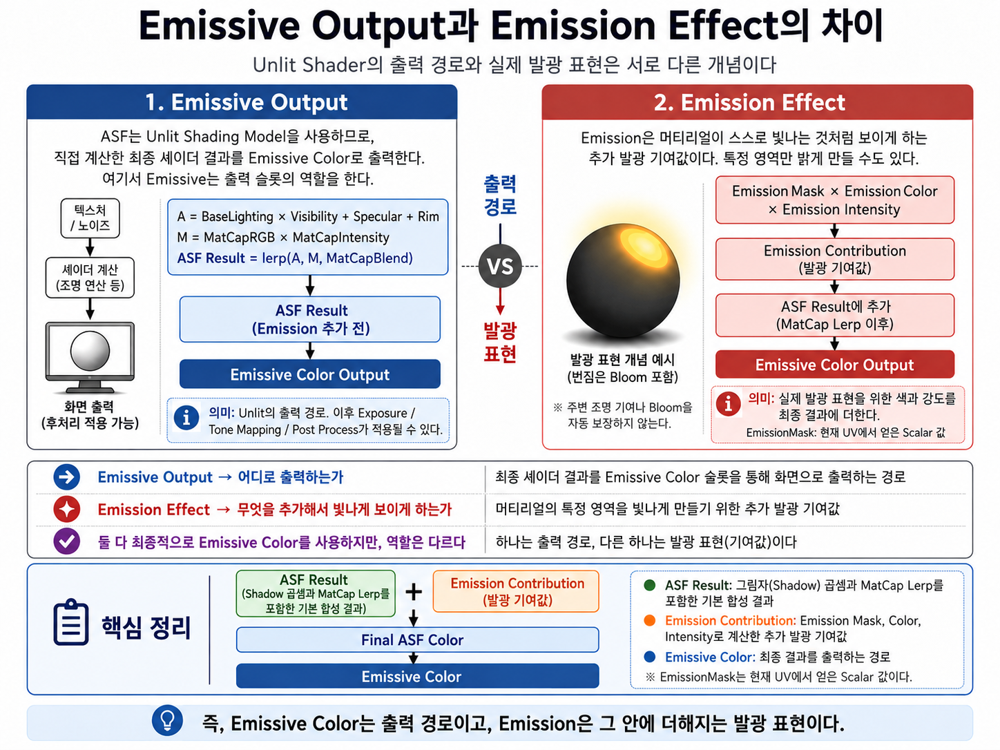
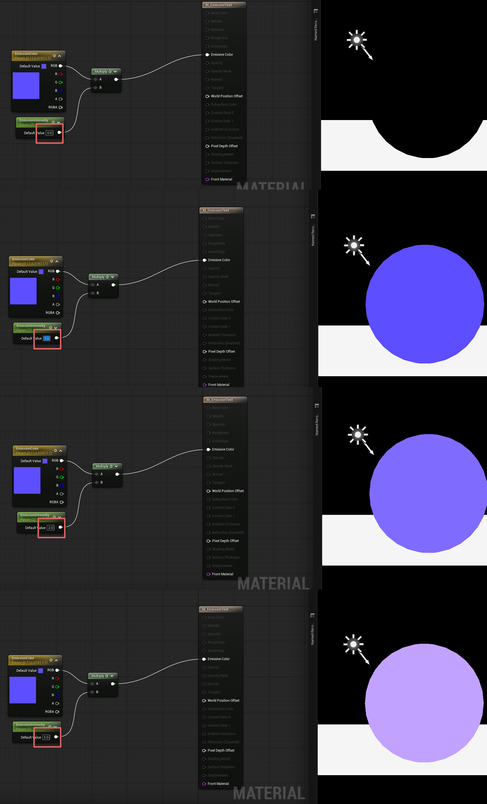
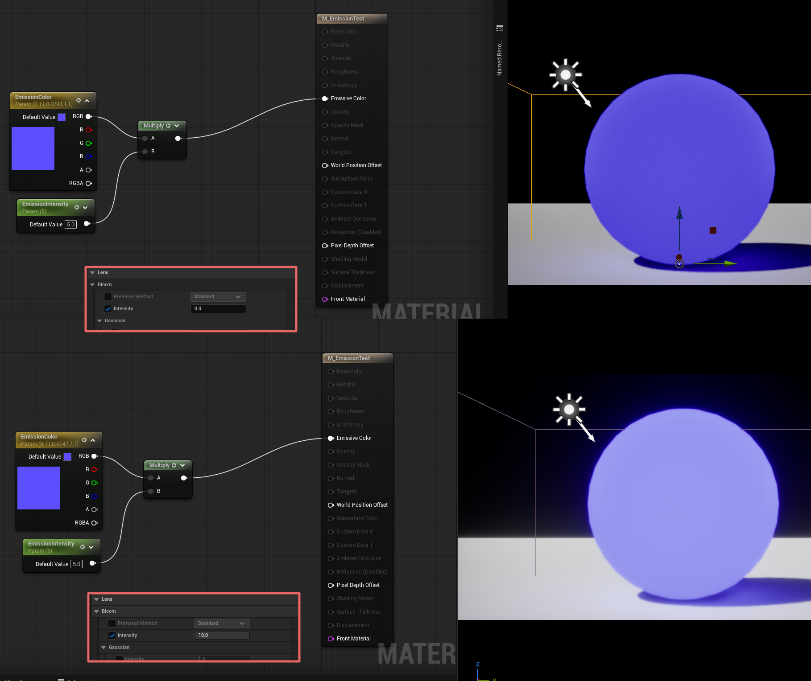
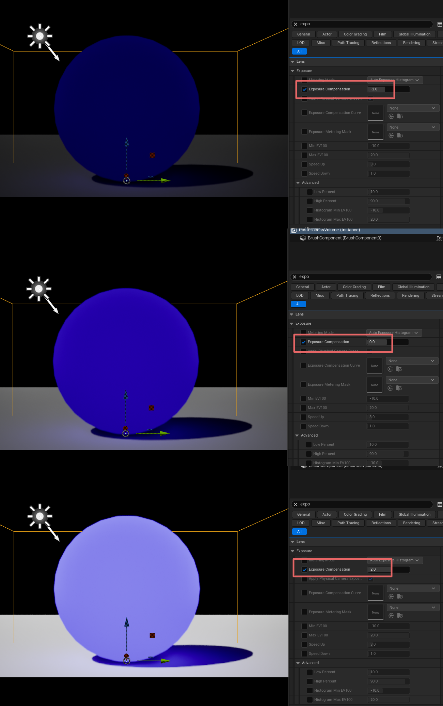
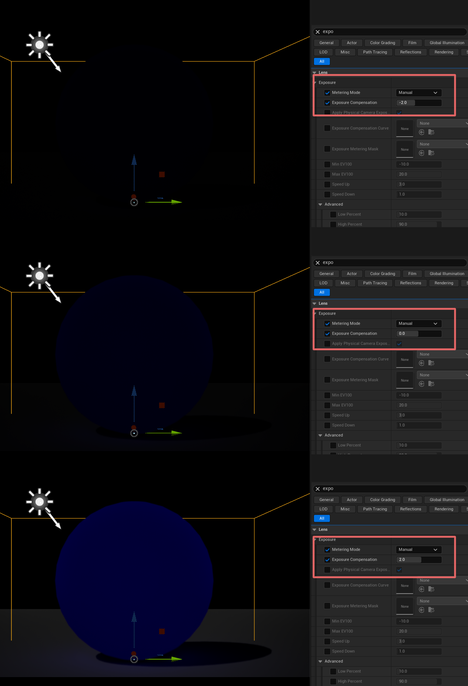
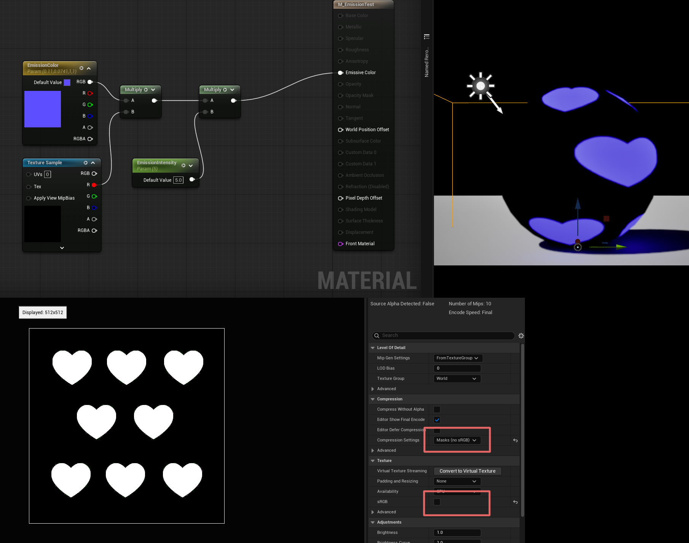
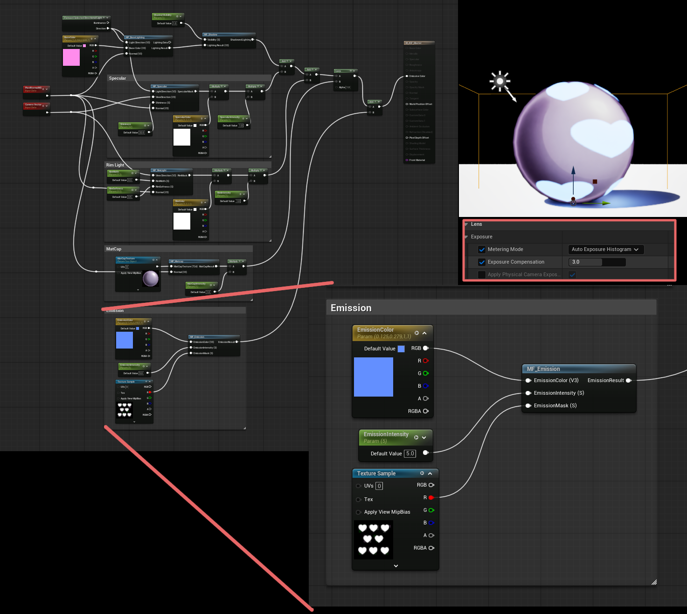

# Chapter 08 — Building an Anime Shader

## 8.7 Emission

Chapter 8.6까지는 ASF에서 직접 계산한 Lighting과 Stylized Appearance를 하나의 Master Material 안에 통합했다.

현재 기본 구조에는 다음과 같은 Module이 포함되어 있다.

~~~text
MF_BaseLighting
MF_Shadow
MF_Specular
MF_RimLight
MF_MatCap
~~~

그리고 최종 결과는 `Unlit` Shading Model에서 `Emissive Color`로 출력하고 있다.

여기서 한 가지 중요한 혼동이 생길 수 있다.

> 이미 최종 결과를 Emissive Color에 연결하고 있는데, 그렇다면 지금까지 만든 Shader도 전부 Emission이라고 봐야 하는가?

그렇지 않다.

현재 ASF에서 `Emissive Color`는 주로 **직접 계산한 Shader Result를 Unreal의 기본 Lighting 계산 없이 화면에 출력하기 위한 경로**로 사용하고 있다.

반면 이번 절에서 다룰 `Emission`은

**Material의 특정 영역이 실제로 스스로 빛나는 것처럼 보이도록 추가하는 발광 Contribution**

을 의미한다.

즉 같은 `Emissive Color` Output을 사용하지만, 두 개념의 역할은 다르다.

이번 절에서는 이 차이를 먼저 명확하게 구분한 뒤, Emission Color, Intensity, Mask, HDR, Bloom과의 관계를 살펴보고 최종적으로 `MF_Emission`을 ASF Master Material에 통합한다.

---

### Emissive Output and Emission Contribution

버튼에 적힌 이름과 그 버튼으로 전달하는 내용은 다를 수 있다. 이 실습에서도 출력 Pin의 이름만 보고 내부 역할을 판단하면 Base Lighting과 발광 추가분을 섞게 된다. 먼저 **계산한 값을 어디로 보내는가**와 **최종 색에 무엇을 더하는가**를 나누고, 그 다음 Color·Intensity·Mask를 연결한다.

현재 ASF Material은 `Unlit` Shading Model을 사용한다.

일반적인 `Default Lit` Material에서는 Unreal Renderer가 Base Color, Normal, Roughness, Specular 등의 정보를 이용하여 Lighting을 계산한다.

개념적으로는 다음과 같다.

~~~text
Base Color
Normal
Roughness
Specular
Light
View
↓
Unreal Lighting Calculation
↓
Final Surface Color
~~~

하지만 ASF는 이 Lighting 계산을 직접 구성한다.

~~~text
A = Base Lighting × manual Visibility + Specular + Rim
↓
Lerp(A, MatCapResult × MatCapIntensity, MatCapBlend)
↓
Final ASF Color
~~~

따라서 Unreal의 기본 Lighting 결과를 다시 적용할 필요가 없다.

이 때문에 Material의 Shading Model을 `Unlit`으로 설정하고, 직접 계산한 최종 Color를 `Emissive Color`에 연결한다.

~~~text
Final ASF Color
↓
Emissive Color
↓
Screen Output
~~~

여기서 가장 중요한 것은

**Emissive Color라는 이름 때문에 모든 입력값을 실제 발광으로 해석하면 안 된다는 것**

이다.

---

#### Emissive Color as Output Path

현재 ASF 구조에서 `Emissive Color`는 다음 역할을 한다.

~~~text
직접 계산한 Shader Result
↓
Unreal Default Lighting을 거치지 않음
↓
Emissive Color
↓
화면 출력
~~~

즉 현재 사용 방식에서는 `Emissive Color`를

**최종 Shader Color를 전달하는 Output Slot**

으로 생각하는 것이 이해하기 쉽다.

예를 들어 Base Lighting만 계산했다고 하자.

~~~text
N · L
↓
Base Color 적용
↓
Lighting Result
↓
Emissive Color
~~~

ASF에서는 이 값을 논리적인 Emission Module과 구분한다. 그러나 Engine에는 전체 Final Color가 Emissive 경로로 전달되므로 밝은 Base/Specular/MatCap 성분도 Bloom 등에 영향을 줄 수 있다. GI 참여 여부는 Renderer·Material·Scene 지원 조건에 따라 확인한다.

Shader가 직접 계산한 명암 결과를 화면에 보여주기 위해 Emissive Output을 사용했을 뿐이다.

Specular도 마찬가지다.

~~~text
Specular Calculation
↓
Specular Contribution
↓
Final ASF Color에 합성
↓
Emissive Color
~~~

Rim과 MatCap 역시 최종적으로 같은 Output을 사용한다.

~~~text
Rim
MatCap
↓
Final ASF Color
↓
Emissive Color
~~~

즉 지금까지의 `Emissive Color`는

~~~text
무엇을 표현하는가?
~~~

보다

~~~text
어디로 출력하는가?
~~~

에 가까운 개념이다.

---

#### Additional Emission Contribution

반면 이번 절에서 다룰 `Emission`은 역할이 다르다.

Emission은 Material의 특정 영역이

**Scene Lighting과 관계없이 스스로 Color Energy를 내보내는 것처럼 보이게 만드는 표현**

이다.

예를 들어 캐릭터의 눈에 발광 효과를 넣는다고 생각해보자. 눈의 기본 Material Appearance는 기존 ASF Lighting을 이용할 수 있다.

~~~text
Base Lighting
+
Specular
+
Rim
↓
Eye Surface Appearance
~~~

하지만 눈동자의 특정 Pattern이 빛나야 한다면, 그 부분에는 별도의 Emission Contribution을 추가한다.

~~~text
Emission Mask
×
Emission Color
×
Emission Intensity
↓
Emission Contribution
~~~

그리고 이 값을 기존 Shader Result에 더한다.

~~~text
ASF Result
+
Emission Contribution
↓
Final ASF Color
↓
Emissive Color
~~~

즉 Emission은 Output Path가 아니라,

**Final Color에 추가되는 하나의 Rendering Contribution**

이다.

---

#### Comparing Responsibilities

가장 간단하게 정리하면 다음과 같다.

~~~text
Emissive Color
→ 어디로 출력하는가?

Emission
→ 무엇을 추가하여 빛나게 보이게 하는가?
~~~

또는 다음처럼 볼 수 있다.

~~~text
Emissive Output
→ Output Route

Emission Effect
→ Visual Contribution
~~~

둘 다 최종적으로 `Emissive Color`를 통과하지만 역할이 완전히 다르다.

---

#### Shared Output Path

그렇다면 왜 두 개념 모두 결국 `Emissive Color`를 사용할까? 현재 ASF가 `Unlit` Material이기 때문이다.

Final Shader Color를 직접 만드는 구조에서는 Emission도 결국 Final Color의 일부가 된다.

예를 들어 기존 Shader 결과가 다음과 같다고 하자.

~~~text
ASF Result
=
Base
+
Specular
+
Rim
~~~

여기에 Emission을 추가하면

~~~text
Final ASF Color
=
ASF Result
+
Emission Contribution
~~~

이 최종 Color를 출력할 곳은 여전히 `Emissive Color`다.

~~~text
ASF Result
+
Emission Contribution
↓
Final ASF Color
↓
Emissive Color
~~~

즉 Output Slot이 바뀌는 것이 아니다.

**Output으로 들어가는 Final Color의 구성 요소가 하나 추가되는 것**이다.

---

#### Eye Emission Example

캐릭터의 얼굴 전체를 생각해보자. 기본 얼굴은 일반 ASF Lighting을 사용한다.

~~~text
Light Direction
+
Normal
↓
Base Lighting
↓
Face Appearance
~~~

눈도 기본적으로 같은 Lighting 구조 안에 존재할 수 있다.

하지만 눈동자의 특정 Pattern만 강하게 빛나게 하고 싶다면 별도의 Mask를 사용한다.

~~~text
Eye Emission Mask
↓
Emission Color
↓
Emission Intensity
↓
Emission Contribution
~~~

그러면 최종적으로 다음과 같은 구조가 된다.

~~~text
Face Lighting
+
Eye Emission
↓
Final Character Color
↓
Emissive Color
~~~

ASF의 역할 분리에서는 Eye Emission을 별도 기여로 관리한다. Engine의 Emissive Output에는 얼굴의 Final Color 전체가 전달되므로 Post Process는 이름이 아니라 최종 값을 처리한다.

실제 발광 표현을 담당하는 것은

~~~text
Eye Emission Contribution
~~~

부분이다.

---

#### Light-independent Contribution

Emission의 중요한 특징 중 하나는 Scene Light에 의해 만들어지는 밝기가 아니라는 것이다.

일반 Lighting은 Light가 필요하다.

~~~text
Light
+
Surface
↓
Lighting
~~~

Light가 없으면 일반적인 Diffuse나 Specular Contribution도 크게 줄어든다.

반면 Emission은 Shader 자체에서 직접 Color 값을 추가한다.

~~~text
Emission Mask
+
Emission Color
+
Emission Intensity
↓
Emission Contribution
~~~

따라서 Scene Light와 직접적인 관계 없이 존재할 수 있다.

이 때문에 다음과 같은 표현에 자주 사용된다.

- Glowing Eye
- Energy Line
- Magic Pattern
- Mechanical Light
- Weapon Glow
- Neon Element
- UI-like Character Detail
- Stylized Energy Effect

---

#### Emission and Base Color

Emission Color와 Base Color도 비슷해 보일 수 있다.

둘 다 결국 RGB Color이기 때문이다.

하지만 역할이 다르다.

Base Color는 기본적으로 Surface가 어떤 색의 Material인지 나타낸다.

~~~text
Base Color
→ Material의 기본 색
~~~

그리고 Lighting 계산을 통해 밝고 어두운 결과가 만들어진다.

~~~text
Base Color
×
Lighting
↓
Surface Appearance
~~~

반면 Emission Color는 Lighting과 별개로 추가되는 Color다.

~~~text
Emission Color
×
Emission Intensity
↓
Emission Contribution
~~~

따라서 다음처럼 구분할 수 있다.

~~~text
Base Color
→ 빛을 받았을 때 보이는 Material Color

Emission Color
→ Material 자체에서 추가로 출력하는 Color
~~~

---

#### Emission and Bloom Conditions

Emission을 사용하면 흔히 주변에 빛이 퍼지는 Glow Effect를 떠올린다.

하지만 이것도 개념적으로 분리해야 한다.

Material에서 Emission을 추가하는 것과, 화면에서 Bloom이 발생하는 것은 같은 작업이 아니다.

~~~text
Material
↓
Emission Value 출력
~~~

그리고 이후 Rendering Pipeline에서

~~~text
밝은 HDR Result
↓
Post Process
↓
Bloom
~~~

이 발생한다.

즉

~~~text
Emission
≠
Bloom
~~~

이다.

Emission은 Material이 높은 밝기의 Color를 출력하는 것이고, Bloom은 그 결과를 화면 후처리 단계에서 주변으로 퍼뜨리는 효과다.

이 관계는 이후 절에서 직접 확인한다.

---

#### Output Path and Contribution

현재 ASF에서는 다음 두 개념을 항상 분리해서 보는 것이 좋다.

**Output Path**

~~~text
Final ASF Color
↓
Emissive Color
~~~

이것은 Shader 결과를 화면에 전달하기 위한 구조다.

**Emission Contribution**

~~~text
Emission Mask
×
Emission Color
×
Emission Intensity
↓
Emission Contribution
~~~

이것은 Final ASF Color를 구성하는 하나의 표현이다.

최종적으로 두 흐름은 다음처럼 만난다.

~~~text
ASF Result
+
Emission Contribution
↓
Final ASF Color
↓
Emissive Color
~~~

이 구조를 이해하면

> Emissive Color에 꽂았으니까 전부 발광 Material이다.

라는 혼동을 피할 수 있다.

---

> **Implementation Note — Engine Output**
>
> 앞의 Emissive Color as Output Path에서 설명했듯이 Engine에는 합성된 전체 값이 전달된다. Emission Module만 분리해서 관리하는 ASF의 역할 구분이 Post Process 입력을 분리하는 것은 아니다. 다른 밝은 성분의 Bloom 영향과 조건부 GI 참여는 그 출력 범위 안에서 확인한다.

---

#### Key Takeaways

현재 ASF에서는 `Unlit` Shading Model을 사용한다.

따라서 Unreal의 기본 Lighting 계산을 사용하지 않고, 직접 계산한 Shader Result를 `Emissive Color`로 출력한다.

~~~text
ASF Lighting
↓
Final ASF Color
↓
Emissive Color
~~~

이때 `Emissive Color`는 주로 **Output Path**의 역할을 한다.

반면 Emission은 Final Shader에 추가하는 **발광 Contribution**이다.

~~~text
Emission Mask
×
Emission Color
×
Emission Intensity
↓
Emission Contribution
~~~

그리고 최종적으로 다음처럼 합성된다.

~~~text
ASF Result
+
Emission Contribution
↓
Final ASF Color
↓
Emissive Color
~~~

따라서 두 개념은 다음처럼 구분할 수 있다.

~~~text
Emissive Color
→ 어디로 출력하는가

Emission
→ 무엇을 추가하여 빛나게 보이게 하는가
~~~

또한 Emission과 Bloom 역시 같은 개념이 아니다.

~~~text
Emission
→ Material 단계의 발광 값

Bloom
→ 밝은 결과를 퍼뜨리는 Post Process
~~~

이번 절에서 가장 중요한 것은

**Emissive Output과 Emission Effect를 이름이 비슷하다는 이유로 같은 개념으로 이해하지 않는 것**

이다.

이제 두 개념을 구분했으므로, 다음 절에서는 실제로 가장 기본적인 Emission을 만들어보고 `EmissionColor × EmissionIntensity` 구조가 어떤 결과를 만드는지 확인한다.

---

이어서 [Emission Color and Intensity](#emission-color-and-intensity)에서 다음 단계를 살펴본다.

---

### Emission Color and Intensity

같은 보라색 표시등이 약하게 빛나는 상태와 강하게 빛나는 상태를 생각해보자. 색의 종류와 출력의 크기를 따로 다루면 색을 다시 고르지 않고도 강도만 조절할 수 있다. 이번 계산은 그 두 조절을 RGB Color와 Scalar Intensity로 분리한다. Color는 Linear 값으로 사용하며, 곱한 결과는 최종 Display RGB와 구분한다.

앞 절에서는 현재 ASF에서 사용하는 `Emissive Color` Output과 실제 발광 표현인 `Emission Effect`가 서로 다른 개념이라는 점을 정리했다.

이번 절에서는 가장 기본적인 Emission 구조를 직접 구현하고, `EmissionColor`와 `EmissionIntensity`가 각각 어떤 역할을 담당하는지 확인한다.

기본 구조는 매우 단순하다.

~~~text
EmissionColor
×
EmissionIntensity
↓
EmissionResult
↓
Emissive Color
~~~

하지만 이 간단한 구조 안에서도

- Color는 무엇을 결정하는가
- Intensity는 무엇을 결정하는가
- 왜 Intensity가 1을 넘어갈 수 있는가
- 높은 값이 화면에서 어떻게 보이는가

를 구분해서 이해하는 것이 중요하다.

---

#### Emission Color

먼저 `EmissionColor`는 어떤 색으로 발광할지를 결정한다.

이번 테스트에서는 `Vector Parameter`를 사용하여 `EmissionColor`를 구성했다.

~~~text
EmissionColor
→ Vector3 / RGB
~~~

예를 들어 보라색 계열의 값을 사용하면, Emission의 기본 색상 방향도 보라색이 된다.

~~~text
EmissionColor
=
Purple
~~~

이 값은 기본적으로

~~~text
어떤 색으로 출력할 것인가
~~~

를 결정한다.

즉 `EmissionColor`의 역할은 다음처럼 정리할 수 있다.

~~~text
EmissionColor
→ Hue / Color Direction
~~~

---

#### Emission Intensity

두 번째 Parameter는 `EmissionIntensity`다.

이번 테스트에서는 `Scalar Parameter`를 사용했다.

~~~text
EmissionIntensity
→ Scalar
~~~

이 값은 `EmissionColor`에 Multiply된다.

~~~text
EmissionColor
×
EmissionIntensity
↓
EmissionResult
~~~

즉 Intensity는 새로운 색을 만드는 것이 아니라,

**기존 EmissionColor의 출력 크기를 조절하는 값**

이다.

예를 들어 같은 보라색을 사용해도

~~~text
EmissionIntensity = 1
~~~

이면 기본 강도로 출력되고,

~~~text
EmissionIntensity = 5
~~~

이면 같은 색 방향을 유지하면서 훨씬 강한 값이 출력된다.

---

#### Separate Color and Intensity

Color와 Intensity를 하나의 값으로 합쳐서 관리할 수도 있다.

하지만 두 역할을 분리하면 훨씬 직관적으로 제어할 수 있다.

~~~text
EmissionColor
→ 어떤 색인가

EmissionIntensity
→ 얼마나 강한가
~~~

예를 들어 다음 두 설정을 생각해보자.

~~~text
EmissionColor
= Blue

EmissionIntensity
= 1
~~~

그리고

~~~text
EmissionColor
= Blue

EmissionIntensity
= 5
~~~

두 경우 모두 색상의 기본 방향은 Blue다.

달라지는 것은 출력 강도다.

즉

~~~text
Color
→ Chromatic Information

Intensity
→ Magnitude
~~~

로 역할을 나누는 것이다.

이 구조는 이후 Material Instance에서

~~~text
색은 유지하면서 강도만 조절
~~~

하거나, 반대로

~~~text
강도는 유지하면서 색만 변경
~~~

할 수 있게 해준다.

---

#### Basic Implementation

테스트를 위해 별도의 Material인

~~~text
M_EmissionTest
~~~

를 구성했다.

Material은 기존 ASF 테스트와 동일하게

~~~text
Shading Model
=
Unlit
~~~

을 사용한다.

Node 구조는 다음과 같다.

~~~text
EmissionColor
↓
Multiply
↑
EmissionIntensity

↓

EmissionResult

↓

Emissive Color
~~~

이 구조를 이용해 Intensity를 단계적으로 변경하면서 결과를 확인했다.

---

#### Intensity = 0

먼저 `EmissionIntensity`를 `0`으로 설정했다.

~~~text
EmissionColor
×
0
=
0
~~~

따라서 최종 출력도 0이 된다.

~~~text
EmissionResult
=
0
~~~

결과적으로 Object는 검게 보인다.

이는 Emission이 완전히 꺼진 상태다.

---

#### Intensity = 1

다음으로 Intensity를 `1`로 설정했다.

~~~text
EmissionColor
×
1
=
EmissionColor
~~~

즉 원래 입력한 Color가 그대로 출력된다.

이 상태를 기본 Emission 강도로 이해할 수 있다.

~~~text
Intensity = 1
→ Original EmissionColor
~~~

---

#### Intensity = 2

Intensity를 `2`로 올리면 Color 값의 각 Channel이 두 배가 된다.

개념적으로는 다음과 같다.

~~~text
EmissionColor
×
2
↓
Stronger Emission Value
~~~

이때 색의 기본 방향은 유지되지만, 출력되는 값의 크기는 증가한다.

따라서 화면에서는 더 밝게 보이기 시작한다.

---

#### Intensity = 5

Intensity를 `5`까지 증가시키면 출력값은 훨씬 커진다.

~~~text
EmissionColor
×
5
↓
High Intensity Emission
~~~

화면에서는 원래의 보라색이 점점 더 밝고 연하게 보이며, 일부 영역은 흰색에 가까운 인상으로 나타날 수 있다.

하지만 이것을

~~~text
보라색이 흰색으로 바뀌었다
~~~

라고 이해하면 정확하지 않다.

실제로는

~~~text
같은 Color Direction
+
더 큰 출력 값
~~~

이 만들어진 것이다.

---

Intensity 비교는 계산과 화면을 두 번 확인하는 실습이다. 계산에서는 같은 Color에 곱하는 값만 바뀌는지 확인하고, 화면에서는 고정된 Exposure·Bloom·Tone Mapping 조건에서 보이는 차이를 읽는다. 아래 Figure는 기존 관찰 자료이며, 초기 Auto Exposure 상태의 이미지로 Intensity 변화만의 효과를 수치 분리하지 않는다.

---

#### Intensity Comparison

다음 Figure에서는 같은 `EmissionColor`를 유지하고, `EmissionIntensity`만

~~~text
0
1
2
5
~~~

로 변경한 결과를 비교했다.

결과는 다음처럼 정리할 수 있다.

~~~text
Intensity = 0
→ Emission Off

Intensity = 1
→ 기본 EmissionColor

Intensity = 2
→ 더 강한 출력

Intensity = 5
→ 매우 강한 출력
~~~

즉 Intensity가 증가할수록

**색의 종류를 바꾸는 것이 아니라 같은 Color Direction의 출력 크기를 증가시킨다.**

---

#### HDR Intensity

일반적인 Color 값을 생각하면 RGB가

~~~text
0 ~ 1
~~~

범위 안에 있어야 한다고 생각하기 쉽다.

예를 들어 일반적인 Display Color에서는

~~~text
0
→ 최소 밝기

1
→ 최대 밝기
~~~

처럼 이해할 수 있다.

하지만 Rendering Pipeline 내부에서는 반드시 `1`에서 값이 끝나지 않는다.

HDR Rendering에서는

~~~text
1보다 큰 값
~~~

도 사용할 수 있다.

예를 들어

~~~text
EmissionColor
=
(0.5, 0.2, 1.0)

EmissionIntensity
=
5
~~~

라면 결과는 개념적으로

~~~text
(2.5, 1.0, 5.0)
~~~

처럼 `1`을 초과할 수 있다.

이러한 값은 일반적인 화면의 최종 RGB 범위보다 크지만, HDR Rendering Pipeline 내부에서는 유효한 Scene Color Data로 사용할 수 있다.

---

#### Bloom Conditions

여기서 중요한 구분이 있다.

~~~text
EmissionIntensity > 1
~~~

이라고 해서 Material 내부에서 자동으로 Glow가 만들어지는 것은 아니다.

이번 절에서 증가시키고 있는 것은

~~~text
Emission Output Value
~~~

이다.

즉 Material은 더 높은 HDR Color 값을 출력하고 있을 뿐이다.

~~~text
EmissionColor
×
High Intensity
↓
HDR Emission Value
~~~

화면 주변으로 빛이 퍼지는 Bloom은 별도의 Post Process Stage에서 만들어진다.

~~~text
Material
↓
High HDR Emission
↓
Scene Color
↓
Post Process
↓
Bloom
~~~

따라서 다음 두 개념은 분리해서 이해해야 한다.

~~~text
High Emission Intensity
→ 높은 HDR 값 생성

Bloom
→ 높은 밝기 영역을 화면에서 퍼뜨리는 후처리
~~~

이 관계는 다음 절에서 직접 확인한다.

---

#### Intensity and Displayed Color

테스트 결과를 보면 Intensity가 커질수록 보라색이 점점 밝아지고, 높은 값에서는 흰색에 가까운 인상으로 보인다.

하지만 Shader 내부에서 색상의 비율이 반드시 흰색으로 바뀐 것은 아니다.

최종 화면에 표시되기 전에는 Rendering Pipeline에서 여러 처리가 이루어진다.

개념적으로는 다음과 같다.

~~~text
Emission HDR Value
↓
Exposure
↓
Tone Mapping
↓
Display Color
~~~

HDR 값은 그대로 Monitor에 표시할 수 없기 때문에, 최종 Display Range에 맞게 변환된다.

이 과정 때문에 높은 Intensity 값이 화면에서는 점점 밝아지고 채도가 줄어든 것처럼 보일 수 있다.

즉

~~~text
Shader 내부 값
~~~

과

~~~text
최종 화면에서 보이는 값
~~~

은 완전히 같은 개념이 아니다.

---

#### Shader Value and Display Brightness

수학적으로는 Intensity가 Linear하게 곱해진다.

~~~text
EmissionResult
=
EmissionColor × EmissionIntensity
~~~

따라서

~~~text
Intensity 1 → 2
~~~

가 되면 Shader 내부 값도 두 배가 된다.

하지만 사람이 보는 최종 화면에서는 반드시

~~~text
정확히 두 배 밝아졌다
~~~

처럼 느껴지지는 않는다.

그 이유는 이후 Rendering Pipeline의

- Exposure
- Tone Mapping
- HDR Compression
- Post Process

등이 최종 표시 결과에 영향을 주기 때문이다.

따라서 Emission Parameter를 조절할 때는

**숫자 자체뿐 아니라 실제 화면 결과를 함께 확인해야 한다.**

---

#### Initial Observation Conditions

이번 테스트의 목적은 Bloom을 만드는 것이 아니다.

우선

~~~text
EmissionColor
×
EmissionIntensity
~~~

라는 기본 관계 자체를 확인하는 것이 목적이다.

아래 초기 비교는 Project 설정을 유지한 관찰 예이다. Auto Exposure가 켜져 있다면 통제된 Intensity 비교가 아니므로 기본 검증에서는 Fixed Exposure와 동일한 Bloom/Tone Mapping 조건을 사용한다. 초기 관찰에서는 Intensity 값만 변경하여 결과를 비교했다.

이렇게 해야 다음 단계에서

~~~text
Material Emission
~~~

과

~~~text
Bloom Post Process
~~~

의 역할을 명확하게 분리해서 확인할 수 있다.

---

#### Implementation Result

이번 구현에서는 다음과 같은 가장 기본적인 Emission 구조를 만들었다.

~~~text
EmissionColor
×
EmissionIntensity
↓
EmissionResult
↓
Emissive Color
~~~

그리고 Intensity를

~~~text
0
1
2
5
~~~

로 변경하면서 결과를 비교했다.

이를 통해 다음 관계를 확인했다.

~~~text
EmissionColor
→ 발광 색상

EmissionIntensity
→ 발광 값의 크기
~~~

Intensity가 증가하면 색의 기본 방향은 유지되면서 출력값의 크기가 증가한다.

또한 `1`을 초과하는 값도 HDR Rendering Pipeline에서는 유효한 Color Data로 사용될 수 있다.

하지만 높은 Emission 값과 Bloom은 같은 개념이 아니다.

~~~text
High Emission
→ 높은 HDR Scene Color

Bloom
→ Post Process에서 밝은 영역을 퍼뜨리는 효과
~~~

따라서 이번 단계에서 만든 것은

**Glow Effect 자체가 아니라 Glow Effect의 입력이 될 수 있는 높은 Emission Value**

라고 이해하는 것이 정확하다.

다음 절에서는 이 높은 HDR Emission이 Post Process의 Bloom과 어떻게 연결되는지 확인하고, Emission과 Bloom이 각각 Rendering Pipeline에서 어떤 역할을 담당하는지 살펴본다.

---

이어서 [HDR Emission, Bloom, and Glow](#hdr-emission-bloom-and-glow)에서 다음 단계를 살펴본다.

---

### HDR Emission, Bloom, and Glow

앞 절에서는 `EmissionColor × EmissionIntensity`를 이용하여 기본적인 Emission을 구현하고, Intensity를 증가시키면 Shader 내부에서 `1`을 초과하는 HDR Color 값이 만들어질 수 있다는 것을 확인했다.

이번 절에서는 그 높은 Emission 값이 실제 화면에서 어떻게 보이는지 살펴보고, 서로 혼동하기 쉬운 다음 세 개념을 구분한다.

~~~text
Emission
Bloom
Glow
~~~

이 세 용어는 모두 “빛나는 표현”과 관련되어 있지만 역할은 서로 다르다.

가장 먼저 전체 관계를 정리하면 다음과 같다.

~~~text
Emission
↓
High HDR Value
↓
Bloom
↓
주변으로 밝기가 퍼짐
↓
Glow처럼 보이는 시각적 결과
~~~

하지만 이것을

~~~text
Emission = Bloom = Glow
~~~

로 이해하면 안 된다.

각각 Rendering Pipeline에서 담당하는 역할이 다르다.

---

#### Material Emission

Emission은 Material 단계에서 만들어지는 값이다.

앞 절에서 구현한 구조는 다음과 같다.

~~~text
EmissionColor
×
EmissionIntensity
↓
EmissionResult
↓
Emissive Color
~~~

예를 들어

~~~text
EmissionIntensity = 5
~~~

라면 `EmissionColor`의 RGB 값에 5가 곱해진다.

따라서 일부 Channel은 `1`보다 큰 값을 가질 수 있다.

~~~text
EmissionColor
=
(0.5, 0.2, 1.0)

×

EmissionIntensity
=
5

↓

EmissionResult
=
(2.5, 1.0, 5.0)
~~~

이처럼 `1`을 초과하는 값은 HDR Rendering Pipeline 내부에서 사용할 수 있다.

즉 Emission은

**Material이 높은 밝기의 Scene Color를 만들어내는 단계**

라고 볼 수 있다.

---

#### HDR Reminder

일반적인 화면의 최종 Color를 생각하면 RGB는 흔히

~~~text
0 ~ 1
~~~

범위로 생각한다.

하지만 실제 Rendering Pipeline 내부에서는 이보다 훨씬 큰 값을 유지할 수 있다.

이것이 HDR, 즉 `High Dynamic Range`의 중요한 특징이다.

~~~text
LDR 개념

0 ~ 1
~~~

반면 HDR Scene에서는

~~~text
0
1
2
5
10
...
~~~

처럼 `1`보다 큰 밝기 값도 존재할 수 있다.

이 값은 그대로 Monitor에 표시하기 위한 최종 Color라기보다,

**Scene 안에 어느 영역이 얼마나 강한 빛 에너지를 가지고 있는지 표현하기 위한 Rendering Data**

라고 이해하면 쉽다.

Emission은 이 HDR 범위를 적극적으로 사용할 수 있다.

---

#### Emission and Post Process

여기서 중요한 점이 있다.

Material이 높은 HDR 값을 출력한다고 해서, 그 자체가 주변 Pixel로 퍼지는 것은 아니다.

예를 들어

~~~text
EmissionIntensity = 5
~~~

라고 해도, Material Shader는 기본적으로 해당 Surface Pixel에 높은 Color 값을 출력할 뿐이다.

~~~text
Surface Pixel
↓
High Emission Value
~~~

Material 자체가 자동으로

~~~text
주변 Pixel
주변 Object
주변 화면 영역
~~~

까지 흐릿하게 밝히는 것은 아니다.

그 역할을 담당하는 것이 `Bloom`이다.

---

#### Bloom

Bloom은 매우 밝은 화면 영역의 밝기를 주변으로 퍼뜨려, 실제 Camera나 눈에서 강한 빛을 볼 때 발생하는 번짐과 비슷한 인상을 만드는 `Post Process` Effect다.

즉 Bloom은 Material 계산 이후에 적용된다.

~~~text
Material Shader
↓
HDR Scene Color
↓
Post Process
↓
Bloom
↓
Final Image
~~~

Emission과의 관계를 보면 다음과 같다.

~~~text
Emission
→ 밝은 Pixel을 만든다.

Bloom
→ 그 밝은 Pixel 주변으로 밝기를 퍼뜨린다.
~~~

따라서 둘의 역할은 완전히 다르다.

---

##### Emission and Bloom

가장 단순하게 비교하면 다음과 같다.

~~~text
Emission

Material Stage
→ 높은 밝기 값을 생성
~~~

~~~text
Bloom

Post Process Stage
→ 높은 밝기 영역을 주변으로 확산
~~~

즉

~~~text
Emission
≠
Bloom
~~~

이다.

Emission이 Bloom의 입력이 될 수는 있지만, Emission 그 자체가 Bloom은 아니다.

---

#### Glow

`Glow`라는 용어도 자주 사용된다.

하지만 Glow는 Emission이나 Bloom처럼 반드시 하나의 특정 Rendering 연산을 의미하지는 않는다.

일반적으로 Glow는

**화면에서 어떤 Object나 영역이 빛을 내면서 주변까지 밝게 번지는 것처럼 느껴지는 시각적 결과**

를 표현하는 용어에 가깝다.

예를 들어

~~~text
Emission
+
Bloom
↓
Glow Appearance
~~~

가 대표적인 경우다.

따라서 다음처럼 구분하면 이해하기 쉽다.

~~~text
Emission
→ 발광값을 만든다.

Bloom
→ 밝은 영역을 퍼뜨린다.

Glow
→ 최종적으로 빛나는 것처럼 보이는 시각적 인상
~~~

---

##### Glow Techniques

Glow는 시각적인 결과를 의미하므로 다른 방법으로도 비슷한 표현을 만들 수 있다.

Stylized Rendering에서는 예를 들어

- 별도의 투명 Mesh를 겹치거나
- Fresnel / Rim Mask를 사용하거나
- Texture에 Halo Pattern을 그리거나
- Niagara Particle을 추가하거나
- 별도의 VFX Sprite를 사용

하여 Glow처럼 보이는 효과를 만들 수도 있다.

따라서

~~~text
Glow = Bloom
~~~

이라고 완전히 동일시하는 것도 정확하지 않다.

이번 ASF 기본 구현에서는 가장 일반적인 흐름인

~~~text
HDR Emission
+
Post Process Bloom
↓
Glow Appearance
~~~

를 확인한다.

---

#### Bloom Validation

주변 번짐을 이해하려면 Material과 후처리를 동시에 바꾸지 않는다. 같은 Emission 값을 둔 채 Bloom만 켜고 끄면 표면에 출력되는 값과 주변 Pixel에 보이는 Halo를 구분할 수 있다. Exposure·Camera·나머지 Post Process 조건도 고정하고, 이 실험은 주변 Geometry가 실제 조명을 받는지의 검증과 분리한다.

Emission과 Bloom의 차이를 실제로 확인하기 위해, 앞 절에서 제작한

~~~text
M_EmissionTest
~~~

를 그대로 사용했다.

Material 설정 역시 변경하지 않았다.

~~~text
EmissionColor
×
EmissionIntensity
↓
Emissive Color
~~~

테스트에서는

~~~text
EmissionIntensity = 5
~~~

로 고정했다.

즉 Bloom 비교 과정에서 Material이 출력하는 Emission 값은 동일하다.

변경하는 것은 Post Process의 Bloom 설정뿐이다.

---

##### Post Process Volume

Bloom은 Material Parameter가 아니라 Post Process Effect이므로, Scene에 `Post Process Volume`을 추가했다.

테스트 Level 전체에 효과를 적용하기 위해

~~~text
Infinite Extent (Unbound)
~~~

를 활성화했다.

이 옵션을 활성화하면 Post Process Volume의 실제 Box 안에 Camera가 존재하지 않아도 Scene 전체에 설정이 적용된다.

~~~text
Infinite Extent OFF
→ Volume 내부 Camera에만 적용

Infinite Extent ON
→ Volume 위치와 관계없이 전체 Scene 적용
~~~

따라서 테스트용 Post Process Volume은 Scene의 특정 위치에 정확하게 배치할 필요가 없다.

---

#### Bloom Intensity = 0

먼저 Bloom을 완전히 비활성화했다.

~~~text
EmissionIntensity
=
5

Bloom Intensity
=
0
~~~

이 상태에서도 Sphere 표면은 밝게 보인다.

즉 Material의 Emission은 정상적으로 존재한다.

하지만 Object 외곽을 보면 주변으로 퍼지는 밝은 Halo가 나타나지 않는다.

~~~text
High Emission
+
Bloom 0

↓

Surface는 밝음

하지만

주변으로 퍼지는 빛 없음
~~~

이 결과는 중요한 사실을 보여준다.

> 높은 Emission 값이 존재해도 Bloom이 없다면 주변으로 퍼지는 Glow는 나타나지 않을 수 있다.

---

#### Increasing Bloom Intensity

Material의 Emission 설정은 그대로 유지하고, Post Process의 Bloom Intensity만 증가시켰다.

이번 비교에서는 차이가 명확하게 보이도록 다음 값을 사용했다.

~~~text
Bloom Intensity
=
10
~~~

위쪽 결과는

~~~text
Bloom Intensity = 0
~~~

이고, 아래쪽 결과는

~~~text
Bloom Intensity = 10
~~~

이다.

두 경우 모두 Material은 동일하다.

~~~text
EmissionColor
→ 동일

EmissionIntensity
→ 5로 동일
~~~

즉 Shader가 출력하는 Emission 값 자체는 바뀌지 않았다.

---

##### Bloom Observation

Bloom을 활성화하면 Sphere 주변으로 밝은 Color가 퍼져나가는 것을 확인할 수 있다.

특히

- Object의 외곽
- 검은 Background와 만나는 경계
- 바닥 주변

에서 밝은 Halo가 나타난다.

~~~text
High HDR Surface
↓
Bloom
↓
주변 Pixel로 밝기 확산
↓
Halo
~~~

이 결과 때문에 Sphere가 단순히 밝은 Object가 아니라,

**빛을 내고 있는 Object처럼 느껴지기 시작한다.**

이러한 최종적인 인상을 일반적으로 Glow라고 표현한다.

---

#### Post Process Conditions

이번 테스트에서 가장 중요한 부분은 Material 값이 동일하다는 것이다.

두 상태 모두

~~~text
EmissionIntensity = 5
~~~

다.

따라서 Material 단계에서는 동일한 HDR Emission Result를 출력한다.

차이는 그 이후다.

##### Bloom OFF

~~~text
Material
↓
HDR Emission
↓
Bloom 없음
↓
밝은 Surface
~~~

##### Bloom ON

~~~text
Material
↓
동일한 HDR Emission
↓
Bloom
↓
주변으로 밝기 확산
↓
Glow Appearance
~~~

즉 같은 Material이라도 Post Process 설정에 따라 최종 화면에서 느껴지는 발광 표현은 크게 달라질 수 있다.

---

#### Shading Model and Viewport Mode

Bloom을 테스트하는 과정에서 또 하나 중요한 설정을 확인했다.

현재 `M_EmissionTest`의 Material Shading Model은 계속

~~~text
Unlit
~~~

이다.

이 설정은 변경하지 않는다.

하지만 Bloom과 같은 Post Process 결과를 Viewport에서 확인할 때는

~~~text
Viewport View Mode
=
Lit
~~~

을 사용해야 한다.

즉 다음 두 설정을 혼동하면 안 된다.

~~~text
Material Shading Model
→ Unlit

Viewport View Mode
→ Lit
~~~

Material의 `Unlit`은

~~~text
이 Material이 Unreal의 기본 Lighting 계산을 받을 것인가?
~~~

를 결정한다.

반면 Viewport의 `Lit` Mode는

~~~text
Scene Rendering과 Post Process 결과를
어떤 방식으로 확인할 것인가?
~~~

와 관련된 Editor View 설정이다.

따라서

~~~text
Material이 Unlit이므로
Viewport도 Unlit이어야 한다.
~~~

라고 생각하면 안 된다.

ASF에서는 현재

~~~text
Material
→ Unlit

Viewport
→ Lit
~~~

조합을 사용하고 있으며, Bloom 검증 역시 Lit View Mode에서 진행한다.

---

#### Bloom and Scene Illumination

Bloom을 보면 Object 주변이 밝아지기 때문에, Emission이 실제 Light처럼 주변 Scene을 비추고 있다고 생각할 수 있다.

하지만 Bloom 자체는 기본적으로 Screen Space Post Process다.

즉

~~~text
밝은 화면 영역
↓
이미지 후처리
↓
주변 Pixel로 번짐
~~~

을 만드는 것이다.

실제 Point Light처럼

~~~text
Light
↓
주변 Surface Lighting 계산
↓
Shadow / Falloff
~~~

를 수행하는 것은 아니다.

따라서

~~~text
Bloom
≠
Dynamic Light
~~~

다.

이 차이는 실제 Character Shader를 만들 때 중요하다.

Glow가 보인다고 해서 주변 Geometry가 실제 Lighting을 받고 있는 것은 아니다.

---

#### Emission, Bloom, and Glow Relationship

지금까지의 관계를 하나로 연결하면 다음과 같다.

~~~text
EmissionColor
×
EmissionIntensity
↓
EmissionResult
↓
HDR Scene Color
↓
Post Process
↓
Bloom
↓
Halo / Light Spread
↓
Glow Appearance
~~~

각 단계의 역할은 다음과 같다.

~~~text
Emission

→ Material이 밝은 값을 만든다.
~~~

~~~text
HDR

→ 1을 초과하는 높은 밝기 정보를 유지한다.
~~~

~~~text
Bloom

→ 높은 밝기 영역을 주변으로 퍼뜨린다.
~~~

~~~text
Glow

→ 최종적으로 사용자가 느끼는
   빛나는 시각적 인상이다.
~~~

---

##### Contribution and Appearance

이번 테스트에서는

~~~text
Emission
↓
Bloom
↓
Glow
~~~

라는 흐름을 사용했다.

하지만 각 단계는 서로 독립적으로 생각해야 한다.

Emission이 있다고 해서 반드시 Bloom을 사용해야 하는 것도 아니며, Bloom이 있다고 해서 그것이 Material 내부의 Emission 계산인 것도 아니다.

따라서 다음과 같이 기억하는 것이 좋다.

~~~text
Emission
→ Source

Bloom
→ Post Process

Glow
→ Visual Result
~~~

---

#### Implementation Result

이번 단계에서는 `M_EmissionTest`의 Material 값을 변경하지 않고, Post Process Bloom만 변경하여 결과를 비교했다.

~~~text
EmissionIntensity
=
5
~~~

로 고정하고,

~~~text
Bloom Intensity
=
0
~~~

과

~~~text
Bloom Intensity
=
10
~~~

을 비교했다.

그 결과

~~~text
Bloom 0
→ Surface 자체는 밝음
→ 주변 Halo 없음

Bloom 10
→ 동일한 Surface Emission
→ 주변으로 밝기 확산
→ Glow Appearance 강화
~~~

를 확인했다.

이를 통해 다음 관계를 실제 Unreal 결과로 검증했다.

~~~text
Emission
≠
Bloom

Bloom
≠
Glow

Emission + Bloom
→ Glow처럼 보이는 결과를 만들 수 있음
~~~

또한 Bloom은 Material Shader 내부 연산이 아니라,

~~~text
Material
↓
HDR Scene Color
↓
Post Process
↓
Bloom
~~~

이라는 Rendering Pipeline 후반 단계에서 적용된다는 점도 확인했다.

마지막으로 Post Process 결과를 확인하기 위해서는

~~~text
Material Shading Model
→ Unlit

Viewport View Mode
→ Lit
~~~

이라는 설정 구분도 중요하다.

다음 절에서는 같은 Emission 값을 사용하더라도 `Exposure`와 `Tone Mapping`에 따라 최종 화면에서 보이는 밝기가 달라질 수 있는 이유를 살펴본다.

---

이어서 [Exposure and Tone Mapping](#exposure-and-tone-mapping)에서 다음 단계를 살펴본다.

---

### Exposure and Tone Mapping

앞 절에서는 높은 Emission 값이 HDR Scene Color를 만들고, Post Process의 Bloom이 그 밝은 영역을 주변으로 퍼뜨려 Glow처럼 보이는 결과를 만들 수 있다는 점을 확인했다.

이번 절에서는 한 단계 더 나아가,

**같은 Emission 값을 사용하더라도 최종 화면에서 보이는 밝기는 Exposure와 Tone Mapping의 영향을 받는다**

는 점을 살펴본다.

다만 이번 절에서 두 항목을 다루는 방식은 서로 다르다.

~~~text
Exposure
→ 직접 구현 테스트

Tone Mapping
→ Rendering Pipeline의 역할을 개념적으로 이해
~~~

즉 이번 절에서 실제로 값을 변경하며 검증하는 것은 `Exposure`이고, Tone Mapping은 Unreal이 기본 Rendering Pipeline에서 처리하는 후처리 단계이므로 별도의 Tone Mapper Curve나 알고리즘을 수정하지 않는다.

전체 흐름은 다음과 같이 이해하면 된다.

~~~text
Emission
↓
HDR Scene Color
↓
Exposure
↓
Tone Mapping
↓
Display Result
~~~

---

#### Shader and Display Stages

앞 절에서 `EmissionIntensity`를 증가시키면 `1`보다 큰 HDR 값을 만들 수 있다는 점을 확인했다.

예를 들어

~~~text
EmissionColor
=
(0.5, 0.2, 1.0)

EmissionIntensity
=
5
~~~

라면

~~~text
EmissionResult
=
(2.5, 1.0, 5.0)
~~~

처럼 `1`보다 큰 값이 만들어질 수 있다.

이 값은 아직 최종 화면에 표시되는 Color가 아니다.

Shader가 만든 결과는 먼저 HDR Scene Color로 존재하고, 이후 Rendering Pipeline을 거쳐 최종 화면에 표시된다.

~~~text
Material Result
↓
HDR Scene Color
↓
Exposure
↓
Tone Mapping
↓
Display
~~~

따라서 다음 두 값은 같은 개념이 아니다.

~~~text
Shader 내부의 Emission 값

≠

최종 화면에서 보이는 밝기
~~~

---

#### Exposure

`Exposure`는 이미 계산된 Scene의 밝기를

**최종 화면에서 얼마나 밝거나 어둡게 보여줄 것인지 조절하는 단계**

다.

실제 Camera를 생각하면 이해하기 쉽다.

같은 장면을 촬영하더라도 노출을 낮추면 어둡게 보이고, 노출을 높이면 밝게 보인다.

Rendering에서도 비슷한 역할을 한다.

~~~text
같은 HDR Scene Color

Exposure 낮음
→ 화면에서 어둡게 보임

Exposure 높음
→ 화면에서 밝게 보임
~~~

여기서 중요한 점은 Exposure가 Material의 Emission 값을 다시 계산하는 것이 아니라는 것이다.

Material이 출력한 HDR 값은 그대로 존재한다.

Exposure는 그 결과를 화면에서 어떤 밝기로 해석할지를 바꾼다.

---

##### Intensity and Exposure

둘 다 화면 밝기에 영향을 주기 때문에 혼동하기 쉽다.

하지만 역할은 명확하게 다르다.

**EmissionIntensity**

Material 내부에서 사용한다.

~~~text
EmissionColor
×
EmissionIntensity
↓
HDR Emission Value
~~~

즉

~~~text
Material이 얼마나 강한 값을 출력하는가
~~~

를 결정한다.

---

**Exposure**

Material 계산 이후의 Scene Color에 적용된다.

~~~text
HDR Scene Color
↓
Exposure
↓
화면 밝기 변화
~~~

즉

~~~text
그 결과를 얼마나 밝게 보여줄 것인가
~~~

를 결정한다.

정리하면 다음과 같다.

~~~text
EmissionIntensity
→ HDR 값을 만든다.

Exposure
→ 그 HDR 값을 화면에서 얼마나 밝게 볼 것인지 결정한다.
~~~

---

#### Exposure Observation

이번에는 Material이 만드는 값과 그 값을 보여주는 방식을 분리한다. Emission과 Bloom을 고정한 뒤 Exposure만 바꾸면, 같은 Shader 값이 다른 화면 밝기로 표시된다는 관계를 읽을 수 있다. 화면이 어두워졌다고 Material 계산이 작아졌다고 결론 내리지 않는 것이 이 비교의 목적이다.

이번 테스트에서도 기존 `M_EmissionTest`를 그대로 사용했다.

Material 구조는 변경하지 않았다.

~~~text
EmissionColor
×
EmissionIntensity
↓
Emissive Color
~~~

테스트 조건은 다음과 같이 고정했다.

~~~text
EmissionIntensity
=
5

Bloom Intensity
=
0
~~~

Bloom을 0으로 둔 이유는 Exposure 변화만 확인하기 위해서다.

즉 다음 비교에서는

~~~text
Material
→ 동일

Emission
→ 동일

Bloom
→ 동일
~~~

하고, Exposure만 변경한다.

---

#### Initial Auto Exposure Observation

처음에는 Post Process Volume의 Metering Mode가

~~~text
Auto Exposure Histogram
~~~

인 상태에서 테스트했다.

Auto Exposure는 현재 Scene의 밝기를 분석하고, 너무 밝거나 어두운 상황을 자동으로 보정한다.

개념적으로는 다음과 같다.

~~~text
Scene Brightness 측정
↓
Auto Exposure
↓
노출 자동 조절
↓
화면 밝기 보정
~~~

이는 실제 Game Camera에서는 매우 유용하다.

예를 들어 Character가 어두운 실내에서 밝은 야외로 이동했을 때, 눈이 밝기에 적응하는 것과 비슷한 결과를 만들 수 있다.

---

##### Controlled Exposure Conditions

하지만 이번처럼

~~~text
Exposure 값만 변경했을 때
화면이 어떻게 달라지는가?
~~~

를 비교하려면 Auto Exposure가 추가 변수로 작동한다.

Exposure Compensation을 변경하면 화면 밝기가 달라지지만, Auto Exposure가 Scene의 Metering 결과와 시간적 적응에 따라 별도 노출을 결정하기 때문이다. Compensation 이후 표시 화면을 그대로 재측정해 상쇄한다는 Feedback 구조를 일반 규칙으로 단정하지 않는다.

~~~text
Scene Metering / Adaptation → Automatic Exposure
Exposure Compensation       → Exposure adjustment
Both affect the displayed result; verify the active Engine settings
~~~

따라서 결과는

~~~text
사용자가 지정한 Exposure 변화
+
Auto Exposure의 보정
~~~

이 함께 들어간다.

초기 테스트에서는 이 상태에서

~~~text
Exposure Compensation

-2
0
+2
~~~

를 비교했다.

*Figure 8-62. 기존 초기 관찰에서 Exposure Compensation −2/0/+2에 따라 화면 밝기가 달라진 비교.*

Verification Note — Active Metering and Adaptation

*Figure 8-62. Exposure Compensation −2/0/+2에서 관찰된 밝기 변화의 초기 비교. Metering Mode Override가 꺼져 있으므로 표시된 Auto Exposure Histogram이 최종 유효 설정이라고 이 이미지로 확정할 수 없다. 자동 적응의 동작이나 원인을 분리해 입증하는 자료로 사용하지 않으며, 유효 Metering 설정과 적응 완료 조건의 확인은 별도다.*

화면 밝기가 달라지는 것은 확인할 수 있었지만, Exposure 자체의 영향만을 분리한 테스트라고 하기는 어렵다.

그래서 최종 비교에서는 Auto Exposure를 사용하지 않았다.

---

#### Fixed Exposure Validation

Metering Mode를 다음과 같이 변경했다.

~~~text
Metering Mode
=
Manual
~~~

Manual에서는 Scene 밝기를 분석하여 자동으로 Exposure를 변경하지 않는다.

따라서 설정한 Exposure Compensation의 영향을 직접 확인할 수 있다.

~~~text
Auto Exposure

Scene 측정
↓
자동 보정
↓
Final Exposure
~~~

반면

~~~text
Manual Exposure

사용자가 지정한 값
↓
Final Exposure
~~~

이다.

Shader나 Rendering Parameter를 비교하는 테스트에서는

**변수를 하나씩 통제할 수 있는 Manual Exposure가 더 적합하다.**

---

##### Validation Conditions

Manual 상태에서 다음 조건을 유지했다.

~~~text
Material
=
M_EmissionTest

EmissionIntensity
=
5

Bloom Intensity
=
0

Metering Mode
=
Manual
~~~

그리고

~~~text
Exposure Compensation
=
-2

0

+2
~~~

세 값만 변경했다.

즉 이 비교에서 변화하는 변수는 Exposure 하나뿐이다.

---

##### Exposure Compensation = -2

먼저

~~~text
Exposure Compensation
=
-2
~~~

로 설정했다.

결과는 매우 어둡다.

Sphere가 거의 보이지 않을 정도로 어두워질 수 있다.

하지만 여기서 중요한 것은

**Emission이 줄어든 것이 아니라는 점**이다.

Material은 여전히 동일하게

~~~text
EmissionIntensity = 5
~~~

를 출력한다.

즉 Shader 내부 HDR 값은 그대로다.

달라진 것은 그 값을 화면에서 보여주는 Exposure다.

~~~text
Same HDR Emission
↓
Lower Exposure
↓
Dark Display
~~~

---

##### Exposure Compensation = 0

다음은 기준 상태다.

~~~text
Exposure Compensation
=
0
~~~

Material의 Emission 값은 이전과 동일하다.

~~~text
Same HDR Emission
↓
Reference Exposure
↓
Reference Display
~~~

이 결과를 기준으로 -2와 +2를 비교할 수 있다.

---

##### Exposure Compensation = +2

마지막으로

~~~text
Exposure Compensation
=
+2
~~~

로 설정했다.

같은 Material인데도 Sphere와 주변 Scene이 훨씬 밝게 나타난다.

~~~text
Same HDR Emission
↓
Higher Exposure
↓
Bright Display
~~~

즉

~~~text
EmissionIntensity는 그대로인데
화면에서는 더 밝게 보인다.
~~~

라는 것을 확인할 수 있다.

---

#### Manual Exposure Comparison

최종 비교는 다음 Figure에서 확인할 수 있다.

*Figure 8-63. Manual Metering Override와 Exposure Compensation −2/0/+2의 기존 정성적 비교.*

Verification Note — Fixed Exposure Conditions and Capture Scope

*Figure 8-63. Manual Metering Override와 Exposure Compensation −2/0/+2의 정성적 비교. 본문에 기록된 조건은 EmissionIntensity=5, Bloom=0이며 해당 값들은 이 캡처에 모두 표시되어 있지는 않다. Apply Physical Camera Exposure의 Override는 꺼져 있으므로 유효 Camera 설정과 기준 Exposure는 별도 확인해야 한다. 어두운 화면도 관찰 결과이므로 밝기 보정 없이 원본을 유지한다.*

기존 비교 기록의 공통 조건은 다음과 같다.

~~~text
EmissionIntensity = 5
Bloom = 0
Metering Mode = Manual
~~~

이라는 동일한 조건을 사용했다.

달라진 것은 Exposure Compensation뿐이다.

~~~text
Exposure -2
→ 매우 어두움

Exposure 0
→ 기준 상태

Exposure +2
→ 훨씬 밝음
~~~

이 결과를 통해 다음 관계를 실제로 확인했다.

~~~text
같은 Emission HDR Value

↓

Exposure 변화

↓

서로 다른 Display Brightness
~~~

즉

> **Material이 출력하는 Emission 값만으로 최종 화면 밝기가 결정되는 것은 아니다.**

---

##### Interpreting Darker Images

`Exposure = -2` 결과는 기술적으로 보기 좋은 이미지라고 하기는 어렵다.

하지만 이번 Figure의 목적은 Beauty Shot을 만드는 것이 아니다.

확인하려는 것은

~~~text
Emission 고정
+
Exposure만 변경
↓
화면 결과 변화
~~~

다.

따라서 -2에서 매우 어둡게 보이는 것은 실패한 결과가 아니라, Exposure가 최종 Display Brightness에 얼마나 강하게 영향을 주는지 보여주는 검증 결과다.

실제 Character Presentation에서는 보기 좋은 Exposure를 별도로 결정하면 된다.

---

#### Tone Mapping

여기서부터는 이번 절에서 **직접 구현 테스트하지 않은 영역**이다.

Tone Mapping은 Unreal Rendering Pipeline에서 기본적으로 처리되는 단계이며, 이번 Emission 기초 구현에서는 Tone Mapper의 Curve나 알고리즘을 직접 수정하지 않는다.

따라서 먼저 Tone Mapping의 역할 자체를 이해한다.

앞에서 HDR Scene Color는 `1`보다 큰 값을 가질 수 있다고 했다.

예를 들어

~~~text
0
1
2
5
10
20
...
~~~

처럼 매우 넓은 밝기 범위를 사용할 수 있다.

하지만 일반적인 Display가 이러한 HDR Scene 값을 그대로 같은 방식으로 표현할 수 있는 것은 아니다.

따라서 Rendering Pipeline에서는

**넓은 HDR 밝기 범위를 최종 Display에서 표현할 수 있는 범위와 시각적 결과로 변환해야 한다.**

이 과정이 Tone Mapping이다.

~~~text
HDR Scene Color
↓
Tone Mapping
↓
Display 가능한 Color
~~~

---

##### Tone Mapping and HDR Values

이 부분은 특히 혼동하면 안 된다.

Tone Mapping은

~~~text
Color를 HDR 범위로 바꾼다.
~~~

는 과정이 아니다.

HDR 값은 이미 그 이전 단계에서 만들어져 있다.

예를 들어 Emission에서

~~~text
EmissionColor
×
EmissionIntensity
↓
HDR Emission Value
~~~

가 생성된다.

Tone Mapping은 이 HDR 값을

~~~text
Display에서 어떻게 보여줄 것인가?
~~~

를 처리하는 단계다.

즉 방향은 다음과 같다.

~~~text
Emission
↓
HDR Value 생성

그 이후

HDR Scene Color
↓
Tone Mapping
↓
Display Result
~~~

따라서

~~~text
Tone Mapping
→ HDR을 만든다.
~~~

가 아니라

~~~text
Tone Mapping
→ 이미 존재하는 HDR Scene Color를
   최종 화면에 표현할 수 있도록 변환한다.
~~~

라고 이해해야 한다.

---

##### Display Range

예를 들어 Scene 내부에 다음 값이 존재한다고 생각해보자.

~~~text
Dark Area
=
0.05

Normal Surface
=
0.8

Bright Light
=
4

Strong Emission
=
10
~~~

이 값을 단순히

~~~text
0 ~ 1
~~~

범위에서 모두 잘라버린다면

~~~text
4 → 1

10 → 1
~~~

이 되어, 밝은 Light와 매우 강한 Emission 사이의 차이를 잃어버리게 된다.

따라서 단순히 높은 값을 잘라내기보다, 넓은 밝기 범위를 제한된 Display 범위 안에 **압축해서 표현**할 필요가 있다.

개념적으로는 다음과 같다.

~~~text
Wide HDR Range

0 ---------------------------- 10+

↓

Tone Mapping

↓

Display Range

0 ----------------------------- 1
~~~

여기서 중요한 것은

**단순 Clamp와 Tone Mapping은 다르다**

는 것이다.

---

##### Tone Mapping and Clamp

단순 Clamp라면

~~~text
0.5 → 0.5

1 → 1

2 → 1

5 → 1

10 → 1
~~~

처럼 `1`을 넘는 값을 모두 같은 값으로 잘라낼 수 있다.

그러면 높은 밝기 사이의 관계가 사라진다.

Tone Mapping은 일반적으로 HDR 값의 관계를 가능한 한 유지하면서, 높은 밝기 영역을 더 부드럽게 압축하여 화면에 표현한다.

즉 개념적으로

~~~text
Clamp
→ 범위를 넘어간 값을 잘라냄

Tone Mapping
→ 넓은 밝기 범위를 압축해서 표현
~~~

으로 구분할 수 있다.

---

#### Using the Existing Output Transform

[Exposure and Tone Mapping](#exposure-and-tone-mapping)의 목적은 Tone Mapping 알고리즘을 공부하거나, Unreal의 Tone Mapper Curve를 직접 수정하는 것이 아니다.

이번에 실제로 검증한 것은

~~~text
Exposure 변화
↓
같은 Emission의 Display 결과 변화
~~~

다.

Tone Mapping은

~~~text
왜 HDR Emission 값이
최종 화면에서 그대로 숫자 그대로 보이지 않는가?
~~~

를 설명하기 위한 Rendering Pipeline 개념으로 다룬다.

즉 이번 절의 범위는 다음과 같다.

~~~text
Exposure
→ 직접 테스트

Tone Mapping
→ 기본 역할 이해

Tone Mapping Customization
→ 이번 절에서는 다루지 않음
~~~

Tone Mapping 자체의 Curve, Filmic Response, Color Grading과의 관계 등은 Color Management나 Post Process를 더 깊게 다루는 단계에서 별도로 확장할 수 있다.

---

##### High Emission Appearance

[Emission Color and Intensity](#emission-color-and-intensity)에서 Intensity를 증가시키면서 다음과 같은 결과를 확인했다.

~~~text
Intensity 1
→ 비교적 진한 보라색

Intensity 2
→ 더 밝은 보라색

Intensity 5
→ 매우 밝고 연한 보라색
~~~

이것을

~~~text
EmissionColor 자체가 흰색으로 변했다.
~~~

라고 이해하면 정확하지 않다.

Shader 내부에서는 같은 RGB Color Direction에 더 큰 Intensity가 곱해지고 있다.

~~~text
EmissionColor
×
Higher Intensity
↓
Higher HDR Value
~~~

그리고 이 값이

~~~text
Exposure
+
Tone Mapping
~~~

등의 Display Pipeline을 거친다.

따라서 최종 화면에서는 높은 밝기 Color가 압축되면서

~~~text
더 밝고
더 흰색에 가까우며
채도가 낮아진 듯한
~~~

인상으로 보일 수 있다.

즉

~~~text
Shader 내부 HDR Value

≠

최종 Display RGB
~~~

다.

---

#### Exposure and Tone Mapping Responsibilities

이제 두 기능을 명확하게 구분할 수 있다.

##### Exposure

~~~text
HDR Scene을
얼마나 밝거나 어둡게 볼 것인가?
~~~

를 결정한다.

즉 Scene 전체의 Brightness Interpretation을 변경한다.

---

##### Tone Mapping

~~~text
넓은 HDR 밝기 범위를
최종 화면에 어떻게 담을 것인가?
~~~

를 결정한다.

즉 HDR Range를 Display 가능한 결과로 압축한다.

둘의 흐름을 함께 보면 다음과 같다.

~~~text
HDR Scene Color
↓
Exposure
"얼마나 밝게 볼 것인가?"
↓
Tone Mapping
"이 넓은 밝기 범위를 화면에 어떻게 표현할 것인가?"
↓
Display Result
~~~

---

#### Emission Display Flow

Emission부터 최종 화면까지 단순화하면 다음과 같이 이해할 수 있다.

~~~text
EmissionColor
×
EmissionIntensity
↓
HDR Emission Value
↓
HDR Scene Color
↓
Exposure
↓
Tone Mapping
↓
Final Display
~~~

각 단계의 역할은 다음과 같다.

~~~text
EmissionIntensity
→ Material에서 HDR 값 생성

Exposure
→ Scene을 얼마나 밝게 볼지 결정

Tone Mapping
→ HDR Range를 Display 가능한 결과로 변환
~~~

---

##### Including Bloom

앞 절에서 확인한 Bloom까지 포함하면 다음과 같은 관계를 생각할 수 있다.

~~~text
Emission
↓
HDR Scene Color
↓
Exposure / Scene Brightness
↓
Post Process Bloom
↓
Tone Mapping / Display Conversion
↓
Final Image
~~~

실제 Unreal Renderer 내부의 정확한 처리 순서와 구현은 이보다 복잡할 수 있다.

현재 단계에서는 세부 Pipeline 순서를 암기하는 것이 목적이 아니다.

중요한 것은 각 기능의 책임을 분리해서 이해하는 것이다.

~~~text
Emission
→ 높은 밝기 Data 생성

Exposure
→ 화면 전체 밝기 해석

Bloom
→ 밝은 영역을 주변으로 확산

Tone Mapping
→ HDR Range를 최종 화면으로 변환
~~~

---

#### Practical Validation

Emission을 제작할 때

~~~text
EmissionIntensity = 5
~~~

라는 숫자만 보고 최종 Look을 결정해서는 안 된다.

같은 Material이라도 Scene의 Exposure나 Post Process 환경이 달라지면 화면 결과가 크게 달라질 수 있다.

~~~text
같은 Emission

Scene A
→ 낮은 Exposure

Scene B
→ 높은 Exposure

↓

서로 다른 최종 Appearance
~~~

따라서 실제 Character Shader나 VFX를 제작할 때는

~~~text
Material Parameter

+

Scene Exposure

+

Post Process
~~~

를 함께 확인해야 한다.

즉 Emission은 Material 내부만 보고 완전히 평가할 수 있는 표현이 아니다.

---

#### Validation Scope

이번 절에서는 `M_EmissionTest`의 Material 값을 고정한 상태에서, Exposure의 영향만 직접 테스트했다.

~~~text
EmissionIntensity
=
5

Bloom
=
0
~~~

처음에는 Auto Exposure를 사용했지만, Scene Brightness에 따른 자동 보정이 추가 변수로 들어가기 때문에 최종 비교에서는 Manual Exposure를 사용했다.

~~~text
Metering Mode
=
Manual
~~~

그리고

~~~text
Exposure Compensation

-2
0
+2
~~~

를 비교했다.

그 결과 동일한 Emission 값이라도 화면 밝기가 크게 달라지는 것을 확인했다.

~~~text
Emission HDR Value
→ 동일

Exposure
→ 변경

Display Brightness
→ 변화
~~~

즉

~~~text
Emission Value
≠
Final Display Brightness
~~~

라는 점을 실제로 검증했다.

Tone Mapping은 이번 절에서 별도로 구현하거나 설정을 변경하지 않았다.

대신 다음 역할을 이해했다.

~~~text
Emission
↓
HDR Scene Color 생성
↓
Exposure 적용
↓
Tone Mapping
HDR 범위를 Display 가능한 결과로 변환
↓
Final Display
~~~

따라서 이번 절의 결론은 다음과 같다.

> **Emission은 HDR 값을 만들고, Exposure는 그 Scene을 얼마나 밝게 보여줄지 결정하며, Tone Mapping은 이미 존재하는 HDR 밝기 범위를 최종 화면에서 표현할 수 있도록 변환한다.**

이번 단계에서는 Exposure를 직접 검증하고 Tone Mapping은 Rendering Pipeline의 기본 개념으로 이해하는 것으로 범위를 제한했다.

다음 절에서는 지금까지 Object 전체에 적용했던 Emission을 특정 Surface 영역에만 선택적으로 적용하기 위해 `Emission Mask`를 추가한다.

---

이어서 [Emission Mask](#emission-mask)에서 다음 단계를 살펴본다.

---

### Emission Mask

앞 절까지는 `EmissionColor`와 `EmissionIntensity`를 이용하여 Object 전체에 Emission을 적용했다.

하지만 실제 Character Shader나 Stylized Material에서는 전체 Surface가 동일하게 발광하는 경우보다, 특정 문양, 눈, 장식, 장비 일부처럼 **선택된 영역만 발광해야 하는 경우**가 훨씬 많다.

이때 사용하는 것이 `Emission Mask`다.

전체 구조는 다음과 같이 이해할 수 있다.

~~~text
EmissionMask
×
EmissionColor
×
EmissionIntensity
↓
EmissionResult
~~~

즉 Mask는 Emission의 색이나 밝기를 새로 만드는 것이 아니라,

**어디에 Emission을 적용할 것인지 결정하는 선택 데이터**다.

---

#### Mask

앞의 Intensity가 발광 전체를 키웠다면 Mask는 Surface의 위치마다 그 발광을 얼마만큼 통과시킬지 정한다. 먼저 동일한 Scalar를 전체에 적용하여 계산을 확인하고, 다음에 Texture를 Sample하여 위치마다 다른 값이 들어오게 한다. 이 순서를 따르면 곱셈 문제와 Texture 입력 문제를 따로 찾을 수 있다.

Mask는 일반적으로 `0 ~ 1` 범위의 Scalar 값으로 생각할 수 있다.

~~~text
Mask = 0
→ Emission 없음

Mask = 1
→ Emission 완전 적용

Mask = 0.5
→ Emission 절반 적용
~~~

예를 들어 기존 Emission 계산이

~~~text
EmissionColor
×
EmissionIntensity
↓
EmissionBase
~~~

였다면, Mask를 추가한 뒤에는 다음과 같이 된다.

~~~text
EmissionBase
×
EmissionMask
↓
EmissionResult
~~~

전체 식으로 보면

~~~text
EmissionResult
=
EmissionColor
×
EmissionIntensity
×
EmissionMask
~~~

이다.

---

#### Scalar Mask Test

Mask Texture를 사용하기 전에, 가장 단순한 Scalar 값으로 Mask의 역할을 먼저 확인했다.

예를 들어

~~~text
EmissionMask = 0
~~~

이면

~~~text
EmissionResult = 0
~~~

이 되어 Object 전체의 Emission이 사라진다.

반대로

~~~text
EmissionMask = 1
~~~

이면 기존 Emission이 그대로 유지된다.

~~~text
EmissionColor
×
EmissionIntensity
×
1
↓
기존 Emission 유지
~~~

중간값을 사용하면

~~~text
EmissionMask = 0.5
~~~

처럼 전체 Emission 강도를 줄이는 것도 가능하다.

하지만 Scalar 값 하나를 사용하면 Object 전체에 동일한 값이 적용되기 때문에, 이것만으로는 Mask의 가장 중요한 목적을 충분히 보여주지 못한다.

Mask의 실제 목적은

**Surface의 위치에 따라 서로 다른 값을 사용하여 특정 영역만 선택하는 것**

이다.

---

#### Texture-based Selection

특정 Surface 영역에만 Emission을 적용하기 위해 흑백 Mask Texture를 사용했다.

Mask Texture는 다음과 같이 해석한다.

~~~text
Black
=
0
=
Emission 없음

White
=
1
=
Emission 적용
~~~

즉 Texture의 Pixel 값 자체가 Emission 적용 여부를 결정한다.

이번 테스트에서는 흰색 Heart Pattern이 들어 있는 Mask Texture를 사용했다.

~~~text
Black Background
→ Mask 0

White Heart
→ Mask 1
~~~

따라서 Sphere 전체가 발광하는 대신, Texture에서 흰색으로 표시된 Heart Pattern 영역에만 Emission이 적용된다.

---

#### R Channel Selection

흑백 Mask Texture는 RGB 각 Channel이 동일한 값을 가지고 있기 때문에, 전체 RGB를 사용할 필요 없이 하나의 Channel만 읽어도 된다.

이번 구현에서는

~~~text
Texture Sample
↓
R Channel
↓
EmissionMask
~~~

구조를 사용했다.

그리고 기존 Emission 계산에 곱했다.

~~~text
EmissionColor
×
EmissionIntensity
↓
EmissionBase

EmissionBase
×
Texture Mask R
↓
EmissionResult
↓
Emissive Color
~~~

이를 하나로 정리하면 다음과 같다.

~~~text
Texture Mask R
        ↓
        ×
        ↑
EmissionColor
        ×
EmissionIntensity
        ↓
EmissionResult
        ↓
Emissive Color
~~~

---

#### Texture Mask Result

Texture Mask를 적용한 결과, Sphere 전체가 발광하는 대신 Heart Pattern 영역에만 Emission이 나타나는 것을 확인할 수 있었다.

위 Figure에서는 다음 내용을 동시에 확인할 수 있다.

~~~text
Texture Sample R
→ Emission Mask

EmissionColor
×
EmissionIntensity
×
EmissionMask
→ Emissive Color
~~~

그리고 Viewport 결과에서는

~~~text
White Mask 영역
→ Emission 적용

Black Mask 영역
→ Emission 제거
~~~

가 명확하게 나타난다.

즉 Mask를 사용하면

**Emission의 강도뿐 아니라 Surface의 적용 위치까지 제어할 수 있다.**

---

#### Data and Color Texture

Mask Texture를 사용할 때는 Texture 설정도 중요하다.

일반적인 Base Color Texture는 화면에 표시할 색 정보를 저장하지만, Mask Texture는 색 표현이 목적이 아니다.

Mask Texture에 저장된 값은

~~~text
0
~
1
~~~

범위의 **Data**로 사용된다.

즉 이번 Texture에서 중요한 것은

~~~text
검은색이 얼마나 검게 보이는가
흰색이 얼마나 예쁘게 보이는가
~~~

가 아니라,

~~~text
Black
→ 0

White
→ 1
~~~

이라는 값의 의미다.

따라서 Color Texture와 Mask Texture는 같은 방식으로 다루지 않는 것이 좋다.

---

#### Mask Compression and Filtering

sRGB Off는 Color Decode를 하지 않는다는 뜻이다. Compression, Filtering, Mip 등으로 값이 바뀔 가능성까지 제거하지 않으며 무손실을 보장하지 않는다. Sample 후 0–1 범위와 경계의 중간값을 확인한다.

이번 테스트에서 Mask Texture를 처음 사용했을 때, Texture 설정이 적절하지 않으면 예상과 다른 결과가 나타날 수 있다는 점도 확인했다.

Mask Texture에서는 다음 설정을 사용했다.

~~~text
Compression Settings
=
Masks (no sRGB)
~~~

이 설정은 Texture를 일반적인 Color Texture가 아니라, Mask와 같은 Data Texture로 사용하기 위한 설정이다.

즉 Engine에게

~~~text
이 Texture는 화면에 보여줄 색이 아니라
Shader 계산에 사용할 Mask Data다.
~~~

라는 용도를 명확하게 전달하는 것이다.

---

#### Disabling Color Decode

Mask Texture에서는 `sRGB`도 꺼 두었다.

~~~text
sRGB
=
Off
~~~

이유는 Mask Texture의 값이 색 표현을 위한 값이 아니라, Shader 계산에 직접 사용할 데이터이기 때문이다.

일반 Color Texture에서는 sRGB 변환이 필요할 수 있지만, Mask에서 원하는 것은

~~~text
Texture에 저장된 값
↓
Shader에서 그대로 Mask 값으로 사용
~~~

하는 것이다.

따라서 이번 Mask Texture는 다음과 같이 설정했다.

~~~text
Compression Settings
=
Masks (no sRGB)

sRGB
=
Off
~~~

---

#### Mask Value Interpretation

sRGB는 사람이 보는 색의 밝기 특성을 고려하기 위한 Color Encoding과 관련되어 있다.

하지만 Mask는 Color가 아니라 계산용 값이다.

예를 들어 Gray 영역이

~~~text
0.5
~~~

라는 Mask 값으로 사용되어야 한다면, 그 값은 Shader에서 그대로 `0.5`에 가까운 데이터로 읽히는 것이 중요하다.

만약 Color Texture처럼 Gamma 변환이 개입하면, Shader에서 기대한 Mask 값과 실제 읽히는 값이 달라질 수 있다.

따라서 Mask처럼 값 자체가 계산에 사용되는 Texture는

~~~text
Color Interpretation
보다
Data Accuracy
~~~

가 중요하다.

이 때문에 Mask Texture에서는 일반적으로 sRGB를 끄는 것이 적절하다.

---

#### Checking Texture Settings

초보 단계에서는 Material Graph가 올바르게 연결되어 있는데도 결과가 이상하면, 노드 연결부터 의심하기 쉽다.

예를 들어

~~~text
Multiply가 잘못되었나?

Channel을 잘못 연결했나?

EmissionIntensity가 문제인가?
~~~

처럼 생각할 수 있다.

하지만 Texture를 Mask로 사용할 때는 먼저 Texture Asset 설정도 확인해야 한다.

특히 다음 두 항목은 우선적으로 확인하는 것이 좋다.

~~~text
Compression Settings
→ Masks (no sRGB)

sRGB
→ Off
~~~

즉 Shader Debugging에서는

~~~text
Material Graph
+
Texture Asset Settings
~~~

을 함께 확인해야 한다.

Material Node만 올바르게 연결되어 있다고 해서 항상 원하는 결과가 나오는 것은 아니다.

---

#### Color and Data Comparison

두 Texture의 목적을 비교하면 차이가 더 명확하다.

##### Color Texture

~~~text
목적
→ 화면에 표시할 색 정보

예
→ Base Color
→ MatCap Color
→ Character Texture
~~~

색의 시각적인 해석이 중요하다.

---

##### Mask Texture

~~~text
목적
→ Shader 계산용 값

예
→ Emission Mask
→ Roughness Mask
→ Metallic Mask
→ Region Mask
~~~

Pixel 값 자체가 계산에 사용된다.

따라서 이번 Emission Mask에서는

~~~text
White Pixel
→ 1

Black Pixel
→ 0
~~~

이라는 값의 의미가 핵심이다.

---

#### Continuous Mask Values

Mask는 반드시 완전한 검은색과 흰색만 사용할 필요는 없다.

Gray 값을 사용하면 중간 강도를 표현할 수 있다.

예를 들어

~~~text
Black
=
0

50% Gray
=
0.5

White
=
1
~~~

이라면, Emission 결과도 다음처럼 달라진다.

~~~text
Mask 0
→ Emission 없음

Mask 0.5
→ Emission 50%

Mask 1
→ Emission 100%
~~~

따라서 Mask Texture 안에 Gradient를 사용하면, Emission이 부드럽게 사라지는 영역도 만들 수 있다.

---

#### Mask and Intensity

Mask와 Intensity 모두 Emission의 강도를 바꿀 수 있기 때문에, 둘의 역할을 구분하는 것이 중요하다.

##### EmissionIntensity

~~~text
Emission 전체의 강도
~~~

를 조절한다.

예를 들어

~~~text
Intensity = 5
~~~

라면 모든 Emission 영역의 기본 밝기가 강해진다.

---

##### EmissionMask

~~~text
어디에
얼마나
Emission을 적용할 것인가
~~~

를 결정한다.

따라서 일반적인 구조는 다음과 같다.

~~~text
EmissionColor
→ 어떤 색으로 빛날 것인가

EmissionIntensity
→ 얼마나 강하게 빛날 것인가

EmissionMask
→ 어디가 빛날 것인가
~~~

세 Parameter는 서로 다른 역할을 가진다.

---

#### Character Applications

Emission Mask는 실제 Character Shader에서도 매우 유용하다.

예를 들어 다음과 같은 영역을 선택할 수 있다.

~~~text
눈
→ 발광

장비 표시등
→ 발광

마법 문양
→ 발광

의상 Pattern
→ 발광

무기 Energy Line
→ 발광
~~~

이때 Character 전체에 Emission을 적용하는 것이 아니라, Texture Mask를 이용하여 필요한 부분만 선택한다.

즉

~~~text
Character Texture
+
Emission Mask
↓
선택적인 발광 표현
~~~

을 만들 수 있다.

---

#### Implementation Result

이번 절에서는 Emission에 Mask를 추가하여 특정 Surface 영역만 선택적으로 발광시키는 구조를 구현했다.

먼저 Scalar 값으로

~~~text
0
0.5
1
~~~

을 사용하여 Mask가 Emission 강도를 조절한다는 점을 확인했다.

이후 실제 영역 선택을 확인하기 위해 흑백 Mask Texture를 사용했다.

최종 구조는 다음과 같다.

~~~text
EmissionColor
×
EmissionIntensity
×
EmissionMask
↓
EmissionResult
↓
Emissive Color
~~~

Mask Texture에서는

~~~text
White
→ Emission 적용

Black
→ Emission 없음
~~~

으로 동작하는 것을 확인했다.

또한 Mask Texture는 일반 Color Texture가 아니라 Shader 계산에 사용하는 Data Texture이므로, 다음 Texture 설정을 적용했다.

~~~text
Compression Settings
=
Masks (no sRGB)

sRGB
=
Off
~~~

이를 통해 Material Graph뿐 아니라 Texture Asset 설정도 Shader 결과에 영향을 줄 수 있다는 점을 함께 확인했다.

이번 단계에서 Emission의 기본 구성 요소는 다음과 같이 정리할 수 있다.

~~~text
EmissionColor
→ Color

EmissionIntensity
→ Strength

EmissionMask
→ Region
~~~

다음 절에서는 지금까지 테스트 Material 안에서 직접 구성했던 Emission 계산을 `MF_Emission` Material Function으로 분리하여, ASF의 다른 Shader 기능과 동일한 방식으로 모듈화한다.

---

이어서 [Creating MF_Emission](#creating-mf_emission)에서 다음 단계를 살펴본다.

---

### Creating MF_Emission

Function의 입력을 정할 때는 **필요한 것이 Texture Resource인가, 이미 읽힌 값인가**를 먼저 묻는다. Emission 계산은 현재 위치의 Mask 값만 알면 되므로 Scalar를 받는다. UV로 그 값을 읽는 일은 Master에 남겨두어, Texture가 아닌 다른 Mask Source도 같은 계산에 사용할 수 있게 한다.

앞 절에서는 `M_EmissionTest` 안에서 직접

~~~text
EmissionColor
×
EmissionIntensity
×
EmissionMask
~~~

구조를 구현하고, Texture Mask를 이용해 특정 영역에만 Emission을 적용하는 방법까지 확인했다.

이번 절에서는 이 계산을 ASF 구조에 맞게 `MF_Emission` Material Function으로 분리한다.

목표는 새로운 효과를 만드는 것이 아니라,

**이미 검증한 Emission 계산을 하나의 독립된 기능 단위로 정리하는 것**

이다.

---

#### Function Boundary

지금까지 테스트 Material 안에서는 다음 계산을 직접 구성했다.

~~~text
EmissionColor
×
EmissionIntensity
×
EmissionMask
↓
EmissionResult
~~~

이 구조는 단순하지만, Master Material 안에 직접 계속 추가하면 전체 Graph가 점점 복잡해진다.

ASF에서는 각 기능의 역할을 분리하는 방향으로 구조를 정리하고 있으므로, Emission 역시 하나의 Material Function으로 분리하는 것이 자연스럽다.

~~~text
Lighting
→ MF_BaseLighting

Shadow
→ MF_Shadow

Specular
→ MF_Specular

Rim
→ MF_RimLight

MatCap
→ MF_MatCap

Emission
→ MF_Emission
~~~

이렇게 분리하면 Master Material에서는 세부 계산식보다

~~~text
어떤 기능이 어떤 입력을 받고
어떤 결과를 출력하는가
~~~

를 더 쉽게 파악할 수 있다.

---

#### Function Responsibility

`MF_Emission`의 책임은 단순하다.

~~~text
EmissionColor
+
EmissionIntensity
+
EmissionMask
↓
EmissionResult
~~~

즉 다음 세 가지 정보를 받아 최종 Emission Contribution을 만든다.

~~~text
EmissionColor
→ 어떤 색으로 발광할 것인가

EmissionIntensity
→ 얼마나 강하게 발광할 것인가

EmissionMask
→ 어디에 발광을 적용할 것인가
~~~

그리고 하나의 결과를 출력한다.

~~~text
EmissionResult
→ 최종 Emission Contribution
~~~

---

#### Function Inputs

이번 함수에는 세 개의 Input을 사용했다.

~~~text
EmissionMask
=
Scalar

EmissionColor
=
Vector3

EmissionIntensity
=
Scalar
~~~

그리고 Output은

~~~text
EmissionResult
=
Vector3
~~~

이다.

---

##### EmissionColor

`EmissionColor`는 Emission의 색을 결정한다.

예를 들어

~~~text
Blue
Purple
Red
White
~~~

같은 색을 입력할 수 있다.

이 값은 RGB Color이므로 `Vector3` Input을 사용한다.

---

##### EmissionIntensity

`EmissionIntensity`는 발광 강도를 결정한다.

~~~text
1
→ 기본 밝기

5
→ 강한 HDR Emission

10
→ 더 높은 HDR Emission
~~~

하나의 숫자 값이므로 `Scalar` Input을 사용한다.

---

##### EmissionMask

`EmissionMask`는 Emission이 적용될 영역과 강도를 결정한다.

~~~text
0
→ Emission 없음

1
→ Emission 완전 적용

0 ~ 1
→ 부분 적용
~~~

따라서 이 값 역시 하나의 숫자이므로 `Scalar` Input을 사용한다.

여기서 처음에는 한 가지 의문이 생길 수 있다.

앞 절에서는 Emission Mask로 Texture를 사용했는데, 왜 `MF_Emission`의 Input은 `Texture2D`가 아니라 `Scalar`일까?

이 차이를 이해하는 것이 중요하다.

---

#### Texture Resource and Sampled Scalar

Mask Texture는 2D 이미지다.

예를 들어 앞 절에서 사용한 Heart Pattern Texture에는 수많은 Pixel이 들어 있다.

~~~text
Mask Texture
=
수많은 Pixel의 집합
~~~

따라서 Texture 전체가 하나의 Scalar 값으로 바뀌는 것은 아니다.

Shader는 현재 Rendering 중인 Surface Pixel에 대응하는 UV 위치를 이용하여, Texture의 특정 위치를 Sample한다.

~~~text
현재 Surface Pixel
↓
현재 UV
↓
Mask Texture의 해당 위치 Sample
~~~

그 결과 현재 위치에 해당하는 Texture Color 값을 얻는다.

예를 들어 어떤 Pixel에서

~~~text
RGB
=
(1, 1, 1)
~~~

을 읽었다면 흰색 Mask 영역이고, 다른 Pixel에서

~~~text
RGB
=
(0, 0, 0)
~~~

을 읽었다면 검은색 Mask 영역이다.

---

#### The Current Sample Value

Texture를 Sample한 뒤에는 현재 Pixel 위치에서 읽힌 값만 Shader 계산에 사용된다.

~~~text
Mask Texture 전체
↓
현재 Pixel의 UV 위치에서 Sample
↓
현재 Pixel의 RGB 값
~~~

그리고 이번 Mask에서는 R Channel 하나만 사용했다.

~~~text
Texture Sample
↓
R Channel
↓
Scalar
~~~

즉 실제 흐름은 다음과 같다.

~~~text
Mask Texture
↓
현재 Pixel UV에서 Sample
↓
RGB 값
↓
R Channel 추출
↓
Scalar 0 ~ 1
↓
MF_Emission.EmissionMask
~~~

따라서 `MF_Emission`에 들어가는 것은 Texture 전체가 아니다.

**현재 Surface 위치에서 이미 Sample된 Mask 값 하나**

가 들어간다.

---

##### White Sample

~~~text
Texture Sample R
=
1
~~~

이 값이 함수에 들어간다.

~~~text
MF_Emission

EmissionMask
=
1
~~~

따라서 해당 위치에서는 Emission이 완전히 적용된다.

---

##### Black Sample

~~~text
Texture Sample R
=
0
~~~

이 되고,

~~~text
MF_Emission

EmissionMask
=
0
~~~

이 된다.

따라서 해당 위치에서는 Emission이 사라진다.

---

##### Gray Sample

~~~text
Texture Sample R
=
0.4
~~~

처럼 중간값이 들어갈 수도 있다.

그러면

~~~text
EmissionMask
=
0.4
~~~

가 되어 Emission이 부분적으로 적용된다.

즉 Shader는 모든 Pixel에서 동일한 Mask 값을 사용하는 것이 아니라, 각 Pixel이 자신의 UV 위치에 해당하는 Mask 값을 따로 읽는다.

~~~text
Pixel A
→ Mask 1

Pixel B
→ Mask 0

Pixel C
→ Mask 0.5
~~~

이 결과가 모여 최종 Pattern이 만들어진다.

---

#### External Texture Sampling

이번 `MF_Emission`에서는 Texture Sampling 자체를 함수 안에 넣지 않았다.

Master Material에서

~~~text
Texture Sample
↓
R Channel
↓
MF_Emission.EmissionMask
~~~

순서로 Sample한 값을 전달한다.

이렇게 구성한 이유는 `MF_Emission`이 Texture 자체에 종속되지 않도록 하기 위해서다.

만약 함수가 `Texture2D`를 직접 입력받도록 만들면, 함수 내부에서

~~~text
Texture
+
UV
+
Texture Sample
~~~

까지 처리해야 한다.

그러면 EmissionMask를 반드시 Texture로 만들어야 하는 구조에 가까워진다.

하지만 Mask의 본질은 Texture가 아니다.

Mask의 본질은

~~~text
현재 Surface 위치에서 사용할
0 ~ 1 값
~~~

이다.

따라서 다음과 같은 여러 종류의 값을 모두 EmissionMask로 사용할 수 있다.

~~~text
Texture Mask R

Vertex Color R

Procedural Mask

Gradient

Scalar Parameter

다른 Material Function의 결과
~~~

이 값들은 모두 최종적으로 하나의 Scalar 값으로 표현할 수 있다.

그래서 `MF_Emission`은 Texture가 어디서 왔는지 알 필요가 없다.

~~~text
MF_Emission이 알아야 할 것

현재 위치의 Mask 값
=
0 ~ 1
~~~

뿐이다.

---

#### Comparison with MatCap Inputs

앞서 만든 `MF_MatCap`과 비교하면 구조 차이가 더 명확하다.

`MF_MatCap`에서는 Texture 자체를 Function Input으로 전달했다.

~~~text
MF_MatCap

MatCapTexture
=
Texture2D
~~~

그 이유는 `MF_MatCap` 내부에서 직접

~~~text
View Space Normal
↓
MatCap UV 생성
↓
Texture Sample
~~~

을 수행해야 했기 때문이다.

즉 MatCap에서는 Sampling 과정 자체가 기능의 핵심이다.

반면 Emission Mask에서는

~~~text
Texture Sample
↓
Mask 값 추출
~~~

을 함수 밖에서 이미 처리할 수 있다.

그래서 `MF_Emission`은 현재 위치의 Mask 값만 받는다.

~~~text
MF_MatCap

Texture 자체 필요
→ Texture2D Input
→ 함수 내부에서 Sample
~~~

반면

~~~text
MF_Emission

현재 Pixel의 Mask 값만 필요
→ Scalar Input
→ 함수 밖에서 Sample
~~~

이다.

이 차이를 이해하면 Material Function Input Type을 결정할 때

~~~text
Texture 자체가 필요한가?

아니면 Sample된 값만 필요한가?
~~~

를 판단할 수 있다.

---

#### Function Calculation

함수 내부 계산은 매우 단순하다.

먼저

~~~text
EmissionMask
×
EmissionColor
~~~

을 계산하고, 그 결과에

~~~text
EmissionIntensity
~~~

를 곱했다.

최종적으로

~~~text
EmissionResult
=
EmissionMask
×
EmissionColor
×
EmissionIntensity
~~~

가 된다.

곱셈은 순서를 바꾸어도 결과가 동일하므로,

~~~text
EmissionColor
×
EmissionIntensity
×
EmissionMask
~~~

와 동일한 계산이다.

---

#### Function Structure

`MF_Emission`은 다음 구조로 구성했다.

~~~text
EmissionMask (Scalar) ─────┐
                           ×
EmissionColor (Vector3) ───┘
                           ↓
                      중간 결과
                           │
                           ×
EmissionIntensity ─────────┘
                           ↓
                    EmissionResult
~~~

Function Output은

~~~text
EmissionResult
=
Vector3
~~~

로 설정했다.

이 결과는 이후 Master Material에서 기존 ASF Appearance에 추가되는 Emission Contribution으로 사용한다.

---

#### Sampling and Function Responsibilities

현재 구조에서는 역할이 다음처럼 분리된다.

##### Outside the Function

~~~text
Mask Texture
↓
Texture Sample
↓
R Channel
↓
Scalar Mask
~~~

즉

**어디에서 Mask 값을 가져올 것인가**

를 결정한다.

---

##### Inside the Function

~~~text
Mask
×
Color
×
Intensity
↓
EmissionResult
~~~

즉

**전달받은 Mask 값을 이용하여 Emission Contribution을 계산한다.**

이렇게 역할을 나누면 `MF_Emission`을 특정 Texture에 종속시키지 않고 재사용할 수 있다.

---

#### Function Result

최종 `MF_Emission`은 다음 네 개의 Interface를 가진다.

~~~text
Input
- EmissionMask      Scalar
- EmissionColor     Vector3
- EmissionIntensity Scalar

Output
- EmissionResult    Vector3
~~~

계산은

~~~text
EmissionMask
×
EmissionColor
×
EmissionIntensity
↓
EmissionResult
~~~

이다.

이 구조를 통해 앞 절의 테스트 Material에서 검증했던 Emission 계산을 독립적인 Material Function으로 분리했다.

특히 Mask Texture 자체를 Function Input으로 전달하지 않고,

~~~text
Texture Sample
↓
현재 Pixel의 R Channel
↓
Scalar
↓
EmissionMask
~~~

형태로 값을 전달함으로써, `MF_Emission`이 Texture, Vertex Color, Procedural Mask 등 다양한 Mask Source를 사용할 수 있는 범용적인 구조가 되었다.

다음 절에서는 이 `MF_Emission`을 ASF Master Material에 연결하고, MatCap까지 합성된 기존 결과에 Emission Contribution을 추가한다.

---

이어서 [Master Material Integration](#master-material-integration)에서 다음 단계를 살펴본다.

---

### Master Material Integration

여기서는 새 결과를 더하는 위치를 결정해야 한다. 눈의 발광 문양을 생각하면, MatCap Appearance를 강하게 섞어도 발광은 남아야 할 수 있다. 이 실습은 그 의도를 **MatCap Blend 이후 Emission Add**라는 순서로 표현한다. 합성 전에 두 Function의 개별 출력이 맞는지 확인한 뒤 이 순서를 연결한다.

앞 절에서는 `MF_Emission`을 별도의 Material Function으로 분리했다.

이번 절에서는 이 함수를 ASF Master Material에 연결하여, 기존에 구성한

- Base Lighting
- Shadow
- Specular
- Rim Light
- MatCap

결과에 Emission을 추가한다.

이번 통합에서 중요한 점은

**Emission이 기존 Surface Appearance를 대체하는 기능이 아니라, 최종 결과에 추가되는 발광 성분이라는 것**

이다.

따라서 MatCap처럼 `Lerp`로 섞는 것이 아니라, 기존 결과 뒤에 `Add`로 더하는 구조를 사용한다.

---

#### Existing Composition

현재 ASF Master Material은 여러 기능을 순차적으로 조합하고 있다.

개념적으로 정리하면 다음과 같다.

~~~text
Base Lighting × manual Visibility ─┐
Specular Contribution ────────────┤→ Add → ASF Result
Rim Contribution ─────────────────┘
~~~

그리고 MatCap은 이 결과와 별도의 Appearance Source로 사용된다.

~~~text
ASF Result
        ↓
       Lerp
        ↑
MatCap Result
        ↓
Final Appearance
~~~

즉 MatCap은 기존 ASF Look과 MatCap Look 사이의 Blend를 담당한다.

---

#### Emission and MatCap Responsibilities

MatCap은 기존 Surface Appearance와 다른 Appearance를 섞는 기능이다.

따라서

~~~text
Lerp
~~~

를 사용한다.

반면 Emission은

~~~text
기존 Surface Appearance
+
Emission Contribution
~~~

구조다.

즉 기존 결과를 다른 Look으로 바꾸는 것이 아니라, 기존 결과 위에 발광 성분을 추가한다.

따라서 Emission은 `Add`가 더 자연스럽다.

~~~text
MatCap
→ Lerp

Emission
→ Add
~~~

이 차이를 이해하는 것이 중요하다.

---

#### Emission after MatCap Blend

Emission을 Master Material에 연결할 때, MatCap 이전에 넣을지 이후에 넣을지 선택할 수 있다.

예를 들어 Emission을 MatCap Lerp 이전에 넣는다고 생각해보자.

~~~text
ASF Result
+
Emission
↓
Lerp
↑
MatCap
~~~

이 경우 `MatCapBlend`가 커질수록, 앞에서 추가한 Emission까지 MatCap 결과에 의해 덮일 수 있다.

특히

~~~text
MatCapBlend = 1
~~~

에 가까워지면, Lerp 결과는 거의 MatCap Result가 되므로 Emission의 영향도 줄어든다.

하지만 일반적으로 Emission은 MatCap 사용 여부와 관계없이 유지되는 것이 자연스럽다.

예를 들어 Character의 눈이나 장비의 Energy Line이 발광하고 있다면, MatCap Blend 값을 높였다고 해서 그 Emission이 사라지는 것은 원하는 동작이 아닐 가능성이 높다.

따라서 Emission은

**MatCap Blend까지 끝난 뒤 최종 Appearance에 추가**

하는 구조로 배치했다.

~~~text
ASF Result
        ↓
       Lerp
        ↑
MatCap Result
        ↓
Pre-Emission Result
        │
        +
        ↑
EmissionResult
        ↓
Final ASF Color
~~~

---

#### Mask Sampling in the Master Material

`MF_Emission`의 `EmissionMask` Input은 Scalar다.

따라서 Mask Texture 전체를 Function에 직접 연결하지 않는다.

Master Material에서 먼저 Texture를 Sample한다.

~~~text
Mask Texture
↓
Texture Sample
↓
R Channel
↓
Scalar Mask
~~~

그리고 이 Scalar 값을

~~~text
MF_Emission.EmissionMask
~~~

에 연결한다.

전체 흐름은 다음과 같다.

~~~text
Mask Texture
↓
현재 Pixel의 UV 위치에서 Sample
↓
RGB 값
↓
R Channel 추출
↓
Scalar 0 ~ 1
↓
MF_Emission.EmissionMask
~~~

여기서 다시 강조할 점은,

**Texture 전체가 하나의 Scalar로 변환되는 것이 아니라는 것**이다.

현재 Rendering 중인 Pixel의 UV 위치에서 Texture를 Sample하고, 그 위치에서 읽힌 R Channel 값 하나가 `EmissionMask`로 전달된다.

---

#### Emission Input Connection

Master Material에서는 다음 세 값을 `MF_Emission`에 연결했다.

~~~text
EmissionColor
→ MF_Emission.EmissionColor

EmissionIntensity
→ MF_Emission.EmissionIntensity

Texture Sample R
→ MF_Emission.EmissionMask
~~~

즉 구조는 다음과 같다.

~~~text
EmissionColor ───────────────┐
                             │
EmissionIntensity ───────────┼→ MF_Emission
                             │
Mask Texture Sample R ───────┘
                             ↓
                      EmissionResult
~~~

---

#### Adding EmissionResult

`MF_Emission`에서 계산된 결과는

~~~text
EmissionResult
~~~

이다.

이 결과는 MatCap Blend까지 완료된 기존 ASF 결과에 더해진다.

~~~text
MatCap까지 완료된 ASF Result
              │
              +
              ↑
        EmissionResult
              ↓
        Final ASF Color
              ↓
        Emissive Color
~~~

즉 최종 구조는 다음과 같다.

~~~text
Base Lighting × manual Visibility ─┐
Specular Contribution ────────────┤→ Add → ASF Result
Rim Contribution ─────────────────┘
↓
Lerp
↑
MatCap Result
↓
Pre-Emission Result
↓
Add
↑
EmissionResult
↓
Final ASF Color
↓
Emissive Color
~~~

---

#### Integration Result

아래 Figure와 완료 서술은 기존 구현에서 기록한 연결과 관찰을 읽는 자료다. 현재 입력 계약으로 다시 확인할 때는 EmissionResult 단독 출력, Mask=0/1, MatCapBlend=0/1의 순서로 범위를 좁힌다. 새로운 Engine 실행 결과를 이 화면만으로 추정하지 않는다.

전체 Master Material에 `MF_Emission`을 연결한 결과는 다음과 같다.

*Figure 8-66. MF_Emission 입력과 MatCap Lerp 이후의 Add 연결을 보여주는 기존 통합 화면.*

Verification Note — Integration State and Display Conditions

*Figure 8-66. MF_Emission의 Color/Intensity/현재 UV의 R Mask 입력과 MatCap Lerp 이후 Add 연결을 확인하는 기존 통합 화면. Alpha=1, 수동 ShadowVisibility=1인 시험 상태이며 모든 Lighting Module의 동작 검증은 아니다. 전체 Graph의 RimWidth=0.3/RimSoftness=0.5는 현재 유효 범위에 맞지 않아 수정 후 실제 재촬영이 필요하다. 화면의 Auto Exposure Histogram 및 Compensation=3도 최종 표시 조건에 영향을 준다.*

Figure의 왼쪽에는 전체 ASF Master Material 구조가 보이고, 오른쪽 아래에는 Emission 영역을 확대하여 표시했다.

확대 영역에서는 다음 연결을 확인할 수 있다.

~~~text
EmissionColor
→ MF_Emission.EmissionColor

EmissionIntensity
→ MF_Emission.EmissionIntensity

Texture Sample R
→ MF_Emission.EmissionMask
~~~

그리고 `MF_Emission`의 `EmissionResult`는 기존 Master 결과에 `Add`로 연결된다.

---

#### Viewport Observation

이 화면에서는 Heart Pattern의 위치와 기존 Appearance 위에 추가된 밝기를 정성적으로 읽는다. EmissionResult의 정확한 RGB, 모든 Module의 정상 동작, 유효 Parameter 범위는 이 화면과 별도의 확인 항목이다. 아래 관찰은 기존 캡처의 기록이며, 현재 계약은 위 Verification Note의 조건을 맞추어 확인한다.

Figure 오른쪽 위의 Viewport에서는 Heart Mask 영역에 Emission이 적용된 결과를 확인할 수 있다.

Mask Texture에서

~~~text
White
→ Emission 적용

Black
→ Emission 없음
~~~

구조가 그대로 나타난다.

즉 Sphere 전체가 동일하게 발광하는 것이 아니라, Mask Texture에서 선택된 Heart Pattern 부분만 높은 Emission 값을 가지게 된다.

~~~text
Mask White
↓
EmissionResult 생성
↓
Final ASF Color에 Add
↓
발광 영역 표시
~~~

반대로 검은 영역에서는

~~~text
Mask = 0
↓
EmissionResult = 0
↓
기존 ASF Appearance만 유지
~~~

된다.

---

#### Presentation Exposure Settings

보기 좋은 최종 Look을 고르는 일과 계산을 비교하는 일은 목적이 다르다. Presentation에서는 장면에 맞는 Exposure를 선택할 수 있지만, 앞의 비교를 재현할 때는 Fixed Exposure로 돌아가 변수를 고정한다. 같은 Material 값이어도 두 조건의 화면 밝기를 직접 같은 수치 기준으로 비교하지 않는다.

아래 Auto Exposure Histogram/Compensation=3 결과는 Presentation 조건이며 Linear 수치 비교의 기준이 아니다. 수치 검증은 Chapter 06.6의 Fixed Exposure 조건과 분리한다.

[Fixed Exposure Validation](#fixed-exposure-validation)에서는 Exposure의 영향을 검증하기 위해 일시적으로

~~~text
Metering Mode
=
Manual
~~~

을 사용했다.

하지만 해당 테스트가 끝난 뒤에는 Exposure 설정을 다시 일반 작업 상태로 되돌렸다.

현재 Emission 통합 결과는

~~~text
Metering Mode
=
Auto Exposure Histogram
~~~

상태에서 확인했다.

Figure의 Viewport 결과에서는 Emission이 명확하게 보이도록

~~~text
Exposure Compensation
=
3
~~~

을 사용했다.

이 값은 Emission 구조 자체의 필수 설정이 아니라,

**현재 테스트 결과를 화면에서 확인하기 위한 Scene Exposure 설정**

이다.

즉

~~~text
Emission 계산
≠
Exposure 설정
~~~

이다.

Emission은 Material에서 HDR 값을 만들고, Exposure는 그 결과가 화면에서 어떻게 보일지에 영향을 준다.

---

#### Composition Responsibilities

이번 통합을 통해 각 기능의 책임이 더 명확해졌다.

##### Lighting

~~~text
Surface Lighting 계산
~~~

##### Shadow

~~~text
Lighting Result에 Visibility 적용
~~~

##### Specular

~~~text
반사 Highlight Contribution 생성
~~~

##### Rim Light

~~~text
Silhouette Highlight Contribution 생성
~~~

##### MatCap

~~~text
View-space Normal 기반 Appearance Lookup
~~~

##### Emission

~~~text
Mask 기반 Self-Illumination Contribution 생성
~~~

그리고 Master Material은 이 결과들을 조합한다.

---

#### Add Composition

Emission에 `Add`를 사용하는 것은 단순히 노드를 선택한 것이 아니다.

Rendering 역할 자체를 반영한 구조다.

~~~text
Base Appearance
+
Emission Contribution
=
Final Appearance
~~~

예를 들어 Mask가 0인 영역에서는

~~~text
EmissionResult
=
0
~~~

이므로

~~~text
Existing ASF Result
+
0
=
Existing ASF Result
~~~

이 된다.

즉 기존 Surface Appearance가 그대로 유지된다.

반면 Mask가 1인 영역에서는

~~~text
Existing ASF Result
+
EmissionColor × EmissionIntensity
~~~

가 적용된다.

따라서 기존 색과 Lighting 위에 Emission이 추가된다.

---

#### Lerp and Add

이번 Master 통합에서는 `Lerp`와 `Add`가 모두 사용된다.

둘의 역할은 서로 다르다.

##### Lerp

~~~text
A와 B 사이를 선택하거나 Blend
~~~

예를 들어

~~~text
ASF Result
↔
MatCap Result
~~~

사이의 비율을 조절한다.

---

##### Add

~~~text
기존 결과에 새로운 Contribution 추가
~~~

이번에는

~~~text
Final Appearance
+
EmissionResult
~~~

구조다.

따라서

~~~text
MatCap
→ Appearance Blend
→ Lerp

Emission
→ Additional Contribution
→ Add
~~~

로 이해할 수 있다.

---

#### Zero Mask Region

Mask=0은 해당 Sample 위치에서 이 Module의 EmissionResult=0이라는 뜻이다. 다른 위치의 Bloom, 화면 전체 Exposure/GI 또는 기존 밝은 기여까지 모두 사라진다는 뜻은 아니다.

Mask가 검은색인 영역에서는

~~~text
EmissionMask
=
0
~~~

이므로

~~~text
EmissionColor
×
EmissionIntensity
×
0
=
0
~~~

이다.

따라서 Add 연산에서도

~~~text
ASF Result
+
0
=
ASF Result
~~~

가 된다.

즉 Emission을 추가했더라도 Mask가 0인 영역의 기존 Shader 결과는 변경되지 않는다.

---

#### Full Mask Region

반대로 Mask가 흰색인 영역에서는

~~~text
EmissionMask
=
1
~~~

이므로

~~~text
EmissionResult
=
EmissionColor
×
EmissionIntensity
~~~

가 된다.

그리고 최종적으로

~~~text
ASF Result
+
EmissionResult
~~~

가 적용된다.

따라서 Heart Pattern 영역에서 밝은 Emission을 확인할 수 있다.

---

#### Final Emission Data Flow

이번 구현의 전체 Data Flow를 정리하면 다음과 같다.

~~~text
Mask Texture
↓
Texture Sample
↓
R Channel
↓
EmissionMask
────────────────────┐
                    │
EmissionColor ───────┼→ MF_Emission
                    │
EmissionIntensity ───┘
                    ↓
             EmissionResult

기존 ASF Result
↓
MatCap Lerp
↓
Pre-Emission Result
        │
        +
        ↑
EmissionResult
        ↓
Final ASF Color
        ↓
Emissive Color
~~~

---

#### Implementation Result

이번 절에서는 `MF_Emission`을 ASF Master Material에 통합했다.

Master Material에서는 Mask Texture를 직접 Function에 전달하지 않고,

~~~text
Texture Sample
↓
R Channel
↓
Scalar Mask
~~~

로 변환된 현재 Pixel의 Mask 값을 `MF_Emission`에 전달했다.

`MF_Emission`은

~~~text
EmissionColor
×
EmissionIntensity
×
EmissionMask
↓
EmissionResult
~~~

를 계산한다.

그리고 이 결과는

~~~text
ASF Result
↓
MatCap Blend
↓
Add EmissionResult
↓
Final ASF Color
~~~

순서로 기존 결과에 추가된다.

이를 통해 MatCap Blend와 관계없이 Emission이 최종 발광 성분으로 유지되는 구조를 만들었다.

또한 실제 Viewport에서 Heart Pattern 영역만 Emission이 적용되는 것을 확인하여, 다음 전체 흐름이 정상적으로 동작하는 것을 검증했다.

~~~text
Mask Texture
↓
Pixel별 Scalar Mask
↓
MF_Emission
↓
EmissionResult
↓
Final ASF Color에 Add
↓
선택 영역 Emission
~~~

이로써 Emission 기능은

- Color
- Intensity
- Mask
- HDR Output
- Bloom과의 관계
- Exposure와 Tone Mapping
- Material Function 모듈화
- Master Material 통합

까지 하나의 흐름으로 구성되었다.

다음 절에서는 8.7 전체 내용을 정리하고, Emission이 ASF Shader Framework 안에서 어떤 역할을 담당하는지 최종적으로 요약한다.

---

이어서 [Implementation Reference](#implementation-reference)에서 다음 단계를 살펴본다.

---

### Implementation Reference

Emission의 입력 의미, Texture Sample 경계, HDR 표시 조건과 Master 합성을 다시 찾기 위한 참조이다. 자세한 전개와 실험 조건은 앞의 각 구현/검증 단계에서 확인한다.

---

#### Output Path and Emission Role

ASF의 Unlit Emissive Color는 합성된 Final Shader Result의 출력 경로이고 Emission은 그 Final Result에 추가하는 발광 Contribution이다. Engine Output의 범위 조건은 앞의 Implementation Note를 따른다.

~~~text
직접 계산한 Final Shader Result를
Unreal의 기본 Lighting 계산 없이 출력하기 위한 경로
~~~

~~~text
Self-Illumination Contribution
~~~

~~~text
Emissive Color
→ ASF Final Result를 출력하는 Material Output

Emission
→ Final Result에 추가되는 실제 발광 성분
~~~

---

#### Emission Components

EmissionColor는 색, EmissionIntensity는 강도, EmissionMask는 적용 영역/양을 제어한다. 이 세 입력을 곱하여 EmissionResult를 만든다.

~~~text
EmissionColor
→ 어떤 색으로 발광할 것인가

EmissionIntensity
→ 얼마나 강하게 발광할 것인가

EmissionMask
→ 어디에 발광을 적용할 것인가
~~~

~~~text
EmissionColor
×
EmissionIntensity
×
EmissionMask
↓
EmissionResult
~~~

---

#### Emission Intensity and HDR

Color×Intensity는 1을 넘는 HDR 값을 만들 수 있다. 아래 수치 예시는 최종 Display RGB가 아닌 Shader/Scene의 HDR Contribution이며 Exposure·Bloom·Tone Mapping 이후 표시 결과와 구분한다.

~~~text
EmissionColor
=
(0.5, 0.2, 1.0)

EmissionIntensity
=
5
~~~

~~~text
EmissionResult
=
(2.5, 1.0, 5.0)
~~~

~~~text
EmissionIntensity가 높다
=
단순히 화면 RGB가 밝아진다
~~~

---

#### Emission and Bloom

Emission은 Material의 HDR Contribution이고 Bloom은 밝은 화면 영역을 확산하는 Post Process다. Bloom이 없어도 Emission은 존재할 수 있다.

~~~text
Emission
→ Material이 높은 HDR 값을 생성

Bloom
→ 밝은 화면 영역을 주변으로 확산
~~~

~~~text
Emission
≠
Bloom
~~~

---

#### Glow as Appearance

Glow는 하나의 특정 연산보다 빛나는 것처럼 느껴지는 시각적 인상이다. HDR Emission+Bloom은 일반적인 경로지만 Stylized Rendering에서는 다른 방법으로도 그 인상을 만들 수 있다.

~~~text
Emission
→ Source

Bloom
→ Post Process Effect

Glow
→ 최종적으로 빛나는 것처럼 느껴지는 시각적 인상
~~~

~~~text
High HDR Emission
+
Bloom
↓
Glow Appearance
~~~

---

#### Exposure and Shader Contribution

수치 비교에서는 EmissionIntensity=5를 고정하고 Manual Exposure의 −2/0/+2를 비교했다. Shader HDR 값과 화면 밝기는 구분한다. 이후 Auto Exposure Histogram으로 복귀한 구현/Presentation 상태는 앞의 Fixed Exposure 검증 조건과 별개다.

~~~text
EmissionIntensity
=
5
~~~

~~~text
Exposure Compensation

-2
0
+2
~~~

~~~text
Same HDR Emission
↓
Different Exposure
↓
Different Display Brightness
~~~

~~~text
Emission Value
≠
Final Display Brightness
~~~

~~~text
Metering Mode
=
Auto Exposure Histogram
~~~

---

#### Tone Mapping Responsibility

Tone Mapping은 이번 절에서 직접 수정하거나 구현하지 않았다. 이미 계산한 HDR 범위를 Display에 표현하는 Rendering Pipeline의 책임을 확인했다.

~~~text
HDR Scene Color
↓
Exposure
↓
Tone Mapping
↓
Display Result
~~~

~~~text
Emission
→ HDR 생성

Tone Mapping
→ HDR를 Display 가능한 결과로 변환
~~~

---

#### Emission Mask

EmissionMask를 추가하여 특정 영역을 선택한다. 이 Module의 Mask=0/1 관계와 Texture의 Black/White 선택을 아래에서 확인할 수 있다.

~~~text
Mask = 0
→ Emission 없음

Mask = 1
→ Emission 완전 적용

Mask = 0 ~ 1
→ 부분 적용
~~~

~~~text
Black
→ 0

White
→ 1
~~~

---

#### Mask as Data

Mask는 시각적인 Color보다 계산에 사용할 0–1 Data다. 테스트의 Masks(no sRGB)/sRGB Off 설정은 Color Decode를 끄는 용도이며, Graph와 Texture Asset 설정을 함께 점검한다. Compression/Filtering/Mip 조건은 앞의 해당 Texture 설명을 따른다.

~~~text
Compression Settings
=
Masks (no sRGB)

sRGB
=
Off
~~~

~~~text
Material Graph
+
Texture Asset Settings
~~~

---

#### Texture Resource and Sampled Scalar

Texture 전체가 Scalar로 바뀌는 것이 아니다. 현재 Surface Pixel의 UV에서 읽은 선택 Channel 값 하나가 Scalar Mask로 들어간다. 아래의 Pixel A/B/C는 위치마다 값이 달라지는 예시다.

~~~text
Mask Texture
↓
현재 Pixel의 UV 위치에서 Sample
↓
RGB 값
↓
R Channel 추출
↓
Scalar 0 ~ 1
↓
MF_Emission.EmissionMask
~~~

~~~text
Pixel A
→ Mask 1

Pixel B
→ Mask 0

Pixel C
→ Mask 0.5
~~~

---

#### MF_Emission

MF_Emission은 Scalar EmissionMask/Intensity와 Vector3 EmissionColor를 받아 Vector3 EmissionResult를 반환한다. 내부에서는 전달된 값을 곱하며 Texture Sampling은 하지 않는다.

~~~text
MF_Emission
~~~

~~~text
EmissionMask
=
Scalar

EmissionColor
=
Vector3

EmissionIntensity
=
Scalar
~~~

~~~text
EmissionResult
=
Vector3
~~~

~~~text
EmissionMask
×
EmissionColor
×
EmissionIntensity
↓
EmissionResult
~~~

---

#### External Texture Sampling

Sampling은 Master에서 하고 Function에는 Scalar를 전달한다. 아래 Texture Mask·Vertex Color·Procedural Mask·Scalar Parameter·다른 Function 결과처럼 Source가 달라도 Scalar를 만들면 같은 Function을 재사용할 수 있다.

~~~text
Mask Texture
↓
Texture Sample
↓
R Channel
↓
MF_Emission.EmissionMask
~~~

~~~text
Texture Mask

Vertex Color

Procedural Mask

Scalar Parameter

다른 Material Function 결과
~~~

---

#### Master Material Integration

MF_Emission 결과는 MatCap Lerp 이후의 기존 결과에 Add한다. MatCap의 Appearance Blend와 Emission의 추가 Contribution은 합성 책임이 다르다.

~~~text
ASF Result
↓
MatCap Lerp
↓
Pre-Emission Result
        │
        +
        ↑
EmissionResult
        ↓
Final ASF Color
        ↓
Emissive Color
~~~

~~~text
MatCap
→ Lerp

Emission
→ Add
~~~

---

#### Final Data Flow

8.7 전체의 흐름을 하나로 정리하면 다음과 같다.

~~~text
Mask Texture
↓
Texture Sample
↓
R Channel
↓
EmissionMask
────────────────────┐
                    │
EmissionColor ───────┼→ MF_Emission
                    │
EmissionIntensity ───┘
                    ↓
             EmissionResult

기존 ASF Result
↓
MatCap Blend
↓
Pre-Emission Result
        │
        +
        ↑
EmissionResult
        ↓
Final ASF Color
        ↓
Emissive Color
        ↓
HDR Scene Color
        ↓
Exposure / Bloom / Tone Mapping
        ↓
Final Display
~~~

---

### Key Takeaways

이번 Emission 구현을 통해 다음 내용을 확인했다.

~~~text
EmissionColor
→ Color

EmissionIntensity
→ Strength

EmissionMask
→ Region
~~~

그리고

~~~text
Emission
→ Material 단계의 발광 Contribution

Bloom
→ Post Process 단계의 밝기 확산

Glow
→ 최종적인 시각적 인상
~~~

을 구분했다.

또한

~~~text
Emission HDR Value
≠
Final Display Brightness
~~~

이며, 최종 화면에서는

~~~text
Exposure
Tone Mapping
Bloom
~~~

등 Rendering Pipeline의 영향을 함께 고려해야 한다는 점도 확인했다.

마지막으로 Emission을 `MF_Emission`으로 분리하고 Master Material에 통합함으로써, ASF의 다른 기능과 마찬가지로 독립적인 Rendering Module 형태로 구성했다.

---

#### Framework Connection

Emission까지의 기본 기능은 서로 다른 역할의 결과를 Master에서 조합하는 구조로 정리되었다. 아래 Module 목록은 현재 Framework의 구성 관계이며, 각 기능의 실제 Renderer 연결과 실행 검증 범위는 앞의 조건을 따른다.

~~~text
Directional Lighting

Shadow

Specular

Rim Light

MatCap

Emission
~~~

다음 Region Control은 기존 기능의 Parameter를 Surface 위치별로 선택하는 별도 예제를 다룬다.

---

**Next → [8.8 Region-based Parameter Control](<./Chapter08.8_MaterialLayer.md>)**
