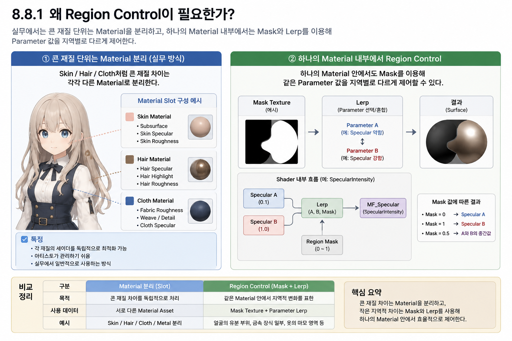
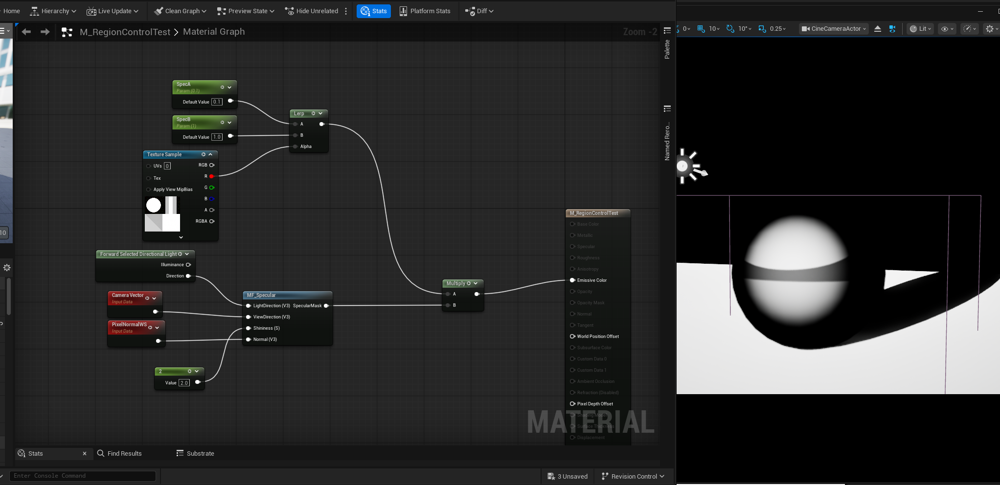

# Chapter 08 Building an Anime Shader

## 8.8 Region-based Parameter Control

여기서 Region Control은 Mask 기반 Parameter 선택이며 Unreal의 Material Layers System 자체를 구현하는 것이 아니다. 기본 Master에 자동 통합하지 않는 별도 검증 예제로 유지한다. Skin/Hair/Outfit이라는 이름만으로 별도 Slot이 필수인 것은 아니며 Shading Model·Blend Mode·Pass·데이터·비용을 기준으로 분리를 판단한다.

지금까지 Chapter 8에서는 Anime Shader를 구성하는 주요 Rendering Feature를 하나씩 구현하고,

각 기능을 Material Function으로 분리하여 ASF Master Material에 통합했다.

현재 ASF에는 다음과 같은 기능이 구성되어 있다.

~~~text
Directional Lighting
Shadow
Specular
Rim Light
MatCap
Emission
~~~

지금까지의 작업은 주로

~~~text
어떤 Rendering Effect를 만들 것인가?
~~~

에 초점을 맞추었다.

하지만 실제 Character Material을 제작할 때는 하나의 Effect를 구현하는 것만으로 끝나지 않는다.

같은 Material 안에서도 Surface의 위치나 용도에 따라 서로 다른 Parameter가 필요한 경우가 있다.

예를 들어 하나의 의상 Material 안에서도

~~~text
일반 Fabric 영역
→ 낮은 Specular

코팅된 장식 영역
→ 높은 Specular
~~~

처럼 같은 Shader 기능을 서로 다른 값으로 사용해야 할 수 있다.

이때 사용할 수 있는 방법 중 하나가 `Mask`를 이용한 **Region-based Parameter Control**이다.

~~~text
Parameter A
Parameter B
     ↓
   Lerp
     ↑
Region Mask
     ↓
Selected Parameter
     ↓
Shader Function
~~~

이번 8.8에서는 복잡한 Material Layer System을 구축하지 않는다.

또한 Skin, Hair, Outfit 등 Character의 모든 재질을 하나의 Material 안에 넣는 구조도 만들지 않는다.

이번 절의 목표는 보다 기초적이다.

> **하나의 Material 내부에서 Mask를 이용하여 같은 Shader Parameter를 Surface Region별로 다르게 사용할 수 있는 원리를 이해한다.**

앞서 8.7의 Emission Mask에서는

~~~text
Emission
×
Mask
~~~

를 이용하여 특정 영역에서 Effect를 켜거나 끄는 구조를 확인했다.

이번에는 한 단계 확장하여,

~~~text
Parameter A
↔
Parameter B
~~~

사이를 Mask로 선택하거나 Blend하는 구조를 확인한다.

테스트는 `SpecularIntensity` 하나만 사용하여 단순하게 진행한다.

~~~text
Specular A
→ 약한 Highlight

Specular B
→ 강한 Highlight

Region Mask
→ 두 값의 적용 영역 결정
~~~

이를 통해 `Multiply`를 이용한 Effect Masking과,

`Lerp`를 이용한 Parameter Selection의 차이까지 확인한다.

---

### Why Region Control?

Region Control을 이해하기 전에 먼저

**Material을 나누는 것과 하나의 Material 내부에서 영역을 나누는 것은 서로 다른 문제**

라는 점을 구분해야 한다.

실제 Character Asset에서는 Skin, Hair, Outfit처럼 재질 특성이 크게 다른 Surface를 일반적으로 별도의 Material로 분리한다.

~~~text
Character

├─ Skin Material
├─ Hair Material
├─ Face Material
├─ Outfit Material
└─ Accessory / Metal Material
~~~

각 Material은 서로 다른 Shader 설정과 Texture를 사용할 수 있다.

예를 들어 Skin과 Hair는 필요한 Rendering 특성이 상당히 다르다.

~~~text
Skin
→ Skin Specular
→ Skin Roughness
→ 경우에 따라 Subsurface 관련 처리

Hair
→ Hair Highlight
→ Hair Specular
→ Hair 전용 Directional 표현
~~~

이처럼 **재질의 성격 자체가 크게 다른 경우에는 Material을 분리하는 것이 자연스럽다.**

---

#### Variation within a Material

반대로 같은 재질 안에서도 부분적으로 다른 특성이 필요한 경우가 있다.

예를 들어 하나의 Outfit Material 안에서

~~~text
일반 천 영역
→ Specular 약함

코팅된 문양
→ Specular 강함
~~~

처럼 지역적인 차이가 있을 수 있다.

또는 얼굴 Material 내부에서도

~~~text
일반 피부
→ 기본 Specular

입술
→ 조금 더 높은 Specular

눈가 특정 영역
→ 별도 Parameter
~~~

처럼 같은 Material 안에서 작은 차이를 표현할 수 있다.

이러한 차이를 표현하기 위해 영역마다 별도의 Material Slot을 계속 추가하면 구조가 필요 이상으로 복잡해질 수 있다.

이럴 때 Mask를 이용하여 하나의 Material 내부에서 Parameter를 다르게 사용하는 방법이 유용하다.

---

### Material Separation and Region Control

두 방식은 다음과 같이 구분할 수 있다.

#### Material Separation

~~~text
Skin
Hair
Outfit
Metal
~~~

처럼 재질 특성이 크게 다른 경우 각각 독립적인 Material을 사용한다.

각 Material은

~~~text
별도의 Texture
별도의 Parameter
별도의 Shader 설정
~~~

을 가질 수 있다.

---

#### Region Control

하나의 Material 안에서

~~~text
Mask
+
Parameter
~~~

를 이용하여 지역적인 차이를 만든다.

예를 들어

~~~text
SpecularIntensity A
=
0.1

SpecularIntensity B
=
1.0
~~~

두 값을 준비한 뒤,

Region Mask를 이용하여 두 값 중 어느 값을 사용할지 결정할 수 있다.

~~~text
Specular A ───────┐
                  │
                Lerp
                  │
Specular B ───────┘
                  ↑
             Region Mask
                  ↓
       Final SpecularIntensity
~~~

---

*Figure 8-67. Material 분리와 같은 Material 내부의 Region Control을 비교한 기존 합성 자료. 하단의 `Lerp → MF_Specular(SpecularIntensity)`는 현재 Function 계약과 다르다. 올바른 연결은 `MF_Specular.SpecularMask × SpecularColor × lerp(IntensityA, IntensityB, RegionMask)`이며 Intensity 선택은 Function 밖에서 수행한다. 오른쪽 구의 색상·형상 차이는 Intensity만 바꾼 통제 비교의 증거로 사용하지 않는다. Character/렌더 영역의 출처 확인 전에는 해당 원본을 유지하고 주변 Label과 도식만 수정한다.*

위 Figure는 큰 Material 차이를 분리하는 방식과,

하나의 Material 안에서 Region Control을 사용하는 방식을 비교한 것이다.

왼쪽은

~~~text
Skin
Hair
Outfit
~~~

처럼 재질 자체의 성격이 크게 다른 경우다.

이 경우 각각 독립적인 Material로 분리하는 것이 일반적이다.

반면 오른쪽은 하나의 Material 내부에서 Mask를 이용하여 같은 Parameter를 지역별로 다르게 사용하는 구조다.

~~~text
Mask
↓
Lerp
↓
Parameter Selection
↓
Shader Function
~~~

이번 8.8에서 다루는 것은 오른쪽의 구조다.

---

### Scope of the Region Example

`Material Layer`라는 표현을 보면

~~~text
Skin
Hair
Outfit
Metal
~~~

을 모두 하나의 Master Material 안에 넣고,

Mask로 전환하는 구조를 생각할 수 있다.

하지만 이번 ASF Basic 단계에서는 그런 구조를 만들지 않는다.

그렇게 하면

- Material Slot 관리
- Character별 Texture Set
- Layer별 Shader Feature
- Layer별 Parameter Set
- Material Instance 구조
- 성능과 Branch 관리

등의 문제가 동시에 들어오면서 학습 범위가 크게 확장된다.

현재 단계의 목적은 훨씬 단순하다.

~~~text
하나의 Material
↓
같은 Shader Function
↓
Region에 따라 다른 Parameter
~~~

이 원리를 이해하는 것이다.

---

### Comparison with Emission Mask

8.7에서는 이미 Mask를 사용했다.

당시 구조는 다음과 같았다.

~~~text
EmissionResult
×
EmissionMask
~~~

Mask가 `0`이면 Emission이 사라지고,

Mask가 `1`이면 Emission이 적용되었다.

즉 Effect의 강도를 직접 Mask로 제어했다.

~~~text
Mask = 0
→ Effect Off

Mask = 1
→ Effect On
~~~

이번 Region Control은 조금 다르다.

Mask 자체를 Shader Effect에 곱하는 것이 아니라,

**두 Parameter 사이에서 어떤 값을 사용할지 결정한다.**

~~~text
Parameter A
Parameter B
     ↓
   Lerp
     ↑
    Mask
~~~

예를 들어

~~~text
Specular A
=
0.1

Specular B
=
1.0
~~~

이라면

~~~text
Mask = 0
→ Specular 0.1

Mask = 1
→ Specular 1.0
~~~

이 된다.

그리고 중간 Mask 값을 사용하면 두 값 사이를 Blend한다.

~~~text
Mask = 0.5
→ A와 B의 중간값
~~~

---

### Multiply and Lerp Responsibilities

두 방식은 모두 Mask를 사용할 수 있지만 목적이 다르다.

#### Multiply

~~~text
Effect
×
Mask
~~~

Effect의 강도를 직접 줄이거나 제거한다.

예를 들어

~~~text
Emission
×
Mask
~~~

는 Emission의 적용 여부를 결정한다.

---

#### Lerp

~~~text
Lerp(A, B, Mask)
~~~

A와 B라는 두 값 사이에서 결과를 선택하거나 혼합한다.

예를 들어

~~~text
Lerp(
    SpecularLow,
    SpecularHigh,
    RegionMask
)
~~~

를 사용하면 같은 Material 안에서 서로 다른 SpecularIntensity를 사용할 수 있다.

따라서 간단히 정리하면

~~~text
Multiply
→ Effect의 양을 Mask

Lerp
→ 두 Parameter 사이를 선택 / Blend
~~~

라고 이해할 수 있다.

---

### Lerp and Parameter Semantics

Mask는 0–1 범위이며 두 Parameter를 Lerp하는 것과 두 완성 Shading 결과를 Lerp하는 것은 일반적으로 다르다. 특히 Shininess처럼 비선형 연산에 들어가는 Parameter는 결과 Blend와 동치가 아니다. 이 예제의 Intensity는 Mask 밖의 선형 Multiply에 사용한다.

`Lerp`는 `Linear Interpolate`의 약자다.

세 개의 입력을 사용한다.

~~~text
A
B
Alpha
~~~

여기서 `Alpha`가 Mask 역할을 한다.

~~~text
Alpha = 0
→ A

Alpha = 1
→ B

Alpha = 0.5
→ A와 B의 중간
~~~

예를 들어

~~~text
A
=
0.1

B
=
1.0
~~~

일 때,

~~~text
Mask = 0
→ 0.1

Mask = 1
→ 1.0
~~~

이 된다.

Mask Texture를 사용한다면 Surface의 각 Pixel에서 서로 다른 값이 들어오므로,

지역마다 서로 다른 Parameter가 만들어진다.

~~~text
Black Region
→ Parameter A

White Region
→ Parameter B
~~~

---

### Sampled Region Scalar

앞서 Emission Mask에서 확인했듯이,

Region Mask Texture 전체가 하나의 값으로 Shader에 들어가는 것은 아니다.

~~~text
Region Mask Texture
↓
현재 Pixel의 UV 위치에서 Sample
↓
R Channel
↓
Scalar 0 ~ 1
↓
Lerp Alpha
~~~

즉 각 Pixel은 자신이 위치한 Texture 영역에 따라 서로 다른 Alpha 값을 사용한다.

~~~text
Pixel A
→ Mask 0
→ Parameter A

Pixel B
→ Mask 1
→ Parameter B
~~~

이 Pixel들이 모이면서 하나의 Surface 안에 서로 다른 Parameter 영역이 만들어진다.

---

### Validation Scope

이번 8.8에서는 여러 Material Parameter를 동시에 다루지 않는다.

테스트 대상은 `SpecularIntensity` 하나로 제한한다.

~~~text
Specular A
=
Low

Specular B
=
High
~~~

그리고 Region Mask를 이용하여

~~~text
Specular A
Specular B
     ↓
   Lerp
     ↑
Region Mask
     ↓
Final SpecularIntensity
     ↓
Multiply with MF_Specular.SpecularMask outside the Function
~~~

구조를 구현한다.

이를 통해

**같은 `MF_Specular`를 사용하면서도 Surface Region별로 서로 다른 SpecularIntensity를 전달할 수 있는지**

확인한다.

---

### Key Takeaways

Material Region Control은 서로 다른 재질을 무조건 하나의 Material로 합치는 기술이 아니다.

큰 재질 차이는 일반적으로 별도의 Material로 분리한다.

~~~text
Skin / Hair / Outfit / Metal
→ Material 분리
~~~

반면 같은 Material 내부에서 작은 지역적 차이가 필요한 경우에는

~~~text
Mask
+
Parameter
+
Lerp
~~~

를 이용할 수 있다.

이번 8.8의 목적은 다음 구조를 이해하는 것이다.

~~~text
Parameter A
Parameter B
     ↓
   Lerp
     ↑
Region Mask
     ↓
Selected Parameter
     ↓
Existing ASF Module
~~~

즉 새로운 Shader Effect를 만드는 것이 아니라,

**이미 구현한 ASF Module에 전달되는 Parameter를 Surface Region별로 다르게 선택하는 방법**

을 학습한다.

다음 절에서는 실제 `Lerp` Node를 사용하여 두 개의 `SpecularIntensity` 값이 Mask에 따라 어떻게 선택되는지 구현한다.

---

**Next → 8.8.2 Mask와 Lerp를 이용한 Parameter 선택**

---

### Parameter Selection with Mask and Lerp

앞 절에서는 Region Control이

**서로 다른 Material을 하나로 합치는 방식이 아니라, 하나의 Material 내부에서 같은 Shader Parameter를 Surface Region별로 다르게 사용하는 방법**

이라는 점을 정리했다.

이번 절에서는 그 원리를 실제 Material Graph로 구현한다.

테스트 대상은 `SpecularIntensity` 하나로 제한한다.

핵심 구조는 다음과 같다.

~~~text
Specular A
Specular B
     ↓
   Lerp
     ↑
Region Mask
     ↓
Final SpecularIntensity
     ↓
Multiply with MF_Specular.SpecularMask outside the Function
~~~

즉 새로운 Specular Shader를 만드는 것이 아니라,

`MF_Specular`가 출력한 SpecularMask에 외부에서 곱할 Intensity를 Region Mask로 선택한다. Intensity는 8.4 Function의 Input이 아니다.

---

#### Selecting between Parameters

이번 테스트에서는 두 개의 Scalar Parameter를 준비했다.

~~~text
SpecularIntensityA
=
0.1

SpecularIntensityB
=
1.0
~~~

두 값을 `Lerp` Node의 A와 B에 연결한다.

~~~text
SpecularIntensityA
→ Lerp A

SpecularIntensityB
→ Lerp B
~~~

그리고 Region Mask를 `Alpha`에 연결한다.

~~~text
RegionMask
→ Lerp Alpha
~~~

Lerp는 Alpha 값에 따라 A와 B 사이의 값을 선택하거나 혼합한다.

~~~text
Alpha = 0
→ A

Alpha = 1
→ B

Alpha = 0.5
→ A와 B의 중간값
~~~

따라서 현재 설정에서는 다음과 같이 동작한다.

~~~text
Mask = 0
→ SpecularIntensity = 0.1

Mask = 1
→ SpecularIntensity = 1.0
~~~

중간값에서는 두 Parameter가 보간된다.

예를 들어

~~~text
Mask = 0.5
~~~

이면

~~~text
0.1
↔
1.0
~~~

사이의 중간 SpecularIntensity가 만들어진다.

---

#### Scalar Mask Test

먼저 Region Mask를 단순한 Scalar 값으로 사용하여

Lerp 자체가 정상적으로 동작하는지 확인했다.

~~~text
RegionMask = 0
RegionMask = 0.5
RegionMask = 1
~~~

이 테스트의 목적은 결과 이미지를 만드는 것이 아니라,

다음 관계를 확인하는 것이다.

~~~text
Mask 값
↓
Lerp Alpha
↓
Final SpecularIntensity
~~~

즉 Mask가 Effect를 직접 On / Off 하는 것이 아니라,

두 Parameter 사이의 값을 선택한다.

이 점이 앞서 구현한 Emission Mask와의 중요한 차이다.

---

#### Emission Mask and Region Control

Emission에서는 다음 구조를 사용했다.

~~~text
EmissionResult
×
EmissionMask
~~~

즉 Mask가 Effect의 양을 직접 조절했다.

~~~text
Mask = 0
→ Effect 제거

Mask = 1
→ Effect 적용
~~~

반면 이번 Region Control에서는 다음 구조를 사용한다.

~~~text
Lerp(
    SpecularIntensityA,
    SpecularIntensityB,
    RegionMask
)
~~~

즉 Mask의 역할은

~~~text
Effect를 제거하는 것
~~~

이 아니라

~~~text
어떤 Parameter 값을 사용할 것인가
~~~

를 결정하는 것이다.

간단히 정리하면 다음과 같다.

~~~text
Multiply
→ Effect의 강도를 Mask

Lerp
→ 두 Parameter 사이를 선택 / Blend
~~~

---

### Texture-based Region Mask

Scalar 값으로 Lerp 동작을 확인한 뒤,

Region Mask를 실제 Texture로 교체했다.

이제 Surface의 각 위치에서 서로 다른 Mask 값이 사용된다.

구조는 다음과 같다.

~~~text
Region Mask Texture
↓
Texture Sample
↓
R Channel
↓
Lerp Alpha
~~~

즉 Texture 전체가 하나의 값으로 들어가는 것이 아니라,

현재 Pixel의 UV 위치에서 Sample된 R Channel 값이 Alpha로 사용된다.

~~~text
Current Pixel UV
↓
Texture Sample
↓
R
↓
Scalar 0 ~ 1
↓
Lerp Alpha
~~~

이 원리는 앞서 Emission Mask에서 확인한 Texture Sampling 구조와 동일하다.

---

#### Mask Value Behavior

Region Mask Texture의 각 Pixel 값은 다음 의미를 가진다.

~~~text
Black
=
0
→ SpecularIntensityA 적용

White
=
1
→ SpecularIntensityB 적용

Gray
=
0 ~ 1
→ SpecA와 SpecularIntensityB 사이 보간
~~~

따라서 하나의 Material 안에서도 Surface 위치에 따라 다른 SpecularIntensity를 만들 수 있다.

~~~text
Region A
→ Low Specular

Region B
→ High Specular
~~~

하지만 두 영역 모두 같은 `MF_Specular`를 사용한다.

즉 Shader Function을 복제하지 않고,

Input Parameter만 Region별로 다르게 전달하는 구조다.

---

#### Applying Intensity to the Specular Output

이번 테스트에서는 `MF_Specular`의 Specular Mask 결과에

Lerp에서 만들어진 Final SpecularIntensity를 곱했다.

~~~text
MF_Specular
↓
SpecularMask
        │
        ×
        ↑
Final SpecularIntensity
        ↓
Final Specular
~~~

그리고 테스트 Material은 `Unlit`이므로,

결과를 확인하기 위해 최종 Specular를 `Emissive Color`로 직접 출력했다.

~~~text
Final Specular
↓
Emissive Color
~~~

이 구조는 최종 ASF Master Material 구조를 만드는 것이 아니라,

Region별 SpecularIntensity 차이를 명확하게 확인하기 위한 테스트 구성이다.

---

#### Test Shininess

기존 Specular 구현에서는 `Shininess` 기본값으로 비교적 높은 값을 사용했다.

예를 들어

~~~text
Shininess
=
32
~~~

처럼 값이 높으면 Highlight가 좁고 집중되어 나타난다.

이 상태에서는 Region Mask에 따라 SpecularIntensity가 달라져도,

Highlight 영역 자체가 너무 작아서 Surface의 영역 차이를 한눈에 확인하기 어려웠다.

따라서 이번 Region Control 테스트에서는

~~~text
Shininess
=
2
~~~

로 일시적으로 낮추었다.

이는 최종 권장값이 아니라,

**Region별 SpecularIntensity 차이를 시각적으로 명확하게 확인하기 위한 테스트 설정**이다.

---

#### Shape and Intensity

이번 테스트에서 두 Parameter의 역할을 다시 구분할 필요가 있다.

`Shininess`는 Highlight의 크기와 집중도에 영향을 준다.

~~~text
Low Shininess
→ 넓은 Highlight

High Shininess
→ 좁고 집중된 Highlight
~~~

반면 `SpecularIntensity`는 만들어진 Highlight의 강도를 조절한다.

~~~text
Low SpecularIntensity
→ 약한 Highlight

High SpecularIntensity
→ 강한 Highlight
~~~

즉 이번 테스트에서

~~~text
Shininess = 2
~~~

로 낮춘 이유는 Specular의 형태 자체를 최종 디자인하기 위한 것이 아니라,

Region Mask에 의해 달라지는 Intensity 차이를 쉽게 관찰하기 위해서다.

---

### Texture Region Result

Texture Mask를 적용한 테스트 결과는 다음 Figure에서 확인할 수 있다.

*Figure 8-68. Texture R을 Alpha로 사용한 `lerp(0.1, 1.0, RegionMask)`를 MF_Specular의 Mask 출력에 외부 Multiply하는 비교. Shininess=2는 이 테스트의 설정이다. 캡처의 Forward Selected Directional Light는 지원 조건을 확인한 Adapter 예로만 해석하며, 현재 기본 경로에서는 같은 World Space의 유효 LightDirection을 공급한다. 화면 밝기는 Scalar 값의 직접 측정이 아니다.*

Figure의 Material Graph에서는 다음 구조를 확인할 수 있다.

~~~text
SpecularIntensityA = 0.1
        │
        ├──── Lerp
        │       ↑
SpecularIntensityB = 1.0     │
                │
Texture Sample R
        ────────┘
                ↓
Final SpecularIntensity
                ↓
Multiply
                ↑
MF_Specular.SpecularMask
                ↓
Emissive Color
~~~

Viewport에서는 Texture Mask의 영역에 따라 Specular 강도가 달라지는 것을 확인할 수 있다.

~~~text
Mask가 낮은 영역
→ 약한 Specular

Mask가 높은 영역
→ 강한 Specular

중간 Gray 영역
→ 두 값 사이의 Specular
~~~

즉 같은 `MF_Specular`를 사용하면서도,

Surface Region별로 다른 SpecularIntensity를 적용할 수 있다.

---

### Region Control Responsibility

이번 구현에서 중요한 것은 Specular 자체를 여러 개 만든 것이 아니라는 점이다.

~~~text
MF_Specular A
MF_Specular B
~~~

처럼 Shader Function을 복제한 것이 아니다.

하나의 `MF_Specular`를 그대로 사용하면서,

그 Function의 결과에 적용되는 Parameter만 Region Mask에 따라 변경했다.

~~~text
Specular Parameter A
Specular Parameter B
        ↓
      Lerp
        ↑
   Region Mask
        ↓
Selected Parameter
        ↓
Existing Shader Function
~~~

이 구조는 Region-based Parameter Control의 핵심이다.

---

#### Material Boundary

이번 테스트 결과를

~~~text
Skin
Hair
Outfit
Metal
~~~

같은 모든 Material을 하나의 Shader에 넣는 구조로 해석하면 안 된다.

큰 Material 차이는 여전히 별도의 Material Slot이나 Material Asset으로 관리하는 것이 일반적이다.

이번 방식은

~~~text
하나의 Material 내부에서
지역적인 Parameter Variation이 필요한 경우
~~~

를 위한 것이다.

예를 들어

~~~text
같은 Outfit Material

일반 Fabric
→ Specular 약함

코팅된 Pattern
→ Specular 강함
~~~

처럼 활용할 수 있다.

---

### Implementation Result

이번 테스트에서는 `SpecularIntensity`를 Region Mask로 제어했다.

두 Parameter는 다음과 같다.

~~~text
SpecularIntensityA
=
0.1

SpecularIntensityB
=
1.0
~~~

Region Mask Texture의 R Channel을 `Lerp Alpha`로 사용하여

Surface 위치별로 서로 다른 Final SpecularIntensity를 생성했다.

~~~text
Mask Texture
↓
Current Pixel Sample
↓
R Channel
↓
Lerp Alpha
↓
SpecularIntensityA / SpecularIntensityB Selection
↓
Final SpecularIntensity
↓
MF_Specular Result
~~~

또한 Region 차이를 명확하게 확인하기 위해

~~~text
Shininess = 2
~~~

를 임시 테스트값으로 사용했다.

이를 통해 다음 관계를 확인했다.

~~~text
같은 Shader Function
+
같은 Material
+
서로 다른 Region Mask 값
↓
Surface 위치별 Parameter Variation
~~~

즉 Region Control은 새로운 Shader Effect를 추가하는 것이 아니라,

**기존 Shader Module에 전달되는 Parameter를 Surface 위치에 따라 다르게 선택하는 방법**

이다.

다음 절에서는 이번 테스트를 ASF 관점에서 정리하고,

어떤 경우에 Material을 분리하고 어떤 경우에 Region Control을 사용하는 것이 적절한지 최종적으로 정리한다.

---

**Next → 8.8.4 ASF 적용과 정리**

---

### ASF Application and Summary

앞 절에서는 `Region Mask`를 이용하여 하나의 Material 내부에서 `SpecularIntensity`를 Surface 위치별로 다르게 적용하는 구조를 구현했다.

이번 절에서는 이 결과를 ASF 관점에서 정리하고,

실제 Character Material에서 언제 Material을 분리하고 언제 Region Control을 사용하는 것이 적절한지 판단 기준을 정리한다.

이번 8.8의 목적은 복잡한 Material Layer System을 구축하는 것이 아니다.

핵심은 다음 한 가지다.

~~~text
같은 Shader Function을 유지하면서
Region Mask를 이용해
Surface 위치별로 다른 Parameter를 전달한다.
~~~

---

### Region Control in the Data Flow

이번 테스트에서는 두 개의 SpecularIntensity 값을 준비했다.

~~~text
SpecularIntensityA
=
0.1

SpecularIntensityB
=
1.0
~~~

그리고 Region Mask를 이용하여 두 값 사이를 선택했다.

~~~text
SpecularIntensityA
SpecularIntensityB
   ↓
 Lerp
   ↑
RegionMask
   ↓
Final SpecularIntensity
~~~

이 결과를 기존 `MF_Specular`의 Specular 결과에 곱했다.

~~~text
MF_Specular.SpecularMask
        │
        ×
        ↑
Final SpecularIntensity
        ↓
Final Specular
~~~

즉 Region Control은 `MF_Specular` 자체를 변경하는 기능이 아니다.

기존 Shader Module은 그대로 유지하고,

그 Module에 전달되거나 적용되는 Parameter만 Surface Region에 따라 다르게 선택한다.

~~~text
Region Mask
↓
Parameter Selection
↓
Existing ASF Module
~~~

이것이 ASF에서 Region Control을 사용하는 기본 구조다.

---

### Reusing the Function

Region별로 결과가 다르게 보인다고 해서

다음처럼 Shader Function을 여러 개 만드는 것은 아니다.

~~~text
MF_Specular_Skin

MF_Specular_Outfit

MF_Specular_Metal
~~~

이번 8.8에서 확인한 구조는 이와 다르다.

~~~text
하나의 MF_Specular
+
Region별 Parameter
+
Mask
~~~

를 사용한다.

예를 들어

~~~text
Specular A
=
0.1

Specular B
=
1.0
~~~

두 값을 Lerp한 뒤,

그 결과를 기존 SpecularMask에 외부에서 곱한다.

~~~text
Specular A ──────┐
                 │
               Lerp
                 │
Specular B ──────┘
                 ↑
            Region Mask
                 ↓
      Final SpecularIntensity
                 ↓
   Multiply with SpecularMask
~~~

이 구조의 장점은 Shader 기능 자체와 Material Variation을 분리할 수 있다는 점이다.

~~~text
Shader Function
→ 어떻게 계산할 것인가

Region Parameter
→ 어느 영역에서 어떤 값을 사용할 것인가
~~~

두 역할을 서로 분리해서 생각할 수 있다.

---

### Limits of Region Control

Region Control을 이해했다고 해서

Character의 모든 재질을 하나의 Material에 넣고 Mask로 관리해야 하는 것은 아니다.

실제 Character에서는 재질 특성이 크게 다르면 Material 자체를 분리하는 것이 일반적이다.

예를 들어

~~~text
Skin
Hair
Outfit
Metal
~~~

은 필요한 Shader 특성이 서로 상당히 다를 수 있다.

Hair에는 Hair Highlight가 필요할 수 있고,

Skin에는 Skin 특유의 Specular나 Subsurface 표현이 필요할 수 있다.

Outfit와 Metal 역시 Roughness, Specular, Reflection 특성이 크게 다르다.

이런 경우에는

~~~text
Character

├─ Skin Material
├─ Hair Material
├─ Outfit Material
└─ Accessory / Metal Material
~~~

처럼 Material Slot 자체를 분리하는 편이 자연스럽다.

---

### Region Control Use Cases

Region Control은

**같은 Material 안에서 부분적인 Parameter 차이가 필요한 경우**

에 적합하다.

예를 들어 하나의 Outfit Material 안에서

~~~text
일반 Fabric
→ Specular 약함

코팅된 Pattern
→ Specular 강함
~~~

처럼 차이를 만들 수 있다.

또는

~~~text
같은 Metal Material

일반 금속 영역
→ 기본 Roughness

마모된 영역
→ 다른 Roughness
~~~

처럼 사용할 수도 있다.

즉 다음과 같이 구분할 수 있다.

~~~text
재질의 성격 자체가 크게 다름
→ Material 분리

같은 Material 안의 지역적 변화
→ Region Mask + Parameter Control
~~~

---

### Choosing the Material Boundary

실무에서는 다음 기준으로 생각하면 이해하기 쉽다.

#### Separate Materials

~~~text
Shader 모델 자체가 다름

사용하는 Texture Set이 크게 다름

필요한 Rendering Feature가 다름

재질 성격이 본질적으로 다름
~~~

예를 들면

~~~text
Skin
Hair
Outfit
Metal
~~~

같은 구분이다.

---

#### Shared Material with Region Parameters

~~~text
같은 Material 안에서
특정 Parameter만 지역적으로 다르게 사용
~~~

예를 들면

~~~text
SpecularIntensity

Roughness

Metallic

RimIntensity

MatCapBlend
~~~

같은 값을 Surface 위치별로 다르게 적용할 때 사용할 수 있다.

---

### Multiply Mask and Lerp Mask

8.7과 8.8을 통해 Mask를 사용하는 두 가지 기본 방법을 확인했다.

#### Multiply

Effect 자체의 강도를 직접 조절한다.

~~~text
Effect
×
Mask
~~~

예를 들어

~~~text
Emission
×
EmissionMask
~~~

에서는

~~~text
Mask = 0
→ Emission Off

Mask = 1
→ Emission On
~~~

으로 동작한다.

즉 하나의 Effect를 줄이거나 제거하는 데 적합하다.

---

#### Lerp

두 개의 서로 다른 값을 선택하거나 혼합한다.

~~~text
Lerp(
    Parameter A,
    Parameter B,
    Mask
)
~~~

예를 들어

~~~text
SpecularIntensityA
=
0.1

SpecularIntensityB
=
1.0
~~~

일 때

~~~text
Mask = 0
→ SpecularIntensityA

Mask = 1
→ SpecularIntensityB

Mask = 0.5
→ 두 값의 중간
~~~

이 된다.

따라서 두 방식을 다음처럼 구분할 수 있다.

~~~text
Multiply + Mask
→ Effect Amount Control

Lerp + Mask
→ Parameter Selection / Blend
~~~

---

### Region Texture Data

이번 테스트에서는 Region Mask를 Texture로 만들었다.

Texture의 R Channel을 사용하여 각 Pixel에 다른 값을 전달했다.

~~~text
Mask Texture
↓
현재 Pixel UV에서 Sample
↓
R Channel
↓
Scalar 0 ~ 1
↓
Lerp Alpha
~~~

따라서 하나의 Surface에서도 위치마다 다른 Parameter를 사용할 수 있다.

~~~text
Black Region
→ Parameter A

White Region
→ Parameter B

Gray Region
→ A와 B 사이 값
~~~

이 원리는 앞으로 다른 Parameter에도 그대로 확장할 수 있다.

---

### Other Parameter Applications

이번 테스트는 `SpecularIntensity` 하나만 사용했다.

하지만 같은 방식은 다른 Parameter에도 적용할 수 있다.

예를 들어

~~~text
RimIntensity A
RimIntensity B
      ↓
    Lerp
      ↑
 Region Mask
      ↓
Final RimIntensity
~~~

또는

~~~text
MatCapBlend A
MatCapBlend B
      ↓
    Lerp
      ↑
 Region Mask
~~~

같은 구조를 만들 수 있다.

중요한 것은

새로운 Shader 기능을 만드는 것이 아니라,

~~~text
기존 ASF Module
+
Region별 Parameter
~~~

구조를 사용하는 것이다.

---

### Separate Validation Example

이번 8.8에서는 Region Control 구조를 ASF Master Material에 추가하지 않았다.

이는 구현이 불가능해서가 아니라,

현재 단계에서는 원리 검증만으로 충분하기 때문이다.

Master Material에 실제로 추가하면

~~~text
SpecularIntensityA
SpecularIntensityB
RegionMask
~~~

등 추가 Parameter가 늘어나고,

전체 Graph도 더 복잡해진다.

하지만 아직 실제 Character에서

~~~text
어떤 Material에
어떤 Region이 필요하고
어떤 Parameter를 분리해야 하는가
~~~

가 결정되지 않은 상태다.

따라서 지금 Master Material에 범용 Region Layer 구조를 미리 넣는 것은

불필요한 복잡도를 만들 수 있다.

이번 8.8에서는

~~~text
원리 이해
↓
테스트 Material에서 검증
↓
필요할 때 실제 Character Material에 적용
~~~

하는 방향으로 마무리한다.

---

### Character Integration Decisions

실제 Character 제작 단계에서는 먼저 Material 구조를 결정한다.

예를 들어

~~~text
Head
Hair
Body
Outfit
Accessory
~~~

등 필요한 Material Slot을 구성한다.

그다음 각 Material 안에서 지역적인 Variation이 필요할 경우에만 Region Control을 추가한다.

예를 들어

~~~text
Outfit Material
↓
Region Mask
↓
일반 Fabric / Coated Pattern
~~~

처럼 사용하는 방식이다.

즉 Region Control은 Material 분리를 대체하는 기능이 아니라,

**Material 분리 이후에도 필요한 세부 Variation을 추가하는 방법**

으로 보는 것이 적절하다.

---

### Region Data Flow

이번 8.8에서는 다음 흐름을 확인했다.

~~~text
Material 전체 구조 판단
↓
큰 재질 차이
→ Material 분리

같은 Material 내부의 지역적 차이
↓
Region Mask
↓
Lerp
↓
Parameter Selection
↓
Existing ASF Module
~~~

Specular 테스트에서는 다음 구조를 구현했다.

~~~text
SpecularIntensityA
=
0.1

SpecularIntensityB
=
1.0

Region Mask Texture
↓
Texture Sample R
↓
Lerp Alpha
↓
Final SpecularIntensity
↓
MF_Specular Result와 Multiply
↓
Surface Region별 다른 Specular
~~~

이를 통해 하나의 Material과 하나의 Shader Function을 유지하면서도,

Surface 위치별로 서로 다른 Parameter를 적용할 수 있다는 것을 확인했다.

---

### Section Takeaways

이번 절의 핵심은 Material을 복잡하게 Layering하는 것이 아니다.

~~~text
하나의 Material
+
하나의 Shader Module
+
Region Mask
+
서로 다른 Parameter
~~~

를 이용하여 Surface Variation을 만드는 원리를 이해하는 것이 목적이다.

가장 중요한 판단 기준은 다음과 같다.

~~~text
큰 재질 차이
→ Material 분리

작은 지역적 차이
→ Region Control
~~~

Mask를 사용하는 방식도 목적에 따라 구분한다.

~~~text
Effect를 끄거나 강도를 조절
→ Multiply

두 Parameter 사이를 선택하거나 혼합
→ Lerp
~~~

그리고 Region Control은 새로운 Shader를 만드는 기능이 아니라,

**기존 ASF Shader Module에 전달되는 Parameter를 Surface 위치별로 다르게 선택하는 구조**

다.

이 원리를 이해하면 이후 실제 Character Material을 제작할 때

필요한 영역에만 선택적으로 Region Control을 추가할 수 있다.

---

### Section Completion

이번 8.8에서는 복잡한 Material Layer System으로 확장하지 않고,

Region-based Parameter Control의 핵심 원리만 짧게 확인했다.

~~~text
Material 분리
vs
Region Control

Multiply
vs
Lerp

Effect Mask
vs
Parameter Selection
~~~

의 차이를 구분하고,

Texture Mask를 이용하여 하나의 Material 내부에서 Region별로 다른 `SpecularIntensity`를 적용하는 테스트까지 완료했다.

이를 통해 ASF에서 필요한 경우 기존 Shader Module을 유지하면서도,

Surface Region별 Material Variation을 추가할 수 있는 기본 구조를 확보했다.