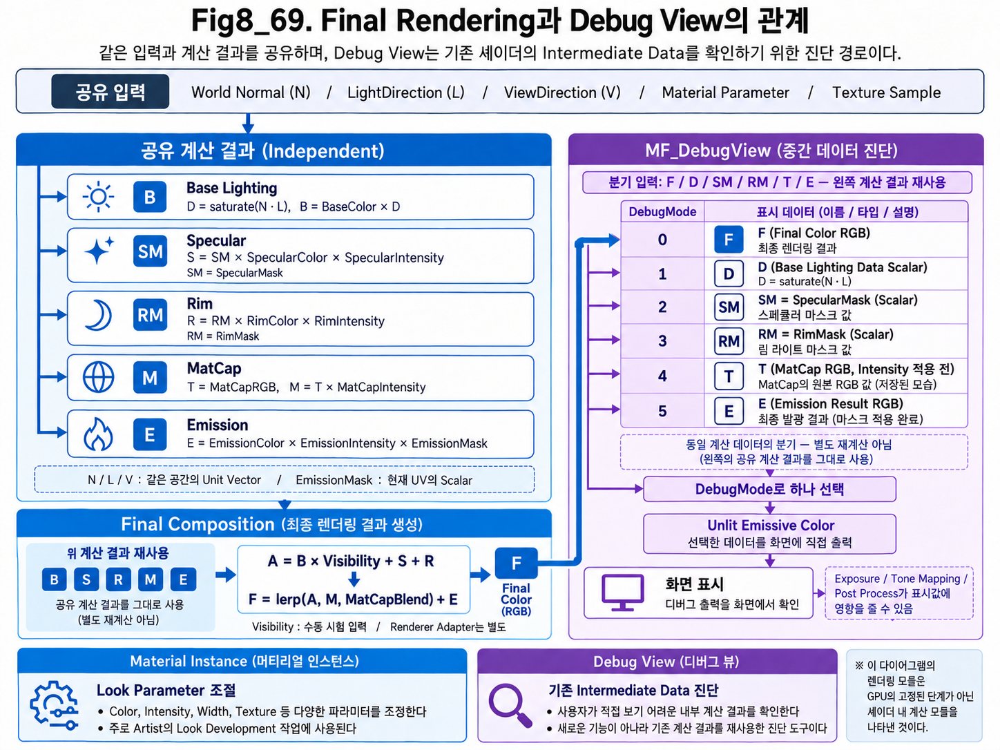
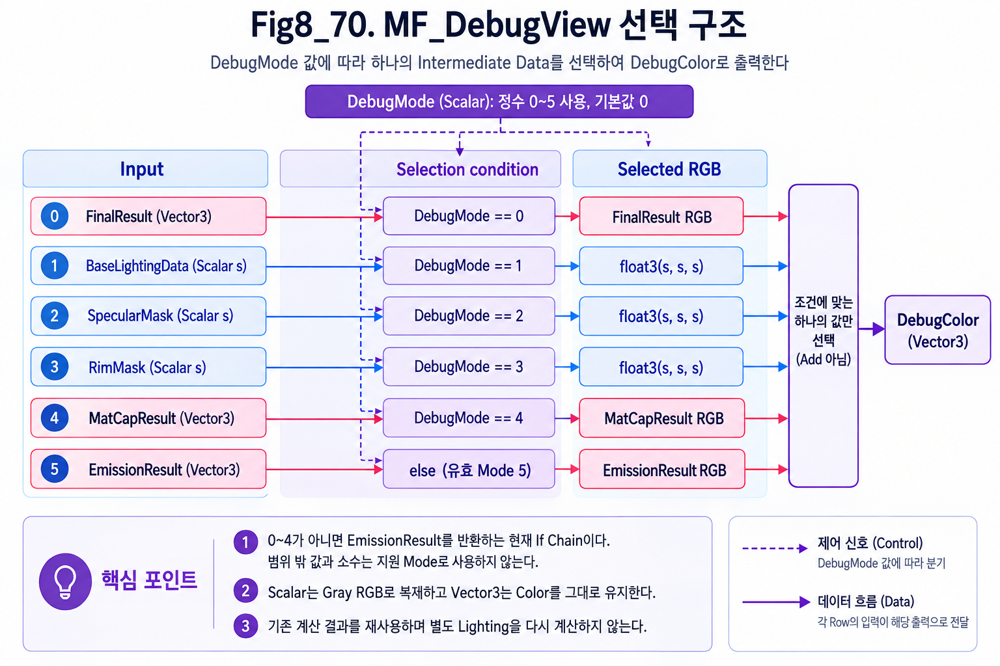
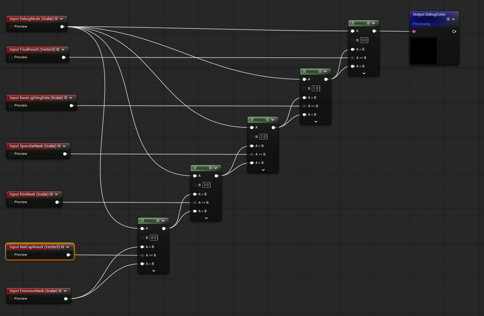
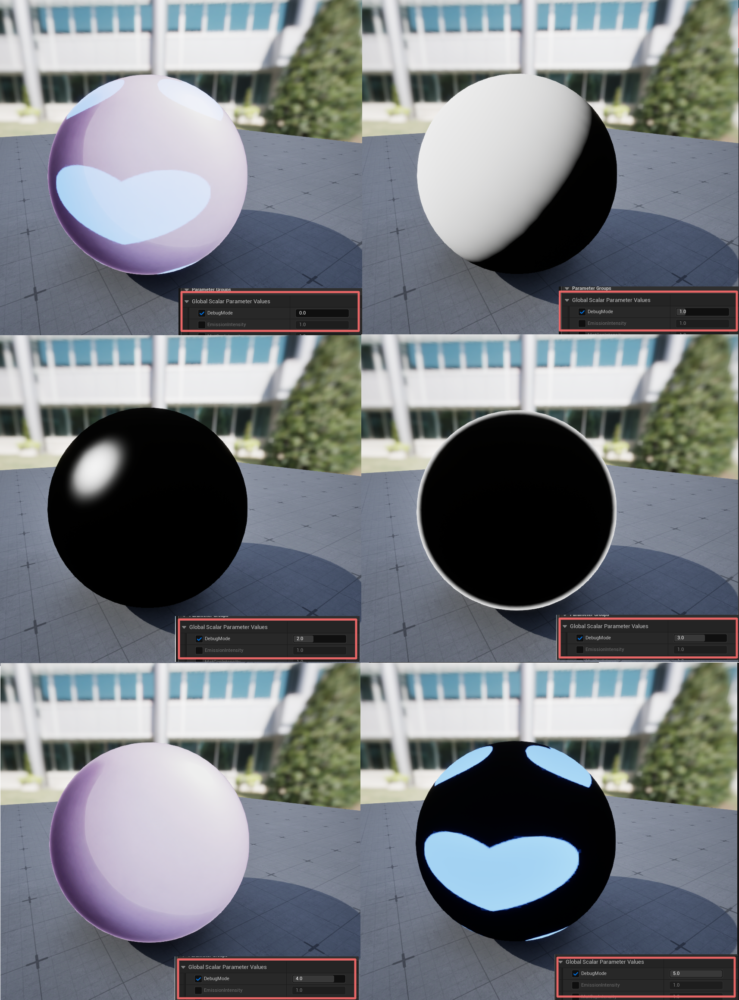

# Chapter 08 — Building an Anime Shader

## 8.9 Debug View

지금까지 ASF에서는 Base Lighting, Shadow, Specular, Rim Light, MatCap, Emission과 같은 여러 Shader Feature를 각각 구현하고, 이 결과들을 조합하여 최종 Anime Shading 결과를 만들어 왔다.

기능이 하나씩 분리되어 있을 때는 문제가 발생하더라도 원인을 비교적 쉽게 찾을 수 있다.

하지만 여러 Material Function과 Feature가 하나의 Master Material 안에서 결합되기 시작하면 상황이 달라진다.

예를 들어 최종 Rendering 결과에서 Specular Highlight가 예상과 다른 위치에 나타났다고 하더라도, 문제의 원인이 반드시 `SpecularIntensity`나 `SpecularColor` 같은 Parameter에 있다고 볼 수는 없다.

문제는 다음과 같은 여러 단계에서 발생할 수 있다.

- Light Direction이 예상과 다르게 전달되었을 수 있다.
- Surface Normal이 잘못된 방향을 사용하고 있을 수 있다.
- Specular 계산에서 생성되는 Mask가 예상과 다를 수 있다.
- Mask는 정상이나 Color 또는 Intensity 적용 과정에서 문제가 생겼을 수 있다.
- Specular 자체는 정상이지만 다른 Feature와 합쳐지는 Composition 과정에서 결과가 달라졌을 수 있다.

일반적인 Material 제작에서는 Artist 또는 사용자가 결과를 쉽게 조절할 수 있도록 주요 값을 Parameter로 노출한다.

예를 들어 ASF에서도 다음과 같은 값들을 Material Instance에서 직접 조절할 수 있다.

- Base Color
- Specular Color
- Specular Intensity
- Shininess
- Rim Width
- Rim Softness
- Rim Intensity
- MatCap Texture
- MatCap Intensity
- Emission Color
- Emission Intensity

이러한 Parameter는 Look Development 과정에서 매우 중요하다.

하지만 Material Instance는 기본적으로 **최종 결과를 조절하기 위한 Interface**이며, Shader 내부에서 자동으로 계산되는 모든 Intermediate Data를 직접 확인하기 위한 도구는 아니다.

예를 들어 `RimWidth`와 `RimSoftness`를 조절하는 것은 가능하지만, 그 결과 Shader 내부에서 생성된 `RimMask`가 Surface 전체에 어떻게 분포하고 있는지는 Parameter 값만 보고 바로 알 수 없다.

따라서 Shader 구조가 복잡해질수록 다음과 같은 별도의 관찰 방법이 필요해진다.

> **최종 결과를 조절하는 것이 아니라, 최종 결과가 만들어지는 내부 계산 과정을 직접 확인하는 방법**

Chapter 8.9에서는 이러한 목적을 위해 **Debug View**를 설계하고 구현한다.

Debug View는 새로운 Shading Effect를 추가하는 기능이 아니다.

이미 ASF 내부에서 계산되고 있는 데이터를 별도의 진단 경로를 통해 화면에 직접 출력하여, 문제가 발생했을 때 어느 계산 단계에서 이상이 시작되었는지를 빠르게 확인하기 위한 기능이다.

ASF에서는 우선 다음과 같은 Intermediate Data를 Debug 대상으로 사용한다.

- Base Lighting Data
- Specular Mask
- Rim Mask
- MatCap Result
- Emission Mask

이 값들은 모두 최종 Shading 결과를 만들기 위해 이미 계산되고 있는 데이터다.

따라서 Debug View를 위해 동일한 계산을 다시 만드는 것이 아니라, 기존 계산 결과를 그대로 재사용한다.

이를 통해 Debug View에서 확인하는 값과 실제 Final Shading에 사용되는 값이 동일한 Data Flow를 공유하도록 한다.

---

### Understanding Shader Debug View

Shader는 하나의 계산만으로 최종 Pixel Color를 만드는 것이 아니다.

하나의 Material 내부에서도 여러 단계의 계산이 순차적으로 진행되고, 각 단계에서 생성된 결과가 다음 계산의 Input으로 전달된다.

ASF 역시 현재 다음과 같은 흐름을 가지고 있다.

~~~text
Base Lighting
      ↓
Shadow
      ↓
Specular
      ↓
Rim Light
      ↓
MatCap
      ↓
Emission
      ↓
Final Color
~~~

일반적인 Rendering 상태에서는 이러한 Intermediate Result가 각각 따로 화면에 나타나지 않는다.

우리가 최종적으로 보는 것은 여러 계산이 모두 합쳐진 **Final Shading Result**다.

이 구조는 정상적인 Rendering에는 적합하지만, 문제를 추적할 때는 불편할 수 있다.

예를 들어 최종 결과에서 Specular가 예상보다 넓게 나타났다고 가정하자.

Material Instance에서 `SpecularIntensity`를 낮추면 Highlight 자체를 약하게 만들 수 있다.

하지만 이것만으로는 다음 질문에 답할 수 없다.

- Specular Mask 자체가 너무 넓게 생성되고 있는가?
- `Shininess` 계산이 예상과 다른가?
- Light Direction 또는 View Direction이 잘못 전달되고 있는가?
- Specular 계산은 정상이고 단순히 Intensity만 높은 것인가?
- 다른 Feature와 합쳐진 이후에 결과가 과도하게 강조되고 있는가?

즉 Parameter를 조절하여 결과를 바꾸는 것과, 문제의 원인을 확인하는 것은 서로 다른 작업이다.

이때 Shader 내부의 `SpecularMask` 자체를 화면에 직접 출력할 수 있다면 문제를 훨씬 빠르게 분리할 수 있다.

예를 들어 다음과 같이 판단할 수 있다.

~~~text
Final Result에서 Specular 이상 발견
            ↓
Specular Mask 확인
            ↓
Mask가 정상
            ↓
Specular Color / Intensity 또는
Composition 단계 확인
~~~

반대로,

~~~text
Final Result에서 Specular 이상 발견
            ↓
Specular Mask 확인
            ↓
Mask 자체가 비정상
            ↓
Light Direction / View Direction /
Normal / Shininess 계산 확인
~~~

처럼 문제의 범위를 앞 단계로 좁힐 수도 있다.

이처럼 Shader 내부에서 생성되는 Intermediate Data를 화면에 직접 시각화하여 계산 상태를 확인하는 방식을 **Debug View**라고 이해할 수 있다.

---

#### Inspecting Intermediate Data

Shader 내부에서 사용하는 데이터는 항상 화면에서 바로 볼 수 있는 Color 형태로 존재하는 것은 아니다.

예를 들어 `Base Lighting Data`가 어떤 Pixel에서 다음과 같은 Scalar 값을 가진다고 하자.

~~~text
LightingData = 0.35
~~~

GPU 내부에서는 이 값이 단순한 숫자일 뿐이다.

하지만 이 값을 화면의 RGB Color로 직접 출력하면 다음과 같이 밝기로 표현할 수 있다.

~~~text
0.0  → Black
0.25 → Dark Gray
0.5  → Gray
0.75 → Light Gray
1.0  → White
~~~

따라서 Surface 전체에서 Lighting 값이 어떻게 분포하고 있는지를 흑백 이미지처럼 확인할 수 있다.

Mask 역시 같은 방식으로 확인할 수 있다.

예를 들어 `SpecularMask`나 `RimMask`가 0~1 범위라면 다음과 같이 해석할 수 있다.

~~~text
Mask = 0
→ 해당 Feature의 영향 없음

Mask = 1
→ 해당 Feature의 영향이 최대

0 < Mask < 1
→ Feature가 부분적으로 적용됨
~~~

이 방식은 단순히 숫자를 확인하는 것보다 훨씬 직관적이다.

Surface 전체에서 데이터가 어떤 형태로 분포하고 있는지를 공간적으로 확인할 수 있기 때문이다.

반면 `MatCapResult`처럼 이미 RGB Color 데이터를 가지고 있는 경우에는 흑백으로 변환할 필요가 없다.

이 경우에는 계산된 RGB Result를 그대로 화면에 출력하여 다음과 같은 문제를 확인할 수 있다.

- MatCap Mapping 방향이 정상적인가
- View 변화에 따라 예상한 위치로 이동하는가
- Normal 기반 Mapping이 뒤집히거나 왜곡되지 않았는가
- Texture Sample 결과가 정상적으로 전달되고 있는가

따라서 Debug View는 모든 데이터를 동일한 방식으로 보여주는 기능이 아니다.

중요한 것은 **각 데이터의 의미를 유지한 상태에서 사람이 확인할 수 있는 형태로 시각화하는 것**이다.

---

#### Material Instance and Debug View

Material Instance와 Debug View는 모두 Material을 다루는 과정에서 사용되지만 목적이 다르다.

Material Instance는 주로 최종 Look을 만들기 위한 **사용자 제어 Interface**다.

예를 들어 다음과 같은 값들을 조절한다.

~~~text
SpecularIntensity
RimWidth
RimSoftness
MatCapIntensity
EmissionColor
EmissionIntensity
~~~

이러한 Parameter는 Artist가 원하는 시각적 결과를 만들기 위해 반복적으로 조절한다.

즉 Material Instance의 질문은 다음과 같다.

> **어떤 결과를 만들 것인가?**

반면 Debug View의 질문은 다르다.

예를 들어 `RimWidth`를 조절한 뒤 실제 Shader 내부에서는 `RimMask`라는 계산 결과가 만들어진다.

~~~text
RimWidth
    │
    │ Material Instance에서 조절
    ▼
MF_RimLight
    │
    ▼
RimMask
    │
    │ Debug View에서 확인
    ▼
Surface Distribution
~~~

사용자는 `RimWidth`를 직접 제어할 수 있지만, 그 값이 실제 Surface에서 어떤 Mask를 생성했는지는 최종 Rendering만으로 정확히 판단하기 어려울 수 있다.

Debug View는 이 계산 결과를 직접 화면에 보여준다.

따라서 두 Interface는 다음과 같이 역할을 구분할 수 있다.

~~~text
Material Instance
→ Parameter를 조절한다.
→ 최종 Look을 만든다.
→ Artist / User Control

Debug View
→ Intermediate Data를 관찰한다.
→ 문제의 원인을 찾는다.
→ Shader Development / TA Debugging
~~~

즉 Material Instance가 **결과를 만들기 위한 조절 도구**라면,

Debug View는 **그 결과가 만들어진 이유를 확인하기 위한 진단 도구**다.

---

#### Final and Debug Paths

ASF의 Normal Rendering에서는 각 Shader Feature의 결과가 서로 결합되어 Final Color를 만든다.

반면 Debug View에서는 Final Composition까지 진행하지 않고, 특정 Intermediate Data를 선택하여 화면에 직접 출력한다.

**Fig8_69. Final Rendering Path와 Debug View Path**

위 구조에서 중요한 점은 Debug View가 별도의 Shader 계산 체계를 새로 만드는 것이 아니라는 것이다.

Normal Rendering과 Debug View는 동일한 Shader Data를 공유한다.

~~~text
                         ┌─→ Final Composition
Shader Intermediate Data ┤
                         └─→ Debug View
~~~

Normal Rendering에서는 여러 Feature Result를 합쳐 최종 화면을 만든다.

~~~text
Base Lighting
+ Specular
+ Rim Light
+ MatCap
+ Emission
      ↓
Final Shading Result
~~~

반면 Debug View에서는 이 중 하나를 선택한다.

~~~text
Base Lighting Data ─┐
Specular Mask ──────┤
Rim Mask ───────────┤
MatCap Result ──────┼─→ MF_DebugView → Debug Output
Emission Mask ──────┘
~~~

따라서 Debug View에서 보고 있는 데이터는 별도로 만들어진 테스트 값이 아니라, 실제 Final Shading에 사용되는 계산 결과다.

이 원칙은 Debug System에서 매우 중요하다.

Debug View를 위해 동일한 계산을 따로 구현하면 다음과 같은 문제가 발생할 수 있다.

~~~text
Final Shader Calculation
        ≠
Debug Calculation
~~~

두 계산 구조가 조금이라도 달라지면 Debug View에서 정상으로 보이지만 실제 Final Shading에서는 문제가 발생하거나, 그 반대 상황이 생길 수 있다.

따라서 ASF에서는 다음 원칙을 사용한다.

> **Debug View는 Shader Feature를 다시 계산하지 않는다. 기존 Material Function에서 생성된 Intermediate Data를 그대로 재사용한다.**

---

#### Debug Selection Responsibility

Debug View를 Specular, Rim Light, MatCap과 같은 Shader Feature와 동일한 개념으로 보면 안 된다.

Specular나 Rim Light는 Final Rendering에 실제 시각적 결과를 추가한다.

~~~text
Specular
→ Highlight를 만든다.

Rim Light
→ Silhouette 영역에 Lighting Effect를 만든다.

MatCap
→ View 기반의 추가 Shading Result를 만든다.
~~~

반면 Debug View는 새로운 시각 효과를 만들지 않는다.

~~~text
Debug View
→ 기존 Shader Data를 선택한다.
→ 해당 데이터를 화면에 직접 보여준다.
~~~

따라서 Debug View 자체는 Final Look을 구성하는 Feature가 아니다.

필요할 때 Shader 내부를 확인하기 위해 사용하는 **Diagnostic Path**다.

개념적으로는 다음과 같이 분리할 수 있다.

~~~text
Rendering Feature
→ 최종 결과에 영향을 준다.

Debug Feature
→ 최종 결과를 만들기 위한 내부 상태를 관찰한다.
~~~

---

#### When to Use Debug View

일반적인 Material 작업에서 모든 문제를 Debug View로 확인할 필요는 없다.

예를 들어 다음과 같은 문제는 Material Instance만으로도 쉽게 판단할 수 있다.

~~~text
Emission이 너무 밝다.
→ EmissionIntensity 확인

Rim Light가 너무 넓다.
→ RimWidth 확인

Specular가 너무 강하다.
→ SpecularIntensity 확인
~~~

이처럼 Parameter와 결과의 관계가 명확하다면 Debug View를 사용할 이유가 크지 않다.

Debug View의 가치가 커지는 것은 Parameter 조절만으로 원인을 판단하기 어려울 때다.

예를 들어 다음과 같은 경우다.

- Specular가 예상하지 못한 Surface에 나타난다.
- Rim Light가 특정 Camera Angle에서 갑자기 사라진다.
- MatCap Mapping 방향이 예상과 다르다.
- Emission Texture는 정상인데 일부 Pixel에서 발광하지 않는다.
- Base Lighting의 밝기 변화가 Light Direction과 일치하지 않는다.
- 여러 Feature를 합친 이후에만 Artifact가 나타난다.

이 경우 Debug View를 사용하여 Intermediate Data를 하나씩 확인하면서 문제의 위치를 좁힐 수 있다.

즉 Debugging 과정은 다음과 같은 형태가 된다.

~~~text
Final Result에서 문제 발견
            ↓
관련 Intermediate Data 확인
            ↓
정상인가?
     ┌──────┴──────┐
    Yes             No
     │               │
후속 Composition    해당 계산 단계
확인                확인
~~~

이러한 과정은 복잡한 Shader를 개발할수록 중요해진다.

---

#### Debug View in ASF

ASF는 하나의 단순 Material을 만드는 프로젝트가 아니라, 여러 Character Shading Feature를 조합하고 재사용할 수 있는 Shader Framework를 구축하는 것을 목표로 한다.

Framework의 규모가 커질수록 다음과 같은 Data Flow를 확인할 수 있는 구조가 필요해진다.

~~~text
Input
  ↓
Intermediate Data
  ↓
Feature Result
  ↓
Feature Composition
  ↓
Final Shading
~~~

Debug View는 이 과정에서 각 단계의 Intermediate Data를 직접 확인할 수 있는 관찰 지점을 제공한다.

따라서 ASF의 Debug View는 단순한 테스트 편의 기능이라기보다, Shader Architecture 내부의 Data Flow를 확인하고 문제를 추적하기 위한 진단 도구라고 볼 수 있다.

Chapter 8.9에서는 이 원칙을 기준으로 Debug View를 구성한다.

다음 절에서는 ASF 내부에 존재하는 여러 데이터 중 실제로 어떤 값을 Debug 대상으로 선택할 것인지 확인한다.

---

### Selecting Debug Data

Debug View를 설계할 때 Shader 내부에 존재하는 모든 값을 화면에 노출할 필요는 없다.

Material 내부에는 Light Direction, View Direction, Normal, Dot Product, Mask, Intensity, Color, Texture Sample Result 등 매우 많은 Intermediate Data가 존재한다.

이 값을 모두 Debug Mode로 만들면 기능은 많아지지만 실제 사용성은 오히려 떨어질 수 있다.

따라서 ASF에서는 Debug 대상으로 사용할 데이터를 다음 기준으로 선택한다.

- Final Result만 보고는 상태를 판단하기 어려운 Intermediate Data인가
- 문제가 발생했을 때 원인을 분리하는 데 실제로 도움이 되는가
- 현재 ASF Master Material에서 지속적으로 사용되는 데이터인가
- 별도의 재계산 없이 기존 Shader Data를 그대로 재사용할 수 있는가

즉 Debug View의 목적은 Shader 내부의 모든 값을 보여주는 것이 아니다.

> **실제 문제의 원인을 추적하는 데 의미가 있는 데이터만 선택적으로 노출한다.**

이 기준에 따라 ASF에서는 다음 데이터를 주요 Debug 대상으로 선정한다.

- Base Lighting Data
- Specular Mask
- Rim Mask
- MatCap Result
- Emission Result

이 중 일부는 계산 과정 자체를 확인하기 위한 Scalar Data이며, 일부는 Feature 계산이 완료된 RGB Result다.

따라서 모든 Feature에서 반드시 동일한 단계의 데이터를 선택하는 것이 아니라, **각 Feature에서 실제 문제를 확인하는 데 가장 의미 있는 지점을 Debug Data로 선택한다.**

---

#### Base Lighting Data

Base Lighting의 경우 `MF_BaseLighting`에서 두 가지 주요 결과를 확인할 수 있다.

~~~text
MF_BaseLighting
    ├─ LightingData
    └─ LightingResult
~~~

`LightingResult`에는 Base Color가 이미 반영되어 있다.

따라서 이를 직접 출력하면 Lighting 자체의 분포와 Base Color의 영향을 분리해서 보기 어렵다.

반면 `LightingData`는 Base Color가 적용되기 이전의 조명 계산 결과이므로, Surface 전체에서 기본 Lighting이 어떻게 분포하고 있는지를 확인하기에 적합하다.

~~~text
Light Direction
      ↓
Normal
      ↓
Lighting Calculation
      ↓
LightingData
~~~

`LightingData`를 Debug View에서 확인하면 다음과 같은 요소를 검증할 수 있다.

- Light Direction이 예상한 방향으로 전달되는가
- Normal과 Light Direction의 관계가 정상적인가
- 밝은 영역과 어두운 영역의 분포가 예상과 일치하는가
- 이후 Feature가 적용되기 이전의 Base Lighting 상태가 정상적인가

따라서 ASF에서는 `MF_BaseLighting`의 `LightingData`를 Base Lighting Debug Data로 사용한다.

~~~text
DebugMode = 1
→ Base Lighting Data
~~~

`LightingData`는 Scalar Data이므로 Debug View에서는 Gray Scale 형태로 표현된다.

---

#### Specular Mask

Specular의 최종 결과는 하나의 값만으로 만들어지지 않는다.

현재 ASF에서는 기본적으로 다음과 같은 구조를 사용한다.

~~~text
SpecularMask
      ↓
SpecularColor
      ↓
SpecularIntensity
      ↓
Final Specular Result
~~~

따라서 최종 Highlight만 보고 문제가 발생한 원인을 판단하면 여러 가능성이 섞여 있다.

예를 들어 Highlight가 너무 넓게 보인다고 하더라도 다음과 같은 원인이 있을 수 있다.

- Specular Mask 자체가 너무 넓게 생성되고 있다.
- Shininess 값이 예상과 다르다.
- Light Direction 또는 View Direction이 잘못 전달되고 있다.
- Specular Intensity가 너무 높다.
- Color 또는 이후 Composition 과정에서 결과가 강조되고 있다.

이때 `SpecularMask` 자체를 직접 보면 Color와 Intensity의 영향을 제외한 Highlight의 기본 분포를 확인할 수 있다.

~~~text
MF_Specular
      ↓
SpecularMask
      ↓
Debug View
~~~

`SpecularMask` Debug는 다음과 같은 항목을 확인하는 데 유용하다.

- Highlight가 생성되는 위치
- Highlight의 크기
- Highlight의 경계
- Shininess 변화에 따른 Mask 변화
- Light Direction과 View Direction 변화에 따른 반응

따라서 `MF_Specular`의 `SpecularMask`를 두 번째 Debug Data로 사용한다.

~~~text
DebugMode = 2
→ Specular Mask
~~~

`SpecularMask` 역시 Scalar Data이므로 Gray Scale 형태로 시각화된다.

---

#### Rim Mask

Rim Light 역시 Final Color만 보면 내부 계산 결과를 정확하게 판단하기 어려울 수 있다.

ASF에서는 `RimWidth`, `RimSoftness`와 같은 Parameter를 Material Instance에서 조절할 수 있다.

하지만 이 Parameter가 실제 Surface에 어떤 Rim 영역을 생성하고 있는지는 Parameter 값 자체만으로는 알 수 없다.

~~~text
RimWidth
RimSoftness
      ↓
MF_RimLight
      ↓
RimMask
~~~

따라서 `RimMask`를 직접 시각화하면 Rim Light가 생성되는 실제 영역을 확인할 수 있다.

`RimMask` Debug를 통해 다음 내용을 검증할 수 있다.

- Rim이 Surface의 어느 영역에 생성되는가
- Rim Width가 예상한 범위로 적용되는가
- Rim Softness가 경계에 어떤 영향을 주는가
- Camera 또는 View Direction 변화에 따라 Rim 영역이 정상적으로 이동하는가
- 중앙 영역과 Silhouette 영역이 올바르게 분리되는가

따라서 `MF_RimLight`의 `RimMask`를 세 번째 Debug Data로 사용한다.

~~~text
DebugMode = 3
→ Rim Mask
~~~

`RimMask` 역시 Scalar Data이므로 Debug View에서는 밝기 값으로 확인한다.

---

#### MatCap Result

MatCap은 앞의 `LightingData`, `SpecularMask`, `RimMask`와 데이터 성격이 다르다.

앞의 데이터는 0~1 범위의 Scalar 또는 Mask Data인 반면, `MatCapResult`는 MatCap Texture가 실제 Surface에 Mapping된 RGB Result다.

~~~text
View / Normal
      ↓
MatCap Mapping
      ↓
Texture Sample
      ↓
MatCapResult
~~~

MatCap Debug에서는 단순한 Mask가 아니라 **Mapping 계산까지 완료된 Feature Result 자체**를 확인하는 것이 더 의미 있다.

원본 MatCap Texture만 확인해서는 실제 Surface에서 다음과 같은 문제가 발생했는지 알 수 없기 때문이다.

- Mapping 방향이 잘못되었는가
- Camera 변화에 대한 반응이 예상과 다른가
- Normal 기반 Mapping이 뒤집혔는가
- Surface에서 Texture가 왜곡되어 보이는가

따라서 MatCap Debug에서는 계산된 RGB Result를 그대로 화면에 출력한다.

이를 통해 다음과 같은 문제를 검증할 수 있다.

- MatCap Texture가 예상한 방향으로 Mapping되는가
- Camera 방향 변화에 따라 Mapping이 정상적으로 이동하는가
- Normal 기반 좌표 변환이 뒤집히거나 왜곡되지 않았는가
- Texture Sample 결과가 정상적으로 전달되고 있는가
- Final Composition 이전의 MatCap Result 자체가 정상적인가

따라서 `MF_MatCap`의 `MatCapResult`를 네 번째 Debug Data로 사용한다.

~~~text
DebugMode = 4
→ MatCap Result
~~~

`MatCapResult`는 Vector3 RGB Data이므로 Color 정보를 그대로 유지한 상태로 시각화한다.

---

#### Emission Result

Emission은 처음에는 `EmissionMask`를 Debug 대상으로 고려할 수 있다.

Emission Mask를 직접 보면 어느 Surface 영역이 발광 대상으로 선택되고 있는지를 쉽게 확인할 수 있기 때문이다.

현재 ASF에서 Emission Mask는 다음과 같은 Data Flow를 가진다.

~~~text
Texture
   ↓
Current Pixel UV에서 Sample
   ↓
R Channel
   ↓
Scalar 0~1
   ↓
MF_Emission.EmissionMask
~~~

이 과정에서 Texture 전체가 하나의 Scalar로 변환되는 것은 아니다.

현재 Pixel의 UV 위치에서 Texture를 Sample한 뒤, 선택한 단일 Channel 값이 0~1 Scalar 형태로 `MF_Emission`의 `EmissionMask` Input에 전달된다.

하지만 실제 Emission Feature의 최종 결과는 Mask만으로 결정되지 않는다.

현재 `MF_Emission`은 다음 데이터를 조합한다.

~~~text
EmissionColor
      ×
EmissionIntensity
      ×
EmissionMask
      ↓
EmissionResult
~~~

따라서 Emission에서 문제가 발생했을 때 Mask만 확인하면 적용 영역은 확인할 수 있지만, 다음과 같은 문제는 확인할 수 없다.

- Emission Color가 정상적으로 적용되는가
- Emission Intensity가 예상한 강도로 적용되는가
- Mask와 Color가 올바르게 결합되는가
- 최종 Emission RGB Result가 정상적으로 생성되는가

ASF Debug View에서는 Emission의 전체 Feature Result를 한 번에 확인할 수 있도록 `EmissionMask`가 아니라 `MF_Emission`의 `EmissionResult`를 Debug Data로 사용한다.

~~~text
MF_Emission
      ↓
EmissionResult
      ↓
Debug View
~~~

이를 통해 다음 내용을 확인할 수 있다.

- Emission Color가 정상적으로 전달되는가
- Emission Intensity가 예상한 결과를 만드는가
- Emission Mask가 Color에 정상적으로 적용되는가
- Emission Feature 자체의 최종 RGB Result가 정상적인가
- Final Composition 이전의 Emission 결과에 문제가 없는가

따라서 `MF_Emission`의 `EmissionResult`를 다섯 번째 Debug Data로 사용한다.

~~~text
DebugMode = 5
→ Emission Result
~~~

`EmissionResult`는 Vector3 RGB Data이므로 Emission Color 정보를 유지한 상태로 Debug View에 출력한다.

필요한 경우 `EmissionMask` 자체도 별도의 진단 대상으로 추가할 수 있다.

예를 들어 Emission 영역 선택 문제만 확인하고 싶다면 다음과 같이 Mask를 직접 출력할 수 있다.

~~~text
EmissionMask
→ Gray Scale Debug
~~~

하지만 현재 ASF의 기본 Debug Mode에서는 Mode 수를 불필요하게 늘리지 않고, Emission Feature 전체 상태를 확인할 수 있는 `EmissionResult`를 우선 사용한다.

---

#### Intermediate and Feature Results

현재 Debug Mode를 보면 모든 Feature에서 동일한 종류의 데이터를 선택하고 있지 않다.

~~~text
Base Lighting
→ LightingData

Specular
→ SpecularMask

Rim Light
→ RimMask

MatCap
→ MatCapResult

Emission
→ EmissionResult
~~~

이 구조는 의도적인 선택이다.

Debug View의 목적은 모든 Feature에서 반드시 같은 계산 단계의 데이터를 보여주는 것이 아니라, **문제 원인을 확인하는 데 가장 유용한 데이터 지점을 노출하는 것**이기 때문이다.

예를 들어 Specular에서는 최종 RGB Result보다 `SpecularMask`를 확인하는 것이 Highlight의 형태와 위치 문제를 분리하는 데 더 유용하다.

반면 MatCap에서는 Mask보다 실제 Mapping 결과를 확인해야 Mapping 문제를 판단할 수 있다.

Emission 역시 Color, Intensity, Mask가 결합된 Feature Result 자체를 확인하는 것이 전체 Emission 동작을 검증하는 데 유용하다.

따라서 ASF Debug View에서는 Debug Data를 다음 두 종류로 함께 사용한다.

~~~text
Intermediate Data
→ 계산 과정의 내부 상태 확인

Feature Result
→ 해당 기능의 최종 계산 결과 확인
~~~

즉 Debug 대상은 Data Type이나 계산 단계가 아니라 **진단 목적을 기준으로 선정한다.**

---

#### Shadow Debug Boundary

Shadow는 처음에는 Debug 대상으로 고려할 수 있지만, 현재 ASF 구조에서는 독립적인 Debug Mode로 사용하는 실질적인 이점이 크지 않다.

현재 `MF_Shadow`는 Shadow 자체를 생성하는 함수가 아니다.

구조는 다음과 같이 단순하다.

~~~text
LightingResult ───┐
                  ×
Visibility ───────┘
       ↓
ShadowedLighting
~~~

즉 `MF_Shadow`는 외부에서 전달된 `Visibility` 값을 기존 Lighting Result에 곱하여 Shadow 영향을 적용한다.

현재 Master Material에서 `ShadowVisibility`는 단일 Scalar Parameter로 사용된다.

~~~text
ShadowVisibility = 1.0
→ 전체 Surface에 동일한 값

ShadowVisibility = 0.5
→ 전체 Surface에 동일한 0.5

ShadowVisibility = 0.0
→ 전체 Surface에 동일한 0
~~~

따라서 `ShadowVisibility` 자체를 Debug View로 출력하더라도 Surface 전체가 동일한 밝기로 나타날 뿐이며, 공간적으로 변화하는 Shadow 영역을 확인할 수 없다.

또한 `ShadowedLighting`은 이미 Base Lighting Result에 Visibility가 적용된 결과이므로 Shadow Data 자체를 분리해서 보여주는 값이라고 보기 어렵다.

이러한 이유로 현재 ASF에서는 Shadow를 독립 Debug Mode에서 제외한다.

다만 향후 다음과 같은 Pixel별 Shadow Data가 도입된다면 Debug 대상으로 추가할 수 있다.

- Shadow Mask
- Face Shadow Mask
- SDF Shadow
- Visibility Buffer
- Custom Character Shadow Data

즉 현재 제외하는 것은 Shadow Debug가 불필요하기 때문이 아니라, **현재 ASF 구조에 독립적으로 관찰할 공간 변화 Shadow Data가 존재하지 않기 때문**이다.

---

#### Region Debug Boundary

Chapter 8.8에서는 Region Mask를 이용하여 서로 다른 Surface 영역에 Feature를 선택적으로 적용하는 구조를 테스트했다.

하지만 실제 사용성과 구조적 효용을 검토한 결과, 현재 ASF Master Material에는 Region 기반 분리 구조를 정식 Feature로 통합하지 않았다.

따라서 Region Mask는 현재 다음 상태에 해당한다.

~~~text
Region Mask
    ↓
구조 테스트 완료
    ↓
효용성 검토
    ↓
Master Material 비통합
~~~

Debug View는 실제 Production Shader 구조를 기준으로 구성해야 한다.

실험 과정에서 테스트했지만 최종 Framework에 포함되지 않은 데이터를 계속 Debug Mode에 유지하면 기능 수만 늘어나고 시스템의 목적이 불분명해질 수 있다.

따라서 Region Mask 역시 현재 ASF Debug View에서는 제외한다.

이 결정은 Debug View의 설계 원칙과도 연결된다.

> **Debug View는 존재하는 모든 데이터를 보여주는 기능이 아니라, 실제 Framework에서 유지되는 기능 중 문제 추적에 가치가 있는 데이터만 선택적으로 노출해야 한다.**

---

#### Debug Mode Contract

위 기준을 바탕으로 Chapter 8.9에서 사용할 Debug Mode를 다음과 같이 구성한다.

| DebugMode | Debug Data | Data Type | Purpose |
|---:|---|---|---|
| `0` | Final Result | Vector3 | 일반적인 ASF Final Rendering |
| `1` | Base Lighting Data | Scalar | 기본 Lighting 분포 확인 |
| `2` | Specular Mask | Scalar | Specular Highlight 영역 확인 |
| `3` | Rim Mask | Scalar | Rim 영역과 Falloff 확인 |
| `4` | MatCap Result | Vector3 | MatCap Mapping Result 확인 |
| `5` | Emission Result | Vector3 | Emission Feature 최종 결과 확인 |

`DebugMode = 0`은 실제 Debug Data를 출력하는 Mode라기보다 Debug View를 사용하지 않고 기존 Final Rendering으로 돌아가기 위한 기본 상태다.

~~~text
DebugMode = 0
→ Final Result

DebugMode = 1
→ Base Lighting Data

DebugMode = 2
→ Specular Mask

DebugMode = 3
→ Rim Mask

DebugMode = 4
→ MatCap Result

DebugMode = 5
→ Emission Result
~~~

이 구성은 현재 ASF Master Material의 모든 내부 값을 노출하는 구조가 아니다.

대신 실제 문제 발생 시 원인을 분리하고 Data Flow를 확인하는 데 의미가 높은 Intermediate Data와 Feature Result만 선택한 최소 구성이다.

또한 Debug 대상으로 사용하는 값의 Data Type은 서로 다를 수 있다.

~~~text
Scalar
→ Base Lighting Data
→ Specular Mask
→ Rim Mask

Vector3
→ Final Result
→ MatCap Result
→ Emission Result
~~~

따라서 이후 `MF_DebugView`를 구현할 때는 Scalar와 Vector3 Data가 하나의 공통 `DebugColor` Output으로 안전하게 전달될 수 있도록 Data Type을 통일하는 과정이 필요하다.

다음 절에서는 이러한 Debug Data를 하나의 공통 구조에서 선택하여 출력할 수 있도록 `MF_DebugView`의 Architecture를 설계한다.

---

### Designing the Debug View Architecture

앞 절에서는 ASF에서 실제로 Debug 대상으로 사용할 Intermediate Data를 선정했다.

이제 필요한 것은 이 데이터를 하나의 공통 구조에서 선택적으로 확인할 수 있도록 만드는 것이다.

Debug View를 구현할 때 가장 단순한 방법은 확인하고 싶은 값을 매번 직접 `Emissive Color`에 연결하는 것이다.

실제로 앞선 검증 과정에서도 다음과 같은 방식으로 각 데이터를 확인했다.

~~~text
LightingData
      ↓
Emissive Color

SpecularMask
      ↓
Emissive Color

RimMask
      ↓
Emissive Color
~~~

이 방식은 특정 값을 빠르게 확인할 때는 유용하다.

하지만 문제가 발생할 때마다 Master Material의 연결을 직접 변경해야 하므로 반복적인 Debugging에는 적합하지 않다.

또한 복잡한 Material에서는 기존 연결을 끊고 다시 연결하는 과정에서 실수로 Shader 구조를 변경할 가능성도 있다.

따라서 ASF에서는 주요 Debug Data를 하나의 Material Function으로 모으고, 하나의 Parameter를 통해 원하는 데이터를 선택하여 출력하는 구조를 사용한다.

이 역할을 담당하는 Material Function을 다음과 같이 구성한다.

~~~text
MF_DebugView
~~~

---

#### Function Responsibility

`MF_DebugView`는 새로운 Lighting이나 Shading 계산을 수행하지 않는다.

이미 다른 Material Function에서 생성된 Intermediate Data를 Input으로 받아, 현재 선택된 `DebugMode`에 해당하는 값 하나를 Output으로 전달한다.

기본 구조는 다음과 같다.

~~~text
BaseLightingData ─┐
SpecularMask ─────┤
RimMask ──────────┤
MatCapResult ─────┼─→ MF_DebugView
EmissionResult ─────┤
FinalResult ──────┘
                         ↓
                     DebugColor
~~~

즉 `MF_DebugView`는 여러 데이터를 새로 계산하는 함수가 아니라 **Data Selector**에 가깝다.

이 구조를 사용하면 기존 Shader Feature의 계산 과정은 그대로 유지하면서 Debug View만 추가할 수 있다.

---

#### Reusing Actual Shader Data

Debug View를 설계할 때 가장 중요한 원칙 중 하나는 기존 계산을 다시 만들지 않는 것이다.

예를 들어 Specular Debug를 위해 다음과 같은 별도의 계산을 다시 만든다고 가정하자.

~~~text
Final Shader
→ MF_Specular
→ SpecularMask

Debug Shader
→ 별도의 Specular 계산
→ DebugSpecularMask
~~~

처음에는 두 결과가 같을 수 있다.

하지만 이후 `MF_Specular`가 수정되었는데 Debug용 계산이 함께 수정되지 않는다면 두 결과가 달라질 수 있다.

~~~text
Actual SpecularMask
        ≠
Debug SpecularMask
~~~

이 경우 Debug View 자체가 잘못된 정보를 보여주는 문제가 발생한다.

따라서 ASF에서는 다음 구조를 사용한다.

~~~text
MF_Specular
      ↓
SpecularMask
      ├─→ Final Shading
      │
      └─→ MF_DebugView
~~~

하나의 계산 결과를 Final Rendering과 Debug View가 공유하는 구조다.

같은 원칙을 다른 Feature에도 적용한다.

~~~text
MF_BaseLighting
    └─ LightingData ──────→ MF_DebugView

MF_Specular
    └─ SpecularMask ──────→ MF_DebugView

MF_RimLight
    └─ RimMask ───────────→ MF_DebugView

MF_MatCap
    └─ MatCapResult ──────→ MF_DebugView

Emission Texture Sample
    └─ EmissionResult ──────→ MF_DebugView
~~~

이 구조를 통해 Debug View에서 보는 값과 실제 Shader가 사용하는 값을 동일하게 유지할 수 있다.

---

#### Mode Selection Parameter

여러 Debug Data를 개별 Toggle로 관리할 수도 있다.

예를 들어 다음과 같은 Parameter를 만드는 방식이다.

~~~text
DebugBaseLighting
DebugSpecular
DebugRim
DebugMatCap
DebugEmission
~~~

하지만 이렇게 구성하면 여러 Debug Mode가 동시에 활성화될 가능성이 생긴다.

예를 들어 다음과 같은 상태가 발생할 수 있다.

~~~text
DebugSpecular = True
DebugRim      = True
~~~

이 경우 어떤 데이터를 화면에 출력해야 하는지 별도의 우선순위 규칙이 필요해진다.

또한 Debug 항목이 늘어날수록 Parameter 수도 계속 증가한다.

따라서 ASF에서는 하나의 `DebugMode` 값을 사용하여 Debug Data를 선택한다.

~~~text
DebugMode = 0
→ Final Result

DebugMode = 1
→ Base Lighting Data

DebugMode = 2
→ Specular Mask

DebugMode = 3
→ Rim Mask

DebugMode = 4
→ MatCap Result

DebugMode = 5
→ Emission Result
~~~

이 구조에서는 항상 하나의 Mode만 선택된다.

따라서 Debug 상태가 명확하며 Material Instance에서도 하나의 Parameter만 변경하면 된다.

---

#### Mode Zero

`DebugMode = 0`은 특정 Intermediate Data를 확인하는 Mode가 아니다.

일반적인 ASF Rendering 결과로 돌아가기 위한 기본 상태다.

~~~text
DebugMode = 0
→ Debug View Off
→ Final Result
~~~

이를 별도의 `DebugEnabled` Toggle과 분리할 수도 있다.

예를 들어 다음과 같은 구조도 가능하다.

~~~text
DebugEnabled
DebugMode
~~~

하지만 현재 ASF 규모에서는 두 개의 Parameter를 관리하는 것보다 `DebugMode = 0` 자체를 Debug Off 상태로 사용하는 편이 단순하다.

따라서 하나의 Parameter로 Normal Rendering과 Debug Rendering을 모두 제어한다.

~~~text
DebugMode
    │
    ├─ 0 → Final Rendering
    ├─ 1 → Base Lighting Debug
    ├─ 2 → Specular Debug
    ├─ 3 → Rim Debug
    ├─ 4 → MatCap Debug
    └─ 5 → Emission Debug
~~~

---

#### Scalar and RGB Output

ASF Debug Data는 모두 같은 Data Type을 가지는 것은 아니다.

일부 데이터는 Scalar이고, 일부는 RGB Color다.

현재 Debug 대상은 다음과 같이 구분할 수 있다.

| Debug Data | Data Type |
|---|---|
| Base Lighting Data | Scalar |
| Specular Mask | Scalar |
| Rim Mask | Scalar |
| MatCap Result | RGB |
| Emission Result | RGB |
| Final Result | RGB |

Scalar Data는 하나의 값만 가진다.

예를 들어 다음과 같다.

~~~text
SpecularMask = 0.6
~~~

이 값을 Color Output으로 사용하면 동일한 값이 RGB Channel에 적용되어 Gray Scale 형태로 확인할 수 있다.

~~~text
0.6
↓
R = 0.6
G = 0.6
B = 0.6
↓
Gray
~~~

반면 `MatCapResult`, `EmissionResult`, `FinalResult`는 RGB Data이므로 Color를 보존해 전달한다.

~~~text
MatCapResult
(R, G, B)
      ↓
DebugColor
~~~

따라서 `MF_DebugView`의 최종 Output은 모든 Mode에서 하나의 Color 형태로 통일할 수 있다.

~~~text
MF_DebugView
      ↓
DebugColor
~~~

이렇게 하면 Master Material에서는 현재 Mode의 Data Type을 별도로 신경 쓸 필요 없이 하나의 Output만 사용할 수 있다.

---

#### Function Interface

현재 ASF에서 필요한 `MF_DebugView`의 기본 Interface는 다음과 같이 설계한다.

~~~text
MF_DebugView

Inputs
├─ DebugMode
├─ FinalResult
├─ BaseLightingData
├─ SpecularMask
├─ RimMask
├─ MatCapResult
└─ EmissionResult

Output
└─ DebugColor
~~~

각 Input의 역할은 다음과 같다.

| Input | 역할 |
|---|---|
| `DebugMode` | 출력할 Debug Data 선택 |
| `FinalResult` | 일반 ASF Rendering 결과 |
| `BaseLightingData` | Base Lighting 계산 상태 확인 |
| `SpecularMask` | Specular Highlight 영역 확인 |
| `RimMask` | Rim 영역 확인 |
| `MatCapResult` | MatCap Mapping 결과 확인 |
| `EmissionResult` | Color × Intensity × Mask의 RGB 기여 확인 |

Output은 하나만 사용한다.

~~~text
DebugColor
~~~

`DebugColor`는 현재 선택된 `DebugMode`의 결과를 화면으로 전달한다.

---

#### Selecting the Final Result

Debug View를 구성하는 방법은 크게 두 가지가 있다.

첫 번째 방법은 `MF_DebugView`가 Debug Data만 출력하고, 함수 밖에서 Final Result와 Debug Result를 다시 선택하는 방식이다.

~~~text
MF_DebugView
     ↓
DebugColor ─────┐
                ├─→ Final Selector → Emissive
FinalResult ────┘
~~~

두 번째 방법은 Final Result도 `MF_DebugView`의 Input으로 전달하여 함수 내부에서 모든 Mode를 선택하는 방식이다.

~~~text
FinalResult ───────┐
BaseLightingData ──┤
SpecularMask ──────┤
RimMask ───────────┤
MatCapResult ──────┼─→ MF_DebugView → DebugColor
EmissionResult ──────┘
~~~

ASF에서는 두 번째 구조를 사용한다.

이렇게 하면 Master Material에서 Final Rendering과 Debug Rendering을 선택하기 위한 별도의 분기 구조를 만들 필요가 없다.

Master Material 입장에서는 항상 하나의 Result만 받는다.

~~~text
ASF Shader Data
      ↓
MF_DebugView
      ↓
DebugColor
      ↓
Emissive Color
~~~

`DebugMode = 0`일 때는 `FinalResult`가 그대로 전달된다.

~~~text
DebugMode = 0
      ↓
FinalResult
      ↓
DebugColor
~~~

Debug Mode를 변경하면 같은 Output에서 Intermediate Data가 대신 출력된다.

~~~text
DebugMode = 2
      ↓
SpecularMask
      ↓
DebugColor
~~~

따라서 Master Material의 최종 출력 구조를 단순하게 유지할 수 있다.

---

#### Normal and Debug Rendering

최종적으로 ASF의 Debug Architecture는 다음과 같이 구성된다.

~~~text
                 ASF Shader Feature

MF_BaseLighting ─────→ LightingData ─────┐
                                        │
MF_Specular ─────────→ SpecularMask ─────┤
                                        │
MF_RimLight ─────────→ RimMask ──────────┤
                                        │
MF_MatCap ───────────→ MatCapResult ─────┤
                                        │
Emission Result ───────────────────────────┤
                                        │
Final Composition ───→ FinalResult ──────┤
                                        ▼
                                  MF_DebugView
                                        │
                                   DebugMode
                                        │
                                        ▼
                                   DebugColor
                                        │
                                        ▼
                                  Emissive Color
~~~

Normal Rendering과 Debug Rendering은 별도의 Shader를 사용하는 것이 아니다.

동일한 Master Material 내부에서 `DebugMode`가 어떤 Data Path를 화면에 노출할 것인지만 결정한다.

~~~text
Normal Rendering
→ 기존 Shader 계산 수행
→ FinalResult 출력

Debug Rendering
→ 동일한 Shader 계산 수행
→ 선택한 Intermediate Data 출력
~~~

이 구조의 핵심은 **Debug View가 기존 Shader Architecture를 변경하지 않고 관찰 경로만 추가한다는 것**이다.

따라서 Debug 기능을 추가하더라도 Base Lighting, Specular, Rim Light, MatCap, Emission과 같은 기존 Feature의 역할은 그대로 유지된다.

---

#### Architecture Principles

ASF의 Debug View Architecture는 다음 세 가지 원칙으로 정리할 수 있다.

**1. 기존 계산 결과를 재사용한다.**

~~~text
Debug를 위한 별도 계산 X

Existing Intermediate Data
→ Debug View
~~~

**2. 하나의 DebugMode로 출력 대상을 선택한다.**

~~~text
DebugMode
→ 하나의 Debug Data 선택
~~~

**3. Master Material에서는 하나의 Output Path를 유지한다.**

~~~text
MF_DebugView
      ↓
DebugColor
      ↓
Final Material Output
~~~

이 구조를 통해 Debug 기능을 기존 ASF Data Flow에 최소한의 변경으로 통합할 수 있다.

다음 절에서는 지금 설계한 Interface를 기준으로 실제 `MF_DebugView` Material Function을 만들고, `DebugMode`에 따라 각각의 Intermediate Data를 선택하도록 구현한다.

---

### Building `MF_DebugView`

앞 절에서는 ASF에서 사용할 Debug Data와 `MF_DebugView`의 전체 Architecture를 설계했다.

이번 절에서는 실제 Unreal Material Function을 생성하고, 하나의 `DebugMode` 값에 따라 여러 Intermediate Data 또는 Feature Result 중 하나를 선택하여 `DebugColor`로 출력하는 구조를 구현한다.

`MF_DebugView`의 목적은 새로운 Shader 계산을 추가하는 것이 아니다.

이미 ASF의 각 Material Function에서 계산되고 있는 데이터를 Input으로 받아, 현재 Debug Mode에 해당하는 값 하나를 선택하여 화면에 전달하는 것이다.

최종 Interface는 다음과 같이 구성한다.

~~~text
MF_DebugView

Inputs
├─ DebugMode
├─ FinalResult
├─ BaseLightingData
├─ SpecularMask
├─ RimMask
├─ MatCapResult
└─ EmissionResult

Output
└─ DebugColor
~~~

---

#### Function Inputs

먼저 `MF_DebugView`에 필요한 Function Input을 생성한다.

| Input | Type | 역할 |
|---|---|---|
| `DebugMode` | Scalar | 출력할 Debug Data 선택 |
| `FinalResult` | Vector3 | 일반 ASF Final Rendering 결과 |
| `BaseLightingData` | Scalar | Base Lighting 분포 |
| `SpecularMask` | Scalar | Specular Highlight Mask |
| `RimMask` | Scalar | Rim Light Mask |
| `MatCapResult` | Vector3 | MatCap Mapping Result |
| `EmissionResult` | Vector3 | Emission Feature Result |

Output은 다음과 같이 구성한다.

~~~text
DebugColor
→ Vector3
~~~

여기서 중요한 점은 Input Data Type이 서로 다르다는 것이다.

~~~text
Scalar
→ BaseLightingData
→ SpecularMask
→ RimMask

Vector3
→ FinalResult
→ MatCapResult
→ EmissionResult
~~~

하지만 `MF_DebugView`의 최종 Output은 하나의 Color 값으로 통일해야 한다.

따라서 `If` Chain에 전달하기 전에 Scalar Debug Data를 Vector3 형태로 변환한다.

---

#### Explicit Scalar-to-RGB Conversion

`BaseLightingData`, `SpecularMask`, `RimMask`는 각각 하나의 값만 가지는 Scalar Data다.

예를 들어 다음과 같은 값이 있다고 하자.

~~~text
SpecularMask = 0.5
~~~

이를 Debug Color로 표현하려면 같은 값을 RGB Channel에 복제하면 된다.

~~~text
R = 0.5
G = 0.5
B = 0.5
~~~

결과적으로 화면에서는 Gray Scale로 보인다.

ASF에서는 Scalar Data에 `(1, 1, 1)` Vector를 곱하여 Vector3로 변환한다.

~~~text
BaseLightingData × (1,1,1)
→ Vector3

SpecularMask × (1,1,1)
→ Vector3

RimMask × (1,1,1)
→ Vector3
~~~

예를 들어:

~~~text
SpecularMask = 0.5

0.5 × (1,1,1)
=
(0.5, 0.5, 0.5)
~~~

이 과정을 거치면 모든 Debug 후보가 동일하게 Vector3 Type을 가지게 된다.

~~~text
FinalResult
→ Vector3

BaseLightingData
→ Scalar
→ Vector3 변환

SpecularMask
→ Scalar
→ Vector3 변환

RimMask
→ Scalar
→ Vector3 변환

MatCapResult
→ Vector3

EmissionResult
→ Vector3
~~~

이렇게 Data Type을 통일한 뒤 `If` Chain에서 선택하도록 구성한다.

이 과정이 필요한 이유는 하나의 Selector 구조 안에서 Scalar와 Vector3를 직접 혼합하면 예상과 다른 Type Conversion이 발생하거나 Color Channel 정보가 손실될 수 있기 때문이다.

특히 `FinalResult`, `MatCapResult`, `EmissionResult`처럼 Color 정보가 중요한 Data는 Vector3 상태를 유지해야 한다.

---

#### Debug Modes

`DebugMode`는 하나의 Scalar 값으로 다음 Debug 상태를 구분한다.

| DebugMode | Output |
|---:|---|
| `0` | Final Result |
| `1` | Base Lighting Data |
| `2` | Specular Mask |
| `3` | Rim Mask |
| `4` | MatCap Result |
| `5` | Emission Result |

개념적으로는 다음과 같은 선택 구조다.

~~~text
DebugMode == 0
→ FinalResult

DebugMode == 1
→ BaseLightingData

DebugMode == 2
→ SpecularMask

DebugMode == 3
→ RimMask

DebugMode == 4
→ MatCapResult

그 외
→ EmissionResult
~~~

프로그래밍 언어라면 `switch` 또는 `if / else if` 구조로 쉽게 표현할 수 있지만, Unreal Material Graph에서는 일반적인 프로그래밍 언어의 조건문과 동일한 형태를 직접 사용할 수 없다.

따라서 Material Graph의 `If` Node를 연속으로 연결하여 동일한 선택 구조를 만든다.

---

#### Material If Selection

이번 구현에서는 별도의 `Equal` 비교 Node를 사용하지 않고 `If` Node만으로 `DebugMode == N` 조건을 구성한다.

Unreal의 `If` Node는 다음과 같은 입력을 가진다.

~~~text
A
B

A > B
A == B
A < B
~~~

이번 Debug View에서는 `A`에 항상 `DebugMode`를 연결하고, `B`에 비교할 Mode Number를 입력한다.

예를 들어 `DebugMode = 3`일 때 `RimMask`를 출력하고 싶다면 다음과 같이 구성한다.

~~~text
A = DebugMode
B = 3

A == B
→ RimMask
~~~

여기서 중요한 점은 이번 구조에서는 `A > B`와 `A < B`를 서로 다른 의미로 사용하지 않는다는 것이다.

우리가 확인하려는 조건은 오직 다음 하나다.

~~~text
DebugMode == 현재 Mode Number ?
~~~

따라서 `A > B`와 `A < B`는 모두 다음 의미로 사용한다.

~~~text
A != B
→ 현재 Mode가 아님
→ 다음 If Result로 이동
~~~

즉 하나의 `If` Node는 실질적으로 다음처럼 동작한다.

~~~text
DebugMode == N ?

Yes
→ 현재 Debug Data

No
→ 다음 If Result
~~~

Material Graph에서는 이를 다음과 같이 구성한다.

~~~text
A == B
→ Current Debug Data

A > B
→ Next If Result

A < B
→ Next If Result
~~~

즉 `A > B`와 `A < B`를 동일한 **Not Equal Path**처럼 사용한다.

---

#### Building the If Chain

`If` Chain은 마지막 Debug Mode부터 역순으로 구성하면 이해하기 쉽다.

먼저 `DebugMode = 4`를 검사하는 Node를 만든다.

~~~text
If

A = DebugMode
B = 4

A == B
→ MatCapResult

A > B
→ EmissionResult

A < B
→ EmissionResult
~~~

이 구조에서는 다음 결과가 나온다.

~~~text
DebugMode = 4
→ MatCapResult

DebugMode != 4
→ EmissionResult
~~~

즉 `EmissionResult`가 마지막 Default Result 역할을 한다.

그 다음에는 `DebugMode = 3`을 검사하는 `If`를 추가한다.

~~~text
A = DebugMode
B = 3

A == B
→ RimMask

A > B
→ 이전 If Result

A < B
→ 이전 If Result
~~~

이제 다음 Mode가 처리된다.

~~~text
3 → RimMask
4 → MatCapResult
5 → EmissionResult
~~~

같은 방식으로 위쪽 Mode를 계속 추가한다.

~~~text
DebugMode = 2
→ SpecularMask

DebugMode = 1
→ BaseLightingData

DebugMode = 0
→ FinalResult
~~~

최종 구조는 개념적으로 다음과 같다.

~~~text
DebugMode == 0 ?
├─ Yes → FinalResult
└─ No
    ↓
DebugMode == 1 ?
├─ Yes → BaseLightingData
└─ No
    ↓
DebugMode == 2 ?
├─ Yes → SpecularMask
└─ No
    ↓
DebugMode == 3 ?
├─ Yes → RimMask
└─ No
    ↓
DebugMode == 4 ?
├─ Yes → MatCapResult
└─ No
    ↓
EmissionResult
~~~

이 구조는 일반적인 프로그래밍의 다음 형태와 유사하다.

~~~text
if DebugMode == 0
    FinalResult

else if DebugMode == 1
    BaseLightingData

else if DebugMode == 2
    SpecularMask

else if DebugMode == 3
    RimMask

else if DebugMode == 4
    MatCapResult

else
    EmissionResult
~~~

---

#### Selector Structure

`If` Node가 여러 개 연결되면 Material Graph만 보고 처음에는 복잡하게 느껴질 수 있다.

하지만 실제 논리는 단순하다.

**Fig8_70. MF_DebugView의 DebugMode 선택 구조**

각 `If` Node는 하나의 Mode Number만 담당한다.

~~~text
If 0
→ FinalResult인가?

If 1
→ BaseLightingData인가?

If 2
→ SpecularMask인가?

If 3
→ RimMask인가?

If 4
→ MatCapResult인가?

모두 아니면
→ EmissionResult
~~~

즉 여러 `If` Node가 복잡한 Shading 계산을 수행하는 것이 아니다.

하나의 `DebugMode` 값을 순서대로 비교하면서 일치하는 Result 하나를 선택하는 **Selector Chain**이다.

---

#### Material Function Implementation

실제 Unreal Material Function에서는 `DebugMode` Input이 모든 `If` Node의 `A`에 연결된다.

각 `If` Node의 `B` 값은 다음과 같이 설정한다.

~~~text
4
3
2
1
0
~~~

각 `A == B` Input에는 해당 Mode의 Debug Data를 연결한다.

다만 Scalar Data는 앞에서 Vector3로 변환한 값을 연결한다.

~~~text
B = 4
A == B → MatCapResult

B = 3
A == B → RimMask × (1,1,1)

B = 2
A == B → SpecularMask × (1,1,1)

B = 1
A == B → BaseLightingData × (1,1,1)

B = 0
A == B → FinalResult
~~~

각 Node의 `A > B`와 `A < B`는 이전 단계의 `If` Result에 연결한다.

가장 아래의 `B = 4` Node에서는 일치하지 않을 경우 `EmissionResult`를 반환한다.

실제 구현 결과는 다음과 같다.

**Fig8_71. 현재 최종 입력 계약 이전의 MF_DebugView 캡처 — 재촬영 필요.** 이 화면은 EmissionMask(Scalar)를 사용하고 Scalar→Vector3의 명시적 변환이 보이지 않는다. 현재 계약은 EmissionResult(Vector3)를 입력받고 세 Scalar를 Gray RGB로 변환한 후 선택한다. 기존 If 중첩 형태의 참고 자료로만 읽으며, 최종 구현은 RGB 보존 결과와 함께 실제 Unreal에서 다시 촬영해야 한다.

위 그래프에서 `DebugMode` Input이 모든 `If` Node에 전달되고, 각 Mode Number와 순차적으로 비교되는 것을 확인할 수 있다.

가장 아래의 `B = 4` 비교부터 시작하여 결과가 위쪽 `If` Chain으로 전달되며, 최종적으로 `B = 0`을 검사하는 마지막 `If` Result가 `DebugColor` Output으로 연결된다.

실제 최종 구현에서는 `BaseLightingData`, `SpecularMask`, `RimMask`가 Vector3로 변환된 뒤 각각의 `A == B` 경로에 전달된다.

따라서 모든 `If` Result는 Vector3 Type으로 통일된다.

---

#### Default Branch and Invalid Values

현재 구조에서는 `EmissionResult`가 마지막 Default Result 역할을 한다.

따라서 `DebugMode = 5`를 검사하기 위한 별도의 `If` Node를 추가하지 않았다.

~~~text
0 → FinalResult
1 → BaseLightingData
2 → SpecularMask
3 → RimMask
4 → MatCapResult
그 외 → EmissionResult
~~~

`DebugMode`를 0~5 범위에서 사용한다면 다음과 같이 동작한다.

~~~text
DebugMode = 5
→ 0, 1, 2, 3, 4와 모두 불일치
→ 마지막 Default Path
→ EmissionResult
~~~

이 방식은 Node 하나를 줄일 수 있다는 장점이 있다.

마지막 Else 경로이므로 6 이상뿐 아니라 음수나 다른 비정수도 앞의 비교와 일치하지 않으면 EmissionResult로 흐른다. Material If의 Equality Threshold 영향도 실제 설정에서 확인한다. 기본 계약은 정수 0–5이며 범위 Slider만으로 정수 입력이 보장되지는 않는다.

따라서 이후 Master Material 또는 Material Instance에서는 `DebugMode`를 다음 범위에서 사용하도록 관리한다.

~~~text
0 ~ 5
~~~

향후 Debug Mode가 증가하거나 Invalid Value를 별도로 처리해야 한다면 마지막 Mode까지 명시적으로 비교한 뒤 별도의 Default Color를 반환하도록 확장할 수 있다.

---

#### Preserving Final Color

`DebugMode = 0`은 Debug View를 사용하지 않는 Normal Rendering 상태다.

따라서 다음 조건이 반드시 만족되어야 한다.

~~~text
DebugMode = 0

MF_DebugView Output
=
기존 FinalResult
~~~

즉 `MF_DebugView`를 추가하기 전과 후의 Final Rendering 결과가 동일해야 한다.

특히 `FinalResult`는 Base Lighting, Shadow, Specular, Rim Light, MatCap, Emission 등이 모두 결합된 Vector3 Color Data이므로 RGB 정보가 그대로 유지되어야 한다.

~~~text
FinalResult
(R, G, B)
      ↓
MF_DebugView
      ↓
DebugColor
(R, G, B)
~~~

만약 Debug View를 통과한 뒤 Final Result가 Gray Scale로 변하거나 Color Channel이 손실된다면 Selector Chain 내부의 Data Type이 올바르게 통일되지 않은 것이다.

이번 구현에서는 모든 Debug 후보를 Vector3로 통일함으로써 이러한 문제를 방지한다.

---

#### Preserving Feature RGB

`MatCapResult`와 `EmissionResult` 역시 이미 계산이 완료된 RGB Feature Result다.

따라서 두 Mode에서는 Color 정보를 그대로 확인해야 한다.

~~~text
DebugMode = 4
→ MatCapResult
→ RGB Color 유지

DebugMode = 5
→ EmissionResult
→ RGB Color 유지
~~~

MatCap의 경우 원본 `Texture2D` 자체를 Debug View에 전달하는 것이 아니다.

~~~text
Texture2D
      ↓
MF_MatCap
      ↓
Mapping / Sampling
      ↓
MatCapResult
      ↓
MF_DebugView
~~~

Debug 대상으로 사용하는 값은 Surface에 Mapping된 이후의 `MatCapResult`이므로 Input Type은 `Vector3`가 된다.

Emission 역시 원본 Texture 또는 Mask를 그대로 확인하는 것이 아니라, 현재 기본 Debug Mode에서는 `MF_Emission`의 최종 Feature Result를 확인한다.

~~~text
EmissionColor
      ×
EmissionIntensity
      ×
EmissionMask
      ↓
EmissionResult
      ↓
MF_DebugView
~~~

따라서 `EmissionResult` 역시 Vector3 Input으로 전달하며 Color 정보를 그대로 유지한다.

---

#### Function Preview Value

Function Input에는 Preview Value를 지정할 수 있다.

Scalar Input에서도 Preview Value UI에는 X, Y, Z, W 값이 모두 표시되지만, Input Type을 `Scalar`로 설정한 경우 실제로 사용하는 값은 첫 번째 Component인 X 값이다.

따라서 Scalar Input은 다음과 같이 이해하면 된다.

~~~text
Input Type = Scalar

Preview Value
X = 실제 사용 값

Y / Z / W
→ Scalar Input에서는 사용하지 않음
~~~

예를 들어 다음과 같은 Preview 값을 사용할 수 있다.

~~~text
DebugMode
X = 0

BaseLightingData
X = 1

SpecularMask
X = 0

RimMask
X = 0
~~~

Vector3 Input은 XYZ 값을 사용한다.

~~~text
FinalResult
X = 1
Y = 1
Z = 1

MatCapResult
X = 0
Y = 0
Z = 0

EmissionResult
X = 0
Y = 0
Z = 0
~~~

Preview Value는 Function 내부를 확인할 때 편의를 위한 값이며, 실제 Master Material에서 Input이 연결되면 연결된 Data가 사용된다.

---

#### Implementation Result

최종적으로 `MF_DebugView`는 하나의 `DebugMode` 값에 따라 다음 Data를 선택할 수 있다.

~~~text
0 → FinalResult
1 → BaseLightingData
2 → SpecularMask
3 → RimMask
4 → MatCapResult
5 → EmissionResult
~~~

Data Type은 다음과 같이 처리한다.

~~~text
Scalar Debug Data
→ Vector3로 변환
→ Gray Scale Debug

Vector3 Debug Data
→ RGB 그대로 유지
→ Color Debug
~~~

따라서 최종 Selector Chain에서는 모든 후보가 동일한 Vector3 Type을 가지며, `DebugColor` Output도 안정적으로 Vector3 Color를 유지한다.

이 단계에서는 `MF_DebugView` 자체의 구현이 완료되었다.

다음 단계에서는 이 Material Function을 ASF Master Material에 통합하고, 실제 `FinalResult`, `LightingData`, `SpecularMask`, `RimMask`, `MatCapResult`, `EmissionResult`를 각각 연결한다.

이를 통해 Material Instance에서 `DebugMode`를 변경하는 것만으로 Normal Rendering과 각 Debug View를 전환할 수 있도록 구성한다.

---

### Integrating `MF_DebugView` into the Master Material

앞 절에서는 `MF_DebugView` 내부에서 여러 Debug Data를 하나의 `DebugMode` 값으로 선택할 수 있도록 Selector 구조를 구현했다.

이제 이 Material Function을 실제 ASF Master Material에 통합하여, 기존 Final Rendering과 Debug Rendering을 하나의 Output Path에서 전환할 수 있도록 구성한다.

이번 단계의 핵심은 기존 Shader Feature의 계산 구조를 변경하는 것이 아니다.

이미 Master Material 안에서 계산되고 있는 다음 데이터를 `MF_DebugView`에 전달한다.

- Final Result
- Base Lighting Data
- Specular Mask
- Rim Mask
- MatCap Result
- Emission Result

그리고 `MF_DebugView`의 `DebugColor` Output을 최종 `Emissive Color`에 연결한다.

---

#### Existing Output

Debug View를 통합하기 전에는 Master Material의 최종 결과가 직접 `Emissive Color`로 전달된다.

개념적으로는 다음과 같은 구조다.

~~~text
Base Lighting
      ↓
Shadow
      ↓
Specular
      ↓
Rim Light
      ↓
MatCap
      ↓
Emission
      ↓
Final Result
      ↓
Emissive Color
~~~

이 구조에서는 항상 Final Result만 화면에 출력된다.

따라서 Intermediate Data를 확인하려면 기존 연결을 일시적으로 끊고, 확인하고 싶은 값을 직접 `Emissive Color`에 연결해야 한다.

이는 빠른 테스트에는 사용할 수 있지만 반복적인 Debugging에는 적합하지 않다.

---

#### Placing the Selector

Debug View를 통합한 뒤에는 Final Result가 더 이상 직접 `Emissive Color`로 연결되지 않는다.

대신 Final Result와 각 Intermediate Data를 모두 `MF_DebugView`에 전달한다.

~~~text
FinalResult ───────────────┐
BaseLightingData ──────────┤
SpecularMask ──────────────┤
RimMask ───────────────────┤
MatCapResult ───────────────┤
EmissionResult ─────────────┤
                           ▼
                      MF_DebugView
                           │
                      DebugColor
                           │
                           ▼
                     Emissive Color
~~~

이 구조에서 `MF_DebugView`는 Final Shading의 마지막 출력 지점 바로 앞에 위치한다.

즉 Normal Rendering과 Debug Rendering이 동일한 Output Path를 공유한다.

---

#### Final Result Connection

가장 먼저 기존 Master Material의 최종 합성 결과를 `MF_DebugView`의 `FinalResult` Input에 연결한다.

~~~text
Existing Final Shader Result
          ↓
MF_DebugView.FinalResult
~~~

이 연결은 매우 중요하다.

`DebugMode = 0`일 때 `MF_DebugView`는 입력받은 `FinalResult`를 그대로 `DebugColor`로 전달한다.

~~~text
DebugMode = 0

FinalResult
     ↓
MF_DebugView
     ↓
DebugColor
     ↓
Emissive Color
~~~

따라서 Debug View를 추가하기 전과 후의 Normal Rendering 결과가 동일해야 한다.

Debug 기능을 추가했다는 이유로 기존 Final Shading의 Color 또는 Feature 결과가 변해서는 안 된다.

---

#### Base Lighting Data Connection

`MF_BaseLighting`의 `LightingData` Output을 `MF_DebugView`의 `BaseLightingData` Input에 연결한다.

~~~text
MF_BaseLighting
      ↓
LightingData
      ↓
MF_DebugView.BaseLightingData
~~~

여기서는 `LightingResult`가 아니라 `LightingData`를 사용한다.

`LightingResult`에는 이미 Base Color가 반영되어 있기 때문에 Lighting 자체의 분포를 확인하기 어렵다.

반면 `LightingData`는 Base Color가 적용되기 전의 기본 조명 정보를 보여주므로 Debug 목적에 더 적합하다.

~~~text
DebugMode = 1
→ Base Lighting Data
~~~

---

#### Specular Mask Connection

`MF_Specular`에서 생성되는 `SpecularMask`를 `MF_DebugView`의 `SpecularMask` Input에 연결한다.

~~~text
MF_Specular
      ↓
SpecularMask
      ↓
MF_DebugView.SpecularMask
~~~

이를 통해 Final Specular Color나 Intensity가 적용되기 이전의 Highlight 영역을 직접 확인할 수 있다.

~~~text
DebugMode = 2
→ Specular Mask
~~~

이 Mode에서는 Specular 계산의 위치와 형태를 Gray Scale로 확인한다.

---

#### Rim Mask Connection

`MF_RimLight`의 `RimMask`를 `MF_DebugView`의 `RimMask` Input에 연결한다.

~~~text
MF_RimLight
      ↓
RimMask
      ↓
MF_DebugView.RimMask
~~~

이를 통해 Rim Color와 Rim Intensity가 적용되기 이전의 기본 Rim 영역을 직접 확인할 수 있다.

~~~text
DebugMode = 3
→ Rim Mask
~~~

이 Mode는 `RimWidth`, `RimSoftness`, View Direction 변화에 따라 생성되는 Rim 영역 자체를 확인하는 데 사용한다.

---

#### MatCap Result Connection

`MF_MatCap`의 `MatCapResult`를 `MF_DebugView`의 `MatCapResult` Input에 연결한다.

~~~text
MF_MatCap
      ↓
MatCapResult
      ↓
MF_DebugView.MatCapResult
~~~

MatCap은 단순한 Mask가 아니라 Surface에 Mapping된 RGB Feature Result를 확인하는 것이 중요하다.

따라서 원본 Texture2D를 직접 전달하지 않는다.

~~~text
MatCap Texture
      ↓
MF_MatCap
      ↓
Mapping / Sampling
      ↓
MatCapResult
      ↓
MF_DebugView
~~~

Debug View에서는 계산이 완료된 `MatCapResult`를 그대로 사용한다.

~~~text
DebugMode = 4
→ MatCap Result
~~~

이 Mode에서는 MatCap Texture의 Color 정보가 유지되어야 한다.

---

#### Emission Result Connection

`MF_Emission`의 최종 Output인 `EmissionResult`를 `MF_DebugView`의 `EmissionResult` Input에 연결한다.

~~~text
EmissionColor
      ×
EmissionIntensity
      ×
EmissionMask
      ↓
MF_Emission
      ↓
EmissionResult
      ↓
MF_DebugView.EmissionResult
~~~

Emission에서는 처음에 `EmissionMask` 자체를 Debug 대상으로 고려할 수도 있다.

하지만 현재 ASF의 기본 Debug Mode에서는 Emission Feature 전체가 정상적으로 계산되는지 확인하는 것을 우선한다.

따라서 Mask만 확인하는 대신 Color, Intensity, Mask가 모두 적용된 `EmissionResult`를 사용한다.

~~~text
DebugMode = 5
→ Emission Result
~~~

이 Mode에서는 `EmissionColor`의 RGB 정보가 그대로 유지되어야 한다.

---

#### Creating the Mode Parameter

이제 어떤 Data를 출력할지 선택하기 위한 Scalar Parameter를 Master Material에 추가한다.

Parameter Name은 다음과 같이 통일한다.

~~~text
DebugMode
~~~

기본값은 Normal Rendering을 의미하는 `0`으로 설정한다.

~~~text
Default Value = 0
~~~

현재 Debug Mode는 다음 범위를 사용한다.

~~~text
0 ~ 5
~~~

Material Instance에서 값을 쉽게 조절할 수 있도록 `Control Type`은 `Numeric`으로 설정한다.

~~~text
Control Type = Numeric
Slider Min   = 0
Slider Max   = 5
~~~

현재 `MF_DebugView`의 `If` Chain은 다음과 같은 정확한 Mode Number를 비교한다.

~~~text
0
1
2
3
4
5
~~~

따라서 Material Instance에서는 정수값을 기준으로 사용해야 한다.

예를 들어 다음과 같은 중간값은 사용하지 않는다.

~~~text
2.4
3.7
~~~

`DebugMode`는 Continuous Parameter라기보다 Debug State를 선택하는 Index처럼 사용하는 값이다.

---

#### Connecting the Mode Parameter

생성한 `DebugMode` Scalar Parameter를 `MF_DebugView.DebugMode` Input에 연결한다.

~~~text
DebugMode Parameter
        ↓
MF_DebugView.DebugMode
~~~

이제 Material Instance에서 하나의 Parameter만 변경하여 Normal Rendering과 Debug Rendering을 전환할 수 있다.

~~~text
DebugMode = 0
→ Final Result

DebugMode = 1
→ Base Lighting Data

DebugMode = 2
→ Specular Mask

DebugMode = 3
→ Rim Mask

DebugMode = 4
→ MatCap Result

DebugMode = 5
→ Emission Result
~~~

---

#### Debug Output Connection

마지막으로 `MF_DebugView`의 `DebugColor` Output을 Master Material의 `Emissive Color`에 연결한다.

~~~text
MF_DebugView
      ↓
DebugColor
      ↓
Emissive Color
~~~

이제 Master Material의 최종 Output Path는 항상 하나다.

~~~text
ASF Shader Data
      ↓
MF_DebugView
      ↓
DebugColor
      ↓
Emissive Color
~~~

어떤 Data가 이 경로를 통과할지는 `DebugMode`가 결정한다.

이 구조를 사용하면 기존 Final Output 연결을 매번 수정하지 않고도 Debug View를 전환할 수 있다.

---

#### Debug Display Conditions

Debug Data는 가능한 한 다른 Lighting의 영향을 받지 않은 상태로 화면에 출력해야 한다.

예를 들어 `SpecularMask = 0.5`라는 값을 Base Color에 연결한다면, Default Lit Material에서는 Scene Lighting이 다시 적용되어 화면에서 보이는 밝기가 원래 Mask 값과 달라질 수 있다.

~~~text
SpecularMask
      ↓
Base Color
      ↓
Scene Lighting
      ↓
Screen Result
~~~

이 경우 우리가 보고 있는 것은 원본 `SpecularMask`가 아니라 Lighting이 다시 적용된 결과가 된다.

반면 Emissive를 사용하면 Debug Data를 Material의 자체 발광 출력 경로로 전달할 수 있다.

~~~text
SpecularMask
      ↓
DebugColor
      ↓
Emissive Color
      ↓
Screen
~~~

Unlit Shading Model에서 이 경로를 사용하면 기본 Lit Lighting은 피할 수 있다. 다만 Exposure, Tone Mapping, Bloom, Output Encoding을 거치므로 화면 RGB가 원시 Scalar와 같지는 않다. Fixed Exposure에서 분포를 비교하고 수치 검증에는 Buffer/Pixel 값 확인 수단이 필요하다. 회색으로 보인다는 사실만으로 Scalar Type도 입증되지 않는다.

현재 ASF는 Final Shading 역시 Emissive 중심으로 출력하고 있으므로 Normal Rendering과 Debug Rendering 모두 동일한 Output Path를 사용할 수 있다.

---

#### Master Material Integration

최종적으로 Master Material의 Debug View 통합 구조는 다음과 같다.

~~~text
MF_BaseLighting
    └─ LightingData ───────────────┐

MF_Specular
    └─ SpecularMask ───────────────┤

MF_RimLight
    └─ RimMask ────────────────────┤

MF_MatCap
    └─ MatCapResult ───────────────┤

MF_Emission
    └─ EmissionResult ─────────────┤

Final Composition
    └─ FinalResult ────────────────┤

DebugMode Parameter ───────────────┤
                                   ▼
                              MF_DebugView
                                   │
                              DebugColor
                                   │
                                   ▼
                              Emissive Color
~~~

이 구조에서 각 Feature는 기존 계산 역할을 그대로 유지한다.

`MF_DebugView`는 Final Shading 계산에 개입하지 않고, 어떤 Result를 최종 Output으로 노출할지만 결정한다.

따라서 Debug System을 추가하더라도 ASF의 기존 Feature Architecture는 변경되지 않는다.

---

#### Normal Rendering Check

Master Material에 `MF_DebugView`를 통합한 직후 가장 먼저 확인해야 할 것은 `DebugMode = 0` 상태다.

~~~text
DebugMode = 0
→ FinalResult
~~~

이때 Debug View 추가 전의 기존 ASF 결과와 화면이 동일해야 한다.

다음 항목을 확인한다.

- Base Lighting Color가 유지되는가
- Specular가 정상적으로 표시되는가
- Rim Light가 정상적으로 표시되는가
- MatCap Color가 유지되는가
- Emission Color가 유지되는가
- Final Composition 전체가 이전과 동일한가

특히 `MatCapResult`, `EmissionResult`, `FinalResult`는 Vector3 RGB Data이므로 Color 정보가 그대로 유지되어야 한다.

만약 Debug View를 통과한 뒤 Final Result가 Gray Scale로 변한다면 `MF_DebugView` 내부의 Data Type 처리 구조를 다시 확인해야 한다.

---

#### Integration Result

Master Material에 `MF_DebugView`를 통합함으로써 Debug 기능은 이제 별도의 임시 연결이 아니라 ASF의 정식 Output Path 일부가 되었다.

기존에는 Intermediate Data를 확인할 때 다음과 같은 수동 작업이 필요했다.

~~~text
기존 Emissive 연결 해제
      ↓
Debug Data 직접 연결
      ↓
결과 확인
      ↓
원래 연결 복구
~~~

통합 이후에는 다음과 같이 단순화된다.

~~~text
Material Instance
      ↓
DebugMode 변경
      ↓
MF_DebugView
      ↓
원하는 Data 출력
~~~

즉 Master Material 구조를 변경하지 않고도 여러 Intermediate Data와 Feature Result를 반복적으로 확인할 수 있게 되었다.

다음 절에서는 Material Instance에서 `DebugMode`를 `0`부터 `5`까지 변경하면서 각 Debug View가 실제로 예상한 결과를 출력하는지 검증한다.

---

### Testing Debug Modes

`MF_DebugView`를 Master Material에 통합한 뒤에는 각 `DebugMode`가 의도한 데이터를 정확하게 출력하는지 검증해야 한다.

이번 테스트의 목적은 단순히 Mode가 전환되는지만 확인하는 것이 아니다.

다음 항목을 함께 확인한다.

- `DebugMode = 0`에서 기존 Final Rendering이 그대로 유지되는가
- Scalar Debug Data가 Gray Scale로 정상 출력되는가
- Vector3 Debug Data가 RGB Color를 유지하는가
- 각 Mode가 올바른 Intermediate Data 또는 Feature Result를 선택하는가
- Material Instance에서 `DebugMode`만 변경하여 모든 View를 전환할 수 있는가

테스트는 동일한 Material Instance와 동일한 Scene 조건에서 `DebugMode` 값을 `0`부터 `5`까지 변경하면서 진행한다.

---

#### DebugMode 0 - Final Result

~~~text
DebugMode = 0
→ Final Result
~~~

`DebugMode = 0`은 Debug View를 사용하지 않는 기본 Rendering 상태다.

이 Mode에서는 `MF_DebugView`를 추가하기 전의 기존 ASF 결과가 그대로 유지되어야 한다.

확인할 항목은 다음과 같다.

- Base Lighting이 정상적으로 적용되는가
- Specular Highlight가 유지되는가
- Rim Light가 정상적으로 표시되는가
- MatCap Color가 유지되는가
- Emission Color가 유지되는가
- 전체 Feature Composition이 이전 결과와 동일한가

이 Mode가 정상적으로 동작해야 Debug System이 기존 Shader Result를 변경하지 않고 Output Path에만 추가되었다고 볼 수 있다.

---

#### DebugMode 1 - Base Lighting Data

~~~text
DebugMode = 1
→ Base Lighting Data
~~~

이 Mode에서는 `MF_BaseLighting`의 `LightingData`를 직접 확인한다.

`LightingData`는 Base Color가 적용되기 이전의 기본 조명 분포이므로 Color 정보 없이 Gray Scale 형태로 나타난다.

화면에서는 Light Direction을 기준으로 밝은 영역과 어두운 영역이 명확하게 나뉘는 것을 확인할 수 있다.

이를 통해 다음 항목을 검증할 수 있다.

- Light Direction이 예상한 방향으로 작동하는가
- Surface Normal과 Lighting 계산의 관계가 정상적인가
- 밝은 영역과 어두운 영역의 분포가 자연스러운가
- 이후 Feature가 적용되기 전 Base Lighting 단계가 정상적인가

Final Result에서 문제가 발생했을 때 가장 먼저 Lighting 자체의 상태를 분리해서 확인할 수 있는 Mode다.

---

#### DebugMode 2 - Specular Mask

~~~text
DebugMode = 2
→ Specular Mask
~~~

이 Mode에서는 `MF_Specular`에서 생성된 `SpecularMask`를 직접 출력한다.

`SpecularMask`는 Scalar Data이므로 Gray Scale 형태로 확인된다.

화면에서 밝은 영역은 Specular 영향이 강한 Pixel을 의미하고, 검은 영역은 Specular 영향이 없는 영역을 의미한다.

~~~text
Black
→ Specular 영향 없음

White
→ Specular 영향 최대
~~~

이를 통해 다음 항목을 검증할 수 있다.

- Highlight가 예상 위치에 생성되는가
- Highlight의 크기가 적절한가
- Shininess 변화가 Mask에 정상적으로 반영되는가
- Light Direction과 View Direction에 따라 Highlight가 정상적으로 이동하는가

Color와 Intensity가 적용되기 전의 기본 Highlight 형태를 분리해서 확인할 수 있다는 점이 중요하다.

---

#### DebugMode 3 - Rim Mask

~~~text
DebugMode = 3
→ Rim Mask
~~~

이 Mode에서는 `MF_RimLight`의 `RimMask`를 직접 확인한다.

Rim Mask 역시 Scalar Data이므로 Gray Scale로 출력된다.

화면에서는 Surface 중앙부가 어둡고 Silhouette에 가까워질수록 밝아지는 형태를 확인할 수 있다.

이를 통해 다음 항목을 검증할 수 있다.

- Rim Light가 실제로 어느 영역에 생성되는가
- `RimWidth`가 예상한 폭으로 작동하는가
- `RimSoftness`가 경계에 정상적으로 적용되는가
- View Direction 변화에 따라 Rim 영역이 올바르게 이동하는가

최종 Rim Color나 Intensity를 제거하고 Mask 자체만 보기 때문에 Rim 계산 구조를 더 직접적으로 확인할 수 있다.

---

#### DebugMode 4 - MatCap Result

~~~text
DebugMode = 4
→ MatCap Result
~~~

이 Mode에서는 `MF_MatCap`의 `MatCapResult`를 직접 출력한다.

앞의 Scalar Debug Mode들과 달리 `MatCapResult`는 Vector3 RGB Data다.

따라서 Gray Scale로 변환되지 않고 MatCap Texture의 Color 정보가 그대로 유지된다.

이 Mode에서는 다음 항목을 확인한다.

- MatCap Texture가 정상적으로 Surface에 Mapping되는가
- Texture Color가 유지되는가
- View 변화에 따라 Mapping이 예상한 방향으로 이동하는가
- Normal 기반 Mapping이 뒤집히거나 왜곡되지 않았는가
- Final Composition 이전의 MatCap Result가 정상적인가

즉 MatCap Debug에서는 Mask가 아니라 실제 Mapping Result 자체를 확인한다.

---

#### DebugMode 5 - Emission Result

~~~text
DebugMode = 5
→ Emission Result
~~~

이 Mode에서는 `MF_Emission`의 최종 Feature Result인 `EmissionResult`를 직접 출력한다.

현재 Emission 구조는 다음과 같다.

~~~text
EmissionColor
      ×
EmissionIntensity
      ×
EmissionMask
      ↓
EmissionResult
~~~

따라서 `DebugMode = 5`에서는 Emission Mask만 보는 것이 아니라 Color, Intensity, Mask가 모두 적용된 최종 Emission Feature Result를 확인한다.

`EmissionResult`는 Vector3 RGB Data이므로 Emission Color가 그대로 유지되어야 한다.

이를 통해 다음 항목을 검증할 수 있다.

- Emission Color가 정상적으로 적용되는가
- Emission Intensity가 예상한 강도로 적용되는가
- Mask가 올바른 Surface 영역을 선택하는가
- Mask와 Color가 정상적으로 결합되는가
- Final Composition 이전의 Emission Feature 자체가 정상적인가

필요한 경우 향후 `EmissionMask`를 별도의 Debug Mode로 추가하여 적용 영역만 Gray Scale로 확인할 수도 있다.

---

#### Mode Comparison

각 Mode의 테스트 결과를 동일한 Scene과 Material Instance에서 비교하면 다음과 같다.

**Fig8_72. Material Instance의 DebugMode 0~5 테스트 결과**

위 결과는 다음 Mode를 순서대로 보여준다.

~~~text
0 → Final Result
1 → Base Lighting Data
2 → Specular Mask
3 → Rim Mask
4 → MatCap Result
5 → Emission Result
~~~

`DebugMode` 값만 변경해도 Master Material의 Node 연결을 수정하지 않고 각 Intermediate Data와 Feature Result를 즉시 확인할 수 있다.

특히 Scalar Debug Data와 Vector3 Debug Data가 의도한 방식으로 서로 다르게 표현되는 것을 확인할 수 있다.

~~~text
Scalar Debug Data
→ Gray Scale

Vector3 Debug Data
→ RGB Color 유지
~~~

---

#### Material Instance Debug Workflow

Debug View를 Master Material에 통합한 가장 큰 장점은 Material Graph를 직접 수정하지 않고도 반복적인 진단이 가능하다는 점이다.

기존의 임시 Debug 방식은 다음과 같았다.

~~~text
Master Material 열기
      ↓
기존 Output 연결 해제
      ↓
Intermediate Data 직접 연결
      ↓
Compile
      ↓
결과 확인
      ↓
원래 연결 복구
~~~

이 과정은 특정 값을 한 번 확인할 때는 간단하지만 반복적인 문제 분석에는 비효율적이다.

현재 구조에서는 다음과 같이 단순화된다.

~~~text
Material Instance 열기
      ↓
DebugMode 선택
      ↓
결과 확인
      ↓
다른 DebugMode 선택
~~~

즉 Shader Architecture를 변경하지 않고 Output Data만 선택적으로 전환할 수 있다.

---

#### Isolating the Cause

Debug View의 실제 가치는 여러 Mode를 단순히 나열해서 보는 것이 아니라, 문제의 위치를 단계적으로 좁히는 데 있다.

예를 들어 Final Result에서 Specular가 이상하게 보인다고 가정한다.

~~~text
Final Result
      ↓
Specular 이상 발견
      ↓
DebugMode = 2
      ↓
Specular Mask 확인
~~~

Specular Mask 자체가 정상이라면 다음 단계로 문제 범위를 옮길 수 있다.

~~~text
SpecularMask 정상
      ↓
Specular Color
Specular Intensity
Composition
확인
~~~

반대로 Specular Mask 자체가 비정상이라면 Specular 계산 내부를 확인한다.

~~~text
SpecularMask 비정상
      ↓
Light Direction
View Direction
Normal
Shininess
확인
~~~

Rim Light도 같은 방식으로 접근할 수 있다.

~~~text
Final Rim 이상
      ↓
DebugMode = 3
      ↓
RimMask 확인
      ↓
Mask 정상?
~~~

MatCap이나 Emission 역시 Feature Result를 직접 확인하면 Final Composition 문제와 Feature 자체의 문제를 분리할 수 있다.

---

#### Comparing Final and Feature Results

`DebugMode = 0`과 Feature-specific Debug Mode를 번갈아 확인하면 문제가 어느 단계에서 발생했는지 빠르게 판단할 수 있다.

예를 들어 MatCap이 Final Result에서 이상하게 보인다고 하자.

~~~text
DebugMode = 0
→ Final Result 이상
~~~

그 다음:

~~~text
DebugMode = 4
→ MatCap Result 정상
~~~

이라면 `MF_MatCap` 자체보다 이후 Composition 과정에서 문제가 발생했을 가능성이 높다.

반대로:

~~~text
DebugMode = 4
→ MatCap Result 자체가 비정상
~~~

이라면 Mapping 또는 MatCap 계산 단계부터 확인하면 된다.

즉 Debug View는 단순한 시각화 기능이 아니라, **Shader Data Flow의 어느 단계까지 정상인지 확인하기 위한 관찰 지점**을 제공한다.

---

#### Validation Result

`DebugMode = 0~5`를 순차적으로 테스트한 결과 각 Mode는 의도한 데이터를 정상적으로 출력했다.

~~~text
0
→ 기존 Final Rendering 유지

1
→ Base Lighting Data를 Gray Scale로 출력

2
→ Specular Mask를 Gray Scale로 출력

3
→ Rim Mask를 Gray Scale로 출력

4
→ MatCap Result의 RGB Color 유지

5
→ Emission Result의 RGB Color 유지
~~~

또한 Material Instance의 `DebugMode` Parameter만 변경하여 모든 View를 전환할 수 있음을 확인했다.

따라서 현재 `MF_DebugView`는 다음 요구사항을 만족한다.

- 기존 Final Rendering을 변경하지 않는다.
- 주요 Intermediate Data를 선택적으로 확인할 수 있다.
- Scalar와 Vector3 Data를 올바르게 시각화한다.
- Material Graph의 연결을 변경하지 않고 Debug View를 전환할 수 있다.
- 각 Shader Feature의 문제를 Final Composition과 분리하여 확인할 수 있다.

이로써 ASF의 기본 Debug View 구현과 동작 검증이 완료되었다.

다음 절에서는 이러한 Debug View를 실제 Production Material과 Shader Development 과정에서 어떻게 활용할 수 있는지, 그리고 Debug 기능을 유지할 때 고려해야 할 사항을 정리한다.

---

### Using Debug View in Production

지금까지 구현한 `MF_DebugView`는 ASF 내부의 Intermediate Data와 Feature Result를 Material Instance에서 선택적으로 확인할 수 있도록 한다.

하지만 실제 Production 환경에서는 모든 문제를 Debug View로 확인할 필요는 없다.

일반적인 Material 작업에서는 먼저 Material Instance에 노출된 Parameter를 확인하는 것이 가장 빠르다.

예를 들어 다음과 같은 문제는 대부분 Material Instance에서 바로 조정할 수 있다.

~~~text
Specular가 너무 강하다.
→ SpecularIntensity 확인

Rim Light가 너무 넓다.
→ RimWidth 확인

MatCap이 너무 강하다.
→ MatCapIntensity 확인

Emission이 너무 밝다.
→ EmissionIntensity 확인
~~~

이러한 문제는 사용자가 직접 제어할 수 있는 Parameter와 최종 결과의 관계가 명확하다.

따라서 별도의 Debug View를 사용할 필요가 크지 않다.

반면 다음과 같은 경우에는 Parameter 조절만으로 문제 원인을 판단하기 어렵다.

- Specular가 예상하지 못한 위치에 나타난다.
- Rim Light가 특정 Camera Angle에서 갑자기 사라진다.
- MatCap Mapping이 뒤집히거나 비정상적으로 움직인다.
- Emission Color는 정상인데 최종 결과에서 일부 영역만 이상하다.
- Base Lighting 방향이 실제 Light Direction과 일치하지 않는다.
- 여러 Feature를 합친 이후에만 Artifact가 나타난다.

이 경우 Debug View를 통해 관련 Intermediate Data를 직접 확인하면 문제의 범위를 빠르게 좁힐 수 있다.

---

#### Parameter Editing and Observation

Production Material에서는 Artist가 자주 조절해야 하는 값과 Shader 내부 진단용 데이터를 명확하게 구분하는 것이 중요하다.

Material Instance는 기본적으로 Look Development를 위한 사용자 Interface다.

~~~text
Material Instance
→ Color
→ Intensity
→ Width
→ Softness
→ Texture
→ 기타 Artist Parameter
~~~

반면 Debug View는 Shader 내부 상태를 관찰하기 위한 진단 Interface다.

~~~text
Debug View
→ Lighting Data
→ Mask
→ Mapping Result
→ Feature Result
→ Intermediate Data
~~~

따라서 두 시스템은 서로 대체 관계가 아니다.

~~~text
Material Instance
→ 결과를 조절한다.

Debug View
→ 결과가 왜 그렇게 만들어졌는지 확인한다.
~~~

Production Workflow에서는 일반적으로 Material Instance에서 문제를 먼저 확인하고, 원인이 명확하지 않을 때 Debug View를 사용하는 것이 효율적이다.

---

#### Choosing a Debug Mode

Debug View는 모든 Mode를 항상 순서대로 확인해야 하는 기능이 아니다.

문제가 발생한 Feature와 가장 관련 있는 Mode부터 확인하면 된다.

예를 들어 Base Lighting 방향이 이상하다면 다음과 같이 접근할 수 있다.

~~~text
Final Result 이상
      ↓
DebugMode = 1
      ↓
Base Lighting Data 확인
~~~

Specular 문제라면:

~~~text
Final Specular 이상
      ↓
DebugMode = 2
      ↓
Specular Mask 확인
~~~

Rim Light 문제라면:

~~~text
Final Rim 이상
      ↓
DebugMode = 3
      ↓
Rim Mask 확인
~~~

MatCap 문제라면:

~~~text
Final MatCap 이상
      ↓
DebugMode = 4
      ↓
MatCap Result 확인
~~~

Emission 문제라면:

~~~text
Final Emission 이상
      ↓
DebugMode = 5
      ↓
Emission Result 확인
~~~

이러한 방식으로 Debug View는 문제의 종류에 따라 필요한 관찰 지점을 선택하는 형태로 사용한다.

---

#### Final and Debug Comparison

Debugging 과정에서 중요한 방법 중 하나는 Final Result와 Feature-specific Result를 반복해서 비교하는 것이다.

예를 들어 MatCap이 Final Result에서 이상하게 보인다고 하자.

먼저:

~~~text
DebugMode = 0
→ Final Result에서 문제 확인
~~~

그 다음:

~~~text
DebugMode = 4
→ MatCap Result 확인
~~~

MatCap Result 자체가 정상이라면 `MF_MatCap` 내부보다 이후 Feature Composition을 의심할 수 있다.

~~~text
MatCap Result 정상
      ↓
Final Result 비정상
      ↓
Composition 단계 확인
~~~

반대로 MatCap Result 자체가 비정상이라면 문제 범위를 MatCap Mapping 단계로 바로 좁힐 수 있다.

~~~text
MatCap Result 비정상
      ↓
View / Normal
Mapping
Texture Sample
확인
~~~

즉 Debug View는 단순히 내부 데이터를 보여주는 기능이 아니라, **어느 계산 단계까지 정상적으로 동작하고 있는지를 확인하는 기준점**을 제공한다.

---

#### Production Scope

Debug View가 유용하다고 해서 모든 Material에 동일한 Debug System을 포함할 필요는 없다.

단순한 Material은 Material Instance Parameter만으로도 대부분의 문제를 해결할 수 있다.

예를 들어 다음과 같은 Material은 별도의 Debug View가 필요하지 않을 수 있다.

~~~text
Simple Prop Material
Simple Environment Material
단순 Color / Roughness 조정 Material
~~~

반면 다음과 같이 여러 Feature가 결합되고 내부 계산이 복잡한 Material에서는 Debug View의 가치가 커진다.

~~~text
Character Master Material
Anime Shader
Hair Shader
Eye Shader
Layered Material
Complex Stylized Shader
~~~

즉 Debug View는 모든 Material에 의무적으로 들어가는 기능이 아니라, **복잡한 Shader Framework 또는 재사용되는 Master Material에서 선택적으로 사용하는 개발 도구**라고 보는 것이 적절하다.

---

#### Reusing the Selection Pattern

프로젝트가 커지면 Character, Hair, Eye 등 서로 다른 Shader에서 확인해야 할 Data도 달라질 수 있다.

예를 들어 Character Shader에서는 다음과 같은 Debug Data가 필요할 수 있다.

~~~text
Base Lighting
Specular Mask
Rim Mask
MatCap
Emission
~~~

Hair Shader에서는 다른 데이터가 필요할 수 있다.

~~~text
Hair Specular Mask
Tangent Direction
Anisotropic Result
Highlight Shift
~~~

Eye Shader 역시 별도의 데이터를 확인할 수 있다.

~~~text
Iris Mask
Pupil Mask
Cornea Mask
Parallax Result
~~~

이 경우 모든 Shader마다 완전히 새로운 Debug 구조를 처음부터 만들 필요는 없다.

`DebugMode`에 따라 여러 데이터를 선택하고 하나의 Color Output으로 전달한다는 기본 원리는 재사용할 수 있다.

~~~text
Debug Data
      ↓
Selector
      ↓
DebugColor
~~~

다만 각 Shader의 특성이 다르기 때문에 Debug Data의 이름과 구성은 해당 Shader에 맞게 설계하는 것이 좋다.

즉 Production에서는 다음과 같은 혼합 구조를 사용할 수 있다.

~~~text
공통 Debug Selection Concept
        ↓
Shader-specific Debug View
~~~

ASF에서 구현한 `MF_DebugView`는 이러한 구조를 학습하고 검증하기 위한 기본 형태로 사용할 수 있다.

---

#### Debug Shader Cost

현재 ASF에서는 `DebugMode`를 하나의 Scalar Parameter로 사용하고 여러 `If` Node를 통해 출력 결과를 선택한다.

학습과 Framework 검증 단계에서는 구조가 명확하고 Material Instance에서 즉시 Mode를 전환할 수 있다는 장점이 있다.

하지만 Production에서는 Debug 기능이 실제 Shipping Shader에 어떤 영향을 주는지도 고려해야 한다.

Debug 경로와 입력 계산이 비용에 영향을 줄 수 있다. Material If Node가 실제 Dynamic Branch를 보장하지 않으며 DebugMode=0만으로 미선택 계산이 Compile에서 제거되는 것도 아니다. Compile 결과와 측정으로 판단한다.

따라서 실제 프로젝트에서는 상황에 따라 다음과 같은 방법을 고려할 수 있다.

- Static Switch를 이용해 Debug 경로를 Compile 단계에서 제거
- Debug 전용 Material 또는 Material Instance 사용
- Editor / Development Build에서만 Debug 기능 활성화
- Debug Mode가 필요 없는 최종 Shipping Material에서는 관련 경로 제거
- Project 규모에 따라 Shader-specific Debug Material 구성

어떤 방식을 선택할지는 프로젝트의 규모, Shader 복잡도, Debug 필요성에 따라 달라진다.

현재 Chapter 8의 목표는 Production 최적화된 Debug Infrastructure 전체를 구축하는 것이 아니다.

우선 다음 개념을 직접 구현하고 이해하는 데 목적이 있다.

~~~text
Intermediate Data를 노출한다.
      ↓
하나의 DebugMode로 선택한다.
      ↓
Material Instance에서 확인한다.
      ↓
문제의 위치를 좁힌다.
~~~

이후 Optimization과 Shader Architecture를 심화할 때 Debug 기능을 어떤 방식으로 Production 환경에 유지하거나 제거할 것인지 추가로 다룰 수 있다.

---

#### Current Debug Scope

현재 ASF의 `MF_DebugView`는 다음 목적을 가진다.

~~~text
Learning
→ Shader 내부 Data Flow 이해

Development
→ Feature 구현 검증

Debugging
→ 문제 발생 지점 추적

Framework
→ 반복적으로 사용할 수 있는 진단 구조 제공
~~~

즉 Debug View는 새로운 Shading Feature가 아니라 ASF의 개발과 검증을 지원하는 Utility Function이다.

이 구조를 통해 앞으로 Shader Feature가 증가하더라도 Final Result만 보고 문제를 추측하는 대신, 필요한 Intermediate Data를 직접 확인하며 문제를 단계적으로 분석할 수 있다.

---

### Implementation Reference

Debug View의 Mode, Selector 입력, Data Type, 통합 경로와 검증 기준을 다시 찾기 위한 참조이다. 실제 데이터 선택과 구현·검증 절차는 앞의 해당 단계에 정리되어 있다.

---

#### Selected Debug Data

모든 값을 노출하는 대신 진단에 유용한 실제 Data를 선택했다. 아래 Mode 목록은 빠른 참조이며 각 Feature에서 같은 계산 단계를 선택해야 한다는 뜻은 아니다. Intermediate Data, Mask, Feature Result의 구분을 함께 읽는다.

~~~text
DebugMode 0
→ Final Result

DebugMode 1
→ Base Lighting Data

DebugMode 2
→ Specular Mask

DebugMode 3
→ Rim Mask

DebugMode 4
→ MatCap Result

DebugMode 5
→ Emission Result
~~~

~~~text
Lighting
→ Intermediate Data

Specular
→ Mask

Rim
→ Mask

MatCap
→ Feature Result

Emission
→ Feature Result
~~~

---

#### Function Implementation

MF_DebugView는 아래 Interface로 입력을 받고 If Chain으로 일치하는 Mode를 선택한다. 별도 Equal Node를 사용하지 않으며 A>B와 A<B는 모두 A/B가 일치하지 않은 경우의 다음 Path다.

~~~text
MF_DebugView

Inputs
├─ DebugMode
├─ FinalResult
├─ BaseLightingData
├─ SpecularMask
├─ RimMask
├─ MatCapResult
└─ EmissionResult

Output
└─ DebugColor
~~~

~~~text
A = DebugMode
B = Mode Number

A == B
→ 해당 Debug Data

A > B
A < B
→ 다음 If Result
~~~

---

#### Output Type

공통 Selector Output은 Vector3다. Scalar는 (1,1,1)을 곱해 Gray Scale Vector3로 만들고 기존 RGB Result는 그대로 유지한다. 아래 Type과 Output 비교는 이 경계의 빠른 참조다.

~~~text
Scalar
→ Base Lighting Data
→ Specular Mask
→ Rim Mask

Vector3
→ Final Result
→ MatCap Result
→ Emission Result
~~~

~~~text
Scalar × (1,1,1)
→ Vector3 Gray Scale
~~~

~~~text
MatCap Result
→ RGB 유지

Emission Result
→ RGB 유지

Final Result
→ RGB 유지
~~~

---

#### Master Material Integration

Final Result도 Input으로 전달하여 Mode=0에서 기존 Rendering을 유지한다. Material Instance의 DebugMode 하나로 실제 Data를 전환하며 Graph 배선을 매번 변경하지 않는다.

~~~text
Shader Data
      ↓
MF_DebugView
      ↓
DebugColor
      ↓
Emissive Color
~~~

~~~text
DebugMode = 0
→ 기존 Final Rendering
~~~

---

#### Mode Validation

Material Instance에서 `DebugMode = 0~5`를 순차적으로 변경하며 모든 Mode가 의도한 데이터를 출력하는지 확인했다.

**Fig8_72. ASF DebugMode 0~5 최종 테스트**

다음 동작을 검증 기준으로 사용한다.

~~~text
0
→ Final Rendering 유지

1
→ Base Lighting Data
→ Gray Scale

2
→ Specular Mask
→ Gray Scale

3
→ Rim Mask
→ Gray Scale

4
→ MatCap Result
→ RGB Color 유지

5
→ Emission Result
→ RGB Color 유지
~~~

이를 통해 Scalar와 Vector3 Data가 각각 의도한 방식으로 시각화되고, Final Result의 Color 정보 역시 정상적으로 유지되는 것을 확인했다.

---

#### Debug Responsibility

Material Instance는 Look을 제어하고 Debug View는 내부 Data를 관찰한다. Parameter만으로 원인을 판단하기 어려울 때 Final Result에서 관련 Data로 확인 범위를 좁힌다. Debug View는 문제를 자동으로 해결하는 기능이 아니다.

~~~text
Material Instance
→ Parameter 조절
→ 원하는 Look 제작

Debug View
→ Intermediate Data 관찰
→ 문제 원인 추적
~~~

---

### Key Takeaways

이번 절에서 확인한 핵심 내용은 다음과 같다.

**1. Debug View는 새로운 Shading Feature가 아니다.**

기존 Shader Data를 재사용하여 내부 상태를 관찰하는 Diagnostic Path다.

**2. 모든 Intermediate Data를 노출할 필요는 없다.**

문제 진단에 실제로 가치가 있는 Data만 선택해야 한다.

**3. Debug용 계산을 별도로 만들지 않는다.**

실제 Final Shading에 사용하는 Intermediate Data를 그대로 재사용해야 한다.

**4. Material Instance와 Debug View의 목적은 다르다.**

Material Instance는 Result Control이고, Debug View는 Internal Data Inspection이다.

**5. 서로 다른 Data Type을 하나의 Selector에서 사용할 때 Type을 명확하게 관리해야 한다.**

Scalar와 Vector3를 혼합하면 Color 정보가 손실될 수 있으므로 최종 Selector 이전에 Output Type을 통일해야 한다.

**6. Debug View는 문제를 직접 해결하는 기능이 아니라 문제의 위치를 좁히는 도구다.**

~~~text
Final Result
      ↓
Debug Data 확인
      ↓
정상 / 비정상 판단
      ↓
확인 범위 축소
      ↓
실제 문제 단계 추적
~~~

---

Chapter 8.9까지 완료하면서 ASF는 단순히 여러 Shader Feature를 조합하는 구조를 넘어, 내부 Data Flow를 직접 확인하고 검증할 수 있는 기본 진단 구조까지 갖추게 되었다.

다음 단계에서는 지금까지 Chapter 8에서 구현한 Shader Feature와 Debug System을 전체적으로 정리하고, ASF의 최종 Framework 구조를 확인한다.

---

**Next → [8.10 Final Framework](<./Chapter08.10_FinalFramwork.md>)**
