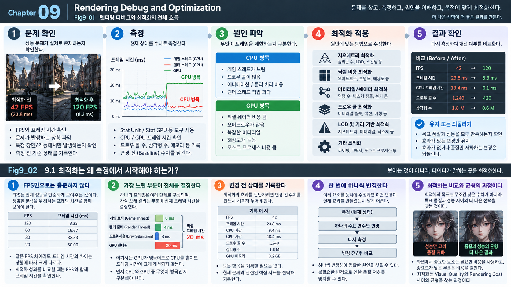
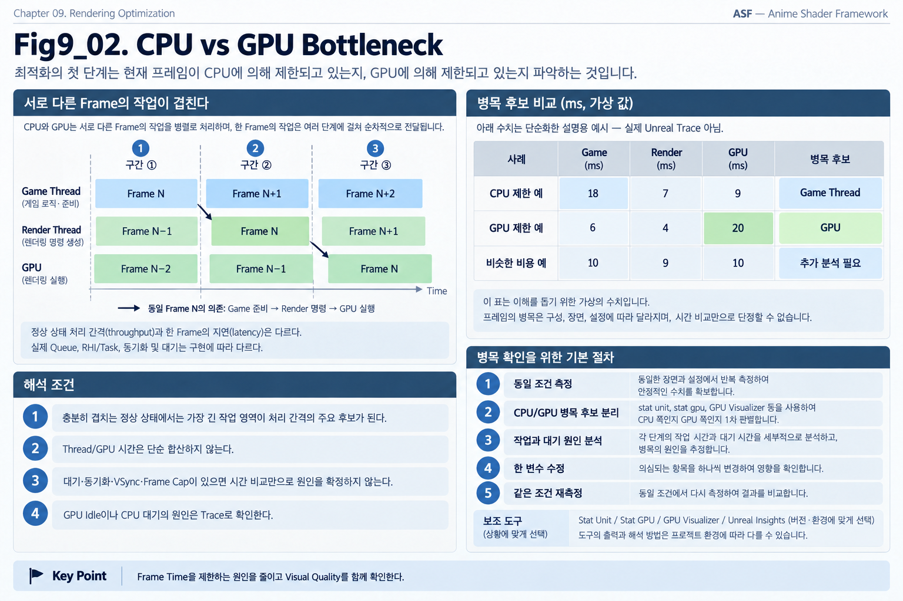
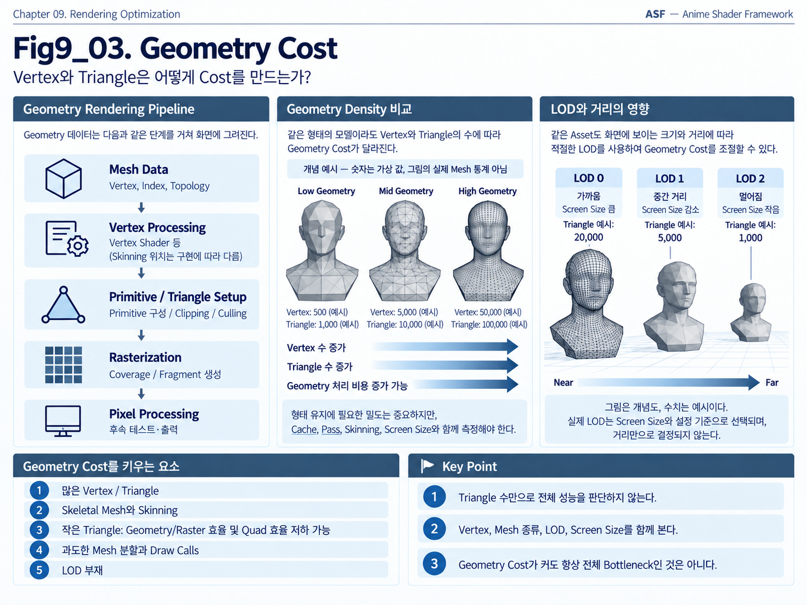
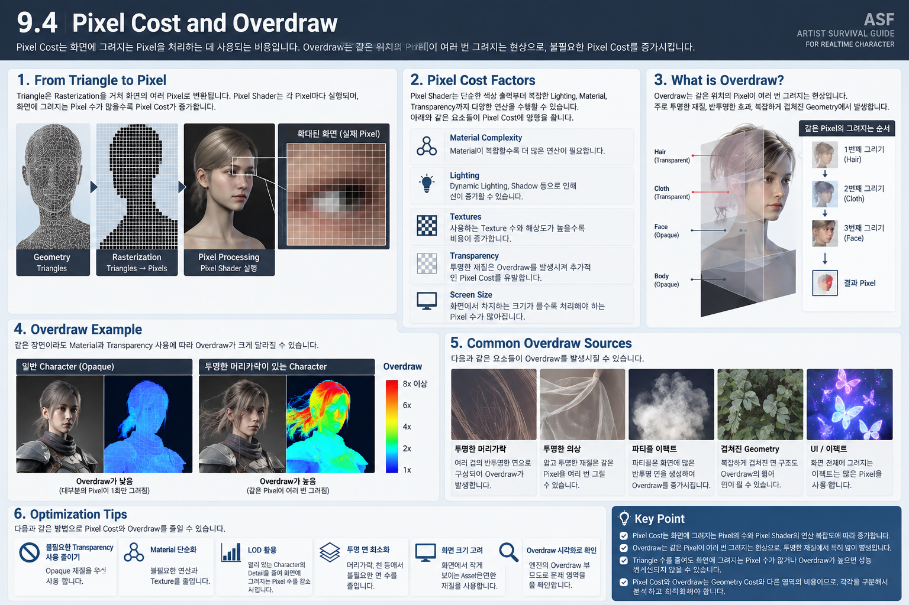
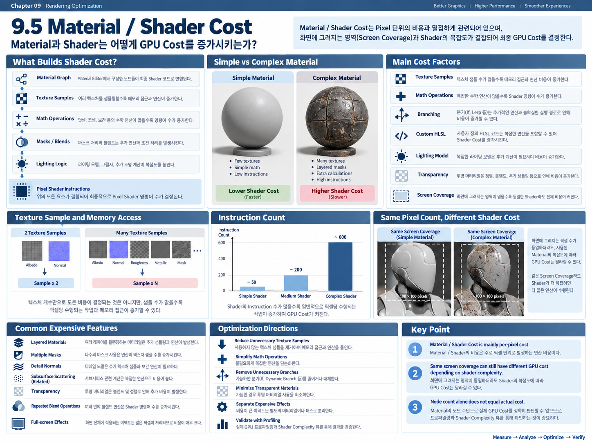
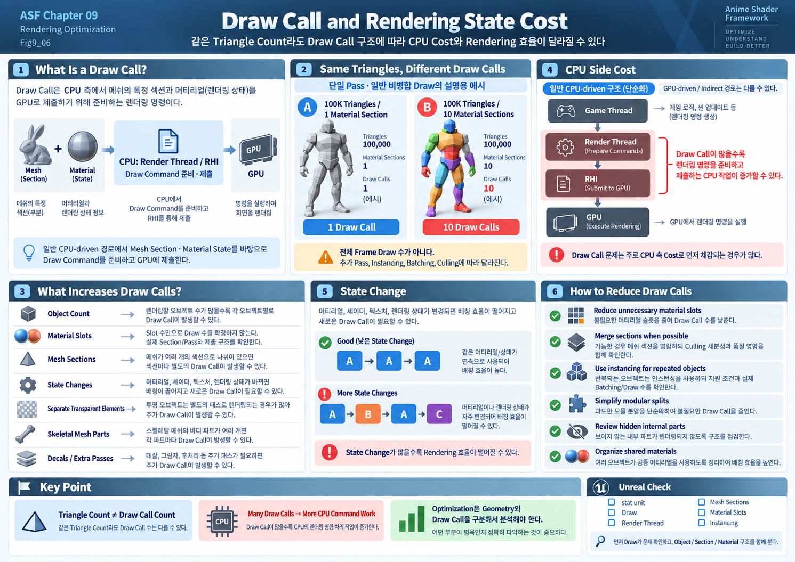
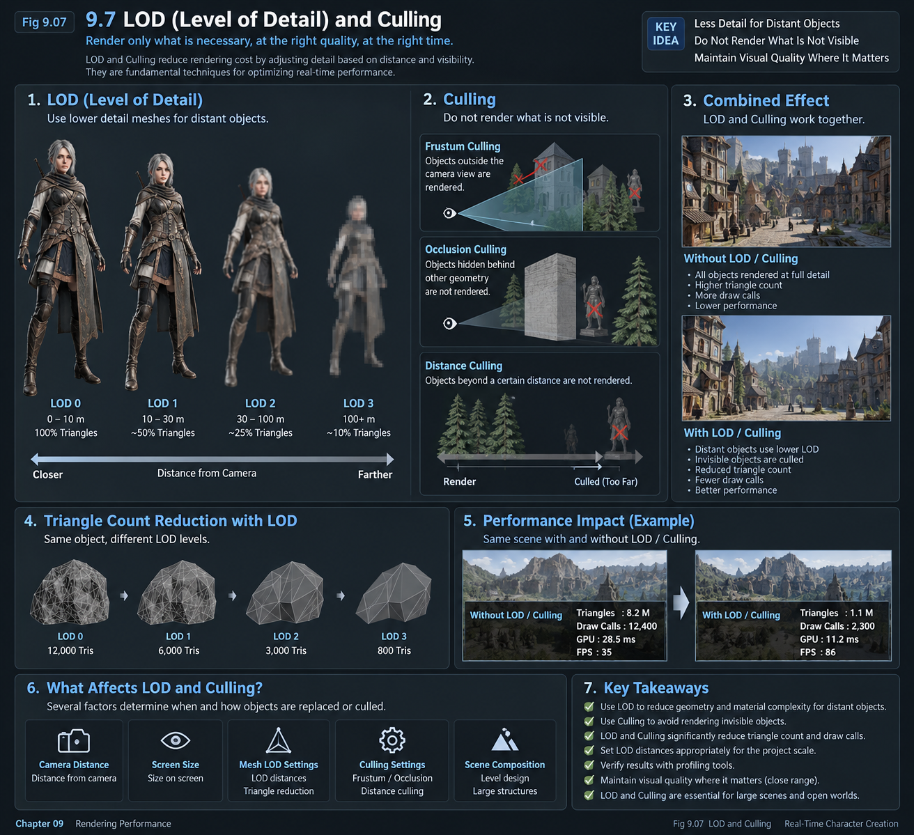
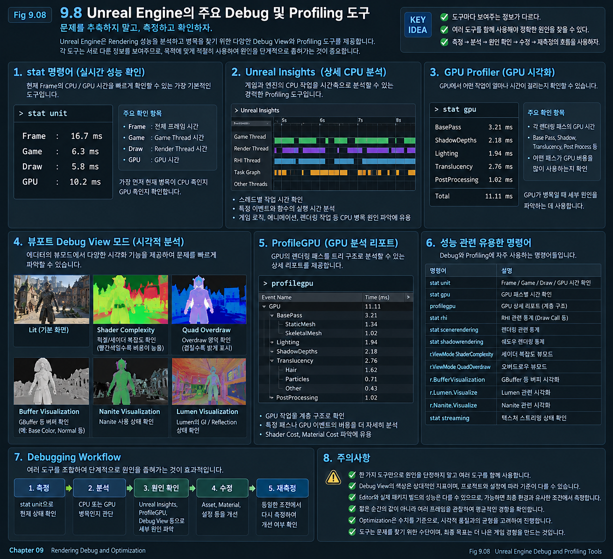
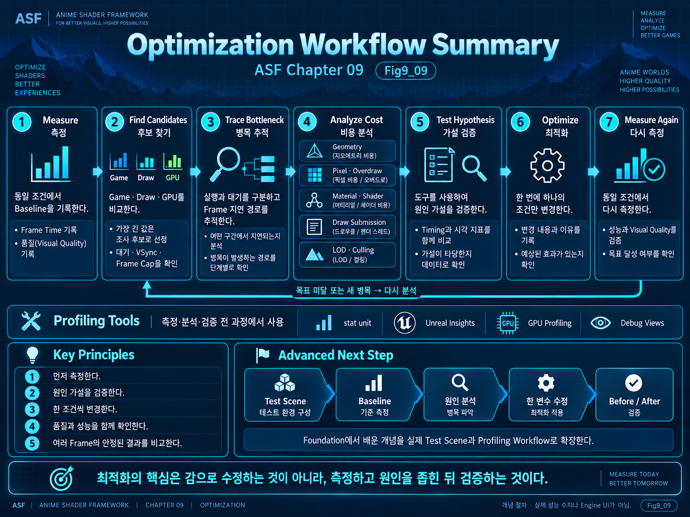

# Chapter 09 — Rendering Debug and Optimization

Rendering Optimization은 단순히 Polygon 수를 줄이거나 Texture Resolution을 낮추는 작업이 아니다.

실제 Rendering Performance는 Geometry, Material, Shader, Transparency, Draw Call, Lighting, Animation, Post Process 등 여러 요소가 동시에 영향을 주면서 결정된다.

따라서 화면이 느리다고 해서 눈에 보이는 복잡한 요소부터 무작정 줄이는 방식으로는 정확한 Optimization이 어렵다.

먼저 필요한 것은,

**현재 Frame Time을 실제로 제한하고 있는 원인이 무엇인지 찾는 것**

이다.

예를 들어 같은 낮은 FPS라도 원인은 전혀 다를 수 있다.

어떤 경우에는 CPU가 많은 Object와 Draw Call을 처리하느라 늦을 수 있고, 다른 경우에는 GPU가 복잡한 Pixel Shader나 Overdraw를 처리하느라 시간이 오래 걸릴 수 있다.

또 Geometry가 매우 많아 보여도 실제 Bottleneck은 Pixel Cost일 수 있고, 반대로 단순한 화면처럼 보여도 Draw Call이나 Shader Cost 때문에 Performance가 떨어질 수 있다.

따라서 Optimization에서는 먼저 문제를 측정하고, Bottleneck을 구분하고, 원인을 좁힌 뒤 필요한 부분만 수정해야 한다.

이번 Chapter에서는 다음과 같은 흐름을 중심으로 Rendering Debug와 Optimization의 기본 구조를 살펴본다.

`Measure`

→ `Identify Bottleneck`

→ `Isolate Cause`

→ `Optimize`

→ `Measure Again`

이 과정의 목적은 단순히 FPS 숫자를 높이는 것이 아니다.

**현재 Rendering Cost가 어디에서 발생하는지를 이해하고, Visual Quality와 Performance 사이에서 더 효율적인 선택을 하는 것**이 Optimization의 핵심이다.



*Figure 9-01. 측정→병목 후보 분리→원인 분석→한 변수 수정→재측정의 기존 합성 도식. 42→120 FPS 등의 수치는 측정 출처가 없는 예시이며 ASF 실측 성과가 아니다. 그래프 후반은 GPU 약 21 ms가 CPU 표시값보다 길므로 CPU 병목 Label은 해당 수치와 맞지 않는다. Thread/GPU 시간은 겹칠 수 있어 단순 합산하지 않으며 실제 병목은 동기화·대기·VSync/Frame Cap을 함께 확인한다. 이미지 내부 하단의 Fig9_02 표기도 이 Figure의 일부를 뜻하는 잘못된 번호다. 장면/Character 이미지 출처 확인 전에는 원본을 보존하며, Before/After 품질 비교의 실증 자료로 사용하지 않는다.*

---

## 9.1 Why Optimization Starts with Measurement

Rendering Optimization에서 가장 중요한 것은 무조건 Cost를 줄이는 것이 아닙니다.

먼저 확인해야 하는 것은 다음과 같습니다.

> **현재 Frame에서 실제로 무엇이 Performance를 제한하고 있는가?**

Rendering Pipeline은 하나의 작업으로 구성되어 있지 않습니다.

CPU에서는 Game Logic, Animation, Physics, Scene Management, Rendering Command 준비 등이 수행되고, GPU에서는 Geometry Processing, Rasterization, Pixel Processing, Material, Lighting, Shadow, Transparency, Post Process 등의 작업이 수행됩니다.

이 중 어떤 작업은 매우 빠르게 끝날 수 있고, 어떤 작업은 전체 Frame에서 가장 많은 시간을 차지할 수 있습니다.

Optimization의 목적은 모든 작업을 동일하게 줄이는 것이 아니라, **현재 Frame Time을 실제로 제한하고 있는 부분을 찾아 개선하는 것**입니다.

---

### Optimization Is Not Guessing

성능 문제가 발생했을 때 가장 흔한 접근은 눈에 띄는 요소부터 줄이는 것입니다.

예를 들어 다음과 같은 판단을 할 수 있습니다.

```text
Triangle이 많아 보인다
→ Polygon을 줄인다

Material이 복잡해 보인다
→ Node를 줄인다

Texture가 크다
→ Resolution을 낮춘다

Actor가 많다
→ Object를 제거한다
```

이러한 변경들이 Performance를 개선할 가능성은 있습니다.

하지만 실제 Bottleneck을 확인하지 않은 상태에서는 어느 변경이 효과가 있을지 알 수 없습니다.

예를 들어 GPU의 Pixel Cost가 Bottleneck인 Scene에서 Polygon을 절반으로 줄였다고 가정해 보겠습니다.

Geometry Cost는 감소했지만 Pixel Cost가 여전히 전체 Frame Time을 제한한다면 최종 Frame Rate는 거의 달라지지 않을 수 있습니다.

반대로 CPU의 Game Thread가 Bottleneck인 상황에서 Shader Instruction을 줄이더라도 CPU가 계속 Frame을 제한한다면 전체 Performance에는 큰 변화가 없을 수 있습니다.

즉,

> **Cost가 존재한다는 사실과 그 Cost가 Bottleneck이라는 것은 서로 다른 문제입니다.**

Optimization에서는 이 둘을 구분해야 합니다.

---

### Frame Rate Is the Result

Realtime Rendering Performance를 이야기할 때 가장 익숙한 숫자는 `FPS`입니다.

```text
FPS = Frames Per Second
```

예를 들어,

```text
60 FPS
30 FPS
20 FPS
```

처럼 한 초 동안 몇 개의 Frame을 처리할 수 있는지를 나타냅니다.

FPS는 Performance 결과를 이해하기에는 편리하지만, 내부 Cost를 분석하기에는 적합하지 않습니다.

Optimization에서는 일반적으로 **Frame Time**을 함께 확인하는 것이 중요합니다.

Frame Time은 한 Frame을 처리하는 데 필요한 시간을 의미하며 보통 `ms` 단위로 표현합니다.

```text
Frame Time = 1000 / FPS
```

예를 들어,

```text
60 FPS ≈ 16.67 ms
30 FPS ≈ 33.33 ms
20 FPS = 50 ms
```

입니다.

즉, 60 FPS를 목표로 한다면 하나의 Frame을 약 `16.67 ms` 안에 처리해야 합니다.

---

### Why Frame Time Is More Useful

FPS는 변화가 비선형적으로 보입니다.

예를 들어,

```text
60 FPS → 50 FPS
```

와

```text
30 FPS → 20 FPS
```

는 모두 10 FPS 차이입니다.

하지만 Frame Time으로 보면 차이는 크게 다릅니다.

```text
60 FPS ≈ 16.67 ms
50 FPS = 20 ms

Difference ≈ 3.33 ms
```

반면,

```text
30 FPS ≈ 33.33 ms
20 FPS = 50 ms

Difference ≈ 16.67 ms
```

입니다.

FPS 숫자만 보면 두 경우 모두 10 FPS 차이이지만 실제 Rendering Cost 변화는 완전히 다릅니다.

따라서 Profiling과 Optimization에서는

```text
몇 FPS가 나오는가?
```

보다

```text
한 Frame에 몇 ms가 걸리는가?
```

를 기준으로 문제를 보는 것이 훨씬 유용합니다.

---

### Build a Baseline First

이 Chapter의 Timing 숫자는 원리를 설명하기 위한 가상 예시이며 ASF Project의 실측 결과가 아닙니다. 실제 개선 여부는 아래 조건을 고정한 반복 측정으로 기록합니다.

Optimization을 시작하기 전에는 반드시 **Baseline**을 만들어야 합니다.

Baseline은 변경하기 이전의 Performance 상태를 의미합니다.

예를 들어 다음과 같이 기록할 수 있습니다.

```text
Resolution : 2560 × 1440
Characters : 10
Camera      : Fixed
Frame       : 14.8 ms
Game        : 7.2 ms
Draw        : 8.4 ms
GPU         : 13.9 ms
```

그 후 특정 Material을 수정하고 다시 측정합니다.

```text
Before

GPU : 13.9 ms


After

GPU : 11.6 ms
```

이 경우 약 `2.3 ms`의 GPU Cost가 줄었다는 것을 확인할 수 있습니다.

이처럼 Optimization은

```text
변경
```

자체보다

```text
변경 전
      ↓
변경
      ↓
변경 후
      ↓
비교
```

가 중요합니다.

측정하지 않으면 실제 Performance가 개선되었는지 판단할 수 없습니다.

---

### Measurement Conditions Must Be Consistent

Performance를 비교할 때는 가능한 한 동일한 조건에서 측정해야 합니다.

Engine Version, Build Configuration, Editor/Standalone/Packaged 실행 방식, Hardware, RHI, Scene, Camera를 기록합니다. Output Resolution뿐 아니라 Internal Rendering Resolution, Screen Percentage, Dynamic Resolution, Scalability, Anti-Aliasing, Light/Shadow 설정을 고정합니다. VSync와 Frame Cap의 상태도 기록하여 대기 시간을 실제 처리 비용으로 오해하지 않도록 합니다.

Shader Compilation과 Asset Streaming 등 초기 준비가 끝난 뒤 같은 길이의 구간을 여러 번 측정합니다. 평균과 함께 Frame Time 분포와 큰 지연 구간을 확인하고, 최초 실행 비용은 정상 상태의 비용과 분리합니다. 한 번에 하나의 조건만 변경합니다. 화면 품질 비교에서는 Chapter 06과 08에서 사용한 Fixed Exposure 조건도 유지합니다.

예를 들어 다음 조건이 달라지면 결과도 달라질 수 있습니다.

```text
Camera Position
Screen Resolution
Character Count
Lighting
Shadow
Animation
Post Process
View Distance
Scene Complexity
```

특히 Camera 위치는 매우 중요합니다.

Character가 화면 전체를 크게 차지하는 경우와 멀리 있는 경우에는 처리해야 하는 Pixel 수와 Detail Level이 달라질 수 있습니다.

따라서 테스트를 반복할 때는 가능하면

```text
Same Scene
Same Camera
Same Resolution
Same Rendering Settings
Same Character Count
```

를 유지해야 합니다.

그래야 변경 전후의 Performance 차이가 실제 Optimization 결과인지 판단할 수 있습니다.

---

### Average Cost Matters More Than a Single Frame

Realtime Rendering에서는 Frame Time이 항상 일정하지 않습니다.

예를 들어 다음과 같이 변화할 수 있습니다.

```text
Frame 1 : 12.1 ms
Frame 2 : 12.4 ms
Frame 3 : 18.7 ms
Frame 4 : 12.3 ms
Frame 5 : 12.2 ms
```

한 Frame만 보면 18.7 ms라는 큰 값이 나타났지만 대부분의 Frame은 약 12 ms 수준입니다.

반대로 평균 값은 괜찮아 보여도 일정 간격으로 큰 Spike가 발생할 수도 있습니다.

```text
12 ms
12 ms
12 ms
32 ms
12 ms
12 ms
```

이런 Spike는 실제 Gameplay에서 끊김이나 Stutter로 느껴질 수 있습니다.

따라서 Performance Analysis에서는 단순히 순간적인 FPS 하나만 보는 것이 아니라

```text
Average Frame Time
Frame Time Variation
Spike
Worst Frame
```

등을 함께 확인해야 합니다.

---

### A Small Cost Is Not Always Worth Optimizing

Profiling을 하다 보면 매우 많은 Cost가 발견됩니다.

예를 들어 다음과 같은 값이 있다고 가정해 보겠습니다.

```text
Material A : 0.12 ms
Material B : 0.18 ms
Shadow     : 3.7 ms
PostProcess: 2.9 ms
```

Material A를 복잡하게 수정하여 0.12 ms를 0.08 ms로 줄였다고 해도 전체 Frame에서 얻는 이득은 `0.04 ms`입니다.

반면 Shadow Cost에서 1 ms를 줄이는 것은 훨씬 큰 영향을 줄 수 있습니다.

따라서 Optimization에서는

> **가장 복잡해 보이는 부분이 아니라, 가장 많은 시간을 사용하는 부분을 우선 확인해야 합니다.**

이것이 Profiling이 필요한 가장 중요한 이유 중 하나입니다.

---

### Optimization Is a Loop

Rendering Optimization은 한 번 수정하고 끝나는 과정이 아닙니다.

기본적인 Workflow는 다음과 같습니다.

```text
Measure
   ↓
Identify Bottleneck
   ↓
Isolate Cause
   ↓
Optimize
   ↓
Measure Again
```

먼저 현재 Performance를 측정합니다.

그 다음 CPU, GPU, Geometry, Material, Pixel, Shadow 등의 영역 중 어디가 많은 시간을 사용하는지 확인합니다.

범위를 좁힌 뒤 실제 원인을 찾고 변경을 적용합니다.

그리고 반드시 다시 측정합니다.

```text
Before
   ↓
Change
   ↓
After
```

이 과정을 반복하면서 Frame을 제한하는 Cost를 하나씩 줄여 나가는 것이 Rendering Optimization의 기본 구조입니다.

---

### Optimize the Bottleneck, Not Everything

모든 Rendering Cost를 최소화하는 것은 현실적인 목표가 아닙니다.

High Quality Character Rendering에서는 높은 Polygon 수가 필요할 수도 있고, 복잡한 Material이나 Shadow가 필요할 수도 있습니다.

중요한 것은 해당 Cost가 존재한다는 사실 자체가 아닙니다.

예를 들어 Character의 Hair Shader가 복잡하더라도 전체 GPU Frame에서 차지하는 시간이 매우 작다면 당장 Optimization Priority가 아닐 수 있습니다.

반대로 단순해 보이는 Transparency가 전체 화면을 여러 번 덮으며 큰 Overdraw를 발생시키고 있다면 중요한 Bottleneck이 될 수 있습니다.

따라서 Optimization에서는 항상 다음 질문을 먼저 해야 합니다.

> **현재 Frame에서 가장 많은 시간을 사용하고 있는 것은 무엇인가?**

---

### Key Point

Optimization은 무조건 Polygon, Texture, Material을 줄이는 작업이 아닙니다.

먼저 현재 Frame의 Performance 상태를 측정하고, 실제 Bottleneck을 찾아야 합니다.

```text
Measure
   ↓
Find Bottleneck
   ↓
Optimize
   ↓
Verify
```

FPS는 최종 결과를 보여주지만 Bottleneck의 원인을 직접 설명해주지는 않습니다.

따라서 이후의 Debugging에서는 Frame Time과 각 Processing Stage의 Timing을 중심으로 Performance를 분석합니다.

다음 절에서는 가장 먼저 **CPU와 GPU 중 어느 쪽이 현재 Frame을 제한하고 있는지** 확인하는 방법을 살펴봅니다.

---

## 9.2 CPU vs GPU Bottleneck

Rendering Optimization의 첫 번째 분기점은 **현재 Frame을 CPU와 GPU 중 어느 쪽이 제한하고 있는지 확인하는 것**입니다.

화면이 느리다고 해서 항상 GPU가 원인인 것은 아닙니다.

많은 Actor와 Animation을 CPU에서 처리하느라 Frame이 늦어질 수도 있고, 높은 Resolution이나 복잡한 Material 때문에 GPU Rendering 시간이 길어질 수도 있습니다.

따라서 Optimization의 첫 번째 질문은 다음과 같습니다.

> **현재 Frame은 CPU에 의해 제한되고 있는가, GPU에 의해 제한되고 있는가?**

이 구분 없이 Optimization을 시작하면 실제 Bottleneck과 관계없는 부분을 수정할 수 있습니다.

예를 들어 CPU가 Frame을 제한하고 있는 상황에서 Material Instruction을 줄여 GPU Cost를 낮춰도 최종 Frame Time은 거의 변하지 않을 수 있습니다.

반대로 GPU가 Bottleneck인 상황에서 Game Logic을 조금 줄이더라도 GPU Rendering 시간이 그대로라면 Frame Rate는 크게 개선되지 않습니다.

---

### What Is a Thread?

CPU에서는 여러 종류의 작업이 동시에 진행됩니다.

Game Engine 역시 모든 작업을 하나의 실행 흐름에서 처리하지 않고 역할에 따라 여러 실행 흐름으로 나누어 처리합니다.

이러한 독립적인 실행 흐름을 **Thread**라고 합니다.

Unreal Engine의 Rendering Performance를 이해할 때 가장 기본적으로 구분해야 하는 CPU Thread는 다음 두 가지입니다.

```text
Game Thread
Render Thread
```

그리고 이 CPU 작업의 결과가 최종적으로 GPU에 전달됩니다.

개념적으로는 다음과 같이 이해할 수 있습니다.

```text
Game Thread
     │
     │ Game / Scene State
     ▼
Render Thread
     │
     │ Rendering Commands
     ▼
GPU
```

따라서 CPU Bottleneck이라고 하더라도 실제 원인은 하나가 아닐 수 있습니다.

```text
CPU Bottleneck
     │
     ├─ Game Thread
     └─ Render Thread
```

이 구분은 이후 Unreal Profiling에서 매우 중요합니다.

---

### Game Thread

`Game Thread`는 현재 Game World의 상태를 갱신하는 중심적인 CPU Thread입니다.

쉽게 말하면,

> **현재 Frame에서 게임 세계에 어떤 일이 일어나고 있는지를 계산하는 Thread**

라고 볼 수 있습니다.

대표적으로 다음과 같은 작업이 관련됩니다.

```text
Game Logic
Actor / Component Update
Blueprint
Animation Update
AI
Physics 관련 처리
Gameplay System
```

예를 들어 Character가 움직이는 상황을 생각해 보겠습니다.

```text
Input / AI
     ↓
Character 이동
     ↓
Animation State 변경
     ↓
Actor / Component Update
     ↓
Scene State 갱신
```

이러한 계산을 통해 현재 Frame에서 Object가 어디에 있고 어떤 상태인지가 결정됩니다.

Actor 수가 많거나, 많은 Blueprint Tick이 실행되거나, Character Animation과 AI 처리가 복잡해지면 Game Thread Time이 증가할 수 있습니다.

---

### Render Thread

`Render Thread`는 Game Thread에서 만들어진 Scene State를 기반으로 **실제로 Rendering에 필요한 작업을 준비하는 CPU Thread**입니다.

Game Thread가

```text
무엇이 존재하는가
어디에 있는가
어떤 상태인가
```

를 결정한다면,

Render Thread는 그 정보를 바탕으로

```text
무엇을 그릴 것인가
어떤 Rendering Pass에 포함할 것인가
어떤 Rendering Command를 준비할 것인가
```

를 처리합니다.

개념적으로 보면 다음과 같습니다.

```text
Game Thread

Character 위치
Material 상태
Light 상태
Scene 상태
      │
      ▼

Render Thread

Visible Object 처리
Draw 관련 작업 준비
Rendering Command 구성
      │
      ▼

GPU

실제 Rendering 수행
```

따라서 Object 수와 Draw Call이 많아지면 GPU뿐 아니라 Render Thread 쪽 CPU Cost도 함께 증가할 수 있습니다.

이 때문에 단순히

```text
Object가 많다
→ GPU가 느릴 것이다
```

라고 판단해서는 안 됩니다.

같은 Scene Complexity가 CPU와 GPU 양쪽에 서로 다른 형태의 Cost를 발생시킬 수 있습니다.

---

### Game Thread, Render Thread, and GPU Work as a Pipeline

Game Thread, Render Thread, GPU는 하나의 Frame을 처음부터 끝까지 완전히 순차적으로 처리하지 않습니다.

각 영역은 서로 다른 Frame의 작업을 Pipeline 형태로 겹쳐서 처리할 수 있습니다.

구조를 단순화하면 다음과 같습니다.

```text
Game Thread

Frame N+1     Update Game State
Frame N+2          Update Game State


Render Thread

Frame N        Prepare Rendering
Frame N+1           Prepare Rendering


GPU

Frame N-1      Render
Frame N             Render
```

즉, 같은 순간에

```text
Game Thread   → 다음 Frame의 Game State 계산
Render Thread → Rendering 작업 준비
GPU           → 이전에 전달받은 Frame Rendering
```

이 동시에 진행될 수 있습니다.

따라서 Frame Time을 다음처럼 단순히 더해서 생각하면 안 됩니다.

```text
Game Time
+ Render Time
+ GPU Time
```

각 영역이 병렬적으로 처리되기 때문에 대기와 동기화가 없는 단순한 정상 상태에서는 **가장 오래 걸리는 Processing 영역이 Frame 처리 속도를 제한**할 수 있습니다.

실제 Timing에는 RHI 작업, Queue, Thread 간 의존성, GPU 대기, VSync 또는 Frame Cap 대기가 포함될 수 있습니다. 따라서 가장 큰 `stat unit` 숫자는 첫 조사 대상이며 원인 확정이 아닙니다. Unreal Insights의 Timeline에서 실제 실행과 대기, Frame 진행을 지연시키는 의존 경로를 구분합니다. 아래의 CPU/GPU 예시는 대기보다 실제 처리 시간이 우세한 경우를 가정합니다.

예를 들어,

```text
Game : 8 ms
Draw : 7 ms
GPU  : 15 ms
```

라면 전체 Frame은 GPU가 끝나기를 기다려야 합니다.

반대로,

```text
Game : 16 ms
Draw : 9 ms
GPU  : 10 ms
```

라면 Game Thread가 가장 늦기 때문에 CPU가 전체 Frame을 제한합니다.

실제 Engine 내부에서는 추가적인 Thread, Queue, Synchronization, RHI 처리 등이 존재하기 때문에 구조는 더 복잡하지만, Bottleneck을 이해하기 위한 기본 원리는 같습니다.

> **전체 Pipeline에서 가장 오래 걸리는 Processing 영역이 Frame의 진행 속도를 제한합니다.**

---

<p align="center">

</p>

---

### CPU Bottleneck

CPU Bottleneck은 CPU에서 수행되는 작업이 GPU Rendering보다 오래 걸려 전체 Frame Time을 제한하는 상태입니다.

예를 들어 다음과 같은 상태를 생각할 수 있습니다.

```text
Game : 16 ms
Draw : 9 ms
GPU  : 10 ms
```

가장 긴 시간이 Game Thread이므로 GPU가 더 빠르게 Rendering할 수 있더라도 전체 Frame은 약 16 ms보다 빨리 진행되기 어렵습니다.

CPU Bottleneck은 크게 다음 두 방향으로 나누어 볼 수 있습니다.

```text
CPU Bottleneck
     │
     ├─ Game Thread Bottleneck
     │
     └─ Render Thread Bottleneck
```

Game Thread Bottleneck의 대표적인 원인은 다음과 같습니다.

```text
Game Logic
Blueprint Tick
Actor / Component Update
AI
Animation
Physics
Gameplay System
```

반면 Render Thread 쪽 CPU Cost에는 다음과 같은 요소가 영향을 줄 수 있습니다.

```text
Object Count
Visibility Processing
Draw Call Preparation
Rendering Command Preparation
Scene Rendering Data
```

따라서 CPU Bottleneck을 확인한 이후에도

> **CPU의 어느 Thread가 Bottleneck인가?**

라는 다음 질문이 필요합니다.

---

### GPU Bottleneck

GPU Bottleneck은 GPU Rendering 시간이 CPU 작업보다 길어 전체 Frame Time을 제한하는 상태입니다.

예를 들어,

```text
Game : 7 ms
Draw : 8 ms
GPU  : 17 ms
```

라고 가정해 보겠습니다.

CPU에서는 다음 Rendering 작업을 준비할 수 있지만 GPU가 이전 작업을 완료하는 데 약 17 ms가 필요합니다.

이 상황에서 Game Thread를 7 ms에서 5 ms로 줄이더라도 GPU가 계속 17 ms를 사용한다면 전체 Frame Time은 거의 변하지 않습니다.

GPU Bottleneck에서는 GPU 내부의 어떤 Rendering Cost가 많은 시간을 사용하고 있는지 확인해야 합니다.

대표적인 GPU Cost는 다음과 같습니다.

```text
Geometry Processing
Vertex Processing
Rasterization
Pixel Processing
Material / Shader
Texture Sampling
Transparency
Overdraw
Lighting
Shadow
Reflection
Post Process
```

특히 Character Rendering에서는 하나의 Character 안에서도 여러 Cost가 동시에 발생할 수 있습니다.

```text
Skin Material
Hair Material
Eye Material
Outfit
Transparency
Shadow
Post Process
```

따라서 Character의 Polygon 수 하나만 보고 GPU Performance를 판단하는 것은 적절하지 않습니다.

---

### Bottleneck Depends on the Scene

Bottleneck은 Asset 자체에 고정된 속성이 아닙니다.

같은 Character라도 Scene과 Rendering 조건에 따라 Bottleneck이 달라질 수 있습니다.

예를 들어 다음과 같은 Scene을 생각해 보겠습니다.

```text
Scene A

Characters : 100
Resolution : 1920 × 1080
```

많은 Character가 존재하면 다음 CPU Cost가 크게 증가할 수 있습니다.

```text
Actor Update
Animation
Skeletal Mesh Processing
Draw Call Preparation
```

따라서 CPU Bottleneck이 발생할 가능성이 있습니다.

반면 다음과 같은 상황도 있습니다.

```text
Scene B

Characters : 1
Resolution : 3840 × 2160
Complex Material
Hair Transparency
Post Process
```

Character 수는 하나뿐이지만 처리해야 하는 Pixel 수와 Shader Cost가 커지기 때문에 GPU Bottleneck이 발생할 수 있습니다.

따라서 다음과 같이 고정적으로 판단해서는 안 됩니다.

```text
이 Character는 CPU가 무겁다.

이 Shader는 항상 GPU Bottleneck이다.
```

Bottleneck은 **현재 실행 환경에서 각 Processing Cost가 서로 어떤 관계를 이루고 있는가**에 의해 결정됩니다.

---

### Balanced Frame

CPU와 GPU의 Processing Time이 비슷한 경우도 있습니다.

예를 들어,

```text
Game : 10 ms
Draw : 9 ms
GPU  : 11 ms
```

처럼 모든 값이 비슷할 수 있습니다.

이 경우 특정 Processor 하나만 명확한 Bottleneck이라고 보기 어렵습니다.

GPU를 조금 최적화하면 CPU가 새로운 Bottleneck이 될 수 있고, CPU를 줄이면 GPU가 Frame을 제한할 수 있습니다.

즉, Bottleneck은 고정되어 있는 것이 아니라 **현재 Cost Balance에 따라 이동할 수 있는 상태**입니다.

---

### Checking the Bottleneck in Unreal Engine

Unreal Engine에서는 기본적인 Frame Timing을 확인하기 위해 `stat unit`을 사용할 수 있습니다.

Console에서 다음 Command를 실행합니다.

```text
stat unit
```

대표적으로 다음 Timing을 확인할 수 있습니다.

```text
Frame
Game
Draw
GPU
```

기본적인 의미는 다음과 같습니다.

| 항목 | 의미 |
|---|---|
| `Frame` | 전체 Frame 진행 시간 |
| `Game` | Game Thread CPU Time |
| `Draw` | Rendering 관련 CPU Thread Time |
| `GPU` | GPU Rendering Time |

예를 들어,

```text
Frame : 16.8 ms
Game  : 15.9 ms
Draw  : 8.2 ms
GPU   : 9.4 ms
```

라면 Game Thread가 가장 긴 시간을 사용하고 있기 때문에 Game Thread 쪽 CPU Bottleneck을 우선 확인할 수 있습니다.

반대로,

```text
Frame : 18.1 ms
Game  : 7.4 ms
Draw  : 8.0 ms
GPU   : 17.5 ms
```

라면 GPU가 Frame을 제한하고 있을 가능성이 높습니다.

또 다음과 같을 수도 있습니다.

```text
Frame : 14.5 ms
Game  : 8.1 ms
Draw  : 13.9 ms
GPU   : 9.0 ms
```

이 경우 Rendering 관련 CPU 작업이 상대적으로 큰 상태이므로 Render Thread 영역을 더 자세히 분석해야 합니다.

중요한 점은 `stat unit`이 최종 원인을 알려주는 도구는 아니라는 것입니다.

`stat unit`의 역할은 먼저

```text
Game Thread?
Render Thread?
GPU?
```

중 어느 영역을 더 자세히 분석해야 하는지 범위를 좁히는 것입니다.

즉, **첫 번째 Diagnostic Step**입니다.

---

### Do Not Diagnose from FPS Alone

다음 두 Scene이 모두 약 50 FPS로 동작한다고 가정해 보겠습니다.

```text
Scene A

Game : 19 ms
GPU  : 10 ms
```

```text
Scene B

Game : 8 ms
GPU  : 19 ms
```

두 Scene은 결과적으로 비슷한 FPS를 보여줄 수 있습니다.

하지만 내부 Bottleneck은 완전히 다릅니다.

```text
Scene A
→ CPU Bottleneck
```

```text
Scene B
→ GPU Bottleneck
```

Scene A에서는 CPU Cost를 분석해야 하고, Scene B에서는 GPU Rendering Cost를 분석해야 합니다.

따라서

> **FPS는 Performance의 결과를 보여주지만, 그 원인을 보여주지는 않습니다.**

이 때문에 Rendering Optimization에서는 FPS뿐 아니라 각 Processing 영역의 `ms` 값을 함께 확인해야 합니다.

---

### Resolution Test

GPU Bottleneck을 빠르게 확인할 때 사용할 수 있는 Diagnostic 방법 중 하나가 **Resolution Test**입니다.

Rendering Resolution을 낮추면 화면에 처리해야 하는 Pixel 수가 감소합니다.

예를 들어,

```text
3840 × 2160
        ↓
1920 × 1080
```

으로 Resolution을 낮추면 Pixel과 관련된 GPU Cost가 크게 감소할 수 있습니다.

만약 Resolution을 낮춘 뒤 GPU Time과 전체 Frame Time이 크게 감소한다면 다음과 같은 Screen-space Cost가 영향을 주고 있을 가능성이 있습니다.

```text
Pixel Processing
Material
Lighting
Transparency
Overdraw
Post Process
```

반대로 Resolution을 크게 줄였는데도 Frame Time이 거의 변하지 않는다면 CPU Bottleneck이거나 Resolution 변화에 큰 영향을 받지 않는 다른 Cost가 Frame을 제한하고 있을 가능성을 확인해야 합니다.

다만 Resolution Test만으로 특정 Rendering Stage가 원인이라고 확정할 수는 없습니다.

Resolution Test의 목적은

```text
GPU 쪽 문제인가?
      ↓
Pixel 관련 Cost가 영향을 주는가?
```

처럼 **문제의 범위를 빠르게 좁히는 것**입니다.

---

### Bottleneck Can Move

Optimization을 진행하면 기존 Bottleneck이 줄어들면서 다른 영역이 새로운 Bottleneck이 될 수 있습니다.

예를 들어 초기 상태가 다음과 같다고 가정해 보겠습니다.

```text
Game : 9 ms
GPU  : 18 ms

→ GPU Bottleneck
```

GPU Optimization을 진행합니다.

```text
Game : 9 ms
GPU  : 11 ms

→ GPU Bottleneck
```

GPU Cost를 더 줄입니다.

```text
Game : 9 ms
GPU  : 7 ms

→ CPU Bottleneck
```

처음에는 GPU가 Frame을 제한했지만, GPU Cost를 충분히 낮춘 이후에는 Game Thread가 새로운 제한 요소가 되었습니다.

즉, Optimization은 Bottleneck을 완전히 없애는 과정이라기보다 **가장 큰 Bottleneck을 줄이면서 Cost Balance를 변화시키는 과정**에 가깝습니다.

이 때문에 Optimization 이후에는 반드시 다시 측정해야 합니다.

```text
Measure
   ↓
Identify Bottleneck
   ↓
Optimize
   ↓
Measure Again
   ↓
Identify New Bottleneck
```

---

### Basic Bottleneck Diagnosis Workflow

CPU와 GPU Bottleneck을 분석하는 기본 Workflow는 다음과 같이 정리할 수 있습니다.

```text
1. Frame Time 측정
        ↓
2. Game / Draw / GPU 비교
        ↓
3. 가장 긴 Processing 영역 확인
        ↓
4. 해당 영역 상세 Profiling
        ↓
5. 실제 원인 확인
        ↓
6. Optimize
        ↓
7. 동일 조건에서 다시 측정
```

CPU Bottleneck이라면 다음 방향으로 범위를 좁힙니다.

```text
CPU Bottleneck
     │
     ├─ Game Thread
     │    ├─ Game Logic
     │    ├─ Animation
     │    ├─ Physics
     │    └─ Actor Update
     │
     └─ Render Thread
          ├─ Object Count
          ├─ Visibility
          ├─ Draw Calls
          └─ Rendering Commands
```

GPU Bottleneck이라면 다음과 같이 분석을 이어갑니다.

```text
GPU Bottleneck
     │
     ├─ Geometry
     ├─ Pixel Cost
     ├─ Material / Shader
     ├─ Transparency / Overdraw
     ├─ Lighting / Shadow
     └─ Post Process
```

즉, `CPU vs GPU` 판별은 Optimization의 최종 분석이 아닙니다.

전체 Performance 문제를 더 작은 영역으로 나누기 위한 **첫 번째 Branch**입니다.

---

### Key Point

Unreal Engine의 Frame은 단순히 CPU 작업이 끝난 뒤 GPU 작업이 시작되는 구조가 아닙니다.

`Game Thread`, `Render Thread`, `GPU`가 서로 다른 Frame의 작업을 Pipeline 형태로 처리합니다.

```text
Game Thread
      ↓
Render Thread
      ↓
GPU
```

그리고 전체 Frame의 진행 속도는 이 Pipeline에서 가장 오래 걸리는 영역에 의해 제한됩니다.

따라서 Bottleneck Analysis에서는 먼저 다음 세 영역을 비교해야 합니다.

```text
Game Thread
Render Thread
GPU
```

그 다음 실제 Bottleneck에 따라 더 세부적인 원인을 찾아갑니다.

```text
Measure
   ↓
Game / Draw / GPU
   ↓
Find Bottleneck
   ↓
Detailed Profiling
   ↓
Find Actual Cost
   ↓
Optimize
   ↓
Measure Again
```

> **Optimization의 첫 번째 질문은 “무엇을 줄일까?”가 아니라 “현재 Frame의 진행을 무엇이 제한하고 있는가?”입니다.**

다음 절에서는 GPU Rendering Cost를 구성하는 가장 기본적인 요소 중 하나인 **Geometry Cost**를 살펴보고, Vertex와 Triangle이 실제 Rendering Performance에 어떤 영향을 주는지 확인합니다.

---

## 9.3 Geometry Cost

GPU Bottleneck을 확인했다면 다음 단계는 **GPU 내부에서 어떤 Rendering Cost가 많은 시간을 사용하고 있는지** 범위를 좁히는 것입니다.

그중 가장 기본적인 Cost 중 하나가 **Geometry Cost**입니다.

Geometry Cost는 Mesh를 구성하는 Vertex와 Triangle을 GPU가 처리하는 과정에서 발생합니다.

Character Modeling에서는 흔히

```text
Polygon이 많다
→ 무겁다
```

라고 이야기합니다.

이 표현은 단순하지만 기본 방향은 맞습니다.

특히 **Geometry Cost를 판단할 때 Triangle Count는 가장 기본적이고 중요한 지표 중 하나입니다.**

일반적으로 동일한 Rendering 조건이라면 Triangle 수가 증가할수록 GPU가 처리해야 하는 Primitive가 증가하고, 그에 따라 Geometry Processing Cost도 증가합니다.

예를 들어,

```text
10,000 Triangles
        ↓
100,000 Triangles
        ↓
1,000,000 Triangles
```

처럼 Triangle 수가 크게 증가하면 GPU가 처리해야 하는 Geometry 작업 역시 증가합니다.

따라서 Character Asset의 Geometry Complexity를 빠르게 판단할 때 `Triangle Count`는 여전히 가장 실용적이고 대표적인 수치입니다.

다만 실제 GPU Cost가 Triangle Count와 완전히 1:1로 비례하는 것은 아닙니다.

같은 Triangle 수라도

```text
Vertex Count
Vertex Processing
Skinning
Triangle Size
LOD
Screen Size
Mesh Section
```

등의 조건에 따라 실제 Cost는 달라질 수 있습니다.

즉,

> **Triangle Count는 Geometry Cost의 핵심 지표이지만, 실제 Rendering Cost를 정확하게 이해하려면 그 Triangle이 어떤 조건에서 처리되는지도 함께 확인해야 합니다.**

---

### Where Geometry Cost Happens

Mesh가 화면에 Rendering되기 위해서는 Geometry Data가 GPU에서 여러 단계를 거칩니다.

개념적으로 단순화하면 다음과 같습니다.

```text
Mesh Data
   ↓
Vertex Processing
   ↓
Primitive / Triangle Setup
   ↓
Rasterization
   ↓
Pixel Processing
```

Mesh에는 기본적으로 다음과 같은 정보가 포함될 수 있습니다.

```text
Position
Normal
Tangent
UV
Vertex Color
Index
Skin Weight
```

GPU는 먼저 Vertex Data를 처리한 뒤, Vertex들을 Triangle Primitive로 구성합니다.

그 후 Triangle이 화면의 어느 영역을 차지하는지 계산하고 Rasterization을 통해 Pixel Processing 단계로 넘깁니다.

즉, 화면에 Pixel이 생성되기 전에 먼저 **Vertex와 Triangle을 처리하는 Geometry 단계**가 존재합니다.

---

<p align="center">

</p>

---

### Triangle Count and Geometry Work

Realtime Rendering에서 Surface는 기본적으로 Triangle Primitive로 처리됩니다.

따라서 Triangle 수가 증가한다는 것은 GPU가 처리해야 하는 Primitive 수가 증가한다는 의미입니다.

예를 들어 다음 두 Mesh가 있다고 가정해 보겠습니다.

```text
Mesh A
10,000 Triangles
```

```text
Mesh B
100,000 Triangles
```

다른 조건이 유사하다면 일반적으로 Mesh B가 더 높은 Geometry Processing Cost를 가집니다.

GPU는 더 많은 Triangle을 구성하고 처리해야 하기 때문입니다.

따라서 Production에서는 Character의 Geometry Complexity를 표현할 때 흔히

```text
50K Triangles
100K Triangles
200K Triangles
```

처럼 Triangle Count를 대표적인 수치로 사용합니다.

이 방식은 합리적입니다.

Triangle Count는 Geometry Density를 비교하기 쉽고, Asset 간의 대략적인 Complexity를 빠르게 판단하기에도 유용하기 때문입니다.

다만 중요한 것은 다음입니다.

> **Triangle Count가 Geometry Cost의 핵심이라는 것과, Triangle Count만으로 실제 GPU Cost가 완전히 결정된다는 것은 같은 의미가 아닙니다.**

Triangle Count는 출발점이고, 이후 다른 요소들이 실제 Cost에 추가적인 영향을 줍니다.

---

### Vertex Processing

Triangle이 구성되기 전에 GPU는 먼저 각각의 Vertex를 처리해야 합니다.

대표적인 과정에는 다음과 같은 Transform이 포함됩니다.

```text
Object Space
     ↓
World Space
     ↓
View Space
     ↓
Clip Space
```

Vertex Shader는 Vertex Position뿐 아니라 Normal, Tangent, UV 등 이후 Rendering에 필요한 여러 데이터를 처리합니다.

따라서 Geometry Cost에는 Triangle Processing뿐 아니라 **Vertex Processing Cost**도 포함됩니다.

개념적으로는 다음과 같이 구분할 수 있습니다.

```text
Vertex Count
     ↓
Vertex Processing Cost
```

```text
Triangle Count
     ↓
Primitive Processing Cost
```

실제 Mesh에서는 Triangle 수가 증가하면 일반적으로 Vertex 수도 함께 증가합니다.

예를 들어,

```text
Low Geometry

20K Triangles
15K Vertices
```

에서

```text
High Geometry

200K Triangles
120K Vertices
```

로 증가한다면 GPU에서는

```text
Vertex Processing 증가
        +
Triangle Processing 증가
```

가 동시에 발생합니다.

그래서 실제 Production에서는 Triangle Count가 Geometry Complexity의 대표적인 지표로 사용되지만, 내부적으로는 Vertex와 Triangle Cost가 함께 증가한다고 이해하는 것이 좋습니다.

---

### Vertex Count and Triangle Count Are Related but Different

Modeling Tool에서 보이는 Vertex Count와 GPU가 실제로 처리하는 Vertex Count는 항상 동일하지 않을 수 있습니다.

하나의 위치를 공유하는 것처럼 보이는 Vertex라도 Rendering Data가 달라지면 별도의 Vertex Data가 필요할 수 있습니다.

대표적인 경우는 다음과 같습니다.

```text
UV Seam
Hard Normal Edge
Vertex Attribute 차이
```

예를 들어 Modeling 관점에서는 하나의 Vertex처럼 보여도 UV가 분리되어 있거나 Normal 방향이 달라지면 GPU에서는 별도의 Vertex로 처리될 수 있습니다.

개념적으로는 다음과 같습니다.

```text
Modeling View

      ●
     /|\
```

하지만 Rendering Data에서는

```text
Vertex A
Vertex B
Vertex C
```

처럼 분리될 수 있습니다.

이 때문에 같은 Triangle Count를 가진 두 Mesh라도 실제 Vertex Processing Cost는 다를 수 있습니다.

두 Count 사이에 항상 같은 중요도 순서가 있는 것은 아닙니다. 다음처럼 서로 다른 작업량의 단서로 읽습니다.

```text
Triangle Count
→ Geometry Complexity의 기본 규모

Vertex Count
→ Attribute·Deformation·Vertex Shader가 처리할 작업량의 단서
```

Triangle Count와 실제 처리되는 Vertex Count를 함께 확인해야 합니다. UV Seam과 Hard Normal에 따른 Vertex 분리, Vertex Cache, Skinning, Vertex Shader 복잡도, Shadow 등 여러 Pass에서의 반복 처리에 따라 비용이 달라집니다. 어느 Count를 항상 주 지표 또는 보조 지표로 고정하기보다 실제 Pass Timing으로 판단합니다.

---

### Skeletal Mesh and Skinning Cost

Character Asset에서는 Static Mesh와 달리 **Skeletal Mesh Skinning**이 추가됩니다.

Skeletal Mesh의 Vertex는 Bone과 연결되어 있고, Animation에 따라 매 Frame Position이 변화합니다.

각 Vertex는 하나 이상의 Bone Influence를 가질 수 있습니다.

개념적으로는 다음과 같습니다.

```text
Vertex
 ├─ Bone A × Weight
 ├─ Bone B × Weight
 ├─ Bone C × Weight
 └─ Bone D × Weight
```

GPU는 Bone Transform과 Weight를 이용하여 Animated Vertex Position을 계산합니다.

따라서 Skeletal Mesh에서는 Geometry Density가 증가하면 단순히 Triangle 수만 증가하는 것이 아니라, Skinning해야 하는 Vertex 수도 함께 증가하는 경우가 많습니다.

```text
Triangle Count 증가
        ↓
Vertex Count 증가
        ↓
Skinning 대상 증가
        ↓
Geometry Cost 증가
```

특히 Character 수가 많아질수록 이 차이는 더 중요해집니다.

예를 들어,

```text
1 Character
100K Triangles
```

과

```text
100 Characters
100K Triangles Each
```

는 같은 Asset을 사용하더라도 전체 Scene의 Geometry와 Skinning Cost가 완전히 다릅니다.

따라서 Character Geometry를 설계할 때는 개별 Asset의 Triangle Count와 함께 **동시에 Rendering될 Character 수**도 고려해야 합니다.

---

### Triangle Size Also Matters

Triangle Count가 Geometry Cost의 핵심 지표이지만, Triangle의 **Screen-space Size**도 실제 효율에 영향을 줍니다.

특히 매우 작은 Triangle이 대량으로 존재하면 Geometry Processing 대비 실제 Visual Contribution이 낮아질 수 있습니다.

예를 들어 Camera에서 멀리 떨어진 High Polygon Character를 생각해 보겠습니다.

가까운 거리에서는 각 Triangle이 형태를 표현하는 데 충분한 의미가 있을 수 있습니다.

```text
Near Camera

Triangle
→ Visible Shape Detail
```

하지만 멀어질수록 동일한 Triangle들이 화면에서 매우 작게 투영됩니다.

```text
Far Camera

△ △ △ △ △ △ △ △
△ △ △ △ △ △ △ △
```

어떤 Triangle은 화면에서 한 Pixel보다 작게 보일 수도 있습니다.

이 경우 GPU는 여전히 많은 Triangle을 처리하지만, 해당 Geometry가 최종 Image Quality에 기여하는 정도는 매우 작습니다.

즉,

```text
높은 Triangle Count
        +
작은 Screen-space Triangle
        ↓
낮은 Geometry Efficiency
```

가 될 수 있습니다.

이것이 멀리 있는 Asset에서 High Polygon Mesh를 그대로 유지하는 것이 비효율적인 이유 중 하나입니다.

---

### Screen Size Changes the Value of Geometry

Geometry가 필요한 정도는 Camera와의 거리, 즉 **Screen Size**에 따라 달라집니다.

Character가 Camera 가까이에 있으면 작은 형태 변화도 화면에서 확인할 수 있습니다.

```text
Near Camera

High Screen Coverage
High Visible Detail
```

따라서 높은 Triangle Density가 실제 Visual Quality에 기여할 수 있습니다.

반대로 Character가 멀어지면,

```text
Far Camera

Low Screen Coverage
Low Visible Detail
```

많은 Triangle을 가지고 있어도 세부 형태가 화면에서 보이지 않을 수 있습니다.

예를 들어 얼굴의 작은 Wrinkle이나 Cloth의 미세한 Fold를 Geometry로 표현했다고 하더라도 Character가 화면에서 매우 작게 보인다면 해당 Triangle은 사실상 구분되지 않습니다.

따라서 Geometry Optimization은 단순히 Triangle Count를 낮추는 작업이 아니라,

> **현재 Screen Size에서 실제로 필요한 Triangle 수를 유지하는 작업**

이라고 볼 수 있습니다.

---

### LOD

`LOD`는 **Level of Detail**의 약자입니다.

Camera Distance 또는 Screen Size에 따라 서로 다른 Triangle Density를 가진 Mesh를 사용하는 방법입니다.

예를 들어 다음과 같이 구성할 수 있습니다.

```text
LOD 0
100,000 Triangles

LOD 1
50,000 Triangles

LOD 2
15,000 Triangles

LOD 3
3,000 Triangles
```

Character가 가까이 있을 때는 `LOD 0`을 사용하여 높은 Geometry Detail을 유지합니다.

Character가 멀어질수록 낮은 LOD로 전환합니다.

```text
Near
 ↓
LOD 0
 ↓
LOD 1
 ↓
LOD 2
 ↓
LOD 3
 ↓
Far
```

LOD의 핵심은 분명합니다.

```text
Screen에서 보이는 Detail 감소
        ↓
필요한 Triangle Count 감소
```

즉, 보이지 않는 Geometry를 계속 처리하지 않도록 하는 것입니다.

따라서 LOD는 Geometry Cost를 제어하는 가장 대표적인 Optimization 방법 중 하나입니다.

---

### Silhouette Matters When Reducing Triangles

Triangle Count를 줄일 때 가장 중요한 판단 기준 중 하나가 **Silhouette**입니다.

Geometry Cost를 낮춘다고 해서 모든 영역의 Triangle을 동일한 비율로 제거하는 것은 좋은 방법이 아닙니다.

Character의 다음 영역은 Geometry 변화가 형태에 직접 영향을 줄 수 있습니다.

```text
Face Profile
Nose
Lips
Ear
Finger
Shoulder
Elbow
Knee
Outfit Fold
Hair Silhouette
```

이러한 영역에서 Triangle을 지나치게 줄이면 Silhouette와 Deformation이 빠르게 무너질 수 있습니다.

반대로 넓고 완만한 Surface에서는 많은 Edge가 존재하더라도 실제 화면에서 형태 차이가 거의 없을 수 있습니다.

```text
Flat / Smooth Surface
        ↓
Triangle Reduction 가능
```

따라서 좋은 Geometry Optimization은

```text
모든 Triangle을 동일하게 줄인다
```

가 아니라,

```text
형태 변화에 중요한 Triangle 유지

시각적 기여가 작은 Triangle 제거
```

에 가깝습니다.

즉, 목표는 단순한 Low Polygon이 아니라 **Visual Quality 대비 효율적인 Triangle Distribution**입니다.

---

### Geometry Density and Deformation

Character에서는 Silhouette뿐 아니라 **Deformation**도 Geometry Density를 결정하는 중요한 기준입니다.

Joint 주변의 Triangle을 지나치게 줄이면 Animation 시 Surface가 부자연스럽게 접히거나 찌그러질 수 있습니다.

대표적으로 다음 영역이 있습니다.

```text
Shoulder
Elbow
Wrist
Hip
Knee
Finger
Face
```

이 영역에서는 움직임을 안정적으로 표현하기 위해 충분한 Edge Loop가 필요합니다.

따라서 Character Retopology에서는 Triangle Count를 줄이더라도

```text
Silhouette
+
Deformation
```

을 유지할 수 있는 Geometry Distribution이 중요합니다.

Geometry Optimization은 단순한 Decimation이 아니라 **형태와 움직임을 유지하면서 불필요한 Triangle을 제거하는 과정**입니다.

---

### Geometry and Draw Calls Are Different Costs

Geometry Cost와 Draw Call Cost는 서로 영향을 줄 수 있지만 같은 개념은 아닙니다.

예를 들어 다음 두 Mesh가 있다고 가정해 보겠습니다.

```text
Mesh A

100K Triangles
1 Material
```

```text
Mesh B

100K Triangles
10 Materials
```

두 Mesh의 Triangle Count는 동일합니다.

따라서 Geometry Complexity 자체는 비슷할 수 있습니다.

하지만 Material Section이 많아지면 Mesh를 여러 Rendering 작업으로 나누어 처리해야 할 수 있습니다.

```text
Mesh
 ├─ Section 1
 ├─ Section 2
 ├─ Section 3
 └─ Section 4
```

각 Section은 별도의 Draw 작업을 요구할 수 있습니다.

즉,

```text
Triangle Count
→ Geometry Processing 규모
```

와

```text
Material Section / Draw Call
→ Rendering Command와 Draw 작업의 수
```

는 서로 다른 종류의 Cost입니다.

따라서 같은 Triangle Count를 가진 Asset이라도 Draw Call 구조에 따라 전체 Performance는 달라질 수 있습니다.

Draw Call은 이후 Section에서 더 자세히 다룹니다.

---

### More Triangles Usually Mean More Geometry Cost

Geometry Cost만 놓고 본다면 기본적인 방향은 단순합니다.

```text
More Triangles
        ↓
More Primitive Processing
        ↓
Higher Geometry Cost
```

즉, 동일한 조건에서 Triangle 수를 크게 줄이면 일반적으로 Geometry Cost도 감소합니다.

예를 들어,

```text
200K Triangles
        ↓
100K Triangles
```

로 Reduction했을 때 GPU가 처리해야 하는 Primitive 수 자체가 줄어듭니다.

따라서 Geometry Bottleneck이 확인된 상황이라면 Triangle Reduction은 매우 직접적인 Optimization 방법입니다.

다만 실제 Improvement의 크기는

```text
Vertex Count
Skinning
Triangle Size
LOD
Visibility
```

등의 조건에 따라 달라질 수 있습니다.

중요한 것은 Triangle Count의 중요성을 부정하는 것이 아니라,

> **Triangle Count와 Vertex 작업량을 출발점으로 실제 Pass Cost를 변화시키는 조건을 함께 확인하는 것**

입니다.

---

### High Triangle Count Does Not Always Mean Overall Bottleneck

여기서 반드시 구분해야 하는 것이 있습니다.

**Triangle Count가 Geometry Cost에 큰 영향을 준다는 것**과

**Geometry Cost가 전체 Frame의 가장 큰 Bottleneck이라는 것**

은 서로 다른 문제입니다.

예를 들어 다음과 같은 GPU Frame이 있다고 가정해 보겠습니다.

```text
Selected Geometry Pass : 1.5 ms
Shadow Pass Group      : 2.5 ms
Transparency Pass Group: 5.0 ms
Post Process Group     : 3.5 ms
```

이 예시는 서로 중첩되지 않는 Event를 선택했다고 가정합니다. Shadow와 Transparency에도 Geometry 처리가 포함되므로 일반적인 `Geometry Cost`를 별도 Pass처럼 더해서는 안 됩니다. 이 가정 아래에서는 선택한 Geometry Pass보다 Transparency Pass Group의 측정 시간이 더 큽니다.

이때 Geometry를 줄여

```text
Geometry

1.5 ms
 ↓
0.9 ms
```

로 만들면 Geometry Optimization 자체는 성공입니다.

선택한 Pass의 측정 시간은 `0.6 ms` 줄었습니다. 전체 Frame의 변화는 CPU/GPU 병목, 다른 Pass와의 중첩 및 대기에 따라 달라지므로 같은 값만큼 감소한다고 단정할 수 없습니다.

반면 Transparency에서 2 ms를 줄일 수 있다면 전체 Performance에는 더 큰 영향을 줄 수 있습니다.

따라서 다음 두 문장은 동시에 성립합니다.

> **Triangle Count는 Geometry Cost의 핵심 요소입니다.**

그리고

> **Geometry Cost가 항상 전체 Rendering의 최대 Bottleneck인 것은 아닙니다.**

이 둘을 구분하는 것이 중요합니다.

---

### Geometry Cost in Character Production

Production Character에서는 단순히 Triangle Count를 최소화하는 것이 목표가 아닙니다.

다음 요소들을 함께 고려해야 합니다.

```text
Triangle Count
Silhouette
Deformation
Skinning
LOD
Screen Size
Character Count
Material Section
Target Platform
```

Geometry는 Character에서 다음과 같은 역할을 수행합니다.

```text
Shape
Deformation
Shading Support
```

Triangle을 지나치게 줄이면 Silhouette가 무너질 수 있고,

Joint 주변 Geometry가 부족하면 Animation Deformation이 깨질 수 있으며,

잘못된 Topology는 Normal과 Shading에도 영향을 줄 수 있습니다.

따라서 Production Character의 Geometry Optimization은

```text
가능한 가장 낮은 Triangle Count
```

를 만드는 것이 아니라,

```text
필요한 Visual Quality와 Deformation을 유지할 수 있는
가장 효율적인 Triangle Count
```

를 찾는 과정입니다.

---

### Practical Geometry Optimization

Geometry Optimization은 다음과 같은 순서로 접근할 수 있습니다.

```text
Triangle Count 확인
        ↓
Screen Size 확인
        ↓
Silhouette 확인
        ↓
Deformation 확인
        ↓
불필요한 Triangle 제거
        ↓
LOD 구성
        ↓
Performance 측정
```

먼저 현재 Asset의 Triangle Count와 실제 사용 환경을 확인합니다.

그 다음 Camera Distance와 Screen Size를 기준으로 실제로 필요한 Detail을 판단합니다.

Visual Quality에 기여하지 않는 Geometry부터 줄이고,

Character가 여러 거리에서 사용된다면 LOD를 이용하여 Distance별로 적절한 Triangle Count를 사용합니다.

그리고 Optimization 이후에는 반드시 동일한 조건에서 다시 측정합니다.

---

### Unreal Engine Checks

Unreal Engine에서 Character Geometry를 분석할 때는 다음 항목을 함께 확인하는 것이 좋습니다.

```text
Triangle Count
Vertex Count
LOD
Screen Size
Material Slots
Sections
Skeletal Mesh
Character Count
```

이 중 Geometry Complexity를 빠르게 판단하는 가장 기본적인 값은 `Triangle Count`입니다.

그 후 Vertex Count와 LOD 구조를 확인하여 실제 Geometry Processing이 어떻게 구성되어 있는지 살펴봅니다.

특히 Skeletal Mesh에서는 LOD별 Triangle Reduction이 매우 중요합니다.

LOD 전환이 너무 늦으면 멀리 있는 Character에서도 높은 Triangle Count가 유지되어 불필요한 Geometry Cost가 발생할 수 있습니다.

반대로 너무 일찍 낮은 LOD로 전환하면 형태가 갑자기 변하는 `LOD Popping`이 발생할 수 있습니다.

따라서 LOD는 Performance와 Visual Quality를 함께 검증해야 합니다.

---

### Geometry Optimization Verification

Geometry를 수정한 뒤에는 두 가지를 모두 확인해야 합니다.

첫 번째는 **Visual Quality**입니다.

```text
Silhouette
Deformation
Normal / Shading
LOD Transition
```

두 번째는 **Performance**입니다.

```text
Frame Time
GPU Time
Draw Time
Character Count 변화에 따른 Cost
```

예를 들어 Triangle Count를 크게 줄였는데 GPU Time이 거의 변하지 않는다면 현재 Scene에서는 Geometry가 주요 Bottleneck이 아닐 가능성이 있습니다.

반대로 Character 수가 증가할수록 GPU Time 차이가 커지면 Geometry와 관련된 비용을 우선 조사할 근거가 됩니다. Triangle 변경이 Shadow, Skinning, Coverage 등도 바꿨는지 확인하고 해당 Pass 측정으로 원인을 좁힙니다.

따라서 Geometry Optimization 역시 다음 과정으로 검증해야 합니다.

```text
Baseline 측정
      ↓
Triangle Reduction
      ↓
LOD / Topology 검증
      ↓
동일 조건에서 다시 측정
      ↓
Visual / Performance 비교
```

---

### Key Point

Geometry Cost를 판단할 때 **Triangle Count는 가장 기본적이고 중요한 지표 중 하나입니다.**

일반적으로 동일한 Rendering 조건에서는 Triangle 수가 증가할수록 GPU가 처리해야 하는 Primitive가 증가하므로 Geometry Cost도 증가합니다.

```text
Triangle Count 증가
        ↓
Primitive Processing 증가
        ↓
Geometry Cost 증가
```

다만 실제 Geometry Cost는 Triangle Count 하나만으로 완전히 결정되지 않습니다.

다음 요소들이 실제 Cost에 추가적인 영향을 줍니다.

```text
Vertex Count
Vertex Processing
Skinning
Triangle Size
Screen Size
LOD
Character Count
```

따라서 Geometry를 분석할 때의 우선순위는 다음과 같이 이해하는 것이 좋습니다.

```text
Triangle Count
      ↓
Geometry Complexity의 기본 규모 확인
      ↓
Vertex / Skinning / Screen Size / LOD 확인
      ↓
실제 Performance 측정
```

특히 Character Rendering에서는 가까운 거리에서 필요한 많은 Triangle이 멀리에서는 거의 보이지 않는 Detail이 될 수 있습니다.

따라서 Geometry Optimization의 핵심은

> **Triangle을 무조건 적게 만드는 것이 아니라, 필요한 Visual Quality와 Deformation을 유지하면서 불필요한 Triangle Processing을 줄이는 것**

입니다.

그리고 반드시 다음 두 개념을 구분해야 합니다.

```text
High Triangle Count
→ Geometry Cost 증가 가능성이 큼
```

```text
High Geometry Cost
→ 반드시 전체 Frame의 최대 Bottleneck인 것은 아님
```

즉, Triangle Count의 중요성을 기준으로 Geometry를 분석하되, 최종 Optimization Priority는 실제 Profiling 결과로 결정해야 합니다.

```text
Measure
   ↓
Confirm Geometry Cost
   ↓
Reduce Unnecessary Triangles
   ↓
Check Visual Quality
   ↓
Measure Again
```

다음 절에서는 Geometry가 화면의 Pixel로 변환된 이후 발생하는 **Pixel Cost와 Overdraw**를 살펴봅니다.

---

## 9.4 Pixel Cost and Overdraw

Geometry가 Rasterization을 거쳐 화면의 Pixel로 변환되면, GPU는 각 Pixel에 대해 Material과 Lighting 계산을 수행합니다.

이때 발생하는 비용을 **Pixel Cost**라고 합니다.

Geometry Cost가

> **얼마나 많은 Vertex와 Triangle을 처리해야 하는가**

에 가깝다면,

Pixel Cost는

> **화면에서 얼마나 많은 Pixel을, 얼마나 복잡한 계산으로 처리해야 하는가**

에 가깝습니다.

따라서 같은 Mesh라도 화면에서 차지하는 크기와 Material Complexity에 따라 GPU Cost가 크게 달라질 수 있습니다.

예를 들어 동일한 Character라도 Camera에서 멀리 있을 때와 가까이 있을 때는 처리해야 하는 Pixel 수가 완전히 다릅니다.

```text
Far Camera

Character Screen Coverage
→ Small
→ Pixel Processing 적음
```

```text
Near Camera

Character Screen Coverage
→ Large
→ Pixel Processing 많음
```

즉, Geometry가 동일하더라도 **Screen Coverage가 커질수록 Pixel Cost가 증가할 수 있습니다.**

---

<p align="center">


*Figure 9-04. 기존 Pixel Cost/Overdraw 합성 자료. Character 결과와 열지도의 출처·도구·측정 조건이 확인되지 않아 1x~8x를 실측 횟수로 읽지 않는다. Hair→Cloth→Opaque Face는 일반적인 실행·합성 순서가 아니며, 겹침과 실제 실행은 Depth Test, Pass, Opaque/Masked/Translucent 방식에 따라 구분해야 한다. 같은 Screen Coverage에서 Geometry LOD만 낮춘다고 처리 Pixel 수가 자동으로 줄지는 않는다. Rasterization은 Coverage/Fragment를 생성하며 최종 색은 후속 처리로 결정된다. 내부 ASF 확장명은 현재 Anime Shader Framework와 다르다. 원본 렌더 영역을 보존한 주변 도식·Label 수정이 필요하다.*
</p>

---

### From Triangle to Pixel

Triangle은 Rasterization 과정을 거치면서 화면의 Pixel Coverage로 변환됩니다.

개념적으로는 다음과 같습니다.

```text
Triangle
   ↓
Rasterization
   ↓
Covered Pixels
   ↓
Pixel Shader
   ↓
Final Color
```

Triangle이 화면의 어느 Pixel을 덮는지 결정되면, 해당 Pixel에 대해 Pixel Shader가 실행됩니다.

이 과정에서 Material과 Lighting에 필요한 여러 계산이 수행됩니다.

예를 들어 Character의 Skin Material이라면 다음과 같은 계산이 포함될 수 있습니다.

```text
Base Color
Normal
Roughness
Specular
Lighting
Shadow
Texture Sampling
Additional Material Logic
```

따라서 화면에 보이는 Pixel 수가 많아질수록 Pixel Shader의 실행 횟수도 증가합니다.

---

### Screen Coverage

Pixel Cost를 이해할 때 가장 중요한 요소 중 하나가 **Screen Coverage**입니다.

Screen Coverage는 Object가 화면에서 얼마나 넓은 영역을 차지하는지를 의미합니다.

같은 Character라도 Camera와의 거리에 따라 다음과 같이 달라집니다.

```text
Far

Character
→ 화면의 작은 영역
```

```text
Near

Character
→ 화면의 큰 영역
```

Character가 화면의 10%를 차지할 때와 70%를 차지할 때는 Pixel Shader가 실행되는 Pixel 수가 크게 달라집니다.

따라서 Pixel Cost는 Asset의 Triangle Count만으로 판단할 수 없습니다.

예를 들어 다음 두 상황을 비교할 수 있습니다.

```text
Scene A

High Poly Character
Far Camera
Small Screen Coverage
```

```text
Scene B

Lower Poly Character
Close Camera
Large Screen Coverage
```

Scene B가 Geometry는 더 단순하더라도 화면에서 차지하는 면적이 훨씬 크다면 Pixel Processing Cost는 더 높을 수 있습니다.

즉,

> **Geometry Complexity와 Pixel Complexity는 서로 다른 축으로 봐야 합니다.**

---

### Resolution and Pixel Cost

Screen Resolution 역시 Pixel Cost에 직접적인 영향을 줍니다.

예를 들어 다음 두 Resolution을 비교해 보겠습니다.

```text
1920 × 1080
= 약 2.07 Million Pixels
```

```text
3840 × 2160
= 약 8.29 Million Pixels
```

4K는 1080p보다 가로와 세로가 각각 두 배지만, 전체 Pixel 수는 약 네 배입니다.

따라서 같은 Scene과 같은 Material을 Rendering하더라도 더 높은 Resolution에서는 훨씬 많은 Pixel을 처리해야 합니다.

개념적으로는 다음과 같습니다.

```text
Resolution 증가
      ↓
Pixel Count 증가
      ↓
Pixel Shader 실행 증가
      ↓
Pixel Cost 증가
```

이 때문에 9.2에서 설명한 Resolution Test는 GPU Bottleneck을 확인할 때 유용한 Diagnostic 방법이 됩니다.

Resolution을 낮췄을 때 GPU Time이 크게 감소한다면 Pixel Processing과 관련된 Cost가 중요한 영향을 주고 있을 가능성이 높습니다.

---

### Material Complexity

Pixel Shader가 한 번 실행될 때 필요한 계산량도 Pixel Cost에 큰 영향을 줍니다.

예를 들어 단순한 Material은 다음 정도의 연산만 필요할 수 있습니다.

```text
Base Color
Normal
Roughness
```

반면 복잡한 Character Material에서는 다음과 같은 계산이 추가될 수 있습니다.

```text
Multiple Texture Samples
Normal Detail
Skin Mask
Specular Control
Subsurface 관련 계산
Fresnel
Additional Lighting Logic
Custom HLSL
Special Effects
```

따라서 같은 Pixel 수를 처리하더라도 Material이 복잡할수록 Pixel당 처리 Cost가 증가합니다.

이를 단순화하면 다음과 같습니다.

```text
Pixel Cost
≈
Processed Pixels
×
Pixel Shader Complexity
```

실제 GPU Rendering은 이보다 훨씬 복잡하지만, Pixel Cost를 이해하기 위한 기본 개념으로는 매우 유용합니다.

즉,

```text
많은 Pixel
+
복잡한 Pixel Shader
=
높은 Pixel Cost
```

가 됩니다.

---

### Texture Sampling and Pixel Cost

Material에서 Texture를 Sample하는 작업 역시 Pixel Shader 안에서 이루어집니다.

예를 들어 Character Material에서 다음과 같은 Texture를 사용할 수 있습니다.

```text
Base Color
Normal
ORM
Skin Mask
Detail Normal
Detail Mask
Emission Mask
```

Pixel Shader가 실행될 때마다 이러한 Texture Data를 읽어야 할 수 있습니다.

따라서 Texture Sample이 많아지면 Pixel Shader의 작업량과 Memory Access가 증가할 수 있습니다.

하지만 여기에서도 단순히

```text
Texture Sample 수가 많다
→ 반드시 Bottleneck이다
```

라고 판단해서는 안 됩니다.

Material 전체의 구조와 실제 GPU Profiling 결과를 함께 확인해야 합니다.

중요한 것은 Texture Sampling 역시 Pixel Shader Cost를 구성하는 요소 중 하나라는 점입니다.

---

### What Is Overdraw?

**Overdraw**는 같은 Screen Pixel이 한 Frame 안에서 여러 번 그려지는 현상을 의미합니다.

가장 단순한 경우를 생각해 보겠습니다.

화면의 특정 Pixel에 먼저 Background가 그려집니다.

그 위에 Character Body가 그려지고,

그 위에 Cloth가 그려지고,

다시 Hair가 겹쳐진다면 같은 위치의 Pixel이 여러 번 처리될 수 있습니다.

```text
Background
    ↓
Body
    ↓
Outfit
    ↓
Hair
    ↓
Final Pixel
```

최종 화면에는 하나의 Pixel Color만 보이지만, GPU는 그 Pixel을 만들기 위해 여러 번 Pixel Processing을 수행했을 수 있습니다.

이것이 Overdraw입니다.

---

### Opaque and Overdraw

Opaque Material에서도 Object가 서로 겹칠 수 있습니다.

하지만 일반적인 Opaque Rendering에서는 Depth Test와 Early-Z 같은 방법을 통해 보이지 않는 Surface의 Pixel Shader 실행을 줄일 수 있습니다.

개념적으로는 다음과 같습니다.

```text
Front Surface
      ↓
Depth 기록
      ↓
뒤쪽 Surface가 가려짐
      ↓
불필요한 Pixel Processing 감소
```

이 때문에 Opaque Surface는 일반적으로 Transparency보다 Overdraw를 제어하기 쉽습니다.

물론 실제 Rendering Pipeline과 조건에 따라 동작 방식은 달라질 수 있지만, 기본적인 방향은 같습니다.

> **앞의 Surface가 뒤의 Surface를 완전히 가릴 수 있다면 GPU는 불필요한 Pixel Processing을 줄일 수 있습니다.**

---

### Transparency and Overdraw

먼저 Material의 Blend Mode를 구분합니다. Hair Card라는 Asset 형태만으로 처리 방식을 결정할 수는 없습니다.

| Blend Mode | Depth and Coverage | Cost Interpretation |
|---|---|---|
| Opaque | 일반적으로 Depth를 기록하고 앞 Surface가 뒤 Surface를 가릴 수 있음 | Early Depth rejection이 가능한 조건과 실제 Overdraw 확인 |
| Masked | Opacity Mask로 Sample을 버리며 통과한 부분은 일반적으로 Depth를 기록 | Mask 평가, Prepass와 Early Depth 설정, 미세한 Coverage 때문에 발생하는 비용 확인 |
| Translucent | Blending과 정렬이 필요할 수 있고 일반적으로 Opaque와 같은 Depth Write를 하지 않음 | 겹친 Layer의 반복 Shading과 별도 Pass 확인 |

세부 동작은 Renderer, Pass, Material 설정에 따라 달라집니다. 아래의 Layer 설명을 모든 Masked Material에 동일하게 적용하지 않습니다.

Transparency에서는 상황이 달라집니다.

투명한 Surface는 뒤에 있는 Surface도 보여야 하므로 여러 Layer를 순서대로 처리하고 Blend해야 하는 경우가 많습니다.

예를 들어 Hair Card가 여러 겹 겹쳐 있다고 가정해 보겠습니다.

```text
Hair Card 1
     ↓
Hair Card 2
     ↓
Hair Card 3
     ↓
Hair Card 4
     ↓
Skin
```

하나의 Screen Pixel 위치에서 여러 Hair Card가 겹친다면 같은 Pixel에 대해 Pixel Shader가 반복 실행될 수 있습니다.

```text
Pixel 1회 처리
      ↓
2회
      ↓
3회
      ↓
4회
      ↓
5회
```

따라서 Transparency가 많은 Scene에서는 Pixel Cost가 빠르게 증가할 수 있습니다.

Character Rendering에서는 특히 Hair가 대표적인 예입니다.

---

### Hair and Overdraw

Realtime Character Hair는 흔히 Hair Card를 여러 겹 배치하여 Hair Volume을 표현합니다.

각 Hair Card는 실제 Geometry는 단순할 수 있습니다.

```text
Few Triangles
```

하지만 Card에 Transparency가 사용되고 많은 Layer가 서로 겹치면 Pixel Cost는 매우 커질 수 있습니다.

즉,

```text
Low Geometry Cost
        +
High Transparency Overdraw
        ↓
High Pixel Cost
```

가 가능해집니다.

이 때문에 Hair Rendering은

```text
Triangle Count는 낮은데
왜 GPU Cost가 높은가?
```

라는 상황을 만들 수 있습니다.

원인은 Geometry가 아니라 **Pixel Overdraw**일 수 있습니다.

---

### Alpha Area Matters

Hair Card를 사용할 때는 Card의 크기뿐 아니라 실제 Hair가 존재하지 않는 투명 영역도 중요합니다.

예를 들어 다음과 같은 Texture가 있다고 가정해 보겠습니다.

```text
┌──────────────────────┐
│                      │
│      Hair Strand     │
│                      │
└──────────────────────┘
```

실제 Hair Strand가 차지하는 영역은 작지만 Card 전체가 넓다면 많은 Screen Pixel이 해당 Geometry의 영향을 받을 수 있습니다.

따라서 Hair Card를 설계할 때는 불필요하게 넓은 Transparent Area를 줄이는 것이 중요합니다.

```text
Large Empty Alpha Area
        ↓
불필요한 Screen Coverage
        ↓
Overdraw 증가 가능
```

즉, Hair Optimization에서는 Triangle 수뿐 아니라 **Card Shape와 Alpha Coverage**도 함께 확인해야 합니다.

---

### Common Overdraw Sources

Overdraw는 Hair에만 발생하는 문제가 아닙니다.

대표적인 Overdraw Source에는 다음과 같은 것들이 있습니다.

```text
Transparent Hair
Transparent Outfit
Particles
Smoke
Fog
VFX
Foliage
Layered Geometry
Decal
UI
Screen-space Effect
```

특히 Particle Effect는 많은 Transparent Quad가 화면에 반복적으로 겹칠 수 있기 때문에 높은 Overdraw를 만들기 쉽습니다.

예를 들어 Smoke Particle이 화면 전체를 덮는다면 동일한 Pixel이 여러 번 처리될 수 있습니다.

```text
Particle 1
Particle 2
Particle 3
Particle 4
Particle 5
      ↓
Same Screen Area
```

따라서 Geometry가 매우 단순한 Effect라도 Pixel Cost는 높을 수 있습니다.

---

### Layered Geometry

Transparency를 사용하지 않더라도 많은 Surface가 서로 겹치면 Rendering Cost가 증가할 수 있습니다.

Character에서는 다음과 같은 Layer가 존재할 수 있습니다.

```text
Body
↓
Inner Outfit
↓
Outer Outfit
↓
Armor
↓
Accessory
```

겉에서 보이지 않는 Body Surface가 Cloth와 Armor 안쪽에 그대로 남아 있다면 불필요한 Geometry와 Pixel Processing이 발생할 수 있습니다.

따라서 Production Character에서는 완전히 가려지는 Surface를 상황에 따라 제거하거나 Mask 처리하는 방법을 고려할 수 있습니다.

하지만 이는 반드시 Asset 사용 조건을 확인한 뒤 결정해야 합니다.

예를 들어 Outfit 교체가 가능한 Character라면 Body Geometry를 단순히 제거할 수 없을 수도 있습니다.

---

### Geometry Cost and Pixel Cost Are Different

Geometry Cost와 Pixel Cost는 서로 연결되어 있지만 같은 개념은 아닙니다.

예를 들어 다음 두 Object를 생각할 수 있습니다.

```text
Object A

High Triangle Count
Small Screen Coverage
Opaque
```

```text
Object B

Low Triangle Count
Large Screen Coverage
Transparent
Multiple Layers
```

Object A는 Geometry Cost가 상대적으로 높을 수 있습니다.

반면 Object B는 Triangle 수가 적더라도 높은 Pixel Cost와 Overdraw를 만들 수 있습니다.

따라서 GPU Bottleneck을 분석할 때는

```text
Geometry가 많은가?
```

만 볼 것이 아니라,

```text
화면에서 얼마나 많은 Pixel을 처리하는가?
```

도 함께 봐야 합니다.

---

### Small Geometry Can Still Produce High Pixel Cost

Triangle 수가 적다고 해서 Pixel Cost도 낮은 것은 아닙니다.

예를 들어 Screen 전체를 덮는 하나의 Quad를 생각해 보겠습니다.

```text
2 Triangles
```

Geometry Cost는 매우 작습니다.

하지만 이 Quad가 화면 전체를 덮고 매우 복잡한 Pixel Shader를 사용한다면 수백만 개의 Pixel에 대해 Shader가 실행될 수 있습니다.

```text
2 Triangles
      ↓
Full Screen Coverage
      ↓
Millions of Pixels
      ↓
Complex Pixel Shader
```

즉,

> **Geometry Complexity와 Pixel Complexity는 독립적으로 크게 달라질 수 있습니다.**

Post Process가 대표적인 예입니다.

Geometry는 거의 없지만 화면 전체를 대상으로 Pixel Processing을 수행하기 때문에 상당한 GPU Cost를 가질 수 있습니다.

---

### Large Geometry Does Not Always Mean High Pixel Cost

반대 상황도 가능합니다.

매우 많은 Triangle을 가진 Mesh라도 화면에서 아주 작게 보인다면 Screen Coverage는 작을 수 있습니다.

```text
High Triangle Count
        +
Small Screen Coverage
        ↓
Geometry Cost ↑
Pixel Cost는 상대적으로 작을 수 있음
```

따라서 Geometry Cost와 Pixel Cost를 구분해서 분석해야 하는 이유가 여기에 있습니다.

Chapter 09에서는

```text
Geometry
Pixel
Material
Transparency
Lighting
Shadow
```

와 같이 Cost를 단계별로 분리해서 보는 이유도 이 때문입니다.

---

### Pixel Cost and Character Close-ups

Character Portfolio나 Cinematic에서는 Camera가 Character 가까이 접근하는 경우가 많습니다.

이때 Character가 화면 대부분을 차지하면 Pixel Cost의 중요성이 크게 증가합니다.

특히 Face Close-up에서는

```text
Skin
Eyes
Hair
Eyebrows
Eyelashes
Makeup
Subsurface 관련 효과
```

등 여러 Material과 Layer가 화면의 큰 부분을 차지할 수 있습니다.

따라서 Character가 한 명뿐이라고 해서 반드시 가벼운 Scene이라고 볼 수 없습니다.

```text
Character Count = 1
```

이어도

```text
4K Resolution
Close-up
Complex Skin
Hair Transparency
Post Process
```

조건이 결합되면 높은 GPU Cost가 발생할 수 있습니다.

---

### Overdraw Visualization

Overdraw는 눈으로 최종 Render만 보고 정확하게 판단하기 어렵습니다.

최종 Image에서는 다음 두 Pixel이 동일하게 보일 수 있습니다.

```text
Pixel A

1번 Rendering
```

```text
Pixel B

6번 Rendering 후
최종 Color 출력
```

하지만 GPU가 사용한 Cost는 다를 수 있습니다.

따라서 Overdraw 문제를 찾을 때는 Unreal Engine의 Debug View를 이용하여 화면의 Overdraw나 Material Complexity를 시각적으로 확인하는 것이 유용합니다.

분석 목적은 단순합니다.

```text
어디에서 같은 Pixel이
반복적으로 처리되고 있는가?
```

를 찾는 것입니다.

특히

```text
Hair
Particles
Transparent Outfit
Foliage
VFX
```

영역을 집중적으로 확인하는 것이 좋습니다.

---

### Reducing Overdraw

Overdraw를 줄이는 기본적인 방법은 **같은 Screen Pixel을 불필요하게 반복 처리하지 않도록 하는 것**입니다.

대표적인 방법은 다음과 같습니다.

```text
불필요한 Transparency 감소

Transparent Layer 감소

Hair Card Alpha Area 최적화

겹치는 Surface 정리

Particle Count / Size 조절

Screen Coverage 감소

불필요한 Full-screen Effect 감소
```

특히 Hair에서는 단순히 Card 수를 줄이는 것보다

```text
Card가 얼마나 많이 겹치는가?
```

와

```text
Card 내부의 Transparent Area가 얼마나 큰가?
```

를 함께 확인하는 것이 중요합니다.

---

### Opaque When Possible

동일한 Visual Result를 얻을 수 있다면 Transparency보다 Opaque Rendering이 일반적으로 더 효율적인 경우가 많습니다.

Opaque Surface는 Depth Test를 활용하여 뒤쪽 Pixel Processing을 줄일 수 있기 때문입니다.

따라서 Material을 설계할 때는

```text
정말 Transparency가 필요한가?
```

를 먼저 확인하는 것이 좋습니다.

다만 Hair, Glass, Smoke처럼 Transparency가 반드시 필요한 경우도 있기 때문에 무조건 Opaque로 변경하는 것이 목표는 아닙니다.

핵심은

> **Visual Requirement를 유지하면서 불필요한 Transparent Processing을 줄이는 것**

입니다.

---

### Pixel Cost and Material Optimization

Pixel Cost는 Material Complexity와 직접 연결될 수 있습니다.

같은 Screen Coverage에서도 Pixel Shader가 단순하다면 Cost가 낮을 수 있고, 복잡한 Material이라면 Cost가 크게 증가할 수 있습니다.

```text
Same Pixel Count
      ↓

Simple Material
→ Lower Cost

Complex Material
→ Higher Cost
```

따라서 Pixel Cost가 높은 영역을 발견했다면 다음 단계에서는

```text
Material Complexity
Texture Sampling
Shader Instructions
Branch
Lighting Model
```

등을 더 세부적으로 분석해야 합니다.

이 내용은 다음 Section의 **Material / Shader Cost**와 직접 연결됩니다.

---

### Practical Pixel Cost Analysis

Pixel Cost를 분석할 때는 다음과 같은 순서로 접근할 수 있습니다.

```text
GPU Bottleneck 확인
        ↓
Screen Coverage 확인
        ↓
Resolution 변화 테스트
        ↓
Transparency / Overdraw 확인
        ↓
Material Complexity 확인
        ↓
Cost가 큰 영역 분리
        ↓
Optimize
        ↓
다시 측정
```

예를 들어 Character Hair가 의심된다면,

```text
Hair On
Hair Off
```

상태를 비교하거나,

```text
Close Camera
Far Camera
```

를 비교하여 Screen Coverage 변화에 따라 GPU Time이 어떻게 달라지는지 확인할 수 있습니다.

또 Transparency Layer나 Hair Card 수를 줄인 Test Version을 만들어 Cost 변화를 비교할 수도 있습니다.

이처럼 실제 원인을 찾기 위해 하나의 조건만 변경하며 비교하는 것이 중요합니다.

---

### Do Not Optimize by Appearance Alone

화면에서 복잡해 보이는 부분이 반드시 가장 높은 Pixel Cost를 가지는 것은 아닙니다.

반대로 매우 단순해 보이는 Full-screen Effect가 전체 GPU Time에서 큰 비중을 차지할 수도 있습니다.

따라서

```text
복잡해 보인다
→ 무거울 것이다
```

라고 판단해서는 안 됩니다.

9.1에서 설명한 것처럼 반드시 실제 Timing을 확인해야 합니다.

```text
Measure
   ↓
Isolate
   ↓
Compare
```

이 과정을 통해 Pixel Cost가 실제 Bottleneck인지 확인한 뒤 Optimization을 진행해야 합니다.

---

### Key Point

Pixel Cost는 화면에서 처리해야 하는 Pixel 수와 각 Pixel에서 실행되는 Shader의 Cost에 의해 크게 영향을 받습니다.

기본적인 관계는 다음과 같이 이해할 수 있습니다.

```text
Screen Coverage 증가
        ↓
Processed Pixels 증가
        ↓
Pixel Cost 증가
```

또한,

```text
Material Complexity 증가
        ↓
Pixel당 계산량 증가
        ↓
Pixel Cost 증가
```

그리고 같은 Screen Pixel이 여러 Surface에 의해 반복적으로 처리되면 **Overdraw**가 발생합니다.

```text
Same Pixel
   ↓
Draw
   ↓
Draw Again
   ↓
Draw Again
   ↓
Higher Pixel Cost
```

특히 Character Rendering에서는

```text
Hair Transparency
Layered Outfit
Particles
Large Screen Coverage
Complex Skin Material
```

등이 Pixel Cost에 큰 영향을 줄 수 있습니다.

따라서 Pixel Optimization에서는 단순히 Triangle Count를 줄이는 것이 아니라,

> **화면에서 얼마나 많은 Pixel을 처리하고 있으며, 같은 Pixel이 몇 번 처리되고 있고, 각 Pixel의 Shader가 얼마나 복잡한가**

를 확인해야 합니다.

Geometry와 Pixel Cost는 서로 연결되어 있지만 동일한 Cost는 아닙니다.

```text
Geometry Cost
→ Vertex / Triangle Processing

Pixel Cost
→ Screen Pixel Processing

Overdraw
→ Same Pixel의 반복 Processing
```

이 세 개념을 구분해서 보는 것이 GPU Bottleneck 분석의 중요한 기준입니다.

다음 절에서는 Pixel 하나를 처리할 때 필요한 계산량을 결정하는 **Material / Shader Cost**를 살펴봅니다.

---

## 9.5 Material / Shader Cost

Pixel Cost를 분석한 다음에는 **각 Pixel을 처리할 때 Material과 Shader가 얼마나 많은 계산을 요구하는지** 확인해야 합니다.

같은 Screen Coverage를 가진 Object라도 Material이 단순한지 복잡한지에 따라 GPU Cost는 크게 달라질 수 있습니다.

즉, Pixel Cost는 단순히

```text
얼마나 많은 Pixel을 처리하는가
```

만으로 결정되지 않습니다.

각 Pixel마다 어떤 계산이 실행되는지도 중요합니다.

개념적으로는 다음과 같이 이해할 수 있습니다.

```text
Pixel Cost
≈
Processed Pixels
×
Shader Cost per Pixel
```

실제 GPU 내부 동작은 이보다 훨씬 복잡하지만, Material / Shader Cost를 이해하는 데 매우 유용한 기준입니다.

따라서 Material Optimization에서는

> **화면에 몇 개의 Pixel이 그려지는가**

와 함께

> **각 Pixel을 처리하기 위해 얼마나 많은 Shader 연산이 필요한가**

를 확인해야 합니다.

---

<p align="center">


*Figure 9-05. Shader 비용 요소를 정리한 기존 합성 자료. Texture/Math/Mask/Lighting 목록은 고정 실행 순서가 아니다. Lerp는 Blend 연산이며 If나 Custom HLSL의 표기만으로 실제 Dynamic Branch 또는 비용을 판단할 수 없다. 50/200/600 Instructions와 100×100 Pixels는 출처 없는 설명용 값이며 실측이 아니다. 렌더 외관만으로 Faster/Slower를 확정하지 않고 동일 장면·Coverage·Pass·Hardware 조건의 실제 GPU timing으로 검증한다. 비교 렌더 영역의 출처 확인 전에는 원본을 유지하며 주변 도식·Label을 수정한다.*
</p>

---

### What Builds Shader Cost?

Unreal Engine의 Material Graph에서 작성한 Node는 최종적으로 GPU가 실행할 Shader Code로 변환됩니다.

개념적으로는 다음과 같습니다.

```text
Material Graph
      ↓
Shader Code
      ↓
GPU Instructions
      ↓
Pixel / Vertex Processing
```

Material Graph에서 보이는 Node 자체가 GPU에서 그대로 실행되는 것은 아닙니다.

Material Compiler가 Graph를 분석하고 최종 Shader Code를 생성합니다.

따라서 Material Cost를 판단할 때 단순히

```text
Node가 많다
→ 무겁다
```

라고 판단해서는 안 됩니다.

중요한 것은 최종적으로 생성되는 Shader가 얼마나 많은 연산과 Data Access를 요구하는가입니다.

대표적인 Cost 요소는 다음과 같습니다.

```text
Texture Samples
Math Operations
Masks / Blends
Branching
Lighting Logic
Custom HLSL
Transparency
```

---

### Simple Material and Complex Material

다음 두 Material을 비교해 보겠습니다.

```text
Material A

Base Color
Normal
Roughness
```

그리고

```text
Material B

Base Color
Normal
Roughness
Detail Normal
Multiple Masks
Layer Blend
Fresnel
Additional Specular Logic
Custom Lighting Control
```

두 Material이 같은 크기의 Object에 적용되고 동일한 Screen Coverage를 가진다고 가정하면, 일반적으로 Material B가 더 많은 Shader 연산을 요구할 가능성이 높습니다.

개념적으로는 다음과 같습니다.

```text
Same Pixel Count
      ↓

Simple Shader
→ 적은 계산

Complex Shader
→ 많은 계산
```

따라서 화면에 그려지는 Pixel 수가 같더라도 Shader Complexity에 따라 GPU Cost는 달라질 수 있습니다.

---

### Shader Instructions

Shader는 GPU에서 여러 개의 Instruction으로 실행됩니다.

Instruction에는 다양한 종류의 연산이 포함될 수 있습니다.

예를 들어,

```text
Add
Multiply
Divide
Dot Product
Normalize
Lerp
Power
Compare
Texture Sample
```

등이 있습니다.

Material이 복잡해질수록 최종 Shader에 포함되는 Instruction이 증가할 수 있습니다.

개념적으로는 다음과 같습니다.

```text
Simple Shader
≈ Few Instructions
```

```text
Complex Shader
≈ Many Instructions
```

일반적으로 Instruction이 많아질수록 GPU가 Pixel 하나를 처리하기 위해 수행해야 하는 작업도 증가합니다.

따라서 Shader Instruction Count는 Material Complexity를 판단하는 중요한 지표 중 하나입니다.

하지만 Instruction Count 하나만으로 모든 Shader Cost를 정확하게 판단할 수는 없습니다.

모든 Instruction의 Cost가 동일하지 않고, Texture Access나 Branching처럼 GPU Architecture에 따라 영향이 달라지는 작업도 있기 때문입니다.

즉,

> **Instruction Count는 중요한 지표이지만 실제 GPU Time과 완전히 동일한 값은 아닙니다.**

---

### Texture Samples

Material에서 Texture를 읽는 작업을 **Texture Sampling**이라고 합니다.

예를 들어 Character Material에서는 다음과 같은 Texture를 사용할 수 있습니다.

```text
Base Color
Normal
ORM
Skin Mask
Detail Normal
Detail Mask
Emission Mask
```

Pixel Shader가 실행될 때 이러한 Texture에서 필요한 값을 Sample합니다.

Texture Sample 수가 증가하면 일반적으로

```text
Texture Fetch 증가
Memory Access 증가
Filtering 작업 증가
```

가 발생할 수 있습니다.

예를 들어,

```text
Material A

Base Color
Normal

→ 2 Texture Samples
```

와

```text
Material B

Base Color
Normal
ORM
Mask
Detail Normal
Detail Mask

→ Multiple Texture Samples
```

를 비교하면 Material B가 더 많은 Texture Data를 읽어야 할 가능성이 높습니다.

따라서 불필요한 Texture Sample을 줄이는 것은 Material Optimization의 대표적인 방법입니다.

다만 중요한 것은

```text
Texture Sample 수가 많다
→ 반드시 느리다
```

라고 단순화하지 않는 것입니다.

Texture Cache, Resolution, Sampling 방식, Shader 구조 등에 따라 실제 Cost는 달라질 수 있습니다.

---

### Texture Packing

Texture Sample을 줄이기 위해 여러 Scalar Data를 하나의 Texture Channel에 Pack하는 방법을 사용할 수 있습니다.

예를 들어 다음과 같은 Data가 있다고 가정해 보겠습니다.

```text
Roughness
Metallic
Ambient Occlusion
Mask
```

각각 별도의 Texture를 사용하면 여러 Texture Sample이 필요할 수 있습니다.

하지만 하나의 Texture에 Channel Packing하면 다음과 같이 사용할 수 있습니다.

```text
R → Ambient Occlusion
G → Roughness
B → Metallic
A → Mask
```

이렇게 하면 여러 Data를 하나의 Texture Sample에서 가져올 수 있습니다.

Character Material에서도 Mask Texture를 Packing하여 Texture Access를 줄이는 방식이 자주 사용됩니다.

하지만 Texture Packing은 단순히 Texture 수를 줄이는 작업이 아닙니다.

각 Channel의 Resolution Requirement와 Compression 특성이 적절한지도 함께 고려해야 합니다.

---

### Math Operations

Material Graph에서는 다양한 Math Operation이 사용됩니다.

대표적으로 다음과 같습니다.

```text
Add
Multiply
Subtract
Divide
Power
Normalize
Dot Product
Lerp
Clamp
SmoothStep
```

단순한 `Add`나 `Multiply` 몇 개가 큰 문제가 되는 경우는 드뭅니다.

하지만 복잡한 계산이 반복되거나 여러 Layer에서 동일한 연산이 중복되면 Shader Cost가 증가할 수 있습니다.

예를 들어 다음과 같은 구조가 여러 번 반복된다면,

```text
Mask
 ↓
Multiply
 ↓
Power
 ↓
Lerp
 ↓
Additional Blend
```

각 Pixel마다 반복되는 계산량이 증가합니다.

따라서 Material Optimization에서는 개별 Node 하나보다 **반복되는 계산 구조**를 확인하는 것이 중요합니다.

---

### Node Count Is Not Shader Cost

Material Graph가 복잡해 보인다고 해서 반드시 GPU Cost가 높은 것은 아닙니다.

반대로 Graph가 단순해 보여도 내부적으로 Cost가 높은 Function이나 연산을 사용할 수 있습니다.

예를 들어 Material Function 하나가 내부적으로 다음과 같은 구조를 가지고 있을 수 있습니다.

```text
Material Function

Texture Samples × 5
Multiple Math Operations
Branch
Complex Blend
```

Graph에서는 Function Node 하나만 보이지만 실제 Shader에서는 많은 연산이 발생할 수 있습니다.

따라서

```text
Node Count
≠
Shader Cost
```

입니다.

Material Graph의 시각적 복잡도는 참고 자료일 뿐이고, 실제 Cost는 Material Stats와 GPU Profiling을 통해 확인해야 합니다.

---

### Masks and Blending

Character Material에서는 Mask를 이용해 여러 Effect를 제어하는 경우가 많습니다.

예를 들어 Skin Material에서 다음과 같은 Mask를 사용할 수 있습니다.

```text
Face Mask
Lip Mask
Blush Mask
Specular Mask
Roughness Mask
Emission Mask
```

Mask 자체는 단순한 Scalar 값이지만, 이 값을 이용해 여러 Effect를 Blend하면 추가적인 계산이 발생합니다.

예를 들어,

```text
Base Value (A) ───────┐
Second Value (B) ─────┼→ Lerp → Result
Mask (Alpha) ────────┘
```

같은 Blend가 여러 번 반복되면 Shader Cost가 증가할 수 있습니다.

특히 여러 Material Layer를 조합하는 구조에서는 많은 Mask와 Blend 연산이 사용될 수 있습니다.

---

### Layered Materials

하나의 Material에서 여러 Surface 특성을 Layer 형태로 조합하면 Shader Complexity가 빠르게 증가할 수 있습니다.

예를 들어 다음과 같은 구조를 생각할 수 있습니다.

```text
Base Skin
   +
Makeup Layer
   +
Wetness Layer
   +
Damage Layer
   +
Special Effect Layer
```

각 Layer가 별도의 Texture Sample과 Math Operation을 사용한다면 최종 Shader Cost는 크게 증가할 수 있습니다.

Layered Material은 매우 강력하지만,

> **사용하지 않는 Layer도 실제 Shader Cost에 포함되고 있는지**

확인하는 것이 중요합니다.

Material Instance에서 Parameter를 0으로 설정했다고 해서 해당 계산이 항상 완전히 제거되는 것은 아닙니다.

어떤 기능을 실제 Shader Compile 단계에서 제거하려면 Static Switch와 같은 구조가 필요할 수 있습니다.

---

### Static Switch and Dynamic Control

Material 기능을 켜고 끄는 방법에 따라 Shader Cost가 달라질 수 있습니다.

예를 들어 단순한 Scalar Parameter를 이용해 다음처럼 계산했다고 가정해 보겠습니다.

```text
Effect
×
Enable Parameter
```

`Enable Parameter = 0`이라면 최종 출력에는 Effect가 보이지 않습니다.

하지만 Shader 내부에서는 해당 Effect를 계산한 뒤 0을 곱하는 구조가 남을 수 있습니다.

반면 Static Switch를 사용하면 Compile 단계에서 사용하지 않는 Branch를 제거할 수 있습니다.

개념적으로는 다음과 같습니다.

```text
Dynamic Control

Effect 계산
   ↓
Parameter로 조절
```

```text
Static Switch

Compile Time
   ↓
사용하지 않는 Branch 제거
```

따라서 Optional Feature가 많은 Production Material에서는 어떤 기능을 Runtime Parameter로 제어하고, 어떤 기능을 Static Switch로 분리할지 설계하는 것이 중요합니다.

---

### Branching

Shader에서도 조건에 따라 다른 계산을 실행하도록 Branch를 사용할 수 있습니다.

개념적으로는 다음과 같습니다.

```text
Condition
   ↓
True  → Path A
False → Path B
```

Branch가 있다고 해서 항상 느린 것은 아닙니다.

하지만 Pixel마다 서로 다른 Branch를 선택하는 상황에서는 GPU의 병렬 처리 효율이 떨어질 수 있습니다.

GPU는 많은 Pixel을 그룹 단위로 병렬 처리하기 때문에 동일한 그룹에서 서로 다른 Branch가 실행되면 두 경로를 모두 처리해야 하는 상황이 발생할 수 있습니다.

이러한 현상을 일반적으로 **Branch Divergence**와 연결해서 이해할 수 있습니다.

따라서

```text
Branch가 있다
→ 반드시 제거
```

가 아니라,

```text
Branch가 실제로 Cost를 만들고 있는가?
```

를 Profiling으로 확인해야 합니다.

---

### Custom HLSL

Unreal Material에서는 `Custom` Node를 통해 HLSL Code를 직접 작성할 수 있습니다.

Custom HLSL은 Material Graph에서 표현하기 어려운 기능을 구현하는 데 매우 유용합니다.

하지만 직접 작성한 Code가 복잡하다면 높은 Shader Cost를 만들 수 있습니다.

예를 들어 다음과 같은 작업이 반복될 수 있습니다.

```text
Loop
Complex Math
Multiple Samples
Custom Lighting
Additional Branch
```

따라서 Custom HLSL을 사용할 때는

```text
짧은 Code
```

인지보다

```text
GPU에서 실제로 어떤 연산이 반복되는가
```

를 확인해야 합니다.

Custom HLSL 자체가 느린 것이 아니라 **그 안에서 수행되는 작업이 Cost를 결정합니다.**

---

### Lighting Model

Material이 사용하는 Lighting Model 역시 Shader Cost에 영향을 줄 수 있습니다.

단순한 Unlit Material과 Lighting 계산이 필요한 Surface Material은 수행해야 하는 작업이 다릅니다.

예를 들어,

```text
Unlit
```

에서는 Lighting 계산이 최소화될 수 있지만,

```text
Lit Surface
```

에서는 Light와 Surface Normal, Shadow, Reflection 등의 정보가 사용될 수 있습니다.

Character Skin처럼 추가적인 Shading Feature가 필요한 경우에는 더 복잡한 계산이 추가될 수 있습니다.

따라서 Material Cost는 Graph 내부의 Node뿐 아니라 **사용하는 Shading Model과 Rendering Feature**에도 영향을 받습니다.

---

### Transparency

Transparency는 Material Cost와 Pixel Cost가 함께 증가하기 쉬운 영역입니다.

Transparent Material은 Pixel Shader 계산뿐 아니라 Overdraw와 Blending Cost가 추가될 수 있습니다.

예를 들어 Hair Card가 여러 Layer로 겹쳐 있다면,

```text
Complex Hair Shader
        ×
Many Transparent Layers
```

가 동시에 발생할 수 있습니다.

즉,

```text
High Shader Cost
        +
High Overdraw
        ↓
Very High Pixel Cost
```

로 이어질 수 있습니다.

이 때문에 Hair Material은 Character Rendering에서 대표적으로 Profiling이 필요한 영역입니다.

---

### Screen Coverage Multiplies Shader Cost

Material Cost를 분석할 때 가장 중요한 개념 중 하나는 **Screen Coverage와 Shader Complexity가 함께 작용한다는 것**입니다.

예를 들어 Shader가 Pixel 하나당 약간 더 비싸더라도 화면에서 작은 영역에만 사용된다면 전체 Cost는 작을 수 있습니다.

반대로 같은 Shader가 화면 전체를 덮으면 Cost가 크게 증가합니다.

개념적으로는 다음과 같습니다.

```text
Expensive Shader
×
Small Screen Area
=
Limited Cost
```

```text
Expensive Shader
×
Large Screen Area
=
High Cost
```

따라서 Material 자체가 복잡하다는 사실만으로 전체 Performance Impact를 판단해서는 안 됩니다.

Material이 **화면에서 얼마나 많이 사용되는가**도 반드시 확인해야 합니다.

---

### Character Close-up

Character Rendering에서는 Close-up 상황에서 Material / Shader Cost가 특히 중요해집니다.

예를 들어 Face Close-up에서는 화면 대부분이 다음 Material로 구성될 수 있습니다.

```text
Skin
Eyes
Hair
Eyebrows
Eyelashes
Makeup
```

이때 Skin Material이 화면의 대부분을 차지한다면 작은 Shader Optimization도 전체 GPU Time에 의미 있는 영향을 줄 수 있습니다.

반대로 Character가 멀리 있고 화면에서 작게 보인다면 동일한 Skin Shader라도 전체 Frame에서 차지하는 비중은 작아질 수 있습니다.

즉,

> **Shader Cost는 Material 자체의 복잡도와 Screen Coverage를 함께 봐야 합니다.**

---

### Full-screen Materials

Post Process Material과 같은 Full-screen Shader는 Geometry가 매우 단순하더라도 높은 GPU Cost를 가질 수 있습니다.

예를 들어 Full-screen Triangle이나 Quad는 Geometry 자체는 거의 Cost가 없습니다.

```text
1 Triangle or 2 Triangles (Quad)
```

수준일 수 있습니다.

하지만 Shader가 전체 화면에 실행되면 Resolution에 따라 수백만 개의 Pixel이 처리됩니다.

```text
3840 × 2160
≈ 8.29 Million Pixels
```

이 모든 Pixel에서 복잡한 Shader가 실행된다면 높은 GPU Cost가 발생할 수 있습니다.

이 사례는 다시 한 번 다음을 보여줍니다.

```text
Low Geometry Cost
≠
Low GPU Cost
```

---

### Repeated Calculations

Material Graph에서 동일한 계산을 여러 번 반복하면 불필요한 Shader Cost가 발생할 수 있습니다.

예를 들어 여러 Material Function에서 각각 동일한 Mask 계산을 수행한다고 가정해 보겠습니다.

```text
Function A
→ Mask Calculation

Function B
→ Same Mask Calculation

Function C
→ Same Mask Calculation
```

가능하다면 공통 계산 결과를 재사용하는 구조가 더 효율적일 수 있습니다.

하지만 Material Compiler가 일부 중복 계산을 최적화할 수도 있기 때문에 Graph만 보고 무조건 중복이라고 판단해서는 안 됩니다.

최종 Material Stats와 Shader Code, 실제 GPU Profiling을 통해 확인하는 것이 중요합니다.

---

### Expensive Features

Material에서 Cost가 증가하기 쉬운 대표적인 요소에는 다음과 같은 것들이 있습니다.

```text
Many Texture Samples
Repeated Blend Operations
Layered Materials
Multiple Detail Normals
Complex Masks
Custom HLSL
Transparency
Complex Lighting Logic
Full-screen Effects
```

하지만 이 목록은

```text
사용하면 안 되는 기능
```

이라는 의미가 아닙니다.

Visual Quality에 필요한 기능이라면 사용하는 것이 맞습니다.

중요한 것은

> **Cost를 알고 의도적으로 사용하는 것**

입니다.

---

### Material Optimization Is Not Removing Features Blindly

Material Optimization의 목표는 Shader를 최대한 단순하게 만드는 것이 아닙니다.

Production Character에서는 Skin, Hair, Eye처럼 Visual Quality에 중요한 Shader Feature가 필요합니다.

따라서

```text
Texture Sample 제거
Effect 제거
Lighting 단순화
```

를 무조건 적용하면 Performance는 좋아질 수 있지만 Character Quality가 크게 떨어질 수 있습니다.

올바른 방향은

```text
필요한 Feature 유지
        ↓
불필요한 계산 제거
        ↓
중복 Cost 감소
        ↓
실제 사용 조건에 맞게 Feature 분리
```

입니다.

즉,

> **Visual Quality를 유지하면서 불필요한 Shader Cost를 줄이는 것**

이 Material Optimization의 목표입니다.

---

### Material Instance and Cost

Material Instance는 Parameter를 쉽게 조절하고 여러 Asset에서 하나의 Parent Material을 공유할 수 있게 해줍니다.

하지만 Material Instance를 사용한다고 해서 자동으로 Shader Cost가 낮아지는 것은 아닙니다.

예를 들어 Parent Material에 다음 기능이 모두 포함되어 있다면,

```text
Skin
Detail
Wetness
Damage
Emission
Special Effect
```

Material Instance에서 일부 Parameter를 사용하지 않더라도 Shader 구조 자체에는 관련 계산이 남아 있을 수 있습니다.

따라서 Production Material에서는

```text
모든 기능을 하나의 Master Material에 넣는다
```

는 방식이 항상 최선은 아닙니다.

사용 목적에 따라 Material Feature를 적절히 분리하고 Static Parameter를 활용하는 것이 중요합니다.

---

### Shader Complexity View

Unreal Engine에서는 `Shader Complexity` View를 이용하여 화면에서 Shader Cost가 높은 영역을 시각적으로 확인할 수 있습니다.

이 View는 Material과 Pixel Processing Complexity를 빠르게 파악하는 데 유용합니다.

특히 다음 영역을 확인할 때 도움이 됩니다.

```text
Complex Character Material
Hair Transparency
Particles
Layered Effects
Large Screen Coverage
```

하지만 Shader Complexity View 역시 최종 GPU Timing을 그대로 보여주는 것은 아닙니다.

따라서

```text
Shader Complexity가 높다
→ 실제 Frame Bottleneck 확정
```

으로 해석해서는 안 됩니다.

Shader Complexity View는 **문제가 있을 가능성이 높은 영역을 찾는 Diagnostic Tool**로 사용하는 것이 적절합니다.

---

### Material Stats

Material Editor에서는 Material의 Statistics를 확인할 수 있습니다.

여기에서는 Platform과 Shader Type에 따라 Instruction Count나 Texture Sample과 관련된 정보를 확인할 수 있습니다.

이를 통해 Material을 변경하기 전후의 Complexity를 비교할 수 있습니다.

예를 들어,

```text
Before

Pixel Shader Instructions
Texture Samples
```

를 기록한 뒤 Material을 수정합니다.

그리고 다시 확인합니다.

```text
After

Pixel Shader Instructions
Texture Samples
```

이런 방식으로 Material 변경이 실제 Shader Complexity에 어떤 영향을 주었는지 확인할 수 있습니다.

---

### Platform Matters

Shader Cost는 Target Platform에 따라 달라질 수 있습니다.

PC, Console, Mobile GPU는 Architecture와 성능 특성이 다릅니다.

같은 Shader라도

```text
Desktop GPU
```

에서는 문제가 없지만,

```text
Mobile GPU
```

에서는 높은 Cost를 만들 수 있습니다.

따라서 Production에서는 Target Platform을 기준으로 Material Complexity를 확인해야 합니다.

Unreal Engine의 Platform 관련 Material Stats를 활용하면 Target Hardware에 맞는 Shader Complexity를 확인하는 데 도움이 됩니다.

---

### Practical Material Cost Analysis

Material / Shader Cost를 분석할 때는 다음과 같은 순서로 접근할 수 있습니다.

```text
GPU Bottleneck 확인
        ↓
Pixel Cost가 큰 영역 확인
        ↓
Material / Shader Complexity 확인
        ↓
Texture Samples 확인
        ↓
Repeated Math / Blend 확인
        ↓
Optional Feature 확인
        ↓
Transparency / Overdraw 확인
        ↓
Optimize
        ↓
GPU Time 다시 측정
```

예를 들어 Skin Material이 의심된다면 먼저 해당 Material이 실제 Frame에서 큰 Screen Coverage를 가지고 있는지 확인합니다.

그 다음 Material Stats와 Shader Complexity를 통해 Shader 구조를 살펴봅니다.

그리고 특정 Feature를 하나씩 비활성화한 Test Version을 만들어 Cost 변화를 비교할 수 있습니다.

```text
Detail Normal On / Off

Additional Specular On / Off

Special Effect On / Off
```

이처럼 하나의 조건만 변경하며 비교하면 어떤 Feature가 실제 Cost에 영향을 주고 있는지 확인하기 쉽습니다.

---

### Do Not Optimize Node Count

Material Optimization에서 피해야 할 대표적인 접근은 단순히 Node 수를 줄이는 것입니다.

예를 들어 Graph가 다음과 같이 복잡해 보여도

```text
100 Nodes
```

Compiler가 많은 부분을 단순화할 수 있습니다.

반대로

```text
10 Nodes
```

만 있어도 내부에 복잡한 Texture Sampling이나 Custom HLSL이 포함되어 있다면 Cost가 높을 수 있습니다.

따라서

```text
Node Count
```

보다

```text
Shader Instructions
Texture Samples
Screen Coverage
Actual GPU Time
```

을 확인하는 것이 중요합니다.

---

### Optimize What Actually Runs

Material Graph 안에 존재하는 모든 기능이 항상 같은 Cost를 만드는 것은 아닙니다.

어떤 기능은 특정 Static Switch에 의해 Compile에서 제거될 수 있고,

어떤 기능은 특정 Rendering Path에서만 사용될 수 있습니다.

따라서 Material Optimization에서는

> **Graph에 무엇이 존재하는가**

보다

> **현재 사용 중인 Shader Variant에서 무엇이 실제로 실행되는가**

를 확인해야 합니다.

이것은 Material Instance와 Master Material을 설계할 때 특히 중요합니다.

---

### Verification

Material을 수정한 후에는 Shader Complexity만 보고 Optimization이 성공했다고 판단해서는 안 됩니다.

최종적으로는 실제 GPU Time을 확인해야 합니다.

기본적인 Workflow는 다음과 같습니다.

```text
Baseline
   ↓
Material 수정
   ↓
Material Stats 확인
   ↓
Shader Complexity 확인
   ↓
GPU Profiling
   ↓
동일 조건에서 Timing 비교
```

예를 들어 Instruction Count가 크게 줄었더라도 전체 GPU Frame Time에 변화가 거의 없다면 해당 Material이 현재 Frame의 주요 Bottleneck이 아니었을 수 있습니다.

반대로 작은 Material Optimization이 큰 Screen Coverage에 적용되어 있다면 전체 GPU Time에서 의미 있는 개선이 나타날 수 있습니다.

---

### Key Point

Material / Shader Cost는 **Pixel 하나를 처리할 때 GPU가 수행해야 하는 계산량**과 밀접하게 관련되어 있습니다.

대표적인 Cost 요소는 다음과 같습니다.

```text
Texture Samples
Math Operations
Masks / Blends
Branching
Custom HLSL
Lighting Logic
Transparency
```

하지만 Material Graph의 Node 수만으로 Shader Cost를 판단해서는 안 됩니다.

```text
Node Count
≠
Shader Cost
```

중요한 것은 최종적으로 GPU에서 실행되는 Shader입니다.

또한 Shader Cost는 Screen Coverage와 함께 봐야 합니다.

```text
Shader Complexity
        ×
Processed Pixels
        ↓
Actual Pixel Cost
```

따라서 동일한 Shader라도

```text
Small Screen Coverage
```

에서는 영향이 작을 수 있고,

```text
Large Screen Coverage
```

에서는 전체 GPU Frame에서 큰 Cost를 만들 수 있습니다.

Material Optimization의 목표는 단순히 기능을 제거하는 것이 아닙니다.

> **필요한 Visual Quality를 유지하면서 실제로 사용되지 않거나 반복되는 Shader Cost를 줄이는 것**

이 핵심입니다.

그리고 Optimization 결과는 반드시 실제 Profiling을 통해 검증해야 합니다.

```text
Measure
   ↓
Analyze Shader Cost
   ↓
Optimize
   ↓
Verify with GPU Timing
```

다음 9.6에서는 **Draw Call과 Rendering State 변화**에 따른 제출 및 상태 관리 비용을 살펴봅니다. 이는 Pixel Cost와 구분하여 CPU/RHI와 GPU Timing을 함께 확인할 영역입니다.

---

## 9.6 Draw Call and Rendering State Cost

Rendering Performance를 분석할 때 Geometry와 Material Complexity만큼 중요한 요소가 **Draw Call**입니다.

Draw Call은 CPU가 GPU에게

> **어떤 Mesh를 어떤 Rendering State로 그릴 것인지 전달하는 하나의 Rendering 작업 단위**

라고 이해할 수 있습니다.

예를 들어 하나의 Mesh가 하나의 Material Section으로 구성되어 있다면 일반적인 경우 하나의 Draw 작업으로 처리될 수 있습니다.

반면 같은 Triangle Count를 가진 Mesh라도 여러 Material Section으로 나뉘어 있다면 여러 Draw Call이 필요할 수 있습니다.

```text
Mesh A

100K Triangles
1 Material Section
→ 적은 Draw Calls
```

```text
Mesh B

100K Triangles
10 Material Sections
→ 더 많은 Draw Calls
```

두 Mesh의 Geometry 규모는 같지만 CPU가 준비하고 GPU에 제출해야 하는 Rendering Command의 수는 다를 수 있습니다.

따라서

> **Triangle Count와 Draw Call Count는 서로 다른 Performance 지표입니다.**

Geometry Cost가 주로 Vertex와 Triangle을 처리하는 비용이라면, Draw Call Cost는 **Rendering 작업을 나누고 준비하고 제출하는 과정의 비용**과 관련됩니다.

---

<p align="center">

</p>

---

### What Is a Draw Call?

기본적인 CPU-driven 예시에서는 CPU가 Scene 정보를 바탕으로 Rendering Command를 구성하고 GPU에 제출합니다.

GPU-driven Rendering에서는 Culling이나 Indirect Draw 준비의 일부가 GPU에서 이루어질 수도 있습니다. 따라서 아래 흐름은 기본 설명이며 모든 Renderer의 작업 분배를 고정한 규칙은 아닙니다.

개념적으로 단순화하면 다음과 같습니다.

```text
Mesh
+
Material
+
Rendering State
      ↓
Draw Command 준비
      ↓
GPU에 제출
      ↓
Rendering
```

이때 GPU에게 특정 Geometry를 특정 Rendering State로 그리도록 요청하는 작업 단위를 일반적으로 **Draw Call**이라고 합니다.

하나의 Draw Call에는 개념적으로 다음과 같은 정보가 필요합니다.

```text
어떤 Geometry인가?
어떤 Material / Shader를 사용하는가?
어떤 Texture와 Resource를 사용하는가?
어떤 Rendering State를 사용하는가?
어떤 Pass에서 Rendering하는가?
```

CPU는 이러한 정보를 준비하여 GPU가 실행할 수 있는 형태로 전달합니다.

따라서 Draw Call이 많아진다는 것은 단순히 GPU가 많은 Triangle을 처리한다는 의미가 아니라,

```text
CPU에서 준비해야 하는 Rendering Command 증가
+
GPU에 제출해야 하는 작업 증가
```

를 의미합니다.

---

### Draw Call Is Not Triangle Count

Draw Call과 Triangle Count는 서로 관련될 수 있지만 같은 개념은 아닙니다.

예를 들어 다음 두 Character를 비교해 보겠습니다.

```text
Character A

100K Triangles
1 Material Section
```

```text
Character B

100K Triangles
10 Material Sections
```

두 Character의 Triangle Count는 동일합니다.

따라서 순수한 Geometry 규모만 보면 비슷합니다.

하지만 Character B는 Mesh가 여러 Section으로 나뉘어 있기 때문에 각각의 Section을 별도의 Draw 작업으로 처리해야 할 수 있습니다.

개념적으로는 다음과 같습니다.

```text
Character A

Section 1
→ Draw
```

```text
Character B

Section 1 → Draw
Section 2 → Draw
Section 3 → Draw
Section 4 → Draw
...
Section 10 → Draw
```

즉,

```text
Same Triangle Count
≠
Same Draw Call Count
```

입니다.

이 차이는 Character Production에서 특히 중요합니다.

Character Modeling 단계에서는 Polygon 수가 같더라도 Material Slot을 지나치게 많이 분리하면 Rendering 구조가 더 복잡해질 수 있습니다.

---

### Material Slot and Mesh Section

Unreal Engine에서 하나의 Mesh에 여러 Material Slot을 사용하면 일반적으로 Mesh가 여러 **Section**으로 나뉩니다.

예를 들어 Character가 다음과 같이 구성되어 있다고 가정해 보겠습니다.

```text
Body
Hair
Eyes
Outfit
Armor
Accessory
```

각 부분이 별도의 Material Section을 사용한다면 Rendering에서도 여러 Draw 작업이 필요할 수 있습니다.

```text
Character
 ├─ Body Section
 ├─ Hair Section
 ├─ Eye Section
 ├─ Outfit Section
 ├─ Armor Section
 └─ Accessory Section
```

따라서 Material Slot을 추가하는 것은 단순히 Material 관리 방식만 바꾸는 것이 아닙니다.

Rendering 관점에서는

```text
Material Slot 증가
      ↓
Mesh Section 증가 가능
      ↓
Draw Call 증가 가능
```

로 이어질 수 있습니다.

물론 모든 Material을 하나로 강제로 합치는 것이 항상 좋은 것은 아닙니다.

Skin, Hair, Eye처럼 서로 다른 Shading Model이나 Rendering 방식이 필요한 경우에는 Material 분리가 필요합니다.

중요한 것은 **시각적 또는 기술적으로 필요한 Section과 불필요하게 분리된 Section을 구분하는 것**입니다.

---

### Object Count

Scene에 존재하는 Object 수 역시 Draw Call과 밀접한 관계가 있습니다.

예를 들어 동일한 Mesh를 다음과 같이 배치한다고 가정해 보겠습니다.

```text
1 Object
```

와

```text
100 Objects
```

는 Geometry 자체가 동일하더라도 Rendering해야 하는 Object 수가 다릅니다.

각 Object가 개별 Rendering 작업으로 처리된다면 Object 수가 증가할수록 CPU가 준비해야 하는 Draw Command도 증가할 수 있습니다.

```text
Object Count 증가
        ↓
Rendering Command 증가
        ↓
Draw Call 증가 가능
        ↓
CPU Rendering Cost 증가
```

이 때문에 Scene에 작은 Object를 지나치게 많이 배치하는 것도 Performance 문제를 만들 수 있습니다.

특히 각각의 Object가 개별 Material과 Transform을 가진다면 Rendering Command를 관리해야 하는 비용이 증가할 수 있습니다.

---

### Draw Calls Are Often a CPU-side Problem

Triangle Count가 증가하면 GPU Geometry Cost가 증가하는 경우가 많습니다.

반면 Draw Call이 많아질 때 먼저 문제가 되는 경우가 많은 영역은 **CPU의 Rendering Command 처리 비용**입니다.

9.2에서 살펴본 구조를 다시 생각해 보면,

```text
Game Thread
      ↓
Render Thread
      ↓
RHI / Command Submission
      ↓
GPU
```

CPU는 GPU가 Rendering을 수행하기 전에 필요한 Draw 작업을 준비해야 합니다.

Draw Call 수가 증가하면 CPU에서는 반복적으로 다음과 같은 작업을 처리해야 합니다.

```text
Object 확인
Rendering State 설정
Material / Shader 확인
Resource Binding
Draw Command 구성
GPU 작업 제출
```

이러한 작업이 매우 많이 발생하면 GPU가 충분히 빠른 상황에서도 CPU 쪽 Rendering Thread가 Frame을 제한할 수 있습니다.

예를 들어,

```text
Game : 7 ms
Draw : 18 ms
GPU  : 10 ms
```

와 같은 상황이라면 GPU보다 Rendering 관련 CPU 작업이 더 오래 걸리고 있을 가능성을 확인해야 합니다.

즉,

> **Draw Call Bottleneck은 GPU보다 CPU 쪽에서 먼저 나타나는 경우가 많습니다.**

다만 실제 Cost는 Engine의 Rendering Path, Hardware, Command Batching 등 여러 조건에 따라 달라질 수 있으므로 최종 판단은 Profiling으로 확인해야 합니다.

---

### Render Thread and RHI

Unreal Engine에서는 Rendering 관련 CPU 작업이 여러 단계로 처리됩니다.

Foundation 단계에서는 다음과 같이 단순화해서 이해할 수 있습니다.

```text
Game Thread
      ↓
Render Thread
      ↓
RHI
      ↓
GPU
```

`Render Thread`에서는 Scene을 기반으로 Rendering 작업을 구성합니다.

그 이후 `RHI`는 **Rendering Hardware Interface**의 약자로, Unreal Engine의 Rendering Command를 실제 Graphics API와 GPU가 사용할 수 있는 형태로 연결하는 역할을 합니다.

개념적으로는 다음과 같습니다.

```text
Unreal Rendering Command
        ↓
RHI
        ↓
DirectX / Vulkan / Metal 등
        ↓
GPU
```

Engine과 Platform에 따라 실제 Thread 구조와 작업 방식은 더 복잡할 수 있습니다.

하지만 Draw Call을 이해할 때 중요한 것은

> **GPU가 실제 Rendering을 시작하기 전에 CPU에서도 Command를 준비하고 제출하는 작업이 존재한다**

는 점입니다.

---

### Rendering State

GPU가 Mesh를 그리기 위해서는 Geometry만 필요한 것이 아닙니다.

현재 어떤 Rendering State를 사용할지도 설정되어야 합니다.

대표적으로 다음과 같은 요소들이 있습니다.

```text
Shader
Material
Texture
Blend Mode
Depth State
Rasterizer State
Render Target
```

이러한 상태들이 서로 다른 Object 사이에서 변경될 수 있습니다.

예를 들어 다음과 같은 Rendering 순서를 생각할 수 있습니다.

```text
Object A → Material A
Object B → Material A
Object C → Material A
```

같은 Material과 Rendering State를 사용하는 Object들이 연속적으로 처리된다면 Renderer가 작업을 효율적으로 구성하기 유리할 수 있습니다.

반면,

```text
Object A → Material A
Object B → Material B
Object C → Material A
Object D → Material C
```

처럼 Rendering State가 계속 달라지면 더 많은 State Change와 Resource Binding이 필요할 수 있습니다.

따라서 Draw Call 수뿐 아니라 **Draw Call 사이의 Rendering State 변화**도 Performance에 영향을 줄 수 있습니다.

---

### State Change

**State Change**는 Rendering 도중 GPU가 사용하는 Shader, Material, Texture, Blend Mode 등의 상태가 변경되는 것을 의미합니다.

개념적으로 다음 두 상황을 비교할 수 있습니다.

```text
A
↓
A
↓
A
↓
A
```

와

```text
A
↓
B
↓
A
↓
C
```

두 번째 경우에는 Rendering State가 더 자주 변경됩니다.

현대 Rendering Engine에서는 Draw Command Sorting, Batching, Pipeline State 관리 등을 통해 이러한 Cost를 줄이려 하지만,

기본적으로 지나치게 많은 Material과 Rendering State는 Rendering 구조를 복잡하게 만듭니다.

따라서 Production에서는

```text
Draw Call Count
+
Material / Shader State
+
Object Count
```

를 함께 확인하는 것이 좋습니다.

---

### Skeletal Mesh and Draw Calls

Character에서는 Skeletal Mesh의 Material Section 구성이 특히 중요합니다.

예를 들어 하나의 Character가 다음과 같이 구성되어 있다고 가정해 보겠습니다.

```text
Body
Face
Eyes
Hair
Inner Outfit
Outer Outfit
Armor
Accessory
```

각 부분이 서로 다른 Material Section을 사용한다면 하나의 Character를 Rendering하는 데 여러 Draw 작업이 필요할 수 있습니다.

Character 한 명에서는 큰 문제가 아닐 수도 있습니다.

하지만 같은 구조의 Character가 여러 명 동시에 Rendering된다면 상황이 달라집니다.

```text
1 Character
×
8 Sections
```

에서

```text
100 Characters
×
8 Sections
```

로 증가하면 Rendering해야 하는 Section 수도 크게 증가합니다.

따라서 Crowd나 다수 Character가 등장하는 Scene에서는 개별 Character의 Material Slot과 Section 구조가 매우 중요해질 수 있습니다.

---

### One Character Can Require Multiple Draws

Character 하나가 화면에 있다고 해서 하나의 Draw Call만 발생하는 것은 아닙니다.

Character Rendering에는 여러 Rendering Pass가 필요할 수 있습니다.

예를 들어 Mesh가 다음과 같은 과정에 참여할 수 있습니다.

```text
Base Pass
Shadow Pass
Depth Pass
Additional Rendering Pass
```

또한 Material Section이 여러 개라면 각 Pass에서 다시 여러 Rendering 작업이 필요할 수 있습니다.

따라서 단순히

```text
Character 1명
→ Draw Call 1개
```

라고 생각해서는 안 됩니다.

실제 Rendering Cost는

```text
Object
×
Sections
×
Rendering Passes
```

의 영향을 받을 수 있습니다.

정확한 Draw Call 수는 Renderer 설정과 Rendering Path에 따라 달라지므로 실제 Profiling 결과를 확인해야 합니다.

---

### Transparency and Separate Draws

Transparent Material은 일반적인 Opaque Rendering과 다른 순서와 처리 방식이 필요할 수 있습니다.

특히 Translucent Rendering은 Object Sorting과 Blending이 필요할 수 있어 Opaque Object와 동일하게 Batch하기 어려운 경우가 많습니다. Masked Rendering은 별도로 구분하여 실제 Pass와 Draw 수를 확인합니다.

Character에서는 대표적으로 Hair가 이에 해당합니다.

```text
Skin
→ Opaque

Hair
→ Masked / Transparent

Eye
→ 별도 Material

Effect
→ Transparent
```

이처럼 하나의 Character 안에서도 Rendering 방식이 다른 Material이 함께 사용되면 Draw 작업 역시 여러 영역으로 나뉠 수 있습니다.

따라서 Hair Optimization을 할 때는

```text
Overdraw
```

만 보는 것이 아니라,

```text
Material Sections
Draw Calls
Rendering Pass
```

도 함께 확인할 필요가 있습니다.

---

### Draw Call and Material Complexity Are Different

Draw Call이 많다는 것과 Material이 복잡하다는 것도 서로 다른 문제입니다.

예를 들어 다음 두 상황을 생각해 보겠습니다.

```text
Scene A

Draw Calls : 적음
Shader      : 매우 복잡함
```

```text
Scene B

Draw Calls : 많음
Shader      : 단순함
```

Scene A는 GPU의 Shader Processing Cost가 높을 수 있고,

Scene B는 CPU에서 Rendering Command를 준비하는 Cost가 높을 수 있습니다.

따라서

```text
Draw Call 많음
→ Shader가 복잡함
```

또는

```text
Shader가 단순함
→ 전체 Rendering도 가벼움
```

이라고 판단해서는 안 됩니다.

Chapter 09에서 Cost를

```text
Geometry
Pixel
Material / Shader
Draw Call
```

로 나누어 보는 이유가 바로 이 때문입니다.

---

### Draw Call and Geometry Cost Must Be Separated

예를 들어 다음 두 Scene을 비교해 보겠습니다.

```text
Scene A

1 Object
1 Material Section
1,000,000 Triangles
```

```text
Scene B

1,000 Objects
각각 1 Material Section
각각 1,000 Triangles
```

두 Scene 모두 전체 Triangle 수는 약 1,000,000입니다.

하지만 Rendering 구조는 완전히 다릅니다.

Scene A는 매우 큰 하나의 Mesh를 처리합니다.

Scene B는 작은 Mesh를 매우 많이 처리해야 합니다.

따라서

```text
Total Triangle Count
```

는 같더라도

```text
Object Count
Draw Command Count
State Management
```

는 크게 달라질 수 있습니다.

이 예시는 다음 차이를 잘 보여줍니다.

```text
Geometry Cost
→ 얼마나 많은 Geometry를 처리하는가
```

```text
Draw Call Cost
→ 얼마나 많은 Rendering 작업으로 나누어 처리하는가
```

둘은 반드시 분리해서 분석해야 합니다.

---

### Instancing

같은 Mesh와 Material을 반복해서 Rendering해야 하는 경우 **Instancing**을 통해 여러 Object를 더 효율적으로 처리할 수 있습니다.

예를 들어 동일한 Static Mesh가 Scene에 100개 있다고 가정해 보겠습니다.

단순하게 각각 독립적인 Draw 작업으로 처리하면 많은 Rendering Command가 필요할 수 있습니다.

```text
Object 1 → Draw
Object 2 → Draw
Object 3 → Draw
...
Object 100 → Draw
```

Instancing을 사용하면 동일한 Geometry와 Material을 공유하면서 Object별 Transform과 같은 Data만 다르게 전달하여 Rendering 작업을 효율적으로 구성할 수 있습니다.

개념적으로는 다음과 같습니다.

```text
Shared Mesh
Shared Material
       +
Instance Data
       ↓
Efficient Repeated Rendering
```

Unreal Engine에서는 반복되는 Static Mesh를 다룰 때 `Instanced Static Mesh`나 `Hierarchical Instanced Static Mesh`와 같은 방식을 활용할 수 있습니다.

다만 모든 Object를 무조건 Instancing할 수 있는 것은 아닙니다.

Material, Mesh, Rendering State 등이 충분히 공유될 수 있어야 효율적으로 활용할 수 있습니다.

---

### Material Consolidation

Character Production에서는 지나치게 세분화된 Material Slot을 정리하는 것도 Draw Call Optimization 방법이 될 수 있습니다.

예를 들어 다음과 같은 Material Slot이 있다고 가정해 보겠습니다.

```text
Shirt Front
Shirt Back
Sleeve Left
Sleeve Right
```

이들이 실제로 동일한 Shader와 Rendering 특성을 사용한다면 하나의 Material Section으로 통합할 수 있는지 검토할 수 있습니다.

```text
Shirt
```

이처럼 불필요한 Material Section을 줄이면 Rendering 작업 수도 감소할 수 있습니다.

하지만 다음처럼 Rendering 방식이 명확하게 다른 경우에는 분리를 유지하는 것이 적절할 수 있습니다.

```text
Skin
Hair
Eye
Transparent Effect
```

따라서 Material Consolidation의 목적은

```text
Material Slot을 무조건 최소화
```

하는 것이 아니라,

> **Rendering 특성이 같은 Surface가 불필요하게 여러 Section으로 나뉘어 있는지를 확인하는 것**

입니다.

---

### Hidden Geometry and Unnecessary Parts

Character Outfit 아래에 완전히 가려지는 Body나 내부 Mesh가 계속 Rendering되는 경우가 있을 수 있습니다.

이러한 Geometry는 Geometry Cost뿐 아니라 해당 Section을 Rendering하기 위한 Draw 작업도 발생시킬 수 있습니다.

예를 들어,

```text
Body
+
Inner Outfit
+
Outer Outfit
+
Armor
```

구조에서 Armor 아래의 Body와 Cloth가 절대로 보이지 않는다면 실제 사용 조건에 따라 Rendering하지 않도록 구성할 수 있습니다.

이렇게 하면 경우에 따라

```text
Geometry 감소
+
Pixel Processing 감소
+
Draw Call 감소
```

를 동시에 얻을 수 있습니다.

다만 Character Customization이나 Outfit Change가 존재한다면 단순히 Mesh를 삭제할 수 없으므로 시스템 구조를 함께 고려해야 합니다.

---

### Modular Characters

Modular Character는 Character를 여러 Skeletal Mesh Part로 분리하여 조합하는 방식입니다.

예를 들어 다음과 같습니다.

```text
Head
Torso
Arms
Legs
Hair
Accessory
```

Customization에는 매우 유용하지만, Rendering 관점에서는 여러 Mesh와 Section이 별도로 처리될 수 있습니다.

따라서 Modular Character에서는

```text
편리한 Asset 조합
```

과

```text
Rendering Cost
```

사이의 균형을 고려해야 합니다.

Character를 지나치게 작은 Part로 세분화하면 Scene 관리와 Draw Call 측면에서 불리해질 수 있습니다.

반대로 모든 것을 하나의 Mesh로 고정하면 Customization이나 Production Workflow가 어려워질 수 있습니다.

따라서 목적에 따라 적절한 단위로 분리하는 것이 중요합니다.

---

### More Draw Calls Do Not Always Mean GPU Bottleneck

Draw Call 수가 많다고 해서 반드시 GPU Bottleneck이 발생하는 것은 아닙니다.

Draw Call 문제는 CPU에서 Rendering Command를 준비하는 Cost로 나타나는 경우가 많기 때문입니다.

예를 들어,

```text
Game : 8 ms
Draw : 21 ms
GPU  : 11 ms
```

라면 Rendering 관련 CPU 작업을 의심할 수 있습니다.

반대로,

```text
Game : 7 ms
Draw : 6 ms
GPU  : 23 ms
```

라면 Draw Call 수가 많아 보이더라도 현재 Frame의 주요 Bottleneck은 GPU 쪽에 있을 가능성이 높습니다.

따라서

```text
Draw Call이 많다
→ 반드시 먼저 줄인다
```

가 아니라,

```text
현재 Draw Call 관련 CPU Cost가
실제로 Bottleneck인가?
```

를 확인해야 합니다.

9.1에서 설명한 것처럼 Optimization Priority는 실제 Timing을 기준으로 결정합니다.

---

### Batching and Engine Optimization

Modern Engine과 Graphics API에서는 Draw Call Cost를 줄이기 위한 여러 Optimization이 내부적으로 수행될 수 있습니다.

예를 들어 Renderer는 가능한 범위에서

```text
Command Sorting
State Grouping
Batching
Instancing
Cached Draw Commands
```

등을 활용할 수 있습니다.

따라서 Editor에서 보이는 Object 수나 Material Slot 수만으로 실제 CPU Cost를 정확하게 계산할 수는 없습니다.

중요한 것은 구조적인 원리를 이해하는 것입니다.

```text
Object / Section 증가
        ↓
잠재적인 Rendering Command 증가
        ↓
CPU Rendering Work 증가 가능
```

그리고 실제 Engine에서는 Profiling을 통해 이 Cost가 얼마나 발생하고 있는지 확인해야 합니다.

---

### Reducing Draw Calls

Draw Call을 줄이기 위한 대표적인 방향은 다음과 같습니다.

```text
불필요한 Material Slot 제거

가능한 Material Section 통합

반복 Object에 Instancing 활용

지나친 Modular Mesh 분할 검토

완전히 가려진 Part Rendering 검토

공유 가능한 Material 구조 정리
```

하지만 Draw Call을 줄이는 것만을 목표로 Asset 구조를 지나치게 단순화해서는 안 됩니다.

예를 들어 모든 Character Surface를 하나의 Material로 합치면 Draw Call은 줄어들 수 있지만,

```text
Skin
Hair
Eye
Outfit
```

처럼 서로 다른 Shading Requirement를 처리하기 어려워질 수 있습니다.

따라서 Draw Call Optimization 역시 **Visual Requirement와 Production Workflow를 유지하면서 불필요한 Rendering 분할을 줄이는 것**이 핵심입니다.

---

### Do Not Merge Everything

Draw Call을 줄이기 위해 모든 Object와 Material을 하나로 합치는 것은 좋은 Optimization 방법이 아닐 수 있습니다.

예를 들어 거대한 Mesh 하나로 Scene을 합치면 Draw Call 수는 줄어들 수 있지만,

```text
Culling Efficiency 감소
LOD 적용 어려움
Asset 관리 어려움
Streaming 불리
```

등 다른 문제가 발생할 수 있습니다.

즉, Optimization에서는 하나의 Cost만 줄이는 것이 아니라 전체 Rendering 구조를 봐야 합니다.

```text
Draw Calls 감소
```

가

```text
전체 Performance 개선
```

으로 반드시 이어지는 것은 아닙니다.

다른 Cost가 증가하지 않는지도 함께 확인해야 합니다.

---

### Unreal Engine Checks

Draw Call과 Rendering 관련 CPU Cost를 확인할 때는 다음 요소들을 함께 봅니다.

```text
Game Time
Draw Time
Object Count
Mesh Sections
Material Slots
Rendering Passes
Instancing
```

특히 `stat unit`에서 `Draw` Time이 상대적으로 높은 경우 Rendering Thread 쪽 문제를 먼저 의심할 수 있습니다.

```text
stat unit
```

을 통해

```text
Frame
Game
Draw
GPU
```

를 비교합니다.

예를 들어,

```text
Frame : 18 ms
Game  : 8 ms
Draw  : 17 ms
GPU   : 10 ms
```

라면 Draw 관련 CPU 작업을 더 자세히 분석할 가치가 있습니다.

다만 `Draw` 값 하나만으로 Draw Call이 원인이라고 확정해서는 안 됩니다.

Render Thread에는 Draw Call 외에도 여러 Rendering 관련 CPU 작업이 포함될 수 있기 때문입니다.

따라서 이후 더 상세한 Profiling Tool을 이용해 원인을 좁혀야 합니다.

---

### Practical Draw Call Analysis

Draw Call 문제를 분석할 때는 다음과 같은 순서로 접근할 수 있습니다.

```text
CPU Bottleneck 확인
        ↓
Game / Draw 비교
        ↓
Draw Time이 높은지 확인
        ↓
Object / Section / Material 구조 확인
        ↓
불필요한 Rendering 분할 확인
        ↓
Optimization
        ↓
동일 조건에서 다시 측정
```

예를 들어 Character가 의심된다면 다음을 확인할 수 있습니다.

```text
Material Slot 수

Mesh Section 수

Modular Part 수

Transparent Section 수

Character Count
```

그리고 Test Version에서 일부 Section을 합치거나 제거하여 Draw Time의 변화를 비교할 수 있습니다.

중요한 것은 한 번에 여러 요소를 변경하지 않고 하나의 조건을 바꾸면서 비교하는 것입니다.

---

### Draw Call Optimization in Character Production

Character Production에서는 Draw Call을 줄이는 것과 Asset 관리 효율 사이에서 균형이 필요합니다.

예를 들어 하나의 Production Character가 다음과 같이 구성될 수 있습니다.

```text
Body
Face
Eyes
Hair
Outfit
Accessory
Weapon
Effect
```

이 구조를 무조건 하나로 합치는 것은 현실적이지 않습니다.

각 부분은 서로 다른 Material과 Rendering Requirement를 가질 수 있기 때문입니다.

따라서 Character TA 관점에서는

```text
이 Section이 정말 필요한가?

같은 Material 특성을 가진 Section을 합칠 수 있는가?

보이지 않는 Mesh가 Rendering되고 있지 않은가?

Character 수가 증가했을 때 Draw Cost가 어떻게 변하는가?
```

를 확인하는 것이 중요합니다.

즉, 좋은 Character Rendering 구조는 단순히 Draw Call이 가장 적은 구조가 아니라,

> **필요한 Visual Feature와 Production Flexibility를 유지하면서 불필요한 Draw Call을 만들지 않는 구조**

입니다.

---

### Key Point

Draw Call은 CPU가 GPU에게 특정 Geometry를 특정 Rendering State로 그리도록 전달하는 Rendering 작업 단위입니다.

Draw Call 수는 Triangle Count와 동일하지 않습니다.

```text
Triangle Count
→ Geometry 규모
```

```text
Draw Call Count
→ Rendering 작업의 분할 수
```

따라서 같은 Triangle Count를 가진 Character라도 Material Section과 Object 구조에 따라 Draw Call Cost는 크게 달라질 수 있습니다.

```text
Same Triangles
+
More Sections
      ↓
More Draw Calls 가능
```

Draw Call이 증가하면 CPU에서 Rendering Command를 준비하고 제출하는 작업도 증가할 수 있습니다.

```text
More Draw Calls
        ↓
More CPU Rendering Work
        ↓
Render Thread Cost 증가 가능
```

하지만 Draw Call 수가 많다는 사실만으로 현재 Bottleneck이라고 판단해서는 안 됩니다.

```text
Measure
   ↓
Check Game / Draw / GPU
   ↓
Identify CPU Rendering Cost
   ↓
Inspect Objects / Sections / Materials
   ↓
Optimize
   ↓
Measure Again
```

즉, Draw Call Optimization의 핵심은

> **Triangle을 줄이는 것이 아니라, 동일한 Visual Result를 만들기 위해 불필요하게 많은 Rendering 작업으로 나뉘어 있지 않은지 확인하는 것**

입니다.

Geometry Cost와 Draw Call Cost를 구분해서 이해하면 같은 Asset에서도 **Geometry 자체가 무거운 것인지, Rendering 구조가 비효율적인 것인지**를 더 정확하게 판단할 수 있습니다.

---

## 9.7 LOD and Culling

Realtime Rendering에서는 화면에 존재하는 모든 Object를 항상 최고 품질로 Rendering할 필요가 없습니다.

Camera에서 멀리 떨어진 Object는 화면에서 작게 보이므로 필요한 Geometry Detail이 줄어들 수 있습니다. 보이지 않는 Object를 제외할 때는 어떤 View와 Pass에서 제외하는지 구분합니다. Main Camera에 직접 보이지 않아도 Shadow, Reflection 또는 다른 Rendering 작업에는 필요할 수 있습니다.

이때 사용하는 대표적인 Optimization 방법이 **LOD**와 **Culling**입니다.

두 기술의 목적은 서로 다르지만 기본적인 방향은 같습니다.

```text
LOD
→ 보이는 Object의 Detail을 필요한 수준으로 낮춘다
```

```text
Culling
→ 보이지 않는 Object는 Rendering하지 않는다
```

즉,

> **필요한 것은 적절한 품질로 그리고, 필요하지 않은 것은 그리지 않는 것**

이 LOD와 Culling의 핵심입니다.

---

<p align="center">

</p>

> **Figure 정정 및 범위:** Frustum Culling은 해당 Camera/Pass의 Frustum 밖 객체를 그 Pass에서 제외합니다. 그림의 “are rendered”는 반대로 적힌 오류입니다. Camera에 보이지 않아도 Shadow/Reflection 등 다른 Pass에는 기여할 수 있습니다. LOD는 Geometry Detail 선택이며 흐림이나 화면 해상도 감소를 뜻하지 않습니다. 거리·Triangle 비율 및 성능 수치는 설정/비교 예시이며 ASF 실측 결과가 아닙니다. 실제 LOD 선택은 Screen Size와 프로젝트 설정에 따릅니다. Character·Scene 영역의 출처가 확인되지 않아 원본을 보존했으며, 한국어 설명과 정확한 LOD 표현으로 이미지 내부 정정이 필요합니다.

---

### Why LOD Is Necessary

9.3에서 살펴본 것처럼 Triangle Count는 Geometry Cost를 판단하는 핵심 지표 중 하나입니다.

하지만 같은 Character라도 Camera와의 거리에 따라 실제로 필요한 Geometry Detail은 달라집니다.

Character가 Camera 가까이에 있을 때는 얼굴의 Silhouette, Outfit Fold, Finger Shape 등의 Detail이 화면에서 충분히 보일 수 있습니다.

```text
Near Camera

Large Screen Size
→ Detail이 잘 보임
→ High Geometry 필요
```

반대로 Character가 멀리 떨어지면 동일한 Detail을 화면에서 구분하기 어렵습니다.

```text
Far Camera

Small Screen Size
→ Detail이 거의 보이지 않음
→ High Geometry의 가치 감소
```

그런데 멀리 있는 Character에도 계속 동일한 High Polygon Mesh를 사용한다면 GPU는 화면에서 거의 보이지 않는 Triangle까지 계속 처리해야 합니다.

이러한 낭비를 줄이기 위해 **LOD(Level of Detail)**를 사용합니다.

---

### What Is LOD?

LOD는 Camera Distance 또는 Screen Size에 따라 서로 다른 Detail Level을 가진 Asset을 사용하는 방식입니다.

Character의 경우 다음과 같이 여러 단계의 Mesh를 구성할 수 있습니다.

```text
LOD 0
100,000 Triangles

LOD 1
50,000 Triangles

LOD 2
20,000 Triangles

LOD 3
5,000 Triangles
```

Camera 가까이에서는 `LOD 0`을 사용합니다.

```text
Near
↓
LOD 0
High Detail
```

Character가 멀어지면 점차 낮은 LOD로 전환합니다.

```text
LOD 0
 ↓
LOD 1
 ↓
LOD 2
 ↓
LOD 3
```

결과적으로 화면에서 구분할 수 없는 Detail을 제거하면서 Geometry Cost를 줄일 수 있습니다.

---

### LOD Is About Visual Value

LOD의 핵심은 단순히 Triangle Count를 줄이는 것이 아닙니다.

중요한 것은

> **현재 화면에서 실제로 보이는 Detail만 유지하는 것**

입니다.

예를 들어 Character 얼굴의 형태를 생각해 보겠습니다.

가까운 거리에서는 다음 요소들이 중요할 수 있습니다.

```text
Nose Silhouette
Lip Shape
Eyelid
Ear Shape
Small Outfit Fold
Finger Shape
```

하지만 Character가 화면에서 매우 작게 보이면 이러한 Detail은 몇 Pixel 안에 들어가 버릴 수 있습니다.

이때 동일한 Triangle Density를 유지해도 최종 Image에는 거의 차이가 없습니다.

따라서 좋은 LOD는 단순한 Polygon Reduction이 아니라

```text
Visual Contribution은 유지
+
불필요한 Geometry는 제거
```

하는 과정입니다.

---

### Screen Size and Distance

LOD를 이해할 때 `Distance`와 `Screen Size`를 함께 봐야 합니다.

Camera에서 멀어질수록 Object는 일반적으로 화면에서 작아집니다.

```text
Camera Distance 증가
        ↓
Screen Size 감소
        ↓
보이는 Detail 감소
        ↓
낮은 LOD 사용 가능
```

하지만 Camera Distance만으로 모든 상황을 정확하게 표현할 수 있는 것은 아닙니다.

Object 자체의 크기도 다르기 때문입니다.

예를 들어 매우 큰 Character와 작은 Prop이 Camera에서 같은 거리에 있더라도 화면에서 차지하는 크기는 다를 수 있습니다.

따라서 실제 LOD 전환에서는 **Screen Size 기반 판단**이 중요한 기준이 됩니다.

---

### LOD and Triangle Reduction

LOD가 낮아질수록 일반적으로 Triangle Count도 감소합니다.

예를 들어 다음과 같은 Character를 생각할 수 있습니다.

```text
LOD 0
100%

LOD 1
50%

LOD 2
25%

LOD 3
10%
```

Triangle Count가 다음처럼 줄어들 수 있습니다.

```text
LOD 0 : 100K Triangles
LOD 1 : 50K Triangles
LOD 2 : 25K Triangles
LOD 3 : 10K Triangles
```

Character 한 명에서는 차이가 작게 느껴질 수도 있습니다.

하지만 수십 명 또는 수백 명의 Character가 동시에 존재한다면 누적되는 Geometry Cost 차이는 매우 커질 수 있습니다.

예를 들어,

```text
100 Characters
×
100K Triangles

= 10 Million Triangles
```

를 그대로 Rendering하는 것과,

거리별 LOD를 적용하여 평균 Geometry를 크게 줄이는 것은 전체 Scene Cost에서 큰 차이를 만들 수 있습니다.

---

### LOD and Skeletal Mesh

Character에서는 LOD가 Geometry Cost 외에도 다른 부분에 영향을 줄 수 있습니다.

Skeletal Mesh에는 다음과 같은 요소들이 연결되어 있기 때문입니다.

```text
Vertex Count
Skinning
Bone Influence
Material Section
Morph Target
Animation 관련 Data
```

낮은 LOD에서는 단순히 Triangle을 줄이는 것뿐 아니라 필요에 따라

```text
Vertex Count 감소
Bone Influence 단순화
Material Section 감소
일부 Detail 제거
```

같은 추가 Optimization을 적용할 수도 있습니다.

따라서 Character LOD는 단순한 Decimation Mesh가 아니라 **거리별 Character Rendering Cost를 조절하는 단계적 Asset 구조**로 이해하는 것이 좋습니다.

---

### LOD Transition

LOD를 적용할 때 중요한 문제 중 하나가 **LOD Transition**입니다.

LOD가 바뀌는 순간 Character의 형태가 갑자기 달라져 보일 수 있습니다.

이를 흔히 `LOD Popping`이라고 합니다.

```text
LOD 0
  ↓
갑작스러운 형태 변화
  ↓
LOD 1
```

LOD Popping이 발생하는 대표적인 원인은 다음과 같습니다.

```text
Triangle Reduction이 너무 큼
Silhouette 변화가 큼
LOD 전환 시점이 너무 가까움
Material Detail 차이가 큼
```

따라서 LOD를 만들 때는 Triangle Count만 확인해서는 안 됩니다.

실제 Camera Distance에서 LOD Transition을 확인해야 합니다.

특히 Character에서는 다음 영역의 변화가 눈에 잘 띕니다.

```text
Face
Hair Silhouette
Shoulder
Hands
Weapon
Accessory
```

LOD 전환은 Performance와 Visual Quality 사이에서 균형을 잡아야 합니다.

---

### What Is Culling?

LOD가

> **보이는 Object의 Detail을 줄이는 것**

이라면,

Culling은

> **Rendering할 필요가 없는 Object를 제외하는 것**

입니다.

Scene 안에 Object가 존재한다고 해서 항상 Rendering해야 하는 것은 아닙니다.

예를 들어 Camera 뒤에 있는 Character는 화면에 보이지 않습니다.

건물 뒤에 완전히 가려진 Object 역시 최종 화면에서는 보이지 않을 수 있습니다.

이러한 Object를 Rendering에서 제외하면 불필요한 Geometry, Pixel, Material Processing을 줄일 수 있습니다.

---

### Frustum Culling

Camera가 볼 수 있는 공간을 일반적으로 **View Frustum**이라고 합니다.

개념적으로 Camera에서 뻗어 나가는 시야 범위를 생각할 수 있습니다.

```text
        /---------\
       /           \
Camera              Scene
       \           /
        \---------/
```

Object Bounds가 해당 View Frustum과 겹치지 않으면 그 View의 직접적인 Rasterization 대상에서 제외할 수 있습니다.

이는 해당 View/Pass에 대한 판정입니다. Main Camera 밖의 Object가 화면 안에 Shadow를 만들거나 다른 View에 보일 수 있으므로 모든 Rendering 작업에서 제거한다는 뜻은 아닙니다.

```text
Inside Frustum
→ Render

Outside Frustum
→ Cull
```

이를 **Frustum Culling**이라고 합니다.

Frustum Culling은 Realtime Rendering에서 가장 기본적인 Visibility Optimization 중 하나입니다.

---

### Occlusion Culling

Object가 View Frustum 안에 있다고 해서 반드시 화면에 보이는 것은 아닙니다.

다른 Object 뒤에 완전히 가려져 있을 수 있습니다.

예를 들어 다음과 같은 상황을 생각해 보겠습니다.

```text
Camera
  ↓
Building
  ↓
Character
```

Character는 Camera 방향에 존재하지만 Building 뒤에 완전히 가려져 있습니다.

해당 View에서 Character가 완전히 가려졌다고 보수적으로 판정할 수 있다면 그 View의 관련 Rendering 작업을 생략할 수 있습니다.

Occlusion 판정에는 Bounds, 가림 정보와 시간적 지연 등이 영향을 줄 수 있습니다. Main View의 가림 여부와 별개로 Shadow 등 다른 Pass에서 필요한지는 따로 판단합니다.

이를 **Occlusion Culling**이라고 합니다.

개념적으로는 다음과 같습니다.

```text
Visible
→ Render
```

```text
Fully Occluded
→ Cull
```

Large Environment나 복잡한 Level에서는 Occlusion Culling이 매우 중요한 역할을 할 수 있습니다.

---

### Distance Culling

특정 거리 이상에서는 Object 자체를 Rendering하지 않도록 설정할 수도 있습니다.

이를 **Distance Culling**이라고 합니다.

예를 들어 매우 작은 Prop이나 Effect는 일정 거리 이상에서는 화면에 거의 보이지 않을 수 있습니다.

```text
Near
→ Render
```

```text
Far
→ Cull
```

LOD가 Detail Level을 점진적으로 낮추는 방법이라면,

Distance Culling은 최종적으로

```text
LOD 0
 ↓
LOD 1
 ↓
LOD 2
 ↓
LOD 3
 ↓
Cull
```

처럼 Rendering 자체를 중단하는 마지막 단계로 생각할 수도 있습니다.

---

### LOD and Culling Work Together

LOD와 Culling은 서로 독립적인 Optimization이지만 실제 Scene에서는 함께 사용됩니다.

예를 들어 Character가 Camera에서 멀어지는 상황을 생각해 보겠습니다.

```text
Near

LOD 0
```

조금 멀어지면,

```text
LOD 1
```

더 멀어지면,

```text
LOD 2
```

매우 멀어지면,

```text
LOD 3
```

그리고 더 이상 화면에 의미 있게 보이지 않는 거리에서는

```text
Cull
```

할 수 있습니다.

즉,

```text
High Detail
      ↓
Lower Detail
      ↓
Lowest Detail
      ↓
Do Not Render
```

라는 단계적 Optimization이 가능합니다.

---

### Culling Reduces More Than Geometry

Culling의 장점은 Triangle Count만 줄어드는 것이 아닙니다.

Object 자체가 Rendering 대상에서 제외되면 해당 Object와 관련된 여러 작업도 줄어들 수 있습니다.

상황에 따라 다음 Cost가 감소할 수 있습니다.

```text
Geometry Processing
Pixel Processing
Material / Shader Processing
Draw Calls
Shadow Rendering
```

따라서 제대로 작동하는 Visibility System은 전체 Rendering Performance에 큰 영향을 줄 수 있습니다.

특히 Object가 매우 많은 Scene에서는

> **무엇을 더 빠르게 그릴 것인가**

만큼

> **무엇을 아예 그리지 않을 것인가**

가 중요합니다.

---

### Culling Does Not Mean Object Removal

Culling은 Scene에서 Object를 삭제하는 것과 다릅니다.

Object는 여전히 Game World에 존재할 수 있습니다.

```text
Object Exists
        ↓
Game Logic에서 사용 가능
        ↓
하지만 현재 Camera에는 Rendering하지 않음
```

즉, Culling은 주로 **Rendering Visibility를 결정하는 과정**입니다.

따라서 Object가 Culling되었다고 해서 반드시 Game Logic, AI, Physics, Animation 등의 CPU Cost까지 모두 사라지는 것은 아닙니다.

이 구분은 중요합니다.

```text
Rendering Culling
≠
Object 자체 비활성화
```

Rendering에서는 보이지 않더라도 다른 System에서는 계속 Update될 수 있기 때문입니다.

---

### LOD Does Not Solve Every Cost

LOD를 적용하면 Geometry Cost는 크게 줄일 수 있지만 모든 Performance 문제가 해결되는 것은 아닙니다.

예를 들어 먼 Character의 Triangle Count를 줄였다고 하더라도 여전히 다음과 같은 Cost가 남아 있을 수 있습니다.

```text
Animation
AI
Physics
Game Logic
Draw Calls
Material Processing
```

따라서 LOD는 Geometry Optimization의 중요한 방법이지만 전체 Optimization의 일부입니다.

9.1에서 설명한 것처럼 실제 Bottleneck에 따라 필요한 Optimization 방법은 달라집니다.

---

### Material LOD

거리별 Optimization은 Geometry에만 적용되는 개념이 아닙니다.

Object가 멀리 있을수록 복잡한 Material Detail 역시 구분하기 어려워집니다.

예를 들어 Character Skin Material에 다음 기능이 있다고 가정해 보겠습니다.

```text
Detail Normal
Small Skin Detail
Complex Specular Control
Additional Mask
Special Effect
```

Close-up에서는 이러한 Detail이 Visual Quality에 중요할 수 있습니다.

하지만 Character가 화면에서 매우 작게 보일 때는 해당 계산의 시각적 효과가 거의 보이지 않을 수 있습니다.

따라서 Production에서는 Geometry LOD와 함께 Material Complexity를 거리별로 단순화하는 방법도 고려할 수 있습니다.

개념적으로는 다음과 같습니다.

```text
Near
→ High Geometry
→ Full Material Features
```

```text
Far
→ Low Geometry
→ Reduced Material Features
```

이를 통해 Geometry와 Shader Cost를 함께 줄일 수 있습니다.

---

### LOD and Draw Calls

LOD를 구성할 때 Material Section 수도 함께 검토할 수 있습니다.

예를 들어 LOD 0에서는 Character의 Material이 다음과 같이 나뉘어 있을 수 있습니다.

```text
LOD 0

Skin
Eye
Hair
Outfit
Accessory
```

하지만 매우 멀리 있는 LOD에서는 일부 Material을 통합하거나 작은 Part를 제거할 수 있습니다.

```text
LOD 3

Body
Hair
```

처럼 단순화할 수 있다면 Triangle Count뿐 아니라 Draw Call 역시 줄어들 수 있습니다.

즉, 좋은 LOD 구조는 상황에 따라

```text
Geometry Cost 감소
+
Draw Call 감소
+
Material Cost 감소
```

를 동시에 얻을 수도 있습니다.

---

### Small Objects and Culling

Scene에는 매우 작은 Object가 많이 존재할 수 있습니다.

예를 들어 다음과 같습니다.

```text
Buttons
Small Accessories
Debris
Small Props
Distant VFX
```

Camera에서 멀어질수록 이러한 Object는 화면에서 몇 Pixel 이하로 작아질 수 있습니다.

이때 Object 하나의 Cost는 작더라도 수백 개 또는 수천 개가 존재하면 Draw Call과 Scene Management Cost가 누적될 수 있습니다.

따라서 작은 Object는 Distance Culling이나 LOD를 통해 적절히 관리하는 것이 좋습니다.

---

### Character Accessories

Character에서도 Accessory는 LOD와 Culling 대상이 될 수 있습니다.

예를 들어 다음과 같은 작은 Detail이 있다고 가정해 보겠습니다.

```text
Small Necklace
Buttons
Belt Detail
Tiny Metal Parts
Small Hair Accessories
```

Close-up에서는 Character의 Visual Quality에 기여하지만 멀리서는 거의 보이지 않을 수 있습니다.

따라서 낮은 LOD에서는

```text
Geometry 단순화
또는
Part 제거
```

를 고려할 수 있습니다.

특히 많은 Character가 동시에 Rendering되는 Scene에서는 작은 Accessory의 누적 Cost가 커질 수 있습니다.

---

### LOD Is Not Just Automatic Reduction

LOD를 단순히 자동 Polygon Reduction 결과라고 생각해서는 안 됩니다.

Automatic Reduction Tool은 매우 유용하지만 Character에서는 중요한 형태를 정확히 판단하지 못할 수도 있습니다.

예를 들어 다음 영역은 직접 확인이 필요합니다.

```text
Face Silhouette
Hair Shape
Hands
Joint Deformation
Outfit Silhouette
Weapon Shape
```

자동 Reduction 결과에서 Triangle 수는 크게 줄었더라도 Character의 중요한 특징이 사라질 수 있습니다.

따라서 LOD 제작에서는

```text
Triangle Reduction
        ↓
Visual Inspection
        ↓
Silhouette Check
        ↓
Deformation Check
        ↓
Distance Test
```

과정이 필요합니다.

---

### Aggressive Reduction at Distance

LOD 단계가 낮아질수록 Geometry를 더 과감하게 줄일 수 있습니다.

LOD 1에서는 가까운 거리에서도 보일 가능성이 있으므로 Shape를 비교적 충실히 유지해야 합니다.

반면 LOD 3이나 그 이하에서는 Character가 매우 작게 보이므로 훨씬 큰 Reduction이 가능할 수 있습니다.

```text
LOD 0
→ Maximum Quality
```

```text
LOD 1
→ Minor Reduction
```

```text
LOD 2
→ Strong Reduction
```

```text
LOD 3
→ Aggressive Reduction
```

즉, 모든 LOD에서 동일한 Reduction 비율을 사용할 필요는 없습니다.

화면에서 실제로 보이는 차이를 기준으로 결정해야 합니다.

---

### Unreal Engine Checks

Unreal Engine에서 LOD를 확인할 때는 다음 요소들을 함께 살펴봅니다.

```text
LOD Level
Triangle Count
Vertex Count
Screen Size
Material Section
LOD Transition
Skeletal Mesh
```

Skeletal Mesh Editor에서는 각 LOD 단계의 Geometry 정보를 비교할 수 있습니다.

LOD를 테스트할 때는 Camera를 실제 Gameplay Distance에서 움직이며 전환 상태를 확인하는 것이 중요합니다.

```text
Near
      ↓
Camera 이동
      ↓
LOD Transition 확인
      ↓
Far
```

단순히 Editor에서 각 LOD Mesh만 따로 보는 것보다 실제 전환 과정에서 Visual Difference를 확인해야 합니다.

---

### Visualizing Culling

Culling 역시 최종 Image만 보고는 정확하게 작동 여부를 파악하기 어려울 수 있습니다.

따라서 Unreal의 Debug View나 Profiling Tool을 이용해

```text
현재 어떤 Object가 Rendering되는가?

Camera 밖 Object가 제외되는가?

가려진 Object가 계속 Rendering되고 있는가?

너무 먼 Object가 불필요하게 남아 있는가?
```

를 확인해야 합니다.

특히 Large Scene에서는 Camera 위치에 따라 Rendering Object 수가 어떻게 달라지는지 확인하는 것이 중요합니다.

---

### Practical LOD Analysis

LOD를 분석할 때는 다음과 같은 순서로 접근할 수 있습니다.

```text
High Geometry Asset 확인
        ↓
실제 Screen Size 확인
        ↓
LOD별 Triangle Count 비교
        ↓
LOD Transition 확인
        ↓
Visual Quality 확인
        ↓
GPU Cost 비교
```

예를 들어 Character의 LOD를 확인할 때 다음과 같이 비교할 수 있습니다.

```text
LOD 0 Only
```

와

```text
LOD Enabled
```

상태를 비교하고 Character 수를 늘려 GPU Time 변화를 확인할 수 있습니다.

Character 수가 증가할수록 LOD 적용 여부에 따른 Geometry Cost 차이가 더 명확하게 나타날 수 있습니다.

---

### Practical Culling Analysis

Culling에서는 다음과 같은 조건을 비교할 수 있습니다.

```text
Camera에 보이는 Object
vs
Camera 밖 Object
```

```text
Visible Object
vs
Occluded Object
```

```text
Near Object
vs
Very Far Object
```

그리고 Profiling을 통해 실제 Rendering 작업이 줄어드는지 확인합니다.

중요한 것은

```text
보이지 않으니까 Culling되고 있을 것이다
```

라고 추측하지 않고 실제 Rendering 상태를 확인하는 것입니다.

---

### LOD and Culling Are Scene-dependent

LOD와 Culling 설정에는 모든 프로젝트에 적용되는 하나의 정답이 없습니다.

다음 조건에 따라 적절한 설정이 달라집니다.

```text
Target Platform
Camera Distance
Game Genre
Character Count
Scene Size
Visual Quality Target
Performance Budget
```

예를 들어 Fighting Game처럼 Character가 항상 Camera 가까이에 있는 경우와,

Open World에서 수십 명의 Character를 멀리까지 보여주는 경우는 필요한 LOD 구조가 다릅니다.

따라서 LOD와 Culling은 **실제 Project의 Camera와 Gameplay 조건을 기준으로 설계해야 합니다.**

---

### Do Not Hide LOD Problems with Distance Alone

LOD가 멀리서 사용된다고 해서 Visual Quality를 무시해서는 안 됩니다.

LOD Transition 순간에 Silhouette가 크게 바뀌면 Player가 쉽게 알아차릴 수 있습니다.

특히 움직이는 Character에서는 변화가 더 눈에 띌 수 있습니다.

따라서 LOD를 검증할 때는

```text
Static View
```

뿐 아니라

```text
Camera Movement
Character Movement
Animation
```

상태에서도 확인하는 것이 좋습니다.

좋은 LOD는 Triangle Count가 가장 낮은 LOD가 아니라,

> **전환이 눈에 띄지 않으면서 충분한 Performance를 확보하는 LOD**

입니다.

---

### Performance Verification

LOD나 Culling을 적용했다고 해서 Optimization이 자동으로 성공한 것은 아닙니다.

반드시 실제 Performance를 비교해야 합니다.

예를 들어,

```text
Before

LOD Disabled
High Geometry
Culling: Fixed Configuration
```

와

```text
After

LOD Enabled
Culling: Same Configuration
```

상태를 동일한 Scene, Camera, Output/Internal Resolution 및 나머지 설정에서 비교합니다. 이 실험에서는 LOD만 바꿉니다. Culling 효과는 LOD를 고정한 별도 비교로 확인합니다.

확인할 수 있는 항목은 다음과 같습니다.

```text
Triangle Count
Draw Calls
GPU Time
Draw Time
Frame Time
```

LOD 적용으로 Triangle은 크게 줄었지만 GPU Time 변화가 작다면 Geometry가 주요 Bottleneck이 아니었을 수도 있습니다.

GPU Time이 크게 줄어도 Geometry 처리만 원인이었다고 확정할 수는 없습니다. LOD가 Skinning, Material Section, Shadow 또는 Pixel Coverage를 함께 바꿨는지 확인하고, 실제 줄어든 Pass의 Timing과 시각적 품질을 대조합니다.

---

### LOD and Culling in Character Production

Character TA 관점에서 LOD와 Culling은 단순한 Engine Option이 아닙니다.

Asset Production 단계부터 다음을 함께 고려해야 합니다.

```text
LOD별 Triangle Budget

Silhouette 유지

Deformation 유지

Material Section 구성

Accessory 제거 기준

Bone / Skinning Complexity

Screen Size

Character Count
```

특히 여러 Character가 동시에 등장하는 Production에서는 Character 한 명의 최적화보다 **Scene 전체에서 누적되는 Cost**가 중요합니다.

따라서 Character Optimization에서는 항상

```text
한 명일 때 괜찮은가?
```

뿐 아니라

```text
수십 명이 동시에 Rendering되면 어떻게 되는가?
```

까지 고려해야 합니다.

---

### Key Point

LOD와 Culling의 기본 목적은 단순합니다.

```text
LOD
→ 보이는 것은 필요한 품질로 Rendering
```

```text
Culling
→ 보이지 않는 것은 Rendering하지 않음
```

LOD는 Camera Distance와 Screen Size에 따라 Geometry Detail을 조절하여 불필요한 Triangle Processing을 줄입니다.

```text
Farther
   ↓
Smaller Screen Size
   ↓
Lower LOD
   ↓
Fewer Triangles
```

Culling은 화면에 기여하지 않는 Object 자체를 Rendering 대상에서 제외합니다.

```text
Outside View
Occluded
Too Far
   ↓
Do Not Render
```

두 방법을 함께 사용하면

```text
Geometry Cost 감소

Pixel Cost 감소

Draw Call 감소 가능

Material / Shader Cost 감소 가능
```

등 여러 Rendering Cost를 동시에 줄일 수 있습니다.

하지만 LOD와 Culling 역시 무조건 적용하는 것이 목적은 아닙니다.

> **현재 화면에 필요한 Visual Quality는 유지하고, 실제로 보이지 않거나 구분되지 않는 작업만 제거하는 것**

이 핵심입니다.

따라서 다음과 같은 Workflow로 검증해야 합니다.

```text
Measure
   ↓
Check Screen Size / Visibility
   ↓
Configure LOD / Culling
   ↓
Check Visual Quality
   ↓
Measure Again
```

LOD와 Culling을 이해하면 Rendering Optimization을 단순히

```text
Asset을 더 가볍게 만든다
```

는 관점에서 벗어나,

```text
현재 Frame에서 실제로 필요한 것만 Rendering한다
```

는 관점으로 확장할 수 있습니다.

---

## 9.8 Unreal Engine Debug and Profiling Tools

이 절의 Command와 View Mode는 도구 선택을 위한 예시입니다. 지원 여부, 출력 항목, UI와 Trace 설정은 사용하는 Engine Version, Build, Platform, RHI와 Renderer에서 확인해야 합니다. 이 문서의 작성만으로 ASF Project에서 실행 검증된 것은 아닙니다.

`stat unit`의 큰 값은 조사할 영역을 알려줍니다. 실제 처리와 대기는 Timeline에서 분리하고, GPU Event는 Parent/Child 범위나 병렬 Queue가 중첩될 수 있으므로 표시 시간을 무조건 합산하지 않습니다. Chapter 08의 `MF_DebugView`는 계산 결과를 확인하는 기능이며 Timing 측정 도구가 아닙니다. Runtime Mode 0도 Debug 계산의 Compile-time 제거를 보장하지 않습니다.

지금까지 Chapter 09에서는 Rendering Performance를 구성하는 여러 Cost를 살펴보았습니다.

```text
CPU / GPU Bottleneck

Geometry Cost

Pixel Cost / Overdraw

Material / Shader Cost

Draw Call

LOD / Culling
```

하지만 실제 Optimization에서는 이러한 개념을 알고 있는 것만으로는 충분하지 않습니다.

현재 Scene에서 어떤 Cost가 실제로 문제를 만들고 있는지 **측정하고 확인할 수 있는 도구**가 필요합니다.

Unreal Engine은 이를 위해 여러 종류의 Debug View와 Profiling Tool을 제공합니다.

각 Tool은 서로 다른 정보를 보여줍니다.

예를 들어,

```text
stat unit
→ CPU / GPU 중 어디가 Bottleneck인가?
```

```text
Shader Complexity
→ 화면의 어느 영역에서 Shader Cost가 높은가?
```

```text
Quad Overdraw
→ 작은 Triangle이나 반복 Pixel Processing이 어디에서 발생하는가?
```

```text
Unreal Insights
→ CPU Thread에서는 어떤 작업이 시간을 사용하고 있는가?
```

```text
ProfileGPU
→ GPU의 어떤 Rendering Pass가 시간을 사용하고 있는가?
```

처럼 용도가 다릅니다.

따라서 Profiling에서는 하나의 Tool만 보고 결론을 내리는 것이 아니라,

> **큰 범위에서 Bottleneck을 찾고, 적절한 Tool을 이용하여 단계적으로 원인을 좁혀가는 것**

이 중요합니다.

---

<p align="center">

</p>

> **Figure 사용 범위:** 도식 내 숫자·Timeline·Debug View는 출처와 실행 조건이 확인되지 않은 예시이며 실제 ASF 측정 증거로 사용하지 않습니다. Frame 16.7 ms가 Game/Draw/GPU보다 큰 예시에서는 CPU/GPU 병목을 바로 확정하지 말고 VSync, Frame Cap, 대기 및 동기화를 조사합니다. `stat gpu`의 통계와 `ProfileGPU`의 분석 결과는 같은 화면/기능으로 단정하지 않으며, 출력 방식은 사용 Version/Build에서 확인합니다. GPU Event 시간은 계층과 중첩 때문에 단순 합산하지 않습니다. 이미지의 `r.ViewMode ...` 등 명령 표는 검증된 실행 지침이 아닙니다. Viewport의 지원되는 View Mode 메뉴 및 아래 본문의 공식 문서를 기준으로 사용하세요. Quad Overdraw는 단순 겹침 횟수가 아니라 작은 Triangle과 Quad 처리 효율도 분석하는 지표이며, 색상은 GPU 시간의 직접 측정값이 아닙니다. 원본 영역을 보존한 이미지 내부 정정이 필요합니다.

---

### Start with `stat unit`

Performance 문제가 발생했을 때 가장 먼저 사용하기 좋은 Tool 중 하나가 `stat unit`입니다.

Console에서 다음 Command를 실행합니다.

```text
stat unit
```

Unreal Engine에서는 이 명령을 통해 현재 Frame의 주요 CPU / GPU Timing을 빠르게 확인할 수 있습니다. 현재 Unreal Engine 문서에서는 `Frame`, `Game`, `Draw`, `GPU`, `RHIT`, `DynRes` 등의 정보를 제공합니다. [Epic: Stat Commands](https://dev.epicgames.com/documentation/unreal-engine/stat-commands-in-unreal-engine)

Foundation 단계에서는 우선 다음 네 가지에 집중하면 충분합니다.

| 항목 | 기본 의미 |
|---|---|
| `Frame` | 전체 Frame Time |
| `Game` | Game Thread Time |
| `Draw` | Render Thread Time |
| `GPU` | GPU Rendering Time |

예를 들어,

```text
Frame : 18.2 ms
Game  : 17.5 ms
Draw  : 9.1 ms
GPU   : 10.4 ms
```

라면 `Game`이 Frame Time에 가장 가까우므로 Game Thread 쪽 CPU Bottleneck을 우선 의심할 수 있습니다.

반대로,

```text
Frame : 21.3 ms
Game  : 8.0 ms
Draw  : 9.2 ms
GPU   : 20.7 ms
```

라면 GPU Rendering Cost를 먼저 분석할 수 있습니다.

또,

```text
Frame : 17.1 ms
Game  : 7.4 ms
Draw  : 16.5 ms
GPU   : 9.0 ms
```

와 같은 결과라면 Render Thread 쪽 CPU 작업을 더 자세히 확인할 필요가 있습니다.

즉, `stat unit`의 목적은

```text
정확한 원인 발견
```

이 아니라,

```text
Game Thread?
Render Thread?
GPU?
```

중 **어느 방향으로 분석을 시작해야 하는지 결정하는 것**입니다.

---

### `stat unit` Is the First Branch

`stat unit` 결과를 다음과 같은 첫 번째 Branch로 생각할 수 있습니다.

```text
                 Frame Time
                     │
        ┌────────────┼────────────┐
        │            │            │
      Game          Draw         GPU
        │            │            │
        ▼            ▼            ▼
 Game Thread    Render Thread   GPU Rendering
```

여기에서 가장 큰 영역을 찾은 뒤 더 세부적인 Profiling Tool로 이동합니다.

예를 들어,

```text
Game Thread Bottleneck
        ↓
Unreal Insights
```

```text
Render Thread Bottleneck
        ↓
Unreal Insights
Rendering Stats
```

```text
GPU Bottleneck
        ↓
ProfileGPU
Debug View
Shader Complexity
Quad Overdraw
```

처럼 분석 경로가 달라집니다.

따라서 `stat unit`은 Chapter 09에서 학습한 Bottleneck Analysis를 Unreal에서 실제로 시작하는 가장 기본적인 진입점입니다.

---

### Unreal Insights

**Unreal Insights**는 Unreal Engine에서 CPU 작업을 상세하게 분석할 때 사용하는 중요한 Profiling Tool입니다.

Unreal Insights는 Engine에서 발생하는 Trace Data를 기록하고 시간 흐름에 따라 시각화하여 어떤 작업이 얼마나 오래 실행되는지를 분석할 수 있습니다. [Epic: Performance Profiling](https://dev.epicgames.com/documentation/unreal-engine/introduction-to-performance-profiling-and-configuration-in-unreal-engine)

개념적으로 다음과 같은 Timeline을 확인한다고 생각할 수 있습니다.

```text
Time ───────────────────────────────→

Game Thread
███████   ████████   ██████

Render Thread
   ██████    ███████    █████

RHI Thread
      ████      █████      ███

Task
 ██  ███   ██ ███    ███
```

즉,

```text
CPU가 느리다
```

라는 수준에서 끝나는 것이 아니라,

```text
어떤 Thread가 느린가?

그 Thread 안에서 어떤 작업이 시간을 사용하고 있는가?
```

까지 분석할 수 있습니다.

---

### Game Thread Analysis

예를 들어 `stat unit`에서 다음과 같은 결과가 나타났다고 가정해 보겠습니다.

```text
Game : 20 ms
Draw : 8 ms
GPU  : 10 ms
```

Game Thread가 Bottleneck으로 보입니다.

하지만 `Game Thread가 느리다`는 것은 아직 원인을 찾은 것이 아닙니다.

실제 원인은 다음 중 하나일 수 있습니다.

```text
Blueprint Tick

Animation

AI

Physics

Actor Update

Component Update

Gameplay Logic
```

Unreal Insights를 이용하면 이러한 CPU 작업이 Timeline에서 어느 정도 시간을 차지하는지 확인할 수 있습니다.

따라서 분석 과정은 다음과 같습니다.

```text
stat unit

Game이 높음
    ↓
Unreal Insights
    ↓
Game Thread 분석
    ↓
비싼 CPU 작업 확인
```

---

### Render Thread Analysis

`Draw` Time이 높은 경우에는 Rendering 관련 CPU 작업을 확인해야 합니다.

예를 들어,

```text
Game : 7 ms
Draw : 18 ms
GPU  : 10 ms
```

라면 GPU Rendering보다 Rendering Command를 준비하는 CPU 작업이 더 오래 걸리고 있을 가능성이 있습니다.

이 경우 Chapter 09에서 살펴본 다음 요소들이 관련될 수 있습니다.

```text
Object Count

Draw Calls

Mesh Sections

Material Slots

Rendering Commands

Visibility Processing
```

하지만 `Draw` Time이 높다는 사실만으로 Draw Call이 원인이라고 확정할 수는 없습니다.

Render Thread에서는 여러 종류의 Rendering 관련 작업이 수행되기 때문입니다.

따라서 상세 Profiling을 통해 실제 Cost를 확인해야 합니다.

---

### RHI Thread

Unreal Engine에서는 `RHI Thread`도 확인할 수 있습니다.

`RHI`는 **Rendering Hardware Interface**의 약자로, Unreal Engine의 Rendering 명령과 실제 Graphics API / Hardware 사이를 연결하는 계층입니다.

개념적으로는 다음과 같습니다.

```text
Render Thread
      ↓
Rendering Commands
      ↓
RHI
      ↓
Graphics API
      ↓
GPU
```

현재 `stat unit`에서도 `RHIT` Timing을 확인할 수 있습니다. [Epic: Stat Commands](https://dev.epicgames.com/documentation/unreal-engine/stat-commands-in-unreal-engine)

Foundation 단계에서는 RHI 내부 구조까지 깊게 들어갈 필요는 없습니다.

우선 다음 정도로 이해하면 충분합니다.

> **Render Thread와 GPU 사이에도 Command를 준비하고 제출하는 CPU 작업이 존재한다.**

Advanced 단계에서 CPU Rendering Bottleneck을 실제로 Profiling할 때 더 자세히 다룰 수 있습니다.

---

### GPU Profiling

`stat unit`에서 GPU가 Bottleneck으로 확인되었다면 다음 질문은

> **GPU의 어떤 Rendering 작업이 시간을 사용하고 있는가?**

입니다.

GPU 내부에서는 하나의 작업만 실행되는 것이 아닙니다.

개념적으로 다음과 같은 여러 Rendering Pass가 존재할 수 있습니다.

```text
Depth

Shadow

Base Pass

Lighting

Translucency

Post Process
```

어떤 Pass가 실제로 높은 Cost를 가지고 있는지 확인해야 다음 Optimization 방향을 결정할 수 있습니다.

---

### `ProfileGPU`

Unreal Engine에서는 `ProfileGPU`를 이용하여 현재 View의 GPU Rendering Timing을 분석할 수 있습니다.

Console에서 다음 Command를 사용할 수 있습니다.

```text
ProfileGPU
```

Epic의 Graphics Programming Overview(4.27)는 `ProfileGPU`를 Rendering View의 GPU Timing 확인 도구로 설명합니다. 사용 중인 Version에서는 출력 위치와 지원 방식을 다시 확인합니다. [Epic: Graphics Programming Overview (4.27)](https://dev.epicgames.com/documentation/en-us/unreal-engine/graphics-programming-overview?application_version=4.27)

결과를 개념적으로 표현하면 다음과 같습니다.

```text
GPU
│
├─ BasePass          3.2 ms
│
├─ Shadow            2.1 ms
│
├─ Lighting          1.8 ms
│
├─ Translucency      4.4 ms
│
└─ Post Processing   1.5 ms
```

예를 들어 위와 같은 결과라면 `Translucency`가 상대적으로 높은 GPU Cost를 가지고 있습니다.

이 경우 다음과 같은 방향으로 분석을 이어갈 수 있습니다.

```text
Translucency
      ↓
Hair?
Particles?
Transparent Outfit?
Overdraw?
```

즉, `ProfileGPU`는

```text
GPU가 느리다
```

에서

```text
GPU의 어떤 Rendering Pass가 느리다
```

로 범위를 좁히는 역할을 합니다.

---

### Profiling Is About Narrowing the Search

Profiling의 핵심은 처음부터 정확한 원인을 맞히는 것이 아닙니다.

문제 영역을 단계적으로 좁혀가는 것입니다.

예를 들어,

```text
FPS 낮음
    ↓
stat unit
    ↓
GPU Bottleneck
    ↓
ProfileGPU
    ↓
Translucency Cost 높음
    ↓
Shader Complexity / Overdraw 확인
    ↓
Hair 영역 문제 확인
```

처럼 진행할 수 있습니다.

이러한 Workflow는

```text
Hair가 무거워 보인다
→ Hair를 수정한다
```

와 완전히 다릅니다.

먼저 실제 수치로 문제를 확인한 뒤 원인을 좁혀가기 때문입니다.

---

### Debug View Modes

Profiling Tool이 `시간`을 보여준다면, Debug View는 **문제가 화면의 어느 위치에서 발생하고 있는지 시각적으로 확인하는 데** 도움이 됩니다.

Unreal Engine에는 다양한 View Mode가 제공됩니다.

Chapter 09와 직접 관련된 대표적인 View는 다음과 같습니다.

```text
Shader Complexity

Quad Overdraw

Shader Complexity and Quads

Light Complexity

LOD Coloration

Buffer Visualization
```

현재 Unreal Engine에서는 Shader Complexity, Quad Overdraw, LOD Coloration 등 여러 Optimization View Mode를 제공하고 있습니다. [Epic: View Mode Index](https://dev.epicgames.com/documentation/en-us/unreal-engine/API/Runtime/Engine/EViewModeIndex)

---

### Shader Complexity

`Shader Complexity`는 Scene에서 Pixel Shader Complexity를 시각적으로 확인할 수 있는 View Mode입니다.

Unreal Engine의 현재 문서에서는 Shader Complexity가 각 Pixel을 계산하는 데 사용되는 Shader Instruction 수를 기반으로 Complexity를 표시한다고 설명합니다. [Epic: Viewport Modes](https://dev.epicgames.com/documentation/en-us/unreal-engine/viewport-modes-in-unreal-engine)

일반적으로 색상이

```text
낮은 Complexity
      ↓
Green
      ↓
Red
      ↓
Pink / White
      ↓
높은 Complexity
```

방향으로 표현됩니다.

이를 통해 화면에서 Material / Shader Cost가 집중되는 영역을 빠르게 찾을 수 있습니다.

예를 들어 Character를 확인했을 때

```text
Body → Green

Face → Green / Yellow

Hair → Red / White
```

처럼 보인다면 Hair 영역을 자세히 확인할 수 있습니다.

하지만 중요한 주의점이 있습니다.

Shader Complexity는 실제 GPU Time을 그대로 보여주는 Tool이 아닙니다.

Epic 문서에서도 Instruction Count만으로 Complexity를 계산하기 때문에 같은 Instruction Count라도 Texture Lookup과 일반 Math Operation의 실제 Cost가 다를 수 있다고 설명합니다. [Epic: Viewport Modes](https://dev.epicgames.com/documentation/en-us/unreal-engine/viewport-modes-in-unreal-engine)

따라서

```text
Shader Complexity가 높다
        ↓
문제 가능성 발견
```

이지,

```text
Shader Complexity가 높다
        ↓
현재 Bottleneck 확정
```

은 아닙니다.

---

### Quad Overdraw

`Quad Overdraw`는 작은 Triangle이나 Screen-space에서 비효율적인 Geometry가 GPU의 Pixel 처리 단위에 어떤 영향을 주는지 확인하는 데 유용한 View입니다.

일반적인 Raster Pixel Shading에서는 화면 미분 계산 등을 위해 2×2 Pixel Quad와 Helper Invocation을 사용합니다. 이 Quad는 더 큰 실행 단위인 Wave/Warp와 같은 개념이 아닙니다.

따라서 매우 작은 Triangle이 많아지면 Triangle이 실제로 덮지 않는 Pixel까지 함께 처리해야 하는 비효율이 발생할 수 있습니다.

개념적으로는 다음과 같습니다.

```text
Large Triangle: One 2×2 Quad

C C
C C

C = Covered Sample
```

반면,

```text
Tiny Triangle: One 2×2 Quad

C H
H H

C = Covered Sample
H = Helper Invocation
```

처럼 단순화해 이해할 수 있습니다. Helper Invocation은 미분 등에 필요한 계산을 돕지만 Covered Sample처럼 Render Target에 결과를 기록하는 것은 아닙니다. 실제 실행과 비용은 GPU, Shader, Sampling 조건에 따라 달라지며 이 도식만으로 시간 비율을 계산하지 않습니다.

따라서 9.3에서 살펴본

```text
Very Small Triangles
```

문제는 단순히 Triangle Count만의 문제가 아니라 GPU Pixel Processing Efficiency와도 연결될 수 있습니다.

현재 Unreal Engine에서도 `Quad Overdraw`와 `Shader Complexity and Quads` View Mode가 제공됩니다. [Epic: View Mode Index](https://dev.epicgames.com/documentation/en-us/unreal-engine/API/Runtime/Engine/EViewModeIndex)

---

### Transparency and Overdraw Visualization

Transparency가 많은 Scene에서도 Debug View는 매우 유용합니다.

예를 들어 Hair Card가 여러 겹 겹쳐 있으면 같은 Screen Pixel에서 Material이 반복 처리될 수 있습니다.

```text
Hair Layer 1
      ↓
Hair Layer 2
      ↓
Hair Layer 3
      ↓
Hair Layer 4
      ↓
Skin
```

최종 화면에서는 하나의 Hair Volume처럼 보이더라도 내부적으로 높은 Pixel Processing Cost가 발생할 수 있습니다.

Shader Complexity View는 겹친 Surface의 Shading 부담을 찾는 단서로 사용할 수 있습니다. 색상은 실제 GPU 시간 자체가 아니므로 관련 Pass Timing과 함께 판단합니다. [Epic: Viewport Modes](https://dev.epicgames.com/documentation/en-us/unreal-engine/viewport-modes-in-unreal-engine)

따라서 Hair Optimization에서는

```text
Final Render
```

만 보는 것이 아니라

```text
Shader Complexity

Overdraw 관련 View
```

를 함께 확인하는 것이 좋습니다.

---

### Light Complexity

`Light Complexity` View는 Geometry에 영향을 주는 Dynamic Light의 수를 시각화합니다.

Surface에 영향을 주는 Light가 많아질수록 Lighting 계산 Cost가 증가할 수 있습니다.

현재 Unreal Engine 문서에서도 Light Complexity View는 Surface에 영향을 미치는 Non-static Light 수를 표시하고 Lighting Cost를 추적하는 데 사용할 수 있다고 설명합니다. [Epic: Viewport Modes](https://dev.epicgames.com/documentation/en-us/unreal-engine/viewport-modes-in-unreal-engine)

개념적으로는 다음과 같습니다.

```text
Surface
+
1 Light
→ 낮은 Lighting Complexity
```

```text
Surface
+
Multiple Lights
→ 높은 Lighting Complexity
```

따라서 Lighting 관련 GPU Cost가 의심될 때 사용할 수 있습니다.

---

### Buffer Visualization

Deferred Rendering에서는 여러 종류의 Surface Data가 GBuffer 등에 저장됩니다.

`Buffer Visualization`을 이용하면 이러한 Intermediate Buffer를 확인할 수 있습니다.

예를 들어 다음과 같은 정보를 시각적으로 확인할 수 있습니다.

```text
Base Color

Normal

Roughness

Metallic

Depth
```

이 View는 반드시 Performance Cost만을 찾는 Tool은 아닙니다.

하지만 Rendering 문제를 Debugging할 때

```text
Material Data가 제대로 기록되고 있는가?

Normal이 예상한 방향인가?

Roughness Data가 올바른가?

어떤 Surface가 실제 Buffer에 기록되는가?
```

등을 확인하는 데 매우 유용합니다.

즉, Chapter 03과 Chapter 04에서 학습한 Rendering Data가 실제 Unreal Frame에서 어떻게 존재하는지를 확인하는 Debug Tool로 사용할 수 있습니다.

---

### LOD Visualization

LOD를 적용했다면 실제 Scene에서 어떤 LOD Level이 선택되고 있는지 확인해야 합니다.

LOD Coloration과 같은 Visualization을 사용하면 Object별 LOD 상태를 쉽게 확인할 수 있습니다.

현재 Unreal Engine에는 Mesh LOD와 HLOD 상태를 시각화할 수 있는 View Mode가 제공됩니다. 

이를 통해 다음과 같은 문제를 찾을 수 있습니다.

```text
너무 먼 거리까지 LOD 0 유지

LOD Transition이 너무 빠름

예상과 다른 LOD 선택

Scene 전체의 LOD Distribution 문제
```

즉, 9.7에서 설정한 LOD가 실제 Runtime Scene에서 의도대로 작동하는지 검증할 수 있습니다.

---

### Different Tools Answer Different Questions

Profiling에서 중요한 것은 Tool 이름을 많이 외우는 것이 아닙니다.

각 Tool이 **어떤 질문에 답하는지** 이해하는 것입니다.

| 질문 | 대표 Tool |
|---|---|
| CPU와 GPU 중 어디가 느린가? | `stat unit` |
| Game / Render Thread 안에서 무엇이 느린가? | Unreal Insights |
| GPU의 어떤 Pass가 느린가? | `ProfileGPU` |
| Shader가 비싼 화면 영역은 어디인가? | Shader Complexity |
| 작은 Triangle / Quad Processing 문제가 있는가? | Quad Overdraw |
| Lighting Complexity가 높은 곳은 어디인가? | Light Complexity |
| 현재 어떤 LOD가 사용되고 있는가? | LOD Visualization |
| Rendering Buffer Data가 올바른가? | Buffer Visualization |

이렇게 연결해서 기억하면 Profiling Workflow가 훨씬 명확해집니다.

---

### Do Not Use Every Tool at Once

Performance 문제가 생겼다고 해서 처음부터 모든 Profiling Tool을 실행할 필요는 없습니다.

먼저 가장 큰 범위를 확인합니다.

```text
stat unit
```

그 다음 Bottleneck에 따라 Tool을 선택합니다.

```text
CPU
 ↓
Unreal Insights
```

또는

```text
GPU
 ↓
ProfileGPU
```

그 후 특정 영역이 확인되면 Debug View를 사용합니다.

예를 들어,

```text
GPU
 ↓
Translucency
 ↓
Hair
 ↓
Shader Complexity / Overdraw View
```

처럼 단계적으로 이동합니다.

이 접근 방식이 중요한 이유는 Tool마다 제공하는 정보가 다르기 때문입니다.

---

### Profiling Should Follow a Question

좋은 Profiling은 Tool부터 실행하지 않습니다.

먼저 질문을 만듭니다.

예를 들어,

```text
왜 이 Scene이 느린가?
```

라는 질문은 너무 넓습니다.

먼저 `stat unit`을 이용해 다음 질문으로 바꿉니다.

```text
CPU인가 GPU인가?
```

GPU라고 확인되었다면,

```text
어떤 GPU Pass인가?
```

로 좁힙니다.

Translucency라고 확인되었다면,

```text
어떤 Transparent Asset이 Cost를 만드는가?
```

를 확인합니다.

그리고 Hair라고 판단되면,

```text
Overdraw인가?

Shader Complexity인가?

Screen Coverage인가?
```

를 확인합니다.

즉,

```text
Broad Question
      ↓
Measurement
      ↓
Smaller Question
      ↓
Measurement
      ↓
Root Cause
```

의 과정입니다.

---

### Change One Variable at a Time

원인을 찾기 위해서는 Test 조건을 통제하는 것이 중요합니다.

예를 들어 Hair Cost를 확인한다고 가정해 보겠습니다.

다음 조건을 동시에 변경하면,

```text
Hair Material 변경

Resolution 변경

Camera 이동

Light 변경
```

Performance가 개선되더라도 어떤 변경이 원인이었는지 알 수 없습니다.

따라서 가능하면 한 번에 하나의 조건만 변경합니다.

```text
Baseline
   ↓
Hair만 Off
   ↓
Measure
```

또는

```text
Baseline
   ↓
Resolution만 변경
   ↓
Measure
```

처럼 비교합니다.

이 방식은 Optimization에서 매우 중요한 기본 원칙입니다.

---

### Use Before / After Measurement

최소 기록은 다음 표처럼 남깁니다. 수치는 실제 Capture에서 채우며 예상 개선치를 측정값으로 적지 않습니다.

| Record | Before | After |
|---|---|---|
| Hypothesis / Single Change | 원인 가설과 기준 설정 | 변경한 한 가지 조건 |
| Build / Hardware / RHI / Scene / Camera | 실제 조건 기록 | 동일 조건 확인 |
| Output / Internal Resolution / Frame Cap | 실제 조건 기록 | 동일 조건 확인 |
| Warm-up / Sample Duration / Repetitions | 측정 절차 기록 | 같은 절차 유지 |
| Frame / Game / Draw / GPU Timing | 반복 측정과 변동 범위 | 반복 측정과 변동 범위 |
| Selected Pass / Actual Work or Wait | Event 이름과 시간 범위 | 동일 범위 비교 |
| Visual Quality | 기준 화면 | Silhouette·Shading·Temporal 변화 |
| Conclusion | 가설 | 증거가 지지하는 범위와 추가 확인 |

예를 들어 특정 Shader Feature만 비교할 경우 Scene과 Coverage를 유지하고 해당 Feature의 설정 하나만 바꿉니다. Static Switch를 바꿨다면 새 Shader의 Compilation과 준비가 끝난 뒤 측정합니다. 단순히 Hair Object를 통째로 숨기는 실험은 Geometry, Draw, Shadow, Overdraw까지 함께 바꾸므로 영역을 좁히는 데 사용하고 한 가지 원인의 증명으로 쓰지 않습니다.

Debug View에서 화면이 좋아 보이는 것만으로 Optimization이 끝난 것은 아닙니다.

반드시 Timing을 다시 확인해야 합니다.

예를 들어,

```text
Before

GPU : 15.8 ms
```

Hair Overdraw를 수정한 뒤,

```text
After

GPU : 12.4 ms
```

라면 실제 GPU Cost가 약 `3.4 ms` 감소한 것을 확인할 수 있습니다.

반대로 Shader Complexity View에서는 개선된 것처럼 보여도,

```text
Before : 15.8 ms
After  : 15.6 ms
```

라면 현재 Frame에서는 실제 영향이 매우 작을 수 있습니다.

따라서 Debug View와 Profiling Timing은 함께 사용해야 합니다.

---

### Average and Repeated Measurement

Frame Time은 매 Frame 완전히 동일하지 않습니다.

따라서 한 번 측정한 순간적인 숫자만 비교해서는 안 됩니다.

예를 들어,

```text
Frame 1 : 12.2 ms
Frame 2 : 12.8 ms
Frame 3 : 15.5 ms
Frame 4 : 12.4 ms
```

처럼 자연스러운 변화가 발생할 수 있습니다.

따라서 동일한 조건에서 여러 Frame을 확인하고 전체적인 경향을 비교하는 것이 좋습니다.

특히 Optimization 전후의 차이가 매우 작다면 순간적인 변동과 실제 개선을 구분하기 어렵습니다.

---

### Editor Performance and Runtime Performance

Editor 안에서 측정한 Performance는 실제 게임 실행 환경과 완전히 동일하지 않을 수 있습니다.

Editor 자체도 여러 기능과 UI를 실행하기 때문입니다.

따라서 초기 Debugging은 Editor에서 편하게 진행할 수 있지만, 최종 Performance Verification에서는 실제 Target 환경에 가까운 조건에서 확인해야 합니다.

Epic의 현재 Profiling 가이드에서도 Stat Command는 빠른 초기 진단에 유용하지만, 보다 깊은 분석에는 Unreal Insights나 별도의 Graphics Debugger 같은 Tool을 사용하도록 구분하고 있습니다. [Epic: Performance Profiling](https://dev.epicgames.com/documentation/unreal-engine/introduction-to-performance-profiling-and-configuration-in-unreal-engine)

Foundation 단계에서는 우선

```text
Editor에서 문제 발견
        ↓
Profiling
        ↓
Optimization
        ↓
동일 조건 비교
```

Workflow를 익히고,

Advanced 단계에서는 실제 Build와 Target Hardware를 이용한 검증으로 확장하는 것이 좋습니다.

---

### Debug View Is Evidence, Not the Final Answer

Debug View는 문제를 빠르게 찾는 데 매우 강력하지만, 화면의 색상만 보고 Performance를 단정해서는 안 됩니다.

예를 들어 Shader Complexity에서 작은 영역이 매우 높은 Complexity를 보여도 그 영역의 Screen Coverage가 매우 작다면 전체 Frame에 미치는 영향은 제한적일 수 있습니다.

반대로 중간 정도의 Shader Complexity가 화면 전체를 덮고 있다면 더 큰 Cost를 만들 수 있습니다.

따라서

```text
Debug View
→ 문제가 있을 가능성이 높은 위치 발견
```

이고,

```text
Profiling Timing
→ 실제 Frame Cost 확인
```

이라고 구분해서 이해하는 것이 좋습니다.

---

### Profiling Workflow

지금까지의 내용을 실제 Workflow로 정리하면 다음과 같습니다.

```text
1. Performance 문제 확인
        ↓
2. stat unit
        ↓
3. CPU / GPU Bottleneck 판별
        ↓
4. 적절한 Profiling Tool 선택
        ↓
5. 문제 영역 확인
        ↓
6. 원인에 대한 가설 설정
        ↓
7. 하나의 조건 변경
        ↓
8. 동일 조건에서 다시 측정
```

CPU라면,

```text
stat unit
   ↓
Game / Draw 확인
   ↓
Unreal Insights
   ↓
CPU Cost 분석
```

GPU라면,

```text
stat unit
   ↓
GPU 확인
   ↓
ProfileGPU
   ↓
Rendering Pass 확인
   ↓
Debug View
   ↓
Geometry / Pixel / Shader / Overdraw 분석
```

로 이어갈 수 있습니다.

---

### Connecting the Tools to Chapter 09

Chapter 09에서 학습한 각각의 Cost는 Unreal의 Profiling Tool과 다음처럼 연결할 수 있습니다.

```text
CPU / GPU Bottleneck
        ↓
stat unit
```

```text
CPU Thread Cost
        ↓
Unreal Insights
```

```text
Geometry Cost
        ↓
GPU Profiling
LOD / Geometry Visualization
```

```text
Pixel / Overdraw Cost
        ↓
Shader Complexity
Quad Overdraw
```

```text
Material / Shader Cost
        ↓
Shader Complexity
Material Stats
GPU Profiling
```

```text
Draw Call / Render Thread Cost
        ↓
stat unit
Unreal Insights
Rendering Stats
```

```text
LOD / Culling
        ↓
LOD Visualization
Scene Debug View
Profiling
```

이렇게 보면 각각의 Tool은 독립적인 기능이 아니라 지금까지 학습한 Rendering Cost를 **실제 Frame에서 확인하기 위한 관찰 도구**입니다.

---

### Do Not Memorize Every Command

Unreal Engine에는 매우 많은 Console Command와 Profiling Tool이 존재합니다.

Foundation 단계에서 모든 Command를 외울 필요는 없습니다.

우선 다음 정도의 흐름을 기억하는 것이 더 중요합니다.

```text
stat unit
→ Bottleneck 방향 확인
```

```text
Unreal Insights
→ CPU 상세 분석
```

```text
ProfileGPU
→ GPU Pass 분석
```

```text
Debug View
→ 화면에서 문제 위치 확인
```

그리고 실제 문제가 생겼을 때 필요한 Tool을 추가로 찾아 사용하는 방식이 효율적입니다.

TA에게 중요한 것은 Command 자체를 암기하는 것이 아니라,

> **어떤 문제가 발생했을 때 어떤 정보를 확인해야 하는지 아는 것**

입니다.

---

### Key Point

Unreal Engine의 Debug View와 Profiling Tool은 서로 다른 질문에 답합니다.

```text
stat unit
→ 어디가 Bottleneck인가?
```

```text
Unreal Insights
→ CPU에서는 무엇이 시간을 사용하는가?
```

```text
ProfileGPU
→ GPU에서는 어떤 Rendering Pass가 시간을 사용하는가?
```

```text
Debug View
→ 화면의 어디에서 문제가 발생하는가?
```

따라서 올바른 Debugging Workflow는 하나의 Tool을 보고 바로 수정하는 것이 아닙니다.

```text
Measure
   ↓
Find Bottleneck
   ↓
Choose Tool
   ↓
Narrow Down
   ↓
Find Cause
   ↓
Optimize
   ↓
Measure Again
```

이 과정이 핵심입니다.

그리고 Chapter 09에서 가장 중요하게 기억해야 할 원칙은 다음과 같습니다.

> **Performance 문제는 눈으로 추측해서 해결하는 것이 아니라, 측정하여 Bottleneck을 찾고 원인을 좁힌 뒤 수정하고 다시 검증합니다.**

Unreal의 Profiling Tool은 바로 이 과정을 가능하게 해주는 도구입니다.

---

## 9.9 Optimization Workflow and Chapter Summary

Chapter 09에서는 Realtime Rendering Performance를 분석하고 Optimization을 진행하기 위해 필요한 기본 개념을 살펴보았습니다.

이 장에서 가장 중요한 것은 개별 Optimization Technique를 외우는 것이 아닙니다.

핵심은 다음과 같은 사고 흐름을 만드는 것입니다.

```text
Measure
   ↓
Find Bottleneck
   ↓
Analyze
   ↓
Optimize
   ↓
Measure Again
```

Performance 문제가 발생했을 때 눈에 보이는 요소부터 임의로 줄이는 것이 아니라,

> **현재 Frame을 실제로 제한하고 있는 Cost를 먼저 찾고, 그 원인을 확인한 뒤 필요한 부분만 수정하고 다시 검증하는 것**

이 Rendering Optimization의 기본 원칙입니다.

---

<p align="center">

</p>

---

### Start with Measurement

Optimization의 첫 번째 단계는 현재 Performance 상태를 측정하는 것입니다.

예를 들어 다음과 같은 기본 정보를 확인할 수 있습니다.

```text
FPS
Frame Time
Game Time
Draw Time
GPU Time
```

이때 중요한 것은 순간적인 FPS 숫자만 보는 것이 아니라 **Frame Time을 기준으로 Cost를 확인하는 것**입니다.

```text
60 FPS ≈ 16.67 ms
30 FPS ≈ 33.33 ms
```

Frame Time은 실제 Processing Cost 변화를 직접 비교하기 쉽기 때문에 Profiling과 Optimization의 기본 단위로 사용하기 좋습니다.

또한 변경 전의 상태를 기록하여 **Baseline**을 만들어야 합니다.

```text
Before

Frame : 18.2 ms
Game  : 8.4 ms
Draw  : 9.1 ms
GPU   : 17.5 ms
```

이 Baseline이 있어야 Optimization 이후 실제로 얼마나 개선되었는지 판단할 수 있습니다.

---

### Find CPU or GPU Bottleneck

현재 Performance를 측정한 다음에는 CPU와 GPU 중 어느 쪽이 Frame을 제한하고 있는지 확인합니다.

Unreal Engine에서는 `stat unit`과 같은 기본 Profiling Command를 이용하여 다음 영역을 비교할 수 있습니다.

```text
Game
Draw
GPU
```

예를 들어,

```text
Game : 17 ms
Draw : 9 ms
GPU  : 10 ms
```

라면 CPU의 Game Thread 쪽을 먼저 분석할 수 있습니다.

반대로,

```text
Game : 7 ms
Draw : 8 ms
GPU  : 18 ms
```

라면 GPU Bottleneck을 우선 확인합니다.

이 단계의 목적은 최종 원인을 찾는 것이 아닙니다.

```text
CPU?
or
GPU?
```

라는 가장 큰 분기부터 확인하여 Search Range를 줄이는 것입니다.

---

### CPU Bottleneck

CPU Bottleneck이라면 다시 어느 CPU 영역이 Cost를 만들고 있는지 확인해야 합니다.

개념적으로는 다음과 같이 나눌 수 있습니다.

```text
CPU Bottleneck
     │
     ├─ Game Thread
     │
     └─ Render Thread
```

Game Thread에서는 다음과 같은 작업이 영향을 줄 수 있습니다.

```text
Game Logic
Actor / Component Update
Blueprint
Animation
AI
Physics
```

Render Thread에서는 다음과 같은 요소들이 영향을 줄 수 있습니다.

```text
Object Count
Draw Calls
Mesh Sections
Visibility Processing
Rendering Command Preparation
```

따라서

```text
CPU가 느리다
```

에서 끝나는 것이 아니라,

```text
어느 Thread가 느린가?
        ↓
그 Thread에서 어떤 작업이 느린가?
```

까지 범위를 좁혀야 합니다.

---

### GPU Bottleneck

GPU Bottleneck이라면 GPU 내부 Rendering Cost를 더 세분화해서 확인합니다.

Chapter 09에서는 대표적으로 다음 Cost를 살펴보았습니다.

```text
Geometry Cost

Pixel Cost / Overdraw

Material / Shader Cost

Lighting / Shadow

Transparency

Post Process
```

GPU가 느리다는 사실만으로는 어떤 Optimization을 해야 하는지 결정할 수 없습니다.

예를 들어 Geometry가 Bottleneck이라면 Triangle과 LOD를 분석해야 하지만,

Pixel / Overdraw가 Bottleneck이라면 Screen Coverage와 Transparency를 확인해야 합니다.

Material / Shader Cost가 문제라면 Shader Complexity와 Texture Sampling, Instruction 구조를 분석해야 합니다.

즉,

```text
GPU Bottleneck
```

은 분석의 끝이 아니라 다음 단계의 시작입니다.

---

### Geometry Cost

Geometry Cost에서 가장 기본적인 지표는 **Triangle Count**입니다.

일반적으로 동일한 조건에서는 Triangle 수가 증가할수록 GPU가 처리해야 하는 Primitive가 증가하므로 Geometry Cost 역시 증가합니다.

```text
Triangle Count 증가
        ↓
Primitive Processing 증가
        ↓
Geometry Cost 증가
```

하지만 실제 Geometry Cost에는 다음 요소들도 영향을 줍니다.

```text
Vertex Count
Skinning
Triangle Size
Screen Size
LOD
Character Count
```

특히 화면에서 매우 작게 보이는 Triangle이 많이 존재하면 실제 Visual Contribution에 비해 Geometry Processing이 과도하게 발생할 수 있습니다.

또한 아주 작은 Triangle은 Pixel Shader의 Quad Processing 효율도 낮출 수 있습니다.

따라서 Geometry Optimization은 단순히 Polygon을 줄이는 것이 아니라,

> **현재 화면에서 필요한 형태와 Deformation을 유지하면서 불필요한 Triangle Processing을 제거하는 것**

이 핵심입니다.

---

### Pixel Cost and Overdraw

Geometry가 Rasterization된 이후에는 화면의 Pixel을 처리해야 합니다.

Pixel Cost는 크게 다음 두 요소에 영향을 받습니다.

```text
처리해야 하는 Pixel 수
        ×
Pixel Shader Complexity
```

따라서 같은 Character라도 Camera 가까이에 있을수록 Screen Coverage가 커지고 Pixel Cost가 증가할 수 있습니다.

```text
Closer Camera
      ↓
Larger Screen Coverage
      ↓
More Pixels
      ↓
Higher Pixel Cost
```

또 같은 Pixel이 여러 Surface에 의해 반복적으로 처리되면 **Overdraw**가 발생합니다.

대표적인 예가 Transparent Hair입니다.

```text
Hair Layer
Hair Layer
Hair Layer
Skin
```

화면에서는 하나의 Hair Volume처럼 보이지만 같은 Pixel이 여러 번 처리될 수 있습니다.

따라서 Transparency가 많은 Asset에서는 Triangle Count만 보는 것이 아니라 Overdraw도 반드시 확인해야 합니다.

---

### Material / Shader Cost

Pixel 하나를 처리할 때 Material과 Shader가 수행하는 계산량도 GPU Cost에 큰 영향을 줍니다.

대표적인 Cost 요소는 다음과 같습니다.

```text
Texture Samples
Math Operations
Masks / Blends
Branching
Lighting Logic
Custom HLSL
Transparency
```

하지만 Material Graph의 Node 수가 많다고 해서 반드시 Shader Cost가 높은 것은 아닙니다.

```text
Node Count
≠
Shader Cost
```

Output과 연결되지 않은 Node는 최종 Shader 연산에 포함되지 않으며, Material Compiler가 일부 계산을 정리하거나 제거할 수도 있습니다.

따라서 Material Cost를 판단할 때는 Graph의 외형보다 실제 Shader Statistics와 GPU Profiling 결과를 확인하는 것이 중요합니다.

또한 동일한 Shader라도 Screen Coverage가 커지면 전체 Cost가 증가할 수 있습니다.

```text
Shader Cost per Pixel
        ×
Screen Coverage
        ↓
Total Pixel Cost
```

---

### Draw Call and Rendering State Cost

Draw Call은 Triangle Count와는 다른 종류의 Cost입니다.

```text
Triangle Count
→ Geometry 규모
```

```text
Draw Call Count
→ Rendering 작업의 분할 수
```

예를 들어 동일한 100K Triangle Character라도

```text
1 Material Section
```

과

```text
10 Material Sections
```

은 Rendering Command 구조가 다를 수 있습니다.

Material Slot, Mesh Section, Object Count가 증가하면 CPU에서 준비하고 제출해야 하는 Rendering Command 역시 증가할 수 있습니다.

따라서 Draw Call 문제는 GPU보다 **Render Thread와 같은 CPU Rendering Cost**로 먼저 나타나는 경우가 있습니다.

Character Production에서는 특히 다음 요소를 확인해야 합니다.

```text
Material Slots
Mesh Sections
Modular Parts
Object Count
Rendering Passes
```

중요한 것은 Draw Call을 무조건 최소화하는 것이 아니라,

> **필요한 Visual Feature와 Production Flexibility를 유지하면서 불필요한 Rendering 분할을 제거하는 것**

입니다.

---

### LOD and Culling

LOD와 Culling은 Scene에서 실제로 필요한 Rendering Work를 줄이는 대표적인 방법입니다.

LOD는 Object의 Screen Size나 Distance에 따라 Detail Level을 조절합니다.

```text
Near
→ High LOD

Far
→ Low LOD
```

이를 통해 멀리서 보이지 않는 Geometry Detail을 계속 처리하는 낭비를 줄일 수 있습니다.

Culling은 더 직접적입니다.

```text
보이지 않는 Object
→ Render하지 않음
```

대표적으로 다음과 같은 방식이 있습니다.

```text
Frustum Culling
Occlusion Culling
Distance Culling
```

LOD와 Culling을 함께 사용하면

```text
필요한 것은 적절한 품질로 Rendering
필요하지 않은 것은 Rendering하지 않음
```

이라는 매우 기본적인 Optimization 원칙을 구현할 수 있습니다.

---

### Use the Right Profiling Tool

Performance 문제를 분석할 때 모든 Tool을 한꺼번에 사용할 필요는 없습니다.

먼저 현재 질문에 맞는 Tool을 선택해야 합니다.

```text
CPU / GPU Bottleneck?
→ stat unit
```

```text
CPU Thread의 상세 Cost?
→ Unreal Insights
```

```text
GPU의 어떤 Pass가 비싼가?
→ ProfileGPU
```

```text
Shader Cost가 높은 영역?
→ Shader Complexity
```

```text
작은 Triangle과 Quad Efficiency 문제?
→ Quad Overdraw
```

```text
LOD 상태 확인?
→ LOD Visualization
```

```text
Rendering Data 확인?
→ Buffer Visualization
```

즉, Profiling Tool은 문제를 자동으로 해결해 주는 기능이 아닙니다.

각 Tool은 **다른 질문에 대한 정보를 제공하는 관찰 도구**입니다.

---

### Narrow Down the Problem

좋은 Profiling은 문제를 단계적으로 좁혀갑니다.

예를 들어 다음과 같은 흐름을 생각할 수 있습니다.

```text
Frame이 느림
      ↓
stat unit
      ↓
GPU Bottleneck
      ↓
ProfileGPU
      ↓
Translucency가 높음
      ↓
Shader Complexity / Overdraw 확인
      ↓
Hair 영역 확인
      ↓
Hair Card Overdraw 분석
```

처음부터

```text
Hair가 무거워 보인다
→ Hair를 수정한다
```

라고 접근하는 것과는 다릅니다.

측정된 데이터를 이용하여 원인을 점점 좁혀가기 때문에 Optimization 결과를 설명하고 검증할 수 있습니다.

---

### Change One Variable at a Time

Optimization Test에서는 가능하면 한 번에 하나의 조건만 변경해야 합니다.

예를 들어 Hair Rendering Cost를 분석하면서 동시에

```text
Hair Material 변경
Resolution 변경
Camera 변경
Lighting 변경
```

을 모두 적용하면 Performance가 개선되더라도 어떤 변화가 원인이었는지 알 수 없습니다.

따라서 다음처럼 비교하는 것이 좋습니다.

```text
Baseline
   ↓
Hair Card Count만 변경
   ↓
Measure
```

또는

```text
Baseline
   ↓
Resolution만 변경
   ↓
Measure
```

처럼 하나의 조건을 통제합니다.

이 방식은 실제 Bottleneck을 확인하고 Optimization Effect를 증명하는 데 매우 중요합니다.

---

### Optimization Can Move the Bottleneck

Optimization을 진행하면 기존 Bottleneck이 감소하면서 다른 영역이 새로운 Bottleneck이 될 수 있습니다.

예를 들어,

```text
CPU : 8 ms
GPU : 18 ms
```

상태에서는 GPU Bottleneck입니다.

GPU Optimization을 통해

```text
CPU : 8 ms
GPU : 10 ms
```

까지 줄일 수 있습니다.

더 줄이면,

```text
CPU : 8 ms
GPU : 6 ms
```

가 되어 CPU가 새로운 Bottleneck이 될 수 있습니다.

즉,

> **Bottleneck은 고정된 문제가 아니라 현재 Frame의 Cost Balance에 의해 결정되는 상태입니다.**

따라서 Optimization 이후에는 반드시 다시 측정해야 합니다.

---

### Optimization Is Not Removing Everything

Optimization의 목표는 가능한 모든 Cost를 최소화하는 것이 아닙니다.

Realtime Character Rendering에서는 높은 Visual Quality를 위해 다음과 같은 Cost가 필요할 수 있습니다.

```text
High Geometry
Complex Skin Shader
Hair Transparency
Detailed Lighting
Post Process
```

문제는 Cost가 존재하는 것 자체가 아닙니다.

해당 Cost가

```text
실제로 필요한가?
```

그리고

```text
현재 Performance Budget 안에 들어오는가?
```

가 중요합니다.

따라서 좋은 Optimization은

```text
Quality를 무조건 줄이는 작업
```

이 아니라,

```text
Visual Value가 낮은 Cost를 제거하고
Visual Value가 높은 Cost에 Budget을 사용하는 작업
```

이라고 볼 수 있습니다.

---

### Visual Quality and Performance

Performance Optimization에서는 항상 Visual Quality와 함께 결과를 확인해야 합니다.

예를 들어 Geometry를 크게 줄여 GPU Time을 감소시켰더라도 Character Silhouette가 무너졌다면 좋은 결과라고 보기 어렵습니다.

반대로 거의 구분되지 않는 Detail을 유지하기 위해 많은 GPU Cost를 사용하고 있다면 효율적인 Asset이라고 보기 어렵습니다.

따라서 Optimization 결과는 항상 다음 두 가지를 함께 비교해야 합니다.

```text
Performance
+
Visual Quality
```

Character Production에서는 특히 다음을 확인합니다.

```text
Silhouette
Deformation
Material Quality
Hair Quality
LOD Transition
Animation
```

즉,

> **가장 빠른 Rendering이 아니라 필요한 품질을 목표 Performance 안에서 유지하는 것이 Production Optimization의 목적입니다.**

---

### The Core Optimization Workflow

Chapter 09 전체를 하나의 Workflow로 정리하면 다음과 같습니다.

```text
1. Measure
      ↓
2. CPU or GPU?
      ↓
3. Find Bottleneck
      ↓
4. Analyze Major Cost
      ↓
5. Use Profiling Tools
      ↓
6. Optimize
      ↓
7. Measure Again
```

조금 더 구체적으로 표현하면 다음과 같습니다.

```text
Baseline 측정
      ↓
CPU / GPU 구분
      ↓
Game / Render / GPU 영역 확인
      ↓
Geometry / Pixel / Shader / Draw Call 분석
      ↓
Profiling Tool로 원인 확인
      ↓
한 가지 조건 변경
      ↓
Visual Quality 확인
      ↓
Performance 재측정
```

이 Workflow는 특정 Optimization Technique보다 중요합니다.

Engine과 Hardware가 달라져도

```text
측정
→ 분석
→ 수정
→ 검증
```

이라는 기본 과정은 유지되기 때문입니다.

---

### Key Principles

Chapter 09의 핵심 원칙은 다음과 같이 정리할 수 있습니다.

1. **추측하지 말고 먼저 측정합니다.**

2. **FPS보다 Frame Time을 중심으로 Cost를 확인합니다.**

3. **CPU와 GPU 중 현재 Frame을 제한하는 영역을 먼저 찾습니다.**

4. **Geometry, Pixel, Shader, Draw Call 등 서로 다른 Cost를 구분합니다.**

5. **높아 보이는 Cost가 실제 Bottleneck인지 Profiling으로 확인합니다.**

6. **한 번에 하나의 조건만 변경하여 결과를 비교합니다.**

7. **Optimization 이후 반드시 동일한 조건에서 다시 측정합니다.**

8. **Performance뿐 아니라 Visual Quality도 함께 검증합니다.**

9. **Bottleneck은 Optimization 과정에서 다른 영역으로 이동할 수 있습니다.**

10. **가장 낮은 Cost가 아니라 필요한 품질을 유지할 수 있는 효율적인 Cost를 목표로 합니다.**

---

### From Foundation to Advanced

Foundation 단계에서는 Rendering Performance를 이해하기 위해 필요한 기본 개념과 Bottleneck을 구분하는 방법을 살펴보았습니다.

하지만 실제 Optimization에서는 이러한 개념을 직접 경험하는 과정이 중요합니다.

같은 Character와 Scene이라도

```text
Camera
Resolution
Character Count
Triangle Count
Material
Transparency
Lighting
```

등의 조건에 따라 Bottleneck이 달라질 수 있기 때문입니다.

따라서 Advanced 단계에서는 **의도적으로 특정 Bottleneck을 발생시키는 Test Scene을 구성하고 실제 Profiling을 통해 Cost 변화를 확인하는 과정**으로 확장합니다.

```text
Baseline
   ↓
Bottleneck 재현
   ↓
Profiling
   ↓
원인 분석
   ↓
Optimization
   ↓
Before / After 비교
   ↓
Verification
```

예를 들어 다음과 같은 Test를 진행할 수 있습니다.

```text
CPU Bottleneck Test

Geometry Bottleneck Test

Pixel / Overdraw Test

Material / Shader Cost Test

Draw Call Test

LOD Optimization Test
```

각 Test에서는 한 번에 하나의 조건만 변경하여 실제 Frame Time과 CPU / GPU Cost가 어떻게 달라지는지 비교합니다.

이를 통해 Foundation에서 학습한

```text
Geometry Cost
Pixel Cost
Shader Cost
Draw Call
LOD
Profiling
```

개념이 실제 Runtime Performance와 어떻게 연결되는지 직접 확인할 수 있습니다.

---

### Performance Profiling and Optimization Case Study

Advanced 단계의 최종 목표는 단순한 Profiling 실습에서 끝나는 것이 아닙니다.

실제 Character Asset과 Test Scene을 이용하여

```text
Problem
   ↓
Hypothesis
   ↓
Profiling
   ↓
Bottleneck Identification
   ↓
Optimization
   ↓
Verification
   ↓
Before / After
```

과정을 하나의 **Performance Profiling & Optimization Case Study**로 구성할 수 있습니다.

예를 들어 Portfolio에서는 다음과 같은 내용을 보여줄 수 있습니다.

```text
Initial Scene

Profiling Result

Identified Bottleneck

Technical Analysis

Optimization Decision

Modified Asset / Shader / Scene

Before / After Metrics

Visual Comparison

Final Result
```

이렇게 정리하면 단순히

```text
Optimization을 알고 있다
```

는 수준을 넘어,

> **실제 Rendering 문제를 측정하고 원인을 분석한 뒤 기술적인 근거를 가지고 개선할 수 있다**

는 과정을 보여줄 수 있습니다.

이는 이후 ASF Advanced의 Profiling과 Optimization 실습에서 직접 구축합니다.

---

### Chapter 09 Final Key Point

Rendering Optimization의 핵심은 특정 Technique를 많이 알고 있는 것이 아닙니다.

중요한 것은 **문제를 분석하는 과정**입니다.

```text
Measure
   ↓
Analyze
   ↓
Find the Bottleneck
   ↓
Optimize
   ↓
Verify
```

Geometry가 많다고 무조건 Triangle을 줄이지 않습니다.

Shader Graph가 복잡하다고 무조건 Node를 삭제하지 않습니다.

Draw Call이 많아 보인다고 무조건 Mesh를 합치지 않습니다.

먼저 현재 Frame에서 어떤 Cost가 실제 Performance를 제한하고 있는지 확인합니다.

그리고 필요한 부분만 수정한 뒤 같은 조건에서 다시 측정합니다.

> **Optimization은 감으로 가볍게 만드는 작업이 아니라, 측정하고 원인을 좁힌 뒤 필요한 부분을 수정하고 그 결과를 검증하는 과정입니다.**

이 Workflow가 Realtime Rendering Optimization의 가장 기본적인 원칙입니다.